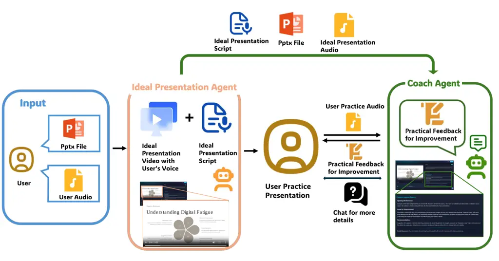
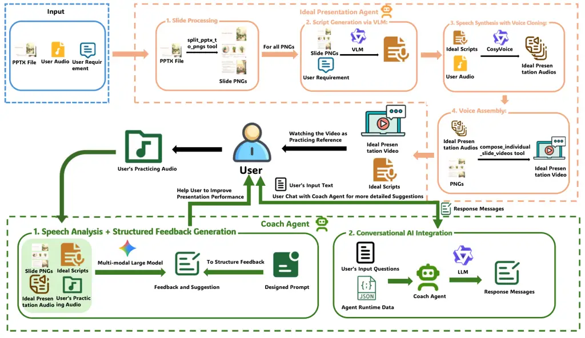
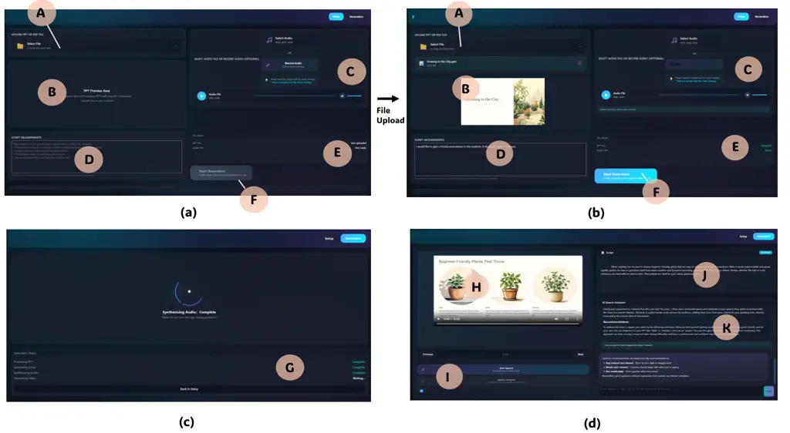
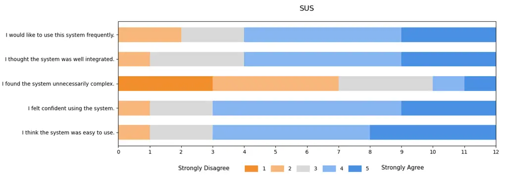
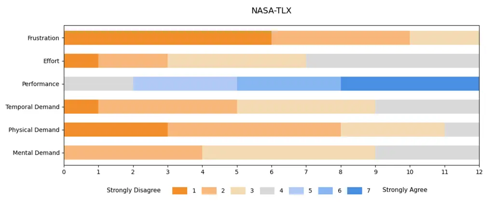
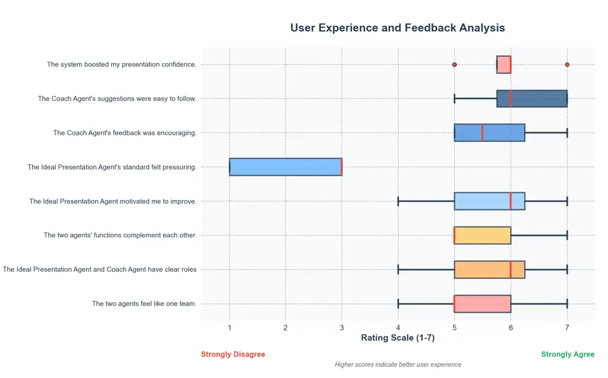

# PresentCoach: Dual-Agent Presentation Coaching through Exemplars and Interactive Feedback

DOI: [XXXXXXX.XXXXXXX](https://doi.org/XXXXXXX.XXXXXXX)Conference: ;
ISBN: ;CCS: Do Not Use This Code Generate the Correct Terms for Your
PaperCCS: Do Not Use This Code Generate the Correct Terms for Your
PaperCCS: Do Not Use This Code Generate the Correct Terms for Your
PaperCCS: Do Not Use This Code Generate the Correct Terms for Your Paper

Sirui Chen Note: Contributed equally to this research Affiliation: The
Hong Kong University of Science and Technology (Guangzhou), Guangzhou,
Guangdong, China email: <schen488@connect.hkust-gz.edu.cn> , Jinsong
Zhou Affiliation: The Hong Kong University of Science and Technology
(Guangzhou), Guangzhou, Guangdong, China email:
<jzhou945@connect.hkust-gz.edu.cn> , Xinli Xu Affiliation: The Hong Kong
University of Science and Technology (Guangzhou), Guangzhou, Guangdong,
China email: <xxu068@connect.hkust-gz.edu.cn> , Xiaoyu YANG
Affiliation: The Hong Kong University of Science and Technology
(Guangzhou), Guangzhou, Guangdong, China email:
<xyang058@connect.hkust-gz.edu.cn> , Litao Guo Affiliation: The Hong
Kong University of Science and Technology (Guangzhou), Guangzhou,
Guangdong, China email: <guolitauo@gmail.com> and Ying-Cong Chen
Note: Corresponding author Affiliation: The Hong Kong University of
Science and Technology (Guangzhou), Guangzhou, Guangdong, China email:
<yingcongchen@ust.hk>

2025

Figure 1. The Simple Workflow of our PresentCoach system. Initially, a
user provides a .pptx file and an audio sample. The Ideal Presentation
Agent processes these inputs to create a benchmark presentation,
complete with an ideal script and narration in the user’s voice. This
serves as a standard for the user to practice their delivery.
Subsequently, the user can submit their practice audio to the Coach
Agent for evaluation and feedback. A chat feature is also available for
in-depth discussion with the Coach Agent.

###### Abstract.

Effective presentation skills are essential in education, professional
communication, and public speaking, yet learners often lack access to
high-quality exemplars or personalized coaching. Existing AI tools
typically provide isolated functionalities—such as speech scoring or
script generation—without integrating reference modeling and interactive
feedback into a cohesive learning experience. We introduce a dual-agent
system that supports presentation practice through two complementary
roles: the Ideal Presentation Agent and the Coach Agent. The Ideal
Presentation Agent converts user-provided slides into model presentation
videos by combining slide processing, visual-language analysis,
narration script generation, personalized voice synthesis, and
synchronized video assembly. The Coach Agent then evaluates
user-recorded presentations against these exemplars, conducting
multimodal speech analysis and delivering structured feedback in an
Observation–Impact–Suggestion (OIS) format. To enhance the authenticity
of the learning experience, the Coach Agent incorporates an Audience
Agent, which simulates the perspective of a human listener and provides
humanized feedback reflecting audience reactions and engagement.
Together, these agents form a closed loop of observation, practice, and
feedback. Implemented on a robust backend with multi-model integration,
voice cloning, and error handling mechanisms, the system demonstrates
how AI-driven agents can provide engaging, human-centered, and scalable
support for presentation skill development in both educational and
professional contexts.

###### Keywords: 

AI coaching, presentation training, multimodal feedback, human–AI
interaction

## 1. Introduction

Effective presentation skills are essential for education,
communication, and career advancement(Živković, 2014; Bradbury, 2006).
As public speaking and digital presentations become integral to
professional and academic settings, there is growing interest in
intelligent systems that can assist users in improving delivery,
confidence, and clarity. Recent progress in speech analytics (Chu et
al., 2023; Radford et al., 2023), virtual tutors (Hu et al., 2024; Qian
et al., 2024), and multimodal AI (Achiam et al., 2023; Xu et al., 2025a;
Team, 2025a) has made it possible to analyze and even simulate human
presentation behavior. Despite these advances, effective presentation
training remains difficult to scale (Hoque et al., 2013). Traditional
approaches such as workshops, peer feedback, or personalized coaching
require substantial time, expertise, and cost (Wörtwein et al., 2015).
Commercial tools such as Yoodli (Yoodli, Inc., ) and Poised (Poised,
Inc., ) provide automated feedback but primarily focus on surface-level
metrics such as pacing, filler words, and prosody (Fung et al., 2015;
Hoque et al., 2013). These systems lack the pedagogical depth to support
deliberate practice, iterative reflection, and contextual understanding
of slide content (Chi, 2009).

Academic research has explored AI-based presentation training through
various modalities. Systems such as ROCSpeak (Fung et al., 2015) and
PresentationTrainer (Schneider et al., 2015) provide real-time prosody
or gesture feedback, while recent frameworks like PASS (Aggarwal and
Bhand, 2025) and PresentAgent (Shi et al., 2025) use large language
models to generate exemplar scripts or videos. These works represent
significant progress in automating aspects of presentation support.
However, most existing systems treat presentation learning as a one-shot
process that either generates exemplar content or scores delivery
performance without integrating both demonstration and feedback (Chinn
and Buckland, 2012). As a result, learners lack an explicit reference
for “what good looks like” and receive fragmented numerical metrics
rather than contextual and actionable guidance. In addition, current
systems seldom simulate audience perception (Bailenson, 2006), which is
an essential factor for effective communication and confidence building.

To address this challenge, we draw inspiration from how effective
speakers learn: study a strong exemplar, rehearse with intent, then
refine through targeted feedback. Humans excel at learning from
demonstration (Gaskins and Paradise, 2010) because clear exemplars
render tacit standards visible, accelerate calibration of tone, pacing,
and slide-speech alignment, and shorten the path to a first competent
draft. Complementing this, targeted feedback concentrates the search for
improvement by turning vague impressions into specific next steps,
clarifying what to change, why it matters, and how to do it, so
deliberate practice yields rapid, iterative gains.

In this work, we introduce PresentCoach, a dual-agent system for
presentation practice with two key innovations. First, the Ideal
Presentation Agent produces a slide-aware exemplar video for the user’s
own deck by interpreting visual content, drafting a concise narration,
cloning a consistent voice, and assembling synchronized slide–audio
segments. This makes “what good looks like” concrete and directly
comparable. Second, the Coach Agent provides structured, conversational
feedback using an Observation-Impact-Suggestion (OIS) scheme and an
integrated Audience Agent that translates analytics into humanized
listener reactions. Together, these components create a localized,
iterative learning loop in which learners observe a tailored exemplar,
rehearse targeted slides or segments, and refine delivery with
actionable, audience-aware guidance. A comparison between PresentCoach
and existing academic and commercial presentation coaching systems is
summarized in Table 1.

To evaluate these ideas, we conducted a controlled between-subjects user
study (N=24) comparing AI-assisted rehearsal (PresentCoach+PPT) with
self-directed slide practice (PPT-only). The study investigated both
affective and experiential outcomes in a realistic, time-constrained
rehearsal context. Our investigation was guided by three research
questions:

- •
  RQ1: Compared with PPT-only self-practice, does rehearsal with
  PresentCoach+PPT reduce public-speaking anxiety?
- •
  RQ2: While providing richer, feedback-intensive guidance, does
  PresentCoach+PPT maintain an acceptable cognitive workload and achieve
  satisfactory post-use usability?
- •
  RQ3: How do participants perceive and experience the collaboration
  between the Ideal Presentation Agent and the Coach Agent during
  rehearsal?

Quantitative results show that PresentCoach significantly increased
self-reported speaking confidence, as measured by the PRCS scale,
compared with the control group. NASA-TLX (Hart and Staveland, 1988)
ratings indicated that the system imposed only a moderate workload,
while SUS (Brooke and others, 1996) scores exceeded established
usability benchmarks. Participants also rated the collaboration between
the two agents positively, highlighting clear role differentiation,
complementary guidance, and motivational balance. Qualitative analyses
of post-session interviews further revealed that the integration of
exemplar modeling and feedback coaching created a psychologically safe
and motivating environment that encouraged deliberate practice and
reflection.

In summary, our contributions of this paper are three-fold:

- •
  We present PresentCoach, a dual-agent, end-to-end system for
  presentation training that operationalizes the _observation
  $`\rightarrow`$ practice $`\rightarrow`$ reflection_ cycle within a
  single interface.
- •
  The system features two complementary agents: an _Ideal Presentation
  Agent_ that generates slide-aware exemplar videos in the user’s cloned
  voice, and a _Coach Agent_ that provides structured feedback with an
  audience-aware mechanism simulating listener reactions.
- •
  A controlled study shows that PresentCoach reduces speaking anxiety,
  maintains moderate cognitive workload, and achieves high usability
  compared with self-practice. Participants perceived the two agents as
  distinct yet complementary—balancing motivation and guidance—and
  reported increased confidence and engagement through their
  interaction.

## 2. Related Work

|                                 |              |                          |                             |                     |
| ------------------------------- | ------------ | ------------------------ | --------------------------- | ------------------- |
| System                          | Input        | Exemplar                 | Feedback                    | Iterative           |
| Academic Systems                |              |                          |                             |                     |
| PASS (Aggarwal and Bhand, 2025) | Document     | ✓ (Script+Audio)         | ✗                           | ✗                   |
| PresentAgent (Shi et al., 2025) | Document     | ✓ (Video)                | ✗                           | ✗                   |
| Commercial Tools                |              |                          |                             |                     |
| Yoodli (Yoodli, Inc., )         | Audio/Video  | ✗                        | ✓ (Numeric Metrics)         | ✗                   |
| Poised (Poised, Inc., )         | Audio/Webcam | ✗                        | ✓ (Dashboard Feedback)      | ✗                   |
| Orai (Orai, Inc., )             | Audio/Webcam | ✗                        | ✓ (Voice & Gesture Metrics) | ✗                   |
| PresentCoach (Ours)             | Slides+Audio | ✓ (Slide-Aware Exemplar) | ✓ (OIS Structured)          | ✓ (Dual-Agent Loop) |

Table 1. Comparison of PresentCoach with existing presentation coaching
systems and commercial tools.

### 2.1. Automatic Generation of Presentation Content

Recent work has explored the automation of presentation creation through
multimodal large language models (LLMs) and vision–language systems.
Early research on AI-assisted presentation generation primarily focused
on producing concise slide decks from textual input. DOC2PPT (Fu et al., 2022) and SlideGen (Sefid et al., 2021) pioneered the document-to-slide
generation paradigm, automatically summarizing scientific or educational
texts into structured slide decks. Building on this foundation, later
systems such as PreGenie (Xu et al., 2025b) and PPTAgent (Zheng et al., 2025) leveraged multimodal LLMs to enhance visual design and semantic
coherence, employing iterative, agent-based refinement to improve layout
consistency and aesthetics.

More recent approaches move beyond static slide generation toward
end-to-end multimodal presentation synthesis. PresentAgent (Shi et al., 2025) introduced a comprehensive pipeline that transforms long-form
documents into narrated presentation videos by coordinating slide
composition, script generation, and audio–visual synchronization.
Likewise, PASS (Aggarwal and Bhand, 2025) demonstrated automatic
generation of both slides and corresponding spoken narration, realizing
the concept of a “talking presentation.” These developments mark a clear
shift from content summarization to expressive multimodal generation,
yet most systems still prioritize automation and aesthetics over
learning. In contrast, our approach emphasizes pedagogical value. We
generates a slide-aware exemplar in the user’s cloned voice to provide a
concrete, content-aligned demonstration of “what good looks like” for
the user’s own slides. This exemplar establishes a clear performance
target and serves as a consistent reference for subsequent practice.

### 2.2. AI Coaching for Presentation

AI-based presentation coaching has evolved from early acoustic
assessment systems to multimodal, dialogue-driven tutors that actively
support speaker reflection and refinement. Early research, such as ROC
Speak (Fung et al., 2015) and Presentation Trainer (Schneider et al.,
2015), provided prosodic and nonverbal feedback to improve pacing, tone,
and posture. Later systems integrated virtual audiences and immersive
environments, including Cicero (Batrinca et al., 2013) and the VR-based
study by Chollet et al. (Chollet et al., 2022), which compared real-time
and delayed feedback. Their findings highlighted that structured,
post-session feedback promotes reflection and long-term skill retention
more effectively than immediate alerts.

With advances in multimodal analysis and large language models, recent
approaches have shifted from quantitative scoring to qualitative,
formative guidance. For instance, AI Speech Coach (Wang et al., 2020)
and multimodal evaluation frameworks (Wörtwein et al., 2015; Wörtwein et
al., 2015) analyze gaze, prosody, and gesture to explain how delivery
affects perceived competence. Recent VR-based studies (Bachmann et al., 2023) further validate that simulated audiences and affective feedback
can enhance user engagement and confidence. Commercial platforms such as
Yoodli, Orai, and Poised (Yoodli, Inc., ; Orai, Inc., ; Poised, Inc., )
extend these ideas to real-world applications, offering instant metrics
on pacing, filler words, and confidence. However, their feedback remains
largely decontextualized from slide semantics and audience perception,
limiting pedagogical depth.

In contrast, our Coach Agent reframes AI coaching as an
exemplar-grounded, iterative learning process. Rather than providing
isolated metrics, it analyzes user performance relative to the
slide-aware exemplar and delivers multimodal, audience-aware feedback in
a structured Observation–Impact–Suggestion (OIS) format. This design
bridges analytic precision with human interpretability, helping speakers
understand not only what to improve, but also why and how, thereby
transforming presentation coaching from evaluation into guided
reflection.

## 3. PresentCoach System

### 3.1. System Overview

Our system facilitates public speaking practice through AI-powered
coaching and the generation of personalized model presentations. It is
composed of two primary intelligent agents: the Ideal Presentation Agent
and the Coach Agent, as depicted in Figure 2. The core of our approach
is trying to offering a highly personalized and immersive learning
experience that offers both example and guidance of practicing
presentation. The Ideal Presentation Agent generates a ideal
presentation video delivered in the user’s own cloned voice. By
observing this ideal presentation video, users can more effectively
identify areas for improvement. The Coach Agent then analyzes the user’s
own practice recordings against this ideal model, providing targeted
feedback to close the loop for accelerated skill development. The
overall workflow and interaction between these agents are illustrated in
Figure 2.

Figure 2. The end-to-end workflow of the PresentCoach system. The Ideal
Presentation Agent (top) processes user inputs through a four-stage
pipeline: (1) Slide Processing - converting .pptx to high-resolution
PNGs; (2) Script Generation - employing a Visual Language Model (VLM) to
create coherent narration scripts; (3) Speech Synthesis - utilizing
personalized voice cloning for speech generation; and (4) Video
Assembly - synchronizing slides and audio into a benchmark presentation.
The Coach Agent (bottom) then evaluates user practice through: (i)
Multi-modal Speech Analysis comparing user performance against the ideal
benchmark; (ii) Structured Feedback Generation delivering OIS-formatted
suggestions; and (iii) Conversational AI Integration enabling
interactive coaching via conversational agents.

### 3.2. Ideal Presentation Agent

The Ideal Presentation Agent is designed to automatically generate a
polished, model presentation video from a standard slide deck. The input
includes three parts: 1. the pptx file, 2. the user’s voice, and 3. the
user’s requirement prompt. Its workflow is executed in four distinct
stages:

1.  (1)
    Slide Processing: The agent begins by processing the uploaded
    PowerPoint files. Each slide is converted into a high-resolution PNG
    image using the split_pptx_to_pngs tool. This conversion ensures
    visual fidelity, laying a high-quality foundation for all subsequent
    stages.
2.  (2)
    Script Generation via Visual Language Model (VLM): The next stage
    involves generating a narration script for each slide. A Visual
    Language Model (VLM) analyzes the generated slide images,
    interpreting the text, images, and layout to understand the core
    message. The model synthesizes a coherent English narration script
    (60-100 words per slide), ensuring smooth transitions between
    slides. The specific VLM model used here is designed to consider
    both the user’s prompt and a default set of instructions to create
    contextually accurate scripts.
3.  (3)
    Speech Synthesis with Voice Cloning: The generated narration scripts
    are then converted into high-quality spoken audio. This step uses a
    voice cloning model to replicate the user’s voice, based on a short
    voice sample (standardized prompt: "This is a sample text for voice
    cloning"). In case the voice cloning process fails or is
    unavailable, the system falls back on a standard text-to-speech
    (TTS) model to ensure continuous operation. Audio formats are
    automatically converted (e.g., WebM/M4A to WAV), and batch
    processing is used for optimized throughput.
4.  (4)
    Video Assembly: In the final stage, the agent assembles the video.
    The high-resolution slide images are synchronized with the
    corresponding synthesized audio segments using FFmpeg. A custom
    tool, compose_individual_slide_videos, coordinates this process,
    creating a polished video that serves as the ideal model
    presentation for comparison and user coaching.

### 3.3. Coach Agent

The Coach Agent is designed to help users refine their public speaking
skills by providing detailed, personalized feedback on their practice
sessions. It employs a comprehensive evaluation and interaction
pipeline:

1.  (1)
    Speech Analysis: The agent evaluates a user’s practice recording by
    conducting a multi-modal analysis. This analysis holistically
    assesses performance by integrating four key data sources: (1) the
    relevant slide image, (2) the ideal narration script, (3) the
    AI-generated ideal audio, and (4) the user’s own recorded audio.
    Comparing the user’s delivery against the ideal benchmark enables
    the generation of targeted and constructive feedback.

    Audience-Aware Feedback. While the agent analysis the speech in a
    professional way, it would analysis the same speech in another way-
    the audience. It would simulate audience reactions by analyzing the
    speech audio to predict engagement and comprehension for a specific
    audience profile. Insights regarding content clarity and potential
    points of confusion are integrated into the coaching process. By
    synthesizing these multiple perspectives—on delivery technique from
    the Coach and on content reception from the Audience—the system
    provides the user with more comprehensive and well-rounded guidance
    for improvement.

2.  (2)
    Structured Feedback Generation: In order to give users more
    acceptable suggestions, the feedbacks would be delivered in a
    structured, actionable format. It begins with Sincere Encouragement,
    which identifies and reinforces specific strengths in the user’s
    performance. This is followed by OIS Feedback, a concise (under 150
    words) framework that provides a clear Observation of an area for
    improvement, explains its Impact on the presentation, and offers a
    concrete Suggestion for refinement.
3.  (3)
    Conversational AI Integration: To facilitate deeper learning, the
    agent features a conversational coaching interface powered by Large
    Language Model. This interface allows users to engage in an
    interactive dialogue to explore their performance and feedback. By
    analyzing the complete session history—including previous analyses
    and chat logs—as input, the LLM generates highly relevant and
    contextual suggestions. This process enables a truly personalized
    coaching experience, with guidance that builds upon the user’s past
    interactions and progress.

### 3.4. Implementation Details

Our system’s implementation is built upon a robust multi-model
framework. The specific model selections for each agent are detailed
below.

#### 3.4.1. Ideal Presentation Agent

This agent’s pipeline begins with slide analysis. We employ
Qwen2.5-VL(Team, 2025b) as the primary Visual Language Model (VLM) to
interpret slide content and generate coherent narration scripts. For the
critical voice cloning and synthesis stage, CosyVoice2(Du et al., 2024)
serves as our core model, producing personalized speech output.

#### 3.4.2. Coach Agent

The Coach Agent requires sophisticated multi-modal understanding and
natural interaction. For this, we leverage Gemini 2.5 Pro(Team, 2025a)
as the primary Multi-modal Large Model (MLLM) to analyze user video
recordings. The interactive dialogue with the user is powered by
Qwen2.5(Team, 2024) as the primary Large Language Model (LLM).

The overall system architecture is engineered for robustness,
incorporating multiple fallback mechanisms and comprehensive error
handling. This design ensures reliable, high-quality output suitable for
production deployment.

## 4. User friendly Interface

Our system is accessed through a sophisticated yet intuitive web-based
interface, engineered according to foundational principles of
Human-Computer Interaction (HCI) and user-centric design. The interface
architecture is predicated on the concept of progressive disclosure, a
methodology employed to mitigate cognitive load by presenting only
essential information and actions at each step. This design organizes
the system’s complex AI-driven functionalities into a structured,
three-stage workflow. This sequential paradigm is intentionally crafted
to align with the user’s established mental model of presentation
development: from initial preparation and content generation to final
practice and refinement, ensuring a seamless and comprehensible user
experience.

Figure 3. (a) and (b) illustrate the Setup and Configuration stage
(Stage 1), where users: A. Upload presentation files; B. Preview slide
content; C. Record or upload a voice sample for cloning; D. Specify
presentation requirements; E. View file upload status; F. Initiate
generation. (c) visualizes the transparent pipeline of the Ideal
Presentation Agent during generation (Stage 2), displaying real-time
progress across key steps. (d) presents the Interactive Coaching and
Practice Environment (Stage 3), which includes: H. The AI-generated
ideal presentation video; I. Recording/upload controls for user
practice; J. The corresponding script of the ideal narration; K. The
conversational Coach Agent interface, providing structured feedback and
interactive Q&A.

### 4.1. Three-Stage User Journey

The entire user experience is structured as a guided journey through
three distinct stages. This scaffolded approach demystifies the AI
coaching process, providing a clear, linear path from initial input to
actionable feedback and skill development.

Stage 1: Setup and Configuration serves as the initialization phase,
focusing on content ingestion and the customize the prompt. In this
stage, users are prompted to upload their presentation files (e.g.,
PowerPoint), which form the core content for analysis. The interface
then would ask users to define the presentation’s user prompt, such as
the intended audience (e.g., to specialist, or non-specialist) and the
objective(eg. English course presentation).Another key feature of this
stage is the option for voice cloning, where users can provide a short
audio sample. This input is used to personalize the synthesized speech
in the model presentation. The underlying design philosophy of this
stage is to abstract the complexity of AI model configuration into a
user-friendly, form-based interaction. By providing contextual tooltips
and examples, the interface guides users on how to provide optimal
inputs, thereby transforming a potentially technical setup process into
an accessible and straightforward exercise.

Stage 2: Transparent Ideal Presentation Agent Generation Process
addresses a common source of user anxiety—the opaque nature of AI
computation, often referred to as the “black box” problem. Following the
configuration stage, the system invokes the Ideal Presentation Agent to
automatically generate a model presentation video. During this phase,
the user’s role transitions from active interaction to informed
observation, while engagement is maintained through a transparent and
informative visualization of system progress. Rather than presenting a
generic loading bar, the interface employs a dynamic, multi-step
progress indicator. Each step (e.g., “Parsing slide content,”
“Generating narration script,” “Synthesizing audio track,” “Assembling
video”) is explicitly labeled and visually updated upon completion. This
design provides continuous system feedback that not only reassures users
of correct system operation but also serves an educational function by
revealing the key processes involved in generating the model
presentation. Such transparency enhances user trust and deepens
understanding of the AI’s workflow.

Stage 3: Interactive Coaching and Practice Environment represents the
core learning phase and the central locus of human–AI collaboration. In
this stage, users first review the AI-generated model presentation
video, which is generated by the Ideal Presentation Agent in the stage 2
with integrates synchronized slide’s narration. They can then record
their own practice sessions within the same interface. After recording
the audio of practicing presentation, the system subsequently invokes
the Coaching Agent to conduct a direct comparative analysis, enabling
users to evaluate their performance against the AI-generated benchmark.
The focal component of this stage is the conversational AI coach, which
provides structured and personalized feedback. Through a text-based
dialogue, users can explore specific feedback points, request
clarification, and receive further guidance—fostering an iterative cycle
of practice, reflection, and refinement. This interactive feedback
mechanism transforms practice from a static activity into an adaptive
and pedagogically grounded learning experience.

### 4.2. Key Design Concepts

The user interface integrates several design innovations specifically
tailored to create an effective and supportive environment for
presentation skill enhancement.

User friendly Architecture ensures that the interface remains
uncluttered and task-focused. It employs a state-aware design where UI
elements dynamically adapt based on the user’s progress and the system’s
current state. For example, irrelevant controls are invisible. There are
three stages in the progress, and only the corresponding tools would be
shown in each stage. This design allows there would not be too much UI
elements in one page, which prevents cognitive overload.

Multi-Modal Learning Support is a core pedagogical feature of the
interface, designed to accommodate a diverse range of learning styles
and preferences. This is achieved by presenting information and
facilitating interaction through multiple channels:

- •
  Visual Learners are supported through the video presentation format,
  side-by-side slide navigation, and visual cues within the feedback.
- •
  Auditory Learners can focus on the AI-generated narration and utilize
  the audio recording and playback functionalities to analyze their own
  vocal delivery.
- •
  Interactive/Kinesthetic Learners benefit most from the conversational,
  chat-based coaching module, which allows them to actively engage with
  and probe the AI for deeper understanding.
- •
  Reading/Writing Learners can access and analyze the generated text
  scripts and the written feedback provided by the coach.

This multi-modal approach enhances learning efficacy and makes the
platform more inclusive and accessible.

Intelligent Guidance is seamlessly integrated throughout the interface
via contextual tooltips, state-aware controls, and progressive feature
disclosure. In alignment with HCI principles of minimizing cognitive
load, information and controls are contextually presented according to
the user’s current workflow stage. A three-stage progress indicator
visually anchors users within the overall process, while interface
elements dynamically adapt to display only task-relevant actions. Each
interactive component—ranging from voice cloning to feedback review—is
accompanied by concise, on-demand explanatory text, ensuring
discoverability while maintaining a clean, uncluttered interface.

### 4.3. Learning-Focused Design

The interface conceptualizes presentation practice as a structured
learning cycle grounded in three core pedagogical components. First, the
comparative analysis framework enables side-by-side evaluation of user
practice recordings against AI-generated exemplar presentations,
rendering performance gaps both visible and measurable. Second, the
conversational coaching agent provides personalized, OIS-formatted
feedback (Observation–Impact–Suggestion) and maintains an interactive
dialogue history to support longitudinal progress tracking. Third, the
multi-modal learning support accommodates diverse learner preferences
through synchronized video demonstrations, textual scripts, audio-based
practice, and interactive QA modules. This integrated design fosters
metacognitive engagement by guiding users to identify areas for
improvement, understand the principles underlying effective presentation
delivery, and monitor progress across iterative practice sessions.
Rather than merely automating presentation production, the system aims
to cultivate transferable presentation skills through scaffolded
practice and explanatory, data-informed feedback.

## 5. User Study

We conducted a controlled user study to evaluate whether our Dual-Agent
System with presentation slides (PresentCoach+PPT) yields measurable
benefits over a realistic baseline that relies solely on slides
(PPT-only). The study examined both affective and experiential outcomes
under conditions closely mirroring authentic short-presentation
rehearsal. By situating the evaluation in a realistic but controlled
environment, we aimed to assess how intelligent dual-agent coaching can
enhance presentation preparation compared with self-directed practice.

### 5.1. Participants

We aimed to evaluate how non-native English speakers engage with our
Dual-Agent Rehearsal System with slides (PresentCoach+PPT). We recruited
24 participants (10 female, 14 male; age range: 19–25,
$`M_{age}=22.38`$, $`SD=1.97`$) from the same university. All were
native Mandarin speakers who used English as a second language (L2) for
academic or professional presentations. Participants’ self-reported
IELTS speaking scores ranged from 6.0 to 6.5 ($`M=6.29`$, $`SD=0.25`$),
indicating competent but non-fluent proficiency. This homogeneous
linguistic background ensured comparability while representing the
target population of PresentCoach users. Detailed demographic
information for all participants is provided in the Appendix  (Table ).

### 5.2. Task Design

The study employed a standardized English presentation rehearsal task
designed to induce a moderate yet realistic level of public-speaking
anxiety. This design allowed us to examine whether PresentCoach could
effectively reduce presentation-related anxiety compared with
self-directed rehearsal. The task simulated a typical short-presentation
scenario that university students and early-career professionals often
encounter. All aspects of materials, timing, and evaluation were
standardized to ensure that any observed effects were primarily due to
the rehearsal condition.

##### Materials.

A pool of eight neutral, informational English topics was prepared, each
accompanied by a three-slide PowerPoint deck and concise bullet-point
notes outlining key ideas (e.g., “The Pyramid Principle of Healthy
Eating” and “Five Strategies for Effective Time Management”). For each
participant, two distinct topics were randomly selected: one for the
Pre-test and another for the Post-test. Using different topics helped to
avoid learning effects that commonly occur in repeated-measures designs,
ensuring that changes in anxiety reflected the rehearsal condition
rather than topic familiarity. Participants were instructed not to use
scripts, teleprompters, or online resources, maintaining the
authenticity of their delivery. Each presentation lasted three minutes,
long enough to engage attention and self-awareness but short enough to
avoid fatigue or memorization.

##### Task Objective.

The primary goal of the task was to measure whether rehearsal with
PresentCoach could reduce self-perceived anxiety during speech delivery.
The three-minute format was chosen to balance realism and
controllability, allowing for clear measurement of changes in confidence
and composure between pre-test and post-test sessions.

### 5.3. Procedure

Each experimental session lasted approximately 70 to 75 minutes and
followed a consistent three-phase sequence. At the beginning,
participants provided informed consent, completed a short demographic
questionnaire, and received an explanation of the study procedure.

(1) Pre-test: Participants reviewed their assigned slides for two
minutes and then delivered a three-minute English presentation. This
performance served as the baseline measurement of self-perceived
anxiety.

(2) Rehearsal Phase: Participants rehearsed according to their assigned
condition. Those in Group A (PresentCoach+PPT) received a five-minute
introduction and practiced for twenty minutes with PresentCoach, which
provided dual-agent modeling and feedback designed to encourage
reflection and confidence building. Those in Group B (PPT-only)
rehearsed independently for the same duration with identical slides and
notes but without any AI assistance. The post-test topic was
predetermined to ensure comparability and to avoid repetition across
sessions.

(3) Post-test and Debriefing: Immediately after the rehearsal,
participants delivered a new three-minute presentation using the
assigned post-test slides. This second performance captured the
post-rehearsal state and allowed for a direct comparison with baseline
measures. Following the post-test, participants completed the
questionnaires and took part in a short semi-structured interview
reflecting on their rehearsal experiences, changes in confidence or
anxiety, and perceptions of usability and engagement.

All sessions were conducted in a quiet laboratory setting, using
identical recording equipment and seating arrangements. Participants
were reminded not to access external aids during the task. The procedure
ensured both ecological realism and experimental control, supporting a
fair comparison between AI-assisted and self-directed rehearsal.

### 5.4. Measurement

##### RQ1: Reduction of Public-Speaking Anxiety.

Speaking confidence and anxiety were measured using the Personal Report
of Confidence as a Speaker (PRCS) (Paul, 1966), administered before and
after the experiment to capture pre–post changes. This measure provided
the primary quantitative indicator for evaluating whether PresentCoach
effectively reduced self-reported anxiety during presentation rehearsal.

##### RQ2: Cognitive Workload and System Usability.

After completing the post-test, participants completed two standardized
instruments. The NASA Task Load Index (NASA-TLX) (Hart and Staveland, 1988) assessed perceived workload across six dimensions: mental demand,
physical demand, temporal demand, performance, effort, and frustration.
Each item was rated on a 7-point Likert scale. In addition, a five-item
subset of the System Usability Scale (SUS) (Brooke and others, 1996)
evaluated usability and overall interaction fluency on a 5-point Likert
scale. Together, these measures assessed whether PresentCoach maintained
a cognitively manageable workload and satisfactory usability during
practice.

##### RQ3: Perceived Dual-Agent Interaction.

To explore how users perceived the collaboration between the two agents,
we designed a custom eight-item, 7-point Likert questionnaire. The items
assessed perceived role complementarity, motivational influence, and
feedback clarity. Participants also took part in short semi-structured
interviews, which provided qualitative insights into their interaction
experience, emotional responses, and learning processes. These
qualitative findings complemented the quantitative data by clarifying
how users interpreted and experienced the distinct functions of the two
agents.

##### Statistical Analysis.

All quantitative analyses were conducted to evaluate changes in user
public-speaking anxiety and to summarize perceived workload, usability,
and interaction experience. For PRCS scores, distributional assumptions
were examined using the Shapiro–Wilk test (Shapiro and Wilk, 1965). When
normality was not supported, the Wilcoxon signed-rank test (Wilcoxon, 1945) was used to assess pre–post differences within each group. For the
NASA-TLX and SUS measures, descriptive statistics (means and standard
deviations) were reported to illustrate that the system maintained
acceptable levels of cognitive demand and usability. Responses from the
dual-agent experience questionnaire were analyzed descriptively to
highlight central tendencies and patterns. No multiple-comparison
correction was applied, as inferential testing was limited to the PRCS
measure.

## 6. Findings

This section presents the main findings of our study, organized
according to the three research questions. Quantitative analyzes address
the measured changes in speaking confidence, perceived workload, and
usability, followed by qualitative insights that explain participants’
perceptions of the dual-agent interaction. All results are reported as
mean $`\pm`$ SD, and inferential statistics were applied only to the
PRCS data.

### 6.1. Quantitative Results

#### 6.1.1. RQ1: Reduction of Public-Speaking Anxiety

We first examined whether rehearsal with PresentCoach+PPT reduced
public-speaking anxiety compared with PPT-only self-practice.
Participants’ PRCS scores showed clear improvement following dual-agent
rehearsal. In the PPT-only group. Wilcoxon signed-rank tests confirmed
that the pre–post improvement was statistically significant in the
PresentCoach+PPT group ($`p=.016`$) but not in the PPT-only group
($`p=.219`$). Between-group comparison at post-test further revealed
that the PresentCoach+PPT group reported significantly higher confidence
than the PPT-only group ($`t(22)=2.83`$, $`p=0.014`$). Table 2
summarizes the full results.

These results suggest that PresentCoach’s feedback and guided rehearsal
contributed to a measurable reduction in anxiety and higher
self-reported confidence. Several participants also noted in written
comments that the session felt “less intimidating” and “more focused,”
attributing their confidence gains to the system’s structured,
constructive feedback process.

| Measure | Group            | Pre-test (M±SD) | Post-test (M±SD) | $`\Delta`$ (%) | $`p_{\text{within}}`$ | $`t_{\text{post}}`$ | $`p_{\text{post}}`$ |
| ------- | ---------------- | --------------- | ---------------- | -------------- | --------------------- | ------------------- | ------------------- |
| PRCS    | PresentCoach+PPT | 3.69 ± 0.81     | 5.03 ± 0.63      | +36.3%         | 0.016                 | 2.83                | 0.014               |
|         | PPT-Only         | 3.18 ± 0.65     | 3.69 ± 1.17      | +16.1%         | 0.219                 |                     |                     |

Note. $`\Delta`$ (%) represents the percentage change in the group-level
mean PRCS score from pre-test to post-test, calculated as
$`\Delta=\frac{(\textit{Mean}_{\text{Post}}-\textit{Mean}_{\text{Pre}})}{\textit{Mean}_{\text{Pre}}}\times 100`$.
A positive $`\Delta`$ indicates an increase in mean self-confidence and
a corresponding reduction in speaking anxiety. $`p_{\text{within}}`$
values were obtained using Wilcoxon signed-rank tests comparing pre- and
post-test scores within each group. $`t_{\text{post}}`$ and
$`p_{\text{post}}`$ denote independent-sample $`t`$-test statistics
comparing the two groups at post-test.

Table 2. Within- and between-group comparisons of PRCS scores (5-point
Likert). Wilcoxon signed-rank tests assess pre–post changes within each
group; independent-sample $`t`$-tests compare groups at post-test.

#### 6.1.2. RQ2: Cognitive Workload and System Usability

We next analyzed whether the feedback-rich interaction in PresentCoach
maintained an acceptable cognitive workload and provided a satisfactory
usability experience. Post-test ratings on the NASA-TLX (Figure 5)
indicated moderate overall workload ($`M=2.9`$, $`SD=0.8`$ on a 7-point
scale), below levels typically associated with cognitive overload.
Mental Demand and Effort received the highest subscale scores,
reflecting the active engagement required to process and apply feedback,
while Physical Demand and Frustration remained low. These results
suggest that participants experienced PresentCoach as cognitively
demanding but manageable, consistent with a productive learning effort.

Usability scores on the five-item SUS subset (Figure 4) were high
($`M=4.1`$, $`SD=0.5`$ on a 5-point scale), exceeding conventional
benchmarks for satisfactory usability. Participants described the
interface as coherent and the conversational flow as natural, reporting
that the transitions between the two agents became intuitive after
minimal familiarization. Open-ended remarks highlighted the clarity of
the Coach Agent’s feedback and the motivating tone of the Ideal
Presentation Agent as the main contributors to ease of use. Overall,
these results show that PresentCoach successfully balanced feedback
complexity with interface simplicity.

Figure 4. Participants’ usability ratings for the PresentCoach system on
a 5-point Likert scale. Each item reflects an aspect of perceived ease
of use, integration, and confidence. Overall responses indicate that
participants found the system intuitive and well integrated after brief
familiarization.

Figure 5. Perceived cognitive workload across six NASA-TLX dimensions
(Mental, Physical, and Temporal Demand, Performance, Effort, and
Frustration). Ratings were given on a 7-point scale, showing that most
participants experienced the task as cognitively engaging but not
overwhelming.

#### 6.1.3. RQ3: Perceived Dual-Agent Experience

To further examine how participants perceived the interaction between
the two agents, we analyzed responses to the seven-item, 7-point Likert
questionnaire on dual-agent collaboration (Figure 6). Participants
clearly distinguished the roles of the Ideal Presentation Agent and the
Coach Agent while perceiving them as complementary. Items such as “I can
clearly distinguish the two agents’ roles” ($`M=6.3`$, $`SD=0.6`$) and
“The two agents complemented each other” ($`M=6.1`$, $`SD=0.7`$)
received the highest ratings. Feedback-related statements also scored
positively: “The Coach Agent’s feedback was clear and specific”
($`M=5.8`$, $`SD=0.8`$) and “The feedback helped me identify how to
improve my presentation” ($`M=6.0`$, $`SD=0.6`$). Only a few
participants reported mild pressure when comparing themselves to the
Ideal Agent ($`M=3.4`$, $`SD=1.1`$), although most interpreted this as
motivational rather than discouraging. These findings suggest that
participants not only understood the functional distinction between the
two agents but also viewed their interplay as a coherent, supportive
process for self-improvement.

Figure 6. Participants’ evaluations of the dual-agent interaction on a
7-point Likert scale. Responses show that users clearly distinguished
the roles of the Ideal Presentation Agent and the Coach Agent, perceived
their collaboration as complementary, and regarded the overall
experience as motivating and supportive.

### 6.2. Qualitative Results

To deepen our understanding of how participants experienced the
dual-agent rehearsal, we analyzed semi-structured interviews conducted
after the post-test. Each session lasted about 10 to 15 minutes and
explored how participants interpreted the agents’ roles, how they used
feedback during rehearsal, and how these experiences shaped their
confidence and engagement. The interviews were conducted in Chinese and
later translated into English. Two bilingual authors independently
translated and cross-checked the transcripts to ensure the accuracy of
quoted expressions. Transcripts were coded inductively to identify
recurring patterns.

#### 6.2.1. Perception of the Ideal Presentation Agent

Participants generally described the Ideal Presentation Agent as a
motivating reference rather than a source of pressure. Seeing an “ideal
version" of themselves perform confidently helped establish a tangible
target and reinforced their belief that improvement was achievable. One
participant noted, “English isn’t my first language, so I often hesitate
or stumble when speaking. But hearing my own voice deliver a speech
fluently, with a clear accent and emotional tone, was fascinating…it
made me feel that kind of expressiveness was truly within reach" (P02).
Another shared, “You reproduced my voice really well. When I first heard
it, I was a bit surprised…the English and pronunciation sounded so
natural that I almost thought it was a real speech I had given before."
(P07). Several participants (N=8) mentioned revisiting short segments of
the video before practice to recall phrasing or pacing patterns, and
even to imitate the tone and emotional expression in the voice,
suggesting that the model provided both cognitive and emotional
guidance.

#### 6.2.2. Perception of the Coach Agent

The Coach Agent was consistently perceived as a constructive, empathetic
listener who offered clear and actionable feedback. Participants valued
its specific advice on timing, pauses, and filler-word reduction, often
describing it as “accurate but not harsh." One participant explained,
“Its feedback was professional and kind. I never ask my classmates to
rehearse with me or give feedback on my speech because I’m afraid they
might laugh at my English pronunciation…but with the AI, I didn’t feel
that way." (P04). Another remarked, “I felt it was like both a teacher
and an audience. When the agent started listening, I wanted to take the
practice more seriously, as if someone was really there. Before, when I
practiced alone, I just memorized my script and didn’t think much about
pauses or emotions, but with the agent, each practice felt like a
rehearsal." (P09). The system’s supportive tone encouraged
self-reflection and experimentation rather than defensiveness, enabling
participants to internalize feedback as useful guidance.

#### 6.2.3. Synergy Between the Two Agents

A recurring theme across interviews was the perceived complementarity
between the two agents. Participants explained that the Ideal Agent
provided a concrete model of effective delivery, while the Coach Agent
contextualized that model by identifying personal gaps. Many (N=10) said
that feedback became clearer after recalling how the Ideal Agent handled
similar phrases or moments. As one participant summarized, “If there
were only the ideal agent, my practice might still lack professional
feedback. On the other hand, if there were only the coach agent, I might
not have a clear reference to follow. It could give advice, but I still
wouldn’t know exactly how to practice. So I think both agents are really
important.” (P03). Another commented, “It’s like seeing what good looks
like, then learning how to reach it" (P05). This dynamic interaction
between demonstration and feedback was widely recognized as a defining
strength of the system.

#### 6.2.4. Summary

Overall, participants viewed the dual-agent design as a balanced and
supportive rehearsal structure: one agent inspired motivation through
ideal modeling, and the other offered empathetic, targeted feedback.
This combination fostered emotional safety and sustained engagement,
helping participants approach practice with confidence and curiosity.
The qualitative findings thus help explain the anxiety reduction and
positive user experience observed in the quantitative results.

## 7. Discussion

This discussion section synthesizes the implications of our findings.
First, we elucidate the psychological mechanisms through which our
system enhances learner motivation and self-confidence, positioning its
contribution relative to prior work. Subsequently, we reflect on the
limitations of the current study and the broader pedagogical
considerations, which also serve to outline promising avenues for future
research.

### 7.1. The Motivational Role of the Ideal Agent

Our findings demonstrate that the Ideal Agent substantially enhances
learners’ presentation motivation and self-confidence through two core
psychological mechanisms. In contrast to prior systems which offer only
isolated metrics, our solution moves beyond this limitation by analyzing
the user’s presentation performance in the context of the slides and
delivering dynamic, multimodal feedback. First, hearing one’s own cloned
voice creates a stronger sense of self-identification and psychological
proximity compared to external exemplars, making the target performance
feel personally attainable rather than abstract. Second, the agent
transforms vague presentation goals into concrete, visualized models,
reducing the cognitive load associated with skill acquisition and
increasing self-efficacy. This aligns with recent voice-based learning
research(Wang et al., 2020) demonstrating the motivational advantages of
self-referential auditory stimuli. The voice-based implementation
establishes a foundation for multi-modal extension—future iterations
could generate ideal avatars modeling body language and eye contact,
providing learners with a comprehensive "ideal self" to emulate across
communication channels.

### 7.2. Limitation

While our dual-agent system demonstrates promising results in
presentation skill development, several limitations merit consideration.

Evaluation Scope: Our user study focused on short-form presentations (3
minutes) with standardized slide decks among L2 English speakers with
specific proficiency profiles. The generalizability of our findings to
longer, more complex presentations, native speakers, or different
language pairs remains to be established. Furthermore, the study
duration was insufficient to assess long-term skill retention and
transfer to real-world presentation contexts.

Pedagogical Considerations: While the feedback provided in this study
offers valuable, data-driven guidance, it is important to note that our
current analysis is based solely on the user’s speech. This means that
crucial elements of live presentations, such as body language, eye
contact, and audience engagement, fall outside the scope of the current
system’s analysis. Integrating these multimodal cues constitutes a vital
direction for our future research.

### 7.3. Future Work

Future Directions:

Our findings indicate that the Coach agent not only provides
instructional feedback but also functions as a responsive audience,
thereby enriching the practice experience. Building on this dual role,
we plan to enhance the agent’s realism by introducing interactive
virtual audiences capable of reactive behaviors during presentations,
such as responsive nodding and eye contact tracking. These features are
designed to foster a more empathetic and engaged virtual environment,
with the specific goal of improving users’ visual engagement and
boosting their self-confidence in public speaking. What’s more, future
iterations could generate idealized avatars that model appropriate body
language and eye contact, providing learners with a comprehensive "ideal
self" to emulate across multiple communication channels.

We also plan to personalize feedback even further by adapting the
agent’s responses to each user’s individual progress and challenges.
This would allow for more tailored goal-setting and guidance. Another
exciting direction involves preparing users for a variety of real-world
communication scenarios by introducing cross-cultural presentation
styles. Long-term, we want to track users’ progress over time, providing
insights into their growth and skill development.

Lastly, we’re focused on improving the system’s efficiency through
techniques like model distillation, which will enhance performance and
accessibility, especially as we scale the system to support more
learners.

## 8. Conclusion

This paper introduced a dual-agent system that addresses a key
limitation in automated presentation training: the disconnect between
abstract evaluation and concrete improvement. Our core contribution lies
in synergizing an Ideal Presentation Agent, which generates a
slide-aware, personalized presentation example video using the learner’s
own voice, with an interactive Coach Agent that provides context-aware
feedback. This approach moves beyond isolated metrics by offering a
tangible target performance and explanatory guidance, which our study
confirms significantly enhances learners’ delivery and self-confidence.
By successfully bridging demonstration with dialogue, our work
establishes a new paradigm for AI systems that not only assess but also
holistically coach complex presentation skills.

## References

- Achiam et al. (2023) J. Achiam, S. Adler, S. Agarwal, L. Ahmad, I.
  Akkaya, F. L. Aleman, D. Almeida, J. Altenschmidt, S. Altman, S.
  Anadkat, et al. Gpt-4 technical report. arXiv preprint
  arXiv:2303.08774. Cited by: §1.
- Aggarwal and Bhand (2025) T. Aggarwal and A. Bhand PASS: presentation
  automation for slide generation and speech. arXiv preprint
  arXiv:2501.06497. External Links: 2501.06497,
  [Link](https://arxiv.org/abs/2501.06497) Cited by: §1, §2.1, Table 1.
- Bachmann et al. (2023) M. Bachmann, A. Subramaniam, J. Born, and D.
  Weibel Virtual reality public speaking training: effectiveness and
  user technology acceptance. Frontiers in virtual reality 4,
  pp. 1242544. Cited by: §2.2.
- Bailenson (2006) J. N. Bailenson Transformed social interaction in
  collaborative virtual environments. Digital media: Transformations in
  human communication, pp. 255–264. Cited by: §1.
- Batrinca et al. (2013) L. Batrinca, G. Stratou, A. Shapiro, L.
  Morency, and S. Scherer Cicero-towards a multimodal virtual audience
  platform for public speaking training. In International workshop on
  intelligent virtual agents, pp. 116–128. Cited by: §2.2.
- Bradbury (2006) A. Bradbury Successful presentation skills. Vol. 111,
  Kogan Page Publishers. Cited by: §1.
- Brooke et al. (1996) J. Brooke et al. SUS-a quick and dirty usability
  scale. Usability evaluation in industry 189 (194), pp. 4–7. Cited by:
  §1, §5.4.
- Chi (2009) M. Chi Active-constructive-interactive: a conceptual
  framework for differentiating learning activities. topics in cognitive
  science, 1 (1), 73–105. Cited by: §1.
- Chinn and Buckland (2012) C. A. Chinn and L. A. Buckland Model-based
  instruction. Evolution challenges: Integrating research and practice
  in teaching and learning about evolution 211. Cited by: §1.
- Chollet et al. (2022) M. Chollet, S. Marsella, and S. Scherer Training
  public speaking with virtual social interactions: effectiveness of
  real-time feedback and delayed feedback. Journal on Multimodal User
  Interfaces 16 (1), pp. 17–29. Cited by: §2.2.
- Chu et al. (2023) Y. Chu, J. Xu, X. Zhou, Q. Yang, S. Zhang, Z.
  Yan, C. Zhou, and J. Zhou Qwen-audio: advancing universal audio
  understanding via unified large-scale audio-language models. arXiv
  preprint arXiv:2311.07919. Cited by: §1.
- Du et al. (2024) Z. Du, Y. Wang, Q. Chen, X. Shi, X. Lv, T. Zhao, Z.
  Gao, Y. Yang, C. Gao, H. Wang, F. Yu, H. Liu, Z. Sheng, Y. Gu, C.
  Deng, W. Wang, S. Zhang, Z. Yan, and J. Zhou CosyVoice 2: scalable
  streaming speech synthesis with large language models. arXiv preprint
  arXiv:2412.10117. External Links: 2412.10117,
  [Link](https://arxiv.org/abs/2412.10117) Cited by: §3.4.1.
- Fu et al. (2022) T. Fu, W. Y. Wang, D. McDuff, and Y. Song DOC2PPT:
  automatic presentation slides generation from scientific documents. In
  Proceedings of the AAAI Conference on Artificial Intelligence, Vol.
  36, pp. 634–642. External Links:
  [Document](https://dx.doi.org/10.1609/aaai.v36i1.19943),
  [Link](https://ojs.aaai.org/index.php/AAAI/article/view/19943) Cited
  by: §2.1.
- Fung et al. (2015) M. Fung, Y. Jin, R. Zhao, and M. Hoque ROC speak:
  semi-automated personalized feedback on nonverbal behavior from
  recorded videos. In Proceedings of the 2015 ACM International Joint
  Conference on Pervasive and Ubiquitous Computing, pp. 1167–1178. Cited
  by: §1, §1, §2.2.
- Gaskins and Paradise (2010) S. Gaskins and R. Paradise Learning
  through observation in daily life. The anthropology of learning in
  childhood, pp. 85–117. Cited by: §1.
- Hart and Staveland (1988) S. G. Hart and L. E. Staveland Development
  of nasa-tlx (task load index): results of empirical and theoretical
  research. In Advances in psychology, Vol. 52, pp. 139–183. Cited by:
  §1, §5.4.
- Hoque et al. (2013) M. Hoque, M. Courgeon, J. Martin, B. Mutlu,
  and R. W. Picard Mach: my automated conversation coach. In Proceedings
  of the 2013 ACM international joint conference on Pervasive and
  ubiquitous computing, pp. 697–706. Cited by: §1.
- Hu et al. (2024) L. Hu, H. Zhang, Y. Zhang, B. Zhou, B. Liu, S. Zhang,
  and L. Nie Gaussianavatar: towards realistic human avatar modeling
  from a single video via animatable 3d gaussians. In Proceedings of the
  IEEE/CVF conference on computer vision and pattern recognition,
  pp. 634–644. Cited by: §1.
- \[19\] Orai, Inc. Orai: ai-powered app for practicing your
  presentations. Note: [https://orai.com/](https://orai.com/)Accessed:
  2025-10-10 Cited by: §2.2, Table 1.
- Paul (1966) G. L. Paul Insight vs. desensitization in psychotherapy:
  an experiment in anxiety reduction. (No Title). Cited by: §5.4.
- \[21\] Poised, Inc. Poised: ai-powered communication coach. Note:
  [https://www.poised.com/](https://www.poised.com/)Accessed: 2025-10-10
  Cited by: §1, §2.2, Table 1.
- Qian et al. (2024) Z. Qian, S. Wang, M. Mihajlovic, A. Geiger, and S.
  Tang 3dgs-avatar: animatable avatars via deformable 3d gaussian
  splatting. In Proceedings of the IEEE/CVF conference on computer
  vision and pattern recognition, pp. 5020–5030. Cited by: §1.
- Radford et al. (2023) A. Radford, J. W. Kim, T. Xu, G. Brockman, C.
  McLeavey, and I. Sutskever Robust speech recognition via large-scale
  weak supervision. In International conference on machine learning,
  pp. 28492–28518. Cited by: §1.
- Schneider et al. (2015) J. Schneider, D. Börner, P. Van Rosmalen,
  and M. Specht Presentation trainer, your public speaking multimodal
  coach. In Proceedings of the 2015 ACM on international conference on
  multimodal interaction, pp. 539–546. Cited by: §1, §2.2.
- Sefid et al. (2021) A. Sefid, P. Mitra, and C. L. Giles SlideGen: an
  abstractive section-based slide generator for scholarly documents. In
  Proceedings of the 2021 ACM Symposium on Document Engineering (DocEng
  ’21), New York, NY, USA, pp. 1–4. External Links:
  [Document](https://dx.doi.org/10.1145/3469096.3474939) Cited by: §2.1.
- Shapiro and Wilk (1965) S. S. Shapiro and M. B. Wilk An analysis of
  variance test for normality (complete samples). Biometrika 52 (3-4),
  pp. 591–611. Cited by: §5.4.
- Shi et al. (2025) J. Shi, Z. Zhang, B. Wu, Y. Liang, M. Fang, L. Chen,
  and Y. Zhao PresentAgent: multimodal agent for presentation video
  generation. arXiv preprint arXiv:2507.04036. External Links:
  [Document](https://dx.doi.org/10.48550/arXiv.2507.04036), 2507.04036,
  [Link](https://arxiv.org/abs/2507.04036) Cited by: §1, §2.1, Table 1.
- Team (2025a) G. G. Team Gemini 2.5: pushing the frontier with advanced
  reasoning, multimodality, long context, and next generation agentic
  capabilities. arXiv preprint arXiv:2507.06261. Note: A complete list
  of authors can be found in the full report. External Links:
  2507.06261, [Link](https://arxiv.org/abs/2507.06261) Cited by: §1,
  §3.4.2.
- Team (2024) Q. Team Qwen2.5 technical report. arXiv preprint
  arXiv:2412.15115. Note: A complete list of authors can be found in the
  full report. External Links: 2412.15115,
  [Link](https://arxiv.org/abs/2412.15115) Cited by: §3.4.2.
- Team (2025b) Q. Team Qwen2.5-vl technical report. arXiv preprint
  arXiv:2502.13923. Note: A complete list of authors can be found in the
  full report. External Links: 2502.13923,
  [Link](https://arxiv.org/abs/2502.13923) Cited by: §3.4.1.
- Wang et al. (2020) X. Wang, H. Zeng, Y. Wang, A. Wu, Z. Sun, X. Ma,
  and H. Qu Voicecoach: interactive evidence-based training for voice
  modulation skills in public speaking. In Proceedings of the 2020 CHI
  Conference on Human Factors in Computing Systems, pp. 1–12. Cited by:
  §2.2, §7.1.
- Wilcoxon (1945) F. Wilcoxon Individual comparisons by ranking methods.
  Biometrics bulletin 1 (6), pp. 80–83. Cited by: §5.4.
- Wörtwein et al. (2015) T. Wörtwein, M. Chollet, B. Schauerte, L.
  Morency, R. Stiefelhagen, and S. Scherer Multimodal public speaking
  performance assessment. In Proceedings of the 2015 acm on
  International Conference on Multimodal Interaction, pp. 43–50. Cited
  by: §1, §2.2.
- Xu et al. (2025a) J. Xu, Z. Guo, H. Hu, Y. Chu, X. Wang, J. He, Y.
  Wang, X. Shi, T. He, X. Zhu, Y. Lv, Y. Wang, D. Guo, H. Wang, L.
  Ma, P. Zhang, X. Zhang, H. Hao, Z. Guo, B. Yang, B. Zhang, Z. Ma, X.
  Wei, S. Bai, K. Chen, X. Liu, P. Wang, M. Yang, D. Liu, X. Ren, B.
  Zheng, R. Men, F. Zhou, B. Yu, J. Yang, L. Yu, J. Zhou, and J. Lin
  Qwen3-omni technical report. arXiv preprint arXiv:2509.17765. Cited
  by: §1.
- Xu et al. (2025b) X. Xu, X. Xu, S. Chen, H. Chen, F. Zhang, and Y.
  Chen PreGenie: an agentic framework for high-quality visual
  presentation generation. arXiv preprint arXiv:2505.21660. External
  Links: 2505.21660, [Link](https://arxiv.org/abs/2505.21660) Cited by:
  §2.1.
- \[36\] Yoodli, Inc. Yoodli: ai roleplays and public speaking coach.
  Note: [https://yoodli.ai/](https://yoodli.ai/)Accessed: 2025-10-10
  Cited by: §1, §2.2, Table 1.
- Zheng et al. (2025) H. Zheng, X. Guan, H. Kong, J. Zheng, W. Zhou, H.
  Lin, Y. Lu, B. He, X. Han, and L. Sun PPTAgent: generating and
  evaluating presentations beyond text-to-slides. arXiv preprint
  arXiv:2501.03936. External Links: 2501.03936,
  [Link](https://arxiv.org/abs/2501.03936) Cited by: §2.1.
- Živković (2014) S. Živković The importance of oral presentations for
  university students. Mediterranean Journal of Social Sciences 5 (19),
  pp. 468–475. Cited by: §1.
