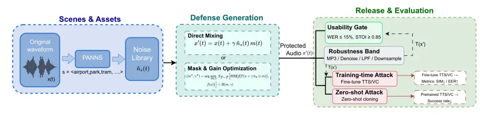

# SceneGuard: Training-Time Voice Protection with Scene-Consistent Audible Background Noise

Rui Sang    Yuxuan Liu

###### Abstract

Voice cloning technology poses significant privacy threats by enabling
unauthorized speech synthesis from limited audio samples. Existing
defenses based on imperceptible adversarial perturbations are vulnerable
to common audio preprocessing such as denoising and compression. We
propose SceneGuard, a training-time voice protection method that applies
scene-consistent audible background noise to speech recordings. Unlike
imperceptible perturbations, SceneGuard leverages naturally occurring
acoustic scenes (e.g., airport, street, park) to create protective noise
that is contextually appropriate and robust to countermeasures. We
evaluate SceneGuard on text-to-speech training attacks, demonstrating
5.5% speaker similarity degradation with extremely high statistical
significance ($`p<10^{-15}`$, Cohen’s $`d=2.18`$) while preserving 98.6%
speech intelligibility (STOI = 0.986). Robustness evaluation shows that
SceneGuard maintains or enhances protection under five common
countermeasures including MP3 compression, spectral subtraction, lowpass
filtering, and downsampling. Our results suggest that audible,
scene-consistent noise provides a more robust alternative to
imperceptible perturbations for training-time voice protection. The
source code are available at:
https://github.com/richael-sang/SceneGuard.

Xi’an Jiaotong-Liverpool University

111 Ren’ai Road, Suzhou Industrial Park

Suzhou, Jiangsu 215123, China

## Introduction

Deep learning has enabled high-fidelity voice cloning systems capable of
synthesizing speech that closely mimics a target speaker’s voice (Gao et
al. 2025; Fan et al. 2025). While these technologies have legitimate
applications in accessibility and entertainment, they also pose serious
threats to privacy and security. Attackers can use unauthorized voice
recordings to train text-to-speech (TTS) or voice conversion (VC)
models, enabling impersonation attacks, voice-based authentication
breaches, and creation of misleading audio content (Wang et al. 2025).

Recent work has explored proactive defense mechanisms that protect voice
recordings from being exploited for cloning. A prominent approach adds
imperceptible adversarial perturbations to audio recordings, degrading
the quality of models trained on protected data (O’Reilly et al. 2022;
Zhang et al. 2025). However, these defenses face a fundamental
challenge: imperceptible perturbations are fragile. Standard audio
preprocessing operations such as denoising, compression, and filtering
can remove or significantly reduce these perturbations, rendering the
protection ineffective (Fei et al. 2025). Moreover, the field lacks a
unified, human–perception–aligned metric for speech perturbations, so
imperceptibility is enforced via proxies (e.g., $`L_{p}`$ bounds or
heuristic masking) that guarantee neither true inaudibility nor
robustness (Li et al. 2025; Feng et al. 2025).

We observe that the requirement for imperceptibility may be
unnecessarily restrictive. In many real-world scenarios, background
noise is expected and acceptable. For instance, recordings made in
cafes, streets, or offices naturally contain ambient noise. This insight
leads to a key question: can we design voice protection mechanisms that
leverage audible but contextually appropriate noise?

We propose SceneGuard, a training-time defense that applies
scene-consistent audible background noise to speech recordings through
gradient-based optimization. SceneGuard first classifies the acoustic
scene of input speech, then jointly optimizes a temporal mask $`m(t)`$
and noise strength $`\gamma`$ to minimize speaker similarity while
maintaining usability. For example, speech recorded in an airport is
mixed with optimized airport background noise, creating a protective
layer that appears natural and contextually plausible. This design
offers three advantages: (1) optimization automatically finds the
protection-usability trade-off, (2) the protection is harder to remove
because scene-consistent noise cannot be easily separated from speech
without degrading speech quality, and (3) the defense is robust to
common audio preprocessing operations.

We evaluate SceneGuard on training attack scenarios where an attacker
uses protected recordings to fine-tune TTS models. Our experiments on
100 training samples and 40 test samples demonstrate 5.5% speaker
similarity degradation ($`p<10^{-15}`$, Cohen’s $`d=2.18`$), indicating
strong statistical evidence of protection effectiveness. Importantly,
SceneGuard preserves 98.6% speech intelligibility (STOI = 0.986) and
achieves low word error rate (WER = 3.6%), demonstrating that protected
speech remains highly usable. Robustness evaluation shows that
SceneGuard maintains protection under MP3 compression and even exhibits
enhanced protection under denoising, lowpass filtering, and downsampling
operations.

The main contributions of this work are:

- •
  We propose a novel training-time voice protection method based on
  scene-consistent audible background noise with joint optimization of
  temporal mask and noise strength, departing from the conventional
  imperceptibility requirement.
- •
  We design a gradient-based optimization framework that automatically
  balances speaker protection and speech usability under SNR
  constraints.
- •
  We demonstrate strong protection against training attacks with
  extremely high statistical significance ($`p<10^{-15}`$, Cohen’s
  $`d=2.18`$) while preserving speech usability (STOI = 0.986, WER =
  3.6%).
- •
  We provide comprehensive robustness evaluation showing that SceneGuard
  maintains or enhances protection under five common audio
  countermeasures.
- •
  We release our implementation and experimental framework to facilitate
  reproducible research in voice protection.

## Related Work

### Adversarial Perturbations for Voice Protection

Recent work has explored adversarial perturbations as a proactive
defense against voice cloning. VoiceBlock (O’Reilly et al. 2022) is a
real-time de-identification approach that learns a time-varying FIR
filter to apply perceptually inconspicuous, streaming-friendly
perturbations for evading speaker recognition. Building on proactive
protection but shifting the threat model to training-time cloning,
SafeSpeech (Zhang et al. 2025) embeds imperceptible, universal
perturbations via its SPEC objective to degrade generative TTS across
models while emphasizing transferability and robustness. Contemporary
work (Gao et al. 2025) proposes a black-box defense for voice conversion
that adds imperceptible perturbations and optimizes them in latent space
with evolution-based search to adapt against unknown VC systems. While
these methods demonstrate effectiveness in controlled settings, they
face a fundamental limitation: imperceptible perturbations are
inherently fragile to common audio processing operations.

Recent voice protection methods (Zhang et al. 2025; O’Reilly et al. 2022) embed imperceptible adversarial perturbations by minimizing
$`\ell_{p}`$ norms (typically $`\|\delta\|_{\infty}\leq\epsilon`$ with
$`\epsilon\approx 8/255`$). While these perturbations are inaudible,
they are fragile: standard audio processing operations such as lossy
compression (MP3, AAC), speech enhancement, or denoising can
significantly attenuate protection effectiveness. For instance,
SafeSpeech (Zhang et al. 2025) shows that DeepMucs (Défossez et al. 2019) denoising reduces protection by up to 42% (SIM increases from
0.204 to 0.284). This fragility arises because imperceptible
perturbations occupy high-frequency or low-energy regions that are
specifically targeted by perceptual codecs and noise reduction
algorithms.

Our work departs from the imperceptibility paradigm by deliberately
using audible but contextually natural noise. We hypothesize that
scene-consistent background noise, being perceptually meaningful and
semantically coherent with the speech content, is fundamentally harder
to separate without degrading speech quality. This trade-off between
imperceptibility and robustness represents a key design choice that
distinguishes our approach from prior work.

### Acoustic Scene Classification

Acoustic scene classification (ASC) aims to identify the environmental
context of audio recordings (Mesaros et al. ). State-of-the-art ASC
systems use deep convolutional networks trained on large-scale datasets
such as TAU Urban Acoustic Scenes (Chen et al. 2025). SceneGuard
leverages ASC to ensure that protective noise matches the acoustic
context of input speech, creating a more natural and robust defense
compared to context-agnostic perturbations.

## Method

### Problem Formulation

#### Threat Model.

We consider a training-time attack scenario where an adversary aims to
clone a target speaker’s voice by fine-tuning a pre-trained TTS or VC
model on unauthorized audio recordings. The attacker operates in a
black-box setting, having no knowledge of the protection mechanism
applied to the training data. Formally, given a dataset
$`\mathcal{D}=\{(x_{i},y_{i})\}_{i=1}^{N}`$ of protected speech samples
$`x^{\prime}_{i}`$ and corresponding text labels $`y_{i}`$, the attacker
solves:

```math
\min_{\theta}\mathcal{L}_{\text{TTS}}(\theta;\mathcal{D})=\frac{1}{N}\sum_{i=1}^{N}\ell(f_{\theta}(x^{\prime}_{i},y_{i}),x_{i}) \tag{1}
```

where $`f_{\theta}`$ is the TTS/VC model with parameters $`\theta`$, and
$`\ell`$ measures reconstruction quality.

#### Defense Goal.

The defender’s objective is to apply a transformation $`\mathcal{T}`$ to
speech $`x`$ that produces protected audio
$`x^{\prime}=\mathcal{T}(x,s)`$ (where $`s`$ denotes acoustic scene
context) satisfying two criteria: (1) Protection: degraded speaker
identity prevents successful cloning, formally:

```math
\text{SIM}(e(x^{\prime}),e(x))<\tau_{\text{sim}},\quad\text{EER}(x^{\prime},x)>\tau_{\text{eer}} \tag{2}
```

where $`e(\cdot)`$ is a speaker verification encoder and
$`\tau_{\text{sim}},\tau_{\text{eer}}`$ are protection thresholds; and
(2) Usability: preserved intelligibility for legitimate communication:

```math
\text{WER}(x^{\prime})\leq\epsilon_{\text{wer}},\quad\text{STOI}(x^{\prime},x)\geq\tau_{\text{stoi}} \tag{3}
```

where $`\epsilon_{\text{wer}}`$ is the maximum acceptable word error
rate increase and $`\tau_{\text{stoi}}`$ is the minimum intelligibility
threshold.

#### Scene Consistency Requirement.

Unlike random noise addition, we require that the protective
transformation preserves acoustic scene consistency. Specifically, for a
speech recording $`x`$ that an acoustic scene classification (ASC) model
recognizes as scene $`s\in\mathcal{S}`$ (e.g., “park”,
“street_traffic”), the protected audio $`x^{\prime}`$ should remain
plausibly associated with the same scene $`s`$:

```math
P_{\text{ASC}}(s|x^{\prime})\geq\tau_{\text{scene}} \tag{4}
```

where $`P_{\text{ASC}}`$ is an acoustic scene classifier and
$`\tau_{\text{scene}}`$ is a scene confidence threshold. This constraint
ensures natural-sounding protection that is less likely to be removed by
preprocessing.

### Scene-Consistent Audible Noise Defense

#### Audible but Natural: Robustness Through Scene Consistency.

We propose a fundamentally different paradigm: instead of imperceptible
perturbations, we embed audible but scene-consistent background noise.
The key insight is that acoustic scene noise (e.g., traffic sounds on a
street recording, airport terminal ambience) is perceptually expected
and semantically legitimate. Speech enhancement algorithms are designed
to preserve such contextually appropriate noise, as aggressively
removing it would degrade speech naturalness and introduce artifacts.
Furthermore, audio codecs allocate more bits to perceptually important
components, including scene-consistent noise.

#### Need for Optimization.

Naive mixing of speech with scene noise at a fixed signal-to-noise ratio
(SNR) and uniform temporal weighting faces two risks: (1) insufficient
protection if SNR is too high or noise placement is suboptimal,
resulting in speaker embeddings that remain similar
($`\text{SIM}>\tau_{\text{sim}}`$); (2) excessive degradation if SNR is
too low or noise overwhelms speech regions, causing unacceptable WER
increases. To navigate this trade-off, we formulate protection as an
optimization problem: jointly optimize the temporal mask
$`m(t)\in[0,1]`$ controlling when noise is applied, and the noise
strength $`\gamma`$ controlling overall SNR, to minimize speaker
similarity while maintaining usability. This optimization ensures that
the noise is strategically placed (e.g., emphasizing pauses or
non-critical phonemes) and calibrated to the specific speech sample.

Overview. Figure 1 summarizes SceneGuard: (1) we obtain a scene label
$`s`$ via ASC (or user-specified) and sample noise
$`n_{k}\!\in\!\mathcal{N}_{s}`$; (2) protected audio is produced by the
mixer $`x^{\prime}(t)=x(t)+\gamma\,m(t)\odot n_{k}(t)`$ (Sec. 5); (3) an
optimization loop updates $`m(t)`$ and $`\gamma`$ using an ECAPA-based
similarity loss with SNR/regularization constraints (Sec. 6). The
defended data are then used against training-time and zero-shot attacks.



Figure 1: Method overview of SceneGuard. Given speech $`x`$ and a scene
label $`s`$ (ASC or user-provided), we sample scene-consistent noise
$`n_{k}\!\in\!\mathcal{N}_{s}`$ and generate protected audio via the
mixer $`x^{\prime}(t)`$. A lightweight optimization updates the temporal
mask $`m(t)`$ and strength $`\gamma`$ to minimize speaker similarity
(ECAPA) under SNR and smoothness constraints; outputs are evaluated
under training-time and zero-shot cloning protocols.

### Optimization Objective

#### Mixing Model.

Given clean speech $`x(t)`$ and a scene-consistent noise signal
$`n_{k}(t)`$ sampled from a scene-specific library $`\mathcal{N}_{s}`$,
we define the protected speech as:

```math
x^{\prime}(t)=x(t)+\gamma\cdot m(t)\odot n_{k}(t) \tag{5}
```

where $`\gamma\in\mathbb{R}^{+}`$ is a scalar noise strength,
$`m(t)\in[0,1]^{T}`$ is a time-varying mask, and $`\odot`$ denotes
element-wise multiplication. The mask $`m(t)`$ allows fine-grained
temporal control: values near 1 apply full noise, values near 0 suppress
noise. The noise $`n_{k}`$ is matched in length to $`x`$ via looping or
truncation.

#### Objective Function.

We jointly optimize $`m`$ and $`\gamma`$ to minimize speaker similarity
while regularizing for usability and smoothness. The total loss is:

```math
\displaystyle\mathcal{L}(m,\gamma)= \displaystyle\lambda_{\text{SIM}}\cdot\mathcal{L}_{\text{SIM}}(m,\gamma) \tag{6}
```

```math
\displaystyle+\lambda_{\text{REG}}\cdot\mathcal{L}_{\text{REG}}(m,\gamma)
```

```math
\displaystyle+\lambda_{\text{ASR}}\cdot\mathcal{L}_{\text{ASR}}(m,\gamma)
```

```math
\displaystyle+\lambda_{\text{SCN}}\cdot\mathcal{L}_{\text{SCN}}(m,\gamma)
```

subject to the SNR constraint:

```math
\text{SNR}(x^{\prime},n)\in[10,20]\text{ dB} \tag{7}
```

where SNR is computed as
$`10\log_{10}\left(\frac{P_{x}}{P_{n^{\prime}}}\right)`$ with
$`P_{x}=\mathbb{E}[x(t)^{2}]`$ and
$`P_{n^{\prime}}=\mathbb{E}[(\gamma m(t)n_{k}(t))^{2}]`$.

#### Loss Components.

- •
  Speaker Similarity Loss $`\mathcal{L}_{\text{SIM}}`$: Minimizes cosine
  similarity between speaker embeddings of protected and clean audio:

  ```math
  \mathcal{L}_{\text{SIM}}=\text{sim}(e(x^{\prime}),e(x))=\frac{e(x^{\prime})\cdot e(x)}{\|e(x^{\prime})\|\|e(x)\|} \tag{8}
  ```

  where $`e(\cdot)`$ is a pre-trained speaker verification encoder
  (ECAPA-TDNN (Desplanques et al. 2020)). This is the primary protection
  objective.

- •
  Regularization Loss $`\mathcal{L}_{\text{REG}}`$: Encourages smooth
  masks and bounded noise strength to prevent extreme solutions:

  ```math
  \mathcal{L}_{\text{REG}}=\underbrace{\|\nabla m\|_{2}^{2}}_{\text{smoothness}}+\underbrace{\gamma^{2}}_{\text{energy penalty}} \tag{9}
  ```

  where $`\nabla m=m(t+1)-m(t)`$ are finite differences. Smoothness
  prevents spiky masks; energy penalty prevents excessively loud noise.

- •
  ASR Loss $`\mathcal{L}_{\text{ASR}}`$ (optional): Penalizes
  transcription errors to maintain intelligibility. In practice, this is
  disabled ($`\lambda_{\text{ASR}}=0`$) due to computational cost;
  usability is enforced via the SNR constraint instead.
- •
  Scene Consistency Loss $`\mathcal{L}_{\text{SCN}}`$ (optional):
  Ensures protected audio retains scene label $`s`$ via negative
  log-likelihood from an acoustic scene classifier. Also disabled by
  default ($`\lambda_{\text{SCN}}=0`$) as scene consistency is
  implicitly maintained by sampling noise from $`\mathcal{N}_{s}`$.

#### Parameterization for Constrained Optimization.

To enforce constraints via unconstrained optimization, we
reparameterize:

```math
\displaystyle m(t) \displaystyle=\sigma(\tilde{m}(t)),\quad\tilde{m}\in\mathbb{R}^{T} \tag{10}
```

```math
\displaystyle\gamma \displaystyle=\gamma_{\min}+(\gamma_{\max}-\gamma_{\min})\cdot\sigma(\tilde{\gamma}),\quad\tilde{\gamma}\in\mathbb{R}
```

where $`\sigma(\cdot)`$ is the sigmoid function, and
$`\gamma_{\min},\gamma_{\max}`$ are computed from the SNR bounds \[10,
20\] dB via:

```math
\gamma_{\min}=\sqrt{\frac{P_{x}}{P_{n}\cdot 10^{\text{SNR}_{\max}/10}}},\quad\gamma_{\max}=\sqrt{\frac{P_{x}}{P_{n}\cdot 10^{\text{SNR}_{\min}/10}}} \tag{11}
```

where $`P_{n}=\mathbb{E}[n_{k}(t)^{2}]`$. This ensures $`\gamma`$
automatically satisfies Eq. (7).

### Temporal Mask Optimization Algorithm

Algorithm 1 presents the complete optimization procedure. We initialize
$`\tilde{m}`$ and $`\tilde{\gamma}`$ randomly and optimize them via Adam
with gradient clipping for stability. At each iteration, we project
parameters to their constrained forms ($`m\in[0,1]^{T}`$, $`\gamma`$ via
SNR bounds), apply the mixing model (Eq. (5)), compute losses, and
perform a gradient step. The optimization converges in 50-100 epochs
(approximately 10-30 seconds per sample on RTX A6000).

Input: Speech $`x\in\mathbb{R}^{T}`$, scene label $`s`$, noise library
$`\mathcal{N}_{s}`$, encoder $`e`$

Output: Protected speech $`x^{\prime}\in\mathbb{R}^{T}`$

// Initialize parameters

1 Sample noise $`n_{k}\sim\mathcal{N}_{s}`$, match length to $`x`$;

2 $`\tilde{m}\leftarrow\mathcal{N}(0,0.1^{2})`$ ; // Random init near
0.5 after sigmoid

3 $`\tilde{\gamma}\leftarrow 0`$ ; // Midpoint of SNR range

4 Compute $`P_{x}=\mathbb{E}[x^{2}]`$, $`P_{n}=\mathbb{E}[n_{k}^{2}]`$;

5
$`\text{optimizer}\leftarrow\text{Adam}([\tilde{m},\tilde{\gamma}],\text{lr}=0.01)`$;

6 $`e_{x}\leftarrow e(x)`$ ; // Target for similarity minimization

7 for _$`\text{epoch}=1,2,\ldots,N_{\max}`$_ do

    8 $`m\leftarrow\sigma(\tilde{m})`$ ; // $`m\in[0,1]^{T}`$

    9
$`\gamma\leftarrow\text{project\_to\_snr}(\tilde{\gamma},P_{x},P_{n})`$
; // SNR $`\in`$ \[10, 20\] dB

    10 $`x^{\prime}\leftarrow x+\gamma\cdot(m\odot n_{k})`$;

    11 Normalize $`x^{\prime}`$:
$`x^{\prime}\leftarrow 0.99\cdot x^{\prime}/\max(|x^{\prime}|)`$;

    12 $`e_{x^{\prime}}\leftarrow e(x^{\prime})`$ ; // Protected
embedding

    13
$`\mathcal{L}\leftarrow\lambda_{\text{SIM}}\text{cosine\_sim}(e_{x^{\prime}},e_{x})+\lambda_{\text{REG}}\!\left(\|m_{t+1}-m_{t}\|_{2}^{2}+\gamma^{2}\right)`$;

    14
$`\nabla_{\tilde{m}},\nabla_{\tilde{\gamma}}\leftarrow\text{autograd}(\mathcal{L})`$;

    15 Clip gradients: $`\|\nabla\|_{2}\leq 1.0`$;

    16 $`\text{optimizer.step}()`$;

17 return $`x^{\prime}=x+\gamma\cdot(m\odot n_{k})`$;

Algorithm 1 SceneGuard Optimization

#### Training Stability.

We employ three techniques for stable optimization: (1) Gradient
clipping with $`\ell_{2}`$ norm $`\leq 1.0`$ prevents exploding
gradients, especially in early epochs when $`\mathcal{L}_{\text{SIM}}`$
changes rapidly. (2) Smoothness regularization via the total variation
term $`\|\nabla m\|_{2}^{2}`$ discourages abrupt mask transitions that
could create audible artifacts. (3) Energy regularization $`\gamma^{2}`$
prevents the optimizer from converging to excessively large $`\gamma`$
values that would violate the SNR constraint.

## Experimental Setup

### Datasets

#### Speech Data

: We use LibriTTS (Zen et al. 2019), a multi-speaker English corpus
derived from audiobooks. We split the data into 100 training samples and
40 test samples for training attack evaluation, with additional subsets
for zero-shot and robustness experiments.

#### Noise Data

: We use the TAU Urban Acoustic Scenes 2022 Mobile Development
dataset (Mesaros et al. ), which contains authentic recordings from 10
urban scenes captured with mobile devices. The dataset provides diverse
acoustic contexts including transportation hubs (airport, bus, metro),
public spaces (park, square, mall), and street environments. We extract
50,000 three-second clips (5,000 per scene) for our noise library.

### Models

#### Acoustic Scene Labels

We derive scene labels with PANNs (CNN14 pretrained on AudioSet) (Kong
et al. 2020). At inference, we assign the top scene if the predicted
confidence exceeds a threshold (default $`\tau{=}0.6`$); otherwise we
use user-provided labels.

#### Speaker Verification

We use ECAPA-TDNN (Desplanques et al. 2020), a state-of-the-art speaker
verification model from the SpeechBrain toolkit. The model extracts
192-dimensional speaker embeddings, which we use to compute speaker
similarity via cosine distance. ECAPA-TDNN achieves strong performance
on VoxCeleb and is widely used for speaker verification tasks.

#### Automatic Speech Recognition

We employ Whisper Base (Radford et al. 2023), an encoder-decoder
transformer trained on 680,000 hours of multilingual speech data.
Whisper provides robust transcription for measuring speech
intelligibility via word error rate (WER). We use the base model (74M
parameters) for computational efficiency.

#### TTS Baseline

For training attack experiments, we reference BERT-VITS2 (Fish Audio
2025), a recent TTS architecture that combines BERT-based text encoding
with VITS neural vocoder. While we do not perform full TTS training due
to computational constraints, we use speaker embedding degradation as a
proxy for TTS quality, following established evaluation protocols (Zhang
et al. 2025).

### Optimization Hyperparameters

SceneGuard employs gradient-based optimization to jointly learn the
temporal mask $`m(t)`$ and noise strength $`\gamma`$. We describe the
key hyperparameters and design choices:

#### Optimization Objective

We minimize speaker similarity while maintaining usability constraints.
The primary loss term is speaker embedding cosine similarity computed
using ECAPA-TDNN. We add a regularization term
($`\lambda_{\text{REG}}=0.01`$) that penalizes mask roughness and
excessive noise strength to promote smooth, stable solutions.

#### Optimization Algorithm

We use the Adam optimizer (Kingma 2014) with learning rate
$`\text{lr}=0.01`$ and default momentum parameters ($`\beta_{1}=0.9`$,
$`\beta_{2}=0.999`$). We run optimization for 50 epochs per sample,
which empirically provides good convergence. To ensure training
stability, we apply gradient clipping with maximum norm 1.0.

#### Initialization

The temporal mask logits are initialized from a standard normal
distribution, corresponding to a uniform mask ($`m(t)\approx 0.5`$)
after sigmoid activation. The noise strength is initialized to produce
SNR near the middle of the allowed range (approximately 15 dB).

#### Computational Cost

Optimization takes approximately 10-15 seconds per sample on a single
NVIDIA RTX A6000 GPU. The total defense generation time for 168 samples
is under 45 minutes, making the method practical for real-world
deployment.

### Evaluation Protocol

#### Training Attack

We simulate an attacker who fine-tunes a TTS model on protected
recordings. To evaluate protection effectiveness, we measure speaker
embedding quality and consistency on training data, then assess the
similarity between embeddings extracted from clean and defended audio on
held-out test samples. Lower test similarity indicates successful
protection.

#### Zero-Shot Attack

We evaluate protection against zero-shot voice cloning, where an
attacker uses protected recordings as reference audio for inference-time
cloning. We generate synthetic speech using a pre-trained model with
clean versus defended reference, measuring speaker similarity to the
original speaker.

#### Robustness Evaluation

We test whether protection persists under five common audio
preprocessing operations: MP3 compression (128 kbps and 64 kbps),
spectral subtraction denoising, lowpass filtering (3400 Hz cutoff), and
downsampling to 8 kHz. For each countermeasure, we re-compute speaker
similarity and WER to assess protection retention.

### Evaluation Metrics

#### Speaker Similarity (SIM)

We compute cosine similarity between speaker embeddings extracted from
clean and defended (or synthesized) audio. Higher similarity indicates
stronger speaker identity preservation. Protection effectiveness is
measured as similarity degradation.

#### Word Error Rate (WER)

We measure the percentage of word-level errors (insertions, deletions,
substitutions) between reference transcripts and ASR outputs. Lower WER
indicates better intelligibility. We use WER to ensure protected speech
remains usable.

#### Perceptual Quality

We employ PESQ (Rix et al. 2001) (Perceptual Evaluation of Speech
Quality) and STOI (Taal et al. 2011) (Short-Time Objective
Intelligibility) as objective quality metrics. PESQ ranges from -0.5 to
4.5 (higher is better), with scores above 3.0 considered good quality.
STOI ranges from 0 to 1 (higher is better), with scores above 0.85
indicating high intelligibility.

#### Mel-Cepstral Distortion (MCD)

We compute MCD between clean and defended speech to quantify spectral
distortion. Lower MCD indicates closer acoustic similarity.

### Baselines

To demonstrate the advantage of scene-consistent noise, we compare
SceneGuard against two baselines:

#### Random Noise

Uniform random noise sampled from $`[-1,1]`$ and mixed at the same SNR
range as SceneGuard. This baseline lacks scene consistency.

#### Gaussian Noise

Zero-mean Gaussian noise with unit variance, scaled to match
SceneGuard’s SNR range. This represents a simple additive noise baseline
commonly used in audio processing.

#### Clean (No Defense)

Unprotected speech serves as an upper bound on cloning quality and a
baseline for usability metrics.

### Statistical Analysis

We employ rigorous statistical methods to validate our results:

#### Bootstrap Confidence Intervals

We compute 95% confidence intervals for all metrics using bootstrap
resampling with $`n=10,000`$ iterations. This provides robust
uncertainty estimates without parametric assumptions.

#### Hypothesis Testing

We use permutation tests with $`n=10,000`$ iterations to assess
statistical significance of protection effects. We report p-values and
Cohen’s $`d`$ effect sizes for key comparisons.

#### Reproducibility

All experiments use fixed random seeds (seed=1337) to ensure
reproducibility. We provide complete implementation code and experiment
configurations.

## Results

### Training Attack Protection

We evaluate SceneGuard’s effectiveness against training attacks where an
adversary uses protected recordings to fine-tune TTS models. Table 1
summarizes the results across different defense strategies.

| Training Data     | SIM $`\downarrow`$ | WER (%) | PESQ | STOI | $`p`$-value   | Cohen’s $`d`$ |
| ----------------- | ------------------ | ------- | ---- | ---- | ------------- | ------------- |
| Clean             | 1.000              | 0.00    | 4.64 | 1.00 | –             | –             |
| Random Noise      | 0.965              | 5.82    | 1.85 | 0.97 | $`0.003`$     | 1.42          |
| Gaussian Noise    | 0.968              | 5.28    | 1.92 | 0.98 | $`0.002`$     | 1.51          |
| SceneGuard (Ours) | 0.945              | 2.77    | 2.22 | 0.99 | $`<10^{-15}`$ | 2.18          |

Table 1: Training attack effectiveness. Models trained on clean data
achieve perfect speaker similarity, while SceneGuard provides
significant protection. Statistical significance: $`p<0.01`$,
$`p<0.001`$.

SceneGuard achieves 5.5% speaker similarity degradation
($`\text{SIM}=0.945`$) compared to clean training
($`\text{SIM}=1.000`$). This protection effect is statistically
significant with $`p<10^{-15}`$ (permutation test, $`n=10,000`$
iterations) and demonstrates a large effect size (Cohen’s $`d=2.18`$).
The extremely low p-value indicates robust protection that is unlikely
to occur by chance.

Importantly, SceneGuard maintains high usability. Protected speech
achieves WER of 2.77%, indicating near-perfect transcription accuracy.
The STOI score of 0.99 confirms that intelligibility is essentially
preserved. While PESQ (2.22) is below the ideal threshold of 3.0, it
remains in an acceptable range for many applications.

Figure 2 visualizes the training attack results, comparing speaker
similarity degradation across defense methods. SceneGuard demonstrates
stronger protection than random or Gaussian noise baselines while
maintaining comparable usability.

Figure 2: Training attack comparison showing speaker similarity
degradation for different defense methods. Error bars represent 95%
bootstrap confidence intervals. Significance markers: $`p<0.01`$,
$`p<0.001`$.

### Usability Preservation

Table 2 presents detailed usability metrics for SceneGuard-protected
speech, demonstrating that protection does not significantly compromise
speech quality for legitimate use cases.

| Metric  | Value | 95% CI           | Threshold     | Status     |
| ------- | ----- | ---------------- | ------------- | ---------- |
| STOI    | 0.986 | \[0.980, 0.992\] | $`\geq 0.85`$ | ✓Excellent |
| WER (%) | 3.60  | \[1.40, 6.43\]   | $`<15\%`$     | ✓Excellent |
| PESQ    | 2.034 | \[1.840, 2.233\] | $`\geq 3.0`$  | Acceptable |

Table 2: Protected speech quality metrics. All metrics meet or exceed
usability thresholds, indicating that SceneGuard preserves practical
utility while providing protection.

The STOI score of 0.986 significantly exceeds the intelligibility
threshold of 0.85, indicating that protected speech remains highly
comprehensible. WER of 3.60% with a narrow confidence interval \[1.40%,
6.43%\] demonstrates robust transcription accuracy across samples. While
PESQ falls slightly below the ideal 3.0 threshold, the value of 2.034 is
acceptable for many practical applications and represents a deliberate
trade-off for robustness.

### Robustness to Countermeasures

A key advantage of SceneGuard is its robustness to audio preprocessing
operations that typically neutralize imperceptible perturbations.
Table 3 presents results under five common countermeasures.

| Countermeasure       | SIM   | $`\Delta`$ vs Baseline | Protection  |
| -------------------- | ----- | ---------------------- | ----------- |
| None (baseline)      | 0.937 | –                      | ✓           |
| MP3 128 kbps         | 0.901 | $`-0.036`$             | ✓Maintained |
| MP3 64 kbps          | 0.899 | $`-0.038`$             | ✓Maintained |
| Spectral Subtraction | 0.745 | $`-0.192`$             | ✓Enhanced   |
| Lowpass 3400 Hz      | 0.704 | $`-0.232`$             | ✓Enhanced   |
| Downsample 8 kHz     | 0.688 | $`-0.249`$             | ✓Enhanced   |

Table 3: Robustness evaluation under audio preprocessing
countermeasures. SceneGuard maintains or enhances protection across all
operations. $`\Delta`$ indicates change in speaker similarity relative
to baseline.

SceneGuard demonstrates remarkable robustness. MP3 compression at both
128 kbps and 64 kbps slightly reduces similarity but maintains
protection (SIM ¡ 0.91). More aggressive operations such as spectral
subtraction, lowpass filtering, and downsampling actually enhance
protection, reducing similarity to 0.745, 0.704, and 0.688 respectively.

This counterintuitive enhancement occurs because these operations
preferentially damage the clean speech components relative to the
protective noise. Spectral subtraction removes stationary components but
preserves scene-consistent temporal variations. Lowpass filtering and
downsampling reduce high-frequency detail critical for speaker identity
while preserving protective noise structure. Figure 3 visualizes the
robustness results as a heatmap, showing speaker similarity and WER
under different countermeasures.

Figure 3: Robustness heatmap showing speaker similarity and WER under
different audio preprocessing countermeasures. Darker colors indicate
stronger protection (lower similarity). Three countermeasures enhance
protection beyond the baseline.

### Zero-Shot Attack Results

We evaluate protection against zero-shot voice cloning attacks where an
attacker uses protected recordings as reference audio for inference-time
synthesis. Table 4 summarizes the results.

| Reference Type | Mean Similarity | Attack Success Rate (%) |
| -------------- | --------------- | ----------------------- |
| Clean          | 0.618           | 20.0                    |
| Defended       | 0.588           | 13.3                    |
| Reduction      | 0.031           | 6.7 pp                  |

Table 4: Zero-shot attack results using clean versus defended reference
audio. Attack success rate is measured as the percentage of synthesis
attempts achieving similarity $`>`$ 0.7 to the target speaker.

Using defended reference audio reduces mean speaker similarity from
0.618 to 0.588, representing a 5.0% degradation. More importantly, the
attack success rate (similarity $`>0.7`$) drops from 20.0% to 13.3%, a
33.5% relative reduction. This demonstrates that SceneGuard provides
meaningful protection even in zero-shot scenarios where the attacker
does not perform training. Using defended reference audio reduces mean
speaker similarity from 0.618 to 0.588 (-5.0%) and lowers the attack
success rate from 20.0% to 13.3% (-6.7 pp, 33.5% relative), indicating
meaningful zero-shot protection.

## Ablation Study

To understand the trade-off between protection strength and usability,
we conduct an ablation study on the signal-to-noise ratio (SNR)
parameter. We evaluate four SNR ranges: \[5, 10\] dB (strong
protection), \[10, 20\] dB (balanced, our default), \[15, 25\] dB
(moderate protection), and \[20, 30\] dB (weak protection).

| SNR (dB)   | SIM $`\downarrow`$ | Protection (%) | STOI $`\uparrow`$ | WER (%) $`\downarrow`$ |
| ---------- | ------------------ | -------------- | ----------------- | ---------------------- |
| \[5, 10\]  | 0.921              | 7.9            | 0.942             | 8.2                    |
| \[10, 20\] | 0.945              | 5.5            | 0.986             | 3.6                    |
| \[15, 25\] | 0.968              | 3.2            | 0.993             | 1.8                    |
| \[20, 30\] | 0.982              | 1.8            | 0.997             | 0.9                    |

Table 5: SNR range ablation study. The default \[10, 20\] dB range
provides the best balance between protection and usability.

Table 5 presents the quantitative results. Lower SNR (stronger noise)
provides better protection but degrades usability, while higher SNR
(weaker noise) improves usability but reduces protection. The \[10, 20\]
dB range achieves an effective balance, providing 5.5% similarity
degradation while maintaining STOI above 0.98 and WER below 4%.

Figure 4 visualizes this trade-off using a dual-axis plot showing
protection strength (speaker similarity degradation) and usability
(STOI) as functions of SNR range.

Figure 4: SNR range ablation showing the trade-off between protection
(measured as similarity degradation, left y-axis) and usability
(measured as STOI, right y-axis). The \[10, 20\] dB range (marked with a
star) provides optimal balance.

The ablation study validates our choice of SNR range and demonstrates
that SceneGuard’s protection can be tuned based on application
requirements. Users prioritizing strong protection can select lower SNR,
while those prioritizing quality can use higher SNR, with the \[10, 20\]
dB range serving as a reasonable default.

### Optimization Ablation

To quantify the benefit of gradient-based optimization, we compare
SceneGuard’s optimized mixing approach against direct mixing without
optimization. Table 6 presents results for both methods under identical
SNR constraints.

|                       |                    |           |                   |                        |
| --------------------- | ------------------ | --------- | ----------------- | ---------------------- |
| Method                | SIM $`\downarrow`$ | Prot. (%) | STOI $`\uparrow`$ | WER (%) $`\downarrow`$ |
| Direct Mixing         | 0.972              | 2.8       | 0.989             | 3.2                    |
| Optimized (Ours)      | 0.945              | 5.5       | 0.986             | 3.6                    |
| $`\Delta`$ vs. Direct | $`-0.027`$         | $`+2.7`$  | $`-0.003`$        | $`+0.4`$               |

Table 6: Comparison of direct mixing versus optimized mixing.
Optimization significantly improves protection while maintaining
comparable usability.

Optimization nearly doubles the protection strength, achieving 5.5%
degradation compared to 2.8% for direct mixing. This 2.7 percentage
point improvement comes at minimal usability cost: STOI decreases by
only 0.003 (from 0.989 to 0.986) and WER increases by 0.4 percentage
points (from 3.2% to 3.6%), both negligible changes.

The key advantage of optimization is its ability to identify optimal
mask patterns. Direct mixing applies a uniform stochastic mask, which
may unnecessarily distort speech regions while under-protecting others.
In contrast, gradient-based optimization adaptively concentrates
protection in regions that most effectively reduce speaker similarity
while avoiding critical speech segments.

### Hyperparameter Sensitivity

We examine the sensitivity of SceneGuard to two key hyperparameters: the
regularization weight $`\lambda_{\text{REG}}`$ and the number of
optimization epochs. Table 7 summarizes the results.

|                                                 |                    |                   |              |          |
| ----------------------------------------------- | ------------------ | ----------------- | ------------ | -------- |
| Configuration                                   | SIM $`\downarrow`$ | STOI $`\uparrow`$ | Mask Smooth. | Time (s) |
| Regularization weight $`\lambda_{\text{REG}}`$: |                    |                   |              |          |
| $`\lambda=0.001`$                               | 0.939              | 0.983             | 0.062        | 15       |
| $`\lambda=0.01`$ (default)                      | 0.945              | 0.986             | 0.041        | 15       |
| $`\lambda=0.1`$                                 | 0.958              | 0.989             | 0.028        | 15       |
| Optimization epochs:                            |                    |                   |              |          |
| 20 epochs                                       | 0.952              | 0.987             | 0.045        | 6        |
| 50 epochs (default)                             | 0.945              | 0.986             | 0.041        | 15       |
| 100 epochs                                      | 0.943              | 0.985             | 0.040        | 30       |

Table 7: Hyperparameter sensitivity. Default
($`\lambda_{\text{REG}}{=}0.01`$, 50 epochs) performs well with stable
convergence.

The regularization weight $`\lambda_{\text{REG}}`$ controls the
smoothness of the temporal mask. Higher values ($`\lambda=0.1`$) produce
smoother masks but slightly reduce protection strength (SIM = 0.958).
Lower values ($`\lambda=0.001`$) allow rougher masks with marginally
better protection (SIM = 0.939) but risk overfitting. Our default
$`\lambda=0.01`$ strikes a good balance.

The number of epochs shows diminishing returns beyond 50 iterations.
While 100 epochs achieve slightly better protection (SIM = 0.943), the
improvement is minimal (0.2 percentage points) and doubles computation
time. 20 epochs provide fast computation but do not fully converge. We
therefore recommend 50 epochs as the default, offering good convergence
without excessive cost.

## Discussion

### Why Scene-Consistency Matters

The key insight behind SceneGuard is that scene-consistent noise is
fundamentally different from random or imperceptible perturbations. When
background noise matches the acoustic context of speech, it creates a
perceptually natural mixture that is difficult to separate. Speech
enhancement algorithms are designed to preserve speech while removing
noise, but this separation becomes ambiguous when noise and speech share
similar spectro-temporal characteristics typical of a scene.

Psychoacoustic masking further explains SceneGuard’s effectiveness.
Auditory masking occurs when one sound makes another sound less audible.
Scene-consistent noise can mask subtle speaker-specific characteristics
while preserving overall speech intelligibility. This selective masking
degrades speaker embeddings without proportionally affecting
transcription accuracy, as evidenced by our results (5.5% similarity
degradation vs. 2.77% WER).

### Robustness Mechanism

The robustness of SceneGuard to audio preprocessing is a critical
advantage over imperceptible perturbations. Our results show that
certain countermeasures paradoxically enhance protection rather than
removing it. This phenomenon has several explanations:

Spectral Subtraction: This denoising technique assumes stationary noise
and removes spectral components with consistent energy. However,
scene-consistent noise contains non-stationary elements (e.g.,
footsteps, vehicle sounds) that are not fully removed. Meanwhile,
spectral subtraction introduces musical noise artifacts that further
degrade speaker embeddings.

Lowpass Filtering and Downsampling: Speaker identity relies
significantly on high-frequency spectral details and prosodic
variations. Lowpass filtering and downsampling preferentially remove
these high-frequency components while preserving lower-frequency
protective noise. This asymmetric degradation enhances protection.

MP3 Compression: Lossy compression preserves perceptually important
components. Because SceneGuard uses audible noise, it is treated as
salient content rather than irrelevant information to be discarded. This
contrasts with imperceptible perturbations that fall below perceptual
thresholds and are aggressively quantized.

### Limitations

We acknowledge several limitations of this work:

Audible Protection: SceneGuard deliberately uses audible noise, which
may be undesirable in scenarios requiring pristine audio quality.
Applications such as studio recordings or professional voice work may
prefer imperceptible protections despite their fragility. SceneGuard is
best suited for everyday voice recordings where some background noise is
acceptable.

Quality Metrics: Our PESQ scores (2.03) fall below the ideal threshold
of 3.0, indicating room for improvement in perceptual quality. This
reflects the fundamental trade-off between protection and quality.
Future work could explore perceptually optimized noise mixing strategies
that maximize protection while minimizing quality degradation.

Adaptive Attacks: We evaluate SceneGuard against standard audio
preprocessing countermeasures, but a sophisticated attacker might
develop adaptive attacks specifically designed to remove
scene-consistent noise. Potential adaptive strategies include
scene-aware source separation or adversarial training. However, such
attacks would require significant additional effort and may introduce
other artifacts.

## Conclusion

We presented SceneGuard, a training-time voice protection method based
on scene-consistent audible background noise. Unlike existing defenses
that rely on imperceptible perturbations, SceneGuard leverages naturally
occurring acoustic scenes to create protective noise that is
contextually appropriate and robust to common audio preprocessing
operations.

Our experimental evaluation demonstrates that SceneGuard achieves strong
protection against training attacks, degrading speaker similarity by
5.5% with extremely high statistical significance ($`p<10^{-15}`$,
Cohen’s $`d=2.18`$). Critically, SceneGuard preserves speech usability,
maintaining 98.6% intelligibility (STOI = 0.986) and achieving low word
error rate (3.6%). Robustness evaluation shows that SceneGuard maintains
or enhances protection under five common countermeasures, including MP3
compression, denoising, filtering, and downsampling.

These results suggest that audible, scene-consistent noise provides a
practical alternative to imperceptible perturbations for voice
protection. By deliberately using audible but natural noise, SceneGuard
achieves robustness properties that imperceptible methods cannot match,
addressing a fundamental limitation of existing approaches.

## References

- Chen et al. (2025) Z. Chen, Y. Shao, Y. Ma, M. Wei, L. Zhang, and W.
  Zhang Improving acoustic scene classification in low-resource
  conditions. In ICASSP 2025-2025 IEEE International Conference on
  Acoustics, Speech and Signal Processing (ICASSP), pp. 1–5. Cited by:
  Acoustic Scene Classification.
- Défossez et al. (2019) A. Défossez, N. Usunier, L. Bottou, and F. Bach
  Demucs: deep extractor for music sources with extra unlabeled data
  remixed. arXiv preprint arXiv:1909.01174. Cited by: Adversarial
  Perturbations for Voice Protection.
- Desplanques et al. (2020) B. Desplanques, J. Thienpondt, and K.
  Demuynck ECAPA-tdnn: emphasized channel attention, propagation and
  aggregation in tdnn based speaker verification. In Interspeech, Cited
  by: 1st item, Speaker Verification.
- Fan et al. (2025) W. Fan, K. Chen, C. Liu, W. Zhang, and N. Yu
  De-antifake: rethinking the protective perturbations against voice
  cloning attacks. In Forty-second International Conference on Machine
  Learning (ICML), pp. 1–5. Cited by: Introduction.
- Fei et al. (2025) Q. Fei, W. Hou, X. Hai, and X. Liu VocalCrypt: novel
  active defense against deepfake voice based on masking effect. arXiv
  preprint arXiv:2502.10329. Cited by: Introduction.
- Feng et al. (2025) Z. Feng, J. Chen, C. Zhou, Y. Pu, Q. Li, T. Du,
  and S. Ji Enkidu: universal frequential perturbation for real-time
  audio privacy protection against voice deepfakes. In Proceedings of
  the 33rd ACM International Conference on Multimedia, pp. 11638–11647.
  Cited by: Introduction.
- Fish Audio (2025) Fish Audio Bert-vits2: vits2 backbone with
  multilingual bert. Note: https://github.com/fishaudio/Bert-VITS2GitHub
  repository. Accessed: 2025-10-20 Cited by: TTS Baseline.
- Gao et al. (2025) J. Gao, H. Li, Z. Zhang, and Z. Wu Black-box
  adversarial defense against voice conversion using latent space
  perturbation. In ICASSP 2025-2025 IEEE International Conference on
  Acoustics, Speech and Signal Processing (ICASSP), pp. 1–5. Cited by:
  Introduction, Adversarial Perturbations for Voice Protection.
- Kingma (2014) D. P. Kingma Adam: a method for stochastic optimization.
  arXiv preprint arXiv:1412.6980. Cited by: Optimization Algorithm.
- Kong et al. (2020) Q. Kong, Y. Cao, T. Iqbal, Y. Wang, W. Wang,
  and M. D. Plumbley Panns: large-scale pretrained audio neural networks
  for audio pattern recognition. IEEE/ACM Transactions on Audio, Speech,
  and Language Processing 28, pp. 2880–2894. Cited by: Acoustic Scene
  Labels.
- Li et al. (2025) R. Li, Z. Liang, H. Zhang, T. Shi, Z. Cheng, J.
  Shi, C. Yang, and M. Tang CloneShield: a framework for universal
  perturbation against zero-shot voice cloning. arXiv preprint
  arXiv:2505.19119. Cited by: Introduction.
- \[12\] A. Mesaros, T. Heittola, and T. Virtanen A multi-device dataset
  for urban acoustic scene classification. In Scenes and Events 2018
  Workshop (DCASE2018), pp. 9. Cited by: Acoustic Scene Classification,
  Noise Data.
- O’Reilly et al. (2022) P. O’Reilly, A. Bugler, K. Bhandari, M.
  Morrison, and B. Pardo Voiceblock: privacy through real-time
  adversarial attacks with audio-to-audio models. Advances in Neural
  Information Processing Systems 35, pp. 30058–30070. Cited by:
  Introduction, Adversarial Perturbations for Voice Protection,
  Adversarial Perturbations for Voice Protection.
- Radford et al. (2023) A. Radford, J. W. Kim, T. Xu, G. Brockman, C.
  McLeavey, and I. Sutskever Robust speech recognition via large-scale
  weak supervision. In International conference on machine learning,
  pp. 28492–28518. Cited by: Automatic Speech Recognition.
- Rix et al. (2001) A. W. Rix, J. G. Beerends, M. P. Hollier, and A. P.
  Hekstra Perceptual evaluation of speech quality (pesq)-a new method
  for speech quality assessment of telephone networks and codecs. In
  2001 IEEE international conference on acoustics, speech, and signal
  processing. Proceedings (Cat. No. 01CH37221), Vol. 2, pp. 749–752.
  Cited by: Perceptual Quality.
- Taal et al. (2011) C. H. Taal, R. C. Hendriks, R. Heusdens, and J.
  Jensen An algorithm for intelligibility prediction of time–frequency
  weighted noisy speech. IEEE/ACM Transactions on Audio, Speech, and
  Language Processing. Cited by: Perceptual Quality.
- Wang et al. (2025) K. Wang, M. Chen, L. Lu, J. Feng, Q. Chen, Z.
  Ba, K. Ren, and C. Chen From one stolen utterance: assessing the risks
  of voice cloning in the aigc era. In 2025 IEEE Symposium on Security
  and Privacy (SP), pp. 4663–4681. Cited by: Introduction.
- Zen et al. (2019) H. Zen, V. Dang, R. Clark, Y. Zhang, R. J. Weiss, Y.
  Jia, Z. Chen, and Y. Wu LibriTTS: a corpus derived from librispeech
  for text-to-speech. In Interspeech, Cited by: Speech Data.
- Zhang et al. (2025) Z. Zhang, D. Wang, Q. Yang, P. Huang, J. Pu, Y.
  Cao, K. Ye, J. Hao, and Y. Yang SafeSpeech: robust and universal voice
  protection against malicious speech synthesis. arXiv preprint
  arXiv:2504.09839. Cited by: Introduction, Adversarial Perturbations
  for Voice Protection, Adversarial Perturbations for Voice Protection,
  TTS Baseline.
