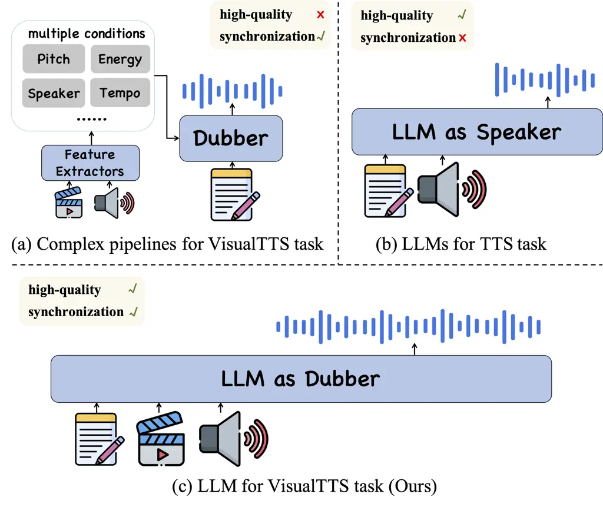
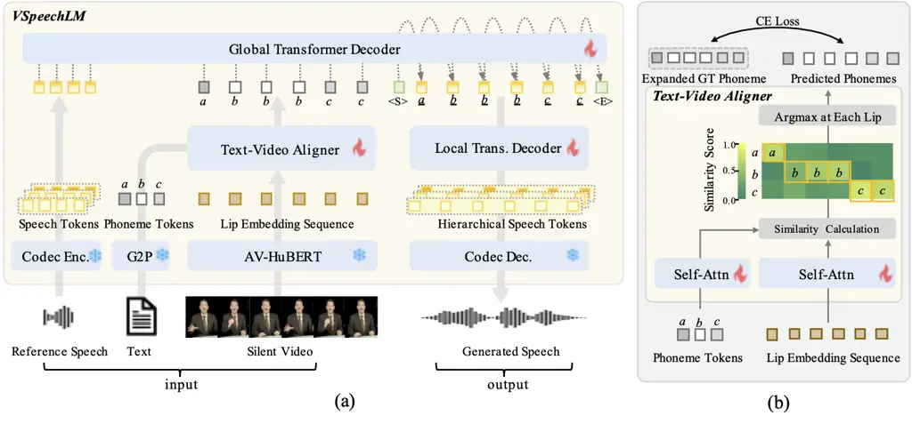
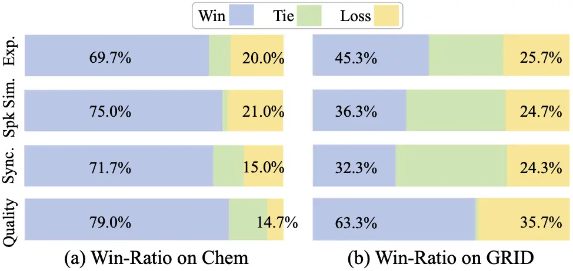
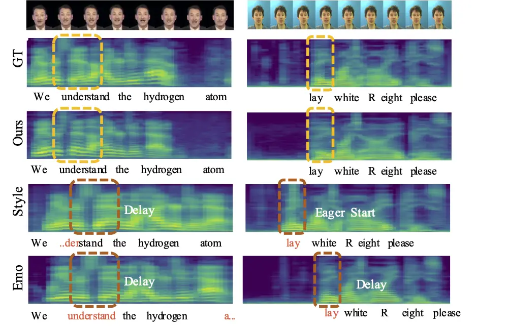

# VSpeechLM: A Visual Speech Language Model for Visual Text-to-Speech Task

Conference: ACM Multimedia Asia; December 9–12, 2025; Kuala Lumpur,
MalaysiaACM Multimedia Asia (MMAsia ’25), December 9–12, 2025, Kuala
Lumpur,
MalaysiaDOI: [10.1145/3743093.3771012](https://doi.org/10.1145/3743093.3771012)ISBN: 979-8-4007-2005-5/2025/12260CCS: Information
systems Speech / audio searchCCS: Information systems Multimedia content
creation

Yuyue Wang
[](https://orcid.org/0009-0005-6987-1028)
Note: Equal contributions. email: <wangyuyue123@ruc.edu.cn>
Affiliation: Gaoling School of Artificial Intelligence, Renmin
University of China , Xin Cheng
[](https://orcid.org/0009-0001-7581-8662)
email: <chengxin000@ruc.edu.cn> Affiliation: Gaoling School of
Artificial Intelligence, Renmin University of China , Yihan Wu
[](https://orcid.org/0009-0001-0312-782X)
email: <yihanwu@ruc.edu.cn> Affiliation: Gaoling School of Artificial
Intelligence, Renmin University of China , Xihua Wang
[](https://orcid.org/0009-0002-9454-5775)
email: <xihuaw@ruc.edu.cn> Affiliation: Gaoling School of Artificial
Intelligence, Renmin University of China , Jinchuan Tian
[](https://orcid.org/0000-0002-2129-471X)
email: <jinchuat@andrew.cmu.edu> Affiliation: Carnegie Mellon University
and Ruihua Song
[](https://orcid.org/0000-0001-6036-9035)
Note: Corresponding author. email: <songruihua_bloon@outlook.com>
Affiliation: Gaoling School of Artificial Intelligence, Renmin
University of China

© acmlicensed

###### Abstract.

The task of Visual Text-to-Speech (VisualTTS), also known as video
dubbing, aims to generate speech synchronized with the lip movements in
an input video, in additional to being consistent with the content of
input text and cloning the timbre of a reference speech. Existing
VisualTTS models typically adopt lightweight architectures and design
specialized modules to achieve the above goals respectively, yet the
speech quality is not satisfied due to the model capacity and the
limited data in VisualTTS. Recently, speech large language models
(SpeechLLM) show the robust ability to generate high-quality speech. But
few work has been done to well leverage temporal cues from video input
in generating lip-synchronized speech. To generate both high-quality and
lip-synchronized speech in VisualTTS tasks, we propose a novel Visual
Speech Language Model called VSpeechLM based upon a SpeechLLM. To
capture the synchronization relationship between text and video, we
propose a text-video aligner. It first learns fine-grained alignment
between phonemes and lip movements, and then outputs an expanded phoneme
sequence containing lip-synchronization cues. Next, our proposed
SpeechLLM based decoders take the expanded phoneme sequence as input and
learns to generate lip-synchronized speech. Extensive experiments
demonstrate that our VSpeechLM significantly outperforms previous
VisualTTS methods in terms of overall quality, speaker similarity, and
synchronization metrics.

###### Keywords: 

Visual Text-to-Speech, Visual Voice Cloning, Video Dubbing

## 1. Introduction



Figure 1. Comparison of our proposed approch with related works. (a)
shows the previous VisualTTS method; (b) shows the conventional
SpeechLLMs for the TTS task; (c) shows the proposed VSpeechLM designed
for the VisualTTS task.

The Visual Text-to-Speech (VisualTTS) task aims to dub a video by
synthesizing speech that aligns with input text, mimics the timbre of a
reference voice and synchronizes with the lip movements of a speaker in
the video (Lu et al., 2022). It has broad applications in film dubbing,
video post-production, and multilingual translation, but remains highly
challenging. It requires the model to generate high-quality and natural
speech that is easy to understand and highly similar to the reference
timbre, and simultaneously to achieve precise lip synchronization,
placing higher demands on the model.

Most prior VisualTTS works (Hu et al., 2021; Chen et al., 2022; Cong et
al., 2023; Zhang et al., 2024; Cong et al., 2024b; Zhao et al., 2024a;
Zhao et al., 2024b; Cheng et al., 2025b; Guan et al., 2025; Cheng et
al., 2025a) use lightweight TTS backbones (Ren et al., 2021; Mehta et
al., 2024). These methods (Figure 1(a)) often use external modules to
extract speech-related features, such as speaker embeddings, and design
auxiliary modules for speaker enhancement and prosody modeling. However,
these methods struggle to scale due to limited training data and model
capacity, facing challenges in generating high-quality speech with the
video condition.

Recently, Speech Large Language Models (SpeechLLMs) (Borsos et al.,
2023; Chen et al., 2024; Défossez et al., 2024; Yang et al., 2023; Maiti
et al., 2024; Nguyen et al., 2024) have made great progress in the TTS
task. By discretizing speech into tokens and formulating speech
synthesis as a language modeling task, SpeechLLMs effectively leverage
large-scale diverse datasets, making them robust to noisy training data
and capable of generating high-quality speech. However, they lack the
ability to leverage lip information from the visual modality, making
fine-grained synchronization difficult (Figure 1(b)). For example,
DubWise (Sahipjohn et al., 2024) attempts to incorporate video features
into SpeechLLM via cross-attention, but only control global duration
without fine temporal alignment. Effectively incorporating temporal cues
from the visual modality into SpeechLLMs remains a key challenge.

In this work, we propose VSpeechLM, a novel Visual Speech Language Model
that improves both speech quality and lip synchronization in VisualTTS
(Figure 1(c)). We adopt a SpeechLLM as the decoder to ensure
high-quality speech generation. To integrate visual cues, we introduce a
text-video aligner, which first learns fine-grained temporal alignment
between phonemes and lip movements, then expands the phoneme sequence
based on the alignment to express the synchronization between text and
video. Then the expanded phoneme sequence, combined with reference
speech as a prompt, guides the SpeechLLM based decoders to generate
speech that is both natural-sounding and lip-synchronized. We evaluate
our VSpeechLM on two widely used VisualTTS datasets in terms of overall
speech quality, speaker similarity, intelligibility, and duration
consistency. Experimental results demonstrate that our approach
consistently outperforms previous baselines, validating the
effectiveness of our text-video aligner and SpeechLLM integration. Here
are our three main contributions:

- •
  We propose a VisualTTS framework called VSpeechLM that extends the
  visual modeling capability of SpeechLLM, capable of generating
  high-quality and lip-synchronized speech conditioned on input text,
  video, and reference speech.
- •
  We propose a text-video aligner that effectively integrate
  fine-grained visual temporal cues into the SpeechLLM based decoders,
  helping it generate lip-synchronized speech.
- •
  Extensive experiments demonstrate that our approach achieves
  state-of-the-art performance on two widely used VisualTTS datasets
  across multiple metrics on speech quality, speaker similarity,
  intelligibility, and synchronization.

## 2. Related Work



Figure 2. The architecture of our proposed VSpeechLM. (a) shows the
overall architecture of VSpeechLM. It is composed of three kinds of
components: Feature Extractors that turn the input modalities into
representations; a text-video aligner that generates an expanded phoneme
sequence by capturing the synchronization relationship between phonemes
and lip movements; and a SpeechLLM Decoder that learns to generate
lip-synchronized speech. (b) shows the detailed architecture of our
proposed text-video aligner.

### 2.1. Visual Text-to-Speech Generation

Previous VisualTTS models (Cong et al., 2023; Lu et al., 2023; Zhang et
al., 2024; Cong et al., 2024b; Cong et al., 2024a) are primarily based
on lightweight TTS backbones such as FastSpeech2 (Ren et al., 2021) or
flow-matching TTS models (Mehta et al., 2024). These models often rely
on speaker embeddings (Cong et al., 2023) or dedicated speaker
modules (Zhang et al., 2024; Cong et al., 2024b; Cong et al., 2024a),
and require auxiliary features like pitch and energy, which increase
architectural complexity. However, their performance is still limited by
model capacity and data scale. In this paper, we propose a VisualTTS
framework built on a SpeechLLM that inherently produces high-quality
speech without the need for complex feature engineering. To achieve
fine-grained temporal control, we introduce a text-video aligner that
expands the phoneme sequence based on the learned audio-visual
alignment, guiding the SpeechLLM to generate lip-synchronized speech.

### 2.2. Speech Large Language Models

Recently SpeechLLMs show powerful capabilities in speech
generation (Borsos et al., 2023; Chen et al., 2024), formulating it as a
language modeling task over discretized speech tokens (Zeghidour et al.,
2022; Défossez et al., 2023; Shi et al., 2024; Hsu et al., 2021). By
using phonemes and reference tokens as prompts, these models can be
trained on large-scale datasets to generate diverse and natural speech.
Many recent SpeechLLMs (Chen et al., 2024; Yang et al., 2023) adopt
multi-layer speech codecs (Zeghidour et al., 2022; Shi et al., 2024) to
represent speech at different granularities, improving quality but
increasing sequence length and computation. Many approaches adopt
hierarchical modeling to solve this problem: VALL-E (Chen et al., 2024)
first generates key tokens from the first quantizer using an
autoregressive model and then uses a non-autoregressive model to
generate tokens from other layer. UniAudio (Yang et al., 2023) and
MoShi (Défossez et al., 2024) use global-local Transformers to reduce
cost by decoupling inter- and intra-frame modeling. However, most
SpeechLLMs are limited to audio-text inputs and cannot leverage visual
information, making them unsuitable for VisualTTS. To address this, we
propose a new model called VSpeechLM, which extends the SpeechLLM to
incorporate video modality. A text-video aligner provides an expanded
phoneme sequence enriched with lip-synchronization cues, guiding the
model to generate speech that is both high-quality and precisely
synchronized with lip movement.

## 3. Our Approach

### 3.1. Overiew

To generate both high-quality and synchronized speech given a video, a
text and a reference voice, we propose VSpeechLM, a Visual Speech
Language Model that extends SpeechLLM with temporal alignment
capabilities. As shown in Figure 2(a), VSpeechLM consists of three
components: Modality Representation modules, a text-video aligner, and a
SpeechLLM-based Decoder. The Modality Representation modules extract
phonemes from text, lip embeddings from video, and discretize reference
speech into speech tokens. The text-video aligner models temporal
alignment by computing a similarity matrix between phonemes and lip
embeddings, expanding the phoneme sequence to match video length,
thereby incorporating lip-synchronization cues. The SpeechLLM-based
Decoder employs global and local Transformers: the global Transformer
generates temporal context vectors aligned with lip frames, while the
local Transformer decomposes these vectors into hierarchical speech
tokens for decoding into speech. Details on each module and training are
provided in the following subsections.

### 3.2. Modality Representation

We detail our representation of the three input modalities.

- •
  Text modality: We use the grapheme-to-phoneme (G2P) tool¹¹ 1
  https://github.com/Kyubyong/g2p to extract the discrete phoneme
  sequence $`\mathbf{P}`$ of length $`\boldmath{T_{p}}`$.
- •
  Video modality: Temporal cues come from lip movements. We extract lip
  embeddings $`\mathbf{L}\in\mathbb{R}^{T_{v}\times dim}`$ using the
  AV-HuBERT (Shi et al., 2022) model, where $`T_{v}`$ is the number of
  input video frames sampled at 25fps, and $`dim=1024`$ is the embedding
  dimension.
- •
  Speech modality: Since VisualTTS is treated as a language modeling
  task, we tokenize speech using the high-fidelity discrete speech
  tokenizer Encodec (Défossez et al., 2023), to convert speech into
  hierarchical discrete token sequences. A speech segment $`s`$ is
  encoded into a sequence of hierarchical discrete tokens:

  ```math
  \displaystyle C \displaystyle=[C_{1},C_{2},...,C_{T_{s}}]=\text{Encoder}_{\text{encodec}}(s)\in\mathbb{N}^{T_{s}\times N_{q}}, \tag{1}
  ```

  ```math
  \displaystyle C_{t} \displaystyle=[C_{t}^{1},C_{t}^{2},...,C_{t}^{N_{q}}]^{\top}\in\mathbb{N}^{Nq\times 1}, \tag{2}
  ```

  where $`T_{s}`$ is the time steps of the speech sequence, $`N_{q}=8`$
  is the number of codebooks in the EnCodec model.
  $`C_{t}\in\mathbb{N}^{N_{q}\times 1}`$ is the $`t`$-th step of the
  speech sequence, and $`C_{t}^{i}`$ is the index selected from the
  $`i`$-th codebook at step $`t`$. The sample rate is 16k Hz. Both
  reference and target speech are discretized as speech tokens. The
  reference speech serves as part of the prompt input to VSpeechLM’s
  decoder, providing speaker identity information. The target speech is
  the model’s target output for training.

Given the fixed temporal correspondence between video and speech, their
sequence lengths can be aligned using repetition-based interpolation or
by adjusting the sampling rates. For notational simplicity, we assume
that video and speech share the same sequence length (i.e.
$`T_{v}=T_{s}`$) in this paper.

### 3.3. Text-Video Aligner

We propose a text-video aligner that expands a raw phoneme sequence to
match the video’s lip movements along the time axis, producing an
expanded phoneme sequence with duration cues. As shown in Figure 2(b),
given the phoneme sequence $`\mathbf{P}`$ and the lip embeddings
$`\mathbf{L}`$, the aligner computes a similarity matrix and assigns a
phoneme to each video frame, generating an expanded sequence aligned
with lip motion.

#### 3.3.1. Phoneme-Lip Similarity Matrix.

To align the phoneme sequence $`\mathbf{P}`$ (with length $`T_{p}`$) and
lip embeddings $`\mathbf{L}`$ (with length $`T_{v}`$), we use two
encoders to project them into a shared representation space. The phoneme
encoder embeds $`\mathbf{P}`$ into continuous features
$`\mathbf{P_{enc}}\in\mathbb{R}^{T_{p}\times dim}`$, and the lip encoder
transforms $`\mathbf{L}`$ into
$`\mathbf{L_{enc}}\in\mathbb{R}^{T_{v}\times dim}`$, where $`dim`$ is
the hidden dimension of the feature vectors. Both encoders adopt
self-attention mechanism, enabling the model to capture complex
dependencies by attending to interactions between all positions in the
input sequence.

Then we can compute the similarity matrix $`\mathbf{A}`$ between the two
sequences, which serves as the alignment result:

```math
\mathbf{A}=\text{Softmax}(\frac{\mathbf{P_{enc}}\mathbf{L_{enc}}^{\top}}{\sqrt{dim}})\in\mathbb{R}^{T_{p}\times T_{v}}, \tag{3}
```

where $`T_{v}`$ and $`T_{p}`$ denote the length of $`\mathbf{L_{enc}}`$
and $`\mathbf{P_{enc}}`$ respectively, and $`dim`$ denotes the hidden
dimension. The element $`a_{i,j}`$ in $`\mathbf{A}`$ indicates the
similarity between the $`i`$-th phoneme and the $`j`$-th lip frame.

#### 3.3.2. Expanding Phoneme according to Phoneme-Lip Similarity.

Similarity matrix $`\mathbf{A}`$ provides temporal alignment scores
between phonemes and lip movements. Based on it, we can identify the max
similarity score of each column (lip column). Through this, each lip
movement is associated with a phoneme, then forms the final expanded
phoneme sequence:

```math
\displaystyle\mathbf{P_{exp}}=\text{Repeat}(\mathbf{P}[\text{argmax}(\mathbf{A},dim=1)]),\mathbf{P_{exp}}\in\mathbb{R}^{T_{v}} \tag{4}
```

where $`\mathbf{P}`$ is the input phoneme sequence, $`\mathbf{A}`$ is
the similarity matrix. The expanded sequence $`\mathbf{P_{\text{exp}}}`$
is synchronized with lip motion and provides fine-grained duration cues
for downstream generation.

### 3.4. SpeechLLM based Decoder

VSpeechLM’s Decoder adopts a multiscale Transformer structure,
consisting of a global Transformer and a local Transformer to model
speech at different granularities. Unlike prior SpeechLLMs (Yang et al.,
2023; Défossez et al., 2024), we feed the global Transformer the
expanded phoneme sequence $`\mathbf{P_{\text{exp}}}`$, enabling it to
leverage duration cues and generate a temporal context vector for each
step. The local Transformer then decomposes these context vectors into
hierarchical speech tokens.

|                                            |                         |                      |                    |                        |                           |                         |                      |                    |                        |                           |
| ------------------------------------------ | ----------------------- | -------------------- | ------------------ | ---------------------- | ------------------------- | ----------------------- | -------------------- | ------------------ | ---------------------- | ------------------------- |
|                                            | Results on Chem Dataset |                      |                    |                        |                           | Results on GRID Dataset |                      |                    |                        |                           |
|                                            | WER $`\downarrow`$      | Spk Sim $`\uparrow`$ | UTMOS $`\uparrow`$ | MCD-DTW $`\downarrow`$ | MCD-DTW-SL $`\downarrow`$ | WER $`\downarrow`$      | Spk Sim $`\uparrow`$ | UTMOS $`\uparrow`$ | MCD-DTW $`\downarrow`$ | MCD-DTW-SL $`\downarrow`$ |
| GT                                         | 3.87                    | 100                  | 4.19               | 0.00                   | 0.00                      | 22.5                    | 100                  | 4.04               | 0.00                   | 0.00                      |
| GT (decoder)                               | 3.89                    | 99.8                 | 3.77               | 2.60                   | 2.61                      | 22.6                    | 93.3                 | 3.98               | 2.62                   | 2.66                      |
| Baselines                                  |                         |                      |                    |                        |                           |                         |                      |                    |                        |                           |
| DSU (InterSpeech2023) (Lu et al., 2023)    | 38.6                    | 72.9                 | 3.33               | 6.69                   | 6.72                      | 39.9                    | 8.60                 | 3.55               | 10.6                   | 10.6                      |
| HPMDubbing (CVPR2023) (Cong et al., 2023)  | 29.8                    | 44.6                 | 3.11               | 6.91                   | 8.56                      | 44.2                    | 31.3                 | 2.11               | 6.79                   | 7.09                      |
| StyleDubber (ACL2024) (Cong et al., 2024b) | 14.2                    | 73.7                 | 3.14               | 6.01                   | 6.36                      | 19.6                    | 67.0                 | 3.73               | 6.33                   | 6.42                      |
| EmoDubber (CVPR2024) (Cong et al., 2024a)  | 12.8                    | 78.1                 | 3.87               | 6.51                   | 6.51                      | 19.8                    | 50.5                 | 3.98               | 3.92                   | 3.92                      |
| Ours                                       |                         |                      |                    |                        |                           |                         |                      |                    |                        |                           |
| VSpeechLM                                  | 12.5                    | 78.9                 | 3.73               | 5.16                   | 5.28                      | 18.3                    | 69.7                 | 3.94               | 3.91                   | 3.90                      |

Table 1. Comparison of our method with baselines on the datasets Chem
and GRID. For WER, MCD-DTW and MCD-DTW-SL, we follow the same computing
methods as the baselines (Cong et al., 2023; Cong et al., 2024b; Cong et
al., 2024a) and compare our results with their reported scores in (Cong
et al., 2024a). For UTMOS and Spk Sim, we use their public checkpoint to
generate speech and evaluate. The highest score for each metric is in
bold, while the second highest score is in underlined.³³ 3 Sentences in
the GRID dataset are short and often contain liaison (connected speech),
and non-standard pronunciation. For example, “lay” may be misrecognized
as “they”, and “place green” as “play screen” by the ASR model, leading
to suboptimal WER even for ground-truth audio.

#### 3.4.1. Global Transformer.

As described in Section 3.2, a speech segment is encoded as a sequence
of hierarchical discrete tokens
$`C=\left\{C_{t}^{i}\right\}_{t=1\sim T_{s}}^{i=1\sim N_{q}}`$. To align
with the speech token structure, the phoneme input is replicated
$`N_{q}`$ times. At each time step $`t`$, the global Transformer
generates a temporal context vector:

```math
h_{t}=\text{Trans}_{\text{global}}(C_{\textless t-1}). \tag{5}
```

We leverage the global temporal modeling capability of the global
Transformer, letting it learn from the lip-synchronized
$`\mathbf{P_{exp}}`$. As a result, the temporal context vectors for step
$`t`$ contain speech information that is aligned with the corresponding
lip frame.

#### 3.4.2. Local Transformer.

Then, the local Transformer decomposes the temporal context vector
$`h_{t}`$ from the global transformer into $`N_{q}`$ hierarchical tokens
autoregressively:

```math
C_{t}^{i}=\text{Trans}_{\text{local}}(h_{t},C_{t-1}^{\textless i}), \tag{6}
```

where $`C_{t}^{i}`$ is the index of the $`i`$-th codebook, which
captures information from a specific aspect of the speech signal.

### 3.5. Training and Inference

#### 3.5.1. Training objective of text-video aligner.

We model the learning process of the text-video aligner as a
classification task, where each lip movement corresponds to a
ground-truth phoneme in the dataset. Specifically, the model should
identify the phoneme “class” that corresponds to each lip movement via
the similarity matrix. We first extract the real duration of each
phoneme using the Montreal Forced Aligner (MFA) tool (McAuliffe et al.,
2017). Repetition of each phoneme according to its duration yields the
ground truth expanded phoneme sequence $`\mathbf{G}`$ (length
$`T_{v}`$). Consequently, we adopt the cross-entropy loss as the
training objective:

```math
\mathcal{L}_{CE}^{align}=-\sum_{i}^{T_{v}}\log\mathbf{A}^{\mathbf{G_{i}}}_{i} \tag{7}
```

where $`\mathbf{A}`$ denotes the predicted similarity matrix.
$`\mathbf{A}^{\mathbf{G_{i}}}_{i}`$ can be viewed as the probability of
“classifying” the $`i`$-th lip frame to phoneme $`\mathbf{G_{i}}`$.

#### 3.5.2. Training objective of SpeechLLM based Decoder.

As described in Section 3.4, in one generating step, VSpeechLM’s decoder
uses the local Transformer to autoregressively generate speech tokens,
conditioned on global context from the global Transformer. The decoder
is trained to minimize cross-entropy loss, guided by the target speech
sequence:

```math
\mathcal{L}_{CE}^{dec}=-\sum_{t=1}^{T_{s}}\sum_{i=1}^{N_{q}}\log P(C_{t}^{i}|C_{t}^{\textless i},C_{\textless t}). \tag{8}
```

#### 3.5.3. Training and Inference of VSpeechLM

In the training stage, the text-video aligner and the SpeechLLM based
Decoders are trained jointly. The training is guided by minimizing the
sum of $`\mathcal{L}_{CE}^{align}`$ and $`\mathcal{L}_{CE}^{dec}`$.
During the training stage, we use the ground truth expanded phoneme
sequence $`\mathbf{G}`$ (see Section 3.5.1) as the input of the
SpeechLLM based decoder. In the inference stage, the predicted expanded
phoneme sequence $`\mathbf{P_{exp}}`$ is used.

## 4. Experiments

### 4.1. Experimental Setup

Datasets. We use two datasets. 1) Single-speaker English chemistry
lecture dataset: Chem (Prajwal et al., 2020). Following (Cong et al.,
2024a; Cong et al., 2024b; Cong et al., 2023), we split it into 6,240
training, 200 validation, and 200 test samples. 2) Multi-speaker English
dataset GRID (Zhao et al., 2024c) with 33 speakers and 1,000 clips of
each speaker. Following (Cong et al., 2024b; Cong et al., 2024a), we
select 100 clips per speaker for testing, resulting in 32,670 training
and 900 test samples.

Baselines. We compare against four baselines: DSU (Lu et al., 2023),
HPMDubbing (Cong et al., 2023), StyleDubber (Cong et al., 2024b), and
EmoDubber (Cong et al., 2024a). The first three use FastSpeech2-like
decoders, while EmoDubber adopts a flow-matching decoder. Details are in
the supplementary.

Metrics. We evaluate generated speech using five objective metrics: Word
Error Rate (WER) for intelligibility, speaker similarity (Spk Sim) for
timbre consistency, UTMOS (Saeki et al., 2022) for overall quality, Mel
Cepstral Distortion with Dynamic Time Warping (MCD-DTW)(Chen et al., 2022) for acoustic fidelity, and MCD-DTW weighted by speech length
(MCD-DTW-SL)(Chen et al., 2022) to assess duration synchronization.
Details are in the supplementary.

Implementation Details. We initialize VSpeechLM decoders from
ESPnet (Watanabe et al., 2018; Tian et al., 2025) pretrained models and
jointly train all modules. We use AdamW with an initial learning rate of
$`1\mathrm{e}{-4}`$ and betas of (0.9, 0.95). During inference, we apply
top-$`k`$ sampling ($`k=30`$). The temperature is set to 1.2 for the
expressive Chem dataset and 0.5 for the less variable GRID dataset. More
model architecture and training details are provided in the
supplementary material.

### 4.2. Objective Evaluation

We compare the performance of VSpeechLM and the baselines on two widely
used datasets: Chem and GRID. We report the results in Table 1. The left
and right sides of the table are the results of Chem and GRID,
respectively. Our VSpeechLM exceeds the baselines in all metrics except
for UTMOS in the two datasets. Specifically, in terms of
intelligibility, as shown by the decrease in WER, VSpeechLM performs
better than the SOTA model EmoDubber (Cong et al., 2024a). In speaker
similarity (Spk Sim), VSpeechLM outperforms other models despite not
using an external encoder for speaker embedding or a dedicated speaker
modeling module. This demonstrates the strong in-context learning
capability of our model. In terms of synchronization (MCD-DTW-SL), on
the Chem and GRID datasets, there are improvements of 17.6% (vs.
EmoDubber) and 60.9% (vs. StyleDubber) reduction respectively compared
to the SOTA results, which indicates that our method can achieve better
duration consistency, proving the effectiveness of the temporal
controlling. In terms of UTMOS, our approach performs the second best,
just behind EmoDubber a bit. But it is close to the codec decoder upper
bound (only 0.04)—suggesting codec quality may limit further gains. We
plan to explore better codecs or direct mel-based reconstruction in the
future.

### 4.3. Subjective Evaluation

We further conduct subjective evaluation. We select the methods that
perform best among baselines on two datasets for comparison.
Specifically, we compared our method with EmoDubber on the Chem dataset
and with StyleDubber on the GRID dataset. We sampled 50 clips each from
the test sets of Chem and GRID. Ten experts are invited to score the
models based on four criteria: speech quality (Quality.), lip
synchronization (Sync.), speaker similarity (Spk Sim.), and
expressiveness (Exp.). The scoring was done by selecting a winner or
declaring a tie for each comparison. The results, summarized in
Figure 3, show that our model outperforms the baselines over four
criteria on the two datasets. We find that, when compared to the GRID
dataset, there are many ties in Exp. and Sync.. This is because the
speech in the GRID dataset was recorded in a studio background, with
short sentences and neutral emotions. In this dataset, lip
synchronization is relatively easier to capture, making it hard for
humans to tell the difference.



Figure 3. Human Evaluation Results. We compare VSpeechLM with the
strongest baselines on Chem and GRID in terms of speech quality
(Quality), lip synchronization (Sync), speaker similarity (Spk Sim), and
expressiveness (Exp). (a) shows win-tie-loss ratios against EmoDubber on
Chem, and (b) against StyleDubber on GRID.

### 4.4. Case Studies

Figure 4 presents two representative cases from both the Chem and GRID
test set, demonstrating our VSpeechLM achieves superior synchronization
while maintaining high acoustic quality. We compare our VSpeechLM with
two baselines that perform better in objective evaluation: StyleDubber
and EmoDubber. In Case 1, the two baselines exhibit noticeable delays
when pronouncing the word “understand”. In Case 2, StyleDubber exhibits
an early onset when pronouncing the word “lay”, while EmoDubber shows a
delayed onset. In contrast, our proposed VSpeechLM consistently
generates clear and well-structured Mel-spectrograms, with speech that
is better aligned with ground truth.



Figure 4. Case studies on the Chem and GRID test sets. The top two rows
show video frames and ground-truth Mel-spectrograms, followed by outputs
from VSpeechLM, StyleDubber, and EmoDubber. Mel-spectrograms, with time
and frequency represented on the horizontal and vertical axes
respectively, allows visual comparison of synchronization and acoustic
quality against the ground truth.

### 4.5. Ablations and Analyses

In this section, we present the main ablation studies and analyses of
the model’s capabilities. Additional results and analyses can be found
in the supplementary material.

#### 4.5.1. The text-video aligner helps SpeechLLMs based decoders to “see” better.

|                          | WER $`\downarrow`$ | Spk Sim $`\uparrow`$ | UTMOS $`\uparrow`$ | MCD-DTW-SL $`\downarrow`$ |
| ------------------------ | ------------------ | -------------------- | ------------------ | ------------------------- |
| \(a\) text-video aligner | 12.48              | 78.87                | 3.73               | 5.28                      |
| \(b\) no visual          | 15.02              | 76.91                | 3.81               | 6.49                      |
| \(c\) visual prefix      | 15.16              | 74.38                | 3.51               | 6.94                      |

Table 2. Ablating visual integration methods on the Chem dataset. ‘No
visual’ denotes a TTS way without visual information. ‘visual prefix’
denotes a VisualTTS way that visual features are input as a prefix
prompt.

To investigate how to effectively extend visual processing capabilities
for SpeechLLMs, we conduct a comparative analysis of three approaches:
(a) incorporating visual input via our proposed text-video aligner; (b)
performing TTS with the backbone SpeechLLM decoders without any visual
input; (c) extending the backbone SpeechLLM decoders with a visual
prefix prompt for VisualTTS. We evaluate the three methods on the Chem
dataset, with results summarized in Table 2. Our proposed text-video
aligner achieves the best MCD-DTW-SL score, demonstrating its
effectiveness in facilitating lip-synchronized speech generation. In
contrast, method (c) performs the worst in terms of synchronization,
indicating that simply concatenating the video as a prompt has a
negative effect. This is perhaps because the decoder was not pretrained
to process visual inputs, and the limited training data available for
VisualTTS is insufficient for the model to adapt to the new visual
modality, leading to confusion. In comparison, our approach preserves
the decoder’s original input space, making it easier for the model to
learn this synchronization pattern effectively.

#### 4.5.2. Do we really need pretraining and training?

As described in Section 4.1, the VSpeechLM decoder is initialized with
parameters from a pretrained SpeechLM prior to training. To assess the
necessity of each training stage, we compare the following three
settings: (a) Ours: Our full pipeline, where VSpeechLM decoder is both
pretrained and adapted through VisualTTS training; (b) w/o pretraining:
VisualTTS training without decoder pretraining; (c) w/o adapting: the
pretrained decoder is kept frozen when adapted through VisualTTS
training. The results are shown in the Table 3. Omitting either decoder
pretraining or VisualTTS adaptation leads to a significant performance
drop. We attribute this to the pretrained decoder providing a
foundational ability to convert text into speech units, while VisualTTS
training allows the model to adapt to the extended phoneme sequence.
These findings validate the necessity of both components in our proposed
pipeline.

|                       | WER $`\downarrow`$ | Spk Sim $`\uparrow`$ | UTMOS $`\uparrow`$ | MCD-DTW-SL $`\downarrow`$ |
| --------------------- | ------------------ | -------------------- | ------------------ | ------------------------- |
| \(a\) Ours            | 12.5               | 78.9                 | 3.87               | 5.28                      |
| \(b\) w/o pretraining | 151                | 50.6                 | 1.62               | 13.99                     |
| \(c\) w/o adapting    | 829                | 2.86                 | 1.49               | 80.92                     |

Table 3. Comparison Under Different Training Configurations. ‘w/o
pretraining’ indicates that the decoder is randomly initialized and
trained only with VisualTTS. ‘w/o adapting’ indicates that the decoder
is pretrained but kept frozen, with only the text-video aligner adapted
in the VisualTTS stage.

#### 4.5.3. Can VSpeechLM be generalized to unseen data?

Due to the domain limitations of the Chem and GRID datasets, we
conducted zero-shot experiments on 200 randomly sampled clips from the
LRS2 (Afouras et al., 2022) dataset to assess the model’s generalization
ability on complex and diverse data. The LRS2 dataset contains spoken
sentences from BBC television, featuring background noise and
non-frontal face poses. The results are summarized in Table 4. Our model
achieves the best performance on LRS2, demonstrating robustness under
challenging real-world conditions.

|             | WER $`\downarrow`$ | Spk Sim $`\uparrow`$ | UTMOS $`\uparrow`$ | MCD-DTW-SL $`\downarrow`$ |
| ----------- | ------------------ | -------------------- | ------------------ | ------------------------- |
| GT          | 8.52               | 1.00                 | 3.14               | 0.00                      |
| HPMDubbing  | 198                | 33.2                 | 1.28               | 8.43                      |
| StyleDubber | 91.4               | 50.3                 | 1.87               | 14.0                      |
| EmoDubber   | 110                | 10.3                 | 1.70               | 8.68                      |
| VSpeechLM   | 16.1               | 53.9                 | 2.98               | 7.59                      |

Table 4. Zero-shot evaluation results of VSpeechLM on 200 randomly
sampled clips from the LRS2 dataset. LRS2 contains noisy audio and
non-frontal face poses, presenting challenging real-world conditions.

## 5. Conclusion and Future Work

In this work, we propose a novel Visual Speech Language Model
(VSpeechLM) based on a SpeechLLM for generating high-quality and
lip-synchronized speech. To effectively integrate the temporal cues
provided by the visual modality into the conventional SpeechLLM, we
design a text-video aligner. It provides an expanded phoneme sequence
containing lip-synchronization cues. The SpeechLLM based decoders take
this expanded sequence as a prompt and learns to generate
lip-synchronized speech. Experimental results demonstrate that our
proposed VSpeechLM achieves strong performance across multiple
evaluation metrics. In future work, we aim to advance the capabilities
of VisualTTS generation by addressing more intricate and challenging
scenarios, such as generating coherent speech when facing partially
invisible lip motion or low-quality video inputs.

###### Acknowledgements.

This work is supported by the National Natural Science Foundation of
China (No. 62276268).

## References

- Afouras et al. (2022) T. Afouras, J. S. Chung, A. W. Senior, O.
  Vinyals, and A. Zisserman Deep audio-visual speech recognition. IEEE
  Trans. Pattern Anal. Mach. Intell. 44 (12), pp. 8717–8727. External
  Links: [Link](https://doi.org/10.1109/TPAMI.2018.2889052),
  [Document](https://dx.doi.org/10.1109/TPAMI.2018.2889052) Cited by:
  §4.5.3.
- Borsos et al. (2023) Z. Borsos, R. Marinier, D. Vincent, E.
  Kharitonov, O. Pietquin, M. Sharifi, D. Roblek, O. Teboul, D.
  Grangier, M. Tagliasacchi, and N. Zeghidour AudioLM: A language
  modeling approach to audio generation. IEEE ACM Trans. Audio Speech
  Lang. Process. 31, pp. 2523–2533. External Links:
  [Link](https://doi.org/10.1109/TASLP.2023.3288409),
  [Document](https://dx.doi.org/10.1109/TASLP.2023.3288409) Cited by:
  §1, §2.2.
- Chen et al. (2022) Q. Chen, M. Tan, Y. Qi, J. Zhou, Y. Li, and Q. Wu
  V2C: visual voice cloning. In IEEE/CVF Conference on Computer Vision
  and Pattern Recognition, CVPR 2022, New Orleans, LA, USA, June 18-24,
  2022, pp. 21210–21219. External Links:
  [Link](https://doi.org/10.1109/CVPR52688.2022.02056),
  [Document](https://dx.doi.org/10.1109/CVPR52688.2022.02056) Cited by:
  §1, §4.1.
- Chen et al. (2024) S. Chen, S. Liu, L. Zhou, Y. Liu, X. Tan, J. Li, S.
  Zhao, Y. Qian, and F. Wei VALL-E 2: neural codec language models are
  human parity zero-shot text to speech synthesizers. CoRR
  abs/2406.05370. External Links:
  [Link](https://doi.org/10.48550/arXiv.2406.05370),
  [Document](https://dx.doi.org/10.48550/ARXIV.2406.05370), 2406.05370
  Cited by: §1, §2.2.
- Cheng et al. (2025a) X. Cheng, X. Wang, Y. Wu, Y. Wang, and R. Song
  LoVA: long-form video-to-audio generation. In 2025 IEEE International
  Conference on Acoustics, Speech and Signal Processing, ICASSP 2025,
  Hyderabad, India, April 6-11, 2025, pp. 1–5. External Links:
  [Link](https://doi.org/10.1109/ICASSP49660.2025.10888085),
  [Document](https://dx.doi.org/10.1109/ICASSP49660.2025.10888085) Cited
  by: §1.
- Cheng et al. (2025b) X. Cheng, Y. Wang, X. Wang, Y. Wu, K. Guan, Y.
  Chen, P. Zhang, X. Liu, M. Cao, and R. Song VSSFlow: unifying
  video-conditioned sound and speech generation via joint learning.
  External Links: 2509.24773, [Link](https://arxiv.org/abs/2509.24773)
  Cited by: §1.
- Cong et al. (2023) G. Cong, L. Li, Y. Qi, Z. Zha, Q. Wu, W. Wang, B.
  Jiang, M. Yang, and Q. Huang Learning to dub movies via hierarchical
  prosody models. In IEEE/CVF Conference on Computer Vision and Pattern
  Recognition, CVPR 2023, Vancouver, BC, Canada, June 17-24, 2023,
  pp. 14687–14697. External Links:
  [Link](https://doi.org/10.1109/CVPR52729.2023.01411),
  [Document](https://dx.doi.org/10.1109/CVPR52729.2023.01411) Cited by:
  §1, §2.1, Table 1, Table 1, §4.1, §4.1.
- Cong et al. (2024a) G. Cong, J. Pan, L. Li, Y. Qi, Y. Peng, A. van den
  Hengel, J. Yang, and Q. Huang EmoDubber: towards high quality and
  emotion controllable movie dubbing. CoRR abs/2412.08988. External
  Links: [Link](https://doi.org/10.48550/arXiv.2412.08988),
  [Document](https://dx.doi.org/10.48550/ARXIV.2412.08988), 2412.08988
  Cited by: §2.1, Table 1, Table 1, §4.1, §4.1, §4.2.
- Cong et al. (2024b) G. Cong, Y. Qi, L. Li, A. Beheshti, Z. Zhang, A.
  van den Hengel, M. Yang, C. Yan, and Q. Huang StyleDubber: towards
  multi-scale style learning for movie dubbing. In Findings of the
  Association for Computational Linguistics, ACL 2024, Bangkok, Thailand
  and virtual meeting, August 11-16, 2024, L. Ku, A. Martins, and V.
  Srikumar (Eds.), pp. 6767–6779. External Links:
  [Link](https://doi.org/10.18653/v1/2024.findings-acl.404),
  [Document](https://dx.doi.org/10.18653/V1/2024.FINDINGS-ACL.404) Cited
  by: §1, §2.1, Table 1, Table 1, §4.1, §4.1.
- Défossez et al. (2023) A. Défossez, J. Copet, G. Synnaeve, and Y. Adi
  High fidelity neural audio compression. Trans. Mach. Learn. Res. 2023.
  External Links: [Link](https://openreview.net/forum?id=ivCd8z8zR2)
  Cited by: §2.2, 3rd item.
- Défossez et al. (2024) A. Défossez, L. Mazaré, M. Orsini, A. Royer, P.
  Pérez, H. Jégou, E. Grave, and N. Zeghidour Moshi: a speech-text
  foundation model for real-time dialogue. CoRR abs/2410.00037. External
  Links: [Link](https://doi.org/10.48550/arXiv.2410.00037),
  [Document](https://dx.doi.org/10.48550/ARXIV.2410.00037), 2410.00037
  Cited by: §1, §2.2, §3.4.
- Guan et al. (2025) K. Guan, X. Wang, Z. Lai, X. Cheng, P. Zhang, X.
  Liu, R. Song, and M. Cao Taming text-to-sounding video generation via
  advanced modality condition and interaction. External Links:
  2510.03117, [Link](https://arxiv.org/abs/2510.03117) Cited by: §1.
- Hsu et al. (2021) W. Hsu, B. Bolte, Y. H. Tsai, K. Lakhotia, R.
  Salakhutdinov, and A. Mohamed HuBERT: self-supervised speech
  representation learning by masked prediction of hidden units. IEEE ACM
  Trans. Audio Speech Lang. Process. 29, pp. 3451–3460. External Links:
  [Link](https://doi.org/10.1109/TASLP.2021.3122291),
  [Document](https://dx.doi.org/10.1109/TASLP.2021.3122291) Cited by:
  §2.2.
- Hu et al. (2021) C. Hu, Q. Tian, T. Li, Y. Wang, Y. Wang, and H. Zhao
  Neural dubber: dubbing for videos according to scripts. In Advances in
  Neural Information Processing Systems 34: Annual Conference on Neural
  Information Processing Systems 2021, NeurIPS 2021, December 6-14,
  2021, virtual, M. Ranzato, A. Beygelzimer, Y. N. Dauphin, P. Liang,
  and J. W. Vaughan (Eds.), pp. 16582–16595. External Links:
  [Link](https://proceedings.neurips.cc/paper/2021/hash/8a9c8ac001d3ef9e4ce39b1177295e03-Abstract.html)
  Cited by: §1.
- Lu et al. (2022) J. Lu, B. Sisman, R. Liu, M. Zhang, and H. Li
  Visualtts: TTS with accurate lip-speech synchronization for automatic
  voice over. In IEEE International Conference on Acoustics, Speech and
  Signal Processing, ICASSP 2022, Virtual and Singapore, 23-27 May 2022,
  pp. 8032–8036. External Links:
  [Link](https://doi.org/10.1109/ICASSP43922.2022.9746421),
  [Document](https://dx.doi.org/10.1109/ICASSP43922.2022.9746421) Cited
  by: §1.
- Lu et al. (2023) J. Lu, B. Sisman, M. Zhang, and H. Li High-quality
  automatic voice over with accurate alignment: supervision through
  self-supervised discrete speech units. In 24th Annual Conference of
  the International Speech Communication Association, Interspeech 2023,
  Dublin, Ireland, August 20-24, 2023, N. Harte, J. Carson-Berndsen,
  and G. Jones (Eds.), pp. 5536–5540. External Links:
  [Link](https://doi.org/10.21437/Interspeech.2023-2179),
  [Document](https://dx.doi.org/10.21437/INTERSPEECH.2023-2179) Cited
  by: §2.1, Table 1, §4.1.
- Maiti et al. (2024) S. Maiti, Y. Peng, S. Choi, J. Jung, X. Chang,
  and S. Watanabe VoxtLM: unified decoder-only models for consolidating
  speech recognition, synthesis and speech, text continuation tasks. In
  IEEE International Conference on Acoustics, Speech and Signal
  Processing, ICASSP 2024, Seoul, Republic of Korea, April 14-19, 2024,
  pp. 13326–13330. External Links:
  [Link](https://doi.org/10.1109/ICASSP48485.2024.10447112),
  [Document](https://dx.doi.org/10.1109/ICASSP48485.2024.10447112) Cited
  by: §1.
- McAuliffe et al. (2017) M. McAuliffe, M. Socolof, S. Mihuc, M. Wagner,
  and M. Sonderegger Montreal forced aligner: trainable text-speech
  alignment using kaldi. In 18th Annual Conference of the International
  Speech Communication Association, Interspeech 2017, Stockholm, Sweden,
  August 20-24, 2017, F. Lacerda (Ed.), pp. 498–502. External Links:
  [Link](https://doi.org/10.21437/Interspeech.2017-1386),
  [Document](https://dx.doi.org/10.21437/INTERSPEECH.2017-1386) Cited
  by: §3.5.1.
- Mehta et al. (2024) S. Mehta, R. Tu, J. Beskow, É. Székely, and G. E.
  Henter Matcha-tts: A fast TTS architecture with conditional flow
  matching. In IEEE International Conference on Acoustics, Speech and
  Signal Processing, ICASSP 2024, Seoul, Republic of Korea, April 14-19,
  2024, pp. 11341–11345. External Links:
  [Link](https://doi.org/10.1109/ICASSP48485.2024.10448291),
  [Document](https://dx.doi.org/10.1109/ICASSP48485.2024.10448291) Cited
  by: §1, §2.1.
- Nguyen et al. (2024) T. A. Nguyen, B. Muller, B. Yu, M. R.
  Costa-jussà, M. Elbayad, S. Popuri, P. Duquenne, R. Algayres, R.
  Mavlyutov, I. Gat, G. Synnaeve, J. Pino, B. Sagot, and E. Dupoux
  SpiRit-lm: interleaved spoken and written language model. CoRR
  abs/2402.05755. External Links:
  [Link](https://doi.org/10.48550/arXiv.2402.05755),
  [Document](https://dx.doi.org/10.48550/ARXIV.2402.05755), 2402.05755
  Cited by: §1.
- Prajwal et al. (2020) K. R. Prajwal, R. Mukhopadhyay, V. P.
  Namboodiri, and C. V. Jawahar Learning individual speaking styles for
  accurate lip to speech synthesis. In 2020 IEEE/CVF Conference on
  Computer Vision and Pattern Recognition, CVPR 2020, Seattle, WA, USA,
  June 13-19, 2020, pp. 13793–13802. External Links:
  [Link](https://openaccess.thecvf.com/content%5C_CVPR%5C_2020/html/Prajwal%5C_Learning%5C_Individual%5C_Speaking%5C_Styles%5C_for%5C_Accurate%5C_Lip%5C_to%5C_Speech%5C_Synthesis%5C_CVPR%5C_2020%5C_paper.html),
  [Document](https://dx.doi.org/10.1109/CVPR42600.2020.01381) Cited by:
  §4.1.
- Ren et al. (2021) Y. Ren, C. Hu, X. Tan, T. Qin, S. Zhao, Z. Zhao,
  and T. Liu FastSpeech 2: fast and high-quality end-to-end text to
  speech. In 9th International Conference on Learning Representations,
  ICLR 2021, Virtual Event, Austria, May 3-7, 2021, External Links:
  [Link](https://openreview.net/forum?id=piLPYqxtWuA) Cited by: §1,
  §2.1.
- Saeki et al. (2022) T. Saeki, D. Xin, W. Nakata, T. Koriyama, S.
  Takamichi, and H. Saruwatari UTMOS: utokyo-sarulab system for voicemos
  challenge 2022. In 23rd Annual Conference of the International Speech
  Communication Association, Interspeech 2022, Incheon, Korea, September
  18-22, 2022, H. Ko and J. H. L. Hansen (Eds.), pp. 4521–4525. External
  Links: [Link](https://doi.org/10.21437/Interspeech.2022-439),
  [Document](https://dx.doi.org/10.21437/INTERSPEECH.2022-439) Cited by:
  §4.1.
- Sahipjohn et al. (2024) N. Sahipjohn, A. P. Gudmalwar, N. Shah, P.
  Wasnik, and R. R. Shah DubWise: video-guided speech duration control
  in multimodal llm-based text-to-speech for dubbing. CoRR
  abs/2406.08802. External Links:
  [Link](https://doi.org/10.48550/arXiv.2406.08802),
  [Document](https://dx.doi.org/10.48550/ARXIV.2406.08802), 2406.08802
  Cited by: §1.
- Shi et al. (2022) B. Shi, W. Hsu, K. Lakhotia, and A. Mohamed Learning
  audio-visual speech representation by masked multimodal cluster
  prediction. In The Tenth International Conference on Learning
  Representations, ICLR 2022, Virtual Event, April 25-29, 2022, External
  Links: [Link](https://openreview.net/forum?id=Z1Qlm11uOM) Cited by:
  2nd item.
- Shi et al. (2024) J. Shi, J. Tian, Y. Wu, J. Jung, J. Q. Yip, Y.
  Masuyama, W. Chen, Y. Wu, Y. Tang, M. Baali, D. Alharhi, D. Zhang, R.
  Deng, T. Srivastava, H. Wu, A. H. Liu, B. Raj, Q. Jin, R. Song, and S.
  Watanabe ESPnet-codec: comprehensive training and evaluation of neural
  codecs for audio, music, and speech. External Links: 2409.15897,
  [Link](https://arxiv.org/abs/2409.15897) Cited by: §2.2.
- Tian et al. (2025) J. Tian, J. Shi, W. Chen, S. Arora, Y. Masuyama, T.
  Maekaku, Y. Wu, J. Peng, S. Bharadwaj, Y. Zhao, S. Cornell, Y.
  Peng, X. Yue, C. H. Yang, G. Neubig, and S. Watanabe ESPnet-speechlm:
  an open speech language model toolkit. CoRR abs/2502.15218. External
  Links: [Link](https://doi.org/10.48550/arXiv.2502.15218),
  [Document](https://dx.doi.org/10.48550/ARXIV.2502.15218), 2502.15218
  Cited by: §4.1.
- Watanabe et al. (2018) S. Watanabe, T. Hori, S. Karita, T. Hayashi, J.
  Nishitoba, Y. Unno, N. E. Y. Soplin, J. Heymann, M. Wiesner, N.
  Chen, A. Renduchintala, and T. Ochiai ESPnet: end-to-end speech
  processing toolkit. In 19th Annual Conference of the International
  Speech Communication Association, Interspeech 2018, Hyderabad, India,
  September 2-6, 2018, B. Yegnanarayana (Ed.), pp. 2207–2211. External
  Links: [Link](https://doi.org/10.21437/Interspeech.2018-1456),
  [Document](https://dx.doi.org/10.21437/INTERSPEECH.2018-1456) Cited
  by: §4.1.
- Yang et al. (2023) D. Yang, J. Tian, X. Tan, R. Huang, S. Liu, X.
  Chang, J. Shi, S. Zhao, J. Bian, X. Wu, Z. Zhao, S. Watanabe, and H.
  Meng UniAudio: an audio foundation model toward universal audio
  generation. CoRR abs/2310.00704. External Links:
  [Link](https://doi.org/10.48550/arXiv.2310.00704),
  [Document](https://dx.doi.org/10.48550/ARXIV.2310.00704), 2310.00704
  Cited by: §1, §2.2, §3.4.
- Zeghidour et al. (2022) N. Zeghidour, A. Luebs, A. Omran, J. Skoglund,
  and M. Tagliasacchi SoundStream: an end-to-end neural audio codec.
  IEEE ACM Trans. Audio Speech Lang. Process. 30, pp. 495–507. External
  Links: [Link](https://doi.org/10.1109/TASLP.2021.3129994),
  [Document](https://dx.doi.org/10.1109/TASLP.2021.3129994) Cited by:
  §2.2.
- Zhang et al. (2024) Z. Zhang, L. Li, G. Cong, H. Yin, Y. Gao, C.
  Yan, A. van den Hengel, and Y. Qi From speaker to dubber: movie
  dubbing with prosody and duration consistency learning. In Proceedings
  of the 32nd ACM International Conference on Multimedia, MM 2024,
  Melbourne, VIC, Australia, 28 October 2024 - 1 November 2024, J.
  Cai, M. S. Kankanhalli, B. Prabhakaran, S. Boll, R. Subramanian, L.
  Zheng, V. K. Singh, P. César, L. Xie, and D. Xu (Eds.), pp. 7523–7532.
  External Links: [Link](https://doi.org/10.1145/3664647.3680777),
  [Document](https://dx.doi.org/10.1145/3664647.3680777) Cited by: §1,
  §2.1.
- Zhao et al. (2024a) Y. Zhao, Z. Jia, R. Liu, D. Hu, F. Bao, and G. Gao
  MCDubber: multimodal context-aware expressive video dubbing. CoRR
  abs/2408.11593. External Links:
  [Link](https://doi.org/10.48550/arXiv.2408.11593),
  [Document](https://dx.doi.org/10.48550/ARXIV.2408.11593), 2408.11593
  Cited by: §1.
- Zhao et al. (2024b) Y. Zhao, R. Liu, and G. Cong Towards expressive
  video dubbing with multiscale multimodal context interaction. CoRR
  abs/2412.18748. External Links:
  [Link](https://doi.org/10.48550/arXiv.2412.18748),
  [Document](https://dx.doi.org/10.48550/ARXIV.2412.18748), 2412.18748
  Cited by: §1.
- Zhao et al. (2024c) Y. Zhao, R. Liu, and G. Cong Towards expressive
  video dubbing with multiscale multimodal context interaction. CoRR
  abs/2412.18748. External Links:
  [Link](https://doi.org/10.48550/arXiv.2412.18748),
  [Document](https://dx.doi.org/10.48550/ARXIV.2412.18748), 2412.18748
  Cited by: §4.1.
