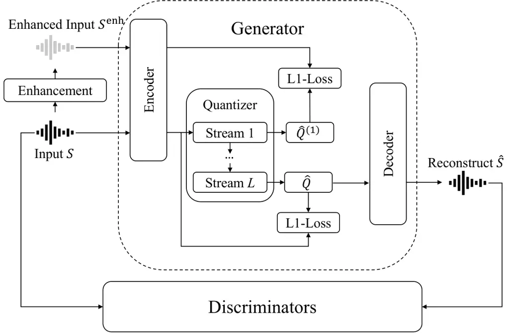

# PURE Codec: Progressive Unfolding of Residual Entropy for Speech Codec Learning

Jiatong Shi Affiliation:  CMU    Haoran Wang Affiliation:  SJTU   
William Chen Affiliation:  CMU    Chenda Li Affiliation:  SJTU   
Wangyou Zhang Affiliation:  SJTU    Jinchuan Tian Affiliation:  CMU   
Shinji Watanabe Affiliation:  CMU

###### Abstract

Neural speech codecs have achieved strong performance in low-bitrate
compression, but residual vector quantization (RVQ) often suffers from
unstable training and ineffective decomposition, limiting reconstruction
quality and efficiency. We propose PURE Codec (Progressive Unfolding of
Residual Entropy), a novel framework that guides multi-stage
quantization using a pre-trained speech enhancement model. The first
quantization stage reconstructs low-entropy, denoised speech embeddings,
while subsequent stages encode residual high-entropy components. This
design improves training stability significantly. Experiments
demonstrate that PURE consistently outperforms conventional RVQ-based
codecs in reconstruction and downstream speech language model-based
text-to-speech, particularly under noisy training conditions.

###### Index Terms: 

Neural Speech Codec, Residual Vector Quantization, Speech Enhancement,
Entropy Decomposition

## I Introduction

Efficient and high-quality speech coding is critical for a broad range
of applications, from real-time communication and mobile telephony to
on-device assistants and speech-driven generative models \[8, 19, 49\].
Classical codecs like AMR and Opus \[31, 5, 45\] rely on hand-engineered
features and structured pipelines tailored to speech properties. In
contrast, neural speech codecs have emerged as a promising alternative,
offering end-to-end learnability, strong rate-distortion performance,
and adaptability across conditions \[57, 50, 40\].

More recently, neural codecs have also played a foundational role in
speech language modeling and generative audio synthesis. By producing
compact, discrete, and perceptually aligned representations of audio,
they support efficient training of large-scale multimodal and
multilingual models for speech understanding and generation \[12, 44,
7\]. As such, codec design has become an integral component in the
broader landscape of speech and audio foundation models.

Neural codecs typically adopt either _single-stream_ or _multi-stream_
structures. Single-stream approaches compress all speech information
into a unified latent space \[53, 35, 6, 18, 29, 11, 28, 33, 51, 22\],
offering simplicity but limited flexibility under varying audio
conditions. In contrast, _multi-stream_ codecs, often implemented using
residual vector quantization (RVQ), employ hierarchical quantization
layers to represent different components of the signal \[2, 52, 27, 23,
9, 17, 25, 13, 55, 1, 56, 21, 54, 10, 41, 57, 61\]. These methods excel
in challenging scenarios such as noisy environments, expressive speech,
and low-bitrate settings.

RVQ enables a progressive encoding of residual errors, with each
quantization stage refining the approximation left by previous
stages \[4\]. Recent works have proposed various improvements to
RVQ \[17, 55, 41\], yet core challenges remain: Training instability:
Late-stage quantizers often fail to learn meaningful representations due
to poor residual decomposition. Redundancy: Without strong inductive
guidance, codebooks may encode overlapping information, undermining
compression efficiency.

To overcome these challenges, we propose PURE Codec, a new codec
architecture that introduces _enhancement-aware supervision_ into the
RVQ pipeline. By leveraging a pre-trained denoising model, the first
quantization stage is trained to reconstruct clean, low-entropy
representations of speech. Subsequent layers are then progressively
tasked with encoding residual entropy.¹¹ 1 While enhancement supervision
is applied only to the first stage, the residual vector quantization
process itself unfolds progressively across the RVQ. The enhanced signal
serves to anchor this unfolding in a structured and perceptually
informed manner. This design improves decomposition quality and
stabilizes training.²² 2 The codebase is shared at
https://github.com/ftshijt/espnet/tree/se_dac and model checkpoints are
released at
https://huggingface.co/collections/espnet/neural-codecs-67cb8c96859c53a6131a85ec.

The key contributions of this work are: (1) A novel RVQ-based codec
guided by a speech enhancement model to anchor low-entropy
reconstruction in the early quantization stage. (2) A progressive
entropy decomposition scheme that yields efficient representations
across varying bitrate regimes. The training is stabilized by combining
a variational auto-encoder (VAE) initialization and a stochastic
enhancement scheduler to balance structure and diversity during
optimization. (3) Empirical evidence demonstrating superior performance
in terms of reconstruction fidelity, robustness, and flexibility
compared to existing neural codecs.

## II Background

### II-A Quantization and Residual Vector Quantization

Neural speech codecs aim to convert continuous acoustic signals into
compact, discrete representations for efficient transmission and
storage. A typical codec architecture comprises an encoder
$`\mathrm{Enc}(\cdot)`$, a quantizer $`\mathrm{Quant}(\cdot)`$, and a
decoder $`\mathrm{Dec}(\cdot)`$. Given an input waveform
$`S\in\mathbb{R}^{1\times T_{S}}`$ with the speech length as $`T_{S}`$,
the encoder produces a sequence of frame-level embeddings
$`Q=\mathrm{Enc}(S)\in\mathbb{R}^{D\times T}`$, where $`D`$ is the
feature dimension and $`T`$ is the number of frames.

To discretize these embeddings, many neural codecs employ RVQ as the
quantizer, which encodes the signal progressively through a sequence of
quantization stages. Specifically, RVQ uses $`L`$ codebooks
$`\{\mathcal{B}^{1},\dots,\mathcal{B}^{L}\}`$, each containing $`B`$
vectors in $`\mathbb{R}^{D}`$. Here, the frame-level embedding sequence
$`Q`$ can be elaborated into a sequence of embedding states
$`[q_{1},\dots,q_{T}]`$. At each frame $`t`$, quantization begins with
the raw embedding $`r_{t}^{0}=q_{t}`$ and iteratively selects the
nearest codeword embedding from each codebook to reduce the residual
error:

```math
\displaystyle c_{t}^{l} \displaystyle=\arg\min_{j}\|r_{t}^{l-1}-b_{j}^{l}\|_{2}^{2}\in\{1,...,B\}, \tag{1}
```

```math
\displaystyle\hat{q}_{t}^{(l)} \displaystyle=b_{c_{t}^{l}}^{l}, \tag{2}
```

```math
\displaystyle r_{t}^{l} \displaystyle=r_{t}^{l-1}-b_{c_{t}^{l}}^{l}, \tag{3}
```

where $`c_{t}^{l}`$ is the selected index at the stream $`l`$ and
$`b_{c_{t}^{l}}^{l}`$ is the corresponding codeword embedding. The
quantized embedding $`\hat{q}_{t}`$ for frame $`t`$ is the sum of
selected vectors across all streams:

```math
\hat{q}_{t}=\sum_{l=1}^{L}\hat{q}_{t}^{(l)}=\sum_{l=1}^{L}b_{c_{t}^{l}}^{l}. \tag{4}
```

The decoder reconstructs the waveform from the sequence
$`\hat{Q}=[\hat{q}_{1},\dots,\hat{q}_{T}]`$ via
$`\hat{S}=\mathrm{Dec}(\hat{Q})`$. The whole quantization process can be
defined as

```math
\left(\hat{Q},\{c_{t}^{l}\}_{t=1,\,l=1}^{T,\,L}\right)=\mathrm{Quant}(Q), \tag{5}
```

### II-B Extensions and Challenges of RVQ in Neural Codecs

While RVQ offers a natural multi-stage structure for neural
quantization, its performance in practice is often limited by training
instability and poor decomposition of information across layers. Recent
studies have proposed various extensions to enhance RVQ, such as
cross-scale RVQ \[17\], group RVQ \[55\], and multi-scale RVQ \[41\].
These methods aim to improve both the representational capacity and
optimization behavior of RVQ-based codecs.

While these approaches have led to improvements in expressivity and
bitrate flexibility, they often rely on architectural modifications or
complex training heuristics without explicitly aligning quantization
stages with the underlying entropy structure of the speech signal. As a
result, stage-level redundancy and training instability remain open
challenges, especially in low-bitrate or noisy training conditions.
These challenges motivate a reformulation of RVQ that directly guides
the decomposition process using signal structure cues, a gap we address
in our proposed PURE Codec framework.

### II-C Motivation for Enhancement-Guided Quantization

To address these limitations, we propose a reformulation of residual
vector quantization (RVQ) that explicitly aligns the quantization stages
with the natural information structure of speech. Our key insight is
that enhanced (denoised) speech signals, produced by high-quality speech
enhancement models, exhibit lower entropy than their original noisy
counterparts.³³ 3 In our hypothesis, the clean signal is more
informative compared to the noisy signal and can be regarded as lower
entropy, which is further confirmed in the following perceptual entropy
analysis. These enhanced signals effectively suppress stochastic noise
and background interference while preserving the underlying phonetic and
prosodic structure, resulting in more regular, less variable, and
inherently more compressible representations.

By guiding the first quantization stage to reconstruct these low-entropy
embeddings, we encourage the early codebooks to focus on structured,
perceptually salient components of the signal. This design allows
subsequent stages to naturally refine the residual, higher-entropy
content. The resulting quantization hierarchy progressively unfolds the
residual entropy of speech, stabilizing training, reducing redundancy,
and yielding a more modular codec architecture.

This design principle is further supported by our analysis of perceptual
entropy (PE), a psychoacoustic measure estimating the theoretical lower
bound of perceptual coding rate \[24, 31, 38\]. Using 5,000 randomly
sampled utterances from the URGENT Challenge training set \[60\], we
compute PE for both noisy and enhanced speech.⁴⁴ 4 We use the
implementation of \[38\] for PE calculation. Results show that
enhancement reduces PE by 57.80% on average, confirming that enhanced
speech is substantially more compressible from a perceptual standpoint.
This observation underscores the utility of using enhancement-guided
targets in the quantization process.

This principle forms the foundation of our proposed framework, PURE
Codec, which integrates enhancement-aware supervision into RVQ and
decomposes speech entropy in a structured, progressive manner. In the
following section, we detail the architecture and training methodology
of PURE Codec, and demonstrate how this design enables efficient,
scalable, and robust speech compression.



Fig. 1: PURE Codec framework. The input waveform $`S`$ is optionally
enhanced to produce $`S^{\text{enh}}`$, guiding the first quantization
stage via low-entropy embeddings. The encoder output is refined through
multiple quantization streams and decoded to reconstruct $`\hat{S}`$. L1
losses and adversarial losses from discriminators supervise training.
Refer to Sec. III for details.

## III PURE Codec

### III-A General Framework

PURE Codec is a multi-stage, vector-quantized neural speech codec that
introduces a residual decomposition aligned with the entropy profile of
the input signal. Building on the RVQ framework, PURE incorporates a
novel enhancement-guided hierarchy, where early stages (Stream 1) encode
enhanced (low-entropy) content, and later stages (up to Stream $`L`$)
progressively capture noisier (higher-entropy) residuals.

As illustrated in Figure 1, the codec follows the basic design of the
RVQ-based codec discussed in Sec. II. In parallel with the basic
encoder-decoder design, an optional enhancement module processes $`S`$
to produce a denoised waveform $`S^{\text{enh}}=\mathrm{Enh}(S)`$, which
is then encoded to produce an enhanced embedding
$`\tilde{Q}=\mathrm{Enc}(S^{\text{enh}})`$. This enhanced embedding
serves as a low-entropy anchor for supervising the first quantization
stream. Each stream in the quantizer sequentially refines the
approximation of $`Q`$ using residual codebook lookups. The first stream
is explicitly trained to approximate $`\tilde{Q}`$, while the following
streams (2 to $`L`$) model the residuals.⁵⁵ 5 Please refer Sec. III-B
for more details. The quantized embedding
$`\hat{Q}=[\hat{q}_{1},\dots,\hat{q}_{T}]`$ is then passed through the
decoder to reconstruct the waveform $`\hat{S}=\mathrm{Dec}(E)`$.

### III-B Progressive Unfolding of Residual Entropy

We formalize the PURE Codec’s entropy-guided quantization as follows.
Let $`\tilde{q}_{t}=\mathrm{Enc}(S^{\text{enh}})_{t}`$ be the enhanced
embedding at frame $`t`$, and $`q_{t}=\mathrm{Enc}(S)_{t}`$ the original
embedding (following the same formulation as Sec. II). The first
quantization stage minimizes the error between $`\tilde{q}_{t}`$ and its
closest codebook entry:

```math
\displaystyle c_{t}^{1} \displaystyle=\arg\min_{j}|\tilde{q}_{t}-b_{j}^{1}|_{2}^{2}\in\{1,\dots B\}, \tag{6}
```

```math
\displaystyle\hat{q}_{t}^{(1)} \displaystyle=b_{c_{t}^{1}}^{1}, \tag{7}
```

```math
\displaystyle r_{t}^{1} \displaystyle=q_{t}-\hat{q}_{t}^{(1)}. \tag{8}
```

We denote $`\hat{Q}^{(1)}=[\hat{q}_{1}^{(1)},\dots,\hat{q}_{T}^{(1)}]`$,
corresponding to the quantized embedding shown in Figure 1. The residual
$`r_{t}^{1}`$ is then passed to higher stages, each iteratively refining
the approximation following the same mechanism as Eq. (1)-(3). The final
quantized embedding is the sum over all stages:

```math
\hat{q}_{t}=\sum_{l=1}^{L}\hat{q}_{t}^{(l)}, \tag{9}
```

where the sequence $`\hat{Q}`$ is defined as
$`[\hat{q}_{1},...,\hat{q}_{T}]`$.

This progressive unfolding of residual entropy aligns each quantization
stage with a specific portion of the signal’s information structure. As
a result, the system produces more controllable representations, and it
can gracefully adapt to varying bitrate constraints through early
stopping of the quantization hierarchy.

|           |                                               |         |               |               |              |                                 |                   |
| --------- | --------------------------------------------- | ------- | ------------- | ------------- | ------------ | ------------------------------- | ----------------- |
| Model Tag | Enhancement Model (HF Tag)                    | \#Param | Training data | Delayed Intro | Multi-stream | $`\boldsymbol{p_{\text{enh}}}`$ | Encoder Fine-tune |
| PURE      | wyz/tfgridnet_for_urgent24                    | 8.5 M   | $`>`$1000 h   | ✗             | ✗            | 0.50                            | ✗                 |
| Abl.A     | wyz/vctk_dns2020_whamr_bsrnn_large_noncausal  | 63.1 M  | 157 h         |               |              |                                 |                   |
| Abl.B     | wyz/vctk_dns2020_whamr_bsrnn_medium_noncausal | 16.9 M  | 157 h         |               |              |                                 |                   |
| Abl.C     | wyz/vctk_dns2020_whamr_bsrnn_small_noncausal  | 4.8 M   | 157 h         |               |              |                                 |                   |
| Abl.D     | wyz/tfgridnet_for_urgent24                    | 8.5 M   | $`>`$1000 h   | ✓             | ✗            | 0.50                            | ✗                 |
| Abl.E     |                                               |         |               | ✗             | ✓            | 0.50                            | ✗                 |
| Abl.F     |                                               |         |               | ✗             | ✗            | 0.25                            | ✗                 |
| Abl.G     |                                               |         |               | ✗             | ✗            | 0.75                            | ✗                 |
| Abl.H     |                                               |         |               | ✗             | ✗            | 0.50                            | ✓                 |

TABLE I: Overview of PURE Codec variant configurations described in
Section IV-B. Each model explores different enhancement setups.
Enhancement Model refers to the pre-trained model from Hugging Face.
Delayed Intro indicates if the enhancement is introduced later in
training. Multi-stream enables an additional stream for enhanced speech
reconstruction. $`\boldsymbol{p_{\text{enh}}}`$ is the probability of
using enhancement defined in Eq. (11). Encoder Fine-tune specifies
whether the encoder is fine-tuned.

### III-C Training Strategy

PURE Codec is trained in two stages. First, we pretrain the
encoder-decoder pair as a VAE to ensure that they learn a smooth and
expressive latent space. Then, we introduce quantization and
enhancement-guided supervision.

In the VAE pretraining stage, the encoder and decoder are trained to
minimize a combination of waveform reconstruction loss and a KL
divergence regularization term. Specifically, the loss includes an
$`\ell_{1}`$ waveform loss, a multi-resolution mel loss, and a KL
divergence penalty (i.e., $`D_{\mathrm{KL}}`$):

```math
\mathcal{L}_{\text{VAE}}=\|S-\hat{S}\|_{1}+\mathrm{MelLoss}(S,\hat{S})+\lambda_{\text{KL}}\,D_{\mathrm{KL}}(q(z|S)\|p(z)), \tag{10}
```

where $`z`$ is the latent variable drawn from the approximate posterior,
and $`p(z)`$ is the standard Gaussian prior, $`\lambda_{\text{KL}}`$ is
a hyperparameter to control the KL loss. This step allows the model to
learn the underlying structure of speech without discrete bottlenecks,
which facilitates stable convergence in the subsequent stage.

After VAE pretraining, we introduce the quantization layers and
incorporate enhancement supervision. The key design here is a stochastic
scheduling mechanism that determines whether the first quantization
stage should align with the enhanced embedding or the original
embedding. Specifically, with a fixed probability $`p_{\text{enh}}`$, we
use the enhanced embedding $`\tilde{Q}=\mathrm{Enc}(\mathrm{Enh}(S))`$
as the target for the first-stage quantization; otherwise, we use
$`Q=\mathrm{Enc}(S)`$. This stochastic scheduling helps balance
robustness and flexibility during training. The corresponding loss is:

```math
\mathcal{L}_{\text{enh}}=\mathbb{E}_{\mathrm{Bernoulli}(p_{\text{enh}})}\left[\|\hat{Q}^{(1)}-\tilde{Q}\|_{2}^{2}\right]. \tag{11}
```

The full training of PURE Codec is framed within a GAN-based modeling
paradigm, where the codec acts as the generator $`\mathcal{G}`$,
comprising the encoder, quantizer, and decoder modules. A multi-scale
discriminator $`\mathcal{D}`$ is trained to distinguish real waveforms
from those synthesized by $`\mathcal{G}`$.

The reconstruction loss promotes fidelity at both waveform and
perceptual levels:

```math
\mathcal{L}_{\text{rec}}=\|S-\hat{S}\|_{1}+\mathrm{MelLoss}(S,\hat{S})+\mathrm{MelLoss}(\mathrm{Dec}(\mathrm{Enc}(S)),S), \tag{12}
```

where $`\mathrm{MelLoss}`$ denotes a multi-resolution mel-spectrogram
loss. The vector quantization loss \[46\] is defined as:

```math
\mathcal{L}_{\text{vq}}=\sum_{l=1}^{L}\left(\|\mathrm{sg}[Q]-M^{l}\|_{2}^{2}+\beta\|Q-\mathrm{sg}[M^{l}]\|_{2}^{2}\right), \tag{13}
```

with stop-gradient operator $`\mathrm{sg}[\cdot]`$, codebook output
$`M^{l}=[\sum_{k=1}^{l}\hat{q}_{1}^{(}k),\dots,\sum_{k=1}^{l}\hat{q}_{T}^{(}k)]`$
at stage $`l`$, and a hyperparameter $`\beta`$. The adversarial
generator loss follows the basic GAN formulation:

```math
\mathcal{L}_{\text{adv}}^{\mathcal{G}}=\mathbb{E}_{\hat{S}}\left[(\mathcal{D}(\hat{S})-1)^{2}\right], \tag{14}
```

which encourages the synthesized waveform $`\hat{S}`$ to be
indistinguishable from the real waveform under the discriminator’s
judgment. The generator $`\mathcal{G}`$ is optimized using a composite
loss:

```math
\mathcal{L}_{\mathcal{G}}=\lambda_{\text{enh}}\mathcal{L}_{\text{enh}}+\lambda_{\text{rec}}\mathcal{L}_{\text{rec}}+\lambda_{\text{vq}}\mathcal{L}_{\text{vq}}+\lambda_{\text{adv}}\mathcal{L}_{\text{adv}}^{\mathcal{G}}, \tag{15}
```

where $`\lambda_{\text{enh}}`$, $`\lambda_{\text{rec}}`$,
$`\lambda_{\text{vq}}`$, and $`\lambda_{\text{adv}}`$ are
hyperparameters for losses.

Concurrently, the discriminator $`\mathcal{D}`$ is trained to
distinguish real and generated samples:

```math
\mathcal{L}_{\mathcal{D}}=\mathbb{E}_{S}\left[(\mathcal{D}(S)-1)^{2}\right]+\mathbb{E}_{\hat{S}}\left[(\mathcal{D}(\hat{S}))^{2}\right]+\mathcal{L}_{\text{feat}}(S,\hat{S}), \tag{16}
```

where $`\mathcal{L}_{\text{feat}}(S,\hat{S})`$ is the feature matching
loss.

The full training process of PURE Codec can be expressed as the
following min-max optimization:

```math
\min_{\mathcal{G}}\max_{\mathcal{D}}\;\mathcal{L}_{\text{PURE}}(\mathcal{G},\mathcal{D})=\mathcal{L}_{\mathcal{G}}-\lambda_{\text{adv}}\cdot\mathcal{L}_{\mathcal{D}}. \tag{17}
```

## IV Experiments

### IV-A Dataset

We evaluate PURE Codec across three representative datasets to cover a
wide range of speech conditions. The first dataset, OWSM-v3.2 \[43\], is
used for training and represents a general-purpose, multi-domain speech
corpus that includes diverse speaking styles, accents, and acoustic
environments. The second dataset, CommonVoice (V13) \[3\],⁶⁶ 6 We
combine training subsets in CommonVoice that have at least an hour.
consists of crowdsourced recordings that exhibit a wider range of
speaker variability and lower recording quality, serving as a benchmark
for low-quality input scenarios. Finally, we include URGENT 2024
training set \[60\],⁷⁷ 7 The URGENT dataset is a simulated noisy corpus
derived from five public English sources: DNS5 LibriVox \[14\],
LibriTTS \[58\], CommonVoice 11.0 \[3\], VCTK, and WSJ \[34\]. Noise
sources are drawn from DNS5 challenge data, originally collected from
Audioset \[16\] and Freesound \[15\], and from WHAM! \[48\].
Reverberation is simulated using room impulse responses generated by the
image method \[14\]. We follow the same configuration as in \[60\]:
signal-to-noise ratios are sampled from $`\mathcal{U}(-5,20)`$ dB;
reverberation and clipping are applied with 25% probability; and
bandwidth limitations are randomly selected from {8, 16, 22.05, 24,
32} kHz. a simulated dataset with artificially injected environmental
noise and reverberation, to test robustness under extremely noisy
training conditions. All three training sets are finally downsampled to
a 16 kHz sampling rate. The final data sizes are 150k hours, 16k hours,
and 2k hours for the three training sets.⁸⁸ 8 Due to chunk-based
training with fixed batch size and step count, the effective training
exposure is approximately 40k hours. To match this constraint, we
randomly subsample the OWSM-v3.2 corpus to 40k hours.

| Training Data           | Model        | SDR $`\uparrow`$ | PESQ $`\uparrow`$ | UTMOS $`\uparrow`$ | DNSMOS $`\uparrow`$ | VISQOL $`\uparrow`$ | WER $`\downarrow`$ | SPK-SIM $`\uparrow`$ |
| ----------------------- | ------------ | ---------------- | ----------------- | ------------------ | ------------------- | ------------------- | ------------------ | -------------------- |
| –                       | Ground Truth | –                | –                 | 4.09               | 3.18                | –                   | 2.73               | –                    |
| –                       | Original DAC | 1.79             | 3.40              | 3.60               | 3.16                | 4.49                | 2.68               | 0.73                 |
| OWSM-v3.2 (150k hours)  | Baseline DAC | 4.01             | 2.37              | 3.42               | 3.17                | 4.34                | 2.26               | 0.64                 |
|                         | PURE Codec   | 2.17             | 2.62              | 3.64               | 3.21                | 4.41                | 2.05               | 0.71                 |
| Commonvoice (16k hours) | Baseline DAC | -5.21            | 1.36              | 1.45               | 2.13                | 4.07                | 3.00               | 0.31                 |
|                         | PURE Codec   | 2.70             | 2.70              | 3.65               | 3.18                | 4.39                | 2.14               | 0.76                 |
| URGENT (2k hours)       | Baseline DAC | -6.79            | 1.32              | 1.31               | 1.97                | 4.12                | 3.67               | 0.38                 |
|                         | PURE Codec   | 1.35             | 2.50              | 3.41               | 3.09                | 4.36                | 2.07               | 0.54                 |

TABLE II: Training stability analysis with different training datasets.
Evaluation results on resynthesized Librispeech-test-clean speech across
reconstruction metrics. Note that the original DAC, corresponding to the
open-source DAC model in its original work, is shown for reference only
due to substantial differences in training setup and data.

|              |                  |                   |                    |                     |                     |                    |                      |
| ------------ | ---------------- | ----------------- | ------------------ | ------------------- | ------------------- | ------------------ | -------------------- |
| Model        | SDR $`\uparrow`$ | PESQ $`\uparrow`$ | UTMOS $`\uparrow`$ | DNSMOS $`\uparrow`$ | VISQOL $`\uparrow`$ | WER $`\downarrow`$ | SPK-SIM $`\uparrow`$ |
| Ground Truth | –                | –                 | 4.09               | 3.18                | –                   | 2.73               | –                    |
| Baseline DAC | 4.01             | 2.37              | 3.42               | 3.17                | 4.34                | 2.26               | 0.64                 |
| PURE Codec   | 2.17             | 2.62              | 3.64               | 3.21                | 4.41                | 2.05               | 0.71                 |
| Abl.A        | 2.35             | 2.64              | 3.66               | 3.19                | 4.42                | 2.10               | 0.73                 |
| Abl.B        | 2.81             | 2.63              | 3.66               | 3.20                | 4.35                | 2.42               | 0.73                 |
| Abl.C        | 2.86             | 2.66              | 3.62               | 3.20                | 4.36                | 2.21               | 0.72                 |
| Abl.D        | 2.59             | 2.69              | 3.66               | 3.19                | 4.32                | 2.09               | 0.72                 |
| Abl.E        | 2.80             | 2.35              | 3.32               | 3.12                | 4.26                | 2.24               | 0.70                 |
| Abl.F        | 3.00             | 2.85              | 3.79               | 3.24                | 4.26                | 2.21               | 0.77                 |
| Abl.G        | 2.48             | 2.66              | 3.65               | 3.18                | 4.41                | 2.13               | 0.78                 |
| Abl.H        | 0.74             | 2.23              | 3.23               | 3.16                | 4.25                | 2.56               | 0.59                 |

TABLE III: Training Set: OWSM-V3.2. Evaluation results on resynthesized
Librispeech-test-clean speech across reconstruction metrics.

### IV-B Experimental Setup

We use ESPnet-Codec as the training framework \[40\].

Baseline Setup. As a baseline for comparison, we adopt a DAC-style
codec \[27\]. The generator $`\mathcal{G}`$ consists of an encoder, a
multi-stage quantizer, and a decoder, with a $`D=512`$-dimensional
hidden state and codebook size. We use $`L=8`$ vector quantizers with
$`B=1024`$ bins, initialized using K-means. Quantization dropout is used
to simulate various target bitrates (0.5, 1, 2, and 4 kbps). The
discriminator $`\mathcal{D}`$, defined in Eq. (16), follows a
multi-scale, multi-period, and multi-band design, combining fast Fourier
transform (FFT) based and periodic modules to provide fine-grained
adversarial supervision across both time and frequency domains.

The model is optimized with a combination of waveform reconstruction,
adversarial, and vector quantization losses. Each loss is weighted by
hyperparameters: $`\lambda_{\text{rec}}=1.0`$,
$`\lambda_{\text{vq}}=0.25`$, and $`\lambda_{\text{adv}}=1.0`$ as
defined in Eq (15). Optimization uses AdamW with a learning rate of
$`2\times 10^{-4}`$ and exponential decay ($`\gamma=0.999875`$).
Training runs for 360 epochs (3k steps per epoch) using a batch size of
64 and chunked waveform segments of 32,000 samples. The best-performing
checkpoints are selected based on validation metrics.⁹⁹ 9 For more
detailed hyperparameters that are not specified, we follow the same DAC
setting as the ESPnet AMUSE recipe \[40\].

In addition to our retrained DAC baselines on each training set, we also
report results from the original DAC model using publicly available
weights. These results are provided for reference only, as the original
DAC was trained on a different dataset and operates at a higher bitrate
(6 kbps) compared to the 4 kbps setting used in our experiments. This
mismatch in training data and bitrate should be considered when
interpreting performance comparisons.

PURE Codec Setups. To ensure a fair comparison, PURE Codec adopts the
same backbone architecture as the DAC baseline. The training is
performed in two stages. In the first stage, we pre-train the
encoder-decoder pair as a variational autoencoder (VAE) for 180 epochs
(3,000 steps per epoch) using a batch size of 64. In the second stage,
we incorporate enhancement-guided supervision using a pre-trained
TFGridNet model, originally developed for the URGENT 2024
Challenge \[60, 47\].¹⁰¹⁰ 10
https://huggingface.co/wyz/tfgridnet_for_urgent24 The enhancement
sampling probability $`p_{\text{enh}}`$ is set to 0.5 in Eq. (11).
During this stage, we use a batch size of 32 and freeze the encoder to
stabilize training.

To further investigate the effects of different design choices, we
explore several PURE Codec variants by modifying the enhancement
model \[59\], introducing the enhancement module at different training
stages, enabling joint fine-tuning of the encoder, employing
multi-stream modeling for enhanced speech, and varying the value of
$`p_{\text{enh}}`$. Detailed configurations of each variant are
summarized in Table I.

To further investigate the impact of key design decisions in PURE Codec,
we conduct ablation studies across several controlled variants. These
variants differ in terms of enhancement model architecture, training
schedule, encoder update strategy, and enhancement supervision
probability. The detailed configurations for each variant are summarized
in Table I. (1) Enhancement Model Scaling (Abl.A–Abl.C). We vary the
enhancement frontend by replacing the default TF-GridNet \[59\] with an
alternative model, BSRNN, and its smaller and larger variants. This
allows us to assess how model capacity and architecture influence
quantization behavior and reconstruction quality. (2) Enhancement
Injection Timing (Abl.D). We investigate when to introduce enhancement
supervision during training. Starting with a VAE, we first add
quantization, then enable enhancement at different points after 50k
steps to evaluate the effect of supervision timing on training dynamics
and entropy decomposition. (3) Multi-stream enhancement supervision
(Abl. E). In the default setting, the first quantization stream is
guided by enhancement supervision. In this variant, we instead apply
supervision to the second stream, aiming to evaluate whether shifting
enhancement guidance to a later stream can better capture high-fidelity
enhanced features. (3) Encoder Fine-tuning (Abl.H). By default, the
encoder is frozen after VAE pretraining. We test a variant that allows
joint fine-tuning of the encoder, quantizer, and decoder to study the
trade-off between stability and adaptability. (4) Enhancement
Supervision Probability (Abl.F–Abl.G). We vary the probability
$`p_{\text{enh}}`$ of applying enhancement supervision during training.
Beyond the default setting of 0.5, we evaluate 0.25 and 0.75 to examine
how frequent guidance affects entropy regularization and overall
performance.

### IV-C Evaluation

The evaluation is conducted using the VERSA toolkit \[39\]. We report
the following metrics: signal-to-distortion ratio (SDR) is used to
assess waveform-level reconstruction quality. For perceptual quality
evaluation, we include the Perceptual Evaluation of Speech Quality
(PESQ) \[30\]; UTMOS from VoiceMOS2022 challenge \[42\], a neural mean
opinion score (MOS) estimator trained on human ratings; and the deep
noise suppression MOS following ITU-T P.835 (DNSMOS) \[37\], which
estimates overall quality in noisy conditions. We also report the
virtual speech quality objective listener (VISQOL) \[20\], which
captures spectral and perceptual similarity based on frequency-domain
analysis. For application-level evaluation, we compute word error
rate (WER) using Whisper-large-V3 \[36\] to assess linguistic
intelligibility, and speaker similarity (SPK-SIM), which measures cosine
similarity between speaker embeddings extracted from reference and
resynthesized audio to quantify speaker identity preservation.¹¹¹¹ 11 We
use the RawNet3-based speaker embedding extractor based on
ESPnet-SPK \[26\]. All metrics are evaluated on the
Librispeech-test-clean set \[32\]. Higher values indicate better
performance for all metrics except WER.

### IV-D Main Results and Training Stability

We first compare the PURE Codec with the DAC-style baseline under
multiple training datasets (OWSM-v3.2, CommonVoice, and URGENT), as
shown in Tables II. Across all conditions, PURE Codec demonstrates
consistently improved reconstruction and application-level performance,
implying that our method is general and non-sensitive across datasets.

On the OWSM-v3.2 setting, PURE improves WER from 2.26% to 2.05%, UTMOS
from 3.42 to 3.64, and speaker similarity from 0.64 to 0.71. These
results indicate that PURE enhances both intelligibility and perceptual
quality, even when the SDR is lower, likely due to codec-induced
amplitude shifts that do not significantly affect perceptual metrics.

More importantly, we observe that training instability, a common issue
in RVQ-based codecs, is substantially reduced in PURE. When training the
DAC baseline on more challenging corpora such as CommonVoice and URGENT,
we find significant degradation or even collapse, with SDR values
dropping to as low as -6.79 and PESQ below 1.4. In contrast, PURE
remains stable across all datasets, achieving SDR over 1.3 and PESQ over
2.5 even under highly noisy training conditions. This confirms the
hypothesis that entropy-guided quantization anchored by enhancement
supervision stabilizes training and improves robustness.

### IV-E Ablation Study

We conduct a comprehensive ablation study (Table III) to examine the
design choices underlying PURE Codec. The results highlight several key
insights:

\(1\) Enhancement Model Scaling (Abl.A–C). Replacing the default
TF-GridNet with smaller or alternative enhancement frontends (e.g.,
BSRNN) shows modest differences. Larger models (Abl.C) slightly improve
PESQ and SDR, suggesting that while enhancement quality helps, the core
benefits of PURE come from the structural alignment rather than the
specific enhancement model. (2) Enhancement Injection Timing (Abl.D).
Delayed introduction of enhancement guidance stabilizes early
optimization but results in a slight trade-off between perceptual
quality and intelligibility. This indicates the importance of timely
supervision to shape early-stage quantizer behavior. (3) Enhancement
Supervision Frequency (Abl.F/G). The sampling probability
$`p_{\text{enh}}`$ in Eq. (11) plays a critical role. Abl.F, with
$`p_{\text{enh}}=0.25`$, achieves the best performance overall (e.g.,
PESQ = 2.85, UTMOS = 3.79), suggesting that sparse but consistent
guidance helps balance compression flexibility and entropy control. (4)
Multi-stream Extension (Abl.E). Adding a separate stream for enhanced
speech reconstruction does not improve performance and slightly hurts
perceptual metrics, likely due to optimization interference between
streams. (5) Encoder Fine-tuning (Abl.H). Allowing encoder updates after
VAE pretraining leads to catastrophic degradation (e.g., SDR drops to
0.74), reaffirming that encoder freezing is essential for training
stability in PURE.

| Codec        | WER $`\downarrow`$ | SPK-SIM $`\uparrow`$ | UTMOS $`\uparrow`$ |
| ------------ | ------------------ | -------------------- | ------------------ |
| Baseline DAC | 10.8               | 0.70                 | 3.68               |
| PURE Codec   | 10.5               | 0.68                 | 3.95               |
| Abl.A        | 14.0               | 0.70                 | 3.92               |
| Abl.B        | 11.1               | 0.71                 | 3.99               |
| Abl.C        | 11.6               | 0.69                 | 3.96               |

TABLE IV: SpeechLM-based TTS performance on LibriSpeech. UTMOS reflects
perceptual quality, WER measures intelligibility, and SPK-SIM quantifies
speaker similarity.

### IV-F Performance in SpeechLM-based TTS

To assess downstream usability in generation tasks, we integrate the
proposed codec into a SpeechLM-based text-to-speech (TTS) system.
Specifically, we train a decoder-only conditional SpeechLM on
LibriSpeech-960h, where the codec tokens serve as the input speaker
prompt and the target for synthesis. We use the delay-interleave pattern
to shift each token stream \[7\] for better acoustic modelling. All
models are trained for 400K steps, while inference is performed with
top-k sampling, with $`k=30`$ and a sampling temperature of 0.7.
Generated samples are evaluated using 3 proxy metrics: WER for
intelligibility, UTMOS for audio, and embedding distance for SPK-SIM,
with the implementations described in Section IV-C. Table IV summarizes
the results for Baseline DAC, PURE Codec, and Ablation variants A–C.

We observe that the PURE Codec consistently improves downstream
generation across all metrics. Compared to DAC, PURE reduces WER from
2.91% to 2.46%, indicating better linguistic consistency. UTMOS
increases to 3.78, and SPK-SIM reaches 0.76, reflecting improved
perceptual and speaker quality. Ablation results suggest that the
benefits of enhancement-guided quantization hold across different
enhancement backbones, with Abl.C performing comparably to the full PURE
model. These findings highlight the importance of entropy-aware
quantization for speech LM-based generation, which lead to more reliable
synthesis.

## V Conclusion

We presented PURE Codec, a speech coding framework that improves RVQ by
progressively unfolding residual entropy through enhancement-guided
supervision. By anchoring the first quantization stage to low-entropy,
denoised embeddings, PURE achieves more stable training quantization.
Our two-stage training strategy, combining variational pretraining and
stochastic enhancement scheduling, leads to consistent improvements over
baselines across clean, noisy, and low-quality speech conditions.

A current limitation is that PURE relies on speech-specific enhancement
models and is not directly applicable to general audio. Future work will
explore extending this entropy-guided quantization paradigm to broader
audio domains.

## Acknowledgment

This work used the Bridges2 at PSC and Delta/DeltaAI NCSA systems
through CIS210014 from the ACCESS program, supported by NSF \#2138259,
\#2138286, \#2138307, \#2137603, and \#2138296.

## References

- \[1\] S. H. Ahn, B. J. Woo, M. Han, C. Y. Moon, and N. S. Kim (2024)
  HILCodec: high-fidelity and lightweight neural audio codec. IEEE
  Journal of Selected Topics in Signal Processing 18, pp. 1517–1530.
  Cited by: §I.
- \[2\] Y. Ai, X. Jiang, Y. Lu, H. Du, and Z. Ling (2024) APCodec: a
  neural audio codec with parallel amplitude and phase spectrum encoding
  and decoding. IEEE/ACM Transactions on Audio, Speech, and Language
  Processing. Cited by: §I.
- \[3\] R. Ardila, M. Branson, K. Davis, M. Kohler, J. Meyer, M.
  Henretty, R. Morais, L. Saunders, F. Tyers, and G. Weber (2020) Common
  voice: a massively-multilingual speech corpus. In Proceedings of the
  Twelfth Language Resources and Evaluation Conference, pp. 4218–4222.
  Cited by: §IV-A, footnote 7.
- \[4\] C. F. Barnes, S. A. Rizvi, and N. M. Nasrabadi (1996) Advances
  in residual vector quantization: a review. IEEE transactions on image
  processing 5 (2), pp. 226–262. Cited by: §I.
- \[5\] B. Bessette, R. Salami, R. Lefebvre, M. Jelinek, J.
  Rotola-Pukkila, J. Vainio, H. Mikkola, and K. Jarvinen (2003) The
  adaptive multirate wideband speech codec (AMR-WB). IEEE transactions
  on speech and audio processing 10 (8), pp. 620–636. Cited by: §I.
- \[6\] E. Casanova, R. Langman, P. Neekhara, S. Hussain, J. Li, S.
  Ghosh, A. Jukić, and S. Lee (2025) Low frame-rate speech codec: a
  codec designed for fast high-quality speech LLM training and
  inference. In Proc. ICASSP, Cited by: §I.
- \[7\] J. Copet, F. Kreuk, I. Gat, T. Remez, D. Kant, G. Synnaeve, Y.
  Adi, and A. Défossez (2023) Simple and controllable music generation.
  Proc. NeurIPS 36, pp. 47704–47720. Cited by: §I, §IV-F.
- \[8\] W. Cui, D. Yu, X. Jiao, Z. Meng, G. Zhang, Q. Wang, Y. Guo,
  and I. King (2024) Recent advances in speech language models: a
  survey. arXiv preprint arXiv:2410.03751. Cited by: §I.
- \[9\] A. Défossez, J. Copet, G. Synnaeve, and Y. Adi (2023) High
  fidelity neural audio compression. Transactions on Machine Learning
  Research. Note: Featured Certification, Reproducibility Certification
  External Links: ISSN 2835-8856,
  [Link](https://openreview.net/forum?id=ivCd8z8zR2) Cited by: §I.
- \[10\] A. Défossez, L. Mazaré, M. Orsini, A. Royer, P. Pérez, H.
  Jégou, E. Grave, and N. Zeghidour (2024) Moshi: a speech-text
  foundation model for real-time dialogue. arXiv preprint
  arXiv:2410.00037. Cited by: §I.
- \[11\] Z. Du, Q. Chen, S. Zhang, K. Hu, H. Lu, Y. Yang, H. Hu, S.
  Zheng, Y. Gu, Z. Ma, et al. (2024) CosyVoice: a scalable multilingual
  zero-shot text-to-speech synthesizer based on supervised semantic
  tokens. arXiv preprint arXiv:2407.05407. Cited by: §I.
- \[12\] Z. Du, Y. Wang, Q. Chen, X. Shi, X. Lv, T. Zhao, Z. Gao, Y.
  Yang, C. Gao, H. Wang, et al. (2024) CosyVoice 2: scalable streaming
  speech synthesis with large language models. arXiv preprint
  arXiv:2412.10117. Cited by: §I.
- \[13\] Z. Du, S. Zhang, K. Hu, and S. Zheng (2023) FunCodec: a
  fundamental, reproducible and integrable open-source toolkit for
  neural speech codec. arXiv preprint arXiv:2309.07405. Cited by: §I.
- \[14\] H. Dubey, A. Aazami, V. Gopal, B. Naderi, S. Braun, R.
  Cutler, A. Ju, M. Zohourian, M. Tang, M. Golestaneh, et al. (2024)
  ICASSP 2023 deep noise suppression challenge. IEEE Open Journal of
  Signal Processing. Cited by: footnote 7.
- \[15\] E. Fonseca, J. Pons, X. Favory, F. Font, D. Bogdanov, A.
  Ferraro, S. Oramas, A. Porter, and X. Serra (2017) Freesound datasets:
  a platform for the creation of open audio datasets.. In Proc. ISMIR,
  pp. 486–493. Cited by: footnote 7.
- \[16\] J. F. Gemmeke, D. P. Ellis, D. Freedman, A. Jansen, W.
  Lawrence, R. C. Moore, M. Plakal, and M. Ritter (2017) Audio Set: an
  ontology and human-labeled dataset for audio events. In Proc. ICASSP,
  pp. 776–780. Cited by: footnote 7.
- \[17\] Y. Gu and E. Diao (2024) ESC: efficient speech coding with
  cross-scale residual vector quantized transformers. In Proc. EMNLP,
  Cited by: §I, §I, §II-B.
- \[18\] Y. Guo, Z. Li, C. Du, H. Wang, X. Chen, and K. Yu (2025)
  LSCodec: low-bitrate and speaker-decoupled discrete speech codec. In
  Proc. Interspeech, Cited by: §I.
- \[19\] Y. Guo, Z. Li, H. Wang, B. Li, C. Shao, H. Zhang, C. Du, X.
  Chen, S. Liu, and K. Yu (2025) Recent advances in discrete speech
  tokens: a review. arXiv preprint arXiv:2502.06490. Cited by: §I.
- \[20\] A. Hines, J. Skoglund, A. C. Kokaram, and N. Harte (2015)
  ViSQOL: an objective speech quality model. EURASIP Journal on Audio,
  Speech, and Music Processing 2015, pp. 1–18. Cited by: §IV-C.
- \[21\] S. Ji, M. Fang, Z. Jiang, R. Huang, J. Zuo, S. Wang, and Z.
  Zhao (2024) Language-Codec: reducing the gaps between discrete codec
  representation and speech language models. arXiv preprint
  arXiv:2402.12208. Cited by: §I.
- \[22\] S. Ji, Z. Jiang, X. Cheng, Y. Chen, M. Fang, J. Zuo, Q.
  Yang, R. Li, Z. Zhang, X. Yang, et al. (2024) WavTokenizer: an
  efficient acoustic discrete codec tokenizer for audio language
  modeling. CoRR. Cited by: §I.
- \[23\] X. Jiang, X. Peng, Y. Zhang, and Y. Lu (2022) Disentangled
  feature learning for real-time neural speech coding. Proc. ICASSP,
  pp. 1–5. Cited by: §I.
- \[24\] J. D. Johnston (1988) Estimation of perceptual entropy using
  noise masking criteria. In Proc. ICASSP, pp. 2524–2527. Cited by:
  §II-C.
- \[25\] Z. Ju, Y. Wang, K. Shen, X. Tan, D. Xin, D. Yang, E. Liu, Y.
  Leng, K. Song, S. Tang, et al. (2024) NaturalSpeech 3: zero-shot
  speech synthesis with factorized codec and diffusion models. In Proc.
  ICML, pp. 22605–22623. Cited by: §I.
- \[26\] J. Jung, W. Zhang, J. Shi, Z. Aldeneh, T. Higuchi, A.
  Gichamba, B. Theobald, A. Hussen Abdelaziz, and S. Watanabe (2024)
  ESPnet-SPK: full pipeline speaker embedding toolkit with reproducible
  recipes, self-supervised front-ends, and off-the-shelf models. In
  Proc. Interspeech 2024, pp. 4278–4282. Cited by: footnote 11.
- \[27\] R. Kumar, P. Seetharaman, A. Luebs, I. Kumar, and K.
  Kumar (2023) High-fidelity audio compression with improved RVQGAN. In
  Proc. NeurIPS, Cited by: §I, §IV-B.
- \[28\] R. Langman, A. Jukić, K. Dhawan, N. R. Koluguri, and B.
  Ginsburg (2024) Spectral codecs: spectrogram-based audio codecs for
  high quality speech synthesis. arXiv preprint arXiv:2406.05298. Cited
  by: §I.
- \[29\] S. Messica and Y. Adi (2024) NAST: noise aware speech
  tokenization for speech language models. In Proc. Interspeech, Cited
  by: §I.
- \[30\] T. Painter and A. Spanias (2000) Perceptual coding of digital
  audio. Proceedings of the IEEE 88 (4), pp. 451–515. Cited by: §IV-C.
- \[31\] T. Painter and A. Spanias (2002) Perceptual coding of digital
  audio. Proceedings of the IEEE 88 (4), pp. 451–515. Cited by: §I,
  §II-C.
- \[32\] V. Panayotov, G. Chen, D. Povey, and S. Khudanpur (2015)
  Librispeech: an ASR corpus based on public domain audio books. In
  Proc. ICASSP, Vol. , pp. 5206–5210. Cited by: §IV-C.
- \[33\] J. D. Parker, A. Smirnov, J. Pons, C. Carr, Z. Zukowski, Z.
  Evans, and X. Liu (2025) Scaling transformers for low-bitrate
  high-quality speech coding. In Proc. ICML, External Links:
  [Link](https://openreview.net/forum?id=4YpMrGfldX) Cited by: §I.
- \[34\] D. B. Paul and J. M. Baker (1992) The design for the wall
  street journal-based CSR corpus. In Proceedings of the workshop on
  Speech and Natural Language, pp. 357–362. Cited by: footnote 7.
- \[35\] D. Petermann, S. Beack, and M. Kim (2021) Harp-net:
  hyper-autoencoded reconstruction propagation for scalable neural audio
  coding. In Proc. WASPAA, pp. 316–320. Cited by: §I.
- \[36\] A. Radford, J. W. Kim, T. Xu, G. Brockman, C. McLeavey, and I.
  Sutskever (2023) Robust speech recognition via large-scale weak
  supervision. In Proc. ICML, pp. 28492–28518. Cited by: §IV-C.
- \[37\] C. K. Reddy, V. Gopal, and R. Cutler (2022) DNSMOS P.835: a
  non-intrusive perceptual objective speech quality metric to evaluate
  noise suppressors. In Proc. ICASSP, Cited by: §IV-C.
- \[38\] J. Shi, S. Guo, N. Huo, Y. Zhang, and Q. Jin (2021)
  Sequence-to-sequence singing voice synthesis with perceptual entropy
  loss. In Proc. ICASSP, pp. 76–80. Cited by: §II-C, footnote 4.
- \[39\] J. Shi, H. Shim, J. Tian, S. Arora, H. Wu, D. Petermann, J. Q.
  Yip, Y. Zhang, Y. Tang, W. Zhang, et al. (2025) VERSA: a versatile
  evaluation toolkit for speech, audio, and music. In Proc. NAACL, Cited
  by: §IV-C.
- \[40\] J. Shi, J. Tian, Y. Wu, J. Jung, J. Q. Yip, Y. Masuyama, W.
  Chen, Y. Wu, Y. Tang, M. Baali, et al. (2024) ESPnet-Codec:
  comprehensive training and evaluation of neural codecs for audio,
  music, and speech. In Proc. SLT, pp. 562–569. Cited by: §I, §IV-B,
  footnote 9.
- \[41\] H. Siuzdak, F. Grötschla, and L. A. Lanzendörfer (2024) SNAC:
  multi-scale neural audio codec. arXiv preprint arXiv:2410.14411. Cited
  by: §I, §I, §II-B.
- \[42\] S. Takaaki et al. (2022) UTMOS: UTokyo-SaruLab System for
  VoiceMOS Challenge 2022. In Proc. Interspeech, pp. 4521–4525. Cited
  by: §IV-C.
- \[43\] J. Tian, Y. Peng, W. Chen, K. Choi, K. Livescu, and S.
  Watanabe (2024) On the effects of heterogeneous data sources on
  speech-to-text foundation models. In Proc. Interspeech 2024,
  pp. 3959–3963. Cited by: §IV-A.
- \[44\] J. Tian, J. Shi, W. Chen, S. Arora, Y. Masuyama, T. Maekaku, Y.
  Wu, J. Peng, S. Bharadwaj, Y. Zhao, et al. (2025) ESPnet-SpeechLM: an
  open speech language model toolkit. In Proc. NAACL, Cited by: §I.
- \[45\] J. Valin, K. Vos, and T. B. Terriberry (2012) Opus codec: the
  standard for interactive speech and audio transmission over the
  Internet. Note: https://opus-codec.orgAccessed: 2025-05-27 Cited by:
  §I.
- \[46\] A. Van Den Oord O. Vinyals et al. (2017) Neural discrete
  representation learning. Advances in neural information processing
  systems 30. Cited by: §III-C.
- \[47\] Z. Wang, S. Cornell, S. Choi, Y. Lee, B. Kim, and S.
  Watanabe (2023) TF-GridNet: integrating full-and sub-band modeling for
  speech separation. IEEE/ACM Transactions on Audio, Speech, and
  Language Processing 31, pp. 3221–3236. Cited by: §IV-B.
- \[48\] G. Wichern et al. (2019) WHAM!: extending speech separation to
  noisy environments. In Proc. Interspeech, Cited by: footnote 7.
- \[49\] H. Wu, X. Chen, Y. Lin, K. Chang, H. Chung, A. H. Liu, and H.
  Lee (2024) Towards audio language modeling-an overview. arXiv preprint
  arXiv:2402.13236. Cited by: §I.
- \[50\] H. Wu, H. Chung, Y. Lin, Y. Wu, X. Chen, Y. Pai, H. Wang, K.
  Chang, A. H. Liu, and H. Lee (2024) Codec-SUPERB: an in-depth analysis
  of sound codec models. In Proc. ACL, Cited by: §I.
- \[51\] H. Wu, N. Kanda, S. E. Eskimez, and J. Li (2024) TS3-Codec:
  transformer-based simple streaming single codec. arXiv preprint
  arXiv:2411.18803. Cited by: §I.
- \[52\] Y. Wu, I. D. Gebru, D. Marković, and A. Richard (2023)
  Audiodec: an open-source streaming high-fidelity neural audio codec.
  In Proc. ICASSP, pp. 1–5. Cited by: §I.
- \[53\] D. Xin, X. Tan, S. Takamichi, and H. Saruwatari (2024)
  BigCodec: pushing the limits of low-bitrate neural speech codec. arXiv
  preprint arXiv:2409.05377. Cited by: §I.
- \[54\] D. Yang, H. Guo, Y. Wang, R. Huang, X. Li, X. Tan, X. Wu,
  and H. M. Meng (2024) UniAudio 1.5: large language model-driven audio
  codec is a few-shot audio task learner. In Proc. NeurIPS, External
  Links: [Link](https://openreview.net/forum?id=NGrINZyZKk) Cited by:
  §I.
- \[55\] D. Yang, S. Liu, R. Huang, J. Tian, C. Weng, and Y. Zou (2023)
  HiFi-Codec: group-residual vector quantization for high fidelity audio
  codec. arXiv preprint arXiv:2305.02765. Cited by: §I, §I, §II-B.
- \[56\] H. Yang, I. Jang, and M. Kim (2024) Generative de-quantization
  for neural speech codec via latent diffusion. In Proc. ICASSP,
  pp. 1251–1255. Cited by: §I.
- \[57\] N. Zeghidour, A. Luebs, A. Omran, J. Skoglund, and M.
  Tagliasacchi (2021) SoundStream: an end-to-end neural audio codec.
  IEEE/ACM Transactions on Audio, Speech, and Language Processing,
  pp. 495–507. Cited by: §I, §I.
- \[58\] H. Zen, V. Dang, R. Clark, Y. Zhang, R. J. Weiss, Y. Jia, Z.
  Chen, and Y. Wu (2019) LibriTTS: a corpus derived from librispeech for
  text-to-speech. Proc. Interspeech. Cited by: footnote 7.
- \[59\] L. Zhang, W. Zhang, C. Li, and Y. Qian (2024) Scale this, not
  that: investigating key dataset attributes for efficient speech
  enhancement scaling. arXiv preprint arXiv:2412.14890. Cited by: §IV-B,
  §IV-B.
- \[60\] W. Zhang, R. Scheibler, K. Saijo, S. Cornell, C. Li, Z. Ni, J.
  Pirklbauer, M. Sach, S. Watanabe, T. Fingscheidt, et al. (2024) URGENT
  challenge: universality, robustness, and generalizability for speech
  enhancement. In Proc. Interspeech 2024, pp. 4868–4872. Cited by:
  §II-C, §IV-A, §IV-B, footnote 7.
- \[61\] X. Zhang, D. Zhang, S. Li, Y. Zhou, and X. Qiu (2024)
  SpeechTokenizer: unified speech tokenizer for speech large language
  models. In Proc. ICLR, Cited by: §I.
