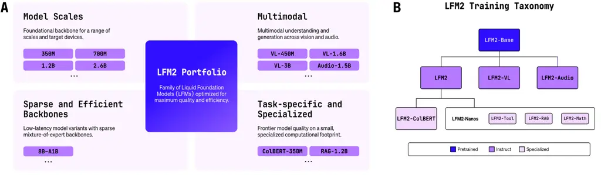
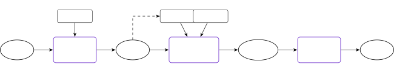
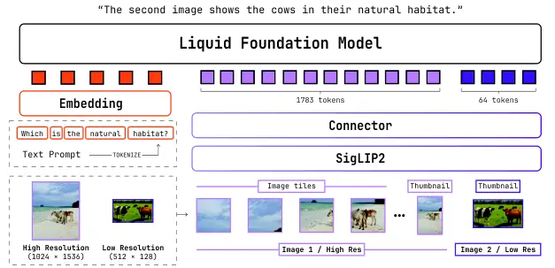
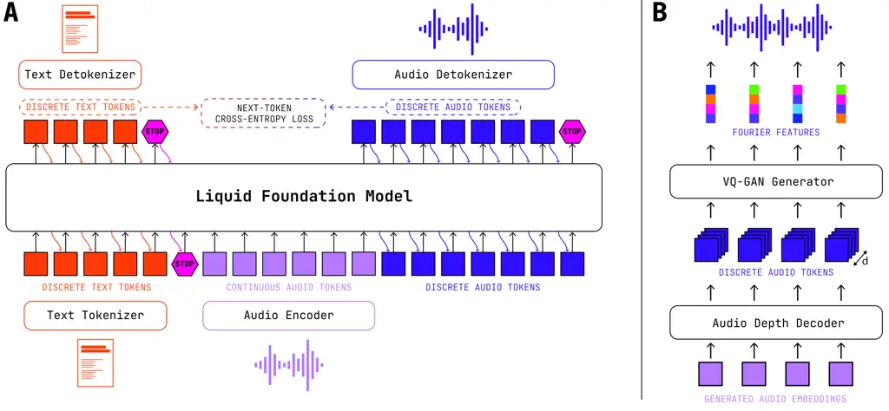
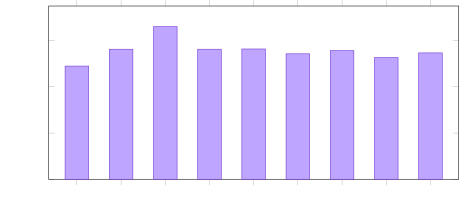
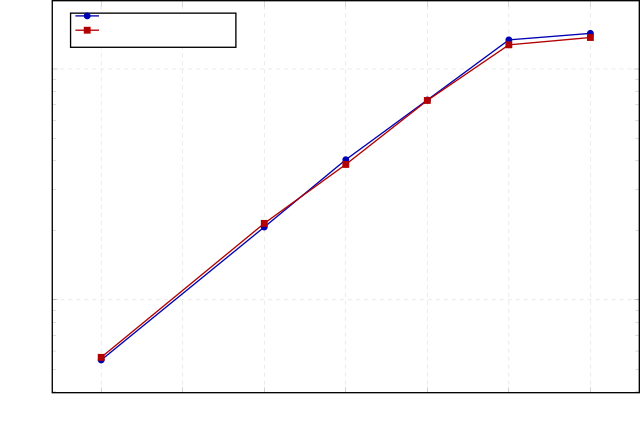
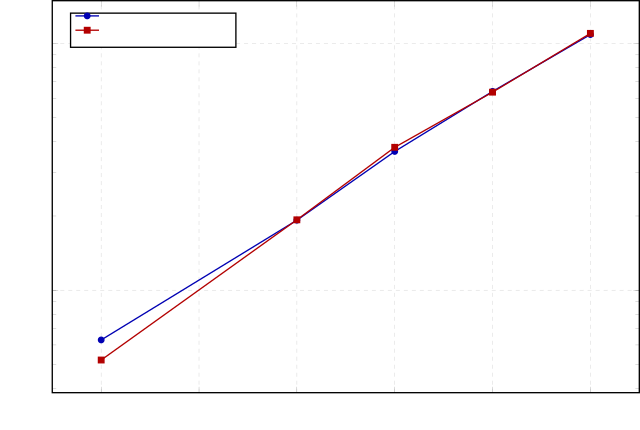

# LFM2 Technical Report

Liquid AI Team Note: Please cite the author as “Liquid AI (2025)”. See
Section˜10 (Authors) for the list of contributors.

|                                                                              |                                                                    |
| ---------------------------------------------------------------------------- | ------------------------------------------------------------------ |
| ![[Uncaptioned image]](arxiv-2511-23404--8f757df5a2c7.figures/figure-1.webp) | [https://huggingface.co/LiquidAI](https://huggingface.co/LiquidAI) |




Fig. 1: The LFM2 Portfolio. (A) We present a family of Liquid Foundation
Models (LFMs) across a suite of scales, modalities, and edge
capabilities. (B) The taxonomy of the LFM2 portfolio steps from
co-designed architectures and pre-trained base models, to
multi-modality, and specialized downstream tasks.

## 1 Introduction

Generative models that can be natively deployed on-device have the
potential to bring transformative impact across sectors and industries
(Xu et al., 2024). Applications such as voice assistants, local
copilots, and agentic workflows that plan, call tools, and read sensors
in tight loops must run under strict latency, memory, and energy budgets
on phones, tablets, laptops, and system-on-chip (SoC) platforms. In
these settings, time-to-first-token (TTFT), stable inter-token latency,
and private or offline execution are not optional features, but rather
hard constraints. Although recent open model families have improved
efficiency at larger scales, targeting tens of billions of parameters
and accelerator-heavy deployments (Liu et al., 2024; Yang et al., 2025a;
Gemma Team et al., 2025), significant needs remain in the small-model,
edge-first regime. We seek models that lead in quality, speed, and
memory efficiency on CPUs and heterogeneous NPUs, while remaining
practical to pre-train, post-train, and deploy widely.

Here, we introduce LFM2, the second generation of Liquid Foundation
Models (LFMs) that are optimized explicitly for on-device deployment
(Figure 1). The LFM2 design is _edge-first_: we co-design architecture,
pre-training, and post-training around the objective of maximizing
downstream quality subject to device-side latency and peak memory
constraints. We release dense model checkpoints (350M–2.6B) with 32K
context, an 8.3B mixture-of-experts (MoE) model with 1.5B active
parameters, multimodal vision-language and audio-language variants, as
well as a late-interaction retrieval model. We also release the initial
series of LFM2-Nanos: LFM2 models that were further pre-trained and
post-trained for domain or task-specific use cases such as data
extraction, tool/function calling, retrieval augmented generation (RAG),
and mathematical reasoning. All LFM2 models ship with open weights and
deployment guides for Transformers (Wolf et al., 2020), llama.cpp,
ExecuTorch, and vLLM (Kwon et al., 2023), along with quantized variants
suited to edge runtimes¹¹ 1 See the LiquidAI organization on Hugging
Face:
[https://huggingface.co/LiquidAI](https://huggingface.co/LiquidAI).. Key
aspects of the LFM2 family include:

- •
  Edge-first backbone for small, fast models. A hardware-in-the-loop
  architecture search selects a minimal hybrid architecture that
  combines short-range, input-aware gated convolutions with
  grouped-query attention (GQA) in a layout tuned for quality under
  strict speed and memory budgets. Using this backbone, dense LFM2
  models from 350M to 2.6B parameters (32K context) and an MoE variant
  (LFM2-8B-A1B) cover a range of quality-latency-memory targets for
  on-device applications.
- •
  Pre-training and post-training for small model, on-device workflows.
  LFM2 checkpoints undergo a 10-12T token pre-training phase and a
  long-context mid-training phase. To improve small-model quality
  without prohibitive cost, we introduce a tempered, decoupled Top-K
  distillation objective that avoids support mismatch. A three-stage
  post-training pipeline improves performance and robustness at small
  model scales.
- •
  Native multimodality. The LFM2 vision-language model, LFM2-VL,
  augments the language backbone with a SigLIP2  (Tschannen et al., 2025) vision encoder and a lightweight connector, designed to enable
  flexible accuracy-latency trade-offs on device. The audio-language
  model, LFM2-Audio, turns the backbone into an end-to-end audio–text
  model that ingests continuous audio features and autoregressively
  generates either text or discrete audio tokens, enabling low-latency
  speech assistants and transcription/translation in a single model.
- •
  Multi- and cross-lingual information retrieval. LFM2-ColBERT adds a
  dense module on top of the backbone, yielding a low-latency encoder
  for both queries and documents. It follows a late-interaction paradigm
  that uses a max-similarity operator (Khattab and Zaharia, 2020),
  enabling high-performance retrieval across multiple languages.
- •
  Strong performance with top efficiency. Across sizes and applications,
  LFM2 models achieve strong tradeoffs between quality, latency, and
  memory, all critical considerations for edge deployment. On CPUs, LFM2
  dense checkpoints deliver up to $`\sim`$2$`\times`$ prefill and decode
  speedups versus similarly sized baselines while maintaining or
  improving accuracy on benchmarks. LFM2-8B-A1B attains 3–4B-class
  quality at $`\sim`$1.5B active parameters.

This report first details the architecture and hardware-in-the-loop
search procedure (Section 2) used to design the LFM2 backbone. Detailed
descriptions of the pre-training pipeline, including the long-context
mid-training and decoupled Top-K distillation objective, and the
three-stage post-training pipeline are provided in Sections 3 and 4,
respectively, followed by results on model performance. Moving from the
LFM2 language backbone to specific applications, we introduce the
LFM2-VL (Section 5) and LFM2-Audio (Section 6) multimodal models,
covering their design, training, and evaluation, as well as the
LFM2-ColBERT-350M model for information retrieval. We conclude with an
extended discussion of related work (Section 8) and a discussion of
LFM2’s limitations, opportunities for development, and impact on edge
deployment (Section 9).

## 2 Architecture

Fig. 2: LFM2 architecture. The LFM2 architecture supports both dense and
mixture-of-experts (MoE) variants. Note the MoE experts are also SwiGLU
blocks.

The LFM2 family instantiates the edge-first design introduced in Section
1 with a minimal hybrid backbone designed via hardware-in-the-loop
architecture search. We release 4 dense models: LFM2-350M, LFM2-700M,
LFM2-1.2B, and LFM2-2.6B, as well as an MoE variant, LFM2-8B-A1B, which
has 8.3B total parameters and 1.5B active parameters. Figure 2
illustrates the shared backbone and the MoE extension. In this section,
we describe the architecture search procedure (Section 2.1), the
resulting dense backbone (Section 2.2) and MoE (Section 2.3)
configurations, and their inference performance (Section 2.4).

### 2.1 Architecture Optimization Process

The design objective for LFM2 is edge-first: maximize downstream quality
while staying within tight device-side budgets on latency and peak
memory on CPUs and heterogeneous NPUs. Recent efficient
architectures (Waleffe et al., 2024; Blakeman et al., 2025; Kimi Team et
al., 2025) typically combine three ingredients: (i) alternative sequence
operators such as linear attention variants or state space models
(SSMs) (Dao and Gu, 2024; Yang et al., 2025b), (ii) short-range
convolutions (generally integrated in the alternative sequence block),
and (iii) a non-trivial fraction of standard softmax attention layers to
recover quality deficits (e.g., long-range retrieval abilities) observed
in models without softmax attention layers (Wen et al., 2025; Park et
al., 2024; Waleffe et al., 2024). We explicitly search this design space
with a hardware-in-the-loop search procedure and find that, under
realistic edge latency and memory budgets, a minimal hybrid suffices:
gated short convolutions for most layers plus a small minority of
grouped-query attention (GQA) layers, without additional SSM or
linear-attention operators.

##### Objectives and constraints.

We frame architecture selection as a Pareto optimization over three
axes:

1.  1.  Quality: performance on an internal suite of $`50+`$ evaluations
        (spanning knowledge recall, multi-hop reasoning, instruction
        following, multilingual robustness, tool use, math, and long context
        performance) after training each candidate architecture on a
        reference dataset.
2.  2.  Latency: time-to-first-token (TTFT) and p50/p95 decode latency
        (ms/token) at batch$`=1`$, as well as prefill throughput (tokens/s)
        on representative prompts.
3.  3.  Peak memory: measured as maximum resident set size (RSS) during
        prefill and decode at target context windows (4K and 32K).

Candidate architectures that violate device-side budgets on TTFT, decode
latency, or peak memory are discarded. The remaining candidates are
ranked by hypervolume improvement on the quality–latency–memory Pareto
frontier.

##### Search space.

We consider decoder-only stacks built from the following block families:

- •
  Local context and subquadratic blocks: gated short convolution blocks
  with varying kernel sizes, sliding-window attention (Child et al.,
  2019), and a family of sub-quadratic sequence blocks including linear
  attention variants (Katharopoulos et al., 2020; Yang et al., 2024a;
  Yang et al., 2025b); state-space variants such as S4 (Gu et al.,
  2022), Liquid-S4 (Hasani et al., 2023), S5 (Smith et al., 2023b),
  RTF (Parnichkun et al., 2024), Mamba (Gu et al., 2022), and
  Mamba2 (Dao and Gu, 2024); Liquid-Time Constant networks such as
  CfC (Hasani et al., 2022), as well as internal variants of efficient
  sequence blocks. These blocks typically combine a depthwise short
  convolution with a longer-range linear attention/SSM component (Fu et
  al., 2023; Poli et al., 2023; Gu and Dao, 2024). The search space
  includes variants that keep only the short convolution submodule
  (i.e., the gated short convolution block) as well as variants that
  retain the full hybrid operator. This allows the search to attribute
  performance gains to specific computational units within the overall
  operator. While linear attention and SSM variants can perform global
  processing of the input, we consider them to be in the same class as
  local context blocks due to their limitations in retrieval-intensive
  tasks (Wen et al., 2025; Arora et al., 2024b; Blouir et al., 2024;
  Parnichkun et al., 2025) (see Section 8.2 for a broader discussion).
- •
  Global context blocks: grouped-query attention (GQA) (Ainslie et al., 2023) with varying group counts and head dimensions, augmented with
  QK-Norm (Dehghani et al., 2023a).
- •
  Position-wise blocks: SwiGLU feed-forward blocks (Shazeer, 2020) with
  expansion ratios chosen by search.
- •
  Layout: interleaving patterns of local context blocks, global context
  blocks, position-wise blocks, and overall block counts under fixed
  parameter budgets, including options for shared weights and cache
  reuse.
- •
  MoE options: per-layer sparse FFNs with varying width and expert
  granularity.

##### On-device profiling.

Every candidate is compiled to the deployment stacks with identical
settings (batch$`=1`$, fixed context windows at 4K/32K, and matched
quantization/backends) and benchmarked on target devices:

- •
  CPU path: ExecuTorch (8da4w) and llama.cpp (Q4_0) on Samsung Galaxy
  S24 Ultra (Qualcomm Snapdragon 8 Gen 3 SoC) and AMD Ryzen HX 370.
- •
  Accelerator path: vLLM for single-request and online batching (used
  for sanity checks; the primary target remains on-device CPU
  deployment).

We record TTFT, prefill throughput (tokens/s), decode ms/token
(p50/p95), and peak memory with identical prompts and tokenizer
settings.

##### Evaluation and selection

We consider quality estimation and deployability checks. Quality is
measured via targeted training experiments scored on the internal
evaluation suite. Deployability is assessed via the on-device profiling
described above. Training experiments are run at scales large enough to
surface meaningful quality differences, while device measurements are
taken on representative edge hardware using the same runtimes at which
we plan to ship. Configurations that preserve their advantage across
both quality and deployability checks advance, while others are dropped
early. Among feasible models, we retain those on the
quality–latency–memory Pareto frontier and carry them forward in the
search.

Our earlier academic prototype (STAR) (Thomas et al., 2024) explored a
specific design space of operator/layout choices with an evolutionary
search heuristic optimized on proxy signals (i.e., perplexity for
quality, cache size for efficiency). In practice, these proxies do not
transfer reliably to downstream task scores or device-level latency and
memory, limiting their utility as optimization objectives. By contrast,
the LFM2 pipeline centers the _objective_: downstream task scores and
hardware-in-the-loop TTFT/latency/memory on release runtimes. In
practice, we found this has a much larger impact than the particulars of
the search space or choice of search heuristic.

##### Outcomes.

Across size targets, the hardware-in-the-loop search repeatedly selects
a _minimal hybrid_ architecture where most blocks are inexpensive gated
short convolution blocks, interleaved with a small minority of GQA
blocks. Under identical on-device performance budgets, augmenting these
stacks (as in recent hybrid variants) with linear-attention,
state-space, or additional convolution operators does not improve
aggregate quality on the evaluation suite and typically worsens device
metrics. Empirically, the selected hybrids:

- •
  match or exceed the aggregate quality of attention-heavier and mixed
  (conv+linear/SSM/conv) baselines at the same budget;
- •
  reduce decode latency (p50/p95) and increase prefill throughput at
  batch$`=1`$ under identical tokenizer, prompt, quantization, and
  backend settings;
- •
  lower peak RSS at long context (4K/32K), consistent with reduced
  KV-cache versus attention-heavy layouts.

These results suggest that, in the on-device regime, most of the
benefits attributed to recent hybrid SSM/linear-attention blocks can be
captured by their short convolutional submodules plus a small number of
global attention layers. We therefore carry forward designs that
minimize global blocks while prioritizing inexpensive, gated short
convolution blocks elsewhere. The released dense backbones (Section 2)
and the sparse-FFN placement in LFM2-8B-A1B (Section 2) instantiate this
recipe. Detailed speed and memory measurements appear in Section 2.4.

### 2.2 LFM2 Dense Models

##### Block choices and layout.

The LFM2 dense models instantiate the minimal hybrid repeatedly selected
by the hardware-in-the-loop search (Section 2.1): a majority of
inexpensive, gated short convolution blocks interleaved with a minority
of grouped-query attention (GQA) blocks, plus SwiGLU (Shazeer, 2020)
position-wise multi-layer perceptrons (MLPs). All layers use pre-norm
RMSNorm (Zhang and Sennrich, 2019) and attention blocks use RoPE (Su et
al., 2024) with QK-Norm (Dehghani et al., 2023a).

##### Gated short convolution block.

Given an input hidden sequence $`\mathbf{h}\in\mathbb{R}^{L\times d}`$
(batch dimension omitted for clarity), each gated short convolution
block applies input-dependent multiplicative gating around a depthwise
short convolution:

```math
(\mathbf{B},\,\mathbf{C},\,\tilde{\mathbf{h}})=\mathrm{Linear}(\mathbf{h}),\qquad\mathbf{y}=\mathbf{B}\odot\tilde{\mathbf{h}},\qquad\mathbf{z}=\mathrm{Conv}_{k}(\mathbf{y}),\qquad\mathbf{o}=\mathrm{Linear}_{\text{out}}(\mathbf{C}\odot\mathbf{z}).
```

Here $`\mathrm{Linear}:\mathbb{R}^{d}\to\mathbb{R}^{3d}`$ is a linear
map applied position-wise across the sequence length, $`L`$, and whose
output channels are split along the feature dimension into
$`(\mathbf{B},\mathbf{C},\tilde{\mathbf{h}})`$ with
$`\mathbf{B},\mathbf{C},\tilde{\mathbf{h}}\in\mathbb{R}^{L\times d}`$.
The intermediate tensors $`\mathbf{y},\mathbf{z},\mathbf{o}`$ also lie
in $`\mathbb{R}^{L\times d}`$.
$`\mathrm{Conv}_{k}:\mathbb{R}^{L\times d}\to\mathbb{R}^{L\times d}`$ is
a depthwise 1D convolution along the sequence with kernel size $`k`$,
and $`\odot`$ denotes element-wise multiplication.
$`\mathrm{Linear}_{\text{out}}:\mathbb{R}^{d}\to\mathbb{R}^{d}`$ is the
linear output projection. This operator provides fast local mixing with
excellent cache behavior on CPUs.

This operator is closely related to the short-range components that
appear inside many recent efficient sequence blocks (Fu et al., 2023;
Poli et al., 2023; Gu and Dao, 2024; Dao and Gu, 2024; Yang et al.,
2025b). The search results from Section 2.1 can be viewed as an ablation
of these hybrids in the on-device setting. Once a handful of GQA blocks
are available to handle long-range retrieval, the inexpensive gated
short convolution alone is sufficient to reach the best
quality–latency–memory trade-off we observe, without additional linear
attention/SSM/long convolution branches.

##### Attention and MLP.

GQA reduces KV traffic by sharing keys/values across head groups while
preserving multi-head queries (Ainslie et al., 2023). Position-wise MLPs
use SwiGLU with a size-dependent expansion ratio chosen by the search.

##### Tokenizer and special tokens.

We use a byte-level BPE tokenizer (Sennrich et al., 2016) with a
65,536-token vocabulary. We used the same pre-training dataset discussed
in Section 3 to train the LFM2 tokenizer, with a focus on encoding
efficiency of the English, Japanese, Arabic, Korean, Spanish, French,
and German languages. We additionally include JSON and other code-like
data to improve tokenization of structured formats.

The tokenizer includes special tokens for fill-in-the-middle training
objectives (Bavarian et al., 2022), tool calling, and the ChatML chat
template.

##### Released sizes.

We release dense checkpoints at 350M, 700M, 1.2B, and 2.6B parameters,
all with a $`32{,}768`$ token context window. Table 1 summarizes the
main model hyperparameters.

|             |            |          |                        |        |                                     |              |            |       |       |                                |
| ----------- | ---------- | -------- | ---------------------- | ------ | ----------------------------------- | ------------ | ---------- | ----- | ----- | ------------------------------ |
|             |            | Backbone |                        |        |                                     |              |            | MoE   |       |                                |
| Model       | Params T/A | Layers   | $`d_{\mathrm{model}}`$ | FF dim | H/KV/$`\mathrm{H}_{\mathrm{size}}`$ | Attn. Blocks | Conv $`k`$ | $`E`$ | Top-k | $`\mathrm{FF}_{\mathrm{MoE}}`$ |
| LFM2-350M   | 350M/—     | 16       | 1024                   | 4608   | 16/8/64                             | 6            | 3          | —     | —     | —                              |
| LFM2-700M   | 700M/—     | 16       | 1536                   | 6912   | 24/8/64                             | 6            | 3          | —     | —     | —                              |
| LFM2-1.2B   | 1.2B/—     | 16       | 2048                   | 8192   | 32/8/64                             | 6            | 3          | —     | —     | —                              |
| LFM2-2.6B   | 2.6B/—     | 30       | 2048                   | 10752  | 32/8/64                             | 8            | 3          | —     | —     | —                              |
| LFM2-8B-A1B | 8.3B/1.5B  | 24       | 2048                   | 7168   | 32/8/64                             | 6            | 3          | 32    | 4     | 1792                           |

Table 1: LFM2 model hyperparameters. “Backbone” columns list
hyperparameters shared between dense and MoE models. T/A: total and
active parameter counts. H/KV/$`\mathrm{H}_{\mathrm{size}}`$: Number of
attention heads / KV groups / head size. “MoE” columns list experts per
layer ($`E`$), active experts (Top-k), and per-expert FF size. For
LFM2-8B-A1B, all layers except the first two are MoE.

### 2.3 LFM2 MoE

LFM2-8B-A1B (8.3B total, 1.5B active) targets the on-device regime where
compute per token, not weight storage, dominates perceived latency. By
activating only a sparse subset of experts per token, the model attains
3–4B-class quality (Table 7) at roughly 1.5B-class decode cost. We keep
the fast LFM2 hybrid backbone (Section 2.2) and replace dense MLPs with
sparse MoE MLPs in most layers. For stability, the first two layers
remain dense while all subsequent layers include an MoE block. Experts
themselves are SwiGLU MLPs. Each MoE layer has 32 experts and selects
the Top-k$`{=}4`$ experts per token with a normalized sigmoid router and
adaptive routing biases for load balancing (Liu et al., 2024). See
Table 1 for a summary of the main LFM2-8B-A1B settings.

### 2.4 Inference Performance

##### Experimental setup.

We evaluate the inference efficiency of both dense and MoE LFM2 models
on two representative on-device CPU targets: a Snapdragon 8 Elite based
Samsung Galaxy S25 smartphone (a newer model than we used for the
architecture search in Section 2.1) and an AMD Ryzen AI 9 HX 370 laptop
CPU. In both settings, we focus on latency-sensitive, single-stream
usage with batch size equal to 1. All models are run with
llama.cpp (Gerganov and contributors, 2023) using the Q4_0 quantization
format. For ease of comparison and reproducibility, we measure _prefill
throughput_ (prompt tokens processed per second) for 1K and 4K-token
prompts and _decode throughput_ (tokens generated per second) when
producing 100 continuation tokens from 1K and 4K-token prefixes.
Tables 2 and 3 summarize the results for the LFM2 family alongside
contemporary open baselines (Yang et al., 2025a; Gemma Team et al.,
2025; Grattafiori et al., 2024; Bakouch et al., 2025; IBM Research, 2025) at comparable parameter scales.

|                     |                               |     |                              |       |
| ------------------- | ----------------------------- | --- | ---------------------------- | ----- |
|                     | Prefill throughput (tokens/s) |     | Decode throughput (tokens/s) |       |
| Model               | 1K                            | 4K  | 1K                           | 4K    |
| LFM2-350M           | 1,067                         | 657 | 194.1                        | 143.8 |
| Granite-4.0-350M    | 528                           | 210 | 132.9                        | 70.7  |
| Granite-4.0-H-350M  | 784                           | 594 | 150.7                        | 119.3 |
| LFM2-700M           | 522                           | 341 | 104.2                        | 80.2  |
| Qwen3-0.6B          | 318                           | 136 | 76.7                         | 41.8  |
| LFM2-1.2B           | 335                           | 222 | 69.8                         | 55.5  |
| Llama-3.2-1B        | 229                           | 130 | 54.6                         | 37.8  |
| Qwen3-1.7B          | 140                           | 98  | 39.7                         | 26.9  |
| Gemma-3-1B          | 377                           | 295 | 67.5                         | 67.1  |
| Granite-4.0-1B      | 147                           | 79  | 41.3                         | 25.0  |
| Granite-4.0-H-1B    | 186                           | 159 | 46.1                         | 44.1  |
| LFM2-2.6B           | 143                           | 116 | 33.8                         | 30.0  |
| LFM2-8B-A1B         | 85                            | 76  | 48.6                         | 41.9  |
| Llama-3.2-3B        | 79                            | 51  | 24.2                         | 15.8  |
| Qwen3-4B            | 57                            | 35  | 17.2                         | 11.4  |
| Gemma-3-4B          | 72                            | 63  | 18.3                         | 17.9  |
| SmolLM3-3B          | 98                            | 66  | 26.1                         | 19.2  |
| Granite-4.0-Micro   | 65                            | 38  | 20.2                         | 12.1  |
| Granite-4.0-H-Micro | 83                            | 77  | 24.9                         | 23.5  |
| Granite-4.0-H-Tiny  | 86                            | 86  | 39.2                         | 37.4  |

Table 2: Prefill and decode throughput on the Samsung Galaxy S25 device
with a Qualcomm Snapdragon 8 Elite SoC (batch size 1). Prefill columns
report tokens per second when processing prompts of length 1K/4K tokens.
Decode columns report tokens per second when generating 100 tokens
starting from prefixes of length 1K/4K tokens. All models are run with
llama.cpp and Q4_0 format with CPU backend.

##### Smartphone-class CPU (Samsung Galaxy S25 with a Qualcomm Snapdragon 8 Elite SoC).

On the S25 device (Table 2), LFM2 models are generally faster than
similarly sized baselines across scales.

In the 350M class, LFM2-350M yields about $`2`$–$`3\times`$ higher
prefill throughput than Granite-4.0-350M and improves decode throughput
by roughly $`1.5`$-$`2.0\times`$ across 1K and 4K contexts. Relative to
the hybrid Granite-4.0-H-350M, LFM2-350M remains $`\sim`$10–35% faster
in both prefill and decode. At the 700M scale, LFM2-700M outperforms
Qwen3-0.6B across all four settings. Prefill throughput improves by
about $`1.6`$–$`2.5\times`$, while decode throughput improves by roughly
$`1.4`$–$`2\times`$.

At the 1B scale, LFM2-1.2B improves over Granite-4.0-1B and Qwen3-1.7B
by $`2.3`$–$`2.8\times`$ on prefill and $`1.7`$–$`2.2\times`$ on decode
across both context lengths. Gemma-3-1B is the strongest 1B-class
baseline in terms of raw throughput; however, LFM2-1.2B attains
$`0.75-0.9\times`$ of its prefill throughput, while offering slightly
higher 1K decode throughput and remaining within $`20\%`$ on 4K decode.
In contrast, relative to Llama-3.2-1B, LFM2-1.2B is faster across all
four measurements, with roughly $`1.5`$–$`1.7\times`$ higher prefill
throughput and $`1.3`$–$`1.5\times`$ higher decode throughput.

In the 2–4B regime, the dense LFM2-2.6B model delivers about
$`2`$–$`3\times`$ higher throughput than Qwen3-4B across prefill and
decode, and also outperforms Gemma-3-4B, Granite Micro/H variants,
SmolLM3-3B, and Llama-3.2-3B in both metrics. The MoE model LFM2-8B-A1B
attains prefill throughput comparable to Granite-4.0-H-Tiny (another
hybrid MoE), but with $`1.1`$–$`1.3\times`$ higher decode throughput,
while providing roughly $`2.8`$–$`3.7\times`$ higher decode throughput
than dense 4B-class baselines such as Qwen3-4B. We have found that there
is still room for large improvements for MoEs on CPU, and we are
developing improved kernels that better utilize CPU hardware.

##### Laptop-class CPU (AMD Ryzen HX 370).

On the Ryzen AI 9 HX 370 CPU (Table 3), absolute throughputs increase
substantially compared to the S25, and the relative trends largely
mirror the smartphone results.

|                     |                               |       |                              |       |
| ------------------- | ----------------------------- | ----- | ---------------------------- | ----- |
|                     | Prefill throughput (tokens/s) |       | Decode throughput (tokens/s) |       |
| Model               | 1K                            | 4K    | 1K                           | 4K    |
| LFM2-350M           | 7,534                         | 5,540 | 207.7                        | 170.5 |
| Granite-4.0-350M    | 5,499                         | 2,938 | 225.0                        | 166.2 |
| Granite-4.0-H-350M  | 4,568                         | 4,250 | 134.7                        | 123.2 |
| LFM2-700M           | 4,214                         | 3,311 | 134.6                        | 118.4 |
| Qwen3-0.6B          | 3,594                         | 2,204 | 116.0                        | 53.4  |
| LFM2-1.2B           | 2,784                         | 2,302 | 99.7                         | 89.0  |
| Llama-3.2-1B        | 2,912                         | 1,890 | 97.3                         | 73.5  |
| Qwen3-1.7B          | 2,019                         | 1,491 | 60.8                         | 38.5  |
| Gemma-3-1B          | 3,972                         | 3,809 | 103.6                        | 99.3  |
| Granite-4.0-1B      | 1,823                         | 1,256 | 64.5                         | 43.6  |
| Granite-4.0-H-1B    | 1,565                         | 1,523 | 59.6                         | 57.1  |
| LFM2-2.6B           | 1,335                         | 1,171 | 50.3                         | 46.8  |
| LFM2-8B-A1B         | 1,320                         | 1,185 | 74.9                         | 69.1  |
| Llama-3.2-3B        | 1,179                         | 916   | 38.3                         | 28.2  |
| Qwen3-4B            | 861                           | 628   | 31.0                         | 22.2  |
| Gemma-3-4B          | 1,119                         | 1,054 | 33.0                         | 31.6  |
| SmolLM3-3B          | 1,248                         | 982   | 42.4                         | 33.4  |
| Granite-4.0-Micro   | 929                           | 608   | 36.7                         | 28.9  |
| Granite-4.0-H-Micro | 932                           | 896   | 34.7                         | 33.8  |
| Granite-4.0-H-Tiny  | 1,050                         | 1,046 | 55.0                         | 52.1  |

Table 3: Prefill and decode throughput on HX 370 CPU (batch size 1).
Prefill columns report tokens per second when processing prompts of
length 1K/4K tokens. Decode columns report tokens per second when
generating 100 tokens starting from prefixes of length 1K/4K tokens. All
models are run with llama.cpp and Q4_0 format with CPU backend.

##### Summary.

Across both smartphone and laptop class CPUs, LFM2 models generally
achieve substantial latency and throughput improvements over similarly
sized open baselines. Together with the quality measurements presented
in Section 4.5, these results support the edge-first design of the LFM2
backbone and its suitability for latency-sensitive on-device deployment
(Figure 4).

## 3 Pre-Training

We pre-train LFM2 using a multi-stage pipeline designed for small,
on-device models. During pre-training, we combine standard next-token
prediction with a tempered, decoupled Top-K knowledge distillation
objective (Section 3.3), using an internal version of LFM1-7B as a
teacher. This section details the pre-training data mixture (Section
3.1), the training stages (Section 3.2), and the decoupled Top-K
distillation objective (Section 3.3).

### 3.1 Training Data

The LFM2 dense models are pre-trained on a mixture comprising roughly
75% English text, 20% multilingual text, and 5% code. We prioritize
Japanese, Arabic, Korean, Spanish, French, and German for multilingual
coverage, with additional base support for Chinese, Italian, and
Portuguese. The MoE model LFM2-8B-A1B uses a similar mixture, but with a
heavier emphasis on code (60% English, 25% multilingual, 15% code). For
code data, 50% of examples use a fill-in-the-middle (FIM)
objective (Bavarian et al., 2022).

### 3.2 Training Stages

The released dense LFM2 model checkpoints are pre-trained for 10T tokens
at a context length of 4,096 tokens. We then perform a mid-training
phase on an additional 1T higher-quality tokens, including sources with
naturally long context, using a 32,768-token context window and an
accelerated learning-rate decay schedule. The released LFM2-8B-A1B
checkpoint follows the same two-stage recipe but is trained for 12T
tokens in the initial phase before the 1T-token long-context
mid-training stage.

### 3.3 Decoupled Top-K Knowledge Distillation

During pre-training, we leverage LFM1-7B as a teacher model in a
knowledge distillation (KD) framework (Hinton et al., 2015). To reduce
storage and bandwidth, we distill the teacher distribution
$`P_{T}(x\mid x_{c})`$ for each token $`x`$ given its context $`x_{c}`$
to a student $`P_{S}(x\mid x_{c})`$, using only the Top-K$`{=}32`$
teacher logits per token. Naively applying the Kullback–Leibler (KL)
divergence to a Top-K truncated teacher distribution, especially under
temperature scaling, can cause support mismatch and unstable losses. We
address this by decomposing the KL via the chain rule into (i) a binary
term that matches the total probability mass assigned to the Top-K set,
and (ii) a conditional KL within the Top-K, to which we apply
temperature. This “decoupled, tempered Top-K” objective avoids support
mismatch while preserving the benefits of temperature-scaled
distillation.

Let $`\mathcal{A}`$ be the vocabulary and
$`\mathcal{T}(x_{c})\subset\mathcal{A}`$ be the teacher’s Top-K set for
context $`x_{c}`$. Define

```math
P_{T}(\mathcal{T}\mid x_{c})=\sum_{x\in\mathcal{T}(x_{c})}P_{T}(x\mid x_{c}),\quad P_{S}(\mathcal{T}\mid x_{c})=\sum_{x\in\mathcal{T}(x_{c})}P_{S}(x\mid x_{c}),
```

```math
P_{T}(x\mid\mathcal{T},x_{c})=\frac{P_{T}(x\mid x_{c})}{P_{T}(\mathcal{T}\mid x_{c})},\qquad P_{S}(x\mid\mathcal{T},x_{c})=\frac{P_{S}(x\mid x_{c})}{P_{S}(\mathcal{T}\mid x_{c})}\quad(x\in\mathcal{T}).
```

We denote applying a temperature $`\tau`$ as

```math
p^{(\tau)}(x)=\frac{p(x)^{1/\tau}}{\sum_{y}p(y)^{1/\tau}},\qquad D_{\mathrm{KL}}^{(\tau)}(p\|q)\;=\;\tau^{2}\,D_{\mathrm{KL}}\!\big(p^{(\tau)}\|q^{(\tau)}\big).
```

The decoupled, tempered Top-K objective (per token) is

```math
\displaystyle\mathcal{L}_{\text{DTK}}(x_{c}) \displaystyle=\underbrace{D_{\mathrm{KL}}\!\big(\mathrm{Bern}(P_{T}(\mathcal{T}\mid x_{c}))\,\big\|\,\mathrm{Bern}(P_{S}(\mathcal{T}\mid x_{c}))\big)}_{\mathcal{L}_{B}} \tag{1}
```

```math
\displaystyle\quad+\underbrace{P_{T}(\mathcal{T}\mid x_{c})\,D_{\mathrm{KL}}^{(\tau)}\!\big(P_{T}(\cdot\mid\mathcal{T},x_{c})\,\big\|\,P_{S}(\cdot\mid\mathcal{T},x_{c})\big)}_{\mathcal{L}_{T}} \tag{2}
```

where $`\mathrm{Bern}(p)`$ denotes the Bernoulli distribution with
success probability $`p`$. The first term $`\mathcal{L}_{B}`$ is a
binary KL that trains the student to put the same _total probability
mass_ into the teacher’s Top-K set as the teacher does. The second term
$`\mathcal{L}_{T}`$ is a conditional Top-K KL divergence that, given the
next token lies in the Top-K, trains the student to match the teacher’s
_relative probabilities_ among those $`K`$ tokens.

We apply temperature only to the conditional Top-K distributions inside
$`\mathcal{L}_{T}`$. The Bernoulli membership term $`\mathcal{L}_{B}`$
and the Top-K mass $`P_{T}(\mathcal{T}\mid x_{c})`$ remain untempered,
which prevents the support mismatch that arises when tempering a Top-K
truncated distribution over the full vocabulary. Note that with
$`\tau=1`$, $`\mathcal{L}_{\text{DTK}}`$ is a lower bound to the full
forward KL because it omits the teacher tail where logits are
unavailable. For $`\tau>1`$, this can be viewed as optimizing a tempered
surrogate of this bound. Please see Appendix A for the full derivation
and more details. Finally, the overall $`\mathcal{L}_{\text{DTK}}`$ term
is balanced with next-token cross-entropy on hard labels. See Section
8.3 for an expanded discussion on related approaches such as Zhao et al.
(2022) and Anshumann et al. (2025).

## 4 Post-Training

### 4.1 Overview

Following the 10-12T token pre-training phase, each LFM2 checkpoint
undergoes a three-stage post-training pipeline (Figure 3) with two main
objectives. The first goal is teaching the chat template to convert the
base model into a conversational assistant that can reliably answer
questions, follow instructions, and maintain multi-turn coherence. The
second goal is to improve downstream capabilities that are relevant to
end users, such as Retrieval-Augmented Generation (RAG) and function
calling.



Fig. 3: Overview of the three-stage post-training pipeline.

The three-stage pipeline consists of:

1.  1.  Supervised Fine-Tuning (SFT): Large general-purpose mixture to
        provide good capabilities on downstream tasks and teach the chat
        template.
2.  2.  Preference Alignment: Enabling efficient preference optimization
        through direct alignment on offline data including on-policy samples
        generated from the SFT checkpoint.
3.  3.  Model Merging: Systematic evaluation and combination of candidate
        models to increase robustness and optimize performance.

The following subsections detail data recipes, algorithmic innovations,
filtering heuristics, and hyperparameter configurations used in the LFM2
post-training pipeline.

### 4.2 Stage 1: Supervised Fine-Tuning

#### 4.2.1 SFT Data Mixture

The SFT corpus we use comprises approximately 5.39 million samples for
the 350M, 700M, 1.2B, and 2.6B models, and 9.24 million samples for the
8B-A1B model (which includes additional math and code-focused data). The
two datasets integrate 67 and 79 carefully curated sources,
respectively, spanning open-source datasets, licensed data, and targeted
synthetic generations optimized for on-device deployment scenarios, with
multilingual samples integrated throughout each category. Table 4
details the composition of the instruction datasets for the LFM2 dense
and MoE models.

| Category               | Share (%) | Source |
| ---------------------- | --------- | ------ |
| General-purpose        | 26.6      | O      |
| Instruction following  | 17.1      | P      |
| RAG                    | 13.2      | P      |
| Real-world chats       | 10.1      | O      |
| Tool use               | 10.1      | P      |
| Off-policy preferences | 8.2       | P      |
| Mathematical reasoning | 7.4       | P,L,O  |
| Long context           | 6.7       | P      |
| Other                  | 0.6       | O,P    |

(a) Dense models (350M, 700M, 1.2B, 2.6B)

| Category               | Share (%) | Source |
| ---------------------- | --------- | ------ |
| Mathematical reasoning | 26.2      | P,L,O  |
| General-purpose        | 16.3      | O      |
| Instruction following  | 11.3      | P      |
| Code                   | 10.2      | O,P    |
| Real-world chats       | 10.0      | O      |
| RAG                    | 8.3       | P      |
| Tool use               | 7.3       | P      |
| Off-policy preferences | 5.3       | P      |
| Long context           | 3.2       | P      |
| Other                  | 1.9       | O,P    |

(b) LFM2-8B-A1B

Table 4: SFT data mixture composition for LFM2 models. Sources: P =
proprietary, L = licensed, O = open-source.

In particular, general-purpose denotes a broad mixture of conversational
and task-oriented data (including some code, reasoning, and
instruction-like instances) that does not cleanly fall into any single
specialized bucket and serves to balance the overall domain coverage.
Off-policy preferences correspond to the off-policy component of the
preference dataset: we include only the “chosen” responses from
preference pairs that we ultimately want the model to imitate during
SFT, so as to make the supervised data distribution closer to the policy
targeted by preference optimization.

##### Skill-specific mixture design.

We develop the final SFT composition through an iterative process
targeting individual capabilities in isolation before combining them
into a balanced mixture. This approach allows us to approximate the
upper bound performance for each evaluation domain given the training
setup. The resulting mixture emphasizes diverse conversational data
while maintaining strong performance across technical domains.

##### Multilingual data.

Rather than treating multilingual capabilities as a separate domain, we
systematically integrate multilingual samples across most task
categories. The corpus is 80% English, with the remaining 20% uniformly
distributed across seven languages: Arabic, Chinese, French, German,
Japanese, Korean, and Spanish. This approach ensures that the models
develop strong multilingual capabilities organically within each skill
domain, providing greater diversity and more natural cross-lingual
transfer compared to traditional approaches that rely on distinct
multilingual datasets. Each category in the mixture contains
representative samples in multiple languages, ensuring that specialized
capabilities such as mathematical reasoning and tool use are developed
multilingually from the ground up.

##### Data quality pipeline.

We implement a comprehensive multi-stage filtering process to ensure
dataset quality and prevent evaluation contamination. As a first-stage
quality control step, we perform human evaluation on a subset of each
candidate dataset, where the quality of the samples and the diversity of
the mixture are assessed to decide which datasets are eligible for
downstream use. Only datasets that pass this initial human screen are
processed by the subsequent automated stages.

The filtering process starts with per-dataset quality assessment, where
an ensemble of judge LLMs scores the factual accuracy, relevance, and
helpfulness of the answers. Quality thresholds vary significantly across
sources, with curated proprietary datasets requiring minimal filtering
while some open-source datasets underwent more aggressive removal. We
then apply validation to eliminate malformed or invalid samples,
followed by refusal filtering to remove samples containing refusal
patterns or unhelpful responses.

Stylistic filtering uses rule-based methods to eliminate samples with
overused phrases, clichés, and undesirable patterns. We perform exact
deduplication through direct matching, then apply near-duplicate
detection using CMinHash locality-sensitive hashing to catch similar but
non-identical content. Semantic deduplication proved most impactful,
using sentence embeddings with a high similarity threshold to remove
semantically similar content and ensure diverse training signals.

Finally, we perform decontamination through exact n-gram matching
against evaluation benchmarks, with additional semantic similarity
filtering to catch paraphrased content. The complete pipeline removes a
substantial portion of the initial corpus, with semantic deduplication
contributing the largest reduction and ensuring non-repetitive,
high-quality training data.

##### Curriculum learning.

We implement a data-driven curriculum learning strategy across the
entire dataset to optimize the training progression from simpler to more
complex examples. Given the dataset $`\mathcal{D}=\{x_{i}\}_{i=1}^{N}`$
with verifiable rewards and a diverse ensemble of 12 language models
$`\mathcal{M}=\{m_{j}\}_{j=1}^{12}`$ spanning multiple scales and
architectures, we record binary outcomes $`r_{ij}\in\{0,1\}`$ indicating
whether model $`m_{j}`$ answered item $`x_{i}`$ correctly.

The model ensemble includes: LFM2-350M, LFM2-700M, Hunyuan-500M (Sun et
al., 2024), LFM2-1.2B, LFM2-2.6B, Phi-4-Mini (Abouelenin et al., 2025),
Qwen3-4B-Instruct-2507 (Yang et al., 2025a), Qwen3-Klear-8B (Zhang et
al., 2025), ERNIE-4.5-21B-A3B (Baidu, 2025),
Qwen3-30B-A3B-Instruct-2507, Qwen3-30B-A3B-Coder-Instruct, and
Qwen3-235B-A22-Instruct-2507. This diverse set spans parameter counts
from 350M to 235B and includes both dense and mixture-of-experts
architectures.

For each question, we compute the empirical probability of success
across the sampled models:

```math
p_{i}=\frac{1}{J}\sum_{j=1}^{J}r_{ij}.
```

High values of $`p_{i}`$ correspond to easier questions, while low
values identify harder ones. We then train a model to predict and order
the probabilities $`p_{i}`$ based on prompt features, providing a
ranking from easiest to most challenging examples. This allows SFT to
proceed in a principled way: starting with items that most models can
solve, and gradually introducing those that require deeper reasoning or
knowledge.

#### 4.2.2 Training Protocol

The training protocol maintains the 32,768 token context length
established during mid-training to ensure consistency across the
training pipeline. Training is conducted over 3 epochs using a
micro-batch size of 1 per GPU with gradient accumulation, resulting in
an effective global batch size optimized for each model size.

The learning rate schedule employs cosine decay, starting from a maximum
rate of 3×10⁻⁵ and decaying to a minimum of 1×10⁻⁷ over the training
duration. We incorporate a linear warm-up phase spanning 500 steps,
beginning from an initial rate of 1×10⁻⁵ with a start factor of 1.0. For
optimization, we use the AdamW optimizer configured with
$`\beta_{1}=0.9`$, $`\beta_{2}=0.95`$, and weight decay $`\lambda=0.1`$,
along with gradient clipping at 1.0 and an epsilon value of 1×10⁻⁸.

To balance model performance with computational efficiency, we apply 10%
input dropout on embeddings during training only, while avoiding
internal dropout layers to preserve inference latency. The training
utilizes mixed precision arithmetic with bfloat16 for both activations
and gradients, with float32 master weights maintained by the optimizer.
The distributed training infrastructure leverages ZeRO-2 sharding with
strided activation checkpointing across 8 H100-80GB GPUs per training
run to optimize memory usage and training throughput while maintaining
fine-grained control over the optimization process.

### 4.3 Stage 2: Preference Alignment

We leverage direct alignment methods to achieve a strong trade-off
between model capabilities and iteration speed. In particular, we
combine a family of length-normalized direct alignment objectives with
an offline dataset consisting of both on-policy samples generated from
the SFT checkpoint and off-policy reference responses (Rafailov et al.,
2023; Meng et al., 2024; Lambert et al., 2024; Li and Khashabi, 2025).

#### 4.3.1 Preference Dataset Creation

The dataset construction focuses on in-distribution samples and combines
on-policy generation with skill-specific refinement through larger
models. The base dataset consists of open-source as well as proprietary
instruction and preference data that constitute approximately 1 million
conversations. For each conversation, we sample $`N=5`$ responses from
the selected SFT checkpoint to recover $`N+1`$ total responses for
instruction datasets and $`N+2`$ total responses for preference
datasets. We then score individual responses via an LLM jury, selecting
the highest scored sample as the chosen response and the lowest scored
sample as the rejected response. Here, we favor on-policy responses over
instruction / preference samples in case of a tie to mitigate
distribution shift. For instruction following data, we further refine
the chosen responses via Contrastive Learning from AI Revisions
(CLAIR) (D’Oosterlinck et al., 2025). We apply quantitative score-based
filtering to remove low quality preference pairs as well as qualitative
filters to mitigate potential undesirable behavior modes. Lastly, we
filter out partial samples that exceed the context length. The resulting
preference dataset consists of approximately 700,000 conversations.

#### 4.3.2 Length-Normalized Direct Alignment

We implement a family of length-normalized alignment objectives with
generalized loss function given by

```math
\displaystyle\mathcal{L}(\pi_{\theta};\pi_{\text{ref}}) \displaystyle=-\mathbb{E}_{(x,y_{w},y_{l})\sim\mathcal{D}}\left[\omega\cdot f\left(\Delta(x,y_{w},y_{l})-m\right)+\lambda\cdot g\left(\delta(x,y_{w},y_{l})\right)\right], \tag{3}
```

evaluated on prompts $`x`$, chosen responses $`y_{w}`$, and rejected
responses $`y_{l}`$ sampled from dataset $`\mathcal{D}`$. Here, we
define length-normalized relative $`\Delta(x,y_{w},y_{l})`$ as well as
absolute $`\delta(x,y_{w},y_{l})`$ loss components based on the implicit
reward $`r_{\theta}\left(x,y\right)`$, such that

```math
\displaystyle\Delta(x,y_{w},y_{l})=\frac{r_{\theta}(x,y_{w})}{|y_{w}|}-\frac{r_{\theta}(x,y_{l})}{|y_{l}|},\qquad\delta(x,y_{w},y_{l})=\sigma\bigg(\frac{r_{\theta}(x,y_{w})}{|y_{w}|}\bigg)-\sigma\bigg(\frac{r_{\theta}(x,y_{l})}{|y_{l}|}\bigg), \tag{4}
```

```math
\displaystyle r_{\theta}\left(x,y\right)=\beta\log\frac{\pi_{\theta}\left(y|x\right)}{\pi_{\text{ref}}\left(y|x\right)}, \tag{5}
```

where $`|y|`$ denotes token count and $`\sigma`$ is the sigmoid
function. The terms are transformed via functions $`f(\cdot)`$ and
$`g(\cdot)`$, and composed via weights $`\omega`$ and $`\lambda`$. In
the above, $`\beta`$ denotes the standard KL coefficient and $`m`$ the
margin. From the general formulation, we recover length-normalized
versions of DPO {$`\omega=1`$, $`f(x)=\log\sigma(x)`$, $`m=0`$,
$`\lambda=0`$, $`g(x)=0`$} (Rafailov et al., 2023) and APO-zero
{$`\omega=0`$, $`f(x)=0`$, $`m=0`$, $`\lambda=1`$,
$`g(x)=x`$} (D’Oosterlinck et al., 2025) as special cases. We can
further construct joint objectives, e.g. {$`\omega=1`$,
$`f(x)=\log\sigma(x)`$, $`m=0.1`$, $`\lambda=0.2`$, $`g(x)=x`$}, to
leverage the strengths of both objectives. Notably, the inclusion of the
margin $`m`$ in the relative component aligns with the SimPO
objective (Meng et al., 2024), while the absolute component can act as a
regularizer to anchor generation probabilities. Reference
hyperparameters for the direct alignment runs are provided in Table 5.

| Parameter                                 | Value               |
| ----------------------------------------- | ------------------- |
| KL coefficient $`\beta`$                  | $`5.0`$             |
| Learning rate schedule                    | Cosine              |
|   Learning rate max $`\eta_{\text{max}}`$ | $`8\times 10^{-7}`$ |
|   Learning rate min $`\eta_{\text{min}}`$ | $`8\times 10^{-8}`$ |
|   Learning rate warm-up                   | $`0.01`$            |
| Global batch size                         | $`2048`$            |
| Context length                            | $`1024`$            |
| Number of epochs                          | $`2`$               |

Table 5: Hyperparameters for direct alignment.

### 4.4 Stage 3: Model Merging

We evaluate LFM2 models on a custom harness with selected public
benchmarks, covering knowledge, instruction following, mathematical
reasoning, and multilingual domains.

We use multiple parameter-space merging techniques to combine fine-tuned
models without requiring additional training. Since merging is
computationally inexpensive, we apply different techniques in parallel
and evaluate their results to select the best checkpoints. The
techniques we test (model soup, task arithmetic, TIES-Merging, DARE, and
DELLA) are described in detail in Appendix B.

### 4.5 Evaluation

Small models often fail evaluations because they struggle to output
answers in the expected format. Unlike larger models, they have weaker
instruction-following and generalization abilities, which creates a gap
between their actual answers and what evaluation parsers can extract. To
measure their true capabilities more accurately, we build a custom
evaluation harness with robust parsing logic. This harness accounts for
output quirks specific to models like LFM2, Qwen3, Llama 3.2, Gemma 3,
and Granite 4.0, allowing us to extract answers correctly and measure
each model’s performance fairly. More information about individual
benchmarks and their implementations are provided in Appendix C.

Tables 6 and 7 present benchmark results for the LFM2 models compared to
similarly-sized open-source alternatives. LFM2 models demonstrate
competitive performance across multiple evaluation dimensions,
particularly excelling in instruction following (IFEval, IFBench,
Multi-IF) and mathematical reasoning (GSM8K, GSMPlus, MATH 500, MGSM)
tasks relative to model size.

Several notable patterns emerge from the evaluation:

- •
  Knowledge Capabilities: All LFM2 dense models demonstrate competitive
  performance in MMLU, MMLU-Pro, and GPQA relative to baselines matched
  in size. Furthermore, LFM2-8B-A1B achieves a 11.46 point improvement
  over LFM2-2.6B on MMLU-Pro (37.42%) while maintaining high inference
  throughput.
- •
  Instruction Following: LFM2-1.2B achieves 74.89% on IFEval, surpassing
  the 30% larger Qwen3-1.7B (73.98%). LFM2-2.6B further improves to
  79.56%, significantly outperforming Llama-3.2-3B (71.43%) and
  SmolLM3-3B (72.44%). Additionally, LFM2-8B-A1B scores 25.85% on
  IFBench. These strong results underline the efficacy of refining
  on-policy instruction following data via CLAIR.
- •
  Mathematical Reasoning: LFM2-1.2B demonstrates strong multilingual
  reasoning capabilities, scoring 58.30% on GSM8K and 55.04% on MGSM.
  Despite a modest 7.4% data allocation for math reasoning, the
  curriculum-ordered training further scales performance of LFM2-2.6B to
  82.41% on GSM8K and 74.32% on MGSM. With increased reasoning data
  allocation, LFM2-8B-A1B yields substantial gains over the 2.6B model,
  including +10.6 points on MATH 500 and +8 points on MATH Level 5.
- •
  Multilingual Transfer: Evaluation on MGSM (multilingual GSM8K) and
  MMMLU (multilingual MMLU) indicates efficient cross-lingual transfer
  arising from the integrated multilingual training approach. LFM2-1.2B
  retains 94.4% of its English GSM8K performance on MGSM (58.30% vs.
  55.04%) and 84.5% of its MMLU performance on MMMLU (55.23% vs.
  46.73%).

|                        |           |           |           |            |              |            |            |
| ---------------------- | --------- | --------- | --------- | ---------- | ------------ | ---------- | ---------- |
| Benchmark              | LFM2-350M | LFM2-700M | LFM2-1.2B | Qwen3-0.6B | Llama-3.2-1B | Gemma-3-1B | Qwen3-1.7B |
| \# Total Params        | 0.35B     | 0.70B     | 1.2B      | 0.6B       | 1.2B         | 1B         | 1.7B       |
| \# Trained Tokens      | 11T       | 11T       | 11T       | 36T        | 9T           | 2T         | 36T        |
| Knowledge              |           |           |           |            |              |            |            |
| MMLU                   | 43.43     | 49.90     | 55.23     | 44.93      | 46.60        | 40.08      | 59.11      |
| MMLU-Pro               | 15.85     | 18.65     | 19.71     | 27.02      | 19.37        | 13.72      | 43.04      |
| GPQA                   | 27.46     | 28.48     | 31.47     | 22.14      | 28.84        | 21.07      | 27.72      |
| Instruction Following  |           |           |           |            |              |            |            |
| IFEval                 | 65.12     | 72.23     | 74.89     | 64.24      | 52.39        | 62.90      | 73.98      |
| IFBench                | 16.41     | 20.56     | 20.70     | 19.75      | 16.86        | 17.72      | 21.27      |
| Multi-IF               | 32.85     | 40.92     | 45.28     | 45.13      | 29.43        | 44.49      | 56.28      |
| Mathematical Reasoning |           |           |           |            |              |            |            |
| GSM8K                  | 30.10     | 46.40     | 58.30     | 36.47      | 35.71        | 59.59      | 51.40      |
| GSMPlus                | 22.16     | 29.99     | 36.09     | 9.10       | 18.57        | 40.16      | 29.62      |
| MATH 500               | 24.20     | 31.80     | 42.40     | 48.60      | 25.00        | 43.40      | 70.00      |
| MATH Lvl 5             | 5.79      | 11.27     | 18.61     | 19.43      | 14.20        | 14.64      | 36.99      |
| Multilingual           |           |           |           |            |              |            |            |
| MMMLU                  | 37.99     | 43.28     | 46.73     | 30.84      | 38.15        | 34.43      | 46.51      |
| MGSM                   | 29.52     | 45.36     | 55.04     | 41.28      | 29.12        | 43.60      | 66.56      |

Table 6: Performance of tiny language models (350M–2B parameters) across
knowledge, instruction following, and mathematical reasoning benchmarks.
All results are obtained using our internal evaluation harness, and may
differ from other reported scores.

|                        |             |           |              |            |            |          |               |
| ---------------------- | ----------- | --------- | ------------ | ---------- | ---------- | -------- | ------------- |
| Benchmark              | LFM2-8B-A1B | LFM2-2.6B | Llama-3.2-3B | SmolLM3-3B | Gemma-3-4B | Qwen3-4B | Granite-4.0-H |
| \# Total Params        | 8.3B        | 2.6B      | 3.2B         | 3.1B       | 4B         | 4B       | 7B            |
| \# Active Params       | 1.5B        | 2.6B      | 3.2B         | 3.1B       | 4B         | 4B       | 1B            |
| \# Trained Tokens      | 13T         | 11T       | 9T           | 11T        | 4T         | 36T      | 15T           |
| Knowledge              |             |           |              |            |            |          |               |
| MMLU                   | 64.84       | 64.42     | 60.35        | 59.84      | 58.35      | 72.25    | 66.79         |
| MMLU-Pro               | 37.42       | 25.96     | 22.25        | 23.90      | 34.76      | 52.31    | 32.03         |
| GPQA                   | 29.29       | 26.57     | 30.60        | 26.31      | 29.51      | 34.85    | 26.46         |
| Instruction Following  |             |           |              |            |            |          |               |
| IFEval                 | 77.58       | 79.56     | 71.43        | 72.44      | 76.85      | 85.62    | 81.06         |
| IFBench                | 25.85       | 22.19     | 20.78        | 17.93      | 23.53      | 30.28    | 18.37         |
| Multi-IF               | 58.19       | 60.26     | 50.91        | 58.86      | 66.61      | 75.54    | 52.99         |
| Mathematical Reasoning |             |           |              |            |            |          |               |
| GSM8K                  | 84.38       | 82.41     | 75.21        | 81.12      | 89.92      | 68.46    | 82.64         |
| GSMPlus                | 64.76       | 60.75     | 38.68        | 58.91      | 68.38      | 56.16    | 59.14         |
| MATH 500               | 74.20       | 63.60     | 41.20        | 73.60      | 73.20      | 85.60    | 58.20         |
| MATH Lvl 5             | 62.38       | 54.38     | 24.06        | 51.93      | 52.18      | 73.62    | 36.11         |
| Multilingual           |             |           |              |            |            |          |               |
| MMMLU                  | 55.26       | 55.39     | 47.92        | 50.02      | 50.14      | 60.67    | 56.13         |
| MGSM                   | 72.40       | 74.32     | 61.68        | 68.72      | 87.28      | 81.76    | 73.68         |

Table 7: Performance of small language models (2B–8B parameters) across
knowledge, instruction following, and mathematical reasoning benchmarks.
All results are obtained using our internal evaluation harness, and may
differ from other reported scores.

The strong performance across diverse benchmarks, paired with superior
inference speed, allow LFM2 models to dominate the Pareto frontier of
throughput versus average eval score, as shown in Figure 4.

Fig. 4: Pareto frontier of Average Evaluation Score vs prefill (left)
and decode (right) throughput. LFM2 models dominate the Pareto frontier.
Each point corresponds to a single model configuration profiled on the
Samsung S25 device (Section 2.4). We chart prefill throughput (tok/s)
when processing prompts of length 4k tokens, and decode throughput
(tok/s) with a 4k-token prefix. Average Eval Score is computed as the
unweighted mean of all evaluation scores reported in Table 6 and
Table 7.

## 5 Vision-Language LFM2

We extend the LFM2 family to the vision-language setting by augmenting
the language backbone with a vision encoder and a lightweight connector,
yielding the LFM2-VL models. The overall design and training protocol
are similar to other open-source vision-language models
(VLMs) (Marafioti et al., 2025; Wang et al., 2025; Wang et al., 2024a;
An et al., 2025; Deitke et al., 2024) and, at the same time, preserve
the efficiency and deployment characteristics of LFM2.

LFM2-VL is instantiated in three sizes. LFM2-VL-450M combines a Base-86M
SigLIP2 (Tschannen et al., 2025) encoder with an LFM2-350M backbone.
LFM2-VL-1.6B and LFM2-VL-3B combine a So400M SigLIP2 encoder with
LFM2-1.2B and LFM2-2.6B backbones, respectively. All variants are
designed to support flexible image resolutions, efficient tokenization,
and a controllable accuracy vs. latency trade-off for on-device
deployment.

In this section, we introduce the LFM2-VL architecture (Section 5.1),
describe its training recipe (Section 5.2), detail the data mixtures
used at each training stage (Section 5.3), and present evaluation
results across a wide range of benchmarks (Section 5.4).

### 5.1 Architecture



Fig. 5: LFM2-VL model architecture. A SigLIP2 image encoder processes
images either at native resolution for small inputs or with dynamic
tiling for high-resolution inputs. A lightweight connector
(PixelUnshuffle + MLP) reduces the number of vision tokens and projects
visual embeddings into the LFM2 language token space, enabling unified
multimodal processing.

All LFM2-VL variants retain the decoder-only LFM2 backbone and attach a
SigLIP2 image encoder through a small connector that maps visual
features into the language token space as visualized in Figure 5.

#### 5.1.1 Vision Encoder and Connector

For visual inputs, we adopt the NaFlex variant of SigLIP2 (Tschannen et
al., 2025) similar to NaVit (Dehghani et al., 2023b), which supports
variable input resolutions and native aspect ratios. The encoder outputs
patch-level embeddings that are projected into language space via a
lightweight connector. This connector first applies a
PixelUnshuffle (Shi et al., 2016) operation that lowers the number of
visual tokens, and then an MLP that maps image embeddings into the LFM2
hidden dimension. The PixelUnshuffle step reduces the number of image
tokens by a factor of four, yielding substantial savings in memory and
compute with only a slight degradation in downstream multimodal
performance in our experiments. For LFM2-VL-1.6B, we use the
second-to-last hidden state representation as the image embedding.
However, subsequent ablations showed no performance benefit, so for
LFM2-VL-450M and LFM2-VL-3B, we use the last hidden state for
simplicity.

#### 5.1.2 Image Preprocessing

We preprocess images in two regimes depending on their effective
resolution: a _single-frame_ regime for images up to a resolution of
$`512\cdot 512`$ pixels (e.g., $`1024\times 256`$ or $`380\times 680`$),
and a _tiled_ regime for larger inputs.

For images in the single-frame regime, we first resize the input so that
the SigLIP2 encoder sees a target range of patch counts. The resized
height and width are chosen so that both spatial dimensions are
divisible by the product of the encoder patch size and the
PixelUnshuffle downsampling factor. This ensures alignment with the
encoder’s patch grid and removes the need for additional padding prior
to PixelUnshuffle.

For higher-resolution inputs, we switch to dynamic tiling. When the
pixel count of an image exceeds a preset threshold, the image is
reshaped to the closest supported aspect ratio and partitioned into
tiles of size $`512\times 512`$ pixels. The number of tiles ranges from
2 to 10, depending on the original resolution. We optionally append a
single thumbnail frame, processed through the same single-frame pipeline
as above, to provide a coarse global representation of the scene. Tiles
are interleaved with special positional tokens, and each multimodal
input sequence is wrapped by image start and image end tokens to clearly
delineate visual content from text tokens. The optional thumbnail has
its own dedicated special token, allowing the model to distinguish
global context from local tile information.

Depending on whether the tiling is active and on the size of the image,
the number of image tokens ranges from 128 to 256 for untiled images to
around 2,800 tokens for heavily tiled inputs. These ranges provide
fine-grained control over the image token budget and, consequently, the
compute cost during both training and inference.

### 5.2 Training Protocol

We train LFM2-VL in three stages, mirroring the language-only pipeline
and introducing multimodal alignment at appropriate points. Unless
otherwise indicated, the hyperparameters in this section refer to the
LFM2-VL-3B configuration; the smaller models follow a similar procedure
with appropriately scaled batch sizes and learning rates.

#### 5.2.1 Stage 1: Connector Pre-training

The first stage focuses on aligning the visual and textual embedding
spaces while keeping the image encoder and language backbone frozen,
establishing a mapping from image patch embeddings into the language
embedding space before full multimodal training. In this phase, we use a
higher learning rate for the connector parameters, a context length of
2,048 tokens, and pad each sample to maximum context length.

#### 5.2.2 Stage 2: Multimodal Mid-training

After language mid-training, we introduce a multimodal mid-training
stage that jointly optimizes the language backbone, pre-trained
connector, and vision encoder. All components are trainable with a
learning rate ratio of 5:5:1 for the text backbone, connector, and
encoder, respectively. We found that using a smaller weight decay
(1×10⁻⁶) than in the language training benefits vision training
performance. The context length is kept at 32,768 tokens, and samples
are packed for efficient training. High-resolution tiling is disabled in
this phase to maximize sample efficiency, and the learning rate schedule
is restarted for approximately 50B additional tokens. In some multimodal
mid-training runs, we incorporate additional higher-resolution document
OCR data. For these configurations, we set the maximum number of tiles
to 4, effectively extending the usable input resolution for more
fine-grained OCR while keeping the overall image token budget
conservative.

The language mid-training text mixture is reused and augmented with
multimodal data (described in Sec 5.3). We apply a data annealing
schedule that starts with 100% text-only data and, over the first 5% of
steps, linearly decreases its fraction to 30%, which is then kept fixed
for the remainder of training. Ablations showed that the annealing data
schedule removes the need for connector pre-training, though we kept the
connector pre-training stage as it did not hurt performance. This stage
emphasizes robust modality fusion and the introduction of visual
knowledge into the model, while maintaining the strong language
performance of the mid-trained LFM2 checkpoint.

#### 5.2.3 Stage 3: Joint Multimodal SFT

The final stage performs supervised fine-tuning on multimodal
instruction-following data, analogous to the language-only SFT pipeline
(Section 4.2). At this point, high-resolution tiling is enabled to
expose the model to realistic deployment resolutions. We train several
variants on about 50B tokens with diverse text–image ratios, ranging
from 5% to 30% of total training samples, in order to explore trade-offs
between stronger vision and language skills. The context length remains
32,768 tokens. This stage aligns the model to downstream use cases such
as visual question answering, document understanding, and multi-image
reasoning, while simultaneously reinforcing the language-only
instruction-following and conversational capabilities.

#### 5.2.4 Checkpoint Selection and Merging

For LFM2-VL-3B, we train several candidate runs that vary slightly in
training procedure or data composition, for example, through different
data sampling ratios, curriculum schedules, OCR-heavy variants, or SFT
mixtures with a higher proportion of text-only data. Each candidate is
evaluated on an internal multimodal benchmark suite, and the
highest-performing checkpoints are combined with a simple linear merge
in weight space (as discussed in Section 4.4). The merged model inherits
a balanced combination of text-centric and vision-language capabilities
and serves as the final checkpoint.

### 5.3 VLM Training Data Mixtures

##### Connector pre-training mixture.

The connector pre-training stage uses a captioning corpus designed to
provide diverse yet well aligned image-text pairs, with the primary
objective of creating an initial alignment signal between the SigLIP2
visual features and the LFM2 language space.

##### VLM mid-training mixture.

During multimodal mid-training, we employ a broad mixture of captioning
datasets covering diverse scenes and concepts, interleaved image–text
documents, OCR-focused data, document visual question answering (VQA),
and general VQA datasets. To improve mid-training data quality, we
recaption existing open-source image datasets and generate additional
VQA samples specifically targeted at visual understanding, including
fine-grained reasoning about objects, layouts, and attributes. Some
large-scale image datasets used at this stage are filtered for
safe-for-work content using automated filters and LLM-based screening;
this process removes roughly 0.1% of samples from the original pools.

We incorporate additional document OCR data with visual augmentations
such as blur, noise, and geometric distortions to make the OCR behavior
more robust to real-world document scans. We observe that some
lower-quality SFT subsets degrade performance when used directly in the
SFT stage. To still benefit from their coverage and to familiarize the
model with multimodal conversational patterns early in the training
stage, we move these datasets to the mid-training stage instead of using
them in SFT.

##### VLM SFT mixture.

The multimodal SFT mixture spans a wide range of tasks and interaction
styles, including both single- and multi-image inputs, single- and
multi-turn conversations, and tasks ranging from free-form captioning to
multiple-choice questions, short answer tasks, and complex visual
reasoning tasks. Around 5% of the data involves multi-image inputs, and
roughly 70% consists of multi-turn samples, which include both sequences
of independent questions and multi-turn dialogues. Most instruction
tuning vision datasets are drawn from open-source repositories, with
additional synthetic subsets used to strengthen specific downstream
behaviors. Notably, we do not employ explicit grounding supervision such
as bounding boxes or point coordinates.

##### VLM multilingual data.

To strengthen the multilingual capabilities of LFM2-VL-3B, across
training stages we integrate vision-language data translated into
several target languages, including Arabic, Chinese, French, German,
Italian, Japanese, Korean, Portuguese, and Spanish. The multilingual
subset of the captioning and VQA mid-training data enhances the image
alignment phase, ensuring that the model sees visually grounded
supervision in other languages rather than primarily English. In
addition, a portion of the OCR datasets is inherently multilingual,
covering a broad range of document types.

Beyond mid-training data, we also translate a variety of English SFT
data to target languages, which helps extend multilingual support across
the entire task spectrum during the instruction tuning phase. While the
translated datasets significantly improve visual capabilities across
languages, we acknowledge that further gains will require more
culturally contextual and locally sourced data to better capture
region-specific visual knowledge.

### 5.4 Evaluation

We evaluate LFM2-VL across a diverse set of multimodal benchmarks,
including general visual understanding, visual reasoning, OCR-heavy
tasks, math reasoning, and multilingual visual understanding. As shown
in Tables 8 and 9, the LFM2-VL family achieves consistently strong
performance relative to similarly sized open-source VLMs. Multilingual
scores are based on the average of benchmarks translated by GPT-4.1-mini
from English to Arabic, Chinese, French, German, Italian, Japanese,
Korean, Portuguese, and Spanish.

##### Key performance insights.

- •
  General Vision Understanding: Across standard multimodal benchmarks
  such as MMBench, MMStar, SEEDBench, and RealWorldQA, LFM2-VL models
  exhibit strong parameter-efficient performance. LFM2-VL-450M
  outperforms SmolVLM2-500M on MMStar (+3.14) and MMBench (+4.47), while
  LFM2-VL-1.6B surpasses InternVL3.5-1B on RealWorldQA (+8.63). At the
  3B scale, LFM2-VL-3B scores 76.55 on SEEDBench and 71.37 on
  RealWorldQA, outperforming all baselines, including the larger
  Qwen2.5-VL-3B model. The models also maintain low object hallucination
  rate, with LFM2-VL-3B achieving 89.01 on POPE.

|                             |              |              |               |                |
| --------------------------- | ------------ | ------------ | ------------- | -------------- |
| Benchmark                   | LFM2-VL-450M | LFM2-VL-1.6B | SmolVLM2-500M | InternVL3.5-1B |
| \# Total Params             | 0.45B        | 1.6B         | 0.5B          | 1.1B           |
| General (vision)            |              |              |               |                |
| MMStar                      | 40.87        | 49.87        | 37.73         | 50.27          |
| MMBench (dev)               | 55.76        | 69.16        | 51.29         | 70.79          |
| RealWorldQA                 | 52.03        | 65.75        | 51.37         | 57.12          |
| MME                         | 1,230        | 1,757        | 1,456         | 1,894          |
| SEEDBench                   | 63.62        | 72.00        | 60.34         | 72.67          |
| POPE                        | 83.68        | 87.17        | 85.83         | 86.30          |
| Capability-focused (vision) |              |              |               |                |
| MMMU                        | 34.44        | 39.67        | 33.89         | 41.89          |
| MathVista                   | 45.30        | 51.70        | 34.50         | 53.10          |
| BLINK                       | 42.61        | 44.50        | 40.45         | 44.19          |
| InfoVQA (val)               | 44.56        | 58.35        | 24.64         | 60.99          |
| OCRBench                    | 657          | 729          | 562           | 790            |
| MM-IFEval                   | 33.09        | 46.35        | 11.56         | 36.17          |

Table 8: Performance of VLMs with fewer than 2B parameters on general
image understanding and capability-focused benchmarks (multimodal
reasoning, mathematical reasoning, multi-image, high resolution input,
OCR, and instruction following). All results are obtained using
VLMEvalKit (Duan et al., 2024) and may differ from reported scores of
other models.

|                             |            |               |                |             |               |
| --------------------------- | ---------- | ------------- | -------------- | ----------- | ------------- |
| Benchmark                   | LFM2-VL-3B | SmolVLM2-2.2B | InternVL3.5-2B | Qwen3-VL-2B | Qwen2.5-VL-3B |
| \# Total Params             | 3.0B       | 2.2B          | 2.3B           | 2.1B        | 3.75B         |
| General (vision)            |            |               |                |             |               |
| MMStar                      | 57.73      | 46.00         | 57.67          | 49.00       | 56.13         |
| MMBench (dev)               | 79.81      | 69.24         | 78.18          | 77.58       | 80.41         |
| RealWorldQA                 | 71.37      | 57.50         | 60.78          | 65.75       | 65.23         |
| MME                         | 2,051      | 1,793         | 2,129          | 2,045       | 2,163         |
| SEEDBench                   | 76.55      | 71.30         | 75.41          | 74.08       | 73.88         |
| POPE                        | 89.01      | 85.10         | 87.17          | 89.05       | 86.17         |
| Capability-focused (vision) |            |               |                |             |               |
| MMMU                        | 45.33      | 41.60         | 51.78          | 45.78       | 51.67         |
| MathVista                   | 62.20      | 51.50         | 61.60          | 63.50       | 62.50         |
| BLINK                       | 51.03      | 42.30         | 50.97          | 54.87       | 48.97         |
| InfoVQA (val)               | 67.37      | 37.75         | 69.29          | 71.68       | 76.12         |
| OCRBench                    | 822        | 725           | 834            | 864         | 824           |
| MM-IFEval                   | 51.83      | 19.42         | 47.31          | 51.35       | 38.62         |
| Multilingual (vision)       |            |               |                |             |               |
| MMBench (dev)               | 75.84      | 44.07         | 70.03          | 69.52       | 74.33         |
| MMMB                        | 81.52      | 57.82         | 75.86          | 74.11       | 77.60         |
| Knowledge (language)        |            |               |                |             |               |
| MMLU                        | 62.70      | 26.89         | 60.89          | 59.87       | 64.92         |
| MMMLU                       | 53.37      | 32.16         | 49.32          | 42.20       | 54.23         |

Table 9: Performance of 2–4B VLMs on general image understanding,
capability-focused and multilingual vision evaluations, and language
benchmarks. All results are obtained using VLMEvalKit (Duan et al., 2024) or our internal language eval suite, and may differ from reported
scores of other models.

- •
  Image Grounded Instruction Following: The LFM2-VL family performs well
  in instruction-following tasks. LFM2-VL-450M outperforms SmolVLM-500M
  by a large margin, demonstrating strong capability even at small
  scales. LFM2-VL-1.6B achieves 46.35 on MM-IFEval, outperforming
  InternVL3.5-1B (36.17), while LFM2-VL-3B reaches 51.83, matching or
  exceeding all open-source models below 4B.
- •
  Text-Rich and OCR Tasks: LFM2-VL models demonstrate competitive
  document understanding and OCR capabilities. The 450M model achieves
  657 on OCRBench, substantially higher than SmolVLM2-500M (562), while
  LFM2-VL-3B scores 822, reaching performance of other similarly sized
  models.
- •
  Multilingual Visual Understanding: LFM2-VL-3B surpasses Qwen2.5-VL-3B,
  with an average score of 75.84 (+1.51) on translated MMBench and 81.52
  (+3.92) on translated MMMB, outperforming all other open-source models
  under 4B parameters. A detailed breakdown of scores by language are in
  Table 16 in Appendix D.
- •
  Language-Only Tasks: Despite being optimized for multimodal
  understanding, LFM2-VL-3B maintains strong language capabilities. The
  model achieves 62.70 on MMLU and 53.37 on MMMLU, outperforming
  SmolVLM2-2.2B by large margins (+35.81 on MMLU, +21.21 on MMMLU) and
  closely matching the performance of larger baselines such as
  Qwen2.5-VL-3B. These results demonstrate that the training protocol
  produces strong VLMs without sacrificing language-only performance.

These results highlight strong multimodal performance of LFM2-VL models
across scales, while also revealing headroom for further gains through
reinforcement learning, particularly for more complex multimodal
reasoning, such as in the MMMU eval.

Fig. 6: Accuracy of LFM2-VL on selected benchmarks under varying vision
token budgets. We vary the maximum number of vision tokens per image at
inference by adjusting the preprocessing pipeline (downsizing
single-frame inputs or limiting the number of tiles for high-resolution
images), using the token budget as a proxy for on-device latency. Across
multimodal reasoning, general vision understanding, and high-resolution
perception benchmarks, LFM2-VL retains strong performance under
compression, with performance degrading gracefully, especially on
high-resolution inputs.

##### Accuracy-vs-latency.

To illustrate the flexibility of LFM2-VL, Figure 6 shows performance as
a function of the number of vision tokens at inference time, which
serves as a proxy for latency on-device. Reducing the token budget
introduces minimal degradation on general vision benchmarks, indicating
that the model retains strong vision understanding even under aggressive
compression. In contrast, tasks requiring high-resolution perception
exhibit more pronounced drops as fewer tokens limit the model’s ability
to capture fine-grained detail. These results demonstrate that LFM2-VL
offers adaptable performance vs. latency scaling, enabling users to tune
computational cost to match visual difficulty and resource constraints.

## 6 LFM2-Audio

LFM2-Audio extends the LFM2 language model backbone with dedicated
components for audio input and output. In contrast to several
contemporary audio-language models, LFM2-Audio explicitly separates
_continuous_ audio input features from _discrete_ audio output codes.
Audio input is handled via log-mel features and an encoder stack, while
audio generation is implemented through a discrete Residual Vector
Quantization (RVQ) code path and a lightweight audio detokenizer. This
separation preserves a rich representation for speech recognition and
understanding while avoiding artifacts introduced by audio tokenization
and keeping generation latency low enough for real-time speech-to-speech
interaction on edge hardware.

In this section we describe the architecture of LFM2-Audio-1.5B
(Section 6.1), the inference modes it exposes (Section 6.2), the
training procedure and losses (Section 6.3), the data mixtures
(Section 6.4), and evaluation results on audio chat and ASR (Automatic
Speech Recognition) benchmarks (Section 6.5).

### 6.1 Architecture



Fig. 7: LFM2-Audio model architecture. (A) The LFM2 backbone operates on
a single sequence of embeddings that can interleave text and audio
tokens, producing next-token predictions. (B) The audio generation
pipeline. Continuous LFM2 embeddings are turned into discrete code
sequences, which are subsequently turned into a waveform by a Fourier
based GAN generator.

LFM2-Audio-1.5B is built around the decoder-only LFM2-1.2B language
backbone (Section 2), augmented with an audio encoder on the input side
and a discrete audio code path plus detokenizer on the output side. The
main parts of the architecture are sketched in Figure 7.

#### 6.1.1 Encoder

The audio encoder produces a sequence of continuous embeddings that can
be consumed by the LFM2 backbone in the same way as text token
embeddings. Audio inputs are converted to LLM embeddings by an audio
encoder followed by an MLP connector. Raw 16 kHz waveforms are first
transformed into 128-dimensional log-mel features using a 0.025s window
and 0.01s stride. A small stack of strided convolutions performs
$`8{\times}`$ temporal downsampling on the log-mel features, after which
17 FastConformer layers (Rekesh et al., 2023) process the resulting
512-dimensional continuous features. The MLP connector projects these
encoder features to the LFM2-1.2B hidden dimension of 2048. Thus, each
resulting embedding corresponds to 0.08 seconds of audio, so the
operates at a temporal resolution of 12.5 embeddings per second of input
audio.

#### 6.1.2 Audio Decoder

For audio output, LFM2-Audio generates _discrete_ audio codes rather
than continuous waveforms. Specifically, the model predicts 8-codebook
Mimi RVQ codes (Défossez et al., 2024), which are later converted to a
waveform by a detokenizer. The 8 codebooks consist of one semantic
codebook and seven acoustic codebooks, following the Mimi design. Each
8-code frame corresponds to 0.08 seconds of audio, matching the temporal
resolution of the encoder.

The combined audio vocabulary contains 2049 tokens per codebook (2048
Mimi tokens plus a special token that marks end-of-audio for that
codebook). Once an 8-code frame has been generated, the eight code
tokens are embedded and summed to form a single 2048 dimensional
embedding, which is fed back into the LFM2 backbone for autoregressive
generation. In parallel, the corresponding 8-code frame is streamed to
the detokenizer for real-time playback.

To keep inference latency low, we do not ask the LFM2 backbone to
predict all eight codes in sequence. Instead, we use a much smaller
RQ-Transformer (Lee et al., 2022), similar to the one used in
Moshi (Défossez et al., 2024), as a decoder for code generation. At each
time step, the LFM2 backbone produces a single 2048-dimensional output
embedding. This embedding is used to condition the RQ-Transformer, which
runs for 8 steps to autoregressively generate the 8 codes in the frame
(one per codebook). Concretely, when the model is in _audio generation
state_ (Section 6.2), each backbone step is followed by 8 RQ-Transformer
steps. Because the RQ-Transformer has a much smaller parameter count
than the LFM2 backbone (115M vs. 1.2B parameters, respectively), this
schedule yields low time-to-first-audio and real-time generation on
commodity CPUs compared to other RVQ generation strategies, such as
delay patterns (Copet et al., 2023).

#### 6.1.3 Audio Detokenizer

Since LFM2-Audio generates Mimi codes, the conversion from codes to a
waveform can in principle be done with the Mimi decoder itself or any
other compatible model. In practice, we found the Mimi decoder too slow
for the target hardware, so we instead train a compact, LFM2-style
detokenizer optimized for edge deployment.

The detokenizer closely follows the Vocos architecture (Siuzdak, 2023).
Its job is to map a sequence of discrete 8-code Mimi frames to a
sequence of complex short-time Fourier transform (STFT) coefficients,
which are then converted to 24 kHz audio by an inverse STFT. Concretely,
the sequence of 8-code frames is first embedded into a sequence of
vectors, one embedding per frame. These embeddings are upsampled along
the time axis by a factor of 6 using nearest-neighbor upsampling so that
the resulting sequence length matches the target number of STFT frames.
The upsampled sequence is processed by a small 35M-parameter LFM2
variant with 8 layers (5 gated short convolution blocks and 3
sliding-window attention blocks) and hidden dimension 512. This backbone
produces one hidden vector per STFT frame. A final linear projection
maps each hidden vector to the complex STFT domain, jointly predicting
the log-magnitude and phase for all frequency bins at that frame. Thus,
the _network_ outputs a sequence of complex STFT coefficients, and the
_final_ audio waveform is obtained by applying an inverse STFT to these
coefficients. This design yields a detokenizer that is fast enough for
real-time synthesis on edge hardware while maintaining good perceptual
quality.

### 6.2 Inference

Unlike other speech-to-speech models, LFM2-Audio supports two
complementary and distinct inference modes, _interleaved_ and
_sequential_, that share the same backbone but differ in how they
schedule text and audio generation. The choice of mode depends on the
downstream task. Interleaved generation is suited to settings that
require both non-trivial reasoning and low-latency speech output (e.g.,
conversational assistants), where the model can emit text and audio in
real time. Sequential generation instead produces one modality at a
time, with the ability to switch between modalities as needed. This is
useful for tasks such as Automatic Speech Recognition (ASR; audio-in,
text-out), Text-to-Speech (TTS; text-in, audio-out), or mixed text/audio
responses with variable proportions.

We further note that both generation modes are _stateful_, which allows
the separation of text and audio vocabularies. The state determines
which modality that is being generated at each timestep. In the _text
generation state_, the model behaves exactly like the underlying LFM2
base model, using the output embedding to compute next-token
probabilities over the text vocabulary. In the _audio generation state_,
the model sends the output embedding to the RQ-Transformer and computes
next-code probabilities over the audio vocabulary. The different
generation modes merely control the state-changing logic for outputs
consisting of multiple modalities.

#### 6.2.1 Interleaved Generation

In interleaved generation mode, LFM2-Audio generates the assistant
response in both text and audio, with a predetermined interleaved
pattern. This acts as a kind of chain-of-thought, where the model
generates the semantic content in text, leveraging knowledge learned
during large-scale text-only pre-training, and subsequently translates
the generated text into audio. In our implementation, we generate 6 text
tokens followed by 12 audio tokens and repeat until all text tokens are
exhausted. When this happens, the model outputs a special
\<\|end_of_text\|\> token, after which it outputs all remaining audio
tokens until a special \<\|end_of_audio\|\> token is generated.

The $`6:12`$ ratio of text and audio tokens is selected to keep text
generation ahead of audio generation and to minimize time-to-first-audio
token. Keeping the text-to-audio ratio fixed and separating text and
audio vocabularies enables independence from extra control tokens, as is
required by other models generating interleaved tokens (Li et al., 2025;
Zeng et al., 2024).

#### 6.2.2 Sequential Generation

In sequential generation mode, LFM2-Audio can change its own generation
state by generating special control tokens. By default, the model always
starts in text generation mode, where only the text vocabulary is used.
When a special \<\|start_of_audio\|\> is encountered, the model switches
to the audio generation state and starts using the RQ-Transformer and
audio vocabulary to generate outputs. This continues until a special
\<\|end_of_audio\|\> token is generated, after which it switches back to
the text state. This design enables generation of responses consisting
of both text and audio of arbitrary lengths mixed in arbitrary ways.
This mode is suitable for tasks with text-only outputs, such as ASR,
since by default the model generates only text. Sequential generation is
also used in TTS, by first generating the \<\|start_of_audio\|\> token,
and stopping generation when \<\|end_of_audio\|\> is generated.

### 6.3 Training details

As a decoder-only model, LFM2-Audio is trained with autoregressive
cross-entropy over discrete targets, with separate losses for text and
audio tokens.

##### Token-level loss.

Let $`N`$ be the total number of (discrete) tokens in a batch, $`V`$ the
vocabulary size under the current head, and $`y_{n}`$ the reference
token at position $`n`$ with corresponding logits $`l_{n,i}`$. The
standard cross-entropy loss is

```math
\displaystyle L=-\frac{1}{N}\sum_{n=1}^{N}\log\frac{\exp(l_{n,y_{n}})}{\sum_{i=1}^{V}\exp(l_{n,i})}.
```

We compute this loss separately for the text vocabulary, yielding
$`L_{\mathrm{T}}`$, and each of the 8 Mimi codebooks, yielding
$`L_{1},\dots,L_{8}`$.

##### Codebook weighting.

We combine the 8 audio codebook losses into a single $`L_{\mathrm{A}}`$
via a weighted average. Concretely, $`L_{1}`$ is assigned weight 100,
and other weights receive exponentially decaying weights such that
$`L_{8}`$ gets a weight 1. This emphasizes semantic and low-index
acoustic codes in the loss, which we found empirically to improve
perceived audio quality.

The final loss value is the mean of $`L_{\mathrm{T}}`$ and
$`L_{\mathrm{A}}`$, weighted by the number of tokens of each modality
present in a batch. We do not compute losses on continuous audio input
embeddings.

##### Training phases.

Training proceeds in three phases: alignment, mid-training, and
post-training. In the alignment phase, we use ASR data to train the MLP
connector, while keeping the LFM2 backbone and encoder frozen. When the
loss plateaus, we move on to mid-training. Here, we unfreeze the entire
model and train on a large-scale mixture of text and audio datasets. In
total, the mid-training phase sees around 100 billion tokens, of which
approximately $`62\%`$ are text tokens, $`25\%`$ are audio output frames
(8-codebook Mimi tokens), and $`13\%`$ are audio input embeddings
(log-mel features).

##### Detokenizer training.

The detokenizer is trained separately as a GAN, using both a
multi-period discriminator (Kong et al., 2020) and a multi-resolution
discriminator (Jang et al., 2021). The training objective is a
combination of log-mel loss (L1), discriminator loss (hinge loss on each
frame), and feature matching loss. We train the detokenizer on batches
of $`16\times 2.4`$ second audio clips for a total of 1,000,000 steps.

### 6.4 Audio Training Data Mixtures

| Dataset type                  | \# Text tokens | Input audio (hours) | Output audio (hours) |
| ----------------------------- | -------------- | ------------------- | -------------------- |
| Transcription                 | 1.5B           | 69,163              | –                    |
| Text To Speech                | 2.6B           | –                   | 90,826               |
| Language classification       | 175M           | 4,728               | 851                  |
| Audio Chat Instruction Tuning | 4.7B           | 72,130              | 234,113              |
| Text Chat Instruction Tuning  | 3.7B           | –                   | –                    |
| Total                         | $`\sim`$13B    | 146,021             | 325,790              |

Table 10: Dataset composition per epoch across text and audio
modalities.

In the mid- and post-training phases, we mix datasets spanning
transcription, language classification, text-to-speech, and audio chat
instruction tuning across multiple domains. Table 10 presents an
overview of the data mixture. The datasets range from established
open-source collections such as CommonVoice and LibriSpeech to in-house
synthetic datasets generated for specialized audio chat capabilities.
For each dataset, we apply augmentation to improve robustness and
filtering to ensure quality. Filtering combines rule-based validation
(e.g., duration constraints, transcription alignment, and pattern-based
filtering) with LLM-judging techniques, where the text or audio quality
is evaluated for coherence, correctness, and stylistic naturalness.

The total audio volume used per epoch (approximately 472,000 hours
across input and output modalities) is comparable in scale to
large-scale speech models such as Whisper, which was trained on around
680,000 hours of audio (Radford et al., 2023). In aggregate, the audio
data corresponds to roughly 21.5 billion audio embeddings, providing the
model with a dense and diverse representation of spoken language and
sound across multiple acoustic and conversational domains. This scale
ensures that the model is exposed to sufficient variability in speech,
style, and content to generalize effectively across downstream
audio–language tasks.

A large focus on synthetic conversation data is employed to generate a
high volume of multi-turn audio conversations intended to generalize the
model for potential downstream use cases such as instruction following,
ideation, and general reasoning. These conversations are generated using
proprietary data factories that chain together open-source language and
audio models to produce natural-sounding exchanges between a user and an
audio assistant. Broadly, these pipelines come in two types: a)
pipelines specialized for turning existing text SFT datasets into audio
conversations, and b) pipelines that generate audio conversations
following a pre-determined theme using randomly sampled seed
specifications.

An important aspect in both pipelines is the introduction of
paralinguistic and discourse features characteristic of natural spoken
dialogue. This involves the synthetic generation of speech cues and
conversational behaviors such as intonation patterns, pauses, filler
words (e.g., “uh,” “you know”), turn-taking signals, and backchannel
responses (“mm-hmm,” “right”), making interactions sound human and
spontaneous. Additionally, we sample user voices via voice-cloning
techniques to teach the model a wide distribution of user voice
characteristics (e.g., accent, pitch, timbre, and speaking style). These
features are programmatically varied to capture the rhythm, nuance, and
acoustic diversity of real conversation, thereby enhancing realism and
robustness in downstream audio chat models.

The resulting mixture provides broad coverage of tasks and styles,
ensuring the trained model demonstrates robustness across varied speech
patterns, dialogue structures, and user voice characteristics.

### 6.5 Evaluation

We evaluate LFM2-Audio on two sets of tasks: general-purpose
speech-to-speech conversational abilities and ASR.

Audio chat capabilities are evaluated using VoiceBench (Chen et al.,
2024), which evaluates models on freeform answers (using a GPT4o judge),
multiple choice questions, instruction following, and refusals on
adversarial prompts. In Table 11 we compare LFM2-Audio-1.5B to other
similarly sized models. We note that LFM2-Audio-1.5B remains competitive
even against the more than three times larger Qwen2.5-Omni-3B²² 2
Qwen2.5-Omni-3B contains 5B parameters, including a 3B parameter
backbone.. The closest model in total parameter count,
Ultravox-v0.5-Llama-3.2-1b, performs similarly but does not support
audio generation, a must-have for real-time, low-latency
speech-to-speech chatbots.

| Benchmark       | LFM2-Audio-1.5B | Qwen2.5-Omni-3B | Moshi | Ultravox-v0.5-Llama-3.2-1b | Mini-Omni2 |
| --------------- | --------------- | --------------- | ----- | -------------------------- | ---------- |
| \# Total Params | 1.5B            | 5B              | 7B    | 0.7B                       | 0.6B       |
| AlpacaEval      | 3.78            | 3.72            | 2.01  | 4.02                       | 2.32       |
| CommonEval      | 3.48            | 3.51            | 1.6   | 3.53                       | 2.18       |
| WildVoice       | 3.12            | 3.42            | 1.3   | 3.48                       | 1.79       |
| SD-QA           | 34.81           | 44.94           | 15.64 | 46.38                      | 9.31       |
| MMSU            | 33.99           | 55.29           | 24.04 | 29.99                      | 24.27      |
| OBQA            | 45.49           | 76.26           | 25.93 | 33.41                      | 26.59      |
| BBH             | 51.2            | 61.3            | 47.4  | 51.4                       | 46.4       |
| IFEval          | 30.13           | 32.9            | 10.12 | 43.51                      | 11.56      |
| AdvBench        | 98.85           | 88.46           | 44.23 | 97.88                      | 57.5       |

Table 11: Performance on VoiceBench. VoiceBench is a collection of 9
speech-in, text-out chatbot tasks. AlpacaEval, CommonEval, and WildVoice
are scored on a scale from 0 to 5, whereas the rest are scored on a
scale from 0 to 100. Higher scores are better.

For ASR, we adopt the framework from the Hugging Face Open ASR
Leaderboard (Srivastav et al., 2023), testing ASR performance over 8
different datasets. A comparison between LFM2-Audio and other models can
be found in Table 12. Once again, we see that LFM2-Audio-1.5B performs
extremely competitively against Qwen2.5-Omni-3B, and approaches the
world error rate (WER) numbers of ASR-only models such as Whisper.
Together with the model’s strong performance in conversational
speech-to-speech interaction, these results make LFM2-Audio well-suited
for real-time, low-latency audio-text applications.

| Benchmark       | LFM2-Audio-1.5B | Qwen2.5-Omni-3B | Whisper-large-v3-turbo |
| --------------- | --------------- | --------------- | ---------------------- |
| \# Total Params | 1.5B            | 5B              | 1.5B                   |
| AMI             | 15.36           | 15.05           | 16.13                  |
| Earnings22      | 19.75           | 14.81           | 11.63                  |
| Gigaspeech      | 10.63           | 11.76           | 10.14                  |
| LS Clean        | 2.03            | 2.14            | 2.10                   |
| LS Other        | 4.39            | 4.52            | 4.24                   |
| SPGISpeech      | 4.17            | 3.24            | 2.97                   |
| Tedlium         | 3.56            | 5.08            | 3.57                   |
| Voxpopuli       | 9.93            | 6.59            | 11.87                  |

Table 12: Performance on ASR tasks, as measured by Word Error Rate
(WER). Lower is better.

## 7 LFM2-ColBERT

We extend the LFM2 backbone to information retrieval through
LFM2-ColBERT-350M, a late interaction retriever optimized for
multilingual and cross-lingual semantic search. Late interaction models
occupy a unique position in the retrieval landscape: they preserve much
of the expressivity of cross-encoders (re-rankers) while retaining the
efficiency of bi-encoders, enabling both large-scale retrieval and
effective ranking in a single model (Khattab and Zaharia, 2020).
LFM2-ColBERT-350M demonstrates best-in-class multilingual performance
and achieves inference speeds comparable to models with 2.37 times fewer
parameters, thanks to the computational efficiency of the LFM2 hybrid
architecture.

### 7.1 Architecture and Design

##### Late interaction paradigm.

Unlike bi-encoders that compress entire documents and queries into
single dense vectors, or cross-encoders that perform expensive
token-level interactions, late interaction models compute fine-grained
token representations independently for queries and documents, deferring
the interaction computation until retrieval time. This design enables
pre-computation and efficient indexing of document representations while
preserving rich semantic matching capabilities.

##### Model architecture.

LFM2-ColBERT-350M builds on the LFM2-350M backbone (16 layers, 1024
hidden dimensions) with an additional 9 task-specific layers, resulting
in a 17-layer architecture comprising 10 convolutional blocks, 6
attention blocks, and 1 linear layer. The model processes inputs through
the LFM2 transformer to produce contextualized token embeddings, which
are then projected to a lower-dimensional space (128 dimensions)
optimized for similarity computation:

```math
\text{ColBERT}(x)=\mathrm{Linear}(\text{LFM2-Transformer}(x)) \tag{6}
```

where $`x`$ represents either a query or document, and the linear layer
projects from 1024 to 128 dimensions without bias or additional
activation. The total parameter count is 353M, distributed across the
hybrid backbone and projection head.

##### Similarity computation.

Following the ColBERT framework (Khattab and Zaharia, 2020), we compute
similarity between a query $`q`$ and document $`d`$ using the MaxSim
operator:

```math
S(q,d)=\sum_{i}\max_{j}\text{sim}(q_{i},d_{j}) \tag{7}
```

where $`q_{i}`$ and $`d_{j}`$ are the $`i`$-th and $`j`$-th token
embeddings of the query and document respectively, and
$`\text{sim}(\cdot,\cdot)`$ denotes cosine similarity. This operation
allows each query token to attend to its most relevant document token,
enabling fine-grained semantic matching while maintaining computational
efficiency through pre-computed document representations.

##### Configuration parameters.

The model supports a maximum context length of 32,768 tokens inherited
from the LFM2 backbone. For retrieval tasks, we constrain document
inputs to 512 tokens and query inputs to 32 tokens, balancing retrieval
quality with computational efficiency. The vocabulary size is 65,536
tokens, using the same byte-level BPE tokenizer as the base LFM2 models.

### 7.2 Training Methodology

We continued to pre-train LFM2-350M to 25T tokens, and LFM2-ColBERT-350M
is an extension of this 350M checkpoint. Here we discuss the training
method used to convert this LFM2-350M checkpoint to a ColBERT model.

##### Knowledge distillation framework.

We train LFM2-ColBERT-350M using knowledge distillation through the
PyLate framework (Chaffin and Sourty, 2024), leveraging pre-computed
relevance scores from a powerful cross-encoder teacher model. This
approach enables the student model to learn fine-grained semantic
matching patterns from the teacher’s outputs while maintaining the
computational efficiency of late interaction retrieval. Knowledge
distillation has been shown to produce superior ColBERT models compared
to pure contrastive learning approaches (Khattab and Zaharia, 2020), as
it provides richer training signals through continuous relevance scores
rather than binary positive/negative labels.

##### Training objective.

We employ the distillation loss implemented in PyLate, which minimizes
the mean squared error between student and teacher relevance scores. For
a query $`q`$ with associated documents $`\{d_{1},\ldots,d_{m}\}`$ and
teacher scores $`\{s_{1}^{T},\ldots,s_{m}^{T}\}`$, the loss is:

```math
\mathcal{L}_{\text{distill}}=\frac{1}{m}\sum_{i=1}^{m}\left(s_{i}^{T}-S(q,d_{i})\right)^{2} \tag{8}
```

where $`S(q,d_{i})`$ is the student’s MaxSim score (Equation 2). The
PyLate framework applies min-max normalization to teacher scores to
ensure numerical stability and consistent gradient magnitudes across
different teacher model scales. We train with the normalized scores
following best practices from JaColBERTv2.5 (Clavié, 2025).

##### Optimization details.

We initialize the transformer backbone from the pre-trained LFM2-350M
checkpoint and add 9 randomly initialized layers for the task-specific
retrieval head. The model is trained end-to-end using the AdamW
optimizer with a learning rate of $`3\times 10^{-5}`$,
$`\beta_{1}=0.9`$, $`\beta_{2}=0.999`$, and weight decay of $`0.01`$.
Training runs for approximately 200,000 steps with a global batch size
of 128, distributed across 8 NVIDIA H100 GPUs using BF16 mixed
precision. We employ a cosine learning rate schedule with 10% warmup
steps, decaying from the maximum learning rate to $`1\times 10^{-7}`$.

During the training process, each instance contains a query and 8
documents with their corresponding teacher scores. Document inputs are
truncated to 512 tokens and query inputs to 32 tokens, matching the
target deployment constraints.

### 7.3 Evaluation

##### Benchmarks.

We evaluate LFM2-ColBERT-350M on NanoBEIR Multilingual (Sourty, 2025), a
condensed version of the BEIR benchmark (Thakur et al., 2021), extended
to include Japanese and Korean languages. We release this multilingual
extension as LiquidAI/nanobeir-multilingual-extended for
reproducibility. The benchmark spans 13 diverse retrieval tasks,
including fact verification (FEVER, Climate FEVER), question answering
(Natural Questions, HotpotQA, FiQA), and entity retrieval (DBPedia,
Quora).

##### Monolingual retrieval.

Figure 8 presents NDCG@10 scores across languages when queries and
documents are in the same language. LFM2-ColBERT-350M achieves a mean
NDCG@10 of 0.661 across all tasks and languages, with particularly
strong performance in English (0.661), German (0.563), Spanish (0.563),
and French (0.564). The model demonstrates robust multilingual
capabilities, maintaining competitive performance even in lower-resource
languages like Arabic (0.490), Japanese (0.557), and Korean (0.527).



Fig. 8: Monolingual retrieval performance of LFM2-ColBERT-350M.
Documents and queries are in the same language and measured by NDCG@10
on NanoBEIR across languages.

Compared to GTE-ModernColBERT-v1 (Chaffin, 2025), a similarly-sized
baseline with 149M parameters, LFM2-ColBERT-350M shows substantial
improvements in multilingual coverage. While the baseline
GTE-ModernColBERT-v1 achieves 0.680 NDCG@10 in English, it drops to
0.309 in Arabic, 0.459 in Japanese, and 0.368 in Korean.
LFM2-ColBERT-350M maintains more consistent performance across all
languages, with the gap between English and lower-resource languages
being significantly smaller (0.661 to 0.490 for Arabic, a 26% reduction
vs. 55% for the baseline).

##### Cross-lingual retrieval.

Table 13 presents NDCG@10 scores for all language pairs, where rows
represent document languages and columns represent query languages.
LFM2-ColBERT-350M is particularly strong in cross-lingual transfer for
European languages. For instance, querying in English against French
documents achieves 0.551 NDCG@10 (97.7% of monolingual French
performance), and querying in Spanish against Portuguese documents
achieves 0.547 (100% of monolingual Portuguese performance).

| Doc / Query | AR    | DE    | EN    | ES    | FR    | IT    | JA    | KO    | PT    | AVG   |
| ----------- | ----- | ----- | ----- | ----- | ----- | ----- | ----- | ----- | ----- | ----- |
| AR          | 0.490 | 0.288 | 0.339 | 0.303 | 0.304 | 0.286 | 0.357 | 0.338 | 0.291 | 33.30 |
| DE          | 0.383 | 0.563 | 0.547 | 0.498 | 0.502 | 0.489 | 0.424 | 0.368 | 0.486 | 47.33 |
| EN          | 0.416 | 0.554 | 0.661 | 0.553 | 0.551 | 0.522 | 0.477 | 0.395 | 0.535 | 51.82 |
| ES          | 0.412 | 0.514 | 0.578 | 0.563 | 0.547 | 0.529 | 0.436 | 0.394 | 0.547 | 50.21 |
| FR          | 0.408 | 0.527 | 0.573 | 0.552 | 0.564 | 0.537 | 0.450 | 0.388 | 0.549 | 50.53 |
| IT          | 0.395 | 0.512 | 0.554 | 0.535 | 0.535 | 0.543 | 0.439 | 0.386 | 0.529 | 49.20 |
| JA          | 0.375 | 0.365 | 0.409 | 0.358 | 0.345 | 0.337 | 0.557 | 0.491 | 0.330 | 39.63 |
| KO          | 0.326 | 0.274 | 0.310 | 0.282 | 0.265 | 0.266 | 0.440 | 0.527 | 0.271 | 32.89 |
| PT          | 0.402 | 0.499 | 0.558 | 0.545 | 0.528 | 0.529 | 0.436 | 0.382 | 0.547 | 49.17 |
| AVG         | 40.07 | 45.51 | 50.32 | 46.54 | 46.00 | 44.86 | 44.62 | 40.78 | 45.38 | –     |

Table 13: Cross-lingual retrieval performance (NDCG@10) on NanoBEIR for
LFM2-ColBERT-350M. Rows represent document language, columns represent
query language. Diagonal elements (bold) represent monolingual
retrieval. Compare to the results for GTE-ModernColBERT-v1 in Table 14.

| Doc / Query | AR    | DE    | EN    | ES    | FR    | IT    | JA    | KO    | PT    | AVG   |
| ----------- | ----- | ----- | ----- | ----- | ----- | ----- | ----- | ----- | ----- | ----- |
| AR          | 0.309 | 0.089 | 0.107 | 0.089 | 0.094 | 0.092 | 0.070 | 0.049 | 0.087 | 10.96 |
| DE          | 0.039 | 0.499 | 0.454 | 0.362 | 0.393 | 0.367 | 0.133 | 0.061 | 0.361 | 29.66 |
| EN          | 0.042 | 0.408 | 0.680 | 0.446 | 0.484 | 0.420 | 0.167 | 0.073 | 0.438 | 35.09 |
| ES          | 0.044 | 0.360 | 0.485 | 0.525 | 0.465 | 0.437 | 0.149 | 0.061 | 0.487 | 33.48 |
| FR          | 0.044 | 0.381 | 0.505 | 0.455 | 0.546 | 0.428 | 0.136 | 0.057 | 0.467 | 33.54 |
| IT          | 0.043 | 0.369 | 0.449 | 0.446 | 0.451 | 0.516 | 0.143 | 0.054 | 0.448 | 32.43 |
| JA          | 0.031 | 0.169 | 0.250 | 0.172 | 0.177 | 0.169 | 0.459 | 0.059 | 0.165 | 18.34 |
| KO          | 0.030 | 0.134 | 0.169 | 0.127 | 0.133 | 0.125 | 0.090 | 0.368 | 0.124 | 14.44 |
| PT          | 0.043 | 0.368 | 0.479 | 0.492 | 0.467 | 0.448 | 0.138 | 0.062 | 0.530 | 33.63 |
| AVG         | 6.94  | 30.86 | 39.76 | 34.60 | 35.67 | 33.36 | 16.50 | 9.38  | 34.52 | –     |

Table 14: Cross-lingual retrieval performance (NDCG@10) on NanoBEIR for
GTE-ModernColBERT-v1. Rows represent document language, columns
represent query language. Diagonal elements (bold) represent monolingual
retrieval. Compare to the results for LFM2-ColBERT-350M in Table 13.

Table 14 shows that GTE-ModernColBERT-v1 suffers from more degradation
in cross-lingual scenarios. Querying in German against English documents
yields only 0.408 NDCG@10 (60% of monolingual English performance), and
most cross-lingual combinations involving Arabic, Japanese, or Korean
fall below 0.200.

##### NanoBEIR task breakdown.

Table 15 presents detailed results on individual NanoBEIR tasks, showing
consistent performance across diverse retrieval scenarios. The model
excels in fact verification tasks (FEVER: 0.949 NDCG@10, HotpotQA: 0.895
NDCG@10) and maintains strong performance in question answering (Natural
Questions: 0.746 NDCG@10) and domain-specific retrieval (SciFact: 0.804
NDCG@10, FiQA: 0.591 NDCG@10).

| Dataset            | NDCG@10 | MRR@10 | MAP@100 | Acc@1 | Acc@10 | Recall@10 |
| ------------------ | ------- | ------ | ------- | ----- | ------ | --------- |
| NanoFEVER          | 0.949   | 0.967  | 0.940   | 0.96  | 0.98   | 0.960     |
| NanoHotpotQA       | 0.895   | 0.954  | 0.845   | 0.92  | 1.00   | 0.940     |
| NanoQuoraRetrieval | 0.882   | 0.863  | 0.843   | 0.80  | 1.00   | 0.979     |
| NanoSciFact        | 0.804   | 0.771  | 0.771   | 0.70  | 0.92   | 0.910     |
| NanoNQ             | 0.746   | 0.732  | 0.708   | 0.66  | 0.88   | 0.850     |
| NanoDBPedia        | 0.714   | 0.898  | 0.575   | 0.86  | 0.98   | 0.418     |
| NanoMSMARCO        | 0.686   | 0.644  | 0.656   | 0.58  | 0.82   | 0.820     |
| NanoTouche2020     | 0.630   | 0.889  | 0.462   | 0.80  | 1.00   | 0.347     |
| NanoFiQA2018       | 0.591   | 0.663  | 0.533   | 0.56  | 0.82   | 0.636     |
| NanoSCIDOCS        | 0.384   | 0.613  | 0.297   | 0.50  | 0.86   | 0.381     |
| NanoArguAna        | 0.551   | 0.449  | 0.451   | 0.28  | 0.88   | 0.880     |
| NanoClimateFEVER   | 0.387   | 0.506  | 0.313   | 0.40  | 0.80   | 0.459     |
| NanoNFCorpus       | 0.377   | 0.566  | 0.184   | 0.50  | 0.70   | 0.152     |
| Mean               | 0.661   | 0.732  | 0.583   | 0.655 | 0.895  | 0.672     |

Table 15: Detailed results on NanoBEIR tasks for LFM2-ColBERT-350M. All
metrics are reported on English queries and documents.

##### Multilingual capability inheritance.

Despite training exclusively on English data, the resulting model
demonstrates strong multilingual retrieval capabilities (Figure 8) and
robust cross-lingual transfer (Table 13). During pre-training, the
LFM2-350M checkpoint we use here was exposed to text in several
languages, including English, Arabic, Chinese, French, German, Japanese,
Korean, Spanish, across 25 trillion tokens. Afterwards, during the
knowledge distillation phase, the model was only exposed to English
tokens. This transfer mechanism enables zero-shot multilingual retrieval
without requiring parallel training data in target languages.

The effectiveness of this approach depends on the similarity between the
pre-training multilingual data distribution and the target retrieval
tasks. The results show stronger cross-lingual transfer for European
languages (0.50+ NDCG@10 cross-lingually) compared to more distant
language pairs like Arabic-Japanese (0.375 NDCG@10), likely reflecting
both linguistic distance and the relative volume of each language in the
pre-training corpus. Future work could investigate whether targeted
multilingual fine-tuning on translated English data or parallel
retrieval corpora further improves cross-lingual performance,
particularly for low-resource language pairs.

### 7.4 Inference Performance

##### Experimental setup.

rWe benchmark encoding throughput on NVIDIA H100 GPUs across batch sizes
from 1 to 64 for query encoding and 1 to 32 for document encoding. All
measurements use identical quantization (BF16), tokenizer settings, and
hardware configurations. Query inputs are constrained to 32 tokens
following realistic patterns from MS MARCO (Bajaj et al., 2016) and
Natural Questions (Kwiatkowski et al., 2019) datasets. Document inputs
use 512 tokens sampled from diverse domains to capture realistic length
distributions. We report throughput in sequences per second, averaged
over 1000 warmup iterations followed by 10,000 timed iterations.



(a) Query encoding throughput (queries/sec). Query length fixed at 32
tokens.



(b) Document encoding throughput (docs/sec). Document length fixed at
512 tokens.

Fig. 9: Encoding throughput on NVIDIA H100 GPU across batch sizes.
LFM2-ColBERT-350M (353M parameters) matches the throughput of
GTE-ModernColBERT-v1 (149M parameters).

##### Query encoding results.

Figure 9a presents query encoding throughput across batch sizes. At
batch size 1, both models achieve approximately 60 queries/second. As
batch size increases, LFM2-ColBERT-350M demonstrates efficient scaling,
reaching 1,350 queries/second at batch size 32 and 1,420 queries/second
at batch size 64. GTE-ModernColBERT-v1 achieves 1,300 and 1,370
queries/second at the same batch sizes, respectively. LFM2-ColBERT-350M
thus maintains a 3.8% throughput advantage at batch size 32 and a 3.6%
advantage at batch size 64, despite being 2.37 times larger. The
throughput curves show saturation around batch size 32, indicating
optimal GPU utilization where memory bandwidth becomes the limiting
factor rather than compute capacity.

##### Document encoding results.

Figure 9b presents document encoding throughput. The performance curves
are nearly indistinguishable, with both models achieving approximately
60 documents/second at batch size 1 and approximately 1,100
documents/second at batch size 32.

## 8 Related Work

Here, we further situate LFM2 relative to three threads: (i) modern open
foundation model releases, (ii) architectural choices for efficiency,
(iii) training methods for small models.

### 8.1 Modern Open Weight Foundation Model Families

Modern autoregressive language modeling generally follows the GPT-3
paradigm of large decoder-only Transformers trained on diverse web text
(Brown et al., 2020), with capability gains predicted by scaling laws
over data, compute, and parameters (Kaplan et al., 2020; Hoffmann et
al., 2022). LFM2 adapts this lineage to an _edge-first_ objective.

Recent general-purpose families (Liu et al., 2024; Yang et al., 2025a;
Grattafiori et al., 2024; Gemma Team et al., 2025) optimize primarily
for broad capability and efficient datacenter serving (high throughput,
large batches, accelerator-rich environments), though sometimes also
include smaller model checkpoints. Other notable model families that
have been useful for open science include the OLMo series of
models (Groeneveld et al., 2024; OLMo Team et al., 2024; Muennighoff et
al., 2024). By contrast, LFM2 is edge-first and addresses an efficiency
and quality gap for on-device models by co-designing architecture and
training procedures specifically for on-device constraints while
preserving the generalist capabilities that make foundation models
valuable.

### 8.2 Alternative Architectures for Sequence Modeling

##### Liquid Time-Constant Networks

Our work draws inspiration from Liquid Time-Constant (LTC) networks
which introduce continuous-time neural dynamics with input-conditioned
time constants for sequence modeling (Hasani et al., 2021; Lechner et
al., 2020a; Hasani et al., 2022). LTC networks demonstrate that neural
ODEs with adaptive time constants can achieve superior performance on
time-series tasks while maintaining interpretability and computational
efficiency (Chahine et al., 2023; Hasani et al., 2020; Vorbach et al.,
2021; Lechner et al., 2020b; Lechner et al., 2019). The liquid
formulation’s ability to dynamically adjust its effective temporal
receptive field based on input characteristics inspired LFM2’s adaptive
processing of local and global context.

##### State space models, linear attention and convolutions

Another line of work that influences the LFM2 design is the development
of efficient softmax attention alternatives that take the form of linear
state space models (SSMs), linear attention, or convolutions. The S4 (Gu
et al., 2022) model introduced a linear state space parameterization
enabling efficient long-range sequence modeling by using a long
convolution formulation for parallel processing and a fixed-state size
recurrent formulation for autoregressive decoding. Further algorithmic
improvements to this class of models were achieved by directly
leveraging an alternative frequency-domain representation, the z-domain
rational transfer function, which reduces the entire linear SSM parallel
inference algorithm to a small number of FFT operations over the input
and parameters (Parnichkun et al., 2024). However, a limitation of these
approaches was that it required a linear time-invariant formulation,
preventing the ability to use input-dependent dynamics.
Liquid-S4 (Hasani et al., 2023) showed how a particular input-dependent
state transition could be incorporated into S4 while maintaining the
convolutional computation path, leading to improved performance.
Meanwhile, S5 (Smith et al., 2023b; Smith et al., 2023a) unlocked the
ability to use time-varying SSMs by showing that fully recurrent SSMs
could be computed using efficient parallel scans and diagonalized
dynamics, obviating the need for the convolution formulation and LTI
restriction. This SSM line of work led to the S6 formulation and Mamba
block (Gu and Dao, 2024), which introduced a hardware-aware parallel
scan implementation that enabled the ability to use input-dependent SSMs
with extremely large states.

In parallel, linear attention variants (Katharopoulos et al., 2020;
Choromanski et al., 2021) reparameterize or approximate the softmax
activation and often take advantage of the associativity of matrix
multiplications to admit more efficient parallel processing and
fixed-state size recurrences. More recent versions improve on the gating
and parameterization of the update rules to increase expressivity (Yang
et al., 2024a; Dao and Gu, 2024; Yang et al., 2024b; Yang et al.,
2025b).

Attempts to perform language modeling with efficient SSMs or linear
attention led to more complex computational blocks to improve
expressivity. The Gated State Space (GSS) (Mehta et al., 2023) model
introduced the idea of adding additional multiplicative gating around an
SSM. The H3 model (Fu et al., 2023) augmented this design by adding an
additional short-range shift SSM (equivalent to a short-range
convolution) along with a long-range SSM and extra gating in-between.
Hyena (Poli et al., 2023) replaced the long-range SSM with an implicitly
parametrized long-range convolution (Sitzmann et al., 2020; Romero et
al., 2022) and replaced the shift SSM with a short convolution. While
the long-range convolution prevents efficient autoregressive
decoding (Massaroli et al., 2023), the idea of augmenting SSM or linear
attention blocks with a short convolution has remained in various other
designs (Gu and Dao, 2024; Dao and Gu, 2024; Yang et al., 2024b).

##### Hybrid architectures

While some studies have shown the ability of sub-quadratic architectures
(SSMs, linear attention, long convolutions) to match softmax attention
in perplexity and some public benchmarks, a growing body of work
indicates that _pure_ sub-quadratic architectures degrade on long-range
in-context abilities (Park et al., 2024), such as long-range
retrieval (Wen et al., 2025; Blouir et al., 2024), multi-query
associative recall (Arora et al., 2024a; Arora et al., 2024b), and
copying (Jelassi et al., 2024). In addition, they exhibit structurally
bounded memory capacity and often much lower effective state size on
memory-intensive tasks compared to softmax attention (Parnichkun et al.,
2025). These types of core skills are critical for LLMs that need to be
able to generate coherent text, follow directions, aggregate
information, and respond accurately to multiple queries.

A typical approach to address these weaknesses has been to formulate
hybrid models that interleave sub-quadratic layers with global attention
layers. While previous works such as Longformer (Beltagy et al., 2020)
Big Bird (Zaheer et al., 2020), and GPT-3 (Brown et al., 2020) explored
hybrid architectures of various softmax attention variants (e.g.,
sliding window attention, sparse attention), to our knowledge, the GSS
work was the first to propose interleaving softmax attention with
sub-quadratic architectures (Mehta et al., 2023) to overcome performance
deficits of pure sub-quadratic models. Other works followed suit (Fu et
al., 2023; Park et al., 2024) to improve observed skill degradations.
Hybrid strategies with varying amounts of attention have become standard
for released alternative architectures (Lieber et al., 2024; Waleffe et
al., 2024; Chen et al., 2025; Kimi Team et al., 2025).

LFM2 follows this general principle of hybridization, but adopts a
minimal hybrid tuned for devices with the hardware-in-the-loop search:
gated short convolutions handle most local mixing, and only a minority
of GQA blocks provide global context processing. We find that for
on-device settings under identical efficiency budgets, further
augmenting these stacks with SSMs, linear attention, or additional
convolution operations did not improve quality (2.1). We note that there
are connections between these findings and the recently proposed Canon
layers (Allen-Zhu, 2025).

### 8.3 Efficient Training for Small Models

The knowledge distillation approach introduced in Section 3.3 extends
classical distillation (Hinton et al., 2015) through a decoupled Top-K
objective that addresses support mismatch issues when distilling from
larger models. This approach is closest to the _ghost token_ device
discussed in concurrent Sparse Logit Sampling (SLS) work (Anshumann et
al., 2025), where the teacher’s tail probability is aggregated into one
token and KL is computed on the augmented support. By the KL chain rule,
at $`\tau=1`$ this is exactly a binary membership KL plus a conditional
Top-K KL as in our approach. Our contribution makes this decomposition
explicit for Top-K storage and introduces temperature _only_ inside the
conditional Top-K term, which avoids the support mismatch that arises
when tempering is applied over the augmented support. We note that our
objective is deterministic and complementary to the sampling-based path
in SLS. More broadly, this decomposition echoes the spirit of Decoupled
Knowledge Distillation (DKD) (Zhao et al., 2022), but unlike DKD we
target the Top-K setting where tail logits are unavailable, and storage
is the primary constraint.

## 9 Conclusion

We presented LFM2, the second generation of Liquid Foundation Models,
designed for on-device deployment under tight latency and memory
constraints. The model family includes dense variants from 350M to 2.6B
parameters and an 8.3B MoE model with 1.5B active parameters, all
supporting 32K context length. We extend this backbone to multimodal and
retrieval domains with LFM2-VL for vision–language tasks, LFM2-Audio for
speech, and LFM2-ColBERT-350M for late-interaction retrieval.

### 9.1 Key Contributions

LFM2 combines architectural design, training, and deployment choices
around an edge-first objective.

- •
  Minimal hybrid backbone. A hardware-in-the-loop search over
  architectures and layouts yields a compact hybrid that uses gated
  short convolutions for most layers and a small number of GQA blocks
  for global context. Under identical quantization and runtimes, this
  design delivers up to 2$`\times`$ faster prefill and decode on CPUs
  compared to similarly sized attention-heavy baselines, while matching
  or improving benchmark accuracy.
- •
  Efficient pre-training A tempered, decoupled Top-K knowledge
  distillation objective reduces storage and bandwidth when distilling
  from a larger teacher while avoiding support mismatch and stabilizing
  losses.
- •
  Post-training for edge workflows A three-stage post-training recipe
  including supervised fine-tuning, length-normalized direct preference
  alignment, and parameter-space model merging that improves instruction
  following, RAG, function calling, and multilingual robustness for
  small models.
- •
  Multimodal and retrieval extensions LFM2-VL adds a SigLIP2-based
  vision encoder with dynamic tiling and token reduction, enabling a
  flexible resolution–latency trade-off. LFM2-Audio separates continuous
  audio input from discrete audio output, enabling real-time
  speech-to-speech capabilities with an efficient model.
  LFM2-ColBERT-350M adapts the hybrid backbone to late-interaction
  retrieval, achieving strong multilingual and cross-lingual performance
  with throughput comparable to much smaller attention-only baselines.

Together, these components show that an architecture and training
procedure co-designed with device constraints can deliver broadly
capable models that remain practical to deploy on commodity edge
hardware.

### 9.2 Limitations and Future Work

While LFM2 achieves strong results for its size class, several
limitations and opportunities for future work remain.

##### Hardware & deployment coverage.

The deployment recipes and architecture search considered here are tuned
for batch size of 1, low-latency inference on a small set of CPU and
mobile SoC configurations (Snapdragon-class phones and Ryzen-class
laptops) using specific quantization schemes (8da4w in ExecuTorch and
Q4_0 in llama.cpp). LFM2 also runs competitively on modern NPUs and
GPUs, but these accelerators were not central to the
hardware-in-the-loop search, and we do not claim the resulting
architectures or quantization schemes are optimal for large-batch server
settings or any particular accelerator family. The trade-off between
specializing model variants for specific hardware targets versus
maintaining a single cross-platform backbone remains open. As edge
runtimes, compiler stacks, and NPU/GPU kernel libraries continue to
mature, a broader region of the model and quantization design space may
become attractive. Revisiting LFM2’s architecture and deployment recipes
under improved edge infrastructure is therefore an important direction
for future work.

##### Capacity and task coverage.

As small-scale models, LFM2 variants are inherently capacity-limited
compared to frontier-scale systems: they cannot match the breadth and
depth of capabilities across all open-ended reasoning,
knowledge-intensive, and highly compositional tasks. In practice, we
observe that LFM2 performs best on workloads that align with its design
targets: short to medium context interactions, task-oriented
applications, and edge deployments with tight latency and memory
budgets. We view LFM2 as a step in an ongoing line of work to expand the
capabilities of small models through improved data, objectives, and
architectures. We are continuing to explore training and deployment
techniques that narrow the gap with larger models for targeted use
cases.

##### Multimodal scope.

LFM2-VL and LFM2-Audio are the first multimodal extensions of the LFM2
backbone, aimed at vision and speech on edge devices. Their current
capabilities reflect design choices made for on-device deployment.

LFM2-VL targets multi-image vision–language tasks. It supports images up
to 512$`\times`$512 pixels directly and uses tiling plus token reduction
for higher resolutions to trade off accuracy against latency and memory.
The current model is trained without explicit grounding signals (e.g.,
bounding boxes, masks, and keypoints) and does not natively handle video
or other continuous visual inputs, so we expect weaker performance on
fine-grained localization and temporal reasoning. Future work includes
adding lightweight grounding compatible with edge budgets, expanding the
supported resolution range, exploring video extensions, and integrating
sensor streams. We also plan post-training stages for the VLM with
reinforcement-learning-style objectives to improve visual reasoning and
long-horizon instruction following.

LFM2-Audio focuses on speech applications such as ASR, TTS, and
conversational assistants, using a mixture of transcription,
classification, TTS, and audio-chat data. We do not systematically
evaluate non-speech audio (e.g., music or environmental sounds) or
overlapping multi-speaker speech, and training is dominated by English
and other high-resource languages, which likely reduces robustness for
low-resource languages and accents. Future work includes expanding to
richer multilingual and non-speech audio corpora, studying streaming
behavior under real device constraints, and exploring on-device
personalization.

##### Late Interaction Models

While European languages show strong mutual transfer, Arabic and East
Asian languages (JA, KO, ZH) exhibit weaker cross-lingual performance.
Future work should investigate targeted training strategies for distant
language pairs, such as multilingual contrastive objectives or
language-adversarial training. The current model is trained on
general-domain retrieval, however, specialized domains (e.g., biomedical
literature, legal documents, scientific papers) are likely to benefit
from domain-specific adaptation. Thanks to the modular architecture,
this can be achieved by continuing to train the projection layer while
keeping the LFM2 backbone frozen, reducing the cost of domain-specific
deployments. Finally, the current configuration limits documents to 512
tokens, which is sufficient for most retrieval scenarios but restrictive
for long-form content. Since the LFM2 backbone supports 32K tokens,
extending document encoding to longer sequences could improve retrieval
for technical documentation, research papers, and legal contracts, but
would require careful management of MaxSim computation and index storage
as sequence length grows.

### 9.3 Closing Remarks

LFM2 targets a specific regime: models small enough to run entirely on
commodity CPUs and mobile SoCs while still supporting 32K contexts,
multimodal inputs, and retrieval. By co-designing architecture,
training, and post-training with hardware-in-the-loop, LFM2 models
provide strong capabilities for their size, achieve substantially faster
prefill and decode on CPUs, while fitting within the RAM budgets of
contemporary phones, tablets, and embedded systems. This makes it
practical to run assistants, RAG workflows, and speech interfaces fully
on-device, without relying on continuous network connectivity or large
accelerator clusters.

Shifting more inference from centralized data centers to edge devices
has direct implications for privacy, reliability, and resource use.
Processing text, images, and audio locally reduces the need to transmit
raw user data to remote servers, allowing applications to function in
low-connectivity settings. At the same time, reducing reliance on remote
inference can substantially lower the aggregate cost of serving everyday
interactions. We expect several of the techniques introduced here, from
hardware-in-the-loop optimized architectures to improved training
methods, lightweight multimodal extensions, and retrieval-focused
variants, to be broadly applicable beyond this model family.

Together with the open weights and deployment recipes (Section 9.4), we
hope LFM2 serves as a strong and practical baseline for building and
studying edge-first foundation models.

### 9.4 Availability

All models, including the task-specific Liquid-Nanos family, are
released with open weights at
[HuggingFace.co/LiquidAI](https://huggingface.co/LiquidAI) with
optimized deployment packages for ExecuTorch, llama.cpp, and vLLM. The
models support deployment on Qualcomm Snapdragon SoCs, AMD Ryzen
processors, and standard CPUs. Comprehensive deployment guides and
quantization profiles are included to facilitate immediate adoption
across diverse hardware platforms.

## 10 Authors

Contributors (alphabetical by last name): Alexander Amini, Anna
Banaszak, Harold Benoit, Arthur Böök, Tarek Dakhran, Song Duong, Alfred
Eng, Fernando Fernandes, Marc Härkönen, Anne Harrington, Ramin Hasani,
Saniya Karwa, Yuri Khrustalev, Maxime Labonne, Mathias Lechner,
Valentine Lechner, Simon Lee, Zetian Li, Noel Loo, Jacob Marks, Edoardo
Mosca, Samuel J. Paech, Paul Pak, Rom N. Parnichkun, Alex Quach, Ryan
Rogers, Daniela Rus, Nayan Saxena, Bettina Schlager, Tim Seyde, Jimmy
T.H. Smith, Aditya Tadimeti, Neehal Tumma

## References

- Abouelenin et al. (2025) A. Abouelenin, A. Ashfaq, A. Atkinson, H.
  Awadalla, N. Bach, J. Bao, A. Benhaim, M. Cai, V. Chaudhary, C. Chen,
  et al. Phi-4-mini technical report: compact yet powerful multimodal
  language models via mixture-of-loras. arXiv preprint arXiv:2503.01743.
  Cited by: §4.2.1.
- Ainslie et al. (2023) J. Ainslie, J. Lee-Thorp, M. de Jong, Y.
  Zemlyanskiy, F. Lebron, and S. Sanghai GQA: training generalized
  multi-query transformer models from multi-head checkpoints. In
  Proceedings of the 2023 Conference on Empirical Methods in Natural
  Language Processing, pp. 4895–4901. Cited by: 2nd item, §2.2.
- Allen-Zhu (2025) Z. Allen-Zhu Physics of language models: part 4.1,
  architecture design and the magic of canon layers. In The Thirty-ninth
  Annual Conference on Neural Information Processing Systems, Cited by:
  §8.2.
- An et al. (2025) X. An, Y. Xie, K. Yang, W. Zhang, X. Zhao, Z.
  Cheng, Y. Wang, S. Xu, C. Chen, C. Wu, et al. Llava-onevision-1.5:
  fully open framework for democratized multimodal training. arXiv
  preprint arXiv:2509.23661. Cited by: §5.
- Anshumann et al. (2025) A. Anshumann, M. A. Zaidi, A. Kedia, J.
  Ahn, T. Kwon, K. Lee, H. Lee, and J. Lee Sparse logit sampling:
  accelerating knowledge distillation in llms. In Proceedings of the
  63rd Annual Meeting of the Association for Computational Linguistics
  (Volume 1: Long Papers), pp. 18085–18108. Cited by: §3.3, §8.3.
- Arora et al. (2024a) S. Arora, S. Eyuboglu, A. Timalsina, I.
  Johnson, M. Poli, J. Zou, A. Rudra, and C. Re Zoology: measuring and
  improving recall in efficient language models. In The Twelfth
  International Conference on Learning Representations, Cited by: §8.2.
- Arora et al. (2024b) S. Arora, S. Eyuboglu, M. Zhang, A. Timalsina, S.
  Alberti, J. Zou, A. Rudra, and C. Re Simple linear attention language
  models balance the recall-throughput tradeoff. In International
  Conference on Machine Learning, pp. 1763–1840. Cited by: 1st item,
  §8.2.
- Baidu (2025) Baidu ERNIE 4.5 technical report. External Links: Cited
  by: §4.2.1.
- Bajaj et al. (2016) P. Bajaj, D. Campos, N. Craswell, L. Deng, J.
  Gao, X. Liu, R. Majumder, A. McNamara, B. Mitra, T. Nguyen, et al. MS
  MARCO: a human generated machine reading comprehension dataset. arXiv
  preprint arXiv:1611.09268. Cited by: §7.4.
- Bakouch et al. (2025) E. Bakouch, L. Ben Allal, A. Lozhkov, N.
  Tazi, L. Tunstall, C. M. Patiño, E. Beeching, A. Roucher, A. J.
  Reedi, Q. Gallouédec, K. Rasul, N. Habib, C. Fourrier, H. Kydlicek, G.
  Penedo, H. Larcher, M. Morlon, V. Srivastav, J. Lochner, X. Nguyen, C.
  Raffel, L. von Werra, and T. Wolf SmolLM3: smol, multilingual,
  long-context reasoner. Note:
  [https://huggingface.co/blog/smollm3](https://huggingface.co/blog/smollm3)
  Cited by: §2.4.
- Bavarian et al. (2022) M. Bavarian, H. Jun, N. Tezak, J. Schulman, C.
  McLeavey, J. Tworek, and M. Chen Efficient training of language models
  to fill in the middle. arXiv preprint arXiv:2207.14255. Cited by:
  §2.2, §3.1.
- Beltagy et al. (2020) I. Beltagy, M. E. Peters, and A. Cohan
  Longformer: the long-document transformer. arXiv preprint
  arXiv:2004.05150. Cited by: §8.2.
- Blakeman et al. (2025) A. Blakeman, A. Basant, A. Khattar, A.
  Renduchintala, A. Bercovich, A. Ficek, A. Bjorlin, A.
  Taghibakhshi, A. S. Deshmukh, A. S. Mahabaleshwarkar, et al.
  Nemotron-h: a family of accurate and efficient hybrid
  mamba-transformer models. arXiv preprint arXiv:2504.03624. Cited by:
  §2.1.
- Blouir et al. (2024) S. Blouir, J. T.H. Smith, A. Anastasopoulos,
  and A. Shehu Birdie: advancing state space models with reward-driven
  objectives and curricula. arXiv preprint arXiv:2411.01030. Cited by:
  1st item, §8.2.
- Brown et al. (2020) T. Brown, B. Mann, N. Ryder, M. Subbiah, J. D.
  Kaplan, P. Dhariwal, A. Neelakantan, P. Shyam, G. Sastry, A. Askell,
  et al. Language models are few-shot learners. Advances in Neural
  Information Processing Systems 33, pp. 1877–1901. Cited by: §8.1,
  §8.2.
- Chaffin and Sourty (2024) A. Chaffin and R. Sourty PyLate: flexible
  training and retrieval for late interaction models. External Links:
  [Link](https://github.com/lightonai/pylate) Cited by: §7.2.
- Chaffin (2025) A. Chaffin GTE-moderncolbert. External Links:
  [Link](https://huggingface.co/lightonai/GTE-ModernColBERT-v1) Cited
  by: §7.3.
- Chahine et al. (2023) M. Chahine, R. Hasani, P. Kao, A. Ray, R.
  Shubert, M. Lechner, A. Amini, and D. Rus Robust flight navigation out
  of distribution with liquid neural networks. Science Robotics 8 (77),
  pp. eadc8892. Cited by: §8.2.
- Chen et al. (2025) A. Chen, A. Li, B. Gong, B. Jiang, B. Fei, B.
  Yang, B. Shan, C. Yu, C. Wang, C. Zhu, et al. MiniMax-m1: scaling
  test-time compute efficiently with lightning attention. arXiv preprint
  arXiv:2506.13585. Cited by: §8.2.
- Chen et al. (2024) Y. Chen, X. Yue, C. Zhang, X. Gao, R. T. Tan,
  and H. Li VoiceBench: benchmarking llm-based voice assistants. arXiv
  preprint arXiv:2410.17196. Cited by: §6.5.
- Child et al. (2019) R. Child, S. Gray, A. Radford, and I. Sutskever
  Generating long sequences with sparse transformers. arXiv preprint
  arXiv:1904.10509. Cited by: 1st item.
- Choromanski et al. (2021) K. M. Choromanski, V. Likhosherstov, D.
  Dohan, X. Song, A. Gane, T. Sarlos, P. Hawkins, J. Q. Davis, A.
  Mohiuddin, L. Kaiser, D. B. Belanger, L. J. Colwell, and A. Weller
  Rethinking attention with performers. In International Conference on
  Learning Representations, Cited by: §8.2.
- Clavié (2025) B. Clavié JaColBERTv2. 5: optimising multi-vector
  retrievers to create state-of-the-art japanese retrievers with
  constrained resources. Journal of Natural Language Processing 32 (1),
  pp. 176–218. Cited by: §7.2.
- Cobbe et al. (2021) K. Cobbe, V. Kosaraju, M. Bavarian, M. Chen, H.
  Jun, L. Kaiser, M. Plappert, J. Tworek, J. Hilton, R. Nakano, C.
  Hesse, and J. Schulman Training verifiers to solve math word problems.
  arXiv preprint arXiv:2110.14168. External Links: 2110.14168 Cited by:
  Appendix C.
- Copet et al. (2023) J. Copet, F. Kreuk, I. Gat, T. Remez, D. Kant, G.
  Synnaeve, Y. Adi, and A. Défossez Simple and controllable music
  generation. Advances in Neural Information Processing Systems 36,
  pp. 47704–47720. Cited by: §6.1.2.
- Dao and Gu (2024) T. Dao and A. Gu Transformers are SSMs: generalized
  models and efficient algorithms through structured state space
  duality. In Forty-first International Conference on Machine Learning,
  Cited by: 1st item, §2.1, §2.2, §8.2, §8.2.
- Deep et al. (2024) P. T. Deep, R. Bhardwaj, and S. Poria
  DELLA-merging: reducing interference in model merging through
  magnitude-based sampling. arXiv preprint arXiv:2406.11617. Cited by:
  Appendix B.
- Défossez et al. (2024) A. Défossez, L. Mazaré, M. Orsini, A. Royer, P.
  Pérez, H. Jégou, E. Grave, and N. Zeghidour Moshi: a speech-text
  foundation model for real-time dialogue. arXiv preprint
  arXiv:2410.00037. Cited by: §6.1.2, §6.1.2.
- Dehghani et al. (2023a) M. Dehghani, J. Djolonga, B. Mustafa, P.
  Padlewski, J. Heek, J. Gilmer, A. P. Steiner, M. Caron, R. Geirhos, I.
  Alabdulmohsin, et al. Scaling vision transformers to 22 billion
  parameters. In International Conference on Machine Learning,
  pp. 7480–7512. Cited by: 2nd item, §2.2.
- Dehghani et al. (2023b) M. Dehghani, B. Mustafa, J. Djolonga, J.
  Heek, M. Minderer, M. Caron, A. Steiner, J. Puigcerver, R.
  Geirhos, I. M. Alabdulmohsin, et al. Patch n’pack: navit, a vision
  transformer for any aspect ratio and resolution. Advances in Neural
  Information Processing Systems 36, pp. 2252–2274. Cited by: §5.1.1.
- Deitke et al. (2024) M. Deitke, C. Clark, S. Lee, R. Tripathi, Y.
  Yang, J. S. Park, M. Salehi, N. Muennighoff, K. Lo, L. Soldaini, et
  al. Molmo and pixmo: open weights and open data for state-of-the-art
  multimodal models. arXiv e-prints, pp. arXiv–2409. Cited by: §5.
- Duan et al. (2024) H. Duan, J. Yang, Y. Qiao, X. Fang, L. Chen, Y.
  Liu, X. Dong, Y. Zang, P. Zhang, J. Wang, et al. Vlmevalkit: an
  open-source toolkit for evaluating large multi-modality models. In
  Proceedings of the 32nd ACM international conference on multimedia,
  pp. 11198–11201. Cited by: Table 16, Table 16, Table 8, Table 9.
- D’Oosterlinck et al. (2025) K. D’Oosterlinck, W. Xu, C. Develder, T.
  Demeester, A. Singh, C. Potts, D. Kiela, and S. Mehri Anchored
  preference optimization and contrastive revisions: addressing
  underspecification in alignment. Transactions of the Association for
  Computational Linguistics 13, pp. 442–460. Cited by: §4.3.1, §4.3.2.
- Fu et al. (2023) D. Y. Fu, T. Dao, K. K. Saab, A. W. Thomas, A. Rudra,
  and C. Re Hungry hungry hippos: towards language modeling with state
  space models. In The Eleventh International Conference on Learning
  Representations, Cited by: 1st item, §2.2, §8.2, §8.2.
- Gemma Team et al. (2025) Gemma Team, A. Kamath, J. Ferret, S.
  Pathak, N. Vieillard, R. Merhej, S. Perrin, T. Matejovicova, A.
  Ramé, M. Rivière, et al. Gemma 3 technical report. arXiv preprint
  arXiv:2503.19786. Cited by: §1, §2.4, §8.1.
- Gerganov and contributors (2023) G. Gerganov and contributors
  Llama.cpp. Note:
  [https://github.com/ggml-org/llama.cpp](https://github.com/ggml-org/llama.cpp)LLM
  inference in C/C++ Cited by: §2.4.
- Grattafiori et al. (2024) A. Grattafiori, A. Dubey, A. Jauhri, A.
  Pandey, A. Kadian, A. Al-Dahle, A. Letman, A. Mathur, A. Schelten, A.
  Vaughan, et al. The llama 3 herd of models. arXiv preprint
  arXiv:2407.21783. Cited by: §2.4, §8.1.
- Groeneveld et al. (2024) D. Groeneveld, I. Beltagy, E. Walsh, A.
  Bhagia, R. Kinney, O. Tafjord, A. Jha, H. Ivison, I. Magnusson, Y.
  Wang, et al. OLMo: accelerating the science of language models. In
  Proceedings of the 62nd Annual Meeting of the Association for
  Computational Linguistics (volume 1: Long papers), pp. 15789–15809.
  Cited by: §8.1.
- Gu and Dao (2024) A. Gu and T. Dao Mamba: linear-time sequence
  modeling with selective state spaces. In First Conference on Language
  Modeling, Cited by: 1st item, §2.2, §8.2, §8.2.
- Gu et al. (2022) A. Gu, K. Goel, and C. Re Efficiently modeling long
  sequences with structured state spaces. In International Conference on
  Learning Representations, Cited by: 1st item, §8.2.
- Hasani et al. (2022) R. Hasani, M. Lechner, A. Amini, L.
  Liebenwein, A. Ray, M. Tschaikowski, G. Teschl, and D. Rus Closed-form
  continuous-time neural networks. Nature Machine Intelligence 4 (11),
  pp. 992–1003. Cited by: 1st item, §8.2.
- Hasani et al. (2020) R. Hasani, M. Lechner, A. Amini, D. Rus, and R.
  Grosu A natural lottery ticket winner: reinforcement learning with
  ordinary neural circuits. In International Conference on Machine
  Learning, pp. 4082–4093. Cited by: §8.2.
- Hasani et al. (2021) R. Hasani, M. Lechner, A. Amini, D. Rus, and R.
  Grosu Liquid time-constant networks. In Proceedings of the AAAI
  Conference on Artificial Intelligence, Vol. 35, pp. 7657–7666. Cited
  by: §8.2.
- Hasani et al. (2023) R. Hasani, M. Lechner, T. Wang, M. Chahine, A.
  Amini, and D. Rus Liquid structural state-space models. In The
  Eleventh International Conference on Learning Representations, Cited
  by: 1st item, §8.2.
- He et al. (2024) Y. He, D. Jin, C. Wang, C. Bi, K. Mandyam, H.
  Zhang, C. Zhu, N. Li, T. Xu, H. Lv, et al. Multi-IF: benchmarking llms
  on multi-turn and multilingual instruction following. arXiv preprint
  arXiv:2410.15553. External Links: 2410.15553 Cited by: Appendix C.
- Hendrycks et al. (2021a) D. Hendrycks, C. Burns, S. Basart, A. Zou, M.
  Mazeika, S. Kadavath, D. Arora, E. Guo, N. He, et al. Measuring
  mathematical problem solving with the MATH dataset. arXiv preprint
  arXiv:2103.03874. External Links: 2103.03874 Cited by: Appendix C.
- Hendrycks et al. (2021b) D. Hendrycks, C. Burns, S. Basart, A. Zou, M.
  Mazeika, D. Song, and J. Steinhardt Measuring massive multitask
  language understanding. In Proceedings of the International Conference
  on Learning Representations (ICLR), External Links: 2009.03300 Cited
  by: Appendix C.
- Hinton et al. (2015) G. Hinton, O. Vinyals, and J. Dean Distilling the
  knowledge in a neural network. arXiv preprint arXiv:1503.02531. Cited
  by: §3.3, §8.3.
- Hoffmann et al. (2022) J. Hoffmann, S. Borgeaud, A. Mensch, E.
  Buchatskaya, T. Cai, E. Rutherford, D. d. L. Casas, L. A.
  Hendricks, J. Welbl, A. Clark, et al. Training compute-optimal large
  language models. arXiv preprint arXiv:2203.15556. Cited by: §8.1.
- IBM Research (2025) IBM Research Granite 4.0 language models. Note:
  [https://github.com/ibm-granite/granite-4.0-language-models](https://github.com/ibm-granite/granite-4.0-language-models)
  Cited by: §2.4.
- Ilharco et al. (2022) G. Ilharco, M. T. Ribeiro, M. Wortsman, S.
  Gururangan, L. Schmidt, H. Hajishirzi, and A. Farhadi Editing models
  with task arithmetic. arXiv preprint arXiv:2212.04089. Cited by:
  Appendix B.
- Jang et al. (2021) W. Jang, D. Lim, J. Yoon, B. Kim, and J. Kim
  UnivNet: a neural vocoder with multi-resolution spectrogram
  discriminators for high-fidelity waveform generation. In Interspeech
  2021, pp. 2207–2211. External Links:
  [Document](https://dx.doi.org/10.21437/Interspeech.2021-1016), ISSN
  2958-1796 Cited by: §6.3.
- Jelassi et al. (2024) S. Jelassi, D. Brandfonbrener, S. M. Kakade,
  and E. Malach Repeat after me: transformers are better than state
  space models at copying. In International Conference on Machine
  Learning, pp. 21502–21521. Cited by: §8.2.
- Kaplan et al. (2020) J. Kaplan, S. McCandlish, T. Henighan, T. B.
  Brown, B. Chess, R. Child, S. Gray, A. Radford, J. Wu, and D. Amodei
  Scaling laws for neural language models. arXiv preprint
  arXiv:2001.08361. Cited by: §8.1.
- Katharopoulos et al. (2020) A. Katharopoulos, A. Vyas, N. Pappas,
  and F. Fleuret Transformers are RNNs: fast autoregressive transformers
  with linear attention. In International Conference on Machine
  Learning, pp. 5156–5165. Cited by: 1st item, §8.2.
- Khattab and Zaharia (2020) O. Khattab and M. Zaharia ColBERT:
  efficient and effective passage search via contextualized late
  interaction over BERT. In Proceedings of the 43rd International ACM
  SIGIR conference on research and development in Information Retrieval,
  pp. 39–48. Cited by: 4th item, §7.1, §7.2, §7.
- Kimi Team et al. (2025) Kimi Team, Y. Zhang, Z. Lin, X. Yao, J. Hu, F.
  Meng, C. Liu, X. Men, S. Yang, Z. Li, et al. Kimi linear: an
  expressive, efficient attention architecture. arXiv preprint
  arXiv:2510.26692. Cited by: §2.1, §8.2.
- Kong et al. (2020) J. Kong, J. Kim, and J. Bae HiFi-gan: generative
  adversarial networks for efficient and high fidelity speech synthesis.
  In Proceedings of the 34th International Conference on Neural
  Information Processing Systems, NIPS ’20, Red Hook, NY, USA. External
  Links: ISBN 9781713829546 Cited by: §6.3.
- Kwiatkowski et al. (2019) T. Kwiatkowski, J. Palomaki, O. Redfield, M.
  Collins, A. Parikh, C. Alberti, D. Epstein, I. Polosukhin, J.
  Devlin, K. Lee, K. Toutanova, L. Jones, M. Kelcey, M. Chang, A. M.
  Dai, J. Uszkoreit, Q. Le, and S. Petrov Natural questions: a benchmark
  for question answering research. Transactions of the Association for
  Computational Linguistics 7, pp. 452–466. External Links:
  [Document](https://dx.doi.org/10.1162/tacl%5Fa%5F00276) Cited by:
  §7.4.
- Kwon et al. (2023) W. Kwon, Z. Li, S. Zhuang, Y. Sheng, L.
  Zheng, C. H. Yu, J. E. Gonzalez, H. Zhang, and I. Stoica Efficient
  memory management for large language model serving with
  pagedattention. In Proceedings of the ACM SIGOPS 29th Symposium on
  Operating Systems Principles, Cited by: §1.
- Lambert et al. (2024) N. Lambert, J. Morrison, V. Pyatkin, S.
  Huang, H. Ivison, F. Brahman, L. J. V. Miranda, A. Liu, N. Dziri, S.
  Lyu, et al. Tulu 3: pushing frontiers in open language model
  post-training. arXiv preprint arXiv:2411.15124. Cited by: §4.3.
- Lechner et al. (2020a) M. Lechner, R. Hasani, A. Amini, T. A.
  Henzinger, D. Rus, and R. Grosu Neural circuit policies enabling
  auditable autonomy. Nature Machine Intelligence 2 (10), pp. 642–652.
  Cited by: §8.2.
- Lechner et al. (2020b) M. Lechner, R. Hasani, D. Rus, and R. Grosu
  Gershgorin loss stabilizes the recurrent neural network compartment of
  an end-to-end robot learning scheme. In 2020 IEEE International
  Conference on Robotics and Automation (ICRA), pp. 5446–5452. Cited by:
  §8.2.
- Lechner et al. (2019) M. Lechner, R. Hasani, M. Zimmer, T. A.
  Henzinger, and R. Grosu Designing worm-inspired neural networks for
  interpretable robotic control. In 2019 International Conference on
  Robotics and Automation (ICRA), pp. 87–94. Cited by: §8.2.
- Lee et al. (2022) D. Lee, C. Kim, S. Kim, M. Cho, and W. Han
  Autoregressive image generation using residual quantization. In
  Proceedings of the IEEE/CVF Conference on Computer Vision and Pattern
  Recognition, pp. 11523–11532. Cited by: §6.1.2.
- Li et al. (2024) Q. Li, L. Cui, X. Zhao, L. Kong, and W. Bi GSM-Plus:
  a comprehensive benchmark for evaluating the robustness of LLMs as
  mathematical problem solvers. In Proceedings of the 62nd Annual
  Meeting of the Association for Computational Linguistics (ACL 2024),
  Volume 1: Long Papers, Bangkok, Thailand, pp. 2961–2984. External
  Links: [Document](https://dx.doi.org/10.18653/v1/2024.acl-long.163)
  Cited by: Appendix C.
- Li and Khashabi (2025) T. Li and D. Khashabi SIMPLEMIX: frustratingly
  simple mixing of off-and on-policy data in language model preference
  learning. In Forty-second International Conference on Machine
  Learning, Cited by: §4.3.
- Li et al. (2025) T. Li, J. Liu, T. Zhang, Y. Fang, D. Pan, M. Wang, Z.
  Liang, Z. Li, M. Lin, G. Dong, et al. Baichuan-audio: a unified
  framework for end-to-end speech interaction. arXiv preprint
  arXiv:2502.17239. Cited by: §6.2.1.
- Lieber et al. (2024) O. Lieber, B. Lenz, H. Bata, G. Cohen, J.
  Osin, I. Dalmedigos, E. Safahi, S. Meirom, Y. Belinkov, S.
  Shalev-Shwartz, et al. Jamba: a hybrid transformer-mamba language
  model. arXiv preprint arXiv:2403.19887. Cited by: §8.2.
- Lightman et al. (2024) H. Lightman, V. Kosaraju, Y. Burda, H.
  Edwards, B. Baker, T. Lee, J. Leike, J. Schulman, I. Sutskever, and K.
  Cobbe Let’s verify step by step. In The Twelfth International
  Conference on Learning Representations, Cited by: Appendix C.
- Liu et al. (2024) A. Liu, B. Feng, B. Xue, B. Wang, B. Wu, C. Lu, C.
  Zhao, C. Deng, C. Zhang, C. Ruan, et al. Deepseek-v3 technical report.
  arXiv preprint arXiv:2412.19437. Cited by: §1, §2.3, §8.1.
- Marafioti et al. (2025) A. Marafioti, O. Zohar, M. Farré, M. Noyan, E.
  Bakouch, P. Cuenca, C. Zakka, L. B. Allal, A. Lozhkov, N. Tazi, et al.
  Smolvlm: redefining small and efficient multimodal models. arXiv
  preprint arXiv:2504.05299. Cited by: §5.
- Massaroli et al. (2023) S. Massaroli, M. Poli, D. Fu, H. Kumbong, R.
  Parnichkun, D. Romero, A. Timalsina, Q. McIntyre, B. Chen, A. Rudra,
  et al. Laughing hyena distillery: extracting compact recurrences from
  convolutions. Advances in Neural Information Processing Systems 36,
  pp. 17072–17116. Cited by: §8.2.
- Mehta et al. (2023) H. Mehta, A. Gupta, A. Cutkosky, and B. Neyshabur
  Long range language modeling via gated state spaces. In The Eleventh
  International Conference on Learning Representations, Cited by: §8.2,
  §8.2.
- Meng et al. (2024) Y. Meng, M. Xia, and D. Chen SimPo: simple
  Preference Optimization with a Reference-Free Reward. Advances in
  Neural Information Processing Systems 37, pp. 124198–124235. Cited by:
  §4.3.2, §4.3.
- Muennighoff et al. (2024) N. Muennighoff, L. Soldaini, D.
  Groeneveld, K. Lo, J. Morrison, S. Min, W. Shi, P. Walsh, O.
  Tafjord, N. Lambert, et al. OLMoE: open mixture-of-experts language
  models. arXiv preprint arXiv:2409.02060. Cited by: §8.1.
- OLMo Team et al. (2024) OLMo Team, P. Walsh, L. Soldaini, D.
  Groeneveld, K. Lo, S. Arora, A. Bhagia, Y. Gu, S. Huang, M. Jordan, et
  al. 2 OLMo 2 Furious. arXiv preprint arXiv:2501.00656. Cited by: §8.1.
- OpenAI (2024) OpenAI MMMLU: multilingual massive multitask language
  understanding. Note:
  [https://huggingface.co/datasets/openai/MMMLU](https://huggingface.co/datasets/openai/MMMLU)Dataset
  accessed 2025-11-26 Cited by: Appendix C.
- Park et al. (2024) J. Park, J. Park, Z. Xiong, N. Lee, J. Cho, S.
  Oymak, K. Lee, and D. Papailiopoulos Can Mamba learn how to learn? a
  comparative study on in-context learning tasks. In International
  Conference on Machine Learning, pp. 39793–39812. Cited by: §2.1, §8.2,
  §8.2.
- Parnichkun et al. (2024) R. Parnichkun, S. Massaroli, A. Moro, J. T.H.
  Smith, R. Hasani, M. Lechner, Q. An, C. Re, H. Asama, S. Ermon, et al.
  State-free inference of state-space models: the transfer function
  approach. In International Conference on Machine Learning,
  pp. 39834–39860. Cited by: 1st item, §8.2.
- Parnichkun et al. (2025) R. Parnichkun, N. Tumma, A. W. Thomas, A.
  Moro, Q. An, T. Suzuki, A. Yamashita, M. Poli, and S. Massaroli
  Quantifying memory utilization with effective state-size. In
  Forty-second International Conference on Machine Learning, Cited by:
  1st item, §8.2.
- Poli et al. (2023) M. Poli, S. Massaroli, E. Nguyen, D. Y. Fu, T.
  Dao, S. Baccus, Y. Bengio, S. Ermon, and C. Ré Hyena hierarchy:
  towards larger convolutional language models. In International
  Conference on Machine Learning, pp. 28043–28078. Cited by: 1st item,
  §2.2, §8.2.
- Pyatkin et al. (2025) V. Pyatkin, S. Malik, V. Graf, H. Ivison, S.
  Huang, P. Dasigi, N. Lambert, and H. Hajishirzi Generalizing
  verifiable instruction following. In The Thirty-ninth Annual
  Conference on Neural Information Processing Systems Datasets and
  Benchmarks Track, Cited by: Appendix C.
- Radford et al. (2023) A. Radford, J. W. Kim, T. Xu, G. Brockman, C.
  McLeavey, and I. Sutskever Robust speech recognition via large-scale
  weak supervision. In International Conference on Machine Learning,
  pp. 28492–28518. Cited by: §6.4.
- Rafailov et al. (2023) R. Rafailov, A. Sharma, E. Mitchell, C. D.
  Manning, S. Ermon, and C. Finn Direct Preference Optimization: your
  language model is secretly a reward model. Advances in Neural
  Information Processing Systems 36, pp. 53728–53741. Cited by: §4.3.2,
  §4.3.
- Rein et al. (2024) D. Rein, B. L. Hou, A. C. Stickland, J.
  Petty, R. Y. Pang, J. Dirani, J. Michael, and S. R. Bowman GPQA: a
  graduate-level Google-proof Q&A benchmark. In First Conference on
  Language Modeling, Cited by: Appendix C.
- Rekesh et al. (2023) D. Rekesh, N. R. Koluguri, S. Kriman, S.
  Majumdar, V. Noroozi, H. Huang, O. Hrinchuk, K. Puvvada, A. Kumar, J.
  Balam, et al. Fast conformer with linearly scalable attention for
  efficient speech recognition. In 2023 IEEE Automatic Speech
  Recognition and Understanding Workshop (ASRU), pp. 1–8. Cited by:
  §6.1.1.
- Romero et al. (2022) D. W. Romero, A. Kuzina, E. J. Bekkers, J. M.
  Tomczak, and M. Hoogendoorn CKConv: continuous kernel convolution for
  sequential data. In International Conference on Learning
  Representations, Cited by: §8.2.
- Sennrich et al. (2016) R. Sennrich, B. Haddow, and A. Birch Neural
  machine translation of rare words with subword units. In Proceedings
  of the 54th Annual Meeting of the Association for Computational
  Linguistics (Volume 1: Long Papers), pp. 1715–1725. Cited by: §2.2.
- Shazeer (2020) N. Shazeer GLU variants improve transformer. arXiv
  preprint arXiv:2002.05202. Cited by: 3rd item, §2.2.
- Shi et al. (2023) F. Shi, M. Suzgun, M. Freitag, X. Wang, S.
  Srivats, S. Vosoughi, H. W. Chung, Y. Tay, S. Ruder, D. Zhou, D. Das,
  and J. Wei Language models are multilingual chain-of-thought
  reasoners. In The Eleventh International Conference on Learning
  Representations, Cited by: Appendix C.
- Shi et al. (2016) W. Shi, J. Caballero, F. Huszár, J. Totz, A. P.
  Aitken, R. Bishop, D. Rueckert, and Z. Wang Real-time single image and
  video super-resolution using an efficient sub-pixel convolutional
  neural network. In Proceedings of the IEEE conference on computer
  vision and pattern recognition, pp. 1874–1883. Cited by: §5.1.1.
- Sitzmann et al. (2020) V. Sitzmann, J. Martel, A. Bergman, D. Lindell,
  and G. Wetzstein Implicit neural representations with periodic
  activation functions. Advances in Neural Information Processing
  Systems 33, pp. 7462–7473. Cited by: §8.2.
- Siuzdak (2023) H. Siuzdak Vocos: closing the gap between time-domain
  and fourier-based neural vocoders for high-quality audio synthesis.
  arXiv preprint arXiv:2306.00814. Cited by: §6.1.3.
- Smith et al. (2023a) J. T.H. Smith, S. De Mello, J. Kautz, S.
  Linderman, and W. Byeon Convolutional state space models for
  long-range spatiotemporal modeling. Advances in Neural Information
  Processing Systems 36, pp. 80690–80729. Cited by: §8.2.
- Smith et al. (2023b) J. T.H. Smith, A. Warrington, and S. Linderman
  Simplified state space layers for sequence modeling. In The Eleventh
  International Conference on Learning Representations, Cited by: 1st
  item, §8.2.
- Sourty (2025) R. Sourty NanoBeir-multilingual: multilingual version of
  nanobeir for quick evaluation.. External Links:
  [Link](https://huggingface.co/datasets/lightonai/nanobeir-multilingual)
  Cited by: §7.3.
- Srivastav et al. (2023) V. Srivastav, S. Majumdar, N. Koluguri, A.
  Moumen, S. Gandhi, et al. Open automatic speech recognition
  leaderboard. Hugging Face. Note:
  [https://huggingface.co/spaces/hf-audio/open_asr_leaderboard](https://huggingface.co/spaces/hf-audio/open_asr_leaderboard)
  Cited by: §6.5.
- Su et al. (2024) J. Su, M. Ahmed, Y. Lu, S. Pan, W. Bo, and Y. Liu
  Roformer: enhanced transformer with rotary position embedding.
  Neurocomputing 568, pp. 127063. Cited by: §2.2.
- Sun et al. (2024) X. Sun, Y. Chen, Y. Huang, R. Xie, J. Zhu, K.
  Zhang, S. Li, Z. Yang, J. Han, X. Shu, et al. Hunyuan-large: an
  open-source moe model with 52 billion activated parameters by tencent.
  arXiv preprint arXiv:2411.02265. Cited by: §4.2.1.
- Thakur et al. (2021) N. Thakur, N. Reimers, A. Rücklé, A. Srivastava,
  and I. Gurevych BEIR: a heterogeneous benchmark for zero-shot
  evaluation of information retrieval models. Cited by: §7.3.
- Thomas et al. (2024) A. W. Thomas, R. Parnichkun, A. Amini, S.
  Massaroli, and M. Poli STAR: synthesis of tailored architectures. In
  The Thirteenth International Conference on Learning Representations,
  Cited by: §2.1.
- Tschannen et al. (2025) M. Tschannen, A. Gritsenko, X. Wang, M. F.
  Naeem, I. Alabdulmohsin, N. Parthasarathy, T. Evans, L. Beyer, Y.
  Xia, B. Mustafa, et al. Siglip 2: multilingual vision-language
  encoders with improved semantic understanding, localization, and dense
  features. arXiv preprint arXiv:2502.14786. Cited by: 3rd item, §5.1.1,
  §5.
- Vorbach et al. (2021) C. Vorbach, R. Hasani, A. Amini, M. Lechner,
  and D. Rus Causal navigation by continuous-time neural networks.
  Advances in Neural Information Processing Systems 34, pp. 12425–12440.
  Cited by: §8.2.
- Waleffe et al. (2024) R. Waleffe, W. Byeon, D. Riach, B. Norick, V.
  Korthikanti, T. Dao, A. Gu, A. Hatamizadeh, S. Singh, D. Narayanan, et
  al. An empirical study of mamba-based language models. arXiv preprint
  arXiv:2406.07887. Cited by: §2.1, §8.2.
- Wang et al. (2024a) P. Wang, S. Bai, S. Tan, S. Wang, Z. Fan, J.
  Bai, K. Chen, X. Liu, J. Wang, W. Ge, et al. Qwen2-vl: enhancing
  vision-language model’s perception of the world at any resolution.
  arXiv preprint arXiv:2409.12191. Cited by: §5.
- Wang et al. (2025) W. Wang, Z. Gao, L. Gu, H. Pu, L. Cui, X. Wei, Z.
  Liu, L. Jing, S. Ye, J. Shao, et al. Internvl3. 5: advancing
  open-source multimodal models in versatility, reasoning, and
  efficiency. arXiv preprint arXiv:2508.18265. Cited by: §5.
- Wang et al. (2024b) Y. Wang, X. Ma, G. Zhang, Y. Ni, A. Chandra, S.
  Guo, W. Ren, A. Arulraj, X. He, Z. Jiang, T. Li, M. Ku, K. Wang, A.
  Zhuang, R. Fan, X. Yue, and W. Chen MMLU-pro: a more robust and
  challenging multi-task language understanding benchmark. In The
  Thirty-eight Conference on Neural Information Processing Systems
  Datasets and Benchmarks Track, Cited by: Appendix C.
- Wen et al. (2025) K. Wen, X. Dang, and K. Lyu RNNs are not
  transformers (yet): the key bottleneck on in-context retrieval. In The
  Thirteenth International Conference on Learning Representations, Cited
  by: 1st item, §2.1, §8.2.
- Wolf et al. (2020) T. Wolf, L. Debut, V. Sanh, J. Chaumond, C.
  Delangue, A. Moi, P. Cistac, T. Rault, R. Louf, M. Funtowicz, J.
  Davison, S. Shleifer, P. von Platen, C. Ma, Y. Jernite, J. Plu, C.
  Xu, T. L. Scao, S. Gugger, M. Drame, Q. Lhoest, and A. M. Rush
  Transformers: state-of-the-art natural language processing. In
  Proceedings of the 2020 Conference on Empirical Methods in Natural
  Language Processing: System Demonstrations, Online, pp. 38–45. Cited
  by: §1.
- Wortsman et al. (2022) M. Wortsman, G. Ilharco, S. Y. Gadre, R.
  Roelofs, R. Gontijo-Lopes, A. S. Morcos, H. Namkoong, A. Farhadi, Y.
  Carmon, S. Kornblith, et al. Model soups: averaging weights of
  multiple fine-tuned models improves accuracy without increasing
  inference time. In International conference on machine learning,
  pp. 23965–23998. Cited by: Appendix B.
- Xu et al. (2024) J. Xu, Z. Li, W. Chen, Q. Wang, X. Gao, Q. Cai,
  and Z. Ling On-device language models: a comprehensive review. arXiv
  preprint arXiv:2409.00088. Cited by: §1.
- Yadav et al. (2023) P. Yadav, D. Tam, L. Choshen, C. A. Raffel, and M.
  Bansal Ties-merging: resolving interference when merging models.
  Advances in Neural Information Processing Systems 36, pp. 7093–7115.
  Cited by: Appendix B.
- Yang et al. (2025a) A. Yang, A. Li, B. Yang, B. Zhang, B. Hui, B.
  Zheng, B. Yu, C. Gao, C. Huang, C. Lv, et al. Qwen3 technical report.
  arXiv preprint arXiv:2505.09388. Cited by: §1, §2.4, §4.2.1, §8.1.
- Yang et al. (2025b) S. Yang, J. Kautz, and A. Hatamizadeh Gated delta
  networks: improving mamba2 with delta rule. In The Thirteenth
  International Conference on Learning Representations, Cited by: 1st
  item, §2.1, §2.2, §8.2.
- Yang et al. (2024a) S. Yang, B. Wang, Y. Shen, R. Panda, and Y. Kim
  Gated linear attention transformers with hardware-efficient training.
  In Forty-first International Conference on Machine Learning, Cited by:
  1st item, §8.2.
- Yang et al. (2024b) S. Yang, B. Wang, Y. Zhang, Y. Shen, and Y. Kim
  Parallelizing linear transformers with the delta rule over sequence
  length. Advances in neural information processing systems 37,
  pp. 115491–115522. Cited by: §8.2, §8.2.
- Yu et al. (2024) L. Yu, B. Yu, H. Yu, F. Huang, and Y. Li Language
  models are super mario: absorbing abilities from homologous models as
  a free lunch. In Forty-first International Conference on Machine
  Learning, Cited by: Appendix B.
- Zaheer et al. (2020) M. Zaheer, G. Guruganesh, K. A. Dubey, J.
  Ainslie, C. Alberti, S. Ontanon, P. Pham, A. Ravula, Q. Wang, L. Yang,
  et al. Big bird: transformers for longer sequences. Advances in neural
  information processing systems 33, pp. 17283–17297. Cited by: §8.2.
- Zeng et al. (2024) A. Zeng, Z. Du, M. Liu, K. Wang, S. Jiang, L.
  Zhao, Y. Dong, and J. Tang Glm-4-voice: towards intelligent and
  human-like end-to-end spoken chatbot. arXiv preprint arXiv:2412.02612.
  Cited by: §6.2.1.
- Zhang and Sennrich (2019) B. Zhang and R. Sennrich Root mean square
  layer normalization. Advances in Neural Information Processing Systems 32. Cited by: §2.2.
- Zhang et al. (2025) J. Zhang, K. Fu, Y. Yue, C. Sun, H. Zhang, Y.
  Liu, X. Ji, J. Fu, T. Zhang, Y. Li, Q. Wang, F. Zhang, G. Zhou, and K.
  Gai Klear-qwen3-thinking-preview. External Links:
  [Link](https://west-mask-4fa.notion.site/Klear-Qwen3-Thinking-Preview-23aab5f955ec8063b115da7d59dd9427)
  Cited by: §4.2.1.
- Zhao et al. (2022) B. Zhao, Q. Cui, R. Song, Y. Qiu, and J. Liang
  Decoupled knowledge distillation. In Proceedings of the IEEE/CVF
  Conference on Computer Vision and Pattern Recognition,
  pp. 11953–11962. Cited by: §3.3, §8.3.
- Zhou et al. (2023) J. Zhou, T. Lu, S. Mishra, S. Brahma, S. Basu, Y.
  Luan, D. Zhou, and L. Hou Instruction-following evaluation for large
  language models. arXiv preprint arXiv:2311.07911. External Links:
  2311.07911 Cited by: Appendix C.

## Appendix A Decoupled Top-K Knowledge Distillation

### A.1 Forward KL

##### Notation.

Let $`\mathcal{A}`$ be the vocabulary and
$`\mathcal{T}(x_{c})\subset\mathcal{A}`$ the teacher’s Top-K set for
context $`x_{c}`$. Write
$`\bar{\mathcal{T}}(x_{c})=\mathcal{A}\setminus\mathcal{T}(x_{c})`$.
Define

```math
P_{T}(\mathcal{T}\mid x_{c})=\sum_{x\in\mathcal{T}(x_{c})}P_{T}(x\mid x_{c}),\quad P_{S}(\mathcal{T}\mid x_{c})=\sum_{x\in\mathcal{T}(x_{c})}P_{S}(x\mid x_{c}),
```

```math
P_{T}(x\mid\mathcal{T},x_{c})=\frac{P_{T}(x\mid x_{c})}{P_{T}(\mathcal{T}\mid x_{c})},\qquad P_{S}(x\mid\mathcal{T},x_{c})=\frac{P_{S}(x\mid x_{c})}{P_{S}(\mathcal{T}\mid x_{c})}\quad(x\in\mathcal{T}).
```

Let $`\mathrm{Bern}(p)`$ denote a Bernoulli distribution with success
probability $`p`$.

##### Chain-rule identity for forward KL.

Starting from

```math
D_{\mathrm{KL}}\!\big(P_{T}(\cdot\mid x_{c})\,\big\|\,P_{S}(\cdot\mid x_{c})\big)=\sum_{x\in\mathcal{A}}P_{T}(x\mid x_{c})\log\frac{P_{T}(x\mid x_{c})}{P_{S}(x\mid x_{c})}, \tag{9}
```

split the sum over $`\mathcal{T}`$ and $`\bar{\mathcal{T}}`$, write
$`P_{T}(x\mid x_{c})=P_{T}(\mathcal{T}\mid x_{c})\,P_{T}(x\mid\mathcal{T},x_{c})`$
for $`x\in\mathcal{T}`$ (and analogously for $`\bar{\mathcal{T}}`$), and
add–subtract the corresponding membership terms. This yields

```math
\displaystyle D_{\mathrm{KL}}\!\big(P_{T}(\cdot\mid x_{c})\,\big\|\,P_{S}(\cdot\mid x_{c})\big) \displaystyle=D_{\mathrm{KL}}\!\big(\mathrm{Bern}(P_{T}(\mathcal{T}\mid x_{c}))\,\big\|\,\mathrm{Bern}(P_{S}(\mathcal{T}\mid x_{c}))\big)
```

```math
\displaystyle\ \ \ +P_{T}(\mathcal{T}\mid x_{c})\,D_{\mathrm{KL}}\!\big(P_{T}(\cdot\mid\mathcal{T},x_{c})\,\big\|\,P_{S}(\cdot\mid\mathcal{T},x_{c})\big)
```

```math
\displaystyle\ \ \ +P_{T}(\bar{\mathcal{T}}\mid x_{c})\,D_{\mathrm{KL}}\!\big(P_{T}(\cdot\mid\bar{\mathcal{T}},x_{c})\,\big\|\,P_{S}(\cdot\mid\bar{\mathcal{T}},x_{c})\big). \tag{10}
```

##### Decoupled Top-K objective (lower bound).

Because teacher logits on $`\bar{\mathcal{T}}(x_{c})`$ are unavailable,
we drop the last (non-negative) term and optimize the lower bound

```math
\mathcal{L}_{\text{DTK}}^{LB}(x_{c})=D_{\mathrm{KL}}\!\big(\mathrm{Bern}(P_{T}(\mathcal{T}\mid x_{c}))\,\big\|\,\mathrm{Bern}(P_{S}(\mathcal{T}\mid x_{c}))\big)+P_{T}(\mathcal{T}\mid x_{c})\,D_{\mathrm{KL}}\!\big(P_{T}(\cdot\mid\mathcal{T},x_{c})\,\big\|\,P_{S}(\cdot\mid\mathcal{T},x_{c})\big). \tag{11}
```

##### Temperature placement.

We apply temperature only to the conditional Top-K distributions
$`P_{T}(\cdot\mid\mathcal{T},x_{c})`$ and
$`P_{S}(\cdot\mid\mathcal{T},x_{c})`$, i.e., we replace the conditional
KL in Eq. (11) by $`D_{\mathrm{KL}}^{(\tau)}`$, while keeping both the
Bernoulli term and the scalar weight $`P_{T}(\mathcal{T}\mid x_{c})`$
untempered. For $`\tau\geq 1`$,

```math
p^{(\tau)}(x)=\frac{p(x)^{1/\tau}}{\sum_{y}p(y)^{1/\tau}},\qquad D_{\mathrm{KL}}^{(\tau)}(p\|q)=\tau^{2}\,D_{\mathrm{KL}}\!\big(p^{(\tau)}\|q^{(\tau)}\big), \tag{12}
```

giving

```math
\boxed{\;\mathcal{L}_{\text{DTK}}(x_{c})=D_{\mathrm{KL}}\!\big(\mathrm{Bern}(P_{T}(\mathcal{T}\mid x_{c}))\,\big\|\,\mathrm{Bern}(P_{S}(\mathcal{T}\mid x_{c}))\big)+P_{T}(\mathcal{T}\mid x_{c})\,D_{\mathrm{KL}}^{(\tau)}\!\big(P_{T}(\cdot\mid\mathcal{T},x_{c})\,\big\|\,P_{S}(\cdot\mid\mathcal{T},x_{c})\big)\;} \tag{13}
```

with the membership term untempered.

##### Interpretation.

The first term ($`\mathcal{L}_{B}`$) matches the _amount_ of mass on the
Top-K, while the second term ($`\mathcal{L}_{T}`$) matches the _shape_
within the Top-K.

##### Why naive Top-K+temperature is unstable.

Let $`\hat{P}_{T}`$ denote the teacher distribution truncated to
$`\mathcal{T}(x_{c})`$ (zero mass outside $`\mathcal{T}`$). If we first
truncate the teacher to $`\hat{P}_{T}`$ and then apply temperature over
the full vocabulary $`\mathcal{A}`$, we obtain, as $`\tau\to\infty`$,

```math
\lim_{\tau\to\infty}P_{S}^{(\tau)}(x)=\tfrac{1}{|\mathcal{A}|}\quad(\forall x\in\mathcal{A}),\qquad\lim_{\tau\to\infty}\hat{P}_{T}^{(\tau)}(x)=\begin{cases}\tfrac{1}{|\mathcal{T}|},&x\in\mathcal{T},\\[2.0pt]
0,&x\notin\mathcal{T},\end{cases} \tag{14}
```

so
$`D_{\mathrm{KL}}(\hat{P}_{T}^{(\tau)}\|P_{S}^{(\tau)})\to\log\frac{|\mathcal{A}|}{|\mathcal{T}|}`$
and, by definition
$`D_{\mathrm{KL}}^{(\tau)}=\tau^{2}D_{\mathrm{KL}}(\hat{P}_{T}^{(\tau)}\|P_{S}^{(\tau)})`$,
the tempered KL grows as $`\tau^{2}`$. In contrast, with full logits
both tempered distributions converge to uniform on $`\mathcal{A}`$ and
the KL tends to zero. Conditioning both teacher and student on
$`\mathcal{T}`$ and tempering only these conditional distributions makes
them both converge to uniform on $`\mathcal{T}`$, removing this support
mismatch.

### A.2 Reverse KL variant

For completeness, we also include some thoughts on the derivation of a
decoupled reverse KL.

##### Reverse KL chain rule.

With $`Z=\mathbf{1}[x\in\mathcal{T}(x_{c})]`$, the reverse KL decomposes
as

```math
\displaystyle D_{\mathrm{KL}}\!\big(P_{S}(\cdot\mid x_{c})\,\big\|\,P_{T}(\cdot\mid x_{c})\big) \displaystyle=D_{\mathrm{KL}}\!\big(\mathrm{Bern}(P_{S}(\mathcal{T}\mid x_{c}))\,\big\|\,\mathrm{Bern}(P_{T}(\mathcal{T}\mid x_{c}))\big)
```

```math
\displaystyle\quad+P_{S}(\mathcal{T}\mid x_{c})\,D_{\mathrm{KL}}\!\big(P_{S}(\cdot\mid\mathcal{T},x_{c})\,\big\|\,P_{T}(\cdot\mid\mathcal{T},x_{c})\big)
```

```math
\displaystyle\quad+P_{S}(\bar{\mathcal{T}}\mid x_{c})\,D_{\mathrm{KL}}\!\big(P_{S}(\cdot\mid\bar{\mathcal{T}},x_{c})\,\big\|\,P_{T}(\cdot\mid\bar{\mathcal{T}},x_{c})\big). \tag{15}
```

##### Lower bound with Top-K.

Because teacher logits on $`\bar{\mathcal{T}}(x_{c})`$ are unavailable,
we drop the last (non-negative) term and optimize the computable lower
bound

```math
\mathcal{L}_{\text{rev}}^{\text{(LB)}}(x_{c})=D_{\mathrm{KL}}\!\big(\mathrm{Bern}(P_{S}(\mathcal{T}\mid x_{c}))\,\big\|\,\mathrm{Bern}(P_{T}(\mathcal{T}\mid x_{c}))\big)+P_{S}(\mathcal{T}\mid x_{c})\,D_{\mathrm{KL}}^{(\tau)}\!\big(P_{S}(\cdot\mid\mathcal{T},x_{c})\,\big\|\,P_{T}(\cdot\mid\mathcal{T},x_{c})\big). \tag{16}
```

As in the forward-KL case, we apply temperature $`\tau`$ only to the
conditional Top-K term:

```math
p^{(\tau)}(x)=\frac{p(x)^{1/\tau}}{\sum_{y}p(y)^{1/\tau}},\qquad D_{\mathrm{KL}}^{(\tau)}(p\|q)=\tau^{2}\,D_{\mathrm{KL}}\!\big(p^{(\tau)}\|q^{(\tau)}\big).
```

##### Teacher-weighted surrogate.

To avoid incentivizing the student to down-weight
$`P_{S}(\mathcal{T}\mid x_{c})`$, we also consider a teacher-weighted
surrogate:

```math
\boxed{\;\mathcal{L}_{\text{rev}}^{\text{(tw)}}(x_{c})=D_{\mathrm{KL}}\!\big(\mathrm{Bern}(P_{S}(\mathcal{T}\mid x_{c}))\,\big\|\,\mathrm{Bern}(P_{T}(\mathcal{T}\mid x_{c}))\big)+P_{T}(\mathcal{T}\mid x_{c})\,D_{\mathrm{KL}}^{(\tau)}\!\big(P_{S}(\cdot\mid\mathcal{T},x_{c})\,\big\|\,P_{T}(\cdot\mid\mathcal{T},x_{c})\big)\;} \tag{17}
```

This variant is no longer a strict lower bound, but empirically removes
the incentive to shrink $`P_{S}(\mathcal{T}\mid x_{c})`$. As before, the
outer binary term is untempered and temperature is applied only to the
Top-K conditional term.

## Appendix B Model Merging Techniques

All merging methods operate on model state dictionaries loaded from
safetensors format and merge parameters tensor-by-tensor while
preserving the original dtype of each parameter.

##### Model Soup

The simplest approach performs weighted averaging of corresponding
parameters across models (Wortsman et al., 2022). Given $`n`$ models
with parameters $`\theta_{1},\ldots,\theta_{n}`$ and normalized weights
$`w_{1},\ldots,w_{n}`$ (where $`\sum_{i=1}^{n}w_{i}=1`$), the merged
parameters are computed as:

```math
\theta_{\text{merged}}=\sum_{i=1}^{n}w_{i}\theta_{i} \tag{18}
```

##### Task Arithmetic

Task arithmetic (Ilharco et al., 2022) extends model soups by working
with parameter deltas relative to a base model. For a base model with
parameters $`\theta_{0}`$ and fine-tuned models
$`\theta_{1},\ldots,\theta_{n}`$, we first compute the task vectors
$`\tau_{i}=\theta_{i}-\theta_{0}`$ representing the adaptations learned
during fine-tuning. The merged model is then constructed as:

```math
\theta_{\text{merged}}=\theta_{0}+\sum_{i=1}^{n}w_{i}\tau_{i} \tag{19}
```

This formulation allows us to control the contribution of each
fine-tuned capability independently.

##### TIES-Merging

TIES (Trim, Elect Sign & Merge) (Yadav et al., 2023) addresses parameter
interference in task arithmetic through a three-step procedure. First,
magnitude-based sparsification retains only the top $`k\%`$ of
parameters by absolute value in each task vector $`\tau_{i}`$, setting
the remainder to zero. Second, sign election resolves conflicts by
computing the majority sign for each parameter position across all task
vectors. Third, the disjoint merge averages only those parameters that
agree with the elected majority sign. Formally, given sparsified task
vectors $`\tilde{\tau}_{i}`$ and elected signs
$`\gamma_{j}=\text{sign}\left(\sum_{i=1}^{n}\tilde{\tau}_{ij}\right)`$,
we construct a consensus mask
$`M_{ij}=\mathbb{1}[\text{sign}(\tilde{\tau}_{ij})=\gamma_{j}]`$ and
compute:

```math
\theta_{\text{merged}}=\theta_{0}+\sum_{j}\frac{\sum_{i=1}^{n}w_{i}\tilde{\tau}_{ij}M_{ij}}{\sum_{i=1}^{n}w_{i}M_{ij}} \tag{20}
```

where the denominator normalizes by the sum of weights that agree with
the majority sign.

##### DARE

DARE (Drop And REscale) (Yu et al., 2024) employs random sparsification
as an alternative to magnitude-based pruning. Each parameter in a task
vector is dropped with probability $`p`$ (the drop rate) and retained
otherwise. To maintain the expected magnitude of the merged updates,
retained parameters are rescaled by $`1/(1-p)`$. For a task vector
$`\tau_{i}`$ and drop rate $`p`$, the sparsified vector is computed as:

```math
m_{i}\sim\text{Bernoulli}(p),\quad\tilde{\tau}_{i}=(1-m_{i})\odot\tau_{i},\quad\hat{\tau}_{i}=\frac{\tilde{\tau}_{i}}{1-p} \tag{21}
```

where $`\odot`$ denotes element-wise multiplication. We implement DARE
in combination with both standard task arithmetic (DARE-linear) and with
TIES-style consensus (DARE-TIES), where the random sparsification
replaces the magnitude-based trimming step while preserving the sign
election and disjoint merge procedures.

##### DELLA

DELLA (Drop and rEscaLe via sampLing with mAgnitude) (Deep et al., 2024)
extends DARE by replacing uniform random dropout with magnitude-aware
sampling. The key insight is that lower-magnitude parameters contribute
less to task-specific performance and can tolerate higher dropout rates.
For each layer, parameters are ranked by absolute magnitude, and dropout
probabilities are assigned inversely proportional to rank:

```math
r_{i}=\text{rank}(|\tau_{ij}|),\quad p_{i}=p_{\min}+\frac{\epsilon}{n}\cdot r_{i} \tag{22}
```

where $`p_{\min}=p-\epsilon/2`$ ensures the average dropout rate equals
$`p`$, and $`\epsilon`$ controls the spread of probabilities across
ranks. Each parameter is then independently dropped and rescaled:

```math
m_{i}\sim\text{Bernoulli}(p_{i}),\quad\hat{\tau}_{i}=\frac{(1-m_{i})\odot\tau_{i}}{1-p_{i}} \tag{23}
```

The per-parameter rescaling by $`1/(1-p_{i})`$ preserves the expected
contribution of each parameter to the output embeddings. We combine
DELLA’s magnitude-based sampling with TIES-style sign election and
disjoint merging, where parameters agreeing with the majority sign are
averaged after the stochastic pruning step.

## Appendix C Evaluation Details

The evaluation scores for the text-only models come from a custom
internal harness. We designed the benchmark implementations to reliably
extract final answers from model outputs, whereas open-source evaluation
harnesses use more restrictive parsers that may miss correct answers due
to formatting variations.

### MMLU

Based on Hendrycks et al., Measuring Massive Multitask Language
Understanding (Hendrycks et al., 2021b).

- •
  Dataset: cais/mmlu
- •
  Implementation: 5-shot by default (uses first 5 examples from dev set
  per subject). We apply the chat template to build a multi-turn
  conversation with each shot as instruction-answer pair.
- •
  Parsing: Takes the highest logit token, strips whitespace/newlines,
  falls back to constraint-based prediction (max probability among
  A/B/C/D) if the stripped token is not a valid choice. This makes it
  more robust to tokenizer differences.
- •
  Scoring: Constrains to A/B/C/D token logits via softmax for
  probability distribution.

### MMLU-Pro

From Wang et al., MMLU-Pro: A More Robust and Challenging Multi-Task
Language Understanding Benchmark (Wang et al., 2024b).

- •
  Dataset: TIGER-Lab/MMLU-Pro
- •
  Implementation: 5-shot by default using Chain-of-Thought (CoT)
  examples from validation set as a conversation with a chat format
  applied. We remove all “N/A” options from the dataset.
- •
  Prompt: “The following are multiple-choice questions (with answers)
  about subject. Think step by step and then finish your answer with
  ”The answer is (X)” where X is the correct letter choice.\n” as a
  system prompt.
- •
  Parsing: Custom parser with priority order:
  - –
    Letter patterns at beginning of last 5 lines (e.g., “A.”, “A)”,
    “A/”, “A:”)
  - –
    “answer is (X)” patterns
  - –
    Standalone parenthesized letters
  - –
    “choice X” or “option X” patterns
  - –
    “final answer: X” patterns
  - –
    Fallback to any letter followed by delimiter
  - –
    Excludes false positives like “A: Let’s think step by step”

- •
  Generation: Greedy decoding, max 8192 tokens.
- •
  Scoring: String matching of extracted letter vs ground truth.

### GPQA Diamond

From Rein et al., GPQA: A Graduate-Level Google-Proof Q&A
Benchmark (Rein et al., 2024).

- •
  Dataset: Idavidrein/gpqa (gpqa_diamond subset)
- •
  Implementation: Each question evaluated 10 times with different answer
  orderings to reduce position bias. Chat template is applied.
- •
  Prompt: “What is the correct answer to this question:
  {question}\n\n{choices}”
- •
  Parsing: Same approach as in MMLU.
- •
  Scoring: Final accuracy is average across all permuted evaluations.

### IFEval

From Zhou et al., Instruction-Following Evaluation for Large Language
Models (Zhou et al., 2023).

- •
  Dataset: google/IFEval
- •
  Implementation: Uses official IFEval reference implementation.
- •
  Generation: Greedy decoding, max_tokens=4096
- •
  Scoring: Average of all 4 metrics (strict_prompt, loose_prompt,
  strict_instruction, loose_instruction)

### IFBench

From Pyatkin et al., Generalizing Verifiable Instruction
Following (Pyatkin et al., 2025).

- •
  Dataset: allenai/IFBench_test
- •
  Implementation: Uses official IFBench reference implementation.
- •
  Generation: Greedy decoding, max 4096 tokens.
- •
  Scoring: Similar to IFEval - strict/loose modes, prompt-level and
  instruction-level accuracy

### Multi-IF

From He et al., Multi-IF: Benchmarking LLMs on Multi-Turn and
Multilingual Instruction Following (He et al., 2024).

- •
  Dataset: facebook/Multi-IF
- •
  Implementation: Uses official Multi-IF reference implementation.
  Automatically truncates prompts exceeding model’s max context length.
- •
  Generation: Greedy decoding, 32768 tokens.
- •
  Scoring: Average accuracy across all 3 turns.

### GSM8K

From Cobbe et al., Training Verifiers to Solve Math Word Problems (Cobbe
et al., 2021).

- •
  Dataset: openai/gsm8k
- •
  Implementation: 5-shot examples randomly sampled from train set. No
  system message but the chat template is applied to the entire
  conversation.
- •
  Prompt:
  - –
    Gemma 3 uses an additional instruction to improve performance “Solve
    the following math problem and write the final solution in
    \boxed{}\n\n{problem}”
  - –
    Llama 3.2 uses an additional instruction to improve performance
    “Given the following problem, reason and give a final answer to the
    problem.\nYour response should end with ”The final answer is
    \[answer\]” where \[answer\] is the response to the problem.”

- •
  Parsing: Custom parser with priority order:
  1.  1.  \boxed{} pattern (LaTeX)
  2.  2.  \### or \#### patterns
  3.  3.  “ANSWER:” pattern
  4.  4.  “answer is {}” pattern
  5.  5.  Other patterns (final answer, etc.)
  6.  6.  Numeric fallback from end of text

- •
  Generation: Greedy decoding, max 4096 tokens.
- •
  Scoring: Reports both strict (exact match after extraction) and loose
  (substring match) accuracy. Loose score is used because of low
  performance with strict scoring with Gemma 3 models.

### GSMPlus

From Li et al., GSM-Plus: A Comprehensive Benchmark for Evaluating the
Robustness of LLMs as Mathematical Problem Solvers (Li et al., 2024).

- •
  Dataset: qintongli/GSM-Plus
- •
  Implementation: Same as GSM8K.
- •
  Prompt: Same as GSM8K.
- •
  Parsing: Same as GSM8K.
- •
  Generation: Greedy decoding, max 4096 tokens.
- •
  Scoring: Strict matching only.

### MATH 500

MATH-500 is a 500-problem subset of MATH constructed in the Let’s Verify
Step by Step paper (Lightman et al., 2024).

- •
  Dataset: HuggingFaceH4/MATH-500
- •
  Implementation: 4-shot fixed examples with chat template applied to
  the entire conversation.
- •
  Prompt: “Problem:\n{problem}”
- •
  Parsing: Same as GSM8K.
- •
  Generation: Greedy decoding, max 4096 tokens.

### MATH Lvl 5

Level 5 problems come from the original MATH dataset (Hendrycks et al.,
2021a).

- •
  Dataset: EleutherAI/hendrycks_math (Level 5 only)
- •
  Implementation: 0-shot with chat template.
- •
  Prompt: “Problem:\n{problem}”
- •
  Parsing: Same as GSM8K.
- •
  Generation: Greedy decoding, max 4096 tokens.

### MMMLU

MMMLU is a multilingual extension of MMLU released by OpenAI (OpenAI,
2024).

- •
  Dataset: openai/MMMLU
- •
  Implementation: 0-shot without chat template. Seven language subsets -
  Arabic (AR_XY), German (DE_DE), Spanish (ES_LA), French (FR_FR),
  Japanese (JA_JP), Korean (KO_KR), Chinese (ZH_CN).
- •
  Parsing: Same as MMLU.
- •
  Scoring: Reports average across all 7 languages.

### MGSM

From Shi et al., Language Models are Multilingual Chain-of-Thought
Reasoners (Shi et al., 2023).

- •
  Dataset: juletxara/mgsm
- •
  Implementation: 5-shot examples from training dataset per language.
  Six languages - Spanish (es), French (fr), German (de), Chinese (zh),
  Japanese (ja), Russian (ru).
- •
  Prompt: Same as GSM8K.
- •
  Parsing: Same as GSM8K.
- •
  Generation: Greedy decoding, max 4096 tokens.
- •
  Scoring: Reports average loose accuracy across all 6 languages. Both
  strict and loose accuracy per language.

## Appendix D Multilingual Vision Evaluations

We provide detailed per-language multilingual vision evaluation results
in Table 16. All multilingual benchmarks were translated from English
into Arabic, Chinese, French, German, Italian, Japanese, Korean,
Portuguese, and Spanish using GPT-4.1-mini.

|                      |               |                |             |               |            |
| -------------------- | ------------- | -------------- | ----------- | ------------- | ---------- |
| Language             | SmolVLM2-2.2B | InternVL3_5-2B | Qwen3-VL-2B | Qwen2.5-VL-3B | LFM2-VL-3B |
| \# Total Params      | 2.2B          | 2.3B           | 2.1B        | 3.75B         | 3.0B       |
| Multilingual MMBench |               |                |             |               |            |
| Arabic               | 21.56         | 60.78          | 62.33       | 69.87         | 73.16      |
| Chinese              | 50.30         | 73.16          | 74.29       | 75.41         | 74.37      |
| French               | 53.07         | 71.95          | 72.47       | 75.58         | 77.14      |
| German               | 47.62         | 72.29          | 72.47       | 75.50         | 78.18      |
| Italian              | 47.01         | 70.65          | 70.65       | 75.15         | 77.14      |
| Japanese             | 40.78         | 68.92          | 69.26       | 73.94         | 74.98      |
| Korean               | 28.23         | 68.23          | 67.97       | 71.95         | 74.46      |
| Portuguese           | 52.29         | 71.86          | 63.64       | 74.72         | 76.36      |
| Spanish              | 55.76         | 72.47          | 72.64       | 76.88         | 76.80      |
| Average              | 44.07         | 70.03          | 69.52       | 74.33         | 75.84      |
| MMMB                 |               |                |             |               |            |
| Arabic               | 43.69         | 70.10          | 71.01       | 73.74         | 81.31      |
| Chinese              | 64.75         | 79.49          | 77.73       | 79.90         | 80.40      |
| French               | 64.49         | 77.32          | 73.13       | 78.74         | 82.63      |
| German               | 59.44         | 75.66          | 75.66       | 78.84         | 82.63      |
| Italian              | 61.06         | 76.57          | 73.69       | 78.43         | 82.22      |
| Japanese             | 56.67         | 75.40          | 74.14       | 76.26         | 80.71      |
| Korean               | 46.87         | 73.03          | 72.47       | 75.45         | 80.86      |
| Portuguese           | 59.80         | 77.02          | 72.58       | 77.98         | 81.06      |
| Spanish              | 63.64         | 78.18          | 76.57       | 79.04         | 81.87      |
| Average              | 57.82         | 75.86          | 74.11       | 77.60         | 81.52      |

Table 16: Performance of 2–4B VLMs on multilingual MMBench and MMMB. All
results are obtained using VLMEvalKit (Duan et al., 2024).
