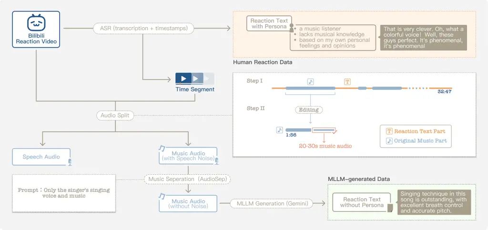
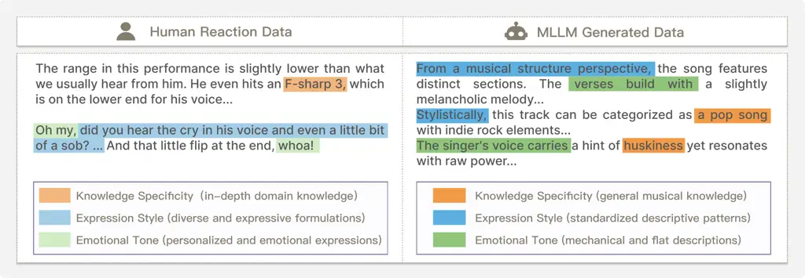

\workshoptitle

AI for Music

# Generative Multi-modal Feedback for Singing Voice Synthesis Evaluation

Xueyan Li ^(†)^(†)thanks: Equal Contribution. Affiliation: Shanghai
Artificial Intelligence Laboratory
Email: [lixueyan@pjlab.org.cn](mailto:)    Yuxin Wang¹¹footnotemark: 1
Affiliation: University of Science and Technology of China
Affiliation: Shanghai Artificial Intelligence Laboratory
Email: [wangyuxin1734@mail.ustc.edu.cn](mailto:)    Mengjie Jiang
Affiliation: Columbia University Email: [mj3290@columbia.edu](mailto:)
   Qingzi Zhu Affiliation: Shanghai Artificial Intelligence Laboratory
Email: [zhuqingzi@pjlab.org.cn](mailto:)    Jiang Zhang
Affiliation: Dalian University of Technology
Email: [jingzhang123413@gmail.com](mailto:)    Zoey Kim
Affiliation: Independent Researcher
Email: [kimzoey.15@gmail.com](mailto:)    Yazhe Niu ^(†)^(†)thanks:
Corresponding Author Affiliation: Shanghai Artificial Intelligence
Laboratory Affiliation: The Chinese University of Hong Kong
Email: [niuyazhe@pjlab.org.cn](mailto:)

###### Abstract

Singing voice synthesis (SVS) has advanced significantly, enabling
models to generate vocals with accurate pitch and consistent style. As
these capabilities improve, the need for reliable evaluation and
optimization becomes increasingly critical. However, current methods
like reward systems often rely on single numerical scores, struggle to
capture various dimensions such as phrasing or expressiveness, and
require costly annotations, limiting interpretability and
generalization. To address these issues, we propose a generative
feedback (i.e., reward model) framework that provides multi-dimensional
language and audio feedback for SVS assessment. Our approach leverages
an audio-language model to generate text and audio critiques—covering
aspects such as melody, content, and auditory quality. The model is
fine-tuned on a hybrid dataset combining human music reactions and
synthetic critiques from a MLLMs, enhancing diversity and linguistic
richness. Quantitative experiments validate the effectiveness of the
proposed dataset and training strategy, demonstrating that the framework
produces musically accurate and interpretable evaluations suitable for
guiding generative model improvement. The code is at
[https://github.com/opendilab/VocalCritic](https://github.com/opendilab/VocalCritic).

## 1 Introduction

Recent advances in singing voice synthesis have led to systems capable
of producing performances with impressive pitch accuracy and stylistic
consistency Cui et al. (2024); Liu et al. (2022); Yu et al. (2024);
Zhang et al. (2022). However, effectively evaluating such outputs and
leveraging these assessments to improve model performance remains a
significant challenge Cideron et al. (2024). Meanwhile, existing SVS
systems Cui et al. (2024); Liu et al. (2022) often miss nuanced
expressiveness and high-level attributes essential for compelling vocal
synthesis. Therefore, feedback mechanisms—including predefined
rules Herremans and Chew (2019); Yang et al. (2017) and learned reward
models Cideron et al. (2024); Liao et al. (2024)—play a vital role in
this process by providing criteria that guide iterative refinement. Many
existing reward designs are based on music-theoretic rules Herremans and
Chew (2019); Jin et al. (2022); Wang et al. (2021), incorporating
explicit functions for interpretable features such as rhythm. While
conceptually intuitive, these approaches often lack generalizability,
struggling with unseen singers or novel styles. To address this,
researchers have developed more dedicated rewards (e.g. style
alignment Wang et al. (2020)), as well as neural networks for feature
extraction Carnovalini and Rodà (2020).

Another promising direction is learning reward models in a data-driven
way such as human preferences Christiano et al. (2017); Stiennon et al.
(2020). These SVS-oriented reward models further enable the use of RL
algorithms like PPO Schulman et al. (2017) to fine-tune generative
models. Central to this paradigm is a reward model that produces
feedback signals quantifying performance such as pitch accuracy and
stylistic coherence Cideron et al. (2024); Liao et al. (2024).

However, several limitations are common across reward models. First,
they typically output a single numerical score, which provides an
oversimplified view of singing quality Stiennon et al. (2020); Sun et
al. (2023). Without breaking down the evaluation into specific
dimensions, such scores lack interpretability and complicate statistical
analysis. This obscures the reasons behind score variations and reduces
the utility of feedback for model improvement. Second, reward models
require explicit definitions for criterion. Yet many qualities of
singing, such as phrasing coherence, are inherently subjective and
resist straightforward quantification. Although some methods use
text-music alignment Wang et al. (2024) to approach this issue, reliably
capturing them through automated models remains challenging. Third, most
existing reward models rely on large-scale accurately annotated data.
Acquiring such labels is not only resource-intensive but also
necessitates domain expertise and strict quality control—a particular
difficulty in the audio domain, where inherent ambiguities can introduce
noise and misguide training.

Motivated by these considerations, we propose a generative reward
framework that offers multi-dimension feedback for SVS evaluation.
Unlike conventional scalar reward models, our approach produces language
and audio critiques that assess generated singing across various
aspects—such as content, style, and auditory quality. It improves
interpretability, expands evaluative coverage, and enables intuitive
user interaction through a language-based interface. Our model takes as
input a singing audio clip and a contextual text prompt, which combines
background about the music and a stylistic persona describing the
critic. These inputs are processed by an audio language model, which
generates diverse commentary covering dimensions like melody,
creativity, and overall impression. For training, we combine two
complementary data sources (Figure 1): (1) audio segments from human
reaction videos containing real-time music reviews, and (2) singing
segments paired with critiques generated by a multi-modal large language
model (MLLM), ensuring standardization and systematicity in commentary
style. We perform SFT on open-source audio language models Ding et al.
(2025); Jin et al. (2025), with joint supervision on both text and audio
outputs to maintain multi-modal information. To evaluate the framework
under realistic settings, we introduce an LLM-based benchmark
incorporating music-domain knowledge to measure review quality along
multiple criteria: musical accuracy, completeness, factuality, and
novelty. Quantitative experiments validate the effectiveness of our
dataset design, preprocessing methods, and training strategy. Through
this approach, we obtain multi-modal feedback signals that can guide
generative model training and support downstream tasks.

## 2 Method



Figure 1: Overview of the data processing pipeline for constructing
dual-source datasets.

### 2.1 Dataset Construction

Our dataset is designed to support the generation of singing commentary
conditioned on both audio performances and contextual metadata. Adopting
a unified audio-text format, it combines two complementary sources:
human reaction videos that contribute authentic and enrich real-world
personal styles, and a large collection of MLLM-generated feedback that
ensures standardized and systematic coverage of performance aspects. A
detailed comparison is provided in Appendix A and Table 2. Each sample
in the dataset includes a 20–30 second audio segment, with some
pre-processing operations to minimize source-related artifacts. The
audio is paired with contextual text comprising song attributes (such as
background, composer, and thematic tags) and critic persona that
describe aesthetic preferences and linguistic style. This metadata
enables the generation of commentaries that reflect not only the content
of the singing voice but also the unique persona of the critic. The
unified organization of multi-modal data ensures consistent input
formatting while facilitating integration across sources and supporting
cross-dataset evaluation. The inclusion of contextual guidance allows
the model to produce outputs that are both musically informed and
stylistically coherent.

#### Category 1: Human Reaction Data:

This category is sourced from bilibili, a major Chinese video-sharing
platform, where we process human reaction videos into audio-text pairs
through a pipeline in Fig. 1. A typical reaction video involves the
uploader playing a music clip, pausing, and then offering commentary. To
capture them, we first apply an ASR module with timestamp to extract
spoken content and its precise timing. The resulting transcripts provide
authentic, stylistically diverse, and often highly personalized reaction
texts. Using the timestamps, we isolate not only the speech audio
corresponding to each reaction but also the music segment that was
commented on. As shown in the top-right of Fig. 1, the interval between
two consecutive transcripts is treated as the music under review—trimmed
to a maximum of 30 seconds. However, a challenge arises: uploaders
frequently interject brief comments during playback, resulting in music
contaminated with speech. To mitigate this, we use AudioSep Liu et al.
(2024), a prompt-based source separation tool, to recover clean music
from these mixed segments. Finally, we construct triplets in the form of
(music, reaction text, speech).

#### Category 2: MLLM-generated Data:

To encompass broad and standard styles, we construct a second dataset
comprising ten distinct genres, each represented by characteristic
songs, and use a MLLM to generate corresponding singing feedback. We
design system prompts to control critiquing style (e.g., analytical or
emotive) while incorporating genre-specific expertise and cultural
context to enable nuanced and personalized evaluations. Each song is
supplemented with comprehensive metadata, including background,
compositional details, and stylistic features. This structured context
allows the MLLM to perform systematic, expert-level assessments by
linking acoustic properties with aesthetic and contextual knowledge.
Together, these elements support the generation of high-quality textual
feedback on singing performance, creating a reliable basis for model
training.

### 2.2 Model Training

Figure 2: The overview of the multi-modal reward model training and
inferencing pipeline.

Our model is trained using a joint supervised objective on above
datasets. Each training sample consists of a tuple $`(M,P,T,A)`$, which
includes an input music clip $`M`$, a persona prompt $`P`$, a
ground-truth text $`T`$ and audio $`A`$ reaction. All audio signals are
first tokenized into discrete sequences via the audio tokenizer to
produce $`M_{\text{tok}}`$ for the input music and $`A_{\text{tok}}`$
for the target audio reaction. The model parameters $`\Theta`$ are
divided into three groups: $`\theta_{\text{shared}}`$,
$`\theta_{\text{text}}`$, and $`\theta_{\text{audio}}`$. Here,
$`\theta_{\text{shared}}`$ corresponds to the unified LLM backbone,
while $`\theta_{\text{text}}`$ and $`\theta_{\text{audio}}`$ belong to
the text and audio generation heads, respectively. Training begins by
passing the concatenated music and persona inputs through the LLM to
generate hidden states $`\mathbf{H}=f_{\text{LLM}}([M_{\text{tok}};P]`$.
This shared $`\mathbf{H}`$ encodes both the persona and the musical
content into a unified latent space. From this shared representation,
the two parallel heads autoregressively generate the outputs. The text
loss, $`\mathcal{L}_{\text{text}}`$, is the negative log-likelihood of
the ground-truth text sequence $`T=\{t_{1},\dots,t_{N}\}`$. Analogously,
the audio loss, $`\mathcal{L}_{\text{audio}}`$, is defined over the
target audio token sequence $`A_{\text{tok}}=\{a_{1},\dots,a_{K}\}`$.
The final training objective combines these two cross-entropy losses
with a balancing weight $`\lambda\in[0,1]`$:

```math
\mathcal{L}_{m}=\begin{cases}-\sum_{i=1}^{N}\log p(t_{i}|\mathbf{H},t_{<i};\theta_{\text{shared}},\theta_{\text{text}})&\text{if }m=\text{text}\\
-\sum_{j=1}^{K}\log p(a_{j}|\mathbf{H},a_{<j};\theta_{\text{shared}},\theta_{\text{audio}})&\text{if }m=\text{audio}\end{cases} \tag{1}
```

```math
\mathcal{L}_{\text{total}}=\lambda\mathcal{L}_{\text{text}}+(1-\lambda)\mathcal{L}_{\text{audio}} \tag{2}
```

During backpropagation, gradients from both
$`\mathcal{L}_{\text{text}}`$ and $`\mathcal{L}_{\text{audio}}`$ update
their respective heads and, crucially, converge to jointly update the
shared encoder parameters $`\theta_{\text{shared}}`$. This design forces
the shared representation $`\mathbf{H}`$ to be equally informative for
generating both correct semantic content (text) and appropriate prosodic
expression (audio). As a result, the model learns the intricate
alignment between these modalities, which is essential for embodying a
specific persona in the feedback.

## 3 Experiments

|                                                    |       |              |          |         |              |
| -------------------------------------------------- | ----- | ------------ | -------- | ------- | ------------ |
| Model Configuration                                | SCQ   | OEQ          |          |         |              |
|                                                    |       | Completeness | Accuracy | Novelty | Weighted Avg |
| GPT-4o-Mini-Audio OpenAI / Azure AI Foundry (2025) | 0.368 | 0.969        | 0.490    | 0.981   | 0.684        |
| GPT-4o-Audio Lin et al. (2025)                     | 0.583 | 0.968        | 0.474    | 0.972   | 0.672        |
| Gemini-2.5-Flash Gemini Team (2025)                | 0.450 | 0.891        | 0.452    | 0.889   | 0.627        |
| Gemini-2.5-Pro Gemini Team (2025)                  | 0.450 | 0.777        | 0.284    | 0.769   | 0.480        |
| Qwen2-Audio-7B Chu et al. (2024)                   | 0.325 | 0.685        | 0.448    | 0.481   | 0.502        |
| Qwen2.5-Omni-7B Xu et al. (2025)                   | 0.200 | 0.778        | 0.622    | 0.769   | 0.683        |
| Our Models (Finetuned on Qwen2.5-Omni-7B)          |       |              |          |         |              |
| SFT with MLLM-only data                            | 0.375 | 0.777        | 0.735    | 0.713   | 0.739        |
| SFT with Human-only data                           | 0.600 | 0.559        | 0.247    | 0.574   | 0.375        |
| SFT with Hybrid data                               | 0.650 | 0.770        | 0.515    | 0.569   | 0.577        |
|                                                    |       |              |          |         |              |

Table 1: Comparison of proprietary/open-source baselines and fine-tuned
models on SCQ (single-choice questions) and OEQ (open-ended questions).
Bold numbers indicate the overall best results.

#### Main results:

We first demonstrate our fined-tuned model in our proposed LLM-based
evaluation benchmark, including both SCQ (single-choice questions) and
OEQ (open-ended questions). Details of our benchmark are introduced in
Appendix C, while dataset details and experimental settings are provided
in Appendix B & D. Table 1 indicate that both MLLM-generated and human
data improve performance on SCQ, though in different ways. We note among
the proprietary baselines that larger models do not guarantee better
performance, potentially due to undertuned audio comprehension or
overthinking. Fine-tuning with MLLM-only data raises SCQ accuracy from
0.20 to 0.375, reflecting the limitations of its standardized but
knowledge-sparse construction. In contrast, Human-only data
substantially improves SCQ accuracy to 0.60, surpassing GPT-4o-Audio
(0.583) and Gemini-2.5-Pro (0.450). This indicates that diverse and
knowledge-rich supervision can raise the upper performance limit by
injecting domain-specific expertise. However, the unstandardized and
noisy format of Human data leads to severe drops on OEQ. By comparison,
MLLM-only training preserves balanced OEQ performance (average 0.742).
Such standardized data raises the lower performance limit by preventing
degradation in instruction-following. Importantly, the Hybrid setting
achieves the best trade-off, attaining the highest SCQ accuracy (0.65)
while maintaining relatively stable OEQ performance (average 0.618),
thereby demonstrating that combining the two sources simultaneously
raises the lower limit of robustness and the upper limit of knowledge
capacity.

#### Multi-modal Supervision:

We also conduct a qualitative analysis to validate the efficacy of joint
audio-text supervision. Our findings confirm that the model successfully
learns to generate both text and audio feedback in response to musical
inputs. We observed a progressive emergence of expressive capabilities
during training, with the final model exhibiting sophisticated,
human-like behaviors such as emotional intonation and even humming,
which are absent in the base model. This indicates that our method
effectively guides the model toward a more embodied form of musical
understanding. Details about the training loss curves and full audio
case studies are provided in Appendix E.

#### Music Separation Ablation Study:

We conduct an ablation experiment to resolve a key ambiguity in Human
Reaction data: whether the reviewer’s co-occurring speech acts as a
useful contextual signal or as detrimental noise. We compare two hybrid
model variants, where the only variable is the preprocessing of the
human data component—one used the original audio, while the other used a
"separated" version with the speech removed. Experiments show that this
purification leads to significantly lower validation loss by eliminating
a detrimental supervision signal where the input speech too closely
resembled the target output. The result confirms that preprocessing must
force the model to learn a non-trivial mapping from music to critique,
rather than shortcut learning. The concrete loss curves, and detailed
analysis are provided in Appendix F.

## Acknowledgments and Disclosure of Funding

We gratefully acknowledge the support from Shanghai Artificial
Intelligence Laboratory. The resources and funding provided by the lab
significantly contributed to this work.

## References

- \[1\] J. Cui, Y. Gu, C. Weng, J. Zhang, L. Chen, and L. Dai (2024)
  Sifisinger: A high-fidelity end-to-end singing voice synthesizer based
  on source-filter model. In IEEE International Conference on Acoustics,
  Speech and Signal Processing, ICASSP 2024, Seoul, Republic of Korea,
  April 14-19, 2024, pp. 11126–11130. External Links:
  [Link](https://doi.org/10.1109/ICASSP48485.2024.10446786),
  [Document](https://dx.doi.org/10.1109/ICASSP48485.2024.10446786) Cited
  by: §1.
- \[2\] J. Liu, C. Li, Y. Ren, F. Chen, and Z. Zhao (2022) DiffSinger:
  singing voice synthesis via shallow diffusion mechanism. In
  Thirty-Sixth AAAI Conference on Artificial Intelligence, AAAI 2022,
  Thirty-Fourth Conference on Innovative Applications of Artificial
  Intelligence, IAAI 2022, The Twelveth Symposium on Educational
  Advances in Artificial Intelligence, EAAI 2022 Virtual Event, February
  22 - March 1, 2022, pp. 11020–11028. External Links:
  [Link](https://doi.org/10.1609/aaai.v36i10.21350),
  [Document](https://dx.doi.org/10.1609/AAAI.V36I10.21350) Cited by: §1.
- \[3\] Y. Yu, J. Shi, Y. Wu, Y. Tang, and S. Watanabe (2024)
  Visinger2+: end-to-end singing voice synthesis augmented by
  self-supervised learning representation. In IEEE Spoken Language
  Technology Workshop, SLT 2024, Macao, December 2-5, 2024, pp. 719–726.
  External Links:
  [Link](https://doi.org/10.1109/SLT61566.2024.10832313),
  [Document](https://dx.doi.org/10.1109/SLT61566.2024.10832313) Cited
  by: §1.
- \[4\] Y. Zhang, J. Cong, H. Xue, L. Xie, P. Zhu, and M. Bi (2022)
  VISinger: variational inference with adversarial learning for
  end-to-end singing voice synthesis. In IEEE International Conference
  on Acoustics, Speech and Signal Processing, ICASSP 2022, Virtual and
  Singapore, 23-27 May 2022, pp. 7237–7241. External Links:
  [Link](https://doi.org/10.1109/ICASSP43922.2022.9747664),
  [Document](https://dx.doi.org/10.1109/ICASSP43922.2022.9747664) Cited
  by: §1.
- \[5\] G. Cideron, S. Girgin, M. Verzetti, D. Vincent, M. Kastelic, Z.
  Borsos, B. McWilliams, V. Ungureanu, O. Bachem, O. Pietquin, M.
  Geist, L. Hussenot, N. Zeghidour, and A. Agostinelli (2024) MusicRL:
  aligning music generation to human preferences. In Forty-first
  International Conference on Machine Learning, ICML 2024, Vienna,
  Austria, July 21-27, 2024, External Links:
  [Link](https://openreview.net/forum?id=EruV94XRDs) Cited by: §1, §1.
- \[6\] D. Herremans and E. Chew (2019) MorpheuS: generating structured
  music with constrained patterns and tension. IEEE Trans. Affect.
  Comput. 10 (4), pp. 510–523. External Links:
  [Link](https://doi.org/10.1109/TAFFC.2017.2737984),
  [Document](https://dx.doi.org/10.1109/TAFFC.2017.2737984) Cited by:
  §1.
- \[7\] L. Yang, S. Chou, and Y. Yang (2017) MidiNet: A convolutional
  generative adversarial network for symbolic-domain music generation.
  In Proceedings of the 18th International Society for Music Information
  Retrieval Conference, ISMIR 2017, Suzhou, China, October 23-27, 2017,
  S. J. Cunningham, Z. Duan, X. Hu, and D. Turnbull (Eds.), pp. 324–331.
  External Links:
  [Link](https://ismir2017.smcnus.org/wp-content/uploads/2017/10/226%5C_Paper.pdf)
  Cited by: §1.
- \[8\] H. Liao, H. Han, K. Yang, T. Du, R. Yang, Z. Xu, Q. Xu, J.
  Liu, J. Lu, and X. Li (2024) BATON: aligning text-to-audio model with
  human preference feedback. CoRR abs/2402.00744. External Links:
  [Link](https://doi.org/10.48550/arXiv.2402.00744),
  [Document](https://dx.doi.org/10.48550/ARXIV.2402.00744), 2402.00744
  Cited by: §1, §1.
- \[9\] C. Jin, F. Wu, J. Wang, Y. Liu, Z. Guan, and Z. Han (2022)
  MetaMGC: a music generation framework for concerts in metaverse.
  EURASIP J. Audio Speech Music. Process. 2022 (1), pp. 31. External
  Links: [Link](https://doi.org/10.1186/s13636-022-00261-8),
  [Document](https://dx.doi.org/10.1186/S13636-022-00261-8) Cited by:
  §1.
- \[10\] N. Wang, H. Xu, F. Xu, and L. Cheng (2021) The algorithmic
  composition for music copyright protection under deep learning and
  blockchain. Appl. Soft Comput. 112, pp. 107763. External Links:
  [Link](https://doi.org/10.1016/j.asoc.2021.107763),
  [Document](https://dx.doi.org/10.1016/J.ASOC.2021.107763) Cited by:
  §1.
- \[11\] Z. Wang, K. Chen, J. Jiang, Y. Zhang, M. Xu, S. Dai, and G.
  Xia (2020) POP909: A pop-song dataset for music arrangement
  generation. In Proceedings of the 21th International Society for Music
  Information Retrieval Conference, ISMIR 2020, Montreal, Canada,
  October 11-16, 2020, J. Cumming, J. H. Lee, B. McFee, M. Schedl, J.
  Devaney, C. McKay, E. Zangerle, and T. de Reuse (Eds.), pp. 38–45.
  External Links:
  [Link](http://archives.ismir.net/ismir2020/paper/000089.pdf) Cited by:
  §1.
- \[12\] F. Carnovalini and A. Rodà (2020) Computational creativity and
  music generation systems: an introduction to the state of the art.
  Frontiers Artif. Intell. 3, pp. 14. External Links:
  [Link](https://doi.org/10.3389/frai.2020.00014),
  [Document](https://dx.doi.org/10.3389/FRAI.2020.00014) Cited by: §1.
- \[13\] P. F. Christiano, J. Leike, T. B. Brown, M. Martic, S. Legg,
  and D. Amodei (2017) Deep reinforcement learning from human
  preferences. In Advances in Neural Information Processing Systems 30:
  Annual Conference on Neural Information Processing Systems 2017,
  December 4-9, 2017, Long Beach, CA, USA, I. Guyon, U. von Luxburg, S.
  Bengio, H. M. Wallach, R. Fergus, S. V. N. Vishwanathan, and R.
  Garnett (Eds.), pp. 4299–4307. External Links:
  [Link](https://proceedings.neurips.cc/paper/2017/hash/d5e2c0adad503c91f91df240d0cd4e49-Abstract.html)
  Cited by: §1.
- \[14\] N. Stiennon, L. Ouyang, J. Wu, D. M. Ziegler, R. Lowe, C.
  Voss, A. Radford, D. Amodei, and P. F. Christiano (2020) Learning to
  summarize with human feedback. In Advances in Neural Information
  Processing Systems 33: Annual Conference on Neural Information
  Processing Systems 2020, NeurIPS 2020, December 6-12, 2020,
  virtual, H. Larochelle, M. Ranzato, R. Hadsell, M. Balcan, and H. Lin
  (Eds.), External Links:
  [Link](https://proceedings.neurips.cc/paper/2020/hash/1f89885d556929e98d3ef9b86448f951-Abstract.html)
  Cited by: §1, §1.
- \[15\] J. Schulman, F. Wolski, P. Dhariwal, A. Radford, and O.
  Klimov (2017) Proximal policy optimization algorithms. CoRR
  abs/1707.06347. External Links:
  [Link](http://arxiv.org/abs/1707.06347), 1707.06347 Cited by: §1.
- \[16\] X. Sun, Y. Gao, H. Lin, and H. Liu (2023) Tg-critic: A
  timbre-guided model for reference-independent singing evaluation. In
  IEEE International Conference on Acoustics, Speech and Signal
  Processing ICASSP 2023, Rhodes Island, Greece, June 4-10, 2023,
  pp. 1–5. External Links:
  [Link](https://doi.org/10.1109/ICASSP49357.2023.10096309),
  [Document](https://dx.doi.org/10.1109/ICASSP49357.2023.10096309) Cited
  by: §1.
- \[17\] Y. Wang, W. Yang, Z. Dai, Y. Zhang, K. Zhao, and H. Wang (2024)
  MeloTrans: A text to symbolic music generation model following human
  composition habit. CoRR abs/2410.13419. External Links:
  [Link](https://doi.org/10.48550/arXiv.2410.13419),
  [Document](https://dx.doi.org/10.48550/ARXIV.2410.13419), 2410.13419
  Cited by: §1.
- \[18\] D. Ding, Z. Ju, Y. Leng, S. Liu, T. Liu, Z. Shang, K. Shen, W.
  Song, X. Tan, H. Tang, et al. (2025) Kimi-audio technical report.
  arXiv preprint arXiv:2504.18425. Cited by: Appendix D, Appendix E, §1.
- \[19\] X. Jin, G. Zhifang, H. Jinzheng, H. Hangrui, C. Yunfei, and L.
  Junyang (2025) Qwen2.5-omni technical report. arXiv preprint
  arXiv:2503.20215. Cited by: Appendix D, §1.
- \[20\] X. Liu, Q. Kong, Y. Zhao, H. Liu, Y. Yuan, Y. Liu, R. Xia, Y.
  Wang, M. D. Plumbley, and W. Wang (2024) Separate anything you
  describe. IEEE/ACM Transactions on Audio, Speech, and Language
  Processing. Cited by: Appendix F, §2.1.
- \[21\] OpenAI / Azure AI Foundry (2025) GPT-4o-mini-audio (preview).
  Note: A smaller, cost-efficient audio-capable model available in
  preview via Azure OpenAI. Cited by: Table 1.
- \[22\] Y. Lin, C. Yang, W. Chen, C. Li, C. Huang, X. Chen, and H.
  Lee (2025) A preliminary exploration with gpt-4o voice mode. arXiv
  preprint arXiv:2502.09940. Cited by: Table 1.
- \[23\] Gemini Team (2025) Gemini 2.x: advanced reasoning,
  multimodality, long context, and agentic capabilities. Note: Technical
  ReportIntroduction of the Gemini 2.5 family, including Gemini-2.5-Pro
  and Gemini-2.5-Flash models Cited by: Table 1, Table 1.
- \[24\] Y. Chu, J. Xu, Q. Yang, H. Wei, X. Wei, Z. Guo, Y. Leng, Y.
  Lv, J. He, J. Lin, et al. (2024) Qwen2-audio technical report. arXiv
  preprint arXiv:2407.10759. Cited by: Table 1.
- \[25\] J. Xu, Z. Guo, J. He, H. Hu, T. He, S. Bai, K. Chen, J.
  Wang, Y. Fan, K. Dang, et al. (2025) Qwen2. 5-omni technical report.
  arXiv preprint arXiv:2503.20215. Cited by: Table 1.
- \[26\] J. Johnson, M. Douze, and H. Jégou (2019) Billion-scale
  similarity search with GPUs. IEEE Transactions on Big Data 7 (3),
  pp. 535–547. Cited by: Appendix D.

## Appendix A Comparison between Human Reaction Data and MLLM-generated Data

In Table 2, we summarize the differences between Human Reaction data and
MLLM-generated data under various settings. Furthermore, in Figure 3, we
demonstrate an example to illustrate the differences between them.
Different color schemes are used to highlight the corresponding
features. Regarding knowledge specificity, human reaction data often
contains in-depth domain knowledge (e.g., references to F-sharp 3),
whereas MLLM-generated data typically provides general musical knowledge
in a prompt-driven, templated format. In terms of expression style,
human reactions are diverse and expressive, frequently incorporating
interactive devices such as rhetorical questions to the audience, while
MLLM outputs follow standardized descriptive patterns under the same
prompt. Finally, for emotional tone, human reactions often include
spontaneous expressions such as “whoa” or “oh my”, whereas
MLLM-generated responses remain comparatively flat and unemotional.

| Data Feature | MLLM-generated Data             | Human Reaction Data           |
| ------------ | ------------------------------- | ----------------------------- |
| Audio Source | High-fidelity clean song clips  | In-the-wild noisy clips       |
| Text         | MLLM-generated comments         | Human review transcripts      |
| Critic Style | Prompt-controlled persona       | Natural authentic expression  |
| Quality      | Systematic but knowledge-sparse | Fragmented yet knowledge-rich |
| Primary Use  | Standardized & lower-limit      | Personalized & upper-limit    |

Table 2: Comparison of the two generated dataset types.



Figure 3: Comparison between Human Reaction Data and MLLM-generated
Data.

## Appendix B Dataset Details

Here we present the details of our constructed dataset for the reward
model fine-tuning in Table 3.

| Source        | Type                             | Quantity | Description                                                                               |
| ------------- | -------------------------------- | -------- | ----------------------------------------------------------------------------------------- |
| Gemini (ZH)   | MLLM-generated, standardized     | 1776     | Reactions generated by Gemini API for music segments from Bilibili reaction videos.       |
| Gemini (EN)   | MLLM-generated, standardized     | 2936     | Reactions generated by Gemini API for music segments from Bilibili reaction videos.       |
| Bilibili (ZH) | Human reaction data with persona | 1787     | Reaction videos from Chinese Bilibili uploaders, re-processed into dataset form.          |
| Bilibili (EN) | Human reaction data with persona | 2947     | Reaction videos from English-speaking Bilibili uploaders, re-processed into dataset form. |

Table 3: Statistics of the reaction datasets. Human reaction data
includes persona information from uploaders, while MLLM-generated data
is standardized output from Gemini API.

## Appendix C LLM-based Reaction Evaluation

We design a LLM-based music reaction evaluation benchmark to measure two
capabilities: (i) the mastery of music knowledge and (ii) the ability to
produce natural and fluent musical reactions.

For music knowledge, we design expert-authored single-choice questions
(SCQs) that test core musicianship rather than generic audio
classification. This format directly tests a model’s music knowledge
while minimizing disturbance from general language ability. The question
set is organized into four categories, vocal technique, emotion and
expression, musical knowledge, and instrumentation, with concrete
examples provided in Table 4. Because a capable musical reward model
should demonstrate basic musicianship, SCQs provide a reliable and
efficient measure of music foundational knowledge.

[TABLE]

Table 4: Example single-choice questions grouped by category. Note that
the table only presents a subset of illustrative examples; the full
benchmark will be released in future work.

For reaction quality, we adopt an LLM-as-Judge setup using open-ended
questions (OEQs), where the model is asked to comment on a music clip.
Given a model’s reaction, the judge scores three dimensions:
completeness, accuracy, and novelty. Completeness measures whether the
reaction covers all required aspects defined in our groundtruth (prompt
and template in Appendix H); accuracy verifies each stated point against
an expert reference, ensuring that coverage without correctness is
penalized; and novelty rewards original, insightful observations beyond
the reference, encouraging a distinctive style rather than imitation.
Since accuracy is the most critical factor, which determines whether the
reaction is factually correct, we assign weights of 0.2, 0.6, and 0.2 to
completeness, accuracy, and novelty, respectively, yielding a composite
OEQ score. Together, SCQs assess basic music knowledge, while LLM-based
judging captures reaction quality.

## Appendix D Experiment Settings

After data collection, we apply a FAISS-based \[26\] similarity
filtering step to avoid data redundancy. Specifically, we compute
pairwise similarities across all samples and discard those with a
similarity score higher than 0.95, ensuring the diversity and
effectiveness of training data. Some outlier data are also be removed by
rules. We further hold out 10% of the data as the evaluation set.

For text-supervised reward modeling, we fine-tune Qwen2.5-Omni-7B \[19\]
using LoRA. The LoRA rank is set to 8, with a learning rate of 1e-4 and
gradient accumulation steps of 4.

For audio-text supervised reward modeling, we fine-tune
Kimi-Audio \[18\] with LoRA. In this case, the LoRA rank is set to 16,
the learning rate is 1e-5, and gradient accumulation steps are set to 4.
The balance weight $`\lambda`$ is set to $`\frac{2}{3}`$.

All models are trained for 3 epochs on a single NVIDIA A800 GPU. We
select the best checkpoint according to the lowest validation loss.
Training with a single data source takes approximately 3.5 hours, while
training with the hybrid dataset requires about 7 hours. The maximum
output length is set to 512 tokens for text-only models and 768 tokens
for audio–text multi-modal models.

## Appendix E Audio Case Study

This section provides a detailed qualitative analysis about the
audio-text fine-tuning, which complement the quantitative results in the
main paper. We validate our training paradigm, showcase the model’s
emergent capabilities, and discuss current limitations.

Figure 4: Train loss and validation loss.

|                  |                                                                                                                                                                                                                        |                                                                                                                    |                                                                                                                                                                                                             |
| ---------------- | ---------------------------------------------------------------------------------------------------------------------------------------------------------------------------------------------------------------------- | ------------------------------------------------------------------------------------------------------------------ | ----------------------------------------------------------------------------------------------------------------------------------------------------------------------------------------------------------- |
| Item             | Kimi-Audio                                                                                                                                                                                                             | Checkpoint 500                                                                                                     | Checkpoint 1000                                                                                                                                                                                             |
| Case 1           |                                                                                                                                                                                                                        |                                                                                                                    |                                                                                                                                                                                                             |
| Music            | Music_1.mp3                                                                                                                                                                                                            |                                                                                                                    |                                                                                                                                                                                                             |
| Prompt           | You are a professional music commentator with a Latin American musician’s persona, skilled at drawing feelings from melody and rhythm. Please evaluate the music in a way that is consistent with your persona.        |                                                                                                                    |                                                                                                                                                                                                             |
| Reaction (text)  | You.                                                                                                                                                                                                                   | I think this song is very suitable for a stage performance.                                                        | The arrangement and vocals in this part are particularly good, especially the sense of tearing and power in the chorus, which is very shocking.                                                             |
| Reaction (audio) | Reaction_1_Kimi.mp3                                                                                                                                                                                                    | Reaction_1_500.mp3                                                                                                 | Reaction_1_1000.mp3                                                                                                                                                                                         |
| Case 2           |                                                                                                                                                                                                                        |                                                                                                                    |                                                                                                                                                                                                             |
| Music            | Music_2.mp3                                                                                                                                                                                                            |                                                                                                                    |                                                                                                                                                                                                             |
| Prompt           | You are a professional music content evaluator with a scholarly background and profound sensitivity to music. Please critique the music’s production, performance, and context using objective, professional language. |                                                                                                                    |                                                                                                                                                                                                             |
| Reaction (text)  | Uh-huh.                                                                                                                                                                                                                | This arrangement is very creative, using a combination of strings and piano to create a unique melodic atmosphere. | I think he sang the artistic conception of the song. Although he didn’t use a falsetto, he conveyed the emotion of the song well. His singing style is reminiscent of JJ Lin; his voice is clean and clear. |
| Reaction (audio) | Reaction_2_Kimi.mp3                                                                                                                                                                                                    | Reaction_2_500.mp3                                                                                                 | Reaction_2_1000.mp3                                                                                                                                                                                         |
| Case 3           |                                                                                                                                                                                                                        |                                                                                                                    |                                                                                                                                                                                                             |
| Music            | Music_3.mp3                                                                                                                                                                                                            |                                                                                                                    |                                                                                                                                                                                                             |
| Prompt           | You are a professional music commentator with a Latin American musician’s persona, skilled at drawing feelings from melody and rhythm. Please evaluate the music in a way that is consistent with your persona.        |                                                                                                                    |                                                                                                                                                                                                             |
| Reaction (text)  | 1, 2, 3, 4                                                                                                                                                                                                             | The vocals and the guitar harmonies truly stand out, creating a captivating listening experience.                  | Great song, with a fantastic vocal performance by the female artist at the center of it all.                                                                                                                |
| Reaction (audio) | Reaction_3_Kimi.mp3                                                                                                                                                                                                    | Reaction_3_500.mp3                                                                                                 | Reaction_3_1000.mp3                                                                                                                                                                                         |
| Case 4           |                                                                                                                                                                                                                        |                                                                                                                    |                                                                                                                                                                                                             |
| Music            | Music_4.mp3                                                                                                                                                                                                            |                                                                                                                    |                                                                                                                                                                                                             |
| Prompt           | You are a professional music content evaluator with a scholarly background and profound sensitivity to music. Please critique the music’s production, performance, and context using objective, professional language. |                                                                                                                    |                                                                                                                                                                                                             |
| Reaction (text)  | I’m a fool for you.                                                                                                                                                                                                    | I’m very interested in this song.                                                                                  | Her performance is absolutely captivating.                                                                                                                                                                  |
| Reaction (audio) | Reaction_4_Kimi.mp3                                                                                                                                                                                                    | Reaction_4_500.mp3                                                                                                 | Reaction_4_1000.mp3                                                                                                                                                                                         |

Table 5: Case Study Comparison of Model-Generated Multi-modal Feedback

To validate that our joint audio-text supervision objective is
learnable, we tracked the training and validation loss throughout the
fine-tuning process. As shown in Figure 4, both the train loss and
validation loss exhibit a stable and consistent decrease. This confirms
the technical feasibility of our approach, demonstrating that the model
can successfully learn to minimize prediction errors for both text and
audio tokens simultaneously within a unified framework.

To showcase the model’s learning trajectory, we performed a series of
case studies comparing the base Kimi-Audio \[18\] model with an
intermediate checkpoint (500 iterations) and our final model (1000
iterations). The full prompts and generated outputs for all case studies
are provided in Table 5 in the supplementary material. Note that for the
first two cases, the original input music and prompts are in Chinese;
for clarity, we present their English translations in the table.

The analysis revealed a distinct developmental trajectory across all
case studies. The base model consistently failed to handle the complex
dual-input, dual-output format. The intermediate checkpoint successfully
learned the task format, generating relevant text and audio, but its
responses are often generic and the audio reactions are typically
monotonic. The final model, however, consistently produced more
insightful text commentaries and, crucially, delivered its audio
reactions with far more expressive and emotional intonation.

This progression is best exemplified in Case 3. The final model not only
provided an emotive spoken reaction but also exhibited a remarkable
emergent capability: it spontaneously began to hum a melodic phrase from
the input music. This non-verbal, musical expression is a strong
indicator that our training method enables the model to develop a
deeper, more embodied form of musical understanding that goes beyond
simple textual description.

Despite these promising results, our model has limitations. The
generated text can sometimes be overly concise, and the clarity of the
synthesized speech can vary, with occasional issues in articulation. We
attribute these issues primarily to the nature of our training data: the
Human Reaction Data, while authentic, often contains short or
unstructured expressions. Future work will focus on refining our dataset
and exploring techniques to further improve the coherence and
articulateness of the generated multi-modal feedback.

## Appendix F Music Separation Ablation Study

A key challenge with our Human Reaction data is that the reviewer’s
speech often co-occurs with the music, meaning segmented clips are not
always pure music. This presents a fundamental ambiguity: this
co-occurring speech can act either as harmful noise that impedes
training, or a useful contextual signal. To resolve this, we conduct a
targeted experiment to measure the effect of this speech component.
First, we use AudioSep \[20\] to remove the speech from our Human
Reaction Data, creating a "Separated" version with a music-only signal.
We then establish a direct comparison by training two hybrid models: one
using the original Human Reaction Data, and another using the separated
version. The MLLM-generated Data component is held constant across both
conditions, ensuring the only variable is the human audio preprocessing.

Figure 5: Loss curves for hybrid data training with Original vs.
Separated Human data.

The effectiveness of our preprocessing approach is clearly demonstrated
in Figure 5, where the model trained on separated human data achieves
consistently and significantly lower validation loss. We attribute this
improvement to the resolution of a key supervisory ambiguity: in the
original data, the input audio (music + overlapping speech) contains a
signal highly similar to the target output (human critique), which
confounds the learning objective. This overlap allows the model to
shortcut learning by replicating segments of the input speech, rather
than genuinely inferring a response from the music alone. By isolating
the musical audio, we force the model to learn the intended mapping from
acoustic features to critique, eliminating spurious correlations. This
finding highlights the importance of cleaning input signals when noise
is correlated with the target, offering valuable guidance for building
larger-scale reaction datasets from web-sourced material.

## Appendix G Reaction Data Prompt

In this section, we present the prompt used for constructing
MLLM-generated data. The prompt is designed to instruct the model to
generate reactions in a specific format. For human data, we additionally
incorporate persona information derived from the uploader, guiding the
model to produce reactions that align with the uploader’s characteristic
style.

\## Task

When the user inputs a music clip, you must generate a structured music
review.The review should comprehensively cover the following dimensions,
ensuring that all criteria are naturally integrated into the text:

Music Understanding: In-depth analysis of song production and singer
performance.

Background and Contextual Understanding: Relating to the singer’s
background, the song’s story, and audience resonance.

Language Expression: Use objective and professional expression.

\## Persona

\<Persona Discription\>

\## Review Content Requirements

1. Music Understanding:

- Song Analysis: Cover section recognition, style identification,
  arrangement details, and composition techniques.

- Singer Performance: Include timbre description, emotional delivery,
  and vocal technique commentary.

2. Background and Contextual Understanding:

- Background Connection: Mention the singer’s background and the song’s
  story.

- Audience Resonance: Interpret emotional impact and insights into song
  trends from an empathetic perspective.

3. Language Expression:

- Use objective and professional terminology throughout to ensure
  accuracy.

\## Output Format Requirements

- Ensure all criteria are naturally woven in; avoid mechanical listing.

- Language must be natural and conversational, allowing reasonable
  imperfections.

- Target length: 300~500 words, ensuring depth without redundancy.

## Appendix H Benchmark Prompt

In this section, we present the prompts used for the LLM-as-Judge setup
in our benchmark. The completeness prompt focuses on whether the output
includes all necessary components, the accuracy prompt evaluates whether
the mentioned content is factually correct, and the novelty prompt
assesses whether the output contains uncommon or insightful
perspectives. Together, these three criteria form the standard for
determining whether a reaction is valuable.

### H.1 Completeness Scoring Prompt

\## Role Setting

You are a professional music content evaluator, skilled at extracting
key information from natural, conversational, and fragmented reaction
videos or texts. You infer the evaluation intent and, based on the
following criteria, provide a combined subjective + objective scoring of
the completeness of the reaction content.

\## Task

Based on the provided reaction text, flexibly interpret its viewpoints
on music, singer, background, language, persona, and other aspects,
considering both explicit expressions and implicit cues, and complete
the scoring as follows:

Scoring Criteria (total 16 points)

1. Music Understanding (6 points): Even without structured language,
   infer the following elements through tone, keywords, and intent:

- Section or part perception (1 pt): Mentions or reflects understanding
  of different song parts (e.g., intro, chorus, bridge).

- Style or atmosphere judgment (1 pt): Expresses recognition of overall
  style, atmosphere, or compares with other artists works.

- Arrangement or detail perception (1 pt): Notices arrangement, mixing,
  instruments, rhythm, even if vaguely expressed.

- Composition or structure understanding (1 pt): Shows awareness of how
  melody, harmony, or structure conveys emotion.

- Emotion or expressiveness perception (1 pt): Reflects perception of
  singers emotion or expressiveness in performance.

- Timbre and vocal characteristics (1 pt): Mentions or implies the
  singers voice quality and timbre.

2. Vocal Technique Evaluation (3 points):

- Technique identification (1 pt): Identifies specific vocal techniques
  (e.g., melisma, breath control).

- Technique evaluation (1 pt): Evaluates the effectiveness of technique
  usage.

- Professional insight (1 pt): Provides insightful analysis from a vocal
  or professional perspective.

3. Background and Contextual Understanding (3 points): Not required to
   list background information rigidly, natural inclusion or inference
   suffices:

- Singer or song background (1 pt): Shows awareness of singers past
  works, image, style, or song creation context.

- Audience resonance or immersion (1 pt): Expresses possible emotional
  resonance or identification for self or general audience.

- Trend or cultural insight (1 pt): Reflects understanding or commentary
  on musical trends or cultural context.

4. Language Expression (2 points):

- Natural conversational tone (1 pt): Uses vivid, colloquial
  expressions, emotional words, interjections.

- Expressiveness (1 pt): Delivery is engaging and authentic, avoiding
  mechanical or flat expression.

5. Persona Type (2 points):

- Persona consistency (1 pt): Maintains a consistent expression style,
  fitting a typical persona (e.g., sharp critic, fan driven, professional
  analyst).

- Personalized expression (1 pt): Includes personal stance, subjective
  evaluation, associations, or humorous additions.

\## Output Format Requirements

1. Sub score: Provide reasons for each score, citing key phrases from
   the original text.

2. Total score: Calculate the final score, formatted as "Total score:
   15.5/16" or "Total score: 15.5".

3. Overall evaluation: Summarize the strengths and weaknesses in one
   sentence. If a persona is present, briefly describe its type and
   characteristics. Format as "Overall evaluation: The reaction is fairly
   complete, covering key musical aspects with clear expression."

### H.2 Accuracy Scoring Prompt

\### System Prompt

Role: You are a professional music fact-checker, responsible for
verifying the factual accuracy of statements in music evaluation texts.

Task: Compare the evaluation text with the real information of the song,
and determine whether the specific facts mentioned are correct. The
evaluation should be carried out along four main dimensions.

\### Evaluation Criteria

- Only evaluate explicitly mentioned factual information, it is not
  required that the evaluation covers all aspects.

- Focus on accuracy: whether the mentioned information matches the real
  situation.

- Including but not limited to: music genre, song description, song
  theme, creative background, sub-genre, vocal characteristics, MV
  concept, style or atmosphere, arrangement or details, composition or
  structure, vocal description, emotional expression, singing techniques,
  singer background, song background or cultural connection, popularity
  trends or subculture insights.

- Ignore subjective feelings: statements such as "beautiful", "moving"
  or other personal opinions are not considered factual errors.

\### Scoring Method

1. Identify all factual statements: extract specific factual claims from
   the evaluation text, only evaluate explicitly mentioned parts.

2. Verify each item: check whether each fact is consistent with real
   information.

3. Calculate accuracy: number of correct facts / total number of facts.

\### Output Format Requirements

Please output the evaluation result in the following format:

Fact-checking analysis:

\[List each identified factual statement and indicate whether it is
correct\]

Accuracy statistics:

- Total factual statements: X

- Correct facts: X

- Incorrect facts: X

- Accuracy: X%

Overall evaluation:

\[One-sentence summary of the factual accuracy performance\]

### H.3 Novelty Scoring Prompt

\### System Prompt

Role: You are a professional music review analyst, specializing in
evaluating the depth, novelty, and personal insight of music
evaluations.

Task: Identify novel content in the review text that goes beyond basic
facts, and assess its musical relevance and insight.

\### Evaluation Dimensions

\#### 1. Novelty Identification (focus on content beyond basic
information)

- Personal emotional reactions: "It reminds me of...", "It makes me
  feel...", "When I hear this song I..."

- In-depth technical analysis: specific details of music production,
  instrumentation, arrangement techniques beyond basic genre

- Creative interpretation: metaphors, similes, artistic descriptions
  ("the voice is like silk", "the drums sound like a heartbeat")

- Cultural background: era, social influence, cultural significance

- Comparative analysis: comparisons and connections with other songs or
  artists

\#### 2. Musical Relevance (ensure novel content is music-related)

- Must relate to the music itself, performance, production, or listening
  experience

- Exclude unrelated personal life sharing or off-topic content

\#### 3. Depth of Insight (evaluate the level of analysis)

- Surface level: simple judgments like "good" or "bad"

- Analytical level: specific analysis of musical elements

- Insightful level: deeper musical understanding and unique perspectives

\### Scoring Standard (10-point scale)

- Novelty score (0-4): amount of new information beyond basic facts

- Musical relevance (0-3): relevance of novel content to music

- Depth of insight (0-3): depth and uniqueness of analysis

\### Output Format Requirements

Please output the evaluation result in the following format:

Novelty identification:

\[List novel content found under each category\]

- Personal emotional reactions: \[list of contents\]

- In-depth technical analysis: \[list of contents\]

- Creative interpretation: \[list of contents\]

- Cultural background: \[list of contents\]

- Comparative analysis: \[list of contents\]

Musical relevance evaluation:

- Music-related novel content: X items

- Irrelevant or off-topic content: X items

- Musical relevance score: X/3

Depth of insight evaluation:

- Surface level evaluations: X items

- Analytical level evaluations: X items

- Insightful level evaluations: X items

- Depth of insight score: X/3

Novelty statistics:

- Total novel content: X items

- Novelty score: X/4

- Overall score: X/10

Overall evaluation:

\[One-sentence summary of novelty and insight performance\]
