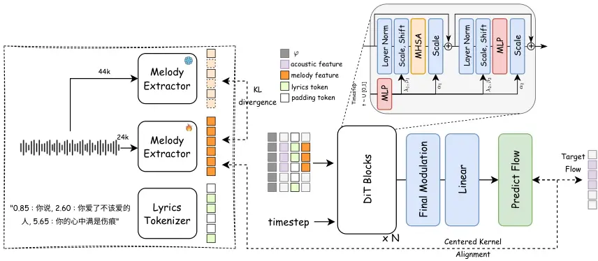
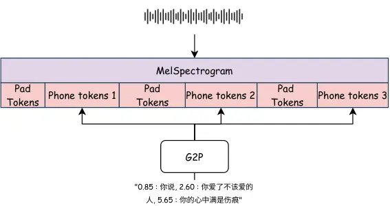

# YingMusic-Singer: Zero-shot Singing Voice Synthesis and Editing with Annotation-free Melody Guidance

Junjie Zheng Affiliation: AI Lab, GiantNetwork    Chunbo Hao
Affiliation: AI Lab, GiantNetwork Affiliation: ASLP Lab, Northwestern
Polytechnical University    Guobin Ma Affiliation: AI Lab, GiantNetwork
Affiliation: ASLP Lab, Northwestern Polytechnical University    Xiaoyu
Zhang Affiliation: AI Lab, GiantNetwork Affiliation: University College
London    Gongyu Chen Affiliation: AI Lab, GiantNetwork    Chaofan Ding
Affiliation: AI Lab, GiantNetwork    Zihao Chen Affiliation: AI Lab,
GiantNetwork    Lei Xie Affiliation: ASLP Lab, Northwestern
Polytechnical University

###### Abstract

Singing Voice Synthesis (SVS) remains constrained in practical
deployment due to its strong dependence on accurate phoneme-level
alignment and manually annotated melody contours—requirements that are
resource-intensive and hinder scalability. To overcome these
limitations, we propose a melody-driven SVS framework capable of
synthesizing arbitrary lyrics following any reference melody, without
relying on phoneme-level alignment. Our method builds on a Diffusion
Transformer (DiT) architecture, enhanced with a dedicated melody
extraction module that derives melody representations directly from
reference audio. To ensure robust melody encoding, we employ a teacher
model to guide the optimization of the melody extractor, alongside an
implicit alignment mechanism that enforces similarity distribution
constraints for improved melodic stability and coherence. Additionally,
we refine duration modeling using weakly-annotated song data and
introduce a Flow-GRPO reinforcement learning strategy with a
multi-objective reward function to jointly enhance pronunciation clarity
and melodic fidelity. Experiments show that our model achieves superior
performance over existing approaches in both objective measures and
subjective listening tests, especially in zero-shot and lyric adaptation
settings, while maintaining high audio quality without manual
annotation. This work offers a practical and scalable solution for
advancing data-efficient singing voice synthesis. To support
reproducibility, we release our inference code and model checkpoints.
Code and weights are available at:
[https://github.com/GiantAILab/YingMusic-Singer](https://github.com/GiantAILab/YingMusic-Singer)

## 1 Introduction

The digital entertainment industry has been continuously evolving,
driven by advancements in audio and music technologies. Among these,
Singing Voice Synthesis (SVS) stands out as a pivotal research direction
with substantial application potential in music production, virtual
singers, personal creative endeavors, and interactive media Chen et al.
(2020); Zhang et al. (2022d); Zhang et al. (2022c); Hong et al. (2023).
Compared to general speech synthesis, SVS must simultaneously satisfy
requirements for clear speech content, accurate melodic pitch, and
natural singing expression, rendering it considerably more complex than
speech synthesis modelCho et al. (2021). Conventional SVS methods have
long relied on precise phoneme-level duration and pitch annotations
during both training and inference stages Lu et al. (2020). This
dependency not only necessitates specialized data production pipelines
but also impedes the acquisition of large-scale training data, thereby
significantly hindering the widespread adoption and industrial
deployment of SVS technology. Recently, there has been a growing demand
in the industry for melody-controlled singing voice synthesis, where a
vocal is generated to match a given reference melody. This approach
requires only the lyric and a reference melody audio as inputs, enabling
users without professional musical expertise to participate in creative
activities—rather than restricting music creation to trained
professionals.

However, existing singing voice synthesis methods still exhibit
considerable limitations, resulting in a notable performance gap between
real-world applications and expectations. On one hand, the vast majority
of systems depend on manual labor or alignment tools to obtain precise
MIDI rhythms and phoneme-level duration annotations Zhang et al.
(2022a); Huang et al. (2021); Wang et al. (2022); Hong et al. (2024).
Such annotations are prohibitively expensive and difficult to scale to
songs of arbitrary styles or languages. On the other hand, current
approaches typically support only fixed lyric-melody pairs as seen
during training. When users attempt to substitute lyrics, mix languages,
or alter musical syntactic structures, the inherent mismatch between
phoneme counts and melodic beats often leads to issues such as robotic
pronunciation, rhythmic misalignment, and unnatural phrasing,
substantially degrading the auditory experience. Furthermore, most
contemporary methods lack zero-shot capability; their performance
deteriorates significantly when encountering unseen text or prosodic
structures, which contradicts practical application needs. Thus,
transitioning from "usable" to "easy-to-use and practical" remains a
critical bottleneck for SVS deployment.

To address these challenges, we propose a singing voice synthesis system
that eliminates phoneme-level duration and pitch annotations, and
enables free combination of arbitrary lyrics with any reference melody.
We design a generative model based on the Diffusion Transformer (DiT)
Dhariwal and Nichol (2021), incorporating a melody extraction module to
directly derive melody information from reference songs, which is then
used as a melodic condition during synthesis to avoid reliance on manual
annotations. Recognizing that merely conditioning on melody may not
ensure structural adherence to the reference track’s overall melodic
progression, we further introduce a implicit guidance mechanism based on
similarity distribution constraints. Specifically, we compute similarity
distribution matrices for both the reference song’s MIDI and the model’s
acoustic flow representations derived via flow-matching, progressively
minimizing their discrepancy during training to enable the model to more
accurately follow the structural characteristics of the reference
melody. This design yields significantly improved melodic stability and
singing coherence compared to traditional conditional control methods.

To tackle the issue of duration mismatch between lyrics and melody, we
optimize the model using training datas with just sentence-level
timestamps Ning et al. (2025), allowing it to automatically infer
reasonable duration allocations without phoneme alignment, thereby
mitigating problems such as lyric squeezing, beat drift, and abrupt
phrasing. Additionally, we pioneer the integration of reinforcement
learning into the DiT-based SVS task. Through Flow-GRPO Liu et al.
(2025) policy fine-tuning, we construct a multi-objective reward
function that incorporates content accuracy and melodic accuracy,
leading to simultaneous improvements in both objective metrics and
subjective listening quality.

Our principal contributions are summarized as follows:

- •
  End-to-End Melody-Driven SVS System for Real-World Applications: We
  propose a system that can synthesize arbitrary lyrics with any
  reference melody without requiring precise phoneme-level duration or
  pitch annotations. The model automatically learns to align lyrics with
  melody, substantially reducing both data production costs and usage
  barriers while improving real-world applicability.
- •
  Annotation-free Melodic Guidance Based on DiT and Weak Alignment
  Optimization: To achieve effective alignment between lyrics and
  melody, we integrate a melody extraction module to obtain melodic
  features under teacher guidance, alongside a similarity distribution
  matrix constraint. This approach ensures that the generated acoustic
  flow adheres structurally to the reference melody, leading to enhanced
  pitch stability and improved vocal naturalness.
- •
  Reinforcement Learning Post-Training via Flow-GRPO: We incorporate
  reward models that consider both content accuracy and melodic
  similarity, and further enhance synthesis quality through policy
  optimization. After post-training, the model demonstrates improvement
  across all relevant metrics compared to the base model, with
  particularly stronger performance in zero-shot and lyric editing
  scenarios. These results validate the effectiveness of the proposed
  post-training approach.

Experimental results demonstrate that our method significantly
outperforms existing systems across multiple experimental setup,
exhibiting more stable melodic control and more natural singing
expressiveness, especially in lyric modification and zero-shot synthesis
settings. Moreover, even without manual alignment annotations, our
approach maintains auditory quality comparable to — or even better than
— models trained with precise alignment, confirming the practicality of
our solution for real-world applications.

## 2 Related Work

### 2.1 Singing Voice Synthesis (SVS)

Singing Voice Synthesis (SVS) aims to generate natural, fluent, and
pitch-accurate singing voices based on lyrics and melody. Early systems
(e.g., XiaoiceSing Lu et al. (2020), VISinger Zhang et al. (2022b))
relied on precise phoneme alignment and manually annotated MIDI
information, achieving high-quality singing synthesis through a
two-stage acoustic model-vocoder structure, but suffering from high
training costs and difficult data production. With the introduction of
diffusion models, works like DiffSinger Liu et al. (2022) and
SmoothSinger Sui et al. (2025) have made significant improvements in
sound quality and stability, making end-to-end diffusion-based SVS a
mainstream direction. In recent years, the research focus has gradually
shifted towards zero-shot and cross-lingual capabilities. TCSinger 2
Zhang et al. (2025d) achieves zero-shot style transfer (not voice
cloning) through a fuzzy boundary content encoder and Flow-Transformer
structure, supporting multilingual and multi-style controllable singing;
CoMeLSinger Zhao et al. (2025) models lyrics and pitch using discrete
tokens and achieves structured melody control through contrastive
learning; Transinger Shen et al. (2025), based on an IPA phonetic
decomposition strategy, shows good generalization in unseen language
scenarios. Additionally, RMSSinger He et al. (2023) and N-Singer Lee et
al. (2022) attempt to reduce alignment dependency and improve efficiency
under real musical scores and non-autoregressive frameworks. Although
these methods have made progress in sound quality, stability, and
multilingual generalization, they still generally rely on manually
annotated training data, lack zero-shot voice cloning capability, and
require external conditional inputs such as MIDI or pitch sequences
during inference. This makes it difficult for systems to be widely used
in non-professional scenarios. Therefore, we propose an architecture
that does not belong to the traditional SVS paradigm: it can generate
natural singing voices without inputting precise phoneme-level duration
or pitch annotations, supports zero-shot voice cloning, and is
compatible with traditional SVS tasks, achieving a leap from "usable" to
"easy-to-use and effective".

### 2.2 Reinforcement Learning (RL)

In recent years, reinforcement learning (RL) has been widely used for
alignment and generation quality optimization in large models. Since
RLHF was proposed for summarization and instruction-following tasks
Stiennon et al. (2020); Ouyang et al. (2022), preference modeling based
on PPO became the standard paradigm Stiennon et al. (2020); Ouyang et
al. (2022); Schulman et al. (2017). Subsequently, Group Relative Policy
Optimization (GRPO) significantly reduced the complexity of RL
fine-tuning by using within-group relative scores instead of an explicit
value function Shao et al. (2024), and has been applied to Flow Matching
and Rectified Flow models, such as Flow-GRPO and Dance-GRPO, effectively
improving compliance and aesthetic quality in text-to-image generation
tasks Liu et al. (2025); Xue et al. (2025). In the speech domain,
existing work has introduced RLHF into emotional or diffusion-based
speech synthesis tasks (e.g., i-ETTS Liu et al. (2021), DLPO Chen et al.
(2024)). The recent F5R-TTS Sun et al. (2025a) further applied GRPO
policy optimization to a DiT backbone for TTS tasks, achieving
end-to-end reward-driven speech generation Sun et al. (2025b). However,
there is still a lack of research systematically applying reinforcement
learning to SVS. Existing methods generally rely on manual annotations
and external melodic input, making it difficult to directly optimize
singing quality through reward signals. To this end, we propose a
multi-objective reward model integrating content accuracy and melodic
similarity, and improve synthesis performance based on Flow-GRPO policy
optimization. Across multiple experimental setup, our model outperforms
existing systems, particularly excelling in zero-shot and lyric
modification scenarios.

## 3 Method

### 3.1 Overview

This paper presents an end-to-end singing voice synthesis (SVS)
framework that generates singing voices with high linguistic accuracy
and melodic consistency relative to the raw input audio melody and
textual lyrics. Unlike conventional pipeline models that treat melody
extraction and synthesis as separate stages, our method adopts a
synergistically integrated architecture. As shown in Figure 1, the
framework consists of two tightly coupled components: (1) an Online
Melody Extraction Module, which extracts frame-level melodic
representations directly from the input audio via a parameterized
extractor; and (2) a Diffusion Transformer-based SVS Module, implemented
as a conditional denoising diffusion model that synthesizes the final
singing voice conditioned on the audio prompt, lyrics, and the extracted
melodic representation.

To ensure effective melodic conditioning and joint module enhancement,
the framework incorporates two key mechanisms. First, we introduce a
distillation-based joint optimization strategy, where the melody
extractor is trained end-to-end together with the synthesis module. A
frozen, pre-trained teacher melody model supplies stable supervisory
signals by minimizing divergence, allowing the online extractor to
adaptively refine its representations for improved downstream
synthesis—thereby promoting mutual performance gains. Second, to ensure
that melodic conditions are meaningfully utilized during generation, we
impose a representation-layer alignment constraint based on Centered
Kernel Alignment (CKA) Davari et al. (2022). This constraint explicitly
maximizes the correlation between the extracted melodic representations
and the internal features of the synthesis model, strengthening melodic
guidance and ensuring high consistency between the generated singing and
the input melody.

Furthermore, we integrate reward models that assess content accuracy and
melodic similarity, and employ policy optimization to further refine
synthesis quality. After post-training, the model demonstrates
improvements across all relevant metrics compared to the base model,
with particularly notable gains in zero-shot and lyric editing
scenarios. Through online joint optimization, internal representation
alignment, and reward-guided fine-tuning, our approach ensures accurate
and efficient flow of melodic information from input to output, leading
to high-quality and robust singing voice synthesis.



Figure 1: Architecture overview of SVS model

### 3.2 Pre-training

#### Online Melody Learning and Joint Optimization.

Traditional singing synthesis pipelines often treat melody extraction as
an independent, fixed pre-processing step, which can lead to error
propagation through the pipeline, and the extracted melodic features may
deviate from the learning objective of the downstream synthesis model.
To solve this problem, we design an online learning melody extractor and
perform joint optimization with the singing synthesis model.
Specifically, our melody extractor $`E_{\phi}`$ is an encoder network
with parameters $`\phi`$. It takes preprocessed raw audio $`x`$ as input
and outputs a frame-level melody representation sequence
$`m_{e}=E_{\phi}(x)`$, where $`m_{e}\in\mathbb{R}^{T\times D_{m}}`$,
$`T`$ is the number of time frames, and $`D_{m}`$ is the dimension of
the melody representation.

To ensure that this learning extractor captures realistic and effective
melody information, we introduce a distillation constraint based on KL
divergence. We employ a teacher model¹¹ 1
https://github.com/openvpi/SOME $`E_{teacher}`$, pre-trained on a
small-scale music dataset with accurate MIDI annotations and then
frozen, to provide stable melody supervision openvpi (2022). The melody
representation extracted by this teacher model,
$`m_{teacher}=E_{teacher}(x)`$, is treated as a "soft label". We guide
the learning process of the student extractor $`E_{\phi}`$ by minimizing
the Kullback-Leibler divergence Kullback and Leibler (1951) between the
output of the student extractor $`E_{\phi}`$ and the teacher output
$`m_{teacher}`$. This constraint loss function is defined as follows:

```math
\mathcal{L}_{KD}=D_{KL}(\text{Proj}(m_{e})\|m_{teacher}) \tag{1}
```

where $`\text{Proj}(\cdot)`$ is a projection layer used to align the
dimension of $`m_{e}`$ with that of $`m_{teacher}`$. This loss function
ensures that the student model, while maintaining flexibility, produces
melodic semantics consistent with a relatively accurate pre-trained
model.

During joint training, the parameters $`(\phi,\theta)`$ of the melody
extractor $`E_{\phi}`$ and the singing synthesis model $`G_{\theta}`$
are updated together. The training loss of the singing synthesis model
(the denoising loss of the diffusion model) provides direct gradient
feedback to $`E_{\phi}`$ regarding "what kind of melodic features are
beneficial for the synthesis task". This design enables the melody
extractor to adaptively optimize its representations, no longer merely
pursuing general melody extraction accuracy but focusing on the melodic
features that most contribute to singing generation, thereby enhancing
both its own performance and the end-to-end performance of the entire
system.

#### Melody-Content Alignment Constraint Based on CKA.

In conditional generation models, ensuring high correlation between the
generated content and the given condition is crucial. To further
strengthen the guiding role of the melodic condition for the generated
song, we introduce a CKA loss Davari et al. (2022) to explicitly
constrain the correlation between the internal representations during
song synthesis and the input melody representation. We use a flow
matching-based model as the backbone of the song synthesis model
$`G_{\theta}`$, which learns a highly structured latent space when
processing data. Let $`z_{l}`$ be the feature representation of an
intermediate layer in the flow model, which encodes the semantic and
acoustic information of the song being generated.

CKA is a reliable metric for measuring the similarity between two
different representation spaces. We use linear CKA to measure the
correlation between the melody representation $`m_{e}`$ and the flow
model’s internal feature $`z_{l}`$. Given two feature sets $`m_{e}`$ and
$`z_{l}`$, their linear CKA is calculated as follows: (1) Compute
covariance matrices: $`K=m_{e}m_{e}^{T}`$ and $`L=z_{l}z_{l}^{T}`$. (2)
Center the covariance matrices. (3) The CKA value is given by the
normalized form of the Hilbert-Schmidt Independence Criterion:

```math
\text{CKA}(K,L)=\frac{\|K^{T}L\|_{F}^{2}}{\|K^{T}K\|_{F}\|L^{T}L\|_{F}} \tag{2}
```

where $`\|\cdot\|_{F}`$ denotes the Frobenius norm. Our goal is to
maximize the CKA value between $`m_{e}`$ and $`z_{l}`$, i.e., to
minimize the following CKA loss:

```math
\mathcal{L}_{CKA}=1-\text{CKA}(m_{e},z_{l}) \tag{3}
```

The introduction of this loss function encourages the song synthesis
model, during the generation process, to maintain high structural
consistency between its internal data flow (corresponding to the timbre,
rhythm, etc., of the song) and the externally provided melody condition.
This is equivalent to imposing a correlation inductive bias within the
model, effectively preventing the problem of the generated result
deviating from the input melody, thereby significantly improving the
accuracy and robustness of melodic guidance.

#### Overall Training Objective.

The total training loss of our model is the weighted sum of the
aforementioned losses:

```math
\mathcal{L}_{Total}=\mathcal{L}_{Diffusion}+\lambda_{KD}\cdot\mathcal{L}_{KD}+\lambda_{CKA}\cdot\mathcal{L}_{CKA} \tag{4}
```

where $`\mathcal{L}_{Diffusion}`$ is the standard denoising score
matching loss (mean squared error loss) of the diffusion model, and
$`\lambda_{KD}`$ and $`\lambda_{CKA}`$ are hyperparameters used to
balance the importance of each task.

Figure 2: Multi-objective alignment for both intelligibility and melody
similarity. This figure demonstrates how we utilize singing voice as
melody prompts during post-training of YingMusic-Singer.

### 3.3 Post Training

#### Motivation.

After pre-training, we observed that the model maintains high speaker
similarity and melody similarity in zero-shot scenarios, though
pronunciation clarity can occasionally be compromised. Moreover, in
downstream applications, the model may encounter input distributions
that differ from those seen during training. For instance, in singing
voice synthesis (SVS), the model receives melody markers extracted from
singing voices (as illustrated in Figure 2) and integrates them with
rhythmic cues derived from the input lyrics. In certain cases, the
provided melody may not align well with the lyric content, requiring the
model to adaptively balance adherence to the melody with faithfulness to
the lyrics. Motivated by these considerations, this study introduces a
post-training stage designed to enhance the model’s controllability over
both lyrics and melody, as well as to improve its robustness to diverse
input types. This stage employs the reinforcement learning-based GRPO
method to further optimize the performance of the singing voice
synthesis model (Figure 2).

#### GRPO.

This method focuses on strategy optimization. By designing and
introducing reward functions for content accuracy and melody
consistency, the model can iteratively update toward better singing
performance during the post-training stage. This enables the model to
preserve semantic clarity while maintaining consistent melodic
structure, thereby producing higher-quality and more controllable
singing outputs.

In this stage, we refine the model using reinforcement learning to
directly optimize non-differentiable perceptual objectives. To enable
stochastic policy optimization, we reinterpret the deterministic flow
dynamics as a stochastic policy by injecting a small amount of noise
into the ODE trajectory, similar to techniques used in Flow-GRPO Liu et
al. (2025):

```math
dx_{t}=v_{\theta}(x_{t},t)\,dt+\sigma_{t}\,dw_{t}, \tag{5}
```

where $`w_{t}`$ is a standard Wiener process and $`\sigma_{t}`$ controls
the injected stochasticity. We adopt a simple monotonic schedule
$`\sigma_{t}=a\sqrt{t/(1-t)},`$ where $`a`$ determines the overall noise
level. To avoid the credit-assignment ambiguity associated with full SDE
sampling, we inject randomness at a single uniformly sampled timestep
while keeping all remaining steps deterministic Team et al. (2025).

For each prompt $`c`$, $`G`$ completions are generated and normalized
rewards are used to compute the advantage $`A^{(i)}`$, leading to the
training objective

```math
\displaystyle J(\theta) \displaystyle=\mathbb{E}_{c,\;t^{\prime},\;\{x^{i}\}_{i=1}^{G}\sim\pi_{\mathrm{old}}}\!\left[\frac{1}{G}\sum_{i=1}^{G}\Big(r_{t^{\prime}}^{i}(\theta)\,\hat{A}^{i}-\beta\,D_{\mathrm{KL}}\!\left(\pi_{\theta}\,\|\,\pi_{\mathrm{ref}}\right)_{t^{\prime}}\Big)\right], \tag{6}
```

where $`r_{t^{\prime}}^{i}(\theta)`$ is the policy ratio correcting for
off-policy sampling, $`t^{\prime}`$ denotes the uniformly sampled
timestep at which stochasticity is injected, and $`\pi_{\theta}`$ and
$`\pi_{ref}`$ represent the current policy and the frozen reference
policy, respectively. This selective-noise scheme preserves exploration
while substantially improving optimization stability.

#### Content Accuracy Reward.

To assess the articulation clarity and content accuracy of the converted
singing, we first employ an ASR model to compute a reward grounded in
the word error rate ($`\mathrm{WER}`$). Specifically, given the
transcription $`\hat{y}`$ of the generated singing and the corresponding
reference text $`y`$, we calculate the $`\mathrm{WER}`$ as follows:

```math
\mathrm{WER}=\frac{S+D+I}{N}, \tag{7}
```

Specifically, $`S`$ denotes the number of substitution errors, $`D`$
denotes the number of deletion errors, and $`I`$ denotes the number of
insertion errors, while $`N`$ is the total number of words in the
reference text. To ensure that the reward correlates positively with
better recognition outcomes, we define the content accuracy reward
$`R_{\mathrm{con}}`$ as follows:

```math
R_{\mathrm{con}}=1-\mathrm{WER}. \tag{8}
```

#### Melodic Similarity Reward.

We use the Pearson correlation coefficient between the generated pitch
contour and the reference pitch contour (F0) as the melodic similarity
reward. Specifically, we first extract the pitch trajectories of the two
audio segments. Then, we compute the similarity only on voiced frames
(i.e., frames with non-zero F0) to avoid interference from silence and
invalid regions. For each sample, we denote the generated pitch sequence
as $`f^{(g)}=\{f^{(g)}_{1},f^{(g)}_{2},\ldots,f^{(g)}_{N}\}`$ and the
target pitch sequence as
$`f^{(t)}=\{f^{(t)}_{1},f^{(t)}_{2},\ldots,f^{(t)}_{N}\}`$. The melodic
similarity reward $`R_{\mathrm{mel}}`$ is then defined as the Pearson
correlation between the two sequences:

```math
R_{\mathrm{mel}}(f^{(g)},f^{(t)})=\frac{\sum_{i=1}^{N}\left(f^{(g)}_{i}-\bar{f}^{(g)}\right)\left(f^{(t)}_{i}-\bar{f}^{(t)}\right)}{\sqrt{\sum_{i=1}^{N}\left(f^{(g)}_{i}-\bar{f}^{(g)}\right)^{2}\sum_{i=1}^{N}\left(f^{(t)}_{i}-\bar{f}^{(t)}\right)^{2}}}. \tag{9}
```

The reward reflects the consistency of the melodic direction between the
two audio segments. The higher the correlation coefficient, the closer
the pitch change trend of the generated speech is to the target, thus
obtaining a higher melodic similarity reward.

#### Multi-Objective Optimization.

The final multi-objective reward for the sample $`i`$-th is:

```math
R^{i}=\sum_{k}w_{k}R_{k}^{i}, \tag{10}
```

and the group-relative advantage is:

```math
\hat{A}^{i}=\frac{R^{i}-\mu}{\sigma}, \tag{11}
```

where $`\mu`$ and $`\sigma`$ denote the mean and standard deviation over
the group for the same conditioning prompt, and $`w_{k}`$ denotes the
weighting coefficient associated with the $`k`$-th reward term in the
multi-objective formulation. This multi-objective RL framework enables
direct optimization of lyric alignment and melody consistency,
complementing the supervised objectives in preceding stages. In our
implementation, the weights for both the melodic similarity reward and
the content accuracy reward are set to $`1`$.



Figure 3: Lyrics go through G2P and are placed at the positions
corresponding to their timestamps

|                                   |                               |                       |                     |                     |                  |                |                |                |
| --------------------------------- | ----------------------------- | --------------------- | ------------------- | ------------------- | ---------------- | -------------- | -------------- | -------------- |
| Task                              | Method                        | Objective Metrics     |                     |                     | Aesthetic Scores |                |                |                |
|                                   |                               | WER (%)$`\downarrow`$ | SIM (%)$`\uparrow`$ | FPC (%)$`\uparrow`$ | CE$`\uparrow`$   | CU$`\uparrow`$ | PC$`\uparrow`$ | PQ$`\uparrow`$ |
| Zero-Shot Singing Voice Synthesis | TCSinger Zhang et al. (2024b) | 3.47                  | 94.41               | 77.79               | 5.56             | 6.20           | 1.77           | 7.36           |
|                                   | Vevo Zhang et al. (2025b)     | 9.83                  | 93.51               | 87.96               | 6.42             | 6.76           | 1.84           | 7.60           |
|                                   | Ours                          | 1.28                  | 93.95               | 81.28               | 6.57             | 6.68           | 1.72           | 7.58           |
| Singing Voice Editing             | Lyrics Editing                |                       |                     |                     |                  |                |                |                |
|                                   |    Vevo Zhang et al. (2025b)  | 29.89                 | 95.87               | 83.47               | 6.28             | 6.66           | 1.78           | 7.54           |
|                                   |    Ours                       | 16.58                 | 95.36               | 89.53               | 6.31             | 6.52           | 1.73           | 7.50           |
|                                   | Structural Editing            |                       |                     |                     |                  |                |                |                |
|                                   |    Vevo Zhang et al. (2025b)  | 30.63                 | 96.11               | 89.27               | 6.28             | 6.65           | 1.80           | 7.54           |
|                                   |    Ours                       | 18.44                 | 95.47               | 90.34               | 6.38             | 6.47           | 1.75           | 7.50           |
| Zero-Shot Singing Voice Editing   | Lyrics Editing                |                       |                     |                     |                  |                |                |                |
|                                   |    Vevo Zhang et al. (2025b)  | 67.31                 | 93.46               | 83.91               | 6.32             | 6.64           | 1.83           | 7.54           |
|                                   |    Ours                       | 15.18                 | 93.75               | 82.84               | 6.78             | 6.71           | 1.77           | 7.59           |
|                                   | Structural Editing            |                       |                     |                     |                  |                |                |                |
|                                   |    Vevo Zhang et al. (2025b)  | 73.97                 | 93.53               | 82.52               | 6.32             | 6.67           | 1.83           | 7.53           |
|                                   |    Ours                       | 12.62                 | 93.77               | 81.19               | 6.54             | 6.66           | 1.75           | 7.57           |

Table 1: Comparison of Singing Voice Synthesis and Editing tasks. Best
results are highlighted in bold.

|       |                                 |                   |
| ----- | ------------------------------- | ----------------- |
| Model | Zero-Shot Singing Voice Editing |                   |
|       | N-CMOS                          | Melody-MOS        |
| Vevo  | -0.75 $`\pm`$ 0.12              | 1.62 $`\pm`$ 0.38 |
| Ours  | 0.00 $`\pm`$ 0.00               | 1.76 $`\pm`$ 0.35 |

Table 2: Performance comparison on Zero-Shot Singing Voice Editing on
subjective evaluation.

|                   |                       |                     |                     |                  |                |                |                |
| ----------------- | --------------------- | ------------------- | ------------------- | ---------------- | -------------- | -------------- | -------------- |
| Model             | Objective Metrics     |                     |                     | Aesthetic Scores |                |                |                |
|                   | WER (%)$`\downarrow`$ | SIM (%)$`\uparrow`$ | FPC (%)$`\uparrow`$ | CE$`\uparrow`$   | CU$`\uparrow`$ | PC$`\uparrow`$ | PQ$`\uparrow`$ |
| full              | 15.18                 | 93.75               | 82.84               | 6.78             | 6.71           | 1.77           | 7.59           |
| w/o post-training | 16.75                 | 93.31               | 76.64               | 6.42             | 6.51           | 1.78           | 7.46           |
| w/o cka-alignment | 16.49                 | 93.41               | 82.73               | 6.60             | 6.73           | 1.73           | 7.60           |

Table 3: Ablation study results. Best results are highlighted in bold.

## 4 Experiments

### 4.1 Implementation

We initialize the parameters of our DiT-based decoder from a pre-trained
DiT TTS model, F5-TTS Chen et al. (2025), to expedite convergence and
improve generalization. During training, lyrics are padded following the
DiffRhythm Ning et al. (2025) strategy, as shown in Fig. 3. At
inference, rather than using fine-grained timestamps, we separate the
prompt from the generated content with a single timestamp. Our DiT
architecture adheres to that of F5-TTS, consisting of 12 decoder layers
with a hidden size of 1024. It employs 16-head self-attention mechanisms
with 64 dimensions per head, amounting to a total of 0.3B parameters. To
enable classifier-free guidance (CFG), we apply 20% dropout
independently to both the lyrics, audio prompts and melodic condition.
The diffusion process uses an Euler ODE solver with 32 sampling steps
and a CFG scale of 2 during inference. In the post-training stage, the
FireRedASR model Xu et al. (2025) is utilized to compute content
accuracy reward, whereas the RMVPE model Wei et al. (2023) extracts
pitch trajectories and calculates melodic similarity reward. All models
are optimized with the AdamW optimizer using $`\beta_{1}=0.9`$ and
$`\beta_{2}=0.95`$. A learning rate of $`1\times 10^{-4}`$ is applied,
with linear warm-up over the first 2k steps followed by linear decay for
the rest of training. Training is conducted on 8 A800 80GB GPUs with a
batch size of 116,000 audio frames (approximately 0.35 hours) for 110k
steps. Furthermore, since the sampling rate of the input audio for the
supervised pre-trained MIDI extractor (44.1 kHz) and the frame rate of
the Mel spectrogram differ from those of our backbone network (24 kHz),
we resample the features extracted by the online melody extractor when
computing the KL divergence. The coefficient $`\lambda_{KD}`$ is fixed
at $`1`$ throughout training, while $`\lambda_{CKA}`$ decays from
$`0.3`$ to $`0.01`$ over the first 2.5k steps.

### 4.2 Training Data

For singing voice training, we employed the data preparation pipeline
introduced in DiffRhythm Ning et al. (2025) to curate a dataset
consisting of 3.7K hours of Mandarin singing vocals. These vocals were
extracted via source separation from publicly available songs collected
from the Internet. All audio signals were converted to mono channels at
a sampling rate of 24 kHz and segmented into clips of approximately 30
seconds each. (Note that, as the melody extraction teacher model
requires a 44 kHz input, the audio supplied to this model was resampled
accordingly.) To facilitate the proposed multi-objective alignment task,
the dataset was further refined by filtering approximately 500 hours of
high-quality audio based on a combination of metrics, including DNSMOS
Reddy et al. (2021), word error rate (WER), and aesthetic score Tjandra
et al. (2025).

### 4.3 Evaluation Data

We construct the evaluation set under various settings. For singing
voice synthesis, we randomly selected 60 audio clips from GTSinger Zhang
et al. (2024c), which covers a broad spectrum of singing techniques,
styles, and timbre types. For the zero-shot setting, we randomly chose
five speakers from in-the-wild singing data that were not included in
the training set. To evaluate singing voice editing, we built two
dedicated datasets: one for modifying lyrics while preserving the
original lyrical structure and character count, and another for
modifying lyrics with changes to both structure and character count. All
lyric modifications were generated using DeepSeek-V3.2²² 2
https://chat.deepseek.com/, with each original song containing at least
three variations.

### 4.4 Evaluation Metrics

#### Objective Metrics

For objective evaluation, we employ several metrics to assess key
aspects of the generated singing voices: intelligibility via Word Error
Rate (WER, $`\downarrow`$), speaker similarity (SIM, $`\uparrow`$), and
F0 correlation (FPC, $`\uparrow`$) Huang et al. (2023); Zhang et al.
(2024a); Zhang et al. (2025b); Zhang et al. (2025a). WER is computed
using the FireRedASR³³ 3
https://huggingface.co/FireRedTeam/FireRedASR-AED-L model Xu et al.
(2025). For SIM, we measure the cosine similarity between WavLM-TDNN⁴⁴ 4
https://huggingface.co/microsoft/wavlm-base-sv speaker embeddings Chen
et al. (2022) extracted from the generated samples and the corresponding
reference audio.

#### Subjective Metrics

For subjective evaluation, we employ the Comparative Mean Opinion Score
(CMOS, scaled from -2 to 2, $`\uparrow`$) to measure several perceptual
attributes of the generated samples: naturalness (N-CMOS). We also
utilize the Melody-MOS metric introduced in Vevo2 Zhang et al. (2025a)
(ranging from 1 to 3) to specifically assess melody-following
capability, with the following scoring criteria: 1 indicates “unable to
follow the melody,” 2 corresponds to “roughly following the melody
contour,” and 3 represents “accurately following all melodic details.”

### 4.5 Controllability in Zero-shot Singing Voice Synthesis and Editing

To evaluate the controllability of YingMusic-Singer over content and
melody, we conducted a series of tasks including zero-shot Singing Voice
Synthesis (SVS) and singing voice editing (encompassing both structural
and lyrical modifications). In the zero-shot SVS task—specifically
defined here as zero-shot timbre transfer—the model is conditioned on
target lyrics, melodic notation (e.g., MIDI Zhang et al. (2024b)), and a
reference audio waveform. The objective is to generate a singing voice
that adheres to the target content and notes while preserving the
reference timbre. Uniquely, YingMusic-Singer renders MIDI-like
information into a reference singing melody, effectively treating the
task as a melody-to-singing synthesis.

Table 1 summarizes the comparison between our model and two baseline
systems, TCSinger Zhang et al. (2024b) and Vevo Zhang et al. (2025c).
Across nearly all tasks, the post-trained YingMusic-Singer demonstrates
superior performance in lyric and melody transcription, achieving the
lowest Word Error Rate (WER) and competitive F0 Pearson Correlation
(FPC). Subjective evaluations (Table 2) further indicate that
YingMusic-Singer achieves higher N-CMOS scores than Vevo, reflecting
superior naturalness. Although the FPC is slightly lower than that of
Vevo, it still exceeds the 80 % level, indicating a strong ability to
follow the target melody. Furthermore, the model achieves a
significantly lower WER, indicating that it successfully adheres to the
melodic contour while maintaining superior content fidelity. This
performance underscores an effective post-training strategy that
balances the often-competing objectives of content accuracy,
naturalness, and melody adherence.

Furthermore, in the structural editing task—where lyrics and overall
sentence structures are significantly altered—both Vevo and
YingMusic-Singer maintain low WER and strong F0 correlation. This
suggests that in singing voice editing, preserving the melodic direction
of phonetic units is more critical than strictly maintaining the
original lyrical count or sentence structure.

### 4.6 Effectiveness of Training Strategies

To evaluate the contribution of different modules in YingMusic-Singer,
we conducted ablation studies focusing on the cka-alignment mechanism
and the post-training procedure. Specifically, beginning with the
pre-trained YingMusic-Singer-base model, we introduced a post-trained
version optimized using an intelligibility reward (measured by WER) and
a Melody Similarity Reward (measured by FPC Score). For the zero-shot
singing voice editing task, we designed two subjective evaluation
metrics: given target lyrics, a target melody (extracted from another
singing voice), and a generated singing voice, participants assessed
whether the generated output accurately followed the lyrics (lyrics
accuracy) and the melody (melody accuracy). Experimental results
indicate that each module contributes positively to the final outcome,
as summarized in Table 3. Removing the post-training stage led to a
decline in nearly all metrics (WER: 15.18% → 16.75%; FPC: 82.84% →
76.64%). Additional observations include that cka-alignment facilitates
faster convergence to melody-related guidance during the early training
phase. However, the corresponding loss weights must be gradually reduced
during training; otherwise, although a strong F0 correlation is
achieved, it results in increased WER. Notably, when both rewards are
applied together, the model demonstrates not only improved
melody-following capability but also enhanced text-following
performance. We hypothesize that this improvement stems from reinforced
melody modeling, which in turn promotes clearer pronunciation and higher
intelligibility. These findings further validate the advantages of our
proposed multi-objective post-training strategy. Overall, the model
achieves a better balance between content accuracy and melodic
adherence.

## 5 Conclusion

In this paper, we propose a novel framework for melody-driven singing
voice synthesis designed to overcome scalability limitations by removing
the need for precise phoneme-level alignment and manual annotation. By
integrating a Diffusion Transformer with automatic melody extraction and
Flow-GRPO reinforcement learning, the system attains enhanced melodic
stability and pronunciation clarity using only weakly-aligned training
data. Experimental evaluations demonstrate that our method surpasses
existing baselines in both objective measures and subjective listening
tests, notably in zero-shot lyric adaptation settings, thereby providing
a practical pathway toward more accessible audio content creation. Based
on these outcomes, future research will focus on three key directions.
First, we will expand multilingual capability through unified phoneme
representations to support high-quality cross-lingual synthesis. Second,
we will pursue audio fidelity improvements by incorporating advanced
neural vocoders and latent diffusion models, targeting
high-sampling-rate, studio-level output quality. Finally, we aim to
strengthen generalization and expressive control by scaling model
training on diverse in-the-wild datasets and disentangling vocal
attributes, enabling fine-grained manipulation of emotional and
stylistic features across varied musical contexts.

## References

- Chen et al. (2020) J. Chen, X. Tan, J. Luan, T. Qin, and T. Liu
  Hifisinger: towards high-fidelity neural singing voice synthesis.
  arXiv preprint arXiv:2009.01776. Cited by: §1.
- Chen et al. (2024) J. Chen, J. Byun, M. Elsner, and A. Perrault DLPO:
  diffusion model loss-guided reinforcement learning for fine-tuning
  text-to-speech diffusion models. arXiv preprint arXiv:2405.14632.
  Cited by: §2.2.
- Chen et al. (2022) S. Chen, C. Wang, Z. Chen, Y. Wu, S. Liu, Z.
  Chen, J. Li, N. Kanda, T. Yoshioka, X. Xiao, et al. Wavlm: large-scale
  self-supervised pre-training for full stack speech processing. IEEE
  Journal of Selected Topics in Signal Processing 16 (6), pp. 1505–1518.
  Cited by: §4.4.
- Chen et al. (2025) Y. Chen, Z. Niu, Z. Ma, K. Deng, C. Wang, J.
  Zhao, K. Yu, and X. Chen F5-TTS: A fairytaler that fakes fluent and
  faithful speech with flow matching. In ACL (1), pp. 6255–6271. Cited
  by: §4.1.
- Cho et al. (2021) Y. Cho, F. Yang, Y. Chang, C. Cheng, X. Wang, and Y.
  Liu A survey on recent deep learning-driven singing voice synthesis
  systems. External Links: 2110.02511,
  [Link](https://arxiv.org/abs/2110.02511) Cited by: §1.
- Davari et al. (2022) M. Davari, S. Horoi, A. Natik, G. Lajoie, G.
  Wolf, and E. Belilovsky Reliability of cka as a similarity measure in
  deep learning. External Links: 2210.16156,
  [Link](https://arxiv.org/abs/2210.16156) Cited by: §3.1, §3.2.
- Dhariwal and Nichol (2021) P. Dhariwal and A. Nichol Diffusion models
  beat gans on image synthesis. Advances in neural information
  processing systems 34, pp. 8780–8794. Cited by: §1.
- He et al. (2023) J. He, J. Liu, Z. Ye, R. Huang, C. Cui, H. Liu,
  and Z. Zhao Rmssinger: realistic-music-score based singing voice
  synthesis. arXiv preprint arXiv:2305.10686. Cited by: §2.1.
- Hong et al. (2023) Z. Hong, C. Cui, R. Huang, L. Zhang, J. Liu, J. He,
  and Z. Zhao Unisinger: unified end-to-end singing voice synthesis with
  cross-modality information matching. In Proceedings of the 31st ACM
  International Conference on Multimedia, pp. 7569–7579. Cited by: §1.
- Hong et al. (2024) Z. Hong, R. Huang, X. Cheng, Y. Wang, R. Li, F.
  You, Z. Zhao, and Z. Zhang Text-to-song: towards controllable music
  generation incorporating vocals and accompaniment. External Links:
  2404.09313, [Link](https://arxiv.org/abs/2404.09313) Cited by: §1.
- Huang et al. (2021) R. Huang, F. Chen, Y. Ren, J. Liu, C. Cui, and Z.
  Zhao Multi-singer: fast multi-singer singing voice vocoder with a
  large-scale corpus. In Proceedings of the 29th ACM International
  Conference on Multimedia, pp. 3945–3954. Cited by: §1.
- Huang et al. (2023) W. Huang, L. P. Violeta, S. Liu, J. Shi, and T.
  Toda The singing voice conversion challenge 2023. In ASRU, pp. 1–8.
  Cited by: §4.4.
- Kullback and Leibler (1951) S. Kullback and R. A. Leibler On
  information and sufficiency. The annals of mathematical statistics 22
  (1), pp. 79–86. Cited by: §3.2.
- Lee et al. (2022) G. Lee, T. Kim, H. Bae, M. Lee, Y. Kim, and H. Cho
  N-singer: a non-autoregressive korean singing voice synthesis system
  for pronunciation enhancement. External Links: 2106.15205,
  [Link](https://arxiv.org/abs/2106.15205) Cited by: §2.1.
- Liu et al. (2025) J. Liu, G. Liu, J. Liang, Y. Li, J. Liu, X. Wang, P.
  Wan, D. Zhang, and W. Ouyang Flow-grpo: training flow matching models
  via online rl. arXiv preprint arXiv:2505.05470. Cited by: §1, §2.2,
  §3.3.
- Liu et al. (2022) J. Liu, C. Li, Y. Ren, F. Chen, and Z. Zhao
  Diffsinger: singing voice synthesis via shallow diffusion mechanism.
  In Proceedings of the AAAI conference on artificial intelligence, Vol.
  36, pp. 11020–11028. Cited by: §2.1.
- Liu et al. (2021) R. Liu, B. Sisman, and H. Li Reinforcement learning
  for emotional text-to-speech synthesis with improved emotion
  discriminability. arXiv preprint arXiv:2104.01408. Cited by: §2.2.
- Lu et al. (2020) P. Lu, J. Wu, J. Luan, X. Tan, and L. Zhou
  Xiaoicesing: a high-quality and integrated singing voice synthesis
  system. arXiv preprint arXiv:2006.06261. Cited by: §1, §2.1.
- Ning et al. (2025) Z. Ning, H. Chen, Y. Jiang, C. Hao, G. Ma, S.
  Wang, J. Yao, and L. Xie DiffRhythm: blazingly fast and embarrassingly
  simple end-to-end full-length song generation with latent diffusion.
  arXiv preprint abs/2503.01183. Cited by: §1, §4.1, §4.2.
- openvpi (2022) openvpi SOME: singing-oriented midi extractor. Note:
  [https://github.com/openvpi/SOME](https://github.com/openvpi/SOME)Accessed:
  \[2025-11-26\] Cited by: §3.2.
- Ouyang et al. (2022) L. Ouyang, J. Wu, X. Jiang, D. Almeida, C.
  Wainwright, P. Mishkin, C. Zhang, S. Agarwal, K. Slama, A. Ray, et al.
  Training language models to follow instructions with human feedback.
  Advances in neural information processing systems 35, pp. 27730–27744.
  Cited by: §2.2.
- Reddy et al. (2021) C. K. A. Reddy, V. Gopal, and R. Cutler DNSMOS: a
  non-intrusive perceptual objective speech quality metric to evaluate
  noise suppressors. External Links: 2010.15258,
  [Link](https://arxiv.org/abs/2010.15258) Cited by: §4.2.
- Schulman et al. (2017) J. Schulman, F. Wolski, P. Dhariwal, A.
  Radford, and O. Klimov Proximal policy optimization algorithms. arXiv
  preprint arXiv:1707.06347. Cited by: §2.2.
- Shao et al. (2024) Z. Shao, P. Wang, Q. Zhu, R. Xu, J. Song, X. Bi, H.
  Zhang, M. Zhang, Y. Li, Y. Wu, et al. Deepseekmath: pushing the limits
  of mathematical reasoning in open language models. arXiv preprint
  arXiv:2402.03300. Cited by: §2.2.
- Shen et al. (2025) C. Shen, L. Zhao, C. Fu, B. Gan, and Z. Du
  Transinger: cross-lingual singing voice synthesis via ipa-based
  phonetic alignment. Sensors 25 (13), pp. 3973. Cited by: §2.1.
- Stiennon et al. (2020) N. Stiennon, L. Ouyang, J. Wu, D. Ziegler, R.
  Lowe, C. Voss, A. Radford, D. Amodei, and P. F. Christiano Learning to
  summarize with human feedback. Advances in neural information
  processing systems 33, pp. 3008–3021. Cited by: §2.2.
- Sui et al. (2025) K. Sui, J. Xiang, and F. Jin SmoothSinger: a
  conditional diffusion model for singing voice synthesis with
  multi-resolution architecture. arXiv preprint arXiv:2506.21478. Cited
  by: §2.1.
- Sun et al. (2025a) X. Sun, R. Xiao, J. Mo, B. Wu, Q. Yu, and B. Wang
  F5R-tts: improving flow-matching based text-to-speech with group
  relative policy optimization. arXiv preprint arXiv:2504.02407. Cited
  by: §2.2.
- Sun et al. (2025b) X. Sun, R. Xiao, J. Mo, B. Wu, Q. Yu, and B. Wang
  F5R-tts: improving flow-matching based text-to-speech with group
  relative policy optimization. arXiv preprint arXiv:2504.02407. Cited
  by: §2.2.
- Team et al. (2025) M. L. Team, X. Cai, Q. Huang, Z. Kang, H. Li, S.
  Liang, L. Ma, S. Ren, X. Wei, R. Xie, et al. LongCat-video technical
  report. arXiv preprint arXiv:2510.22200. Cited by: §3.3.
- Tjandra et al. (2025) A. Tjandra, Y. Wu, B. Guo, J. Hoffman, B.
  Ellis, A. Vyas, B. Shi, S. Chen, M. Le, N. Zacharov, C. Wood, A. Lee,
  and W. Hsu Meta audiobox aesthetics: unified automatic quality
  assessment for speech, music, and sound. External Links: 2502.05139,
  [Link](https://arxiv.org/abs/2502.05139) Cited by: §4.2.
- Wang et al. (2022) Y. Wang, X. Wang, P. Zhu, J. Wu, H. Li, H. Xue, Y.
  Zhang, L. Xie, and M. Bi Opencpop: a high-quality open source chinese
  popular song corpus for singing voice synthesis. arXiv preprint
  arXiv:2201.07429. Cited by: §1.
- Wei et al. (2023) H. Wei, X. Cao, T. Dan, and Y. Chen RMVPE: a robust
  model for vocal pitch estimation in polyphonic music. In INTERSPEECH
  2023, interspeech-2023, pp. 5421–5425. External Links:
  [Link](http://dx.doi.org/10.21437/Interspeech.2023-528),
  [Document](https://dx.doi.org/10.21437/interspeech.2023-528) Cited by:
  §4.1.
- Xu et al. (2025) K. Xu, F. Xie, X. Tang, and Y. Hu FireRedASR:
  open-source industrial-grade mandarin speech recognition models from
  encoder-decoder to llm integration. External Links: 2501.14350,
  [Link](https://arxiv.org/abs/2501.14350) Cited by: §4.1, §4.4.
- Xue et al. (2025) Z. Xue, J. Wu, Y. Gao, F. Kong, L. Zhu, M. Chen, Z.
  Liu, W. Liu, Q. Guo, W. Huang, et al. DanceGRPO: unleashing grpo on
  visual generation. arXiv preprint arXiv:2505.07818. Cited by: §2.2.
- Zhang et al. (2022a) L. Zhang, R. Li, S. Wang, L. Deng, J. Liu, Y.
  Ren, J. He, R. Huang, J. Zhu, X. Chen, et al. M4singer: a multi-style,
  multi-singer and musical score provided mandarin singing corpus.
  Advances in Neural Information Processing Systems 35, pp. 6914–6926.
  Cited by: §1.
- Zhang et al. (2024a) X. Zhang, Z. Fang, Y. Gu, H. Chen, L. Zou, J.
  Zhang, L. Xue, and Z. Wu Leveraging diverse semantic-based audio
  pretrained models for singing voice conversion. In SLT, Cited by:
  §4.4.
- Zhang et al. (2025a) X. Zhang, J. Zhang, Y. Wang, C. Wang, Y. Chen, D.
  Jia, Z. Chen, and Z. Wu Vevo2: bridging controllable speech and
  singing voice generation via unified prosody learning. External Links:
  2508.16332, [Link](https://arxiv.org/abs/2508.16332) Cited by: §4.4,
  §4.4.
- Zhang et al. (2025b) X. Zhang, X. Zhang, K. Peng, Z. Tang, V.
  Manohar, Y. Liu, J. Hwang, D. Li, Y. Wang, J. Chan, Y. Huang, Z. Wu,
  and M. Ma Vevo: controllable zero-shot voice imitation with
  self-supervised disentanglement. In ICLR, Cited by: Table 1, Table 1,
  Table 1, Table 1, Table 1, §4.4.
- Zhang et al. (2025c) X. Zhang, X. Zhang, K. Peng, Z. Tang, V.
  Manohar, Y. Liu, J. Hwang, D. Li, Y. Wang, J. Chan, Y. Huang, Z. Wu,
  and M. Ma Vevo: controllable zero-shot voice imitation with
  self-supervised disentanglement. In The Thirteenth International
  Conference on Learning Representations, External Links:
  [Link](https://openreview.net/forum?id=anQDiQZhDP) Cited by: §4.5.
- Zhang et al. (2022b) Y. Zhang, J. Cong, H. Xue, L. Xie, P. Zhu, and M.
  Bi Visinger: variational inference with adversarial learning for
  end-to-end singing voice synthesis. In ICASSP 2022-2022 IEEE
  International Conference on Acoustics, Speech and Signal Processing
  (ICASSP), pp. 7237–7241. Cited by: §2.1.
- Zhang et al. (2022c) Y. Zhang, J. Cong, H. Xue, L. Xie, P. Zhu, and M.
  Bi Visinger: variational inference with adversarial learning for
  end-to-end singing voice synthesis. In ICASSP 2022-2022 IEEE
  International Conference on Acoustics, Speech and Signal Processing
  (ICASSP), pp. 7237–7241. Cited by: §1.
- Zhang et al. (2025d) Y. Zhang, W. Guo, C. Pan, D. Yao, Z. Zhu, Z.
  Jiang, Y. Wang, T. Jin, and Z. Zhao TCSinger 2: customizable
  multilingual zero-shot singing voice synthesis. arXiv preprint
  arXiv:2505.14910. Cited by: §2.1.
- Zhang et al. (2024b) Y. Zhang, Z. Jiang, R. Li, C. Pan, J. He, R.
  Huang, C. Wang, and Z. Zhao TCSinger: zero-shot singing voice
  synthesis with style transfer and multi-level style control. In EMNLP,
  pp. 1960–1975. Cited by: Table 1, §4.5, §4.5.
- Zhang et al. (2024c) Y. Zhang, C. Pan, W. Guo, R. Li, Z. Zhu, J.
  Wang, W. Xu, J. Lu, Z. Hong, C. Wang, L. Zhang, J. He, Z. Jiang, Y.
  Chen, C. Yang, J. Zhou, X. Cheng, and Z. Zhao GTSinger: A global
  multi-technique singing corpus with realistic music scores for all
  singing tasks. In NeurIPS, Cited by: §4.3.
- Zhang et al. (2022d) Z. Zhang, Y. Zheng, X. Li, and L. Lu Wesinger:
  data-augmented singing voice synthesis with auxiliary losses. arXiv
  preprint arXiv:2203.10750. Cited by: §1.
- Zhao et al. (2025) J. Zhao, W. Zeng, T. Lyu, and Y. Wang CoMelSinger:
  discrete token-based zero-shot singing synthesis with structured
  melody control and guidance. arXiv preprint arXiv:2509.19883. Cited
  by: §2.1.
