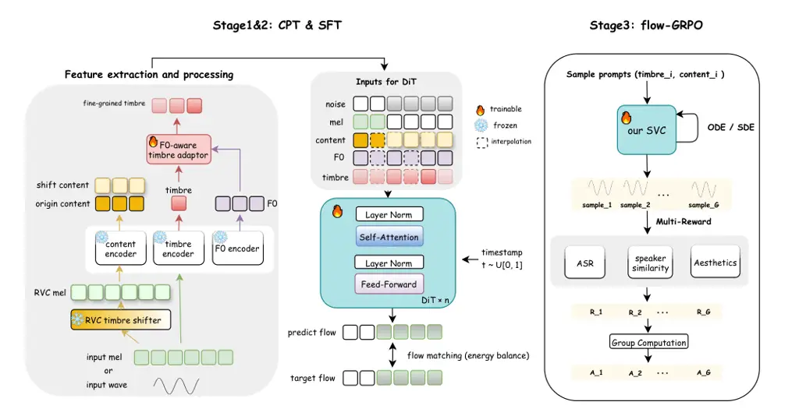
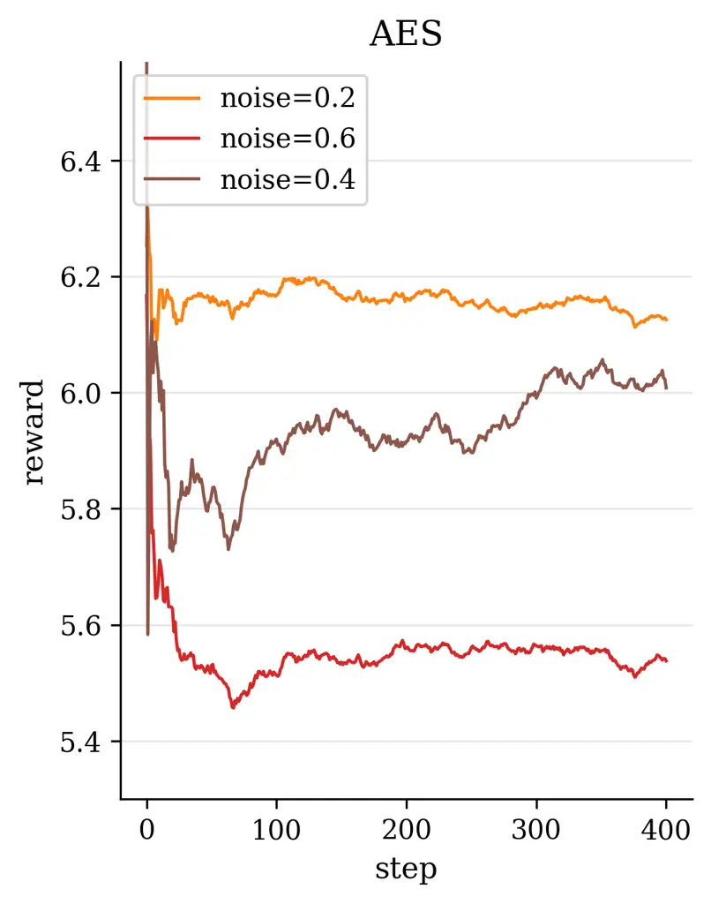
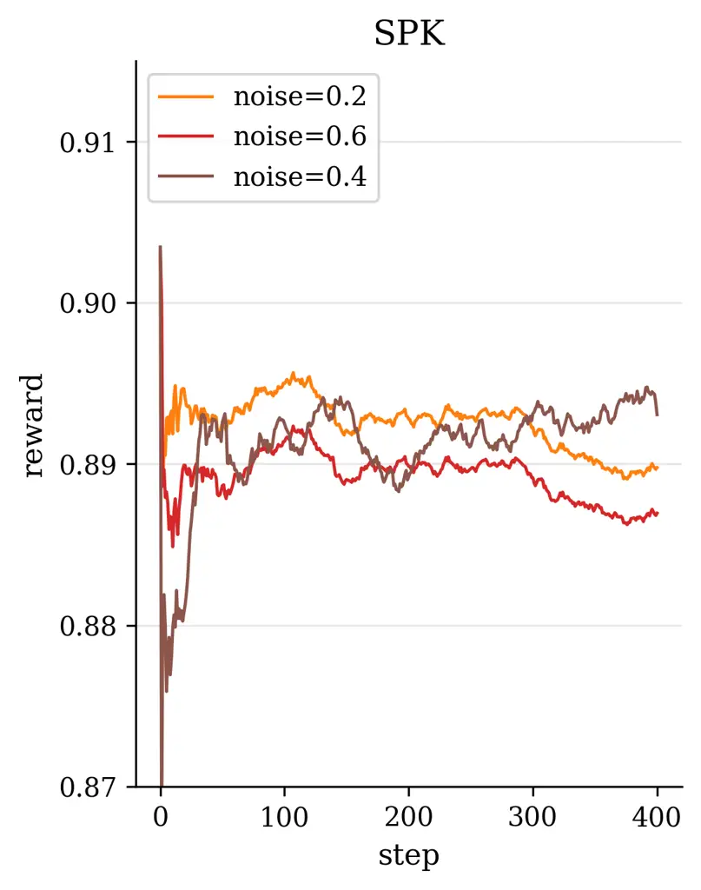
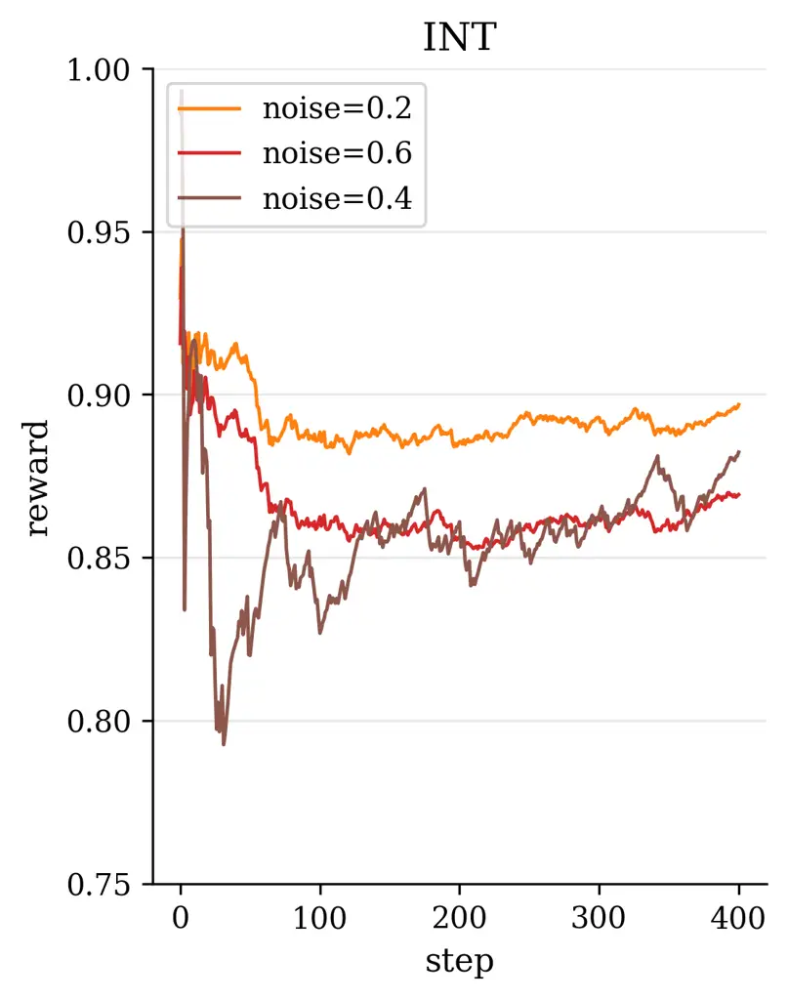
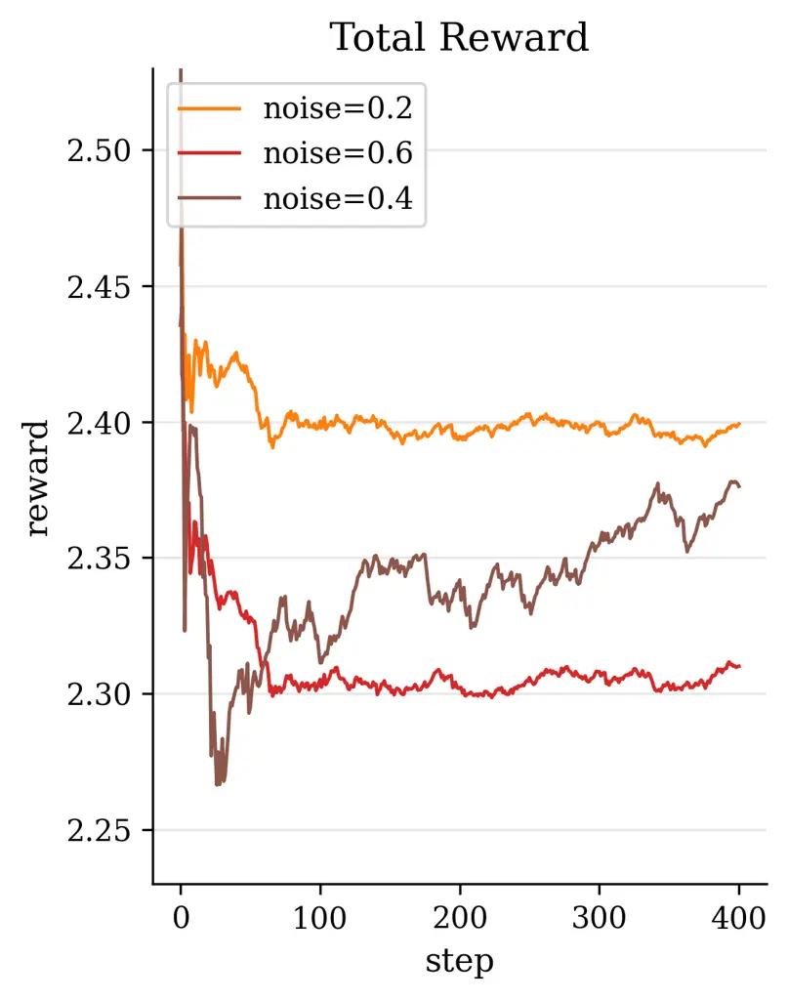
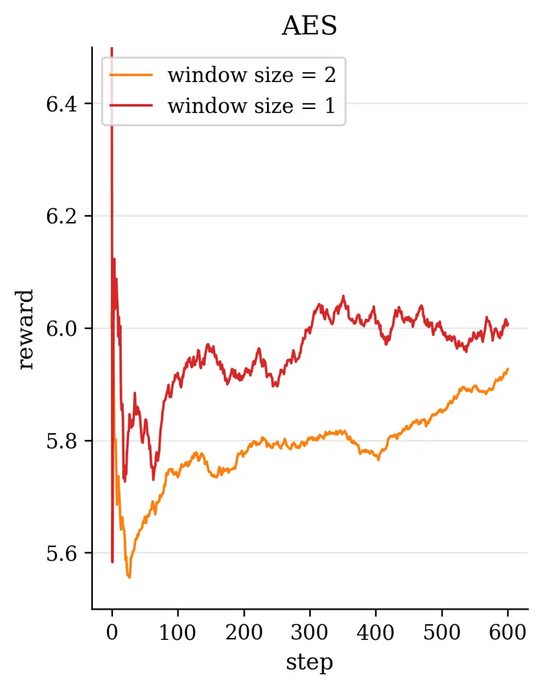
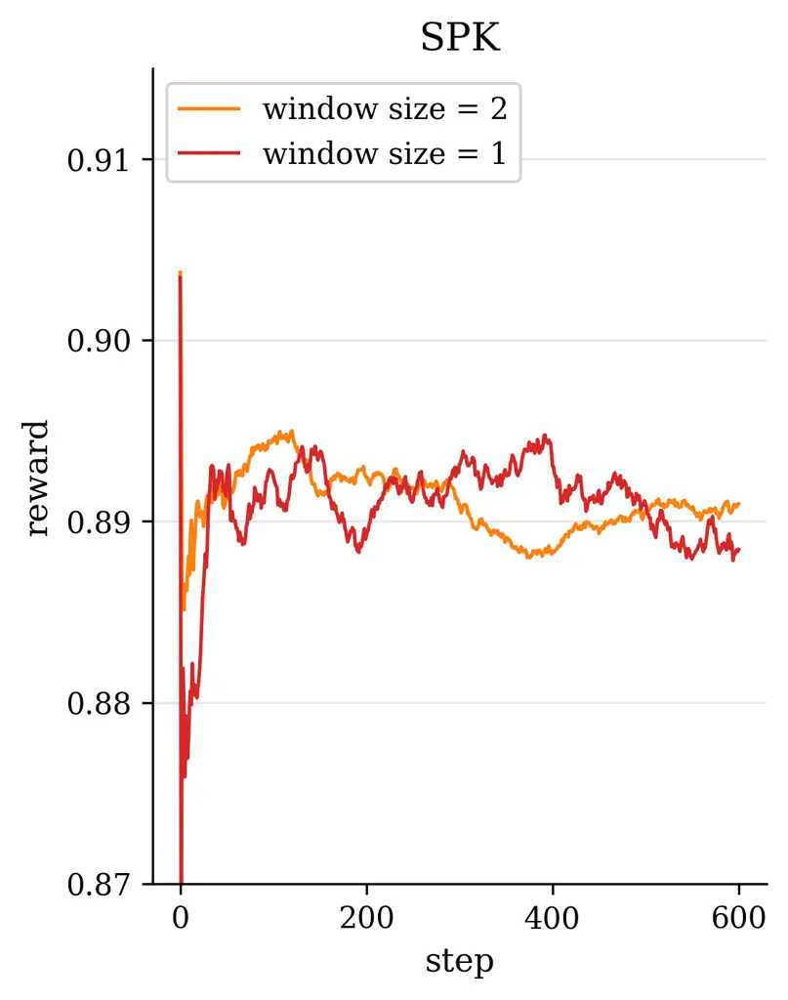
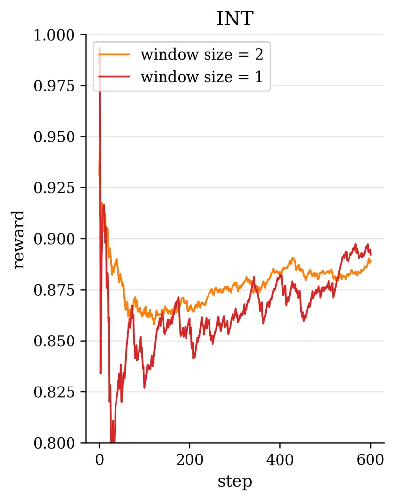
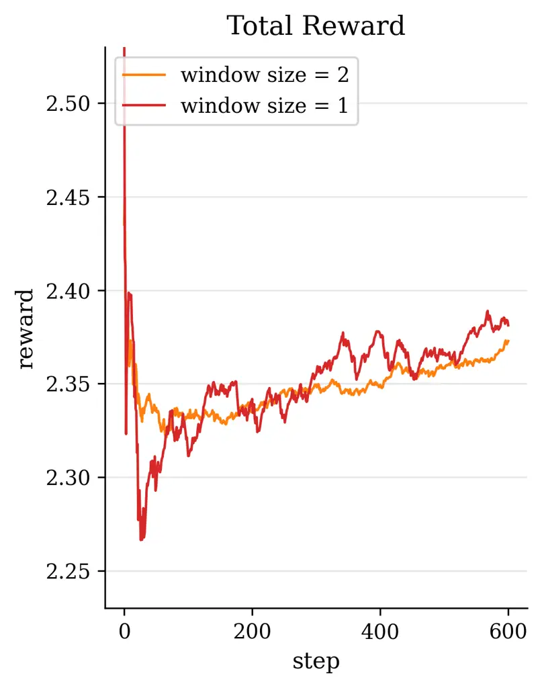

# YingMusic-SVC: Real-World Robust Zero-Shot Singing Voice Conversion with Flow-GRPO and Singing-Specific Inductive Biases

Gongyu Chen ^(†)^(†)thanks: Equal contribution. Affiliation: AI Lab,
GiantNetwork    Xiaoyu Zhang Affiliation: AI Lab, GiantNetwork
Affiliation: University College London (UCL)    Zhenqiang Weng
Affiliation: AI Lab, GiantNetwork Affiliation: East China University of
Science and Technology    Junjie Zheng Affiliation: AI Lab, GiantNetwork
   Da Shen Affiliation: SATLab, Tsinghua University    Chaofan Ding
Affiliation: AI Lab, GiantNetwork    Wei-Qiang Zhang
Affiliation: SATLab, Tsinghua University    Zihao Chen Affiliation: AI
Lab, GiantNetwork

###### Abstract

Singing voice conversion (SVC) aims to render the target singer’s timbre
while preserving melody and lyrics. However, existing zero-shot SVC
systems remain fragile in real songs due to harmony interference, F0
errors, and the lack of inductive biases for singing. We propose
YingMusic-SVC, a robust zero-shot framework that unifies continuous
pre-training, robust supervised fine-tuning, and Flow-GRPO reinforcement
learning. Our model introduces a singing-trained RVC timbre shifter for
timbre–content disentanglement, an F0-aware timbre adaptor for dynamic
vocal expression, and an energy-balanced rectified flow matching loss to
enhance high-frequency fidelity. Experiments on a graded multi-track
benchmark show that YingMusic-SVC achieves consistent improvements over
strong open-source baselines in timbre similarity, intelligibility, and
perceptual naturalness—especially under accompanied and
harmony-contaminated conditions—demonstrating its effectiveness for
real-world SVC deployment. Our code and models are available
at: [https://github.com/GiantAILab/YingMusic-SVC](https://github.com/GiantAILab/YingMusic-SVC)

Figure 1: From professionally produced songs to zero-shot SVC: baseline
limitations and our improved pipeline with singing-oriented designs.

## 1 Introduction

Singing voice conversion (SVC) (Bai et al., 2024; Zhou et al., 2025;
Chen et al., 2019; Mohammadi and Kain, 2017; Engel et al., 2019) aims to
transform the vocal timbre of a source singer into that of a target
singer while preserving the original musical content. This technique has
promising applications in creative music production, virtual singers,
and social media content creation. Recently, any-to-many SVC works such
as So-VITS-SVC (Team, 2023b) and RVC (Team, 2023a) have been able to
achieve realistic conversion effects, but they lack robustness and
require fine-tuning using target speaker data; The zero-shot SVC
model (Liu, 2024) has achieved good conversion results on the pure vocal
test set under laboratory conditions. However, there remains a
substantial gap between current research prototypes and the requirements
of real-world industrial applications. On one hand, most SVC systems are
evaluated on ideal clean vocals and struggle when faced with full songs
that include background accompaniment. In practical pipelines, due to
the scarcity of available a cappella vocal tracks, a music source
separation module is typically applied upfront to isolate vocals from
the mixed audio (Chen et al., 2024b; Chen et al., 2025). This two-stage
approach introduces new challenges: contemporary music productions often
add backing vocals or harmony layers to the lead vocal (Hennequin et
al., 2020), which means the separated “vocals” track may still contain
residual artifacts. Converting such imperfect vocals can lead to audible
artifacts in the output; furthermore, any inaccuracies in fundamental
frequency (F0) extraction (Kim et al., 2018; Wei et al., 2023) under
noisy conditions can result in off-key or distorted converted singing.
On the other hand, most zero-shot voice conversion approaches simply
incorporate an F0 conditioning on top of a speech VC architecture,
without imparting inductive biases tailored for singing. These generic
designs fail to account for key characteristics of singing voices – for
example, singing vocals exhibit much larger dynamics and timbral
variability, and their spectral content contains richer high-frequency
harmonic components than normal speech (Sundberg, 1987; Lundy et al.,
2000; Blaauw and Bonada, 2017; Gupta et al., 2022). Consequently,
vanilla zero-shot VC models often underperform on singing data, as they
do not sufficiently emphasize the high-frequency details and other
singing-specific attributes. As illustrated in Figure YingMusic-SVC:
Real-World Robust Zero-Shot Singing Voice Conversion with Flow-GRPO and
Singing-Specific Inductive Biases, these limitations frequently manifest
as harmony leakage, F0 instability, and spectral artifacts when current
zero-shot SVC models are applied to professionally produced songs.

To bridge these gaps, we propose a comprehensive set of improvements for
robust zero-shot SVC in industrial scenarios. First, regarding pipeline
robustness, we enhance the vocal separation front-end using internal
multi-track data, yielding cleaner vocal stems free of harmony bleed. In
parallel, we devise a robust fine-tuning (SFT) training strategy for the
SVC model: by augmenting training with lightly distorted and
harmony-contaminated vocals, we improve the model’s resilience to
real-world noisy inputs, thereby mitigating artifacts like voice
cracking and residual harmony in the conversions. Second, in terms of
model design, we introduce novel modules and loss functions tailored to
singing audio. We incorporate an F0-aware fine-grained timbre adaptation
module that allows the model to dynamically adjust timbre features
conditioned on pitch, enhancing the expressive dynamics of the converted
singing. Furthermore, in order to neither lose high-frequency
information nor leak timbre features during content feature extraction,
we adopted the RVC model trained with singing data as the timbre
shifter. We also design an energy-balanced flow matching loss (Lipman et
al., 2022) that rebalances the training objective to give more emphasis
to high-frequency, low-energy regions of the spectrum, encouraging the
model to pay extra attention to fine high-frequency details of the
singing voice. Finally, we explore a reinforcement learning (RL) (Sutton
et al., 1998) based post-training paradigm for SVC by applying a
Flow-GRPO algorithm (Liu et al., 2025a) to refine the model. We
formulate a multi-objective reward that combines speech quality metrics
with aesthetic style measures, thereby simultaneously improving the
converted singing’s technical quality and artistic expressiveness.

Our main contributions are summarized as follows:

- •
  An end-to-end robust SVC pipeline for industrial use. We develop an
  improved accompaniment separation model and a robustness-enhanced SVC
  training process, which together significantly improve conversion
  quality on songs with accompaniment, reducing artifacts from residual
  harmonies and F0 extraction errors. A benchmark and difficulty
  classification test set for real scenarios was also designed and a
  comprehensive assessment was conducted.
- •
  Singing-specific modeling enhancements. We introduce an F0-aware
  fine-grained timbre adaptation module, a song-trained RVC timbre
  shifter and an energy-balanced flow matching loss, which substantially
  improve the model’s ability to capture the dynamic timbre range and
  high-frequency details of singing voices, leading to more natural and
  faithful conversions.
- •
  RL fine-tuning and open-source implementation for SVC. We present the
  first application of reinforcement learning in the Diffusion
  Transformer (DiT) (Peebles and Xie, 2023) based SVC, designing a
  multi-reward function that jointly optimizes vocal quality and
  aesthetic expression in the converted singing. We also open-source a
  full industry-grade SVC pipeline implementation, to spur further
  research and application.

The experimental results show that this method is comprehensively
superior to the baseline on our graded real-world singing test set. Our
system produces significantly higher-quality and more natural and robust
converted singing, especially in the presence of background music,
confirming the effectiveness of the introduced techniques.

## 2 Related Work

### 2.1 Singing Voice Conversion (SVC)

Open-source SVC frameworks such as So-VITS-SVC and RVC have become
strong community baselines. So-VITS-SVC combines a HuBERT-based content
encoder (Hsu et al., 2021) with a VITS-style generative model (Kim et
al., 2021) to separate linguistic and speaker information for
high-fidelity conversion. RVC extends this pipeline with a feature
retrieval module that injects nearest-neighbor embeddings from a
training set to better preserve target timbre. These systems are widely
used in practice and form the foundation for many one-shot and
any-to-many SVC applications.

Recent work has advanced zero-shot SVC, enabling conversion to unseen
singers. LDM-SVC (Chen et al., 2024a) uses a latent diffusion model and
classifier-free guidance to suppress source leakage and improve
conversion quality, though at high computational cost. SaMoye (Wang et
al., 2024b) disentangles content, pitch, and timbre features, and
strengthens speaker modeling using augmented embeddings from similar
singers, achieving robust performance even in cross-domain tasks.
R2-SVC (Zheng et al., 2025) improves real-world robustness through data
augmentation and singing-informed encoders, effectively handling noisy
and accompanied inputs. HQ-SVC (Bai et al., 2025) adopts a unified codec
and introduces an EVA module for better timbre-pitch alignment, along
with diffusion-based refinement. These models highlight various
strategies—disentanglement, latent modeling, or enhanced supervision—to
improve generalization and quality in zero-shot settings. However, many
existing SVC systems either lack robustness under real-world mixtures
and noisy conditions, or struggle to capture the large dynamic timbre
range and rich high-frequency details of singing voices. These
limitations motivate our work on a more robust, singing-oriented
zero-shot SVC pipeline.

### 2.2 Reinforcement Learning in Speech and Generative Modeling

In speech and audio generation, supervised objectives based on spectral
reconstruction or phoneme accuracy improve intelligibility but fail to
capture perceptual attributes such as naturalness, stability, timbral
consistency, and musicality—key qualities for high-fidelity SVC. Since
these attributes lack reliable labels, supervised training often
diverges from human perception, motivating the adoption of RL to
directly optimize non-differentiable perceptual metrics and align models
with human preferences.

Recent work has begun to introduce reinforcement learning and preference
alignment into speech generation. INTP (Zhang et al., 2025) extends
Direct Preference Optimization (DPO) (Rafailov et al., 2023) to
Text-to-Speech (TTS) with large-scale intelligibility preference data,
while F5R-TTS (Sun et al., 2025) adapts Group Relative Policy
Optimization (GRPO) (Shao et al., 2024) to flow-matching TTS with
rewards on word error rate and speaker similarity, improving zero-shot
voice cloning performance. In broader generative modeling,
Flow-GRPO (Liu et al., 2025a) proposes an online RL framework for
flow-matching text-to-image models via ODE–SDE conversion and
KL-regularized GRPO updates. However, these methods focus on TTS or
image synthesis; to our knowledge, there is still little work applying
online RL to zero-shot SVC, particularly for DiT-based flow-matching
architectures and multi-objective rewards that jointly target
intelligibility, timbre similarity, and musical aesthetics under
real-world singing conditions.

## 3 Approach

### 3.1 Overview

We focus on the singing voice conversion (SVC) task, which involves
transforming an input singing voice into the voice of a target singer
while preserving the musical content (melody and lyrics). Formally,
given an input audio (or its acoustic features) $`x`$ from a source
singer and a target singer identity $`s_{\text{tgt}}`$, the goal is to
generate an output audio $`y`$ that carries the timbre of
$`s_{\text{tgt}}`$ but sings the same content as $`x`$. We adopt a
diffusion-based generative framework built upon the Seed-VC architecture
(a state-of-the-art DiT model for VC). The model operates on
mel-spectrograms and uses a rectified flow matching objective to learn a
continuous velocity field $`v_{\theta}(x(t),t)`$ that drives a
differential generative process. In essence, $`v_{\theta}`$ learns to
transform a noise distribution at $`t=1`$ into the target
mel-spectrogram at $`t=0`$.



Figure 2: Three-Stage Training Framework of the Proposed YingMusic-SVC
Model.

Beginning from a Seed-VC checkpoint, we adopt a three-stage training
regime to obtain a robust zero-shot SVC model: a continuous pre-training
(CPT) stage to adapt and stabilize the newly introduced singing-specific
modules, a supervised fine-tuning (SFT) stage on curated and augmented
singing corpora to enhance robustness, and a RL post-training stage
based on Flow-GRPO with multi-objective rewards that directly optimize
perceptual and aesthetic attributes of the converted singing. As
illustrated in Figure 2, the data flow in the first two stages is
unified. Given an input vocal $`x`$, we first compute its log-mel
spectrogram $`m=\mathcal{M}(x)`$. Three frozen encoders are then applied
to extract different representations from $`m`$:

```math
h_{c}^{\text{orig}}=\mathcal{E}_{c}(m),\quad e_{\tau}=\mathcal{E}_{\tau}(x),\quad h_{f}=\mathcal{E}_{f}(m), \tag{1}
```

where $`\mathcal{E}_{c}`$, $`\mathcal{E}_{\tau}`$, and
$`\mathcal{E}_{f}`$ denote the content, timbre, and F0 encoders,
respectively. To suppress timbre leakage from the source, we employ a
pretrained RVC model $`\mathcal{T}_{\text{RVC}}`$ to perform
random-target SVC on $`x`$, obtaining a shifted version
$`\tilde{x}=\mathcal{T}_{\text{RVC}}(x;s_{\text{rand}})`$. After
shifting the timbre-related information, its mel is re-encoded to
produce a timbre-shifted content feature:

```math
h_{c}^{\text{shift}}=\mathcal{E}_{c}(\mathcal{M}(\tilde{x})). \tag{2}
```

This feature is used as the main content representation for generation,
while $`h_{c}^{\text{orig}}`$ can optionally serve for auxiliary
reconstruction consistency.

The global timbre embedding $`e_{\tau}`$ and pitch-related feature
$`h_{f}`$ are fused through a lightweight F0-aware timbre adaptor
$`\mathcal{A}_{\text{F0}}`$, yielding a fine-grained timbre map aligned
with the local melodic contour:

```math
h_{\tau}=\mathcal{A}_{\text{F0}}(e_{\tau},h_{f}). \tag{3}
```

##### Temporal Assembly for DiT.

Following the simulated-inference strategy in Seed-VC, we construct
time-dependent conditional inputs with a stochastic masking scheme, a
random boundary $`t_{m}\sim\mathcal{U}(0,1)`$ is sampled for each
training iteration. The first $`t_{m}T`$ frames are dominated by timbre
conditioning, while the remaining frames provide content and pitch cues:

```math
m_{\tau}(t)=\mathbbm{1}[t/T<t_{m}],\quad m_{c}(t)=\mathbbm{1}[t/T\geq t_{m}]. \tag{4}
```

All features are temporally aligned to the mel frame length via
nearest-neighbor interpolation:

```math
\widehat{h}_{c}^{x}=\text{NNInterp}(h_{c}^{x},T),\quad\widehat{h}_{f}=\text{NNInterp}(h_{f},T),\quad\widehat{h}_{\tau}=\text{NNInterp}(h_{\tau},T). \tag{5}
```

where $`x\in\{orig,shift\}`$.

During conditional assembly, the content stream is split into two
temporal parts following the randomly sampled mask $`m_{c}(t)`$: the
first segment (observed region) uses the original content
$`\widehat{h}_{c}^{\text{orig}}`$, while the second segment (prediction
region) uses the shifted content $`\widehat{h}_{c}^{\text{shift}}`$ to
suppress source-timbre bias. Formally, the masked content feature is
defined as

```math
\widetilde{h}_{c}(t)=m_{\tau}(t)\,\widehat{h}_{c}^{\text{orig}}(t)+m_{c}(t)\,\widehat{h}_{c}^{\text{shift}}(t). \tag{6}
```

The DiT conditional input at time $`t`$ is then concatenated along the
feature dimension as

```math
z_{\text{cond}}(t)=[\widehat{h}_{\tau}(t),\,\widetilde{h}_{c}(t),\,\widehat{h}_{f}(t)]. \tag{7}
```

For mel modeling, we also apply the same temporal mask to the input mel:

```math
\tilde{m}(t)=(1-m_{c}(t))\,m(t)+m_{c}(t)\,x_{t},\quad x_{t}=(1-t)m+t\varepsilon,\ \varepsilon\sim\mathcal{N}(0,\mathbf{I}), \tag{8}
```

so that the model observes the first segment of ground-truth mel while
predicting the masked future region along the rectified flow path. The
DiT-based rectified flow model $`\mathbf{v}_{\theta}`$ takes
$`(\tilde{m},z_{\text{cond}},t)`$ as input and predicts the velocity
field in mel space for the masked region. During training, the
flow-matching loss is applied to the latter segment of frames
(content-provided region), with energy-balanced weighting to emphasize
low-energy, high-frequency components crucial for singing timbre
reconstruction. This conditioning pathway is shared across CPT, SFT, and
RL, while the optimization objective transitions from pure rectified
flow matching in CPT/SFT to a combination of flow-matching and
RL-derived advantages in the Flow-GRPO stage.

### 3.2 Singing-Specific Modeling Enhancements

In addition to the training strategy, we introduce several model-level
improvements to the Seed-VC backbone to better handle singing voice
characteristics:

##### RVC Timbre Shifter for Content Extraction.

Instead of directly feeding the raw input vocals to the diffusion model,
we incorporate a Retrieval-based Voice Conversion (RVC) module as a
timbre shifter. This module, pre-trained on a diverse set of 120
singers, converts the input singing voice into a random auxiliary timbre
before content encoding. Formally, let $`x`$ be the separated vocal
input and let $`s_{\text{rand}}`$ be a randomly chosen speaker ID from
the RVC’s training set. We generate
$`\tilde{x}=\mathcal{T}_{\text{RVC}}(x;s_{\text{rand}})`$, an audio
where the content (melody and phonetics) of $`x`$ is preserved but the
timbre is shifted to a different singer. This procedure encourages the
downstream content encoder to focus on linguistic and musical content
while discarding the source speaker identity. We then extract content
features $`h_{c}=\mathcal{E}_{c}(m)`$ using a content encoder
$`\mathcal{E}_{c}`$ (e.g., a pre-trained ASR encoder). By disrupting the
original timbre, the content features become more speaker-invariant and
better suited for conversion to the target voice. In practice, replacing
Seed-VC’s original timbre shifter with the RVC-based one led to more
accurate pronunciations and melody retention in the outputs, since the
model receives cleaner content features unaffected by source timbre
idiosyncrasies.

Figure 3: Key components of YingMusic-SVC. (a) F0-aware timbre adaptor
that refines global timbre embeddings into fine-grained, pitch-sensitive
representations. (b) Energy-balance flow matching loss with time- and
frequency-dependent weighting to enhance high-frequency reconstruction
fidelity.

##### F0-Aware Adaptive Speaker Embedding.

Singing voices exhibit strong dynamic timbre variations across pitches
and expressions (e.g., belting in high notes vs. soft low notes). To
model this, we design the speaker conditioning to be time-varying and
fundamental-frequency-aware rather than a static embedding, similar to
recent style adaptor approaches in SVC (Violeta et al., 2025). As shown
in Figure 3(a), We decompose the target singer’s representation into a
static global vector and a time-varying residual that depends on F0. Let
$`{e_{\tau}}^{(global)}\in\mathbb{R}^{d}`$ be the learned global speaker
embedding for the target singer, and $`h_{f}(t)`$ be an embedding of the
input’s F0 at time $`t`$. We feed both into a small network (an MLP) to
predict a timbre shift residual $`\Delta e_{\tau}(t)`$:

```math
\Delta e_{\tau}(t)=\text{MLP}\Big(\big[h_{f}(t);\;e_{\tau}^{(global)}\big]\Big) \tag{9}
```

where $`[u;v]`$ denotes concatenation of vectors $`u`$ and $`v`$. The
final speaker conditioning at time $`t`$ is then
$`h_{\tau}(t)=e_{\tau}^{(global)}+\alpha_{\tau}\cdot\Delta e_{\tau}(t)`$,
where $`\alpha_{\tau}`$ is the hyperparameter used to adjust the
strength of the residual. This $`h_{\tau}(t)`$ is injected into the
diffusion model in place of the usual static embedding. Intuitively,
$`\Delta e_{\tau}(t)`$ allows the model to modulate the timbral color
depending on the current pitch: for example, adding brightness or head
resonance at higher pitches, or more chest resonance at lower pitches,
emulating how a real singer’s voice quality changes with pitch. By
providing F0 context to the model’s speaker representation, we observed
improvements in capturing expressiveness and avoiding timbre distortions
on extreme notes.

##### Frequency-Aware Energy-Balanced Loss.

We modify the flow matching loss to address the imbalance in energy
across frequency bands in singing audio, inspired by  (Liu et al.,
2025b). High-frequency component often has much lower energy than lower
frequencies on the mel-spectrum, which can lead a plain MSE loss to
under-weight high-frequency reconstruction. To ensure better
high-frequency modeling, we introduce a frequency-dependent weighting
scheme in the loss. Let $`\mathbf{u}(t)\in\mathbb{R}^{C}`$ denote the
ground-truth velocity field at time $`t`$ for each frequency channel
$`c`$ (e.g., each mel frequency bin), and $`\mathbf{v}_{\theta}(t)`$ the
model’s predicted velocity. The original loss is
$`L_{\text{flow}}=\mathbb{E}_{t}\big[|\mathbf{u}(t)-\mathbf{v}_{\theta}(t)|^{2}\big]`$.
We introduce a weight vector $`\mathbf{w}(t)=[w_{1}(t),...,w_{C}(t)]`$
to emphasize certain components:

```math
L_{\text{flow}}^{\text{EB}}=\mathbb{E}_{t}\Big[\sum_{c=1}^{C}w_{c}(t)\,\big(u_{c}(t)-v_{\theta,c}(t)\big)^{2}\Big] \tag{10}
```

where $`w_{c}(t)`$ is defined to allocate higher importance to
low-energy (especially high-frequency) channels and at later diffusion
steps. As shown in figure 3(b), we construct $`w_{c}(t)`$ as follows.
First, we estimate the inverse amplitude of each channel:
$`w_{c}^{(0)}=1/\sigma_{c}`$, where $`\sigma_{c}`$ is the variance of
$`u_{c}(t)`$ over time and samples on the training data. This
$`w_{c}^{(0)}`$ acts as a energy-inverse weight, making channels with
weaker energy (smaller $`\sigma_{c}`$) receive larger weight. Next, we
define a monotonically increasing function $`g(c)`$ that boosts higher
frequency indices (for instance, $`g(c)`$ linearly increases from $`0`$
for low $`c`$ to $`1`$ for the highest $`30\%`$ of frequencies). We also
define a time-dependent factor $`s(t)`$ that increases as $`t`$
approaches 0 (end of the diffusion) to emphasize detail in later
denoising stages; specifically $`s(t)=(1-t)^{2}/\mathbb{E}[(1-t)^{2}]`$
so that $`\mathbb{E}[s(t)]=1`$ (here $`t\sim U[0,1]`$). Finally, we
combine these to obtain:
$`w_{c}(t)=w_{c}^{(0)}\Big(1+\lambda\,s(t)\,g(c)\Big),`$ where
$`\lambda`$ is a hyperparameter controlling the strength of the
frequency-time emphasis. In practice, we also normalize
$`\mathbf{w}(t)`$ for each sample to have mean 1 (so the overall scale
of the loss remains similar). This energy-balanced loss gives more
weight to the higher frequencies especially towards the end of diffusion
(when fine details are generated), while not overly penalizing early
stages or low frequencies. By using this scheme, the model learns to
generate crisp high-frequency details without sacrificing stability.

### 3.3 Robust SFT for Real-World Singing

The supervised fine-tuning (SFT) stage preserves the overall data flow
and conditioning structure established during CPT, but introduces
additional robustness-oriented augmentations to address artifacts
frequently encountered in real-world singing. In practical SVC
pipelines, vocals obtained from accompaniment separation often contain
residual harmony or backing layers, and pitch estimation may
accidentally lock onto harmonic components rather than the true
fundamental. These issues can lead to unstable timbre, octave errors,
and audible pitch breaks. To mitigate such effects, we incorporate two
complementary strategies: stochastic perturbation of F0 features
inspired by R2-SVC (Zheng et al., 2025) and harmony-contaminated
multi-track augmentation.

##### F0 perturbation.

Let $`h_{f}`$ denote the pitch embedding extracted from the frozen F0
encoder. During SFT, we apply random perturbations that simulate
realistic F0 noise:

```math
h_{f}^{\text{aug}}=h_{f}+\Delta_{f}, \tag{11}
```

where $`\Delta_{f}`$ is sampled from a mixture of perturbation kernels
that emulate jitter, sliding, and abrupt jumps:

```math
\Delta_{f}\sim\begin{cases}\text{Jitter}(\sigma_{j}),&p=p_{j},\\
\text{Glide}(\ell_{g}),&p=p_{g},\\
\text{Jump}(\delta_{k}),&p=p_{k}.\end{cases} \tag{12}
```

This forces the model to remain stable under noisy pitch trajectories
and prevents over-reliance on exact F0 estimates.

##### Multi-track harmony augmentation.

For content- and mel-based branches, we simulate imperfect separation by
mixing backing tracks into the lead vocal. Let $`x_{\text{lead}}`$ and
$`x_{\text{harm}}`$ denote the lead and harmony tracks. The augmented
input becomes

```math
x_{\text{mix}}=x_{\text{lead}}+\alpha\,x_{\text{harm}}, \tag{13}
```

where $`\alpha`$ controls the contamination strength. The model is still
supervised against the clean ground-truth mel $`m_{\text{lead}}`$, using
the mixed input only for robustness-oriented conditioning. We construct
the conditional representation as:

```math
z_{\text{cond}}^{\text{mix}}(t)=\big[\widehat{h}_{\tau}^{\text{mix}}(t),\;\widetilde{h}_{c}^{\text{mix}}(t),\;\widehat{h}_{f}^{\text{aug}}(t)\big], \tag{14}
```

where $`\widehat{h}_{\tau}^{\text{mix}}(t)`$ and
$`\widetilde{h}_{c}^{\text{mix}}(t)`$ are timbre/content representations
extracted from $`m_{\text{mix}}`$, and
$`\widehat{h}_{f}^{\text{aug}}(t)`$ is the interpolated (time-aligned)
form of the perturbed F0 embedding $`h_{f}^{\text{aug}}`$.

During SFT, the DiT-based flow matching model is trained to map
corrupted inputs toward the clean vocal trajectory, forcing the model to
suppress harmony leakage and remain stable under pitch jitter.

Combined, the final augmented conditioning pipeline is summarized as:

```math
\mathbf{v}_{\theta}\big(\tilde{m}_{\text{mix}},z_{\text{cond}}^{\text{mix}}(t),t\big)\;\longrightarrow\;\text{flow}(m_{\text{lead}}), \tag{15}
```

which highlights that robustness is jointly achieved via _F0
perturbation_ and _multi-track harmony augmentation_, enabling the model
to handle residual backing vocals and unstable pitch estimates in
real-world SVC scenarios.

### 3.4 Reinforcement Learning with Flow-GRPO

In the final stage, we refine the model through online reinforcement
learning to directly optimize non-differentiable perceptual objectives.
Following Flow-GRPO (Liu et al., 2025a), we reinterpret the rectified
flow model (Liu et al., 2022c) as a stochastic policy by converting the
deterministic ODE trajectory into an SDE formulation:

```math
dx_{t}=\left(v_{\theta}(x_{t},t)-\frac{\sigma_{t}^{2}}{2}\,\nabla\log p_{t}(x_{t})\right)dt+\sigma_{t}\,dw_{t}, \tag{16}
```

which admits an Euler–Maruyama discretization (Kloeden and Pearson, 1977) that yields an explicit Markovian transition
$`\pi_{\theta}(x_{t-1}\mid x_{t})`$ suitable for KL-regularized
policy-gradient optimization. Here, $`dw_{t}`$ denotes increments of a
standard Wiener process, and $`\sigma_{t}`$ is a time-dependent
diffusion coefficient controlling the level of stochasticity injected at
time $`t`$. We parameterize the noise schedule as

```math
\sigma_{t}=a\sqrt{\frac{t}{1-t}}, \tag{17}
```

where $`a`$ acts as a scalar coefficient that determines the overall
intensity of the injected noise.

Under this formulation, the policy update maximizes:

```math
J(\theta)=\mathbb{E}_{\pi_{\theta}}\!\left[R(x_{0},c)-\beta\,D_{\mathrm{KL}}(\pi_{\theta}\,\|\,\pi_{\mathrm{ref}})\right], \tag{18}
```

where $`R`$ is a perceptual reward and $`\pi_{\mathrm{ref}}`$ is a
frozen reference policy.

Stochastic Timestep Selection for SDE. Direct SDE sampling introduces
credit-assignment ambiguity across the full trajectory (Team et al.,
2025). To mitigate the temporal credit-assignment ambiguity introduced
by full-trajectory SDE sampling, we adopt a selective-noise strategy
that injects randomness at a single timestep, which has become a common
design choice in recent flow-based RL work (Team et al., 2025). For each
conditioning prompt $`c`$, all samples in a group share the same initial
noise, and stochasticity is introduced only at one uniformly sampled
timestep $`t^{\prime}\sim\mathcal{U}(0,T^{\prime}-1)`$; all other steps
follow deterministic ODE updates. This design isolates reward
differences to a single transition, enabling more interpretable and
stable gradients. The resulting training objective becomes:

```math
\begin{aligned} J_{\text{GRPO-Selective}}(\theta)&=\mathbb{E}_{c,\;t^{\prime},\;\{x^{i}\}_{i=1}^{G}\sim\pi_{\mathrm{old}}}\!\left[\frac{1}{G}\sum_{i=1}^{G}\Big(r_{t^{\prime}}^{i}(\theta)\,\hat{A}^{i}-\beta\,D_{\mathrm{KL}}\!\left(\pi_{\theta}\,\|\,\pi_{\mathrm{ref}}\right)_{t^{\prime}}\Big)\right],\end{aligned} \tag{19}
```

where $`r_{t^{\prime}}^{i}`$ is the policy ratio correcting for
off-policy sampling, and $`\hat{A}^{i}`$ denotes the group-relative
advantage. This selective-noise scheme preserves exploration while
substantially improving optimization stability.

Reward models. To align the model with perceptual and musical goals
specific to SVC, we employ three reward families:

- •
  Aesthetic quality. We use Meta’s Audiobox Aesthetics model¹¹ 1
  https://github.com/facebookresearch/audiobox-aesthetics  (Tjandra et
  al., 2025)and select the perceptual dimensions _Content Enjoyment
  (CE)_ and _Content Usefulness (CU)_, defining:

  ```math
  R_{\mathrm{aes}}=\frac{R_{\mathrm{CE}}+R_{\mathrm{CU}}}{2}. \tag{20}
  ```

- •
  Lyrics intelligibility. To evaluate whether the converted singing
  preserves clear articulation and linguistic content, we employ an
  ASR-based metric (Xu et al., 2025) and compute:

  ```math
  R_{\mathrm{int}}=1-\mathrm{WER}. \tag{21}
  ```

- •
  Timbre similarity. Speaker-level consistency is measured via a
  pretrained embedding model, using cosine similarity between the
  generated and reference timbre embeddings (Clemens, 2019):

  ```math
  R_{\mathrm{spk}}=\cos(e_{\mathrm{gen}},e_{\mathrm{ref}}). \tag{22}
  ```

Before integration, all reward values are normalized to $`[0,1]`$. The
final multi-objective reward for sample $`i`$ is:

```math
R^{i}=\sum_{k}w_{k}R_{k}^{i},\quad w_{k}=1, \tag{23}
```

and the group-relative advantage is:

```math
\hat{A}^{i}=\frac{R^{i}-\mu}{\sigma}, \tag{24}
```

where $`\mu`$ and $`\sigma`$ denote the mean and standard deviation over
the group for the same conditioning prompt. This multi-objective RL
framework enables direct optimization of perceptual quality,
intelligibility, and timbral fidelity, complementing the supervised
objectives in preceding stages.

### 3.5 Inference Procedure

In practical industrial SVC pipelines, the input audio is typically a
full song containing both vocals and accompaniment. To provide the SVC
model with a clean vocal signal and avoid artifacts caused by residual
background components, we employ a dedicated music source separation
front-end. Specifically, we use a customized Band RoFormer
separator (Wang et al., 2024a) trained in-house on approximately 3600
multi-track songs (about 250 hours), optimized to decompose complex
musical mixtures into disentangled components.

Formally, given a mixture waveform $`x_{\mathrm{mix}}`$, the separator
$`\mathcal{D}_{\mathrm{BR}}`$ produces:

```math
(\,x_{\mathrm{lead}},\;x_{\mathrm{back}},\;x_{\mathrm{inst}}\,)=\mathcal{D}_{\mathrm{BR}}(x_{\mathrm{mix}}), \tag{25}
```

where $`x_{\mathrm{lead}}`$ denotes the lead vocal,
$`x_{\mathrm{back}}`$ the backing/harmony vocals, and
$`x_{\mathrm{inst}}`$ the instrumental accompaniment. Our optimized Band
RoFormer design follows a band-split Transformer architecture operating
on multi-band spectrogram partitions, and is trained with adversarial
objectives using both Multi-Scale and Multi-Period discriminators. This
setup enhances the perceptual realism and reduces leakage between
sources.

For SVC inference, only the separated lead vocal $`x_{\mathrm{lead}}`$
is forwarded through our conversion pipeline. The backing vocal estimate
$`x_{\mathrm{back}}`$ may optionally be retained for downstream mixing
or post-production, depending on the application. After conversion, the
predicted target-singer mel-spectrogram is converted back to waveform
via the vocoder, and can be recombined with $`x_{\mathrm{inst}}`$ to
reconstruct a complete song. Thus, the full inference chain can be
summarized as:

```math
x_{\mathrm{tgt}}=\mathrm{Vocoder}\!\left(\mathrm{SVC}(x_{\mathrm{lead}},s_{\mathrm{tgt}})\right),\qquad x_{\mathrm{final}}=x_{\mathrm{tgt}}+\gamma_{\mathrm{inst}}x_{\mathrm{inst}}. \tag{26}
```

where $`\gamma_{\mathrm{inst}}`$ is a hyperparameter used to control the
relative loudness of the accompaniment, which defaults to 1.

This separation–conversion–recomposition workflow ensures that inference
remains robust under real-world recording and mixing conditions, and
provides an end-to-end pipeline suitable for industrial SVC deployment.
For cross-gender conversion scenarios, we apply a pitch transposition of
$`\pm 12`$ semitones after F0 feature extraction. This normalization
step is widely adopted in SVC systems, and prevents octave errors or
instability when the source and target singers exhibit large differences
in vocal range.

## 4 Experiments

### 4.1 Dataset

Our training data comprise three complementary sources. (1) Speech
corpus: we sample 1,000 hours of English and 1,000 hours of Chinese
speech from the Emilia dataset (He et al., 2024) to provide rich
linguistic coverage. (2) Open singing datasets: six public singing
corpora—GTSinger (Zhang et al., 2024), M4Singer (Zhang et al., 2022),
OpenCpop (Wang et al., 2022), OpenSinger (Huang et al., 2021), PopBuTFy
(Liu et al., 2022b), and PopCS (Liu et al., 2022a)—are combined,
totaling roughly 230 hours of clean solo vocals. (3) Internal
multi-track dataset: $`500`$ hours of professionally produced recordings
containing aligned lead and backing vocal stems, which provide realistic
mixtures and timbre diversity.

We use different subsets across training stages: CPT utilizes the main
(lead) tracks from all three sources (1 + 2 + 3), SFT is performed on
the clean and multi-track singing data (2 + 3), and RL fine-tuning is
conducted on the open clean singing data (2) to ensure generalization.
To ensure compatibility with reward computation, we additionally filter
out samples that are not in Chinese or English, remove pure-speech
recordings unrelated to singing, and discard clips shorter than $`5`$
seconds that tend to produce unstable or degenerate intelligibility
rewards.

For evaluation, we construct a difficulty-graded test suite to emulate
real production conditions. Using the internal multi-track data, we
randomly sample 100 10–20 s segments containing semantically meaningful
singing content. Among them, 20 converted samples are randomly selected
for subjective evaluation, which is conducted by a panel of 10 human
listeners. The simple test set (GT Leading) includes only the lead vocal
track, while the complex test set (Mix Vocal) merges the lead and
backing tracks to simulate vocals obtained from source-separation
front-ends. In addition, we evaluate a third setting (Ours Leading),
where the lead vocals are obtained from our in-house separation model,
allowing us to assess end-to-end robustness within our actual production
pipeline. Five target timbres, covering both genders and multiple age
ranges, are selected for conversion. All evaluation speakers and songs
are unseen during training.

### 4.2 Implementation Details

YingMusic-SVC is built upon an open-source SVC implementation, Seed-VC
(Liu, 2024), which utilizes a DiT-based flow matching architecture. The
model consists of 17 DiT blocks with 12 attention heads, an embedding
dimension of 768, and an FFN dimension of 3072. The audio is processed
at a sampling rate of 44.1 kHz, using a 2048-point FFT window, a hop
size of 512, and 128 mel-frequency bins. Models were trained with an
effective batch size of 80, consisting of 60,000 CPT steps and 15,000
SFT steps before the RL stage. We use the AdamW optimizer with a peak
learning rate of $`1\times 10^{-4}`$, which exponentially decays to a
minimum of $`1\times 10^{-5}`$. During RL post-training, we update the
model using full-parameter optimization. The model is initialized from
the supervised checkpoint prior to RL updates. Table 1 summarizes the
main hyperparameters used in our RL training. Finally, we employ the
pretrained BigVGAN²² 2
https://huggingface.co/nvidia/bigvgan_v2_44khz_128band_512x (Lee et al., 2022) model as the vocoder.

For random $`F_{0}`$ perturbations, we set the probabilities of the
three perturbation types to $`p_{\text{j}}=0.1`$, $`p_{\text{g}}=0.1`$,
and $`p_{\text{k}}=0.3`$. Each audio sample contains between 2 and 4
perturbed $`F_{0}`$ segments. In the F0-aware timbre adaptor, the
interpolation coefficient is fixed to $`\alpha_{\tau}=0.5`$, balancing
global timbre embedding and local pitch-dependent modulation. For the
energy-balanced loss, we set the frequency-time emphasis strength to
$`\lambda=0.4`$, which provides sufficient weighting of high-frequency,
low-energy components without destabilizing early-stage flow updates.

| Parameter         | Value               | Parameter        | Value    |
| ----------------- | ------------------- | ---------------- | -------- |
| Group size        | 8                   | Prompts per step | 8        |
| Noise level $`a`$ | 0.4                 | SDE steps range  | \[0, 6\] |
| Learning rate     | $`1\times 10^{-5}`$ | Iterations       | 0.8k     |
| \# Sampling steps | 10                  |                  |          |

Table 1: Main hyperparameter settings for RL training.

### 4.3 Baselines

We compare YingMusic-SVC with two other systems: Seed-VC³³ 3
https://github.com/Plachtaa/seed-vc  (Liu, 2024)and FreeSVC⁴⁴ 4
https://github.com/freds0/free-svc (Ferreira et al., 2025). As one of
the state-of-the-art open-source voice conversion systems, we use the
official 200M-parameter Seed-VC checkpoint⁵⁵ 5
https://huggingface.co/Plachta/Seed-VC/tree/main, which has been
specifically trained for singing voice conversion.

### 4.4 Evaluation Metrics

For objective evaluation, we examine four dimensions: speaker
similarity, intelligibility, pitch consistency, and aesthetic quality.
Speaker similarity is measured using cosine similarity between speaker
embeddings (SPK-SIM), computed with Resemblyzer⁶⁶ 6
https://github.com/resemble-ai/Resemblyzer . Intelligibility is
evaluated using character error rate (CER) obtained from FireRedASR⁷⁷ 7
https://github.com/FireRedTeam/FireRedASR , an ASR model trained on data
containing both speech and singing. To assess pitch accuracy and
stability, we report the log-F0 Pearson correlation coefficient
(LogF0PCC) between the converted and reference F0 contours. Aesthetic
quality is quantified using the Unified Automatic Quality Assessment
model from Meta’s Audiobox Aesthetics⁸⁸ 8
https://github.com/facebookresearch/audiobox-aesthetics. For subjective
evaluation, we conduct Mean Opinion Score (MOS) listening tests,
measuring perceptual naturalness (NMOS) and speaker similarity (SMOS)
based on human listener ratings.

## 5 Results

### 5.1 Overall Performance Across Difficulty-Graded Test Sets

Table 2 summarizes the objective and subjective results across three
evaluation settings designed to reflect increasing levels of real-world
degradation. On the GT Leading set, where clean vocal tracks are used,
our models consistently outperform FreeSVC and Seed-VC across all
metrics. In particular, Ours-SFT achieves the highest CMOS (4.37) and
SMOS (3.15), indicating substantial perceptual gains over Seed-VC
(3.98/3.09), while maintaining comparable pitch consistency (98.08% vs.
98.29%). The Ours-Full model further improves aesthetic quality,
attaining the best CE/CU scores (5.86/6.56).

Under the more challenging Mix Vocal condition—where lead and backing
vocals are mixed to emulate source-separation artifacts—the performance
gap becomes more pronounced. Seed-VC suffers significant degradation in
intelligibility (CER increases from 10.89% to 17.30%) and pitch
stability (LogF0PCC drops from 98.29% to 84.02%). In contrast, our
robustness-enhanced models maintain strong performance: Ours-Full
achieves the best aesthetic scores (5.75/6.40), the highest CMOS (3.31),
and the highest pitch consistency (86.47%), outperforming Seed-VC by a
large margin across all metrics.

Finally, the Ours Leading set evaluates the full industrial pipeline
using vocals separated by our in-house Band-Roformer front-end. Despite
the additional real-world noise factors, our models continue to
outperform both baselines. Ours-Full delivers the best CE/CU
(5.73/6.39), the highest CMOS (3.91), and the strongest timbre
similarity (0.801), demonstrating that the proposed system maintains
robustness even when evaluated end-to-end under production conditions.

Overall, these results show that our method consistently improves timbre
similarity, intelligibility, pitch accuracy, and perceptual quality
across all difficulty levels, with the largest gains observed in the
most challenging real-world scenarios.

|                                 |                     |                      |                |                |                         |                  |                  |
| ------------------------------- | ------------------- | -------------------- | -------------- | -------------- | ----------------------- | ---------------- | ---------------- |
|                                 | Obj. Metrics        |                      |                |                |                         | Sub. Metrics     |                  |
|                                 | SPK-SIM$`\uparrow`$ | CER(%)$`\downarrow`$ | Aesthetics     |                | LogF0PCC(%)$`\uparrow`$ | CMOS$`\uparrow`$ | SMOS$`\uparrow`$ |
| Model                           |                     |                      | CE$`\uparrow`$ | CU$`\uparrow`$ |                         |                  |                  |
| Setting 1: GT Leading           |                     |                      |                |                |                         |                  |                  |
| FreeSVC (Ferreira et al., 2025) | 0.648               | 20.70                | 4.72           | 5.55           | 86.56                   | 2.47             | 1.83             |
| Seed-VC (Liu, 2024)             | 0.801               | 10.89                | 5.69           | 6.39           | 98.29                   | 3.98             | 3.09             |
| Ours-CPT                        | 0.802               | 9.20                 | 5.79           | 6.50           | 98.27                   | 4.15             | 3.02             |
| Ours-SFT                        | 0.804               | 9.66                 | 5.84           | 6.52           | 98.08                   | 4.37             | 3.15             |
| Ours-Full                       | 0.800               | 9.26                 | 5.86           | 6.56           | 98.12                   | 4.26             | 3.08             |
| Setting 2: Mix Vocal            |                     |                      |                |                |                         |                  |                  |
| FreeSVC (Ferreira et al., 2025) | 0.657               | 33.26                | 4.07           | 5.13           | 60.18                   | 2.02             | 1.91             |
| Seed-VC (Liu, 2024)             | 0.808               | 17.30                | 5.51           | 6.17           | 84.02                   | 2.93             | 2.78             |
| Ours-CPT                        | 0.810               | 15.70                | 5.65           | 6.32           | 84.29                   | 2.85             | 2.92             |
| Ours-SFT                        | 0.809               | 15.40                | 5.73           | 6.35           | 86.12                   | 3.23             | 2.95             |
| Ours-Full                       | 0.805               | 15.90                | 5.75           | 6.40           | 86.47                   | 3.31             | 3.12             |
| Setting 3: Ours Leading         |                     |                      |                |                |                         |                  |                  |
| FreeSVC (Ferreira et al., 2025) | 0.650               | 33.94                | 4.36           | 5.32           | 75.64                   | 2.31             | 1.90             |
| Seed-VC (Liu, 2024)             | 0.800               | 18.64                | 5.53           | 6.21           | 89.18                   | 3.46             | 3.00             |
| Ours-CPT                        | 0.801               | 18.65                | 5.66           | 6.30           | 89.27                   | 3.51             | 3.02             |
| Ours-SFT                        | 0.803               | 18.93                | 5.72           | 6.34           | 89.65                   | 3.86             | 3.11             |
| Ours-Full                       | 0.801               | 18.89                | 5.73           | 6.39           | 89.78                   | 3.91             | 3.06             |

Table 2: Objective and subjective results on three SVC test settings (GT
Leading, Mix Vocal, Ours Leading). Best in bold;
$`\uparrow`$/$`\downarrow`$ denote higher/lower is better.

|                         |                     |                      |                |                |                         |
| ----------------------- | ------------------- | -------------------- | -------------- | -------------- | ----------------------- |
|                         | SPK-SIM$`\uparrow`$ | CER(%)$`\downarrow`$ | Aesthetics     |                | LogF0PCC(%)$`\uparrow`$ |
| Model                   |                     |                      | CE$`\uparrow`$ | CU$`\uparrow`$ |                         |
| Setting 1: GT Leading   |                     |                      |                |                |                         |
| Ours-CPT                | 0.802               | 9.20                 | 5.79           | 6.50           | 98.27                   |
| w/o RVC-ts              | 0.798               | 9.73                 | 5.71           | 6.40           | 98.26                   |
| w/o timbre adaptor      | 0.803               | 9.40                 | 5.75           | 6.46           | 98.17                   |
| w/o EB loss             | 0.804               | 9.40                 | 5.81           | 6.54           | 98.38                   |
| Setting 2: Mix Vocal    |                     |                      |                |                |                         |
| Ours-CPT                | 0.810               | 15.70                | 5.65           | 6.32           | 84.29                   |
| w/o RVC-ts              | 0.804               | 16.30                | 5.54           | 6.18           | 84.41                   |
| w/o timbre adaptor      | 0.806               | 16.10                | 5.61           | 6.27           | 84.55                   |
| w/o EB loss             | 0.808               | 15.80                | 5.65           | 6.33           | 84.36                   |
| Setting 3: Ours Leading |                     |                      |                |                |                         |
| Ours-CPT                | 0.801               | 18.65                | 5.66           | 6.30           | 89.27                   |
| w/o RVC-ts              | 0.798               | 18.85                | 5.53           | 6.19           | 89.18                   |
| w/o timbre adaptor      | 0.801               | 18.10                | 5.60           | 6.25           | 89.01                   |
| w/o EB loss             | 0.803               | 18.95                | 5.67           | 6.36           | 89.42                   |

Table 3: Ablation study of key singing-specific components across three
SVC test settings (GT Leading, Mix Vocal, Ours Leading). Arrows
($`\uparrow`$ / $`\downarrow`$) denote higher / lower is better,
respectively.

### 5.2 Effect of Multi-Stage Training (CPT $`\rightarrow`$ SFT $`\rightarrow`$ RL)

The progressive training pipeline yields clear and complementary
improvements across stages. CPT establishes a solid singing-specific
representation by integrating the RVC timbre shifter, the F0-aware
timbre adaptor, and the energy-balanced loss. This stage already
surpasses Seed-VC in nearly all metrics across all settings. For
example, CPT reduces CER from 10.89% to 9.20% on GT Leading and improves
LogF0PCC from 84.02% to 84.29% under Mix Vocal.

SFT provides noticeable robustness gains by training the model on
augmented inputs containing F0 perturbations and simulated harmony
leakage. This improvement becomes more observable under noisy
conditions. On Mix Vocal, SFT reduces CER from 15.70% to 15.40%, raises
LogF0PCC from 84.29% to 86.12%, and boosts CMOS from 2.85 to 3.23.
Similar gains appear on Ours Leading, where SFT improves both CMOS (3.51
to 3.86) and SMOS (3.02 to 3.11).

Finally, RL post-training refines perceptual quality and timbre fidelity
through multi-objective optimization. On Mix Vocal, RL further improves
all aesthetic dimensions—CE increases from 5.73 to 5.75 and CU from 6.35
to 6.40—and boosts CMOS from 3.23 to 3.31. On Ours Leading, RL yields
the highest CMOS (3.91), demonstrating its effectiveness in enhancing
real-world perceptual attributes that are not fully captured by
supervised training.

Together, these results illustrate that each training stage contributes
distinct benefits: CPT provides singing-aware inductive bias, SFT
delivers robustness under realistic distortions, and RL enhances
higher-level perceptual preferences. The full model integrates these
strengths and consistently achieves the best overall performance across
evaluation settings.

### 5.3 Ablation Study

#### 5.3.1 Ablation of Singing-Specific Modules

We first analyze the contribution of the three singing-specific
components introduced in the CPT stage: the RVC-based timbre shifter,
the F0-aware timbre adaptor, and the energy-balanced (EB) flow-matching
loss. Table 3 reports ablation results across the GT Leading, Mix Vocal,
and Ours Leading settings.

On the GT Leading set, removing the RVC timbre shifter (w/o RVC-ts)
leads to a consistent decrease in performance relative to the CPT
baseline, with lower SPK-SIM (0.798 vs. 0.802), higher CER (9.73% vs.
9.20%), and reduced aesthetic scores (CE 5.71 vs. 5.79; CU 6.40 vs.
6.50). Removing the timbre adaptor also results in mild degradation in
aesthetic metrics (5.75/6.46 vs. 5.79/6.50). The EB loss shows a
different pattern: while CE/CU slightly increase (5.81/6.54), CER rises
from 9.20% to 9.40%, indicating a trade-off between spectral detail and
intelligibility under clean conditions.

In the more challenging Mix Vocal setting, the effects of each component
become more pronounced. Removing the RVC timbre shifter produces the
largest degradation among the three ablations, with SPK-SIM decreasing
from 0.810 to 0.804, CER increasing from 15.70% to 16.30%, and aesthetic
scores dropping to 5.54/6.18. Eliminating the timbre adaptor also lowers
CE/CU (5.61/6.27) and slightly increases CER (16.10%). The EB loss again
shows a mixed effect: CE/CU remain close to the baseline (5.65/6.33),
while CER slightly increases from 15.70% to 15.80%. Overall, all three
components contribute positively to performance under acoustic
interference, with the RVC-based timbre shifter yielding the largest
improvement.

On the Ours Leading set, which reflects the full production pipeline,
the trends remain consistent. Removing the RVC timbre shifter leads to a
decrease in SPK-SIM (0.798 vs. 0.801) and aesthetic quality (5.53/6.19
vs. 5.66/6.30). Removing the timbre adaptor results in deterioration of
CE/CU (5.60/6.25), while removing the EB loss causes CER to rise from
18.65% to 18.95%. Although the EB loss yields slightly higher CE/CU
(5.67/6.36), its higher CER indicates less stable F0 and content
reconstruction under real-world interference.

Taken together, these results demonstrate that all three modules provide
measurable benefits across evaluation conditions. The RVC-based timbre
shifter contributes most to timbre preservation and intelligibility in
noisy settings, the timbre adaptor improves local timbre–pitch
alignment, and the EB loss enhances high-frequency reconstruction while
requiring balance with intelligibility. Their combined effect yields the
strongest overall performance in the CPT configuration.









Figure 4: RL ablation experiments on noise level $`a`$.









Figure 5: RL ablation experiments on window size.

#### 5.3.2 Ablation of the RL Setting

Ablation on Noise Level $`a`$ in GRPO Training. In our GRPO-based
reinforcement learning stage, the noise level $`a`$ determines the
magnitude of stochastic perturbation injected into the latent trajectory
at the selected timestep. This parameter directly affects both the
exploration behavior of the policy and the stability of optimization.
Empirically, we observe that excessive noise (e.g., $`a\geq 0.6`$)
introduces disproportionately large deviations in the latent
representation, leading to disruption of the timbre embedding structure
and a noticeable reduction in speaker similarity. The injected
perturbation overrides the discriminative timbre cues required for
preserving voice identity, thereby degrading SIM scores.

On the other hand, very small noise levels (e.g., $`a=0.2`$) also yield
suboptimal outcomes. Although the reward curves during RL appear higher
due to reduced sampling variance, both objective and subjective metrics
indicate degraded naturalness and intelligibility. This behavior is
consistent with insufficient exploration: the trajectories remain overly
close to the SFT initialization, causing diminished advantage estimates
and limiting the policy’s ability to discover reward-improving
generation modes.

Across tested values, $`a=0.4`$ provides the most balanced behavior. It
maintains the structural stability of timbre embeddings while
introducing enough stochasticity for effective reward-driven
exploration. This configuration yields more stable convergence and
consistent improvements across SPK-SIM, aesthetics, and intelligibility
metrics, and is therefore adopted as the default setting.

Ablation on Window Size $`S_{\mathrm{window}}`$ in GRPO Training. We
further examine the effect of the temporal window size
$`S_{\mathrm{window}}`$ used during advantage computation. Two
configurations, $`S_{\mathrm{window}}=1`$ and $`S_{\mathrm{window}}=2`$,
were compared. A larger window provides additional temporal smoothing
and reduces reward variance at early RL iterations; however, it
simultaneously weakens the sensitivity of the policy to the reward
signal. This reduced sensitivity makes it harder for the RL updates to
react to fine-grained differences across the multi-objective reward
dimensions, limiting the effectiveness of policy improvement.

In contrast, using $`S_{\mathrm{window}}=1`$ yields higher exploration
efficiency. Although initial reward curves exhibit greater fluctuation,
the policy converges more rapidly and eventually achieves higher final
rewards across multiple metrics. Based on these observations, we adopt
$`S_{\mathrm{window}}=1`$ as the default configuration for our final
system.

Training Dynamics of Multi-Objective Selective Flow-GRPO. During the
post-RL optimization stage, the model undergoes a notable redistribution
of its policy, which is reflected in a temporary drop in rewards across
all metrics. This phenomenon arises because the RL updates deliberately
perturb the SFT-initialized policy, forcing it out of its local optimum
and enabling exploration. Injecting stochasticity at a single timestep
in Selective GRPO reshapes the policy distribution and initially
destabilizes phoneme boundaries, pitch trajectories, and timbre
embeddings, which in turn degrades intelligibility- and
similarity-related rewards. The widened reward variance caused by
within-group normalization further accentuates this short-term decline.
Importantly, this early reduction does not indicate training failure;
rather, it reflects the expected exploratory phase where the model
searches for policies that better optimize the composite reward.

As optimization proceeds, the policy gradually adapts to balance the
competing objectives. Different reward components (e.g., speaker
similarity, intelligibility, aesthetic quality) reach improvement at
different rates because they depend on distinct—and sometimes
conflicting—acoustic attributes. Enhancing articulation clarity, for
instance, may disrupt timbre consistency, while improving spectral
smoothness may reduce discriminability required for speaker similarity.
Despite these inherent trade-offs, RL enables the model to explore a
broader solution space beyond supervised SFT, eventually converging to a
policy that yields consistent gains across all dimensions. Empirically,
the RL-enhanced model surpasses the pure SFT baseline in timbre
preservation, lyric intelligibility, and perceptual naturalness,
confirming the effectiveness of multi-objective Selective GRPO for
real-world singing voice conversion.

## 6 Conclusion

YingMusic-SVC is a robust zero-shot singing voice conversion framework
designed for real-world deployment. It integrates multi-stage
learning—continuous pre-training, robust supervised fine-tuning, and
Flow-GRPO reinforcement learning—with singing-specific inductive biases.
By incorporating a singing-trained RVC timbre shifter, an F0-aware
timbre adaptor, and an energy-balanced flow matching loss, YingMusic-SVC
achieves superior fidelity, expressiveness, and robustness across both
clean and accompanied singing scenarios. Experimental results
demonstrate state-of-the-art performance compared to other open-source
SVC systems, particularly under harmony-contaminated conditions. In
future work, we plan to explore adaptive reward modeling for
reinforcement learning, multi-style timbre control, and efficient
inference optimization for real-time SVC applications.

## References

- Bai et al. (2025) B. Bai, Y. Geng, F. Wang, C. Wang, P. Guo, Y. Gao,
  and Y. Li HQ-svc: towards high-quality zero-shot singing voice
  conversion in low-resource scenarios. arXiv preprint arXiv:2511.08496.
  Cited by: §2.1.
- Bai et al. (2024) B. Bai, F. Wang, Y. Gao, and Y. Li SPA-svc:
  self-supervised pitch augmentation for singing voice conversion.
  External Links: 2406.05692, [Link](https://arxiv.org/abs/2406.05692)
  Cited by: §1.
- Blaauw and Bonada (2017) M. Blaauw and J. Bonada A neural parametric
  singing synthesizer. arXiv preprint arXiv:1704.03809. Cited by: §1.
- Chen et al. (2024a) S. Chen, Y. Gu, J. Zhang, N. Li, R. Chen, L. Chen,
  and L. Dai Ldm-svc: latent diffusion model based zero-shot any-to-any
  singing voice conversion with singer guidance. arXiv preprint
  arXiv:2406.05325. Cited by: §2.1.
- Chen et al. (2025) W. Chen, B. Sha, J. Yang, Z. Wang, F. Fan, and Z.
  Wu Singing voice conversion with accompaniment using self-supervised
  representation-based melody features. In ICASSP 2025 - 2025 IEEE
  International Conference on Acoustics, Speech and Signal Processing
  (ICASSP), Vol. , pp. 1–5. External Links:
  [Document](https://dx.doi.org/10.1109/ICASSP49660.2025.10887782) Cited
  by: §1.
- Chen et al. (2024b) W. Chen, X. Zhao, J. Chen, B. Sha, Z. Lin, and Z.
  Wu RobustSVC: hubert-based melody extractor and adversarial learning
  for robust singing voice conversion. In 2024 IEEE 14th International
  Symposium on Chinese Spoken Language Processing (ISCSLP), Vol. ,
  pp. 164–168. External Links:
  [Document](https://dx.doi.org/10.1109/ISCSLP63861.2024.10800547) Cited
  by: §1.
- Chen et al. (2019) X. Chen, W. Chu, J. Guo, and N. Xu Singing voice
  conversion with non-parallel data. In 2019 IEEE Conference on
  Multimedia Information Processing and Retrieval (MIPR), pp. 292–296.
  Cited by: §1.
- Clemens (2019) C. Clemens Resemblyzer. GitHub. Note:
  [https://github.com/resemble-ai/Resemblyzer](https://github.com/resemble-ai/Resemblyzer)
  Cited by: 3rd item.
- Engel et al. (2019) J. Engel, K. K. Agrawal, S. Chen, I. Gulrajani, C.
  Donahue, and A. Roberts Gansynth: adversarial neural audio synthesis.
  arXiv preprint arXiv:1902.08710. Cited by: §1.
- Ferreira et al. (2025) A. I. Ferreira, L. R. Gris, A. Da Rosa, et al.
  FreeSVC: towards zero-shot multilingual singing voice conversion. In
  ICASSP, Vol. , pp. 1–5. External Links:
  [Document](https://dx.doi.org/10.1109/ICASSP49660.2025.10890068) Cited
  by: §4.3, Table 2, Table 2, Table 2.
- Gupta et al. (2022) C. Gupta, H. Li, and M. Goto Deep learning
  approaches in topics of singing information processing. IEEE/ACM
  Transactions on Audio, Speech, and Language Processing 30,
  pp. 2422–2451. Cited by: §1.
- He et al. (2024) H. He, Z. Shang, C. Wang, X. Li, Y. Gu, H. Hua, L.
  Liu, C. Yang, J. Li, P. Shi, Y. Wang, K. Chen, P. Zhang, and Z. Wu
  Emilia: an extensive, multilingual, and diverse speech dataset for
  large-scale speech generation. In Proc. of SLT, Cited by: §4.1.
- Hennequin et al. (2020) R. Hennequin, A. Khlif, F. Voituret, and M.
  Moussallam Spleeter: a fast and efficient music source separation tool
  with pre-trained models. Journal of Open Source Software 5 (50),
  pp. 2154. Cited by: §1.
- Hsu et al. (2021) W. Hsu, B. Bolte, Y. H. Tsai, K. Lakhotia, R.
  Salakhutdinov, and A. Mohamed Hubert: self-supervised speech
  representation learning by masked prediction of hidden units. IEEE/ACM
  transactions on audio, speech, and language processing 29,
  pp. 3451–3460. Cited by: §2.1.
- Huang et al. (2021) R. Huang, F. Chen, Y. Ren, J. Liu, C. Cui, and Z.
  Zhao Multi-singer: fast multi-singer singing voice vocoder with a
  large-scale corpus. In Proceedings of the 29th ACM International
  Conference on Multimedia, pp. 3945–3954. Cited by: §4.1.
- Kim et al. (2021) J. Kim, J. Kong, and J. Son Conditional variational
  autoencoder with adversarial learning for end-to-end text-to-speech.
  In International Conference on Machine Learning, pp. 5530–5540. Cited
  by: §2.1.
- Kim et al. (2018) J. W. Kim, J. Salamon, P. Li, and J. P. Bello Crepe:
  a convolutional representation for pitch estimation. In 2018 IEEE
  international conference on acoustics, speech and signal processing
  (ICASSP), pp. 161–165. Cited by: §1.
- Kloeden and Pearson (1977) P. E. Kloeden and R. Pearson The numerical
  solution of stochastic differential equations. The ANZIAM Journal 20
  (1), pp. 8–12. Cited by: §3.4.
- Lee et al. (2022) S. Lee, W. Ping, B. Ginsburg, B. Catanzaro, and S.
  Yoon Bigvgan: a universal neural vocoder with large-scale training.
  arXiv preprint arXiv:2206.04658. Cited by: §4.2.
- Lipman et al. (2022) Y. Lipman, R. T. Chen, H. Ben-Hamu, M. Nickel,
  and M. Le Flow matching for generative modeling. arXiv preprint
  arXiv:2210.02747. Cited by: §1.
- Liu et al. (2025a) J. Liu, G. Liu, J. Liang, Y. Li, J. Liu, X.
  Wang, P. Wan, D. Zhang, and W. Ouyang Flow-grpo: training flow
  matching models via online rl. arXiv preprint arXiv:2505.05470. Cited
  by: §1, §2.2, §3.4.
- Liu et al. (2022a) J. Liu, C. Li, Y. Ren, F. Chen, and Z. Zhao
  Diffsinger: singing voice synthesis via shallow diffusion mechanism.
  In Proceedings of the AAAI conference on artificial intelligence, Vol.
  36, pp. 11020–11028. Cited by: §4.1.
- Liu et al. (2022b) J. Liu, C. Li, Y. Ren, Z. Zhu, and Z. Zhao Learning
  the beauty in songs: neural singing voice beautifier. arXiv preprint
  arXiv:2202.13277. Cited by: §4.1.
- Liu et al. (2025b) P. Liu, D. Dai, and Z. Wu RFWave: multi-band
  rectified flow for audio waveform reconstruction. In The Thirteenth
  International Conference on Learning Representations, External Links:
  [Link](https://openreview.net/forum?id=gRmWtOnTLK) Cited by: §3.2.
- Liu (2024) S. Liu Zero-shot voice conversion with diffusion
  transformers. arXiv preprint arXiv:2411.09943. Cited by: §1, §4.2,
  §4.3, Table 2, Table 2, Table 2.
- Liu et al. (2022c) X. Liu, C. Gong, and Q. Liu Flow straight and fast:
  learning to generate and transfer data with rectified flow. arXiv
  preprint arXiv:2209.03003. Cited by: §3.4.
- Lundy et al. (2000) D. S. Lundy, S. Roy, R. R. Casiano, J. W. Xue,
  and J. Evans Acoustic analysis of the singing and speaking voice in
  singing students. Journal of voice 14 (4), pp. 490–493. Cited by: §1.
- Mohammadi and Kain (2017) S. H. Mohammadi and A. Kain An overview of
  voice conversion systems. Speech Communication 88, pp. 65–82. Cited
  by: §1.
- Peebles and Xie (2023) W. Peebles and S. Xie Scalable diffusion models
  with transformers. In Proceedings of the IEEE/CVF international
  conference on computer vision, pp. 4195–4205. Cited by: 3rd item.
- Rafailov et al. (2023) R. Rafailov, A. Sharma, E. Mitchell, C. D.
  Manning, S. Ermon, and C. Finn Direct preference optimization: your
  language model is secretly a reward model. Advances in neural
  information processing systems 36, pp. 53728–53741. Cited by: §2.2.
- Shao et al. (2024) Z. Shao, P. Wang, Q. Zhu, R. Xu, J. Song, X. Bi, H.
  Zhang, M. Zhang, Y. K. Li, Y. Wu, and D. Guo DeepSeekMath: pushing the
  limits of mathematical reasoning in open language models. External
  Links: 2402.03300, [Link](https://arxiv.org/abs/2402.03300) Cited by:
  §2.2.
- Sun et al. (2025) X. Sun, R. Xiao, J. Mo, B. Wu, Q. Yu, and B. Wang
  F5R-tts: improving flow-matching based text-to-speech with group
  relative policy optimization. arXiv preprint arXiv:2504.02407. Cited
  by: §2.2.
- Sundberg (1987) J. Sundberg The science of the singing voice. Northern
  Illinois University Press. External Links: ISBN 9780875805429, LCCN
  lc87005499, [Link](https://books.google.com.sg/books?id=iYGNQgAACAAJ)
  Cited by: §1.
- Sutton et al. (1998) R. S. Sutton A. G. Barto et al. Reinforcement
  learning: an introduction. Vol. 1, MIT press Cambridge. Cited by: §1.
- Team et al. (2025) M. L. Team, X. Cai, Q. Huang, Z. Kang, H. Li, S.
  Liang, L. Ma, S. Ren, X. Wei, R. Xie, et al. LongCat-video technical
  report. arXiv preprint arXiv:2510.22200. Cited by: §3.4.
- Team (2023a) R. D. Team Retrieval-based voice conversion (rvc). Note:
  [https://github.com/RVC-Project/Retrieval-based-Voice-Conversion](https://github.com/RVC-Project/Retrieval-based-Voice-Conversion)
  External Links:
  [Link](https://github.com/RVC-Project/Retrieval-based-Voice-Conversion)
  Cited by: §1.
- Team (2023b) S. D. Team So-vits-svc: a softvc-based singing voice
  conversion system. Note:
  [https://github.com/svc-develop-team/so-vits-svc](https://github.com/svc-develop-team/so-vits-svc)
  External Links:
  [Link](https://github.com/svc-develop-team/so-vits-svc) Cited by: §1.
- Tjandra et al. (2025) A. Tjandra, Y. Wu, B. Guo, J. Hoffman, B.
  Ellis, A. Vyas, B. Shi, S. Chen, M. Le, N. Zacharov, et al. Meta
  audiobox aesthetics: unified automatic quality assessment for speech,
  music, and sound. arXiv preprint arXiv:2502.05139. Cited by: 1st item.
- Violeta et al. (2025) L. P. Violeta, X. Zhang, J. Shi, Y. Yasuda, W.
  Huang, Z. Wu, and T. Toda The singing voice conversion challenge 2025:
  from singer identity conversion to singing style conversion. External
  Links: 2509.15629, [Link](https://arxiv.org/abs/2509.15629) Cited by:
  §3.2.
- Wang et al. (2024a) J. Wang, W. Lu, and J. Chen Mel-roformer for vocal
  separation and vocal melody transcription. arXiv preprint
  arXiv:2409.04702. Cited by: §3.5.
- Wang et al. (2022) Y. Wang, X. Wang, P. Zhu, J. Wu, H. Li, H. Xue, Y.
  Zhang, L. Xie, and M. Bi Opencpop: a high-quality open source chinese
  popular song corpus for singing voice synthesis. arXiv preprint
  arXiv:2201.07429. Cited by: §4.1.
- Wang et al. (2024b) Z. Wang, L. Ma, Y. Liu, and K. Zhang SaMoye:
  zero-shot singing voice conversion based on feature disentanglement
  and synthesis. arXiv e-prints, pp. arXiv–2407. Cited by: §2.1.
- Wei et al. (2023) H. Wei, X. Cao, T. Dan, and Y. Chen RMVPE: a robust
  model for vocal pitch estimation in polyphonic music. In INTERSPEECH
  2023, interspeech_2023, pp. 5421–5425. External Links:
  [Link](http://dx.doi.org/10.21437/Interspeech.2023-528),
  [Document](https://dx.doi.org/10.21437/interspeech.2023-528) Cited by:
  §1.
- Xu et al. (2025) K. Xu, F. Xie, X. Tang, and Y. Hu Fireredasr:
  open-source industrial-grade mandarin speech recognition models from
  encoder-decoder to llm integration. arXiv preprint arXiv:2501.14350.
  Cited by: 2nd item.
- Zhang et al. (2022) L. Zhang, R. Li, S. Wang, L. Deng, J. Liu, Y.
  Ren, J. He, R. Huang, J. Zhu, X. Chen, et al. M4singer: a multi-style,
  multi-singer and musical score provided mandarin singing corpus.
  Advances in Neural Information Processing Systems 35, pp. 6914–6926.
  Cited by: §4.1.
- Zhang et al. (2025) X. Zhang, Y. Wang, C. Wang, Z. Li, Z. Chen, and Z.
  Wu Advancing zero-shot text-to-speech intelligibility across diverse
  domains via preference alignment. In Proceedings of the 63rd Annual
  Meeting of the Association for Computational Linguistics (Volume 1:
  Long Papers), pp. 12251–12270. Cited by: §2.2.
- Zhang et al. (2024) Y. Zhang, C. Pan, W. Guo, R. Li, Z. Zhu, J.
  Wang, W. Xu, J. Lu, Z. Hong, C. Wang, et al. Gtsinger: a global
  multi-technique singing corpus with realistic music scores for all
  singing tasks. Advances in Neural Information Processing Systems 37,
  pp. 1117–1140. Cited by: §4.1.
- Zheng et al. (2025) J. Zheng, G. Chen, C. Ding, and Z. Chen R2-svc:
  towards real-world robust and expressive zero-shot singing voice
  conversion. arXiv preprint arXiv:2510.20677. Cited by: §2.1, §3.3.
- Zhou et al. (2025) W. Zhou, T. Du, W. Guan, M. Xiao, C. Xu, Y. Zhao,
  and T. Kawahara InvoxSVC: any-to-any zero-shot singing voice
  conversion with in-context learning in latent flow matching. In 2025
  IEEE International Conference on Multimedia and Expo (ICME), Vol. ,
  pp. 1–6. External Links:
  [Document](https://dx.doi.org/10.1109/ICME59968.2025.11210176) Cited
  by: §1.
