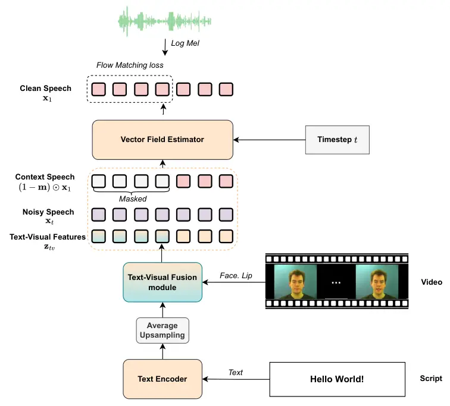
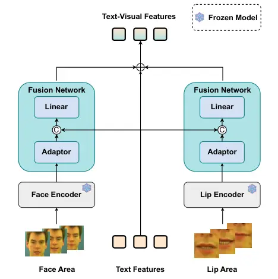

# SyncVoice: Simple and Effective Automatic Video Dubbing with Vision-Augmented TTS

† Corresponding author.

###### Abstract

Automatic video dubbing aims to generate high-fidelity speech that is
temporally aligned with visual content. However, existing methods still
suffer from limited speech naturalness, insufficient audio-visual
synchronization, and poor scalability beyond monolingual settings. To
address these challenges, we propose SyncVoice, a simple and effective
dubbing framework that lightly integrates a Text-Visual Fusion Module
into a pretrained text-to-speech (TTS) system. This module aligns visual
features with linguistic representations, enabling temporally
synchronized speech synthesis without complex architectural redesign.
Experiments on the LRS3 dataset show that SyncVoice achieves
state-of-the-art performance in zero-shot dubbing. Further training on a
large-scale bilingual audio-visual dataset improves vocal fidelity while
preserving synchronization, yielding a single unified model for both
Chinese and English dubbing.

Kaidi Wang¹,Yi He³,Wenhao Guan²,Weijie Wu¹,Peijie Chen¹,Hongwu
Ding³,Xiong Zhang³,Di Wu^(3,4),Meng Meng³,Jian Luan³,Lin
Li^(2†),Qingyang Hong^(1†)

¹School of Informatics, Xiamen University, China  
²School of Electronic Science and Engineering, Xiamen University,
China  
³MiLM Plus, Xiaomi Inc., China  
⁴WeNet Open Source Community

kaidi@stu.xmu.edu.cn

Index Terms: Automatic Video Dubbing, Text-to-Speech

## 1 Introduction

In recent years, the rapid growth of short-video platforms and global
content sharing has significantly increased the demand for automatic
video dubbing \[1, 2\]. This dubbing task aims to generate natural and
expressive speech from text scripts while preserving a target speaker’s
timbre. At the same time, the generated speech must be strictly
synchronized with visual cues such as lip movements in the input video.
Unlike conventional text-to-speech (TTS) systems \[3\], automatic video
dubbing additionally requires modeling visual information, making it a
challenging problem at the intersection of speech synthesis and
multimodal learning.

Early dubbing approaches \[1\] extract lip movement features to guide
speech generation and utilize facial representations for speaker
modeling in multi-speaker scenarios. HPMDubbing \[4\] further proposes a
hierarchical prosody modeling framework that incorporates visual cues
from lips, face, and scene context, while extracting speaker
representations from reference audio to improve voice consistency.
However, these models \[1, 4, 5, 6\] are typically trained on relatively
small audio-visual datasets, which limits their generalization ability.
To address this limitation, several recent studies \[7, 8, 9, 10\]
leverage large-scale speech corpora or pretrained TTS models \[11, 12,
13\], followed by fine-tuning on audio-visual data. While these
approaches significantly improve speech naturalness, challenges remain
in achieving precise audio-visual synchronization, and most existing
systems are restricted to single-language settings.

In this work, we propose SyncVoice, a novel automatic video dubbing
framework built upon a pretrained TTS model. Instead of training from
scratch—which is often constrained by limited and noisy audio-visual
data \[7\]—our method leverages ZipVoice \[14\], a flow-matching-based
TTS model with strong zero-shot capabilities. We further introduce a
Text-Visual Fusion Module that aligns textual and visual representations
over time, enabling the generation of speech that is temporally
consistent with the speaker’s lip movements. This design allows the
model to maintain the speech quality of the pretrained backbone while
improving audio-visual synchronization. Our main contributions are
summarized as follows:

- •
  We propose SyncVoice, a simple non-autoregressive automatic video
  dubbing framework based on flow matching, which augments a pretrained
  TTS backbone with lightweight multimodal conditioning for
  synchronized, high-fidelity speech synthesis.
- •
  We introduce an early multimodal fusion strategy that injects visual
  cues at the linguistic level of a pretrained TTS model, achieving
  effective audio-visual synchronization without complex fusion modules
  or auxiliary alignment objectives.
- •
  Extensive experiments on LRS3 show that SyncVoice achieves
  state-of-the-art zero-shot dubbing performance, and scaling to a
  large-scale Chinese--English bilingual corpus further demonstrates
  strong generalization.^(†)^(†) Demos are available at
  https://wkd88.github.io/syncvoice/.

## 2 Methodology

### 2.1 Model Architecture

Fig 1 presents the overall architecture of SyncVoice. It consists of two
components: (1) a non-autoregressive TTS backbone, (2) a Text-Visual
Fusion module, and We describe each component below.



Figure 1: The main architecture of the proposed method.

#### 2.1.1 TTS Backbone

We adopt ZipVoice \[14\] as the backbone of our system. ZipVoice is a
non-autoregressive TTS model based on the Flow Matching paradigm,
consisting of a text encoder that maps token sequences into contextual
linguistic representations and a vector field estimator that models
continuous latent trajectories for high-quality mel-spectrogram
generation.

A key component that distinguishes ZipVoice from many recent
non-autoregressive TTS models \[12, 13\] is the Average Upsampling
mechanism. Instead of padding text tokens with additional filler tokens
to match the acoustic length, the model expands linguistic
representations to the acoustic frame rate by uniformly repeating each
token according to the ratio between the target acoustic length and the
text sequence length. This simple yet effective strategy establishes
coarse temporal alignment between linguistic and acoustic
representations at an early stage, which accelerates the learning of
text–speech alignment and improves training convergence. Furthermore,
the resulting frame-level linguistic representation provides a natural
interface for incorporating additional temporal signals, which is
particularly advantageous when integrating multimodal cues such as
visual information.



Figure 2: Detail of Text-Visual Fusion module.

#### 2.1.2 Text-Visual Fusion Module

Building on the aligned representation space provided by Average
Upsampling, we introduce a Text-Visual Fusion Module to incorporate
visual cues for improved audio–visual synchronization, as illustrated in
Fig. 2. Following prior dubbing works \[5, 10\], we employ both facial
and lip features as visual conditions. Face regions are first detected
and cropped from each video frame using RetinaFace \[15\], and visual
representations are extracted using pretrained visual encoders \[16,
17\].

To ensure temporal consistency across modalities, the visual feature
sequence is interpolated to match the acoustic frame resolution and the
upsampled text sequence. The aligned visual features are then fused with
the upsampled text representations through a lightweight fusion network
based on residual adaptation. Specifically, visual representations are
first transformed by a bottleneck adapter and then concatenated with
textual features, followed by a linear projection to the model hidden
dimension. The final resulting representation is referred to as the
Text-Visual Features, which serve as the multimodal condition for the
subsequent generation module.

By injecting facial and lip cues into the linguistic representation
space, the proposed module enables the model to capture visual speech
dynamics and achieve more stable audio–visual synchronization. Compared
with recent flow matching-based dubbing method that relies on complex
multimodal fusion strategies and auxiliary alignment objectives \[9\],
as well as autoregressive approach that generates speech
sequentially \[10\], our method leverages the structural alignment
induced by Average Upsampling to enforce temporal consistency. This
design reduces the reliance on auxiliary alignment losses and mitigates
cross-modal drift, leading to more stable multimodal dubbing.

| Methods               | LSE-C $`\uparrow`$ | LSE-D $`\downarrow`$ | WER $`\downarrow`$ | SIM-o $`\uparrow`$ | UTMOS $`\uparrow`$ | MCD $`\downarrow`$ | MOS-N $`\uparrow`$ | MOS-S $`\uparrow`$ |
| --------------------- | ------------------ | -------------------- | ------------------ | ------------------ | ------------------ | ------------------ | ------------------ | ------------------ |
| Ground Truth          | 7.33               | 7.67                 | 1.94               | 0.783              | 3.87               | -                  | 4.42 $`\pm`$ 0.12  | 4.21 $`\pm`$ 0.09  |
| AlignDiT \[9\]        | 7.79               | 7.19                 | 2.26               | 0.681              | 3.69               | 6.36               | 4.12 $`\pm`$ 0.14  | 4.01 $`\pm`$ 0.13  |
| VoiceCraft-Dub \[10\] | 6.64               | 8.26                 | 11.49              | 0.535              | 3.75               | 6.81               | 4.06 $`\pm`$ 0.10  | 3.53 $`\pm`$ 0.12  |
| SyncVoice             | 8.36               | 6.83                 | 2.40               | 0.685              | 3.98               | 6.35               | 4.23 $`\pm`$ 0.11  | 4.03 $`\pm`$ 0.12  |

Table 1: Results on the LRS3 dataset. Our method incorporates visual
cues (facial and lip features) and uses multi-condition CFG with scaling
factors $`s_{t}=0.8,s_{f}=0.0,s_{l}=0.5`$. The best results are shown in
bold and the second-best are underlined.

### 2.2 Training Method

We train the model using a masked Flow Matching \[18\] formulation. Let
$`\mathbf{x}_{1}\in\mathbb{R}^{D\times T}`$ denote the ground-truth
speech spectrogram. During training, a binary mask
$`\mathbf{m}\in\{0,1\}^{D\times T}`$ is randomly sampled, where
$`m_{d,t}=1`$ indicates a masked element to be generated at frequency
bin $`d`$ and time frame $`t`$, while $`m_{d,t}=0`$ denotes an observed
context element. A diffusion time step $`t\sim\mathcal{U}(0,1)`$ is
sampled and embedded before being fed into the Vector Field Estimator
parameterized by $`\theta`$. The estimator takes as input the fused
text–visual features $`\mathbf{z}_{\text{tv}}`$, the observed speech
context $`(1-\mathbf{m})\odot\mathbf{x}_{1}`$, and the interpolated
noisy speech

```math
\mathbf{x}_{t}=(1-t)\mathbf{x}_{0}+t\mathbf{x}_{1}, \tag{1}
```

where $`\mathbf{x}_{0}\sim\mathcal{N}(0,I)`$ is Gaussian noise and
$`\odot`$ denotes element-wise multiplication.

During training, visual features are provided only for masked regions,
while non-masked regions are replaced with masked visual features. This
design enables inference using only reference audio without requiring
reference video, improving the practicality of the system. Finally, the
model is optimized using the following masked Flow Matching objective:

```math
\displaystyle\mathcal{L}_{\text{FM-Dub}}=\mathbb{E}_{t,\mathbf{x}_{1},\mathbf{x}_{0}}\Big[\big|\big|\mathbf{m}\odot\big(\mathbf{v}_{t}(\mathbf{x}_{t},\mathbf{z}_{\text{tv}},(1-\mathbf{m})\odot\mathbf{x}_{1};\theta) \tag{2}
```

```math
\displaystyle-(\mathbf{x}_{1}-\mathbf{x}_{0})\big)\big|\big|_{2}^{2}\Big],
```

### 2.3 Multi-Condition Classifier-Free Guidance

We adopt a multi-condition classifier-free guidance (CFG) strategy
\[19\] to enable controllable speech generation from multiple
modalities. The model is conditioned on facial features ($`f`$), lip
features ($`l`$), and text ($`t`$). During training, each condition is
randomly dropped with predefined probabilities, and when all conditions
are removed the model receives an unconditional input, denoted as
$`\varnothing`$.

At inference time, predictions under different conditioning
configurations are combined to control the influence of each modality.
The final guided velocity field is computed as

```math
\mathbf{v}_{\mathrm{cfg}}=\mathbf{v}_{f,l,t}+s_{f}\big(\mathbf{v}_{f,t}-\mathbf{v}_{t}\big)+s_{l}\big(\mathbf{v}_{l,t}-\mathbf{v}_{t}\big)+s_{t}\big(\mathbf{v}_{t}-\mathbf{v}_{\varnothing}\big), \tag{3}
```

where $`\mathbf{v}_{f,l,t}`$ denotes the prediction under full
conditioning, $`\mathbf{v}_{f,t}`$ and $`\mathbf{v}_{l,t}`$ denote
predictions with the lip and facial modalities removed, respectively,
and $`\mathbf{v}_{\varnothing}`$ denotes the unconditional prediction.
The guidance scales $`s_{f}`$, $`s_{l}`$, and $`s_{t}`$ control the
contribution of facial, lip, and textual conditions, respectively.

## 3 Experimental Setup

### 3.1 Dataset

We train two variants of our model under different data scales.

(1) LRS3 (In-the-wild Zero-shot Dubbing): The first variant is trained
on the public LRS3-TED dataset \[20\], which contains 439 hours of
English speech from thousands of TED/TEDx speakers. Following the EMILIA
protocol \[21\], we construct an EN-EN zero-shot test set by
re-segmenting 1,054 video pairs from the original HDTF videos \[22\].
For each test sample, the reference speech is randomly selected from a
different utterance of the same speaker.

(2) Internal Bilingual Dataset (Large-scale Bilingual Zero-shot
Dubbing): To investigate performance in a larger-scale bilingual
scenario, we train a second model on an internal multi-speaker dataset
comprising approximately 600 hours of Chinese and 1,190 hours of English
video data, covering a broad speaker population and yielding
substantially greater training diversity and scale. In addition to the
EN-EN test set, we construct a ZH-ZH zero-shot dubbing test set by
randomly selecting 826 video pairs from CN-CVS \[23\]. For each sample,
the reference speech is randomly drawn from another utterance of the
same speaker.

### 3.2 Implementation Details

Our model builds upon the ZipVoice architecture, consisting of a
Zipformer-based text encoder and a vector field estimator. The text
encoder contains 4 Zipformer layers with an embedding dimension of 192
and a feedforward dimension of 512. The vector field estimator adopts a
5-stack multi-scale Zipformer structure operating at downsampling rates
of $`[1\times,2\times,4\times,2\times,1\times]`$ with $`[2,2,4,4,4]`$
layers, respectively, where each layer has an embedding dimension of 512
and a feedforward dimension of 1536. In the text-visual fusion module,
each Adapter comprises a LayerNorm layer followed by a bottleneck
structure (down-projection to $`d/4`$, GELU activation, and
up-projection back to $`d`$), with a residual connection, an additional
LayerNorm, and a linear layer. The final linear layer projects the
concatenated features to a 100-dimensional representation.

The model is initialized with pretrained ZipVoice weights and optimized
using Scaled Adam with a learning rate of $`5\times 10^{-4}`$. All video
clips are resampled to 25 FPS (frames per second). Audio and text
processing follow the procedure in \[14\]. We train the model for 55k
steps on the LRS3 dataset using 4 NVIDIA H800 GPUs, and for 190k steps
on the internal bilingual dataset using 2 NVIDIA RTX 5090 GPUs, with
each GPU processing approximately 250 seconds of speech audio per step.
During training, text features are randomly dropped with a probability
of 0.2, while facial and lip features are each dropped with a
probability of 0.6. During inference, we adopt an Euler ODE solver with
16 sampling steps. A pretrained vocoder \[24\] is used to convert the
generated speech features into waveforms.

### 3.3 Evaluation Metrics

Subjective Evaluation. We randomly sample 30 utterances from the test
set for human evaluation to assess the perceptual quality of the
synthesized speech. Each sample is independently rated by 20
participants, who are instructed to score based on their subjective
perception using a five-point Likert scale. The rating scale is designed
such that 1 corresponds to ”very poor” and 5 to ”very good,” with
intermediate values representing varying levels of quality. Two criteria
are evaluated during this subjective assessment: (1) Naturalness
(MOS-N), which measures how natural and lifelike the synthesized speech
sounds, and (2) Speaker Similarity (MOS-S), which quantifies how closely
the synthesized voice matches the original speaker in terms of voice
characteristics.

Objective Evaluation. Objective performance is measured along five
dimensions. Speaker Similarity (SIM-o): We compute cosine similarity
between speaker embeddings extracted from the reference speech and the
synthesized audio. Embeddings are obtained using a WavLM-based
ECAPA-TDNN \[25\]. Perceptual Quality (UTMOS): UTMOS \[26\] is adopted
as an automatic proxy for perceived speech naturalness. Intelligibility
(WER): Word Error Rate is calculated between the ground-truth text and
ASR transcriptions of the speech. Whisper-large-v3 \[27\] is used for
English evaluation, and Paraformer-zh \[28\] for Chinese. Spectral
Distortion (MCD): Mel-Cepstral Distortion is reported to quantify
frame-level spectral deviation between generated and ground-truth
mel-spectrograms. Audio-Visual Synchronization (LSE-C / LSE-D):
Following \[29\], we employ SyncNet \[30\] to compute Lip Sync Error
Confidence (LSE-C) and Lip Sync Error Distance (LSE-D).

## 4 Results

### 4.1 Comparative Study on Public Baselines

In this section, we evaluate the performance of our monolingual model by
comparing it to state-of-the-art open-source baselines.

We compare SyncVoice with VoiceCraft-Dub \[10\] and AlignDiT \[9\], both
pretrained and evaluated on LRS3. As shown in Table 1, SyncVoice
achieves the best results on most metrics. AlignDiT reports a marginally
lower WER, largely due to an explicit CTC loss that enforces
transcription accuracy; however, this auxiliary constraint comes at the
cost of degraded performance in other dimensions, such as speaker
similarity. By contrast, SyncVoice surpasses all baselines in SIM-o,
UTMOS, MOS-N, MOS-S, LSE-C/LSE-D, and MCD. These results suggest that
SyncVoice achieves more balanced dubbing quality in zero-shot settings
with unseen speakers, improving synchronization and perceptual fidelity
without sacrificing overall performance for WER alone.

|                   |                    |                      |                    |                    |                    |                    |
| ----------------- | ------------------ | -------------------- | ------------------ | ------------------ | ------------------ | ------------------ |
| Methods           | LSE-C $`\uparrow`$ | LSE-D $`\downarrow`$ | WER $`\downarrow`$ | SIM-o $`\uparrow`$ | UTMOS $`\uparrow`$ | MCD $`\downarrow`$ |
| Ground Truth      | 7.33               | 7.67                 | 1.94               | 0.783              | 3.87               | -                  |
| Zero-shot TTS     | 2.86               | 12.06                | 2.39               | 0.733              | 4.08               | 6.42               |
| SyncVoice\_(tts)  | 2.84               | 12.08                | 1.94               | 0.737              | 4.07               | 6.21               |
| SyncVoice\_(face) | 7.32               | 7.80                 | 1.98               | 0.735              | 4.07               | 5.84               |
| SyncVoice\_(lip)  | 7.86               | 7.30                 | 2.08               | 0.738              | 4.08               | 5.75               |
| SyncVoice         | 7.86               | 7.29                 | 2.03               | 0.737              | 4.07               | 5.73               |
| w/ Random init.   | 7.75               | 7.39                 | 3.52               | 0.584              | 4.03               | 6.56               |

Table 2: Results on Bilingual Dataset (EN-EN test set). We set the CFG
scaling factors as $`s_{t}=1.0,s_{f}=0.0,s_{l}=0.5`$.

### 4.2 In-depth Exploration with Bilingual Data

We further evaluate SyncVoice on a bilingual dataset to investigate its
scalability across languages and multimodal inference settings. Results
are reported on both English and Chinese test sets. We adopt the
pretrained TTS model (Zero-shot TTS) \[14\] as the baseline and adjust
its output duration to match the video length under the default
inference configuration. At inference time, SyncVoice$`{}_{\text{tts}}`$
performs text-only generation, while SyncVoice$`{}_{\text{face}}`$ and
SyncVoice$`{}_{\text{lip}}`$ additionally use facial and lip features,
respectively. SyncVoice (without a subscript) uses all available
conditions. We also evaluate SyncVoice w/ Random Init., which is trained
without pretrained initialization.

On the EN-EN test set (Table 2), SyncVoice$`{}_{\text{tts}}`$ largely
preserves the synthesis capability of the pretrained TTS backbone while
improving several metrics. Facial conditioning improves LSE-C, LSE-D,
and MCD, although it slightly increases WER. Lip features provide
stronger synchronization cues, yielding further improvements in
synchronization and even surpassing Ground Truth on the
synchronization-related metrics. They also marginally improve SIM-o and
UTMOS while reducing MCD. Combining facial and lip features achieves the
best LSE-D and MCD, suggesting that the two visual representations
provide complementary information. Overall, visual conditioning improves
synchronization while largely preserving speech quality for English
dubbing. In contrast, SyncVoice w/ Random Init. consistently
underperforms its pretrained-initialized counterpart, demonstrating the
importance of pretrained TTS initialization.

On the ZH-ZH test set (Table 3), SyncVoice$`{}_{\text{tts}}`$ remains
competitive with the pretrained baseline, achieving better SIM-o and MCD
but slightly worse WER and UTMOS. Facial and lip conditioning
progressively improves synchronization, while combining both features
additionally improves WER. However, visual conditioning slightly reduces
performance on some speech-quality metrics, and all visual
configurations remain below Ground Truth in synchronization performance.
This may be because the visual encoders and synchronization-related
components are primarily trained on non-Chinese data and are less
effective at capturing Chinese-specific articulation patterns.
Incorporating more Chinese audiovisual data may therefore improve
cross-lingual synchronization. SyncVoice w/ Random Init. again performs
consistently worse across all metrics, confirming the importance of
pretrained initialization.

Overall, scaling to large-scale bilingual data improves speech quality
and demonstrates the strong generalization ability of SyncVoice for
bilingual dubbing, while pretrained initialization is critical for
achieving competitive performance across both languages.

|                   |                    |                      |                    |                    |                    |                    |
| ----------------- | ------------------ | -------------------- | ------------------ | ------------------ | ------------------ | ------------------ |
| Methods           | LSE-C $`\uparrow`$ | LSE-D $`\downarrow`$ | WER $`\downarrow`$ | SIM-o $`\uparrow`$ | UTMOS $`\uparrow`$ | MCD $`\downarrow`$ |
| Ground Truth      | 5.34               | 8.44                 | 0.89               | 0.709              | 2.68               | -                  |
| Zero-shot TTS     | 2.07               | 11.84                | 1.51               | 0.670              | 2.96               | 6.16               |
| SyncVoice\_(tts)  | 1.97               | 11.92                | 1.72               | 0.682              | 2.85               | 6.13               |
| SyncVoice\_(face) | 2.56               | 11.33                | 1.99               | 0.678              | 2.80               | 6.12               |
| SyncVoice\_(lip)  | 4.77               | 9.21                 | 1.97               | 0.675              | 2.78               | 5.75               |
| SyncVoice         | 4.75               | 9.22                 | 1.91               | 0.674              | 2.76               | 5.79               |
| w/ Random init.   | 4.57               | 9.28                 | 11.22              | 0.590              | 2.57               | 5.85               |

Table 3: Results on Bilingual Dataset (ZH-ZH test set). We set the CFG
scaling factors as $`s_{t}=0.8,s_{f}=0.0,s_{l}=0.5`$.

| $`s_{f}`$ | $`s_{l}`$ | $`s_{t}`$ | LSE-C $`\uparrow`$ | LSE-D $`\downarrow`$ | WER $`\downarrow`$ | SIM-o $`\uparrow`$ | UTMOS $`\uparrow`$ | MCD $`\downarrow`$ |
| --------- | --------- | --------- | ------------------ | -------------------- | ------------------ | ------------------ | ------------------ | ------------------ |
| 1.0       | 1.0       | 1.0       | 8.02               | 7.15                 | 2.24               | 0.719              | 4.04               | 6.13               |
| 0.5       | 0.5       | 1.0       | 7.92               | 7.23                 | 2.20               | 0.733              | 4.07               | 5.83               |
| 0.5       | 0.5       | 1.5       | 7.79               | 7.35                 | 1.90               | 0.730              | 4.05               | 6.02               |
| 0.5       | 0.5       | 0.5       | 8.03               | 7.14                 | 2.38               | 0.722              | 4.06               | 5.72               |
| 0.5       | 0.0       | 1.0       | 7.69               | 7.45                 | 1.84               | 0.738              | 4.07               | 5.75               |
| 0.0       | 0.5       | 1.0       | 7.86               | 7.29                 | 2.03               | 0.737              | 4.07               | 5.73               |
| 0.0       | 0.0       | 1.0       | 6.42               | 8.49                 | 4.38               | 0.734              | 3.47               | 6.12               |

Table 4: Ablation results for multi-condition CFG (EN-EN test set).

### 4.3 Ablation Study

We conduct ablation studies to validate the effectiveness of our
multi-condition CFG strategy. As shown in Table 4, increasing the factor
$`s_{t}`$ improves WER, but at the cost of lip-speech synchronization.
The factor $`s_{f}`$ and $`s_{l}`$ directly affects lip synchronization.
Specifically, facial features ($`s_{f}`$) serve as a weak
synchronization cue, causing minimal disruption to speech quality. In
contrast, lip features ($`s_{l}`$) enforce stronger synchronization,
improving lip-speech alignment but slightly affecting WER. These results
reveal a trade-off between synchronization and speech quality,
suggesting that optimizing one objective may come at the cost of the
other.

## 5 Conclusion

In this work, we propose a novel automatic video dubbing method that
improves both lip synchronization and speech quality compared to
baseline approaches. We also explore its application to bilingual
scenarios, demonstrating its effectiveness in both English and Chinese.
Future work will focus on further enhancing dubbing performance,
particularly by expanding to more languages and improving cross-lingual
adaptation.

## 6 Acknowledgements

This work was supported in part by the National Natural Science
Foundation of China under Grants 62276220 and 62371407 and the
Innovation of Policing Science and Technology, Fujian province (Grant
number: 2024Y0068).

## References

- \[1\] C. Hu, Q. Tian, T. Li, W. Yuping, Y. Wang, and H. Zhao, “Neural
  dubber: Dubbing for videos according to scripts,” in _Thirty-Fifth
  Conference on Neural Information Processing Systems_, 2021.
- \[2\] J. Lu, B. Sisman, R. Liu, M. Zhang, and H. Li, “Visualtts: Tts
  with accurate lip-speech synchronization for automatic voice over,” in
  _ICASSP 2022 - 2022 IEEE International Conference on Acoustics, Speech
  and Signal Processing (ICASSP)_, 2022.
- \[3\] Y. Ren, Y. Ruan, X. Tan, T. Qin, S. Zhao, Z. Zhao, and T.-Y.
  Liu, “Fastspeech: Fast, robust and controllable text to speech,”
  _Advances in neural information processing systems_, 2019.
- \[4\] G. Cong, L. Li, Y. Qi, Z.-J. Zha, Q. Wu, W. Wang, B. Jiang,
  M.-H. Yang, and Q. Huang, “Learning to dub movies via hierarchical
  prosody models,” in _Proceedings of the IEEE/CVF Conference on
  Computer Vision and Pattern Recognition_, 2023.
- \[5\] G. Cong, Y. Qi, L. Li, A. Beheshti, Z. Zhang, A. Hengel, M.-H.
  Yang, C. Yan, and Q. Huang, “StyleDubber: Towards multi-scale style
  learning for movie dubbing,” in _Findings of the Association for
  Computational Linguistics ACL 2024_, 2024.
- \[6\] G. Cong, J. Pan, L. Li, Y. Qi, Y. Peng, A. van den Hengel,
  J. Yang, and Q. Huang, “Emodubber: Towards high quality and emotion
  controllable movie dubbing,” _2025 IEEE/CVF Conference on Computer
  Vision and Pattern Recognition (CVPR)_, 2024.
- \[7\] Z. Zhang, L. Li, G. Cong, H. Yin, Y. Gao, C. C. Yan, A. van den
  Hengel, and Y. Qi, “From speaker to dubber: Movie dubbing with prosody
  and duration consistency learning,” _Proceedings of the 32nd ACM
  International Conference on Multimedia_, 2024.
- \[8\] Z. Zhang, L. Li, C. Yan, C. Liu, A. van den Hengel, and Y. Qi,
  “Prosody-enhanced acoustic pre-training and acoustic-disentangled
  prosody adapting for movie dubbing,” _2025 IEEE/CVF Conference on
  Computer Vision and Pattern Recognition (CVPR)_, 2025.
- \[9\] J. Choi, J.-H. Kim, K. Sung-Bin, T.-H. Oh, and J. S. Chung,
  “Aligndit: Multimodal aligned diffusion transformer for synchronized
  speech generation,” _ArXiv_, 2025.
- \[10\] K. Sung-Bin, J. Choi, P. Peng, J. S. Chung, T.-H. Oh, and
  D. Harwath, “Voicecraft-dub: Automated video dubbing with neural codec
  language models,” _arXiv preprint arXiv:2504.02386_, 2025.
- \[11\] P. Peng, P.-Y. B. Huang, S.-W. Li, A. Mohamed, and D. Harwath,
  “Voicecraft: Zero-shot speech editing and text-to-speech in the wild,”
  in _Annual Meeting of the Association for Computational
  Linguistics_, 2024.
- \[12\] S. E. Eskimez, X. Wang, M. Thakker, C. Li, C.-H. Tsai, Z. Xiao,
  H. Yang, Z. Zhu, M. Tang, X. Tan, Y. Liu, S. Zhao, and N. Kanda, “E2
  tts: Embarrassingly easy fully non-autoregressive zero-shot tts,”
  _2024 IEEE Spoken Language Technology Workshop (SLT)_, 2024.
- \[13\] Y. Chen, Z. Niu, Z. Ma, K. Deng, C. Wang, J. Zhao, K. Yu, and
  X. Chen, “F5-tts: A fairytaler that fakes fluent and faithful speech
  with flow matching,” _arXiv preprint arXiv:2410.06885_, 2024.
- \[14\] H. Zhu, W. Kang, Z. Yao, L. Guo, F. Kuang, Z. Li, W. Zhuang,
  L. Lin, and D. Povey, “Zipvoice: Fast and high-quality zero-shot
  text-to-speech with flow matching,” _arXiv preprint
  arXiv:2506.13053_, 2025.
- \[15\] J. Deng, J. Guo, E. Ververas, I. Kotsia, and S. Zafeiriou,
  “Retinaface: Single-shot multi-level face localisation in the wild,”
  in _2020 IEEE/CVF Conference on Computer Vision and Pattern
  Recognition (CVPR)_, 2020.
- \[16\] A. Toisoul, J. Kossaifi, A. Bulat, G. Tzimiropoulos, and
  M. Pantic, “Estimation of continuous valence and arousal levels from
  faces in naturalistic conditions,” _Nature Machine
  Intelligence_, 2021.
- \[17\] B. Martinez, P. Ma, S. Petridis, and M. Pantic, “Lipreading
  using temporal convolutional networks,” in _IEEE International
  Conference on Acoustics, Speech and Signal Processing (ICASSP)_, 2020.
- \[18\] Y. Lipman, R. T. Q. Chen, H. Ben-Hamu, M. Nickel, and M. Le,
  “Flow matching for generative modeling,” _ArXiv_, 2022.
- \[19\] J. Ho and T. Salimans, “Classifier-free diffusion guidance,” in
  _NeurIPS 2021 Workshop on Deep Generative Models and Downstream
  Applications_, 2021.
- \[20\] T. Afouras, J. S. Chung, and A. Zisserman, “Lrs3-ted: a
  large-scale dataset for visual speech recognition,” _ArXiv_, 2018.
- \[21\] H. He, Z. Shang, C. Wang, X. Li, Y. Gu, H. Hua, L. Liu,
  C. Yang, J. Li, P. Shi _et al._, “Emilia: An extensive, multilingual,
  and diverse speech dataset for large-scale speech generation,” in
  _2024 IEEE Spoken Language Technology Workshop (SLT)_, 2024.
- \[22\] Z. Zhang, L. Li, Y. Ding, and C. Fan, “Flow-guided one-shot
  talking face generation with a high-resolution audio-visual dataset,”
  in _Proceedings of the IEEE/CVF Conference on Computer Vision and
  Pattern Recognition_, 2021.
- \[23\] C. Chen, D. Wang, and T. F. Zheng, “Cn-cvs: A mandarin
  audio-visual dataset for large vocabulary continuous visual to speech
  synthesis,” in _ICASSP 2023 - 2023 IEEE International Conference on
  Acoustics, Speech and Signal Processing (ICASSP)_, 2023.
- \[24\] H. Siuzdak, “Vocos: Closing the gap between time-domain and
  fourier-based neural vocoders for high-quality audio synthesis,”
  _ArXiv_, 2023.
- \[25\] B. Desplanques, J. Thienpondt, and K. Demuynck, “Ecapa-tdnn:
  Emphasized channel attention, propagation and aggregation in tdnn
  based speaker verification,” in _Interspeech_, 2020.
- \[26\] T. Saeki, D. Xin, W. Nakata, T. Koriyama, S. Takamichi, and
  H. Saruwatari, “Utmos: Utokyo-sarulab system for voicemos challenge
  2022,” _ArXiv_, 2022.
- \[27\] A. Radford, J. W. Kim, T. Xu, G. Brockman, C. Mcleavey, and
  I. Sutskever, “Robust speech recognition via large-scale weak
  supervision,” in _Proceedings of the 40th International Conference on
  Machine Learning_, 2023.
- \[28\] Z. Gao, S. Zhang, I. Mcloughlin, and Z. Yan, “Paraformer: Fast
  and accurate parallel transformer for non-autoregressive end-to-end
  speech recognition,” in _Interspeech_, 2022.
- \[29\] C. Li, C. Zhang, W. Xu, J. Lin, J. Xie, W. Feng, B. Peng,
  C. Chen, and W. Xing, “Latentsync: Taming audio-conditioned latent
  diffusion models for lip sync with syncnet supervision,” _arXiv
  preprint arXiv:2412.09262_, 2024.
- \[30\] K. Prajwal, R. Mukhopadhyay, V. P. Namboodiri, and C. Jawahar,
  “A lip sync expert is all you need for speech to lip generation in the
  wild,” in _Proceedings of the 28th ACM international conference on
  multimedia_, 2020.
