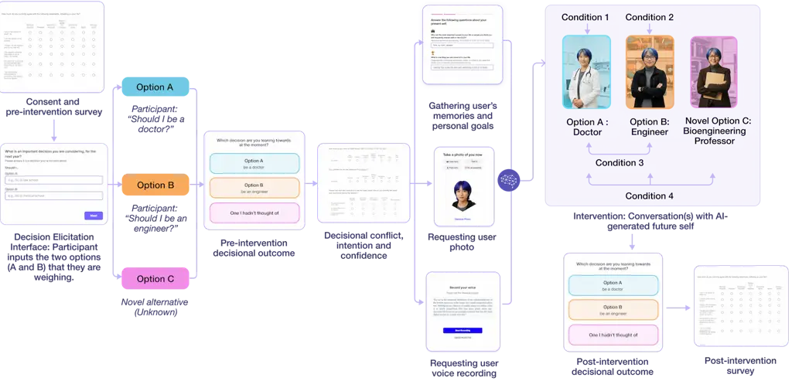
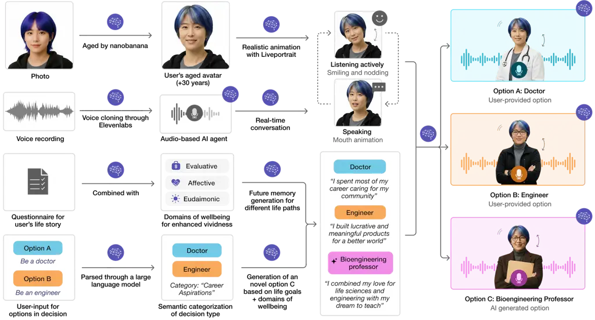
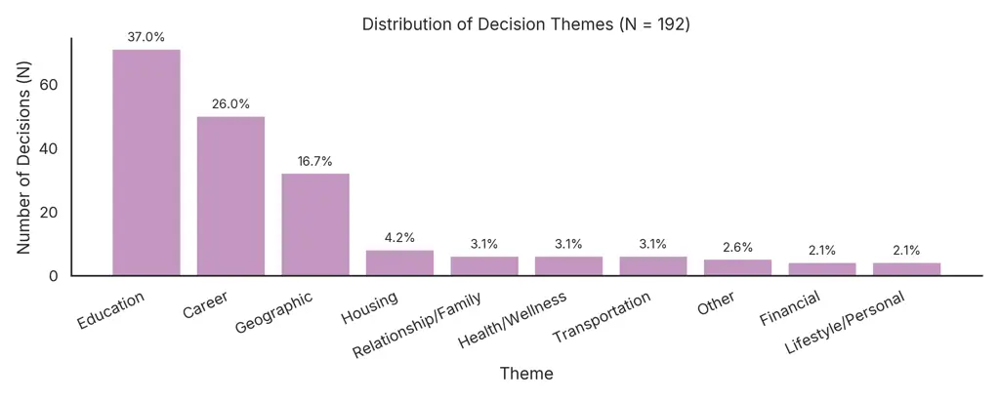
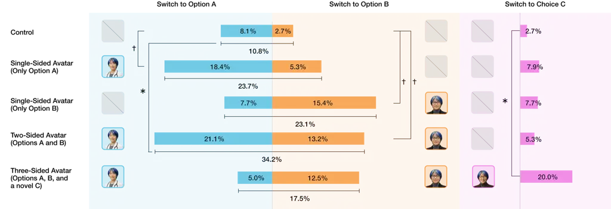
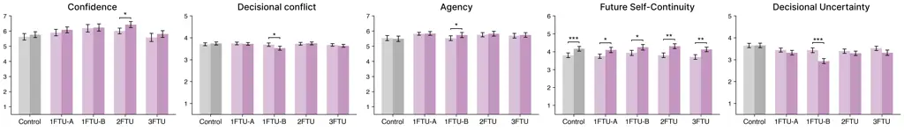

# Simulating Life Paths with Digital Twins: AI-Generated Future Selves Influence Decision-Making and Expand Human Choice

DOI: [XXXXXXX.XXXXXXX](https://doi.org/XXXXXXX.XXXXXXX)Conference: Augmented
Humans International Conference, March 16–19, 2025, Okinawa, Japan;
978-1-4503-XXXX-X/2026/03ISBN: ;CCS: Human-centered computing Human
computer interaction (HCI)CCS: Human-centered computing Empirical
studies in HCICCS: Applied computing PsychologyCCS: Computing
methodologies Artificial intelligenceCCS: Human-centered computing Human
computer interaction (HCI)CCS: Human-centered computing Empirical
studies in HCI

Rachel Poonsiriwong Affiliation: MIT Media Lab, Cambridge, MA, USA
email: <rachelpo@mit.edu> , Chayapatr Archiwaranguprok Affiliation: MIT
Media Lab, Cambridge, MA, USA email: <pub@mit.edu> , Constanze Albrecht
Affiliation: MIT Media Lab, Cambridge, MA, USA email: <csophie@mit.edu>
, Peggy Yin Affiliation: Stanford University, Stanford, CA, USA email:
<peggyyin@stanford.edu> , Nattavudh Powdthavee Affiliation: Nanyang
Technological University, Singapore, Singapore email:
<nick.powdthavee@ntu.edu.sg> , Hal Hershfield Affiliation: University of
California, Los Angeles, Los Angeles, CA, USA email:
<hal.hershfield@anderson.ucla.edu> , Monchai Lertsutthiwong
Affiliation: KASIKORN Labs, Nonthaburi, Thailand email:
<monchai.le@kbtg.tech> , Kavin Winson Affiliation: KASIKORN Labs,
Nonthaburi, Thailand email: <kavin.w@kbtg.tech> and Pat Pataranutaporn
Affiliation: MIT Media Lab, Cambridge, MA, USA email: <patpat@mit.edu>

© none

Figure 1. Overview of the AI-generated future self system that simulates
different life paths based on participants’ major life decisions. Upon
providing the system with two options, each participant was able to
converse with an age-progressed, photorealistic avatar representing
their future selves making those decisions, as well as a novel
alternative based on their personal goals and values.Snapshot of study

###### Abstract.

Major life transitions require high-stakes decisions, yet humans
struggle to forecast how their future selves will live with the
consequences. To augment this limited capacity for mental time travel,
we introduce AI-enabled digital twins that have "lived through"
simulated life scenarios. Rather than predictive systems that claim to
forecast optimal outcomes, these simulations extend human prospective
cognition by rendering alternative futures vivid enough to support
deeper deliberation without presuming to know which path is truly best.
We explore this approach in a randomized controlled study (N=192) using
multimodal synthesis (facial age progression, voice cloning, and large
language model dialogue) to create personalized avatars representing
participants 30 years forward. Participants aged 18-28 articulated
pending binary decisions (e.g., Whether to pursue graduate school or
enter the workforce) and were randomly assigned to control (guided
imagination) or one of four avatar conditions varying in configuration:
single-option, balanced dual-option, or expanded three-option including
a system-generated novel alternative. Results revealed asymmetric
persuasive effects: single-sided avatars significantly increased shifts
toward the presented option, while balanced presentation produced
symmetric movement toward both alternatives. Most strikingly,
introduction of a system-generated third option increased novel
alternative adoption compared to control, demonstrating that
AI-generated future selves can expand human choice, surfacing previously
unconsidered life paths that individuals may not have discovered on
their own. Analysis of vividness dimensions revealed that participants
valued evaluative reasoning and eudaimonic meaning-making significantly
more than affective resonance or visual realism. Perceived
persuasiveness and baseline agency predicted decision change. While the
simulated futures necessarily simplify life’s complexity and cannot
guarantee accuracy, the hypothetical framing could have positive impact
on human outcomes. These findings advance understanding of how
AI-mediated episodic prospection engages temporal self-continuity
mechanisms, while raising critical questions about autonomy and
persuasive influence in AI-augmented decision contexts.

###### Keywords: 

AI-generated avatars, future self, decision-making, episodic future
thinking, choice architecture, persuasive technology, young adults,
temporal simulation, behavioral intervention, conversational AI

## 1. Introduction

> Do I contradict myself?  
> Very well then I contradict myself,  
> I am large, I contain multitudes.  
> — Walt Whitman, Song of Myself (1892)

Whitman’s celebration of human multiplicity captures a fundamental truth
about identity: we contain not one self but many potential selves, each
corresponding to paths taken and untaken. When young adults face
consequential life decisions, they must somehow reconcile these
multitudes, choosing among futures they can only dimly imagine. What if
technology could render these potential selves vivid and conversable—not
as oracles promising truth, but as simulations inviting deeper
reflection?

Navigating life transitions requires confronting decisions with immense
long-term consequences: pursuing a fulfilling career versus a
financially rewarding one, staying with a long-term partner versus
seeking new relationships, investing in education versus entering the
workforce immediately. Research on affective forecasting reveals that
individuals overestimate negative impacts of future adversity while
underestimating their adaptive capacities (Ubel et al., 2005; Halpern
and Arnold, 2008), contributing to suboptimal decision-making.

Psychological interventions have attempted to bridge this temporal gap
by strengthening future self-continuity—the perceived psychological
connection between present and future selves. Research demonstrates that
participants interacting with age-progressed avatars reduced instant
gratification tendencies  (Faralla et al., 2021), performing better
academically  (Adelman et al., 2017), saving more for
retirement (Robalino et al., 2023; Sims et al., 2020), and reducing
delinquent behavior (van Gelder et al., 2013; Van Gelder et al., 2022).
More recently, conversational AI agents representing users’ future
selves significantly reduced anxiety while strengthening future
self-continuity (Pataranutaporn et al., 2024).

However, prior work has focused exclusively on single future self
representations without examining how multiple simultaneous future
selves representing divergent life paths might differentially influence
decision-making. No prior work has systematically examined whether
AI-generated future selves can clarify trade-offs in binary life
decisions, whether multiple competing future selves produce balanced
deliberation or heightened conflict, or whether AI can expand humans’
capacity to imagine novel choices beyond their initial consideration
set.

In this work, we introduce AI-generated digital twins that have “lived
through” simulated life scenarios as a tool for augmenting human
prospective cognition. Instead of predicting one optimal outcome, these
digital twins extend the human capacity for mental time travel—rendering
alternative futures vivid enough to support deeper deliberation of
personal goals and values.

We investigate how the number and configuration of simulated future
selves augments and affects decision-making through a randomized
controlled study (N=192) with young adults aged 18-28 facing
consequential life decisions. Participants articulated personally
meaningful pending decisions spanning education, career, relationships,
and geographic relocation, providing two options they were actively
weighing (e.g., "Should I be a doctor" or "Should I be an engineer").
Participants were randomly assigned to one of five conditions: control
(guided mental imagination), single-avatar conditions (advocating only
for either Option A or B), a balanced dual-avatar condition (both A and
B), and a three-avatar condition introducing a novel Option C
algorithmically generated from participants’ stated goals and values.
Avatar conditions featured AI-generated future selves with
age-progressed imagery, neural voice cloning, and large language
model-based conversational agents, enabling dialogue with simulations of
themselves 30 years forward.

We emphasize that these AI-generated future selves are simulations, not
prophecies. Large language models can hallucinate details and generate
narratives that poorly reflect how lives might actually unfold. Our
design philosophy prioritizes awareness over acceptance: users should
engage with these digital twins as provocations for self-reflection
rather than authoritative guidance. We advocate for ethical deployment
frameworks including explicit disclosure of simulation limitations and
design choices that foreground user agency over algorithmic persuasion.

In our research, we explore the following research questions:

RQ1: Persuasive Influence. How does exposure to AI-generated future self
avatars influence decision outcomes, and does single-sided versus
balanced presentation produce different patterns of decision change?

RQ2: Choice Expansion. Can AI-generated future selves expand
participants’ consideration sets by introducing novel alternatives
beyond their initially articulated options?

RQ3: Psychological Mechanisms. Which dimensions of the avatar experience
(evaluative, affective, eudaimonic, visual vividness) do users find most
valuable? What factors predict decision-making outcomes, and how do
avatar interactions affect decisional conflict, agency, and future
self-continuity?

Results revealed asymmetric persuasive effects contingent on choice
architecture. Single-sided avatar exposure significantly increased
decision shift rates toward the presented option compared to control,
demonstrating directional influence aligned with the simulated
future—participants who encountered only their Option A future self
moved toward Option A (e.g. "Be a doctor"), while those encountering
only Option B (e.g. "Be an engineer") moved correspondingly toward that
alternative. Balanced dual-avatar presentation (e.g. "Be a doctor" and
"Be an engineer") produced symmetric persuasion, with participants
increasing overall decision movement by shifting between A and B. Most
strikingly, introduction of a system-generated third option (e.g. "Be a
bioengineering professor") produced substantial increases in novel
alternative selection compared to control, demonstrating that AI
simulations, albeit imperfect and incomplete, can still expand human
choice architecture beyond one’s imagination to surface other viable
life paths.

Furthermore, analysis of vividness dimensions revealed a clear hierarchy
in what participants found most valuable about the avatar experience.
Evaluative vividness—the avatar’s capacity to articulate overall life
satisfactions and concrete achievements—was rated most highly, followed
closely by eudaimonic vividness—the avatar’s ability to convey a sense
of purpose, value alignment, and fulfillment.  (Mahoney, 2023; Kahneman
et al., 2004; Diener et al., 2010) Both cognitive dimensions
substantially outranked affective vividness (emotional connection to
loved ones) and visual realism (photorealistic appearance and believable
aging).

Regression analyses identified two significant predictors of decision
change: perceived persuasiveness of the avatar interaction and baseline
agency. Participants who experienced the avatars as more compelling and
influential were more likely to modify their initial preferences, while
individuals entering the study with a stronger sense of personal
agency—the belief that they can initiate and sustain goal-directed
action—showed greater willingness to revise their choices when presented
with new perspectives. This latter finding suggests that avatar-based
interventions may be particularly effective for individuals who already
feel empowered to shape their own futures, rather than serving as a
remedy for decision paralysis rooted in low self-efficacy.

These findings advance theoretical understanding of how simulated future
selves engage episodic prospection and temporal self-continuity
mechanisms. Crucially, the demonstrated influence of these simulations,
despite their inherent limitations, raises important questions about the
responsible design of AI systems that shape human self-understanding and
life choices.

This work offers three primary contributions:

Technical Contribution. We present a complete system architecture for
generating personalized, multimodal future self avatars—digital twins
that simulate having lived through different life scenarios. The system
integrates age-progressed imagery, neural voice cloning, and large
language model-based conversational intelligence, synthesizing
autobiographical data into coherent future memories structured across
evaluative, affective, and eudaimonic dimensions.

Empirical Contribution. We provide evidence from a controlled experiment
demonstrating that AI-generated future self avatars influence
consequential life decisions. Our findings reveal that balanced avatar
presentation increases the rate of decision shift compared to control,
and that introducing an AI-generated novel alternative (Option C)
significantly increases adoption. This demonstrates AI’s capacity to
expand human choice.

Ethical and Design Contribution. We illuminate critical questions about
autonomy, agency, and persuasion in AI-augmented decision contexts. Our
finding that single-sided presentation produces directional persuasion
has direct implications for ethical system design. We articulate design
principles prioritizing user awareness, contestability, and agency
preservation, contributing to emerging frameworks for responsible
persuasive AI technologies.

## 2. Related Work

Our work examines how AI-generated future self simulations influence
decision-making outcomes and choice expansion. We review three
interconnected research areas: decision science foundations, AI systems
as persuasive agents, and simulation-based interventions.

### 2.1. Decision Science Foundations

Decisional conflict arises when individuals face uncertainty due to
inadequate information, unclear values, or emotional distress (O’Connor,
1995). High conflict predicts decision delay, vacillation, and
regret (Brehaut et al., 2003), particularly in high-stakes decisions
involving value trade-offs (Janis and Mann, 1977). These patterns
intensify in transformative life decisions—consequential choices that
can fundamentally reshape life trajectories and identity, such as career
changes, relocations, or major relationship commitments (Hechtlinger et
al., 2024). Self-determination theory emphasizes that decisions
misaligned with intrinsic motives undermine internalization and
well-being (Deci and Ryan, 2000; Deci and Ryan, 2013; Ryan and Deci,
2000). Individual differences further moderate these dynamics:
maximizers achieve objectively superior outcomes but report lower
satisfaction and higher regret than satisficers (Roets et al., 2012;
Iyengar et al., 2006), suggesting effective decision support must
address both outcome quality and process satisfaction (Nenkov et al.,
2008).

People systematically mispredict future emotions through the impact
bias (Wilson et al., 2000; Gilbert et al., 2002). Three mechanisms drive
these errors: focalism (giving too much weight to specific factors or
information while ignoring others) (Schkade and Kahneman, 1998; Wilson
et al., 2000), immune neglect (failing to anticipate effects of
psychological coping) (Gilbert et al., 1998), and projection bias
(assuming current states persist) (Loewenstein et al., 2003). These
biases pervade consequential decisions, leading people to overestimate
lasting happiness from achievements while also overestimating enduring
misery from setbacks (Gilbert et al., 2002; Lucas, 2007; Frederick and
Loewenstein, 1999).

Episodic future thinking (EFT), the ability to imagine personal futures
in vivid detail (Atance and O’Neill, 2001; Schacter et al., 2008),
critically shapes decision-making by making future outcomes
psychologically present (Peters and Büchel, 2010). Unlike abstract
reasoning, EFT involves first-person experiential simulations with
sensory and emotional details (Brown and Stein, 2022), activating brain
networks overlapping with episodic memory systems (Schacter et al.,
2008; Addis et al., 2009). By concretizing future scenarios, EFT reduces
decision ambiguity and expands the set of imagined possibilities beyond
default trajectories. Individual studies demonstrate EFT reduces
unhealthy consumption  (Ersner-Hershfield et al., 2009) and decreases
smoking  (Stein et al., 2018). Goal-oriented EFT shows enhanced
effectiveness compared to general positive events  (Athamneh et al.,
2021; O’Donnell et al., 2018).

Future self-continuity (FSC), the perceived psychological connection
between present and future selves  (Hershfield et al., 2011), predicts
increased saving, healthier behaviors, and reduced unethical
conduct  (Rutchick et al., 2018). FSC can be experimentally manipulated
through age-progressed avatars  (Hershfield et al., 2011) and
letter-writing exercises  (van Gelder et al., 2013). FSC mediates time
perspective and decision-making relationships, expanding moral concern
to include future selves  (Ersner-Hershfield et al., 2009).

### 2.2. AI, Persuasion, and Autonomy

Self-Determination Theory identifies autonomy, competence, and
relatedness as innate psychological needs predicting well-being and
behavioral persistence  (Ryan and Deci, 2000; Deci and Ryan, 2013).
Autonomous motivation, when individuals endorse actions as authentic
self-expressions, predicts greater engagement and performance  (Sheldon
et al., 1997). The sense of agency  (Limerick et al., 2014), feeling one
can influence outcomes  (Haggard, 2017; Tapal et al., 2017), complements
autonomy and predicts decision quality  (Deci and Ryan, 2014).

AI decision-support systems have evolved from expert systems to LLMs
capable of personalized interaction  (Russell and Norvig, 2010; Matz et
al., 2024; Joseph, 2025). Studies reveal contradictory user preferences:
algorithm aversion in some contexts  (Dietvorst et al., 2015) but
algorithmic appreciation in others  (Logg et al., 2019), especially when
users feel that they can expect trustworthy responses from AI   (Jacovi
et al., 2020). Users resist algorithmic guidance for moral decisions
while accepting it for objective criteria  (Lee, 2018; Vasconcelos et
al., 2023).

### 2.3. Simulation-Based Interventions

Technology-mediated future self interventions operate along a spectrum
from reflective to perceptual approaches. Reflective interventions
include digitized letter-writing with imagined future selves  (Chishima
and Wilson, 2021), though these depend on individual imaginative
capacity. Presentational interventions using age-progressed imagery and
VR embodiment showed reduced impulsivity (van Gelder et al., 2013) and
increased future orientation   (Mertens et al., 2023; Ganschow et al.,
2021). Generative AI tools have enabled iterative construction of
prospective self-representations (Ali et al., 2024). Conversational
approaches merge dialogue with perceptual concreteness. The Future You
chatbot (Pataranutaporn et al., 2024) demonstrated reduced anxiety and
strengthened temporal self-connection. Mobile implementations showed
goal-setting benefits (Dechant et al., 2025), while LLM-augmented letter
exchanges showed comparable benefits across formats (Jeon et al., 2025).

Modality shapes emotional engagement (Oh et al., 2018). Text affords
clarity, voice adds prosodic richness (Reicherts et al., 2022), and
embodied avatars activate social cognitive processes (Oker, 2022;
Schuetzler et al., 2018; Alabed et al., 2022). Voice-based chatbots
initially yielded psychosocial benefits over text, though advantages
attenuated with exposure (Fang et al., 2024).

AI-generated characters now leverage hyper-realistic
synthesis (Pataranutaporn et al., 2021; Pataranutaporn et al., 2023;
Rakesh et al., 2025; Ma et al., 2025; Abootorabi et al., 2025). "Living
Memories" increased learning effectiveness (Pataranutaporn et al.,
2023), while "Generative Agents" demonstrate memory and planning
capabilities (Park et al., 2023), extending into "generative ghosts"
representing deceased persons (Morris and Brubaker, 2025). While
perceived realism influences acceptance (von der Pütten et al., 2010;
Huang and Jung, 2022), near-human realism can elicit discomfort (Mori et
al., 2012), intensifying with self-representations (Weisman and Peña,
2021).

No prior work has examined how AI-simulated future selves influence
comprehensive decision-making. Our work investigates whether
personalized future self representations can reduce decisional conflict,
expand consideration sets, and enhance outcomes while preserving
autonomy.

## 3. Methodology

To investigate how AI-generated future self avatars influence
decision-making outcomes and psychological processes when individuals
face important life choices, we conducted a randomized between-subjects
experiment (N = 192) comparing five conditions: a control condition that
guides the participant along their usual long-term decision-making
process, and four avatar conditions varying in the number and nature of
decision options simulated. Our study addresses three primary research
questions designed to comprehensively examine how future self avatars
influence decision-making and behavioral outcomes. This section
describes the system architecture, experimental design, and measurement
instruments employed to systematically examine these questions.

Figure 2. Procedure Overview: This figure illustrates the experimental
procedure across conditions. Participants completed a pre-intervention
survey including decision elicitation, indicated their pre-intervention
decision outcome, then uploaded an image and voice recording. Following
an engagement with their AI-generated future self avatar(s),
participants indicated their post-intervention decision outcome and
completed a post-intervention survey measuring decision intention,
confidence, decisional conflict and psychological changes.

### 3.1. System Architecture

We developed a fully web-based implementation using the Svelte
Javascript framework, optimized for scalability, accessibility, and
decision support. The system enables users to interact with AI-generated
future self avatars of themselves 30 years older—who have lived their
lives having made specific choices. The architecture is designed as an
intervention based on research in episodic future thinking (Schacter et
al., 2008; Brown and Stein, 2022) and future self-continuity (Hershfield
et al., 2011) that supports decision-making by automatically generating
vivid, narrative-rich simulations of potential future selves
corresponding to different life paths.

The system comprises five interconnected modules (Fig. 2): the Decision
Elicitation Interface, Life Story Interface, Age-Progressed AI, Future
Memory Generation, and Conversational Avatar Interface. Together, these
components construct a scalable foundation for decision-oriented
conversational AI systems.

#### 3.1.1. Decision Elicitation Interface

Participants begin by responding to a structured decision elicitation
prompt: "What is an important decision you are considering for the next
year? Please ensure it is a decision you’re not sure about. Should I… A:
\[Option A\] or B: \[Option B\]?" This format allows participants to
articulate personally meaningful decisions while constraining the choice
architecture to two primary alternatives. Examples include "Should I
apply to law school?" (Option A) versus "Should I apply to medical
school?" (Option B), or "Should I accept the job offer in New York?"
(Option A) versus "Should I stay in my current position?" (Option B).
Following decision articulation, participants indicate their current
behavioral intention by responding to: "Which decision are you leaning
towards at the moment?" This baseline measure captures pre-intervention
decision preferences and serves as a comparison point for
post-intervention outcomes.

#### 3.1.2. Life Story Interface

Participants then complete the Life Story Interface, a structured
questionnaire designed to elicit key aspects of the user’s identity,
values, and aspirations to ensure temporal congruency between their past
and present (Daniel et al., 2016). Each item includes an example
response to scaffold reflection and engagement.

Questions focus on desired professional achievements, family life,
financial goals, lifestyle aspirations, and life philosophy at 30 years
in the future. This format encourages participants to reflect deeply on
their past and project themselves into coherent future identities
corresponding to each decision path. The resulting dataset serves as the
autobiographical foundation for generating psychologically coherent AI
simulations of the user’s future selves.

#### 3.1.3. Age-Progressed AI and Neural Voice Cloning

After completing the questionnaire, participants upload an image of
themselves. The system applies an AI-based age-progression model,
Google’s Nano Banana, to simulate visual aging effects, animated by
Liveportrait  (Guo et al., 2024) to produce a realistic portrait of the
participant at 30 years in the future with listening and talking videos
emulating realistic gestures. Participants upload a voice recording
reading a standard paragraph, parsed through ElevenLabs to create their
unique Voice ID. During conversation, the listening video plays as a
default state for natural gesture, while the talking video plays as the
avatar responds to the participant in the participant’s cloned voice.
This multimodal experience combining an animated aged portrait and voice
clone serves as the basis for all future self avatars simulating the
participant’s choices, enhancing realism and strengthening continuity
between participants’ present and imagined future identities.

#### 3.1.4. Future Memory Generation

To construct coherent virtual personas, the participant’s life-story
data and decision context are passed to a large language model (Claude
Sonnet 4.5) to generate future memories—first-person autobiographical
narratives from the perspective of the participant’s older self 30 years
in the future, having made specific choices. Our design philosophy
portrays how each choice could lead to positive outcomes across
evaluative, affective, and eudaimonic dimensions (discussed in the
subsequent section)—helping users envision the best realistic version of
each path without presuming to know which is superior. We acknowledge
that large language models generate plausible scenarios based on
statistical patterns that may encode biases and cannot predict actual
outcomes. We encourage the users to engage with these simulations as
imagination aids, not prophecies.

Depending on experimental condition, the system generates one, two, or
three distinct future memories corresponding to Option A, Option B, and
(in Condition 4) a semantically generated Option C. For Options A and B,
the model uses structured templates ensuring narrative coherence and
temporal continuity, including linguistic cues such as "I remember
wondering if I had made the right choice at your age…" The prompt
integrates the participant’s decision with their life story data.

In Condition 4, the system generates Option C by identifying the
underlying decision category in Options A and B (e.g., career domain),
then generating a semantically coherent alternative. For instance, if
Options A and B involve "Be a doctor" versus "Be an engineer," Option C
might suggest "Be a bioengineering professor" if the participant
indicated a passion for teaching in their Life Story Interface.

This approach introduces expanded choice architecture while maintaining
relevance to the participant’s expressed values.

#### 3.1.5. Three-Dimensional Appeal Structure

Based on research in multidimensional well-being frameworks (Mahoney,
2023; Kahneman et al., 2004; Diener et al., 2010), each future memory is
structured to incorporate three distinct dimensions of well-being,
corresponding to established frameworks in happiness research and
positive psychology:

1.  (1)
    Evaluative Vividness: Logical reasoning and objective life
    assessment. The avatar reflects on concrete achievements, career
    progression, financial stability, and measurable outcomes. Example:
    "I’ve published 15 papers, earned tenure, and built financial
    security…"
2.  (2)
    Affective Vividness: Emotional experience and day-to-day feelings.
    The avatar describes happiness, satisfaction, relationships, and
    emotional states. Example: "My mornings start with coffee on the
    porch with my partner. I feel genuinely content with the rhythm of
    my days…"
3.  (3)
    Eudaimonic Vividness: Meaning, purpose, and life significance. The
    avatar articulates values fulfillment, contribution to society, and
    philosophical satisfaction. Example: "Teaching students has given my
    life profound meaning. I feel I’m contributing something lasting to
    the world…"

These three dimensions are woven throughout the future memory
narratives, providing multi-faceted representations of each potential
life path. This structure enables participants to evaluate decisions not
only on practical grounds but also on emotional and existential
dimensions.

Figure 3. Experiment setup overview: The system integrates decision
elicitation, facial age progression, neural voice cloning, and LLM-based
contextual modeling to synthesize AI-generated future self avatars.
Participants are randomly assigned to one of five conditions, enabling
interaction with avatars representing different decision paths.

### 3.2. Conversational Avatar Interface

In the final stage, participants interact with their AI-generated future
self avatar(s) through a multimodal conversational interface responding
to their voice in real-time. Participants in two-sided and three-sided
conditions selected which avatar to converse with first, progressing to
the next only after a minimum duration. Every participant conversed for
at least 7 minutes, with most extending to 7-10 minutes total.

The avatar(s) combined an age-progressed portrait animated using Live
Portrait AI, personalized voice cloning using Elevenlabs Voice Model v2,
and conversational AI (Claude Sonnet 4.5) to create an immersive
decision-support experience. Avatar backgrounds were contextualized to
specific decisions—for example, "be a doctor" featured a lab coat and
clinic background. Each conversation began with scripted prompts like
"Hi, I’m you from 30 years in the future. I’m here to talk about the
path I took and how things turned out. What would you like to know?"

Participants conversed naturally with their avatar(s), asking about life
outcomes, career satisfaction, relationships, regrets, and advice. The
AI drew from previously generated future memories to provide
contextually grounded responses spanning evaluative, affective, and
eudaimonic dimensions. If no voice input occurred for 20 seconds, the
system prompted reassuringly, e.g., "I know it can be overwhelming to
talk about big decisions like these. I’m here for you if you want to
chat." Figure 3 illustrates the complete system architecture and
information flow.

### 3.3. Experimental Design and Procedure

#### 3.3.1. Participants

A total of 192 participants aged 18 to 28 based in the United States
were recruited via Prolific and compensated for their time. This age
range was selected to capture young adults navigating significant life
transitions and facing consequential long-term decisions. Participants
were randomly assigned to one of five conditions: (1) control, (2)
Option A avatar only, (3) Option B avatar only, (4) both Options A and B
avatars, or (5) Options A, B, and C avatars. Non-English-speaking
participants and those who experienced technical issues preventing study
completion were excluded from analysis (3 participants were excluded).

#### 3.3.2. Experimental Conditions

Control Condition: Participants received no AI intervention. Instead,
they were prompted to go through their usual thought process when
considering a decision, and click a button whenever they were ready to
proceed onto the post-intervention survey. This condition serves as a
baseline for natural decision-making processes and mental simulation
abilities.

Condition 1 (Option A Avatar): Participants interacted with a single
avatar representing their future self having chosen Option A. This
condition tests the persuasive effect of a one-sided future self
representation.

Condition 2 (Option B Avatar): Participants interacted with a single
avatar representing their future self having chosen Option B. This
condition provides a comparison point for single-option presentation,
controlling for option order effects.

Condition 3 (Balanced Perspective): Participants interacted sequentially
with two avatars in the order of their choice—one representing the
future self having chosen Option A, and another having chosen Option B.
This balanced presentation allows participants to compare outcomes
across both self-generated options.

Condition 4 (Expanded Choice): Participants interacted with three
avatars representing Option A, Option B, and an Option C generated by
the system. This condition tests whether introducing a novel alternative
influences decision-making through expanded choice architecture.

#### 3.3.3. Procedure

After informed consent, participants completed a pre-intervention survey
collecting demographic information, decision context (Options A and B),
behavioral intention, and baseline psychological measures. Participants
submitted a self-portrait image and voice recording for personalized
avatar generation. Avatar condition participants (Conditions 1-4)
interacted with their assigned future self avatar(s) for approximately
7-10 minutes, while control participants engaged in guided mental
imagination. Post-interaction, participants completed a survey assessing
decision outcomes, decisional conflict, agency, follow-through
intentions, confidence, system usefulness, vividness, future
self-continuity, and qualitative reports. The procedure took
approximately 30-40 minutes. Figure 2 provides an overview of
participant experience across conditions.

#### 3.3.4. Measurement

We employed validated measures alongside custom items to assess
decision-making processes and psychological outcomes.

Primary Outcomes (Pre- and Post-Intervention): Decision outcome (their
preferred choice A, B, or C before and after the experiment); decisional
conflict (Decisional Conflict Scale (O’Connor, 1995)); self-report sense
of agency (Sense of Agency Scale  (Tapal et al., 2017)) follow-through
intention (Behavioral Intention Scale  (Ajzen, 1991)); decision
confidence; and future self-continuity (adapted FSCQ  (Sokol and Serper, 2020) assessing perceived similarity, vividness, and positivity of the
future self)  (Hershfield, 2011).

Secondary Outcomes (Post-Intervention): System usefulness; perceived
value towards the four vividness dimensions (evaluative, affective,
eudaimonic, visual)  (Mahoney, 2023; Kahneman et al., 2004; Diener et
al., 2010); perceived accuracy and realism of the avatar; trust (Kohn et
al., 2021); persuasiveness  (Thomas et al., 2019); and open-ended
experience reports.

Control Variables: Demographics (age, gender, education). Participants
experiencing technical issues were excluded.

#### 3.3.5. Analysis

Within-condition changes in psychological measures (decisional conflict,
agency, follow-through intention, future self-continuity) were assessed
using paired-samples t-tests. Between-condition differences were
evaluated using ANOVA. Decision outcome shifts were analyzed using
Fisher’s exact tests comparing pre- to post-intervention choices across
conditions. Nominal logistic regression identified predictors of
decision change. Post-intervention quality ratings were analyzed using
Friedman tests with Bonferroni-corrected post-hoc comparisons to account
for non-normal distributions.

#### 3.3.6. Ethics

This research protocal was reviewed and approved by the Ethics Committee
on the Use of Humans as Experimental Subjects.

## 4. Result

A total of 192 participants aged 18 to 28 completed the study across
five experimental conditions: control (n=37), Option A avatar only
(n=38), Option B avatar only (n=39), both Options A and B avatars
(n=38), and Options A, B, and C avatars (n=40). Participants contributed
significant decisions most often about education, careers, and
geographic moves, with smaller numbers touching on housing,
relationships/family, health, transportation, finances, lifestyle, and
other themes. This section presents findings organized by our primary
research questions: the persuasive effects of future self avatars on
decision outcomes, the influence of choice architecture on
decision-making patterns, factors associated with decision changes, the
relative importance of different vividness dimensions, and psychological
outcomes including decisional conflict, agency, and future
self-continuity.

### 4.1. Distribution of Participant Decision Questions

To understand the nature of life decisions facing young adults in our
study, we conducted a systematic thematic analysis of all 192 decision
questions participants submitted. Each decision was semantically
classified by Claude Sonnet 4.5 into primary thematic domains based on
the core life area being addressed. This analysis reveals the dominant
concerns and trade-offs characterizing this critical developmental
period.

Figure 4. Distribution of classified decision themes (N = 192).
Education (71; 37.0%), Career (50; 26.0%), and Geographic (32; 16.7%)
dominated participants’ decisions, with smaller frequencies for Housing
(8; 4.2%), Relationship/Family (6; 3.1%), Health/Wellness (6; 3.1%),
Transportation (6; 3.1%), Other (5; 2.6%), Financial (4; 2.1%), and
Lifestyle/Personal (4; 2.1%).

#### 4.1.1. Decision Themes

Thematic analysis of participant decisions identified ten categories
spanning education, career, relocation, relationships, and lifestyle
domains (Fig. 4). Three themes dominated: Education (37.0%, n=71)
encompassed graduate school pursuits, continuing versus discontinuing
studies, and professional training pathways (e.g., Go to medical school
or Become a full-time forex trader”). Career decisions (26.0%, n=50)
involved job transitions, promotions, and employment versus
entrepreneurship (e.g., Switch jobs or Stay at current job”). Geographic
relocation (16.7%, n=32) addressed moves between cities, states, and
countries, often tied to educational or career opportunities. The
remaining 20.3% spanned housing (4.2%), relationship and family
formation (3.1%), health and wellness (3.1%), transportation (3.1%),
financial decisions (2.1%), and lifestyle choices (2.1%). Notably,
relationship decisions—though infrequent—involved particularly
consequential trade-offs, such as "Go to Law School or Start a family,”
revealing competing temporal demands in sequencing major life
transitions. This distribution reflects the developmental priorities of
emerging adulthood: human capital investment, occupational identity
formation, and geographic mobility as strategic tools for constructing
desired life circumstances.

| Choice   | n   | Mean | SD   |
| -------- | --- | ---- | ---- |
| Option A | 107 | 5.03 | 1.38 |
| Option B | 77  | 4.70 | 1.45 |
| Other    | 8   | 4.00 | 1.31 |

Table 1. Pre-intervention confidence by choice

### 4.2. Baseline Decision Confidence

Prior to the intervention, participants varied in their confidence
levels across decision options. A Kruskal-Wallis test revealed
significant differences in pre-intervention confidence ratings, H(2) =
5.99, p = 0.0498, p \< 0.05. Participants reported moderate confidence
in Option A (M = 5.03, SD = 1.38), Option B (M = 4.70, SD = 1.45), and
consideration of other alternatives (M = 4.00, SD = 1.31). (Table. 1)
Post-hoc pairwise comparisons revealed that confidence in Option A was
significantly higher than confidence in other alternatives (p = 0.0443,
p \< 0.05), while differences between Option A and Option B (p = 0.12)
and between Option B and other alternatives (p = 0.19) were not
significant. These baseline measurements confirm that participants
entered the study with genuine decisional uncertainty across multiple
options, though with a slight initial preference toward their
self-generated Option A, making them appropriate candidates for
decision-support interventions.

Figure 5. Post-intervention decision outcomes: Participants interacting
with single-sided Option A and Option B avatars showed marginally
significant trends in switching to those respective options compared to
control (p \< 0.1). Participants in the balanced two-sided avatar
condition were significantly likelier to switch their option compared to
control (p = 0.015, p \< 0.05). Participants in the three-sided avatar
condition selected the novel Option C at a significantly higher rate
compared to control (p = 0.019, p \< 0.05). Asterisks indicate
significant differences between intervention conditions.

### 4.3. Single-Sided Avatar Persuasion Effects

Exposure to a single future self avatar representing one decision path
significantly influenced participants’ decision outcomes compared to the
control condition. Using Fisher’s exact test, we found that participants
who interacted with the Option A avatar shifted toward selecting Option
A at marginally significant rates (18.4%) compared to control
participants (8.1%), p = 0.068, p \< 0.1 ¹¹ 1 Marginally significant
trends (p ¡ 0.1) are reported given the brief intervention duration ( 7
minutes) relative to the outcome complexity, which introduces expected
variance that may attenuate detectable effect sizes while still
providing meaningful preliminary evidence.. Similarly, participants
exposed to the Option B avatar showed increased selection of Option B
(15.4%) relative to the control group (5.3%), p = 0.054, p \< 0.1. (Fig. 5) These findings demonstrate that encountering a vivid simulation of
one’s future self having made a specific choice exerts measurable
persuasive influence on present decision-making, with effect sizes
approximately doubling the rate of decision shifts compared to mental
imagination alone.

### 4.4. Balanced Presentation Effects

Presenting participants with avatars representing both decision paths
produced distinct patterns compared to single-sided presentation.
Fisher’s exact test revealed that the two-sided avatar condition
significantly increased overall decision movement toward either Option A
or Option B (34.2%) compared to control (10.8%), p = 0.015, p \< 0.05.
The balanced presentation facilitated decision changes in both
directions, with increases of approximately 13% toward Option A and
10.5% toward Option B relative to baseline control rates. Notably, the
two-sided condition also produced a marginally significant effect on
movement toward Option B, with 13.2% of participants shifting to this
option compared to only 2.7% in the control condition, p = 0.061, p \<
0.1. (Fig. 5) These results suggest that balanced exposure to multiple
future selves may facilitate more substantial engagement with the
decision space while still producing directional influences, potentially
by reducing decision avoidance and increasing confidence in evaluating
trade-offs.

### 4.5. Expanded Choice Architecture Effects

The introduction of a system-generated third option (Option C)
substantially altered decision-making patterns by expanding
participants’ consideration sets. Fisher’s exact test demonstrated that
participants in the three-avatar condition selected the novel third
option at significantly higher rates (20.0%) compared to control
participants (2.7%), p = 0.019, p \< 0.05. (Fig. 5) This represents a
more than seven-fold increase in consideration of alternatives beyond
the participant’s initially articulated choice set. The high uptake of
Option C suggests that AI-generated future self avatars can effectively
introduce and legitimize novel decision paths that participants may not
have independently considered, thereby expanding the perceived choice
architecture and potentially revealing previously overlooked
opportunities aligned with participants’ underlying values and
aspirations.

### 4.6. Predictors of Decision Change

To identify factors associated with decision changes, we conducted
nominal logistic regression with decision change (versus no change) as
the dependent variable. The model demonstrated meaningful explanatory
power (DF = 34, Pseudo-R² = 0.25), indicating that approximately 25% of
variance in decision changes could be explained by the measured
predictors. Several factors emerged as significant. Perceived
persuasiveness of the avatar interaction showed a positive association
with decision change (coef = 0.30, p = 0.074, p \< 0.1), suggesting that
participants who experienced the avatars as more persuasive were more
likely to modify their initial preferences. Pre-intervention
self-reported agency also positively predicted decision change (coef =
0.72, p = 0.062, p \< 0.1), indicating that individuals with higher
baseline sense of personal agency were more willing to revise their
choices when presented with new information. Conversely,
post-intervention intention strength was negatively associated with
decision change (coef = -0.76, p = 0.001), which validates our intention
measure: participants who changed their decisions reported weaker
post-intervention intentions, suggesting that while they recognized the
emergence of a better decision outcome, they had not yet solidified
strong behavioral intentions aligned with their new decision.

Experimental condition assignment also significantly predicted decision
change. Relative to control, all avatar conditions showed increased
likelihood of decision change: Option A avatar (coef = 1.57, p = 0.052,
p \< 0.1), Option B avatar (coef = 1.83, p = 0.028 \< 0.05), two-sided
avatar condition (coef = 2.01, p = 0.013, p \< 0.05), and three-way
avatar condition (coef = 1.87, p = 0.017, p \< 0.05). These coefficients
indicate that exposure to any form of AI-generated future self avatar
substantially increased the probability of decision modification, with
the two-sided balanced presentation showing the strongest effect.

### 4.7. Differential Perceived Value of Vividness Dimensions

We analyzed ratings across four vividness dimensions: evaluative
(logical reasoning), affective (emotional resonance), eudaimonic
(meaning and purpose), and visual (photorealistic quality). All
dimensions received high ratings with ceiling effects (skewness:
$`-0.59`$ to $`-1.32`$), but significant variation emerged. Evaluative
vividness was rated highest ($`M=5.85`$, $`SD=1.18`$), followed by
eudaimonic ($`M=5.70`$, $`SD=1.23`$), visual ($`M=5.33`$, $`SD=1.30`$),
and affective ($`M=5.01`$, $`SD=1.43`$).

Friedman test confirmed significant within-subjects differences (χ² =
91.24, p \< 0.001, Kendall’s W = 0.158). Bonferroni-corrected
comparisons revealed a clear hierarchy: evaluative vividness exceeded
both affective (d = -0.568, p \< 0.001) and visual vividness (d =
-0.438, p \< 0.001); eudaimonic vividness similarly outranked affective
(d = -0.446, p \< 0.001) and visual (d = -0.226, p = 0.002). Evaluative
and eudaimonic dimensions did not significantly differ (p = 0.053),
suggesting equivalent perceived value.

Figure 6. Psychological outcomes: Within-condition changes across
confidence, decisional conflict, agency, future self-continuity, and
decisional uncertainty (a subscale of decisional conflict) by condition.
Bars represent mean scores with standard deviations. Asterisks indicate
significant within-condition improvements.

|                                        |            |          |              |           |              |            |
| -------------------------------------- | ---------- | -------- | ------------ | --------- | ------------ | ---------- |
| Variable                               | Coef.      | SE       | z            | p         | \[0.025      | 0.975\]    |
| Intercept                              |            |          |              |           |              |            |
| Constant                               | 1.042      | 3.323    | 0.314        | 0.754     | $`-`$5.470   | 7.554      |
| Avatar Perceptions                     |            |          |              |           |              |            |
| Perceived Usefulness                   | 0.304      | 0.183    | 1.667        | 0.096^(†) | $`-`$0.054   | 0.662      |
| Perceived Realism                      | 0.124      | 0.195    | 0.634        | 0.526     | $`-`$0.259   | 0.506      |
| Human Likeness                         | $`-`$0.009 | 0.179    | $`-`$0.050   | 0.960     | $`-`$0.359   | 0.341      |
| Trust                                  | $`-`$0.598 | 0.513    | $`-`$1.166   | 0.244     | $`-`$1.602   | 0.407      |
| Perceived Persuasiveness               | 0.301      | 0.169    | 1.785        | 0.074^(†) | $`-`$0.029   | 0.632      |
| Pre-Intervention Measures              |            |          |              |           |              |            |
| Pre: Decision Intention                | 0.050      | 0.233    | 0.214        | 0.830     | $`-`$0.407   | 0.507      |
| Pre: Decision Confidence               | 0.272      | 0.220    | 1.234        | 0.217     | $`-`$0.160   | 0.703      |
| Pre: Decision Conflict                 | $`-`$0.056 | 0.703    | $`-`$0.080   | 0.937     | $`-`$1.434   | 1.322      |
| Pre: Agency Score                      | 0.720      | 0.386    | 1.865        | 0.062^(†) | $`-`$0.037   | 1.477      |
| Pre: Future Self-Continuity            | $`-`$0.041 | 0.305    | $`-`$0.133   | 0.894     | $`-`$0.639   | 0.557      |
| Post-Intervention Measures             |            |          |              |           |              |            |
| Post: Decision Intention               | $`-`$0.764 | 0.238    | $`-`$3.212   | 0.001\*\* | $`-`$1.229   | $`-`$0.298 |
| Post: Decision Confidence              | $`-`$0.240 | 0.262    | $`-`$0.915   | 0.360     | $`-`$0.754   | 0.274      |
| Post: Decision Conflict                | 0.194      | 0.638    | 0.305        | 0.761     | $`-`$1.056   | 1.445      |
| Post: Agency Score                     | $`-`$0.905 | 0.367    | $`-`$2.464   | 0.014\*   | $`-`$1.624   | $`-`$0.185 |
| Post: Future Self-Continuity           | $`-`$0.314 | 0.358    | $`-`$0.875   | 0.382     | $`-`$1.016   | 0.389      |
| Vividness Dimensions                   |            |          |              |           |              |            |
| Affective Vividness                    | 0.203      | 0.192    | 1.062        | 0.288     | $`-`$0.172   | 0.579      |
| Evaluative Vividness                   | 0.361      | 0.264    | 1.369        | 0.171     | $`-`$0.156   | 0.878      |
| Eudaimonic Vividness                   | 0.054      | 0.260    | 0.209        | 0.835     | $`-`$0.456   | 0.565      |
| Visual Vividness                       | $`-`$0.291 | 0.218    | $`-`$1.336   | 0.182     | $`-`$0.718   | 0.136      |
| Experimental Conditions (Ref: Control) |            |          |              |           |              |            |
| Single-Option (A)                      | 1.574      | 0.811    | 1.940        | 0.052^(†) | $`-`$0.016   | 3.164      |
| Single-Option (B)                      | 1.833      | 0.837    | 2.191        | 0.028\*   | 0.193        | 3.474      |
| Balanced Dual-Option                   | 2.018      | 0.815    | 2.476        | 0.013\*   | 0.421        | 3.616      |
| Expanded Three-Option                  | 1.870      | 0.785    | 2.381        | 0.017\*   | 0.331        | 3.409      |
| Demographics                           |            |          |              |           |              |            |
| Age                                    | $`-`$0.112 | 0.090    | $`-`$1.247   | 0.212     | $`-`$0.288   | 0.064      |
| Sex: Male                              | 0.154      | 0.423    | 0.363        | 0.716     | $`-`$0.675   | 0.983      |
| Sex: Prefer Not to Say                 | 26.395     | 6.11e+05 | 4.32e$`-`$05 | 1.000     | $`-`$1.2e+06 | 1.2e+06    |
| Country of Birth: US                   | 0.711      | 0.933    | 0.762        | 0.446     | $`-`$1.117   | 2.539      |
| Student Status (Ref: Missing/Other)    |            |          |              |           |              |            |
| Student: No                            | 0.813      | 0.841    | 0.966        | 0.334     | $`-`$0.836   | 2.461      |
| Student: Yes                           | 0.889      | 0.815    | 1.090        | 0.276     | $`-`$0.709   | 2.487      |
| Employment Status (Ref: Missing/Other) |            |          |              |           |              |            |
| Full-Time                              | 0.430      | 0.772    | 0.557        | 0.578     | $`-`$1.083   | 1.942      |
| Not in Paid Work                       | 0.037      | 1.398    | 0.027        | 0.979     | $`-`$2.703   | 2.778      |
| Other                                  | $`-`$1.290 | 1.226    | $`-`$1.052   | 0.293     | $`-`$3.694   | 1.114      |
| Part-Time                              | 1.129      | 0.784    | 1.440        | 0.150     | $`-`$0.408   | 2.665      |
| Unemployed (Job Seeking)               | $`-`$0.269 | 0.906    | $`-`$0.297   | 0.767     | $`-`$2.045   | 1.507      |

Table 2. Logistic Regression Results Predicting Decision Switch

Note. N = 192. Dependent variable: Decision switch (1 = switched, 0 = no
switch). Pseudo $`R^{2}`$ = 0.254. Log-Likelihood = $`-`$88.38. LLR
p-value = 0.004.  
$`{}^{\dagger}p<.10`$, \* $`p<.05`$, \*\* $`p<.01`$, \*\*\* $`p<.001`$.

### 4.8. Psychological Outcomes: Decisional Conflict, Agency, and Future Self-Continuity

Analysis of within-condition changes revealed that the Option B avatar
condition produced significant improvements in several psychological
outcomes. Participants in this condition experienced significant
reductions in decisional conflict (p = 0.01, Pre M = 3.68, Pre SD =
0.47, Post M = 3.52, Post SD = 0.58) and uncertainty (p = \< 0.01, Pre M
= 3.43, Pre SD = 0.66, Post M = 2.93, Post SD = 0.72), alongside
significant increases in agency (p = 0.01, Pre M = 5.53, Pre SD = 0.99,
Post M = 5.74, Post SD = 1.05). These changes suggest that engaging with
a future self avatar can clarify decision-related concerns and enhance
participants’ sense of personal efficacy in pursuing their chosen path.
(Fig. 6)

Future self-continuity increased significantly across all experimental
conditions, including control. Participants in the Option A avatar
condition (p \< 0.05, Pre M = 3.74, Pre SD = 0.72, Post M = 4.10, Post
SD = 0.90), Option B avatar condition (p \< 0.05, Pre M = 3.93, Pre SD =
0.90, Post M = 4.25, Post SD = 0.95), two-sided avatar condition (p =
0.01, Pre M = 3.80, Pre SD = 0.79, Post M = 4.31, Post SD = 0.83), and
three-sided avatar condition (p = 0.001, Pre M = 3.70, Pre SD = 0.83,
Post M = 4.12, Post SD = 0.81) all showed significant improvements.
Notably, even control participants who engaged in guided mental
imagination demonstrated significant increases in future self-continuity
(p \< 0.001, Pre M = 3.80, Pre SD = 0.78, Post M = 4.16, Post SD =
0.78). This pattern suggests that the mere act of structured
prospection—whether through AI-mediated interaction or mental
simulation—strengthens the psychological connection between present and
future selves. This finding underscores the potential value of any
intervention that prompts systematic consideration of long-term
consequences.

However, between-condition analyses using ANOVA revealed no significant
differences in the magnitude of change across experimental conditions
for decisional conflict, agency, or future self-continuity. While avatar
interactions produced meaningful within-condition improvements, these
psychological benefits were not significantly stronger than those
achieved through mental imagination alone. This pattern suggests that
while AI-generated avatars influence decision outcomes and choice
architecture engagement, their impact on affective and motivational
states may be more similar to traditional prospection techniques than
initially hypothesized.

## 5. Discussion

Our findings demonstrate that AI-generated future self avatars exert
measurable influence on consequential life decisions through mechanisms
consistent with episodic future thinking theory (Schacter et al., 2008;
Atance and O’Neill, 2001). Single-sided avatar exposure approximately
doubled decision shift rates toward the presented option compared to
control, extending prior work on future self interventions (Hershfield
et al., 2011; van Gelder et al., 2013) into genuinely ambiguous life
choices where no objectively correct answer exists. Balanced dual-avatar
presentation produced elevated overall movement (34.2% versus 10.8% in
control). Most strikingly, participants adopted the system-generated
Option C at rates exceeding seven times control levels (20.0% versus
2.7%), demonstrating that AI can expand bounded consideration sets by
surfacing alternatives that existed within participants’ possibility
space but outside their active deliberation. The hierarchy of vividness
dimensions—with evaluative reasoning and eudaimonic meaning-making rated
significantly higher than affective resonance or visual
realism—challenges design assumptions prioritizing hyperrealistic
synthesis (Oh et al., 2018; Glikson and Woolley, 2020) and suggests that
complex decisions benefit more from reasoning partners than emotional
mirrors. Regression analyses revealed that perceived persuasiveness and
baseline agency predicted decision change, with high-agency individuals
showing greater receptivity to new perspectives—consistent with
self-determination theory’s emphasis on internalization (Deci and Ryan,
2000; Ryan and Deci, 2000). The absence of significant between-condition
differences in psychological outcomes (decisional conflict, agency,
future self-continuity) despite universal within-condition improvements
suggests that structured prospection—whether AI-mediated or
imaginative—activates temporal self-connection mechanisms (Hershfield et
al., 2011; Rutchick et al., 2018), while AI-generated avatars may
influence what people decide more than how they feel about deciding.

### 5.1. Ethical Implications of Persuasive Future Selves

Our finding that single-sided avatar presentation produces directional
persuasion carries significant ethical weight. A system presenting only
the Option A future self effectively doubled the rate at which
participants shifted toward Option A. In deployment contexts, this
asymmetry could be exploited—intentionally or inadvertently—to steer
users toward outcomes serving interests other than their own.

Consider a career counseling application that, due to partnerships with
particular employers or institutions, preferentially generates vivid
future selves representing certain career paths. Users might experience
their decisions as autonomous while being systematically influenced
toward predetermined outcomes. The persuasive mechanism operates through
the user’s own identity—their face, voice, values—rendering the
influence particularly difficult to detect or resist. This concern
echoes broader debates about algorithmic persuasion and
autonomy (Benkler, 2019; Yeomans et al., 2019; Wu et al., 2024). Unlike
recommendation systems suggesting products or content, future self
avatars engage users’ core self-concepts and life trajectories. The
stakes of manipulation are correspondingly higher. Users might accept
suboptimal product recommendations with minor consequences; users
steered toward misaligned life paths face potentially irreversible
impacts on well-being, relationships, and flourishing.

The documented risks of AI companion systems  (Newman, 2024; Mahari and
Pataranutaporn, 2025; Fang et al., 2025) amplify these concerns. If
users develop emotional attachment to AI-generated future selves,
persuasive influence could become entangled with relational dynamics,
potentially compromising independent judgment. Our brief intervention
produced measurable effects; sustained interaction might produce
substantially stronger influence, for good or ill.

### 5.2. Design Principles for Autonomy Preservation

Based on our findings, we articulate four design principles for future
self systems prioritizing user autonomy: Principle 1: Balanced
Presentation by Default. Systems should present multiple future selves
representing different decision paths rather than single-sided
simulations. Balanced presentation increases decision engagement without
producing directional bias. Where single-option presentation is
employed, users should receive explicit disclosure of this constraint
and its potential influence. Principle 2: Transparent Simulation
Framing. Users must understand that AI-generated future selves are
hypothetical simulations, not predictions. Design should foreground this
through explicit framing (e.g., “This is one possible future, not a
prediction”), visual cues distinguishing simulation from reality, and
periodic reminders. Principle 3: Contestability and Correction. Users
should have mechanisms to contest or correct avatar characterizations
that feel inauthentic. Enabling users to flag inaccuracies, request
regeneration, or manually edit narratives preserves their role as
authoritative interpreters of their own identities. Principle 4:
Agency-Enhancing Rather Than Agency-Replacing Design. Our finding that
baseline agency predicts decision change suggests future self systems
work with, rather than substitute for, users’ autonomous deliberation.
Design should position avatars as conversation partners supporting
reflection rather than advisors, aligning with research showing that
agency-enhancing framings increase acceptance (Yeomans et al., 2019)
while preserving self-determined motivation (Deci and Ryan, 2000). These
principles contribute to emerging frameworks for responsible persuasive
AI (Benkler, 2019). Future self interventions operate at the
intersection of identity, temporality, and life-course planning—domains
where influence is high-stakes and autonomy is paramount.

### 5.3. Limitations and Future Directions

Several limitations constrain interpretation of our findings. First, the
brief intervention (7-10 minutes) may not reflect sustained engagement
effects. Users interacting with future self systems over weeks or months
might develop attachment dynamics documented in AI companion
research (Mahari and Pataranutaporn, 2025). Longitudinal studies
tracking actual decision implementation would strengthen causal claims.

Second, our sample comprised young adults (18-28) in the United States,
limiting generalizability across cultures and developmental stages.
Cross-cultural validation is essential before deployment in diverse
contexts.

Third, we assessed decision intentions rather than implemented
behaviors. Follow-up studies tracking behavioral follow-through would
clarify the persistence and practical significance of observed effects.

Fourth, our Option C generation relied on a single prompting strategy.
More sophisticated approaches might produce alternatives with greater
resonance. The high uptake of our simple approach suggests substantial
headroom for improvement. Finally, we did not examine potential negative
effects, including distress at negative projected outcomes, unrealistic
expectations, or identity confusion. Future work should systematically
investigate conditions under which future self interventions produce
negative effects.

## 6. Conclusion

This research demonstrates that AI-generated future self avatars
influence consequential human decisions. Single-sided exposure produces
directional persuasion, balanced presentation increases overall decision
engagement, and system-generated alternatives achieve seven-fold higher
adoption rates than control, expanding choice architecture beyond
self-generated consideration sets. Participants valued cognitive
dimensions (evaluative reasoning, eudaimonic meaning-making)
significantly more than affective resonance or visual realism,
suggesting future self systems should prioritize articulable wisdom over
emotional mimicry. The demonstrated persuasive effects demand careful
ethical stewardship through balanced presentation, transparent framing,
user contestability, and agency-enhancing design. Technology cannot
resolve the fundamental uncertainty of life choices. What AI-generated
future selves can offer is structured opportunity to make potential
futures vivid: to converse with possible selves as thought experiments,
surface latent considerations, and ultimately choose with fuller
awareness of who we might become.

## References

- Abootorabi et al. (2025) M. M. Abootorabi, O. Ghahroodi, P. S.
  Zahraei, H. Behzadasl, A. Mirrokni, M. Salimipanah, A. Rasouli, B.
  Behzadipour, S. Azarnoush, B. Maleki, et al. Generative ai for
  character animation: a comprehensive survey of techniques,
  applications, and future directions. arXiv preprint arXiv:2504.19056.
  Cited by: §2.3.
- Addis et al. (2009) D. R. Addis, L. Pan, M. Vu, N. Laiser, and D. L.
  Schacter Constructive episodic simulation of the future and the past:
  distinct subsystems of a core brain network mediate imagining and
  remembering. Neuropsychologia 47 (11), pp. 2222–2238. Cited by: §2.1.
- Adelman et al. (2017) R. M. Adelman, S. D. Herrmann, J. E.
  Bodford, J. E. Barbour, O. Graudejus, M. A. Okun, and V. S. Kwan
  Feeling closer to the future self and doing better: temporal
  psychological mechanisms underlying academic performance. Journal of
  personality 85 (3), pp. 398–408. Cited by: §1.
- Ajzen (1991) I. Ajzen The theory of planned behavior. Organizational
  behavior and human decision processes 50 (2), pp. 179–211. Cited by:
  §3.3.4.
- Alabed et al. (2022) A. Alabed, A. Javornik, and D. Gregory-Smith AI
  anthropomorphism and its effect on users’ self-congruence and self–ai
  integration: a theoretical framework and research agenda.
  Technological Forecasting and Social Change 182, pp. 121786. Cited by:
  §2.3.
- Ali et al. (2024) S. Ali, P. Ravi, R. Williams, D. DiPaola, and C.
  Breazeal Constructing dreams using generative ai. In Proceedings of
  the AAAI Conference on Artificial Intelligence, Vol. 38,
  pp. 23268–23275. Cited by: §2.3.
- Atance and O’Neill (2001) C. M. Atance and D. K. O’Neill Episodic
  future thinking. Trends in Cognitive Sciences 5 (12), pp. 533–539.
  Cited by: §2.1, §5.
- Athamneh et al. (2021) L. N. Athamneh, M. D. Stein, E. H. Lin, J. S.
  Stein, A. M. Mellis, K. M. Gatchalian, D. A. Pope, L. H. Epstein,
  and W. K. Bickel Setting a goal could help you control: comparing the
  effect of health goal versus general episodic future thinking on
  health behaviors among cigarette smokers and obese individuals.
  Experimental and Clinical Psychopharmacology 29 (1), pp. 59. Cited by:
  §2.1.
- Benkler (2019) Y. Benkler Don’t let industry write the rules for ai.
  Nature 569 (7754), pp. 161–161. Cited by: §5.1, §5.2.
- Brehaut et al. (2003) J. C. Brehaut, A. M. O’Connor, T. J. Wood, T. F.
  Hack, L. Siminoff, E. Gordon, and D. Feldman-Stewart Validation of a
  decision regret scale. Medical decision making 23 (4), pp. 281–292.
  Cited by: §2.1.
- Brown and Stein (2022) J. M. Brown and J. S. Stein Putting prospection
  into practice: methodological considerations in the use of episodic
  future thinking to reduce delay discounting and maladaptive health
  behaviors. Frontiers in Public Health 10, pp. 1020171. Cited by: §2.1,
  §3.1.
- Chishima and Wilson (2021) Y. Chishima and A. E. Wilson Conversation
  with a future self: a letter-exchange exercise enhances student
  self-continuity, career planning, and academic thinking. Self and
  Identity 20 (5), pp. 646–671. Cited by: §2.3.
- Daniel et al. (2016) T. O. Daniel, A. Sawyer, Y. Dong, W. K. Bickel,
  and L. H. Epstein Remembering versus imagining: when does episodic
  retrospection and episodic prospection aid decision making?. Journal
  of Applied Research in Memory and Cognition 5 (3), pp. 352–358.
  External Links: ISSN 2211-3681,
  [Link](http://dx.doi.org/10.1016/j.jarmac.2016.06.005),
  [Document](https://dx.doi.org/10.1016/j.jarmac.2016.06.005) Cited by:
  §3.1.2.
- Dechant et al. (2025) M. Dechant, E. Lash, S. Shokr, and C. O’Driscoll
  Future me, a prospection-based chatbot to promote mental well-being in
  youth: two exploratory user experience studies. JMIR Formative
  Research 9, pp. e74411–e74411. External Links: ISSN 2561-326X,
  [Link](http://dx.doi.org/10.2196/74411),
  [Document](https://dx.doi.org/10.2196/74411) Cited by: §2.3.
- Deci and Ryan (2000) E. L. Deci and R. M. Ryan The" what" and" why" of
  goal pursuits: human needs and the self-determination of behavior.
  Psychological inquiry 11 (4), pp. 227–268. Cited by: §2.1, §5.2, §5.
- Deci and Ryan (2013) E. L. Deci and R. M. Ryan Intrinsic motivation
  and self-determination in human behavior. Springer Science & Business
  Media. Cited by: §2.1, §2.2.
- Deci and Ryan (2014) E. L. Deci and R. M. Ryan Autonomy and need
  satisfaction in close relationships: relationships motivation theory.
  Human motivation and interpersonal relationships: Theory, research,
  and applications, pp. 53–73. Cited by: §2.2.
- Diener et al. (2010) E. Diener, D. Wirtz, W. Tov, C. Kim-Prieto, D.
  Choi, S. Oishi, and R. Biswas-Diener New well-being measures: short
  scales to assess flourishing and positive and negative feelings.
  Social indicators research 97 (2), pp. 143–156. Cited by: §1, §3.1.5,
  §3.3.4.
- Dietvorst et al. (2015) B. J. Dietvorst, J. P. Simmons, and C. Massey
  Algorithm aversion: people erroneously avoid algorithms after seeing
  them err.. Journal of Experimental Psychology: General 144 (1),
  pp. 114–126. External Links: ISSN 0096-3445,
  [Link](http://dx.doi.org/10.1037/xge0000033),
  [Document](https://dx.doi.org/10.1037/xge0000033) Cited by: §2.2.
- Ersner-Hershfield et al. (2009) H. Ersner-Hershfield, G. E. Wimmer,
  and B. Knutson Saving for the future self: neural measures of future
  self-continuity predict temporal discounting. Social cognitive and
  affective neuroscience 4 (1), pp. 85–92. Cited by: §2.1, §2.1.
- Fang et al. (2024) C. M. Fang, P. Chua, S. Chan, J. Leong, A. Bao,
  and P. Maes Leveraging ai-generated emotional self-voice to nudge
  people towards their ideal selves. External Links:
  [Link](https://arxiv.org/abs/2409.11531) Cited by: §2.3.
- Fang et al. (2025) C. M. Fang, A. R. Liu, V. Danry, E. Lee, S. W. T.
  Chan, P. Pataranutaporn, P. Maes, J. Phang, M. Lampe, L. Ahmad, and S.
  Agarwal How ai and human behaviors shape psychosocial effects of
  chatbot use: a longitudinal randomized controlled study. ArXiv
  abs/2503.17473. External Links:
  [Link](https://api.semanticscholar.org/CorpusID:277220993) Cited by:
  §5.1.
- Faralla et al. (2021) V. Faralla, A. Innocenti, S. Baraldi, L.
  Lusuardi, M. Masini, V. Santalucia, D. Scaruffi, and M. Sirizzotti The
  effect of future self-continuity on delaying immediate gratification.
  a virtual reality experiment. In European Conference on Cognitive
  Ergonomics 2021, ECCE 2021, pp. 1–8. External Links:
  [Link](http://dx.doi.org/10.1145/3452853.3452893),
  [Document](https://dx.doi.org/10.1145/3452853.3452893) Cited by: §1.
- Frederick and Loewenstein (1999) S. Frederick and G. Loewenstein
  Hedonicadaptation. ind. kahnem an, e. diener, &n. schwarz. Well-Being:
  TheFoundationsofHedonicPsychology. Cited by: §2.1.
- Ganschow et al. (2021) B. Ganschow, L. Cornet, S. Zebel, and J. Van
  Gelder Looking back from the future: perspective taking in virtual
  reality increases future self-continuity. Frontiers in psychology 12,
  pp. 664687. Cited by: §2.3.
- Gilbert et al. (2002) D. T. Gilbert, M. J. Gill, and T. D. Wilson The
  future is now: temporal correction in affective forecasting.
  Organizational behavior and human decision processes 88 (1),
  pp. 430–444. Cited by: §2.1.
- Gilbert et al. (1998) D. T. Gilbert, E. C. Pinel, T. D. Wilson, S. J.
  Blumberg, and T. P. Wheatley Immune neglect: a source of durability
  bias in affective forecasting. Journal of Personality and Social
  Psychology 75 (3), pp. 617. Cited by: §2.1.
- Glikson and Woolley (2020) E. Glikson and A. W. Woolley Human trust in
  artificial intelligence: review of empirical research. Academy of
  Management Annals. External Links:
  [Link](https://api.semanticscholar.org/CorpusID:216198731) Cited by:
  §5.
- Guo et al. (2024) J. Guo, D. Zhang, X. Liu, Z. Zhong, Y. Zhang, P.
  Wan, and D. Zhang LivePortrait: efficient portrait animation with
  stitching and retargeting control. ArXiv abs/2407.03168. External
  Links: [Link](https://api.semanticscholar.org/CorpusID:270924349)
  Cited by: §3.1.3.
- Haggard (2017) P. Haggard Sense of agency in the human brain. Nature
  Reviews Neuroscience 18 (4), pp. 196–207. Cited by: §2.2.
- Halpern and Arnold (2008) J. Halpern and R. M. Arnold Affective
  forecasting: an unrecognized challenge in making serious health
  decisions. Journal of General Internal Medicine 23 (10),
  pp. 1708–1712. Cited by: §1.
- Hechtlinger et al. (2024) S. Hechtlinger, C. Schulze, C. Leuker,
  and R. Hertwig The psychology of life’s most important decisions.. The
  American psychologist. External Links:
  [Link](https://api.semanticscholar.org/CorpusID:274058802) Cited by:
  §2.1.
- Hershfield et al. (2011) H. E. Hershfield, D. G. Goldstein, W. F.
  Sharpe, J. Fox, L. Yeykelis, L. L. Carstensen, and J. N. Bailenson
  Increasing saving behavior through age-progressed renderings of the
  future self. Journal of Marketing Research 48 (SPL), pp. S23–S37.
  Cited by: §2.1, §3.1, §5.
- Hershfield (2011) H. E. Hershfield Future self-continuity: how
  conceptions of the future self transform intertemporal choice. Annals
  of the New York Academy of Sciences 1235 (1), pp. 30–43. Cited by:
  §3.3.4.
- Huang and Jung (2022) J. Huang and Y. Jung Perceived authenticity of
  virtual characters makes the difference. Frontiers in Virtual Reality
  3, pp. 1033709. Cited by: §2.3.
- Iyengar et al. (2006) S. S. Iyengar, R. E. Wells, and B. Schwartz
  Doing better but feeling worse: looking for the “best” job undermines
  satisfaction. Psychological Science 17 (2), pp. 143–150. Cited by:
  §2.1.
- Jacovi et al. (2020) A. Jacovi, A. Marasović, T. Miller, and Y.
  Goldberg Formalizing trust in artificial intelligence: prerequisites,
  causes and goals of human trust in ai. Proceedings of the 2021 ACM
  Conference on Fairness, Accountability, and Transparency. External
  Links: [Link](https://api.semanticscholar.org/CorpusID:222379602)
  Cited by: §2.2.
- Janis and Mann (1977) I. L. Janis and L. Mann Decision making: a
  psychological analysis of conflict, choice, and commitment.. Free
  press. Cited by: §2.1.
- Jeon et al. (2025) H. Jeon, S. Yoon, K. Lee, S. H. Kim, E. H. Kim, S.
  Cho, Y. Ko, S. Yang, L. Dabbish, J. Zimmerman, et al. Letters from
  future self: augmenting the letter-exchange exercise with llm-based
  agents to enhance young adults’ career exploration. In Proceedings of
  the 2025 CHI Conference on Human Factors in Computing Systems,
  pp. 1–21. Cited by: §2.3.
- Joseph (2025) J. Joseph The algorithmic self: how ai is reshaping
  human identity, introspection, and agency. Frontiers in Psychology 16.
  External Links:
  [Link](https://api.semanticscholar.org/CorpusID:280135710) Cited by:
  §2.2.
- Kahneman et al. (2004) D. Kahneman, A. B. Krueger, D. Schkade, N.
  Schwarz, and A. Stone Toward national well-being accounts. American
  Economic Review 94 (2), pp. 429–434. Cited by: §1, §3.1.5, §3.3.4.
- Kohn et al. (2021) S. C. Kohn, E. J. De Visser, E. Wiese, Y. Lee,
  and T. H. Shaw Measurement of trust in automation: a narrative review
  and reference guide. Frontiers in psychology 12, pp. 604977. Cited by:
  §3.3.4.
- Lee (2018) M. K. Lee Understanding perception of algorithmic
  decisions: fairness, trust, and emotion in response to algorithmic
  management. Big Data and Society 5 (1). External Links:
  [Document](https://dx.doi.org/10.1177/2053951718756684) Cited by:
  §2.2.
- Limerick et al. (2014) H. Limerick, D. Coyle, and J. W. Moore The
  experience of agency in human-computer interactions: a review.
  Frontiers in Human Neuroscience 8. External Links:
  [Link](https://api.semanticscholar.org/CorpusID:345492) Cited by:
  §2.2.
- Loewenstein et al. (2003) G. Loewenstein, T. O’Donoghue, and M. Rabin
  Projection bias in predicting future utility. the Quarterly Journal of
  economics, pp. 1209–1248. Cited by: §2.1.
- Logg et al. (2019) J. M. Logg, J. A. Minson, and D. A. Moore Algorithm
  appreciation: people prefer algorithmic to human judgment.
  Organizational Behavior and Human Decision Processes 151, pp. 90–103.
  External Links: ISSN 0749-5978,
  [Link](http://dx.doi.org/10.1016/j.obhdp.2018.12.005),
  [Document](https://dx.doi.org/10.1016/j.obhdp.2018.12.005) Cited by:
  §2.2.
- Lucas (2007) R. E. Lucas Long-term disability is associated with
  lasting changes in subjective well-being: evidence from two nationally
  representative longitudinal studies.. Journal of personality and
  social psychology 92 (4), pp. 717. Cited by: §2.1.
- Ma et al. (2025) Y. Ma, S. Wang, Y. Ding, B. Ma, T. Lv, C. Fan, Z.
  Hu, Z. Deng, and X. Yu Talkclip: talking head generation with
  text-guided expressive speaking styles. IEEE Transactions on
  Multimedia. Cited by: §2.3.
- Mahari and Pataranutaporn (2025) R. Mahari and P. Pataranutaporn
  Addictive intelligence: understanding psychological, legal, and
  technical dimensions of ai companionship. Cited by: §5.1, §5.3.
- Mahoney (2023) J. Mahoney Subjective well-being measurement: current
  practice and new frontiers. Cited by: §1, §3.1.5, §3.3.4.
- Matz et al. (2024) S. C. Matz, J. D. Teeny, S. S. Vaid, H.
  Peters, G. M. Harari, and M. Cerf The potential of generative ai for
  personalized persuasion at scale. Scientific Reports 14. External
  Links: [Link](https://api.semanticscholar.org/CorpusID:268029870)
  Cited by: §2.2.
- Mertens et al. (2023) E. C. A. Mertens, A. M. Siezenga, J. van der
  Schalk, and J. van Gelder A novel smartphone-based intervention aimed
  at increasing future orientation via the future self: a pilot
  randomized controlled trial of a prototype application. Prevention
  Science 25, pp. 392 – 405. External Links:
  [Link](https://api.semanticscholar.org/CorpusID:265275570) Cited by:
  §2.3.
- Mori et al. (2012) M. Mori, K. F. Macdorman, and N. Kageki The uncanny
  valley \[from the field\]. IEEE Robotics Autom. Mag. 19, pp. 98–100.
  External Links:
  [Link](https://api.semanticscholar.org/CorpusID:39190841) Cited by:
  §2.3.
- Morris and Brubaker (2025) M. R. Morris and J. R. Brubaker Generative
  ghosts: anticipating benefits and risks of ai afterlives. In
  Proceedings of the 2025 CHI Conference on Human Factors in Computing
  Systems, pp. 1–14. Cited by: §2.3.
- Nenkov et al. (2008) G. Y. Nenkov, M. Morrin, A. Ward, B. Schwartz,
  and J. Hulland A short form of the maximization scale: factor
  structure, reliability and validity studies. Judgment and Decision
  making 3 (5), pp. 371–388. Cited by: §2.1.
- Newman (2024) A. Newman Character.ai faces lawsuit tied to teen’s
  death. The New York Times. External Links:
  [Link](https://www.nytimes.com/2024/10/23/technology/characterai-lawsuit-teen-suicide.html)
  Cited by: §5.1.
- Oh et al. (2018) C. S. Oh, J. N. Bailenson, and G. Welch A systematic
  review of social presence: definition, antecedents, and implications.
  Frontiers in Robotics and AI 5. Cited by: §2.3, §5.
- Oker (2022) A. Oker Embodied social cognition investigated with
  virtual agents: the infinite loop between social brain and virtual
  reality. Frontiers in Virtual Reality 3, pp. 962129. Cited by: §2.3.
- O’Connor (1995) A. M. O’Connor Validation of a decisional conflict
  scale. Medical decision making 15 (1), pp. 25–30. Cited by: §2.1,
  §3.3.4.
- O’Donnell et al. (2018) S. O’Donnell, K. Hollis-Hansen, and L. H.
  Epstein Mix and match: an investigation into whether episodic future
  thinking cues need to match discounting delays in order to be
  effective. Behavioral Sciences 9 (1), pp. 1. Cited by: §2.1.
- Park et al. (2023) J. S. Park, J. C. O’Brien, C. J. Cai, M. R.
  Morris, P. Liang, and M. S. Bernstein Generative agents: interactive
  simulacra of human behavior. External Links:
  [Document](https://dx.doi.org/10.48550/ARXIV.2304.03442),
  [Link](https://arxiv.org/abs/2304.03442) Cited by: §2.3.
- Pataranutaporn et al. (2023) P. Pataranutaporn, V. Danry, L.
  Blanchard, L. Thakral, N. Ohsugi, P. Maes, and M. Sra Living memories:
  ai-generated characters as digital mementos. Proceedings of the 28th
  International Conference on Intelligent User Interfaces. External
  Links: [Link](https://api.semanticscholar.org/CorpusID:257767946)
  Cited by: §2.3.
- Pataranutaporn et al. (2021) P. Pataranutaporn, V. Danry, J. Leong, P.
  Punpongsanon, D. Novy, P. Maes, and M. Sra AI-generated characters for
  supporting personalized learning and well-being. Nature Machine
  Intelligence 3 (12), pp. 1013–1022. Cited by: §2.3.
- Pataranutaporn et al. (2024) P. Pataranutaporn, K. Winson, P. Yin, A.
  Lapapirojn, P. Ouppaphan, M. Lertsutthiwong, P. Maes, and H. E.
  Hershfield Future you: a conversation with an ai-generated future self
  reduces anxiety, negative emotions, and increases future
  self-continuity. In 2024 IEEE Frontiers in Education Conference (FIE),
  pp. 1–10. Cited by: §1, §2.3.
- Peters and Büchel (2010) J. Peters and C. Büchel Episodic future
  thinking reduces reward delay discounting through an enhancement of
  prefrontal-mediotemporal interactions. Neuron 66 (1), pp. 138–148.
  Cited by: §2.1.
- Rakesh et al. (2025) V. K. Rakesh, S. Mazumdar, S. Pal, A. Das, and T.
  Samanta Advancing talking head generation: a comprehensive. Cited by:
  §2.3.
- Reicherts et al. (2022) L. Reicherts, Y. Rogers, L. Capra, E.
  Wood, T. D. Duong, and N. Sebire It’s good to talk: a comparison of
  using voice versus screen-based interactions for agent-assisted tasks.
  ACM Transactions on Computer-Human Interaction 29 (3), pp. 1–41. Cited
  by: §2.3.
- Robalino et al. (2023) J. D. Robalino, A. Fishbane, D. G. Goldstein,
  and H. E. Hershfield Saving for retirement: a real-world test of
  whether seeing photos of one’s future self encourages contributions.
  Behavioral Science & Policy 9 (1), pp. 1–9. Cited by: §1.
- Roets et al. (2012) A. Roets, B. Schwartz, and Y. Guan The tyranny of
  choice: a cross-cultural investigation of maximizing-satisficing
  effects on well-being. Judgment and Decision making 7 (6),
  pp. 689–704. Cited by: §2.1.
- Russell and Norvig (2010) S. Russell and P. Norvig Artificial
  intelligence: a modern approach. 3 edition, Prentice Hall. Cited by:
  §2.2.
- Rutchick et al. (2018) A. M. Rutchick, M. L. Slepian, M. O.
  Reyes, L. N. Pleskus, and H. E. Hershfield Future self-continuity is
  associated with improved health and increases exercise behavior.
  Journal of Experimental Psychology: Applied 24, pp. 72–80. Cited by:
  §2.1, §5.
- Ryan and Deci (2000) R. M. Ryan and E. L. Deci Self-determination
  theory and the facilitation of intrinsic motivation, social
  development, and well-being. American Psychologist 55 (1), pp. 68.
  Cited by: §2.1, §2.2, §5.
- Schacter et al. (2008) D. L. Schacter, D. R. Addis, and R. L. Buckner
  Episodic simulation of future events: concepts, data, and
  applications. Annals of the New York Academy of Sciences 1124 (1),
  pp. 39–60. Cited by: §2.1, §3.1, §5.
- Schkade and Kahneman (1998) D. A. Schkade and D. Kahneman Does living
  in california make people happy? a focusing illusion in judgments of
  life satisfaction. Psychological science 9 (5), pp. 340–346. Cited by:
  §2.1.
- Schuetzler et al. (2018) R. M. Schuetzler, J. S. Giboney, G. M.
  Grimes, and J. F. Nunamaker Jr The influence of conversational agent
  embodiment and conversational relevance on socially desirable
  responding. Decision Support Systems 114, pp. 94–102. Cited by: §2.3.
- Sheldon et al. (1997) K. M. Sheldon, R. M. Ryan, L. J. Rawsthorne,
  and B. Ilardi Trait self and true self: cross-role variation in the
  big five personality traits and its relations with psychological
  authenticity and subjective well-being. Journal of Personality and
  Social Psychology 73 (6), pp. 1380. Cited by: §2.2.
- Sims et al. (2020) T. L. Sims, S. Raposo, J. N. Bailenson, and L. L.
  Carstensen The future is now: age-progressed images motivate community
  college students to prepare for their financial futures.. Journal of
  experimental psychology. Applied. External Links:
  [Link](https://api.semanticscholar.org/CorpusID:220253846) Cited by:
  §1.
- Sokol and Serper (2020) Y. Sokol and M. Serper Development and
  validation of a future self-continuity questionnaire: a preliminary
  report. Journal of Personality Assessment 102, pp. 677 – 688. External
  Links: [Link](https://api.semanticscholar.org/CorpusID:160012332)
  Cited by: §3.3.4.
- Stein et al. (2018) J. S. Stein, A. N. Tegge, J. K. Turner, and W. K.
  Bickel Episodic future thinking reduces delay discounting and
  cigarette demand: an investigation of the good-subject effect. Journal
  of behavioral medicine 41 (2), pp. 269–276. Cited by: §2.1.
- Tapal et al. (2017) A. Tapal, E. Oren, R. Dar, and B. Eitam The sense
  of agency scale: a measure of consciously perceived control over one’s
  mind, body, and the immediate environment. Frontiers in Psychology 8,
  pp. 1552. Cited by: §2.2, §3.3.4.
- Thomas et al. (2019) R. J. Thomas, J. Masthoff, and N. Oren Can i
  influence you? development of a scale to measure perceived
  persuasiveness and two studies showing the use of the scale. Frontiers
  in Artificial Intelligence 2, pp. 24. Cited by: §3.3.4.
- Ubel et al. (2005) P. A. Ubel, G. Loewenstein, N. Schwarz, and D.
  Smith Misimagining the unimaginable: the disability paradox and health
  care decision making. Health Psychology 24 (4S), pp. S57. Cited by:
  §1.
- Van Gelder et al. (2022) J. Van Gelder, L. J. Cornet, N. P.
  Zwalua, E. C. Mertens, and J. van der Schalk Interaction with the
  future self in virtual reality reduces self-defeating behavior in a
  sample of convicted offenders. Scientific reports 12 (1), pp. 2254.
  Cited by: §1.
- van Gelder et al. (2013) J. van Gelder, H. E. Hershfield, and L. F.
  Nordgren Vividness of the future self predicts delinquency.
  Psychological Science 24, pp. 974 – 980. Cited by: §1, §2.1, §2.3, §5.
- Vasconcelos et al. (2023) H. Vasconcelos, M. Jörke, M.
  Grunde-McLaughlin, T. Gerstenberg, M. Bernstein, and R. Krishna
  Explanations can reduce overreliance on ai systems during
  decision-making. External Links: 2212.06823,
  [Link](https://arxiv.org/abs/2212.06823) Cited by: §2.2.
- von der Pütten et al. (2010) A. M. von der Pütten, N. C. Krämer, J.
  Gratch, and S. Kang “It doesn’t matter what you are!” explaining
  social effects of agents and avatars. Computers in Human Behavior 26
  (6), pp. 1641–1650. External Links: ISSN 0747-5632,
  [Link](http://dx.doi.org/10.1016/j.chb.2010.06.012),
  [Document](https://dx.doi.org/10.1016/j.chb.2010.06.012) Cited by:
  §2.3.
- Weisman and Peña (2021) W. D. Weisman and J. F. Peña Face the uncanny:
  the effects of doppelganger talking head avatars on affect-based trust
  toward artificial intelligence technology are mediated by uncanny
  valley perceptions. Cyberpsychology, behavior, and social networking
  24 (3), pp. 182–187. Cited by: §2.3.
- Wilson et al. (2000) T. D. Wilson, T. Wheatley, J. M. Meyers, D. T.
  Gilbert, and D. Axsom Focalism: a source of durability bias in
  affective forecasting.. Journal of personality and social psychology
  78 (5), pp. 821. Cited by: §2.1.
- Wu et al. (2024) M. Wu, W. Liu, Y. Wang, and M. Yao Negotiating the
  shared agency between humans & ai in the recommender system.
  Proceedings of the Extended Abstracts of the CHI Conference on Human
  Factors in Computing Systems. External Links:
  [Link](https://api.semanticscholar.org/CorpusID:268680564) Cited by:
  §5.1.
- Yeomans et al. (2019) M. Yeomans, A. Shah, S. Mullainathan, and J.
  Kleinberg Making sense of recommendations. Journal of Behavioral
  Decision Making 32 (4), pp. 403–414. External Links: ISSN 1099-0771,
  [Link](http://dx.doi.org/10.1002/bdm.2118),
  [Document](https://dx.doi.org/10.1002/bdm.2118) Cited by: §5.1, §5.2.
