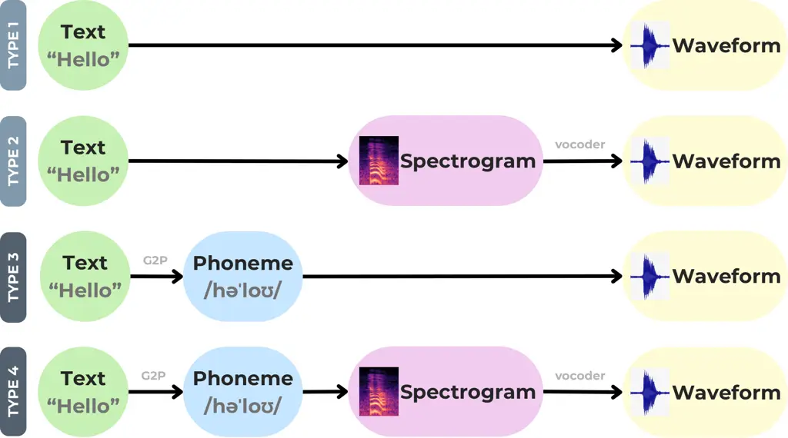
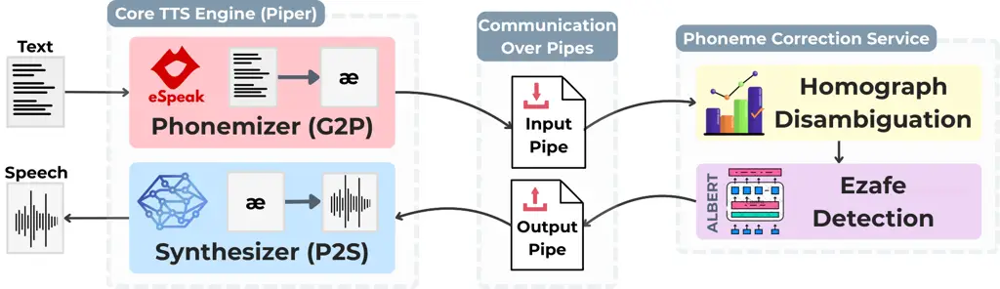
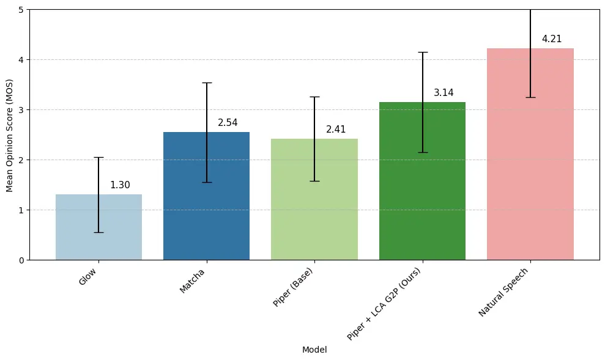
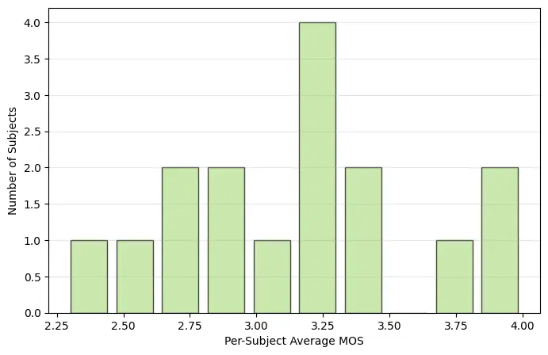
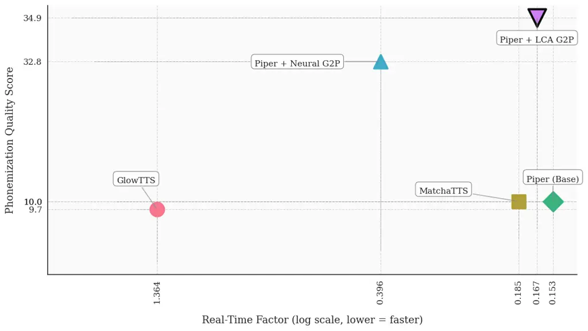

# Beyond Unified Models: A Service-Oriented Approach to Low Latency, Context Aware Phonemization for Real Time TTS

Mahta Fetrat    Donya Navabi    Zahra Dehghanian    Morteza Abolghasemi
Affiliation: Hamid R. Rabiee Affiliation: Sharif University of
Technology / Tehran, Iran Affiliation: Correspondence:rabiee@sharif.edu

###### Abstract

Lightweight, real-time text-to-speech systems are crucial for
accessibility. However, the most efficient TTS models often rely on
lightweight phonemizers that struggle with context-dependent challenges.
In contrast, more advanced phonemizers with a deeper linguistic
understanding typically incur high computational costs, which prevents
real-time performance.

This paper examines the trade-off between phonemization quality and
inference speed in G2P-aided TTS systems, introducing a practical
framework to bridge this gap. We propose lightweight strategies for
context-aware phonemization and a service-oriented TTS architecture that
executes these modules as independent services. This design decouples
heavy context-aware components from the core TTS engine, effectively
breaking the latency barrier and enabling real-time use of high-quality
phonemization models. Experimental results confirm that the proposed
system improves pronunciation soundness and linguistic accuracy while
maintaining real-time responsiveness, making it well-suited for offline
and end-device TTS applications.

## 1 Introduction

Text-to-speech (TTS) conversion is a long-established and well-developed
task, with a wide range of approaches and architectures proposed over
the years. The choice or design of a particular TTS method today depends
largely on the specific needs and requirements of the application.

One essential use case for TTS is in screen readers, where the system
must operate in real-time, offline, on low-end hardware devices. Users
in this setting are exposed to the synthesized voice for long periods
every day, so the output must not sound robotic or unpleasant. This
scenario imposes three main requirements on the TTS engine: 1)
Lightweightness, 2) Real-time performance, and 3) Naturalness.

Unfortunately, there is a clear trade-off among these requirements.
Larger and more complex neural models often produce highly natural,
human-like speech but require significantly more computational resources
and introduce higher inference latency. Conversely, smaller neural
models, or traditional rule-based, non-neural systems, are much faster
and lighter but lack the capacity to model smooth, natural-sounding
human speech.

Simply reducing model size to meet speed and lightweight requirements
often degrades speech naturalness. Many recent systems, however,
maintain acceptable naturalness by decoupling grapheme-to-phoneme (G2P)
conversion from phoneme-to-speech (P2S) synthesis (OHF-Voice, 2025;
Mehta et al., 2024; Li et al., 2025). Instead of learning an end-to-end
text-to-speech mapping, these systems first convert text to phonemes
using a lightweight G2P module, then generate speech from the phoneme
sequence with a neural synthesizer. This allows the neural component to
focus on a narrower task, enabling smaller models and faster inference
while preserving reasonable quality.

However, this decoupling makes the overall naturalness and
intelligibility of the output heavily dependent on the performance of
the G2P module, a task that remains highly challenging for languages
with complex or ambiguous phonemization rules.

For example, in Persian, many cases require context-aware phonemization.
Two major challenges are:

1.  1.  Homographs, i.e., words with multiple valid pronunciations depending
        on context (e.g., the English word read, pronounced either
        \textipa/ri:d/ or \textipa/rEd/ depending on tense), and
2.  2.  The Ezafe phoneme, a connecting /e/ sound that appears between
        grammatically or semantically related words, again determined by
        context.

Figure 1 illustrates how the presence or absence of a single Ezafe
phoneme can alter the meaning of a sentence, highlighting the importance
of correctly determining it based on context.

Figure 1: An example of how the Persian Ezafe phoneme (/e/) can change
the meaning of a sentence.

Highly non-phonetic and ambiguous languages pose a challenge for
lightweight, real-time TTS systems. While embedding a strong,
context-aware G2P model could greatly improve pronunciation soundness
and correctness, such models are typically large neural networks, and
integrating them directly would compromise speed and efficiency.
Existing lightweight TTS architectures decouple G2P from P2S, but their
G2P modules remain limited for ambiguous languages. Enhancing these
modules with context-aware neural models introduces the very latency and
computational overhead that lightweight TTS aims to avoid. this is the
central challenge addressed in this paper.

In this paper, we propose a method to overcome the latency barrier for
incorporating context-aware phonemizers into real-time TTS systems. Our
approach combines two complementary strategies: lightweight,
statistically driven modules that provide partial context-awareness, and
a service-oriented architecture that allows heavier neural phonemizers
to run independently, without embedding them directly in the TTS
runtime. The core idea is to move beyond the traditional unified TTS
design by treating utility modules as independent services, which the
main TTS engine can query as needed, avoiding their computational and
loading overhead.

Key contributions of this work are as follows:

1.  1.  Proposing a service-oriented approach for integrating neural
        components into real-time TTS systems,
2.  2.  Presenting a service-oriented adaptation of the well-known PiperTTS
        architecture,
3.  3.  Introducing a lightweight, fast, and context-aware phonemizer
        tailored to Persian phonemization challenges, an enhanced version of
        the existing eSpeak phonemizer, and
4.  4.  Providing a new Persian voice for Piper, trained on the largest
        publicly available Persian TTS dataset to date.

## 2 Related Works

### 2.1 TTS approaches

TTS is a longstanding task that has been in existence since 1939 Dudley
et al. (1939). It began with rule-based methods that utilized
hand-written pronunciation and prosody rules, along with simple
formant/articulatory synthesis, to generate speech Klatt (1980); Klatt
(1987). Then it proceeded to the next generation, utilizing
concatenative unit-selection Sagisaka (1988); Hunt and Black (1996);
Black and Taylor (1997) and later statistical parametric systems (e.g.,
HMM-based acoustic models with vocoders) Tokuda et al. (2000); Zen et
al. (2009), which improved stability and footprint but still had
limitations in terms of naturalness. Like many other tasks, it then
evolved into deep-learning-based methods like sequence-to-sequence
acoustic models (Tacotron-style) Wang et al. (2017); Shen et al. (2018)
paired with neural vocoders (WaveNet/flow/GAN) Van Den Oord et al.
(2016); Prenger et al. (2019); Yamamoto et al. (2020) and fully
end-to-end models such as VITS Kim et al. (2021) and non-autoregressive
FastSpeech-style models Ren et al. (2019); Ren et al. (2020); these can
be grouped by architecture families (autoregressive, non-autoregressive,
flow-based, diffusion-based) Kim et al. (2020); Popov et al. (2021); Kim
et al. (2022); Mehta et al. (2024). And most recently, it is performed
by large language models, such as commercial or research foundation TTS
systems (e.g., VALL-E/Bark-style and TTS components integrated into
general LLM stacks) Wang et al. (2023); Le et al. (2023), which offer
strong quality but usually require online GPU inference.

In this paper, our focus is on TTS architectures suitable for offline,
real-time, end-device applications. Therefore, we limit our discussion
to models that can operate efficiently in CPU-first, low-latency
settings.

In practice, we can narrow our focus to TTS architectures that include a
distinct phonemization stage. Broadly, modern TTS systems can be
categorized into four levels of architectural granularity (Figure 2). At
one extreme, fully end-to-end models map raw text directly to waveform;
at the other, highly modular pipelines decompose the task into explicit
stages: first converting text to phonemes, then generating a
spectrogram, and finally synthesizing the waveform through a vocoder.
Understanding the degree of granularity in a given TTS architecture
provides insight into the complexity of the problem the model must
solve, the capacity it may require, and the latency implications of its
intermediate components. This perspective is essential when selecting an
appropriate model for applications with constraints such as low-latency
or limited compute.



Figure 2: Four common granularity levels in TTS architectures, differing
by intermediate representations.

VITS, FastSpeech-family models, Glow-TTS, and other flow-based systems,
as well as recent diffusion/consistency approaches (e.g., Matcha-like
designs), are the most relevant to our goals Kim et al. (2021); Ren et
al. (2019); Ren et al. (2020); Kim et al. (2020); Mehta et al. (2024);
Rhasspy Team (2023).In summary: VITS merges acoustic modeling and
vocoding and offers good quality with low-latency; FastSpeech generates
spectrograms in parallel and is very fast with a light vocoder;
flow-based models enable stable alignments and parallel inference;
diffusion/consistency models improve robustness and quality with careful
inference schedules Kim et al. (2021); Ren et al. (2019); Kim et al.
(2020); Mehta et al. (2024); Li et al. (2023).

Piper architecture, which is the baseline model in this study, is
closely related to these families and is based on VITS with practical
improvements for deployment ZachB100 (2023). It uses a modular structure
with a G2P front-end and a phoneme-to-speech (P2S) neural back-end. By
moving the G2P step outside the neural model (typically using a
lightweight rule-based phonemizer such as eSpeak-ng eSpeak NG developers
(2013)) and exporting models to ONNX for CPU-friendly inference, Piper
reduces model size, and improves speed while maintaining acceptable
naturalness. For a more detailed justification for choosing Piper as our
baseline, please refer to Appendix A.

### 2.2 G2P Tools

Since a central focus of this study is enhancing the G2P component of a
TTS system, we briefly review the relevant literature and available
tools.

G2P methods have evolved in parallel with TTS systems. Early rule-based
approaches and pronunciation lexicons were compact and predictable but
struggled with out-of-vocabulary words and context-dependent
pronunciations. Statistical methods such as finite-state and n-gram
letter-to-sound models and CRF-based taggers generalized better while
remaining relatively lightweight Beesley and Karttunen (2003); Bisani
and Ney (2008); Jiampojamarn et al. (2007). Neural models, including
RNNs and Transformers, have since achieved state-of-the-art accuracy by
capturing longer-range dependencies Yao and Zweig (2015); Vaswani et al.
(2017), but they typically require more compute and memory than
lightweight statistical or rule-based methods Park (2019).

In the case of Persian, several non-scholarly G2P implementations exist
on platforms such as GitHub (Dehghani, 2022; Pascal, 2020; Rabiee, 2019;
Ajini, 2022; Mortensen et al., 2018; Alipour, 2023). A recent benchmark
study evaluated these tools and found their performance to be
unsatisfactory, reporting phoneme error rates (PER) between 15-50%,
homograph disambiguation accuracy below random baseline, and Ezafe
detection F1 scores ranging from 6-60% (Qharabagh et al., 2025b).
Subsequently, a Persian LLM-powered G2P model was introduced that
substantially improved these metrics (Qharabagh et al., 2025b).
Nevertheless, such models are not suitable for free, offline, or
real-time use, the key constraints of our target applications.

Building on those findings, another study leveraged the outputs of the
LLM-based system to create a new dataset and train two open-source,
offline G2P models (Qharabagh et al., 2025a): Homo-GE2PE (Fetrat, 2025a)
and HomoFast eSpeak (Fetrat, 2025b). Homo-GE2PE is a high-quality neural
G2P model that performs well across PER, homograph disambiguation, and
Ezafe detection. HomoFast eSpeak, in contrast, is entirely non-neural
and extremely fast, achieving good PER and homograph accuracy but
offering limited Ezafe detection capability due to its lack of
linguistic modeling.

### 2.3 Decoupled TTSs

To the best of our knowledge, no prior work has proposed structuring a
TTS system so that some of its internal submodules operate as
independent services to take advantage of modular decoupling. While
several studies and open-source projects provide complete TTS systems as
API-based services Black et al. (2004); MARYTTS (2022); Pipecat AI
(2024); LlamaEdge contributors (2024), this should not be confused with
the approach presented here.

Our work differs fundamentally from these systems: rather than exposing
the entire synthesizer as a remote service, we implement a service-based
decomposition within the TTS pipeline itself. This design decouples
computationally heavy, higher-latency modules, such as context-aware
phonemization components, from the lightweight inference core, improving
overall responsiveness and enabling real-time performance.

## 3 Methodology

As discussed earlier, our baseline system is Piper, which adopts a
two-stage pipeline (Type 3 granularity in Figure 2): (1) a
text-to-phoneme conversion step implemented with the eSpeak phonemizer,
followed by (2) a neural phoneme-to-speech (P2S) model that synthesizes
the waveform without a separate vocoder. The primary focus of this work
is to strengthen the first stage by introducing context-aware
phonemization and to address the practical challenges that arise when
integrating this improved G2P component into the complete TTS pipeline.



Figure 3: The proposed service-based architecture for context-aware TTS.

The default phonemizer in PiperTTS, eSpeak, is a rule-based system
relying on dictionary lookups and hardcoded linguistic rules. This
design introduces weaknesses for languages that require context-aware
phonemization, particularly in handling homograph disambiguation and
Ezafe detection in Persian. We propose two complementary families of
solutions to address these challenges.

### 3.1 Statistical Context-Awareness

Context-awareness can be introduced in lightweight TTS systems using
simple statistical methods. Certain phonemization tasks, such as
homograph disambiguation, can be addressed with shallow contextual
statistics instead of heavy neural models.

Qharabagh et al. (2025a) showed that a method based on word
co-occurrence distributions can improve homograph disambiguation
accuracy by up to 30 percentage points. Their approach constructs a
database of homographs and their commonly associated context words,
selecting the pronunciation with the highest contextual overlap for a
given input. We adopt this lightweight strategy to enhance PiperTTS’s
phonemizer without adding computational overhead or latency.

### 3.2 Distilled Linguistic Knowledge

Certain aspects of phonemization require deeper linguistic
understanding, such as detecting the Ezafe phoneme, which depends on
grammatical and semantic relations between words. However, full-scale
language understanding is not necessary for this task. Task-specific,
lightweight neural models can be effectively trained via knowledge
distillation from larger models.

In our case, Ezafe detection can be viewed as a subtask of
part-of-speech (POS) tagging. The SpaCy POS tagger for Persian (Roshan, 2023) is reported to achieve an F1 score of 0.99298 on Ezafe tagging but
is relatively heavy and slow during inference (Table 2). To obtain a
lighter alternative, we distilled the Ezafe tagging knowledge of the
SpaCy model into a smaller model based on ALBERT (Lan et al., 2019).

We created a labeled dataset from the text portion of the ManaTTS corpus
(Qharabagh et al., 2025c) by automatically annotating Ezafe tags using
the SpaCy tagger’s predictions. A pretrained Persian ALBERT model
(HooshvareLab, 2021) was then fine-tuned on this data, producing a
smaller, faster model with performance nearly comparable to the original
tagger (Table 2). For efficient CPU-based inference and reduced memory
usage, the distilled model was exported to ONNX.

### 3.3 Service-Based Integration

When all components of a TTS system are integrated into a single unified
runtime, the individual loading and inference delays of each module
accumulate, resulting in a significant overall latency. To overcome this
bottleneck, we adopted a service-oriented architecture, setting up
utility modules as independent, persistent services running in separate
processes. The core TTS module communicates with these services using
inter-process communication (IPC) via piped input and output files. This
design decouples the initialization of independent modules and
significantly reduces latency during inference.

In our setup, the context-aware phonemization components operate as a
dedicated service, with the core TTS engine interacting through two file
pipes (input and output). For each input text, the core TTS module first
generates an initial phoneme sequence using its default phonemizer
(PiperTTS’s eSpeak-based component). This sequence is then sent to the
context-aware phonemization service, where it undergoes two refinement
stages: the homograph disambiguation module corrects potential
mispronunciations, and the Ezafe detection model inserts any missing
Ezafe phonemes. The enhanced phoneme sequence is then returned to the
core TTS engine and passed to the phoneme-to-speech model, which
synthesizes the final audio output. Figure 3 illustrates this
service-based setup for the context-aware TTS proposed in this study.

Finally, we fine-tuned the P2S model on the phoneme sequences produced
by the enhanced phonemizer. Fine-tuning was carried out for 1,000 epochs
with a batch size of 32 on a workstation equipped with an NVIDIA
A100-SXM4 GPU (80 GB) and an Intel Xeon Platinum 8380 CPU with 1 TB of
system memory, using the Persian ManaTTS dataset (Qharabagh et al.,
2025c). This step was crucial for enabling the model to correctly handle
Ezafe phonemes and to distinguish between homographs that differ by only
a few phonemes, rather than biasing toward the most frequent
pronunciations observed in baseline models.

|                             |                    |                    |                       |                     |                     |
| --------------------------- | ------------------ | ------------------ | --------------------- | ------------------- | ------------------- |
| Model                       | PER                | Ezafe F1           | Homograph             | RTF $`\downarrow`$  |                     |
|                             | (% $`\downarrow`$) | (% $`\uparrow`$)   | Acc. (% $`\uparrow`$) | Direct Call         | Service-Based       |
| MatchaTTS (Mahmoudi, 2025)  | 6.32 $`\pm`$ 0.00  | 19.58 $`\pm`$ 0.00 | 43.87 $`\pm`$ 0.00    | 0.185 $`\pm`$ 0.051 | –                   |
| GlowTTS (Kamtera, 2023)     | 6.61 $`\pm`$ 0.00  | 19.96 $`\pm`$ 0.00 | 43.87 $`\pm`$ 0.00    | 1.364 $`\pm`$ 0.705 | –                   |
| Piper (Base) (Karimi, 2024) | 6.32 $`\pm`$ 0.00  | 19.58 $`\pm`$ 0.00 | 43.87 $`\pm`$ 0.00    | 0.153 $`\pm`$ 0.012 | –                   |
| Piper + Neural G2P          | 4.95 $`\pm`$ 0.68  | 87.70 $`\pm`$ 0.78 | 74.53 $`\pm`$ 0.39    | 3.840 $`\pm`$ 0.415 | 0.396 $`\pm`$ 0.095 |
| Piper + LCA G2P             | 4.80 $`\pm`$ 1.06  | 90.08 $`\pm`$ 0.72 | 77.67 $`\pm`$ 0.22    | 5.519 $`\pm`$ 0.984 | 0.167 $`\pm`$ 0.015 |

Table 1: Comparison of phonemization accuracy and inference speed across
baseline and proposed TTS models.

|                      |                           |                     |                     |                    |                     |
| -------------------- | ------------------------- | ------------------- | ------------------- | ------------------ | ------------------- |
| Model                | Params                    | Memory              | Disk                | Ezafe F1           | Avg. Inf. Time      |
|                      | (Millions $`\downarrow`$) | (MB $`\downarrow`$) | (MB $`\downarrow`$) | (% $`\uparrow`$)   | (s $`\downarrow`$)  |
| SpaCy (Roshan, 2023) | 162.84                    | 621.19              | 1258.49             | 97.67 $`\pm`$ 0.00 | 0.110 $`\pm`$ 0.004 |
| ALBERT-based (Ours)  | 11.09                     | 42.32               | 41.38               | 94.19 $`\pm`$ 0.00 | 0.037 $`\pm`$ 0.001 |

Table 2: Comparison between the SpaCy teacher model and the distilled
ALBERT-based Ezafe detector.

## 4 Experiments

In this section, we evaluate how the proposed context-aware
phonemization modules improve a rule-based phonemizer’s accuracy and
affect inference speed. While context-aware modules enhance
phonemization quality, they also introduce additional computational load
that can increase latency. We therefore assess their performance within
our service-based framework, which decouples these heavier components
and restores real-time operation without compromising phonemization
improvements.

Our enhanced system, Piper equipped with the proposed lightweight
context-aware phonemization components, is referred to as "Piper +
LCA-G2P", where LCA stands for Lightweight Context-Aware. To demonstrate
the framework’s ability to handle heavier models, we also integrated the
state-of-the-art Persian G2P model, Homo-GE2PE (Qharabagh et al.,
2025a), which handles both homograph disambiguation and Ezafe detection.
This setup, "Piper + Neural G2P", uses a substantially larger model
(300M parameters) compared to Piper’s lightweight 15-20M parameters,
showing that the framework can accommodate computationally intensive
neural components while maintaining real-time performance.

All experiments evaluating real-time factor (RTF)¹¹ 1 RTF, or real-time
factor, is the ratio of audio synthesis time to the duration of the
generated audio. For instance, an RTF of 0.2 indicates synthesis five
times faster than real-time. were conducted on a typical end-device
configuration: a Windows system with a 12th Gen Intel Core i7-1255U CPU
(10 cores, 1.7 GHz) and 16 GB of RAM, running CPU-only inference. This
setup demonstrates the system’s suitability for offline, low-latency,
and real-time applications, without relying on GPU acceleration. The
results are summarized in Table 1.

### 4.1 Mean Opinion Score

The enhanced soundness and context-awareness of the phonemization
process, along with the subsequent fine-tuning of the phoneme-to-speech
(P2S) engine, are expected to improve the overall naturalness of the
generated speech. Table 3 presents the Mean Opinion Score (MOS) results
for the baseline and enhanced TTS systems, as well as the reference
natural speech.

Table 3 shows the average Mean Opinion Score (MOS) for the baseline and
enhanced TTS systems, alongside natural speech, based on evaluations
from 16 native Persian speakers across seven utterances. For full
details of the experiment, please refer to Appendix B.

|                             |                   |
| --------------------------- | ----------------- |
| Source                      | MOS $`\uparrow`$  |
| Glow (Kamtera, 2023)        | 1.30 $`\pm`$ 0.75 |
| Matcha (Mahmoudi, 2025)     | 2.54 $`\pm`$ 0.99 |
| Piper (Base) (Karimi, 2024) | 2.41 $`\pm`$ 0.84 |
| Piper + LCA G2P (Ours)      | 3.14 $`\pm`$ 1.00 |
| Natural Speech              | 4.21 $`\pm`$ 0.97 |

Table 3: MOS of the baseline and enhanced TTS system compared to natural
speech.

### 4.2 Ezafe Detection Module Evaluation

This section presents the experiments conducted on the distilled Ezafe
detection module, demonstrating that it achieves a substantial reduction
in size and computational overhead while retaining the strong
performance of its teacher model. All experiments were conducted on a
CPU environment in Google Colab. The results are summarized in Table 2.

## 5 Conclusion

This study addressed the fundamental trade-off between speed,
lightweightness, and context-aware phonemization in G2P-aided TTS
systems. We proposed practical approaches to mitigate this challenge,
including methods for developing auxiliary context-aware modules that
are inherently lighter and faster, as well as introducing a
service-based architecture that enables their efficient integration into
real-time TTS pipelines.

The proposed framework demonstrated that it is possible to achieve
enhanced phonemization accuracy without compromising real-time
performance. By decoupling heavy context-aware components from the core
runtime and executing them as independent services, the system
maintained low-latency while significantly improving the overall
soundness of the synthesized speech. These characteristics make the
architecture particularly suitable for offline, end-device, and
low-latency applications such as screen readers.

All source code, models, and experimental results from this work are
publicly available. ²² 2
[https://github.com/MahtaFetrat/Piper-with-LCA-Phonemizer](https://github.com/MahtaFetrat/Piper-with-LCA-Phonemizer)

## Limitations

Even with fully corrected phoneme sequences in the TTS system, achieving
complete naturalness remains out of reach. This is primarily because
lightweight TTS models have limited capacity in the phoneme-to-speech
component, which is typically insufficient to fully capture or reproduce
higher-level prosodic and expressive features. As a result, the overall
perceived naturalness cannot reach its maximum potential. Further
research is needed to improve these aspects of naturalness while
maintaining the desired properties of speed and lightweight design.

Another consideration is that, from a perceptual standpoint, naturalness
is more closely associated with qualities such as smoothness,
noiselessness, and accurate intonation and stress patterns. Correct
phonemization primarily affects pronunciation soundness and only
indirectly contributes to perceived naturalness. It may therefore be
valuable to design subjective evaluation protocols that separate the
assessment of phonemization accuracy from other dimensions of
naturalness, such as prosody and fluency.

Another limitation, or rather an avenue for future enhancement, lies in
the service-based setup itself. Now that several components are
decoupled from the core TTS engine, additional optimization strategies
can be applied to the service layer. For example, implementing
request-level parallelism or asynchronous processing could further
reduce overall system latency and improve scalability.

## References

- Ajini (2022) M. H. S. Ajini Attention based grapheme to phoneme. Note:
  Accessed: 2025-11-17 External Links:
  [Link](https://github.com/mohamad-hasan-sohan-ajini/G2P) Cited by:
  §2.2.
- Alipour (2023) S. Alipour Persian grapheme to phoneme with
  transformer. Note: Accessed: 2025-11-17 External Links:
  [Link](https://github.com/sajadalipour7/Persian-Grapheme-To-Phoneme-With-Transformer)
  Cited by: §2.2.
- Beesley and Karttunen (2003) K. R. Beesley and L. Karttunen
  Finite-state morphology: xerox tools and techniques. CSLI, Stanford,
  pp. 359–375. Cited by: §2.2.
- Bisani and Ney (2008) M. Bisani and H. Ney Joint-sequence models for
  grapheme-to-phoneme conversion. Speech communication 50 (5),
  pp. 434–451. Cited by: §2.2.
- Black and Taylor (1997) A. W. Black and P. A. Taylor Automatically
  clustering similar units for unit selection in speech synthesis..
  Cited by: §2.1.
- Black et al. (2004) A. W. Black P. Taylor et al. Festival speech
  synthesis system: server/client api. Note: Section 28.3: BSD socket
  server; long-lived synthesis process External Links:
  [Link](https://www.cstr.ed.ac.uk/projects/festival/manual/festival_28.html)
  Cited by: §2.3.
- Dehghani (2022) H. Dehghani Persian_phonemizer: a tool for translating
  persian text to ipa. Note: Accessed: 2025-11-17 External Links:
  [Link](https://github.com/de-mh/persian%5C_phonemizer) Cited by: §2.2.
- Dudley et al. (1939) H. Dudley, R. R. Riesz, and S. S. Watkins A
  synthetic speaker. Journal of the Franklin Institute 227 (6),
  pp. 739–764. Cited by: §2.1.
- eSpeak NG developers (2013) eSpeak NG developers ESpeak NG
  text-to-speech engine. Note: GitHub repositoryAccessed: 2025-11-17
  External Links: [Link](https://github.com/espeak-ng/espeak-ng) Cited
  by: §2.1.
- Fetrat (2025a) M. Fetrat Homo-ge2pe-persian: persian
  grapheme-to-phoneme conversion with homograph disambiguation. Note:
  Accessed: 2025-11-08 External Links:
  [Link](https://github.com/MahtaFetrat/Homo-GE2PE-Persian/) Cited by:
  §2.2.
- Fetrat (2025b) M. Fetrat HomoFast-espeak-persian: a homograph-aware
  persian g2p extension of espeak ng. Note: Accessed: 2025-11-08
  External Links:
  [Link](https://github.com/MahtaFetrat/HomoFast-eSpeak-Persian) Cited
  by: §2.2.
- HooshvareLab (2021) HooshvareLab ALBERT-persian: a lite bert for
  self-supervised learning of language representations for the persian
  language. Note: Model: albert-fa-zwnj-base-v2. Accessed: 2025-11-07
  External Links:
  [Link](https://huggingface.co/HooshvareLab/albert-fa-zwnj-base-v2)
  Cited by: §3.2.
- Hunt and Black (1996) A. J. Hunt and A. W. Black Unit selection in a
  concatenative speech synthesis system using a large speech database.
  In 1996 IEEE international conference on acoustics, speech, and signal
  processing conference proceedings, Vol. 1, pp. 373–376. Cited by:
  §2.1.
- Jiampojamarn et al. (2007) S. Jiampojamarn, G. Kondrak, and T. Sherif
  Applying many-to-many alignments and hidden markov models to
  letter-to-phoneme conversion. In Human Language Technologies 2007: The
  Conference of the North American Chapter of the Association for
  Computational Linguistics; Proceedings of the Main Conference,
  pp. 372–379. Cited by: §2.2.
- Kamtera (2023) Kamtera Persian-tts-female-glow_tts: single-speaker
  female persian text-to-speech model. Note: Accessed: 2025-11-07
  External Links:
  [Link](https://huggingface.co/Kamtera/persian-tts-female-glow_tts)
  Cited by: Table 1, Table 3.
- Karimi (2024) S. Karimi Persian-text-to-speech: persian text-to-speech
  model. Note: Accessed: 2025-11-17 External Links:
  [Link](https://huggingface.co/SadeghK/persian-text-to-speech) Cited
  by: Table 1, Table 3.
- Kim et al. (2022) H. Kim, S. Kim, and S. Yoon Guided-tts: a diffusion
  model for text-to-speech via classifier guidance. In International
  Conference on Machine Learning, pp. 11119–11133. Cited by: §2.1.
- Kim et al. (2020) J. Kim, S. Kim, J. Kong, and S. Yoon Glow-tts: a
  generative flow for text-to-speech via monotonic alignment search.
  Advances in Neural Information Processing Systems 33, pp. 8067–8077.
  Cited by: §2.1, §2.1.
- Kim et al. (2021) J. Kim, J. Kong, and J. Son Conditional variational
  autoencoder with adversarial learning for end-to-end text-to-speech.
  In International Conference on Machine Learning, pp. 5530–5540. Cited
  by: §2.1, §2.1.
- Klatt (1980) D. H. Klatt Software for a cascade/parallel formant
  synthesizer. the Journal of the Acoustical Society of America 67 (3),
  pp. 971–995. Cited by: §2.1.
- Klatt (1987) D. H. Klatt Review of text-to-speech conversion for
  english. The Journal of the Acoustical Society of America 82 (3),
  pp. 737–793. Cited by: §2.1.
- Lan et al. (2019) Z. Lan, M. Chen, S. Goodman, K. Gimpel, P. Sharma,
  and R. Soricut Albert: a lite bert for self-supervised learning of
  language representations. arXiv preprint arXiv:1909.11942. Cited by:
  §3.2.
- Le et al. (2023) M. Le, A. Vyas, B. Shi, B. Karrer, L. Sari, R.
  Moritz, M. Williamson, V. Manohar, Y. Adi, J. Mahadeokar, et al.
  Voicebox: text-guided multilingual universal speech generation at
  scale. Advances in neural information processing systems 36,
  pp. 14005–14034. Cited by: §2.1.
- Li et al. (2025) Y. A. Li, C. Han, and N. Mesgarani Styletts: a
  style-based generative model for natural and diverse text-to-speech
  synthesis. IEEE Journal of Selected Topics in Signal Processing. Cited
  by: §1.
- Li et al. (2023) Y. A. Li, C. Han, V. Raghavan, G. Mischler, and N.
  Mesgarani Styletts 2: towards human-level text-to-speech through style
  diffusion and adversarial training with large speech language models.
  Advances in Neural Information Processing Systems 36, pp. 19594–19621.
  Cited by: §2.1.
- LlamaEdge contributors (2024) LlamaEdge contributors TTS-api-server:
  restful api server for piper (openai-compatible routes). Note: GitHub
  repositoryAccessed: 2025-11-17 External Links:
  [Link](https://github.com/LlamaEdge/tts-api-server) Cited by: §2.3.
- Mahmoudi (2025) A. Mahmoudi Khadijah-fa_en-matcha-tts-model: a
  persian/english text-to-speech model using matcha-tts. Note: Accessed:
  2025-11-17 External Links:
  [Link](https://huggingface.co/mah92/Khadijah-FA_EN-Matcha-TTS-Model)
  Cited by: Table 1, Table 3.
- MARYTTS (2022) MARY tts: an open-source, multilingual text-to-speech
  synthesis system Note: Accessed: 2025-11-16 External Links:
  [Link](https://github.com/marytts/marytts) Cited by: §2.3.
- Mehta et al. (2024) S. Mehta, R. Tu, J. Beskow, É. Székely, and G. E.
  Henter Matcha-tts: a fast tts architecture with conditional flow
  matching. In ICASSP 2024-2024 IEEE International Conference on
  Acoustics, Speech and Signal Processing (ICASSP), pp. 11341–11345.
  Cited by: §1, §2.1, §2.1.
- Mortensen et al. (2018) D. R. Mortensen, S. Dalmia, and P. Littell
  Epitran: precision g2p for many languages. In Proceedings of the
  Eleventh International Conference on Language Resources and Evaluation
  (LREC 2018), Cited by: §2.2.
- Navabi (2025) A. H. Navabi Persian-tts-piper: a hugging face space for
  persian text-to-speech using piper. Note: Accessed: 2025-11-07
  External Links:
  [Link](https://huggingface.co/spaces/gyroing/persian-tts-piper) Cited
  by: 3rd item.
- OHF-Voice (2025) OHF-Voice Piper1-gpl: fast and local neural
  text-to-speech engine. Note: Accessed: 2025-11-07 External Links:
  [Link](https://github.com/OHF-Voice/piper1-gpl) Cited by: Appendix A,
  §1.
- Omer (2025) M. Omer Sonata-nvda: a speech synthesizer driver for nvda
  using neural tts models. Note: Accessed: 2025-11-07 External Links:
  [Link](https://github.com/mush42/sonata-nvda) Cited by: 4th item.
- Park (2019) K. Park G2pE: a simple english grapheme-to-phoneme
  converter (seq2seq/transformer implementation). Note: GitHub
  repository External Links: [Link](https://github.com/Kyubyong/g2p)
  Cited by: §2.2.
- Pascal (2020) D. Pascal Simple persian (farsi) grapheme-to-phoneme
  converter. Note: Accessed: 2025-11-17 External Links:
  [Link](https://github.com/PasaOpasen/PersianG2P) Cited by: §2.2.
- Pipecat AI (2024) Pipecat AI PiperTTSService: self-hosted http server
  for piper tts. Note: Product documentationAccessed: 2025-11-17
  External Links:
  [Link](https://docs.pipecat.ai/server/services/tts/piper) Cited by:
  §2.3.
- Popov et al. (2021) V. Popov, I. Vovk, V. Gogoryan, T. Sadekova,
  and M. Kudinov Grad-tts: a diffusion probabilistic model for
  text-to-speech. In International conference on machine learning,
  pp. 8599–8608. Cited by: §2.1.
- Prenger et al. (2019) R. Prenger, R. Valle, and B. Catanzaro Waveglow:
  a flow-based generative network for speech synthesis. In ICASSP
  2019-2019 IEEE International Conference on Acoustics, Speech and
  Signal Processing (ICASSP), pp. 3617–3621. Cited by: §2.1.
- Qharabagh et al. (2025a) M. F. Qharabagh, Z. Dehghanian, and H. R.
  Rabiee Fast, not fancy: rethinking g2p with rich data and rule-based
  models. arXiv preprint arXiv:2505.12973. Cited by: §2.2, §3.1, §4.
- Qharabagh et al. (2025b) M. F. Qharabagh, Z. Dehghanian, and H. R.
  Rabiee LLM-powered grapheme-to-phoneme conversion: benchmark and case
  study. In ICASSP 2025-2025 IEEE International Conference on Acoustics,
  Speech and Signal Processing (ICASSP), pp. 1–5. External Links:
  [Document](https://dx.doi.org/10.1109/ICASSP49660.2025.10888370) Cited
  by: §2.2.
- Qharabagh et al. (2025c) M. F. Qharabagh, Z. Dehghanian, and H. R.
  Rabiee Manatts persian: a recipe for creating tts datasets for lower
  resource languages. In Proceedings of the 2025 Conference of the
  Nations of the Americas Chapter of the Association for Computational
  Linguistics: Human Language Technologies (Volume 1: Long Papers),
  pp. 9177–9206. Cited by: §3.2, §3.3.
- Rabiee (2019) A. Rabiee Persian g2p. GitHub. Note: GitHub
  repositoryAccessed: 2025-11-17 External Links:
  [Link](https://github.com/AzamRabiee/Persian%5C_G2P) Cited by: §2.2.
- Ren et al. (2020) Y. Ren, C. Hu, X. Tan, T. Qin, S. Zhao, Z. Zhao,
  and T. Liu Fastspeech 2: fast and high-quality end-to-end text to
  speech. arXiv preprint arXiv:2006.04558. Cited by: §2.1, §2.1.
- Ren et al. (2019) Y. Ren, Y. Ruan, X. Tan, T. Qin, S. Zhao, Z. Zhao,
  and T. Liu Fastspeech: fast, robust and controllable text to speech.
  Advances in neural information processing systems 32. Cited by: §2.1,
  §2.1.
- Rhasspy Team (2023) Rhasspy Team Piper: fast, local neural text to
  speech. Note: GitHub repository External Links:
  [Link](https://github.com/rhasspy/piper) Cited by: §2.1.
- Roshan (2023) Roshan Spacy_pos_tagger_parsbertpostagger. Note:
  Accessed: 2025-11-13 External Links:
  [Link](https://huggingface.co/roshan-research/spacy%5C_pos%5C_tagger%5C_parsbertpostagger)
  Cited by: §3.2, Table 2.
- Sagisaka (1988) Y. Sagisaka Speech synthesis by rule using an optimal
  selection of non-uniform synthesis units. In ICASSP-88., International
  Conference on Acoustics, Speech, and Signal Processing, pp. 679–682.
  Cited by: §2.1.
- Shen et al. (2018) J. Shen, R. Pang, R. J. Weiss, M. Schuster, N.
  Jaitly, Z. Yang, Z. Chen, Y. Zhang, Y. Wang, R. Skerrv-Ryan, et al.
  Natural tts synthesis by conditioning wavenet on mel spectrogram
  predictions. In 2018 IEEE international conference on acoustics,
  speech and signal processing (ICASSP), pp. 4779–4783. Cited by: §2.1.
- Tokuda et al. (2000) K. Tokuda, T. Yoshimura, T. Masuko, T. Kobayashi,
  and T. Kitamura Speech parameter generation algorithms for hmm-based
  speech synthesis. In 2000 IEEE international conference on acoustics,
  speech, and signal processing. Proceedings (Cat. No. 00CH37100), Vol.
  3, pp. 1315–1318. Cited by: §2.1.
- Van Den Oord et al. (2016) A. Van Den Oord, S. Dieleman, H. Zen, K.
  Simonyan, O. Vinyals, A. Graves, N. Kalchbrenner, A. Senior, K.
  Kavukcuoglu, et al. Wavenet: a generative model for raw audio. arXiv
  preprint arXiv:1609.03499 12, pp. 1. Cited by: §2.1.
- Vaswani et al. (2017) A. Vaswani, N. Shazeer, N. Parmar, J.
  Uszkoreit, L. Jones, A. N. Gomez, Ł. Kaiser, and I. Polosukhin
  Attention is all you need. Advances in neural information processing
  systems 30. Cited by: §2.2.
- Wang et al. (2023) C. Wang, S. Chen, Y. Wu, Z. Zhang, L. Zhou, S.
  Liu, Z. Chen, Y. Liu, H. Wang, J. Li, et al. Neural codec language
  models are zero-shot text to speech synthesizers. arXiv preprint
  arXiv:2301.02111. Cited by: §2.1.
- Wang et al. (2017) Y. Wang, R. Skerry-Ryan, D. Stanton, Y. Wu, R. J.
  Weiss, N. Jaitly, Z. Yang, Y. Xiao, Z. Chen, S. Bengio, et al.
  Tacotron: towards end-to-end speech synthesis. arXiv preprint
  arXiv:1703.10135. Cited by: §2.1.
- Yamamoto et al. (2020) R. Yamamoto, E. Song, and J. Kim Parallel
  wavegan: a fast waveform generation model based on generative
  adversarial networks with multi-resolution spectrogram. In ICASSP
  2020-2020 IEEE International Conference on Acoustics, Speech and
  Signal Processing (ICASSP), pp. 6199–6203. Cited by: §2.1.
- Yao and Zweig (2015) K. Yao and G. Zweig Sequence-to-sequence neural
  net models for grapheme-to-phoneme conversion. arXiv preprint
  arXiv:1506.00196. Cited by: §2.2.
- ZachB100 (2023) ZachB100 Piper training guide with screen reader.
  Note: GitHub repositoryAccessed: 2025-11-17 External Links:
  [Link](https://github.com/ZachB100/Piper-Training-Guide-with-Screen-Reader)
  Cited by: §2.1.
- Zen et al. (2009) H. Zen, K. Tokuda, and A. W. Black Statistical
  parametric speech synthesis. speech communication 51 (11),
  pp. 1039–1064. Cited by: §2.1.

## Appendix A Selection Criteria for PiperTTS

Considering the requirements of the TTS system in this study and the
models reviewed in the related work section, we found PiperTTS to be the
most suitable architecture for our needs. PiperTTS has been available
for several years and has gained significant community attention and
contributions (OHF-Voice, 2025). It exhibits several characteristics
that align with the requirements and objectives of this research:

- •
  Lightweightness: One of PiperTTS’s core strengths is its ability to
  run efficiently on CPUs and even low-end devices such as Raspberry Pi.
  Its ONNX runtime export enables lightweight deployment on various
  hardware platforms.
- •
  Speed: PiperTTS demonstrates high inference speed, achieving a
  real-time factor (RTF) of approximately 0.2.
- •
  Naturalness: The model provides medium to high perceptual quality, as
  verified through publicly available checkpoints (Navabi, 2025).
- •
  Accessibility Integration: PiperTTS has already been integrated into
  the open-source NVDA screen reader, which embeds TTS engines through
  add-ons called synthesizer drivers. An established Piper synthesizer
  driver is publicly available (Omer, 2025).
- •
  Open Source: Being open source, PiperTTS facilitates the development
  of accessible tools and enables contributions to a field that
  currently lacks substantial open research.
- •
  Persian Support: The model has an active Persian-speaking community,
  with available checkpoints and established Persian training setups.

Given these factors, PiperTTS was selected as the base TTS architecture
for this work.



Figure 4: Overall average MOS across all seven utterances for each TTS
system and natural speech, highlighting the improved naturalness of the
enhanced Piper system.

|             |       |                   |                   |                   |                   |                   |
| ----------- | ----- | ----------------- | ----------------- | ----------------- | ----------------- | ----------------- |
|             |       | Piper + LCA       | Natural           | Glow              | Matcha            | Piper (Base)      |
| Utterance 1 | MOS   | 2.94 $`\pm`$ 0.68 | 4.12 $`\pm`$ 0.50 | 1.19 $`\pm`$ 0.54 | 2.25 $`\pm`$ 0.77 | 2.38 $`\pm`$ 0.81 |
|             | Order | 5                 | 1                 | 2                 | 3                 | 4                 |
| Utterance 2 | MOS   | 3.75 $`\pm`$ 0.93 | 4.25 $`\pm`$ 1.00 | 2.00 $`\pm`$ 1.03 | 2.62 $`\pm`$ 1.09 | 2.38 $`\pm`$ 0.89 |
|             | Order | 3                 | 2                 | 4                 | 1                 | 5                 |
| Utterance 3 | MOS   | 3.19 $`\pm`$ 0.91 | 4.88 $`\pm`$ 0.34 | 1.12 $`\pm`$ 0.50 | 2.44 $`\pm`$ 0.96 | 2.12 $`\pm`$ 0.62 |
|             | Order | 4                 | 3                 | 2                 | 5                 | 1                 |
| Utterance 4 | MOS   | 2.81 $`\pm`$ 0.98 | 4.56 $`\pm`$ 1.03 | 1.12 $`\pm`$ 0.34 | 2.50 $`\pm`$ 1.03 | 2.19 $`\pm`$ 1.05 |
|             | Order | 2                 | 5                 | 4                 | 3                 | 1                 |
| Utterance 5 | MOS   | 2.62 $`\pm`$ 1.15 | 4.31 $`\pm`$ 0.70 | 1.19 $`\pm`$ 0.75 | 2.69 $`\pm`$ 1.08 | 3.00 $`\pm`$ 0.73 |
|             | Order | 2                 | 4                 | 1                 | 5                 | 3                 |
| Utterance 6 | MOS   | 3.69 $`\pm`$ 0.87 | 3.81 $`\pm`$ 1.22 | 1.25 $`\pm`$ 0.77 | 2.62 $`\pm`$ 1.02 | 2.62 $`\pm`$ 0.81 |
|             | Order | 2                 | 1                 | 5                 | 3                 | 4                 |
| Utterance 7 | MOS   | 3.00 $`\pm`$ 1.03 | 3.56 $`\pm`$ 1.15 | 1.25 $`\pm`$ 0.77 | 2.62 $`\pm`$ 1.09 | 2.19 $`\pm`$ 0.75 |
|             | Order | 1                 | 2                 | 4                 | 5                 | 3                 |

Table 4: Per-utterance MOS (mean $`\pm`$ std) for each source. “Order”
shows the presentation order (1–5) of the sources for that utterance
(randomized per utterance).



Figure 5: Distribution of MOS ratings assigned by participants to the
enhanced TTS system (Piper + LCA-G2P).



Figure 6: Trade-off between inference speed (RTF, log scale) and
phonemization quality (composite metric) for various TTS models. The
top-right region indicates models that are both fast and high-quality.

## Appendix B Mean Opinion Score Details

To evaluate perceived naturalness, we selected seven utterances from a
recent issue of the online monthly magazine _Nasl-e-Mana_, a publication
for the blind community and the source of the publicly available ManaTTS
dataset. The chosen issue contained content not included in the ManaTTS
corpus used for fine-tuning the phoneme-to-speech model.

For each utterance, audio was generated using five sources: two
open-source lightweight Persian TTS models (GlowTTS and MatchaTTS), the
baseline PiperTTS model, our enhanced Piper system, and the
corresponding natural speech recordings. The audio samples for all
utterances are provided in the repository’s samples directory. ³³ 3
[https://github.com/MahtaFetrat/Piper-with-LCA-Phonemizer](https://github.com/MahtaFetrat/Piper-with-LCA-Phonemizer)
To avoid bias based on overall model reputation or perceived quality,
the order of the five sources was independently shuffled for each
utterance.

Sixteen native Persian speakers were asked to rate the naturalness of
each audio clip on a scale from 1 to 5 (MOS), with 5 indicating the most
natural pronunciation. Participants were instructed as follows
(translated from Persian):

"Please listen to each audio clip and rate its naturalness on a scale
from 1 to 5. A score of 5 corresponds to fully natural pronunciation,
while a score of 1 corresponds to the least natural or highly robotic
pronunciation. Lower your rating if you detect any unnatural intonation,
mispronunciation, or mechanical quality."

The resulting overall MOS values, averaged across all utterances, are
shown in Figure 4. Detailed MOS results per utterance, including the
shuffled order of sources, are provided in Table 4. Standard deviations
are reported to reflect inter-subject variability. Additionally, the
distribution of MOS scores assigned to our enhanced model by individual
participants is illustrated in Figure 5.

## Additional Figures

Visualizing experimental findings can provide valuable insight. A
central concern of this study is the trade-off between inference speed
and phonemization quality: as the quality of TTS improves, especially
with the aid of context-aware and linguistically-informed phonemization
tools, inference typically becomes slower. Our work proposes a
service-based architecture that mitigates this trade-off, allowing
models to achieve both reasonable speed and improved phonemization
quality.

Figure 6 illustrates the performance of the evaluated models along two
axes: speed and quality. Inference speed is represented by the real-time
factor (RTF), displayed on a logarithmic scale. For quality, we define a
composite metric that combines the key context-aware phonemization
challenges studied in this work:

```math
\text{G2P\ Quality}=\frac{\text{Ezafe\ F1}+\text{Homograph\ Acc.}}{\text{PER}} \tag{1}
```

This formulation rewards higher Ezafe F1 and homograph accuracy while
penalizing higher phoneme error rate, providing an intuitive measure
aligned with our goals. The quality values are schematically arranged
for visualization, maintaining relative correctness.

In this plot, models that are both fast and high-quality appear in the
top-right corner. As expected, our proposed enhanced version, "Piper +
LCA-G2P", occupies this position, demonstrating that it maintains strong
inference speed while substantially improving phonemization quality.
