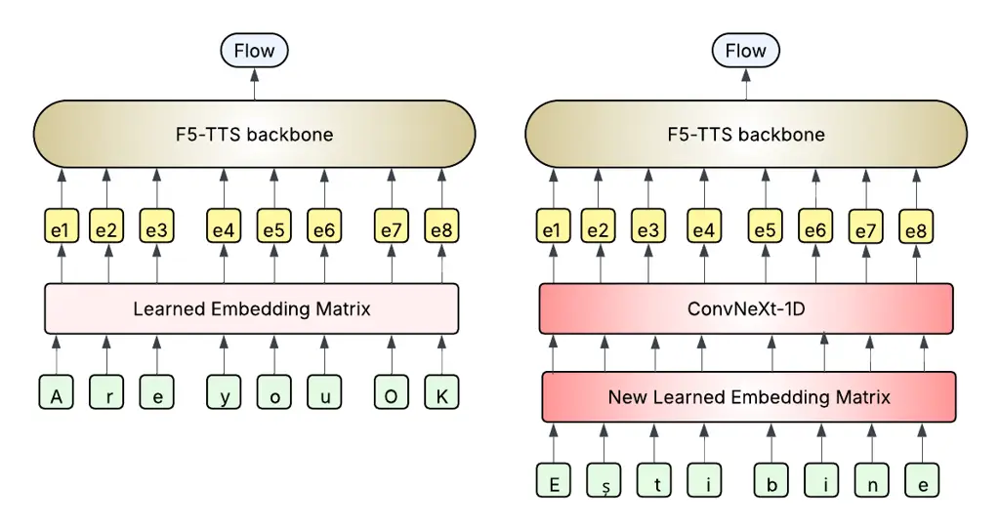
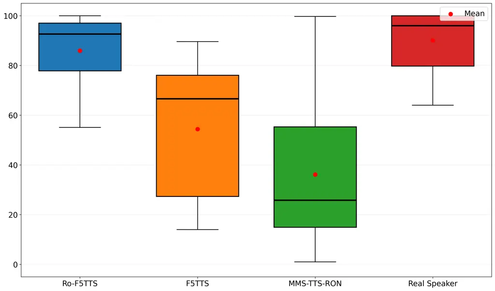
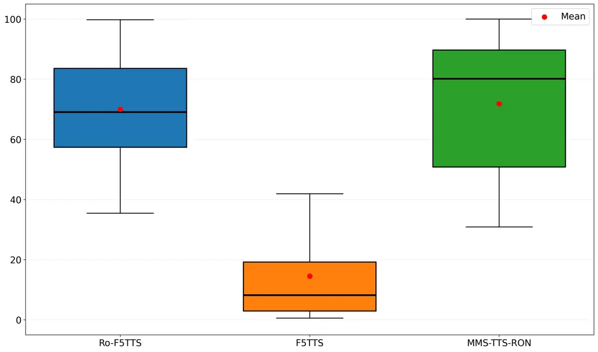
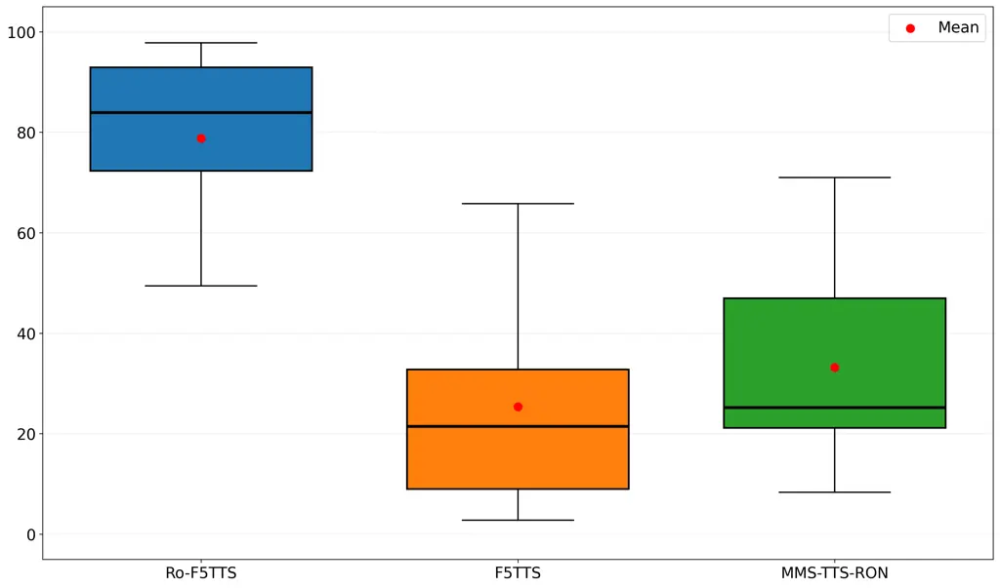

# F5-TTS-RO: EXTENDING F5-TTS TO ROMANIAN TTS VIA LIGHTWEIGHT INPUT ADAPTATION

RADU GABRIEL CHIVEREANU Affiliation: Research Institute for Artificial
Intelligence “Mihai Drăgănescu”  
radu.chivereanu@racai.ro, tibi@racai.ro    TIBERIU BOROS
Affiliation: Research Institute for Artificial Intelligence “Mihai
Drăgănescu”  
radu.chivereanu@racai.ro, tibi@racai.ro

###### Abstract

This work introduces a lightweight input-level adapter for the F5-TTS
model that enables Romanian Language support. To preserve the existing
capabilities of the model (voice cloning, English and Chinese support),
we keep the original weights frozen, append a sub-network to the model
and train it as an extension for the textual embedding matrix of the
text encoder. For simplicity, we rely on ConvNeXt module implemented in
F5-TTS to also model the co-dependencies between the new character-level
embeddings. The module serves as a “soft” letter-to-sound layer,
converting Romanian text into a continuous representation that the
F5-TTS model uses to produce naturally sounding Romanian utterances.

We evaluate the model with a pool of 20 human listeners across three
tasks: (a) audio similarity between reference and generated speech, (b)
pronunciation and naturalness and (c) Romanian-English code-switching.
The results indicate that our approach maintains voice cloning
capabilities and enables, to a certain extent, code-switching within the
same utterance; however, residual English accent characteristics remain.
We open-source our code and provide example audio samples at
https://github.com/racai-ro/Ro-F5TTS.

Keywords: TTS, machine learning, flow-matching, romanian, speech

## 1 Introduction

Text to speech (TTS) technology has advanced rapidly in recent years,
using a wide variety of architectures based on neural networks. Beyond
text-based conditioning, several approaches incorporate audio-based
conditioning to capture and reproduce speaker-specific characteristics
in synthesized speech, enabling zero-shot multi-speaker TTS (ZS-TTS)
\[2\] and effective voice cloning with limited access to speaker samples
(1-5 seconds of audio).

In this work, we focus on extending the F5-TTS model \[7\], an
open-source Non-Autoregressive generative framework, to the Romanian
language. F5-TTS builds upon E2-TTS \[8\], introducing a ConvNeXt module
for text encoding and a multimodal DiT module \[14\] as backbone. It
operates with characters as tokens, padded with filler tokens to match
the length of the mel spectrograms.

As a result, the model can be trained using only paired audio–text data,
without requiring additional fine-grained annotations. Moreover, F5-TTS
demonstrates strong capabilities in speaker identity cloning.

To adapt F5-TTS for the Romanian language, we introduce a lightweight
and non-invasive ConvNeXt based adapter that operates only at the input
level, leaving the model’s internal layers frozen. The adapter maps
Romanian characters into a continuous input space that the model can
process, effectively performing a soft letter-to-sound conversion while
leveraging and interpolating between the model’s previously learned
letter-to-latent representations.

Keeping the core model frozen also reduces the risk of overfitting to
speakers in the training set. An additional advantage of this approach
is its natural support for code-switching, which is the ability of a
model to speak two or more languages in the same utterance, an
increasingly important capability given the widespread prevalence of
bilingualism \[13\].

Our contribution is the following: We propose a simple and lightweight
adapter for F5-TTS that enables Romanian speech synthesis with
voice-cloning capabilities. We conduct subjective evaluations of speaker
similarity and pronunciation with a panel of 16 native speakers in three
distinct tasks. We perform objective evaluations using the Word Error
Rate (WER) on transcribed audio and measures of speaker similarity.

## 2 Related Work

State-of-the-art open-source zero-shot text-to-speech (ZS-TTS) systems,
such as \[4, 5, 7\], currently lack explicit support for Romanian.
Existing work on ZS-TTS for Romanian typically relies on adapting large
pretrained models and architectures to address data scarcity and related
challenges. For example, \[17\] extended the FastPitch architecture
\[23\] to Romanian and enabled multi-speaker synthesis by conditioning
on speaker embeddings extracted with TitaNet-L \[12\].

A central difficulty in adapting pretrained models to new tasks is
catastrophic forgetting, where fine-tuning degrades previously acquired
knowledge \[20\]. In the context of speech, several strategies have been
proposed, including model merging, experience replay, and adapter-based
approaches \[10, 19, 6, 21\]. Replay buffers are particularly effective,
but they depend on storing samples from prior training languages. In
contrast, our work focuses on adaptation using only new language data,
without retaining or revisiting past examples.

These adaptation strategies are also relevant in code-switching
scenarios, where maintaining knowledge of multiple languages is crucial.
Current methods typically leverage pretrained multilingual text encoders
\[22\] or explicit multi-language training \[3\]. Our approach instead
combines the input embedding matrix from previously learned languages
with the output of a newly trained input adapter. However, since the
model is not explicitly optimized to align embedding spaces, its
code-switching ability remains limited.

## 3 Proposed Methodology

Our method involves using a ConvNext module as an input level adapter to
align representations with the learned space of embeddings of the model.

### 3.1 Dataset

For our experiments we rely on the SWARA Speech Corpus \[18\], which
comprises over 21 hours of high-quality recordings from 17 speakers.
This dataset is particularly suitable for demonstrating that our adapter
retains speaker cloning capability, as its limited speaker diversity
presents a heightened risk of overfitting.

For evaluation, we used examples from the Common Voice 22.0 dataset
\[1\], the Romanian subset.

### 3.2 Model Architecture

To preserve the full capabilities of F5-TTS, we keep it frozen and train
only a lightweight module that maps the Romanian text input into the
input space of the model. Let $`x=(c_{1},c_{2},\dots,c_{T})`$ denote the
input Romanian text sequence of length $`T`$, where $`c_{i}`$ is a
character, and let $`E\in\mathbb{R}^{|V|\times d_{e}}`$ be the trainable
embedding layer. Each character is first assigned to a continuous
embedding vector
$`\mathbf{h}_{0}=E(x)=\big[E(c_{1}),E(c_{2}),\dots,E(c_{T})\big]\in\mathbb{R}^{T\times d_{e}}`$.
To model dependencies between character embeddings, we apply a ConvNeXt
architecture with 1D convolutions along the temporal dimension
(implementation from the F5-TTS repository), producing contextualized
embeddings
$`\mathbf{h}_{\text{ctx}}=\text{ConvNeXt}(\mathbf{h}_{0})\in\mathbb{R}^{T\times d_{h}}`$.

Finally, the output is fed into the frozen F5-TTS model to generate
speech: $`\hat{y}=\text{TTS}(\mathbf{h}_{\text{ctx}})`$. In short, the
entire pipeline is compactly represented as
$`\hat{y}=\text{TTS}(\text{ConvNeXt}(E(x)))`$. Figure 1 displays a
visual representation of our approach.



Figure 1: Overview of our method (right) compared to the original F5-TTS
approach (left). We replace the model’s initial character level
embedding matrix with a new learnable matrix with a ConvNeXt on top.

#### 3.2.1 Code Switching

We also evaluated the model’s ability to generate code-switching
examples between Romanian and English. Let
$`x=(c_{1},c_{2},\dots,c_{T})`$ be the input text sequence containing
Romanian and English characters, and let $`m_{R}`$ and $`m_{E}`$ be
masks indicating Romanian and English characters, respectively. We use
the special token ˜to signal language switching. The embeddings are
computed as follows:

```math
\mathbf{h}_{R}=\text{ConvNeXt}(E_{R}(x)\odot m_{R}),\quad\mathbf{h}_{E}=E_{\text{TTS}}(x\odot m_{E}),
```

where $`E_{R}`$ is the trainable embedding module for Romanian
characters and $`E_{\text{TTS}}`$ is the frozen embedding layer of the
TTS model for English characters. The final sequence is obtained by
merging the embeddings:

```math
\mathbf{h}_{\text{cs}}=\mathbf{h}_{R}+\mathbf{h}_{E},\quad\hat{y}_{\text{cs}}=\text{TTS}(\mathbf{h}_{\text{cs}}).
```

This approach is limited, as the language module and the model itself
were not explicitly optimized to handle embeddings that represent
English and Romanian at the same time. We evaluated the naturalness of
the approach in our experiments and found promising results.

### 3.3 Training

The training objective involved applying the original generative
flow-matching objective of F5-TTS to the SWARA Corpus. Hyperparameters
are shown in Table 1.

| Hyperparameter            | Value               |
| ------------------------- | ------------------- |
| Learning rate             | $`1\times 10^{-4}`$ |
| Steps                     | 40500               |
| Batch size (audio frames) | 16384               |
| Warmup updates            | 50                  |
| Max samples               | 128                 |

Table 1: Training hyperparameters

The training was executed with 1 NVidia A100 GPU, running for 12 hours.

## 4 Experiments

We conducted a series of experiments to evaluate the performance of our
solution. The tests are divided between an subjective evaluation
campaign (Section 4.1) using volunteers and an objective evaluation
metric (Section 4.2), namely the automatically computed word error rate
(WER) and speaker similarity.

### 4.1 Subjective Evaluation

For subjective evaluation, leveraging a pool of 16 native speakers we
defined three tasks: (a) speaker similarity; (b) naturalness and (c)
code-switching.

For comparison, we used MMS-TTS-RON, the Romanian checkpoint from the
Massively Multilingual Speech (MMS-TTS) project \[15\], along with the
base F5-TTS model. MMS-TTS-RON was chosen because it explicitly supports
Romanian, being a VITS \[11\] model trained on a Romanian corpus.

In the speaker similarity tests, we added samples from original
speakers. Thus, our low anchor (a system designed for lower-bound
normalization of the results) was the unmodified F5-TTS and for speaker
similarity, the original voice was used for high-bound normalization.

The testing procedure for each task consisted in selecting a list of
utterances that were synthesized or extracted from the dataset - for
cases where natural speech samples were used. In each evaluation step,
the listener would be presented with 3 (or 4) parallel samples,
generated by each system (respectively natural). The listener had to
evaluate the parallel samples with a score from 0 (Bad) to 100
(Excellent), not knowing the model used for synthesis.

In what follows, we detail the speaker similarity task in Subsection
4.1.1, the naturalness evaluation task in Subsection 4.1.2 and the
code-switching task in Subsection 4.1.3.

#### 4.1.1 Speaker Similarity

We evaluated 10 trials. Each trial consisted of the same sentence
synthesized by all tested TTS models, and the original speaker’s
recording was included as one of the stimuli. Participants were also
provided with a reference sample of the original speaker’s voice and
rated each stimulus based on how similar the voice and intonation were
to the reference. This setup allowed us to observe whether participants
could correctly identify the original recording among the synthesized
samples.

The prompt given for this task was: Please rate each audio sample
according to how similar the speaker sounds to the reference speaker.

We observed that users often found it challenging to correctly identify
the reference speaker among the stimuli. The results of each trial are
shown in Figure 2.



Figure 2: Results on speaker similarity task.

We observed that some of the listeners had difficulties identifying the
real speaker, with overall high scores for our model, which, even in
poor audio settings, still suggests that the model efficiently
encompasses speaker identity in generated output, in terms of speaking
style and voice timbre.

#### 4.1.2 Pronunciation and Naturalness

We tested 9 longer sentences to assess how accurately the speech was
pronounced and how natural it sounded. Table 2 displays the sentences
synthesized for the task.

| Sentence                                                                                                                                                 |
| -------------------------------------------------------------------------------------------------------------------------------------------------------- |
| Am avut astăzi o întâlnire foarte lungă cu clientul, care a durat aproape două ore, și am discutat multe detalii importante despre proiect.              |
| Poți să-mi trimiți și mie, te rog, documentul respectiv, ca să pot verifica toate informațiile înainte de întâlnirea de mâine?                           |
| Săptămâna aceasta vreau să mă relaxez acasă, să citesc ceva și poate să vizionez un film sau să mă uit la un serial interesant.                          |
| Este extrem de enervant când oamenii nu răspund la mesajele pe care le trimiți, mai ales dacă ai nevoie urgentă de informații.                           |
| Îți voi trimite un raport complet mâine dimineață, imediat după ce reușesc să vorbesc cu toți colegii implicați în proiect.                              |
| Nu sunt sigur dacă are sens, dar hai să încercăm oricum, chiar dacă există riscul să nu funcționeze perfect.                                             |
| A spus că termenul limită este vineri, dar sincer, nu cred că va termina tot ce și-a propus până atunci, așa că trebuie să verificăm împreună progresul. |
| Mă duc să iau o cafea de la cafenea și revin imediat, ca să putem continua discuția fără întreruperi.                                                    |
| Am avut o întâlnire foarte devreme dimineața și nu am avut timp nici măcar să mănânc, așa că am plecat de acasă cu stomacul gol.                         |

Table 2: Sentences used for evaluating pronunciation.

The results are shown in Figure 3.



Figure 3: Results on pronunciation and naturalness task.

In this task, the MMS-TTS-RON model achieved higher overall scores for
most sentences. Part of this result is due to listeners noticing an
English accent in certain examples, which affected their evaluation of
our model.

The prompt shown to the listeners was: Please rate each audio sample
based on the pronunciation of the words and how natural it sounds.

#### 4.1.3 Code Switching

We assessed the model’s ability to handle instances where both Romanian
and English are used within the same utterance, using 9 examples. Table
3 displays the code-switching examples included in our evaluation.

| Sentence                                                                 |
| ------------------------------------------------------------------------ |
| Am avut un call with the client today și a durat două ore.               |
| Poți să-mi trimiți și mie un link to that te rog?                        |
| Săptămâna asta vreau să mă relaxez and maybe watch a movie or something. |
| E super annoying când nu răspunde lumea la mail.                         |
| Îți fac un update pe mâine dimineață după ce vorbesc cu ei.              |
| Nu știu dacă are sens dar let’s try anyway.                              |
| A zis că deadline-ul pe vineri dar actually nu cred că termină.          |
| Mă duc să iau un coffee to go și vin imediat brother.                    |
| Am avut un meeting super early și nici nu am apucat să mănânc.           |

Table 3: Code-switching sentences used for evaluation.

Results of the evaluation are shown in Figure 4.



Figure 4: Results on Romanian-English code-switching task.

For code-switching, listeners were instructed as follows: Please rate
each audio sample based on how natural the transition between Romanian
and English is. While the results indicate potential, the tests were
limited in size. Further analysis is required, both from a qualitative
perspective, examining perceptual naturalness and transition smoothness,
and from a mechanistic perspective, to understand what occurs internally
during language switching.

The system could benefit from automated language switch detection rather
than manual annotation, an integration that we aim to investigate in
future work.

### 4.2 Objective Evaluation

For our objective evaluation, we follow the approach from \[7\] and
\[17\] and use the transcription and speaker recognition models. In our
case, we applied them to a set of 1000 generated samples from Common
Voice. We also add for comparison results obtained by fully-finetuning
the F5-TTS model on our training data.

#### 4.2.1 Word Error Rate

The model we selected is gigant/whisper-medium-romanian, a finetuned
variant of Whisper \[16\], available on the Huggingface platform at
\[9\]. The transcriptions are then used to compute Word Error Rate
(WER), Match Error Rate (MER), Word Information Lost (WIL) and Word
Information Preserved (WIP) . The results are displayed in Table 4.

| Metric (%) | MMS-TTS-RON | RO-F5TTS | F5-TTS-FULL-FT |
| ---------- | ----------- | -------- | -------------- |
| WER (↓)    | 5.77        | 5.27     | 3.62           |
| MER (↓)    | 5.63        | 5.15     | 3.52           |
| WIL (↓)    | 9.52        | 8.23     | 5.39           |
| WIP (↑)    | 90.48       | 91.77    | 96.92          |

Table 4: Evaluation metrics for Romanian TTS systems.

We observe that the fully fine-tuned variant achieved better results,
suggesting that the adapter is not fully able to capture all
task-specific nuances, particularly the phonetic differences across
languages, which likely contributed to lower performance on the
pronunciation task.

#### 4.2.2 Speaker Similarity

To assess speaker similarity, we employed TitaNet-L to compute speaker
embeddings based on audio, following the approach of \[17\]. Cosine
similarity was calculated between the reference and generated audio
samples. The results presented in Table 5 show a consistently high
similarity between the reference speaker and the generated voice.

| Statistic          | RO-F5TTS | F5-TTS-FULL-FT |
| ------------------ | -------- | -------------- |
| Mean               | 0.9013   | 0.7946         |
| Standard Deviation | 0.0319   | 0.0578         |
| Minimum            | 0.7261   | 0.5446         |
| Maximum            | 0.9656   | 0.9186         |
| Median             | 0.9061   | 0.8033         |

Table 5: Cosine Similarity Statistics between reference and generated
audio for two models.

We observe a substantial improvement over the F5-TTS fine-tuned model.
The Speaker Similarity and WER results highlight the trade-off between
the current adapter-based approach and full fine-tuning, reflecting a
balance between maintaining voice cloning capabilities and accurate
language-specific speech synthesis.

## 5 Conclusions & Future Work

We present a small input-level adapter that enables Romanian text
synthesis with F5-TTS while keeping the pretrained model frozen. The
adapter replaces the character embedding layer and adds a lightweight 1D
ConvNeXt that produces continuous “soft” letter-to-sound consumable by
the frozen backbone.

In subjective tests with 20 native speakers, we observed high speaker
similarity. Pronunciation and naturalness were competitive, though
occasionally influenced by an English accent. At this stage, it remains
unclear whether this limitation arises from the adapter itself, from the
underlying base model’s lack of direct training on Romanian, or from the
interplay between the two, as the adapter may not be strong enough to
represent patterns the model has never encountered.

Objectively, our system achieved a lower WER than MMS-TTS-RON (5.27% vs.
5.77%) and stronger speaker similarity compared to the fully finetuned
F5-TTS.

Future work includes:

1.  1.  A detailed analysis of the representations in order to understand
        how the adapter encodes and projects the textual input with respect
        to the previously learned embedding space.
2.  2.  Exploring automated language switch detection and explicit bilingual
        training to improve code-switching performance.
3.  3.  Extending the framework to additional languages and models.

## References

- \[1\] R. Ardila, M. Branson, K. Davis, M. Kohler, J. Meyer, M.
  Henretty, R. Morais, L. Saunders, F. Tyers, and G. Weber (2020) Common
  voice: a massively-multilingual speech corpus. In Proceedings of the
  Twelfth Language Resources and Evaluation Conference, N. Calzolari, F.
  Béchet, P. Blache, K. Choukri, C. Cieri, T. Declerck, S. Goggi, H.
  Isahara, B. Maegaard, J. Mariani, H. Mazo, A. Moreno, J. Odijk, and S.
  Piperidis (Eds.), Marseille, France, pp. 4218–4222 (eng). External
  Links: [Link](https://aclanthology.org/2020.lrec-1.520/), ISBN
  979-10-95546-34-4 Cited by: §3.1.
- \[2\] H. Azzuni and A. El Saddik (2025) Voice cloning: comprehensive
  survey. arXiv preprint arXiv:2505.00579. External Links:
  [Link](https://arxiv.org/abs/2505.00579) Cited by: §1.
- \[3\] Y. Cao, X. Wu, S. Liu, J. Yu, X. Li, Z. Wu, X. Liu, and H.
  Meng (2019) End-to-end code-switched tts with mix of monolingual
  recordings. In ICASSP 2019-2019 IEEE International Conference on
  Acoustics, Speech and Signal Processing (ICASSP), pp. 6935–6939. Cited
  by: §2.
- \[4\] E. Casanova, K. Davis, E. Gölge, G. Göknar, I. Gulea, L.
  Hart, A. Aljafari, J. Meyer, R. Morais, S. Olayemi, and J.
  Weber (2024) XTTS: a Massively Multilingual Zero-Shot Text-to-Speech
  Model. In Interspeech 2024, pp. 4978–4982. External Links:
  [Document](https://dx.doi.org/10.21437/Interspeech.2024-2016), ISSN
  2958-1796 Cited by: §2.
- \[5\] E. Casanova, J. Weber, C. D. Shulby, A. C. Junior, E. Gölge,
  and M. A. Ponti (2022) YourTTS: towards zero-shot multi-speaker TTS
  and zero-shot voice conversion for everyone. In Proceedings of the
  39th International Conference on Machine Learning, K. Chaudhuri, S.
  Jegelka, L. Song, C. Szepesvari, G. Niu, and S. Sabato (Eds.),
  Proceedings of Machine Learning Research, Vol. 162, pp. 2709–2720.
  External Links:
  [Link](https://proceedings.mlr.press/v162/casanova22a.html) Cited by:
  §2.
- \[6\] H. Chen and P. N. Garner (2024) Bayesian parameter-efficient
  fine-tuning for overcoming catastrophic forgetting. IEEE/ACM
  Transactions on Audio, Speech, and Language Processing 32 (),
  pp. 4253–4262. External Links:
  [Document](https://dx.doi.org/10.1109/TASLP.2024.3463395) Cited by:
  §2.
- \[7\] Y. Chen, Z. Niu, Z. Ma, K. Deng, C. Wang, J. JianZhao, K. Yu,
  and X. Chen (2025) F5-TTS: a fairytaler that fakes fluent and faithful
  speech with flow matching. In Proceedings of the 63rd Annual Meeting
  of the Association for Computational Linguistics (Volume 1: Long
  Papers), W. Che, J. Nabende, E. Shutova, and M. T. Pilehvar (Eds.),
  Vienna, Austria, pp. 6255–6271. External Links:
  [Link](https://aclanthology.org/2025.acl-long.313/),
  [Document](https://dx.doi.org/10.18653/v1/2025.acl-long.313), ISBN
  979-8-89176-251-0 Cited by: §1, §2, §4.2.
- \[8\] S. E. Eskimez, X. Wang, M. Thakker, C. Li, C. Tsai, Z. Xiao, H.
  Yang, Z. Zhu, M. Tang, X. Tan, Y. Liu, S. Zhao, and N. Kanda (2024) E2
  TTS: Embarrassingly Easy Fully Non-Autoregressive Zero-Shot TTS. In
  2024 IEEE Spoken Language Technology Workshop (SLT), Vol. ,
  pp. 682–689. External Links:
  [Document](https://dx.doi.org/10.1109/SLT61566.2024.10832320) Cited
  by: §1.
- \[9\] Gigant (2023) Whisper Medium Romanian. Note: Hugging Face model
  repositoryFine-tuned version of openai/whisper-medium on Common Voice
  11.0 & Romanian speech synthesis corpus External Links:
  [Link](https://huggingface.co/gigant/whisper-medium-romanian) Cited
  by: §4.2.1.
- \[10\] C. Hsiao, K. Lu, K. Chang, C. Yang, W. Chen, and H. Lee (2025)
  Analyzing Mitigation Strategies for Catastrophic Forgetting in
  End-to-End Training of Spoken Language Models. In Interspeech 2025,
  pp. 3234–3238. External Links:
  [Document](https://dx.doi.org/10.21437/Interspeech.2025-409), ISSN
  2958-1796 Cited by: §2.
- \[11\] J. Kim, J. Kong, and J. Son (2021) Conditional variational
  autoencoder with adversarial learning for end-to-end text-to-speech.
  In Proceedings of the 38th International Conference on Machine
  Learning, M. Meila and T. Zhang (Eds.), Proceedings of Machine
  Learning Research, Vol. 139, pp. 5530–5540. External Links:
  [Link](https://proceedings.mlr.press/v139/kim21f.html) Cited by: §4.1.
- \[12\] N. R. Koluguri, T. Park, and B. Ginsburg (2022) TitaNet: neural
  model for speaker representation with 1d depth-wise separable
  convolutions and global context. In ICASSP 2022 - 2022 IEEE
  International Conference on Acoustics, Speech and Signal Processing
  (ICASSP), Vol. , pp. 8102–8106. External Links:
  [Document](https://dx.doi.org/10.1109/ICASSP43922.2022.9746806) Cited
  by: §2.
- \[13\] T. Méndez Kline and G. Zellou (2025) The perception of
  code-switched vs. monolingual sentences in TTS voices. Frontiers in
  Computer Science Volume 7 - 2025. External Links:
  [Link](https://www.frontiersin.org/journals/computer-science/articles/10.3389/fcomp.2025.1565604),
  [Document](https://dx.doi.org/10.3389/fcomp.2025.1565604), ISSN
  2624-9898 Cited by: §1.
- \[14\] W. Peebles and S. Xie (2023) Scalable diffusion models with
  transformers. In 2023 IEEE/CVF International Conference on Computer
  Vision (ICCV), Vol. , pp. 4172–4182. External Links:
  [Document](https://dx.doi.org/10.1109/ICCV51070.2023.00387) Cited by:
  §1.
- \[15\] V. Pratap, A. Tjandra, B. Shi, P. Tomasello, A. Babu, S.
  Kundu, A. Elkahky, Z. Ni, A. Vyas, M. Fazel-Zarandi, A. Baevski, Y.
  Adi, X. Zhang, W. Hsu, A. Conneau, and M. Auli (2024) Scaling speech
  technology to 1,000+ languages. Journal of Machine Learning Research
  25 (97), pp. 1–52. External Links:
  [Link](http://jmlr.org/papers/v25/23-1318.html) Cited by: §4.1.
- \[16\] A. Radford, J. W. Kim, T. Xu, G. Brockman, C. Mcleavey, and I.
  Sutskever (2023) Robust speech recognition via large-scale weak
  supervision. In Proceedings of the 40th International Conference on
  Machine Learning, A. Krause, E. Brunskill, K. Cho, B. Engelhardt, S.
  Sabato, and J. Scarlett (Eds.), Proceedings of Machine Learning
  Research, Vol. 202, pp. 28492–28518. External Links:
  [Link](https://proceedings.mlr.press/v202/radford23a.html) Cited by:
  §4.2.1.
- \[17\] T. Răgman and A. Stan (2024) Efficient Training Strategies for
  Natural Sounding Speech Synthesis and Speaker Adaptation Based on
  FastPitch. In 2024 IEEE 20th International Conference on Intelligent
  Computer Communication and Processing (ICCP), pp. 1–6. External Links:
  [Document](https://dx.doi.org/10.1109/ICCP63557.2024.10793010),
  [Link](https://arxiv.org/abs/2410.06787) Cited by: §2, §4.2.2, §4.2.
- \[18\] A. Stan, F. Dinescu, C. Ţiple, Ş. Meza, B. Orza, M. Chirilă,
  and M. Giurgiu (2017) The SWARA speech corpus: A large parallel
  Romanian read speech dataset. In 2017 International Conference on
  Speech Technology and Human-Computer Dialogue (SpeD), Vol. , pp. 1–6.
  External Links:
  [Document](https://dx.doi.org/10.1109/SPED.2017.7990428) Cited by:
  §3.1.
- \[19\] S. Vander Eeckt and H. Van Hamme (2023) Using adapters to
  overcome catastrophic forgetting in end-to-end automatic speech
  recognition. In ICASSP 2023-2023 IEEE International Conference on
  Acoustics, Speech and Signal Processing (ICASSP), pp. 1–5. Cited by:
  §2.
- \[20\] L. Wang, X. Zhang, H. Su, and J. Zhu (2024) A comprehensive
  survey of continual learning: theory, method and application. IEEE
  Transactions on Pattern Analysis and Machine Intelligence 46 (8),
  pp. 5362–5383. External Links:
  [Document](https://dx.doi.org/10.1109/TPAMI.2024.3367329) Cited by:
  §2.
- \[21\] M. Yang, S. Ding, T. Chen, T. Wang, and Z. Wang (2022) Towards
  lifelong learning of multilingual text-to-speech synthesis. In ICASSP
  2022-2022 IEEE International Conference on Acoustics, Speech and
  Signal Processing (ICASSP), pp. 8022–8026. Cited by: §2.
- \[22\] X. Zhou, X. Tian, G. Lee, R. K. Das, and H. Li (2020)
  End-to-end code-switching tts with cross-lingual language model. In
  ICASSP 2020-2020 IEEE International Conference on Acoustics, Speech
  and Signal Processing (ICASSP), pp. 7614–7618. Cited by: §2.
- \[23\] A. Łańcucki (2021) FastPitch: Parallel Text-to-Speech with
  Pitch Prediction. In ICASSP 2021 - 2021 IEEE International Conference
  on Acoustics, Speech and Signal Processing (ICASSP), Vol. ,
  pp. 6588–6592. External Links:
  [Document](https://dx.doi.org/10.1109/ICASSP39728.2021.9413889) Cited
  by: §2.
