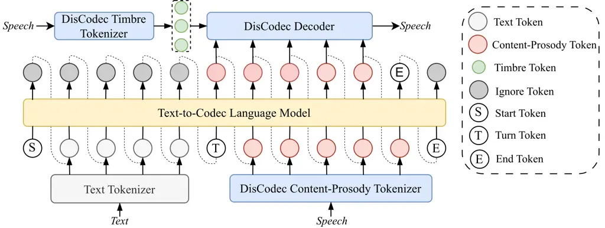
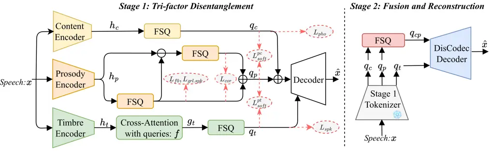
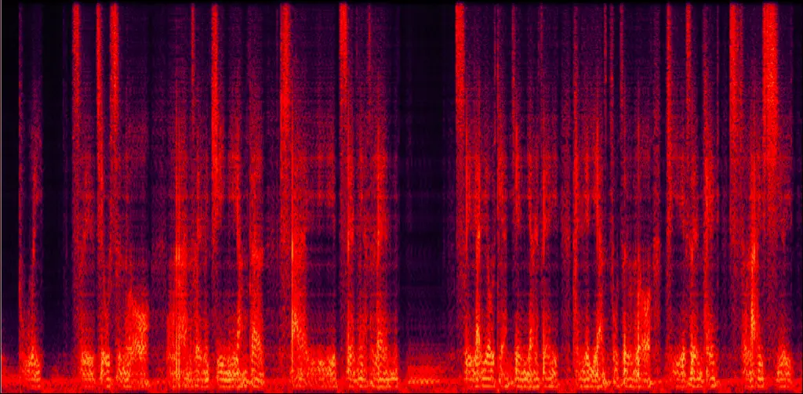
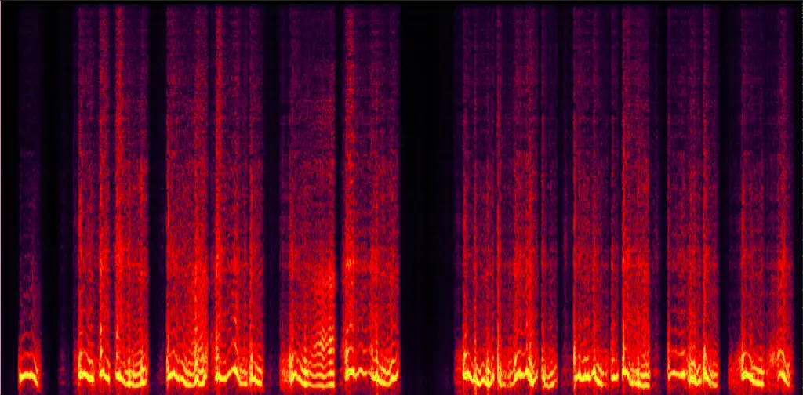
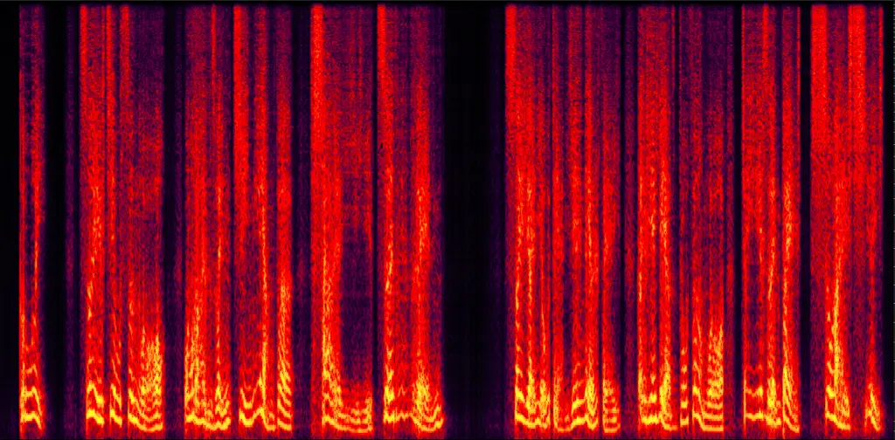
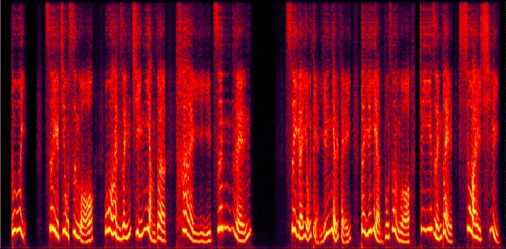

# DisCo-Speech: Controllable Zero-Shot Speech Generation with A Disentangled Speech Codec

Tao Li    Wenshuo Ge^(\*)    Zhichao Wang    Zihao Cui    Yong Ma   
Yingying Gao    Chao Deng    Shilei Zhang ^(†)^(†)thanks: Equal
contribution. Corresponding authors.    Junlan FengChina Mobile
Nineverse Artificial Intelligence Technology (Beijing) Co.,
Ltd.Nineverse Institute of Artificial Intelligence.The State Key
Laboratory of Multimedia Information Processing, Peking University,
Beijing, China ^(†)^(†)thanks: Equal contribution. Corresponding
authors.

###### Abstract

Codec-based language models (LMs) have revolutionized text-to-speech
(TTS). However, standard codecs entangle timbre and prosody, which
hinders independent control in continuation-based LMs. To tackle this
challenge, we propose DisCo-Speech, a zero-shot controllable TTS
framework featuring a disentangled speech codec (DisCodec) and an
LM-based generator. The core component DisCodec employs a two-stage
design: 1) tri-factor disentanglement to separate speech into content,
prosody, and timbre subspaces via parallel encoders and hybrid losses;
and 2) fusion and reconstruction that merges content and prosody into
unified content-prosody tokens suitable for LM prediction, while jointly
optimizing reconstruction to address the disentanglement-reconstruction
trade-off. This allows the LM to perform prosodic continuation from a
style prompt while the decoder injects target timbre, enabling flexible
zero-shot control. Experiments demonstrate that DisCo-Speech achieves
competitive voice cloning and superior zero-shot prosody control. By
resolving the core entanglement at the codec level, DisCo-Speech
provides a robust foundation for controllable speech synthesis. Audio
samples are available at:
[https://disco-speech.github.io/DisCo-demo/](https://disco-speech.github.io/DisCo-demo/).
Code and weights will be released at:
[https://github.com/disco-speech/DisCo-Speech](https://github.com/disco-speech/DisCo-Speech)
upon acceptance.

## 1 Introduction

Text-to-speech (TTS) synthesis, the technology that converts written
text into spoken audio, has long been the core of human-computer
interaction Wang et al. (2017); Ren et al. (2019). Recently, TTS has
witnessed a paradigm shift with the rise of codec-based language models,
in which codecs discretize speech into tokens via quantization
techniques Van Den Oord et al. (2017a); Mentzer et al. (2023), and
language models (LMs) bridge the correlation between text and speech.
Driven by large-scale datasets and advanced generative models, zero-shot
voice cloning, where a new speaker’s voice can be cloned with a single
speech clip, is no longer a barrier in modern TTS systems Anastassiou
et al. (2024); Du et al. (2024b).

With the proliferation of TTS applications, a new demand has emerged for
fine-grained and independent control over speech attributes, such as
speaker timbre and prosody, enabling a target speaker to speak in any
desired prosody—a task referred to as zero-shot controllable speech
generation Li et al. (2024b); Zhang et al. (2025c); Zhou et al. (2025).
However, relying on existing acoustic Zeghidour et al. (2021); Ye et al.
(2025a) or hybrid codecs Zhang et al. (2023); Krimigis et al. (2004)
presents a challenge: the inherent tight coupling of timbre and prosody
within these representations hinders current LM-based TTS systems Guo
et al. (2025); Zhang et al. (2025a) from meeting this requirement.
Although the continuation-based generation paradigm of LMs excels at
high-similarity cloning by replicating both timbre and prosody from the
speech prompt, it inevitably sacrifices the capability for independent
control.

To break this entanglement, one intuitive approach involves building
comprehensive, multi-style speaker datasets with fine-grained prosodic
annotations, allowing TTS systems to explicitly learn prosody and timbre
from separate prompts Lei et al. (2023). However, the high resource
consumption makes this approach difficult to scale, especially in
zero-shot scenarios. Alternatively, many efforts Ju et al. (2024); Li
et al. (2025); Zheng et al. (2024) focus on the design of codec, aiming
to provide disentangled speech attribute tokens (e.g., content, prosody,
and timbre), yet decoupling remains a critical bottleneck. The trade-off
between disentanglement and reconstruction Li et al. (2023) often leads
to information loss or leakage Karlapati et al. (2020), compromising
both synthesis quality and the effectiveness of independent control.

Achieving effective disentanglement in codecs to promote zero-shot
controllable TTS is non-trivial, primarily due to several core
challenges in speech representation modeling:

$`\bullet`$ Speech disentanglement dilemma: among speech attributes,
timbre is globally static, and content and prosody are temporal
dynamics Lei et al. (2022); Jiang et al. (2024); Li et al. (2021).
Content is a form of linguistic information Li et al. (2024b). Prosody
can encompass high-level content-independent style and further impact
the tone and intensity attached to the content, while speaker timbre
further adjusts the prosody, forming diverse human-observed
expression Li et al. (2023). This hierarchy is evidenced in layer-wise
analyses of SSL or ASR models Zhang et al. (2025c); Pasad et al. (2021);
Chen et al. (2023); Chang et al. (2022), where timbre information fades
before prosody as layers deepen. Strict decoupling risks disrupting
these intrinsic dependencies causing information loss, while weak
constraints permit information leakage Li et al. (2022b); Lei et al.
(2023).

$`\bullet`$ Disentanglement-reconstruction trade-off: the trade-off
between disentanglement and reconstruction has been reported in previous
studies Li et al. (2022a). Excessive disentangling can strip away
acoustic details essential for high-fidelity synthesis. Conversely,
prioritizing reconstruction quality often leaves entangled information
in the representations, limiting the precision of downstream control Li
et al. (2024b).

$`\bullet`$ Downstream-friendly representation: a practical disentangled
representation is not only sufficiently pure but also convenient for the
usage of downstream components (e.g., LMs) Guo et al. (2025); Zhang
et al. (2025c). How to construct a representation that is easily
utilizable by a zero-shot control framework is key to unlocking the
codec’s potential Zhang et al. (2025c); Zhou et al. (2025).

Addressing these challenges, we propose DisCo-Speech, a novel framework
for zero-shot controllable speech generation, comprising a disentangled
speech codec (DisCodec) and a single Transformer LM. At the core of our
framework lies DisCodec, which facilitates independent zero-shot control
through a two-stage learning paradigm: 1) Tri-factor disentanglement:
Inspired by the characteristic of speech attributes as mentioned above,
DisCodec factorizes speech into content, prosody, and timbre via three
parallel encoders, employing hybrid constraints to ensure robust
disentanglement; 2) Fusion and reconstruction: A token to wave decoder
fuses the disentangled content and prosody into unified, timbre-agnostic
tokens suitable for LM prediction, while jointly optimizing
reconstruction to mitigate the disentanglement-reconstruction trade-off.
By resolving entanglement at the codec level, the LM and DisCodec
decoder seamlessly collaborate: the LM performs contextual prosodic
continuation based on the text and prosody prompt, while the decoder
reconstructs the waveform conditioned on the target timbre. This design
establishes DisCo-Speech as a concise and effective paradigm for
independent zero-shot control.



Figure 1: The overview of DisCo-Speech.

## 2 Related Works

### 2.1 Speech Tokenization

The discrete codec paradigm, built upon an encoder-quantizer-decoder
architecture Van Den Oord et al. (2017a), has become the foundation for
modern TTS, enabling speech representation compatible with language
models. Acoustic codecs Zeghidour et al. (2021); Défossez et al. (2022);
Xin et al. (2024); Ye et al. (2025a) established this paradigm, focusing
primarily on acoustic representations and reconstruction quality through
residual vector quantization Van Den Oord et al. (2017b) (RVQ) or finite
scalar quantization Mentzer et al. (2023) (FSQ). To bridge text-speech
modality gap, ASR- or SSL-based semantic codec Du et al. (2024a); Du
et al. (2024b); Anastassiou et al. (2024) have been introduced into TTS
frameworks to improve generation stability. Benefiting from semantic and
acoustic modeling, semantic-aware acoustic codec Krimigis et al. (2004);
Zhang et al. (2023) have emerged as mainstream solutions, progressively
representing speech from semantic to acoustic levels via semantic
distillation within a multi-layer structure.

A recent frontier lies in disentangled codecs, which factorize speech
into distinct attributes (e.g., content, prosody, and timbre) for
fine-grained control. Several approaches have been explored: FACodec Ju
et al. (2024) employs gradient reversal layers Ganin and Lempitsky
(2015) (GRL) and multi-aspect supervision; MSR-Codec Li et al. (2025)
and FreeCodec Zheng et al. (2024) leverage pre-trained models to
decouple attributes. Despite these advancements, insufficient decoupling
often hampers controllable performance Ji et al. (2025), and many
methods rely on specialized acoustic models Ju et al. (2024),
complicating the pipeline. We propose DisCodec that provides
well-disentangled representations for seamless integration with standard
LMs, yielding a more concise and effective pipeline.

### 2.2 Zero-shot Controllable TTS

Zero-shot controllable TTS aims to synthesize speech with desired
speaker timbre and speaking prosody, using acoustic prompts or textual
instructions. Early zero-shot TTS systems Wang et al. (2023); Kharitonov
et al. (2023); Casanova et al. (2024); Eskimez et al. (2024) focused
primarily on voice cloning, where a single acoustic prompt jointly
defines both speaker timbre and speaking style. For instance,
VALL-E Wang et al. (2023) introduced an AR+NAR architecture that
leverages in-context learning to replicate timbre from an acoustic
prompt. Subsequent works have improved modeling capability through
progressive semantic-to-acoustic modeling Du et al. (2024b); Anastassiou
et al. (2024) or integrated diffusion-based hybrid architectures Du
et al. (2024a); Zhang et al. (2025a); Jia et al. (2025).

As cloning performance improved, the need for prosody control arose. An
intuitive approach involves using annotated multi-style, multi-speaker
data. Textual instructions Du et al. (2024a); Liu et al. (2023); Ji
et al. (2025); Yang et al. (2024) or acoustic templates Yan et al.
(2025) are often employed to guide style control. Due to the high
annotation cost, some studies attempt to factorize speech into content,
timbre, and prosody to achieve independent control. Recently proposed
IndexTTS2 Zhou et al. (2025) incorporates a GRL-based disentanglement
module trained jointly with an LM to separately control timbre and
style, while Vevo Zhang et al. (2025c) and NaturalSpeech3 Ju et al.
(2024) leverage disentangled features from pre-trained SSL models or
codecs. Despite these advances, existing methods still face challenges
like insufficient decoupling and reliance on specialized architectures,
limiting their flexibility  Guo et al. (2025); Ji et al. (2025), our
DisCo-Speech offers a more versatile and concise solution that leverages
a disentangled codec (DisCodec) to enable a standard LM to independently
control timbre and prosody.

## 3 DisCo-Speech

As illustrated in Fig. 1, DisCo-Speech comprises two core components: 1)
DisCodec: which tokenizes speech into content-prosody and global timbre
tokens and reconstructs them into a waveform; 2) Text-to-Codec LM: a
standard LM that autoregressively generates content-prosody tokens given
text and historical content-prosody tokens. During inference, using a
speech prompt with desired prosody and its corresponding text as
prompts, the LM performs prosodic continuation on the target text to
generate the content-prosody tokens. The generated results, together
with the target speaker’s timbre, are then processed by the DisCodec
decoder to produce the final speech. In the following sections, we
introduce the construction of a disentangled codec suitable for a
zero-shot controllable framework, and detail how a standard LM
collaborates with DisCodec to achieve independent control, forming the
DisCo-Speech framework.



Figure 2: The structure and two-stage training of DisCodec.

### 3.1 DisCodec: Disentangled Speech Codec

As discussed in Section 1, the inherent inter-dependencies of speech
attributes can lead to failures in either generation quality or
attribute control. Furthermore, the intrinsic
disentanglement-reconstruction conflict and the need for
downstream-friendly Gloeckle et al. () feature design impose additional
requirements for codec design. To overcome these challenges, DisCodec is
designed with a two-stage training paradigm, including: 1) Tri-factor
disentanglement: This stage explicitly decouples speech into content,
prosody, and timbre under the guidance of hybrid decoupling constraints,
ensuring the integrity of each attribute; 2) Fusion and reconstruction:
The DisCodec decoder further fuses content and prosody into unified
tokens suitable for standard LM usage, while jointly optimizing
reconstruction quality to directly mitigate the
disentanglement-reconstruction trade-off.

#### 3.1.1 Stage 1: Tri-factor Disentanglement

As shown in Fig. 2, in stage 1, three parallel encoders are employed to
capture content $`c`$, timbre $`t`$, and prosody $`p`$ from speech, and
subsequently, FSQ-based quantizers perform discretization. According to
the inherent characteristics of speech attributes, varied decoupling
constraints are imposed on different attribute branches for clear
disentanglement. Additionally, with former discrete tokens, a decoder
performs a reconstruction task to provide reconstruction supervision.
Given a speech $`x`$, the process of DisCodec in stage 1 can be
described as:

```math
\displaystyle h_{c} \displaystyle=E_{c}(x),h_{t}=E_{t}(x),h_{p}=E_{p}(x), \tag{1}
```

```math
\displaystyle g_{t} \displaystyle=CrossAttention(h_{t},f),
```

```math
\displaystyle q_{c} \displaystyle=Q_{c}(h_{c}),q_{p}=RQ_{p}(h_{p}),q_{t}=Q_{t}(g_{t}),
```

```math
\displaystyle\hat{x} \displaystyle=D(q_{c},q_{p},q_{t}),
```

where $`E_{c}`$, $`E_{t}`$, and $`E_{p}`$ are the content, timbre, and
prosody encoders; $`Q`$ means the quantizer, while $`RQ`$ represent
residual version; $`f`$ is a set of learnable queries; and $`D`$ is the
decoder.

Content Tokenizer. The content encoder $`E_{c}(\cdot)`$ follows the
design of the DAC encoder Kumar et al. (2023), which employs several
convolutional blocks to downsample waveform $`x`$ into frame-level
latent $`h_{c}`$. And then $`h_{c}`$ is quantized by FSQ
$`Q_{c}(\cdot)`$ to the quantized embedding $`q_{c}`$.

To ensure $`q_{c}`$ exclusively encodes content information, a finetuned
Wav2Vec-based phone recognition model Baevski et al. (2020) is employed
to provide phonetic supervision, where $`q_{c}`$ are passed through a
classifier to learn phone prediction under the CE-based guidance
$`L_{pho}`$ of the recognition model. Instead of using SSL models Hsu
et al. (2021), utilizing a phone- or text-based model provides purer
content supervision, lowering decoupling complexity in the codec.

Prosody Tokenizer. To capture temporal variations of prosody, the
prosody encoder $`E_{p}(\cdot)`$ employs dilated causal convolutions Van
Den Oord et al. (2016) to produce frame-level sequence $`h_{p}`$. Unlike
the content branch, a two-layer residual FSQ ($`RQ_{p}`$) is used to
quantize $`h_{p}`$ to the residual-enhanced representation $`q_{p}`$,
which integrates the quantized information from both FSQ layers. The key
innovation in this design is the hierarchical assignment of prosodic
attributes: the first FSQ layer is forced to encode the primary prosody
attribute (i.e., pitch information), while the second FSQ in the
residual path captures prosodic residuals beyond pitch for comprehensive
prosody modeling.

To supervise the prosody capturing, the first FSQ layer is updated with
a frame-level F0 regression loss $`\mathcal{L}_{f0}`$, and correlation
loss $`\mathcal{L}_{\text{cor}}`$ ensures the correlation of quantized
results from two FSQ layers to force the second FSQ encode
prosody-related information from the residual, which can be defined as:

```math
\mathcal{L}_{\text{cor}}=\left(\frac{1}{BL}\sum_{b=1}^{B}\sum_{l=1}^{L}\frac{q_{p1}^{(b,l)}\cdot q_{p2}^{(b,l)}}{\|q_{p1}^{(b,l)}\|\cdot\|q_{p2}^{(b,l)}\|}-\alpha\right)^{2}, \tag{2}
```

where $`B`$ is the batch size, $`L`$ is the sequence length, $`q_{p1}`$
and $`q_{p2}`$ are the quantized output of the first and second FSQ
layers, respectively, and $`\alpha`$ is a target similarity value (set
to 0.2) that promotes moderate correlation between the two layers’
representations. To eliminate speaker timbre, the widely used GRL
layer Ganin and Lempitsky (2015) is employed in the first FSQ layer.
Moreover, to further ensure the speech attribute decoupling, inspired by
the inherent relationship among speech attributes (See Section 1), we
introduce soft orthogonality constraint $`\mathcal{L}_{soft}`$ that
strikes a balance between feature decoupling and information
preservation via adjustable decoupling coefficient $`\beta`$. This soft
constraint is applied to prosody-content and prosody-timbre decoupling,
forming $`\mathcal{L}_{soft}^{p,c}`$ and $`\mathcal{L}_{soft}^{p,t}`$,
which are described as:

```math
\mathcal{L}_{soft}^{p,c}=\left(\frac{1}{BL}\sum_{b=1}^{B}\sum_{l=1}^{L}|\cos(l_{p}^{(b,l)},l_{c}^{(b,l)})|-\beta_{c}\right)^{2}, \tag{3}
```

```math
\mathcal{L}_{soft}^{p,t}=\left(\frac{1}{BL}\sum_{b=1}^{B}\sum_{l=1}^{L}|\cos(l_{p}^{(b,l)},q_{t}^{(b)})|-\beta_{t}\right)^{2}, \tag{4}
```

where $`l_{p}`$ and $`l_{c}`$ are the linear-transformed results of
quantized prosody and content, respectively. Unlike hard orthogonality
constraint Li et al. (2022c) (i.e., $`\beta\rightarrow 0`$ ) which pose
a strict independence assumption which may cause excessive information
loss, our soft version constraints strike a balance via the adjustable
coefficient $`\beta`$. Compared with the strict decoupling
($`\beta_{t}=0.0001`$) in $`\mathcal{L}_{soft}^{p,t}`$, the relative
higher value ($`\beta_{c}=0.01`$) in $`\mathcal{L}_{soft}^{p,c}`$
acknowledges the natural temporal-dynamic correlation between prosody
and content, while the entanglement of timbre and prosody, reflected in
coarse granularity, can achieve near-complete independence.

Timbre Tokenizer. Following previous studies Wang et al. (2025), a
sequence of fixed-length global tokens is used to capture the global
speaker timbre. Specifically, the timbre encoder $`E_{t}(\cdot)`$
follows ECAPA-TDNN Desplanques et al. (2020) to produce frame-level
representations $`h_{t}`$. These are then aggregated into a fixed-length
sequence $`g_{t}`$ via cross-attention with learnable queries $`f`$,
thereby adaptively focusing on global-consistency timbre information. A
FSQ layer $`Q_{t}(\cdot)`$ further perform quantization to produce
global timbre representation $`q_{t}`$, implicitly creating an
information bottleneck to discard non-timbre information. To ensure
effective speaker timbre modeling, we directly optimize the timbre
tokenizer with a speaker classification loss $`\mathcal{L}_{spk}`$,
while the soft orthogonal constraint $`\mathcal{L}_{soft}^{p,t}`$
mentioned above further eliminates prosodic variations from the timbre
representation.

Finally, the decoder $`D(\cdot)`$, mirroring the architecture of the
content encoder, recombines the triple stream representation back to the
waveform. Multi-scale Mel-spectrogram loss and waveform reconstruction
loss Kumar et al. (2023) are employed to guide the reconstruction. Note
that the decoder is only used in stage 1.

#### 3.1.2 Stage 2: Fusion and Reconstruction

In Stage 1, DisCodec achieves tri-factor disentanglement of speech
attributes. However, the three-stream representation is not well-suited
for downstream tasks such as controllable generation, as it requires
predicting multiple token streams Gloeckle et al. (). Moreover, the
inherent disentanglement-reconstruction trade-off limits the
reconstruction quality of the Stage 1 decoder. To bridge these gaps, as
illustrated in Fig. 2, we introduce a specialized decoder to optimize
reconstruction quality while keeping the encoders frozen. To improve
downstream usability, and inspired by the inherent relationship between
content and prosody, we first sum the quantized embeddings of content
and prosody, and then re-quantize the fused result into a unified token
sequence $`z_{cp}`$. The corresponding quantized embeddings $`q_{cp}`$
are then consumed by the decoder to reconstruct the waveform,
conditioned on the global speaker timbre $`q_{t}`$, where this entire
process is jointly optimized. This design decomposes the DisCo-Speech
framework into two clear steps: prosodic continuation on text, followed
by timbre injection—a structure aligned with prior studies Li et al.
(2024b); Zhang et al. (2025c).

Regarding the architecture, the decoder stacks Transformer
blocks Vaswani et al. (2017) with a BigVGANv2 Lee et al. (2022)
generator. During Stage 2, the updated DisCodec is trained with the
original loss in BigVGANv2, including multi-scale reconstruction
losses Kong et al. (2020), feature matching loss Kumar et al. (2019),
and adversarial loss Lee et al. (2022). In zero-shot controllable
inference, the DisCodec decoder directly synthesizes the waveform from
the LM-predicted content-prosody tokens $`z^{sys}_{cp}`$, conditioned on
the target speaker’s timbre $`q^{trg}_{t}`$.

The total loss is a weighted sum of the component losses. Detailed loss
hyperparameters (e.g., $`\lambda_{pho},\lambda_{cor},\lambda_{spk}`$)
are given in Appendix A.

### 3.2 Text-to-Codec Language Model

Building upon the disentangled representations from DisCodec, we employ
a standard LM as the generative core of DisCo-Speech. As shown in
Fig. 1, the LM is responsible for learning the relationship between text
and prosody and generating the timbre-agnostic content-prosody token
$`z_{cp}`$.

Training. During training, the input sequence is structured as:
$`[\hbox to12pt{\vbox to12pt{\pgfpicture\makeatletter\hbox{\hskip 5.9981pt\lower-5.9981pt\hbox to0.0pt{\lxSVG@begingroup@{_scopebegin=1} \lxSVG@begingroup@{stroke=#000000} \lxSVG@begingroup@{fill=#000000} \lxSVG@setlinewidth{\the\pgflinewidth}\lxSVG@begingroup@{stroke-width=0.4pt} \lx@inpgf@ignorespaces\nullfont\hbox to0.0pt{\lxSVG@begingroup@{_scopebegin=1} {
{{}}\lx@inpgf@ignorespaces\hbox{\hbox{{\lxSVG@begingroup@{_scopebegin=1} {{}{{{}}}{{}}{}{}{\lx@inpgf@ignorespaces}{\lx@inpgf@ignorespaces}{}{}{}{}{}{{}\lxSVG@stroke\lxSVG@drawpath@unclipped{M 8.02 0 C 8.02 4.43 4.43 8.02 0 8.02 C -4.43 8.02 -8.02 4.43 -8.02 0 C -8.02 -4.43 -4.43 -8.02 0 -8.02 C 4.43 -8.02 8.02 -4.43 8.02 0 Z M 0 0}{fill:none} \lx@inpgf@ignorespaces
}{{{{\lx@inpgf@ignorespaces}}\lxSVG@begingroup@{_scopebegin=1} \lxSVG@transformcm{1.0}{0.0}{0.0}{1.0}{-2.77779pt}{-3.41666pt}\lxSVG@begingroup@{transform=matrix(1.0 0.0 0.0 1.0 -3.84 -4.73)} \pgfsys@hbox{58}\lxSVG@closescope }}}
\lxSVG@closescope }}}
}
\lxSVG@closescope {{{}}}{\lx@inpgf@ignorespaces}{\lx@inpgf@ignorespaces}\hss}\lxSVG@discardpath\lxSVG@closescope \hss}}\lxSVG@closescope\endpgfpicture}},t_{c},\hbox to13.16pt{\vbox to13.16pt{\pgfpicture\makeatletter\hbox{\hskip 6.58061pt\lower-6.58061pt\hbox to0.0pt{\lxSVG@begingroup@{_scopebegin=1} \lxSVG@begingroup@{stroke=#000000} \lxSVG@begingroup@{fill=#000000} \lxSVG@setlinewidth{\the\pgflinewidth}\lxSVG@begingroup@{stroke-width=0.4pt} \lx@inpgf@ignorespaces\nullfont\hbox to0.0pt{\lxSVG@begingroup@{_scopebegin=1} {
{{}}\lx@inpgf@ignorespaces\hbox{\hbox{{\lxSVG@begingroup@{_scopebegin=1} {{}{{{}}}{{}}{}{}{\lx@inpgf@ignorespaces}{\lx@inpgf@ignorespaces}{}{}{}{}{}{{}\lxSVG@stroke\lxSVG@drawpath@unclipped{M 8.83 0 C 8.83 4.88 4.88 8.83 0 8.83 C -4.88 8.83 -8.83 4.88 -8.83 0 C -8.83 -4.88 -4.88 -8.83 0 -8.83 C 4.88 -8.83 8.83 -4.88 8.83 0 Z M 0 0}{fill:none} \lx@inpgf@ignorespaces
}{{{{\lx@inpgf@ignorespaces}}\lxSVG@begingroup@{_scopebegin=1} \lxSVG@transformcm{1.0}{0.0}{0.0}{1.0}{-3.61111pt}{-3.41666pt}\lxSVG@begingroup@{transform=matrix(1.0 0.0 0.0 1.0 -5 -4.73)} \pgfsys@hbox{58}\lxSVG@closescope }}}
\lxSVG@closescope }}}
}
\lxSVG@closescope {{{}}}{\lx@inpgf@ignorespaces}{\lx@inpgf@ignorespaces}\hss}\lxSVG@discardpath\lxSVG@closescope \hss}}\lxSVG@closescope\endpgfpicture}},z_{cp},\hbox to12.82pt{\vbox to12.82pt{\pgfpicture\makeatletter\hbox{\hskip 6.4124pt\lower-6.4124pt\hbox to0.0pt{\lxSVG@begingroup@{_scopebegin=1} \lxSVG@begingroup@{stroke=#000000} \lxSVG@begingroup@{fill=#000000} \lxSVG@setlinewidth{\the\pgflinewidth}\lxSVG@begingroup@{stroke-width=0.4pt} \lx@inpgf@ignorespaces\nullfont\hbox to0.0pt{\lxSVG@begingroup@{_scopebegin=1} {
{{}}\lx@inpgf@ignorespaces\hbox{\hbox{{\lxSVG@begingroup@{_scopebegin=1} {{}{{{}}}{{}}{}{}{\lx@inpgf@ignorespaces}{\lx@inpgf@ignorespaces}{}{}{}{}{}{{}\lxSVG@stroke\lxSVG@drawpath@unclipped{M 8.6 0 C 8.6 4.75 4.75 8.6 0 8.6 C -4.75 8.6 -8.6 4.75 -8.6 0 C -8.6 -4.75 -4.75 -8.6 0 -8.6 C 4.75 -8.6 8.6 -4.75 8.6 0 Z M 0 0}{fill:none} \lx@inpgf@ignorespaces
}{{{{\lx@inpgf@ignorespaces}}\lxSVG@begingroup@{_scopebegin=1} \lxSVG@transformcm{1.0}{0.0}{0.0}{1.0}{-3.40279pt}{-3.41666pt}\lxSVG@begingroup@{transform=matrix(1.0 0.0 0.0 1.0 -4.71 -4.73)} \pgfsys@hbox{58}\lxSVG@closescope }}}
\lxSVG@closescope }}}
}
\lxSVG@closescope {{{}}}{\lx@inpgf@ignorespaces}{\lx@inpgf@ignorespaces}\hss}\lxSVG@discardpath\lxSVG@closescope \hss}}\lxSVG@closescope\endpgfpicture}}]`$,
where $`t_{c}`$ is the byte pair encoding (BPE) sequence of text,
$`z_{cp}`$ is the unified content-prosody tokens from DisCodec, and S,
T, E are special tokens indicating the start, turn, and end of the
sequence. The model is trained with next token prediction mechanism with
pretraining and supervised fine-tuning (SFT) process.

Inference. The input is constructed as:
$`[\hbox to12pt{\vbox to12pt{\pgfpicture\makeatletter\hbox{\hskip 5.9981pt\lower-5.9981pt\hbox to0.0pt{\lxSVG@begingroup@{_scopebegin=1} \lxSVG@begingroup@{stroke=#000000} \lxSVG@begingroup@{fill=#000000} \lxSVG@setlinewidth{\the\pgflinewidth}\lxSVG@begingroup@{stroke-width=0.4pt} \lx@inpgf@ignorespaces\nullfont\hbox to0.0pt{\lxSVG@begingroup@{_scopebegin=1} {
{{}}\lx@inpgf@ignorespaces\hbox{\hbox{{\lxSVG@begingroup@{_scopebegin=1} {{}{{{}}}{{}}{}{}{\lx@inpgf@ignorespaces}{\lx@inpgf@ignorespaces}{}{}{}{}{}{{}\lxSVG@stroke\lxSVG@drawpath@unclipped{M 8.02 0 C 8.02 4.43 4.43 8.02 0 8.02 C -4.43 8.02 -8.02 4.43 -8.02 0 C -8.02 -4.43 -4.43 -8.02 0 -8.02 C 4.43 -8.02 8.02 -4.43 8.02 0 Z M 0 0}{fill:none} \lx@inpgf@ignorespaces
}{{{{\lx@inpgf@ignorespaces}}\lxSVG@begingroup@{_scopebegin=1} \lxSVG@transformcm{1.0}{0.0}{0.0}{1.0}{-2.77779pt}{-3.41666pt}\lxSVG@begingroup@{transform=matrix(1.0 0.0 0.0 1.0 -3.84 -4.73)} \pgfsys@hbox{58}\lxSVG@closescope }}}
\lxSVG@closescope }}}
}
\lxSVG@closescope {{{}}}{\lx@inpgf@ignorespaces}{\lx@inpgf@ignorespaces}\hss}\lxSVG@discardpath\lxSVG@closescope \hss}}\lxSVG@closescope\endpgfpicture}},t_{c}^{prompt},t_{c}^{sys},\hbox to13.16pt{\vbox to13.16pt{\pgfpicture\makeatletter\hbox{\hskip 6.58061pt\lower-6.58061pt\hbox to0.0pt{\lxSVG@begingroup@{_scopebegin=1} \lxSVG@begingroup@{stroke=#000000} \lxSVG@begingroup@{fill=#000000} \lxSVG@setlinewidth{\the\pgflinewidth}\lxSVG@begingroup@{stroke-width=0.4pt} \lx@inpgf@ignorespaces\nullfont\hbox to0.0pt{\lxSVG@begingroup@{_scopebegin=1} {
{{}}\lx@inpgf@ignorespaces\hbox{\hbox{{\lxSVG@begingroup@{_scopebegin=1} {{}{{{}}}{{}}{}{}{\lx@inpgf@ignorespaces}{\lx@inpgf@ignorespaces}{}{}{}{}{}{{}\lxSVG@stroke\lxSVG@drawpath@unclipped{M 8.83 0 C 8.83 4.88 4.88 8.83 0 8.83 C -4.88 8.83 -8.83 4.88 -8.83 0 C -8.83 -4.88 -4.88 -8.83 0 -8.83 C 4.88 -8.83 8.83 -4.88 8.83 0 Z M 0 0}{fill:none} \lx@inpgf@ignorespaces
}{{{{\lx@inpgf@ignorespaces}}\lxSVG@begingroup@{_scopebegin=1} \lxSVG@transformcm{1.0}{0.0}{0.0}{1.0}{-3.61111pt}{-3.41666pt}\lxSVG@begingroup@{transform=matrix(1.0 0.0 0.0 1.0 -5 -4.73)} \pgfsys@hbox{58}\lxSVG@closescope }}}
\lxSVG@closescope }}}
}
\lxSVG@closescope {{{}}}{\lx@inpgf@ignorespaces}{\lx@inpgf@ignorespaces}\hss}\lxSVG@discardpath\lxSVG@closescope \hss}}\lxSVG@closescope\endpgfpicture}},z_{cp}^{prompt}]`$,
where $`t_{c}^{prompt}`$ and $`z_{cp}^{prompt}`$ are extracted from the
prompt speech with the desired prosody, and $`t_{c}^{sys}`$ is the
target text to be synthesized. The LM generates $`z_{cp}^{sys}`$ by
capturing the prosodic pattern from the prompt $`z_{cp}^{prompt}`$. The
final waveform is synthesized by the DisCodec decoder from
$`z_{cp}^{sys}`$ conditioned on the target speaker’s timbre
$`q_{t}^{trg}`$. This clear separation—LLM for prosody and content,
decoder for timbre—enables flexible zero-shot control of prosody and
timbre.

|                 |            |               |                         |                    |                   |                     |                     |                  |                    |
| --------------- | ---------- | ------------- | ----------------------- | ------------------ | ----------------- | ------------------- | ------------------- | ---------------- | ------------------ |
| Model           | Token Rate | Codebook Size | Disentanglement Ability | WER $`\downarrow`$ | STOI $`\uparrow`$ | PESQ WB$`\uparrow`$ | PESQ NB$`\uparrow`$ | SSIM$`\uparrow`$ | UT MOS$`\uparrow`$ |
| Ground Truth    | \-         | \-            | \-                      | 1.96               | 1.00              | 4.64                | 4.55                | 1.00             | 4.09               |
| BigCodec        | 80         | 8192          | \-                      | 2.76               | 0.93              | 2.68                | 3.27                | 0.84             | 4.11               |
| WavTokenizer    | 75         | 4096          | \-                      | 3.98               | 0.90              | 2.13                | 2.63                | 0.65             | 3.79               |
| Encodec         | 75         | 1024          | \-                      | 28.92              | 0.77              | 1.23                | 1.48                | 0.25             | 1.25               |
| MSR-Codec-424   | 62.5       | 500/32/64     | $`\checkmark`$          | \-                 | 0.84              | 2.37                | 1.82                | 0.80             | 4.15               |
| DAC             | 50         | 1024          | \-                      | 74.55              | 0.62              | 1.06                | 1.20                | 0.08             | 1.25               |
| SpeechTokenizer | 50         | 1024          | \-                      | 5.01               | 0.64              | 1.14                | 1.30                | 0.17             | 1.27               |
| Mimi            | 50         | 2048          | \-                      | 4.89               | 0.85              | 1.64                | 2.09                | 0.50             | 3.03               |
| StableCodec     | 50         | 15625         | \-                      | 5.12               | 0.91              | 2.24                | 2.91                | 0.62             | 4.23               |
| X-codec         | 50         | 1024          | \-                      | 3.42               | 0.83              | 1.84                | 2.38                | 0.52             | 4.05               |
| X-codec2        | 50         | 65536         | \-                      | 2.47               | 0.92              | 2.43                | 3.04                | 0.82             | 4.13               |
| BiCodec         | 50         | 8192          | \-                      | \-                 | 0.92              | 2.51                | 3.13                | 0.80             | 4.18               |
| DisCodec        | 50         | 65536         | $`\checkmark`$          | 2.92               | 0.86              | 1.98                | 2.33                | 0.81             | 4.10               |

Table 1: Comparisons of various codec models for speech reconstruction
on the LibriSpeech test-clean dataset. The WER is evaluated via a
HuBERT-based ASR system. Bold values indicate the best for each token
rate.

## 4 Experiment

### 4.1 Experimental Settings

Training Set. For DisCodec training, we utilize a 26k-hour mixed corpus
(16-24kHz) curated from internal sources to ensure diversity in speakers
and speaking prosody. In Stage 1, all speech samples are resampled to
16kHz for decoupling space learning, while only 24kHz samples are
utilized in Stage 2 to ensure high-quality reconstruction. For both
stages, 80-dimensional Mel-spectrograms are extracted with a 50 ms frame
length and 20 ms frame shift for the prosody and timbre branches.
Regarding the Text-to-Codec LM, a 120k-hour speech corpus, comprising
Emilia He et al. (2024) and the aforementioned internal dataset, is
employed for pretraining. Subsequently, the LM undergoes SFT on a
selected 5k-hour 24kHz subset.

To further enhance the performance of both the DisCodec and the
Text-to-Codec LM, we conducted a fine-tuning stage using an additional
6k-hour high-quality 24kHz speech dataset.

Configuration. DisCodec is trained for 500k steps with a total batch
size of 176 on 8 NVIDIA A800 GPUs. We use the Adam optimizer
($`lr=1e^{-4}`$, $`\beta_{1}=0.5`$, $`\beta_{2}=0.9`$) with a linear
warm-up for the first 5k steps. The codebook sizes for the FSQ layers
are set to 65,536 (content), 46,656 (prosody/timbre), and 65,536
(content-prosody). The sequence length of the global timbre token is 48.
For the Text-to-Codec LM, initialized from the Qwen2.5-1.5B model¹¹ 1
[https://huggingface.co/Qwen/Qwen2.5-1.5B](https://huggingface.co/Qwen/Qwen2.5-1.5B),
training runs for 8 epochs on 8×A800 GPUs, utilizing AdamW
($`lr=2e^{-4}`$, $`\beta_{1}=0.9`$, $`\beta_{2}=0.98`$).

Evaluation Settings. For codec, following previous studies Wang et al.
(2025), the LibriSpeech test-clean subset Panayotov et al. (2015) is
used for reconstruction assessment. Additionally, 1,680 conversion pairs
(60 expressive source speeches & 28 target speakers from
SEED-TTS-Eval Anastassiou et al. (2024)) are employed to verify the
decoupling capability of the codec. For controllable generation, the
widely used SEED-TTS-Eval (test-zh & test-en) is adopted for evaluating
voice cloning. We utilize a self-built prosody set for prosody control
evaluation. We compare our method comprehensively against
state-of-the-art baselines in three key areas: speech codec quality,
disentanglement capability via voice conversion, and zero-shot TTS
performance. For details of all compared models, please refer to
Appendix C and D.

Evaluation Metrics. Objective Metrics: We evaluate codec quality using
PESQ Rix et al. (2001) and UTMOS Saeki et al. (2022). Speech
intelligibility is measured via STOI Andersen et al. (2017), Word Error
Rate (WER), and Character Error Rate (CER), where WER and CER are
computed using Whisper-large-v3 Radford et al. (2023) and Paraformer Gao
et al. (2022), respectively. Speaker Similarity (SSIM) is calculated by
a Speaker Verification (SV) model Chen et al. (2022) to assess timbre
consistency. F0 Correlation Coefficient (F0$`{}_{\text{cor}}`$) is used
to assess F0 contour consistency. Subjective Metrics: An AB preference
test Li et al. (2023) is adopted to subjectively compare samples
synthesized by two models, where participants are asked to select the
sample that sounds closer to the reference in terms of speaker timbre or
prosody.

### 4.2 Experimental Results

#### 4.2.1 Performance of DisCodec

Reconstruction Performance. Table 1 presents the comparison of codec
reconstruction performance among various neural codecs on the
LibriSpeech test-clean dataset Panayotov et al. (2015). In terms of
perceptual quality, DisCodec achieves a UTMOS of 4.10, positioning it
within the top tier of models at this token rate. DisCodec achieves an
SSIM score of 0.81 in speaker similarity, which is on par with the
top-performing X-Codec2. Additionally, DisCodec demonstrates comparable
results in content preservation with a WER of 2.92%. These results
demonstrate that our proposed DisCodec achieves highly competitive and
well-balanced performance at 50 tokens/s, despite its primary design
focus on disentanglement.

|            |                   |                  |                        |
| ---------- | ----------------- | ---------------- | ---------------------- |
| Model      | UTMOS$`\uparrow`$ | SSIM$`\uparrow`$ | F0\_(cor) $`\uparrow`$ |
| CosyVoice2 | 3.95              | 0.55             | 0.48                   |
| Vevo       | 4.0               | 0.60             | 0.50                   |
| SeedVC     | 4.04              | 0.58             | 0.56                   |
| DisCodec   | 3.98              | 0.61             | 0.59                   |

Table 2: Objective evaluation of zero-shot VC.

Disentanglement Evaluation. In DisCodec, speech is disentangled into
content-prosody and speaker timbre representations. To evaluate the
effectiveness of this disentanglement, we conduct evaluations on the
zero-shot voice conversion (VC) task, which requires models to convert
speaker timbre while preserving the prosody and content of the source
speech. As shown in Table 2, DisCodec achieves the highest target timbre
similarity (SSIM) and F0 correlation (F0$`{}_{\text{cor}}`$),
demonstrating its superior capability in simultaneous timbre conversion
and prosody preservation. Moreover, this effective disentanglement does
not compromise naturalness, with UTMOS scores competitive with the best
baselines. The VC results confirm that DisCodec’s representations
achieve a superior balance between disentanglement and reconstruction.



(a) Content-only



(b) Prosody-only



(c) Content+Prosody



(d) Full Reconstruction

Figure 3: Disentanglement visualization.

Visual Analysis. We further visualize the disentanglement capability by
performing reconstruction using different combinations of decoupled
representations, forming four modes: content-only ($`q_{c}`$),
prosody-only ($`q_{p}`$), content+prosody ($`q_{c}+q_{p}`$), and full
reconstruction ($`q_{c}+q_{p}+q_{t}`$). The results are shown in Fig. 3.
Using content $`q_{c}`$ alone (Fig. 3a) preserves phonemes but lacks F0
and harmonic details, while Fig. 3b exhibits the intensity and rhythm of
prosody without linguistic intelligibility. When integrating content and
prosody (Fig. 3c), the formant structure aligns closely with the
linguistic content. Finally, timbre information further adjusts the
speaking expression to match the target speaker (Fig. 3d). This
visualization confirms the robust disentanglement performance of
DisCodec.

Due to space constraints, ablation studies on hierarchical prosody
modeling and the soft orthogonality constraint are detailed in
Appendix B.

#### 4.2.2 Controllability of DisCo-Speech

In this section, we evaluate the system’s capabilities in zero-shot
prosody control and voice cloning.

Zero-shot Timbre and Prosody Control. To quantitatively evaluate
independent controllability, we conduct an AB preference test. The test
involves 10 expert listeners. We construct an evaluation set of 1,000
prosody-timbre prompt pairs (deliberately sourced from different
speakers), each combined with 5 distinct texts, yielding 5,000 generated
utterances from which 500 samples are randomly selected for comparison.
As presented in Table 3, DisCo-Speech demonstrates superior performance
in Style scenario, achieving higher preference rates in both timbre and
prosody. This confirms that for stylistic attributes (e.g.,
storytelling, poetry), which are primarily manifested through rhythm and
speech rate, DisCo-Speech effectively captures the target prosody while
robustly maintaining the speaker’s timbre. As observed from the
generated samples²² 2
[https://disco-speech.github.io/DisCo-demo/](https://disco-speech.github.io/DisCo-demo/),
DisCo-Speech also demonstrates stability in cross-gender prosody
transfer.

In the Emotion scenario, we observe a trade-off that highlights
architectural differences. Index-TTS 2 slightly outperforms DisCo-Speech
in prosody preference due to its high expressiveness; however, it lags
in timbre consistency. We observe that Index-TTS 2’s strong emotional
expressiveness often comes at the cost of source timbre leakage. Since
intense emotions entail intrinsic timbre variations Li et al. (2022c),
Index-TTS 2 tends to entangle the speaker’s timbre with emotional
expressiveness. In contrast, DisCo-Speech enforces stricter
disentanglement: the LM captures prosody from the prompt, and the
DisCodec decoder renders the target timbre. This ensures that the target
speaker’s timbre remains uncompromised even during intense emotion
transfer.

|                             |         |                |               |          |
| --------------------------- | ------- | -------------- | ------------- | -------- |
| Scenario                    | Aspect  | Preference (%) |               |          |
|                             |         | DisCo-Speech   | No Preference | Baseline |
| DisCo-Speech vs. Vevo       |         |                |               |          |
| Emotion                     | Timbre  | 45.3           | 14.5          | 40.2     |
|                             | Prosody | 50.6           | 12.7          | 36.7     |
| Style                       | Timbre  | 51.5           | 27.2          | 21.3     |
|                             | Prosody | 48.9           | 31.1          | 20.0     |
| DisCo-Speech vs. IndexTTS 2 |         |                |               |          |
| Emotion                     | Timbre  | 42.5           | 23.8          | 33.7     |
|                             | Prosody | 36.0           | 25.5          | 38.5     |
| Style                       | Timbre  | 37.4           | 33.6          | 29.0     |
|                             | Prosody | 41.7           | 25.3          | 33.0     |

Table 3: AB preference test results. We evaluate speaker timbre
consistency and prosody similarity on both Emotion and Style scenarios.

Voice Cloning. Following the evaluation protocol of the
SEED-TTS-Eval Anastassiou et al. (2024) benchmark, we assess the voice
cloning capability of DisCo-Speech against state-of-the-art TTS models.
As shown in Table 4, DisCo-Speech maintains high speech intelligibility
in both English and Mandarin. In terms of speaker similarity, it
achieves performance on par with other one-stage autoregressive models
such as Spark-TTS, which also employ an LM and codec decoder
architecture, while performing slightly below flow-matching-based
systems that utilize powerful yet complex pipelines. In summary, results
from both prosody control and voice cloning validate DisCo-Speech as an
effective and integrated framework for high-quality zero-shot
controllable speech generation.

|                              |        |                    |                   |                    |                   |
| ---------------------------- | ------ | ------------------ | ----------------- | ------------------ | ----------------- |
| Model                        | Params | Test-EN            |                   | Test-ZH            |                   |
|                              |        | WER $`\downarrow`$ | SSIM $`\uparrow`$ | CER $`\downarrow`$ | SSIM $`\uparrow`$ |
| Multi-Stage or NAR Methods   |        |                    |                   |                    |                   |
| F5-TTS                       | 0.3B   | 1.83               | 0.647             | 1.56               | 0.741             |
| CosyVoice2                   | 0.5B   | 2.57               | 0.652             | 1.45               | 0.748             |
| Index-TTS 2^($`\clubsuit`$)  | 1.5B   | 2.23               | 0.706             | 1.03               | 0.765             |
| FireRedTTS                   | \-     | 3.82               | 0.460             | 1.51               | 0.635             |
| Vevo^($`\clubsuit`$)         | \-     | 2.53               | 0.664             | 3.99               | 0.723             |
| One-Stage AR Methods         |        |                    |                   |                    |                   |
| Llasa-1B                     | 1B     | 3.22               | 0.572             | 1.89               | 0.669             |
| Spark-TTS                    | 0.5B   | 1.98               | 0.584             | 1.20               | 0.672             |
| DisCo-Speech^($`\clubsuit`$) | 1.5B   | 3.01               | 0.597             | 2.08               | 0.677             |

Table 4: Results of voice cloning. $`\clubsuit`$ marks the systems which
supports independent control of timbre and prosody.

## 5 Conclusions

We presented DisCo-Speech, a novel framework for zero-shot controllable
speech generation that achieves independent control over speaker timbre
and speaking prosody. At its core lies DisCodec, a disentangled speech
codec that explicitly factorizes speech into content, prosody, and
timbre subspaces through a principled two-stage training paradigm. This
design effectively resolves the inherent trade-off between
disentanglement and reconstruction while producing downstream-friendly
representations for standard LM. With this design, given a prosody
template, the LM executes prosodic continuation based on the text, and
the DisCodec decoder further injects the desired speaker timbre.
Extensive experiments demonstrate the superior controllability of
DisCo-Speech in both voice cloning and prosody control.

## 6 Limitations

Despite its promising performance, DisCo-Speech has certain limitations.
First, speaker similarity remains relatively lower than that of
multi-stage systems, likely due to the inherent variability of
autoregressive generation Wang et al. (2025) and the compact nature of
codec representations Guo et al. (2025). Additionally, while trained on
extensive data, the quality and expressive diversity of the training
corpus remain constrained, which may lead to instability when generating
highly exaggerated speaking prosody. Furthermore, maintaining the
delicate balance between disentanglement purity and reconstruction
fidelity presents an ongoing challenge, as enhancing disentangling may
sometimes come at the cost of fine-grained acoustic details. In future
work, we aim to improve performance through higher-quality datasets and
advanced architectural designs that jointly optimize both
disentanglement effectiveness and detailed reconstruction capability.

## References

- Anastassiou et al. (2024) Philip Anastassiou, Jiawei Chen, Jitong
  Chen, Yuanzhe Chen, Zhuo Chen, Ziyi Chen, Jian Cong, Lelai Deng,
  Chuang Ding, Lu Gao, and 1 others. 2024. Seed-tts: A family of
  high-quality versatile speech generation models. _arXiv preprint
  arXiv:2406.02430_.
- Andersen et al. (2017) Asger Heidemann Andersen, Jan Mark de Haan,
  Zheng-Hua Tan, and Jesper Jensen. 2017. A non-intrusive short-time
  objective intelligibility measure. In _2017 IEEE International
  Conference on Acoustics, Speech and Signal Processing (ICASSP)_, pages
  5085–5089. IEEE.
- Baevski et al. (2020) Alexei Baevski, Yuhao Zhou, Abdelrahman Mohamed,
  and Michael Auli. 2020. wav2vec 2.0: A framework for self-supervised
  learning of speech representations. _Advances in neural information
  processing systems_, 33:12449–12460.
- Casanova et al. (2024) Edresson Casanova, Kelly Davis, Eren Gölge,
  Görkem Göknar, Iulian Gulea, Logan Hart, Aya Aljafari, Joshua Meyer,
  Reuben Morais, Samuel Olayemi, and 1 others. 2024. Xtts: a massively
  multilingual zero-shot text-to-speech model. _arXiv preprint
  arXiv:2406.04904_.
- Chang et al. (2022) Heng-Jui Chang, Shu-wen Yang, and Hung-yi
  Lee. 2022. Distilhubert: Speech representation learning by layer-wise
  distillation of hidden-unit bert. In _ICASSP 2022-2022 IEEE
  International Conference on Acoustics, Speech and Signal Processing
  (ICASSP)_, pages 7087–7091. IEEE.
- Chen et al. (2023) Yuanzhe Chen, Ming Tu, Tang Li, Xin Li, Qiuqiang
  Kong, Jiaxin Li, Zhichao Wang, Qiao Tian, Yuping Wang, and Yuxuan
  Wang. 2023. Streaming voice conversion via intermediate bottleneck
  features and non-streaming teacher guidance. In _ICASSP 2023-2023 IEEE
  International Conference on Acoustics, Speech and Signal Processing
  (ICASSP)_, pages 1–5. IEEE.
- Chen et al. (2025) Yushen Chen, Zhikang Niu, Ziyang Ma, Keqi Deng,
  Chunhui Wang, JianZhao JianZhao, Kai Yu, and Xie Chen. 2025. F5-tts: A
  fairytaler that fakes fluent and faithful speech with flow matching.
  In _Proceedings of the 63rd Annual Meeting of the Association for
  Computational Linguistics (Volume 1: Long Papers)_, pages 6255–6271.
- Chen et al. (2022) Zhengyang Chen, Sanyuan Chen, Yu Wu, Yao Qian,
  Chengyi Wang, Shujie Liu, Yanmin Qian, and Michael Zeng. 2022.
  Large-scale self-supervised speech representation learning for
  automatic speaker verification. In _ICASSP 2022-2022 IEEE
  International Conference on Acoustics, Speech and Signal Processing
  (ICASSP)_, pages 6147–6151. IEEE.
- Défossez et al. (2022) Alexandre Défossez, Jade Copet, Gabriel
  Synnaeve, and Yossi Adi. 2022. High fidelity neural audio compression.
  _arXiv preprint arXiv:2210.13438_.
- Desplanques et al. (2020) Brecht Desplanques, Jenthe Thienpondt, and
  Kris Demuynck. 2020. Ecapa-tdnn: Emphasized channel attention,
  propagation and aggregation in tdnn based speaker verification. _arXiv
  preprint arXiv:2005.07143_.
- Du et al. (2024a) Zhihao Du, Qian Chen, Shiliang Zhang, Kai Hu, Heng
  Lu, Yexin Yang, Hangrui Hu, Siqi Zheng, Yue Gu, Ziyang Ma, and 1
  others. 2024a. Cosyvoice: A scalable multilingual zero-shot
  text-to-speech synthesizer based on supervised semantic tokens. _arXiv
  preprint arXiv:2407.05407_.
- Du et al. (2024b) Zhihao Du, Yuxuan Wang, Qian Chen, Xian Shi, Xiang
  Lv, Tianyu Zhao, Zhifu Gao, Yexin Yang, Changfeng Gao, Hui Wang, and 1
  others. 2024b. Cosyvoice 2: Scalable streaming speech synthesis with
  large language models. _arXiv preprint arXiv:2412.10117_.
- Eskimez et al. (2024) Sefik Emre Eskimez, Xiaofei Wang, Manthan
  Thakker, Canrun Li, Chung-Hsien Tsai, Zhen Xiao, Hemin Yang, Zirun
  Zhu, Min Tang, Xu Tan, and 1 others. 2024. E2 tts: Embarrassingly easy
  fully non-autoregressive zero-shot tts. In _2024 IEEE Spoken Language
  Technology Workshop (SLT)_, pages 682–689. IEEE.
- Ganin and Lempitsky (2015) Yaroslav Ganin and Victor Lempitsky. 2015.
  Unsupervised domain adaptation by backpropagation. In _International
  conference on machine learning_, pages 1180–1189. PMLR.
- Gao et al. (2022) Zhifu Gao, Shiliang Zhang, Ian McLoughlin, and
  Zhijie Yan. 2022. Paraformer: Fast and accurate parallel transformer
  for non-autoregressive end-to-end speech recognition. _arXiv preprint
  arXiv:2206.08317_.
- (16) Fabian Gloeckle, Badr Youbi Idrissi, Baptiste Rozière, David
  Lopez-Paz, and Gabriel Synnaeve. Better & faster large language models
  via multi-token prediction, 2024. _URL https://arxiv.
  org/abs/2404.19737_.
- Guo et al. (2024) Hao-Han Guo, Yao Hu, Kun Liu, Fei-Yu Shen, Xu Tang,
  Yi-Chen Wu, Feng-Long Xie, Kun Xie, and Kai-Tuo Xu. 2024. Fireredtts:
  A foundation text-to-speech framework for industry-level generative
  speech applications. _arXiv preprint arXiv:2409.03283_.
- Guo et al. (2025) Yiwei Guo, Zhihan Li, Hankun Wang, Bohan Li,
  Chongtian Shao, Hanglei Zhang, Chenpeng Du, Xie Chen, Shujie Liu, and
  Kai Yu. 2025. Recent advances in discrete speech tokens: A review.
  _arXiv preprint arXiv:2502.06490_.
- He et al. (2024) Haorui He, Zengqiang Shang, Chaoren Wang, Xuyuan Li,
  Yicheng Gu, Hua Hua, Liwei Liu, Chen Yang, Jiaqi Li, Peiyang Shi, and
  1 others. 2024. Emilia: An extensive, multilingual, and diverse speech
  dataset for large-scale speech generation. In _2024 IEEE Spoken
  Language Technology Workshop (SLT)_, pages 885–890. IEEE.
- Hsu et al. (2021) Wei-Ning Hsu, Benjamin Bolte, Yao-Hung Hubert Tsai,
  Kushal Lakhotia, Ruslan Salakhutdinov, and Abdelrahman Mohamed. 2021.
  Hubert: Self-supervised speech representation learning by masked
  prediction of hidden units. _IEEE/ACM transactions on audio, speech,
  and language processing_, 29:3451–3460.
- Ji et al. (2025) Shengpeng Ji, Qian Chen, Wen Wang, Jialong Zuo,
  Minghui Fang, Ziyue Jiang, Hai Huang, Zehan Wang, Xize Cheng, Siqi
  Zheng, and 1 others. 2025. Controlspeech: Towards simultaneous and
  independent zero-shot speaker cloning and zero-shot language style
  control. In _Proceedings of the 63rd Annual Meeting of the Association
  for Computational Linguistics (Volume 1: Long Papers)_, pages
  6966–6981.
- Ji et al. (2024) Shengpeng Ji, Ziyue Jiang, Wen Wang, Yifu Chen,
  Minghui Fang, Jialong Zuo, Qian Yang, Xize Cheng, Zehan Wang, Ruiqi
  Li, and 1 others. 2024. Wavtokenizer: an efficient acoustic discrete
  codec tokenizer for audio language modeling. _arXiv preprint
  arXiv:2408.16532_.
- Jia et al. (2025) Dongya Jia, Zhuo Chen, Jiawei Chen, Chenpeng Du,
  Jian Wu, Jian Cong, Xiaobin Zhuang, Chumin Li, Zhen Wei, Yuping Wang,
  and 1 others. 2025. Ditar: Diffusion transformer autoregressive
  modeling for speech generation. _arXiv preprint arXiv:2502.03930_.
- Jiang et al. (2024) Yuepeng Jiang, Tao Li, Fengyu Yang, Lei Xie, Meng
  Meng, and Yujun Wang. 2024. Towards expressive zero-shot speech
  synthesis with hierarchical prosody modeling. _arXiv preprint
  arXiv:2406.05681_.
- Ju et al. (2024) Zeqian Ju, Yuancheng Wang, Kai Shen, Xu Tan, Detai
  Xin, Dongchao Yang, Yanqing Liu, Yichong Leng, Kaitao Song, Siliang
  Tang, and 1 others. 2024. Naturalspeech 3: Zero-shot speech synthesis
  with factorized codec and diffusion models. _arXiv preprint
  arXiv:2403.03100_.
- Karlapati et al. (2020) Sri Karlapati, Alexis Moinet, Arnaud Joly,
  Viacheslav Klimkov, Daniel Sáez-Trigueros, and Thomas Drugman. 2020.
  Copycat: Many-to-many fine-grained prosody transfer for neural
  text-to-speech. _arXiv preprint arXiv:2004.14617_.
- Kharitonov et al. (2023) Eugene Kharitonov, Damien Vincent, Zalán
  Borsos, Raphaël Marinier, Sertan Girgin, Olivier Pietquin, Matt
  Sharifi, Marco Tagliasacchi, and Neil Zeghidour. 2023. Speak, read and
  prompt: High-fidelity text-to-speech with minimal supervision.
  _Transactions of the Association for Computational Linguistics_,
  11:1703–1718.
- Kong et al. (2020) Jungil Kong, Jaehyeon Kim, and Jaekyoung Bae. 2020.
  Hifi-gan: Generative adversarial networks for efficient and high
  fidelity speech synthesis. _Advances in neural information processing
  systems_, 33:17022–17033.
- Krimigis et al. (2004) SM Krimigis, DG Mitchell, DC Hamilton, S Livi,
  J Dandouras, S Jaskulek, TP Armstrong, JD Boldt, AF Cheng,
  G Gloeckler, and 1 others. 2004. Magnetosphere imaging instrument
  (mimi) on the cassini mission to saturn/titan. _Space Science
  Reviews_, 114(1):233–329.
- Kumar et al. (2019) Kundan Kumar, Rithesh Kumar, Thibault
  De Boissiere, Lucas Gestin, Wei Zhen Teoh, Jose Sotelo, Alexandre
  De Brebisson, Yoshua Bengio, and Aaron C Courville. 2019. Melgan:
  Generative adversarial networks for conditional waveform synthesis.
  _Advances in neural information processing systems_, 32.
- Kumar et al. (2023) Rithesh Kumar, Prem Seetharaman, Alejandro Luebs,
  Ishaan Kumar, and Kundan Kumar. 2023. High-fidelity audio compression
  with improved rvqgan. _Advances in Neural Information Processing
  Systems_, 36:27980–27993.
- Lee et al. (2022) Sang-gil Lee, Wei Ping, Boris Ginsburg, Bryan
  Catanzaro, and Sungroh Yoon. 2022. Bigvgan: A universal neural vocoder
  with large-scale training. _arXiv preprint arXiv:2206.04658_.
- Lei et al. (2023) Yi Lei, Shan Yang, Xinsheng Wang, Qicong Xie, Jixun
  Yao, Lei Xie, and Dan Su. 2023. Unisyn: an end-to-end unified model
  for text-to-speech and singing voice synthesis. In _Proceedings of the
  AAAI Conference on Artificial Intelligence_, volume 37, pages
  13025–13033.
- Lei et al. (2022) Yi Lei, Shan Yang, Xinfa Zhu, Lei Xie, and Dan
  Su. 2022. Cross-speaker emotion transfer through information
  perturbation in emotional speech synthesis. _IEEE Signal Processing
  Letters_, 29:1948–1952.
- Li et al. (2024a) Hanzhao Li, Liumeng Xue, Haohan Guo, Xinfa Zhu,
  Yuanjun Lv, Lei Xie, Yunlin Chen, Hao Yin, and Zhifei Li. 2024a.
  Single-codec: Single-codebook speech codec towards high-performance
  speech generation. _arXiv preprint arXiv:2406.07422_.
- Li et al. (2025) Jingyu Li, Guangyan Zhang, Zhen Ye, and Yiwen
  Guo. 2025. Msr-codec: A low-bitrate multi-stream residual codec for
  high-fidelity speech generation with information disentanglement.
  _arXiv preprint arXiv:2509.13068_.
- Li et al. (2022a) Rui Li, Dong Pu, Minnie Huang, and Bill Huang.
  2022a. Unet-tts: Improving unseen speaker and style transfer in
  one-shot voice cloning. In _ICASSP 2022-2022 IEEE International
  Conference on Acoustics, Speech and Signal Processing (ICASSP)_, pages
  8327–8331. IEEE.
- Li et al. (2023) Tao Li, Chenxu Hu, Jian Cong, Xinfa Zhu, Jingbei Li,
  Qiao Tian, Yuping Wang, and Lei Xie. 2023. Diclet-tts: Diffusion model
  based cross-lingual emotion transfer for text-to-speech—a study
  between english and mandarin. _IEEE/ACM Transactions on Audio, Speech,
  and Language Processing_, 31:3418–3430.
- Li et al. (2022b) Tao Li, Xinsheng Wang, Qicong Xie, Zhichao Wang,
  Mingqi Jiang, and Lei Xie. 2022b. [Cross-speaker emotion transfer
  based on prosody compensation for end-to-end speech
  synthesis](https://doi.org/10.21437/Interspeech.2022-610). In _Proc.
  Interspeech 2022_, pages 5498–5502.
- Li et al. (2022c) Tao Li, Xinsheng Wang, Qicong Xie, Zhichao Wang, and
  Lei Xie. 2022c. Cross-speaker emotion disentangling and transfer for
  end-to-end speech synthesis. _IEEE/ACM Transactions on Audio, Speech,
  and Language Processing_, 30:1448–1460.
- Li et al. (2024b) Tao Li, Zhichao Wang, Xinfa Zhu, Jian Cong, Qiao
  Tian, Yuping Wang, and Lei Xie. 2024b. U-style: Cascading u-nets with
  multi-level speaker and style modeling for zero-shot voice cloning.
  _IEEE/ACM Transactions on Audio, Speech, and Language Processing_.
- Li et al. (2021) Tao Li, Shan Yang, Liumeng Xue, and Lei Xie. 2021.
  Controllable emotion transfer for end-to-end speech synthesis. In
  _2021 12th International Symposium on Chinese Spoken Language
  Processing (ISCSLP)_, pages 1–5. IEEE.
- Liu et al. (2023) Guanghou Liu, Yongmao Zhang, Yi Lei, Yunlin Chen,
  Rui Wang, Zhifei Li, and Lei Xie. 2023. Promptstyle: Controllable
  style transfer for text-to-speech with natural language descriptions.
  _arXiv preprint arXiv:2305.19522_.
- Liu (2024) Songting Liu. 2024. Zero-shot voice conversion with
  diffusion transformers. _arXiv preprint arXiv:2411.09943_.
- Mentzer et al. (2023) Fabian Mentzer, David Minnen, Eirikur Agustsson,
  and Michael Tschannen. 2023. Finite scalar quantization: Vq-vae made
  simple. _arXiv preprint arXiv:2309.15505_.
- Panayotov et al. (2015) Vassil Panayotov, Guoguo Chen, Daniel Povey,
  and Sanjeev Khudanpur. 2015. Librispeech: an asr corpus based on
  public domain audio books. In _2015 IEEE international conference on
  acoustics, speech and signal processing (ICASSP)_, pages 5206–5210.
  IEEE.
- Pasad et al. (2021) Ankita Pasad, Ju-Chieh Chou, and Karen
  Livescu. 2021. Layer-wise analysis of a self-supervised speech
  representation model. In _2021 IEEE Automatic Speech Recognition and
  Understanding Workshop (ASRU)_, pages 914–921. IEEE.
- Radford et al. (2023) Alec Radford, Jong Wook Kim, Tao Xu, Greg
  Brockman, Christine McLeavey, and Ilya Sutskever. 2023. Robust speech
  recognition via large-scale weak supervision. In _International
  conference on machine learning_, pages 28492–28518. PMLR.
- Ren et al. (2019) Yi Ren, Yangjun Ruan, Xu Tan, Tao Qin, Sheng Zhao,
  Zhou Zhao, and Tie-Yan Liu. 2019. Fastspeech: Fast, robust and
  controllable text to speech. _Advances in neural information
  processing systems_, 32.
- Rix et al. (2001) Antony W Rix, John G Beerends, Michael P Hollier,
  and Andries P Hekstra. 2001. Perceptual evaluation of speech quality
  (pesq)-a new method for speech quality assessment of telephone
  networks and codecs. In _2001 IEEE international conference on
  acoustics, speech, and signal processing. Proceedings (Cat. No.
  01CH37221)_, volume 2, pages 749–752. IEEE.
- Saeki et al. (2022) Takaaki Saeki, Detai Xin, Wataru Nakata, Tomoki
  Koriyama, Shinnosuke Takamichi, and Hiroshi Saruwatari. 2022. Utmos:
  Utokyo-sarulab system for voicemos challenge 2022. _arXiv preprint
  arXiv:2204.02152_.
- Van Den Oord et al. (2016) Aaron Van Den Oord, Sander Dieleman, Heiga
  Zen, Karen Simonyan, Oriol Vinyals, Alex Graves, Nal Kalchbrenner,
  Andrew Senior, Koray Kavukcuoglu, and 1 others. 2016. Wavenet: A
  generative model for raw audio. _arXiv preprint arXiv:1609.03499_,
  12:1.
- Van Den Oord et al. (2017a) Aaron Van Den Oord, Oriol Vinyals, and 1
  others. 2017a. Neural discrete representation learning. _Advances in
  neural information processing systems_, 30.
- Van Den Oord et al. (2017b) Aaron Van Den Oord, Oriol Vinyals, and 1
  others. 2017b. Neural discrete representation learning. _Advances in
  neural information processing systems_, 30.
- Vaswani et al. (2017) Ashish Vaswani, Noam Shazeer, Niki Parmar, Jakob
  Uszkoreit, Llion Jones, Aidan N Gomez, Łukasz Kaiser, and Illia
  Polosukhin. 2017. Attention is all you need. _Advances in neural
  information processing systems_, 30.
- Wang et al. (2023) Chengyi Wang, Sanyuan Chen, Yu Wu, Ziqiang Zhang,
  Long Zhou, Shujie Liu, Zhuo Chen, Yanqing Liu, Huaming Wang, Jinyu Li,
  and 1 others. 2023. Neural codec language models are zero-shot text to
  speech synthesizers. _arXiv preprint arXiv:2301.02111_.
- Wang et al. (2025) Xinsheng Wang, Mingqi Jiang, Ziyang Ma, Ziyu Zhang,
  Songxiang Liu, Linqin Li, Zheng Liang, Qixi Zheng, Rui Wang, Xiaoqin
  Feng, and 1 others. 2025. Spark-tts: An efficient llm-based
  text-to-speech model with single-stream decoupled speech tokens.
  _arXiv preprint arXiv:2503.01710_.
- Wang et al. (2017) Yuxuan Wang, RJ Skerry-Ryan, Daisy Stanton, Yonghui
  Wu, Ron J Weiss, Navdeep Jaitly, Zongheng Yang, Ying Xiao, Zhifeng
  Chen, Samy Bengio, and 1 others. 2017. Tacotron: Towards end-to-end
  speech synthesis. _arXiv preprint arXiv:1703.10135_.
- Xin et al. (2024) Detai Xin, Xu Tan, Shinnosuke Takamichi, and Hiroshi
  Saruwatari. 2024. Bigcodec: Pushing the limits of low-bitrate neural
  speech codec. _arXiv preprint arXiv:2409.05377_.
- Yan et al. (2025) Chao Yan, Boyong Wu, Peng Yang, Pengfei Tan,
  Guoqiang Hu, Yuxin Zhang, Fei Tian, Xuerui Yang, Xiangyu Zhang, Daxin
  Jiang, and 1 others. 2025. Step-audio-editx technical report. _arXiv
  preprint arXiv:2511.03601_.
- Yang et al. (2024) Dongchao Yang, Songxiang Liu, Rongjie Huang, Chao
  Weng, and Helen Meng. 2024. Instructtts: Modelling expressive tts in
  discrete latent space with natural language style prompt. _IEEE/ACM
  Transactions on Audio, Speech, and Language Processing_, 32:2913–2925.
- Ye et al. (2025a) Zhen Ye, Peiwen Sun, Jiahe Lei, Hongzhan Lin,
  Xu Tan, Zheqi Dai, Qiuqiang Kong, Jianyi Chen, Jiahao Pan, Qifeng Liu,
  and 1 others. 2025a. Codec does matter: Exploring the semantic
  shortcoming of codec for audio language model. In _Proceedings of the
  AAAI Conference on Artificial Intelligence_, volume 39, pages
  25697–25705.
- Ye et al. (2025b) Zhen Ye, Peiwen Sun, Jiahe Lei, Hongzhan Lin,
  Xu Tan, Zheqi Dai, Qiuqiang Kong, Jianyi Chen, Jiahao Pan, Qifeng Liu,
  and 1 others. 2025b. Codec does matter: Exploring the semantic
  shortcoming of codec for audio language model. In _Proceedings of the
  AAAI Conference on Artificial Intelligence_, volume 39, pages
  25697–25705.
- Ye et al. (2025c) Zhen Ye, Xinfa Zhu, Chi-Min Chan, Xinsheng Wang,
  Xu Tan, Jiahe Lei, Yi Peng, Haohe Liu, Yizhu Jin, Zheqi Dai, and 1
  others. 2025c. Llasa: Scaling train-time and inference-time compute
  for llama-based speech synthesis. _arXiv preprint arXiv:2502.04128_.
- Zeghidour et al. (2021) Neil Zeghidour, Alejandro Luebs, Ahmed Omran,
  Jan Skoglund, and Marco Tagliasacchi. 2021. Soundstream: An end-to-end
  neural audio codec. _IEEE/ACM Transactions on Audio, Speech, and
  Language Processing_, 30:495–507.
- Zhang et al. (2025a) Bowen Zhang, Congchao Guo, Geng Yang, Hang Yu,
  Haozhe Zhang, Heidi Lei, Jialong Mai, Junjie Yan, Kaiyue Yang, Mingqi
  Yang, and 1 others. 2025a. Minimax-speech: Intrinsic zero-shot
  text-to-speech with a learnable speaker encoder. _arXiv preprint
  arXiv:2505.07916_.
- Zhang et al. (2025b) Tianyu Zhang, Xin Luo, Li Li, and Dong Liu.
  2025b. Stablecodec: Taming one-step diffusion for extreme image
  compression. _arXiv preprint arXiv:2506.21977_.
- Zhang et al. (2023) Xin Zhang, Dong Zhang, Shimin Li, Yaqian Zhou, and
  Xipeng Qiu. 2023. Speechtokenizer: Unified speech tokenizer for speech
  large language models. _arXiv preprint arXiv:2308.16692_.
- Zhang et al. (2025c) Xueyao Zhang, Xiaohui Zhang, Kainan Peng, Zhenyu
  Tang, Vimal Manohar, Yingru Liu, Jeff Hwang, Dangna Li, Yuhao Wang,
  Julian Chan, and 1 others. 2025c. Vevo: Controllable zero-shot voice
  imitation with self-supervised disentanglement. _arXiv preprint
  arXiv:2502.07243_.
- Zheng et al. (2024) Youqiang Zheng, Weiping Tu, Yueteng Kang, Jie
  Chen, Yike Zhang, Li Xiao, Yuhong Yang, and Long Ma. 2024. Freecodec:
  A disentangled neural speech codec with fewer tokens. _arXiv preprint
  arXiv:2412.01053_.
- Zhou et al. (2025) Siyi Zhou, Yiquan Zhou, Yi He, Xun Zhou, Jinchao
  Wang, Wei Deng, and Jingchen Shu. 2025. Indextts2: A breakthrough in
  emotionally expressive and duration-controlled auto-regressive
  zero-shot text-to-speech. _arXiv preprint arXiv:2506.21619_.

## Appendix A Training Objectives and Hyperparameters of DisCodec

### A.1 Training Objectives

The training of DisCodec is divided into two stages. Below we detail the
total loss functions and their specific purposes for each stage.

##### Stage 1: Tri-factor Disentanglement.

In stage 1, the goal is to disentangle speech into content, prosody, and
timbre while ensuring the integrity of each attribute. The objective
$`\mathcal{L}_{Stage1}`$ is a weighted sum of reconstruction losses and
disentanglement constraints:

```math
\displaystyle\mathcal{L}_{Stage1}= \displaystyle\lambda_{rec}\mathcal{L}_{rec}+\lambda_{pho}\mathcal{L}_{pho}+\lambda_{spk}\mathcal{L}_{spk} \tag{5}
```

```math
\displaystyle+\lambda_{f0}\mathcal{L}_{f0}+\lambda_{cor}\mathcal{L}_{cor}+\lambda_{grl}\mathcal{L}_{grl.spk}
```

```math
\displaystyle+\lambda_{soft}(\mathcal{L}_{soft}^{p,c}+\mathcal{L}_{soft}^{p,t}),
```

where:

- •
  $`\mathcal{L}_{rec}`$: Combines the L1 loss in the time domain and the
  multi-scale Mel-spectrogram loss Kumar et al. (2023)
  ($`\mathcal{L}_{mel}`$) to ensure waveform reconstruction.
- •
  $`\mathcal{L}_{pho}`$: The Cross-Entropy loss calculated between the
  predicted phone probabilities from the content representation
  $`q_{c}`$ and the extracted labels from the Wav2Vec-based Baevski
  et al. (2020) recognizer.
- •
  $`\mathcal{L}_{spk}`$: The Cross-Entropy loss for speaker
  identification based on global timbre representation $`q_{t}`$.
- •
  $`\mathcal{L}_{f0}`$: The L2 regression loss between the F0 predicted
  by the first prosody FSQ layer and the ground truth F0.
- •
  $`\mathcal{L}_{grl.spk}`$: The Cross-Entropy loss for the
  GRL-based Ganin and Lempitsky (2015) speaker classifier applied to the
  prosody branch, aiming to prevent timbre leakage in $`q_{p}`$.
- •
  $`\mathcal{L}_{cor}`$ and $`\mathcal{L}_{soft}`$: The correlation and
  soft orthogonality constraints as defined in Eq. 2 and Eq. 3,
  governing the disentanglement optimization.

##### Stage 2: Fusion and Reconstruction.

In stage 2, the decoder is updated with a GAN-based objective to improve
perceptual quality, following the BigVGANv2 setup. The stage 2 loss
$`\mathcal{L}_{stage2}`$ is defined as:

```math
\mathcal{L}_{stage2}=\lambda_{mel}\mathcal{L}_{mel}+\lambda_{fm}\mathcal{L}_{fm}+\lambda_{adv}\mathcal{L}_{adv}, \tag{6}
```

where $`\mathcal{L}_{mel}`$ is the Mel-spectrogram reconstruction loss,
$`\mathcal{L}_{fm}`$ is the feature matching loss computed from the
intermediate layers of the discriminator, and $`\mathcal{L}_{adv}`$ is
the adversarial loss derived from the multi-scale discriminators Lee
et al. (2022). Specifically, we apply LayerNorm to the quantized
embeddings ($`q_{p1}`$ and $`q_{p2}`$ in Eq. 2) before computing cosine
similarities to stabilize training.

### A.2 Hyperparameter Settings

The detailed hyperparameter configurations for the loss weights
($`\lambda`$) and the specific coefficients used in DisCodec
disentanglement constraints ($`\alpha,\beta`$) are listed in Table 5.

|                                     |                       |                     |
| ----------------------------------- | --------------------- | ------------------- |
| Hyperparameter                      | Notation              | Value               |
| Stage 1: Tri-factor Disentanglement |                       |                     |
| Reconstruction Weight               | $`\lambda_{rec}`$     | 12.5                |
| Phonetic Loss Weight                | $`\lambda_{pho}`$     | 2.0                 |
| Speaker Loss Weight                 | $`\lambda_{spk}`$     | 1.0                 |
| F0 Loss Weight                      | $`\lambda_{f0}`$      | 1.5                 |
| GRL-speaker Loss Weight             | $`\lambda_{grl.spk}`$ | 0.1                 |
| Correlation Loss Weight             | $`\lambda_{cor}`$     | 0.5                 |
| Soft Constraint Weight              | $`\lambda_{soft}`$    | 5.0                 |
| Correlation Target                  | $`\alpha`$            | 0.2                 |
| P-C Decoupling Coeff.               | $`\beta_{c}`$         | 0.01                |
| P-T Decoupling Coeff.               | $`\beta_{t}`$         | $`1\times 10^{-4}`$ |
| Stage 2: Fusion & Reconstruction    |                       |                     |
| Mel-Reconstruction Weight           | $`\lambda_{mel}`$     | 15.0                |
| Feature Matching Weight             | $`\lambda_{fm}`$      | 1.0                 |
| Adversarial Weight                  | $`\lambda_{adv}`$     | 1.0                 |

Table 5: Detailed hyperparameters and loss weights used in DisCodec
training.

On the choice of $`\beta_{c}`$ and $`\beta_{t}`$ in Soft Orthogonality
Constraints: The hyperparameters $`\beta_{c}`$ and $`\beta_{t}`$ in Eqs.
(3) and (4) represent the target cosine similarity between the prosody
subspace and the content/timbre subspaces. Content-Prosody Relaxation
($`\beta_{c}=0.01`$): Unlike timbre, which is globally static, prosody
and content are both temporal-dynamic and intrinsically coupled (as
shown in Fig. 3) in human speech (e.g., lexical stress and tonal
alignment in Mandarin Li et al. (2023)). Imposing a stringent constraint
would force the model to strip essential fine-grained prosodic
information, resulting in loss of prosodic detail, which inevitably
leads to degradation in both prosodic expressiveness and overall
naturalness. We set $`\beta_{c}`$ to a small but non-zero value (0.01)
to allow a "soft" overlap, ensuring that the content tokens retain
sufficient alignment information for the LM to predict accurate prosody.
Timbre-Prosody Strictness ($`\beta_{t}=1\times 10^{-4}`$): Speaker
timbre and prosody are theoretically more independent—a target speaker’s
timbre characteristics should remain consistent regardless of emotional
states or speaking styles Li et al. (2022c); Karlapati et al. (2020). To
prevent "timbre leakage" into the prosody embedding (which would cause
the timbre to change when the style changes), we enforce a
near-orthogonal constraint. This ensures that $`q_{p}`$ captures a
timbre-agnostic prosody representation. Based on empirical observations
from experiments on our dataset, we found that significantly deviating
from this ratio led to a decline in both reconstruction quality and the
stability of independent attribute control.

|                                                |                    |                      |                   |
| ---------------------------------------------- | ------------------ | -------------------- | ----------------- |
| Model Variant                                  | UTMOS $`\uparrow`$ | F0 Corr $`\uparrow`$ | SSIM $`\uparrow`$ |
| Hierarchical Prosody Modeling                  |                    |                      |                   |
|    w/o Residual                                | 3.90               | 0.62                 | 0.59              |
|    w/o $`\mathcal{L}_{cor}`$                   | 3.81               | 0.48                 | 0.53              |
| Disentanglement Constraint                     |                    |                      |                   |
|    No Constraint ($`\lambda_{soft}=0`$)        | 3.91               | 0.64                 | 0.48              |
|    Hard Constraint ($`\beta_{c},\beta_{t}=0`$) | 3.83               | 0.52                 | 0.69              |
| Proposed                                       | 3.98               | 0.59                 | 0.61              |

Table 6: Ablation study on the DisCodec core components evaluated on
Zero-shot VC.

## Appendix B Additional Ablation Studies of DisCodec

In this section, we provide ablation studies on the zero-shot voice
conversion (VC) task to validate the two core designs in DisCodec:

- •
  Hierarchical Prosody Modeling: The prosody encoder in DisCodec employs
  a dual-layer residual FSQ structure supervised by a correlation loss
  $`\mathcal{L}_{cor}`$. The first layer explicitly models F0, while the
  second residual fsq layer captures prosodic related information beyond
  pitch. To verify the necessity of this design, we compare the proposed
  method with two variants: 1) w/o Residual: Only using the first FSQ
  layer (supervised by F0 loss) to represent prosody; 2) w/o
  $`\mathcal{L}_{cor}`$: Using the dual-layer structure but removing the
  correlation constraint.
- •
  Disentanglement Constraint: Achieving disentanglement involves a
  trade-off between attribute purity and information preservation. We
  compare our proposed Soft Constraint strategy against two extremes: 1)
  No Constraint ($`\lambda_{soft}=0`$), where no penalty is applied to
  the dependencies between attributes; 2) Hard Constraint, which
  enforces strict orthogonality ($`\beta_{c},\beta_{t}=0`$) between
  attribute representations.

Evaluation is conducted on the zero-shot VC task, focusing on timbre
similarity (SSIM), speech quality (UTMOS), and F0 Correlation (F0 Corr).

As shown in Table 6, for prosody modeling, the w/o Residual variant
yields a slightly higher F0 Corr, confirming its specialization in pitch
tracking. However, its drops in UTMOS suggest that a pitch-only
representation ignores broader prosodic nuances, which are essential for
naturalness. Removing the correlation loss (w/o $`\mathcal{L}_{cor}`$)
results in the lowest UTMOS among all variants, indicating that without
proper guiding the residual layer, it fails to learn complementary
prosodic information and instead introduces harmful noise that degrades
speech reconstruction.

Regarding disentanglement, the No Constraint variant exhibits the lowest
SSIM, indicating severe timbre leakage into prosodic representation.
Conversely, the Hard Constraint achieves the highest SSIM but suffers
from a degraded UTMOS. This indicates that excessive disentanglement
leads to a loss of detailed acoustic information. Our Soft Constraint
strikes the optimal balance, maintaining high timbre consistence while
preserving naturalness.

## Appendix C Compared Codec Methods

- •
  BigCodec Xin et al. (2024): A VQ-based single-stream codec for speech.
- •
  Encodec Défossez et al. (2022): An RVQ-based codec designed for
  universal audio compression.
- •
  DAC Kumar et al. (2023): An RVQ-based codec for universal audio.
- •
  Mimi Krimigis et al. (2004): An RVQ-based codec with semantic
  constraint for speech.
- •
  Single-Codec Li et al. (2024a): A single-stream Mel codec that
  incorporates speaker embeddings. The reconstruction results for this
  method are provided by the authors.
- •
  SpeechTokenizer Zhang et al. (2023): An RVQ-based codec with semantic
  distillation for speech.
- •
  X-codec Ye et al. (2025b): An RVQ-based codec with semantic
  distillation for speech.
- •
  X-codec2 Ye et al. (2025a): A FSQ-based single-stream codec with
  semantic distillation for speech.
- •
  StableCodec Zhang et al. (2025b): A residual FSQ-based tokenizer for
  speech.
- •
  MSR-Codec Li et al. (2025): A residual VQ-based tokenizer for speech
  disentanglement.
- •
  WavTokenizer Ji et al. (2024): A single VQ codebook-based tokenizer
  for universal audio.
- •
  BiCodec Wang et al. (2025): A single-stream speech codec that
  decomposes speech into two complementary token types: low-bitrate
  semantic tokens for linguistic content and fixed-length global tokens
  for speaker attributes.

## Appendix D Compared Zero-shot Methods

- •
  CosyVoice2 Du et al. (2024b): A two-stage model with an LM for
  semantic tokens and flow matching for acoustic features generation.
- •
  Vevo Zhang et al. (2025c): A two-stage model with SSL-based
  disentangled speech codec for prosody and timbre control generation.
- •
  SeedVC Liu (2024): A flow matching-based VC methods with timbre
  perturbation.
- •
  Spark-TTS Wang et al. (2025): A single-stage model that uses a
  single-codebook speech codec coupled with an LLM and codec decoder for
  speech generation.
- •
  Llasa Ye et al. (2025c): A single-stream codec-based TTS model that
  uses a single AR language model for code prediction.
- •
  FireRedTTS Guo et al. (2024): A two-stage model similar to Seed-TTS,
  using an AR LM for semantic tokens and flow matching for acoustic
  features.
- •
  Index-TTS2 Zhou et al. (2025): A two-stage model with emotion
  disentanglement and duration control.
- •
  F5-TTS Chen et al. (2025): A flow matching-based method that also uses
  Mel spectrograms as acoustic features.
