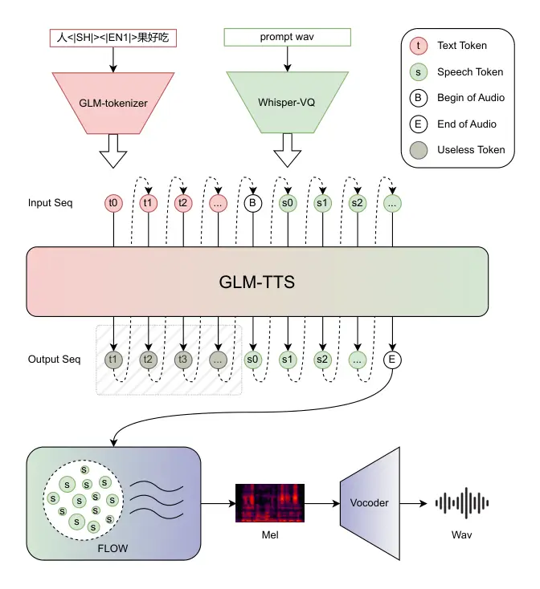

GLM-TTS Technical Report

Jiayan Cui^(⋆1)   Zhihan Yang^(⋆1)   Naihan Li¹   Jiankun Tian¹   Xingyu
Ma¹  
Yi Zhang¹   Guangyu Chen¹   Runxuan Yang¹²   Zijian Huang¹   Yuqing
Cheng¹  
Yizhi Zhou¹   Guochen Yu^(†1)   Xiaotao Gu¹   Jie Tang²

¹Zhipu AI  ²Tsinghua University

^(⋆)Equal contribution   ^(†)Project leader

|                                                                                     |                                                                          |
| ----------------------------------------------------------------------------------- | ------------------------------------------------------------------------ |
| Code:                                                                               | [github.com/zai-org/GLM-TTS](https://github.com/zai-org/GLM-TTS)         |
| ![[Uncaptioned image]](arxiv-2512-14291--2f6a16aee117.figures/figure-1.webp) Model: | [huggingface.co/zai-org/GLM-TTS](https://huggingface.co/zai-org/GLM-TTS) |
| Demo:                                                                               | [audio.z.ai/](https://audio.z.ai/)                                       |

Figure 1: Overall Architecture of GLM-TTS

###### Abstract

This work proposes GLM-TTS, a production-level TTS system designed for
efficiency, controllability, and high-fidelity speech generation.
GLM-TTS follows a two-stage architecture, consisting of a text-to-token
autoregressive model and a token-to-waveform diffusion model. With only
100k hours of training data, GLM-TTS achieves state-of-the-art
performance on multiple open-source benchmarks. To meet production
requirements, GLM-TTS improves speech quality through an optimized
speech tokenizer with fundamental frequency constraints and a GRPO-based
multi-reward reinforcement learning framework that jointly optimizes
pronunciation, speaker similarity, and expressive prosody. In parallel,
the system enables efficient and controllable deployment via
parameter-efficient LoRA-based voice customization and a hybrid
phoneme–text input scheme that provides precise pronunciation control.
Our code is available at
[https://github.com/zai-org/GLM-TTS](https://github.com/zai-org/GLM-TTS).
Real-time speech synthesis demos are provided via Z.ai
([audio.z.ai](https://audio.z.ai)), the Zhipu Qingyan app/web
([chatglm.cn](https://chatglm.cn)).

## 1 Introduction

Text-to-Speech (TTS) synthesis has evolved into a cornerstone technology
powering human-computer interaction, content creation, and accessibility
tools, from virtual assistants and podcast production to educational
narration and dubbing. Over the past decade, TTS systems have evolved
from early neural acoustic models that directly predict continuous
speech representations—such as attention-based sequence-to-sequence
models (e.g., Tacotron (Wang et al., 2017), Transformer-TTS (Li et al.,
2019)) and non-autoregressive feed-forward architectures (e.g.,
Fastspeech (Ren et al., 2019) series) to Transformer-based (Vaswani et
al., 2023) large language model (LLM)-driven paradigms that treat speech
generation as discrete token modeling. This transition has enabled
substantial progress in in-context learning (ICL) zero-shot voice
cloning, multilingual synthesis, and prosodic naturalness.

Recent advanced TTS models can be broadly categorized into three
paradigms: (1) auto-regressive (AR) zero-shot TTS based on neural codec
such as SoundStream (Zeghidour et al., 2021) and EnCodec (Défossez et
al., 2022) (e.g., VALL-E (Wang et al., 2023a), Spark-TTS (Wang et al.,
2025b)); (2) flow-matching or diffusion-based non-autoregressive (NAR)
paradigms (e.g., E3-TTS (Gao et al., 2023a), F5-TTS (Chen et al., 2025),
F5R-TTS (Sun et al., 2025), et al.); (3) hybrid AR-NAR architectures
(e.g., CosyVoice (Du et al., 2024a), FireRedTTS (Guo et al., 2025),
Seed-TTS(Anastassiou et al., 2024), MiniMax-Speech (Zhang et al., 2025),
and IndexTTS2 (Zhou et al., 2025a), et al.), which have collectively
narrowed the gap between synthetic and human speech.

Despite these achievements, recent state-of-the-art (SOTA) TTS systems
still face critical challenges that hinder production-level deployment.
First, high-quality voice cloning typically requires large-scale
training data and relatively long reference recordings, limiting
applicability in low-resource scenarios. Second, emotional
expressiveness remains constrained. Most models either fail to capture
nuanced text-related emotions or rely on explicit emotion labels that
complicate workflows and generalization. Third, the precision of
pronunciation for polyphonic characters, rare words, and dialects
remains suboptimal, especially in languages such as Chinese with rich
phonetic variations. Fourth, reinforcement learning (RL), while
promising for aligning speech outputs with human preferences, is
underexplored in TTS due to difficulties in reward design and training
stability. Finally, adapting premium or personalized voices often relies
on costly full-model fine-tuning, making scalable customization
impractical in production settings.

To address these limitations, we present GLM-TTS, a production-level TTS
system optimized for efficiency, controllability, and naturalness. As
shown in Figure 1, built on a two-stage generation paradigm inspired by
CosyVoice (Text-to-Token Autoregressive + Token-to-Wav Diffusion),
GLM-TTS achieves SOTA performance on open-source benchmarks with only
100k hours of training data, which is far less than large-scale
counterparts like CosyVoice 3 (1M hours) (Du et al., 2025) and
FireRedTTS-2 (1.1M hours) (Xie et al., 2025).

Our contributions are structured around the practical requirements of
industrial TTS deployment:

- $`\bullet`$
  Speech Tokenizer: Leveraging an optimized Whisper-VQ speech tokenizer
  with fundamental frequency constraints and expanded vocabulary (32k),
  GLM-TTS achieves high speaker similarity (SIM = 76.1) and low
  character error rate (CER = 1.03%) on Seed-TTS-eval zh test-set.
- $`\bullet`$
  Multi-Reward Reinforcement Learning: Adopting a GRPO-based RL
  framework, we fuse four critical rewards (CER for pronunciation
  accuracy, SIM for timbre fidelity, Emotion for expressive naturalness,
  and Laughter for paralinguistic realism) with dynamic sampling and
  gradient clipping. This resolves the reward hacking and training
  instability issues plaguing prior RL-based TTS, enabling GLM-TTS to
  outperform commercial models in nuanced emotion expression (e.g.,
  happy, sadness, and anger) on the CV3-eval-emotion benchmark and to
  achieve superior WER and SIM metrics on the Seed-TTS-eval benchmark as
  well.
- $`\bullet`$
  Low-Cost Premium Voice Customization: Through optimized LoRA
  fine-tuning, GLM-TTS achieves full-model-level performance by
  adjusting only 15% of parameters—reducing data requirements to 1 hour
  of single-speaker audio and training costs by 80% compared to full
  fine-tuning.
- $`\bullet`$
  Precision Pronunciation Control: A “Hybrid Phoneme + Text” input
  scheme with a dynamically extensible dictionary addresses polyphonic
  and rare word ambiguities, a longstanding challenge in Chinese TTS,
  without sacrificing prosodic naturalness.
- $`\bullet`$
  Enhanced Waveform Reconstruction: A novel Vocos2D vocoder replaces 1D
  convolutions with 2D operations and DiT-style residual connections,
  improving frequency subband modeling. Mixed training with high-quality
  singing data expands the vocal range and adapts the model to complex
  acoustic conditions.

## 2 Methodology

### 2.1 Data processing pipeline

Leveraging proprietary audio datasets, we have constructed a
comprehensive and robust data processing pipeline to generate
high-quality audio data for subsequent model training. The data pipeline
consists of the following steps:

Figure 2: An overview of the data processing pipeline.

- •
  Speech Standardization and Coarse Segmentation. First, we unify
  heterogeneous audio data into the WAV format to eliminate
  format-related inconsistencies. Then, Voice Activity Detection (VAD)
  technology (Bredin et al., 2019) is applied to segment valid speech
  fragments from the original audio, and these valid fragments are then
  concatenated into long audio clips of approximately 10 minutes for
  subsequent processing steps.
- •
  Source Separation and Denoising. To obtain clean speech signals, we
  first adopt the Mel-Band Roformer model (an improved variant of the
  RoFormer model (Wang et al., 2023b)) to separate background sounds
  from the speech signals. After that, a self-developed denoising model
  is used to further suppress residual noise, ensuring the purity of the
  speech data.
- •
  Speaker Diarization and Concatenation. We leverage the pyannote.audio
  model (Bredin et al., 2019) to implement multi-speaker separation,
  which can accurately distinguish speech fragments from different
  speakers. For the speech fragments of a single speaker, we perform
  amplitude normalization to ensure consistent volume levels, and then
  concatenate these fragments until the total length reaches the target
  duration (capping the sequence length at 40 seconds).
- •
  WER Filtering. To select high-quality audio data, we conduct speech
  recognition and Word Error Rate (WER) calculation with a double-check
  mechanism:
  - –
    For Chinese audio: Open-source Automatic Speech Recognition (ASR)
    models including Paraformer (Gao et al., 2023b) and SenseVoice (An
    et al., 2024) are used for transcription.
  - –
    For English audio: Open-source ASR models including Whisper (Radford
    et al., 2022) and Reverb (Bhandari et al., 2025) are adopted for
    transcription.

  We calculate the WER for the transcribed text and retain only the
  audio data with a WER of less than 5% to ensure high accuracy of the
  speech-content correspondence.

- •
  Punctuation Optimization. First, we perform text-speech forced
  alignment (Kürzinger et al., 2020) to obtain the pronunciation
  duration of each character in the transcribed text. Then, we calculate
  the pronunciation threshold as the sum of the mean and 2.6 times the
  variance of the character pronunciation durations. Finally, we
  optimize the punctuation based on the interval between adjacent
  characters: If the interval exceeds the threshold, we retain or add
  punctuation. Otherwise, punctuation is omitted.
- •
  Feature Extraction. Based on the filtered single-speaker clean audio
  data, we extract audio speaker embeddings and speech tokens to support
  the training of subsequent models.
- •
  Overall Engineering Optimization. To enable large-scale data
  processing efficiently, we adopt the gRPC framework (Google, 2015) and
  a server-worker architecture to accelerate each sub-module of the
  pipeline. Additionally, we rely on a distributed cluster to fully
  utilize the memory of multiple GPUs and the batch processing
  capability, significantly improving the overall processing efficiency
  of the pipeline.

### 2.2 Text Tokenizer

Vocabulary Pruning for Alignment Stability. To alleviate the modeling
burden of semantic-to-acoustic alignment, we prune the tokenizer’s
vocabulary by removing tokens composed of more than two Chinese
characters. Although we implement heuristic constraints during sampling
to bound the speech-to-text length ratio (e.g., within $`[2,20]`$),
relying solely on such hard constraints is insufficient for optimal
convergence. Long text tokens inherently exhibit high variance in
acoustic duration and frequently stretch the upper bounds of the ratio,
creating sparse and difficult-to-learn mappings. By enforcing a finer
text granularity, we intrinsically normalize the information density and
center the length ratio distribution. This structural optimization
effectively alleviates the burden of learning extreme one-to-many
text-to-acoustic alignments, ensuring robust autoregressive generation
even at a high speech token rate of 25 Hz.

### 2.3 Speech Tokenizer

GLM-TTS introduces a series of optimizations to the Whisper-VQ speech
tokenizer (Radford et al., 2022) based on GLM-4-Voice (Zeng et al.,
2024), aimed at improving pronunciation accuracy, naturalness, and
expressiveness:

- •
  Increased Token Generation Rate. The token rate is doubled from 12.5Hz
  to 25Hz, and the vocabulary size is expanded from 16k to 32k. This
  enhancement effectively reduces pronunciation glitches at high
  speaking speeds and improves the naturalness of paralinguistic
  features such as laughter and breathing sounds.
- •
  Introduction of Pitch Estimator (PE) Module. A new pitch estimation
  module has been added to optimize pitch modeling accuracy, thereby
  improving the prosody alignment between the cloned TTS output and
  reference (prompt) audio.
- •
  Adoption of Non-Causal Architecture. The original causal constraint
  has been lifted. The block attention structure was removed, and causal
  convolution has been replaced with standard convolution, removing
  sequential bottlenecks and improving the accuracy of both the ASR and
  PE modules.
- •
  Expanded Training Data Scope. The scale and diversity of training data
  are significantly increased. Large-scale dialect datasets have been
  incorporated to strengthen dialect comprehension, and high-quality
  singing voice data have been added to enrich the model’s phonetic
  learning samples, further enhancing adaptability to diverse scenarios.

### 2.4 SpeechLM RL-Alignment

Reinforcement learning has not yet been widely applied in speech
synthesis, with major bottlenecks stemming from the complexity of reward
mechanism design and the propensity for gradient vanishing or
performance degradation during training. GLM-TTS addresses these
challenges by introducing the GRPO (Shao et al., 2024) reinforcement
learning paradigm along with a series of strategies, significantly
enhancing the core capabilities of both pre-trained and SFT
models—including pronunciation accuracy, timbre similarity, and overall
naturalness. Furthermore, GLM-TTS achieves superior human-like
qualities, notably in emotional expressivity and the naturalness of
paralinguistic features. Figure 3 illustrates the GLM-TTS-GRPO
framework.

Figure 3: An overview of the GLM-TTS-GRPO framework.

Leveraging the GRPO algorithmic framework, we achieve significant
performance improvements through three major design advancements:

First, we introduce a multidimensional regularization reward mechanism,
integrating four core rewards—CER (character error rate), SIM
(similarity), Emotion, and Laughter. By employing a hierarchical
processing strategy (“individual reward regularization → weighted fusion
→ overall regularization”), we effectively address the issue of
different reward distributions.

Second, we implement a dynamic sampling strategy to mitigate potential
gradient vanishing within a batch. This mechanism automatically triggers
resampling (up to three times) when batch rewards become homogeneous,
while limiting the total number of resampling to avoid negative
optimization from poor-quality samples, thereby balancing training
stability and efficiency.

Third, we adopt an adaptive gradient clipping scheme, setting
$`\epsilon_{high}`$ and $`\epsilon_{low}`$ as dynamic values that adjust
according to training steps. In the early stages, tighter clipping
prevents the model from quickly exploiting reward hacking shortcuts; in
the later stages, the constraints are gradually relaxed to allow for
broader exploration. Reasonable parameter ranges ensure the number of
clipped tokens remains stable, preventing ineffective clipping or
excessive restriction. Additionally, setting
$`\epsilon_{high}>\epsilon_{low}`$ encourages the generation of
low-probability tokens, significantly enhancing the human-likeness of
synthesized speech.

### 2.5 LoRA for Premium Voice Customization

Full parameter fine-tuning in large speech models is often costly and
unstable due to uneven data quality. To address this, we optimize the
LoRA (Low-Rank Adaptation) fine-tuning paradigm for “Premium Voice
Customization”. This approach aims to achieve stable, high-quality voice
customization with low resource and cost overhead.

- •
  Efficiency and Efficacy. By fine-tuning only about 15% of the core
  backbone parameters for approximately 100 epochs, we achieve voice
  similarity and naturalness comparable to full parameter fine-tuning.
  This is a significant improvement over initial explorations where
  tuning only $`0.3\%-5\%`$ of parameters resulted in limited
  improvement in voice style and emotion.
- •
  Cost Efficiency and Data Robustness. Customization requires only about
  1 hour of high-quality single-speaker audio, significantly lowering
  development costs and barriers. This streamlined process eliminates
  the need for large-batch data testing and complex data matching and
  quality filtering, which are often problematic due to the high
  inconsistency in data distribution and quality in SFT.
- •
  Stability. Controlling the ratio of fine-tuned parameters (e.g., above
  15%) enhances generalization and stability across different scenarios,
  ensuring production-level reliability. The improved stability is
  crucial as complex requirements for small-batch, high-demand voice
  customization are difficult to implement effectively using full
  parameter fine-tuning.

### 2.6 Phoneme-in

In professional speech synthesis scenarios, such as education and
standardized testing, there is an exceptionally high demand for
pronunciation accuracy. Traditional large-scale TTS models typically
rely on automatic sampling or default probabilities when handling
complex linguistic features like polyphones (characters with multiple
pronunciations) and rare characters. This lack of explicit control
mechanisms often results in uncontrollable pronunciation and higher
error rates. To address this, we introduce Phoneme-in, an enhancement
capability that utilizes phoneme-level input to achieve precise,
controllable pronunciation.

Vocabulary Construction and Regularization. We construct dedicated
vocabularies for polyphones and rare characters to aggregate terms
requiring precise control in key application scenarios. These
vocabularies support the downstream logic for targeted phoneme
replacement and allow for dynamic maintenance and expansion based on
specific business requirements.

Hybrid Training Paradigm. To equip the model with the ability to
understand and adapt to phoneme inputs, we employ a mixed-modality
training strategy:

- •
  For standard characters (excluding defined polyphones and rare
  characters), we employ a two-stage probabilistic replacement strategy.
  During training, the replacement process is triggered with a specific
  probability (e.g., $`p=0.2`$). Once triggered, a random subset of
  characters is converted into phonemes, where the replacement ratio is
  uniformly sampled between $`0`$ and a maximum threshold (e.g.,
  $`0.5`$). This dynamic “Hybrid Phoneme + Text” augmentation
  significantly enhances the model’s robustness to mixed-modality
  inputs.
- •
  Characters belonging to the polyphone or rare character vocabularies
  are preserved as original text without conversion during training,
  ensuring the model retains semantic context for these complex cases.

Fine-grained Control at Inference. The inference process is designed to
maximize precision:

1.  1.  The system first processes the entire input sentence through a
        Grapheme-to-Phoneme (G2P) module to generate a complete phoneme
        sequence (phoneme_list).
2.  2.  It iterates through the original text list; if a polyphone or rare
        character is encountered, the text is replaced with its
        corresponding phoneme from the generated list.
3.  3.  The final input to the model takes a “hybrid phoneme+text” format.
        This approach ensures precise pronunciation control for ambiguous
        characters while preserving the natural prosody associated with the
        standard text.

### 2.7 Vocos2D

The original Vocos (Siuzdak, 2024), a GAN-based vocoder, uses 1D
convolutions in its generator to process entire frames across all
frequencies. Drawing inspiration from sub-band processing and
image-processing techniques, we redesign the generator to incorporate 2D
convolutions, enabling more focused handling of specific frequency
subbands. Figure 4 illustrates the Vocos2D generator architecture.

Figure 4: Diagram of the Vocos2D generator architecture. FC denotes a
fully connected (linear) layer, PwConv denotes point-wise convolution,
and DwConv denotes depth-wise convolution.

For the input $`X_{in}`$, an initial point-wise convolution (implemented
as a fully connected linear layer) is followed by learned per-frequency
embeddings to facilitate inter-frequency communication, as translation
invariance does not apply across frequency bins.

The Vocos2D backbone block adapts the original ConvNeXt design,
augmented with additional shortcut connections from the input Mel
spectrogram $`X_{in}`$. These are regressed through a linear layer and
added to the inverted bottleneck stage, allowing direct incorporation of
the input spectrogram condition.

Figure 5: Comparison of the original Vocos generator loss (upper) and
the proposed Vocos2D generator loss (lower). DA denotes discriminator
augmentation, Hinge denotes hinge loss, MPD denotes multi-period
discriminator, and MRD denotes multi-resolution discriminator.

Generator Loss. Figure 5 compares the generator losses of the original
Vocos and Vocos2D. We make two key changes: (1) removing the
multi-period discriminator, as it degraded performance on input linear
spectrograms with more frequency bins; and (2) adding discriminator
augmentation (DA) (Zhao et al., 2020; Karras et al., 2020) before
feeding real and fake waveforms into the multi-resolution
discriminator (Jang et al., 2021). DA improves training stability by
applying differentiable transformations only to the discriminator,
allowing gradients to flow back to the generator without forcing it to
model augmentations. We use three transformations: random loudness
adjustments within $`\pm 6`$ dB, random sample shifts, and random phase
rotations.

Discriminator Training. Apart from the removal of the multi-period
discriminator, Vocos2D’s discriminator training mirrors the original
Vocos, using hinge loss (Zhang et al., 2019; Pan et al., 2023) and the
multi-resolution discriminator (Jang et al., 2021).

Dataset. To support 32 kHz high-quality wideband speech synthesis, we
augment our proprietary speech dataset with high-quality open-source
singing voice data, expanding pitch range coverage and enhancing overall
sound quality and adaptability to varied vocalization techniques.

## 3 Experiments and Results

### 3.1 Speech tokenizer Evaluation

We evaluate GLM-TTS-tokenizer across two English test sets and five
Chinese dialect and accented Mandarin test sets, comparing with
GLM4-Voice-tokenizer. As shown in Table 1, the GLM-TTS-tokenizer
significantly outperforms the GLM-4-Voice tokenizer in Chinese
recognition, and shows minor improvements in English recognition.

Further, we implement TTS systems on both tokenizers and evaluate TTS
metrics. The results in Table 2 show that GLM-TTS outperforms the
variant built on GLM4-Voice-tokenizer in terms of Speaker
Similarity(SIM) and CER.

|                      |       |         |          |           |         |           |          |
| -------------------- | ----- | ------- | -------- | --------- | ------- | --------- | -------- |
| Tokenizer            | Libri | Libri   | Sichuan  | Jiao-Liao | Taiwan  | Cantonese | Shanghai |
| Other                | Clean | dialect | Mandarin | Mandarin  | dialect |           |          |
| GLM4-Voice-tokenizer | 4.90  | 2.10    | 54.11    | 14.04     | 49.09   | 46.81     | 72.06    |
| GLM-TTS-tokenizer    | 4.51  | 2.12    | 24.40    | 9.11      | 16.92   | 7.27      | 19.15    |

Table 1: Performance of TTS systems built on GLM4-Voice-tokenizer and
GLM-TTS-tokenizer on ASR tasks. Values represent WER/CER, the lower, the
better.

| Tokenizer            | SIM$`\uparrow`$ | CER$`\downarrow`$ |
| -------------------- | --------------- | ----------------- |
| GLM4-Voice-tokenizer | 75.2            | 1.44              |
| GLM-TTS-tokenizer    | 76.1            | 1.03              |

Table 2: Performance of GLM4-Voice-tokenizer and GLM-TTS-tokenizer on
seed_test_zh.

|                                     |        |             |                    |                  |                    |                  |
| ----------------------------------- | ------ | ----------- | ------------------ | ---------------- | ------------------ | ---------------- |
| Model                               | Params | Open source | test-zh            |                  | test-en            |                  |
|                                     |        |             | CER $`\downarrow`$ | SIM $`\uparrow`$ | WER $`\downarrow`$ | SIM $`\uparrow`$ |
| MegaTTS3 (Jiang et al., 2025)       | 0.5B   | No          | 1.52               | 79.0             | 2.79               | 77.1             |
| DiTAR (Jia et al., 2025)            | 0.6B   | No          | 1.02               | 75.3             | 1.69               | 73.5             |
| CosyVoice3 (Du et al., 2025)        | 1.5B   | No          | 1.12               | 78.1             | 2.22               | 72.0             |
| Seed-TTS (Anastassiou et al., 2024) | \-     | No          | 1.12               | 79.6             | 2.25               | 76.2             |
| MiniMax-Speech (Zhang et al., 2025) | \-     | No          | 0.83               | 78.3             | 1.65               | 69.2             |
| F5-TTS (Chen et al., 2025)          | 0.3B   | Yes         | 1.53               | 76.0             | 2.00               | 67.0             |
| MaskGCT (Wang et al., 2024)         | \-     | Yes         | 2.27               | 77.4             | 2.62               | 71.7             |
| CosyVoice (Du et al., 2024a)        | 0.3B   | Yes         | 3.63               | 72.3             | 4.29               | 60.9             |
| CosyVoice2 (Du et al., 2024b)       | 0.5B   | Yes         | 1.38               | 75.7             | 3.09               | 65.9             |
| CosyVoice3 (Du et al., 2025)        | 0.5B   | Yes         | 1.16               | 78.0             | 2.02               | 71.8             |
| SparkTTS (Wang et al., 2025a)       | 0.5B   | Yes         | 1.54               | 66.0             | 3.14               | 57.3             |
| FireRedTTS (Guo et al., 2025)       | 0.5B   | Yes         | 1.51               | 63.5             | 3.82               | 46.0             |
| FireRedTTS-2 (Xie et al., 2025)     | \-     | Yes         | 1.14               | 73.6             | 1.95               | 66.5             |
| Qwen2.5-Omni (Xu et al., 2025)      | 7B     | Yes         | 1.70               | 75.2             | 2.72               | 63.2             |
| OpenAudio-s1-mini (OpenAudio, 2024) | 0.5B   | Yes         | 1.18               | 68.5             | 1.94               | 55.0             |
| IndexTTS 2 (Zhou et al., 2025a)     | 1.5B   | Yes         | 1.03               | 76.5             | 2.23               | 70.6             |
| VibeVoice (Peng et al., 2025)       | 1.5B   | Yes         | 1.16               | 74.4             | 3.04               | 68.9             |
| HiggsAudio-v2 (BosonAI, 2025)       | 3B     | Yes         | 1.50               | 74.0             | 2.44               | 67.7             |
| VoxCPM (Zhou et al., 2025b)         | 0.5B   | Yes         | 0.93               | 77.2             | 1.85               | 72.9             |
| GLM-TTS (Ours)                      | 1.5B   | Yes         | 1.03               | 76.1             | 2.23               | 67.2             |
| GLM-TTS_RL (Ours)                   | 1.5B   | Yes         | 0.89               | 76.4             | 1.91               | 68.1             |

Table 3: Performance comparison on different test sets. test-zh: Chinese
standard test set; test-en: English test set; test-hard: Hard case test
set (polyphones, rare words). CER/WER are lower-is-better
($`\downarrow`$), SIM is higher-is-better ($`\uparrow`$).

### 3.2 Voice Cloning Results on Seed-TTS-eval

Table 3 reports results on the Seed-TTS-eval benchmark using standard
TTS metrics: Character Error Rate (CER) and Word Error Rate (WER) for
pronunciation accuracy (lower is better), and Speaker Similarity (SIM,
higher is better) measured by calculating the cosine similarity between
speaker embeddings extracted using fine-tuned WavLM-large(Chen et al.,
2022). We compare GLM-TTS (1.5B parameters, open-source) with 19
state-of-the-art baselines, including both closed-source systems (e.g.,
MiniMax-Speech, Seed-TTS, et al.) and open-source models (e.g.,
IndexTTS2, FireRedTTS-2, VibeVoice, et al.).

On the test-zh set, closed-source models deliver leading performance:
MiniMax-Speech achieves a state-of-the-art CER of 0.83%, while Seed-TTS
attains a standout SIM of 79.6. GLM-TTS attains a CER of 1.03% and SIM
of 76.1, delivering results that are generally comparable to the
open-source SOTA TTS model, such as VoxCPM and IndexTTS2. After applying
our multi-reward GRPO reinforcement learning, GLM-TTS_RL further
improves to CER=0.89% and SIM=76.4, substantially narrowing the gap with
the leading closed-source systems.

Notably, due to practical industrial constraints, GLM-TTS is trained
with a limited amount of English data (less than half of the Chinese
training data). Despite this limitation, on the test-en set, GLM-TTS
still achieves reasonable WER (2.23%) and SIM (67.2) performance on the
English test set, suggesting potential for further improvement with
additional English data.

Overall, GLM-TTS achieves top-tier performance among 1.5B-scale
open-source models on the Seed-TTS-eval test set, with a negligible
performance gap relative to state-of-the-art closed-source counterparts.
These results demonstrate the effectiveness of the proposed overall
framework, and further validate the effectiveness of our core design
choices—multi-reward GRPO reinforcement learning for consistently
improving pronunciation accuracy and timbre fidelity.

### 3.3 Speech-LM RL-Alignment

We adopt two techniques from DAPO (Yu et al., 2025): Clip-Higher and
Dynamic Sampling. First, we set $`\epsilon_{high}`$ to 0.3 and
$`\epsilon_{low}`$ to 0.2. For Dynamic Sampling, to facilitate training,
we resample batches with zero advantages up to three times. As shown in
Table 4, Clip-Higher yields fully positive gains. Dynamic Sampling
improves both SIM and CER, yet leads to a decline in EMO. This is
because repeated sampling can easily induce variance in SIM or CER
across different samples, while the distribution of EMO is more extreme,
approximating a bimodal distribution concentrated near 0 and 1.
Consequently, we no longer consider the variance introduced by SIM in
the resampling process.

| Model           | CER$`\downarrow`$ | SIM$`\uparrow`$ | EMO$`\uparrow`$ |
| --------------- | ----------------- | --------------- | --------------- |
| Pretrain-base   | 2.05              | 80.0            | 0.525           |
| Pretrain-GRPO   | 1.99              | 80.3            | 0.565           |
| Pretrain-GRPO_c | 1.93              | 80.4            | 0.660           |
| Pretrain-GRPO_d | 1.91              | 80.8            | 0.440           |

Table 4: Performance of Pretrain-GRPO with Clip-Higher and Dynamic
Sampling on an internal emotion test set. $`c`$ represents Clip-Higher
and $`d`$ represents Dynamic Sampling.

Since Clip-Higher has demonstrated improvement, we further explored
dynamically adjusting parameters such as $`\epsilon_{h}`$ during
training to provide the model with sufficient exploration space while
maintaining training stability. Specifically, we selected three
parameters, $`\epsilon_{h}`$, $`\epsilon_{l}`$, and $`T`$ with initial
values of 0.3, 0.2, and 1, respectively, and allowed them to linearly
increase as training progressed until training completion. As shown in
Table 5, we observed that more aggressive parameter settings tend to
lead to less stable training: while emotional expressiveness is
enhanced, pronunciation becomes less clear. Moreover, excessively loose
constraints are also prone to resulting in reward hacking.

| Model        | params |                  |                  | metrics           |                 |                 |
| ------------ | ------ | ---------------- | ---------------- | ----------------- | --------------- | --------------- |
|              | T      | $`\epsilon_{h}`$ | $`\epsilon_{l}`$ | CER$`\downarrow`$ | SIM$`\uparrow`$ | EMO$`\uparrow`$ |
| SFT-base     | \-     | \-               | \-               | 2.13              | 76.1            | 0.695           |
| SFT-GRPO^(∗) | \-     | \-               | \-               | 2.21              | 76.3            | 0.720           |
| SFT-GRPO     | 1.5    | 0.5              | 0.4              | 2.09              | 76.7            | 0.705           |
| SFT-GRPO     | 2      | 1                | 0.4              | 2.16              | 75.5            | 0.790           |
| SFT-GRPO     | 3      | 1                | 0.4              | 2.21              | 78.1            | 0.885           |

Table 5: Performance of SFT-GRPO with dynamic $`\epsilon_{h}`$,
$`\epsilon_{l}`$, and $`T`$ on an internal emotion test set. $`*`$ means
freezing parameters during training process.

To further improve laughter modeling, we introduced a laughter reward,
which can be summarized as follows: if the text contains two or more
consecutive laughter words (such as “ha” and “hey”), and the laughter
detection model identifies a laughter segment, then (1) if the ASR
system transcribes the segment as a “deletion”(empty string), the reward
is set to 1; (2) if the ASR system transcribes the corresponding text,
the reward is set to 0.

We experimented with different weights $`\lambda_{laughter}`$ for the
laughter reward and the results are shown in Table 6. Increasing the
laughter reward leads to decreases in CER and similarity scores, as
laughter segments cannot be recognized by the ASR model as textual
content, and the timbre of laughter differs from the speaker’s regular
speaking voice. Nevertheless, enhancing laughter synthesis can also
improve the model’s emotional expressiveness.

| Model    | params                 | metrics           |                 |                 |
| -------- | ---------------------- | ----------------- | --------------- | --------------- |
|          | $`\lambda_{laughter}`$ | CER$`\downarrow`$ | SIM$`\uparrow`$ | EMO$`\uparrow`$ |
| SFT-base | \-                     | 3.11              | 76.3            | 0.44            |
| SFT-GRPO | 2                      | 2.86              | 74.6            | 0.64            |
| SFT-GRPO | 5                      | 3.18              | 74.8            | 0.66            |
| SFT-GRPO | 10                     | 3.06              | 74.8            | 0.72            |

Table 6: Performance of SFT-GRPO with different $`\lambda_{laughter}`$
on an internal emotion test set.

### 3.4 Effectiveness of Phoneme-in

To rigorously evaluate the impact of the Phoneme-in mechanism on
pronunciation accuracy, we conducted a targeted ablation study using a
proprietary internal dataset. Unlike standard public benchmarks, this
dataset is specifically constructed to simulate challenging industrial
scenarios, characterized by a high density of polyphonic characters,
low-frequency words, and ambiguous contexts that typically confuse
end-to-end TTS systems.

We compared the performance of GLM-TTS with and without the Phoneme-in
module enabled. As illustrated in Table 7, the baseline model, which
relies solely on text input and implicit grapheme-to-phoneme prediction,
yields a Phoneme Error Rate (PER) of 13.23%. This relatively high error
rate indicates the inherent difficulty of the test set. However, when
the Phoneme-in mechanism is activated—allowing for fine-grained,
phoneme-level intervention—the PER dramatically drops to 5.14%.

| Model Settings           | Input Modality          | PER ($`\downarrow`$) |
| ------------------------ | ----------------------- | -------------------- |
| GLM-TTS (w/o Phoneme-in) | Text Only               | 13.23                |
| GLM-TTS (w/ Phoneme-in)  | Hybrid (Text + Phoneme) | 5.14                 |

Table 7: Ablation study of the Phoneme-in mechanism on the internal
hard-case dataset. The use of hybrid phoneme input significantly reduces
pronunciation errors.

### 3.5 Vocos2D vocoder

|         | NISQA$`\uparrow`$ | UTMOS$`\uparrow`$ | Ab. Aes.-PQ$`\uparrow`$ | MOS$`\uparrow`$ |
| ------- | ----------------- | ----------------- | ----------------------- | --------------- |
| GT      | 3.47              | 2.11              | 7.68                    | 4.77            |
| Vocos   | 3.16              | 1.87              | 7.56                    | 3.58            |
| Vocos2D | 3.40              | 1.91              | 7.64                    | 4.16            |

Table 8: Performance comparison between Vocos and Vocos2D.

We evaluate Vocos2D on an internal test set of randomly selected audio
samples. Objective metrics include UTMOS (Saeki et al., 2022),
NISQA (Mittag et al., 2021), and the production quality (PQ) score from
Meta AudioBox Aesthetics (Tjandra et al., 2025), complemented by
subjective MOS evaluations. As shown in Table 8, Vocos2D consistently
outperforms the original Vocos across all metrics, demonstrating the
effectiveness of the proposed architectural and training improvements.

## 4 Conclusion

In this technical report, we introduce GLM-TTS, a production-level
text-to-speech system that systematically addresses several
long-standing challenges in modern TTS. With only 100k hours of training
data, GLM-TTS achieves competitive pronunciation accuracy and speaker
similarity. The proposed multi-reward GRPO-based reinforcement learning
framework effectively aligns synthesized speech with human perceptual
preferences, leading to consistent improvements in pronunciation
accuracy, emotional expressiveness, and speaker similarity without
sacrificing training stability.

Beyond core model performance, GLM-TTS emphasizes practical
deployability. The optimized LoRA-based premium voice customization
strategy significantly reduces both data and computational costs,
enabling scalable personalization in production environments. The hybrid
phoneme-text input mechanism provides precise and controllable
pronunciation for polyphonic and rare words, addressing a critical
requirement in professional and educational TTS applications, especially
for Chinese. Overall, GLM-TTS provides a practical framework for
efficient and controllable speech synthesis. We hope it can serve as a
foundation for future research on expressive, customizable, and scalable
speech generation.

## References

- An et al. (2024) K. An, Q. Chen, C. Deng, Z. Du, C. Gao, Z. Gao, Y.
  Gu, T. He, H. Hu, K. Hu, S. Ji, Y. Li, Z. Li, H. Lu, H. Luo, X. Lv, B.
  Ma, Z. Ma, C. Ni, C. Song, J. Shi, X. Shi, H. Wang, W. Wang, Y.
  Wang, Z. Xiao, Z. Yan, Y. Yang, B. Zhang, Q. Zhang, S. Zhang, N. Zhao,
  and S. Zheng FunAudioLLM: voice understanding and generation
  foundation models for natural interaction between humans and llms.
  External Links: 2407.04051, [Link](https://arxiv.org/abs/2407.04051)
  Cited by: 1st item.
- Anastassiou et al. (2024) P. Anastassiou, J. Chen, J. Chen, Y.
  Chen, Z. Chen, Z. Chen, J. Cong, L. Deng, C. Ding, L. Gao, M. Gong, P.
  Huang, Q. Huang, Z. Huang, Y. Huo, D. Jia, C. Li, F. Li, H. Li, J.
  Li, X. Li, X. Li, L. Liu, S. Liu, S. Liu, X. Liu, Y. Liu, Z. Liu, L.
  Lu, J. Pan, X. Wang, Y. Wang, Y. Wang, Z. Wei, J. Wu, C. Yao, Y.
  Yang, Y. Yi, J. Zhang, Q. Zhang, S. Zhang, W. Zhang, Y. Zhang, Z.
  Zhao, D. Zhong, and X. Zhuang Seed-TTS: a family of high-quality
  versatile speech generation models. External Links: 2406.02430,
  [Link](https://arxiv.org/abs/2406.02430) Cited by: §1, Table 3.
- Bhandari et al. (2025) N. Bhandari, D. Chen, M. Á. del Río
  Fernández, N. Delworth, J. D. Fox, M. Jetté, Q. McNamara, C.
  Miller, O. Novotný, J. Profant, N. Qin, M. Ratajczak, and J. Robichaud
  Reverb: open-source asr and diarization from rev. External Links:
  2410.03930, [Link](https://arxiv.org/abs/2410.03930) Cited by: 2nd
  item.
- BosonAI (2025) BosonAI Higgs Audio v2: redefining expressiveness in
  audio generation. External Links:
  [Link](https://github.com/boson-ai/higgs-audio) Cited by: Table 3.
- Bredin et al. (2019) H. Bredin, R. Yin, J. M. Coria, G. Gelly, P.
  Korshunov, M. Lavechin, D. Fustes, H. Titeux, W. Bouaziz, and M. Gill
  Pyannote.audio: neural building blocks for speaker diarization.
  External Links: 1911.01255, [Link](https://arxiv.org/abs/1911.01255)
  Cited by: 1st item, 3rd item.
- Chen et al. (2025) Y. Chen, Z. Niu, Z. Ma, K. Deng, C. Wang, J.
  Zhao, K. Yu, and X. Chen F5-TTS: a fairytaler that fakes fluent and
  faithful speech with flow matching. External Links: 2410.06885,
  [Link](https://arxiv.org/abs/2410.06885) Cited by: §1, Table 3.
- Chen et al. (2022) Z. Chen, S. Chen, Y. Wu, Y. Qian, C. Wang, S.
  Liu, Y. Qian, and M. Zeng Large-scale self-supervised speech
  representation learning for automatic speaker verification. External
  Links: 2110.05777, [Link](https://arxiv.org/abs/2110.05777) Cited by:
  §3.2.
- Défossez et al. (2022) A. Défossez, J. Copet, G. Synnaeve, and Y. Adi
  High fidelity neural audio compression. External Links: 2210.13438,
  [Link](https://arxiv.org/abs/2210.13438) Cited by: §1.
- Du et al. (2024a) Z. Du, Q. Chen, S. Zhang, K. Hu, H. Lu, Y. Yang, H.
  Hu, S. Zheng, Y. Gu, Z. Ma, Z. Gao, and Z. Yan CosyVoice: a scalable
  multilingual zero-shot text-to-speech synthesizer based on supervised
  semantic tokens. External Links: 2407.05407,
  [Link](https://arxiv.org/abs/2407.05407) Cited by: §1, Table 3.
- Du et al. (2025) Z. Du, C. Gao, Y. Wang, F. Yu, T. Zhao, H. Wang, X.
  Lv, H. Wang, C. Ni, X. Shi, K. An, G. Yang, Y. Li, Y. Chen, Z. Gao, Q.
  Chen, Y. Gu, M. Chen, Y. Chen, S. Zhang, W. Wang, and J. Ye CosyVoice
  3: towards in-the-wild speech generation via scaling-up and
  post-training. External Links: 2505.17589,
  [Link](https://arxiv.org/abs/2505.17589) Cited by: §1, Table 3, Table 3.
- Du et al. (2024b) Z. Du, Y. Wang, Q. Chen, X. Shi, X. Lv, T. Zhao, Z.
  Gao, Y. Yang, C. Gao, H. Wang, F. Yu, H. Liu, Z. Sheng, Y. Gu, C.
  Deng, W. Wang, S. Zhang, Z. Yan, and J. Zhou CosyVoice 2: scalable
  streaming speech synthesis with large language models. External Links:
  2412.10117, [Link](https://arxiv.org/abs/2412.10117) Cited by: Table 3.
- Gao et al. (2023a) Y. Gao, N. Morioka, Y. Zhang, and N. Chen E3 tts:
  easy end-to-end diffusion-based text to speech. External Links:
  2311.00945, [Link](https://arxiv.org/abs/2311.00945) Cited by: §1.
- Gao et al. (2023b) Z. Gao, S. Zhang, I. McLoughlin, and Z. Yan
  Paraformer: fast and accurate parallel transformer for
  non-autoregressive end-to-end speech recognition. External Links:
  2206.08317, [Link](https://arxiv.org/abs/2206.08317) Cited by: 1st
  item.
- Google (2015) Google gRPC: a high-performance, open-source universal
  rpc framework. Note: Official Website External Links:
  [Link](https://grpc.io/) Cited by: 7th item.
- Guo et al. (2025) H. Guo, Y. Hu, K. Liu, F. Shen, X. Tang, Y. Wu, F.
  Xie, K. Xie, and K. Xu FireRedTTS: a foundation text-to-speech
  framework for industry-level generative speech applications. External
  Links: 2409.03283, [Link](https://arxiv.org/abs/2409.03283) Cited by:
  §1, Table 3.
- Jang et al. (2021) W. Jang, D. Lim, J. Yoon, B. Kim, and J. Kim
  UnivNet: a neural vocoder with multi-resolution spectrogram
  discriminators for high-fidelity waveform generation. External Links:
  2106.07889, [Link](https://arxiv.org/abs/2106.07889) Cited by: §2.7,
  §2.7.
- Jia et al. (2025) D. Jia, Z. Chen, J. Chen, C. Du, J. Wu, J. Cong, X.
  Zhuang, C. Li, Z. Wei, Y. Wang, and Y. Wang DiTAR: diffusion
  transformer autoregressive modeling for speech generation. External
  Links: 2502.03930, [Link](https://arxiv.org/abs/2502.03930) Cited by:
  Table 3.
- Jiang et al. (2025) Z. Jiang, Y. Ren, R. Li, S. Ji, B. Zhang, Z.
  Ye, C. Zhang, B. Jionghao, X. Yang, J. Zuo, Y. Zhang, R. Liu, X. Yin,
  and Z. Zhao MegaTTS 3: sparse alignment enhanced latent diffusion
  transformer for zero-shot speech synthesis. External Links:
  2502.18924, [Link](https://arxiv.org/abs/2502.18924) Cited by: Table 3.
- Karras et al. (2020) T. Karras, M. Aittala, J. Hellsten, S. Laine, J.
  Lehtinen, and T. Aila Training generative adversarial networks with
  limited data. External Links: 2006.06676,
  [Link](https://arxiv.org/abs/2006.06676) Cited by: §2.7.
- Kürzinger et al. (2020) L. Kürzinger, D. Winkelbauer, L. Li, T.
  Watzel, and G. Rigoll CTC-segmentation of large corpora for german
  end-to-end speech recognition. Springer International Publishing.
  External Links: ISBN 9783030602765, ISSN 1611-3349,
  [Link](http://dx.doi.org/10.1007/978-3-030-60276-5_27),
  [Document](https://dx.doi.org/10.1007/978-3-030-60276-5%5F27) Cited
  by: 5th item.
- Li et al. (2019) N. Li, S. Liu, Y. Liu, S. Zhao, M. Liu, and M. Zhou
  Neural speech synthesis with transformer network. External Links:
  1809.08895, [Link](https://arxiv.org/abs/1809.08895) Cited by: §1.
- Mittag et al. (2021) G. Mittag, B. Naderi, A. Chehadi, and S. Möller
  NISQA: a deep cnn-self-attention model for multidimensional speech
  quality prediction with crowdsourced datasets. In Interspeech 2021,
  interspeech_2021. External Links:
  [Link](http://dx.doi.org/10.21437/Interspeech.2021-299),
  [Document](https://dx.doi.org/10.21437/interspeech.2021-299) Cited by:
  §3.5.
- OpenAudio (2024) OpenAudio OpenAudio s1: a cutting-edge text-to-speech
  model that performs like voice actors. Note: Official Blog External
  Links: [Link](https://openaudio.com/blogs/s1) Cited by: Table 3.
- Pan et al. (2023) Y. Pan, N. Li, Y. Zhang, P. Xu, and D. Yao
  Short-length ssvep data extension by a novel generative adversarial
  networks based framework. External Links: 2301.05599,
  [Link](https://arxiv.org/abs/2301.05599) Cited by: §2.7.
- Peng et al. (2025) Z. Peng, J. Yu, W. Wang, Y. Chang, Y. Sun, L.
  Dong, Y. Zhu, W. Xu, H. Bao, Z. Wang, S. Huang, Y. Xia, and F. Wei
  VibeVoice technical report. External Links: 2508.19205,
  [Link](https://arxiv.org/abs/2508.19205) Cited by: Table 3.
- Radford et al. (2022) A. Radford, J. W. Kim, T. Xu, G. Brockman, C.
  McLeavey, and I. Sutskever Robust speech recognition via large-scale
  weak supervision. External Links: 2212.04356,
  [Link](https://arxiv.org/abs/2212.04356) Cited by: 2nd item, §2.3.
- Ren et al. (2019) Y. Ren, Y. Ruan, X. Tan, T. Qin, S. Zhao, Z. Zhao,
  and T. Liu FastSpeech: fast, robust and controllable text to speech.
  External Links: 1905.09263, [Link](https://arxiv.org/abs/1905.09263)
  Cited by: §1.
- Saeki et al. (2022) T. Saeki, D. Xin, W. Nakata, T. Koriyama, S.
  Takamichi, and H. Saruwatari UTMOS: utokyo-sarulab system for voicemos
  challenge 2022. External Links: 2204.02152,
  [Link](https://arxiv.org/abs/2204.02152) Cited by: §3.5.
- Shao et al. (2024) Z. Shao, P. Wang, Q. Zhu, R. Xu, J. Song, X. Bi, H.
  Zhang, M. Zhang, Y. K. Li, Y. Wu, and D. Guo DeepSeekMath: pushing the
  limits of mathematical reasoning in open language models. External
  Links: 2402.03300, [Link](https://arxiv.org/abs/2402.03300) Cited by:
  §2.4.
- Siuzdak (2024) H. Siuzdak Vocos: closing the gap between time-domain
  and fourier-based neural vocoders for high-quality audio synthesis.
  External Links: 2306.00814, [Link](https://arxiv.org/abs/2306.00814)
  Cited by: §2.7.
- Sun et al. (2025) X. Sun, R. Xiao, J. Mo, B. Wu, Q. Yu, and B. Wang
  F5R-tts: improving flow-matching based text-to-speech with group
  relative policy optimization. External Links: 2504.02407,
  [Link](https://arxiv.org/abs/2504.02407) Cited by: §1.
- Tjandra et al. (2025) A. Tjandra, Y. Wu, B. Guo, J. Hoffman, B.
  Ellis, A. Vyas, B. Shi, S. Chen, M. Le, N. Zacharov, C. Wood, A. Lee,
  and W. Hsu Meta audiobox aesthetics: unified automatic quality
  assessment for speech, music, and sound. External Links: 2502.05139,
  [Link](https://arxiv.org/abs/2502.05139) Cited by: §3.5.
- Vaswani et al. (2023) A. Vaswani, N. Shazeer, N. Parmar, J.
  Uszkoreit, L. Jones, A. N. Gomez, L. Kaiser, and I. Polosukhin
  Attention is all you need. External Links: 1706.03762,
  [Link](https://arxiv.org/abs/1706.03762) Cited by: §1.
- Wang et al. (2023a) C. Wang, S. Chen, Y. Wu, Z. Zhang, L. Zhou, S.
  Liu, Z. Chen, Y. Liu, H. Wang, J. Li, L. He, S. Zhao, and F. Wei
  Neural codec language models are zero-shot text to speech
  synthesizers. External Links: 2301.02111 Cited by: §1.
- Wang et al. (2023b) J. Wang, W. Lu, and M. Won Mel-band roformer for
  music source separation. External Links: 2310.01809,
  [Link](https://arxiv.org/abs/2310.01809) Cited by: 2nd item.
- Wang et al. (2025a) X. Wang, M. Jiang, Z. Ma, Z. Zhang, S. Liu, L.
  Li, Z. Liang, Q. Zheng, R. Wang, X. Feng, W. Bian, Z. Ye, S. Cheng, R.
  Yuan, Z. Zhao, X. Zhu, J. Pan, L. Xue, P. Zhu, Y. Chen, Z. Li, X.
  Chen, L. Xie, Y. Guo, and W. Xue Spark-TTS: an efficient llm-based
  text-to-speech model with single-stream decoupled speech tokens.
  External Links: 2503.01710, [Link](https://arxiv.org/abs/2503.01710)
  Cited by: Table 3.
- Wang et al. (2025b) X. Wang, M. Jiang, Z. Ma, Z. Zhang, S. Liu, L.
  Li, Z. Liang, Q. Zheng, R. Wang, X. Feng, W. Bian, Z. Ye, S. Cheng, R.
  Yuan, Z. Zhao, X. Zhu, J. Pan, L. Xue, P. Zhu, Y. Chen, Z. Li, X.
  Chen, L. Xie, Y. Guo, and W. Xue Spark-tts: an efficient llm-based
  text-to-speech model with single-stream decoupled speech tokens.
  External Links: 2503.01710, [Link](https://arxiv.org/abs/2503.01710)
  Cited by: §1.
- Wang et al. (2024) Y. Wang, H. Zhan, L. Liu, R. Zeng, H. Guo, J.
  Zheng, Q. Zhang, X. Zhang, S. Zhang, and Z. Wu MaskGCT: zero-shot
  text-to-speech with masked generative codec transformer. External
  Links: 2409.00750, [Link](https://arxiv.org/abs/2409.00750) Cited by:
  Table 3.
- Wang et al. (2017) Y. Wang, R. Skerry-Ryan, D. Stanton, Y. Wu, R. J.
  Weiss, N. Jaitly, Z. Yang, Y. Xiao, Z. Chen, S. Bengio, Q. Le, Y.
  Agiomyrgiannakis, R. Clark, and R. A. Saurous Tacotron: towards
  end-to-end speech synthesis. External Links: 1703.10135,
  [Link](https://arxiv.org/abs/1703.10135) Cited by: §1.
- Xie et al. (2025) K. Xie, F. Shen, J. Li, F. Xie, X. Tang, and Y. Hu
  FireRedTTS-2: towards long conversational speech generation for
  podcast and chatbot. External Links: 2509.02020,
  [Link](https://arxiv.org/abs/2509.02020) Cited by: §1, Table 3.
- Xu et al. (2025) J. Xu, Z. Guo, J. He, H. Hu, T. He, S. Bai, K.
  Chen, J. Wang, Y. Fan, K. Dang, B. Zhang, X. Wang, Y. Chu, and J. Lin
  Qwen2.5-Omni technical report. External Links: 2503.20215,
  [Link](https://arxiv.org/abs/2503.20215) Cited by: Table 3.
- Yu et al. (2025) Q. Yu, Z. Zhang, R. Zhu, Y. Yuan, X. Zuo, Y. Yue, W.
  Dai, T. Fan, G. Liu, L. Liu, X. Liu, H. Lin, Z. Lin, B. Ma, G.
  Sheng, Y. Tong, C. Zhang, M. Zhang, W. Zhang, H. Zhu, J. Zhu, J.
  Chen, J. Chen, C. Wang, H. Yu, Y. Song, X. Wei, H. Zhou, J. Liu, W.
  Ma, Y. Zhang, L. Yan, M. Qiao, Y. Wu, and M. Wang DAPO: an open-source
  llm reinforcement learning system at scale. External Links:
  2503.14476, [Link](https://arxiv.org/abs/2503.14476) Cited by: §3.3.
- Zeghidour et al. (2021) N. Zeghidour, A. Luebs, A. Omran, J. Skoglund,
  and M. Tagliasacchi SoundStream: an end-to-end neural audio codec.
  External Links: 2107.03312, [Link](https://arxiv.org/abs/2107.03312)
  Cited by: §1.
- Zeng et al. (2024) A. Zeng, Z. Du, M. Liu, K. Wang, S. Jiang, L.
  Zhao, Y. Dong, and J. Tang GLM-4-Voice: towards intelligent and
  human-like end-to-end spoken chatbot. External Links: 2412.02612,
  [Link](https://arxiv.org/abs/2412.02612) Cited by: §2.3.
- Zhang et al. (2025) B. Zhang, C. Guo, G. Yang, H. Yu, H. Zhang, H.
  Lei, J. Mai, J. Yan, K. Yang, M. Yang, P. Huang, R. Jin, S. Jiang, W.
  Cheng, Y. Li, Y. Xiao, Y. Zhou, Y. Zhang, Y. Lu, and Y. He
  MiniMax-Speech: intrinsic zero-shot text-to-speech with a learnable
  speaker encoder. External Links: 2505.07916,
  [Link](https://arxiv.org/abs/2505.07916) Cited by: §1, Table 3.
- Zhang et al. (2019) H. Zhang, I. Goodfellow, D. Metaxas, and A. Odena
  Self-attention generative adversarial networks. External Links:
  1805.08318, [Link](https://arxiv.org/abs/1805.08318) Cited by: §2.7.
- Zhao et al. (2020) S. Zhao, Z. Liu, J. Lin, J. Zhu, and S. Han
  Differentiable augmentation for data-efficient gan training. External
  Links: 2006.10738, [Link](https://arxiv.org/abs/2006.10738) Cited by:
  §2.7.
- Zhou et al. (2025a) S. Zhou, Y. Zhou, Y. He, X. Zhou, J. Wang, W.
  Deng, and J. Shu IndexTTS2: a breakthrough in emotionally expressive
  and duration-controlled auto-regressive zero-shot text-to-speech.
  External Links: 2506.21619, [Link](https://arxiv.org/abs/2506.21619)
  Cited by: §1, Table 3.
- Zhou et al. (2025b) Y. Zhou, G. Zeng, X. Liu, X. Li, R. Yu, Z.
  Wang, R. Ye, W. Sun, J. Gui, K. Li, Z. Wu, and Z. Liu VoxCPM:
  tokenizer-free tts for context-aware speech generation and
  true-to-life voice cloning. External Links: 2509.24650,
  [Link](https://arxiv.org/abs/2509.24650) Cited by: Table 3.
