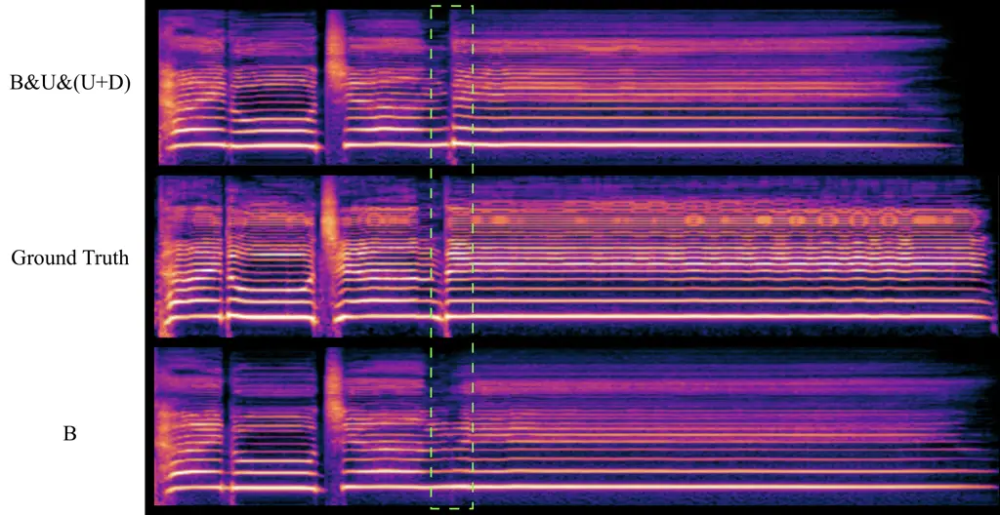

# Robust Training of Singing Voice Synthesis Using Prior and Posterior Uncertainty

Yiwen Zhao², Jiatong Shi², Yuxun Tang¹, William Chen², Shinji Watanabe²
Affiliation: ²Carnegie Mellon University, ¹Renmin University of China

###### Abstract

Singing voice synthesis (SVS) has seen remarkable advancements in recent
years. However, compared to speech and general audio data, publicly
available singing datasets remain limited. In practice, this data
scarcity often leads to performance degradation in long-tail scenarios,
such as imbalanced pitch distributions or rare singing styles. To
mitigate these challenges, we propose uncertainty-based optimization to
improve the training process of end-to-end SVS models. First, we
introduce differentiable data augmentation in the adversarial training,
which operates in a sample-wise manner to increase the prior
uncertainty. Second, we incorporate a frame-level uncertainty prediction
module that estimates the posterior uncertainty, enabling the model to
allocate more learning capacity to low-confidence segments. Empirical
results on the Opencpop and Ofuton-P, across Chinese and Japanese,
demonstrate that our approach improves performance in various
perspectives.

###### Index Terms: 

Singing Voice Synthesis, Uncertainty Modeling.

## I Introduction

Singing voice synthesis (SVS) aims to generate natural and expressive
singing vocals conditioned on input lyrics, pitch, and duration \[1, 2,
3\]. The task has gained increasing popularity due to growing demands
for digital human applications \[4, 5\] and the rapid advancement of
deep generative modeling techniques \[6, 7, 8\]. Compared to
text-to-speech (TTS) \[9, 10\] or general music generation \[11, 12\],
SVS presents unique challenges: it requires accurate alignment with
linguistic content while also capturing fine-grained prosody, making it
particularly complex for neural models to learn effectively.
Furthermore, the development of SVS is hindered by limited data
availability: SVS models tend to underperform in long-tail scenarios,
such as high-pitch phrases or underrepresented singing styles. In
contrast to speech or music datasets, publicly available singing corpora
remain scarce. Licensing songs from professional artists is often
difficult, and annotating MIDI scores requires expert-level effort.

Previous work has explored data augmentation and corpus expansion to
address these data scarcity issues \[13, 14, 15, 16, 17, 18, 19, 20, 21,
22\]. The motivation is to provide more data variation, enabling the
model to leverage samples with higher uncertainty (i.e., diverse pitch
range or rare musical style) and update its gradient more efficiently.
However, these approaches typically aim to avoid introducing excessive
noise or artifacts to ensure that the augmented data remains close to
the original distribution. While this helps preserve generation quality,
it may also prevent generalizability to more diverse or challenging
singing patterns. The data expansion and conservative augmentations
introduce variations in a fixed scale or small range, and constrain the
optimization to modifying the data. However, equipping the model with a
better awareness of its own uncertainty can enhance robustness even
under limited data conditions, by guiding learning toward more
challenging regions, which is a potential that remains underexplored.

In this work, we introduce two uncertainty-based optimization methods to
improve the training process: (1) a differentiable augmentation module
in adversarial training to increase the prior uncertainty, and (2) a
uncertainty prediction module that estimates the model’s posterior
uncertainty using the frame-level latents. The prior means formulate
without introducing the true value, and the posterior indicates with the
true value, which we have a detailed explanation on Sec. III. Together,
these techniques enrich the training process and help the model better
handle long-tail cases. As a result, we observe consistent performance
improvements over the baseline. We provide a detailed analysis in
Sec. IV-D to better understand how the impact of each component varies
depending on the characteristics of the corpus. Additionally, these
uncertainty formulations can be seamlessly combined with existing SVS
models, which commonly employ GAN-based vocoders \[23, 24\] or two-stage
joint adversarial training \[25\], and with reconstruction-based
objectives.

In summary, our contributions include:

- •
  We are the first to apply differentiable data augmentation to SVS,
  enabling stronger input perturbation while preserving the target
  distribution unchanged for generation.
- •
  We propose a posterior uncertainty modulation for sample-level audio
  interval, demonstrating its effectiveness in enhancing robustness.
- •
  We integrate these uncertainty-based techniques into an SOTA
  end-to-end SVS model, achieving consistent improvements across
  multiple metrics.

We provide singing samples from different systems on a website:
[https://tsukasane.github.io/SingingUncertainty/](https://tsukasane.github.io/SingingUncertainty/)

## II Related Work

### II-A Singing Voice Synthesis

Early deep learning-based singing voice synthesis (SVS) systems
typically adopt a two-stage pipeline \[26, 27, 28, 29\]: the model first
predicts intermediate acoustic features, which are then converted into
waveforms using a vocoder. While this approach has proven effective, it
often suffers from information loss between stages and limited
expressiveness in the final output. More recently, end-to-end SVS models
such as VISinger \[30\] and VISinger2 \[31\] have gained increasing
attention. These models leverage a combination of conditional
variational autoencoders (CVAEs)\[7\] and generative adversarial
networks (GANs)\[6\] to directly generate waveforms from music score
inputs. This fully end-to-end architecture simplifies the training
pipeline and improves synthesis fidelity. VISinger2+ \[17\] concatenates
discrete representations obtained from pre-trained SSL models \[32, 33\]
to the input mel-spectrogram, further improving the performance in
musical details and singer similarity in a multi-singer corpus \[14\].
Despite these advancements, SVS remains a challenging task due to
several factors, (1) fluctuating pitches in techniques such as vibrato.
(2) sensitive timing alignment when dealing with expressive timing or
tempo variations. (3) expressiveness for underrepresented singing
styles, emotions, or vocal techniques. Our uncertainty-based training
method helps address these issues, improving the musicality and
expressiveness of the generated audio while being more data-efficient
and robust to long-tail cases.

Fig. 1: The pipeline of VISinger2 with our proposed uncertainty
predictor and differentiable augmentation. The uncertainty predictor is
trained with a forward generator pass, and the differentiable
augmentation is added to spectrogram-level features in adversarial
training.

### II-B Data Augmentation

Previous works have explored several augmentation and data expansion
strategies to mitigate the data scarcity issue. Singaug \[13\]
introduces pitch augmentation by simultaneously shifting the music score
and the waveform by a certain number of semitones. They also propose
feature space mixup and add a corresponding loss based on the mixed
acoustic target. Other works \[34, 16\] leveraged out-of-domain speech
data or low-quality singing recordings with background noise as
auxiliary training resources. There are also approaches that uses
commercial SVS systems, such as ACE Studio, to synthesize stylized
singing and use in training \[3, 14\].

While these methods can ameliorate data scarcity, the methods target
generation tasks typically prioritize maintaining the original training
distribution. In speech understanding tasks, however, previous works
have shown that simple augmentation to the speech data distribution
could significantly improve the speech recognition performance \[35\].
To apply this similar concept to the synthesis domain, we propose to use
a differentiable singing augmentation method that introduces more
substantial perturbations to the end-to-end SVS training process. The
model is provided with diverse real-fake feature pairings, increasing
the data variation and therefore prior uncertainty. In addition, we
leverage an uncertainty predictor to improve the model’s awareness of
posterior uncertainty and improve its robustness.

### II-C Uncertainty Prediction

Uncertainty prediction is widely used across machine learning domains to
enhance model performance in various tasks \[36, 37, 38, 39, 40\].
Uncertainty can generally be categorized into data uncertainty
(aleatoric) and model uncertainty (epistemic) \[39\]. Recent works on
NeRF and Gaussian Splatting for 3D reconstruction \[40, 41, 42, 43\]
frequently incorporate uncertainty estimation as a core component. In
these contexts, covariance matrices are commonly used to capture data
uncertainty, representing the sensitivity of rendering results to input
perturbations or spatial variance. On the other hand, Jacobian-based
methods are often employed to measure model uncertainty, quantifying the
network’s confidence in its predictions. However, applying
Jacobian-based uncertainty estimation to audio signals is challenging,
as the outputs are long temporal sequences, leading to unstable or
excessive measurements. Previous work \[36\] on target-speaker
recognition introduces a neural uncertainty estimator that leverages
confidence scores from the speaker extraction module to enhance
recognition performance, demonstrating the potential of using auxiliary
predictors to modulate uncertainty. Similarly, prior studies in
classification and regression \[37, 38\] have used error-based proxies
to model posterior uncertainty more effectively. Motivated by these
approaches, we propose to modulate both prior uncertainty and posterior
uncertainty in our SVS framework, aiming to enable more efficient and
robust training.

## III Formulation

Conditioned on the music score
$`M:=(M^{\text{ph}},M^{\text{pi}},M^{\text{du}})`$, SVS targets to
generate a human singing phrase $`\mathbf{\hat{x}}\in\mathbb{R}^{T}`$
that align with $`M`$, where $`T`$ is the length of the waveform,
$`M^{\text{ph}}\in\mathbb{R}^{T^{\prime}}`$,
$`M^{\text{pi}}\in\mathbb{R}^{T^{\prime}}`$,
$`M^{\text{du}}\in\mathbb{R}^{T^{\prime}}`$ represents information about
phoneme, pitch, and duration over sequences of the same length
$`T^{\prime}`$. Training data $`\mathbf{x}\in\mathbb{R}^{T}`$ is the
singing phrase in the source distribution. We formulate the augmented
SVS as a multi-stage training with a variety of strategies. In this
section, we first introduce the baseline framework, then elaborate on
differentiable augmentation, and lastly detail the architecture and
mathematical definition of the uncertainty predictor.

### III-A VISinger2 Framework

VISinger2 \[31\] is an end-to-end SVS model built upon CVAE and GAN
architecture as shown in Fig. 1. The input waveform $`\mathbf{x}`$ is
first converted to a mel-spectrogram. The posterior encoder¹¹ 1 Notably,
the prior (w/o true value) and posterior (w/ true value) in uncertainty
are defined differently from the prior (w/o known distribution) and
posterior (w/ known distribution) used in CVAE explanation., as shown in
the upper-left of Fig. 1, takes the mel-spectrogram and extracts the
latent representation $`\mathbf{l_{x}}`$.

```math
\mathbf{l_{x}}=\text{Enc}_{\text{post}}(\text{Mel}(\mathbf{x}))\sim q_{\text{post}}(\mathbf{l_{x}}|\mathbf{x}), \tag{1}
```

where $`q_{\text{post}}`$ denotes the posterior distribution. The
decoder is trained to reconstruct the waveform.

```math
\mathbf{\hat{x}}=\text{Dec}(\mathbf{l_{x}})\sim p(\mathbf{x}|\mathbf{l_{x}}). \tag{2}
```

The prior encoder, as shown at the bottom-left of Fig. 1, takes the
music score $`M`$ and a prior
$`\mathbf{z}\sim\mathcal{N}(\mathbf{0},\mathbf{I})`$ sampled from a
standard Gaussian (or flow model modified distribution) to generate a
prior latent $`\mathbf{l_{z}}`$.

```math
\mathbf{l_{z}}=\text{Enc}_{\text{pri}}(\mathbf{z}|M)\sim q_{\text{pri}}(\mathbf{l_{z}}|\mathbf{z},M). \tag{3}
```

Then, the shared decoder also reconstructs the waveform using the prior
latent as

```math
\mathbf{\hat{z}}=\text{Dec}(\mathbf{l_{z}}). \tag{4}
```

The prior latent distribution in Eq. (3) is drawn to the posterior
latent distribution in Eq. (1) using the KL loss. Then, the decoder of
the CVAE serves as a generator $`G`$, where several discriminators $`D`$
take the posterior sample $`\mathbf{\hat{x}}`$ and prior sample
$`\mathbf{\hat{z}}`$ for adversarial training.

### III-B Differentiable Augmentation

Adversarial Training

GAN-based end-to-end models are highly susceptible to mode collapse when
training on limited amounts of data. The discriminator tends to memorize
the training samples instead of learning meaningful features to
distinguish the real and generated samples. Differentiable augmentation
has been utilized in image generation \[44\] to enhance data diversity
in StyleGAN \[45\] training. We also adopt this technique for SVS to
facilitate continuous updates to the generator. In the baseline model
VISinger2 \[31\], three types of discriminators are used, namely
Multi-Resolution Spectrogram Discriminator (MRSD), Multi-Period
Discriminator (MPD), and Multi-Scale Discriminator (MSD) as shown on the
right side of Fig. 1. They capture features in the frequency and time
domains across multiple scales. To simplify the notation, we use $`D`$
to collectively represent these three discriminators. The adversarial
loss in this case is formulated as:

```math
\displaystyle\mathcal{L}_{D}= \displaystyle\mathbb{E}_{\mathbf{l_{x}}\sim q_{\text{post}}(\mathbf{l_{x}})}\left[(1-D(\mathbf{l_{x}}))\right]+
```

```math
\displaystyle\mathbb{E}_{\mathbf{l_{z}}\sim q_{\text{pri}}(\mathbf{l_{z}}|\mathbf{z},M)}\left[(D(G(\mathbf{l_{z}}))\right], \tag{5}
```

```math
\displaystyle\mathcal{L}_{G}= \displaystyle\mathbb{E}_{\mathbf{l_{z}}\sim q_{\text{pri}}(\mathbf{l_{z}}|\mathbf{z},M)}\left[(-D(G(\mathbf{l_{z}})))\right], \tag{6}
```

where the discriminators $`D`$ are trained to distinguish between real
and synthesized samples generated from different latents, and the
generator $`G`$ (also as the decoder of CVAE) aims to deceive the
discriminator.

Augmentation Methods

Previous augmentations in automatic speech recognition (ASR) and speech
enhancement (SE) include masking, adding noise, and warping \[35, 15\].
These aggressive augmentations can be adapted in adversarial training,
without shifting the original data distribution of
$`p(\mathbf{\hat{x}})`$ \[44\]. We use $`A`$ to denote these
augmentation operations. We introduce the formulation of differentiable
masking and adding noise, then show the result of using them
individually or in combination in V. In practice, these techniques can
be selected based on task- or dataset-specific characteristics.

We denote the encoders of the three discriminators as
$`\text{Enc}_{D}`$, then the posterior features
$`\mathbf{\mathbf{f_{\hat{x}}}}`$ and prior features
$`\mathbf{\mathbf{f_{\hat{z}}}}`$ extracted by $`\text{Enc}_{D}`$ are:

```math
\mathbf{f_{\hat{x}}}=\text{Enc}_{D}(\mathbf{\hat{x}}),\quad\mathbf{\mathbf{f_{\hat{z}}}}=\text{Enc}_{D}(\mathbf{\hat{z}}), \tag{7}
```

which corresponds to the right part of Fig. 1. As observed in \[44\],
applying augmentations directly to posterior features
$`\mathbf{f_{\hat{x}}}`$ can lead the model to learn the distribution of
$`A({\mathbf{\hat{x}}})`$ rather than $`\mathbf{\hat{x}}`$, introducing
a distributional shift in generated samples. On the other hand, if
augmentation is applied solely during the discriminator’s forward pass,
the discriminator may only learn to distinguish between
$`A(\mathbf{f_{\hat{x}}})`$ and $`A(\mathbf{f_{\hat{z}}})`$, rather than
focusing on the $`\mathbf{f_{\hat{x}}}`$ and $`\mathbf{f_{\hat{z}}}`$
distinction. Therefore, we apply augmentation to both
$`\mathbf{f_{\hat{x}}}`$ and $`\mathbf{f_{\hat{z}}}`$ during the
generator and discriminator forward pass as $`A(\mathbf{f_{\hat{x}}})`$
and $`A(\mathbf{f_{\hat{z}}})`$. The training flow is shown as the
orange and black arrows in Fig. 1. To simplify the notations, we denote
$`\mathbf{f_{\hat{x}}}`$ and $`\mathbf{f_{\hat{z}}}`$ all as
$`\mathbf{f_{D}}`$ start from here. We explain the operations
$`A(\mathbf{f_{D}})`$ as follows.

Rather than corrupting the entire feature segment, we only target a
randomly selected partition. For the time dimension, we first compute
the augmented target length based on a predefined ratio $`r`$, then
select a random start index $`t_{0}\in[1,T_{f}-\Delta t]`$

```math
\Delta t=\lfloor T_{f}\cdot r\rfloor, \tag{8}
```

where $`T_{f}`$ is the temporal length of the feature. Adding a mask
along the time dimension to the sample interval can be formulated as:

```math
B_{t}=\begin{cases}v,&\text{if }t\in[t_{0},...,t_{0}+\Delta t),\\
1,&\text{otherwise}.\end{cases} \tag{9}
```

```math
A(\mathbf{f_{D}})=\text{Mask}_{\text{temp}}(\mathbf{f_{D}},\{B_{t}\}_{t}). \tag{10}
```

where $`B_{t}`$ is a binary mask $`B_{t}\in\{v,1\}`$, with fixed value
$`v\in[0,1)`$. $`B_{t}`$ corrupts the randomly selected interval along
the time dimension to obtain $`A(\mathbf{f_{D}})`$ by the
$`\text{Mask}_{\text{temp}}(\cdot)`$ operation, which is the masked
feature. This operation is differentiable to $`\mathbf{f_{D}}`$ and also
to the input $`\mathbf{x}`$.

Similarly, we define the binary mask at frequency bin $`\xi`$ as
$`B_{\xi}\in\{v,1\}`$. The target frequency interval is also randomly
selected. The masked STFT representation is obtained by element-wise
multiplication of the original feature

```math
B_{\xi}=\begin{cases}v_{\xi},&\text{if }\xi\in[\xi_{0},...,\xi_{0}+\Delta\xi),\\
1,&\text{otherwise}.\end{cases} \tag{11}
```

```math
A(\mathbf{f_{D}})=\text{Mask}_{\text{freq}}(\mathbf{f_{D}},\{B_{\xi}\}_{\xi}). \tag{12}
```

The $`\text{Mask}_{\text{freq}}(\cdot)`$ operation corrupts a randomly
selected band of frequencies in the signal and is differentiable with
respect to $`\mathbf{x}`$. In practice, when we choose masking for
differentiable augmentation, we use a frequency dimension mask on the
output feature of the MRSD encoder, and a time dimension mask on outputs
of the MPD and MSD encoders.

Adding noise is another way to inject controlled perturbations into the
waveform input during training. It enables the model to learn from a
wider range of acoustic variations. Given an input feature
$`\mathbf{f_{D}}`$, adding noise $`N`$ to the feature can be formulated
as:

```math
A(\mathbf{f_{D}})=\text{Noise}(\mathbf{f_{D}},N). \tag{13}
```

In the randomly selected interval, $`N`$ is the noise sampled from a
standard Gaussian multiplied by a noise scaling factor $`\alpha`$. The
$`\text{Noise}(\cdot)`$ operation adds this noise to $`\mathbf{f_{D}}`$.

Finally, the noisy segment is padded and stitched back into the original
features to form the final augmented batch. This local perturbation adds
noise variations while retaining most of the original feature content,
improving the model’s ability to generalize to unseen scenarios. The
masking and adding noise strategy can also be used simultaneously, which
we will discuss in Sec. V.

As shown in Fig. 1, the augmentation $`A(\mathbf{f_{D}})`$ introduces
diverse real-fake feature pairs and optimizes the data uncertainty,
allowing the generator to efficiently update. We denote this as a prior
uncertainty, which is distributed according to $`p(\mathbf{\hat{x}})`$
and $`p(\mathbf{\hat{z}})`$. Incorporating it with adversarial training
keeps consistency in the learning target and enhances the model’s
ability to generalize.

### III-C Uncertainty Prediction

The posterior uncertainty refers to the error proxies, which show the
confidence of the model prediction. Rather than being merely
undesirable, it can be explicitly modeled to improve prediction
reliability \[39, 37\]. Given variable-length frame-level latent
representations, we introduce a convolution-based uncertainty predictor
to estimate the uncertainty level across the generated sample-wise
outputs.

As defined in Eq. (3), the frame-wise latent $`\mathbf{l_{z}}`$ is
passed to the generator (or the decoder of CVAE) and further converted
to the prior sample as in Eq. (4). We define a predictor
$`g(\mathbf{l_{z}})`$ that takes the latent as input and predicts the
uncertainty $`\mathbf{u}`$.

```math
\mathbf{u}=g(\mathbf{l_{z}}). \tag{14}
```

The frame-level latent is first linearly interpolated to a fixed
interval length, then passes through two 1D convolutional layers for
feature transformation, and finally uses a fully connected layer to
predict a single scalar value $`u_{t}`$ for each time step, referring to
uncertainty.

This additional predictor requires a pre-trained model that is already
capable of generating reasonable output, so that error prediction can be
meaningful. In training, this uncertainty is supervised by the ground
truth L2 distance between the input $`\mathbf{x}`$ and the reconstructed
sample $`\mathbf{\hat{z}}`$.

```math
\mathbf{d}=||\mathbf{x}-\mathbf{\hat{z}}||^{2}, \tag{15}
```

```math
\mathcal{L}_{u}=\frac{1}{n}\sum_{t=1}^{n}(d_{t}-u_{t})^{2}, \tag{16}
```

$`n`$ is the total number of samples in an interval. In this manner, the
uncertainty predictor is trained to quantify the model’s confidence with
the true value $`\mathbf{x}`$ provided, thus it is posterior.

|                           |                   |                      |                   |                        |                            |                            |                        |            |     |
| ------------------------- | ----------------- | -------------------- | ----------------- | ---------------------- | -------------------------- | -------------------------- | ---------------------- | ---------- | --- |
| Strategies                | Opencpop          |                      |                   |                        |                            |                            |                        |            |     |
| Log_F0_RMSE$`\downarrow`$ | MCD$`\downarrow`$ | Semitone$`\uparrow`$ | VUV$`\downarrow`$ | Sheet-SSQA$`\uparrow`$ | $`\text{MOS}_{L}\uparrow`$ | $`\text{MOS}_{M}\uparrow`$ | $`\text{MOS}\uparrow`$ |            |     |
| B                         | 0.174             | 7.876                | 62.78%            | 7.79%                  | 4.30                       | 3.65 ±0.07                 | 3.37 ±0.07             | 3.46 ±0.06 |     |
| B+D                       | 0.159             | 7.670                | 63.64%            | 7.32%                  | 4.33                       | 3.73 ±0.07                 | 3.46 ±0.07             | 3.53 ±0.06 |     |
| B&U                       | 0.173             | 7.776                | 63.62%            | 7.37%                  | 4.31                       | 3.72 ±0.07                 | 3.45 ±0.07             | 3.54 ±0.06 |     |
| $`\textbf{B\&U\&(U+D})`$  | 0.168             | 7.659                | 64.56%            | 6.96%                  | 4.30                       | 3.90 ±0.07                 | 3.64 ±0.07             | 3.67 ±0.06 |     |

TABLE I: Comparison of different training strategies on the Opencpop
corpus in 200 epochs. ”B” indicates baseline, ”U” indicates uncertainty
prediction, and ”D” represents differentiable augmentation. ”&” means
resume and ”+” means simultaneously use. MOS values are presented with
95% confidence intervals.

## IV Experiment

### IV-A Training Strategies

Baseline Architecture

Our training process consists of multiple stages, with the following
annotation conventions: + denotes the simultaneous application of
components, while & indicates a resumed training stage. B represents the
baseline model, whereas D and U correspond to the differentiable
augmentation and uncertainty prediction, respectively, both of which are
designed to enhance training process. The main experiments are conducted
on the Opencpop corpus over 200 training epochs.

We use VISinger2 \[31\] implemented in Muskits-ESPnet \[46, 47\] as our
baseline. The prior encoder in Eq. (3) conditioned on music score
comprises 6 blocks, each featuring a 2-head relative self-attention
mechanism and a 1D-convolutional feed-forward network (FFN). The decoder
component in Eq. (2) upsamples the features. Weight normalization is
applied in both the decoder and the posterior encoder. We do not use the
flow network to transform the prior distribution so that it is a
standard Gaussian as in Eq. (3). The discriminator part incorporates
multi-period, multi-scale, and multi-frequency components as detailed in
Sec. III-B. The generator and discriminator, as in Eq. (6) and Eq. (5)
are trained using the AdamW optimizer \[48\] with an initial learning
rate of 2.0e-4 and an exponential learning rate scheduler with a gamma
of 0.998. More detailed configuration refers to ESPnet \[49\] config²² 2
[https://github.com/espnet/espnet/blob/master/egs2/opencpop/svs1/conf/tuning/train_visinger2.yaml](https://github.com/espnet/espnet/blob/master/egs2/opencpop/svs1/conf/tuning/train_visinger2.yaml).

System Annotations

- •
  B: The baseline model.
- •
  B+D: We add noise differentiable augmentation from scratch. The
  augmentation region is randomly selected as 10% of the total interval
  along the temporal dimension.
- •
  B&U: We first train the baseline for 20 epochs, then resume training
  the whole baseline model with an additional frame-to-sample
  uncertainty predictor. A uncertainty prediction loss is added using a
  weight of 10.0, working on the forward generator pass.
- •
  B&U&(U+D): We follow B&U for the first 80 epochs, then add D to the
  end of training.

### IV-B Corpora

We follow the official split and resample all utterances to 44.1 kHz.
The corpora are introduced as follows:

Opencpop\[21\]. It is a Mandarin singing corpus performed by one female
professional singer. It consists of 100 popular songs with corresponding
MIDI annotations. All songs are recorded at 44.1kHz and have a total
duration of 5.2 hours.

Ofuton-P\[50\]. It is a Japanese singing corpus performed by one male
singer, containing 46 songs with a total duration of 61 minutes. Most of
the songs are children’s rhymes. The original recording is in 96kHz,
with some of them resampled to 44.1kHz before release.

### IV-C Evaluation Metrics

We employ both objective metrics and subjective ratings to evaluate the
performance of each system through VERSA toolkit \[51, 52\]. We briefly
introduce each metric as follows.

Log*F0_RMSE \[53\] measures the root mean squared error between the
logarithmic fundamental frequency (F0) of the synthesized and reference
singing signals, focusing on pitch accuracy. MCD \[54\] quantifies the
spectral distance between the generated and ground-truth audio using
mel-cepstral coefficients. Semitone accuracy measures pitch differences
between the generated sample and ground truth. VUV evaluates whether the
model correctly predicts the voiced or unvoiced status of each frame.
Sheet-SSQA \[55\] is a pseudo MOS predictor based on a 5-point mean
opinion score (MOS) scale. $`\text{MOS}*{L}`$ evaluates the
intelligibility and correctness of the synthesized lyrics, as rated by
human listeners. $`\text{MOS}\_{M}`$ measures the perceived quality of
melody reproduction. MOS assesses the overall naturalness of the
synthesized singing voice perceived by human listeners.

For the subjective evaluation, we use MOS across different dimensions.
We randomly select 30 utterances from the test set and have 20 recruited
labelers rate the same set of utterances generated by different systems
on a scale from 1 to 5. All labelers are native Mandarin speakers,
ensuring their ability to accurately assess the quality of the
synthesized lyrics.

|                                      |                   |                      |                   |                        |                            |                            |                        |            |     |
| ------------------------------------ | ----------------- | -------------------- | ----------------- | ---------------------- | -------------------------- | -------------------------- | ---------------------- | ---------- | --- |
| Strategies                           | Opencpop          |                      |                   |                        |                            |                            |                        |            |     |
| Log_F0_RMSE$`\downarrow`$            | MCD$`\downarrow`$ | Semitone$`\uparrow`$ | VUV$`\downarrow`$ | Sheet-SSQA$`\uparrow`$ | $`\text{MOS}_{L}\uparrow`$ | $`\text{MOS}_{M}\uparrow`$ | $`\text{MOS}\uparrow`$ |            |     |
| B                                    | 0.174             | 7.876                | 62.78%            | 7.79%                  | 4.30                       | 3.65 ±0.07                 | 3.37 ±0.07             | 3.46 ±0.06 |     |
| $`\textbf{B+D}_{\text{Mask}}`$       | 0.161             | 7.693                | 63.26%            | 7.53%                  | 4.30                       | 3.73 ±0.07                 | 3.38 ±0.07             | 3.49 ±0.06 |     |
| $`\textbf{B+D}_{\text{Noise}}`$      | 0.159             | 7.670                | 63.64%            | 7.32%                  | 4.33                       | 3.73 ±0.07                 | 3.46 ±0.07             | 3.53 ±0.06 |     |
| $`\textbf{B+D}_{\text{Noise+Mask}}`$ | 0.164             | 7.834                | 63.16%            | 7.09%                  | 4.35                       | 3.70 ±0.06                 | 3.38 ±0.06             | 3.48 ±0.06 |     |

TABLE II: Ablation of different types of differentiable augmentation on
the Opencpop corpus in 200 epochs. B indicates baseline, and D
represents differentiable augmentation. + means simultaneously use. MOS
values are presented with 95% confidence intervals.

|                           |                   |                      |                   |                        |      |     |
| ------------------------- | ----------------- | -------------------- | ----------------- | ---------------------- | ---- | --- |
| Strategies                | Ofuton-P          |                      |                   |                        |      |     |
| Log_F0_RMSE$`\downarrow`$ | MCD$`\downarrow`$ | Semitone$`\uparrow`$ | VUV$`\downarrow`$ | Sheet-SSQA$`\uparrow`$ |      |     |
| B                         | 0.083             | 5.690                | 66.55%            | 2.91%                  | 4.19 |     |
| B+D                       | 0.082             | 5.699                | 66.60%            | 2.45%                  | 4.24 |     |
| B&U                       | 0.082             | 5.734                | 66.81%            | 2.84%                  | 4.21 |     |
| $`\textbf{B\&U\&(U+D})`$  | 0.078             | 5.751                | 66.92%            | 2.83%                  | 4.22 |     |

TABLE III: Ablation of different training strategies on the Ofuton-P
corpus in 200 epochs. B indicates baseline, U indicates uncertainty
prediction, and D represents differentiable augmentation. & means resume
and + means simultaneously use.



Fig. 2: Spectrogram case study. The green box shows the system using the
uncertainty predictor, and the differentiable augmentation produces a
clearer phoneme boundary, which indicates faithful lyrics.

### IV-D Quantitative Analysis

We label the best performance in each metric in Table I using bold font,
while marking the second place using blue font. Comparing B and B+D, we
observe a notable improvement in pitch and timbre-related metrics,
suggesting that introducing greater variation in short intervals helps
the model capture finer melodic details, which mitigates the issues
mentioned in Sec. II-A. Noising part of the interval encourages the
model to focus on other subtle artifacts that influence the perceived
realism of the prior and posterior sample pairs. This enables the model
to generate more expressive pitch contours and richer timbral
characteristics, improving data uncertainty and obtaining a better model
training process, which proves the hypothesis in Sec. III-B.

Adding the uncertainty predictor, as shown by results in B&U, improves
the perception quality in terms of pseudo MOS and MOS, in both the
lyrics and melody, also overall naturalness. This shows formulating
posterior uncertainty as the gap between ground truth samples and the
synthesized samples, and adding a prediction module helps in efficient
training. Minimizing this performance gap as an additional loss enables
the model to better understand which part it mainly struggles with and
improve its performance accordingly.

Collectively using differentiable augmentation and uncertainty
prediction is shown to be optimal. Since this strategy has the maximum
number of best or best+second-best scores across the 8 evaluation
metrics and 4 systems. Notably, it improves the baseline performance in
(1) pitch, shown by Log_F0_RMSE, (2) timbre, shown by MCD, (3) duration,
shown by VUV, and (4) human perception, shown by MOS, demonstrated in
Tab. I, mitigating the problems mentioned in Sec. II-A. The MOS
improvement is especially significant given that the baseline is already
the SOTA SVS method and does well in common cases, which further
validates the effectiveness of our strategies in long-tail cases.

### IV-E Qualitative Analysis

We show a spectrum example of the same utterance synthesized by the B
and our best-performing system B&U&(U+D) in Fig. 2. Zooming in on the
region highlighted by the green dashed box, we can observe that the
upper spectrum with differentiable augmentation and uncertainty
prediction better constructs the high-energy boundary, which is a start
point of a phoneme. Without a faithful modeling of this stylized region,
the baseline utterance sounds ambiguous and has worse lyrics delivery.
We include more examples on the website.

## V Ablation Study

### V-A Differentiable Augmentation Strategies

In our main experiment, we adopt additive noise as a differentiable
augmentation method. For ablation studies, we explore three strategies:
additive noise, masking, and their combination, as introduced in
Sec. III-B. In all cases, augmentation is applied to 10% of the input
features. Masking is performed either along the time or frequency
dimension, depending on the discriminator type, with masked values set
to zero. As shown in Table II, all three strategies lead to performance
improvements. Among them, using noise alone yields the best results
(achieving the highest number of best or second-best scores). As noise
introduces a more general form of perturbation in the feature space,
encouraging the model to ignore the perturbed regions and instead focus
on learning more subtle and discriminative patterns.

### V-B Generalization to Other Languages

We further conduct experiments on the Japanese singing corpus Ofuton-P,
using differentiable augmentation and an uncertainty predictor. As
described in Sec. IV-B, this corpus is significantly smaller,
approximately 20% the size of Opencpop. It mainly consists of
traditional Japanese children’s songs, which are generally simple,
feature repetitive phonemes, and exhibit a narrow pitch range. We train
the model for 200 epochs.

The results, shown in Table III, validate the generalizability of our
proposed strategies to a new corpus in another language. It demonstrates
consistent improvements in Log_F0_MSE and Semitone, indicating enhanced
pitch accuracy in the synthesized outputs. A slight degradation in MCD
is observed, likely due to a trade-off between pitch precision and
timbre fidelity. In addition, we see improvements in duration prediction
and pseudo-MOS, reflected by VUV and Sheet-SSQA, suggesting enhanced
temporal alignment and increased alignment with human perceptual
preferences.

## VI Conclusion

In this paper, we propose two uncertainty-driven strategies to enhance
the training process of end-to-end singing voice synthesis (SVS) models.
We incorporate prior uncertainty through differentiable data
augmentation and introduce a posterior uncertainty predictor to improve
robustness in long-tail scenarios. Extensive experiments demonstrate the
effectiveness and generalizability of our proposed methods. In the
future we will explore their collective effect with other augmentations.

## VII Acknowledgement

Experiments of this work used the Bridges2 at PSC and Delta/DeltaAI NCSA
computing systems through allocation CIS210014 from the ACCESS program,
supported by NSF grants 2138259, 2138286, 2138307, 2137603, and 2138296.

## References

- \[1\] P. R. Cook (1996) Singing voice synthesis: history, current
  work, and future directions. Computer Music Journal 20 (3), pp. 38–46.
  Cited by: §I.
- \[2\] Y. Hono, K. Hashimoto, K. Oura, Y. Nankaku, and K. Tokuda (2021)
  Sinsy: a deep neural network-based singing voice synthesis system.
  IEEE/ACM Transactions on Audio, Speech, and Language Processing 29,
  pp. 2803–2815. Cited by: §I.
- \[3\] H. Kenmochi and H. Ohshita (2007) VOCALOID-commercial singing
  synthesizer based on sample concatenation.. In Interspeech, Vol. 2007,
  pp. 4009–4010. Cited by: §I, §II-B.
- \[4\] J. Yu and C. W. Chen (2017) From talking head to singing head: a
  significant enhancement for more natural human computer interaction.
  In 2017 IEEE International Conference on Multimedia and Expo (ICME),
  pp. 511–516. Cited by: §I.
- \[5\] G. Kearney, H. Daffern, L. Thresh, H. Omodudu, C. Armstrong,
  and J. Brereton (2016) Design of an interactive virtual reality system
  for ensemble singing. In Interactive Audio Systems Symposium, York,
  UK, Cited by: §I.
- \[6\] I. J. Goodfellow, J. Pouget-Abadie, M. Mirza, B. Xu, D.
  Warde-Farley, S. Ozair, A. Courville, and Y. Bengio (2014) Generative
  adversarial nets. In Advances in Neural Information Processing
  Systems, Z. Ghahramani, M. Welling, C. Cortes, N. Lawrence, and K.Q.
  Weinberger (Eds.), Vol. 27, pp. . Cited by: §I, §II-A.
- \[7\] D. P. Kingma and M. Welling (2014) Auto-encoding variational
  bayes. In 2nd International Conference on Learning Representations,
  ICLR 2014, Banff, AB, Canada, April 14-16, 2014, Conference Track
  Proceedings, Y. Bengio and Y. LeCun (Eds.), External Links:
  [Link](http://arxiv.org/abs/1312.6114) Cited by: §I, §II-A.
- \[8\] J. Song, C. Meng, and S. Ermon (2021) Denoising diffusion
  implicit models. In 9th International Conference on Learning
  Representations, ICLR 2021, Virtual Event, Austria, May 3-7, 2021,
  External Links: [Link](https://openreview.net/forum?id=St1giarCHLP)
  Cited by: §I.
- \[9\] T. Hayashi, R. Yamamoto, K. Inoue, T. Yoshimura, S. Watanabe, T.
  Toda, K. Takeda, Y. Zhang, and X. Tan (2020) Espnet-TTS: unified,
  reproducible, and integratable open source end-to-end text-to-speech
  toolkit. In 2020 IEEE International Conference on Acoustics, Speech
  and Signal Processing, ICASSP 2020, Barcelona, Spain, May 4-8, 2020,
  pp. 7654–7658. External Links:
  [Link](https://doi.org/10.1109/ICASSP40776.2020.9053512),
  [Document](https://dx.doi.org/10.1109/ICASSP40776.2020.9053512) Cited
  by: §I.
- \[10\] Z. Du, Q. Chen, S. Zhang, K. Hu, H. Lu, Y. Yang, H. Hu, S.
  Zheng, Y. Gu, Z. Ma, Z. Gao, and Z. Yan (2024) CosyVoice: A scalable
  multilingual zero-shot text-to-speech synthesizer based on supervised
  semantic tokens. CoRR abs/2407.05407. External Links:
  [Link](https://doi.org/10.48550/arXiv.2407.05407) Cited by: §I.
- \[11\] Y. Bai, H. Chen, J. Chen, Z. Chen, Y. Deng, X. Dong, L.
  Hantrakul, W. Hao, Q. Huang, Z. Huang, D. Jia, F. La, D. Le, B. Li, C.
  Li, H. Li, X. Li, S. Liu, W. Lu, Y. Lu, A. Shaw, J. Spijkervet, Y.
  Sun, B. Wang, J. Wang, Y. Wang, Y. Wang, L. Xu, Y. Yang, C. Yao, S.
  Zhang, Y. Zhang, Y. Zhang, H. Zhao, Z. Zhao, D. Zhong, S. Zhou, and P.
  Zou (2024) Seed-music: a unified framework for high quality and
  controlled music generation. External Links: 2409.09214,
  [Link](https://arxiv.org/abs/2409.09214) Cited by: §I.
- \[12\] C. Zhang, Y. Ma, Q. Chen, W. Wang, S. Zhao, Z. Pan, H. Wang, C.
  Ni, T. H. Nguyen, K. Zhou, Y. Jiang, C. Tan, Z. Gao, Z. Du, and B.
  Ma (2025) InspireMusic: integrating super resolution and large
  language model for high-fidelity long-form music generation. External
  Links: 2503.00084, [Link](https://arxiv.org/abs/2503.00084) Cited by:
  §I.
- \[13\] S. Guo, J. Shi, T. Qian, S. Watanabe, and Q. Jin (2022)
  SingAug: data augmentation for singing voice synthesis with
  cycle-consistent training strategy. In Proc. Interspeech 2022,
  pp. 4272–4276. Cited by: §I, §II-B.
- \[14\] J. Shi, Y. Lin, X. Bai, K. Zhang, Y. Wu, Y. Tang, Y. Yu, Q.
  Jin, and S. Watanabe (2024) Singing voice data scaling-up: an
  introduction to ace-opencpop and ace-kising. In Proc. Interspeech
  2024, pp. 1880–1884. External Links:
  [Document](https://dx.doi.org/10.21437/Interspeech.2024-33), ISSN
  2958-1796 Cited by: §I, §II-A, §II-B.
- \[15\] S. Ghosh, S. Kumar, Z. Kong, R. Valle, B. Catanzaro, and D.
  Manocha (2024) Synthio: augmenting small-scale audio classification
  datasets with synthetic data. arXiv preprint arXiv:2410.02056. Cited
  by: §I, §III-B.
- \[16\] Y. Wang, R. Hu, R. Huang, Z. Hong, R. Li, W. Liu, F. You, T.
  Jin, and Z. Zhao (2024) Prompt-singer: controllable
  singing-voice-synthesis with natural language prompt. arXiv preprint
  arXiv:2403.11780. Cited by: §I, §II-B.
- \[17\] Y. Yu, J. Shi, Y. Wu, Y. Tang, and S. Watanabe (2024)
  Visinger2+: end-to-end singing voice synthesis augmented by
  self-supervised learning representation. In IEEE Spoken Language
  Technology Workshop, SLT 2024, Macao, December 2-5, 2024, pp. 719–726.
  External Links:
  [Link](https://doi.org/10.1109/SLT61566.2024.10832313),
  [Document](https://dx.doi.org/10.1109/SLT61566.2024.10832313) Cited
  by: §I, §II-A.
- \[18\] Y. Ren, X. Tan, T. Qin, J. Luan, Z. Zhao, and T. Liu (2020)
  Deepsinger: singing voice synthesis with data mined from the web. In
  Proceedings of the 26th ACM SIGKDD International Conference on
  Knowledge Discovery & Data Mining, pp. 1979–1989. Cited by: §I.
- \[19\] J. Shi, S. Guo, N. Huo, Y. Zhang, and Q. Jin (2021)
  Sequence-to-sequence singing voice synthesis with perceptual entropy
  loss. In ICASSP 2021-2021 IEEE International Conference on Acoustics,
  Speech and Signal Processing (ICASSP), pp. 76–80. Cited by: §I.
- \[20\] K. Saino, H. Zen, Y. Nankaku, A. Lee, and K. Tokuda (2006) An
  hmm-based singing voice synthesis system.. In INTERSPEECH,
  pp. 2274–2277. Cited by: §I.
- \[21\] Y. Wang, X. Wang, P. Zhu, J. Wu, H. Li, H. Xue, Y. Zhang, L.
  Xie, and M. Bi (2022) Opencpop: A high-quality open source chinese
  popular song corpus for singing voice synthesis. In 23rd Annual
  Conference of the International Speech Communication Association,
  Interspeech 2022, Incheon, Korea, September 18-22, 2022, H. Ko
  and J. H. L. Hansen (Eds.), pp. 4242–4246. External Links:
  [Link](https://doi.org/10.21437/Interspeech.2022-48) Cited by: §I,
  §IV-B.
- \[22\] I. Ogawa and M. Morise (2021) Tohoku kiritan singing database:
  a singing database for statistical parametric singing synthesis using
  japanese pop songs. Acoustical Science and Technology 42 (3),
  pp. 140–145. Cited by: §I.
- \[23\] J. Kong, J. Kim, and J. Bae (2020) Hifi-gan: generative
  adversarial networks for efficient and high fidelity speech synthesis.
  Advances in neural information processing systems 33, pp. 17022–17033.
  Cited by: §I.
- \[24\] R. Yamamoto, E. Song, and J. Kim (2020) Parallel wavegan: a
  fast waveform generation model based on generative adversarial
  networks with multi-resolution spectrogram. In ICASSP 2020-2020 IEEE
  International Conference on Acoustics, Speech and Signal Processing
  (ICASSP), pp. 6199–6203. Cited by: §I.
- \[25\] Y. Wu, Y. Yu, J. Shi, T. Qian, and Q. Jin (2024) A systematic
  exploration of joint-training for singing voice synthesis. In 2024
  IEEE 14th International Symposium on Chinese Spoken Language
  Processing (ISCSLP), Vol. , pp. 289–293. External Links:
  [Document](https://dx.doi.org/10.1109/ISCSLP63861.2024.10799952) Cited
  by: §I.
- \[26\] M. Blaauw and J. Bonada (2020) Sequence-to-sequence singing
  synthesis using the feed-forward transformer. In ICASSP 2020-2020 IEEE
  International Conference on Acoustics, Speech and Signal Processing
  (ICASSP), pp. 7229–7233. Cited by: §II-A.
- \[27\] P. Lu, J. Wu, J. Luan, X. Tan, and L. Zhou (2020) XiaoiceSing:
  A high-quality and integrated singing voice synthesis system. In 21st
  Annual Conference of the International Speech Communication
  Association, Interspeech 2020, Virtual Event, Shanghai, China, October
  25-29, 2020, H. Meng, B. Xu, and T. F. Zheng (Eds.), pp. 1306–1310.
  External Links: [Link](https://doi.org/10.21437/Interspeech.2020-1410)
  Cited by: §II-A.
- \[28\] J. Chen, X. Tan, J. Luan, T. Qin, and T. Liu (2020) HiFiSinger:
  towards high-fidelity neural singing voice synthesis. CoRR
  abs/2009.01776. External Links:
  [Link](https://arxiv.org/abs/2009.01776) Cited by: §II-A.
- \[29\] J. Liu, C. Li, Y. Ren, F. Chen, and Z. Zhao (2022) DiffSinger:
  singing voice synthesis via shallow diffusion mechanism. In
  Thirty-Sixth AAAI Conference on Artificial Intelligence, AAAI 2022,
  Thirty-Fourth Conference on Innovative Applications of Artificial
  Intelligence, IAAI 2022, The Twelveth Symposium on Educational
  Advances in Artificial Intelligence, EAAI 2022 Virtual Event, February
  22 - March 1, 2022, pp. 11020–11028. External Links:
  [Link](https://doi.org/10.1609/aaai.v36i10.21350),
  [Document](https://dx.doi.org/10.1609/AAAI.V36I10.21350) Cited by:
  §II-A.
- \[30\] Y. Zhang, J. Cong, H. Xue, L. Xie, P. Zhu, and M. Bi (2022)
  Visinger: variational inference with adversarial learning for
  end-to-end singing voice synthesis. In ICASSP 2022-2022 IEEE
  International Conference on Acoustics, Speech and Signal Processing
  (ICASSP), pp. 7237–7241. Cited by: §II-A.
- \[31\] Y. Zhang, H. Xue, H. Li, L. Xie, T. Guo, R. Zhang, and C.
  Gong (2023) VISinger2: high-fidelity end-to-end singing voice
  synthesis enhanced by digital signal processing synthesizer. In 24th
  Annual Conference of the International Speech Communication
  Association, Interspeech 2023, Dublin, Ireland, August 20-24, 2023, N.
  Harte, J. Carson-Berndsen, and G. Jones (Eds.), pp. 4444–4448.
  External Links: [Link](https://doi.org/10.21437/Interspeech.2023-391)
  Cited by: §II-A, §III-A, §III-B, §IV-A.
- \[32\] W. Hsu, B. Bolte, Y. H. Tsai, K. Lakhotia, R. Salakhutdinov,
  and A. Mohamed (2021) Hubert: self-supervised speech representation
  learning by masked prediction of hidden units. IEEE/ACM transactions
  on audio, speech, and language processing 29, pp. 3451–3460. Cited by:
  §II-A.
- \[33\] Y. Li, R. Yuan, G. Zhang, Y. Ma, X. Chen, H. Yin, C. Xiao, C.
  Lin, A. Ragni, E. Benetos, et al. (2024) MERT: acoustic music
  understanding model with large-scale self-supervised training. In
  ICLR, Cited by: §II-A.
- \[34\] S. Choi and J. Nam (2022) A melody-unsupervision model for
  singing voice synthesis. In ICASSP 2022-2022 IEEE International
  Conference on Acoustics, Speech and Signal Processing (ICASSP),
  pp. 7242–7246. Cited by: §II-B.
- \[35\] D. S. Park, W. Chan, Y. Zhang, C. Chiu, B. Zoph, E. D. Cubuk,
  and Q. V. Le (2019) SpecAugment: A simple data augmentation method for
  automatic speech recognition. In 20th Annual Conference of the
  International Speech Communication Association, Interspeech 2019,
  Graz, Austria, September 15-19, 2019, G. Kubin and Z. Kacic (Eds.),
  pp. 2613–2617. External Links:
  [Link](https://doi.org/10.21437/Interspeech.2019-2680) Cited by:
  §II-B, §III-B.
- \[36\] J. Shi, C. Zhang, C. Weng, S. Watanabe, M. Yu, and D. Yu (2022)
  An investigation of neural uncertainty estimation for target speaker
  extraction equipped rnn transducer. Computer Speech & Language 73,
  pp. 101327. Cited by: §II-C.
- \[37\] A. Kendall and Y. Gal (2017) What uncertainties do we need in
  bayesian deep learning for computer vision?. Advances in neural
  information processing systems 30. Cited by: §II-C, §III-C.
- \[38\] V. Kuleshov, N. Fenner, and S. Ermon (2018) Accurate
  uncertainties for deep learning using calibrated regression. In
  International conference on machine learning, pp. 2796–2804. Cited by:
  §II-C.
- \[39\] J. Gawlikowski, C. R. N. Tassi, M. Ali, J. Lee, M. Humt, J.
  Feng, A. Kruspe, R. Triebel, P. Jung, R. Roscher, et al. (2023) A
  survey of uncertainty in deep neural networks. Artificial Intelligence
  Review 56 (Suppl 1), pp. 1513–1589. Cited by: §II-C, §III-C.
- \[40\] J. Hu, X. Chen, B. Feng, G. Li, L. Yang, H. Bao, G. Zhang,
  and Z. Cui (2024) Cg-slam: efficient dense rgb-d slam in a consistent
  uncertainty-aware 3d gaussian field. In European Conference on
  Computer Vision, pp. 93–112. Cited by: §II-C.
- \[41\] X. Huang, R. Li, Y. Cheung, K. C. Cheung, S. See, and R.
  Wan (2024) Gaussianmarker: uncertainty-aware copyright protection of
  3d gaussian splatting. Advances in Neural Information Processing
  Systems 37, pp. 33037–33060. Cited by: §II-C.
- \[42\] X. Pan, Z. Lai, S. Song, and G. Huang (2022) Activenerf:
  learning where to see with uncertainty estimation. In European
  Conference on Computer Vision, pp. 230–246. Cited by: §II-C.
- \[43\] J. Shen, A. Agudo, F. Moreno-Noguer, and A. Ruiz (2022)
  Conditional-flow nerf: accurate 3d modelling with reliable uncertainty
  quantification. In European Conference on Computer Vision,
  pp. 540–557. Cited by: §II-C.
- \[44\] S. Zhao, Z. Liu, J. Lin, J. Zhu, and S. Han (2020)
  Differentiable augmentation for data-efficient gan training. Advances
  in neural information processing systems 33, pp. 7559–7570. Cited by:
  §III-B, §III-B, §III-B.
- \[45\] T. Karras, S. Laine, and T. Aila (2021) A style-based generator
  architecture for generative adversarial networks. IEEE Trans. Pattern
  Anal. Mach. Intell. 43 (12), pp. 4217–4228. External Links:
  [Link](https://doi.org/10.1109/TPAMI.2020.2970919) Cited by: §III-B.
- \[46\] Y. Wu, J. Shi, Y. Yu, Y. Tang, T. Qian, Y. Lin, J. Han, X.
  Bai, S. Watanabe, and Q. Jin (2024) Muskits-ESPnet: a comprehensive
  toolkit for singing voice synthesis in new paradigm. In Proceedings of
  the 32nd ACM International Conference on Multimedia, pp. 11279–11281.
  Cited by: §IV-A.
- \[47\] J. Shi, S. Guo, T. Qian, N. Huo, T. Hayashi, Y. Wu, F. Xu, X.
  Chang, H. Li, P. Wu, et al. (2022) Muskits: an end-to-end music
  processing toolkit for singing voice synthesis. In Proc. Interspeech
  2022, Vol. 2022, pp. 4277–4281. Cited by: §IV-A.
- \[48\] I. Loshchilov and F. Hutter (2019) Decoupled weight decay
  regularization. In 7th International Conference on Learning
  Representations, ICLR 2019, New Orleans, LA, USA, May 6-9, 2019,
  External Links: [Link](https://openreview.net/forum?id=Bkg6RiCqY7)
  Cited by: §IV-A.
- \[49\] S. Watanabe, T. Hori, S. Karita, T. Hayashi, J. Nishitoba, Y.
  Unno, N. Enrique Yalta Soplin, J. Heymann, M. Wiesner, N. Chen, A.
  Renduchintala, and T. Ochiai (2018) ESPnet: end-to-end speech
  processing toolkit. In Proceedings of Interspeech, pp. 2207–2211.
  External Links:
  [Document](https://dx.doi.org/10.21437/Interspeech.2018-1456),
  [Link](http://dx.doi.org/10.21437/Interspeech.2018-1456) Cited by:
  §IV-A.
- \[50\] O. Project (2020) Ofuton-p singing voice corpus. External
  Links:
  [Link](https://sites.google.com/view/oftnutagoedb/%E3%83%9B%E3%83%BC%E3%83%A0)
  Cited by: §IV-B.
- \[51\] J. Shi, H. Shim, J. Tian, S. Arora, H. Wu, D. Petermann, J. Q.
  Yip, Y. Zhang, Y. Tang, W. Zhang, D. S. Alharthi, Y. Huang, K.
  Saito, J. Han, Y. Zhao, C. Donahue, and S. Watanabe (2025) VERSA: a
  versatile evaluation toolkit for speech, audio, and music. In 2025
  Annual Conference of the North American Chapter of the Association for
  Computational Linguistics – System Demonstration Track, External
  Links: [Link](https://openreview.net/forum?id=zU0hmbnyQm) Cited by:
  §IV-C.
- \[52\] J. Shi, J. Tian, Y. Wu, J. Jung, J. Q. Yip, Y. Masuyama, W.
  Chen, Y. Wu, Y. Tang, M. Baali, D. Alharthi, D. Zhang, R. Deng, T.
  Srivastava, H. Wu, A. Liu, B. Raj, Q. Jin, R. Song, and S.
  Watanabe (2024) ESPnet-codec: comprehensive training and evaluation of
  neural codecs for audio, music, and speech. In 2024 IEEE Spoken
  Language Technology Workshop (SLT), pp. 562–569. External Links:
  [Document](https://dx.doi.org/10.1109/SLT61566.2024.10832289) Cited
  by: §IV-C.
- \[53\] T. Hayashi, R. Yamamoto, K. Inoue, T. Yoshimura, S.
  Watanabe, T. Toda, K. Takeda, Y. Zhang, and X. Tan (2020) ESPnet-TTS:
  unified, reproducible, and integratable open source end-to-end
  text-to-speech toolkit. In ICASSP 2020-2020 IEEE international
  conference on acoustics, speech and signal processing (ICASSP),
  pp. 7654–7658. Cited by: §IV-C.
- \[54\] R. Kubichek (1993) Mel-cepstral distance measure for objective
  speech quality assessment. In Proceedings of IEEE pacific rim
  conference on communications computers and signal processing, Vol. 1,
  pp. 125–128. Cited by: §IV-C.
- \[55\] W. Huang, E. Cooper, and T. Toda (2024) Mos-bench: benchmarking
  generalization abilities of subjective speech quality assessment
  models. arXiv preprint arXiv:2411.03715. Cited by: §IV-C.
