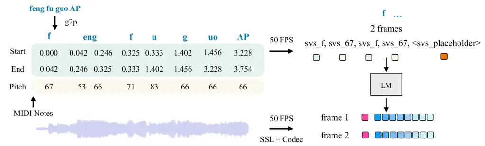

\workshoptitle

AI for Music

# Adapting Speech Language Model to Singing Voice Synthesis

Yiwen Zhao Affiliation:  Carnegie Mellon University    Jiatong Shi
Affiliation:  Carnegie Mellon University    Jinchuan Tian Affiliation: 
Carnegie Mellon University    Yuxun Tang Affiliation:  Renmin University
of China    Jiarui Hai Affiliation:  John Hopkins University    Jionghao
Han Affiliation:  Carnegie Mellon University    Shinji Watanabe
Affiliation:  Carnegie Mellon University

###### Abstract

Speech Language Models (SLMs) have recently emerged as a unified
paradigm for addressing a wide range of speech-related tasks, including
text-to-speech (TTS), speech enhancement (SE), and automatic speech
recognition (ASR). However, the generalization capability of large-scale
pre-trained SLMs remains underexplored. In this work, we adapt a 1.7B
parameter TTS pretrained SLM for singing voice synthesis (SVS), using
only a 135-hour synthetic singing corpus, ACE-Opencpop. Building upon
the ESPNet-SpeechLM, our recipe involves the following procedure: (1)
tokenization of music score conditions and singing waveforms, (2)
multi-stream language model token prediction, (3) conditional flow
matching-based mel-spectrogram generation. (4) a mel-to-wave vocoder.
Experimental results demonstrate that our adapted SLM generalizes well
to SVS and achieves performance comparable to leading discrete
token-based SVS models. Project page with sample and code is available¹¹
1 https://tsukasane.github.io/SLMSVS/.

## 1 Introduction

Large language models (LLMs) have attracted considerable attention in
recent years due to their ability to unify representations across
diverse data modalities. This unifying capability enables a single model
architecture to scale effectively and generalize across a broad range of
tasks. By adopting consistent paradigms for data processing and
prediction, LLMs can be efficiently adapted to downstream applications,
even in low-resource scenarios.

In the speech domain, prior research has primarily pursued two
approaches: (1) fine-tuning language models pretrained on text for
speech-related tasks, or (2) training language models directly on speech
data. The latter approach, often referred to as Speech Language Models
(SLMs), tends to capture fine-grained acoustic characteristics more
effectively due to its native exposure to audio signals. However, SLMs
are inherently data-intensive, requiring large-scale paired datasets.
Consequently, most existing pre-training efforts focus on well-resourced
tasks such as text-to-speech (TTS) and automatic speech recognition
(ASR).

In contrast, singing voice synthesis (SVS) presents additional
challenges. The input consists of richly structured musical scores,
including phoneme-level lyrics, precise duration annotations, and MIDI
notes. The output is vocal singing that must be both musically and
phonetically faithful to these conditions. Compared to TTS, publicly
available SVS datasets are far more limited due to restrictive licensing
and the labor-intensive nature of score annotation.

To explore the generalization capability of SLMs, we propose adapting a
TTS-pretrained SLM to the SVS task. We first tokenize the input music
score and target singing waveforms as shown in Fig. 1, formulating a
multi-stream token prediction task to fine-tune the LM. The predicted
tokens, including SSL and multi-layer codec tokens, are able to be
separated and decoded to a waveform using the pretrained codec decoder.
However, our primary experiment shows that the raw predicted tokens are
noisy, as shown in Tab. 2, with resulting waveforms exhibiting temporal
discontinuities, particularly at token boundaries, leading to perceptual
glitches and unnatural transitions ¹. Moreover, as the codec model Shi
et al. (2024) is pretrained on speech data, it lacks the ability to
faithfully resynthesize singing, resulting in a performance upper bound
set by the decoder side.

To alleviate the unsatisfactory performance introduced by the codec
decoder and the noisy tokens, we use a conditional flow matching model,
converting the source Gaussian noise to the target mel spectrogram
conditioned on the codec, and additionally train a vocoder Kong et al.
(2020) that is consistent with the codec STFT parameters. This
optimization enables high-quality singing synthesis while addressing the
limitations posed by data scarcity. Considering the expressiveness of
synthesized singing, we strengthen the condition of pitch information
again through the flow matching process, which improves the melodious
fidelity.

Empirical results demonstrate that this second-stage refinement improves
synthesis quality, yielding smoother transitions and enhanced pitch
accuracy. Overall, our framework enables SLM-based SVS to achieve
performance comparable to leading discrete SVS systems. A detailed
introduction of related works is attached in appendix A.



Figure 1: Illustration of music notes tokenization and waveform
tokenization. The phoneme, duration, and MIDI are quantized to 50FPS
discrete tokens, appended to the TTS vocabulary. The audio tokens are
obtained by a pretrained codec encoder and SSL model, with each frame
represented by a concatenation of one SSL token and eight codec tokens.

## 2 Methodology

Given the music score
$`M:=(M^{\text{ph}},M^{\text{pi}},M^{\text{du}})`$, SVS targets to
generate a human singing phrase $`Y\in\mathbb{R}^{T}`$ that align with
$`M`$, where $`T`$ is the number of samples in the waveform,
$`M^{\text{ph}}\in\mathbb{R}^{T^{\prime}}`$,
$`M^{\text{pi}}\in\mathbb{R}^{T^{\prime}}`$,
$`M^{\text{du}}\in\mathbb{R}^{T^{\prime}}`$ represents information about
phoneme, pitch, and duration over the sequence of the same length
$`T^{\prime}`$. We first introduce the SVS data tokenization, then
formulate the SVS fine-tuning on SLM, and lastly demonstrate the
conditional flow refinement pipeline.

### 2.1 SVS Data Tokenization

Figure 2: SVS fine-tuning task template. The audio codec tokens and SSL
tokens are concatenated along the RVQ stream axis.

Our pipeline is built upon Espnet-SpeechLM Tian et al. (2025b); Tian et
al. (2025a). For SVS, we introduce a new modality called svs*lb, which
consists of frame-level pitch, duration, and phoneme conditions. Each
unit in svs_lb is a two-element tuple, including a phoneme token and a
pitch token with svs prefix. We use the repeat time of (phn, pitch)
tuple to implicitly represent duration, which is calculated as:
$`\text{repeat}=(m*{\text{ed}}-m*{\text{st}})\times\text{fps}`$, where
$`m*{\text{ed}}`$ and $`m\_{\text{st}}`$ represent the end and start time
of an element in $`M^{\text{du}}`$. This process aligns the annotation
with the audio codec sample rate. We show our SVS data tokenization
pipeline in Figure 1. Our prompt includes the svs_lb and spk_prompt; the
target tokens are set to be the concatenation of codec and SSL tokens of
singing waveforms.

### 2.2 Language Model Formulation

For audio representation, we use two types of tokens: the high-level
semantics tokens obtained from SSL, and the low-level acoustic tokens
from the audio codec. We follow the pre-trained TTS model to use a
multi-stream discrete audio representation
$`\mathbf{s}_{f}\in\mathbb{N}^{F\times n_{q}}`$ for each frame, where
$`n_{q}`$ stands for the number of streams, $`F`$ is the total frame
number. Specifically, we concatenate the audio codec tokens and the SSL
tokens along the stream dimension, intending to balance their advantages
for prediction and acoustic reconstruction. Then, we only keep the codec
tokens for decoding. Task and template definitions are shown in
Figure 2.

In SLM, tasks can be uniformly formulated as predicting the target
sequence based on the input condition sequence. Adapting this template
to SVS, we have the inputs
$`\mathbf{m}=[\mathbf{m_{1}},\mathbf{m_{2}},...\mathbf{m_{F}}]`$, which
is the frame-level music score unit, speaker prompt
$`\mathbf{p}=[\mathbf{p_{1}},\mathbf{p_{2}},...\mathbf{p_{F}}]`$; and
the target frame-level singing feature
$`\mathbf{s}=[\mathbf{s_{1}},\mathbf{s_{2}},...,\mathbf{s_{F}}]`$. As a
token classification task, the fine-tuning objective is to maximize the
posterior likelihood $`P(\mathbf{s}|\mathbf{m},\mathbf{p})`$ using
cross-entropy loss.

Figure 3: Training and inference process of flow matching.

### 2.3 Flow-Based Refinement

Flow models are a class of generative models that learn a velocity field
capable of transporting samples from a source distribution to a target
distribution. In this work, we adopt flow matching to train the flow
model efficiently and scalably. During training, the model regresses the
velocity field along a probabilistic interpolation path by sampling
intermediate timesteps $`\mathbf{t}\in[0,1]`$. At inference, a sample
from the source distribution is provided, and the trained velocity field
is used to transport it towards the corresponding sample in the target
distribution.

Let the source distribution be denoted as $`X_{0}\sim p`$, where $`p`$
is a standard Gaussian distribution. The corresponding target samples
are drawn from $`X_{1}\sim q`$, where $`q`$ is the distribution of mel
features obtained from the target waveforms from STFT. The goal of the
flow model $`\Psi`$ is to learn a smooth mapping from $`X_{0}`$ to
$`X_{1}`$ through a continuous-time velocity field, which follows a
continuous-time Markov process. The evolution of a sample over time is
governed by:

```math
X_{t+h}=\psi_{t+h|t}(X_{t}),\quad t\in[0,1], \tag{1}
```

where $`\psi_{t+h|t}`$ denotes the transition function over a small time
increment $`h`$. The instantaneous velocity of a point along its
trajectory is defined as:

```math
\frac{d}{dt}\psi_{t}(x)=u_{t}(\psi_{t}(x)). \tag{2}
```

where $`u_{t}`$ is the velocity field at time $`t`$. For flow matching,
we adopt a linear interpolation path between source and target samples.
This formulation corresponds to the optimal transport path under a
kinetic energy minimization constraint,

```math
\psi_{t}(x\mid x_{1})=(1-t)x+tx_{1}. \tag{3}
```

We fuse the LM-predicted codec and pitch signal as additional conditions
to make the flow controllable. Let $`C`$ denote the conditioning input,
which contains $`\mathbf{s}`$ and other optional choices. Let $`\theta`$
represent the parameters of the conditional flow model. The training
objective of Conditional Flow Matching (CFM) is to minimize the squared
error between the ground-truth velocity and the model-predicted velocity
at a set of points sampled from the path from source distribution to
target distribution:

```math
\mathcal{L_{\text{CFM}(\theta)}}=\mathbb{E}_{t,(X_{0},X_{1},C)\sim\pi_{0,1,C}}|u_{t}(X_{t}\mid X_{1})-u_{t}^{\theta}(X_{t}\mid C)|^{2}, \tag{4}
```

```math
u_{t}^{\theta}(x\mid c):[0,1]\times\mathbb{R}^{d}\times\mathbb{R}^{k}\rightarrow\mathbb{R}^{d}. \tag{5}
```

where $`u_{t}^{\theta}(x\mid c)`$ is the predicted velocity field
function. During inference, we solve the corresponding ordinary
differential equation (ODE) using a numerical ODE solver, which starts
from $`X_{0}\sim\mathcal{N}(0,I)`$, and integrates the velocity field
forward in time to obtain the target sample in $`X_{1}`$.

```math
\frac{d}{dt}X_{t}=u_{t}^{\theta}(X_{t}), \tag{6}
```

```math
Y=\text{Voc}(x_{1}),\quad x_{1}\in X_{1}. \tag{7}
```

The ultimate sample $`x_{1}\in X_{1}`$ is further converted to a
waveform $`Y`$ using a vocoder,

| Strategies       | ACE-Opencpop          |                     |                   |                   |                     |                        |
| ---------------- | --------------------- | ------------------- | ----------------- | ----------------- | ------------------- | ---------------------- |
|                  | F0_RMSE$`\downarrow`$ | F0_CORR$`\uparrow`$ | MCD$`\downarrow`$ | PER$`\downarrow`$ | SingMOS$`\uparrow`$ | Sheet-SSQA$`\uparrow`$ |
| XiaoiceSing      | 71.67                 | 0.62                | 11.47             | 0.09              | 3.88                | 3.62                   |
| TokSing          | 55.83                 | 0.67                | 6.77              | 0.19              | 4.08                | 3.89                   |
| LM + Flow1 + Voc | 62.79                 | 0.60                | 7.86              | 0.36              | 4.09                | 3.79                   |

Table 1: Comparison of discrete SVS systems.

| Conditions       | ACE-Opencpop          |                     |                   |                   |                        |                     |                        |
| ---------------- | --------------------- | ------------------- | ----------------- | ----------------- | ---------------------- | ------------------- | ---------------------- |
|                  | F0_RMSE$`\downarrow`$ | F0_CORR$`\uparrow`$ | MCD$`\downarrow`$ | PER$`\downarrow`$ | Singer-Sim$`\uparrow`$ | SingMOS$`\uparrow`$ | Sheet-SSQA$`\uparrow`$ |
| CD Resynthesis   | 51.38                 | 0.73                | 5.84              | 0.19              | 0.67                   | 3.95                | 3.78                   |
| LM + CD          | 62.90                 | 0.60                | 8.26              | 0.56              | 0.49                   | 3.65                | 3.08                   |
| LM + Flow1 + CD  | 61.51                 | 0.60                | 8.44              | 0.45              | 0.49                   | 3.64                | 3.08                   |
| LM + Flow1 + Voc | 62.79                 | 0.60                | 7.86              | 0.36              | 0.61                   | 4.09                | 3.79                   |
| LM + Flow2 + Voc | 62.52                 | 0.62                | 7.66              | 0.42              | 0.56                   | 3.95                | 3.55                   |

Table 2: Ablation on recipe designs.

## 3 Experiment

### 3.1 Corpus and Parameters Setups

ACE-Opencpop is a synthetic corpus that inherits the song list from
5.2-hour Mandarin female singing corpus Opencpop, but curates the
singing of 30 additional singers using ACE Studio with manual tuning,
resulting in the largest, 135-hour opensourced SVS corpus. Detailed
parameters setup for SLM fine-tuning and flow matching are shown in
appendix B.

### 3.2 Results Analysis and Ablations

Explanation of the abbreviations used in Tab. 2 and Tab. 2. XiaoiceSing
uses music score information to predict discrete tokens and train a
vocoder on discrete tokens to waveform. TokSing also builds on a
discrete NAR architecture, but further introduces a melody predictor and
a music enhancer to improve pitch precision. CD Resynthesis denotes
directly encoding and decoding singing waveforms using a
speech-pretrained codec model. Flow1 refers to flow matching conditioned
on the LM-predicted codec features, while Flow2 conditions on both the
LM-predicted codec features and the pitch tensor. +CD indicates that the
flow output is in the codec embedding space and is converted to
waveforms via a pretrained codec decoder. +Voc indicates that the flow
output is in the mel-spectrogram space and is converted to waveforms via
a vocoder.

Metrics used in Tab. 2 and Tab. 2. F0_RMSE and F0_CORR Hayashi et al.
(2020) measure the root mean squared error and correlation between the
fundamental frequency (F0) of the synthesized and reference singing
signals, focusing on pitch accuracy. MCD Kubichek (1993) quantifies the
spectral distance between the generated and ground-truth audio using
mel-cepstral coefficients. PER denotes phoneme error rate. SingMOS Tang
et al. (2024) and Sheet-SSQA Huang et al. (2024) is a pseudo MOS
predictor based on a 5-point mean opinion score scale.

Quantitative Analysis. As shown in Tab. 2, our SLM-based SVS pipeline
achieves performance comparable to state-of-the-art discrete SVS models.
Compare with XiaoiceSing Lu et al. (2020), our model performs better in
pitch-related f0 metrics and overall singing quality, as indicated by
pseudo MOS. While the pitch accuracy (reflected by the f0-related
metrics) slightly lags behind TokSing Wu et al. (2024), the overall
singing quality matches or even surpasses it, demonstrating the
effectiveness of our architectural design and the strong downstream
generalization capability of SLM. The ablation study highlights the
impact of using mel versus codec features as the flow output space: mel
features appear easier to model, as indicated by the greater improvement
over the LM+CD baseline. Also, as the speech-pretrained codec model
leads to information loss in resynthesis already, it sets an upper bound
for using the codec feature to form the flow output space. Moreover,
incorporating pitch information into flow matching yields a modest gain
in pitch fidelity, which is shown by the comparison between LM + Flow1 +
Voc and LM + Flow2 + Voc.

## 4 Conclusion

In this paper, we present a pipeline that adapts a TTS-pretrained SLM
for the SVS task, achieving performance on par with state-of-the-art
discrete SVS methods. This demonstrates the strong generalizability of
SLMs in low-resource downstream settings and points to promising
directions for future multi-task SLM research.

Acknowledgement. Experiments of this work used the Bridges2 at PSC and
Delta/DeltaAI NCSA computing systems through allocation CIS210014 from
the ACCESS program, supported by NSF grants 2138259, 2138286, 2138307,
2137603, and 2138296.

## References

- Abouelenin et al. (2025) A. Abouelenin, A. Ashfaq, A. Atkinson, H.
  Awadalla, N. Bach, J. Bao, A. Benhaim, M. Cai, V. Chaudhary, C. Chen,
  et al. Phi-4-mini technical report: compact yet powerful multimodal
  language models via mixture-of-loras. arXiv preprint arXiv:2503.01743.
  Cited by: §A.1.
- Bai et al. (2024) Y. Bai, H. Chen, J. Chen, Z. Chen, Y. Deng, X.
  Dong, L. Hantrakul, W. Hao, Q. Huang, Z. Huang, D. Jia, F. La, D.
  Le, B. Li, C. Li, H. Li, X. Li, S. Liu, W. Lu, Y. Lu, A. Shaw, J.
  Spijkervet, Y. Sun, B. Wang, J. Wang, Y. Wang, Y. Wang, L. Xu, Y.
  Yang, C. Yao, S. Zhang, Y. Zhang, Y. Zhang, H. Zhao, Z. Zhao, D.
  Zhong, S. Zhou, and P. Zou Seed-music: a unified framework for high
  quality and controlled music generation. External Links: 2409.09214,
  [Link](https://arxiv.org/abs/2409.09214) Cited by: §A.1.
- Chu et al. (2024) Y. Chu, J. Xu, Q. Yang, H. Wei, X. Wei, Z. Guo, Y.
  Leng, Y. Lv, J. He, J. Lin, et al. Qwen2-audio technical report. arXiv
  preprint arXiv:2407.10759. Cited by: §A.1.
- Ding et al. (2025) D. Ding, Z. Ju, Y. Leng, S. Liu, T. Liu, Z.
  Shang, K. Shen, W. Song, X. Tan, H. Tang, et al. Kimi-audio technical
  report. arXiv preprint arXiv:2504.18425. Cited by: §A.1.
- Dinh et al. (2016) L. Dinh, J. Sohl-Dickstein, and S. Bengio Density
  estimation using real nvp. arXiv preprint arXiv:1605.08803. Cited by:
  §A.3.
- Hayashi et al. (2020) T. Hayashi, R. Yamamoto, K. Inoue, T.
  Yoshimura, S. Watanabe, T. Toda, K. Takeda, Y. Zhang, and X. Tan
  ESPnet-TTS: unified, reproducible, and integratable open source
  end-to-end text-to-speech toolkit. In ICASSP 2020-2020 IEEE
  international conference on acoustics, speech and signal processing
  (ICASSP), pp. 7654–7658. Cited by: §3.2.
- Huang et al. (2024) W. Huang, E. Cooper, and T. Toda Mos-bench:
  benchmarking generalization abilities of subjective speech quality
  assessment models. arXiv preprint arXiv:2411.03715. Cited by: §3.2.
- Kharitonov et al. (2023) E. Kharitonov, D. Vincent, Z. Borsos, R.
  Marinier, S. Girgin, O. Pietquin, M. Sharifi, M. Tagliasacchi, and N.
  Zeghidour Speak, read and prompt: high-fidelity text-to-speech with
  minimal supervision. External Links: 2302.03540,
  [Link](https://arxiv.org/abs/2302.03540) Cited by: §A.1.
- Kingma and Dhariwal (2018) D. P. Kingma and P. Dhariwal Glow:
  generative flow with invertible 1x1 convolutions. Advances in neural
  information processing systems 31. Cited by: §A.3.
- Kong et al. (2020) J. Kong, J. Kim, and J. Bae HiFi-gan: generative
  adversarial networks for efficient and high fidelity speech synthesis.
  In Advances in Neural Information Processing Systems 33: Annual
  Conference on Neural Information Processing Systems 2020, NeurIPS
  2020, December 6-12, 2020, virtual, H. Larochelle, M. Ranzato, R.
  Hadsell, M. Balcan, and H. Lin (Eds.), Cited by: §1.
- Kubichek (1993) R. Kubichek Mel-cepstral distance measure for
  objective speech quality assessment. In Proceedings of IEEE pacific
  rim conference on communications computers and signal processing, Vol.
  1, pp. 125–128. Cited by: §3.2.
- Li et al. (2024) R. Li, Z. Hong, Y. Wang, L. Zhang, R. Huang, S.
  Zheng, and Z. Zhao Accompanied singing voice synthesis with fully
  text-controlled melody. CoRR abs/2407.02049. External Links:
  [Link](https://doi.org/10.48550/arXiv.2407.02049) Cited by: §A.2.
- Lu et al. (2020) P. Lu, J. Wu, J. Luan, X. Tan, and L. Zhou
  Xiaoicesing: a high-quality and integrated singing voice synthesis
  system. arXiv preprint arXiv:2006.06261. Cited by: §A.2, §3.2.
- Popov et al. (2021) V. Popov, I. Vovk, V. Gogoryan, T. Sadekova,
  and M. Kudinov Grad-tts: a diffusion probabilistic model for
  text-to-speech. In International conference on machine learning,
  pp. 8599–8608. Cited by: §A.3.
- Prenger et al. (2019) R. Prenger, R. Valle, and B. Catanzaro Waveglow:
  a flow-based generative network for speech synthesis. In ICASSP
  2019-2019 IEEE International Conference on Acoustics, Speech and
  Signal Processing (ICASSP), pp. 3617–3621. Cited by: §A.3.
- Saino et al. (2006) K. Saino, H. Zen, Y. Nankaku, A. Lee, and K.
  Tokuda An hmm-based singing voice synthesis system.. In INTERSPEECH,
  pp. 2274–2277. Cited by: §A.2.
- Shi et al. (2024) J. Shi, J. Tian, Y. Wu, J. Jung, J. Q. Yip, Y.
  Masuyama, W. Chen, Y. Wu, Y. Tang, M. Baali, D. Alharthi, D. Zhang, R.
  Deng, T. Srivastava, H. Wu, A. H. Liu, B. Raj, Q. Jin, R. Song, and S.
  Watanabe ESPnet-codec: comprehensive training and evaluation of neural
  codecs for audio, music, and speech. In IEEE Spoken Language
  Technology Workshop, SLT 2024, Macao, December 2-5, 2024, pp. 562–569.
  Cited by: §1.
- Strauss et al. (2023) M. Strauss, M. Torcoli, and B. Edler Improved
  normalizing flow-based speech enhancement using an all-pole gammatone
  filterbank for conditional input representation. In 2022 IEEE Spoken
  Language Technology Workshop (SLT), pp. 444–450. Cited by: §A.3.
- Tang et al. (2024) Y. Tang, J. Shi, Y. Wu, and Q. Jin SingMOS: an
  extensive open-source singing voice dataset for MOS prediction. CoRR
  abs/2406.10911. External Links:
  [Link](https://doi.org/10.48550/arXiv.2406.10911) Cited by: §3.2.
- Tian et al. (2025a) J. Tian, W. Chen, Y. Peng, J. Shi, S. Arora, S.
  Bharadwaj, T. Maekaku, Y. Shinohara, K. Goto, X. Yue, H. Yang, and S.
  Watanabe OpusLM: A family of open unified speech language models. CoRR
  abs/2506.17611. Cited by: §2.1.
- Tian et al. (2025b) J. Tian, J. Shi, W. Chen, S. Arora, Y.
  Masuyama, T. Maekaku, Y. Wu, J. Peng, S. Bharadwaj, Y. Zhao, S.
  Cornell, Y. Peng, X. Yue, C. H. Yang, G. Neubig, and S. Watanabe
  ESPnet-speechlm: an open speech language model toolkit. CoRR
  abs/2502.15218. External Links:
  [Link](https://doi.org/10.48550/arXiv.2502.15218) Cited by: §2.1.
- Tong et al. (2023) A. Tong, N. Malkin, G. Huguet, Y. Zhang, J.
  Rector-Brooks, K. Fatras, G. Wolf, and Y. Bengio Conditional flow
  matching: simulation-free dynamic optimal transport. arXiv preprint
  arXiv:2302.00482 2 (3). Cited by: §A.3.
- Wang et al. (2023) C. Wang, S. Chen, Y. Wu, Z. Zhang, L. Zhou, S.
  Liu, Z. Chen, Y. Liu, H. Wang, J. Li, et al. Neural codec language
  models are zero-shot text to speech synthesizers. arXiv preprint
  arXiv:2301.02111. Cited by: §A.1.
- Wang et al. (2025) Y. Wang, X. Han, S. Lv, T. Zhou, and Y. Chu
  LLFM-voice: emotionally expressive speech and singing voice synthesis
  with large language models via flow matching. Preprints. External
  Links:
  [Document](https://dx.doi.org/10.20944/preprints202504.1831.v1),
  [Link](https://doi.org/10.20944/preprints202504.1831.v1) Cited by:
  §A.2.
- Wang et al. (2024) Y. Wang, R. Hu, R. Huang, Z. Hong, R. Li, W.
  Liu, F. You, T. Jin, and Z. Zhao Prompt-singer: controllable
  singing-voice-synthesis with natural language prompt. In Proceedings
  of the 2024 Conference of the North American Chapter of the
  Association for Computational Linguistics: Human Language Technologies
  (Volume 1: Long Papers), NAACL 2024, Mexico City, Mexico, June 16-21,
  2024, K. Duh, H. Gómez-Adorno, and S. Bethard (Eds.), pp. 4780–4794.
  Cited by: §A.2.
- Wu et al. (2024) Y. Wu, C. Zhang, J. Shi, Y. Tang, S. Yang, and Q. Jin
  TokSing: singing voice synthesis based on discrete tokens. In 25th
  Annual Conference of the International Speech Communication
  Association, Interspeech 2024, Kos, Greece, September 1-5, 2024, I.
  Lapidot and S. Gannot (Eds.), Cited by: §3.2.
- Zhang et al. (2025) C. Zhang, Y. Ma, Q. Chen, W. Wang, S. Zhao, Z.
  Pan, H. Wang, C. Ni, T. H. Nguyen, K. Zhou, Y. Jiang, C. Tan, Z.
  Gao, Z. Du, and B. Ma InspireMusic: integrating super resolution and
  large language model for high-fidelity long-form music generation.
  External Links: 2503.00084, [Link](https://arxiv.org/abs/2503.00084)
  Cited by: §A.1.
- Zhang et al. (2023) Y. Zhang, H. Xue, H. Li, L. Xie, T. Guo, R. Zhang,
  and C. Gong VISinger2: high-fidelity end-to-end singing voice
  synthesis enhanced by digital signal processing synthesizer. In 24th
  Annual Conference of the International Speech Communication
  Association, Interspeech 2023, Dublin, Ireland, August 20-24, 2023, N.
  Harte, J. Carson-Berndsen, and G. Jones (Eds.), pp. 4444–4448.
  External Links: [Link](https://doi.org/10.21437/Interspeech.2023-391)
  Cited by: §A.2.

## Appendix A Related Works

### A.1 Speech Language Models

Large language models have witnessed significant advancements in recent
years, primarily driven by increased model scale, enhanced data
availability, and improved training paradigms. Their ability to learn
unified representations across modalities has enabled progress on a wide
range of tasks.

Recent works have extended this paradigm to the audio domain, resulting
in speech language models (SLMs) that treat speech as a sequence of
discrete tokens, analogous to natural language Abouelenin et al. (2025);
Chu et al. (2024); Ding et al. (2025); Wang et al. (2023); Kharitonov et
al. (2023). SLMs demonstrate strong transferability from general
pretraining to specific downstream tasks, using techniques like
fine-tuning Ding et al. (2025); Chu et al. (2024) and LORAs Abouelenin
et al. (2025), while pretraining is typically conducted on large-scale,
general-purpose corpora, domain adaptation is feasible through
fine-tuning on curated task-specific datasets.

Previous works also explore using a language model to generate
music Zhang et al. (2025); Bai et al. (2024). However, training the
language model on singing requires a large amount of data, which is
always closed-source and hard to access by the community. Our work adapt
TTS-pretrained SLM to a low-resource SVS setting.

### A.2 Singing Voice Synthesis

Singing voice synthesis (SVS) aims to generate expressive and
intelligible singing voices from structured musical inputs, typically
including phoneme-level lyrics, MIDIs, and note durations. Compared to
TTS, SVS requires a higher degree of temporal precision and pitch
accuracy to maintain musicality. This renders SVS more sensitive to the
alignment between input conditions and the generated acoustic output.
Early approaches in SVS were based on concatenative and HMM-based
methods Saino et al. (2006), while recent work has shifted towards
neural vocoder-based systems Lu et al. (2020), including encoder-decoder
architectures and end-to-end frameworks Zhang et al. (2023).

Recent studies have begun leveraging large language models (LLMs) for
singing voice synthesis (SVS) and text-to-song generation, enabling more
flexible and controllable singing beyond traditional alignment-based
methods. Prompt-Singer Wang et al. (2024) introduces a prompt-based SVS
system that controls vocal style (e.g., timbre, range) via natural
language, using a decoder-only transformer with a range–melody decoupled
pitch representation for intuitive style manipulation. MelodyLM /
TTSong Li et al. (2024) advances toward fully text-driven song
generation by predicting melody representations from lyrics and textual
descriptions, integrating LLM-based melody modeling with diffusion-based
accompaniment synthesis. LLFM-Voice Wang et al. (2025) unifies
expressive speech and singing synthesis using an LLM front-end and
flow-matching acoustic model, achieving smoother emotional expression
and higher-fidelity vocal rendering.

Our work differs by leveraging a general-purpose speech language model,
pre-trained on TTS data, and adapting it to SVS through token-level
modeling and conditional refinement, enabling the complex SVS to be a
subtask of a unified model.

### A.3 Flow-Based Models

Flow-based generative models, such as RealNVP Dinh et al. (2016) and
Glow Kingma and Dhariwal (2018), are a class of invertible neural
networks that learn data distributions through a sequence of bijective
transformations. These classical flow models enable exact likelihood
estimation and efficient sampling, and have been successfully applied to
high-fidelity speech and audio generation tasks, including
vocoding Prenger et al. (2019), speech enhancement Strauss et al.
(2023), and expressive speech synthesis Popov et al. (2021).

In contrast, flow-matching approaches Tong et al. (2023) are ODE-based
methods conceptually closer to diffusion models (which are SDE-based).
Instead of performing explicit density estimation like classical flows,
flow-matching trains conditional flows via velocity field learning,
providing a scalable and flexible framework for conditional generation.

In this work, we adopt a conditional flow-matching model to generate
mel-spectrogram features from Gaussian noise, conditioned on
LM-predicted codec embeddings as well as musical pitch labels. This
approach refines the acoustic realism and pitch fidelity of generated
singing voices while avoiding the computational overhead of traditional
flow-based likelihood estimation.

## Appendix B Model Parameter Setups

### B.1 Language Model Finetuning.

We finetune the model using DeepSpeed with mixed-precision (FP16)
training, Adam optimizer ($`\beta_{1}=0.9,\ \beta_{2}=0.95`$, learning
rate $`5\times 10^{-6}`$), and ZeRO stage-2 optimization for memory
efficiency. A Warmup–Cosine learning rate scheduler with
$`7\times 10^{5}`$ total steps (minimum LR ratio $`0.3`$) is employed.
Gradient clipping is set to $`1.0`$. Contiguous memory and
communication-overlap optimizations are enabled to ensure stable and
scalable training.

### B.2 Flow Matching.

We train the model for a total of $`30`$ epochs with a batch size of
$`64`$. The learning rate is scheduled to decay linearly from
$`3\times 10^{-4}`$ to $`1\times 10^{-4}`$ between steps
$`2\times 10^{5}`$ and $`5\times 10^{5}`$.
