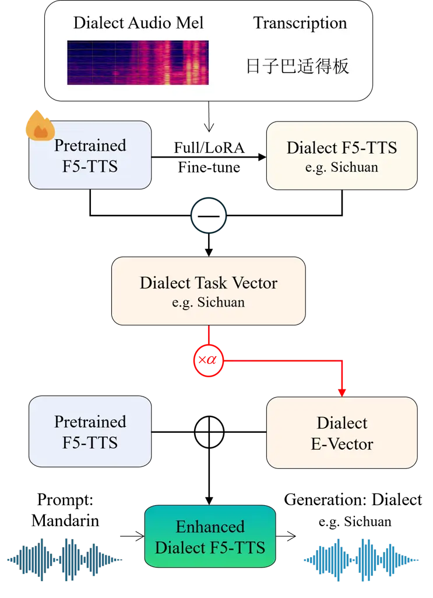
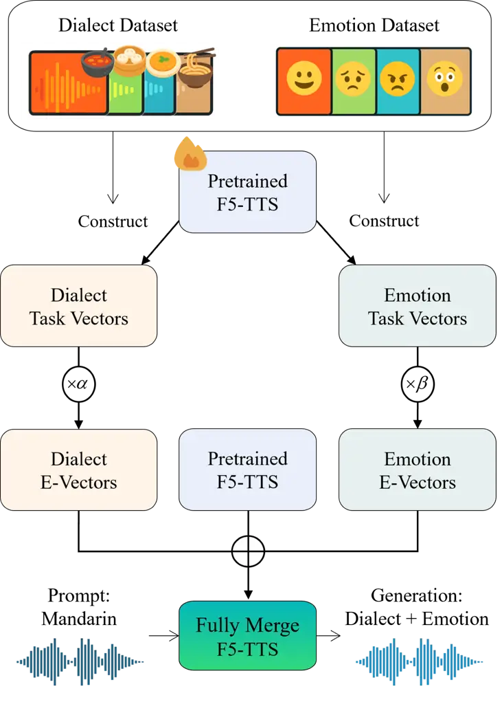
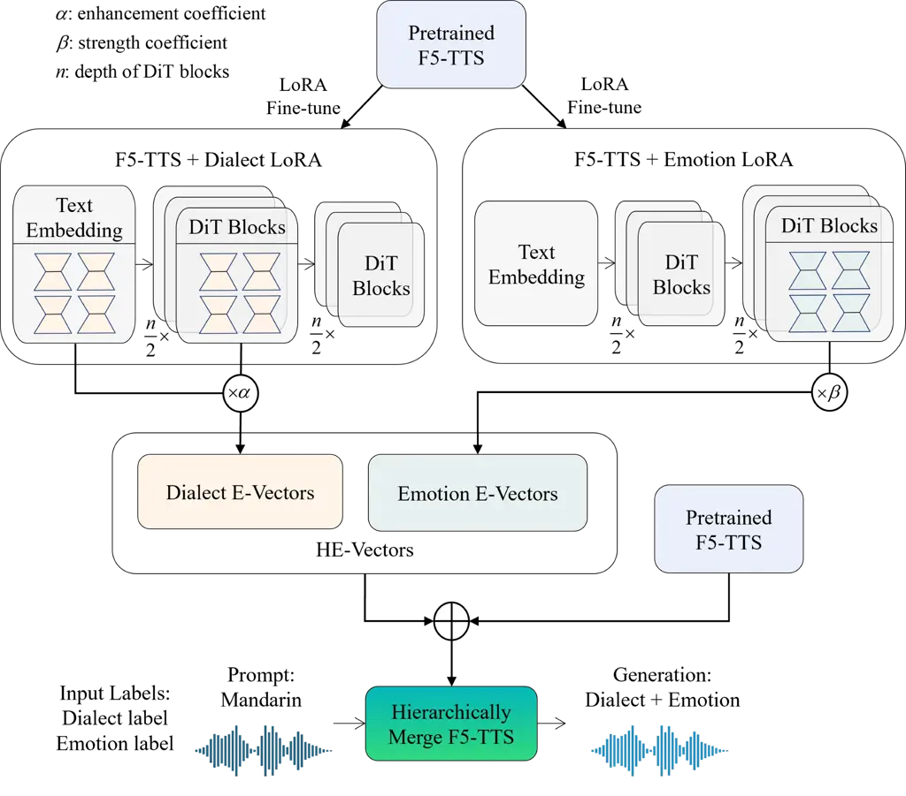

# Task Vector in TTS: Toward Emotionally Expressive Dialectal Speech Synthesis

Pengchao Feng, Yao Xiao, Ziyang Ma, Zhikang Niu, Shuai Fan, Yao Li,
Sheng Wang, Xie Chen ^(†)^(†)thanks: ^(\*) Equal contribution. \$†\$
Corresponding Author.^(†)^(†)thanks: The code and demo is available at
[https://the-bird-f.github.io/Expressive-Vectors](https://the-bird-f.github.io/Expressive-Vectors).

###### Abstract

Recent advances in text-to-speech (TTS) have yielded remarkable
improvements in naturalness and intelligibility. Building on these
achievements, research has increasingly shifted toward enhancing the
expressiveness of generated speech, such as dialectal and emotional TTS.
However, cross-style synthesis combining both dialect and emotion
remains challenging and largely unexplored, mainly due to the scarcity
of dialectal data with emotional labels. To address this, we propose
Hierarchical Expressive Vector (HE-Vector), a two-stage method for
Emotional Dialectal TTS. In the first stage, we construct different task
vectors to model dialectal and emotional styles independently, and then
enhance single-style synthesis by adjusting their weights, a method we
refer to as Expressive Vector (E-Vector). For the second stage, we
hierarchically integrate these vectors to achieve controllable
emotionally expressive dialect synthesis without requiring jointly
labeled data, corresponding to Hierarchical Expressive Vector
(HE-Vector). Experimental results demonstrate that HE-Vectors achieve
superior performance in dialect synthesis, and promising results in
synthesizing emotionally expressive dialectal speech in a zero-shot
setting.

###### Index Terms: 

Zero-shot Speech Synthesis, Task Vector, Dialectal and Emotional TTS

^(†)^(†)address: ¹ School of Computer Science, Shanghai Jiao Tong
University, China  
² Shanghai Innovation Institute ³ Shanghai Aviation Electric Co., Ltd

## 1 Introduction

In recent years, text-to-speech (TTS) technology has made remarkable
progress, driven in large part by the availability of large TTS systems
and scalable training datasets. Both autoregressive (AR) models \[22,
18, 19, 1\] and non-autoregressive (NAR) models \[5, 28, 17, 9, 10, 23,
25\] now achieve human-level speech quality and impressive zero-shot
capabilities on unseen speakers. Building on these advances, there has
been growing interest in enhancing the expressiveness of generated
speech, with approaches falling into two categories: indirectly through
the manipulation of objective acoustic features (e.g., latency, pitch,
intensity) \[3\], or directly through the modeling of subjective
expressive styles (e.g., dialect, emotion, speaking style) \[24\]. While
acoustic features are relatively easy to model, direct control of
expressive styles is substantially more challenging because of the weak
alignment between abstract styles and acoustic spectra and the scarcity
of high-quality labeled data. The challenge becomes even greater when
jointly controlling multiple styles, as the scarcity of dialectal data
with emotional labels and the potential interference among dialect,
emotion, and other expressive factors further complicate the task.

To address these limitations, we propose the Hierarchical Expressive
Vector (HE-Vector), a two-stage method for both single-style and
multi-style expressive speech synthesis. Specifically, in the first
stage, we introduce E-Vector, an expressive style vector built upon
F5-TTS, to capture the expressiveness of dialects and emotions
individually. E-Vectors are derived from Task Vectors \[16\], which
amplifies style-specific features, improves clarity, and reduces
interference from prompt audio. This method does not require full
fine-tuning, offering high training efficiency. In the second stage, we
propose the Hierarchically Merging Strategy for integrating dialect and
emotion E-Vectors. The key to this design is modulating dialect and
emotion at separate layers of the model. This maximizes the
effectiveness of each style’s representation and ensures that learning
one style does not interfere with the other. Crucially, this strategy
requires no datasets with joint dialect-emotion labels, making it ideal
for low-resource and zero-shot cross-style synthesis.

In summary, our contributions are threefold:

- •
  We propose HE-Vector, a two-stage framework that enables joint control
  of dialect and emotion without requiring datasets annotated with both
  attributes, improving flexibility and data efficiency.
- •
  We introduce E-Vector, which linearly scales task vectors to enhance
  the characteristics of individual dialects or emotions, enabling
  efficient and clear single-style synthesis from limited data.
- •
  We develop the hierarchical integration strategy, which controls
  dialect and emotion at separate model layers, allowing them to be
  trained independently and maximizing the effectiveness of each
  modulator.



(a) E-Vector Enhanced F5-TTS



(b) Fully Merging Strategy



(c) Hierarchically Merging Strategy

Figure 1: Hierarchical Expressive Vector: (a) Construction of the
E-Vector and enhancement of F5-TTS, (b) Fully merging strategy for
dialect and emotion E-Vectors, (c) Hierarchically merging strategy for
dialect and emotion E-Vectors

## 2 Related Work

### 2.1 Dialect TTS and Emotion TTS

Chinese dialects represent an important component of Chinese cultural
heritage, and speech synthesis for dialects has received increasing
attention. Zhang et al. \[26\] proposed a Chinese dialect TTS frontend
that converts Mandarin text into dialectal expressions, improving the
intelligibility and naturalness of synthesized speech. Bailing TTS \[7\]
was the first system to adopt a Mixture of Experts (MoE) architecture
for zero-shot dialect synthesis. Beyond MoE-based approaches, the
CosyVoice series \[9, 10\] introduced an instruction-based framework
that also supports high-quality zero-shot dialect synthesis, but these
models face challenges in handling dialects with less clearly defined
regional boundaries.

Incorporating emotion into synthetic speech has long been a central
focus in the field of TTS. Both coarse-grained models based on
predefined emotion categories \[8, 12\] and fine-grained models
leveraging natural language descriptions \[9, 10, 24\] have demonstrated
strong capabilities in generating emotionally expressive speech.
However, due to the scarcity of dialectal speech corpora with reliable
emotion annotations, the task of synthesizing emotional speech in
dialects remains largely underexplored.

### 2.2 Task Vector and Application

Task Vector \[16\] is a modeling formulation of parameter variations
that arise during fine-tuning, which can capture task-specific
adaptation directions within the parameter space. This work first
introduced the idea of using task vectors and the task algorithm to
transfer deep neural networks to new tasks. Since then, task vectors
have been widely applied in various domains, including capability
editing in large language models \[15\], low-resource speech recognition
\[21\], and unified modeling of music and speech synthesis \[20\].
Theoretical foundations of task vectors have also been strengthened. For
example, Cheng \[6\] demonstrated the feasibility of linear-layer task
vector composition. Motivated by these advances, we adopt task vectors
to model subjective style capabilities, with dialects and emotions as
representative cases.

## 3 Method

### 3.1 Expressive Vector (E-Vector)

To efficiently capture the expressiveness of dialect or emotion, we
construct E-Vector, which also forms the foundation for subsequent
cross-style synthesis.

#### 3.1.1 Construct the E-Vector

We construct the E-Vector upon F5-TTS. F5-TTS \[5\] is a zero-shot
speech synthesis model with strong generalization ability, based on flow
matching with a Diffusion Transformer (DiT).

Taking dialect expression as an example, we first moderately fine-tune
the pre-trained F5-TTS model on different dialect datasets. Then, as
shown in Eq. (2), we construct the dialectal task vectors by subtracting
the parameters of the pre-trained model from those of the corresponding
fine-tuned models.

```math
\theta_{\text{pre}}\xrightarrow{\text{FT by i}}\theta_{i},\ i\in\{\text{dialects}\} \tag{1}
```

```math
\tau_{i}=\theta_{i}-\theta_{\text{pre}},\quad\epsilon_{i}=\alpha\tau_{i} \tag{2}
```

Here, $`\theta\in\mathbb{R}^{n}`$ ($`n`$ is the number of parameters)
denotes the complete set of parameters of the F5-TTS model, with
$`\theta_{\text{pre}}`$ representing the pretrained parameters and
$`\theta_{i}`$ corresponding to the parameters fine-tuned for dialect
$`i`$. The dialect task vector is denoted by
$`\tau_{i}\in\mathbb{R}^{n}`$, and the corresponding dialect E-vector by
$`\epsilon_{i}\in\mathbb{R}^{n}`$. $`\alpha`$ denotes the enhancement
coefficient, which is determined based on validation results.

#### 3.1.2 Enhanced single-style synthesis via E-Vector

Enhancement via E-Vector is based on the following two properties.

Foundation. Lharco et al. \[16\] observed that the task vectors of a
given pre-trained model and downstream tasks exhibit a consistent
directional pattern within the parameter manifold. This directional
consistency suggests that task vectors tend to converge toward a locally
optimal solution. It serves as the foundation for constructing our
dialect vector-enhanced model.

Key factor. The parameter space of F5-TTS exhibits local insensitivity,
as small perturbations (e.g., $`\epsilon\sim\mathcal{N}(0,10^{-3})`$)
within a single DiT layer do not degrade perceptual quality. This
robustness, similar to large language models \[15\], enables F5-TTS to
tolerate minor parameter perturbations without significant performance
degradation, which is a key factor enabling our E-Vector enhanced model
to achieve high-quality synthesis.

Specifically, as illustrated in Fig. 1a, by incorporating the dialect
E-vector into the parameters of the pretrained model, we construct an
enhanced dialect F5-TTS model that enables high-quality dialect
synthesis. This approach explicitly models and reinforces the
transferability of dialectal style, which can be seen as a type of
Classifier-Free Guidance (CFG) \[13\].

For attributes such as emotion, which exhibit continuous variation in
contrast to categorical attributes like dialect, our approach enables
controllable adjustment through the strength coefficient.

```math
\epsilon_{j}=\beta\tau_{j},\quad\beta\in[0,\beta_{\max}] \tag{3}
```

Here, $`\beta`$ serves as the strength coefficient within a range,
allowing explicit control over the intensity of a given emotion
flexibly.

#### 3.1.3 LoRA-based E-Vector

Instead of applying full fine-tuning to the entire TTS model, we adopt
LoRA \[14\] as a parameter-efficient alternative. Compared to full
fine-tuning, LoRA not only reduces the number of trainable parameters
but also allows multiple E-Vectors to coexist on a single backbone,
supporting diverse styles without duplicating the model.

To maximize their effectiveness, LoRA blocks are inserted into the
modules that exhibit the largest parameter variations during full
fine-tuning. Formally, let $`W_{\text{pre}}\in\mathbb{R}^{d\times k}`$
denote the frozen pre-trained weight of a module, which can be a linear,
1D convolutional, or embedding layer. For each dialect $`i`$, we
associate an independent set of LoRA parameters $`(A_{i},B_{i})`$, where
$`A_{i}\in\mathbb{R}^{r\times k}`$ and
$`B_{i}\in\mathbb{R}^{d\times r}`$.

During training, the updated weights are computed as:

```math
\displaystyle W_{i}=W_{\text{pre}}+B_{i}A_{i} \tag{4}
```

At inference, we scale each dialect LoRA vector by the enhancement
coefficient $`\alpha`$ to obtain the LoRA E-Vector:

```math
\displaystyle W_{i}=W_{\text{pre}}+\alpha^{2}B_{i}A_{i} \tag{5}
```

### 3.2 Hierarchical Expressive Vector (HE-Vector)

In the previous section, we introduced the E-Vector, which models
single-style expressiveness for dialect or emotion. However, generating
speech with both styles requires an effective integration mechanism.
Directly merging E-Vectors often leads to interference, so we propose
the Hierarchical Expressive Vector (HE-Vector) framework, which
introduces a hierarchical merging strategy, alongside a fully merged
baseline for comparison.

#### 3.2.1 Fully Merging Strategy

Following the Task Algorithm merging strategy \[16\], as illustrated in
Fig. 1b, the parameters of the dialect E-Vector and the emotion E-Vector
are directly merged with the pretrained model parameters. While
straightforward, this approach often leads to degraded controllability
and audio quality due to style interference.

#### 3.2.2 Hierarchical Merging Strategy

To mitigate these issues, we design a hierarchical merging strategy that
assigns different control factors to different network layers, as shown
in Fig. 1c. Specifically, a Dialect LoRA E-Vector is applied to the text
embedding layer and the early half of the DiT blocks, where the model
captures phonetic and pronunciation patterns most relevant to dialectal
variation. An Emotion LoRA E-Vector is applied to the latter half of the
DiT blocks, where control primarily shapes prosody, rhythm, and
intonation.

At inference, these two LoRA E-Vectors are jointly applied to the
pretrained backbone, each acting on its designated layers. This
hierarchical composition allows dialect and emotion to be integrated
without interference, ensuring that the two styles complement rather
than override each other. Compared to fully merged approaches, this
strategy achieves more stable cross-style control while maintaining
audio quality.

## 4 Experiments

### 4.1 Experiments Configuration

Datasets. We used a dialect corpus in-house, covering 8 dialects with 10
hours of speech and transcripts per dialect, split into
training/validation/test sets (8:1:1). The Emotion Speech Data \[27\]
corpus was also adopted, and we partitioned it with the same 8:1:1
ratio. In addition, subsets of CV3-Eval \[11\] were used for evaluation.

|                           |           |          |          |          |
| ------------------------- | --------- | -------- | -------- | -------- |
| Corpus                    | Subset    | Duration | Subset   | Duration |
| Dialect Corpus (in-house) | Tianjin   | 10.00 h  | Henan    | 10.00 h  |
|                           | Guangdong | 10.00 h  | Shaanxi  | 10.00 h  |
|                           | Shanghai  | 10.00 h  | Hunan    | 10.00 h  |
|                           | Sichuan   | 10.00 h  | Shandong | 10.00 h  |
| Emotion Speech            | Happy     | 5.38 h   | Sad      | 6.83 h   |
| Dataset                   | Angry     | 5.33 h   | Surprise | 5.88 h   |

Table 1: Speech dataset used in our experiments.

Evaluation Metrics. Subjective metric is Mean Opinion Score (MOS)
ratings for the overall naturalness (whether the speech matches the
intended description and achieves good perceptual quality). Each dialect
evaluation was conducted by more than five raters who are native to or
highly familiar with the corresponding dialect. Objective metrics
include (1) Word Error Rate (WER), computed by transcribing synthesized
speech with a Seed ASR \[2\] and aligning with the reference text; (2)
Speaker similarity (SIM-O), measured with the 3D-Speaker model \[4\].

### 4.2 Dialect Synthesis

| Method        | Tianjin           | Guangdong         | Shanghai          | Sichuan           | Henan             | Shaanxi           | Hunan             | Shandong          | Avg. |
| ------------- | ----------------- | ----------------- | ----------------- | ----------------- | ----------------- | ----------------- | ----------------- | ----------------- | ---- |
| GT            | 3.50 $`\pm`$ 1.27 | 4.03 $`\pm`$ 0.98 | 3.54 $`\pm`$ 1.03 | 3.70 $`\pm`$ 0.95 | 3.75 $`\pm`$ 0.82 | 3.74 $`\pm`$ 1.18 | 3.25 $`\pm`$ 0.86 | 3.99 $`\pm`$ 1.00 | 3.69 |
| CosyVoice2    | 2.70 $`\pm`$ 1.39 | 3.65 $`\pm`$ 1.12 | 3.03 $`\pm`$ 0.86 | 3.30 $`\pm`$ 0.98 | 2.11 $`\pm`$ 1.09 | 1.71 $`\pm`$ 0.98 | 2.92 $`\pm`$ 1.15 | 1.56 $`\pm`$ 0.96 | 2.62 |
| FT            | 1.76 $`\pm`$ 1.14 | 1.31 $`\pm`$ 0.45 | 1.51 $`\pm`$ 0.71 | 1.96 $`\pm`$ 0.81 | 2.50 $`\pm`$ 0.97 | 1.99 $`\pm`$ 1.00 | 1.42 $`\pm`$ 0.60 | 2.34 $`\pm`$ 0.96 | 1.85 |
| FT-last       | 3.16 $`\pm`$ 1.06 | 3.53 $`\pm`$ 1.19 | 2.05 $`\pm`$ 0.93 | 2.97 $`\pm`$ 0.95 | 3.29 $`\pm`$ 0.74 | 1.88 $`\pm`$ 0.92 | 2.78 $`\pm`$ 0.65 | 3.11 $`\pm`$ 0.87 | 2.85 |
| E-Vector      | 3.07 $`\pm`$ 1.02 | 2.99 $`\pm`$ 1.19 | 3.46 $`\pm`$ 0.92 | 3.51 $`\pm`$ 0.92 | 3.30 $`\pm`$ 0.78 | 3.44 $`\pm`$ 1.16 | 2.23 $`\pm`$ 0.89 | 3.49 $`\pm`$ 0.94 | 3.18 |
| LoRA E-Vector | 2.19 $`\pm`$ 1.10 | 1.54 $`\pm`$ 0.65 | 2.18 $`\pm`$ 0.89 | 2.54 $`\pm`$ 0.94 | 2.98 $`\pm`$ 0.79 | 2.77 $`\pm`$ 1.22 | 1.52 $`\pm`$ 0.71 | 3.09 $`\pm`$ 0.93 | 2.35 |

Table 2: Subjective evaluation of Dialect Synthesis with Mandarin
prompts (mean $`\pm`$ std) across different dialects, with row-wise
averages.

| Method         | Tianjin           | Guangdong         | Shanghai          | Sichuan           | Henan             | Shaanxi           | Hunan             | Shandong          | Avg. |
| -------------- | ----------------- | ----------------- | ----------------- | ----------------- | ----------------- | ----------------- | ----------------- | ----------------- | ---- |
| CosyVoice2     | 1.74 $`\pm`$ 0.92 | 2.60 $`\pm`$ 1.11 | 2.13 $`\pm`$ 0.99 | 2.74 $`\pm`$ 1.06 | 1.59 $`\pm`$ 0.79 | 1.35 $`\pm`$ 0.60 | 1.65 $`\pm`$ 0.83 | 1.18 $`\pm`$ 0.33 | 1.87 |
| Dual-stage     | 2.31 $`\pm`$ 0.97 | 2.04 $`\pm`$ 0.94 | 2.61 $`\pm`$ 0.91 | 2.86 $`\pm`$ 0.95 | 2.83 $`\pm`$ 1.03 | 2.88 $`\pm`$ 0.98 | 2.28 $`\pm`$ 1.08 | 2.70 $`\pm`$ 1.02 | 2.56 |
| Fully E-Vector | 2.75 $`\pm`$ 1.07 | 2.09 $`\pm`$ 0.90 | 2.99 $`\pm`$ 0.91 | 2.97 $`\pm`$ 0.71 | 3.06 $`\pm`$ 0.78 | 2.63 $`\pm`$ 0.93 | 2.50 $`\pm`$ 0.79 | 3.08 $`\pm`$ 1.00 | 2.76 |
| HE-Vector      | 2.68 $`\pm`$ 0.95 | 1.73 $`\pm`$ 0.80 | 3.07 $`\pm`$ 0.77 | 2.61 $`\pm`$ 0.80 | 3.28 $`\pm`$ 0.79 | 2.80 $`\pm`$ 0.90 | 3.22 $`\pm`$ 0.70 | 3.26 $`\pm`$ 0.71 | 2.83 |

Table 3: Subjective evaluation of Emotional Dialect Synthesis (mean
$`\pm`$ std) across different dialects, with row-wise averages.

| Method        | Avg. WER($`\%`$)^(∗) $`\downarrow`$ | Avg. SIM-O $`\uparrow`$ |
| ------------- | ----------------------------------- | ----------------------- |
| GT            | 16.59                               | -                       |
| CosyVoice2    | 14.49                               | 0.63                    |
| FT            | 9.04                                | 0.72                    |
| FT-Last       | 7.43                                | 0.65                    |
| E-Vector      | 15.41                               | 0.65                    |
| LoRA E-Vector | 18.58                               | 0.70                    |

Table 4: Objective evaluation of Dialect Synthesis with Mandarin
prompts. ^(∗)ASR evaluation covers only Guangdong, Shanghai, Sichuan,
and Shaanxi dialects due to Seed-ASR constraints, with potential
recognition errors.

The dialect synthesis task can be divided into two settings: (1) Easy
Task, synthesizing dialectal speech from a dialectal prompt, and (2)
Hard Task, synthesizing dialectal speech from a Mandarin prompt. Since
each model can achieve comparable results to the ground truth in the
former aspect, we are more focused on the latter.

For comparison, we evaluate our method against several baselines: (1)
CosyVoice2 \[10\]: one of the few open-source models capable of
zero-shot dialectal speech synthesis; (2) FT: an F5-TTS model fine-tuned
for 60k steps; (3) FT-last: an over-fine-tuned F5-TTS model (trained
until the validation loss plateaued, approximately 340k steps); (4)
E-Vector: our proposed method (F5-TTS fine-tuned for 60k steps,
enhancement coefficient $`\alpha=3.0`$, which was selected based on the
subjective results obtained from the validation set); (5) LoRA E-Vector:
an alternative version that leverages LoRA-based modeling of the
E-Vector (the enhancement coefficient $`\alpha=1.12`$, the LoRA rank
$`r=8`$, which provides a favorable trade-off between expressiveness and
parameter efficiency.). Both this experiment and the Emotion TTS
experiments are presented on our demo page.

As shown in Table 2, the E-Vector Enhanced model achieves the highest
average MOS, outperforming CosyVoice2, which was trained on thousands of
hours of speech data. This result highlights both the efficiency of
E-Vector in leveraging limited data and the advantage of expert models
over general-purpose models. Remarkably, it requires only one-fifth of
the training steps of the over-fine-tuned F5-TTS model to achieve
high-quality dialect synthesis, indicating that the method also
accelerates convergence during fine-tuning.

As shown in Table 4, the objective evaluation should be interpreted in
terms of relative magnitude, since the adopted evaluation tools
introduce certain errors in dialectal speech recognition. The results
indicate that our method achieves WER and speaker similarity comparable
to other approaches (and even to the ground truth), which demonstrates
that the E-Vector does not compromise either the correctness of
synthesized speech or the preservation of speaker characteristics.

### 4.3 Emotional Expressive Dialectal Speech Synthesis

In this task, we focus on emotional dialectal speech synthesis, where a
Mandarin reference audio is provided along with the target dialect and
emotion labels as synthesis conditions. The generated speech samples,
together with their corresponding style descriptions, are then evaluated
via subjective listening tests.

The experimental comparison involves several representative systems,
which provide a comprehensive basis for evaluating the effectiveness of
our proposed framework: (1) CosyVoice2: one of the few open-source
models capable of instruction-based multi-style speech synthesis; (2)
Dual-stage pipeline: an engineering approach where dialect-enhanced
F5-TTS and emotion-enhanced F5-TTS are sequentially combined to produce
emotional dialectal speech; (3) Fully E-Vector: a method that integrates
dialect and emotion E-vectors using a fully merging strategy; (4)
HE-Vector: our proposed approach that integrates multiple task vectors
using a hierarchical merging strategy to improve synthesis quality while
maintaining controllability.

As shown in Table 3, the HE-Vector achieves the best overall quality,
followed by the Fully E-Vector. This first demonstrates the feasibility
of fully merging E-Vectors, serving as an empirical validation of the
Task Algorithm. More importantly, it highlights the advantages of our
hierarchical merging strategy, which not only mitigates the error
accumulation caused by directly combining different E-Vectors but also
reduces the parameter overhead, making it particularly well-suited for
MoE models. At the same time, the results also reveal that existing
models often fail when attempting to simultaneously control two or more
expressive styles, highlighting the challenging nature of this research
problem.

## 5 Discussion

E-Vector for other TTS models. We also applied this approach to
CosyVoice \[9\], but found degraded synthesis quality. This is mainly
because expressive vector enhancement interferes with the coordination
between its LLM-based text encoder component and the flow-matching
acoustic model component.

Strategy for construction and merging. Our analysis of parameter
variations during expressive style transfer fine-tuning reveals that the
shifts are not strictly linear, indicating a limitation of the E-Vector
construction with linear scaling. Assigning different coefficients to
DiT layers also brought no significant gain. Developing more effective
strategies for constructing and merging E-Vectors remains an important
direction for future work.

## 6 Conclusion

In this paper, we aim to tackle the novel problem of synthesizing
emotionally expressive dialectal speech. We presented Hierarchical
Expressive Vector (HE-Vector), a two-stage approach for emotional
dialectal TTS. By independently modeling dialectal and emotional styles
as E-Vectors in the first stage and hierarchically integrating them in
the second stage, HE-Vector enables controllable synthesis without
requiring jointly labeled data. Experimental results validate the
effectiveness of our method in dialect synthesis and demonstrate its
potential for broader expressive style control. We believe this work
represents an important step toward flexible and data-efficient
expressive speech synthesis, paving the way for future research on
multi-style speech generation.

## References

- \[1\] P. Anastassiou, J. Chen, J. Chen, Y. Chen, Z. Chen, Z. Chen, and
  et al. (2024) Seed-tts: a family of high-quality versatile speech
  generation models. arXiv preprint arXiv:2406.02430. Cited by: §1.
- \[2\] Y. Bai, J. Chen, J. Chen, W. Chen, Z. Chen, C. Ding, and et
  al. (2024) Seed-asr: understanding diverse speech and contexts with
  llm-based speech recognition. arXiv preprint arXiv:2407.04675. Cited
  by: §4.1.
- \[3\] W. Chen, S. Yang, G. Li, and X. Wu (2025) DrawSpeech: expressive
  speech synthesis using prosodic sketches as control conditions. In
  ICASSP 2025-2025 IEEE International Conference on Acoustics, Speech
  and Signal Processing (ICASSP), pp. 1–5. Cited by: §1.
- \[4\] Y. Chen, S. Zheng, H. Wang, L. Cheng, T. Zhu, R. Huang, and et
  al. (2025) 3D-speaker-toolkit: an open-source toolkit for multimodal
  speaker verification and diarization. In ICASSP 2025-2025 IEEE
  International Conference on Acoustics, Speech and Signal Processing
  (ICASSP), pp. 1–5. Cited by: §4.1.
- \[5\] Y. Chen, Z. Niu, Z. Ma, K. Deng, C. Wang, J. JianZhao, and et
  al. (2025) F5-tts: a fairytaler that fakes fluent and faithful speech
  with flow matching. In Proceedings of the 63rd Annual Meeting of the
  Association for Computational Linguistics, pp. 6255–6271. Cited by:
  §1, §3.1.1.
- \[6\] R. Cheng, F. Xiong, Y. Wei, W. Zhu, and C. Yuan Whoever started
  the interference should end it: guiding data-free model merging via
  task vectors. In Forty-second International Conference on Machine
  Learning, Cited by: §2.2.
- \[7\] X. Di, Z. Chen, Y. Liang, J. Zheng, Y. Wang, and C. Ding (2024)
  Bailing-tts: chinese dialectal speech synthesis towards human-like
  spontaneous representation. arXiv preprint arXiv:2408.00284. Cited by:
  §2.1.
- \[8\] D. Diatlova and V. Shutov (2023) Emospeech: guiding fastspeech2
  towards emotional text to speech. arXiv preprint arXiv:2307.00024.
  Cited by: §2.1.
- \[9\] Z. Du, Q. Chen, S. Zhang, K. Hu, H. Lu, Y. Yang, and et
  al. (2024) Cosyvoice: a scalable multilingual zero-shot text-to-speech
  synthesizer based on supervised semantic tokens. arXiv preprint
  arXiv:2407.05407. Cited by: §1, §2.1, §2.1, §5.
- \[10\] Z. Du, Y. Wang, Q. Chen, X. Shi, and et al. (2024) Cosyvoice 2:
  scalable streaming speech synthesis with large language models. arXiv
  preprint arXiv:2412.10117. Cited by: §1, §2.1, §2.1, §4.2.
- \[11\] C. Gao, Z. Du, and S. Zhang (2025) Differentiable reward
  optimization for llm based tts system. In Proc. Interspeech 2025,
  pp. 2450–2454. Cited by: §4.1.
- \[12\] Y. Guo, C. Du, X. Chen, and K. Yu (2023) Emodiff: intensity
  controllable emotional text-to-speech with soft-label guidance. In
  ICASSP 2023-2023 IEEE International Conference on Acoustics, Speech
  and Signal Processing (ICASSP), pp. 1–5. Cited by: §2.1.
- \[13\] J. Ho and T. Salimans Classifier-free diffusion guidance. In
  NeurIPS 2021 Workshop on Deep Generative Models and Downstream
  Applications, Cited by: §3.1.2.
- \[14\] E. J. Hu, Y. Shen, P. Wallis, Z. Allen-Zhu, Y. Li, S. Wang, and
  et al. (2022) Lora: low-rank adaptation of large language models..
  ICLR 1 (2), pp. 3. Cited by: §3.1.3.
- \[15\] S. Huang, P. Li, Y. Hsu, K. Chen, Y. T. Lin, S. Hsiao, and et
  al. (2024) Chat vector: a simple approach to equip llms with
  instruction following and model alignment in new languages. In
  Proceedings of the 62nd Annual Meeting of the Association for
  Computational Linguistics, pp. 10943–10959. Cited by: §2.2, §3.1.2.
- \[16\] G. Ilharco, M. T. Ribeiro, M. Wortsman, L. Schmidt, H.
  Hajishirzi, and A. Farhadi Editing models with task arithmetic. In The
  Eleventh International Conference on Learning Representations, Cited
  by: §1, §2.2, §3.1.2, §3.2.1.
- \[17\] Z. Ju, Y. Wang, K. Shen, X. Tan, D. Xin, D. Yang, and et al.
  NaturalSpeech 3: zero-shot speech synthesis with factorized codec and
  diffusion models. In Forty-first International Conference on Machine
  Learning, Cited by: §1.
- \[18\] J. Kim, K. Lee, S. Chung, and J. Cho CLaM-tts: improving neural
  codec language model for zero-shot text-to-speech. In The Twelfth
  International Conference on Learning Representations, Cited by: §1.
- \[19\] P. Peng, P. Huang, S. Li, A. Mohamed, and D. Harwath (2024)
  VoiceCraft: zero-shot speech editing and text-to-speech in the wild.
  In Proceedings of the 62nd Annual Meeting of the Association for
  Computational Linguistics, pp. 12442–12462. Cited by: §1.
- \[20\] F. Ritter-Gutierrez, Y. Lin, J. Wei, J. H. Wong, E. S.
  Chng, N. F. Chen, and H. Lee (2025) Distilling a speech and music
  encoder with task arithmetic. arXiv preprint arXiv:2505.13270. Cited
  by: §2.2.
- \[21\] H. Su, H. Farn, F. Sun, S. Chen, and H. Lee (2024) Task
  arithmetic can mitigate synthetic-to-real gap in automatic speech
  recognition. In Proceedings of the 2024 Conference on Empirical
  Methods in Natural Language Processing, pp. 8905–8915. Cited by: §2.2.
- \[22\] C. Wang, S. Chen, Y. Wu, Z. Zhang, L. Zhou, S. Liu, and et
  al. (2023) Neural codec language models are zero-shot text to speech
  synthesizers. arXiv preprint arXiv:2301.02111. Cited by: §1.
- \[23\] X. Wang, M. Jiang, Z. Ma, Z. Zhang, S. Liu, L. Li, and et
  al. (2025) Spark-tts: an efficient llm-based text-to-speech model with
  single-stream decoupled speech tokens. arXiv preprint
  arXiv:2503.01710. Cited by: §1.
- \[24\] G. Yang, C. Yang, Q. Chen, Z. Ma, and et al. (2025) Emovoice:
  llm-based emotional text-to-speech model with freestyle text
  prompting. ACM Multimedia. Cited by: §1, §2.1.
- \[25\] B. Zhang, C. Guo, G. Yang, H. Yu, H. Zhang, H. Lei, et
  al. (2025) Minimax-speech: intrinsic zero-shot text-to-speech with a
  learnable speaker encoder. arXiv preprint arXiv:2505.07916. Cited by:
  §1.
- \[26\] J. Zhang, W. Bao, J. Pan, X. Yin, and Z. Ma (2022) A novel
  chinese dialect tts frontend with non-autoregressive neural machine
  translation. arXiv preprint arXiv:2206.04922. Cited by: §2.1.
- \[27\] K. Zhou, B. Sisman, R. Liu, and H. Li (2022) Emotional voice
  conversion: theory, databases and esd. Speech Communication 137,
  pp. 1–18. Cited by: §4.1.
- \[28\] S. Zhou, Y. Zhou, Y. He, X. Zhou, J. Wang, W. Deng, and J.
  Shu (2025) IndexTTS2: a breakthrough in emotionally expressive and
  duration-controlled auto-regressive zero-shot text-to-speech. arXiv
  preprint arXiv:2506.21619. Cited by: §1.
