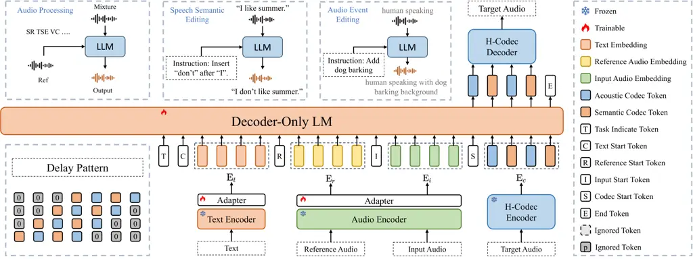
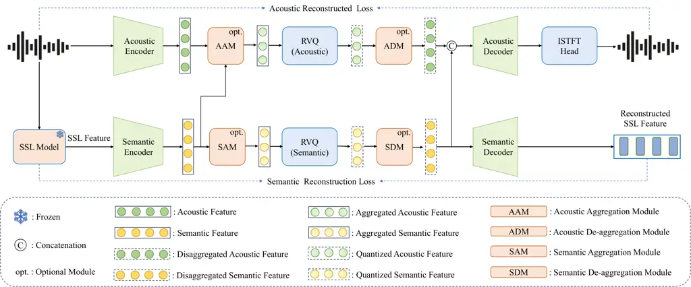

QuarkAudio Technical Report

Chengwei Liu^(1,$`\star`$)   Haoyin Yan^(2,\*)   Shaofei
Xue^(1,2,$`\dagger`$)   Xiaotao Liang¹   Xiaofu Chen^(1,3)  
Bin Gong^(1,3)   Zheng Xue¹   Gang Song¹

¹Intelligent Connectivity, Alibaba Group   ²Tongyi AI Lab, Alibaba Group

  

³Zhejiang University  
^(⋆)Equal contribution   ^(†)Corresponding author

|                                                                                     |                                                                                      |
| ----------------------------------------------------------------------------------- | ------------------------------------------------------------------------------------ |
| Code:                                                                               | [https://github.com/alibaba/unified-audio](https://github.com/alibaba/unified-audio) |
| ![[Uncaptioned image]](arxiv-2512-20151--6932263ab017.figures/figure-1.webp) Model: | [https://huggingface.co/QuarkAudio](https://huggingface.co/QuarkAudio)               |
| Demo:                                                                               | [https://alibaba.github.io/unified-audio](https://alibaba.github.io/unified-audio)   |

###### Abstract

Many existing audio processing or generation models involve
task-specific architectures, resulting in fragmented development efforts
and limited extensibility. It is promising to design a unified framework
that has ability to address multiple tasks, simultaneously providing
robust instruction and audio understanding while delivering high-quality
audio generation. This requires a highly compatible paradigm design,
powerful modeling capabilities of backbone, and a high-fidelity audio
recovery module. To meet the above requirements, this technical report
introduces QuarkAudio, a novel decoder-only autoregressive (AR) LM-based
generative framework to unify multiple tasks. The framework includes a
unified discrete audio tokenizer H-Codec, which integrates
self-supervised learning (SSL) representation within the audio
tokenization and reconstruction process. Some innovative improvements
for H-Codec are proposed, such as dynamic frame-rate mechanism and
extending audio sampling rate to 48 kHz. QuarkAudio unifies tasks by
taking task-specific conditional information as the conditioning
sequence of decoder-only LM, and the discrete token of target audio is
predicted in an AR manner. The framework supports a wide range of audio
processing and generation tasks, including: speech restoration (SR),
target speaker extraction (TSE), speech separation (SS), voice
conversion (VC), and language-queried audio source separation (LASS). In
addition, we extend the downstream tasks to universal free-form audio
editing guided by natural language instructions (including speech
semantic editing and audio event editing). Experimental results
demonstrate that H-Codec achieves remarkable audio reconstruction
quality with a low frame rate, improving both the efficiency and
performance of downstream audio generation, and QuarkAudio achieves
competitive or comparable performance in comparison with
state-of-the-art task-specific or multi-task systems across multiple
tasks.

## 1 Introduction

The development of general-purpose large models capable of unifying
diverse tasks has emerged as a pivotal trend in artificial intelligence,
driven by the demand for efficient and scalable solutions across
modalities. In the realms of text and vision, foundational models such
as GPT and CLIP have demonstrated remarkable success in multi-task
learning frameworks, enabling cross-modal alignment and task-agnostic
inference. However, extending this paradigm to audio, a modality
characterized by complex temporal dynamics and heterogeneous task
requirements, remains a significant challenge. Current audio-specific
models often exhibit task fragmentation, where specialized architectures
are required for distinct objectives such as speech synthesis or sound
event detection and localization. This fragmentation stems from three
critical bottlenecks: the difficulty in extracting audio representations
that generalize across tasks with varying semantic and acoustic
requirements, the lack of a unified framework capable of harmonizing
diverse input-output modalities (e.g., text-to-speech, speech-to-music,
or audio editing), and the inherent conflicts between task-specific
constraints, such as the trade-off between high-fidelity reconstruction
in generation tasks and real-time efficiency in interactive
applications. These challenges hinder the progress toward a cohesive
audio foundation model that mirrors the versatility observed in text and
vision domains.

Neural audio codecs utilize neural networks to obtain highly compressed
discrete representations of audio waveforms and aim to reconstruct
high-fidelity signal form discrete tokens. Acoustic tokens, such as
SoundStream (Zeghidour et al., 2021) utilizes residual vector
quantization (RVQ) where each quantizer refines the residuals left by
the previous one, obtaining parallel multi-layer tokens and achieving
remarkable reconstruction quality. Many works including
Encodec (Défossez et al., 2022b) and DAC (Kumar et al., 2023) follow
this paradigm to improve performance. These tokens capture fine-grained
acoustic characteristics of raw waveforms, offering an alternative to
conventional frame-level features such as mel-spectrograms. The
development of acoustic codecs primarily encompasses the following
directions: Model scale-up, as exemplified by StableCodec (Parker et
al., 2024) and WavTokenizer (Ji et al., 2024b); Variable frame lengths,
represented by SNAC (Siuzdak et al., 2024).

Conversely, semantic tokens, such as HuBERT, Whisper, and CosyVoice (Hsu
et al., 2021; Radford et al., 2023b; Du et al., 2024), are rich in
semantic content but tend to lose acoustic details. With the development
of LM, the research focus of codecs has gradually shifted from reducing
data transmission costs toward the integration with LM, which ensures
the high quality of generated audio. This requires codecs (Liu et al.,
2024; Défossez et al., 2024b) to preserve more semantic information that
can be understood and modeled by LM. X-Codec (Ye et al., 2024a)
integrates the representations from the pre-trained SSL model to enhance
semantic preservation, improving both reconstruction quality and
downstream TTS performance. Some studies (Ji et al., 2024a; Jiang et
al., 2025) explore single-layer codecs that are more suitable for
autoregressive modeling in LM. X-Codec2 (Ye et al., 2025) utilizes
finite scalar quantization (FSQ) (Mentzer et al., 2024) to perform
single-layer quantization, enlarging the code space. BiCodec (Wang et
al., 2025a) generates a hybrid token stream combining semantic and
global tokens, which are derived from a SSL model and a speaker
verification model, respectively. However, single-layer codecs with a
low frame rate still faces challenges in high-fidelity
reconstruction (Ye et al., 2025), e.g., speaker similarity.

In practice, downstream LMs are capable of generating multi-layer tokens
in parallel (Copet et al., 2023; Neekhara et al., 2024), thereby
relaxing the requirement for single-layer quantization. This paradigm
relies more heavily on the modeling capacity of LMs, raising the upper
bound of the codec’s reconstruction capability. In this context, the
frame rate of codecs plays a critical role, which determines the number
of time steps for inference. To address the above issues, we propose
H-Codec, a dual-stream audio codec involving acoustic and semantic
branch is developed for high-fidelity waveform reconstruction. Our
H-Codec benefits from the RVQ technique and SSL representations,
achieving significant reconstruction quality in the domain of speech,
music, and general audio. The low frame rate ensures efficient
generation when integrated with our QuarkAudio framework.

Creating an unified framework that can tackle diverse tasks stands as a
critical research goal in the field of artificial intelligence. For the
audio understanding task, KimiAudio (KimiTeam et al., 2025) proposes an
audio tokenizer that concatenates the semantic audio token with
continuous acoustic vectors from Whisper (Radford et al., 2023b) encoder
to enhance perception capability and output a discrete semantic token.
DualSpeechLM (Wang et al., 2025c) proposes a dual token modeling
paradigm, using a dedicated USToken for input and an acoustic token for
output. Many studies integrate generative modeling into audio tasks in
recent years. For the SR task, SELM (Wang et al., 2024) applies k-means
to quantize noisy speech representations obtained by WavLM (Chen et al., 2022) into discrete tokens, and then a Transformer-based speech LM maps
the noisy tokens to clean tokens. For the LASS task, FlowSep (Yuan et
al., 2025) learns linear flow trajectories from noise to target source
features within the variational autoencoder (VAE) latent space, which
are guided by the encoded text embeddings and the mixture audio. For the
speech edit task, VoiceBox (Le et al., 2023) introduced a
non-autoregressive editing paradigm based on flow matching. However, its
reliance on alignment models like MFA to specify the editing region adds
operational overhead in practical scenarios. InstructSpeech (Huang et
al., 2024) represents a significant advancement, employing triplet data
construction, multitask learning, and multistep reasoning to enable
instruction-based editing.

Compared to discrete audio codec based method, especially decoder-only
AR models which can elegantly integrate conditional information as a
prefix sequence, continuous methods usually requires complex design to
combines multimodal conditions, limiting the extensibility to more
tasks. In addition, discrete audio representation plays an important
role in combining with LLM (Team, 2025), bridging the natural language
instructions and continuous waveform. Therefore, we develop a
decoder-only AR LM-based framework (QuarkAudio) to unify audio tasks. It
utilizes continuous conditional embeddings to maximize the preservation
of semantic and acoustic information, predicting multi-layer codec
tokens which reduce the quantization loss.

In terms of speech representations, understanding and generation tasks
impose fundamentally different demands: understanding benefits from
compact, semantics-focused encodings, while generation requires rich,
high-quality acoustic details(Inclusion et al., 2025; Yan et al.,
2025a). As a result, most existing speech language models resort to one
of two architectural compromises: either maintaining separate
representations for understanding and generation (Xu et al., 2025;
KimiTeam et al., 2025), or relying on discrete tokens for both (Défossez
et al., 2024a; Xiaomi, 2025; Huang et al., 2025). The challenge of the
former approach lies in unifying the two representation schemes into a
single modeling space (Le et al., 2023), while the performance of the
latter method is constrained by information loss due to discretization.
Additionally, audio generation models still face challenges in terms of
audio quality and generalization ability across tasks. This
fragmentation results in redundant development efforts, inconsistent
performance, and limited extensibility.

Some studies aim to unify multiple tasks within a single framework,
including AnyEnhance (Zhang et al., 2025), UniAudio (Yang et al., 2024),
LLaSE-G1 (Kang et al., 2025), UniSE (Yan et al., 2025c), and Metis (Wang
et al., 2025b). These methods utilizes the LM backbone combined with
discrete audio codec and exhibit remarkable generative ability, which
benefit from the semantic understanding and contextual modeling
capabilities of LMs. However, challenges still exist in terms of audio
quality and generalization ability across tasks. For instance, few
unified models are capable of handling the SS task, as it generally
requires customized architecture to output multi-track speech. In terms
of speech tasks, free-form audio editing—particularly guided by natural
language instructions—is an emerging and highly challenging direction.
Unlike conventional audio tasks that operate on fixed input-output
mappings, audio editing requires deep understanding of complex
linguistic semantics, fine-grained control over acoustic attributes, and
high-fidelity generation (Yan et al., 2025a; Inclusion et al., 2025;
Google, 2025). For instance, users may wish to “change the speaker’s
emotion from angry to calm” or “add birdsong in the background.” Such
capabilities demand joint modeling of audio semantics, prosody, and
environmental context. While pioneering works like WavCraft (Liang et
al., 2024), SAO-Instruct (Ungersböck et al., 2025), Voicecraftx (Zheng
et al., 2025b), Step-Audio-EditX (Yan et al., 2025b), and
Ming-UniAudio (Yan et al., 2025a) have begun exploring this space,
existing solutions still face significant limitations in handling
compositional instructions and preserving long-term audio coherence. To
reconcile the issue of competing requirements of representations on
understanding and generation tasks, we utilize continuous
representations for robust semantic modeling and discrete
representations for high-fidelity audio synthesis, with a unified LLM
harmonizing the interaction between these two representation spaces.

The contributions of this work can be summarized as follows:

1.  1.  Unified Discrete Audio Tokenizer: We present H-Codec, which
        integrates self-supervised learning (SSL) representation within the
        audio tokenization and reconstruction process. The features from
        waveform and SSL model are individually quantized, resulting
        dual-stream (acoustic and semantic) codec tokens. H-Codec achieves
        remarkable audio reconstruction quality with a low frame rate,
        improving both the efficiency and performance of downstream audio
        generation. We further present two advanced versions of H-Codec:
        H-Codec-1.5 introduces a dynamic frame rate mechanism built upon
        H-Codec-1.0, enabling adaptive temporal resolution for varying
        content complexity; H-Codec-2.0 extends the sampling rate from 16kHz
        to 48kHz under a fixed frame rate, significantly improving audio
        fidelity and high-frequency detail preservation.
2.  2.  Unified Audio Language Model for Generation: QuarkAudio unifies
        tasks by taking task-specific conditional information as the
        conditioning sequence of decoder-only LM, and the discrete token of
        target audio is predicted in an AR manner. We utilize a special task
        token to distinguish different learning patterns of multiple tasks.
        Note that our model handles diverse tasks using a single set of
        shared weights, thereby eliminating the need for task-specific
        weight adaptation.
3.  3.  Multi-tasks with High-Fidelity Generation: QuarkAudio supports a
        wide range of audio processing and generation tasks within a single
        shared architecture, and enables comprehensive audio editing based
        on user instructions and available audio clips, covering both
        semantic content modifications and audio event editing. In addition,
        this framework achieves high-fidelity generation quality in terms of
        SR, TSE, SS, VC, LASS, and EDIT tasks, demonstrating strong
        competitiveness compared to state-of-the-art (SOTA) task-specific or
        multi-task baselines.

## 2 Model Architecture

As shown in Figure 1, QuarkAudio is a unified, autoregressive LM-based
audio generation framework comprising four key components: (i) a novel
dual-stream H-Codec; (ii) a text encoder with adapter; (iii) an audio
encoder with adapter; (iv) a decoder-only LM backbone.



Figure 1: The overall architecture of QuarkAudio, which is a
straightforward model for multiple audio tasks. For simplicity, we
illustrate the AR process with single-layer codec tokens and it actually
operates in a multi-layer AR manner with delay pattern.

### 2.1 Unified Discrete Tokenizer

Guided by the aforementioned design thoughts, we proposed H-Codec, as
shown in Figure 2. Following the general architecture of audio codec,
H-Codec is built upon three core elements: codec encoder, quantizer
module and codec decoder. Inspired by X-Codec (Ye et al., 2024a), we
incorporate pretrained models to facilitate the preservation of semantic
information. However, unlike X-Codec, which fuses acoustic and semantic
information and then quantizes the combined representation using a
single codebook, we employ separate codebooks to quantize the two types
of features independently, leading to dual-stream codec tokens. We
extend the original design of H-Codec (“H-Codec-1.0”) in
UniTok-Audio (Liu et al., 2025) to H-Codec-1.5 and H-Codec-2.0, where
the former adopts a dynamic frame-rate mechanism to reduce frame rate,
and the latter expands audio sampling rate from 16 kHz to 48 kHz,
supporting higher-fidelity audio reconstruction and broader application
scenarios such as high-quality multimedia content.



Figure 2: Architecture of H-Codec

#### 2.1.1 Encoder and Decoder

In the encoding stage, the raw waveform $`\bm{x}\in\mathbb{R}^{n}`$ is
fed into the acoustic encoder to extract frame-level acoustic features,
where $`n`$ represents the number of waveform samples. H-Codec-1.5
inherits the module architecture of H-Codec-1.0, which is illustrated in
UniTok-Audio. H-Codec-2.0 upgrades the architecture of acoustic encoder.
We perform short-time Fourier transform (STFT) and concatenate the
magnitude and phase spectrum as input feature, which is then fed into
the stack of ConvNeXtBlock layers and Transformer layers. A
RVQ (Zeghidour et al., 2021) quantizer is utilized to quantize acoustic
features. Synchronously, a pre-trained SSL model (speech-specialized
WavLM¹¹ 1 https://huggingface.co/microsoft/wavlm-base-plus (Chen et al., 2022) for H-Codec-1.5 and audio-generalist HuBERT²² 2
https://huggingface.co/bosonai/hubert_base (Hsu et al., 2021) for
H-Codec-2.0) extracts SSL features by averaging outputs from all
transformer layers and the quantized semantic feature is obtained by
applying the semantic encoder and RVQ quantizer.

For the decoding stage, the quantized acoustic and semantic features are
concatenated along the hidden dimension, and the waveform is
reconstructed by utilizing acoustic decoder and the inverse short-time
Fourier transform (ISTFT) head following Vocos (Siuzdak, 2024). We
believe that decoupling acoustic and semantic features enables each
branch to learn distinct representations, which is beneficial for
improving reconstruction quality. Additionally, the quantized semantic
feature is processed by the semantic decoder to reconstruct the SSL
feature. This ensures that the quantized semantic features retain
sufficiently rich semantic information.

#### 2.1.2 Dynamic Frame Aggregation and De-aggregation

Inspired by the dual-branch codec framework FlexiCodec (Li et al.,
2025a), we implement a dynamic frame-rate mechanism based on semantic
feature similarity in H-Codec (i.e. H-Codec-1.5). Specifically, the
system comprises aggregation and de-aggregation modules for both the
acoustic and semantic branches.

The semantic aggregation module (SAM) first computes the cosine
similarity scores between all adjacent semantic features, where the
semantic feature sequence is extracted by the semantic encoder. It then
scans through the similarity sequence to identify multiple consecutive
segments in which all similarity scores exceed a predefined threshold.
For each identified segment, the frames are subsequently mapped into a
single feature representation via a local attention mechanism. The
acoustic aggregation module (AAM) inherits the segment boundaries
determined by the semantic aggregation module to guide the compression
of acoustic features. This design enables semantic-guided acoustic
feature compression while ensuring temporal consistency across the
feature dimensions. Furthermore, to facilitate the restoration of the
original frame rate during decoding, we follow the design of
VARStok (Zheng et al., 2025a) by embedding the segment length into the
final code index as follows:

```math
\mathbf{c}_{i}^{\prime}=(d_{i}-1)\times K+\mathbf{c}_{i}, \tag{1}
```

where $`K`$ denotes the size of the original codebook, $`d_{i}`$ the
duration of segment $`i`$, and $`\mathbf{c}_{i}`$ the original code
index, respectively.

The semantic de-aggregation module (SDM) and acoustic de-aggregation
module (ADM) take as input the compressed and quantized features,
restoring the frame rate according to the existing segment partitions.
Specifically, the segment length is decoded from the code index by

```math
d_{i}=\left\lfloor\frac{\mathbf{c}_{i}^{\prime}}{K}\right\rfloor+1, \tag{2}
```

where $`\lfloor\cdot\rfloor`$ denotes the floor operation. The frame
sequences are reconstructed by repeating the segment length to recover
the original frame rate. Finally, to more naturally regenerate the
original features, the repeated segments undergo a local attention
module before being delivered to the decoder. The implementation of
local attention is consistent with that in FlexiCodec.

#### 2.1.3 Optimization Strategy

Figure 3: H-Codec-2.0 training pipeline

The configurations of discriminators and optimization objective
functions follow that described in UniTok-Audio (Liu et al., 2025). We
utilize a two-stage training strategy in H-Codec-2.0, as shown
in Figure 3. In stage 1, we train all modules on a large-scale and
diverse audio corpus, enhancing robustness of token extraction in the
general audio domain. In stage 2, we freeze the parameters of encoders
and quantizers to fine-tune the acoustic decoder. This stage further
specializes the acoustic decoder to reconstruct audio without adapting
to the varying quantized features.

### 2.2 Unified Audio Language Model

#### 2.2.1 Overall Framework

To unify various audio processing or generation tasks within a single
framework, we extract task-specific conditional information as a
conditioning sequence for the decoder-only AR backbone. Since continuous
features, typically extracted from SSL models, contain richer audio
details compared to discrete representations and are more adaptable to
varying input conditions, we extract continuous features to assemble the
task-conditioning sequence. Specifically, we utilize T5-base³³ 3
https://huggingface.co/google/t5-v1_1-base (Raffel et al., 2020) as the
text encoder to extract embedding from audio caption. The same HuBERT
used in H-Codec is adopted to extract continuous features from audio
waveforms. Two linear layers serve as two adapters to map the text
embedding and audio features into a representation space amenable to LM
AR modeling, respectively. Given text and audio embeddings as
conditions, we utilize LLaMA architecture (Touvron et al., 2023) to
predict discrete tokens of target waveform in an AR manner. Since the
H-Codec tokens involve multiple layers, we apply the delay
pattern (Copet et al., 2023) to arrange our tokens for the trade-off
between performance and computational cost. The detail of the paradigm
can be found in (Liu et al., 2025). Finally, the H-Codec decoder
reconstructs high-fidelity audio from the predicted token sequence.

| Mode   | Task Token             | Conditions                       |
| ------ | ---------------------- | -------------------------------- |
| SR     | $`{\rm T_{SR}}`$       | Degraded Speech                  |
| TSE    | $`{\rm T_{TSE}}`$      | Reference Speech, Mixture Speech |
| rTSE   | $`{\rm T_{rTSE}}`$     | Reference Speech, Mixture Speech |
| VC     | $`{\rm T_{VC}}`$       | Reference Speech, Source Speech  |
| LASS   | $`{\rm T_{LASS}}`$     | Caption, Mixture Audio           |
| EDIT-S | $`{\rm T_{EDIT_{S}}}`$ | Instruction, Source Speech       |
| EDIT-A | $`{\rm T_{EDIT_{A}}}`$ | Instruction, Source Audio        |

Table 1: Operational modes and corresponding conditions in QuarkAudio.

#### 2.2.2 Unifying Tasks with Operational Modes

Following our previous work (Yan et al., 2025c; Liu et al., 2025), we
introduce special task tokens to distinguish between different
operational modes. To unify seven tasks (i.e., SR, TSE, SS, VC, LASS,
EDIT-S, and EDIT-A), we utilize seven modes, as shown in Table 1. The
first five tasks are defined in UniTok-Audio, while the EDIT-S and
EDIT-A denote speech semantic editing and audio event editing,
respectively. EDIT-S performs insertion, deletion, or substitution
operations on the semantics of input speech guided by textual
instructions. EDIT-A conducts caption-based insertion or deletion of
audio event elements (e.g., drumbeats, bird calls) in the input audio
without the assistance of reference audio. Each mode corresponds to a
special token and different task-specific condition types, which serve
as a conditioning sequence for the LM backbone to estimate the
conditional probability density distribution of target discrete tokens.

## 3 Experiments

### 3.1 H-Codec

#### 3.1.1 Experimental Setup

Datasets: We utilize multi-domain data to train our codec, including
speech, music, and audio. The speech samples are sourced from the VoxBox
dataset (Wang et al., 2025a) and internal dataset, where the former
comprises approximately 100k hours of speech, and the latter includes
2.5M hours of recordings. For the music domain, we utilize the
FMA-full (Defferrard et al., 2017), MUSDB18-HQ (Rafii et al., ), and
internal datasets, involving about 150k hours of data. For the audio
domain, we adopt AudioSet (Gemmeke et al., 2017a), WavCaps (Mei et al.,
2024), and internal datasets, including about 100k hours of recordings.
We evaluate the speech reconstruction quality on LibriSpeech (Panayotov
et al., 2015) test-clean (16 kHz) and Seed-TTS-Eval (Anastassiou et al.,
2024)⁴⁴ 4 https://github.com/BytedanceSpeech/seed-tts-eval (24 kHz). The
reconstruction quality of music and general audio is evaluated on
MUSDB18-HQ test set (44.1 kHz) and AudioSet eval (48 kHz) respectively.
All samples are resampled to appropriate sampling rate according to
model configuration or evaluation metrics.

Implementation Details: For H-Codec-1.0 and H-Codec-1.5, 4-layer RVQ
quantizers are utilized in each stream with a codebook size of 1024 and
a codebook dimension of 512. For H-Codec-1.5, the threshold of
similarity score and the maximum length for aggregation are set to 0.6
and 8, and the local attention window spans 8 preceding and 8 succeeding
tokens with 8 attention heads and 32 layers. For H-Codec-2.0, we perform
STFT with a frame length of 1920 and a hop length of 960, resulting in
50 frames per second. Before utilizing quantization, we reduce the frame
rate to 6.25 Hz 8x downsampling. Each of the acoustic and semantic
branches consists of 16 RVQ layers. During training, we randomly crop
5-second segments from audio samples. The network is optimized using the
AdamW optimizer with an initial learning rate of $`2\times 10^{-4}`$,
which is decayed based on a cosine scheduler during 600k training steps.

Evaluation Metrics: We utilize several metrics to measure the
reconstruction quality of speech, including the perceptual evaluation of
speech quality (PESQ), short-time objective intelligibility (STOI),
speaker similarity (SPK-SIM) and UTMOS. The loss on Mel-scale spectrum
and STFT spectrum bettween the target audio and reconstructed audio are
computed for general evaluation in the domain of speech, music, and
audio. Details about evaluation metrics of codec can be found in
Appendix B.1.

Baselines: We compare our codec against some state-of-the-art (SOTA)
baselines, including DAC (Kumar et al., 2023), Encodec (Défossez et al.,
2022a), X-Codec (Ye et al., 2024b), X-Codec2 (Ye et al., 2025),
BiCodec (Wang et al., 2025a), WavTokenizer (Ji et al., 2024a),
UniCodec (Jiang et al., 2025), FlexiCodec (Li et al., 2025a),
MiMO-Audio-Tokenizer (Xiaomi, 2025), XY-Tokenizer (Gong et al., 2025),
BigCodec (Xin et al., 2024), Baichuan-Audio-Tokenizer (Li et al.,
2025b), Mimi (Défossez et al., 2024b), and GLM4-Voice-Tokenizer (Zeng et
al., 2024).

#### 3.1.2 Experimental Results

|                     |     |         |       |       |      |       |                    |                    |                     |                       |                     |
| ------------------- | --- | ------- | ----- | ----- | ---- | ----- | ------------------ | ------------------ | ------------------- | --------------------- | ------------------- |
| Model               | FS  | Unified | FPS   | Nq    | BPS  | Paras | PESQ($`\uparrow`$) | STOI($`\uparrow`$) | UTMOS($`\uparrow`$) | SPK-SIM($`\uparrow`$) | WER($`\downarrow`$) |
| Ground Truth        | \-  | \-      | \-    | \-    | \-   | \-    | 4.64               | 1.00               | 4.09                | 1.00                  | 2.43                |
| Encodec             | 24k | ✗       | 75    | 8     | 6000 | 15M   | 2.77               | 0.94               | 3.09                | 0.89                  | 2.64                |
| X-Codec             | 16k | ✗       | 50    | 4     | 2000 | 178M  | 2.77               | 0.87               | 4.21                | 0.72                  | 3.13                |
| WavTokenizer        | 24k | ✗       | 75    | 1     | 900  | 77M   | 2.39               | 0.91               | 4.00                | 0.68                  | 5.43                |
| X-Codec2            | 16k | ✗       | 50    | 1     | 800  | 242M  | 2.43               | 0.92               | 4.13                | 0.82                  | 3.53                |
| BiCodec             | 16k | ✗       | 50    | 1     | 650  | 156M  | 2.51               | 0.92               | 4.18                | 0.80                  | 3.23                |
| FlexiCodec          | 16k | ✗       | 8.15  | 8     | 831  | 216M  | 2.46               | 0.92               | 4.12                | 0.81                  | 2.79                |
| DAC                 | 16k | ✓       | 50    | 4     | 2000 | 76M   | 1.42               | 0.84               | 1.83                | 0.60                  | 4.32                |
| X-Codec             | 16k | ✓       | 50    | 4     | 2000 | 178M  | 2.64               | 0.92               | 3.88                | 0.77                  | 3.33                |
| UniCodec            | 24k | ✓       | 75    | 1     | 900  | 274M  | 2.56               | 0.92               | 4.00                | 0.76                  | 4.23                |
| WavTokenizer        | 24k | ✓       | 40    | 1     | 480  | 77M   | 1.88               | 0.87               | 3.78                | 0.57                  | 10.03               |
| H-Codec-1.0         | 16k | ✓       | 25    | 4+4   | 2000 | 146M  | 3.05               | 0.94               | 4.08                | 0.89                  | 2.85                |
| H-Codec-1.5         | 16k | ✗       | 19.54 | 4+4   | 1622 | 678M  | 2.60               | 0.92               | 3.99                | 0.83                  | 3.02                |
| H-Codec-2.0 (Small) | 48k | ✓       | 6.25  | 16+16 | 2000 | 236M  | 2.67               | 0.93               | 3.75                | 0.89                  | 3.05                |
| H-Codec-2.0 (Large) | 48k | ✓       | 6.25  | 16+16 | 2000 | 1.2B  | 3.10               | 0.94               | 3.89                | 0.92                  | 2.70                |

Table 2: Comparison between different codec models on LibriSpeech
test-clean set, where FPS and BPS denote frame per second and bitrate
per second, respectively. FS, Paras, and Nq indicate the sampling rate
supported by the model, its parameter amount, and the number of codebook
layers, respectively. Unified indicates whether the model supports
general audio or only speech. For FlexiCodec and H-Codec-1.5, we
calculate the average FPS and BPS on test dataset.

|                          |     |             |       |                      |         |      |                      |         |      |
| ------------------------ | --- | ----------- | ----- | -------------------- | ------- | ---- | -------------------- | ------- | ---- |
| Model                    | FS  | FPS         | Paras | SEED-ZH $`\uparrow`$ |         |      | SEED-EN $`\uparrow`$ |         |      |
|                          |     |             |       | PESQ                 | SPK-SIM | STOI | PESQ                 | SPK-SIM | STOI |
| GLM4-Voice-Tokenizer     | 16k | 12.5        | \-    | 1.06                 | 0.33    | 0.61 | 1.05                 | 0.12    | 0.60 |
| Baichuan-Audio-Tokenizer | 16k | 12.5        | \-    | 1.84                 | 0.78    | 0.86 | 1.62                 | 0.69    | 0.85 |
| FlexiCodec               | 16k | 7.16/8.49   | 216M  | 1.88                 | 0.67    | 0.86 | 2.11                 | 0.75    | 0.90 |
| XY-Tokenizer             | 16k | 12.5        | \-    | 2.27                 | 0.77    | 0.90 | 2.14                 | 0.82    | 0.90 |
| Mimi                     | 16k | 12.5        | 79M   | 2.05                 | 0.73    | 0.89 | 2.01                 | 0.77    | 0.89 |
| BigCodec                 | 16k | 80          | 159M  | 2.26                 | 0.81    | 0.92 | 2.22                 | 0.80    | 0.91 |
| X-Codec2                 | 16k | 50          | 242M  | 2.19                 | 0.80    | 0.92 | 2.37                 | 0.82    | 0.93 |
| MiMo-Audio-Tokenizer     | 24k | 25          | 1.2B  | 2.71                 | 0.89    | 0.93 | 2.43                 | 0.85    | 0.92 |
| H-Codec-1.0              | 16k | 25          | 146M  | 2.35                 | 0.80    | 0.90 | 2.22                 | 0.73    | 0.90 |
| H-Codec-1.5              | 16k | 18.80/20.18 | 678M  | 2.40                 | 0.85    | 0.90 | 2.30                 | 0.82    | 0.90 |
| H-Codec-2.0 (Small)      | 48k | 6.25        | 236M  | 2.43                 | 0.86    | 0.90 | 2.25                 | 0.83    | 0.90 |
| H-Codec-2.0 (Large)      | 48k | 6.25        | 1.2B  | 2.88                 | 0.91    | 0.93 | 2.77                 | 0.88    | 0.93 |

Table 3: Comparison of state-of-the-art audio codecs on both SEED-ZH
(Chinese) and SEED-EN (English) benchmarks. PESQ, SPK-SIM, and STOI are
reported for each language, and higher values indicate better
performance. For FlexiCodec and H-Codec-1.5, we calculate the average
FPS and BPS on SEED-ZH and SEED-EN, respectively.

Speech Reconstruction Performance: As reported in Table 2 and Table 3,
our proposed H-Codec exhibits competitive signal reconstruction quality
(PESQ and STOI), speech naturalness (UTMOS), speaker consistency
(SPK-SIM), and semantic information preservation (WER). H-Codec-1.5
reduces the frame rate of H-Codec-1.0 by introducing the dynamic
frame-rate mechanism at the expense of slight performance decay, which
enables adaptive temporal resolution for varying content complexity.
Since multi-layer tokens can be predicted simultaneously within a single
time step in downstream audio LM, we argue that frame rate is more
critical, as the number of time steps significantly affects
computational cost. H-Codec-2.0 further reduces FPS to 6.25 Hz and
extends the sampling rate to 48 kHz, supporting more application
scenarios. We provide the small version and large version of H-Codec-2.0
for comparison, and the latter exhibits impressive performance in terms
of most metrics, indicating the effectiveness of increasing model size.

| Model               | BPS  | Speech                   |                            | Music                    |                            | Audio                    |                            |
| ------------------- | ---- | ------------------------ | -------------------------- | ------------------------ | -------------------------- | ------------------------ | -------------------------- |
|                     |      | Mel loss($`\downarrow`$) | STFT loss ($`\downarrow`$) | Mel loss($`\downarrow`$) | STFT loss ($`\downarrow`$) | Mel loss($`\downarrow`$) | STFT loss ($`\downarrow`$) |
| DAC                 | 2000 | 0.6436                   | 0.1667                     | 0.8443                   | 0.2308                     | 1.9054                   | 0.5164                     |
| X-Codec             | 2000 | 0.4225                   | 0.1161                     | 0.6403                   | 0.1804                     | 1.5073                   | 0.4193                     |
| UniCodec            | 900  | 0.4147                   | 0.1201                     | 0.6488                   | 0.1999                     | 1.5403                   | 0.4760                     |
| WavTokenizer        | 480  | 0.5143                   | 0.1364                     | 0.8174                   | 0.2270                     | 1.8912                   | 0.5201                     |
| H-Codec-1.0         | 2000 | 0.3315                   | 0.1017                     | 0.5157                   | 0.1667                     | 1.2312                   | 0.4023                     |
| H-Codec-2.0 (Small) | 2000 | 0.3548                   | 0.1069                     | 0.5298                   | 0.1782                     | 1.3542                   | 0.4218                     |
| H-Codec-2.0 (Large) | 2000 | 0.3221                   | 0.1056                     | 0.5035                   | 0.1526                     | 1.1125                   | 0.3915                     |

Table 4: Comparison between different codec models on speech
(LibriSpeech test-clean), music (MUSDB18-HQ test), and audio (AudioSet
eval) domain in terms of Mel loss and STFT loss.

Audio Reconstruction Performance: Table 4 presents a comprehensive
comparison of audio codec models on speech, music, and general audio
domains. All baselines supports general audio reconstruction. Notably,
H-Codec-2.0 (Large) achieves lowest Mel loss and STFT loss on most
domains, illustrating the powerful multi-domain reconstruction ability.
This ensures the potential of H-Codec for extensive downstream tasks,
including speech, music, and audio generation.

Effectiveness of Two-stage Training: As reported in Table 5, we have
observed that two-stage training yields better performance than
single-stage training on both SEED-ZH and SEED-EN benchmarks. This
verifys that fine-tuning the decoder helps futher improve the
reconstruction quality, since the decoder can focus on generating audio
from fixed representations

| Strategy | ZH    |       |                         |                        | EN                |                  |                         |                        |
| -------- | ----- | ----- | ----------------------- | ---------------------- | ----------------- | ---------------- | ----------------------- | ---------------------- |
|          | PESQ↑ | STOI↑ | STFT loss$`\downarrow`$ | Mel loss$`\downarrow`$ | PESQ $`\uparrow`$ | STOI$`\uparrow`$ | STFT loss$`\downarrow`$ | Mel loss$`\downarrow`$ |
| stage1   | 2.69  | 0.92  | 0.151                   | 0.464                  | 2.61              | 0.92             | 0.158                   | 0.382                  |
| stage2   | 2.88  | 0.93  | 0.125                   | 0.422                  | 2.77              | 0.93             | 0.126                   | 0.345                  |

Table 5: Comparative results of different stage training on both SEED-ZH
and SEED-EN benchmarks for H-Codec-2.0.

### 3.2 Unified Audio Generation

Training Datasets: For the training of audio processing tasks (including
SR, TSE, SS, VC, and LASS), we adopt clean speech samples from the
VoxBox (Wang et al., 2025a) dataset, including approximately 3.8k hours
of data from LibriSpeech (Panayotov et al., 2015), MLS_English (Pratap
et al., 2020) and Emilia_ZH (He et al., 2024) subset. The noise corpus
comprises approximately 460 hours of data from the DNS Challenge (Reddy
et al., 2020), FSD50K (Fonseca et al., 2022), WHAM! (Wichern et al.,
2019), DESED (Turpault et al., 2019), DEMAND (Thiemann et al., 2013),
MUSAN (Snyder et al., 2015), DISCO (Furnon et al., 2021),
MUSDB18-HQ (Rafii et al., ), and TUT Urban Acoustic Scenes (Mesaros et
al., 2018). We include 60k room impulse response (RIR) samples from
SLR28 (Ko et al., 2017) to simulate reverberation. For LASS task, the
captioned audio samples are sourced from WavCaps (Mei et al., 2024),
CLAP_FreeSound (Wu et al., 2023), VGGSound (Chen et al., 2020), and
internal dataset, resulting in approximately 40k hours. For the EDIT-S
task, we utilize 2M Chinese samples and 1M English samples from the
internal dataset. For the EDIT-A task, samples from AudioSet (Gemmeke et
al., 2017b) and CLAP_FreeSound (Wu et al., 2023) are selected as
background samples and audio event samples, respectively. The data
preparation pipelines are described in Appendix A.

Implementation Details: There are 16 layers with 16 attention heads and
a hidden dimension of 1024 in the LLaMA-based LM backbone, resulting in
481M trainable parameters. Our model is trained using AdamW optimizer
with 30 epochs, where the learning rate reaches a peak of 0.001 after
4000 warm-up steps and reduces at a decay factor of 0.98 in each epoch.
The lengths of reference audio and input signal are set to 5 seconds for
both training and inference phases. For the SR, TSE, SS, VC, and LASS
task, we train the multi-task version for evaluation. For the editing
task, we train task-specific versions for EDIT-S and EDIT-A,
respectively. These downstream tasks are implemented using H-Codec-1.0.

Evaluation Metrics: We adopt multiple evaluation metrics to assess
different aspects of the generated audio across tasks. For speech tasks,
we evaluate quality by DNSMOS (SIG, BAK, OVRL) and NISQA, speaker
similarity by SIM, intelligibility by WER, and continuity by PLCMOS. For
audio tasks, we utilize FAD, CLAPScore, and CLAPScore\_(A) to measure the
quality of generated audio. Details about evaluation metrics can be
found in Appendix B.2.

#### 3.2.1 Audio Processing Performance

Evaluation Datasets: For the evaluation datasets, we evaluate speech
restoration performance on 2020 DNS Challenge (Reddy et al., 2020) test
set (“With Reverb”) and 2022 PLC Challenge (Diener et al., 2022) blind
test set for speech enhancement (SE) subtask and packet loss
cancellation (PLC) subtask, respectively. The performance of TSE is
evaluated on the Libri2Mix (Cosentino et al., 2020) clean test set. The
SS, VC and LASS performance is evaluated on Libri2Mix noisy test set,
VCTK (Yamagishi et al., 2019) dataset and 2024 DCASE LASS validation
set, respectively.

Results: The comparison between QuarkAudio and prior works is
demonstrated in Table 6. For each task, we select one existing model
whose training data is closely aligned with our setting. It can be seen
that our model achieves comparable or superior performance to baselines.
More detailed results can be found in UniTok-Audio (Liu et al., 2025).

| Task | Model                         | Metrics                                                                                      | Results                                                                      |
| ---- | ----------------------------- | -------------------------------------------------------------------------------------------- | ---------------------------------------------------------------------------- |
| SE   | LLaSE-G1 (Kang et al., 2025)  | $`SIG{\uparrow}\mid BAK{\uparrow}\mid OVRL{\uparrow}`$                                       | $`3.59\mid 4.10\mid 3.33`$                                                   |
|      | QuarkAudio                    |                                                                                              | $`\mathbf{3.67}\mid\mathbf{4.12}\mid\mathbf{3.41}`$                          |
| PLC  | LLaSE-G1 (Kang et al., 2025)  | $`OVRL{\uparrow}\mid PLCMOS{\uparrow}`$                                                      | $`3.03\mid 3.68`$                                                            |
|      | QuarkAudio                    |                                                                                              | $`\mathbf{3.35}\mid\mathbf{4.58}`$                                           |
| TSE  | LauraTSE (Tang et al., 2025)  | $`SIG{\uparrow}\mid BAK{\uparrow}\mid OVRL{\uparrow}\mid NISQA{\uparrow}\mid SIM{\uparrow}`$ | $`3.61\mid\mathbf{4.08}\mid\mathbf{3.34}\mid\mathbf{4.33}\mid\mathbf{0.97}`$ |
|      | QuarkAudio                    |                                                                                              | $`\mathbf{3.62}\mid 4.05\mid 3.32\mid 4.00\mid 0.95`$                        |
| SS   | LLaSE-G1 (Kang et al., 2025)  | $`SIG{\uparrow}\mid BAK{\uparrow}\mid OVRL{\uparrow}`$                                       | $`3.48\mid 3.83\mid 3.11`$                                                   |
|      | QuarkAudio                    |                                                                                              | $`\mathbf{3.56}\mid\mathbf{4.04}\mid\mathbf{3.25}`$                          |
| VC   | Metis-VC (Wang et al., 2025b) | $`WER{\downarrow}\mid SIM{\uparrow}\mid DNSMOS{\uparrow}\mid NISQA{\uparrow}`$               | $`4.49\mid 0.50\mid 3.48\mid 4.46`$                                          |
|      | QuarkAudio                    |                                                                                              | $`\mathbf{3.02}\mid\mathbf{0.50}\mid\mathbf{3.51}\mid\mathbf{4.51}`$         |
| LASS | FlowSep (Yuan et al., 2025)   | $`FAD{\downarrow}\mid CLAPScore{\uparrow}\mid CLAPScore_{A}{\uparrow}`$                      | $`\mathbf{0.50}\mid 20.00\mid 63.47`$                                        |
|      | QuarkAudio                    |                                                                                              | $`0.68\mid\mathbf{28.85}\mid\mathbf{65.56}`$                                 |

Table 6: Performance evaluation of QuarkAudio and baselines across all
tasks.

#### 3.2.2 Speech Semantic Editing

Evaluation Datasets: To evaluate speech editing capabilities, We
randomly selected 100 utterances in SEED-ZH and 100 utterances in
SEED-EN. For each language, we generate 300 samples for insertion,
deletion, and substitution task (100 for each task) based on the
corresponding 100 utterances. The data preparation pipeline is detailed
in Appendix A.

Results: Table 7 summarizes the objective results on the EDIT-S task,
and QuarkAudioachieves speech quality comparable to VoiceCraft in terms
of OVRL, UTMOS and NISQA, demonstrating strong signal reconstruction
fidelity and naturalness. However, it exhibits higher WER, which can be
attributed to weaker semantic alignment in the current framework due to
its end-to-end codec-based architecture that lacks explicit token-level
modeling. Ongoing work focuses on refining the semantic bottleneck
through auxiliary supervision to improve textual accuracy without
compromising audio quality.

| Method       | Chinese           |                  |                   |                   | English           |                  |                   |                   |
| ------------ | ----------------- | ---------------- | ----------------- | ----------------- | ----------------- | ---------------- | ----------------- | ----------------- |
|              | WER$`\downarrow`$ | OVRL$`\uparrow`$ | UTMOS$`\uparrow`$ | NISQA$`\uparrow`$ | WER$`\downarrow`$ | OVRL$`\uparrow`$ | UTMOS$`\uparrow`$ | NISQA$`\uparrow`$ |
| VoiceCraft   | 9.213             | 3.032            | 3.623             | 3.788             | 9.380             | 2.921            | 3.642             | 3.661             |
| VoiceCraft-X | 8.289             | 3.181            | 3.856             | 3.901             | 8.611             | 3.046            | 3.892             | 3.882             |
| QuarkAudio   | 11.275            | 3.121            | 3.562             | 3.722             | 11.973            | 2.941            | 3.626             | 3.645             |

Table 7: Performance comparison on edit task. The best results are in
bold.

#### 3.2.3 Audio Event Editing

Evaluation Datasets: We select 100 samples from AudioSet and 100 samples
from CLAP_FreeSound to simulate the evaluation dataset for both the
insertion and deletion scenarios. There is no overlap between these
samples and the training dataset.

Results: It achieves promising event audio editing performance under the
text-guided setting, attaining an average Multiscale Spectral Distortion
(MSD) of 10.08 in the insertion scenario and an average MSD of 9.87 in
the deletion scenario.

## 4 Conclusion

In this work, we introduce QuarkAudio, a unified framework for audio
generation and editing based on discrete unified representation. By
leveraging continuous conditioning and parallel token generation on
H-Codec, our approach supports efficient, instruction-driven editing of
both semantic and acoustic attributes. Extensive experiments demonstrate
that H-Codec achieves competitive performance across diverse benchmarks,
the different versions of H-Codec support a broad spectrum of real-world
application scenarios. We utilize the H-Codec in autoregressive modeling
for audio processing and editing, where task-specific behavior is
controlled through task tokens, enabling diverse operations within a
single framework. Experimental results verify that our model has ability
to tackle various audio processing tasks and has potential to perform
speech or audio event editing. We will continue to improve the
performance of our current model, with a particular focus on speech
semantic editing and sound event editing. In parallel, we plan to
further advance more capable codec variants and explore a broader range
of audio task types in downstream applications.

## References

- Anastassiou et al. (2024) P. Anastassiou, J. Chen, J. Chen, Y.
  Chen, Z. Chen, Z. Chen, J. Cong, L. Deng, C. Ding, L. Gao, et al.
  Seed-tts: a family of high-quality versatile speech generation models.
  arXiv preprint arXiv:2406.02430. Cited by: §3.1.1.
- Andersen et al. (2017) A. H. Andersen, J. M. de Haan, Z. Tan, and J.
  Jensen A non-intrusive short-time objective intelligibility measure.
  In 2017 IEEE International Conference on Acoustics, Speech and Signal
  Processing (ICASSP), pp. 5085–5089. Cited by: §B.1.
- Chen et al. (2020) H. Chen, W. Xie, A. Vedaldi, and A. Zisserman
  VGGSound: A large-scale audio-visual dataset. In IEEE International
  Conference on Acoustics, Speech and Signal Processing, pp. 721–725.
  Cited by: §3.2.
- Chen et al. (2022) S. Chen, C. Wang, Z. Chen, Y. Wu, S. Liu, Z.
  Chen, J. Li, N. Kanda, T. Yoshioka, X. Xiao, et al. Wavlm: large-scale
  self-supervised pre-training for full stack speech processing. IEEE
  Journal of Selected Topics in Signal Processing 16 (6), pp. 1505–1518.
  Cited by: §1, §2.1.1.
- Copet et al. (2023) J. Copet, F. Kreuk, I. Gat, T. Remez, D. Kant, G.
  Synnaeve, Y. Adi, and A. Défossez Simple and controllable music
  generation. arXiv preprint arXiv:2306.05284. Cited by: §1, §2.2.1.
- Cosentino et al. (2020) J. Cosentino, M. Pariente, S. Cornell, A.
  Deleforge, and E. Vincent LibriMix: an open-source dataset for
  generalizable speech separation. arXiv preprint arXiv:2005.11262.
  Cited by: §3.2.1.
- Defferrard et al. (2017) M. Defferrard, K. Benzi, P. Vandergheynst,
  and X. Bresson FMA: A dataset for music analysis. arXiv preprint
  arXiv:1612.01840. Cited by: §3.1.1.
- Défossez et al. (2022a) A. Défossez, J. Copet, G. Synnaeve, and Y. Adi
  High fidelity neural audio compression. arXiv preprint
  arXiv:2210.13438. Cited by: §3.1.1.
- Défossez et al. (2022b) A. Défossez, J. Copet, G. Synnaeve, and Y. Adi
  High fidelity neural audio compression. arXiv preprint
  arXiv:2210.13438. Cited by: §1.
- Défossez et al. (2024a) A. Défossez, L. Mazaré, M. Orsini, A.
  Royer, P. Pérez, H. Jégou, E. Grave, and N. Zeghidour Moshi: a
  speech-text foundation model for real-time dialogue. arXiv preprint
  arXiv:2410.00037. Cited by: §1.
- Défossez et al. (2024b) A. Défossez, L. Mazaré, M. Orsini, A.
  Royer, P. Pérez, H. Jégou, E. Grave, and N. Zeghidour Moshi: a
  speech-text foundation model for real-time dialogue. arXiv preprint
  arXiv:2410.00037. Cited by: §1, §3.1.1.
- Diener et al. (2023) L. Diener, M. Purin, S. Sootla, A. Saabas, R.
  Aichner, and R. Cutler PLCMOS - A data-driven non-intrusive metric for
  the evaluation of packet loss concealment algorithms. In INTERSPEECH,
  pp. 2533–2537. Cited by: §B.2.
- Diener et al. (2022) L. Diener, S. Sootla, S. Branets, A. Saabas, R.
  Aichner, and R. Cutler INTERSPEECH 2022 audio deep packet loss
  concealment challenge. In Interspeech, pp. 580–584. External Links:
  [Document](https://dx.doi.org/10.21437/Interspeech.2022-10829), ISSN
  2958-1796 Cited by: §3.2.1.
- Du et al. (2024) Z. Du, Q. Chen, S. Zhang, K. Hu, H. Lu, Y. Yang, H.
  Hu, S. Zheng, Y. Gu, Z. Ma, et al. CosyVoice: A scalable multilingual
  zero-shot text-to-speech synthesizer based on supervised semantic
  tokens. arXiv preprint arXiv:2407.05407. Cited by: §1.
- Ellis et al. (2025) D. P. W. Ellis, E. Fonseca, R. J. Weiss, K.
  Wilson, S. Wisdom, H. Erdogan, J. R. Hershey, A. Jansen, R. C. Moore,
  and M. Plakal Recomposer: event-roll-guided generative audio editing.
  Note: Available online External Links: 2509.05256,
  [Link](https://arxiv.org/abs/2509.05256) Cited by: Appendix A.
- Engel et al. (2020) J. Engel, L. Hantrakul, C. Gu, and A. Roberts
  DDSP: differentiable digital signal processing. External Links:
  2001.04643, [Link](https://arxiv.org/abs/2001.04643) Cited by: §B.2.
- Fonseca et al. (2022) E. Fonseca, X. Favory, J. Pons, F. Font, and X.
  Serra FSD50K: an open dataset of human-labeled sound events.. IEEE/ACM
  Trans. Audio, Speech, Lang. Process. 30, pp. 829–852. Cited by: §3.2.
- Furnon et al. (2021) N. Furnon, R. Serizel, S. Essid, and I. Illina
  DNN-based mask estimation for distributed speech enhancement in
  spatially unconstrained microphone arrays. IEEE/ACM Trans. Audio,
  Speech, Lang. Process. 29, pp. 2310–2323. Cited by: §3.2.
- Gemmeke et al. (2017a) J. F. Gemmeke, D. P. Ellis, D. Freedman, A.
  Jansen, W. Lawrence, R. C. Moore, M. Plakal, and M. Ritter AudioSet:
  An ontology and human-labeled dataset for audio events. In Proceedings
  of Interspeech, pp. 776–780. Cited by: §3.1.1.
- Gemmeke et al. (2017b) J. F. Gemmeke, D. P. W. Ellis, D. Freedman, A.
  Jansen, W. Lawrence, R. C. Moore, M. Plakal, and M. Ritter Audio Set:
  an ontology and human-labeled dataset for audio events. In IEEE
  International Conference on Acoustics, Speech and Signal Processing,
  New Orleans, LA. Cited by: §3.2.
- Gong et al. (2025) Y. Gong, L. Jin, R. Deng, D. Zhang, X. Zhang, Q.
  Cheng, Z. Fei, S. Li, and X. Qiu XY-tokenizer: mitigating the
  semantic-acoustic conflict in low-bitrate speech codecs. External
  Links: 2506.23325, [Link](https://arxiv.org/abs/2506.23325) Cited by:
  §3.1.1.
- Google (2025) Google Gemini 2.5 flash image (nano-banana) model card.
  Note: Google for Developers Blog External Links:
  [Link](https://developers.googleblog.com/en/introducing-gemini-2-5-flash-image/)
  Cited by: §1.
- He et al. (2024) H. He, Z. Shang, C. Wang, X. Li, Y. Gu, H. Hua, L.
  Liu, C. Yang, J. Li, P. Shi, Y. Wang, K. Chen, P. Zhang, and Z. Wu
  Emilia: an extensive, multilingual, and diverse speech dataset for
  large-scale speech generation.. In Proc. SLT, pp. 885–890. Cited by:
  §3.2.
- Hsu et al. (2021) W. Hsu, B. Bolte, Y. H. Tsai, K. Lakhotia, R.
  Salakhutdinov, and A. Mohamed Hubert: self-supervised speech
  representation learning by masked prediction of hidden units. IEEE/ACM
  Transactions on Audio, Speech, and Language Processing 29,
  pp. 3451–3460. Cited by: §1, §2.1.1.
- Huang et al. (2025) A. Huang, B. Wu, B. Wang, C. Yan, C. Hu, C.
  Feng, F. Tian, F. Shen, J. Li, M. Chen, P. Liu, R. Miao, W. You, X.
  Chen, X. Yang, Y. Huang, Y. Zhang, Z. Gong, Z. Zhang, H. Zhou, J.
  Sun, B. Li, C. Feng, C. Wan, H. Hu, J. Wu, J. Zhen, R. Ming, S.
  Yuan, X. Zhang, Y. Zhou, B. Li, B. Ma, H. Wang, K. An, W. Ji, W.
  Li, X. Wen, X. Kong, Y. Ma, Y. Liang, Y. Mou, B. Ahmidi, B. Wang, B.
  Li, C. Miao, C. Xu, C. Wang, D. Shi, D. Sun, D. Hu, D. Sai, E. Liu, G.
  Huang, G. Yan, H. Wang, H. Jia, H. Zhang, J. Gong, J. Guo, J. Liu, J.
  Liu, J. Feng, J. Wu, J. Wu, J. Yang, J. Wang, J. Zhang, J. Lin, K.
  Li, L. Xia, L. Zhou, L. Zhao, L. Gu, M. Chen, M. Wu, M. Li, M. Li, M.
  Li, M. Liang, N. Wang, N. Hao, Q. Wu, Q. Tan, R. Sun, S. Shuai, S.
  Pang, S. Yang, S. Gao, S. Yuan, S. Liu, S. Deng, S. Jiang, S. Liu, T.
  Cao, T. Wang, W. Deng, W. Xie, W. Ming, W. He, W. Sun, X. Han, X.
  Huang, X. Deng, X. Liu, X. Wu, X. Zhao, Y. Wei, Y. Yu, Y. Cao, Y.
  Li, Y. Ma, Y. Xu, Y. Wang, Y. Shi, Y. Wang, Y. Zhou, Y. Zhong, Y.
  Zhang, Y. Wei, Y. Luo, Y. Lu, Y. Yin, Y. Luo, Y. Ding, Y. Yan, Y.
  Dai, Y. Yang, Z. Xie, Z. Ge, Z. Sun, Z. Huang, Z. Chang, Z. Guan, Z.
  Yang, Z. Zhang, B. Jiao, D. Jiang, H. Shum, J. Chen, J. Li, S.
  Zhou, X. Zhang, X. Zhang, and Y. Zhu Step-audio: unified understanding
  and generation in intelligent speech interaction. ArXiv
  abs/2502.11946. External Links:
  [Link](https://api.semanticscholar.org/CorpusID:276421776) Cited by:
  §1.
- Huang et al. (2024) R. Huang, R. Hu, Y. Wang, Z. Wang, X. Cheng, Z.
  Jiang, Z. Ye, D. Yang, L. Liu, P. Gao, and Z. Zhao InstructSpeech:
  following speech editing instructions via large language models. In
  Forty-first International Conference on Machine Learning, External
  Links: [Link](https://openreview.net/forum?id=xlWcdtCyOC) Cited by:
  §1.
- Inclusion et al. (2025) A. Inclusion, B. Gong, C. Zou, C. Zheng, C.
  Zhou, C. Yan, C. Jin, C. Shen, D. Zheng, F. Wang, F. Xu, G. Yao, J.
  Zhou, J. Chen, J. Sun, J. Liu, J. Zhu, J. Peng, K. Ji, K. Song, K.
  Ren, L. Wang, L. Ru, L. Xie, L. Tan, L. Xue, L. Wang, M. Bai, N.
  Gao, P. Chen, Q. Guo, Q. Zhang, Q. Xu, R. Liu, R. Xiong, S. Gao, T.
  Liu, T. Li, W. Chai, X. Xiao, X. Wang, X. Chen, X. Lu, X. Li, X.
  Dong, X. Yu, Y. Yuan, Y. Gao, Y. Sun, Y. Chen, Y. Wu, Y. Lyu, Z.
  Ma, Z. Feng, Z. Fang, Z. Qiu, Z. Huang, and Z. He Ming-omni: a unified
  multimodal model for perception and generation. ArXiv abs/2506.09344.
  External Links:
  [Link](https://api.semanticscholar.org/CorpusID:279306110) Cited by:
  §1, §1.
- Ji et al. (2024a) S. Ji, Z. Jiang, W. Wang, Y. Chen, M. Fang, J.
  Zuo, Q. Yang, X. Cheng, Z. Wang, R. Li, et al. Wavtokenizer: an
  efficient acoustic discrete codec tokenizer for audio language
  modeling. arXiv preprint arXiv:2408.16532. Cited by: §1, §3.1.1.
- Ji et al. (2024b) S. Ji, Z. Jiang, W. Wang, et al. WavTokenizer: an
  efficient acoustic discrete codec tokenizer for audio language
  modeling. arXiv preprint arXiv:2408.16532. Cited by: §1.
- Jiang et al. (2025) Y. Jiang, Q. Chen, S. Ji, Y. Xi, W. Wang, C.
  Zhang, X. Yue, S. Zhang, and H. Li UniCodec: unified audio codec with
  single domain-adaptive codebook. In Proceedings of the 63rd Annual
  Meeting of the Association for Computational Linguistics (Volume 1:
  Long Papers), W. Che, J. Nabende, E. Shutova, and M. T. Pilehvar
  (Eds.), Vienna, Austria, pp. 19112–19124. External Links:
  [Link](https://aclanthology.org/2025.acl-long.937/),
  [Document](https://dx.doi.org/10.18653/v1/2025.acl-long.937) Cited by:
  §1, §3.1.1.
- Kang et al. (2025) B. Kang, X. Zhu, Z. Zhang, Z. Ye, M. Liu, Z.
  Wang, Y. Zhu, G. Ma, J. Chen, L. Xiao, C. Weng, W. Xue, and L. Xie
  LLaSE-g1: incentivizing generalization capability for LLaMA-based
  speech enhancement. In Proceedings of the 63rd Annual Meeting of the
  Association for Computational Linguistics (Volume 1: Long Papers),
  Vienna, Austria, pp. 13292–13305. External Links:
  [Link](https://aclanthology.org/2025.acl-long.651/),
  [Document](https://dx.doi.org/10.18653/v1/2025.acl-long.651), ISBN
  979-8-89176-251-0 Cited by: §1, Table 6, Table 6, Table 6.
- Kilgour et al. (2018) K. Kilgour, M. Zuluaga, D. Roblek, and M.
  Sharifi Fr$`\backslash`$’echet audio distance: a metric for evaluating
  music enhancement algorithms. arXiv preprint arXiv:1812.08466. Cited
  by: §B.2.
- KimiTeam et al. (2025) KimiTeam, D. Ding, Z. Ju, Y. Leng, S. Liu, T.
  Liu, Z. Shang, K. Shen, W. Song, X. Tan, H. Tang, Z. Wang, C. Wei, Y.
  Xin, X. Xu, J. Yu, Y. Zhang, X. Zhou, Y. Charles, J. Chen, Y. Chen, Y.
  Du, W. He, Z. Hu, G. Lai, Q. Li, Y. Liu, W. Sun, J. Wang, Y. Wang, Y.
  Wu, Y. Wu, D. Yang, H. Yang, Y. Yang, Z. Yang, A. Yin, R. Yuan, Y.
  Zhang, and Z. Zhou Kimi-audio technical report. ArXiv abs/2504.18425.
  External Links:
  [Link](https://api.semanticscholar.org/CorpusID:278129347) Cited by:
  §1, §1.
- Ko et al. (2017) T. Ko, V. Peddinti, D. Povey, M. L. Seltzer, and S.
  Khudanpur A study on data augmentation of reverberant speech for
  robust speech recognition. In IEEE International Conference on
  Acoustics, Speech and Signal Processing, Vol. , pp. 5220–5224.
  External Links:
  [Document](https://dx.doi.org/10.1109/ICASSP.2017.7953152) Cited by:
  §3.2.
- Kumar et al. (2023) R. Kumar, P. Seetharaman, A. Luebs, I. Kumar,
  and K. Kumar High-fidelity audio compression with improved RVQGAN. In
  Thirty-seventh Conference on Neural Information Processing Systems,
  External Links: [Link](https://openreview.net/forum?id=qjnl1QUnFA)
  Cited by: §1, §3.1.1.
- Le et al. (2023) M. Le, A. Vyas, B. Shi, B. Karrer, L. Sari, R.
  Moritz, M. Williamson, V. Manohar, Y. Adi, J. Mahadeokar, and W. Hsu
  Voicebox: text-guided multilingual universal speech generation at
  scale. ArXiv abs/2306.15687. External Links:
  [Link](https://api.semanticscholar.org/CorpusID:259275061) Cited by:
  §1, §1.
- Li et al. (2025a) J. Li, Y. Qian, Y. Hu, L. Zhang, X. Wang, H. Lu, M.
  Thakker, J. Li, S. Zhao, and Z. Wu FlexiCodec: A Dynamic Neural Audio
  Codec for Low Frame Rates. arXiv. External Links: 2510.00981,
  [Document](https://dx.doi.org/10.48550/arXiv.2510.00981) Cited by:
  §2.1.2, §3.1.1.
- Li et al. (2025b) T. Li, J. Liu, T. Zhang, Y. Fang, D. Pan, M.
  Wang, Z. Liang, Z. Li, M. Lin, G. Dong, J. Xu, H. Sun, Z. Zhou, and W.
  Chen Baichuan-audio: a unified framework for end-to-end speech
  interaction. External Links: 2502.17239,
  [Link](https://arxiv.org/abs/2502.17239) Cited by: §3.1.1.
- Liang et al. (2024) J. Liang, H. Zhang, H. Liu, Y. Cao, Q. Kong, X.
  Liu, W. Wang, M. D. Plumbley, H. Phan, and E. Benetos WavCraft: audio
  editing and generation with large language models. Note: Available
  online External Links: 2403.09527,
  [Link](https://arxiv.org/abs/2403.09527) Cited by: §1.
- Liu et al. (2025) C. Liu, H. Yan, S. Xue, X. Liang, Y. Liu, Z. Xue, G.
  Song, and B. Zhou UniTok-Audio: A Unified Audio Generation Framework
  via Generative Modeling on Discrete Codec Tokens. arXiv preprint
  arXiv:2510.26372. Note: Available online External Links:
  [Link](https://arxiv.org/abs/2510.26372) Cited by: §2.1.3, §2.1,
  §2.2.1, §2.2.2, §3.2.1.
- Liu et al. (2024) H. Liu, X. Xu, Y. Yuan, M. Wu, W. Wang, and M. D.
  Plumbley SemantiCodec: an ultra low bitrate semantic audio codec for
  general sound. arXiv preprint arXiv:2405.00233. Cited by: §1.
- Mei et al. (2024) X. Mei, C. Meng, H. Liu, Q. Kong, T. Ko, C.
  Zhao, M. D. Plumbley, Y. Zou, and W. Wang WavCaps: A ChatGPT-assisted
  weakly-labelled audio captioning dataset for audio-language multimodal
  research. IEEE/ACM Transactions on Audio, Speech, and Language
  Processing 32, pp. 3339–3354. Cited by: §3.1.1, §3.2.
- Mentzer et al. (2024) F. Mentzer, D. Minnen, E. Agustsson, and M.
  Tschannen Finite scalar quantization: VQ-VAE made simple. In
  International Conference on Representation Learning, B. Kim, Y.
  Yue, S. Chaudhuri, K. Fragkiadaki, M. Khan, and Y. Sun (Eds.), Vol.
  2024, pp. 51772–51783. External Links:
  [Link](https://proceedings.iclr.cc/paper_files/paper/2024/file/e2dd53601de57c773343a7cdf09fae1c-Paper-Conference.pdf)
  Cited by: §1.
- Mesaros et al. (2018) A. Mesaros, T. Heittola, and T. Virtanen A
  multi-device dataset for urban acoustic scene classification.. In
  Proc. DCASE, pp. 9–13. Cited by: §3.2.
- Mittag et al. (2021) G. Mittag, B. Naderi, A. Chehadi, and S. Möller
  NISQA: a deep cnn-self-attention model for multidimensional speech
  quality prediction with crowdsourced datasets. arXiv preprint
  arXiv:2104.09494. Cited by: §B.2.
- Neekhara et al. (2024) P. Neekhara, S. Hussain, S. Ghosh, J. Li,
  and B. Ginsburg Improving robustness of llm-based speech synthesis by
  learning monotonic alignment. In Interspeech, pp. 3425–3429. External
  Links: [Document](https://dx.doi.org/10.21437/Interspeech.2024-335),
  ISSN 2958-1796 Cited by: §1.
- Panayotov et al. (2015) V. Panayotov, G. Chen, D. Povey, and S.
  Khudanpur Librispeech: an asr corpus based on public domain audio
  books. In Proc. ICASSP, pp. 5206–5210. External Links:
  [Link](https://ieeexplore.ieee.org/document/7178964) Cited by: §3.1.1,
  §3.2.
- Parker et al. (2024) J. D. Parker, A. Smirnov, J. Pons, et al. SCALING
  transformers for low-bitrate highquality speech coding. arXiv preprint
  arXiv:2411.19842. Cited by: §1.
- Pratap et al. (2020) V. Pratap, Q. Xu, A. Sriram, G. Synnaeve, and R.
  Collobert MLS: a large-scale multilingual dataset for speech
  research.. In Proc. Interspeech, pp. 2757–2761. Cited by: §3.2.
- Radford et al. (2023a) A. Radford, J. W. Kim, T. Xu, G. Brockman, C.
  McLeavey, and I. Sutskever Robust speech recognition via large-scale
  weak supervision. In Proceedings of the International Conference on
  Machine Learning, pp. 28492–28518. Cited by: §B.2.
- Radford et al. (2023b) A. Radford, J. W. Kim, T. Xu, G. Brockman, C.
  McLeavey, and I. Sutskever Robust speech recognition via large-scale
  weak supervision. In International Conference on Machine Learning,
  ICML, Proceedings of Machine Learning Research, Vol. 202,
  pp. 28492–28518. Cited by: §1, §1.
- Raffel et al. (2020) C. Raffel, N. Shazeer, A. Roberts, K. Lee, S.
  Narang, M. Matena, Y. Zhou, W. Li, and P. J. Liu Exploring the limits
  of transfer learning with a unified text-to-text transformer. Journal
  of Machine Learning Research 21 (140), pp. 1–67. External Links:
  [Link](http://jmlr.org/papers/v21/20-074.html) Cited by: §2.2.1.
- \[53\] Z. Rafii, A. Liutkus, F. Stöter, S. I. Mimilakis, and R.
  Bittner MUSDB18-HQ - an uncompressed version of MUSDB18. Note:
  \[Online\]Available:
  [https://doi.org/10.5281/zenodo.3338373](https://doi.org/10.5281/zenodo.3338373)
  Cited by: §3.1.1, §3.2.
- Reddy et al. (2022) C. K. A. Reddy, V. Gopal, and R. Cutler DNSMOS
  p.835: a non-intrusive perceptual objective speech quality metric to
  evaluate noise suppressors. External Links: 2110.01763,
  [Link](https://arxiv.org/abs/2110.01763) Cited by: §B.2.
- Reddy et al. (2020) C. K. A. Reddy, V. Gopal, R. Cutler, E.
  Beyrami, R. Cheng, H. Dubey, S. Matusevych, R. Aichner, A. Aazami, S.
  Braun, P. Rana, S. Srinivasan, and J. Gehrke The interspeech 2020 deep
  noise suppression challenge: datasets, subjective testing framework,
  and challenge results. In Proc. Interspeech, pp. 2492–2496. Cited by:
  §3.2.1, §3.2.
- Rix et al. (2001) A. W. Rix, J. G. Beerends, M. P. Hollier, and A. P.
  Hekstra Perceptual evaluation of speech quality (pesq)-a new method
  for speech quality assessment of telephone networks and codecs. In
  IEEE International Conference on Acoustics, Speech and Signal
  Processing, Vol. 2, pp. 749–752. Cited by: §B.1.
- Saeki et al. (2022) T. Saeki, D. Xin, W. Nakata, T. Koriyama, S.
  Takamichi, and H. Saruwatari Utmos: utokyo-sarulab system for voicemos
  challenge 2022. arXiv preprint arXiv:2204.02152. Cited by: §B.1.
- Siuzdak et al. (2024) H. Siuzdak, F. Grötschla, and L. A. Lanzendörfer
  SNAC: multi-scale neural audio codec. arXiv preprint arXiv:2410.14411.
  Cited by: §1.
- Siuzdak (2024) H. Siuzdak Vocos: closing the gap between time-domain
  and fourier-based neural vocoders for high-quality audio synthesis. In
  Proceedings of the International Conference on Learning
  Representations, B. Kim, Y. Yue, S. Chaudhuri, K. Fragkiadaki, M.
  Khan, and Y. Sun (Eds.), Vol. 2024, pp. 25719–25733. External Links:
  [Link](https://proceedings.iclr.cc/paper_files/paper/2024/file/6db0903efdfe9b1bbafb015c10990b78-Paper-Conference.pdf)
  Cited by: §2.1.1.
- Snyder et al. (2015) D. Snyder, G. Chen, and D. Povey MUSAN: a music,
  speech, and noise corpus. arXiv preprint arXiv:1510.08484. Cited by:
  §3.2.
- Tang et al. (2025) B. Tang, B. Zeng, and M. Li LauraTSE: target
  speaker extraction using auto-regressive decoder-only language models.
  arXiv preprint arXiv:2504.07402. Cited by: §B.2, Table 6.
- Team (2025) Q. Team Qwen3-Omni technical report. arXiv preprint
  arXiv:2509.17765. Cited by: §1.
- Thiemann et al. (2013) J. Thiemann, N. Ito, and E. Vincent The diverse
  environments multi-channel acoustic noise database: A database of
  multichannel environmental noise recordings. J. Acoust. Soc. Am. 133,
  pp. 3591–3591. Cited by: §3.2.
- Touvron et al. (2023) H. Touvron, T. Lavril, G. Izacard, X.
  Martinet, M. Lachaux, T. Lacroix, B. Rozière, N. Goyal, E. Hambro, F.
  Azhar, A. Rodriguez, A. Joulin, E. Grave, and G. Lample LLaMA: open
  and efficient foundation language models. arXiv preprint
  arXiv:2302.13971. Cited by: §2.2.1.
- Turpault et al. (2019) N. Turpault, R. Serizel, J. Salamon, and A. P.
  Shah Sound event detection in domestic environments with weakly
  labeled data and soundscape synthesis. In Proc. DCASE, M. I.
  Mandel, J. Salamon, and D. P. W. Ellis (Eds.), pp. 253–257. Cited by:
  §3.2.
- Ungersböck et al. (2025) M. Ungersböck, F. Grötschla, L. A.
  Lanzendörfer, J. Y. Yi, C. Choi, and R. Wattenhofer SAO-Instruct:
  free-form audio editing using natural language instructions. Note:
  Available online External Links: 2510.22795,
  [Link](https://arxiv.org/abs/2510.22795) Cited by: §1.
- Wang et al. (2019) X. Wang, S. Takaki, and J. Yamagishi Neural
  source-filter waveform models for statistical parametric speech
  synthesis. External Links: 1904.12088,
  [Link](https://arxiv.org/abs/1904.12088) Cited by: §B.2.
- Wang et al. (2025a) X. Wang, M. Jiang, Z. Ma, Z. Zhang, S. Liu, L.
  Li, Z. Liang, Q. Zheng, R. Wang, X. Feng, W. Bian, Z. Ye, S. Cheng, R.
  Yuan, Z. Zhao, X. Zhu, J. Pan, L. Xue, P. Zhu, Y. Chen, Z. Li, X.
  Chen, L. Xie, Y. Guo, and W. Xue Spark-TTS: An efficient llm-based
  text-to-speech model with single-stream decoupled speech tokens. arXiv
  preprint arXiv:2503.01710. Cited by: §1, §3.1.1, §3.1.1, §3.2.
- Wang et al. (2025b) Y. Wang, J. Zheng, J. Zhang, X. Zhang, H. Liao,
  and Z. Wu Metis: a foundation speech generation model with masked
  generative pre-training. arXiv preprint arXiv:2502.03128. Cited by:
  §1, Table 6.
- Wang et al. (2025c) Y. Wang, D. Yang, Y. Shao, H. Chen, J. Zhao, Z.
  Wu, H. Meng, and X. Wu DualSpeechLM: towards unified speech
  understanding and generation via dual speech token modeling with large
  language models. ArXiv abs/2508.08961. External Links:
  [Link](https://api.semanticscholar.org/CorpusID:280635028) Cited by:
  §1.
- Wang et al. (2024) Z. Wang, X. Zhu, Z. Zhang, Y. Lv, N. Jiang, G.
  Zhao, and L. Xie Selm: speech enhancement using discrete tokens and
  language models. In ICASSP 2024-2024 IEEE International Conference on
  Acoustics, Speech and Signal Processing (ICASSP), pp. 11561–11565.
  Cited by: §1.
- Wichern et al. (2019) G. Wichern, J. Antognini, M. Flynn, L. R.
  Zhu, E. McQuinn, D. Crow, E. Manilow, and J. L. Roux WHAM!: Extending
  speech separation to noisy environments. In Proceedings of
  Interspeech, pp. 1368–1372. Cited by: §3.2.
- Wu et al. (2023) Y. Wu, K. Chen, T. Zhang, Y. Hui, T.
  Berg-Kirkpatrick, and S. Dubnov Large-scale contrastive language-audio
  pretraining with feature fusion and keyword-to-caption augmentation.
  In IEEE International Conference on Acoustics, Speech and Signal
  Processing, Vol. , pp. 1–5. External Links:
  [Document](https://dx.doi.org/10.1109/ICASSP49357.2023.10095969) Cited
  by: §B.2, §3.2.
- Xiaomi (2025) L. Xiaomi MiMo-audio: audio language models are few-shot
  learners. External Links:
  [Link](https://github.com/XiaomiMiMo/MiMo-Audio) Cited by: §1, §3.1.1.
- Xin et al. (2024) D. Xin, X. Tan, S. Takamichi, and H. Saruwatari
  Bigcodec: pushing the limits of low-bitrate neural speech codec. arXiv
  preprint arXiv:2409.05377. Cited by: §3.1.1.
- Xu et al. (2025) J. Xu, Z. Guo, H. Hu, Y. Chu, X. Wang, J. He, Y.
  Wang, X. Shi, T. He, X. Zhu, Y. Lv, Y. Wang, D. Guo, H. Wang, L.
  Ma, P. Zhang, X. Zhang, H. Hao, Z. Guo, B. Yang, B. Zhang, Z. Ma, X.
  Wei, S. Bai, K. Chen, X. L. Liu, P. Wang, M. Yang, D. Liu, X. Ren, B.
  Zheng, R. Men, F. Zhou, B. Yu, J. Yang, L. Yu, J. Zhou, and J. Lin
  Qwen3-omni technical report. External Links: 2509.17765,
  [Link](https://api.semanticscholar.org/CorpusID:281420796) Cited by:
  §1.
- Yamagishi et al. (2019) J. Yamagishi, C. Veaux, K. MacDonald, et al.
  CSTR VCTK corpus: English multi-speaker corpus for CSTR voice cloning
  toolkit (version 0.92). University of Edinburgh. The Centre for Speech
  Technology Research (CSTR), pp. 271–350. Cited by: §3.2.1.
- Yan et al. (2025a) C. Yan, C. Jin, D. Huang, H. Yu, H. Peng, H.
  Zhan, J. Gao, J. Peng, J. Chen, J. Zhou, K. Ren, M. Yang, M. Yang, Q.
  Xu, Q. Zhao, R. Xiong, S. Lin, X. Wang, Y. Yuan, Y. Wu, Y. Lyu, Z.
  He, Z. Qiu, Z. Fang, and Z. Huang Ming-uniaudio: speech llm for joint
  understanding, generation and editing with unified representation. In
  Proceedings of the IEEE International Conference on Acoustics, Speech
  and Signal Processing (ICASSP), External Links:
  [Link](https://arxiv.org/abs/2511.05516) Cited by: §1, §1.
- Yan et al. (2025b) C. Yan, B. Wu, P. Yang, P. Tan, G. Hu, L. Xie, Y.
  Zhang, Xiangyu, Zhang, F. Tian, X. Yang, X. Zhang, D. Jiang, S. Zhou,
  and G. Yu Step-audio-editx technical report. External Links:
  2511.03601, [Link](https://arxiv.org/abs/2511.03601) Cited by: §1.
- Yan et al. (2025c) H. Yan, C. Liu, S. Xue, X. Liang, and Z. Xue UniSE:
  a unified framework for decoder-only autoregressive lm-based speech
  enhancement. arXiv preprint arXiv:2510.20441. Cited by: §1, §2.2.2.
- Yang et al. (2024) D. Yang, J. Tian, X. Tan, R. Huang, S. Liu, H.
  Guo, X. Chang, J. Shi, J. Bian, Z. Zhao, et al. UniAudio: Towards
  universal audio generation with large language models. In Proceedings
  of the International Conference on Learning Representations, Cited by:
  §1.
- Ye et al. (2024a) Z. Ye, P. Sun, J. Lei, H. Lin, X. Tan, Z. Dai, Q.
  Kong, J. Chen, J. Pan, Q. Liu, et al. Codec does matter: exploring the
  semantic shortcoming of codec for audio language model. arXiv preprint
  arXiv:2408.17175. Cited by: §1, §2.1.
- Ye et al. (2024b) Z. Ye, P. Sun, J. Lei, H. Lin, X. Tan, Z. Dai, Q.
  Kong, J. Chen, J. Pan, Q. Liu, et al. Codec does matter: exploring the
  semantic shortcoming of codec for audio language model. arXiv preprint
  arXiv:2408.17175. Cited by: §3.1.1.
- Ye et al. (2025) Z. Ye, X. Zhu, C. Chan, X. Wang, X. Tan, J. Lei, Y.
  Peng, H. Liu, Y. Jin, Z. Dai, H. Lin, J. Chen, X. Du, L. Xue, Y.
  Chen, Z. Li, L. Xie, Q. Kong, Y. Guo, and W. Xue Llasa: scaling
  train-time and inference-time compute for llama-based speech
  synthesis. arXiv preprint arXiv:2502.04128. Cited by: §1, §3.1.1.
- Yuan et al. (2025) Y. Yuan, X. Liu, H. Liu, M. D. Plumbley, and W.
  Wang FlowSep: Language-queried sound separation with rectified flow
  matching. In IEEE International Conference on Acoustics, Speech and
  Signal Processing, pp. 1–5. Cited by: §1, Table 6.
- Zeghidour et al. (2021) N. Zeghidour, A. Luebs, A. Omran, J. Skoglund,
  and M. Tagliasacchi Soundstream: an end-to-end neural audio codec.
  IEEE/ACM Transactions on Audio, Speech, and Language Processing 30,
  pp. 495–507. Cited by: §1, §2.1.1.
- Zeng et al. (2024) A. Zeng, Z. Du, M. Liu, K. Wang, S. Jiang, L.
  Zhao, Y. Dong, and J. Tang GLM-4-voice: towards intelligent and
  human-like end-to-end spoken chatbot. arXiv preprint arXiv:2412.02612.
  Cited by: §3.1.1.
- Zhang et al. (2025) J. Zhang, J. Yang, Z. Fang, Y. Wang, Z. Zhang, Z.
  Wang, F. Fan, and Z. Wu AnyEnhance: a unified generative model with
  prompt-guidance and self-critic for voice enhancement. IEEE
  Transactions on Audio, Speech and Language Processing 33,
  pp. 3085–3098. Cited by: §1.
- Zheng et al. (2025a) R. Zheng, W. Liu, H. Du, Q. Zhang, C. Deng, Q.
  Chen, W. Wang, Y. Ai, and Z. Ling Say More with Less:
  Variable-Frame-Rate Speech Tokenization via Adaptive Clustering and
  Implicit Duration Coding. arXiv. External Links: 2509.04685,
  [Document](https://dx.doi.org/10.48550/arXiv.2509.04685) Cited by:
  §2.1.2.
- Zheng et al. (2025b) Z. Zheng, P. Peng, A. Diwan, C. P. Huynh, X.
  Sun, Z. Liu, V. Bhat, and D. Harwath VoiceCraft-X: unifying
  multilingual, voice-cloning speech synthesis and speech editing. Note:
  Available online External Links: 2511.12347,
  [Link](https://arxiv.org/abs/2511.12347) Cited by: §1.

## Appendix

## Appendix A Data Preparation

A data simulation pipeline is designed to synthesis data pairs
dynamically during training. Considering various types of degradation in
the SR task, we apply multiple distortions to a speech sample with
independent probabilities, where the distortion categories and
corresponding configurations are shown in  Table 8. The distortion chain
is also applied to the TSE and rTSE modes, except that the probability
of interfering speaker is set to 1.0 and the SIR is uniformly sampled
between -5 and 5 dB. For the LASS mode, we mix the target audio with
another randomly selected audio using a SIR ranges from -5 to 20 dB. For
the VC mode, we leverage a voice conversion model⁵⁵ 5
https://github.com/myshell-ai/OpenVoice to perform timbre perturbation
using randomly selected target speech and reference speech, generating
6k hours of fixed training dataset. The perturbed sample is used as
input to predict the target speech based on another speech of the target
speaker.

For the speech semantic editing (EDIT-S), we employ LLMs to perform text
editing and utilize commercial voice cloning algorithms to generate
corresponding speech. Specifically, we first filter samples exceeding 10
words in length from a high-quality ASR training dataset. Subsequently,
the Qwen3 API is applied to expand and edit the transcribed texts
through random operations, generating 10 instances of each editing type
(insertion, deletion, and substitution). Finally, commercial voice
cloning interfaces are employed to synthesize speech by using the
filtered speech samples as reference materials and the edited texts as
generation prompts, resulting in approximately 5k hours of semantically
edited speech corpus.

For the audio event editing (EDIT-A), we adapt the methodology from
Recomposer (Ellis et al., 2025). Specifically, we first filter audio
segments with less than 1 second of silence and containing more than two
distinct sound components from the AudioSet dataset as background audio.
Subsequently, we selected audio samples with captions containing
specific sound category keywords from the FreeSound dataset, where the
keywords are curated from the 521 classes of the AudioSet dataset. The
classification consistency between the filtered audio and the associated
keywords is validated using YAMNet. Finally, 20,000 audio samples are
extracted from the filtered AudioSet dataset, and each background audio
is randomly superimposed with 30 selected FreeSound audio samples
through event-based audio mixing, resulting in approximately 1k hours of
event audio editing training data.

[TABLE]

Table 8: Distortion categories and corresponding configurations, where
SNR and SIR denote the signal-to-noise ratio and signal-to-interference
ratio, respectively.

## Appendix B Evaluation Metrics

### B.1 Codec Metrics

PESQ (Rix et al., 2001): The perceptual evaluation of speech quality
(PESQ) assesses perceptual speech quality by comparing the reconstructed
speech to the ground-truth target speech signal. We employ the wideband
PESQ scoring from 1 (poor) to 4.5 (excellent).

STOI (Andersen et al., 2017): The short-time objective intelligibility
(STOI) evaluates the intelligibility of speech signals, ranging from 0
to 1. The higher STOI score indicates a higher intelligibility and
better preservation of the speech content.

UTMOS (Saeki et al., 2022): An automatic Mean Opinion Score (MOS)
predictor⁶⁶ 6 https://github.com/tarepan/SpeechMOS measuring the
naturalness of speech.

WER: Word Error Rate (WER) measures the intelligibility of the generated
speech by using the automatic speech recognition (ASR) model. We utilize
a HuBERT-based ASR system⁷⁷ 7
https://huggingface.co/facebook/hubert-large-ls960-ft to calculate WER.

SPK-SIM: A WavLM-based speaker verification model⁸⁸ 8
https://github.com/microsoft/UniSpeech/tree/main/downstreams/speaker_verification
is used to calculate the speaker similarity between the reconstructed
speech and target speech.

STFT Loss & Mel Loss: We calculate the L1 loss between the magnitude
spectrum of the reconstructed speech and target speech, where the STFT
is performed using a Hann window with a length of 1024 and a shift of 256. For the Mel Loss, 100 mel filters are utilized.

### B.2 Audio Task Metrics

DNSMOS (Reddy et al., 2022): DNSMOS is a neural network-based MOS
estimator⁹⁹ 9
https://github.com/microsoft/DNS-Challenge/tree/master/DNSMOS that
correlates strongly with human quality ratings. It comprises three
components: 1) speech quality (SIG), 2) background noise quality (BAK),
and 3) overall quality (OVRL). Note that for the VC task, DNSMOS scores
are calculated by averaging three components.

NISQA (Mittag et al., 2021): NISQA¹⁰¹⁰ 10
https://github.com/gabrielmittag/NISQA is a deep learning framework for
speech quality prediction. We report NISQA for the TSE and VC tasks.

SIM: For the TSE task, we evaluate the speaker similarity using
finetuned WavLM-base¹¹¹¹ 11
https://huggingface.co/microsoft/wavlm-base-plus-sv following (Tang et
al., 2025). While for the VC task, speaker embeddings are computed using
the WavLM TDNN¹²¹² 12
https://github.com/microsoft/UniSpeech/tree/main/downstreams/speaker_verification.

WER: We utilize the whisper-large-v3¹³¹³ 13
https://huggingface.co/openai/whisper-large-v3 (Radford et al., 2023a)
to obtain the transcriptions of converted speech in the VC task, thereby
calculating WER with the ground-truth text of source speech. For the
EDIT-S task, whisper-large-v3 and paraformer-zh¹⁴¹⁴ 14
https://huggingface.co/funasr/paraformer-zh are utilized for English and
Chinese test sets, respectively.

PLCMOS (Diener et al., 2023): A metric¹⁵¹⁵ 15
https://github.com/microsoft/PLC-Challenge/tree/main/PLCMOS designed to
evaluate the quality of speech enhanced by PLC algorithms, outputting a
single score ranging from 1 to 5 (higher is better).

FAD (Kilgour et al., 2018): Fréchet Audio Distance (FAD)¹⁶¹⁶ 16
https://github.com/gudgud96/frechet-audio-distance measures the quality
of generated audio by comparing the statistics of deep features between
real and synthesized audio. Lower FAD value indicates higher fidelity
and better distributional alignment.

CLAPScore & CLAPScore*(A) (Wu et al., 2023): CLAPScore measures
text-audio similarity using joint embeddings from a contrastive
language-audio pretraining (CLAP) model¹⁷¹⁷ 17
https://github.com/LittleFlyingSheep/CLAPScore_for_LASS. While
CLAPScore*(A) evaluates the similarity between the output audio and the
target audio.

MSD (Wang et al., 2019; Engel et al., 2020): Multiscale Spectral
Distortion (MSD) calculates the cellwise difference between spectrograms
calculated at various timere solutions, averaging both linear- and
log-domain results. MSD isessentially a signal-level metric, but is more
tolerant of minor differences in timing when compared to waveform
mean-squared error.
