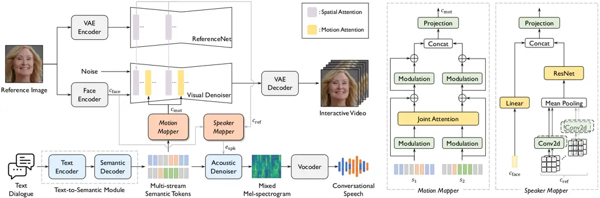
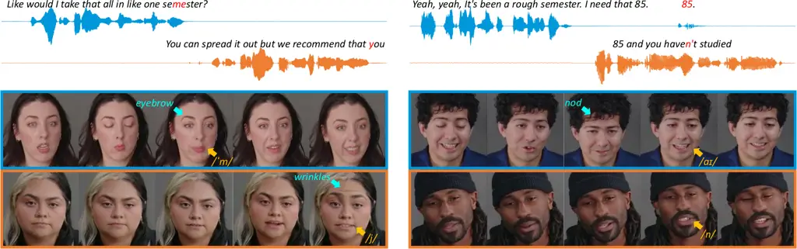

# TAVID: Text-Driven Audio-Visual Interactive Dialogue Generation

Ji-Hoon Kim Affiliation: Korea Advanced Institute of Science and
Technology Email: <jh.kim@kaist.ac.kr>    Junseok Ahn
Email: <junseok.ahn@kaist.ac.kr>    Doyeop Kwak Affiliation: Korea
Advanced Institute of Science and Technology    Joon Son Chung
Affiliation: Korea Advanced Institute of Science and Technology   
Shinji Watanabe Affiliation: Carnegie Mellon University

###### Abstract

The objective of this paper is to jointly synthesize interactive videos
and conversational speech from text and reference images. With the
ultimate goal of building human-like conversational systems, recent
studies have explored talking or listening head generation as well as
conversational speech generation. However, these works are typically
studied in isolation, overlooking the multimodal nature of human
conversation, which involves tightly coupled audio-visual interactions.
In this paper, we introduce TAVID, a unified framework that generates
both interactive faces and conversational speech in a synchronized
manner. TAVID integrates face and speech generation pipelines through
two cross-modal mappers (i.e., a motion mapper and a speaker mapper),
which enable bidirectional exchange of complementary information between
the audio and visual modalities. We evaluate our system across four
dimensions: talking face realism, listening head responsiveness, dyadic
interaction fluency, and speech quality. Extensive experiments
demonstrate the effectiveness of our approach across all these aspects.

![[Uncaptioned
image]](arxiv-2512-20296--03241ea5bf65.figures/figure-1.webp)

Figure 1: Overview of TAVID framework. Given a text dialogue and
reference images, TAVID simultaneously produces interactive videos and
conversational speech with natural turn-taking, accurate synchronization
and expressive facial dynamics.

^(†)^(†)footnotetext: ^(∗)Equal contribution.^(†)^(†)footnotetext:
Project Page:
[https://mm.kaist.ac.kr/projects/TAVID](https://mm.kaist.ac.kr/projects/TAVID)

## 1 Introduction

Have you ever imagined having a natural conversation with an AI? Indeed,
there have been numerous efforts to build systems capable of fluent
communication, reflecting growing demand in areas such as AI tutoring,
virtual companionship, and social robotics. However, such systems have
predominantly been limited to a single modality, such as text \[56, 24,
72\] or speech \[55, 18, 67\]. In contrast, human communication is
inherently multimodal, combining linguistic content with vocal and
visual cues that enrich nuance, emotion, and intent \[49\]. Therefore,
to create truly immersive and realistic interactions between human and
AI, it is crucial to integrate information across multiple modalities,
rather than relying on text or speech alone.

With the ultimate goal of building human-like conversational agents,
prior work has largely been fragmented into independent lines of
research, including talking head generation and listening head
generation. Talking head generation focuses on synthesizing a speaker’s
lip and head motions driven by an audio \[60, 32, 71\] or a text
signal \[8, 31, 22\]. In parallel, listening head generation aims to
produce a listener’s facial feedback in response to the speaker’s
acoustic and visual behaviors \[78, 53, 63, 47\]. Although these two
tasks have succeeded in animating natural faces, they focus solely on
one-sided communication, overlooking the dyadic nature of human
conversation.

To model dyadic communication, recent studies have explored interactive
head generation. Early works \[66, 68, 79\] rely on manually defined
role switchers to alternate between speaking and listening states, which
often lead to unnatural transitions. To address this issue, INFP \[81\]
proposes an interactive motion guider that automatically determines the
state using dyadic motion representations driven by dual-track audio.
Recently, ARIG \[25\] further improves interaction realism and
generation quality by incorporating long-range contextual cues from both
audio and visual modalities. Despite these advances towards
conversational agents, existing methods rely on pre-recorded audio to
produce facial videos, making them incapable of creating a new speech
content. Although a common workaround is to construct cascaded systems
integrating text-to-speech (TTS) networks, this approach inevitably
suffers from error accumulation and additional speaker modeling such as
acoustic prompting \[31, 70\].

In this paper, we propose TAVID, a unified framework for Text-driven
Audio-Visual Interactive Dialogue generation. As illustrated in Fig. 1,
TAVID jointly generates conversational speech and interactive videos
from a text dialogue and reference images, enabling flexible content
creation and automatic speaker modeling. To this end, TAVID integrates
video and speech generation pipelines with two cross-modal mappers–the
Motion Mapper and the Speaker Mapper–which capture mutually
complementary information across the two streams. The Motion Mapper
converts text dialogues into dyadic motion features that dynamically
alternate between speaking and listening states. To ensure accurate and
interactive motion, we analyze several architectural schemes and adopt a
joint self-attention mechanism that facilitates bi-directional
information exchange between speakers. Meanwhile, the Speaker Mapper
ensures that the synthesized voice aligns with the visual persona by
producing speaker features consistent with the visual identity.

Our main contributions are summarized as follows:

- •
  We propose TAVID, a unified framework for text-driven interactive
  dialogue generation. To our knowledge, this is the first attempt to
  jointly generate both interactive video and conversational speech from
  text inputs, enabling flexible control over spoken content while
  ensuring visually consistent speaker characteristics.
- •
  We design two novel cross-modal mappers, the Motion Mapper and Speaker
  Mapper, that predict complementary features across audio and visual
  streams, facilitating a synergistic audio-visual interaction.
- •
  Our method generates not only realistic interactive videos but also
  high-quality conversational speech, demonstrating its effectiveness
  across multiple aspects, including talking face realism, listener
  responsiveness, dyadic interaction fluency, and speech naturalness.

## 2 Related Works



Figure 2: The overall architecture of TAVID. Given a text dialogue and a
reference image, our approach generates both interactive video and
conversational speech, guided by two cross-modal mappers. The Motion
Mapper predicts interactive motions from multi-stream semantic tokens,
while the Speaker Mapper models vocal characteristics from the reference
image. The detailed architectures of the cross-modal mappers are shown
on the right side.

### 2.1 Single Role Head Generation

Single role head generation refers to either talking head or listening
head generation. Talking head generation, which aims to produce
speakers’ facial video with accurate lip and head movements, can be
broadly divided into two categories. One line of work utilizes audio
signals to animate a reference image, typically based on generative
adversarial networks \[60, 57, 76\] or diffusion networks \[14, 7, 15\].
These approaches assume that an input speech signal is already
available, either as a real recording of a human voice or generated by a
pre-trained text-to-speech (TTS) networks. The other line utilizes a
text instead of audio  \[31, 22, 6, 70\]. These works jointly synthesize
speech and talking head videos from text inputs, enabling flexible
control over linguistic content while avoiding the latency and error
accumulation associated with TTS-cascaded systems.

In parallel, listening head generation aims to produce facial videos of
a listener exhibiting natural responsive behaviors, such as attentive
gaze and subtle head movements. As one of the earliest efforts in this
direction, RLHG \[78\] introduces the ViCo dataset, establishing a
standard benchmark for responsive listener generation. Following to
this, this field has evolved to model the non-deterministic nature of
listener feedback by generating diverse \[53\], emotionally
controllable \[63\], and text-prompted responses \[47\]. Although these
single role methods have demonstrated impressive performance, the
explicit separation between speaker and listener roles constrains the
synthesis of fluid and natural dyadic interactions. In contrast, the
proposed approach jointly models both roles, enabling coherent and
contextually adaptive interactions prompted by text inputs.

### 2.2 Interactive Head Generation

To capture the dyadic nature of human conversations, there has been a
growing line of research on interactive head generation. This task aims
to produce facial videos that seamlessly switch between speaking and
listening roles within multi-turn conversations. Early works \[66, 68,
79\] model the speaking and listening roles in separate branches and
manually assign role states to their respective branches. However, such
manual role assignment often leads to unnatural transitions between
different conversational states. Furthermore, this paradigm fails to
comprehensively capture all possible states in dyadic conversations,
such as when both participants speak simultaneously or remain silent.
Recently, INFP \[81\] introduces a key breakthrough for this task. By
introducing an interactive motion guider, they generate mixed
speaking-listening motions that dynamically alternate between speaking
and listening states without requiring explicit role assignment.
Following this, ARIG \[25\] further enhances interaction realism and
visual quality by incorporating long-range contextual information from
audio–visual modalities. While these efforts have achieved promising
results in modeling conversational dynamics, they still rely on
pre-recorded speech, inheriting the fundamental limitations of
audio-driven talking head generation. Different from prior works, we
propose a text-driven interactive head generation system, which not only
enables flexible speech content editing but also automatically aligns
voice identity with visual identity.

### 2.3 Conversational Speech Generation

Conversational speech generation aims to produce coherent multi-turn
speech while capturing key characteristics of human conversation, such
as natural turn-taking and back-channeling. As a pioneering work,
dGSLM \[55\] models the turn-taking dynamics of conversational speech
through a dual-tower Transformer, serving as the foundation for
subsequent works such as CHATS \[50\] and SLIDE \[48\]. Meanwhile,
several attempts have been made to generate conversational speech from
text dialogues, most of which are based on autoregressive
architectures \[33, 17, 58\]. These models predict either semantic
tokens \[74\] or acoustic codec tokens \[52, 16\] from text input. More
recently, non-autoregressive architectures have also been explored to
address the inherent limitations of autoregressive approaches \[73,
80\]. Although these models have succeeded in synthesizing naturalistic
conversational speech, they fundamentally lack the visual dimension
required for holistic human communication. Our approach, however,
generates interactive videos alongside naturalistic speech, embodying
the multimodal nature of human communication.

(a) Concatenation

(b) Dual Attention

Figure 3: Analysis of integration strategies for the Motion Mapper.
$`c_{\text{mot}}`$ denotes the interactive motion features extracted
from multi-stream semantic tokens, whereas $`c_{\text{mot}}^{1}`$ and
$`c_{\text{mot}}^{2}`$ correspond to motion features specific to each
individual stream.

## 3 TAVID

### 3.1 Network Architecture

As depicted in Fig. 2, TAVID consists of two key pipelines: interactive
video generation and conversational speech synthesis. These two streams
are synergistically interconnected through the proposed cross-modal
mappers–the Motion Mapper and the Speaker Mapper–enabling synchronized
and coherent audio-visual synthesis. Our framework first converts a text
dialogue $`\mathbf{x}`$ into multi-stream semantic token sequences
$`\mathbf{S}=[s_{\text{1}},s_{\text{2}}]`$, where each stream represents
one participating speaker. These tokens serve as a shared representation
that conditions both the video and speech generation in parallel.

#### Video Generation.

Our video generation pipeline builds upon Hallo2 \[14\] and consists of
a variational auto-encoder (VAE) \[37\], a UNet-based visual denoiser
$`\epsilon_{\theta}`$, and a parallel ReferenceNet \[30, 14\]. Following
the latent diffusion formulation \[61\], the visual denoiser iteratively
refines the latent variable $`z_{t}`$ at each timestep $`t`$,
conditioned on a set of guidance signals $`\mathbf{C}`$ via
cross-attention. The conditioning signals $`\mathbf{C}`$ include
reference spatial features $`c_{\text{ref}}`$, a face embedding
$`c_{\text{face}}`$, and interactive motion features $`c_{\text{mot}}`$,
each focusing on distinct aspects of visual reconstruction. Spatial
features from ReferenceNet enhance global coherence and the face
embedding from a pre-trained face encoder \[20\] preserves portrait
identity. Notably, the interactive motion features serve as the key
driver for natural dyadic interactions. These motion features are
produced by the Motion Mapper from multi-stream semantic tokens
$`\mathbf{S}`$. Motivated by the strong correlations between prosody and
facial dynamics \[13, 36\], we adopt prosody-aware semantic tokens⁻¹⁻¹
-1
[https://github.com/facebookresearch/seamless_communication/tree/main/src/seamless_communication/cli/m4t/audio_to_units](https://github.com/facebookresearch/seamless_communication/tree/main/src/seamless_communication/cli/m4t/audio_to_units) \[35,
64\] and validate their effectiveness in Sec. 5.4. The Motion Mapper is
jointly optimized with the visual denoiser $`\epsilon_{\theta}`$ using
the standard diffusion objective:

```math
\mathcal{L}_{\text{visual}}=\mathbb{E}\left[||\epsilon-\epsilon_{\theta}(z_{t},t,\mathbf{C})||^{2}\right], \tag{1}
```

where $`\epsilon`$ denotes Gaussian noise.

#### Speech Generation.

The speech generation pipeline consists of text-to-semantic module,
acoustic denoiser and a pre-trained vocoder \[44\]. Following
CoVoMix \[74\], we employ an encoder–decoder architecture for the
text-to-semantic module and flow matching algorithm \[46\] for the
acoustic denoiser. The text-to-semantic module takes a text dialogue,
tokenizes it with a BERT tokenizer \[34, 26\], and predicts the
multi-stream semantic tokens $`\mathbf{S}`$. This module is optimized
with a cross-entropy loss as follows:

```math
\mathcal{L}_{\text{text2semantic}}=-\mathbb{E}\Big[\sum_{i}\log P_{\theta}(s_{j}^{i}\mid s_{j}^{<i},\mathbf{x})\Big], \tag{2}
```

where $`\mathbf{x}`$ refers to the input text dialogue and $`s_{j}^{i}`$
denotes the $`i^{\text{~th}}`$ semantic token for participant
$`j\in\{\text{1},\text{2}\}`$.

The subsequent acoustic denoiser converts the multi-stream semantic
tokens $`\mathbf{S}`$ into a mixed mel-spectrogram $`\mathbf{y}`$. The
token streams are first embedded via a lookup table, and speaker
embeddings $`e_{\text{spk}}`$ are conditioned through DSLN module \[40\]
to provide voice characteristics for each stream. In our framework, the
speaker embedding can be extracted either from audio or from the face.
During training, we use audio-driven speaker embeddings extracted from
the target utterance \[69\], while at inference, we employ face-driven
embeddings predicted from a reference image via the Speaker Mapper.
Given data samples from the prior
$`\mathbf{y}_{0}\sim p_{0}(\mathbf{y})`$ and target distribution
$`\mathbf{y}_{1}\sim p_{1}(\mathbf{y})`$, the acoustic denoiser is
trained to estimate the target vector field
$`\mathbf{y}_{1}-\mathbf{y}_{0}`$ under the flow matching objective:

```math
\mathcal{L}_{\text{acoustic}}=\mathbb{E}\Big[\big\|(\mathbf{y}_{1}-\mathbf{y}_{0})-v_{t}(\mathbf{y}_{t}\mid\mathbf{S},e_{\text{spk}}^{\text{audio}};\theta)\big\|^{2}\Big], \tag{3}
```

where $`\mathbf{y}_{t}=(1-t)\mathbf{y}_{0}+t\mathbf{y}_{1}`$ denotes a
noisy latent at timestep $`t\in[0,1]`$, and
$`v_{t}(\mathbf{y}_{t}\mid\mathbf{S},e_{\text{spk}}^{\text{audio}};\theta)`$
represents the estimated vector field conditioned on the semantic tokens
$`\mathbf{S}`$ and the audio-driven speaker embedding
$`e_{\text{spk}}^{\text{audio}}`$.

#### Cross-modal Mappers.

While conditioning both pipelines on shared semantic tokens
$`\mathbf{S}`$ provides a basic means of synchronization, it is
insufficient to capture the rich audio-visual correlations present in
real human communication. To address this, we propose cross-modal
mappers, which establish a bi-directional information pathway between
video and speech generation, going beyond simple parallel generation. To
be specific, the Motion Mapper translates multi-stream semantic tokens
$`\mathbf{S}`$ into interactive motion features $`c_{\text{mot}}`$,
including precise lip movements and responsive listening behaviors.
Conversely, the Speaker Mapper leverages complementary visual cues from
the reference image to generate vocal characteristics that closely align
with visual identity. This exchange of information enables TAVID to
produce tightly coupled audio-visual outputs, constructing a synergistic
loop between the audio and visual pipelines.

### 3.2 Motion Mapper

The Motion Mapper aims to generate interactive motions from multi-stream
semantic tokens $`\mathbf{S}`$. This requires not only capturing the
specific information of each stream but also modeling the
interdependencies between the two streams. To identify the most
effective architecture for the Motion Mapper, we explore four different
strategies. The first strategy simply adds the two streams,
$`s_{\text{1}}`$ and $`s_{\text{2}}`$, before passing them to the
projection layer. However, in preliminary experiments, this method
failed to differentiate between $`s_{\text{1}}`$ and $`s_{\text{2}}`$,
preventing the model from learning proper turn-taking behavior. The
second approach concatenates the two streams and feds them into the
projection layer, as shown in Fig. 3(a). The third scheme computes
motion attentions for each stream separately over video hidden states,
and then adds the two attention results (Fig. 3(b))⁰⁰ 0 We refer to this
strategy as “Dual Attention”.. Both methods successfully differentiate
between the streams and capture appropriate transitions. However, they
are limited in capturing the inter-stream correlation, which hinders
interactive video generation.

To this end, we introduce a joint self-attention mechanism, inspired by
the MMDiT block \[23\], which effectively models both modality-specific
behaviors and cross-modal correlations between text and image. As shown
in Fig. 2, each semantic stream is first modulated through its
respective LayerNorm and Linear Layer. The joint attention module then
captures the mutual dependencies between the two stream features while
preserving their distinct semantics. The resulting representations are
further refined through an additional modulation block, after which they
are concatenated and processed by three Linear layers to produce the
interactive motions. As verified in Sec. 5.4, this design effectively
captures both stream-specific information and cross-stream correlations,
resulting in optimal performance among the four strategies.

### 3.3 Speaker Mapper

To achieve tight alignment between acoustic and visual identity, we
introduce the Speaker Mapper which estimates vocal characteristics from
reference images. Specifically, the mapper utilizes two complementary
visual features. First, the face embedding $`c_{\text{face}}`$ extracted
from the face encoder provides personalized visual characteristics,
serving as the primary visual cue. In addition, inspired by recent
findings that highlight diffusion models as powerful representation
learners \[21, 12, 51\], we incorporate spatial features
$`c_{\text{ref}}`$ obtained from ReferenceNet. ReferenceNet is trained
to explicitly preserve visual consistency over frames and its hidden
features offer rich discriminative cues.

As shown in Fig. 2 (rightmost), the intermediate ReferenceNet features
$`c_{\text{ref}}`$ are projected through convolutional layers and passed
to a ResNet18 \[27\]. The output features are concatenated with the face
embedding $`c_{\text{face}}`$, and then fed into three Linear layers to
predict the audio-driven speaker embedding
$`e_{\text{spk}}^{\text{audio}}`$. Here, the
$`e_{\text{spk}}^{\text{audio}}`$ is extracted from the target
utterance, and the Speaker Mapper is trained with L2 loss which can be
formulated as:

```math
\mathcal{L}_{\text{speaker}}=\mathbb{E}\left[||e_{\text{spk}}^{\text{audio}}-f_{\theta}(c_{\text{face}},c_{\text{ref}})||^{2}\right], \tag{4}
```

where $`f_{\theta}`$ represents the Speaker Mapper.

## 4 Experimental Settings

### 4.1 Datasets

Our dataset comprises multiple video and speech corpora. The video
datasets include single role (HDTF \[77\] and ViCo \[78\]) and
conversational datasets (subsets of the Seamless Interaction \[1\]),
where each training pair consists of `<`dual-channel semantic tokens,
video frames`>`. Due to single role data scarcity, we further extract
single role segments from the conversational data by detecting active
speech intervals using a pre-trained VAD \[65\]. These video datasets
cover diverse individuals across a wide range of topics, spanning
approximately 500 hours of video data.

For the speech corpora, we construct the dataset using single role
(LibriTTS-R \[38\]) and conversational datasets (DailyTalk \[42\],
Fisher \[11\], and Seamless Interaction \[1\]). Each training sample
consists of `<`text, dual-channel semantic tokens, mixed
mel-spectrogram`>`, and single role segments are additionally extracted
from the conversational datasets following CoVoMix \[74\]. In total, the
speech data comprise approximately 2k hours.

### 4.2 Preprocessing

All videos are standardized to 25 fps and resized to a resolution of 512
$`\times`$ 512. For the Seamless Interaction dataset, which contains
naturalistic full-body videos, face sequences are cropped using
RetinaFace \[19\], and frames with occlusions, excessive movements, or
head rotations exceeding $`30^{\circ}`$ are excluded for stable
training. The speech sampling rate is set to 16 kHz¹¹ 1 For the Fisher
dataset, the sampling rate is upsampled from 8 kHz to 16 kHz using a
pre-trained EDNet \[39\]., and acoustic noise is filtered using a
pre-trained EDNet \[39\]. For the semantic tokens, we extract continuous
features from the 35$`{}^{\text{th}}`$ layer of XLS-R \[3\] and
discretize them into 10k clusters using the K-means algorithm. For
single role samples, indices corresponding to silence are appended to
form dual-channel semantic tokens. 80 bins mel-spectrograms are computed
with a window size of 1280 and a hop size of 320, and text
transcriptions are processed following CoVoMix \[74\].

|        |        |                            |                      |                         |                   |                   |                     |                   |                     |                    |                             |                             |
| ------ | ------ | -------------------------- | -------------------- | ----------------------- | ----------------- | ----------------- | ------------------- | ----------------- | ------------------- | ------------------ | --------------------------- | --------------------------- |
| Method | Source | Subjective Metrics         |                      |                         | Objective Metrics |                   |                     |                   |                     |                    |                             |                             |
|        |        | Visual Quality$`\uparrow`$ | Lip Sync$`\uparrow`$ | Turn-taking$`\uparrow`$ | FID$`\downarrow`$ | FVD$`\downarrow`$ | LPIPS$`\downarrow`$ | LSE-C$`\uparrow`$ | LSE-D$`\downarrow`$ | RPCC$`\downarrow`$ | $`\Delta`$SID$`\downarrow`$ | $`\Delta`$Var$`\downarrow`$ |
| DIM    | Audio  | 2.09$`\pm`$0.20            | 2.00$`\pm`$0.21      | 2.33$`\pm`$0.23         | 29.715            | 279.673           | 0.240               | 2.620             | 11.366              | 0.086              | 0.902                       | 0.110                       |
| DIM    | TTS    | 2.11$`\pm`$0.23            | 2.33$`\pm`$0.24      | 2.38$`\pm`$0.22         | 30.423            | 283.056           | 0.255               | 2.480             | 11.620              | 0.061              | 1.010                       | 0.229                       |
| Ours   | Text   | 3.75$`\pm`$0.23            | 3.80$`\pm`$0.23      | 3.84$`\pm`$0.24         | 16.625            | 179.305           | 0.056               | 6.457             | 8.403               | 0.031              | 0.489                       | 0.011                       |

Table 1: Quality comparison of interactive head generation on the
Seamless Interaction test set. Subjective evaluation results are
presented with 95% confidence intervals. Arrows indicate the preferable
direction and bold values denote the best result.



Figure 4: Qualitative results of TAVID on the Seamless Interaction test
set. Our method converts text inputs into realistic conversational
speech and interactive video, capturing precise lip motions, responsive
behaviors, and speech overlaps.

### 4.3 Implementation Details

In the Motion Mapper, semantic tokens, represented as K-means cluster
indices, are first transformed into continuous feature space using their
corresponding original cluster centroids. All training is conducted on 8
NVIDIA A6000 GPUs. The video generation pipeline is trained for 32k
steps with a batch size of 32, initializing weights from Hallo2 \[14\],
except for the Motion Mapper and motion attention. At each step, 14
consecutive frames are randomly sampled, and only the weights of the
Motion Mapper, motion attention, and temporal attention are updated. To
improve video quality, classifier-free guidance (CFG) \[28\] is applied,
dropping a reference image, semantic tokens, and motion frames with a
probability of 0.05 during training.

The text-to-semantic module is trained for 250k steps with a batch size
of 192, while the acoustic denoiser is trained for 320k steps with a
batch size of 96. CFG is used to enhance speech quality. During
training, text inputs are dropped in the text-to-semantic module with a
probability of 0.1, and semantic tokens together with speaker embeddings
are omitted in the acoustic denoiser with a probability of 0.3. In
particular, we employ CFG-filter \[16\] in the text-to-semantic module
to mitigate the speed-drift issue observed when using vanilla CFG. The
Speaker Mapper is trained for 1k steps with a batch size of 64.

### 4.4 Evaluation Metrics

Video Metrics. We evaluate the quality of generated videos using both
subjective and objective metrics. For subjective evaluation, we conduct
5-scale Mean Opinion Score (MOS) tests, in which 20 participants rate 20
interactive video samples based on visual quality, lip-sync accuracy,
and turn-taking naturalness. Our objective evaluation assesses overall
visual fidelity and temporal realism using a suite of metrics including
FID, FVD, LPIPS \[75\]. Audio-visual synchronization is quantified using
SyncNet scores (LSE-C and LSE-D) \[10, 60\]. In addition, we utilize
residual Pearson correlation coefficients (RPCC) to assess
speaker-listener coordination, while motion diversity is evaluated using
the absolute difference in pose variance ($`\Delta\text{Var}`$) and the
SI \[53\] for diversity ($`\Delta\text{SID}`$) with respect to the
ground truth distribution \[54\].

Speech Metrics. The quality of generated speech is evaluated using both
subjective and objective metrics. For subjective evaluation, we conduct
MOS tests, where 20 domain-experts evaluate naturalness and face
matching score, which measures how well the generated voice matches the
reference image. For objective metrics, we report UTMOS \[62\] for
speech quality and VoxSim \[2\] for speaker similarity to the target
speaker.

## 5 Experimental Results

In this section, we demonstrate the effectiveness of our approach across
multiple dimensions, including interactive head generation, single role
head generation, and face-stylized speech generation. We additionally
conduct comprehensive ablation studies to assess the effect of each
component within TAVID.

### 5.1 Interactive Head Generation

#### Qualitative Evaluation.

To intuitively demonstrate the generation quality of TAVID, we present
two conversational video results in Fig. 4. Both examples exhibit
accurate lip synchronization (yellow arrows), expressive non-verbal
motions (sky-blue arrows), and smooth transitions between speaking and
listening states. Particularly, the left example illustrates prosodic
emphasis through raised eyebrows (top) and forehead wrinkles (bottom),
highlighting dynamic facial expressions that align with prosodic
variations. In addition, the right example demonstrates that our method
can generate overlaps that are both acoustically and visually natural.
Notably, despite receiving only text dialogue as input, TAVID generates
both overlapped video and speech with appropriate timing, fully
synchronized with each other.

#### Quantitative Evaluation.

We perform a quantitative comparison for interactive head generation on
the Seamless Interaction test set. Since our method is the first attempt
at text-driven interactive head generation, we compare our model with
the recent audio-driven approach, DIM \[66\], which is the only publicly
available method²² 2
[https://github.com/Boese0601/Dyadic-Interaction-Modeling](https://github.com/Boese0601/Dyadic-Interaction-Modeling).
We additionally compare a TTS-cascaded version of DIM, where the source
audio is generated by our system. To ensure a fair comparison, DIM is
trained from scratch on the same training dataset as TAVID, and the
results are shown in Tab. 1.

As shown, TAVID achieves high-quality video generation, significantly
outperforming all the baselines across every aspect. In particular,
subjective evaluation results confirm that TAVID highly improves
perceptual quality in terms of visual quality, lip-sync accuracy, and
turn-taking naturalness. Objective evaluation further supports the
effectiveness of our method, demonstrating superior performance in video
quality (FID, FVD, and LPIPS), lip-sync accuracy (LSE-C and LSE-D),
speaker–listener coordination (RPCC), and motion diversity
($`\Delta\text{Var}`$ and $`\Delta\text{SID}`$). It is worth noting
that, due to the inherent limitations of the cascaded system, the
TTS-cascaded DIM exhibits degraded performance across all objective
metrics, underscoring the advantages of our text-driven end-to-end
approach.

### 5.2 Single Role Head Generation

|           |        |                   |                   |                   |                     |
| --------- | ------ | ----------------- | ----------------- | ----------------- | ------------------- |
| Method    | Source | FID$`\downarrow`$ | FVD$`\downarrow`$ | LSE-C$`\uparrow`$ | LSE-D$`\downarrow`$ |
| SadTalker | Audio  | 23.398            | 328.643           | 7.142             | 7.881               |
| Echomimic | Audio  | 19.037            | 276.143           | 5.929             | 9.381               |
| Hallo2    | Audio  | 18.205            | 258.085           | 7.816             | 7.737               |
| SadTalker | TTS    | 23.510            | 328.539           | 7.227             | 7.756               |
| Echomimic | TTS    | 19.316            | 283.432           | 5.919             | 9.377               |
| Hallo2    | TTS    | 18.742            | 250.520           | 7.697             | 7.819               |
| Ours      | Text   | 16.745            | 245.493           | 7.537             | 8.155               |

Table 2: Quality comparison of talking head generation on the HDTF test
set. The “Source” column indicates the source used for video generation.

#### Talking Head Generation.

We also compare our versatile system, with a focus on talking and
listening head generation. For talking-head generation, 20 samples from
HDTF \[77\] are used for evaluation, and we compare our text-driven
method against recent audio-driven models: SadTalker \[76\],
Echomimic \[7\], and Hallo2 \[14\]. As shown in Tab. 2, our method
achieves the best performance in video quality, outperforming all
baselines in both FID and FVD, while achieving a lip-sync score
comparable to the state-of-the-art method. Moreover, similar to
interactive head generation, the TTS-cascaded baselines suffer from
consistent quality degradation, whereas our approach avoids this error
accumulation with providing flexible control over the spoken content.

|        |                  |      |                    |      |                             |      |                             |      |
| ------ | ---------------- | ---- | ------------------ | ---- | --------------------------- | ---- | --------------------------- | ---- |
| Method | FD$`\downarrow`$ |      | RPCC$`\downarrow`$ |      | $`\Delta`$SID$`\downarrow`$ |      | $`\Delta`$Var$`\downarrow`$ |      |
|        | Exp              | Pose | Exp                | Pose | Exp                         | Pose | Exp                         | Pose |
| L2L\*  | 33.93            | 0.06 | 0.06               | 0.08 | 2.23                        | 1.35 | 0.47                        | 0.00 |
| RLHG\* | 39.02            | 0.07 | 0.08               | 0.02 | 1.38                        | 0.84 | 0.22                        | 0.00 |
| DIM\*  | 23.88            | 0.06 | 0.06               | 0.03 | 1.29                        | 1.66 | 0.23                        | 0.00 |
| INFP\* | 18.63            | 0.07 | \-                 | \-   | 0.22                        | 0.09 | 1.53                        | 0.16 |
| ARIG\* | 18.39            | 0.06 | 0.05               | 0.01 | 0.18                        | 0.07 | 1.61                        | 0.15 |
| Ours   | 16.03            | 0.04 | 0.01               | 0.02 | 0.24                        | 0.34 | 0.10                        | 0.00 |

Table 3: Quality evaluation of listening head generation on the ViCo
test set. \* indicates results reported in DIM \[66\], INFP \[81\], and
ARIG \[25\].

#### Listening Head Generation.

The quality of listening-head generation is evaluated on the ViCo test
set \[78\] against L2L \[53\], RLHG \[78\], DIM \[66\], INFP \[81\], and
ARIG \[25\]. In addition to RPCC, $`\Delta`$SID and $`\Delta`$Var, we
compute Frechet distance (FD) to assess motion realism.

The results in Tab. 3 demonstrate that our method consistently
outperforms recent approaches in listening head generation. TAVID
achieves the best results in FD and $`\Delta`$Var, indicating that it
generates faithful non-verbal motions that closely resemble the ground
truth. Although the $`\Delta`$SID of TAVID shows a slight degradation
compared to ARIG \[25\], our approach achieves a comparable RPCC score,
highlighting its ability to generate natural responsive behaviors.

### 5.3 Face-stylized Speech Generation

The speech generation quality of TAVID is evaluated on the
VoxCeleb2 \[9\] test set, ensuring that there is no overlap of speakers
with the training dataset. We randomly sample 30 utterances for
subjective evaluation and 100 utterances for objective evaluation, and
compare our method against several recent approaches. Specifically, we
include YourTTS \[4\] and CoVoMix³³ 3 For a fair comparison, the speaker
conditioning method is replaced with the use of audio-driven speaker
embedding as in YourTTS \[4\]. \[74\], which utilize audio-driven
speaker embeddings extracted from the target utterance, as well as
Face-TTS \[41\] and FVTTS \[43\], which are based on face-driven speaker
embeddings. As shown in Tab. 4, TAVID achieves the best naturalness
scores (naturalness MOS and UTMOS), indicating that it synthesizes clear
and high-quality speech. While YourTTS and CoVoMix show higher VoxSim
scores than our method, this is due to the injection of vocal
characteristics directly derived from the target utterance. Among the
face-stylized methods, our approach achieves the best speaker
similarity. More importantly, TAVID outperforms all baselines, including
audio-stylized methods, in face matching MOS. This indicates that TAVID
generates vocal characteristics that are perceptually consistent with
the visual identity.

|                                |                         |                           |                   |                    |
| ------------------------------ | ----------------------- | ------------------------- | ----------------- | ------------------ |
| Method                         | Subjective Metrics      |                           | Objective Metrics |                    |
|                                | Naturalness$`\uparrow`$ | Face Matching$`\uparrow`$ | UTMOS$`\uparrow`$ | VoxSim$`\uparrow`$ |
| • Audio-driven Voice Synthesis |                         |                           |                   |                    |
| YourTTS                        | 3.20$`\pm`$0.20         | 3.47$`\pm`$0.17           | 3.448             | 0.662              |
| CoVoMix                        | 3.87$`\pm`$0.27         | 3.40$`\pm`$0.25           | 3.146             | 0.659              |
| • Face-driven Voice Synthesis  |                         |                           |                   |                    |
| Face-TTS                       | 2.25$`\pm`$0.21         | 2.02$`\pm`$0.22           | 1.941             | 0.278              |
| FVTTS                          | 2.72$`\pm`$0.22         | 2.83$`\pm`$0.23           | 2.730             | 0.336              |
| Ours                           | 4.20$`\pm`$0.20         | 3.87$`\pm`$0.19           | 3.530             | 0.380              |

Table 4: Results of face-stylized speech generation on VoxCeleb2
datasets. All test speaker are unseen during training.

### 5.4 Analyses

#### Motion Mapper Architecture.

To investigate the optimal architecture for the Motion Mapper, we
evaluate the performance of talking and listening head generation across
three different strategies (concatenation, dual attention, and joint
attention), as described in Sec. 3.2. In Tab. 5, the joint attention
architecture shows superior performance in the talking head generation.
It obtains the best scores in lip synchronization and image realism,
indicating its capability to translate stream-specific information into
precise self-driven movements.

In addition to talking head scenario, as shown in Tab. 6, the joint
attention mechanism achieves robust scores in listening head generation,
indicating its ability to capture cross-stream interdependencies. While
dual attention shows slightly better performance on several
expression-related metrics, joint attention delivers more consistent
performance across all metrics, outperforming both alternatives in pose
realism and coordinated movement. Overall, these results of talking and
listening head generation collectively validate the effectiveness of the
joint attention mechanism, demonstrating its ability to capture
cross-stream correlations as well as stream-specific information.

Figure 5: AB preference results of the Speaker Mapper for visual and
acoustic identity matching.

#### Prosody-aware Semantic Tokens.

We explore the effect of prosody-aware semantic tokens (10k clusters
from the hidden features of XLS-R⁴⁴ 4 We denote these tokens as
$`\mathbf{S}_{\text{prosody}}`$.) by comparing our model against a
variant using HuBERT \[29\]-based semantic tokens⁵⁵ 5
[https://github.com/vivian556123/NeurIPS2024-CoVoMix/tree/main/fairseq-hubert](https://github.com/vivian556123/NeurIPS2024-CoVoMix/tree/main/fairseq-hubert),
which are known to contain rich linguistic but limited prosodic
cues \[59, 5, 45\]. As shown in Tab. 5, omitting prosody information
degrades overall quality in talking head generation. Specifically,
lip-sync accuracy drops with a notable margin, highlighting the
importance of prosodic cues for generating accurate and expressive lip
motions.

The results of listening head generation consolidate the importance of
prosodic cues. In Tab. 6, the absence of the prosodic cues results in
quality degradation in motion realism (FD) and natural coordination
(RPCC). These findings support our hypothesis that capturing
fine-grained prosody as well as linguistics, is crucial for synthesizing
realistic and interactive facial dynamics.

#### Speaker Mapper.

To verify the effect of each visual feature used in the Speaker Mapper,
we compute VoxSim (objective) alongside AB preference tests
(subjective), in which 20 subjects are asked to compare face matching
scores. The results in Fig. 5 validate that each feature provides a
distinct contribution to enhancing face matching accuracy. We observe
that removing the face embedding $`c_{\text{face}}`$ leads to
substantial degradation in both objective and subjective performance
(top), confirming its central role in predicting face-matching vocal
characteristics. The absence of the ReferenceNet feature
$`c_{\text{ref}}`$ results in a relatively small but notable
degradation, demonstrating that it provides complementary visual cues
that help align visual and acoustic identity.

|                                     |                   |                   |                   |                     |
| ----------------------------------- | ----------------- | ----------------- | ----------------- | ------------------- |
| Method                              | FID$`\downarrow`$ | FVD$`\downarrow`$ | LSE-C$`\uparrow`$ | LSE-D$`\downarrow`$ |
| Concat                              | 17.921            | 244.185           | 7.296             | 8.236               |
| Dual Att.                           | 17.451            | 237.997           | 7.117             | 8.295               |
| Joint Att.                          | 16.745            | 245.493           | 7.537             | 8.155               |
| w/o $`\mathbf{S}_{\text{prosody}}`$ | 17.407            | 266.942           | 6.645             | 8.924               |

Table 5: Motion Mapper analysis of talking head generation.

|                                     |                  |      |                    |      |                             |      |                             |      |
| ----------------------------------- | ---------------- | ---- | ------------------ | ---- | --------------------------- | ---- | --------------------------- | ---- |
| Method                              | FD$`\downarrow`$ |      | RPCC$`\downarrow`$ |      | $`\Delta`$SID$`\downarrow`$ |      | $`\Delta`$Var$`\downarrow`$ |      |
|                                     | Exp              | Pose | Exp                | Pose | Exp                         | Pose | Exp                         | Pose |
| Concat                              | 17.55            | 0.05 | 0.01               | 0.03 | 0.25                        | 0.33 | 0.07                        | 0.00 |
| Dual Att.                           | 15.27            | 0.05 | 0.00               | 0.03 | 0.27                        | 0.40 | 0.08                        | 0.00 |
| Joint Att.                          | 16.03            | 0.04 | 0.01               | 0.02 | 0.24                        | 0.34 | 0.10                        | 0.00 |
| w/o $`\mathbf{S}_{\text{prosody}}`$ | 16.39            | 0.05 | 0.01               | 0.04 | 0.19                        | 0.38 | 0.05                        | 0.00 |

Table 6: Motion Mapper analysis of listening head generation.

## 6 Conclusion

In this work, we presented TAVID, a unified framework for jointly
generating interactive faces and conversational speech in a synchronized
manner. To achieve precise audio-visual alignment, we proposed two
cross-modal mappers which facilitate the effective cross-modal exchange
of mutually complementary information and seamless integration of video
and speech generation. Extensive experiments demonstrate that our
approach consistently outperforms prior methods in talking head realism,
listening head responsiveness, dyadic interaction fluency, and speech
quality. These results highlight the potential of TAVID as a versatile
solution for building human-like conversational systems and underscore
the importance of modeling tightly coupled audio-visual interactions in
multimodal synthesis.

## References

- \[1\] V. Agrawal, A. Akinyemi, K. Alvero, M. Behrooz, J.
  Buffalini, F. M. Carlucci, J. Chen, J. Chen, Z. Chen, S. Cheng, P.
  Chowdary, J. Chuang, A. D’Avirro, J. Daly, N. Dong, M.
  Duppenthaler, C. Gao, J. Girard, M. Gleize, S. Gomez, H. Gong, S.
  Govindarajan, B. Han, S. He, D. Hernandez, Y. Hristov, R. Huang, H.
  Inaguma, S. Jain, R. Janardhan, Q. Jia, C. Klaiber, D. Kovachev, M.
  Kumar, H. Li, Y. Li, P. Litvin, W. Liu, G. Ma, J. Ma, M. Ma, X. Ma, L.
  Mantovani, S. Miglani, S. Mohan, L. Morency, E. Ng, K. Ng, T. A.
  Nguyen, A. Oberai, B. Peloquin, J. Pino, J. Popovic, O. Poursaeed, F.
  Prada, A. Rakotoarison, A. Richard, C. Ropers, S. Saleem, V.
  Sharma, A. Shcherbyna, J. Shen, J. Shen, A. Stathopoulos, A. Sun, P.
  Tomasello, T. Tran, A. Turkatenko, B. Wan, C. Wang, J. Wang, M.
  Williamson, C. Wood, T. Xiang, Y. Yang, Z. Yao, C. Zhang, J. Zhang, X.
  Zhang, J. Zheng, P. Zhyzheria, J. Zikes, and M. Zollhoefer (2025)
  Seamless Interaction: Dyadic Audiovisual Motion Modeling and
  Large-Scale Dataset. External Links:
  [Link](https://ai.meta.com/research/publications/seamless-interaction-dyadic-audiovisual-motion-modeling-and-large-scale-dataset/)
  Cited by: §4.1, §4.1.
- \[2\] J. Ahn, Y. Kim, Y. Choi, D. Kwak, J. Kim, S. Mun, and J. S.
  Chung (2024) VoxSim: A Perceptual Voice Similarity Dataset. In Proc.
  Interspeech, Cited by: §4.4.
- \[3\] A. Babu, C. Wang, A. Tjandra, K. Lakhotia, Q. Xu, N. Goyal, K.
  Singh, P. von Platen, Y. Saraf, J. Pino, et al. (2022) XLS-R:
  Self-supervised Cross-lingual Speech Representation Learning at Scale.
  In Proc. Interspeech, Cited by: §4.2.
- \[4\] E. Casanova, J. Weber, C. D. Shulby, A. C. Junior, E. Gölge,
  and M. A. Ponti (2022) YourTTS: Towards Zero-Shot Multi-Speaker TTS
  and Zero-Shot Voice Conversion for Everyone. In Proc. ICML, Cited by:
  §5.3, footnote 3.
- \[5\] H. Chang, S. Yang, and H. Lee (2022) DistilHuBERT: Speech
  Representation Learning by Layer-Wise Distillation of Hidden-Unit
  BERT. In Proc. ICASSP, Cited by: §5.4.
- \[6\] A. Chatziagapi, L. Morency, H. Gong, M. Zollhöfer, D. Samaras,
  and A. Richard (2025) AV-Flow: Transforming Text to Audio-Visual
  Human-like Interactions. arXiv:2502.13133. Cited by: §2.1.
- \[7\] Z. Chen, J. Cao, Z. Chen, Y. Li, and C. Ma (2025) EchoMimic:
  Lifelike Audio-Driven Portrait Animations through Editable Landmark
  Conditions. In Proc. AAAI, Cited by: §2.1, §5.2.
- \[8\] J. Choi, M. Kim, S. J. Park, and Y. M. Ro (2024) Text-driven
  Talking Face Synthesis by Reprogramming Audio-driven Models. In Proc.
  ICASSP, Cited by: §1.
- \[9\] J. S. Chung, A. Nagrani, and A. Zisserman (2018) VoxCeleb2: Deep
  Speaker Recognition. In Proc. Interspeech, Cited by: §5.3.
- \[10\] J. S. Chung and A. Zisserman (2016) Out of Time: Automated Lip
  Sync in the Wild. In Proc. ACCV, Cited by: §4.4.
- \[11\] C. Cieri, D. Miller, and K. Walker (2004) The Fisher Corpus: a
  Resource for the Next Generations of Speech-to-Text.. In Proc. LREC,
  Cited by: §4.1.
- \[12\] K. Clark and P. Jaini (2023) Text-to-Image Diffusion Models are
  Zero-Shot Classifiers. In Proc. NeurIPS, Cited by: §3.3.
- \[13\] G. Cong, L. Li, Y. Qi, Z. Zha, Q. Wu, W. Wang, B. Jiang, M.
  Yang, and Q. Huang (2023) Learning to Dub Movies via Hierarchical
  Prosody Models. In Proc. CVPR, Cited by: §3.1.
- \[14\] J. Cui, H. Li, Y. Yao, H. Zhu, H. Shang, K. Cheng, H. Zhou, S.
  Zhu, and J. Wang (2024) Hallo2: Long-Duration and High-Resolution
  Audio-Driven Portrait Image Animation. In Proc. ICLR, Cited by: §2.1,
  §3.1, §4.3, §5.2.
- \[15\] J. Cui, H. Li, Y. Zhan, H. Shang, K. Cheng, Y. Ma, S. Mu, H.
  Zhou, J. Wang, and S. Zhu (2024) Hallo3: Highly Dynamic and Realistic
  Portrait Image Animation with Video Diffusion Transformer. In Proc.
  CVPR, Cited by: §2.1.
- \[16\] J. Darefsky, G. Zhu, and Z. Duan (2024) Parakeet. External
  Links: [Link](https://jordandarefsky.com/blog/2024/parakeet) Cited by:
  §2.3, §4.3.
- \[17\] DeepMind (2024) Pushing the Frontiers of Audio Generation.
  External Links:
  [Link](https://deepmind.google/discover/blog/pushing-the-frontiers-of-audio-generation/)
  Cited by: §2.3.
- \[18\] A. Défossez, L. Mazaré, M. Orsini, A. Royer, P. Pérez, H.
  Jégou, E. Grave, and N. Zeghidour (2024) Moshi: A Speech-text
  Foundation Model for Real-time Dialogue. arXiv:2410.00037. Cited by:
  §1.
- \[19\] J. Deng, J. Guo, E. Ververas, I. Kotsia, and S.
  Zafeiriou (2020) RetinaFace: Single-shot Multi-level Face Localisation
  in the Wild. In Proc. CVPR, Cited by: §4.2.
- \[20\] J. Deng, J. Guo, N. Xue, and S. Zafeiriou (2019) Arcface:
  Additive Angular Margin Loss for Deep Face Recognition. In Proc. CVPR,
  Cited by: §3.1.
- \[21\] P. Dhariwal and A. Nichol (2021) Diffusion Models Beat GANs on
  Image Synthesis. In Proc. NeurIPS, Cited by: §3.3.
- \[22\] X. Diao, M. Cheng, W. Barrios, and S. Jin (2025) FT2TF:
  First-Person Statement Text-To-Talking Face Generation. In Proc. WACV,
  Cited by: §1, §2.1.
- \[23\] P. Esser, S. Kulal, A. Blattmann, R. Entezari, J. Müller, H.
  Saini, Y. Levi, D. Lorenz, A. Sauer, F. Boesel, et al. (2024) Scaling
  Rectified Flow Transformers for High-Resolution Image Synthesis. In
  Proc. ICML, Cited by: §3.2.
- \[24\] A. Grattafiori, A. Dubey, A. Jauhri, A. Pandey, A. Kadian, A.
  Al-Dahle, A. Letman, A. Mathur, A. Schelten, A. Vaughan, et al. (2024)
  The Llama 3 Herd of Models. arXiv:2407.21783. Cited by: §1.
- \[25\] Y. Guo, X. Liu, C. Zhen, P. Yan, and X. Wei (2025) ARIG:
  Autoregressive Interactive Head Generation for Real-time
  Conversations. arXiv:2507.00472. Cited by: §1, §2.2, §5.2, §5.2, Table
  3, Table 3.
- \[26\] T. Hayashi, S. Watanabe, T. Toda, K. Takeda, S. Toshniwal,
  and K. Livescu (2019) Pre-Trained Text Embeddings for Enhanced
  Text-to-Speech Synthesis. In Proc. Interspeech, Cited by: §3.1.
- \[27\] K. He, X. Zhang, S. Ren, and J. Sun (2016) Deep Residual
  Learning for Image Recognition. In Proc. CVPR, Cited by: §3.3.
- \[28\] J. Ho and T. Salimans (2021) Classifier-Free Diffusion
  Guidance. In Proc. NeurIPS Worpshops, Cited by: §4.3.
- \[29\] W. Hsu, B. Bolte, Y. H. Tsai, K. Lakhotia, R. Salakhutdinov,
  and A. Mohamed (2021) HuBERT: Self-supervised Speech Representation
  Learning by Masked Prediction of Hidden Units. IEEE/ACM Trans. on
  Audio, Speech, and Language Processing 29, pp. 3451–3460. Cited by:
  §5.4.
- \[30\] L. Hu (2024) Animate Anyone: Consistent and Controllable
  Image-to-Video Synthesis for Character Animation. In Proc. CVPR, Cited
  by: §3.1.
- \[31\] Y. Jang, J. Kim, J. Ahn, D. Kwak, H. Yang, Y. Ju, I. Kim, B.
  Kim, and J. S. Chung (2024) Faces that Speak: Jointly Synthesising
  Talking Face and Speech from Text. In Proc. CVPR, Cited by: §1, §1,
  §2.1.
- \[32\] Y. Jang, K. Rho, J. Woo, H. Lee, J. Park, Y. Lim, B. Kim,
  and J. S. Chung (2023) That’s What I Said: Fully-Controllable Talking
  Face Generation. In Proc. ACM MM, Cited by: §1.
- \[33\] Z. Ju, D. Yang, J. Yu, K. Shen, Y. Leng, Z. Wang, X. Tan, X.
  Zhou, T. Qin, and X. Li (2025) MoonCast: High-Quality Zero-Shot
  Podcast Generation. arXiv:2503.14345. Cited by: §2.3.
- \[34\] J. D. M. C. Kenton and L. K. Toutanova (2019) BERT:
  Pre-training of Deep Bidirectional Transformers for Language
  Understanding. In Proc. NAACL, Cited by: §3.1.
- \[35\] H. Kim, S. Seo, K. Jeong, O. Kwon, S. Kim, J. Kim, J. Lee, E.
  Song, M. Oh, J. Ha, et al. (2024) Paralinguistics-Aware
  Speech-Empowered Large Language Models for Natural Conversation. In
  Proc. NeurIPS, Cited by: §3.1.
- \[36\] J. Kim, J. Choi, J. Kim, C. Jung, and J. S. Chung (2025) From
  Faces to Voices: Learning Hierarchical Representations for
  High-quality Video-to-Speech. In Proc. CVPR, Cited by: §3.1.
- \[37\] D. P. Kingma and M. Welling (2014) Auto-encoding Variational
  Bayes. In Proc. ICLR, Cited by: §3.1.
- \[38\] Y. Koizumi, H. Zen, S. Karita, Y. Ding, K. Yatabe, N.
  Morioka, M. Bacchiani, Y. Zhang, W. Han, and A. Bapna (2023)
  LibriTTS-R: A Restored Multi-Speaker Text-to-Speech Corpus. In Proc.
  Interspeech, Cited by: §4.1.
- \[39\] D. Kwak, Y. Jang, S. Kim, and J. S. Chung (2025) EDNet: A
  Distortion-Agnostic Speech Enhancement Framework with Gating Mamba
  Mechanism and Phase Shift-Invariant Training. arXiv:2506.16231. Cited
  by: §4.2, footnote 1.
- \[40\] J. Lee, S. Lee, J. Kim, and S. Lee (2022) PVAE-TTS: Adaptive
  Text-to-Speech via Progressive Style Adaptation. In Proc. ICASSP,
  Cited by: §3.1.
- \[41\] J. Lee, J. S. Chung, and S. Chung (2023) Imaginary voice:
  Face-styled Diffusion Model for Text-to-Speech. In Proc. ICASSP, Cited
  by: §5.3.
- \[42\] K. Lee, K. Park, and D. Kim (2023) DailyTalk: Spoken Dialogue
  Dataset for Conversational Text-to-Speech. In Proc. ICASSP, Cited by:
  §4.1.
- \[43\] M. Lee, E. Park, and S. Hong (2024) FVTTS: Face Based Voice
  Synthesis for Text-to-Speech. In Proc. Interspeech, Cited by: §5.3.
- \[44\] S. Lee, W. Ping, B. Ginsburg, B. Catanzaro, and S. Yoon (2023)
  BigVGAN: A Universal Neural Vocoder with Large-scale Training. In
  Proc. ICLR, Cited by: §3.1.
- \[45\] G. Lin, C. Feng, W. Huang, Y. Tseng, T. Lin, C. Li, H. Lee,
  and N. G. Ward (2023) On the Utility of Self-supervised Models for
  Prosody-related Tasks. In IEEE Spoken Language Technology workshop,
  Cited by: §5.4.
- \[46\] Y. Lipman, R. T. Chen, H. Ben-Hamu, M. Nickel, and M. Le (2023)
  Flow Matching for Generative Modeling. In Proc. ICLR, Cited by: §3.1.
- \[47\] X. Liu, Y. Guo, C. Zhen, T. Li, Y. Ao, and P. Yan (2024)
  CustomListener: Text-Guided Responsive Interaction for User-Friendly
  Listening Head Generation. In Proc. CVPR, Cited by: §1, §2.1.
- \[48\] H. Lu, G. Cheng, L. Luo, L. Zhang, Y. Qian, and P. Zhang (2025)
  SLIDE: Integrating Speech Language Model with LLM for Spontaneous
  Spoken Dialogue Generation. In Proc. ICASSP, Cited by: §2.3.
- \[49\] A. Mehrabian et al. (1971) Silent Messages. Vol. 8, Wadsworth
  Publishing Company. Cited by: §1.
- \[50\] K. Mitsui, Y. Hono, and K. Sawada (2023) Towards Human-like
  Spoken Dialogue Generation between AI Agents from Written Dialogue.
  arXiv:2310.01088. Cited by: §2.3.
- \[51\] S. Mukhopadhyay, M. Gwilliam, Y. Yamaguchi, V. Agarwal, N.
  Padmanabhan, A. Swaminathan, T. Zhou, J. Ohya, and A.
  Shrivastava (2024) Do Text-free Diffusion Models Learn Discriminative
  Visual Representations?. In Proc. ECCV, Cited by: §3.3.
- \[52\] nari-labs (2025) DIA: A TTS Model Capable of Generating
  Ultra-realistic Dialogue in One Pass. External Links:
  [Link](https://github.com/nari-labs/dia) Cited by: §2.3.
- \[53\] E. Ng, H. Joo, L. Hu, H. Li, T. Darrell, A. Kanazawa, and S.
  Ginosar (2022) Learning to listen: Modeling non-deterministic dyadic
  facial motion. In Proc. CVPR, Cited by: §1, §2.1, §4.4, §5.2.
- \[54\] E. Ng, S. Subramanian, D. Klein, A. Kanazawa, T. Darrell,
  and S. Ginosar (2023) Can Language Models Learn to Listen?. In Proc.
  ICCV, Cited by: §4.4.
- \[55\] T. A. Nguyen, E. Kharitonov, J. Copet, Y. Adi, W. Hsu, A.
  Elkahky, P. Tomasello, R. Algayres, B. Sagot, A. Mohamed, et
  al. (2023) Generative Spoken Dialogue Language Modeling. Trans. of the
  Association for Computational Linguistics 11, pp. 250–266. Cited by:
  §1, §2.3.
- \[56\] OpenAI (2023) GPT-4 Technical Report. arXiv:2303.08774. Cited
  by: §1.
- \[57\] S. J. Park, M. Kim, J. Hong, J. Choi, and Y. M. Ro (2022)
  SyncTalkFace: Talking Face Generation with Precise Lip-Syncing via
  Audio-Lip Memory. In Proc. AAAI, Cited by: §2.1.
- \[58\] Z. Peng, J. Yu, W. Wang, Y. Chang, Y. Sun, L. Dong, Y. Zhu, W.
  Xu, H. Bao, Z. Wang, et al. (2025) VibeVoice Technical Report.
  arXiv:2508.19205. Cited by: §2.3.
- \[59\] A. Polyak, Y. Adi, J. Copet, E. Kharitonov, K. Lakhotia, W.
  Hsu, A. Mohamed, and E. Dupoux (2021) Speech Resynthesis from Discrete
  Disentangled Self-Supervised Representations. In Proc. Interspeech,
  Cited by: §5.4.
- \[60\] K. Prajwal, R. Mukhopadhyay, V. P. Namboodiri, and C.
  Jawahar (2020) A Lip Sync Expert Is All You Need for Speech to Lip
  Generation In the Wild. In Proc. ACM MM, Cited by: §1, §2.1, §4.4.
- \[61\] R. Rombach, A. Blattmann, D. Lorenz, P. Esser, and B.
  Ommer (2022) High-Resolution Image Synthesis With Latent Diffusion
  Models. In Proc. CVPR, Cited by: §3.1.
- \[62\] T. Saeki, D. Xin, W. Nakata, T. Koriyama, S. Takamichi, and H.
  Saruwatari (2022) UTMOS: Utokyo-sarulab System for Voicemos Challenge 2022. In Proc. Interspeech, Cited by: §4.4.
- \[63\] L. Song, G. Yin, Z. Jin, X. Dong, and C. Xu (2023) Emotional
  Listener Portrait: Realistic Listener Motion Simulation in
  Conversation. In Proc. ICCV, Cited by: §1, §2.1.
- \[64\] S. C. Team (2025) Joint Speech and Text Machine Translation for
  up to 100 Languages. Nature 637 (8046), pp. 587–593. Cited by: §3.1.
- \[65\] S. Team (2024) Silero VAD: Pre-Trained Enterprise-Grade Voice
  Activity Detector (VAD), Number Detector and Language Classifier.
  GitHub. Note:
  [https://github.com/snakers4/silero-vad](https://github.com/snakers4/silero-vad)
  Cited by: §4.1.
- \[66\] M. Tran, D. Chang, M. Siniukov, and M. Soleymani (2024) DIM:
  Dyadic Interaction Modeling for Social Behavior Generation. In Proc.
  ECCV, Cited by: §1, §2.2, §5.1, §5.2, Table 3, Table 3.
- \[67\] B. Veluri, B. Peloquin, B. Yu, H. Gong, and S. Gollakota (2024)
  Beyond Turn-Based Interfaces: Synchronous LLMs as Full-Duplex Dialogue
  Agents. In Proc. EMNLP, Cited by: §1.
- \[68\] D. Wang, B. Dai, Y. Deng, and B. Wang (2024) Disentangling
  Planning, Driving and Rendering for Photorealistic Avatar Agents. In
  Proc. ECCV, Cited by: §1, §2.2.
- \[69\] H. Wang, S. Zheng, Y. Chen, L. Cheng, and Q. Chen (2023) CAM++:
  A Fast and Efficient Network for Speaker Verification Using
  Context-Aware Masking. In Proc. Interspeech, Cited by: §3.1.
- \[70\] Z. Wang, P. Zhang, J. Qi, G. W. S. Xu, B. Zhang, and L.
  Bo (2025) OmniTalker: Real-Time Text-Driven Talking Head Generation
  with In-Context Audio-Visual Style Replication. arXiv:2504.02433.
  Cited by: §1, §2.1.
- \[71\] S. Xu, G. Chen, Y. Guo, J. Yang, C. Li, Z. Zang, Y. Zhang, X.
  Tong, and B. Guo (2024) VASA-1: Lifelike Audio-Driven Talking Faces
  Generated in Real Time. In Proc. NeurIPS, Cited by: §1.
- \[72\] A. Yang, A. Li, B. Yang, B. Zhang, B. Hui, B. Zheng, B. Yu, C.
  Gao, C. Huang, C. Lv, et al. (2025) Qwen3 Technical Report.
  arXiv:2505.09388. Cited by: §1.
- \[73\] L. Zhang, Y. Qian, X. Wang, M. Thakker, D. Wang, J. Yu, H.
  Wu, Y. Hu, J. Li, Y. Qian, et al. (2025) CoVoMix2: Advancing Zero-Shot
  Dialogue Generation with Fully Non-Autoregressive Flow Matching.
  arXiv:2506.00885. Cited by: §2.3.
- \[74\] L. Zhang, Y. Qian, L. Zhou, S. Liu, D. Wang, X. Wang, M.
  Yousefi, Y. Qian, J. Li, L. He, et al. (2024) CoVoMix: Advancing
  Zero-Shot Speech Generation for Human-like Multi-talker Conversations.
  In Proc. NeurIPS, Cited by: §2.3, §3.1, §4.1, §4.2, §5.3.
- \[75\] R. Zhang, P. Isola, A. A. Efros, E. Shechtman, and O.
  Wang (2018) The Unreasonable Effectiveness of Deep Features as a
  Perceptual Metric. In Proc. CVPR, Cited by: §4.4.
- \[76\] W. Zhang, X. Cun, X. Wang, Y. Zhang, X. Shen, Y. Guo, Y. Shan,
  and F. Wang (2023) SadTalker: Learning Realistic 3D Motion
  Coefficients for Stylized Audio-Driven Single Image Talking Face
  Animation. In Proc. CVPR, Cited by: §2.1, §5.2.
- \[77\] Z. Zhang, L. Li, Y. Ding, and C. Fan (2021) Flow-guided
  one-shot talking face generation with a high-resolution audio-visual
  dataset. In Proc. CVPR, Cited by: §4.1, §5.2.
- \[78\] M. Zhou, Y. Bai, W. Zhang, T. Yao, T. Zhao, and T. Mei (2022)
  Responsive Listening Head Generation: A Benchmark Dataset and
  Baseline. In Proc. ECCV, Cited by: §1, §2.1, §4.1, §5.2.
- \[79\] M. Zhou, Y. Bai, W. Zhang, T. Yao, and T. Zhao (2025)
  Interactive Conversational Head Generation. IEEE TPAMI. Cited by: §1,
  §2.2.
- \[80\] H. Zhu, W. Kang, L. Guo, Z. Yao, F. Kuang, W. Zhuang, Z. Li, Z.
  Han, D. Zhang, X. Zhang, et al. (2025) ZipVoice-Dialog:
  Non-Autoregressive Spoken Dialogue Generation with Flow Matching.
  arXiv:2507.09318. Cited by: §2.3.
- \[81\] Y. Zhu, L. Zhang, Z. Rong, T. Hu, S. Liang, and Z. Ge (2025)
  INFP: Audio-Driven Interactive Head Generation in Dyadic
  Conversations. In Proc. CVPR, Cited by: §1, §2.2, §5.2, Table 3, Table 3.
