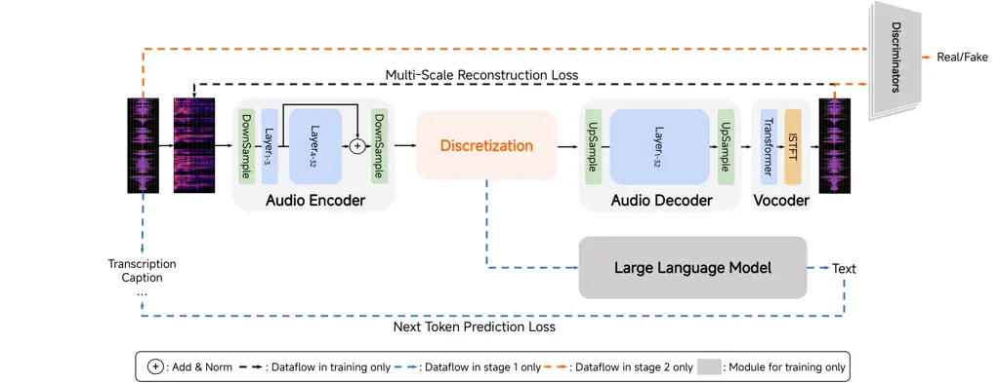

# MiMo-Audio: Audio Language Models are Few-Shot Learners

LLM-Core Xiaomi

###### Abstract

Existing audio language models typically rely on task-specific
fine-tuning to accomplish particular audio tasks. In contrast, humans
are able to generalize to new audio tasks with only a few examples or
simple instructions. GPT-3 has shown that scaling next-token prediction
pretraining enables strong generalization capabilities in text, and we
believe this paradigm is equally applicable to the audio domain. By
scaling MiMo-Audio’s pretraining data to over one hundred million of
hours, we observe the emergence of few-shot learning capabilities across
a diverse set of audio tasks. We develop a systematic evaluation of
these capabilities and find that MiMo-Audio-7B-Base achieves SOTA
performance on both speech intelligence and audio understanding
benchmarks among open-source models. Beyond standard metrics,
MiMo-Audio-7B-Base generalizes to tasks absent from its training data,
such as voice conversion, style transfer, and speech editing.
MiMo-Audio-7B-Base also demonstrates powerful speech continuation
capabilities, capable of generating highly realistic talk shows,
recitations, livestreaming and debates. At the post-training stage, we
curate a diverse instruction-tuning corpus and introduce thinking
mechanisms into both audio understanding and generation.
MiMo-Audio-7B-Instruct achieves open-source SOTA on audio understanding
benchmarks (MMSU, MMAU, MMAR, MMAU-Pro), spoken dialogue benchmarks (Big
Bench Audio, MultiChallenge Audio) and instruct-TTS evaluations,
approaching or surpassing closed-source models. Model checkpoints and
full evaluation suite are available at
[https://github.com/XiaomiMiMo/MiMo-Audio](https://github.com/XiaomiMiMo/MiMo-Audio).

Figure 1: Emergent behavior in pretraining and performance comparison
with SOTA models.

###### Contents

1.  1 Introduction
2.  2 Model Architecture
    1.  2.1 MiMo-Audio-Tokenizer
        1.  2.1.1 Architecture
        2.  2.1.2 Training
        3.  2.1.3 Evaluation
    2.  2.2 MiMo-Audio
        1.  2.2.1 Patch Encoder
        2.  2.2.2 Large Language Model
        3.  2.2.3 Patch Decoder
3.  3 Pre-Training
    1.  3.1 Data
        1.  3.1.1 Data Preprocessing
        2.  3.1.2 Data Labeling
        3.  3.1.3 Data Curation
    2.  3.2 Training
        1.  3.2.1 Understanding Training
        2.  3.2.2 Understanding-Generation Joint Training
    3.  3.3 Evaluation
        1.  3.3.1 Few-shot In-context Learning
        2.  3.3.2 Speech Continuation
    4.  3.4 Results
4.  4 Post-Training
    1.  4.1 Data
        1.  4.1.1 Audio Understanding
        2.  4.1.2 Speech Generation
        3.  4.1.3 Spoken Dialogue
    2.  4.2 Training
    3.  4.3 Evaluation
        1.  4.3.1 Audio Understanding
        2.  4.3.2 Spoken Dialogue
        3.  4.3.3 Speech Recognition and Generation
    4.  4.4 Results
5.  5 Conclusion
6.  6 Limitations and Future Work
7.  References
8.  A Contributions and Acknowledgments

## 1 Introduction

Human speech interaction is characterized by its remarkable flexibility
and diversity. Individuals form their understanding of speech by
integrating a wide array of contextual factors—such as speakers,
accents, environments, and social settings, while simultaneously
modulating their own vocal expressions, like tone and prosody, in
accordance with their internal states, such as mood, intent, and
physical condition (Sumner, 2011; Lehet and Holt, 2020; Bradlow and
Bent, 2008). This adaptive capability is swift and dynamic, for example,
humans naturally lower their voice in a quiet library or raise it during
a heated debate as circumstances change. In contrast, existing audio
language models lack this inherent vocal intelligence and
generalizability in comprehension and generation (Zhang et al., 2023a;
Défossez et al., 2024; KimiTeam et al., 2025; Wu et al., 2025). To
perform a range of speech tasks, including spoken dialogue, speech
translation, and voice style transfer, these models still rely on being
fine-tuned with task-specific datasets.

The success of GPT-3 (Brown et al., 2020b) has proven that scaling up
pre-training with next-token prediction paradigm is a viable path to
achieving task generalization in the text domain. We hypothesize that
this principle extends to the speech domain, where pre-training on
massive-scale speech corpora using next-token prediction objective can
endow a model with strong generalization abilities across a wide range
of speech tasks. While prior efforts have explored next-token prediction
pretraining for speech (Borsos et al., 2023; Zhang et al., 2023a;
Défossez et al., 2024; Zeng et al., 2024; Li et al., 2025), these models
fail to achieve broad, general-purpose generalization for general speech
tasks (Fang et al., 2025; Xu et al., 2025; KimiTeam et al., 2025; Wu et
al., 2025; Goel et al., 2025).

We believe there are two critical aspects for next-token prediction
pre-training in speech. The first is an architecture that enables the
lossless flow of speech information. To fully leverage the potential of
the next-token prediction paradigm, we hope all information within the
speech signal to circulate through the model. This implies that we
cannot use speech representations that incur a loss of paralinguistic
information, which distinguishes our approach from current mainstream
solutions (Zeng et al., 2024; KimiTeam et al., 2025; Wu et al., 2025).
The second aspect is scaling up. We believe that continuously scaling
the volume of pre-training data will lead to sustained performance
improvements and unexpected emergent abilities (Wei et al., 2022a).
Therefore, we scaled our training data to over one hundred of millions
of hours, which is an order of magnitude larger than the data used for
the largest existing open-source speech models. The objective of this
pre-training is to equip the model with task generalization capabilities
in the speech domain, meaning the model develops a broad set of atomic
skills at training time, and then uses those abilities at inference time
to rapidly adapt to or recognize any speech task. Our guiding principle
for the pre-training method is to ensure that all information from the
speech signal is preserved and flows through the model architecture.

- •
  Tokenizer: We posit that the foremost criterion for an audio tokenizer
  is its reconstruction fidelity, and that its tokens should be amenable
  to downstream language modeling. Accordingly, we introduce
  MiMo-Audio-Tokenizer. This 1.2B-parameter model employs a
  Transformer-based architecture comprising an encoder, a discretization
  layer, and a decoder, operating at a 25Hz frame rate and generating
  200 tokens per second through 8 layers of residual vector quantization
  (RVQ). By integrating semantic and reconstruction objectives, we
  trained it from scratch on a 10-million-hour corpus, achieving
  superior performance in reconstruction quality and facilitating
  downstream language modeling.
- •
  Architecture: To enhance the modeling efficiency for high-token-rate
  (200 tokens/second) sequences and mitigate the length disparity
  between speech and text modalities, we propose a novel architecture
  combining a patch encoder, LLM, and patch decoder. The patch encoder
  aggregates four consecutive timesteps of RVQ tokens into a single
  patch, downsampling the sequence to a 6.25Hz representation for the
  LLM. Subsequently, the patch decoder autoregressively generates the
  full 25Hz RVQ token sequence.
- •
  Training: To realize a unified pre-training paradigm for both
  understanding and generation and to endow the model with advanced
  vocal intelligence, we devise a two-stage training strategy,
  leveraging MiMo-7B-Base (Xiaomi, 2025) for initialization. Stage 1 is
  dedicated to speech understanding, while stage 2 integrates both
  understanding and generation in a unified framework. Each stage
  features tailored training tasks. Notably, we observed the spontaneous
  emergence of in-context learning abilities for speech during this
  process.
- •
  Data: We have scaled our pre-training corpus to an unprecedented over
  100 million hours of speech data, representing an order-of-magnitude
  increase over any existing open-source speech model. This was
  supported by a purpose-built, end-to-end data pipeline for
  pre-processing, annotation, and curation.
- •
  Evaluation: We have developed a comprehensive benchmark to rigorously
  assess the model’s in-context learning capabilities in the speech
  domain. The benchmark is designed to evaluate multiple facets,
  including modality-invariant general knowledge, auditory comprehension
  and reasoning, and a diverse suite of speech-to-speech generation
  tasks.

After large-scale pre-training, MiMo-Audio-7B-Base demonstrates strong
few-shot learning capabilities (Brown et al., 2020a). It exhibits very
high "Speech Intelligence" and strong modality alignment when evaluated
on our constructed SpeechMMLU, which originates from MMLU (Hendrycks et
al., 2021) and is built by synthesizing its tasks into speech.
MiMo-Audio-7B-Base achieves superior performance under speech input and
output, with results closely approaching text-based MMLU, and incurs
only a minor degradation in text performance. It also shows excellent
generalization to unseen tasks: with just a few demonstrations in the
context, it can perform tasks such as voice conversion, style transfer,
speech rate control, denoising, and speech translation. Furthermore,
MiMo-Audio-7B-Base displays powerful speech continuation abilities,
generating highly realistic and semantically coherent monologues or
multi-speaker dialogues in formats like talk shows, speeches, debates,
podcasts, and game commentaries.

We believe the core objective of post-training is to align the model’s
pre-trained generalization capabilities with instruction-following
abilities. To this end, we construct a highly diverse instruction-tuning
corpus for audio understanding and generation by aggregating
high-quality open-source and in-house data spanning multiple domains. To
further enhance the model’s cross-modal reasoning abilities, we also
created high-quality "thinking" (Wei et al., 2022b, chain-of-thought;)
data for both audio understanding and generation tasks. To obtain
human-like and style-controllable speech dialogue data, we trained
MiMo-TTS-7B on over 7 million hours of data to convert text-based
conversations into speech. MiMo-Audio-7B-Instruct demonstrates superior
audio understanding and reasoning abilities after post-training. It
achieves SOTA results among open-source models on audio
understanding/reasoning benchmarks such as MMSU (Wang et al., 2025),
MMAU (Sakshi et al., 2025), MMAR (Ma et al., 2025), and MMAU-Pro (Kumar
et al., 2025), approaching or surpassing the performance of
closed-source models. MiMo-Audio-7B-Instruct also shows exceptional
speech intelligence and instruction-following capabilities,
significantly outperforming other open-source models on spoken dialogue
benchmarks like Big Bench Audio and MultiChallenge Audio (Sirdeshmukh et
al., 2025). In instruction-following TTS tasks, its performance is
comparable to that of GPT-4o-mini-tts.

Our key contributions are:

- •
  We present the first empirical evidence that scaling lossless,
  compression-based speech pre-training to an unprecedented 100 million
  hours unlocks emergent task generalization, exemplified by powerful
  few-shot learning abilities. We argue this represents a "GPT-3 moment"
  for the speech domain.
- •
  We propose the first comprehensive and replicable blueprint for
  generative speech pre-training, which includes a novel tokenizer, a
  scalable architecture, a phased training strategy, and a holistic
  evaluation suite.
- •
  We pioneer the integration of thinking into the modeling process for
  both speech understanding and generation, bridging the gap between
  perception and complex cognitive tasks.

## 2 Model Architecture

### 2.1 MiMo-Audio-Tokenizer

A main challenge in existing audio tokenization methods lies in
effectively balancing the inherent trade-off between semantic and
acoustic information in audio signals. Semantic tokens, typically
derived from self-supervised learning models (Hsu et al., 2021; Chung et
al., 2021; Zhang et al., 2023c) or ASR models (Zeng et al., 2024; Li et
al., 2025), exhibit a strong correlation with linguistic content,
facilitating alignment with the text modality. However, their primary
drawback is the loss of fine-grained acoustic information, which
constrains the quality of raw waveform reconstruction. In contrast,
acoustic tokens generated by neural audio codecs (Zeghidour et al.,
2021; Défossez et al., 2022a) enable high-fidelity audio reconstruction
but struggle to establish effective alignment with the text semantic
space.

To jointly capture both semantic and acoustic information, prior works
such as SpeechTokenizer (Zhang et al., 2023b) and Mimi (Défossez et al., 2024) have attempted to incorporate semantic distillation strategies
into neural audio codecs to obtain unified audio tokens. Nevertheless,
constrained by the limited scale of their encoders, these methods
struggle to fully mitigate the conflict between semantic and acoustic
information and their semantic expressiveness remains inferior to
semantic tokens. Other approaches, like X-Codec (Ye et al., 2025a) and
XY-Tokenizer (Gong et al., 2025), employ a dual-stream architecture with
separate semantic and acoustic encoders to alleviate these issues.
However, these methods still rely on pre-trained semantic models, and
their dual-encoder architecture results in semantic and acoustic
information originating from separate representation spaces.

To address these limitations, we propose MiMo-Audio-Tokenizer, a unified
tokenizer trained from scratch that is capable of both capturing
semantic information and enabling high-fidelity audio reconstruction. By
scaling up the model’s parameters and training data,
MiMo-Audio-Tokenizer further alleviates the semantic-acoustic
representation conflict, thereby enhancing both cross-modal alignment
and speech reconstruction quality.



Figure 2: Illustration of MiMo-Audio-Tokenizer framework.

#### 2.1.1 Architecture

As illustrated in Figure 2, the architecture of MiMo-Audio-Tokenizer
comprises four main components: an audio encoder, a discretization
module, an audio decoder and a vocoder. The audio encoder is composed of
a central Transformer encoder with bidirectional attention, bracketed by
$`2\times`$ downsampling layers at the input and output. The central
encoder consists of 32 layers with 20 attention heads, employing Rotary
Position Embeddings (Su et al., 2024, RoPE;) and GELU activations
(Hendrycks and Gimpel, 2016). We set the model dimension to 1280 and the
FFN inner dimension to 5120. To mitigate the conflict between semantic
and acoustic information, we add the layer-3 hidden states to the
final-layer output via element-wise summation. The discretization module
has a 20-layer Residual Vector Quantizer (van den Oord et al., 2018;
Zeghidour et al., 2021, RVQ;), where the first two layers have a
codebook size of 1024, and the remaining layers use a size of 128. The
audio decoder adopts a mirror structure to the encoder but employs
causal self-attention to support streaming generation. The vocoder
follows the Vocos design (Siuzdak, 2024) but replaces the ConvNeXt (Liu
et al., 2022) backbone with a Transformer, enabling sequence packing for
more efficient training. The Transformer has 16 layers, 16 heads, a
model dimension of 256, an FFN dimension of 1024. It incorporates RoPE
and sliding window attention with window sizes of \[40, 10\], which
provides the Vocoder with receptive fields of \[6.4s, 1.6s\].

Given a single-channel audio waveform $`X`$ sampled at 24 kHz, we first
convert it into a mel-spectrogram with a frame rate of 100 Hz. This
spectrogram is then fed into the audio encoder, which transforms it into
a sequence of continuous representations of length $`M`$ at 25 frame
rate. The RVQ within the discretization module subsequently quantizes
these continuous representations into a 2D matrix of discrete indices
$`A\in\mathbb{N}^{M\times R}`$, where $`R`$ is the number of RVQ layers.
These indices are then used to reconstruct the quantized representation
$`\mathbf{Q}`$ by looking up and summing the corresponding embeddings
from the codebooks. Finally, the audio decoder and the vocoder
reconstruct the audio waveform $`\hat{X}`$ from $`\mathbf{Q}`$.

#### 2.1.2 Training

Inspired by Wu et al. (2023), we employ a two-stage training paradigm to
enhance training efficiency as depicted in Figure 2. In stage 1, the
model undergoes multi-task learning on a large-scale dataset.
Specifically, we scale up the training data to over 11 million hours.
This extensive training enables the model to jointly encode both
semantic and acoustic information. In stage 2, the parameters of the
audio encoder and discretization module are frozen. Discriminators are
introduced to train the audio decoder and vocoder, focusing on improving
the reconstruction of fine-grained details in the original audio
waveform and eliminating vocoding artifacts.

##### Unified Representation Learning

In stage 1, we combine the audio reconstruction task and the
audio-to-text (A2T) task to align the representation spaces of audio and
text while ensuring the preservation of acoustic information. To provide
supervision for the A2T objective, we introduce an LLM that is jointly
trained with MiMo-Audio-Tokenizer. All parameters of
MiMo-Audio-Tokenizer and LLM are trained from scratch. We formulate the
A2T objective as a next-token prediction loss applied to the LLM’s text
output, defined as:

```math
\displaystyle\mathcal{L}_{\text{A2T}}=-\sum_{i=1}^{N}\log{p(t_{i}|\tilde{\mathbf{Q}},t_{1},\dots,t_{i-1})}, \tag{1}
```

where $`T=[t_{1},\dots,t_{N}]`$ is the target text sequence,
$`\tilde{\mathbf{Q}}`$ is the quantized audio representation, and $`N`$
is the total length of the text sequence.

For the audio reconstruction task, we adopt a multi-scale
mel-spectrogram reconstruction loss, defined as the $`L1`$ distance:

```math
\displaystyle\mathcal{L}_{\text{recon}}=\sum_{i\in e}\lVert\mathcal{S}_{i}(X)-\mathcal{S}_{i}(\hat{X})\lVert_{1}, \tag{2}
```

where $`\mathcal{S}_{i}`$ denotes the mel-spectrogram at scale $`i`$
with $`2^{i}`$ bins, computed using a normalized Short-Time Fourier
Transform (STFT) with a window size of $`15\cdot 2^{i-1}`$ and a hop
length of $`15\cdot 2^{i-2}`$. The set of scales is defined as
$`e=\{5,6,7\}`$. Finally, including the commitment loss
$`\mathcal{L}_{\text{commit}}`$ from the discretization module, the
total loss for stage 1 is a weighted sum:

```math
\displaystyle\mathcal{L}_{\text{stage1}}=\lambda_{\text{A2T}}\mathcal{L}_{\text{A2T}}+\lambda_{\text{recon}}\mathcal{L}_{\text{recon}}+\lambda_{\text{commit}}\mathcal{L}_{\text{commit}}, \tag{3}
```

where
$`\lambda_{\mathrm{A2T}}{=}10.0,\;\lambda_{\mathrm{recon}}{=}1.0,\;\lambda_{\mathrm{commit}}{=}1.0`$.

##### Adversarial Fine-tuning

In stage 2, we introduce additional discriminators for adversarial
training to improve waveform reconstruction quality. During this stage,
all parameters involved in the audio tokenization process are frozen to
preserve the semantic structure of the audio token space. We adopt a
multitask GAN training recipe that jointly optimizes (i) a
mel-spectrogram reconstruction loss from stage 1, (ii) an adversarial
loss, and (iii) a discriminator feature-matching loss. To provide
supervision in both the time and frequency domains, we employ a
Multi-Period Discriminator (Kong et al., 2020, MPD;) together with a
Multi-Scale STFT discriminator (Défossez et al., 2022b, MS-STFT;). We
adopt the Hinge-GAN (Lim and Ye, 2017; Miyato et al., 2018) training
framework, applying spectral normalization to all discriminator layers
and disabling weight decay during discriminator training. Let
$`\mathcal{D}=\{D_{k}\}_{k=1}^{K}`$ denote the full set of
sub-discriminators across MPD and MS-STFT. Given a real waveform $`X`$
and a generated waveform $`\hat{X}`$, the discriminator objective can be
formulated as

```math
\mathcal{L}_{D}=\frac{1}{K}\sum_{k=1}^{K}\Big[\mathbb{E}_{X}\big[\max(0,\,1-D_{k}(X))\big]+\mathbb{E}_{\hat{X}}\big[\max(0,\,1+D_{k}(\hat{X}))\big]\Big], \tag{4}
```

and the generator adversarial objective is

```math
\tilde{\mathcal{L}}_{\mathrm{adv}}=-\,\frac{1}{K}\sum_{k=1}^{K}\mathbb{E}_{\hat{X}}\big[D_{k}(\hat{X})\big], \tag{5}
```

where the normalization by $`\tfrac{1}{K}`$ prevents the number of
sub-discriminators from dominating the optimization. For feature
matching, we minimize the $`\ell_{1}`$ distance between intermediate
discriminator activations:

```math
\mathcal{L}_{\mathrm{fm}}=\frac{1}{K}\sum_{k=1}^{K}\frac{1}{L_{k}}\sum_{\ell=1}^{L_{k}}\big\|f_{k,\ell}(X)-f_{k,\ell}(\hat{X})\big\|_{1}, \tag{6}
```

where $`f_{k,\ell}(\cdot)`$ returns the $`\ell`$-th–layer features of
$`D_{k}`$, and $`L_{k}`$ denotes the number of intermediate layers
included. When forming the composite objective, we assign fixed weights
to the individual losses to keep their gradient magnitudes on comparable
scales. The generator is trained with

```math
\mathcal{L}_{G}=\lambda_{\mathrm{recon}}\,\mathcal{L}_{\mathrm{recon}}+\lambda_{\mathrm{adv}}\,\tilde{\mathcal{L}}_{\mathrm{adv}}+\lambda_{\mathrm{fm}}\,\mathcal{L}_{\mathrm{fm}},\quad \tag{7}
```

where
$`\lambda_{\mathrm{recon}}{=}1.0,\;\lambda_{\mathrm{adv}}{=}1.0,\;\lambda_{\mathrm{fm}}{=}2.0`$.

#### 2.1.3 Evaluation

##### Settings

We assess the preservation of acoustic information in audio tokenization
with multiple metrics. These include: Speaker Similarity (SIM),
calculated as the cosine similarity of embeddings from a pre-trained
speaker verification model¹¹ 1
[https://github.com/microsoft/UniSpeech/tree/main/downstreams/speaker_verification](https://github.com/microsoft/UniSpeech/tree/main/downstreams/speaker_verification);
Short-Time Objective Intelligibility (Taal et al., 2010, STOI;); and
Perceptual Evaluation of Speech Quality (Rix et al., 2001, PESQ;). All
evaluations are conducted on the ground-truth recordings of
Seed-TTS-Eval (Anastassiou et al., 2024). The compared baselines include
GLM-4-Voice-Tokenizer (Zeng et al., 2024), Baichuan-Audio-Tokenizer (Li
et al., 2025), XY-Tokenizer (Gong et al., 2025), Mimi (Défossez et al.,
2024), XCodec (Ye et al., 2025b), and BigCodec (Xin et al., 2024).
Considering our downstream MiMo-Audio is trained exclusively on audio
tokens produced by the first eight codebooks of MiMo-Audio-Tokenizer, we
evaluate and compare waveform reconstruction quality decoded using only
those codebooks. This protocol faithfully reflects the fidelity of the
audio accessible to the downstream language model. We evaluate Mimi
under the same protocol for consistency.

##### Results

As shown in Table 1, MiMo-Audio-Tokenizer delivers strong reconstruction
quality on Seed-TTS-Eval. Across both ZH and EN splits, it achieves the
highest scores on PESQ-NB/WB, SIM, and STOI, substantially outperforming
all baselines at a comparable bitrate. Crucially, these gains are
measured exactly on the codebooks used for downstream modeling,
indicating that MiMo-Audio preserves the full fidelity of speech
information, which in turn yields strong generalization across diverse
speech tasks.

|                          |       |          |          |          |          |          |          |          |          |
| ------------------------ | ----- | -------- | -------- | -------- | -------- | -------- | -------- | -------- | -------- |
|                          |       | SEED-ZH  |          |          |          | SEED-EN  |          |          |          |
| System                   | kBPS  | PESQ-NB  | PESQ-WB  | SIM      | STOI     | PESQ-NB  | PESQ-WB  | SIM      | STOI     |
| MiMo-Audio-Tokenizer     | 1.55  | 3.30     | 2.71     | 0.89     | 0.93     | 3.02     | 2.43     | 0.85     | 0.92     |
| GLM-4-Voice-Tokenizer    | 0.175 | $`1.11`$ | $`1.06`$ | $`0.33`$ | $`0.61`$ | $`1.11`$ | $`1.05`$ | $`0.12`$ | $`0.60`$ |
| Baichuan-Audio-Tokenizer | 1.0   | $`2.37`$ | $`1.84`$ | $`0.78`$ | $`0.86`$ | $`2.11`$ | $`1.62`$ | $`0.69`$ | $`0.85`$ |
| XY-Tokenizer             | 1.0   | $`2.88`$ | $`2.24`$ | $`0.87`$ | $`0.90`$ | $`2.69`$ | $`2.14`$ | $`0.82`$ | $`0.90`$ |
| Mimi                     | 1.1   | $`2.57`$ | $`2.05`$ | $`0.73`$ | $`0.88`$ | $`2.60`$ | $`2.07`$ | $`0.74`$ | $`0.89`$ |
| XCodec2.0                | 0.8   | $`2.69`$ | $`2.10`$ | $`0.81`$ | $`0.89`$ | $`2.57`$ | $`2.01`$ | $`0.78`$ | $`0.89`$ |
| BigCodec                 | 1.04  | $`2.88`$ | $`2.26`$ | $`0.80`$ | $`0.91`$ | $`2.80`$ | $`2.22`$ | $`0.80`$ | $`0.91`$ |

Table 1: Evaluation of audio tokenizers on Seed-TTS-Eval dataset. ZH/EN
split results are reported in the same row for each system. kBPS denotes
the effective bitrate (kilobits per second) of the tokenized audio
stream.

### 2.2 MiMo-Audio

Figure 3: Model architecture of MiMo-Audio.

MiMo-Audio is a unified generative audio-language model that jointly
models sequences of text and audio tokens, as illustrated in Figure 3.
The model accepts both text and audio tokens as input and
autoregressively predicts either text or audio tokens, thereby
supporting a comprehensive range of tasks involving arbitrary
combinations of text and audio modalities.

Formally, let $`T=[t_{1},\ldots,t_{N}]`$ denote the text sequence and
the audio token sequence be defined as:

```math
\displaystyle A=[A_{1},\ldots,A_{M}],\qquad A_{i}\triangleq(a_{i,1},\ldots,a_{i,R^{\prime}}), \tag{8}
```

where $`N`$ denotes the text sequence length, $`M`$ the audio sequence
length, and $`R^{\prime}=8`$ the number of RVQ codebooks used for LLM
training. Since audio sequences have relatively low information density,
individual audio frames convey much less information than text tokens.
To mitigate this mismatch in granularity across modalities and
facilitate cross-modal knowledge transfer, we partition the audio
sequence into contiguous groups of $`G`$ frames, forming audio patches:

```math
\displaystyle P=[P_{1},\ldots,P_{M/G}],\qquad P_{i}=[A_{(i-1)G+1},\ldots,A_{iG}]. \tag{9}
```

The input to MiMo-Audio is the interleaved sequence of text tokens and
audio patches. Let $`S=[s_{1},\ldots,s_{L}]`$ denote the interleaved
sequence, where each element $`s_{i}`$ is either a text token or an
audio patch. The model is trained autoregressively:

```math
\displaystyle p(S)=\prod_{i=1}^{L}p(s_{i}|s_{1},\dots,s_{i-1}), \tag{10}
```

where $`p(s_{i}|s_{1},\dots,s_{i-1})`$ represents next-token prediction
when $`s_{i}`$ is a text token or next-patch prediction when $`s_{i}`$
is an audio patch. This unified modeling approach enables seamless
handling of arbitrary text-audio interleaved sequences. MiMo-Audio
comprises three primary components: a patch encoder, an LLM backbone,
and a patch decoder, which we describe in detail below.

#### 2.2.1 Patch Encoder

The patch encoder transforms audio tokens within each patch into a
single hidden vector. We maintain $`R^{\prime}`$ distinct embedding
tables $`\{E_{r}\}_{r=1}^{R^{\prime}}`$ that map audio tokens to their
corresponding embedding vectors. For each audio token $`a_{i,r}`$, we
obtain its embedding as $`\mathbf{e}_{i,r}=E_{r}(a_{i,r})`$. The
embeddings across all RVQ codebooks for frame $`i`$ are aggregated to
form a unified representation:

```math
\displaystyle\mathbf{e}_{i}=\sum_{r=1}^{R^{\prime}}\mathbf{e}_{i,r}. \tag{11}
```

The resulting sequence within each patch is processed by a Transformer
encoder with $`L_{\mathrm{enc}}=6`$ layers. Each layer has a hidden
dimension of 1024, 64 attention heads, and an FFN dimension of 4096. The
encoder employs bidirectional self-attention, which enables the model to
capture local contextual information across frames. The outputs from all
frames within the patch are subsequently concatenated and projected
through a linear transformation layer to match the input dimensionality
of the LLM.

#### 2.2.2 Large Language Model

We employ MiMo-7B-Base (Xiaomi, 2025) as the LLM backbone. The model
accepts inputs at each position as either text token embeddings or audio
patch representations produced by the patch encoder. The resulting
hidden states can be processed through an output projection layer for
text token prediction or fed to the patch decoder for audio patch
generation, as described in the subsequent section.

#### 2.2.3 Patch Decoder

The patch decoder autoregressively generates audio tokens within each
patch during audio generation. It comprises $`L_{\mathrm{dec}}=16`$
Transformer layers, each with a hidden dimension of 1024, 64 attention
heads, and an FFN dimension of 4096. The decoder employs causal masking
in the self-attention mechanism. The patch decoder employs the same
$`R^{\prime}`$ embedding tables as the patch encoder, one for each RVQ
codebook. To facilitate RVQ token generation, the Transformer is
equipped with $`R^{\prime}`$ independent output heads, each dedicated to
predicting tokens for a specific RVQ codebook.

Formally, given a hidden state $`\mathbf{h}`$ from the LLM, let
$`P=[A_{1},\ldots,A_{G}]`$ denote the audio patch to be generated. The
naive approach involves autoregressive generation of audio frames within
each patch along the temporal dimension:

```math
\displaystyle p(P|\mathbf{h})=\prod_{i=1}^{G}p(A_{i}|\mathbf{h},A_{1},\dots,A_{i-1}), \tag{12}
```

where the probability for each frame $`A_{i}`$ decomposes across the
$`R^{\prime}`$ codebooks:

```math
\displaystyle p(A_{i}|\mathbf{h},A_{1},\dots,A_{i-1})=\prod_{r=1}^{R^{\prime}}p(a_{i,r}|\mathbf{h},A_{1},\dots,A_{i-1}). \tag{13}
```

However, due to dependencies between tokens across different RVQ layers,
predicting all RVQ tokens simultaneously at each time step is
challenging and often leads to poor audio generation quality. To
mitigate this limitation, we introduce a delay mechanism for audio token
generation, inspired by Copet et al. (2023). Specifically, we introduce
layer-specific delays $`D=[d_{1},\ldots,d_{R^{\prime}}]`$, where
$`d_{r}`$ represents the delay (in time steps) for generating tokens at
RVQ layer $`r`$. The delayed audio patch is formalized as:

```math
\displaystyle P^{\prime}=[A^{\prime}_{1},\ldots,A^{\prime}_{G+\max(D)}], \tag{14}
```

where

```math
\displaystyle a^{\prime}_{i,r}=\begin{cases}a_{i-d_{r},r}&\text{if }1\leq i-d_{r}\leq G\\
0&\text{otherwise}\end{cases} \tag{15}
```

for $`i\in[1,G+\max(D)]`$ and $`r\in[1,R^{\prime}]`$. Here, 0 denotes an
empty token that is disregarded during both encoding and decoding
processes. The patch decoder models these delayed audio patches
autoregressively following the aforementioned formulation and maintains
the delay pattern during the decoding phase. We list the detailed model
configuration in Table 2.

|                    |                                   |       |               |
| ------------------ | --------------------------------- | ----- | ------------- |
| Hyper-parameter    | Patch Encoder                     | LLM   | Patch Decoder |
| Model Architecture |                                   |       |               |
| model dimension    | 1024                              | 4096  | 1024          |
| FFN dimension      | 4096                              | 11008 | 4096          |
| attention heads    | 64                                | 32    | 64            |
| number of layers   | 6                                 | 36    | 16            |
| context length     | 4                                 | 8192  | 11            |
| Input/Output Space |                                   |       |               |
| text vocab size    | 151680                            |       |               |
| audio channels     | 8                                 |       |               |
| audio vocab sizes  | 1024-1024-128-128-128-128-128-128 |       |               |
| audio frame rate   | 6.25 Hz                           |       |               |

Table 2: Model architecture and Input/Output space configuration.

## 3 Pre-Training

### 3.1 Data

Our pre-training corpus consists of unimodal data (text-only and
speech-only) and multimodal data (speech–text). The construction
procedure for the text-only corpus is described in MiMo (Xiaomi, 2025).
For the speech modality, the objective is to provide the model with
large-scale, high-quality, and diverse audio data. To this end, we
developed a comprehensive data pipeline that integrates data collection,
automated processing, multi-dimensional annotation, and quality control.

#### 3.1.1 Data Preprocessing

Our pre-training data contains hundreds of millions of hours of
In-the-wild audio data, and we ensure the data’s diversity in terms of
source and content.

- •
  Source Diversity: The data covers a variety of sources, such as public
  podcasts, audiobooks, news broadcasts, interviews, and conference
  recordings. This multi-source, heterogeneous data combination ensures
  the model will not be biased towards specific recording environments
  or speaking styles.
- •
  Content Diversity: The data covers topic areas such as daily
  communication, entertainment media, business and entrepreneurship,
  arts and culture, and scientific research. This enables the model to
  learn about rich knowledge domains.

To transform large-scale raw audio into high-quality training data, we
designed and implemented an efficient and scalable automated pipeline,
inspired by previous work (Yu et al., 2023; He et al., 2024; Kang et
al., 2024; Song et al., 2024). The pipeline incorporates modules such as
audio normalization, speaker diarization, voice activity detection
(VAD), automatic speech recognition (ASR), and audio quality assessment.

#### 3.1.2 Data Labeling

To accurately evaluate and filter the pre-training data, we built an
automated annotation system covering semantic and non-semantic
dimensions to generate rich, structured attribute labels for each piece
of data.

- •
  Semantic Dimension: Based on the transcription results from modules
  like ASR, we built a text quality assessment model. This model can
  score the semantic value of the content from multiple dimensions such
  as conversational quality, knowledge density, and logical reasoning.
- •
  Non-semantic Dimension: To obtain non-semantic level information, we
  trained an audio captioning model. This model can directly generate
  rich natural language descriptions for the audio (such as non-semantic
  information like timbral characteristics, emotional style, and
  background environment).

This dual-dimension annotation method not only measures data quality but
also endows the corpus with more fine-grained attribute information,
thereby supporting more efficient and targeted filtering and training.

#### 3.1.3 Data Curation

On the basis of multi-dimensional data annotation, we conducted rigorous
filtering and sampling of the data.

- •
  Low-Quality Data Filtering: According to preset quality thresholds, we
  removed segments containing excessive noise, low-quality, and unsafe
  content, ensuring the reliability of the final corpus.
- •
  High-Quality Data Sampling: We integrated scoring metrics from
  semantic and non-semantic dimensions and designed a sampling strategy
  to ensure the model can learn efficiently from the high-quality
  corpus.

### 3.2 Training

|                    |                   |                          |                      |
| ------------------ | ----------------- | ------------------------ | -------------------- |
| Hyper-parameter    | Pre-training      |                          | Post-training        |
|                    | Understanding     | Understanding-Generation |                      |
| LR (Patch Encoder) | 2e-4              | 2e-4                     | 5e-5                 |
| LR (LLM)           | 3e-5              | 3e-5                     | 1e-5                 |
| LR (Patch Decoder) | \-                | 2e-4                     | 5e-5                 |
| LR scheduler       | constant          | cosine                   | cosine               |
| batch size         | 16.8M tokens      | 16.8M tokens             | 2.1M tokens          |
| warmup ratio       | 0.01              | 0.01                     | 0.01                 |
| loss weights       | 1-0-0-0-0-0-0-0-0 | 100-12-8-6-4-2-2-1-1     | 100-12-8-6-4-2-2-1-1 |
| delay patterns     | \-                | 0-1-2-3-4-5-6-7          | 0-1-2-3-4-5-6-7      |

Table 3: Training configuration across different stages. LR stands for
learning rate.

Our training starts from the MiMo-7B-Base model. To maximally preserve
its text capabilities while simultaneously equipping the model with
speech understanding and generation abilities, MiMo-Audio employs a
progressive, two-stage pre-training method.

#### 3.2.1 Understanding Training

In the first stage, we train the model’s patch encoder and LLM
components. This stage aims to enable the model to master speech
understanding capabilities. We constructed a dataset of 2.6T tokens in
total, consisting of 1.2T text tokens and 1.4T speech-related tokens
(calculated at a 6.25Hz speech frame rate). The data includes four task
formats: speech-text interleaved data, ASR data, general audio
captioning data, and text-only pre-training data. During this stage, we
only compute the loss on the text tokens. As detailed in the Table 3,
the learning rate for the patch encoder is 2e-4, while the LLM’s
learning rate is 3e-5, with a constant learning rate scheduler. Each
batch contains 16.8M tokens, and the training context length is 8192.

#### 3.2.2 Understanding-Generation Joint Training

In the second stage, we train all parameters of the model, including the
patch encoder, LLM, and patch decoder. This stage is designed to provide
the model with an integrated capability for both speech understanding
and generation. The training dataset has 5T tokens, comprising 2.6T text
tokens and 2.4T audio tokens (calculated at a 6.25Hz speech frame rate).
This includes seven task formats: speech continuation, speech-text
interleaved data, ASR, TTS, general audio captioning,
instruction-following TTS, and text pre-training data. For tasks that
require speech generation, such as speech continuation or generating the
speech segments within speech-text interleaved and TTS data, we employ a
text-guided interleaving generation strategy to improve speech
generation quality. Specifically, the model interleaves text tokens and
speech patches in a fixed 5:5 ratio. Once text generation is complete,
the model generates the remaining speech tokens until completion. In
this stage, we compute the loss on both text and audio tokens. The loss
weight for text tokens is 100, while the weights for the respective RVQ
tokens are 12, 8, 6, 4, 2, 2, 1, and 1. As shown in the Table 3, the
learning rate for the patch encoder and decoder is 2e-4, the LLM’s
learning rate is 3e-5, and the learning rate scheduler follows a cosine
decay. The batch size and context length remain consistent with Stage 1.

### 3.3 Evaluation

We evaluate MiMo-Audio-7B-Base using two types of evaluation: few-shot
in-context learning evaluation and speech continuation evaluation.

#### 3.3.1 Few-shot In-context Learning

To systematically assess the overall capabilities of MiMo-Audio-7B-Base
after large-scale pretraining, we follow the GPT-3–style evaluation
paradigm (Brown et al., 2020a) and adopt a few-shot in-context learning
protocol for speech–text competence along three dimensions:
modality-invariant general knowledge, auditory comprehension and
reasoning, and speech-to-speech generation. Table 4 provides an overview
of our few-shot in-context learning evaluation setup.

##### Modality-Invariant General Knowledge

We define modality-invariant general knowledge as the ability to access
and express the same underlying knowledge regardless of input or output
modality. To assess this across speech and text, we construct
SpeechMMLU²² 2
[https://huggingface.co/datasets/XiaomiMiMo/SpeechMMLU](https://huggingface.co/datasets/XiaomiMiMo/SpeechMMLU)
by synthesizing the questions and options from the MMLU dataset
(Hendrycks et al., 2021) into speech while preserving their semantic
content. The dataset is filtered by subject and length, resulting in a
total of 8,549 entries across 34 subjects. We use a commercial TTS
system with diverse voices for the synthesis. It consists of four
parallel splits, enabling same-question cross-modal controls for
evaluating knowledge across text-to-text, speech-to-text,
text-to-speech, and speech-to-speech scenarios.

- •
  Text-to-Text (T2T): Serves as a metric for retention of text
  capability and shows whether competence gained from text pretraining
  are diluted by speech–text pretraining; it also provides an
  upper-bound reference for speech performance.
- •
  Speech-to-Text (S2T): Compared with T2T, S2T quantifies the
  cross-modal cost of mapping a spoken question to its semantic form
  while producing a text answer on general-knowledge items.
- •
  Text-to-Speech (T2S): Relative to T2T, T2S probes the consistency and
  controllability of converting semantic content to spoken output on
  general-knowledge items.
- •
  Speech-to-Speech (S2S): S2S provides a comprehensive measure of the
  model’s integrated potential for end-to-end speech interaction on
  general-knowledge by completing the listen–think–speak loop.

|                     |                  |                |                 |            |
| ------------------- | ---------------- | -------------- | --------------- | ---------- |
| Capabilities        | Dataset          | Input Modality | Output Modality | \#Examples |
| General Knowledge   | SpeechMMLU       | Text           | Text            | 5          |
|                     |                  | Speech         | Text            | 5          |
|                     |                  | Text           | Speech          | 5          |
|                     |                  | Speech         | Speech          | 5          |
| Audio Understanding | MMAU             | Audio+Text     | Text            | 5          |
| Speech-to-Speech    | Refer to Table 5 | Speech         | Speech          | 16         |

Table 4: Settings of few-shot in-context learning evaluation.

##### Auditory Comprehension and Reasoning

While the S2T split of SpeechMMLU evaluates the model’s ability to
recover semantics from speech and answer general-knowledge questions, it
offers limited coverage of non-semantic auditory factors. To fully
characterize MiMo-Audio’s upper bound in auditory understanding after
large-scale speech–text pretraining, we extend the evaluation beyond
basic semantic understanding to additional dimensions of the acoustic
world. Accordingly, we assess the model on the MMAU test suite (Sakshi
et al., 2024) under a few-shot in-context learning setup. MMAU comprises
audio information extraction and reasoning QA across three domains:
speech, environmental sounds, and music.

##### Speech-to-Speech Generation

MiMo-Audio represents speech with high-fidelity audio tokens that serve
as a unified interface for perception and generation, thereby casting
pretraining as high-fidelity compression over large-scale speech
corpora. We hypothesize that sufficiently effective compression induces
in-context learning ability that naturally generalizes to various
downstream speech-to-speech tasks without parameter updates. To test
this, we design a few-shot in-context speech-to-speech evaluation
protocol that conditions exclusively on paired speech exemplars provided
in context. Detailed descriptions of each speech-to-speech generation
task can be found in Table 5.

|                    |                                                                                                            |                                                                                          |                                                                                       |
| ------------------ | ---------------------------------------------------------------------------------------------------------- | ---------------------------------------------------------------------------------------- | ------------------------------------------------------------------------------------- |
| Task               | Examples                                                                                                   | Input                                                                                    | Expected Output                                                                       |
| Voice Conversion   | Paired utterances from speakers A and B that share identical semantic content.                             | Utterance from speaker A whose semantics differ from the examples.                       | Utterance that preserves the input semantics but is rendered with speaker B’s timbre. |
| Emotion Conversion | Paired utterances from a fixed speaker with emotion A and emotion B; each pair shares identical semantics. | Utterance from the same speaker with emotion A whose semantics differ from the examples. | Utterance with the same timbre and semantics as the input but with emotion B.         |
| Rate Conversion    | Paired utterances from a fixed speaker with rate A and rate B; each pair shares identical semantics.       | Utterance from the same speaker with rate A whose semantics differ from the examples.    | Utterance with the same timbre and semantics as the input but with rate B.            |
| Speech Denoising   | Paired utterances from a fixed speaker including a noisy recording and its related clean version.          | Noisy utterance from the same speaker whose semantics differ from the examples.          | Denoised version of the input utterance.                                              |
| Speech Translation | Paired En-Zh utterances, with speakers not fixed across examples.                                          | English sentence to be translated.                                                       | Translated Chinese sentence.                                                          |

Table 5: Example tasks for few-shot in-context speech-to-speech
evaluation.

#### 3.3.2 Speech Continuation

Continuation represents a fundamental capability of autoregressive
language models. Through generative pretraining on extensive text
corpora, text language models like GPT-3 (Brown et al., 2020a) acquire
the ability to produce coherent textual continuations from input
prompts. Analogously, MiMo-Audio undergoes generative pretraining on
large-scale speech corpora and performs language modeling over
high-fidelity audio tokens. This training paradigm endows the model with
general speech continuation capabilities: given a brief speech prompt,
MiMo-Audio-7B-Base can generate semantically coherent continuations
while preserving critical acoustic characteristics of the input,
including: (i) speaker-specific characteristics such as identity and
timbre, (ii) prosodic features encompassing rhythm, intonation, and
tempo, (iii) environmental acoustics and non-speech audio elements
(e.g., applause, laughter, sighs).

To probe this capability, we collect speech prompts from diverse
domains, including stand-up comedy, public oratory, broadcast
journalism, poetry recitation, audiobook narration, and academic
lectures, as well as multi-speaker scenarios such as debates,
interviews, and theatrical performances.

### 3.4 Results

|            |         |                |            |                  |            |
| ---------- | ------- | -------------- | ---------- | ---------------- | ---------- |
| Task       |         | Baichuan-Audio | Kimi-Audio | Step-Audio2-mini | MiMo-Audio |
|            |         | 7B-Base        | 7B-Base    | 7B-Base          | 7B-Base    |
| SpeechMMLU | S2S     | 31.9           | 11.8       | 51.8             | 69.1       |
|            | S2T     | 29.9           | 67.9       | 67.8             | 69.5       |
|            | T2S     | 16.7           | 0.0        | 63.4             | 71.5       |
|            | T2T     | 71.1           | 70.7       | 74.1             | 72.5       |
| MMAU       | Overall | 25.9           | 28.6       | 60.3             | 66.0       |
|            | Speech  | 14.4           | 29.4       | 55.0             | 67.6       |
|            | Sound   | 30.3           | 31.5       | 67.9             | 65.2       |
|            | Music   | 32.9           | 24.8       | 58.1             | 65.3       |

Table 6: Results on SpeechMMLU and MMAU. We compare MiMo-Audio-7B-Base
against Baichuan-Audio-Base (Li et al., 2025), Kimi-Audio-Base (KimiTeam
et al., 2025), and Step-Audio2-mini-Base (Wu et al., 2025).

##### Emergent Ability

As shown in Figure 1, we observed significant emergent abilities across
multiple evaluation benchmarks, including 5-shot SpeechMMLU (T2S and
S2S), 16-shot Voice Conversion, and 16-shot Speech-to-Speech
Translation. During the initial training stage (before the data volume
reached approximately 0.7 trillion tokens), the model’s performance on
these tasks was negligible, indicating it had not yet acquired the
atomic skills required to solve these complex problems. However, once
the training volume surpassed this critical threshold, the model’s
performance underwent a sharp, non-linear surge, exhibiting a
characteristic "phase transition." Following this leap, performance
continued to improve steadily before eventually stabilizing, indicating
that the model had fully mastered and consolidated this new ability.

This emergence of capabilities from a near-zero baseline, rather than
through gradual improvement, is a direct manifestation of the model
autonomously developing advanced generalization abilities through
large-scale learning. This finding strongly supports our assertion that
this represents a "GPT-3 moment" for the speech domain: through
sufficiently large-scale, lossless compression-based pre-training,
models can spontaneously learn to solve complex, previously unseen
tasks, thereby achieving task generalization.

##### Speech Intelligence

MiMo-Audio model delivered exceptional performance in speech
intelligence tasks, with its superiority primarily manifested in two key
dimensions: its SpeechMMLU score and the magnitude of its "modality
gap".

We use SpeechMMLU score to measure a model’s capacity to perform complex
reasoning and knowledge-based question-answering directly with speech as
input or output. As shown in Table 6, MiMo-Audio achieves the highest
scores in both SpeechMMLU-S2S (69.1), SpeechMMLU-S2T (69.5) and
SpeechMMLU-T2S (71.5). Step-Audio2 mini-base achieved a relatively
competitive score in S2T (67.8) but its performance decrease to 51.8 in
S2S, revealing significant fluctuations across different speech tasks.
Kimi-Audio-base fared moderately in S2T (67.9) yet exhibited a critical
weakness in S2S. Baichuan-Audio-base, meanwhile, posted consistently low
scores in both tasks (31.9 and 29.9). MiMo-Audio thus emerged as the
only evaluated model capable of sustaining high-level performance across
all speech reasoning tasks.

The modality gap, a metric gauging the consistency of a model’s
capabilities between speech and text modalities, is calculated as the
difference between a model’s text2text score and its speech2speech (S2S)
score. MiMo-Audio’s modality gap is 3.4 points, while Step-Audio2
mini-base’s gap stands at 22.3 points, Kimi-Audio-base’s at 58.9 points,
and Baichuan-Audio-base’s at 39.2 points. The data confirms that
MiMo-Audio boasts the smallest modality gap among all models, which
underscores that its architectural design is uniquely effective at
preserving the continuity of core reasoning capabilities across distinct
input modalities.

##### General Audio Understanding

As shown in Table 6, MiMo-Audio demonstrated the superior general audio
understanding capabilities among current open-source models. This
advantage is reflected not only in its overall score but also in its
balanced performance across all subtasks.

In terms of the MMAU overall score, MiMo-Audio achieved 66.0 points,
which is 5.7 points higher than Step-Audio2 mini-base (60.3 points), the
second-place model. Compared to Kimi-Audio-base (28.6 points) and
Baichuan-Audio-base (25.9 points), MiMo-Audio’s score is significantly
higher. This lead in the total score intuitively reflects its overall
performance superiority.

General audio understanding requires models to perform well across
diverse audio types, and MiMo-Audio excels with a balanced capability
distribution. It achieved consistently high scores across three
subdomains: speech (67.6), sound effects (65.2), and music (65.3), with
no obvious performance shortcomings. In contrast, while Step-Audio2
mini-base obtained the highest score in sound effects (67.9), it
performed relatively poorly in speech (55.0) and music (58.1). The
Kimi-Audio-base and Baichuan-Audio-base models, meanwhile, scored
consistently lower across all subtasks.

##### Speech Task Generalization

Figure 1 reports results for voice conversion and speech-to-speech
translation under the 16-shot in-context learning setting. For other
speech-to-speech generation tasks that are less amenable to automatic
evaluation, we present qualitative demos³³ 3
[https://xiaomimimo.github.io/MiMo-Audio-Demo](https://xiaomimimo.github.io/MiMo-Audio-Demo).
We strongly encourage readers to visit the demo page and listen to
results. In Figure 1, few-shot prompting reveals that the abilities of
general speech-to-speech generation and modality-invariant general
knowledge (SpeechMMLU, T2S/S2S) emerge together at similar training
scales. This alignment suggests a shared underlying speech competence is
emerging, enabling MiMo-Audio to generalize to controlled
transformations of fine grained factors such as speaker identity,
emotion, and speaking rate.

##### Speech Continuation

We strongly recommend visiting the demo page to listen to our speech
continuation demos. As showcased on our demo page, across these varied
contexts, MiMo-Audio-Base can perform speech continuation for different
scenarios—including Game Live Streaming, Teaching, Recitation, Singing,
Talk Show, and Debate—generating speech that features coherent
semantics, natural prosodic connection, consistent acoustic conditions,
and scene relevance, without requiring any parameter adaptation.
Specifically, for singing speech, it can generate consistent and
pleasant vocal melodies; for talk show continuation, it can even produce
audience cheers at appropriate moments; for two-person debate
continuation, it can generate two-person speech with consistent
viewpoints, coherent semantics, and smooth prosody; for dialect speech
continuation, it can generate content with consistent accents; for
scenarios such as game live streaming and teaching, it can generate
highly expressive and colloquial speech, with volume variations and
colloquial expressions like stutters added at appropriate times; and for
recitation speech continuation, it can generate emotional speech with
professional recitation quality. These results indicate that through
generative pretraining on large-scale, naturalistic audio recordings,
MiMo-Audio-Base has acquired comprehensive and generalizable audio
knowledge, demonstrating its potential for broader audio understanding
and generation applications.

## 4 Post-Training

### 4.1 Data

The objective of our post-training data strategy is to use a series of
supervised instruction fine-tuning datasets to activate the pre-trained
model’s understanding and generation capabilities on different tasks.

#### 4.1.1 Audio Understanding

To activate the model’s audio understanding and reasoning capabilities,
we integrated multiple open-source datasets covering speech, sounds, and
music. To address the problems of label noise and singular task
paradigms within the data, we designed a LLM-based pipeline for data
cleaning and augmentation. This ultimately generated a large amount of
diverse audio understanding data, such as audio captioning and audio
question answering.

#### 4.1.2 Speech Generation

To activate the model’s speech generation capabilities, we extracted a
high-quality speech subset from the pre-training data and constructed
instruction data based on audio captions. The model is required to
generate matching audio according to this instruction. This training
method is intended to strengthen the model’s instruction-following
capability and achieve controllable, high-quality speech generation.

#### 4.1.3 Spoken Dialogue

To activate the model’s ability to generate speech with diverse styles
and high expressiveness in different dialogue scenarios, we constructed
a massive spoken dialogue dataset containing single-turn and multi-turn
conversations. These spoken dialogues consist of user queries and
assistant replies. The content is primarily sourced from rigorously
screened text data to ensure reliable quality.

To make MiMo-Audio adapt to diverse conversational styles, we first
perform stylistic rewriting on the colloquially adapted question-answer
pairs. We then use the in-house MiMo-TTS system to synthesize speech
with appropriate style and emotion. During synthesis, we randomly select
prompt audio from a voice library containing a large number of timbres
to ensure coverage of different vocal expressiveness.

|                                   |                          |                |                 |
| --------------------------------- | ------------------------ | -------------- | --------------- |
| Task Type                         | Dataset                  | Input Modality | Output Modality |
| ASR                               | AISHELL1                 | Speech         | Text            |
|                                   | LibriSpeech test-clean   | Speech         | Text            |
| TTS                               | SeedTTS test-Zh          | Text           | Speech          |
|                                   | SeedTTS test-En          | Text           | Speech          |
|                                   | InstructTTSEval-Zh       | Text           | Speech          |
|                                   | InstructTTSEval-En       | Text           | Speech          |
| Audio Understanding and Reasoning | MMSU                     | Speech+Text    | Text            |
|                                   | MMAU                     | Audio+Text     | Text            |
|                                   | MMAR                     | Audio+Text     | Text            |
|                                   | MMAU-Pro                 | Audio+Text     | Text            |
| Spoken Dialogue                   | Big Bench Audio S2T      | Speech         | Text            |
|                                   | Big Bench Audio S2S      | Speech         | Speech          |
|                                   | MultiChallenge Audio S2T | Speech         | Text            |
|                                   | MultiChallenge Audio S2S | Speech         | Speech          |

Table 7: Evaluation Settings of MiMo-Audio-7B-Instruct.

### 4.2 Training

In the post-training stage, all model parameters, including the patch
encoder, LLM, and patch decoder, are fine-tuned. For this, we curated a
comprehensive training dataset of 100 billion tokens, encompassing six
distinct task formats: ASR, TTS, audio understanding, spoken dialogue,
instruction-following TTS, and text dialogue. While data for ASR, TTS,
and text dialogue are sourced from open-source collections, the
remaining tasks utilized the high-quality datasets detailed in Section
4.1.

For speech generation and spoken dialogue tasks, we continue to employ
the text-guided interleaving strategy from the second pre-training
stage, where the model interleaves text tokens and speech patches in a
fixed 5:5 ratio. The loss weights are also kept consistent with this
stage: 100 for text tokens and 12, 8, 6, 4, 2, 2, 1, 1 for audio tokens.
As specified in Table 3, we set the learning rates for the patch encoder
and decoder to 5e-5 and the LLM to 1e-5, respectively, with a cosine
decay schedule. The model is trained with a context length of 8192 and a
batch size of 2.1M tokens.

|                                          |                                 |                                  |
| ---------------------------------------- | ------------------------------- | -------------------------------- |
| Datasets                                 | Model                           | Performance                      |
| Audio Understanding                      |                                 |                                  |
| MMAU Speech \| Sound \| Music \| Overall | MiMo-Audio-7B-Instruct          | 68.47 \| 82.58 \| 73.65 \| 74.90 |
|                                          | Gemini 2.5 Flash                | 76.58 \| 73.27 \| 65.57 \| 71.80 |
|                                          | Audio Flamingo 3                | 66.37 \| 79.58 \| 66.77 \| 73.30 |
|                                          | Step-Audio2-mini                | 68.16 \| 79.30 \| 68.44 \| 72.73 |
|                                          | Kimi-Audio-Instruct             | 62.16 \| 75.68 \| 66.77 \| 68.20 |
|                                          | Qwen2.5-Omni                    | 70.60 \| 78.10 \| 65.90 \| 71.50 |
|                                          | GLM-4-Voice                     | 35.44 \| 27.63 \| 27.84 \| 30.30 |
| MMAU-Pro                                 | MiMo-Audio-7B-Instruct          | 53.35                            |
|                                          | Gemini 2.5 Flash                | 59.20                            |
|                                          | Audio Flamingo 3                | 51.70                            |
|                                          | Step-Audio2-mini                | 47.91                            |
|                                          | Kimi-Audio-Instruct             | 46.60                            |
|                                          | Qwen2.5-Omni                    | 52.20                            |
|                                          | GLM-4-Voice                     | 38.25                            |
|                                          | GPT-4o-Audio                    | 52.50                            |
| MMAR                                     | MiMo-Audio-7B-Instruct          | 63.60                            |
|                                          | Gemini 2.5 Flash                | 65.60                            |
|                                          | Audio Flamingo 3                | 58.50                            |
|                                          | Step-Audio2-mini                | 55.80                            |
|                                          | Kimi-Audio-Instruct             | 48.00                            |
|                                          | Qwen2.5-Omni                    | 56.70                            |
|                                          | GLM-4-Voice                     | 29.50                            |
|                                          | GPT-4o-Audio                    | 63.50                            |
| MMSU Perception \| Reasoning \| Overall  | MiMo-Audio-7B-Instruct          | 46.86 \| 76.98 \| 61.70          |
|                                          | MiMo-Audio-7B-Instruct +Think   | 51.71 \| 74.79 \| 62.88          |
|                                          | Gemini 1.5 Pro                  |  -  \|  -  \| 60.70              |
|                                          | Audio Flamingo 3                |  -  \|  -  \| 61.40              |
|                                          | Step-Audio2-mini                | 42.71 \| 72.60 \| 57.18          |
|                                          | Kimi-Audio-Instruct             | 44.84 \| 75.70 \| 59.78          |
|                                          | Qwen2.5-Omni                    | 42.67 \| 77.64 \| 58.10          |
|                                          | GLM-4-Voice                     | 11.04 \| 16.16 \| 13.30          |
| Spoken Dialogue                          |                                 |                                  |
| Big Bench Audio S2T \| S2S               | MiMo-Audio-7B-Instruct          | 72.90 \| 60.20                   |
|                                          | gpt-4o-audio-preview-2024-12-17 | 70.20 \| 67.20                   |
|                                          | Step-Audio2-mini                | 50.90 \| 47.50                   |
|                                          | Kimi-Audio-Instruct             | 59.40 \| 51.00                   |
|                                          | Qwen2.5-Omni                    | 54.20 \| 53.60                   |
|                                          | GLM-4-Voice                     | 44.80 \| 42.70                   |
| MultiChallenge Audio S2T \| S2S          | MiMo-Audio-7B-Instruct          | 15.15 \| 10.10                   |
|                                          | Step-Audio2-mini                | 13.64 \| 8.08                    |
|                                          | Kimi-Audio-Instruct             | 7.07 \| 1.01                     |
|                                          | Qwen2.5-Omni                    | 11.11 \| 8.08                    |
|                                          | GLM-4-Voice                     | 9.09 \| 6.06                     |

Table 8: Results on audio understanding and spoken dialogue benchmarks.
Bold indicates the best performance overall, and underline marks the
best among open-source models. +Think indicates turning on thinking.

|                                                |                        |                                  |
| ---------------------------------------------- | ---------------------- | -------------------------------- |
| Datasets                                       | Model                  | Performance                      |
| TTS                                            |                        |                                  |
| Seed-TTS-Eval ZH \| EN \| ZH-Hard              | MiMo-Audio-7B-Instruct | 1.96 \| 5.37 \| 14.14            |
|                                                | Step-Audio2-mini       | 2.13 \| 3.18 \| 16.31            |
| Instruct-TTS                                   |                        |                                  |
| InstructTTSEval-EN APS \| DSD \| RP \| Overall | MiMo-Audio-7B-Instruct | 80.60 \| 77.63 \| 59.54 \| 72.59 |
|                                                | GPT-4o-mini-tts        | 76.40 \| 74.30 \| 54.80 \| 68.50 |
| InstructTTSEval-ZH APS \| DSD \| RP \| Overall | MiMo-Audio-7B-Instruct | 75.74 \| 74.3 \| 61.54 \| 70.52  |
|                                                | GPT-4o-mini-tts        | 54.90 \| 52.30 \| 46.0 \| 51.07  |
| ASR                                            |                        |                                  |
| ASR Librispeech-test-clean \| AISHELL          | MiMo-Audio-7B-Instruct | 3.50 \| 1.65                     |
|                                                | Step-Audio2-mini       | 1.87 \| 0.95                     |
|                                                | Kimi-Audio-Instruct    | 2.13 \| 0.62                     |

Table 9: Results on the ASR and TTS benchmarks.

### 4.3 Evaluation

After post-training, we conducted a systematic evaluation of
MiMo-Audio-7B-Instruct, covering audio understanding, spoken dialogue,
as well as speech recognition and generation. The specific
configurations for each task type are shown in Table 7. In the following
sections, we provide a detailed description of each task.

#### 4.3.1 Audio Understanding

As a general-purpose audio model, we first assess the model’s general
audio understanding capabilities. Firstly, we adopt the MMSU (Wang et
al., 2025) benchmark, which focuses on multi-task spoken understanding.
In addition to speech, we extend the evaluation to broader audio
understanding tasks involving sound and music, using the MMAU (Sakshi et
al., 2025) benchmark. To further assess the model’s audio reasoning
capabilities, we also use MMAR (Ma et al., 2025) and MMAU-Pro (Kumar et
al., 2025), which evaluate the model’s capacity to handle mixed audio
inputs, such as speech, music, and environmental sounds, as well as its
grasp of audio knowledge.

#### 4.3.2 Spoken Dialogue

Speech interaction is one of the most crucial modalities for
human–computer communication. To evaluate how well an audio-language
model can follow user instructions and complete tasks in multi-turn
dialogues, following OpenAI⁴⁴ 4
[https://openai.com/index/introducing-gpt-realtime/](https://openai.com/index/introducing-gpt-realtime/),
we first assess the model’s performance on Big Bench Audio⁵⁵ 5
[https://huggingface.co/datasets/ArtificialAnalysis/big_bench_audio](https://huggingface.co/datasets/ArtificialAnalysis/big_bench_audio)
(Srivastava et al., 2022; Suzgun et al., 2022) , a benchmark designed to
measure the intelligence level of audio-language models. The response
quality scores are derived from GPT-based evaluations. For spoken
responses, the audio is first transcribed using the Whisper-Large-V3
(Radford et al., 2023) model and then evaluated by GPT-4o-mini.

Next, to evaluate how well the model can handle more complex dialogues,
we use the MultiChallenge (Sirdeshmukh et al., 2025) dataset. This
dataset requires models to generate appropriate responses for the final
turn, based on the preceding dialogue history.

Since MultiChallenge was originally a text-based multi-turn interaction
benchmark, we convert it into a speech-based version through the
following steps:

- •
  Filter out samples containing excessive mathematical symbols, tables,
  URLs, or other non-spoken formats.
- •
  Convert the remaining samples into speech using a commercial TTS
  model. Utterances from the same speaker within a sample are
  synthesized with a consistent voice, selected from a pool of 250
  voices.

This results in two speech versions of MultiChallenge Audio: S2T
(speech-to-text) and S2S (speech-to-speech). In the S2T version, the
dialogue history is presented as text, while in S2S, it is entirely in
speech.

#### 4.3.3 Speech Recognition and Generation

As a native audio-language model, speech recognition and speech
generation form the foundation for enabling more advanced speech tasks.
To this end, we compare MiMo-Audio-7B-Instruct with other audio-language
models (Xu et al., 2025; KimiTeam et al., 2025; Wu et al., 2025) on
automatic speech recognition (ASR) and text-to-speech (TTS) tasks.

For ASR, we evaluate using the widely adopted LibriSpeech (Panayotov et
al., 2015) test-clean set for English and the AISHELL-1 (Bu et al., 2017) test set for Chinese. The ASR task is evaluated using Word Error
Rate (WER) as the metric.

Beyond recognition capabilities, we also evaluate the speech generation
ability of MiMo-Audio-7B-Instruct. We first assess the TTS performance
of MiMo-Audio-7B-Instruct on the SeedTTS (Anastassiou et al., 2024)
benchmark, which includes both English and Chinese subsets, as well as a
more challenging hardcase subset for Chinese. In addition to
conventional TTS evaluations, we conduct more advanced assessments on
the InstructTTSEval (Huang et al., 2025) benchmark, which measures the
ability of models to follow complex natural-language style control
instructions to syntheses the corresponding speech, thereby jointly
evaluating fidelity and expressive generation. For TTS tasks, we adopt
WER as a basic evaluation metric, where synthesized speech is first
transcribed by an ASR model (Radford et al., 2023; Gao et al., 2023) and
then compared against the reference text. Moreover, InstructTTSEval
leverages Gemini-based scoring to further assess the alignment between
the generated speech and the input instructions.

### 4.4 Results

##### Audio Understanding

For the audio understanding tasks, as shown in Table 8, the results on
the MMSU and MMAU benchmarks demonstrate that MiMo-Audio-7B-Instruct
achieves leading performance in speech, audio, and music question
answering. The overall scores on these two benchmarks outperform all
open-source models, as well as closed-source models like Gemini 2.5
Flash and Gemini 1.5 Pro.

For more challenging audio reasoning tasks, MiMo-Audio-7B-Instruct also
leads on the MMAU-Pro and MMAR benchmarks, achieving results that are
close to Gemini 2.5 Flash. These results collectively demonstrate that
MiMo-Audio-7B-Instruct is a general-purpose and powerful audio
understanding model.

##### Spoken Dialogue

As shown in the Table 8, MiMo-Audio-7B-Instruct achieves the best
performance among all open-source models across both the Big-Bench-audio
and Multi-Challenge-Audio tasks, and its results are close to those of
the proprietary model gpt-4o. On the Big-Bench-audio benchmark,
MiMo-Audio-7B-Instruct scores 72.90 (S2T) and 60.20 (S2S), ranking
second only to gpt-4o while significantly outperforming all other
open-source models. Similarly, on the Multi-Challenge-Audio benchmark,
it achieves 15.15 (S2T) and 10.10 (S2S), again leading the open-source
group by a notable margin. In summary, MiMo-Audio-7B-Instruct not only
outperforms all other open-source models by a wide margin, but also
narrows the gap with the state-of-the-art proprietary model gpt-4o,
demonstrating strong competitiveness and practical potential. We
encourage you to visit our demo page⁶⁶ 6
[https://xiaomimimo.github.io/MiMo-Audio-Demo](https://xiaomimimo.github.io/MiMo-Audio-Demo)
to explore our speech-to-speech dialogue demos. Our model demonstrates
strong human-likeness and expressive conversational abilities, along
with solid performance in knowledge understanding, emotional
intelligence, dialogue skills, and instruction following. It also
supports dialects and multilingual communication.

##### Speech Recognition and Generation

As shown in Table 9, MiMo-Audio-7B-Instruct demonstrates strong
performance in both ASR and TTS tasks among open-source large speech
models. On the ASR and TTS benchmarks, it achieves similar results to
other open-source models such as Step-Audio2-mini and
Kimi-Audio-Instruct. In the InstructTTS evaluation,
MiMo-Audio-7B-Instruct outperforms gpt-4o-mini-tts on both English and
Chinese subsets, with especially competitive results on overall metrics.
These results highlight MiMo-Audio-7B-Instruct’s effectiveness in
controllable text-to-speech generation, positioning it as a leading
open-source solution in this space.

## 5 Conclusion

In this work, we have demonstrated that scaling next-token prediction
pre-training on massive-scale, lossless audio data is a viable path
toward achieving general-purpose speech intelligence. By pre-training on
an unprecedented corpus of over 100 million hours, MiMo-Audio
successfully transcends the limitations of task-specific fine-tuning
that characterize existing audio language models.

Our primary contribution is the empirical validation that a "GPT-3
moment" is achievable in the speech domain. We observed the distinct
emergence of powerful few-shot learning capabilities after crossing a
critical data threshold, enabling the model to generalize to a wide
array of tasks—including complex voice conversion, style transfer, and
speech editing—without task-specific training. Furthermore, we presented
a comprehensive blueprint for this paradigm, encompassing a novel
unified high-fidelity audio tokenizer, a scalable architecture, and a
phased training strategy. MiMo-Audio-7B-Instruct achieves
state-of-the-art performance on multiple benchmarks and rivals
closed-source systems.

Ultimately, this research provides a foundational methodology for
building truly versatile audio language models. We believe this work
marks a significant step towards creating more natural, flexible, and
intelligent systems that can understand and generate speech with
human-like adaptability.

## 6 Limitations and Future Work

##### Limited In-Context-Learning Performance

The in-context learning capability of MiMo-Audio-Base remains
constrained. While the pre-trained model can fulfill a variety of novel
tasks beyond the scope of its pre-training via in-context learning, it
exhibits suboptimal performance in certain scenarios—such as speech
generation with background music and the processing of complex sound
events. Moving forward, we aim to enhance MiMo-Audio’s capability in
general audio generation.

##### Unstable Spoken Dialogue Performance

MiMo-Audio-Instruct demonstrates several limitations in speech dialogue,
including timbre discontinuities, unstable audio quality,
mispronunciations, and inconsistent compliance with system prompts.
Notably, it is highly prone to mispronouncing complex symbols and
formulas, and its style control during dialogue is also unstable. In
future work, we will leverage reinforcement learning (RL) to improve the
stability of the model’s performance.

##### Limited Thinking Performance

When integrating the thinking mechanism, MiMo-Audio-Instruct yields
performance improvements exclusively in speech-related understanding
tasks, whereas it induces performance degradation in sound and music
understanding tasks. Our analysis of failure cases (bad cases) reveals
that this phenomenon stems from hallucinations introduced by the model
during the thinking process. Going forward, we plan to enhance the
model’s audio understanding capability through reinforcement learning
(RL).

## References

- Anastassiou et al. (2024) P. Anastassiou, J. Chen, J. Chen, Y.
  Chen, Z. Chen, Z. Chen, J. Cong, L. Deng, C. Ding, L. Gao, et al.
  Seed-tts: a family of high-quality versatile speech generation models.
  arXiv preprint arXiv:2406.02430. Cited by: §2.1.3, §4.3.3.
- Borsos et al. (2023) Z. Borsos, R. Marinier, D. Vincent, E.
  Kharitonov, O. Pietquin, M. Sharifi, D. Roblek, O. Teboul, D.
  Grangier, M. Tagliasacchi, and N. Zeghidour AudioLM: a language
  modeling approach to audio generation. External Links: 2209.03143,
  [Link](https://arxiv.org/abs/2209.03143) Cited by: §1.
- Bradlow and Bent (2008) A. R. Bradlow and T. Bent Perceptual
  adaptation to non-native speech. Cognition 106 (2), pp. 707–729.
  External Links: ISSN 0010-0277,
  [Document](https://dx.doi.org/https%3A//doi.org/10.1016/j.cognition.2007.04.005),
  [Link](https://www.sciencedirect.com/science/article/pii/S0010027707001126)
  Cited by: §1.
- Brown et al. (2020a) T. B. Brown, B. Mann, N. Ryder, M. Subbiah, J.
  Kaplan, P. Dhariwal, A. Neelakantan, P. Shyam, G. Sastry, A.
  Askell, S. Agarwal, A. Herbert-Voss, G. Krueger, T. Henighan, R.
  Child, A. Ramesh, D. M. Ziegler, J. Wu, C. Winter, C. Hesse, M.
  Chen, E. Sigler, M. Litwin, S. Gray, B. Chess, J. Clark, C. Berner, S.
  McCandlish, A. Radford, I. Sutskever, and D. Amodei Language models
  are few-shot learners. External Links: 2005.14165,
  [Link](https://arxiv.org/abs/2005.14165) Cited by: §1, §3.3.1, §3.3.2.
- Brown et al. (2020b) T. Brown, B. Mann, N. Ryder, M. Subbiah, J. D.
  Kaplan, P. Dhariwal, A. Neelakantan, P. Shyam, G. Sastry, A.
  Askell, S. Agarwal, A. Herbert-Voss, G. Krueger, T. Henighan, R.
  Child, A. Ramesh, D. Ziegler, J. Wu, C. Winter, C. Hesse, M. Chen, E.
  Sigler, M. Litwin, S. Gray, B. Chess, J. Clark, C. Berner, S.
  McCandlish, A. Radford, I. Sutskever, and D. Amodei Language models
  are few-shot learners. In Advances in Neural Information Processing
  Systems, H. Larochelle, M. Ranzato, R. Hadsell, M.F. Balcan, and H.
  Lin (Eds.), Vol. 33, pp. 1877–1901. External Links:
  [Link](https://proceedings.neurips.cc/paper_files/paper/2020/file/1457c0d6bfcb4967418bfb8ac142f64a-Paper.pdf)
  Cited by: §1.
- Bu et al. (2017) H. Bu, J. Du, X. Na, B. Wu, and H. Zheng AISHELL-1:
  an open-source mandarin speech corpus and a speech recognition
  baseline. In 2017 20th Conference of the Oriental Chapter of the
  International Coordinating Committee on Speech Databases and Speech
  I/O Systems and Assessment (O-COCOSDA), Vol. , pp. 1–5. External
  Links: [Document](https://dx.doi.org/10.1109/ICSDA.2017.8384449) Cited
  by: §4.3.3.
- Chung et al. (2021) Y. Chung, Y. Zhang, W. Han, C. Chiu, J. Qin, R.
  Pang, and Y. Wu W2v-bert: combining contrastive learning and masked
  language modeling for self-supervised speech pre-training. In 2021
  IEEE Automatic Speech Recognition and Understanding Workshop (ASRU),
  pp. 244–250. Cited by: §2.1.
- Copet et al. (2023) J. Copet, F. Kreuk, I. Gat, T. Remez, D. Kant, G.
  Synnaeve, Y. Adi, and A. Défossez Simple and controllable music
  generation. Advances in Neural Information Processing Systems 36,
  pp. 47704–47720. Cited by: §2.2.3.
- Défossez et al. (2022a) A. Défossez, J. Copet, G. Synnaeve, and Y. Adi
  High fidelity neural audio compression. arXiv preprint
  arXiv:2210.13438. Cited by: §2.1.
- Défossez et al. (2022b) A. Défossez, J. Copet, G. Synnaeve, and Y. Adi
  High fidelity neural audio compression. External Links: 2210.13438,
  [Link](https://arxiv.org/abs/2210.13438) Cited by: §2.1.2.
- Défossez et al. (2024) A. Défossez, L. Mazaré, M. Orsini, A. Royer, P.
  Pérez, H. Jégou, E. Grave, and N. Zeghidour Moshi: a speech-text
  foundation model for real-time dialogue. Technical report External
  Links: 2410.00037, [Link](https://arxiv.org/abs/2410.00037) Cited by:
  §1, §1, §2.1.3, §2.1.
- Fang et al. (2025) Q. Fang, S. Guo, Y. Zhou, Z. Ma, S. Zhang, and Y.
  Feng LLaMA-omni: seamless speech interaction with large language
  models. External Links: 2409.06666,
  [Link](https://arxiv.org/abs/2409.06666) Cited by: §1.
- Gao et al. (2023) Z. Gao, S. Zhang, I. McLoughlin, and Z. Yan
  Paraformer: fast and accurate parallel transformer for
  non-autoregressive end-to-end speech recognition. External Links:
  2206.08317, [Link](https://arxiv.org/abs/2206.08317) Cited by: §4.3.3.
- Goel et al. (2025) A. Goel, S. Ghosh, J. Kim, S. Kumar, Z. Kong, S.
  Lee, C. H. Yang, R. Duraiswami, D. Manocha, R. Valle, et al. Audio
  flamingo 3: advancing audio intelligence with fully open large audio
  language models. arXiv preprint arXiv:2507.08128. Cited by: §1.
- Gong et al. (2025) Y. Gong, L. Jin, R. Deng, D. Zhang, X. Zhang, Q.
  Cheng, Z. Fei, S. Li, and X. Qiu XY-tokenizer: mitigating the
  semantic-acoustic conflict in low-bitrate speech codecs. arXiv
  preprint arXiv:2506.23325. Cited by: §2.1.3, §2.1.
- He et al. (2024) H. He, Z. Shang, C. Wang, X. Li, Y. Gu, H. Hua, L.
  Liu, C. Yang, J. Li, P. Shi, Y. Wang, K. Chen, P. Zhang, and Z. Wu
  Emilia: an extensive, multilingual, and diverse speech dataset for
  large-scale speech generation. External Links: 2407.05361,
  [Link](https://arxiv.org/abs/2407.05361) Cited by: §3.1.1.
- Hendrycks et al. (2021) D. Hendrycks, C. Burns, S. Basart, A. Zou, M.
  Mazeika, D. Song, and J. Steinhardt Measuring massive multitask
  language understanding. External Links: 2009.03300,
  [Link](https://arxiv.org/abs/2009.03300) Cited by: §1, §3.3.1.
- Hendrycks and Gimpel (2016) D. Hendrycks and K. Gimpel Gaussian error
  linear units (gelus). arXiv preprint arXiv:1606.08415. Cited by:
  §2.1.1.
- Hsu et al. (2021) W. Hsu, B. Bolte, Y. H. Tsai, K. Lakhotia, R.
  Salakhutdinov, and A. Mohamed Hubert: self-supervised speech
  representation learning by masked prediction of hidden units. IEEE/ACM
  transactions on audio, speech, and language processing 29,
  pp. 3451–3460. Cited by: §2.1.
- Huang et al. (2025) K. Huang, Q. Tu, L. Fan, C. Yang, D. Zhang, S.
  Li, Z. Fei, Q. Cheng, and X. Qiu InstructTTSEval: benchmarking complex
  natural-language instruction following in text-to-speech systems.
  External Links: 2506.16381, [Link](https://arxiv.org/abs/2506.16381)
  Cited by: §4.3.3.
- Kang et al. (2024) W. Kang, X. Yang, Z. Yao, F. Kuang, Y. Yang, L.
  Guo, L. Lin, and D. Povey Libriheavy: a 50,000 hours asr corpus with
  punctuation casing and context. External Links: 2309.08105,
  [Link](https://arxiv.org/abs/2309.08105) Cited by: §3.1.1.
- KimiTeam et al. (2025) KimiTeam, D. Ding, Z. Ju, Y. Leng, S. Liu, T.
  Liu, Z. Shang, K. Shen, W. Song, X. Tan, H. Tang, Z. Wang, C. Wei, Y.
  Xin, X. Xu, J. Yu, Y. Zhang, X. Zhou, Y. Charles, J. Chen, Y. Chen, Y.
  Du, W. He, Z. Hu, G. Lai, Q. Li, Y. Liu, W. Sun, J. Wang, Y. Wang, Y.
  Wu, Y. Wu, D. Yang, H. Yang, Y. Yang, Z. Yang, A. Yin, R. Yuan, Y.
  Zhang, and Z. Zhou Kimi-audio technical report. External Links:
  2504.18425, [Link](https://arxiv.org/abs/2504.18425) Cited by: §1, §1,
  §1, Table 6, Table 6, §4.3.3.
- Kong et al. (2020) J. Kong, J. Kim, and J. Bae HiFi-gan: generative
  adversarial networks for efficient and high fidelity speech synthesis.
  External Links: 2010.05646, [Link](https://arxiv.org/abs/2010.05646)
  Cited by: §2.1.2.
- Kumar et al. (2025) S. Kumar, Š. Sedláček, V. Lokegaonkar, F.
  López, W. Yu, N. Anand, H. Ryu, L. Chen, M. Plička, M. Hlaváček, W. F.
  Ellingwood, S. Udupa, S. Hou, A. Ferner, S. Barahona, C. Bolaños, S.
  Rahi, L. Herrera-Alarcón, S. Dixit, S. Patil, S. Deshmukh, L.
  Koroshinadze, Y. Liu, L. P. G. Perera, E. Zanou, T. Stafylakis, J. S.
  Chung, D. Harwath, C. Zhang, D. Manocha, A. Lozano-Diez, S.
  Kesiraju, S. Ghosh, and R. Duraiswami MMAU-pro: a challenging and
  comprehensive benchmark for holistic evaluation of audio general
  intelligence. External Links: 2508.13992,
  [Link](https://arxiv.org/abs/2508.13992) Cited by: §1, §4.3.1.
- Lehet and Holt (2020) M. Lehet and L. L. Holt Nevertheless, it
  persists: dimension-based statistical learning and normalization of
  speech impact different levels of perceptual processing. Cognition
  202, pp. 104328. External Links: ISSN 0010-0277,
  [Document](https://dx.doi.org/https%3A//doi.org/10.1016/j.cognition.2020.104328),
  [Link](https://www.sciencedirect.com/science/article/pii/S0010027720301475)
  Cited by: §1.
- Li et al. (2025) T. Li, J. Liu, T. Zhang, Y. Fang, D. Pan, M. Wang, Z.
  Liang, Z. Li, M. Lin, G. Dong, et al. Baichuan-audio: a unified
  framework for end-to-end speech interaction. arXiv preprint
  arXiv:2502.17239. Cited by: §1, §2.1.3, §2.1, Table 6, Table 6.
- Lim and Ye (2017) J. H. Lim and J. C. Ye Geometric gan. External
  Links: 1705.02894, [Link](https://arxiv.org/abs/1705.02894) Cited by:
  §2.1.2.
- Liu et al. (2022) Z. Liu, H. Mao, C. Wu, C. Feichtenhofer, T. Darrell,
  and S. Xie A convnet for the 2020s. External Links: 2201.03545,
  [Link](https://arxiv.org/abs/2201.03545) Cited by: §2.1.1.
- Ma et al. (2025) Z. Ma, Y. Ma, Y. Zhu, C. Yang, Y. Chao, R. Xu, W.
  Chen, Y. Chen, Z. Chen, J. Cong, K. Li, K. Li, S. Li, X. Li, X. Li, Z.
  Lian, Y. Liang, M. Liu, Z. Niu, T. Wang, Y. Wang, Y. Wang, Y. Wu, G.
  Yang, J. Yu, R. Yuan, Z. Zheng, Z. Zhou, H. Zhu, W. Xue, E.
  Benetos, K. Yu, E. Chng, and X. Chen MMAR: a challenging benchmark for
  deep reasoning in speech, audio, music, and their mix. External Links:
  2505.13032, [Link](https://arxiv.org/abs/2505.13032) Cited by: §1,
  §4.3.1.
- Miyato et al. (2018) T. Miyato, T. Kataoka, M. Koyama, and Y. Yoshida
  Spectral normalization for generative adversarial networks. External
  Links: 1802.05957, [Link](https://arxiv.org/abs/1802.05957) Cited by:
  §2.1.2.
- Panayotov et al. (2015) V. Panayotov, G. Chen, D. Povey, and S.
  Khudanpur Librispeech: an asr corpus based on public domain audio
  books. In 2015 IEEE International Conference on Acoustics, Speech and
  Signal Processing (ICASSP), Vol. , pp. 5206–5210. External Links:
  [Document](https://dx.doi.org/10.1109/ICASSP.2015.7178964) Cited by:
  §4.3.3.
- Radford et al. (2023) A. Radford, J. W. Kim, T. Xu, G. Brockman, C.
  McLeavey, and I. Sutskever Robust speech recognition via large-scale
  weak supervision. In Proceedings of the 40th International Conference
  on Machine Learning, ICML’23. Cited by: §4.3.2, §4.3.3.
- Rix et al. (2001) A. W. Rix, J. G. Beerends, M. P. Hollier, and A. P.
  Hekstra Perceptual evaluation of speech quality (pesq)-a new method
  for speech quality assessment of telephone networks and codecs. In
  2001 IEEE international conference on acoustics, speech, and signal
  processing. Proceedings (Cat. No. 01CH37221), Vol. 2, pp. 749–752.
  Cited by: §2.1.3.
- Sakshi et al. (2024) S. Sakshi, U. Tyagi, S. Kumar, A. Seth, R.
  Selvakumar, O. Nieto, R. Duraiswami, S. Ghosh, and D. Manocha MMAU: a
  massive multi-task audio understanding and reasoning benchmark.
  External Links: 2410.19168, [Link](https://arxiv.org/abs/2410.19168)
  Cited by: §3.3.1.
- Sakshi et al. (2025) S. Sakshi, U. Tyagi, S. Kumar, A. Seth, R.
  Selvakumar, O. Nieto, R. Duraiswami, S. Ghosh, and D. Manocha MMAU: a
  massive multi-task audio understanding and reasoning benchmark. In The
  Thirteenth International Conference on Learning Representations,
  External Links: [Link](https://openreview.net/forum?id=TeVAZXr3yv)
  Cited by: §1, §4.3.1.
- Sirdeshmukh et al. (2025) V. Sirdeshmukh, K. Deshpande, J. Mols, L.
  Jin, E. Cardona, D. Lee, J. Kritz, W. Primack, S. Yue, and C. Xing
  MultiChallenge: a realistic multi-turn conversation evaluation
  benchmark challenging to frontier llms. External Links: 2501.17399,
  [Link](https://arxiv.org/abs/2501.17399) Cited by: §1, §4.3.2.
- Siuzdak (2024) H. Siuzdak Vocos: closing the gap between time-domain
  and fourier-based neural vocoders for high-quality audio synthesis.
  External Links: 2306.00814, [Link](https://arxiv.org/abs/2306.00814)
  Cited by: §2.1.1.
- Song et al. (2024) X. Song, M. Xing, C. Ma, S. Li, D. Wu, B. Zhang, F.
  Pan, D. Zhou, Y. Zhang, S. Lei, Z. Peng, and Z. Wu TouchTTS: an
  embarrassingly simple tts framework that everyone can touch. External
  Links: 2412.08237, [Link](https://arxiv.org/abs/2412.08237) Cited by:
  §3.1.1.
- Srivastava et al. (2022) A. Srivastava, A. Rastogi, A. Rao, A. A. M.
  Shoeb, A. Abid, A. Fisch, A. R. Brown, A. Santoro, A. Gupta, A.
  Garriga-Alonso, et al. Beyond the imitation game: quantifying and
  extrapolating the capabilities of language models. arXiv preprint
  arXiv:2206.04615. Cited by: §4.3.2.
- Su et al. (2024) J. Su, M. Ahmed, Y. Lu, S. Pan, W. Bo, and Y. Liu
  Roformer: enhanced transformer with rotary position embedding.
  Neurocomputing 568, pp. 127063. Cited by: §2.1.1.
- Sumner (2011) M. Sumner The role of variation in the perception of
  accented speech. Cognition 119 (1), pp. 131–136. External Links: ISSN
  0010-0277,
  [Document](https://dx.doi.org/https%3A//doi.org/10.1016/j.cognition.2010.10.018),
  [Link](https://www.sciencedirect.com/science/article/pii/S0010027710002556)
  Cited by: §1.
- Suzgun et al. (2022) M. Suzgun, N. Scales, N. Schärli, S. Gehrmann, Y.
  Tay, H. W. Chung, A. Chowdhery, Q. V. Le, E. H. Chi, D. Zhou, and J.
  Wei Challenging big-bench tasks and whether chain-of-thought can solve
  them. arXiv preprint arXiv:2210.09261. Cited by: §4.3.2.
- Taal et al. (2010) C. H. Taal, R. C. Hendriks, R. Heusdens, and J.
  Jensen A short-time objective intelligibility measure for
  time-frequency weighted noisy speech. In 2010 IEEE international
  conference on acoustics, speech and signal processing, pp. 4214–4217.
  Cited by: §2.1.3.
- van den Oord et al. (2018) A. van den Oord, O. Vinyals, and K.
  Kavukcuoglu Neural discrete representation learning. External Links:
  1711.00937, [Link](https://arxiv.org/abs/1711.00937) Cited by: §2.1.1.
- Wang et al. (2025) D. Wang, J. Wu, J. Li, D. Yang, X. Chen, T. Zhang,
  and H. Meng MMSU: a massive multi-task spoken language understanding
  and reasoning benchmark. External Links: 2506.04779,
  [Link](https://arxiv.org/abs/2506.04779) Cited by: §1, §4.3.1.
- Wei et al. (2022a) J. Wei, Y. Tay, R. Bommasani, C. Raffel, B.
  Zoph, S. Borgeaud, D. Yogatama, M. Bosma, D. Zhou, D. Metzler, E. H.
  Chi, T. Hashimoto, O. Vinyals, P. Liang, J. Dean, and W. Fedus
  Emergent abilities of large language models. External Links:
  2206.07682, [Link](https://arxiv.org/abs/2206.07682) Cited by: §1.
- Wei et al. (2022b) J. Wei, X. Wang, D. Schuurmans, M. Bosma, F.
  Xia, E. Chi, Q. V. Le, D. Zhou, et al. Chain-of-thought prompting
  elicits reasoning in large language models. Advances in neural
  information processing systems 35, pp. 24824–24837. Cited by: §1.
- Wu et al. (2025) B. Wu, C. Yan, C. Hu, C. Yi, C. Feng, F. Tian, F.
  Shen, G. Yu, H. Zhang, J. Li, M. Chen, P. Liu, W. You, X. T. Zhang, X.
  Li, X. Yang, Y. Deng, Y. Huang, Y. Li, Y. Zhang, Z. You, B. Li, C.
  Wan, H. Hu, J. Zhen, S. Chen, S. Yuan, X. Zhang, Y. Jiang, Y. Zhou, Y.
  Yang, B. Li, B. Ma, C. Song, D. Pang, G. Hu, H. Sun, K. An, N.
  Wang, S. Gao, W. Ji, W. Li, W. Sun, X. Wen, Y. Ren, Y. Ma, Y. Lu, B.
  Wang, B. Li, C. Miao, C. Liu, C. Xu, D. Shi, D. Hu, D. Wu, E. Liu, G.
  Huang, G. Yan, H. Zhang, H. Nie, H. Jia, H. Zhou, J. Sun, J. Wu, J.
  Wu, J. Yang, J. Yang, J. Lin, K. Li, L. Yang, L. Shi, L. Zhou, L.
  Gu, M. Li, M. Li, M. Li, N. Wu, Q. Han, Q. Tan, S. Pang, S. Fan, S.
  Liu, T. Cao, W. Lu, W. He, W. Xie, X. Zhao, X. Li, Y. Yu, Y. Yang, Y.
  Liu, Y. Lu, Y. Wang, Y. Ding, Y. Liang, Y. Lu, Y. Luo, Y. Yin, Y.
  Zhan, Y. Zhang, Z. Yang, Z. Zhang, B. Jiao, D. Jiang, H. Shum, J.
  Chen, J. Li, X. Zhang, and Y. Zhu Step-audio 2 technical report.
  External Links: 2507.16632, [Link](https://arxiv.org/abs/2507.16632)
  Cited by: §1, §1, §1, Table 6, Table 6, §4.3.3.
- Wu et al. (2023) Y. Wu, I. D. Gebru, D. Marković, and A. Richard
  Audiodec: an open-source streaming high-fidelity neural audio codec.
  In ICASSP 2023-2023 IEEE International Conference on Acoustics, Speech
  and Signal Processing (ICASSP), pp. 1–5. Cited by: §2.1.2.
- Xiaomi (2025) L. Xiaomi MiMo: unlocking the reasoning potential of
  language model – from pretraining to posttraining. External Links:
  2505.07608, [Link](https://arxiv.org/abs/2505.07608) Cited by: 3rd
  item, §2.2.2, §3.1.
- Xin et al. (2024) D. Xin, X. Tan, S. Takamichi, and H. Saruwatari
  Bigcodec: pushing the limits of low-bitrate neural speech codec. arXiv
  preprint arXiv:2409.05377. Cited by: §2.1.3.
- Xu et al. (2025) J. Xu, Z. Guo, J. He, H. Hu, T. He, S. Bai, K.
  Chen, J. Wang, Y. Fan, K. Dang, B. Zhang, X. Wang, Y. Chu, and J. Lin
  Qwen2.5-omni technical report. External Links: 2503.20215,
  [Link](https://arxiv.org/abs/2503.20215) Cited by: §1, §4.3.3.
- Ye et al. (2025a) Z. Ye, P. Sun, J. Lei, H. Lin, X. Tan, Z. Dai, Q.
  Kong, J. Chen, J. Pan, Q. Liu, et al. Codec does matter: exploring the
  semantic shortcoming of codec for audio language model. In Proceedings
  of the AAAI Conference on Artificial Intelligence, Vol. 39,
  pp. 25697–25705. Cited by: §2.1.
- Ye et al. (2025b) Z. Ye, X. Zhu, C. Chan, X. Wang, X. Tan, J. Lei, Y.
  Peng, H. Liu, Y. Jin, Z. Dai, H. Lin, J. Chen, X. Du, L. Xue, Y.
  Chen, Z. Li, L. Xie, Q. Kong, Y. Guo, and W. Xue Llasa: scaling
  train-time and inference-time compute for llama-based speech
  synthesis. External Links: 2502.04128,
  [Link](https://arxiv.org/abs/2502.04128) Cited by: §2.1.3.
- Yu et al. (2023) J. Yu, H. Chen, Y. Bian, X. Li, Y. Luo, J. Tian, M.
  Liu, J. Jiang, and S. Wang AutoPrep: an automatic preprocessing
  framework for in-the-wild speech data. External Links: 2309.13905,
  [Link](https://arxiv.org/abs/2309.13905) Cited by: §3.1.1.
- Zeghidour et al. (2021) N. Zeghidour, A. Luebs, A. Omran, J. Skoglund,
  and M. Tagliasacchi Soundstream: an end-to-end neural audio codec.
  IEEE/ACM Transactions on Audio, Speech, and Language Processing 30,
  pp. 495–507. Cited by: §2.1.1, §2.1.
- Zeng et al. (2024) A. Zeng, Z. Du, M. Liu, K. Wang, S. Jiang, L.
  Zhao, Y. Dong, and J. Tang Glm-4-voice: towards intelligent and
  human-like end-to-end spoken chatbot. arXiv preprint arXiv:2412.02612.
  Cited by: §1, §1, §2.1.3, §2.1.
- Zhang et al. (2023a) D. Zhang, S. Li, X. Zhang, J. Zhan, P. Wang, Y.
  Zhou, and X. Qiu SpeechGPT: empowering large language models with
  intrinsic cross-modal conversational abilities. In Findings of the
  Association for Computational Linguistics: EMNLP 2023, H. Bouamor, J.
  Pino, and K. Bali (Eds.), Singapore, pp. 15757–15773. External Links:
  [Link](https://aclanthology.org/2023.findings-emnlp.1055/),
  [Document](https://dx.doi.org/10.18653/v1/2023.findings-emnlp.1055)
  Cited by: §1, §1.
- Zhang et al. (2023b) X. Zhang, D. Zhang, S. Li, Y. Zhou, and X. Qiu
  Speechtokenizer: unified speech tokenizer for speech large language
  models. arXiv preprint arXiv:2308.16692. Cited by: §2.1.
- Zhang et al. (2023c) Y. Zhang, W. Han, J. Qin, Y. Wang, A. Bapna, Z.
  Chen, N. Chen, B. Li, V. Axelrod, G. Wang, et al. Google usm: scaling
  automatic speech recognition beyond 100 languages. arXiv preprint
  arXiv:2303.01037. Cited by: §2.1.

## Appendix A Contributions and Acknowledgments

We would like to express our sincere gratitude to all contributors for
their invaluable support and efforts, including the Xiaomi LLM-Plus,
NGK, MiChat, Mify, Data Platform and CloudML teams, as well as those not
explicitly listed in this paper. Authors within each role are listed
alphabetically by their first name.

Core Contributors  
Dong Zhang  
Gang Wang  
Jinlong Xue  
Kai Fang  
Liang Zhao  
Rui Ma  
Shuhuai Ren  
Shuo Liu  
Tao Guo  
Weiji Zhuang  
Xin Zhang  
Xingchen Song  
Yihan Yan  
Yongzhe He  
Cici^(†)

Deployment & Evaluation  
Bowen Shen  
Chengxuan Zhu  
Chong Ma  
Chun Chen  
Heyu Chen  
Jiawei Li  
Lei Li  
Menghang Zhu  
Peidian Li  
Qiying Wang  
Sirui Deng  
Weimin Xiong  
Wenshan Huang  
Wenyu Yang  
Yilin Jiang  
Yixin Yang  
Yuanyuan Tian  
Yue Ma  
Yue Yu  
Zihan Zhang  
Zihao Yue

 

^(†) Corresponding author

Additional Contributors  
Bangjun Xiao  
Bingquan Xia  
Bofei Gao  
Bowen Ye  
Can Cai  
Chang Liu  
Chenhong He  
Chunan Li  
Dawei Zhu  
Duo Zhang  
Fengyuan Shi  
Guoan Wang  
Hailin Zhang  
Hanglong Lv  
Hanyu Li  
Hao Tian  
Heng Qu  
Hongshen Xu  
Houbin Zhang  
Huaqiu Liu  
Jiangshan Duo  
Jianguang Zuo  
Jianyu Wei  
Jiebao Xiao  
Jinhao Dong  
Jun Shi  
Junhao Hu  
Kainan Bao  
Kang Zhou  
Linghao Zhang  
Meng Chen  
Nuo Chen  
Peng Zhang  
Qianli Chen  
Qiantong Wang  
Rang Li  
Shaohui Liu  
Shengfan Wang  
Shicheng Li  
Shihua Yu  
Shijie Cao  
Shimao Chen  
Shuhao Gu  
Weikun Wang  
Wenhan Ma  
Xiangwei Deng  
Xing Yong  
Xing Zhang  
Xu Wang  
Yifan Song  
Yihao Zhao  
Yingbo Zhao  
Yizhao Gao  
Yu Cheng  
Yu Tu  
Yudong Wang  
Zhaojun Huang  
Zhengju Tang  
Zhenru Lin  
Zhichao Song  
Zhipeng Xu  
Zhixian Zheng  
Zihan Jiang
