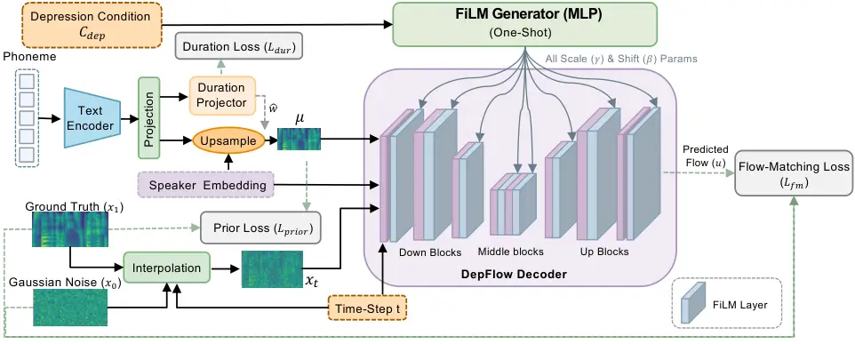
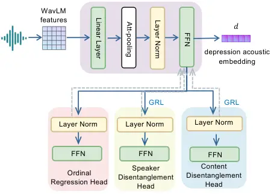
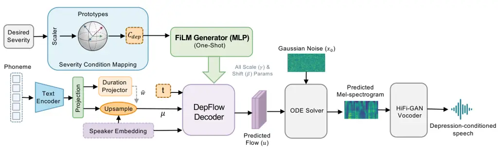
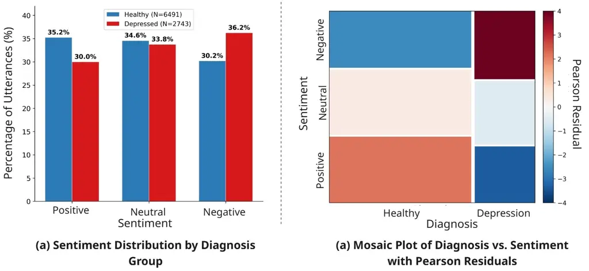
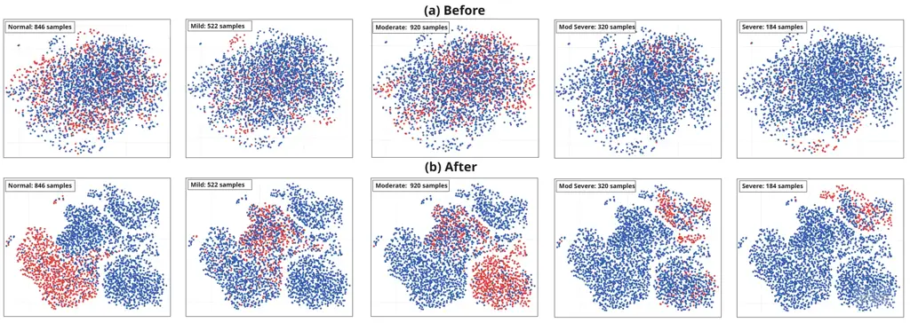
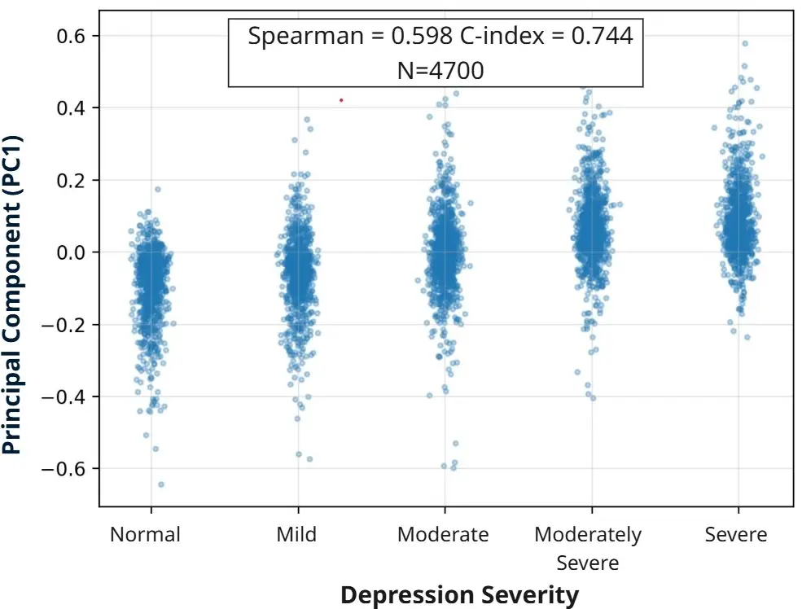

# DepFlow: Disentangled Speech Generation to Mitigate Semantic Bias in Depression Detection

Yuxin Li    Xiangyu Zhang    Yifei Li Affiliation: College of Computing
and Data Science, Nanyang Technological University, Singapore    Zhiwei
Guo Affiliation: College of Computing and Data Science, Nanyang
Technological University, Singapore    Haoyang Zhang Affiliation: School
of Software and Microelectronics, Peking University, Beijing, China   
Eng Siong Chng Affiliation: College of Computing and Data Science,
Nanyang Technological University, Singapore    Cuntai Guan
Email: [{yuxin.li, YIFEI024, ZHIWEI004, ASESChng,
ctguan}@ntu.edu.sgxiangyu.zhang2@unsw.edu.au;
zhang.haoyoung@stu.pku.edu.cn](mailto:) Affiliation: College of
Computing and Data Science, Nanyang Technological University, Singapore
Affiliation: Center for AI in Medicine (C-AIM), Lee Kong Chian School of
Medicine, NTU, Singapore^(\*)Equal Contribution Affiliation: School of
Electrical Engineering and Telecommunications, UNSW, Sydney, Australia

###### Abstract

Speech is a scalable and non-invasive biomarker for early mental health
screening. However, widely used depression datasets like DAIC-WOZ
exhibit strong coupling between linguistic sentiment and diagnostic
labels, encouraging models to learn semantic shortcuts. As a result,
model robustness may be compromised in real-world scenarios, such as
Camouflaged Depression, where individuals maintain socially positive or
neutral language despite underlying depressive states. To mitigate this
semantic bias, we propose DepFlow, a three-stage depression-conditioned
text-to-speech framework. First, a Depression Acoustic Encoder learns
speaker- and content-invariant depression embeddings through adversarial
training, achieving effective disentanglement while preserving
depression discriminability (ROC-AUC: 0.693). Second, a flow-matching
TTS model with FiLM modulation injects these embeddings into synthesis,
enabling control over depressive severity while preserving content and
speaker identity. Third, a prototype-based severity mapping mechanism
provides smooth and interpretable manipulation across the depression
continuum. Using DepFlow, we construct a Camouflage Depression-oriented
Augmentation (CDoA) dataset that pairs depressed acoustic patterns with
positive/neutral content from a sentiment-stratified text bank, creating
acoustic-semantic mismatches underrepresented in natural data. Evaluated
across three depression detection architectures, CDoA improves macro-F1
by 9%, 12%, and 5%, respectively, consistently outperforming
conventional augmentation strategies in depression Detection. Beyond
enhancing robustness, DepFlow provides a controllable synthesis platform
for conversational systems and simulation-based evaluation, where real
clinical data remains limited by ethical and coverage constraints.

   

A Preprint

|     |
| --- |
|     |

*Keywords* Speech Depression Detection $`\cdot`$ Speech Synthesis
$`\cdot`$ Camouflaged Depression $`\cdot`$ Mask Depression $`\cdot`$
Semantic Bias

## 1 Introduction

Depression alters speech production in systematic ways, including
reduced vocal energy and imprecise articulation Cummins et al. (2015);
Low et al. (2010). These changes are associated with autonomic
dysregulation and reflect core clinical symptoms such as psychomotor
retardation and reduced affective expressiveness Bandyopadhyay Prasanta
et al. (2014); McCorry (2007); Almaghrabi et al. (2023). Importantly,
such acoustic markers often emerge before individuals consciously
recognize or report their own depressive symptoms Morales-Luque et al.
(2025); Brown (2025). As a result, speech constitutes a scalable,
non-invasive, and relatively difficult to intentionally manipulate
biomarker for early and passive mental health screening, particularly in
real-world monitoring settings where robustness across expression styles
is essential.

Speech conveys information through multiple interacting layers,
including acoustic cues, linguistic content, and speaker identity
Scherer (2003). While all three contribute to affective expression, our
analysis identifies linguistic sentiment as a critical confounder in the
widely used DAIC-WOZ dataset. Concretely, by examining nearly ten
thousand utterances in DAIC-WOZ, we find that negative sentiment is
substantially more frequent in depressed than in healthy speech. This
dataset-induced coupling indicates that linguistic sentiment is not
independent of depression status, meaning that models trained on such
data are naturally encouraged to rely on sentiment cues rather than
depression-related acoustic markers Geirhos et al. (2020); Pearl (2009);
Schölkopf et al. (2021).

This risk is particularly pronounced when linguistic content and
acoustic expression diverge, for example when individuals with
depression maintain socially positive or neutral language while still
exhibiting depressive vocal patterns. This aligns with the clinical
notion of Camouflaged Depression Jansson et al. (2016); Brown (2025);
Shetty et al. (2018), where individuals consciously or unconsciously
mask symptoms to conform to social expectations. In these cases,
acoustic-semantic mismatches are not anomalies but can occur
systematically in certain populations. Models that treat linguistic
sentiment as a proxy for depression are therefore prone to failure
whenever semantic content no longer reflects internal affective state,
leading to degraded robustness in deployment.

To mitigate semantic bias and reduce shortcut learning, we propose to
explicitly expose models to controlled conflicts between acoustic and
semantic information during training. To this end, we introduce DepFlow,
a waveform-level, depression-conditioned speech generation framework
capable of synthesizing the Camouflage Depression-oriented Augmentation
(CDoA) dataset, where depression-related acoustic expressiveness and
linguistic content can be manipulated independently while preserving
speaker identity. Rather than generating arbitrary synthetic data, we
specifically construct datasets that simulate Camouflaged Depression
scenarios: for depressed speakers, DepFlow produces additional speech in
which their original depressive acoustic patterns are retained but
paired with externally provided positive linguistic content, a
combination that is severely underrepresented in real datasets; for
healthy speakers, additional speech with predominantly positive content
is generated as well. By providing such systematically constructed,
high-fidelity speech in which depressive acoustics are intentionally
placed in conflict with positive semantics, DepFlow encourages
downstream models to rely less on semantic polarity and instead shift
decision boundaries toward invariant acoustic biomarkers.

DepFlow achieves this through three core components. First, a Depression
Acoustic Encoder (DAE) learns a continuous manifold of
depression-related acoustic patterns while suppressing speaker identity
and linguistic information via adversarial objectives. Second, a
conditional flow-matching text-to-speech model synthesizes
waveform-level speech conditioned on these depression embeddings,
enabling precise control over depressive acoustic expressiveness while
preserving linguistic content and speaker traits. Finally, a
prototype-based severity control mechanism provides smooth and
interpretable manipulation of depressive expressiveness at inference
time, allowing DepFlow to systematically generate Camouflage-oriented
training samples that break the sentiment–diagnosis correlation present
in existing datasets.

We evaluate DepFlow by augmenting the training data of three
representative deep learning–based depression detection architectures.
Across all models, incorporating DepFlow-generated disentangled speech
consistently improves macro-F1 scores, indicating more stable and robust
decision boundaries. Moreover, DepFlow consistently outperforms existing
data augmentation strategies, highlighting the benefit of targeted
acoustic–semantic decoupling over generic perturbation-based approaches.
These results demonstrate that exposing models to depressive acoustics
paired with non-depressive linguistic content effectively reduces
semantic shortcut learning and shifts model reliance toward invariant
acoustic biomarkers.

Beyond improving robustness in depression detection, DepFlow also serves
as a depression-oriented speech data generation tool that supports
emerging research paradigms in mental health modeling. In particular,
dialogue-based and interactive studies of depression require
large-scale, diverse, and controllable speech data Zhang et al. (2023);
Ji et al. (2024), which are difficult to obtain from real-world clinical
recordings due to ethical constraints, privacy concerns, and limited
coverage of expressive variability Cummins et al. (2015); Li et al.
(2025b). This data-generation capability paves the way for future
research on depression-aware conversational systems, interaction
modeling, and simulation-based evaluation frameworks, where relying
solely on real data is insufficient to support training and analysis.

The remainder of this paper is organized as follows. Section II reviews
related work on depression detection and data augmentation. Section III
describes the proposed DepFlow framework and provides detailed
descriptions of its component modules. Section IV outlines the
experimental setup, including datasets, preprocessing, implementation
details, construction of CDoA datasets, downstream depression detection
architectures, and evaluation metrics. Section V presents the
experimental results and discusses the key findings. Section VI
concludes the paper.

## 2 Related Work

### 2.1 Speech-based Depression Detection using Deep Learning

Much of the progress in this field has been driven by the AVEC challenge
series Valstar et al. (2013); Ringeval et al. (2019), which established
standard benchmarks for multimodal depression assessment.

Early systems relied on handcrafted acoustic features such as prosodic
cues (pitch, energy, speech rate), spectral descriptors (MFCCs,
formants), and voice quality measures (jitter, shimmer, HNR) Li et al.
(2025b). These approaches captured clinically relevant correlates of
psychomotor retardation but required manual design and lacked
robustness.

End-to-end models addressed these limitations by learning directly from
raw audio or mel-spectrograms. CNN-based architectures extract local
spectral patterns Chlasta et al. (2019); Dubagunta et al. (2019); Saidi
et al. (2020); Othmani et al. (2021); Vázquez-Romero and
Gallardo-Antolín (2020); Wang et al. (2022), while RNNs model temporal
dynamics and Transformers capture long-range dependencies Salekin et al.
(2018); Zhao et al. (2020); Muzammel et al. (2020).

More recently, self-supervised learning (SSL) has become the dominant
paradigm due to its ability to learn rich acoustic representations from
large unlabeled corpora. Models such as Wav2Vec 2.0 Baevski et al.
(2020), HuBERT Hsu et al. (2021), WavLM Chen et al. (2022a), and Whisper
Radford et al. (2023) have shown strong transferability. SSL-based
features consistently outperform handcrafted and conventional end-to-end
methods, particularly in low-resource depression detection tasks Zhang
et al. (2021); Toto et al. (2021); Chen et al. (2022b); Ravi et al.
(2022a); Wu et al. (2023); Li et al. (2025a); Zhang et al. (2025).

Despite these advances, most models implicitly learn the strong
correlation between linguistic sentiment and depression labels present
in training data. This semantic bias makes models brittle whenever
textual sentiment and acoustic affect diverge.



Figure 1: Training pipeline of DepFlow. DepFlow takes phoneme sequences,
speaker embeddings, and a depression condition embedding
$`\mathbf{c}_{\mathrm{dep}}`$ as conditioning inputs. A text encoder
provides linguistic features and a duration module aligns them with
acoustic frames, while a Conditional Flow Matching decoder generates
mel-spectrograms with FiLM-based depression conditioning.

### 2.2 Data Augmentation for Speech-based Depression Detection

Data augmentation approaches can be grouped into intra-class and
inter-class strategies Lishi and Mak (2025).

#### 2.2.1 Intra-Class Augmentation

Intra-class methods perturb samples without altering their diagnostic
labels. Traditional variants apply pitch shifts, speed modifications, or
additive noise. More advanced techniques such as FrAUG Ravi et al.
(2022b) and SpecAugment Park et al. (2019) operate on time–frequency
representations to improve robustness. Domain-aware approaches further
manipulate structural or phoneme-level properties to introduce targeted
variability, such as dialogue shuffling Wu et al. (2023), vowel-level
perturbation Feng and Chaspari (2023), or spectrogram-resolution
variation Kumar et al. (2024).

While effective, these methods only enrich within-class diversity. They
do not address the label–feature entanglement across diagnostic
categories, nor do they mitigate semantic bias arising from
sentiment–diagnosis correlations.

#### 2.2.2 Inter-Class Augmentation

Inter-class augmentation aims to generate samples that reflect
transformations across diagnostic categories. Mixup-style interpolation
has been explored, but its assumption of linear label mixing often fails
in clinical tasks, producing pathologically invalid samples Lishi and
Mak (2025). GAN-based approaches Goodfellow et al. (2020) have attempted
class-to-class transformations, including affective style transfer via
CycleGAN variants Yang et al. (2020). However, GANs struggle to provide
stable, fine-grained control over depression severity and often operate
in feature space rather than at the waveform level.

Counterfactual augmentation offers a more principled alternative by
explicitly modifying latent representations. Zuo and Mak Lishi and Mak
(2025) proposed VQ-based counterfactual manipulation to map an utterance
toward an opposite diagnostic class, demonstrating improved robustness
under data scarcity.

With advances in neural speech synthesis, waveform-level augmentation
has gained traction. DepressGEN Liang et al. (2025) uses controllable
TTS to generate coherent depression-like samples, combining LLM-driven
text generation with prosody control. However, prior systems generally
rely on prosodic imitation rather than disentangled acoustic–semantic
manipulation, and they do not directly target the correction of semantic
bias.

## 3 Methodology

### 3.1 Overview

Figure 1 illustrates the overall architecture of our system, which is
composed of three components: the Depression Acoustic Encoder (DAE), the
DepFlow TTS model, and a prototype-based severity mapping mechanism. The
framework separates the learning of depressive acoustics from speech
synthesis: the DAE first learns a speaker- and content-invariant
manifold of depressive acoustic patterns, and DepFlow then uses this
embedding to synthesize disentangled speech, injecting depressive
acoustic cues into arbitrary text while preserving speaker identity.
Finally, the severity mapping module provides continuous and
interpretable control over depressive expressiveness, enabling the
system to generate Camouflage-oriented speech samples that
systematically break the sentiment–diagnosis correlation present in
standard datasets.

### 3.2 Depression Acoustic Encoder



Figure 2: Architecture of the Depression Acoustic Encoder (DAE).
Frame-level WavLM features are aggregated into an utterance-level
representation to produce a depression acoustic embedding
$`\mathbf{d}`$, with an ordinal regression head estimating PHQ-based
severity and GRL-based speaker and content disentanglement heads
suppressing speaker identity and linguistic information.

To separate depression-related acoustics from linguistic and speaker
factors, we design a Depression Acoustic Encoder (DAE) that learns a
continuous manifold of depressive acoustic patterns while abstracting
away speaker identity and linguistic content. This disentanglement is
essential for disentangled speech generation: depressive cues must be
modified without distorting phonemes or altering speaker traits,
otherwise the synthesized samples would be clinically unreliable for
decision-boundary correction. The architecture of the DAE is shown in
Figure 2.

#### 3.2.1 Model Structure

A pretrained WavLM-Large model Chen et al. (2022a) first extracts
frame-level contextualized features $`\{\mathbf{x}_{t}\}_{t=1}^{T}`$.
Each frame is projected to a 256-dimensional embedding through a linear
layer with ReLU and dropout, producing $`\mathbf{h}_{t}`$. An
attention-based statistical pooling layer then aggregates these frame
embeddings into an utterance-level representation by computing attention
weights $`\alpha_{t}=\mathrm{softmax}(f{\text{attn}}(\mathbf{h}_{t}))`$
and concatenating the attention-weighted mean and standard deviation.

A post-encoder composed of fully connected layers with Layer
Normalization, SiLU activation, and dropout transforms this pooled
embedding into a 32-dimensional depression-related acoustic embedding
$`\mathbf{d}`$, which serves as the shared representation for all
downstream branches.

On top of this embedding, three lightweight heads are attached:

##### Ordinal Regression Head

This head predicts $`K\!-\!1=4`$ ordered thresholds for the $`K=5`$
PHQ-8 severity levels  Kroenke et al. (2009). Given $`\mathbf{d}`$, a
small MLP outputs threshold logits.

##### Speaker Disentanglement Head

To enforce speaker invariance, a speaker classifier is applied to the
L2-normalized embedding $`\tilde{\mathbf{d}}`$ and predicts over $`S`$
speakers. The same classifier is reused in an adversarial branch
equipped with a gradient reversal layer (GRL) Ganin et al. (2016), which
reverses gradients to discourage speaker-specific information in the
shared embedding.

##### Linguistic Disentanglement Head

A linguistic-adversarial branch reduces residual phonetic content in
$`\tilde{\mathbf{d}}`$. A pretrained HuBERT model Hsu et al. (2021)
generates frame-level pseudo-phoneme labels $`\{c_{t}\}`$, which are
collapsed to an utterance-level category via majority voting. The
normalized embedding is passed through another GRL and a classifier
$`f_{\text{con}}`$ predicting over $`C`$ HuBERT-derived units. This
adversarial signal suppresses linguistic information.

#### 3.2.2 Optimization Objectives

Training jointly optimizes depression prediction and the removal of
speaker and linguistic information from the shared embedding
$`\mathbf{d}`$. The Ordinal Regression Head is trained using binary
cross-entropy on monotonic ordinal targets:

```math
\mathcal{L}_{\text{sup}}=-\sum_{k=1}^{K-1}\Bigl[t_{k}\log\sigma(o_{k})+(1-t_{k})\log\bigl(1-\sigma(o_{k})\bigr)\Bigr], \tag{1}
```

with class-balanced weights derived from label frequencies.

The speaker classifier applied to $`\tilde{\mathbf{d}}`$ uses a
cross-entropy identification loss $`\mathcal{L}_{\text{id}}`$, while its
adversarial branch contributes an adversarial speaker loss
$`\mathcal{L}_{\text{adv-spk}}`$ encouraging speaker-invariant
embeddings. Similarly, the linguistic-adversarial branch is trained with
a cross-entropy loss $`\mathcal{L}_{\text{adv-con}}`$ over
HuBERT-derived labels, promoting suppression of linguistic content.

The full training objective is a weighted sum:

```math
\mathcal{L}_{\text{total}}=\lambda_{\text{sup}}\mathcal{L}_{\text{sup}}+\lambda_{\text{id}}\mathcal{L}_{\text{id}}+\lambda_{\text{spk}}\mathcal{L}_{\text{adv-spk}}+\lambda_{\text{con}}\mathcal{L}_{\text{adv-con}}. \tag{2}
```



Figure 3: Inference pipeline of DepFlow. Given a desired severity level,
DepFlow maps it to a depression condition embedding
$`\mathbf{c}_{\mathrm{dep}}`$ and, together with phoneme and speaker
inputs, generates severity-controlled mel-spectrograms via
FiLM-conditioned decoding, which are finally converted to speech using
HiFi-GAN.

### 3.3 Depression Conditioned Flow Matching TTS (DepFlow)

DepFlow adapts the Matcha-TTS architecture Mehta et al. (2024) to enable
waveform-level synthesis conditioned on the DAE-derived depression
embedding. The model comprises a text encoder, a duration predictor, and
a Conditional Flow Matching (CFM) decoder, designed to satisfy three key
requirements: high-fidelity synthesis, global coherence, and precise
controllability Lipman et al. (2022); Zhang et al. (2024).

During synthesis, the CFM decoder receives three inputs, namely a
phoneme sequence (text), a speaker embedding and a DAE-derived
depression embedding. The depression embedding does not modify
linguistic or speaker representations; instead, it acts as an external
style variable that shapes vocal energy, prosody, and articulation.

#### 3.3.1 FiLM-based Depression Conditioning

A key requirement for disentangled speech generation is global
consistency: depressive cues must affect all acoustic scales, from
frame-level detail to long-range prosody. To meet this requirement,
DepFlow adopts a FiLM-based modulation mechanism Perez et al. (2018)
instead of feature concatenation or attention mechanisms.

Concatenation provides weak conditioning and often fails to influence
deeper decoder layers, while cross-attention introduces unnecessary
computational overhead. FiLM, in contrast, applies channel-wise affine
transformations to intermediate activations, offering both efficiency
and uniform influence across the entire decoding hierarchy.

Given a depression control embedding $`\mathbf{c}_{\text{dep}}`$, a
lightweight MLP produces scale–shift pairs $`(\gamma_{i},\beta_{i})`$
for all FiLM-modulated blocks. Each decoder block applies channel-wise
affine modulation:

```math
\hat{\mathbf{h}}_{i}=\gamma_{i}\cdot\mathbf{h}_{i}+\beta_{i}. \tag{3}
```

where $`\mathbf{h}\in\mathbb{R}^{B\times C\times T}`$ denotes the
intermediate feature map.

FiLM acts as a global conditioning mechanism that scales and shifts the
feature maps, effectively modulating the entire energy and pacing of the
speech without altering the underlying linguistic structure encoded in
the content features.

#### 3.3.2 DepFlow Decoder

The DepFlow decoder follows the U-Net architecture of Matcha-TTS Mehta
et al. (2024), with downsampling, bottleneck, and upsampling stages.
Each stage integrates ResNet and lightweight transformer layers to
capture both short-term and long-term acoustic dependencies. Flow
matching trains the decoder to predict velocity fields that transport
noise into mel-spectrograms, yielding a stable and interpretable
continuous-time generative process. Unlike standard diffusion models
that rely on complex curved denoising trajectories and may suffer from
discretization sensitivity, Flow Matching with Optimal Transport learns
smooth and deterministic transport paths. This geometric simplicity is
particularly important for our disentangled severity control objective:
it ensures that continuous adjustments of the depression-severity
condition result in smooth and well-behaved shifts in the generated
acoustic trajectory, maintaining stability and speaker identity while
avoiding artifacts commonly introduced by nonlinear interpolation.

#### 3.3.3 Optimization Objective

Training uses duration loss, Gaussian prior loss, and flow matching loss
as in Matcha-TTS:

##### Duration Loss

```math
\mathcal{L}_{\text{dur}}=\text{MSE}(\log\mathbf{w},\log\hat{\mathbf{w}}). \tag{4}
```

where $`\mathbf{w}`$ and $`\hat{\mathbf{w}}`$ denote ground-truth and
predicted durations.

##### Prior Loss

A Gaussian prior encourages consistency between encoder outputs and
target mel-spectrograms:

```math
\mathcal{L}_{\text{prior}}=\frac{1}{|\mathcal{M}|\cdot n_{f}}\sum_{(i,j)\in\mathcal{M}}\frac{1}{2}\Big[(y_{i,j}-\mu_{i,j})^{2}+\log(2\pi)\Big]. \tag{5}
```

##### Flow Matching Loss

Following the CFM formulation, we train the decoder to predict the
velocity field:

```math
\mathcal{L}_{\text{fm}}=\frac{1}{|\mathcal{M}|\cdot n_{f}}\sum_{(i,j)\in\mathcal{M}}\left\|\mathbf{u}_{i,j}-\hat{\mathbf{u}}_{i,j}\right\|^{2}. \tag{6}
```

where the target velocity is

```math
\mathbf{u}=\mathbf{x}_{1}-(1-\sigma_{\min})\mathbf{z}. \tag{7}
```

##### Total Loss

```math
\mathcal{L}_{\text{total}}=\mathcal{L}_{\text{dur}}+\lambda_{p}\mathcal{L}_{\text{prior}}+\mathcal{L}_{\text{fm}}. \tag{8}
```

where $`\lambda_{p}`$ is set to 1.0.

### 3.4 Prototype-based Severity Condition Mapping

Although DepFlow enables depression-conditioned generation, effective
disentangled speech synthesis requires a severity representation that is
both clinically meaningful and smoothly controllable. Raw DAE
embeddings, while informative, may exhibit inter-speaker variability or
nonlinear geometry that complicates direct manipulation. To obtain a
stable and interpretable severity axis, we construct a prototype bank
representing the central depressive acoustic pattern at each PHQ-8
severity level. During synthesis, these prototype-conditioned severity
embeddings serve as the depression control variable fed into DepFlow,
enabling fine-grained manipulation of depressive acoustic
expressiveness.

#### 3.4.1 Subject-level Embedding Aggregation

Depression severity manifests more reliably across a subject’s
recordings than within individual utterances. We therefore compute a
subject-level embedding $`\mathbf{d}^{(\text{subj})}`$ by averaging
utterance-level DAE embeddings. This reduces within-speaker variance and
yields a robust depression descriptor aligned with clinical assessments.

Subjects are grouped into the five PHQ-8 severity bins used during DAE
training. For each bin $`k`$, we compute a prototype:

```math
\bar{\mathbf{p}}_{k}=\frac{1}{N_{k}}\sum_{j\in\mathcal{S}_{k}}\mathbf{d}^{(\text{subj})}_{j},\quad\mathbf{p}_{k}=\frac{\bar{\mathbf{p}}_{k}}{\|\bar{\mathbf{p}}_{k}\|_{2}}, \tag{9}
```

The prototype $`\mathbf{p}_{k}`$ represents the central depressive
acoustic pattern of each severity category, abstracted from individual
idiosyncrasies.

#### 3.4.2 Continuous Severity Control via SLERP

During inference, the goal is to generate a depression embedding
corresponding to any desired PHQ-8 score, not just the five discrete
bins. Given a target score $`s`$, we map it to a normalized scalar:

```math
\alpha(s)=\mathrm{clip}\!\left(\frac{s-12}{12},\,-1,\,1\right). \tag{10}
```

which specifies its relative position in the severity spectrum. We then
identify the two adjacent prototypes $`\mathbf{p}_{i}`$
,$`\mathbf{p}_{i+1}`$ and compute an interpolation weight
$`\tau(s)\in[0,1]`$. The final severity embedding is obtained using
spherical linear interpolation (SLERP) Shoemake (1985):

```math
\mathbf{c}_{\mathrm{dep}}^{\mathrm{infer}}(s)=\mathrm{slerp}\bigl(\mathbf{p}_{i},\mathbf{p}_{i+1};\,\tau(s)\bigr). \tag{11}
```

SLERP preserves angular geometry on the unit hypersphere, producing
smooth transitions in depressive expressiveness while avoiding artifacts
associated with linear interpolation.

## 4 Experimental Setup

| Gender | Category         | Number | PHQ-8 Score |     |       |       | PHQ Score Statistics |
| ------ | ---------------- | ------ | ----------- | --- | ----- | ----- | -------------------- |
|        |                  |        | 0-4         | 5-9 | 10-19 | 20-24 |                      |
| Female | Control Group    | 56     | 38          | 18  | 0     | 0     | 3.4±3.09             |
| Female | Depression Group | 31     | 0           | 0   | 25    | 6     | 14.5±4.19            |
| Male   | Control Group    | 76     | 48          | 28  | 0     | 0     | 6.8±5.92             |
| Male   | Depression Group | 26     | 0           | 0   | 25    | 1     | 14.0±3.22            |

Table 1: Demographic and diagnostic distribution of the DAIC-WOZ
dataset.



Figure 4: Analysis of semantic bias in the DAIC-WOZ dataset. (a)
Sentiment Distribution by Diagnosis Groups; (b) Mosaic plot of Diagnosis
vs. Sentiment shaded by Pearson residuals. Red tiles indicate
overrepresentation (observed $`>`$ expected), while blue tiles indicate
underrepresentation. The deep red shading in the Depressed-Negative
intersection highlights a significant correlation between depression
labels and negative linguistic sentiment.

### 4.1 Datasets

Two datasets are used in our experiments: the CSTR VCTK corpus Yamagishi
et al. (2019) and the DAIC-WOZ dataset Gratch et al. (2014). The CSTR
VCTK corpus contains recordings from 110 English speakers, originally
sampled at 48 kHz. The DAIC-WOZ dataset consists of clinical interviews
from 189 English-speaking participants, including 56 clinically
diagnosed with depression, with audio sampled at 16 kHz. Notably, 409
samples in the DAIC-WOZ training partition are relabeled from 0 to 1
following the correction reported in Bailey and Plumbley (2021)¹¹ 1
https://github.com/adbailey1/daic_woz_process.

In our pipeline, CSTR VCTK is used exclusively to pretrain the
text-to-speech backbone (DepFlow base model), while DAIC-WOZ is used to
(i) train the Depression Acoustic Encoder (DAE), (ii) finetune DepFlow
with depression conditioning, and (iii) train and evaluate downstream
depression detection models.

All operations that require depression labels strictly use only the
DAIC-WOZ training and development sets, and the official test set is
reserved for final evaluation only.

### 4.2 Sentiment Distribution Analysis

We analyze the relationship between linguistic sentiment and depression
diagnosis in the DAIC-WOZ training set. Sentiment analysis was applied
to 9,234 interviewee utterances, diarized by timestamps and excluding
segments shorter than 1 s. Each utterance was classified as positive,
neutral, or negative using the DeepSeek R1 large language model Guo et
al. (2025) ²² 2 https://github.com/deepseek-ai/DeepSeek-R1. Sentiment
distributions were computed separately for healthy and depressed
participants.

Figure 4(a) shows a clear distributional shift between groups. Healthy
participants produced more positive than negative utterances (35.2% vs.
30.2%), whereas depressed participants exhibited the opposite pattern,
with negative sentiment exceeding positive sentiment (36.2% vs. 30.0%).

To quantify this association, we visualized the sentiment-diagnosis
contingency table using a mosaic plot shaded by Pearson residuals
(Figure 4(b)). For each cell $`(i,j)`$, the Pearson residual is defined
as

```math
r_{ij}=(O_{ij}-E_{ij})/\sqrt{E_{ij}}, \tag{12}
```

where $`O_{ij}`$ and $`E_{ij}`$ denote observed and expected frequencies
under independence. These patterns are statistically significant, as
confirmed by Pearson residuals and a chi-square test of independence.

This association is further confirmed by a Pearson chi-square test of
independence ($`\chi^{2}=38.03`$, $`df=2`$, $`p<10^{-8}`$) Pearson
(1900). Overall, linguistic sentiment in DAIC-WOZ is strongly coupled
with diagnostic labels, suggesting the presence of a semantic shortcut
exploitable by classification models.

### 4.3 Preprocessing and Data Splits

For all experiments, we adopt the official DAIC-WOZ partition (train:
107 subjects, development: 35 subjects, test: 47 subjects), ensuring
subject-level disjointness across splits.

For both DAE training and downstream depression detection experiments,
we follow the Speechformer Chen et al. (2022b) sampling protocol for
class balancing at the utterance level. During training, a 10-second
segment is randomly cropped from each selected utterance in every epoch
to introduce temporal variability. For evaluation, the 20 longest
utterances from each test subject are used, and subject-level
predictions are obtained by majority voting over utterance-level
outputs.

For DepFlow pretraining on VCTK, we use the original corpus segmentation
provided by the dataset and downsample audio from 48 kHz to 22.05 kHz to
match our vocoder and acoustic feature pipeline.

For DepFlow finetuning on DAIC-WOZ, all utterances from the training and
development sets are used after removing segments shorter than one
second or dominated by silence. These recordings are resampled from
16 kHz to 22.05 kHz. No information from the DAIC-WOZ test set is used
during training or generation.

All DepFlow-generated speech samples are produced strictly from the
DAIC-WOZ training set and are only used to augment the training data.
They are never introduced into the development or test sets.

### 4.4 Implementation Details

All models are trained on NVIDIA L40 GPUs. The training of the
generation framework consists of three stages.

##### Stage 1: Depression Acoustic Encoder

The DAE is optimized for up to 500 epochs with a batch size of 64 using
AdamW Loshchilov and Hutter (2017) (learning rate $`1\times 10^{-4}`$,
weight decay $`3\times 10^{-3}`$). A dropout rate of 0.2 is applied to
all projection and prediction layers. The loss weights are set to
$`\lambda_{\text{sup}}=1.0`$, $`\lambda_{\text{id}}=0.2`$,
$`\lambda_{\text{spk}}=0.2`$, and $`\lambda_{\text{con}}=0.1`$. Early
stopping is applied based on performance on the DAIC-WOZ development
set.

##### Stage 2 & 3: Pretraining and Finetuning DepFlow

We first pretrain the base Matcha-TTS model on VCTK without depression
conditioning, following the default parameter settings in Matcha-TTS
Mehta et al. (2024) unless otherwise specified. DepFlow is then
finetuned on DAIC-WOZ with depression condition and FiLM generator,
using the same hyperparameter settings. The depression conditioning
embedding has a dimensionality of 32. During finetuning, both the base
TTS parameters and the FiLM generator are updated. The dropout rate of
the FiLM generator is set to 0.2. During inference, waveforms are
reconstructed from mel-spectrograms using a pretrained HiFi-GAN vocoder
Kong et al. (2020).

### 4.5 Evaluation Protocols

#### 4.5.1 Controllability and Validity of Synthesized Speech

A primary objective of DepFlow is to modulate depressive acoustic
expressiveness in a controlled manner while keeping linguistic content
and speaker identity fixed. We therefore evaluate controllability and
validity from three complementary perspectives. First, we assess whether
increasing the intended severity produces monotonic shifts within the
learned depression embedding manifold. Second, we examine whether these
latent shifts translate into systematic changes in clinically relevant
acoustic markers at the intra-speaker level. Third, we verify that
severity manipulation does not compromise TTS quality, including
linguistic intelligibility and speaker similarity.

All analyses in this section are conducted under a unified
severity-controlled synthesis protocol applied to the DAIC-WOZ test set.
For each utterance, five synthetic variants are generated to correspond
to the five clinical severity levels from healthy to severe depression.
For each target level, the PHQ-derived severity value is converted into
a continuous scalar $`\alpha!\in![-1,1]`$ and subsequently mapped to a
depression condition embedding $`\mathbf{c}_{\mathrm{dep}}`$, which,
together with the target speaker identity, conditions DepFlow for
generation.

This protocol yields five severity-controlled speech versions per
utterance, resulting in 4,700 synthesized test samples. It is used
strictly for evaluation; no synthesized samples are included in model
training, thereby preventing any form of data leakage into downstream
depression detection experiments.



Figure 5: UMAP visualization of the DAE embeddings. (a) Embeddings
obtained from a frozen WavLM-Large model; (b) Embeddings of the same
utterances after processing through the trained DAE. In each panel, the
five subplots correspond respectively to the five clinical severity
levels (Healthy, Mild, Moderate, Moderately Severe, Severe): red points
denote samples from the target severity level, while blue points denote
all remaining samples.

#### 4.5.2 Construction of Camouflage Depression-oriented Augmentation (CDoA) Datasets

To evaluate the impact of incongruent semantic-acoustic cues, we
generate CDoA datasets through a structured three-step procedure.

First, we build a sentiment-based text bank. All DAIC-WOZ training
transcripts are annotated at the utterance level (positive, neutral,
negative) using a large language model, DeepSeek R1 Guo et al. (2025).
Positive and neutral utterances are grouped into a benign-text bank,
while negative utterances form a depressive-text bank, enabling explicit
control over semantic polarity.

Following the baseline sampling strategy, we determined synthesis quotas
to enforce global binary class balance and coverage across all PHQ
severity levels. The final dataset combines original and synthetic data
for a total of 5,760 utterances, achieving a perfectly balanced binary
distribution (2,880 depressed vs. 2,880 non-depressed). This was
achieved by synthesizing a fixed number of utterances per subject for
each severity group: 13 (Normal), 34 (Mild), 2 (Moderate), 91
(Moderately Severe), and 194 (Severe).

Finally, we generate disentangled samples by mapping each subject’s PHQ
score to a continuous scalar $`\alpha\in[-1,1]`$ and projecting it into
a depression condition embedding $`\mathbf{c}_{\mathrm{dep}}`$. This
embedding conditions DepFlow to inject depressive acoustics into benign
(positive or neutral) text, creating controlled acoustic–semantic
mismatches where depressive vocal patterns coexist with non-depressive
linguistic content.

##### Baseline Depression Detection Models

The proposed augmentation method are benchmarked on three representative
families of speech-based depression detection models, differing in input
features and backbone architectures:

- •
  DepAudioNet Ma et al. (2016): A log-Mel-based convolutional–recurrent
  model. DepAudioNet takes log-Mel spectrograms as input and uses
  several convolutional layers followed by LSTM layers to encode
  temporal dynamics, with a fully connected layer for utterance-level
  depression classification.
- •
  NUSD Wang et al. (2023): A speaker-disentangling TDNN model operating
  on frame-level acoustic features. NUSD takes log-Mel and pitch
  features as input to an ECAPA-TDNN Desplanques et al. (2020) backbone,
  and attaches non-uniform speaker-disentangling branches while a main
  pooling and classification head predicts utterance-level depression
  labels.
- •
  HAREN-CTC Li et al. (2025a): A self-supervised hierarchical model
  built on raw waveforms. HAREN-CTC operates on multi-layer WavLM
  representations extracted from the raw audio, and employs a
  hierarchical encoder with a CTC branch and a pooling-based
  classification head for subject-level depression detection.

For all three baselines, we follow the original implementations and
hyperparameter settings as closely as possible, and apply our utterance
selection and augmentation protocol identically for a fair comparison.

### 4.6 Metrics

The proposed framework are evaluated from four perspectives: (i)
disentanglement effect of the learned depression condition embedding
from DAE, (ii) controllability of synthesized depression severity, (iii)
DepFlow text-to-speech (TTS) quality, (iv) Synthesized CDoA dataset for
downstream depression detection performance.

##### Speaker and Content Disentanglement Metrics

To verify that the depression embedding learned by the DAE captures
severity-relevant structure while suppressing nuisance attributes, both
speaker- and content-oriented metrics are employed.

Speaker identity retention is assessed using the Equal Error Rate
(EER) Hansen and Hasan (2015), a standard speaker verification metric:

```math
\mathrm{EER}=\frac{\mathrm{FAR}(\tau^{\ast})+\mathrm{FRR}(\tau^{\ast})}{2}, \tag{13}
```

where $`\mathrm{FAR}`$ and $`\mathrm{FRR}`$ denote the False Acceptance
Rate and False Rejection Rate, respectively, and $`\tau^{\ast}`$
represents the decision threshold where they intersect. Additionally,
the Similarity Gap is computed, defined as the difference in average
cosine similarity between same-speaker and different-speaker pairs.

To evaluate residual linguistic information, a linear probe is trained
to regress pooled content representations (HuBERT features Hsu et al.
(2021)) from the depression embedding. We report the Mean Squared Error
(MSE) Draper (1998), Coefficient of Determination ($`R^{2}`$) Draper
(1998), and Centered Kernel Alignment (CKA) Kornblith et al. (2019)
between predicted and ground-truth features.

##### DepFlow TTS Quality

Linguistic intelligibility is measured using Word Error Rate (WER), and
speaker consistency is assessed using the speaker-similarity metric
SIM-o Le et al. (2023). WER is computed using Whisper-Large-v3 Radford
et al. (2023), following the evaluation protocol in Anastassiou et al.
(2024). SIM-o is obtained by extracting WavLM-Large embeddings Chen et
al. (2022c) and computing cosine similarity between synthesized and
corresponding natural utterances.

##### Severity Controllability in the Latent Space

To evaluate whether increasing intended severity produces monotonic and
globally consistent shifts in the learned depression manifold, we adopt
ranking-based metrics. For each utterance group synthesized at the five
clinical severity levels, we compute: (i) the Concordance Index
(C-index) Harrell et al. (1982), which measures the probability that a
sample with higher intended severity receives a higher embedding
projection value and (ii) Spearman’s rank correlation coefficient
($`\rho`$) Spearman (1987), which evaluates ordinal agreement between
severity levels and embedding projections. Both metrics emphasize
monotonic ordering rather than absolute regression accuracy, making them
suitable for validating continuous severity control.

##### Augmentation Dataset for Depression Detection Performance

For downstream depression detection models trained with and without
DepFlow augmentation, we report subject-level Sensitivity, Specificity,
and Macro-F1 in clinical setting  Sokolova and Lapalme (2009).
Subject-level predictions are obtained by majority voting over
utterance-level decisions.

## 5 Experimental Results and Discussion

This section evaluates the proposed framework from four complementary
perspectives: (1) the quality and structure of the learned depression
manifold, (2) the controllability and acoustic validity of
DepFlow-synthesized speech, (3) the effectiveness of DepFlow-generated
incongruent samples as data augmentation for downstream detectors and
(4) qualitative analyses examining how controlled severity manipulation
shapes acoustic trajectories.



Figure 6: Alignment Between Intended Severity Levels and Latent
Depression Embedding Trajectories.

| Feature                | Mean $`\rho`$ | Median $`\rho`$) |
| ---------------------- | ------------- | ---------------- |
| Formant F1 mean        | 0.635         | 0.800            |
| Formant F2 mean        | 0.604         | 0.800            |
| Silence–speech ratio   | 0.579         | 0.866            |
| Formant centralization | -0.489        | -0.600           |
| Shimmer                | 0.304         | 0.500            |
| HNR                    | -0.259        | -0.500           |
| Jitter                 | -0.068        | -0.100           |
| $`F_{0}`$ mean         | 0.064         | 0.100            |
| $`F_{0}`$ std          | 0.058         | 0.100            |

Table 2: Intra-Speaker Acoustic Controllability of DepFlow-Synthesized
Speech (N = 4,700 samples).

### 5.1 Structure and Ordinality of the Depression Condition Embedding

We evaluate whether the proposed Depression Acoustic Encoder (DAE)
learns structured and clinically meaningful depressive representations.
As illustrated in Fig. 5, the embedding space exhibits a relatively
compact and coherent continuum that shows a gradual transition from
healthy to more severe depressive states, whereas frozen WavLM
embeddings display weaker clustering and limited ordinal organization.
These observations suggest that the DAE tends to organize speech signals
along a severity-oriented manifold rather than merely grouping samples
into discrete diagnostic categories.

Table III confirms these qualitative observations. The high speaker
verification error rate (EER) and low linguistic correlation scores (low
$`R^{2}`$ and CKA) indicate successful disentanglement of nuisance
attributes. Crucially, the embedding retains diagnostic utility,
achieving a robust ROC-AUC of 0.693 in linear probing, proving that
severity information is preserved even as speaker and content are
suppressed.

Overall, these results indicate that the DAE constructs an ordinal
depression manifold while empirically weakening speaker- and
content-related components, thereby providing a practically useful and
clinically relevant conditioning space for downstream disentangled
speech generation.

|                           |                                    |        |
| ------------------------- | ---------------------------------- | ------ |
| Type                      | Metrics                            | Result |
| Speaker disentanglement   | EER                                | 0.355  |
|                           | Similarity gap (positive-negative) | 0.27   |
| Content disentanglement   | MSE                                | 2.83   |
|                           | $`R^{2}`$                          | 0.21   |
|                           | CKA similarity                     | 0.014  |
| Depression Classification | Accuracy                           | 0.638  |
|                           | Macro-F1                           | 0.591  |
|                           | ROC-AUC                            | 0.693  |

Table 3: Evaluation of disentanglement properties of the proposed DAE
embedding on DAIC-WOZ.

### 5.2 Controllability and Validity of Synthesized Speech

All analyses in this section are conducted on the severity-controlled
synthetic test set generated using the protocol described in
Section 4.5.1.

#### 5.2.1 Embedding–Space Controllability

We next examine whether DepFlow produces systematic and ordered
movements in the learned depression embedding space as severity
increases. For each synthesized utterance, we extract a depression
condition embedding $`\mathbf{z}_{u,s}`$ from pretrained DAE and apply
Principal Component Analysis (PCA) to all synthesized embeddings. The
first principal component is then used as a shared severity coordinate,
and monotonicity with respect to the intended five clinical severity
levels is evaluated using the Concordance Index and Spearman’s rank
correlation.

As shown in Fig. 6, the distribution of projected embeddings shifts
progressively toward higher values from healthy to severe depression.
Quantitatively, we obtain a Concordance Index of 0.744 and a Spearman
correlation of 0.598, indicating a strong and consistent ordinal
relationship between intended severity and the latent trajectory of
synthesized speech across speakers and linguistic content. This suggests
that DepFlow does not introduce arbitrary variability, but instead
drives generation along a coherent direction within the depression
manifold learned by the DAE.

| Model                        | Augmentation Methods  | Macro-F1      | Sensitivity   | Specificity   |
| ---------------------------- | --------------------- | ------------- | ------------- | ------------- |
| DepAudioNet Ma et al. (2016) | /                     | 0.482 (0.042) | 0.346 (0.252) | 0.667 (0.194) |
|                              | FrAUG                 | 0.518 (0.047) | 0.629 (0.137) | 0.495 (0.593) |
|                              | Mixup                 | 0.489 (0.056) | 0.657 (0.078) | 0.418 (0.110) |
|                              | Instruct-TTS (CDoA)   | 0.459 (0.064) | 0.457 (0.229) | 0.539 (0.258) |
|                              | DepFlow (CDoA) (Ours) | 0.526 (0.023) | 0.417 (0.157) | 0.674 (0.159) |
| NUSD Wang et al. (2023)      | /                     | 0.514 (0.046) | 0.300 (0.137) | 0.745 (0.102) |
|                              | Mixup                 | 0.486 (0.052) | 0.357 (0.134) | 0.636 (0.156) |
|                              | Instruct-TTS (CDoA)   | 0.485 (0.038) | 0.400 (0.193) | 0.606 (0.183) |
|                              | DepFlow (CDoA) (Ours) | 0.577 (0.035) | 0.471 (0.081) | 0.697 (0.057) |
| HAREN-CTC Li et al. (2025a)  | /                     | 0.525 (0.035) | 0.386 (0.081) | 0.673 (0.062) |
|                              | SpecAugment           | 0.477 (0.067) | 0.386 (0.041) | 0.600 (0.114) |
|                              | Mixup                 | 0.526 (0.070) | 0.375 (0.090) | 0.712 (0.072) |
|                              | Instruct-TTS (CDoA)   | 0.510 (0.033) | 0.429 (0.033) | 0.606 (0.033) |
|                              | DepFlow (CDoA) (Ours) | 0.551 (0.028) | 0.400 (0.081) | 0.709 (0.090) |

Table 4: Subject-level depression detection performance under different
data augmentation strategies on the DAIC-WOZ dataset. Results are
reported as Macro-F1 / Sensitivity / Specificity. Bold denotes the best
result for each model.

|           |            |                       |                   |
| --------- | ---------- | --------------------- | ----------------- |
| Data Type | Severity   | WER (%)$`\downarrow`$ | SIM-o$`\uparrow`$ |
| DAIC-WOZ  | Healthy    | 13.76 (0.182)         | /                 |
|           | Mild       | 14.77 (0.176)         | /                 |
|           | Moderate   | 15.20 (0.175)         | /                 |
|           | Mod Severe | 11.41 (0.193)         | /                 |
|           | Severe     | 15.15 (0.208)         | /                 |
|           | Average    | 14.06 (0.150)         | /                 |
| Synth     | Healthy    | 13.94 (0.225)         | 57.13 (0.095)     |
|           | Mild       | 14.03 (0.228)         | 57.07 (0.095)     |
|           | Moderate   | 13.81 (0.227)         | 57.03 (0.095)     |
|           | Mod Severe | 13.93 (0.224)         | 56.88 (0.094)     |
|           | Severe     | 13.92 (0.230)         | 56.73 (0.094)     |
|           | Average    | 13.93 (0.227)         | 56.97 (0.095)     |

Table 5: Objective evaluation of TTS quality for natural and
DepFlow-synthesized speech. SIM-o is not reported for natural DAIC-WOZ
speech because it represents the upper-bound self-similarity (100%) by
definition.

#### 5.2.2 Intra-Speaker Acoustic Controllability

We further examine controllability at the level of low-level acoustic
markers. For each synthesized sample, a set of clinically relevant
features is extracted, and intra-speaker Spearman correlations are
computed between the intended severity levels and these features across
the five synthesized variants.

Table 3 summarizes the results. Several clinically recognized depression
correlates exhibit strong and consistent monotonic trends:

- •
  The silence–speech ratio shows the strongest positive correlation,
  aligning with reports of reduced speech activity and psychomotor
  retardation in depression.
- •
  Voice-quality measures such as shimmer and HNR change in the expected
  directions, suggesting increasingly unstable and breathier phonation
  as severity increases.
- •
  Formant behavior (F1, F2, and centralization) shifts systematically
  with severity, reflecting vowel centralization and articulatory
  undershooting often observed in depressive speech.

These findings indicate that DepFlow does not merely produce
perceptually different variants, but modulates speech along dimensions
that are clinically meaningful and acoustically interpretable. Notably,
$`F_{0}`$ statistics show weaker correlations, suggesting that DepFlow
primarily controls spectral–articulatory and voice-quality cues rather
than relying on pitch manipulation alone. Taken together with the
embedding-level analyses, this demonstrates that DepFlow enables smooth,
structured, and clinically grounded control over depression severity.

#### 5.2.3 TTS Quality and Speaker Similarity

We next assess whether severity manipulation compromises linguistic
intelligibility or speaker identity. Table 5 reports Word Error Rate
(WER) and speaker similarity (SIM-o) results for natural DAIC-WOZ
utterances and DepFlow-synthesized speech across the five severity
levels.

As shown in Table 5, the WER of synthesized speech closely matches that
of natural recordings (13.93% vs. 14.06%), confirming that DepFlow
preserves linguistic intelligibility despite the heavy manipulation of
paralinguistic acoustic features.

Speaker similarity also remains stable across severity levels,
suggesting that DepFlow primarily alters expressive and prosodic
dimensions without distorting timbral identity. In other words, the
imposed depressive cues modify how the subject speaks rather than who is
speaking.

In sum, these results demonstrate that DepFlow can inject
depression-related acoustic patterns in a controlled manner while
maintaining speech quality and speaker characteristics, thereby avoiding
artifacts that might otherwise confound downstream depression detection
models.

### 5.3 Effectiveness of CDoA Dataset for Downstream Depression Detection

We next investigate whether DepFlow-generated CDoA samples improve
downstream detection performance. These experiments aim to assess
whether exposure to semantically incongruent samples leads models to
develop more balanced and robust decision boundaries.

#### 5.3.1 Comparison with other Data Augmentation Methods

Table 4 presents the subject-level performance comparison against both
conventional augmentation strategies (FrAUG Ravi et al. (2022b),
SpecAugment Park et al. (2019), Mixup Zhang et al. (2017)) and an
Instruct-TTS baseline. DepFlow consistently outperforms all baselines
across three distinct architectures. Notably, our method achieves
superior performance compared to the CosyVoice-2–based Du et al. (2024)
voice-cloned TTS baseline, which also generates camouflage-oriented
augmentation data but relies on generic voice cloning without learning a
depression-aware acoustic manifold.

This comparison serves as a validation of our proposed framework: while
generic TTS can produce diverse prosody, it fails to synthesize
clinically meaningful depressive markers. The significant performance
gap confirms that the robustness gains stem specifically from the
targeted injection of depression-relevant acoustic cues, rather than
mere data expansion.

## 6 Conclusion

In summary, DepFlow provides a waveform-level, depression-conditioned
speech generation framework that constructs Camouflage
Depression-oriented Augmentation dataset (CDoA dataset) by decoupling
depressive acoustic cues from linguistic sentiment while preserving
speech quality and speaker identity. These semantically incongruent yet
clinically meaningful conditions are rarely represented in existing
corpora, but are crucial for improving the robustness of downstream
depression detection models through targeted data augmentation.

Empirical results demonstrate that DepFlow produces a coherent severity
manifold, affords smooth and interpretable control of depressive
acoustic cues, and preserves both speech intelligibility and speaker
identity. When used as a augmentation source, DepFlow-generated CDoA
dataset consistently improves the performance of multiple downstream
depression detection architectures. While not establishing causal proof,
the observed gains in sensitivity, specificity, macro-F1, and
decision-boundary stability provide converging evidence that controlled
acoustic–semantic mismatches reduce reliance on linguistic shortcuts and
encourage models to attend to depression-related acoustic biomarkers.
DepFlow therefore offers a principled way to leverage controllable
generative modeling to regularize depression detectors and enhance
robustness.

Several limitations remain. The learned severity axis, although
internally coherent and aligned with known acoustic correlates of
depression, has not yet been validated against clinician ratings or
across broader populations and datasets. From an ethical perspective,
the ability to synthesize speech with depressive acoustic
characteristics introduces potential risks, including misuse for
fabrication, unintended reinforcement of cultural stereotypes of
depression, and psychological harm. Responsible use therefore requires
transparent governance, informed consent, careful handling of sensitive
speech data, and consideration of safeguards such as provenance tracking
or watermarking. Future work will also explore perceptual studies of
synthesized cues, extensions to multilingual and demographically diverse
speakers, and broader deployment frameworks that balance robustness
gains with reliability, interpretability, and societal impact in
speech-based mental health assessment.

## References

- Almaghrabi et al. (2023) S. A. Almaghrabi, S. R. Clark, and M. Baumert
  Bio-acoustic features of depression: a review. Biomedical Signal
  Processing and Control 85, pp. 105020. Cited by: §1.
- Anastassiou et al. (2024) P. Anastassiou, J. Chen, J. Chen, Y.
  Chen, Z. Chen, Z. Chen, J. Cong, L. Deng, C. Ding, L. Gao, et al.
  Seed-tts: a family of high-quality versatile speech generation models.
  arXiv preprint arXiv:2406.02430. Cited by: §4.6.
- Baevski et al. (2020) A. Baevski, Y. Zhou, A. Mohamed, and M. Auli
  Wav2vec 2.0: a framework for self-supervised learning of speech
  representations. Advances in neural information processing systems 33,
  pp. 12449–12460. Cited by: §2.1.
- Bailey and Plumbley (2021) A. Bailey and M. D. Plumbley Gender bias in
  depression detection using audio features. In 2021 29th European
  Signal Processing Conference (EUSIPCO), pp. 596–600. Cited by: §4.1.
- Bandyopadhyay Prasanta et al. (2014) S. Bandyopadhyay Prasanta, R.
  Forster Malcolm, E. Oxford, H. Barkow Jerome, C. Leda, T. John, B.
  William, C. Richardson Robert, T. Beck Aaron, R. A. John, et al.
  American psychiatric association, diagnostic and statistical manual of
  mental disorders: dsm-5, washington, dc, american psychiatric
  publishing, 2013. ananth mahesh, in defense of an evolutionary concept
  of health nature, norms, and human biology, aldershot, england,
  ashgate. Philosophy 39 (6), pp. 683–724. Cited by: §1.
- Brown (2025) S. Brown Camouflaging depression. Discover Mental Health
  5 (1), pp. 71. Cited by: §1, §1.
- Chen et al. (2022a) S. Chen, C. Wang, Z. Chen, Y. Wu, S. Liu, Z.
  Chen, J. Li, N. Kanda, T. Yoshioka, X. Xiao, et al. Wavlm: large-scale
  self-supervised pre-training for full stack speech processing. IEEE
  Journal of Selected Topics in Signal Processing 16 (6), pp. 1505–1518.
  Cited by: §2.1, §3.2.1.
- Chen et al. (2022b) W. Chen, X. Xing, X. Xu, J. Pang, and L. Du
  SpeechFormer: a hierarchical efficient framework incorporating the
  characteristics of speech. arXiv preprint arXiv:2203.03812. Cited by:
  §2.1, §4.3.
- Chen et al. (2022c) Z. Chen, S. Chen, Y. Wu, Y. Qian, C. Wang, S.
  Liu, Y. Qian, and M. Zeng Large-scale self-supervised speech
  representation learning for automatic speaker verification. In ICASSP
  2022-2022 IEEE International Conference on Acoustics, Speech and
  Signal Processing (ICASSP), pp. 6147–6151. Cited by: §4.6.
- Chlasta et al. (2019) K. Chlasta, K. Wołk, and I. Krejtz Automated
  speech-based screening of depression using deep convolutional neural
  networks. Procedia Computer Science 164, pp. 618–628. Cited by: §2.1.
- Cummins et al. (2015) N. Cummins, S. Scherer, J. Krajewski, S.
  Schnieder, J. Epps, and T. F. Quatieri A review of depression and
  suicide risk assessment using speech analysis. Speech communication
  71, pp. 10–49. Cited by: §1, §1.
- Desplanques et al. (2020) B. Desplanques, J. Thienpondt, and K.
  Demuynck Ecapa-tdnn: emphasized channel attention, propagation and
  aggregation in tdnn based speaker verification. arXiv preprint
  arXiv:2005.07143. Cited by: 2nd item.
- Draper (1998) N. Draper Applied regression analysis. McGraw-Hill. Inc.
  Cited by: §4.6.
- Du et al. (2024) Z. Du, Y. Wang, Q. Chen, X. Shi, X. Lv, T. Zhao, Z.
  Gao, Y. Yang, C. Gao, H. Wang, et al. Cosyvoice 2: scalable streaming
  speech synthesis with large language models. arXiv preprint
  arXiv:2412.10117. Cited by: §5.3.1.
- Dubagunta et al. (2019) S. P. Dubagunta, B. Vlasenko, and M. M. Doss
  Learning voice source related information for depression detection. In
  ICASSP 2019-2019 IEEE International Conference on Acoustics, Speech
  and Signal Processing (ICASSP), pp. 6525–6529. Cited by: §2.1.
- Feng and Chaspari (2023) K. Feng and T. Chaspari A knowledge-driven
  vowel-based approach of depression classification from speech using
  data augmentation. In ICASSP 2023-2023 IEEE International Conference
  on Acoustics, Speech and Signal Processing (ICASSP), pp. 1–5. Cited
  by: §2.2.1.
- Ganin et al. (2016) Y. Ganin, E. Ustinova, H. Ajakan, P. Germain, H.
  Larochelle, F. Laviolette, M. March, and V. Lempitsky
  Domain-adversarial training of neural networks. Journal of machine
  learning research 17 (59), pp. 1–35. Cited by: §3.2.1.
- Geirhos et al. (2020) R. Geirhos, J. Jacobsen, C. Michaelis, R.
  Zemel, W. Brendel, M. Bethge, and F. A. Wichmann Shortcut learning in
  deep neural networks. Nature Machine Intelligence 2 (11), pp. 665–673.
  Cited by: §1.
- Goodfellow et al. (2020) I. Goodfellow, J. Pouget-Abadie, M. Mirza, B.
  Xu, D. Warde-Farley, S. Ozair, A. Courville, and Y. Bengio Generative
  adversarial networks. Communications of the ACM 63 (11), pp. 139–144.
  Cited by: §2.2.2.
- Gratch et al. (2014) J. Gratch, R. Artstein, G. M. Lucas, G.
  Stratou, S. Scherer, A. Nazarian, R. Wood, J. Boberg, D. DeVault, S.
  Marsella, et al. The distress analysis interview corpus of human and
  computer interviews.. In LREC, pp. 3123–3128. Cited by: §4.1.
- Guo et al. (2025) D. Guo, D. Yang, H. Zhang, J. Song, R. Zhang, R.
  Xu, Q. Zhu, S. Ma, P. Wang, X. Bi, et al. Deepseek-r1: incentivizing
  reasoning capability in llms via reinforcement learning. arXiv
  preprint arXiv:2501.12948. Cited by: §4.2, §4.5.2.
- Hansen and Hasan (2015) J. H. Hansen and T. Hasan Speaker recognition
  by machines and humans: a tutorial review. IEEE Signal processing
  magazine 32 (6), pp. 74–99. Cited by: §4.6.
- Harrell et al. (1982) F. E. Harrell, R. M. Califf, D. B. Pryor, K. L.
  Lee, and R. A. Rosati Evaluating the yield of medical tests. Jama 247
  (18), pp. 2543–2546. Cited by: §4.6.
- Hsu et al. (2021) W. Hsu, B. Bolte, Y. H. Tsai, K. Lakhotia, R.
  Salakhutdinov, and A. Mohamed Hubert: self-supervised speech
  representation learning by masked prediction of hidden units. IEEE/ACM
  transactions on audio, speech, and language processing 29,
  pp. 3451–3460. Cited by: §2.1, §3.2.1, §4.6.
- Jansson et al. (2016) L. Jansson J. Nordgaard et al. The psychiatric
  interview for differential diagnosis. Vol. 270, Springer. Cited by:
  §1.
- Ji et al. (2024) S. Ji, Y. Chen, M. Fang, J. Zuo, J. Lu, H. Wang, Z.
  Jiang, L. Zhou, S. Liu, X. Cheng, et al. Wavchat: a survey of spoken
  dialogue models. arXiv preprint arXiv:2411.13577. Cited by: §1.
- Kong et al. (2020) J. Kong, J. Kim, and J. Bae Hifi-gan: generative
  adversarial networks for efficient and high fidelity speech synthesis.
  Advances in neural information processing systems 33, pp. 17022–17033.
  Cited by: §4.4.
- Kornblith et al. (2019) S. Kornblith, M. Norouzi, H. Lee, and G.
  Hinton Similarity of neural network representations revisited. In
  International conference on machine learning, pp. 3519–3529. Cited by:
  §4.6.
- Kroenke et al. (2009) K. Kroenke, T. W. Strine, R. L. Spitzer, J. B.
  Williams, J. T. Berry, and A. H. Mokdad The phq-8 as a measure of
  current depression in the general population. Journal of affective
  disorders 114 (1-3), pp. 163–173. Cited by: §3.2.1.
- Kumar et al. (2024) L. Kumar, K. Kaustubh, S. A. Mattur, and S. M.
  Prasanna Depression classification using log-mel spectrograms: a
  comparative analysis of window size-based data augmentation and deep
  learning models. In 2024 27th Conference of the Oriental COCOSDA
  International Committee for the Co-ordination and Standardisation of
  Speech Databases and Assessment Techniques (O-COCOSDA), pp. 1–6. Cited
  by: §2.2.1.
- Le et al. (2023) M. Le, A. Vyas, B. Shi, B. Karrer, L. Sari, R.
  Moritz, M. Williamson, V. Manohar, Y. Adi, J. Mahadeokar, et al.
  Voicebox: text-guided multilingual universal speech generation at
  scale. Advances in neural information processing systems 36,
  pp. 14005–14034. Cited by: §4.6.
- Li et al. (2025a) Y. Li, E. S. Chng, and C. Guan Hierarchical
  self-supervised representation learning for depression detection from
  speech. arXiv preprint arXiv:2510.08593. Cited by: §2.1, 3rd item,
  Table 4.
- Li et al. (2025b) Y. Li, S. Kumbale, Y. Chen, T. Surana, E. S. Chng,
  and C. Guan Automated depression detection from text and audio: a
  systematic review. IEEE Journal of Biomedical and Health Informatics.
  Cited by: §1, §2.1.
- Liang et al. (2025) W. Liang, R. Zhang, X. Zhang, Y. Ma, and W. Zhang
  DepressGEN: synthetic data generation framework for depression
  detection. In Proc. Interspeech 2025, pp. 464–468. Cited by: §2.2.2.
- Lipman et al. (2022) Y. Lipman, R. T. Chen, H. Ben-Hamu, M. Nickel,
  and M. Le Flow matching for generative modeling. arXiv preprint
  arXiv:2210.02747. Cited by: §3.3.
- Lishi and Mak (2025) Z. Lishi and M. Mak Vector quantization-based
  counterfactual augmentation for speech-based depression detection
  under data scarcity. IEEE journal of biomedical and health
  informatics. Cited by: §2.2.2, §2.2.2, §2.2.
- Loshchilov and Hutter (2017) I. Loshchilov and F. Hutter Decoupled
  weight decay regularization. arXiv preprint arXiv:1711.05101. Cited
  by: §4.4.
- Low et al. (2010) L. A. Low, N. C. Maddage, M. Lech, L. B. Sheeber,
  and N. B. Allen Detection of clinical depression in adolescents’
  speech during family interactions. IEEE transactions on biomedical
  engineering 58 (3), pp. 574–586. Cited by: §1.
- Ma et al. (2016) X. Ma, H. Yang, Q. Chen, D. Huang, and Y. Wang
  Depaudionet: an efficient deep model for audio based depression
  classification. In Proceedings of the 6th international workshop on
  audio/visual emotion challenge, pp. 35–42. Cited by: 1st item, Table 4.
- McCorry (2007) L. K. McCorry Physiology of the autonomic nervous
  system. American journal of pharmaceutical education 71 (4), pp. 78.
  Cited by: §1.
- Mehta et al. (2024) S. Mehta, R. Tu, J. Beskow, É. Székely, and G. E.
  Henter Matcha-tts: a fast tts architecture with conditional flow
  matching. In ICASSP 2024-2024 IEEE International Conference on
  Acoustics, Speech and Signal Processing (ICASSP), pp. 11341–11345.
  Cited by: §3.3.2, §3.3, §4.4.
- Morales-Luque et al. (2025) C. Morales-Luque, L.
  Carrillo-Franco, M. V. López-González, M. González-García, and M. S.
  Dawid-Milner Mapping the neurophysiological link between voice and
  autonomic function: a scoping review. Biology 14 (10), pp. 1382. Cited
  by: §1.
- Muzammel et al. (2020) M. Muzammel, H. Salam, Y. Hoffmann, M.
  Chetouani, and A. Othmani AudVowelConsNet: a phoneme-level based deep
  cnn architecture for clinical depression diagnosis. Machine Learning
  with Applications 2, pp. 100005. Cited by: §2.1.
- Othmani et al. (2021) A. Othmani, D. Kadoch, K. Bentounes, E.
  Rejaibi, R. Alfred, and A. Hadid Towards robust deep neural networks
  for affect and depression recognition from speech. In Pattern
  Recognition. ICPR International Workshops and Challenges: Virtual
  Event, January 10–15, 2021, Proceedings, Part II, pp. 5–19. Cited by:
  §2.1.
- Park et al. (2019) D. S. Park, W. Chan, Y. Zhang, C. Chiu, B.
  Zoph, E. D. Cubuk, and Q. V. Le Specaugment: a simple data
  augmentation method for automatic speech recognition. arXiv preprint
  arXiv:1904.08779. Cited by: §2.2.1, §5.3.1.
- Pearl (2009) J. Pearl Causality. Cambridge university press. Cited by:
  §1.
- Pearson (1900) K. Pearson X. on the criterion that a given system of
  deviations from the probable in the case of a correlated system of
  variables is such that it can be reasonably supposed to have arisen
  from random sampling. The London, Edinburgh, and Dublin Philosophical
  Magazine and Journal of Science 50 (302), pp. 157–175. Cited by: §4.2.
- Perez et al. (2018) E. Perez, F. Strub, H. De Vries, V. Dumoulin,
  and A. Courville Film: visual reasoning with a general conditioning
  layer. In Proceedings of the AAAI conference on artificial
  intelligence, Vol. 32. Cited by: §3.3.1.
- Radford et al. (2023) A. Radford, J. W. Kim, T. Xu, G. Brockman, C.
  McLeavey, and I. Sutskever Robust speech recognition via large-scale
  weak supervision. In International conference on machine learning,
  pp. 28492–28518. Cited by: §2.1, §4.6.
- Ravi et al. (2022a) V. Ravi, J. Wang, J. Flint, and A. Alwan A step
  towards preserving speakers’ identity while detecting depression via
  speaker disentanglement. In Interspeech, Vol. 2022, pp. 3338. Cited
  by: §2.1.
- Ravi et al. (2022b) V. Ravi, J. Wang, J. Flint, and A. Alwan Fraug: a
  frame rate based data augmentation method for depression detection
  from speech signals. In ICASSP 2022-2022 IEEE International Conference
  on Acoustics, Speech and Signal Processing (ICASSP), pp. 6267–6271.
  Cited by: §2.2.1, §5.3.1.
- Ringeval et al. (2019) F. Ringeval, B. Schuller, M. Valstar, N.
  Cummins, R. Cowie, L. Tavabi, M. Schmitt, S. Alisamir, S.
  Amiriparian, E. Messner, et al. AVEC 2019 workshop and challenge:
  state-of-mind, detecting depression with ai, and cross-cultural affect
  recognition. In Proceedings of the 9th International on Audio/visual
  Emotion Challenge and Workshop, pp. 3–12. Cited by: §2.1.
- Saidi et al. (2020) A. Saidi, S. B. Othman, and S. B. Saoud Hybrid
  cnn-svm classifier for efficient depression detection system. In 2020
  4th International Conference on Advanced Systems and Emergent
  Technologies (IC_ASET), pp. 229–234. Cited by: §2.1.
- Salekin et al. (2018) A. Salekin, J. W. Eberle, J. J. Glenn, B. A.
  Teachman, and J. A. Stankovic A weakly supervised learning framework
  for detecting social anxiety and depression. Proceedings of the ACM on
  interactive, mobile, wearable and ubiquitous technologies 2 (2),
  pp. 1–26. Cited by: §2.1.
- Scherer (2003) K. R. Scherer Vocal communication of emotion: a review
  of research paradigms. Speech communication 40 (1-2), pp. 227–256.
  Cited by: §1.
- Schölkopf et al. (2021) B. Schölkopf, F. Locatello, S. Bauer, N. R.
  Ke, N. Kalchbrenner, A. Goyal, and Y. Bengio Toward causal
  representation learning. Proceedings of the IEEE 109 (5), pp. 612–634.
  Cited by: §1.
- Shetty et al. (2018) P. Shetty, A. Mane, S. Fulmali, and G. Uchit
  Understanding masked depression: a clinical scenario. Indian journal
  of psychiatry 60 (1), pp. 97–102. Cited by: §1.
- Shoemake (1985) K. Shoemake Animating rotation with quaternion curves.
  In Proceedings of the 12th annual conference on Computer graphics and
  interactive techniques, pp. 245–254. Cited by: §3.4.2.
- Sokolova and Lapalme (2009) M. Sokolova and G. Lapalme A systematic
  analysis of performance measures for classification tasks. Information
  processing & management 45 (4), pp. 427–437. Cited by: §4.6.
- Spearman (1987) C. Spearman The proof and measurement of association
  between two things. The American journal of psychology 100 (3/4),
  pp. 441–471. Cited by: §4.6.
- Toto et al. (2021) E. Toto, M. Tlachac, and E. A. Rundensteiner
  Audibert: a deep transfer learning multimodal classification framework
  for depression screening. In Proceedings of the 30th ACM international
  conference on information & knowledge management, pp. 4145–4154. Cited
  by: §2.1.
- Valstar et al. (2013) M. Valstar, B. Schuller, K. Smith, F. Eyben, B.
  Jiang, S. Bilakhia, S. Schnieder, R. Cowie, and M. Pantic Avec 2013:
  the continuous audio/visual emotion and depression recognition
  challenge. In Proceedings of the 3rd ACM international workshop on
  Audio/visual emotion challenge, pp. 3–10. Cited by: §2.1.
- Vázquez-Romero and Gallardo-Antolín (2020) A. Vázquez-Romero and A.
  Gallardo-Antolín Automatic detection of depression in speech using
  ensemble convolutional neural networks. Entropy 22 (6), pp. 688. Cited
  by: §2.1.
- Wang et al. (2022) D. Wang, Y. Ding, Q. Zhao, P. Yang, S. Tan, and Y.
  Li ECAPA-tdnn based depression detection from clinical speech.. In
  Interspeech, pp. 3333–3337. Cited by: §2.1.
- Wang et al. (2023) J. Wang, V. Ravi, and A. Alwan Non-uniform speaker
  disentanglement for depression detection from raw speech signals. In
  Interspeech, Vol. 2023, pp. 2343. Cited by: 2nd item, Table 4.
- Wu et al. (2023) W. Wu, C. Zhang, and P. C. Woodland Self-supervised
  representations in speech-based depression detection. In ICASSP
  2023-2023 IEEE International Conference on Acoustics, Speech and
  Signal Processing (ICASSP), pp. 1–5. Cited by: §2.1, §2.2.1.
- Yamagishi et al. (2019) J. Yamagishi, C. Veaux, and K. MacDonald CSTR
  vctk corpus: english multi-speaker corpus for cstr voice cloning
  toolkit (version 0.92). The Rainbow Passage which the speakers read
  out can be found in the International Dialects of English
  Archive:(http://web. ku. edu/˜ idea/readings/rainbow. htm).. Cited by:
  §4.1.
- Yang et al. (2020) L. Yang, D. Jiang, and H. Sahli Feature augmenting
  networks for improving depression severity estimation from speech
  signals. IEEE Access 8, pp. 24033–24045. Cited by: §2.2.2.
- Zhang et al. (2023) D. Zhang, S. Li, X. Zhang, J. Zhan, P. Wang, Y.
  Zhou, and X. Qiu Speechgpt: empowering large language models with
  intrinsic cross-modal conversational abilities. arXiv preprint
  arXiv:2305.11000. Cited by: §1.
- Zhang et al. (2017) H. Zhang, M. Cisse, Y. N. Dauphin, and D.
  Lopez-Paz Mixup: beyond empirical risk minimization. arXiv preprint
  arXiv:1710.09412. Cited by: §5.3.1.
- Zhang et al. (2021) P. Zhang, M. Wu, H. Dinkel, and K. Yu Depa:
  self-supervised audio embedding for depression detection. In
  Proceedings of the 29th ACM international conference on multimedia,
  pp. 135–143. Cited by: §2.1.
- Zhang et al. (2024) X. Zhang, D. Liu, H. Liu, Q. Zhang, H.
  Meng, L. P. G. Perera, E. Chng, and L. Yao Speaking in wavelet domain:
  a simple and efficient approach to speed up speech diffusion model. In
  Proceedings of the 2024 Conference on Empirical Methods in Natural
  Language Processing, pp. 159–171. Cited by: §3.3.
- Zhang et al. (2025) X. Zhang, H. Liu, Q. Zhang, B. Ahmed, and J. Epps
  SpeechT-rag: reliable depression detection in llms with
  retrieval-augmented generation using speech timing information. arXiv
  preprint arXiv:2502.10950. Cited by: §2.1.
- Zhao et al. (2020) Z. Zhao, Z. Bao, Z. Zhang, N. Cummins, H. Wang,
  and B. Schuller Hierarchical attention transfer networks for
  depression assessment from speech. In ICASSP 2020-2020 IEEE
  international conference on acoustics, speech and signal processing
  (ICASSP), pp. 7159–7163. Cited by: §2.1.
