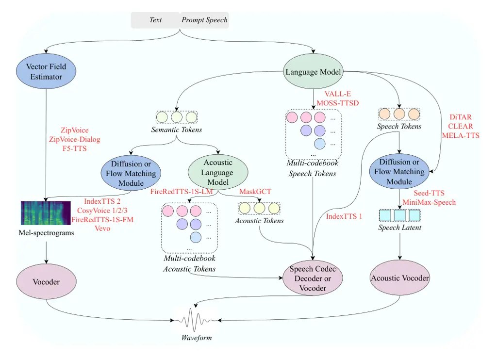

# IndexTTS 2.5 Technical Report

Index Speech Team

###### Abstract

In previous work, we introduced IndexTTS 2, a zero-shot neural
text-to-speech foundation model comprising two core components: a
Transformer-based Text-to-Semantic (T2S) module and a non-autoregressive
Semantic-to-Mel (S2M) module. Jointly, the above two components enable
faithful emotion replication and establish the first autoregressive
duration-controllable generative paradigm. Building upon this, we
present IndexTTS 2.5, which significantly enhances multilingual
coverage, inference speed, and overall synthesis quality through four
key improvements: 1) Semantic Codec Compression: by reducing the
semantic codec frame rate from 50 Hz to 25 Hz, the halved sequence
length substantially decreases costs both training and inference
progress; 2) Architectural Upgrade: we replace the U-DiT-based backbone
of the S2M module with a more efficient Zipformer-based modeling
architecture, achieving less parameters and faster mel-spectrogram
generation speed; 3) Multilingual Extension: we propose three explicit
cross-lingual modeling strategies-boundary-aware alignment, token-level
concatenation, and instruction-guided generation—establishing practical
design principles for zero-shot multilingual emotional TTS that supports
Chinese, English, Japanese, Spanish and Arabic, and enables robust
emotion transfer even without target-language emotional training data; 4) Reinforcement Learning Optimization: we apply Group Relative Policy
Optimization (GRPO) in post-training of the T2S module, improving
pronunciation accuracy and naturalness. Experiments show that IndexTTS
2.5 not only supports broader language coverage but also replicates
emotional prosody in unseen languages with the same zero-shot setting.
IndexTTS 2.5 achieves a 2.28× improvement in real-time factor (RTF)
while maintaining comparable word error rate (WER) and speaker
similarity to IndexTTS 2. Audio demos are available at:
https://index-tts.github.io/index-tts2-5.github.io/.

## 1 Introduction

In recent years, with the continuous advancement of generative
frameworks, large-scale zero-shot text-to-speech (TTS) models have made
remarkable progress, particularly in model architecture innovation \[1,
2, 3, 4, 5, 6, 7\], audio quality enhancement \[8\], emotional
expressiveness \[9, 10\], voice cloning \[11, 12\], and multilingual
coverage \[13, 14\]. Currently, driven by trade-offs in framework
capabilities and target application scenarios, mainstream large-scale
TTS models have diverged into multiple technical paradigms, with their
core differences primarily lying in model architecture design and the
choice of intermediate representation modeling.

As illustrated in Figure 1, modern large-scale zero-shot TTS
architectures typically comprise a set of core components: a
Transformer-based language model, a generative module based on diffusion
or flow matching, a speech codec, and a neural vocoder. Concurrently,
the choice of intermediate representation has evolved significantly—from
early Mel-spectrograms to discrete speech tokens, and further
diversified into semantic tokens, acoustic tokens, and continuous latent
representations. Early large-scale TTS models, such as VALL-E \[1\],
pioneered the use of residual vector quantization (RVQ) \[15, 16\] to
discretize speech into acoustic tokens and leveraged language
models—inspired by the success of large language models—to generate
these discrete tokens conditioned on text and a reference speech prompt
\[17\]. This work demonstrated the effectiveness of leveraging large
language models (LLMs) for zero-shot TTS, helping to establish a
scalable generative framework that influenced subsequent research in
neural speech synthesis. Building upon this foundation, several lines of
model evolution have emerged. For instance, IndexTTS 1 \[6\] discards
the codec decoder entirely and instead trains a more powerful vocoder
\[18\] to reconstruct richer acoustic details directly from discrete
tokens \[19, 20\]. In contrast, models like Seed-TTS \[8\] and
MiniMax-Speech \[14\] adopt a two-stage approach—first generating coarse
speech tokens with a language model, then refining them via a diffusion-
or flow matching–based module to learn fine-grained continuous latent
representations, which are finally converted to waveforms by an acoustic
vocoder. More recently, the speech token has been explicitly decomposed
into semantic and acoustic tokens, the former encodes high-level
linguistic content, prosody, and phonetic information, while the latter
captures low-level acoustic characteristics. The prevailing architecture
today employs a language model to generate semantic tokens, followed
either by another language model that predicts acoustic tokens \[5, 21\]
or by a diffusion or flow matching module \[9, 2, 3, 13, 21\] that
directly generates Mel-spectrograms—a paradigm that has become the
dominant approach in modern zero-shot TTS systems. Moreover, lightweight
models \[22\] such as F5-TTS \[4\] and ZipVoice \[23, 24\] adopt a fully
non-autoregressive approach to directly model the alignment between text
and speech, enabling fast inference while maintaining high naturalness
and audio quality. Recently, driven by deeper analyses of the trade-offs
between discrete tokens and continuous representations—in terms of
information fidelity, modeling efficiency, and generalization
capability—an increasing number of works have shifted toward directly
modeling continuous speech representations \[25, 26, 27\]. This paradigm
aims to eliminate reliance on speech codec technologies and mitigate the
inevitable information loss introduced by discretization.

Figure 1: Schematic diagram of the technical approaches for current
mainstream large-scale zero-shot speech synthesis models.

To better disentangle emotion and speaker characteristics, IndexTTS 2
adopts a classic three-stage pipeline: it first employs a language model
to generate discrete semantic tokens encoding emotion-related attributes
such as pronunciation and prosody, then reconstructs speaker-specific
acoustic details via a flow matching module and a neural vocoder.
However, its limited multilingual coverage and slow inference hinder
deployment in real-world, cross-lingual, or low-latency scenarios. To
address these limitations, we present IndexTTS 2.5, a multilingual
zero-shot TTS model that not only extends language coverage to Chinese,
English, Japanese, Spanish and Arabic, but also preserves high-fidelity
emotional expressiveness. Furthermore, through systematic architectural
improvements and codec compression, IndexTTS 2.5 achieves substantial
reductions in inference latency and computational cost, significantly
enhancing its practical deployability.

Our key practical enhancements are summarized as follows:

- $`\bullet`$
  To extend IndexTTS 2 to a broader set of languages, we first develop a
  multilingual data curation pipeline. Building on this pipeline, we
  propose three modeling strategies—boundary-aware alignment,
  token-level concatenation, and instruction-guided generation—for
  zero-shot cross-lingual TTS. Comprehensive evaluation not only
  confirms their individual effectiveness but also reveals complementary
  strengths among them, yielding practical design principles for future
  multilingual speech synthesis systems.
- $`\bullet`$
  We propose a joint efficiency optimization—reducing the semantic codec
  frame rate from 50 Hz to 25 Hz and replacing U-DiT with the Zipformer
  architecture \[28\] in the flow-matching module—achieving a 2.28×
  reduction in RTF with no perceptible degradation in audio quality.
- $`\bullet`$
  We apply GRPO \[29\] to post-train the language model for semantic
  token generation, leading to consistent gains in prosodic naturalness
  and WER.

## 2 The Multilingual Data Pipeline

Figure 2: Multilingual data processing pipeline.

To improve cross-lingual generalization in IndexTTS 2, we develop a
multilingual data curation pipeline (Figure 2) that efficiently harvests
high-quality speech–text pairs from publicly available sources such as
online videos and audiobooks. The pipeline comprises several key
components: voice activity detection (VAD) and segmentation, automatic
speech recognition (ASR), speaker diarization, audio source separation,
segment merging, and sample quality filtering.

Voice activity detection and segmentation. A voice activity detection
model enhanced with event classification capability. For each audio
segment, it estimates the proportion of speech, singing, accompaniment,
and background noise.

Automatic speech recognition. An integrated ASR system that jointly
performs speech recognition, speaker diarization, and punctuation
restoration. The output for each short segment includes: transcribed
text, speaker ID, and binary flags indicating the presence of multiple
speakers, singing, or musical accompaniment.

Source Separation. Audio segments flagged as containing accompaniment
are processed using the open-source Demucs toolkit \[30\] to extract
vocal tracks. To avoid potential audio degradation, source separation is
applied selectively—only when necessary.

Segment Merging. Short ASR segments are merged into longer utterances
based on speaker consistency, textual coherence, and inter-segment
silence. Each resulting segment contains a single speaker and is
constrained to a maximum duration of 25 seconds.

Sample quality filtering. A two-stage filtering module is applied to
ensure data quality: audio quality filtering employs a pre-trained audio
quality assessment model, while text quality filtering leverages
transcripts from an ASR system to detect and discard low-fidelity or
erroneous transcriptions.

## 3 IndexTTS 2.5

IndexTTS 2.5 retains the overall generation pipeline of IndexTTS 2, with
targeted enhancements in four key components: multilingual
text-to-semantic modeling, semantic codec frame rate compression,
efficient semantic-to-mel conversion based on an improved backbone, and
a reinforcement learning (RL)–based post-training mechanism for
synthesis quality refinement. We describe the design and implementation
of each module in the following subsections.

### 3.1 Multilingual Text-to-Semantic Module

The text-to-semantic module in IndexTTS 2.5 retains the architecture of
IndexTTS 2. Specifically, it takes a structured input in the form of
$`[c,p,e_{\langle BT\rangle},E_{text},e_{\langle BA\rangle},E_{sem}]`$,
let $`c`$ denote a global conditioning vector that captures speaker
identity or emotional attributes, and $`p`$ an auxiliary embedding for
fine-grained duration control. The text is represented as a sequence of
embeddings $`E_{text}`$, while the target semantic tokens—derived by
encoding the ground-truth speech with a semantic codec—are embedded as
$`E_{sem}`$. To facilitate cross-modal alignment, special prefix tokens
$`e_{\langle BT\rangle}`$ and $`e_{\langle BA\rangle}`$ are prepended to
the text and semantic sequences, respectively.

Figure 3: Illustration of three multilingual modelling strategies:
boundary-aware alignment, token-level concatenation, and
instruction-guided generation.

In multilingual settings, character overlap across languages—such as the
extensive use of Chinese characters in Japanese—can lead to
cross-lingual confusion during zero-shot speech synthesis. As shown in
Figure 3, to address this challenge, we propose three targeted
strategies: boundary-aware alignment, token-level concatenation, and
instruction-guided generation.

#### 3.1.1 Boundary-Aware Alignment Strategy

Boundary-aware alignment is designed to enable the T2S module to learn
correct pronunciation in multilingual settings, mitigating confusion
caused by shared characters across languages. Specifically, we insert
language-specific boundary tokens—such as \<ZH\> and \</ZH\> for
Mandarin—around each input utterance to explicitly mark the start and
end of a language segment. The input sequence here is constructed as
$`[c,p,e_{\langle BT\rangle},e_{\langle LID\rangle},E_{text},e_{\langle/LID\rangle},e_{\langle BA\rangle},E_{sem}]`$.
This is one of the simplest yet effective multilingual modeling
strategies, providing clear signals for language boundaries during
training and inference. However, due to the hallucination tendency
inherent in autoregressive generation, its control over pronunciation
degrades on longer utterances, occasionally leading to
mispronunciations.

#### 3.1.2 Token-Level Concatenation Strategy

We propose a token-level strict concatenation strategy, in which each
input text token embedding is fused with a language-specific categorical
embedding. This provides explicit per-token linguistic supervision,
enabling the model to disambiguate pronunciation based on the token’s
linguistic origin—particularly critical for characters shared across
languages. As a result, cross-lingual homograph-induced
mispronunciations are effectively suppressed. However, practical
deployment necessitates a front-end module capable of fine-grained,
token-level language identification, rendering system integration more
complex than with the boundary-aware alignment approach.

#### 3.1.3 Instruction-Guided Generation Strategy

To better exploit the text comprehension capabilities of the underlying
language model, we adopt an instruction-guided generation strategy:
structured natural-language instructions are prepended to the input text
to explicitly condition the model on the target language. To enhance
training diversity and promote contextual awareness, we design a set of
prompt templates (e.g., as shown in Figure 3) and randomly sample one as
the prefix during training. The resulting input sequence follows the
format
$`[c,p,e_{\langle BT\rangle},e_{instr},e_{\langle EOP\rangle},E_{text},e_{\langle BA\rangle},E_{sem}]`$,
where $`e_{instr}`$ denotes the instruction embedding and EOP marks the
end of the prompt. This design eliminates the need for external language
tagging modules at inference time, enabling fully self-contained
multilingual generation. However, in code-switching scenarios with
mixed-language utterances, portions of the instruction may provide
limited utility for speech synthesis, introducing mild redundancy in the
input sequence.

### 3.2 Efficiency-Oriented System Design

To reduce computational overhead and latency in speech generation, we
incorporate two complementary optimizations across the pipeline: 1)
semantic codec compression, which reduces the frame rate from 50 Hz to
25 Hz, halving the length of the target semantic token sequence; and 2)
architectural streamlining, which replaces the U-DiT backbone in the S2M
module with a more parameter-efficient Zipformer architecture \[28\].
The shortened token sequence lowers memory consumption and computational
load during both training and inference, while the compact Zipformer
architecture further reduces model complexity. These design choices
collectively improve inference efficiency with minimal impact on
synthesis quality.

### 3.3 Reinforcement Learning for Post-Training

We fine-tune the text-to-semantic model using GRPO with a
preference-based objective. For each input text prompt—particularly in
multilingual or code-switching scenarios—we generate four diverse speech
candidates via stochastic decoding. These candidates are ranked by a
reward signal that approximates intelligibility through the word error
rate produced by a frozen ASR system, and speaker similarity through a
speaker verification model. Under the GRPO framework, the policy is
updated to increase the relative likelihood of higher-reward (i.e.,
lower WER and higher SS) generations compared to lower-reward ones.

### 3.4 G2P Strategy

The original G2P framework was extended to accommodate Chinese, English,
and Japanese. For Chinese and English, we restricted the lexicon to
entries with unambiguous pronunciations, utilizing the CMU Pronouncing
Dictionary for the latter. n the case of Japanese, Kanji characters were
randomly sampled and converted to Katakana via the fugashi \[31\]. Since
Japanese readings depend on lexical context, direct replacement may
occasionally introduce unnatural pronunciations. This issue can be
alleviated by performing the conversion within segmented text units
rather than across the entire sentence.

## 4 Experiments and Evaluation

### 4.1 Training and Evaluation Datasets

We train a multilingual text-to-speech model covering Mandarin, English,
Japanese, and Spanish, using a total of approximately 100K hours of
speech data. The corpus comprises 30K hours of Mandarin, 25K hours of
English, 42K hours of Japanese, 22.9K hours of Spanish and 20k hours of
Arabic.

Mandarin and English data are derived primarily from the Emilia dataset
\[32\], augmented with audiobooks and commercially licensed recordings.
For Japanese, 1.7K hours originate from Emilia \[32\], with the
remainder obtained through commercial licensing. Spanish data is
aggregated from multiple public sources: Common Voice \[33\], the
Argentinian Spanish Speech Dataset \[34\], the TEDx Spanish Corpus
\[35\], the Crowdsourced High-Quality Spanish Speech Dataset \[36\],
Multilingual LibriSpeech \[37\], and LEMAS \[38\]. For Arabic, all were
obtained through commercial licensing. To support expressive synthesis,
we further incorporate 135 hours of emotional speech, including 29 hours
from the Emotional Speech Dataset (ESD) \[39\] and 106 hours of
high-quality emotional recordings acquired under commercial license.

To evaluate the multilingual modeling approaches, we conducted ablation
studies using the Seed-TTS-Eval benchmark for Chinese and English,
alongside in-house test sets for Japanese and Spanish. Zero-shot and
cross-lingual performances are evaluated on the multilingual CV3-Eval
benchmark. For Arabic, where no standard benchmark is available, we
construct proprietary zero-shot and cross-lingual sets. We also built
our own Spanish cross-lingual set.

### 4.2 Evaluation Metrics and Baselines

We perform a comprehensive evaluation on four dimensions: word error
rate (WER), speaker similarity (SS), emotional similarity (ES), and mean
opinion score (MOS). WER is computed using language-specific ASR models:
FunASR \[40\] for Chinese, and Whisper-large-v3 \[41\] for the others.
Speaker similarity is measured by extracting speaker embeddings from the
reference prompt and the generated utterance using FunASR’s pretrained
speaker verification model \[40\], then computing their cosine
similarity. Emotional similarity is similarly evaluated via cosine
similarity between emotion embeddings extracted with emotion2vec \[42\].
MOS is obtained through subjective listening tests, where native
speakers rate naturalness on a 1–5 scale (1: poor, 5: excellent).

We compare our model against state-of-the-art zero-shot multilingual TTS
systems, including CosyVoice3 \[13\], FireRedTTS-2 \[21\], Fish Audio S2
Pro \[43\], Qwen3-TTS \[44\], VoxCPM2 \[45\], Moss-TTS \[46\], and the
original IndexTTS 2 \[9\].

### 4.3 Comparative Analysis of Multilingual Modelling Methods

| Dataset          | Model                         | SS$`\uparrow`$ | WER(%)$`\downarrow`$ |
| ---------------- | ----------------------------- | -------------- | -------------------- |
| SeedTTS test-zh  | Boundary-Aware Alignment      | 0.797          | 1.602                |
|                  | Token-Level Concatenation     | 0.804          | 1.119                |
|                  | Instruction-Guided Generation | 0.798          | 1.613                |
| SeedTTS test-en  | Boundary-Aware Alignment      | 0.820          | 3.577                |
|                  | Token-Level Concatenation     | 0.823          | 3.253                |
|                  | Instruction-Guided Generation | 0.819          | 3.314                |
| IndexTTS test-ja | Boundary-Aware Alignment      | 0.672          | 10.444               |
|                  | Token-Level Concatenation     | 0.745          | 10.498               |
|                  | Instruction-Guided Generation | 0.667          | 9.226                |
| IndexTTS test-es | Boundary-Aware Alignment      | 0.784          | 5.832                |
|                  | Token-Level Concatenation     | 0.788          | 5.200                |
|                  | Instruction-Guided Generation | 0.779          | 5.399                |

Table 1: Performance comparison of various multilingual modeling methods
(Boundary-Aware Alignment, Token-Level Concatenation, Instruction-Guided
Generation) on Mandarin, English, Japanese, Spanish test sets.

To ensure a fair comparison, all three multilingual modeling
strategies—Boundary-Aware Alignment, Token-Level Concatenation, and
Instruction-Guided Generation—are trained under identical conditions:
using the same multilingual dataset, batch size, optimizer, learning
rate schedule, and hardware resources, with training terminated after
100K steps.

We then conduct a comprehensive evaluation of these models across four
test sets covering Mandarin, English, Japanese, and Spanish. As shown in
Table 1, Token-Level Concatenation consistently achieves the highest
speaker similarity across all languages, indicating its strong
capability in preserving speaker identity during cross-lingual
synthesis. This is attributed to the explicit per-token language
conditioning, which enables fine-grained alignment between input text
and speaker characteristics. Token-Level Concatenation achieves the
lowest WER among all evaluated strategies on Mandarin, English, and
Spanish, with 1.119% on Seed-TTS-Eval test-zh, 3.253% on Seed-TTS-Eval
test-en, and 5.200% on IndexTTS test-es. However, on the IndexTTS
test-ja, its WER is slightly higher than that of Instruction-Guided
Generation, suggesting that the rigid concatenation may introduce subtle
misalignments in morphologically complex languages. In contrast,
Instruction-Guided Generation achieves the lowest WER on Japanese,
likely due to its ability to leverage contextual cues from structured
prompts for better phonetic disambiguation.

Notably, while Boundary-Aware Alignment performs competitively on
Mandarin and English, it underperforms on Japanese and Spanish,
particularly in WER, highlighting its limitation in handling languages
with rich morphology or non-Latin scripts. The consistent improvement of
Token-Level Concatenation across both SS and WER underscores its
robustness and effectiveness in zero-shot multilingual TTS. While
Instruction-Guided Generation offers greater flexibility at inference
time, its performance is sensitive to prompt design and requires careful
engineering, whereas Token-Level Concatenation provides more stable and
reliable results with minimal additional overhead.

### 4.4 Voice Cloning Evaluation

|                   |        |          |       |          |       |          |       |          |       |         |       |         |       |
| ----------------- | ------ | -------- | ----- | -------- | ----- | -------- | ----- | -------- | ----- | ------- | ----- | ------- | ----- |
| Model             | Params | test-zh  |       | test-en  |       | test-es  |       | test-ja  |       | test-ar |       | Average |       |
|                   |        | WER      | SS    | WER      | SS    | WER      | SS    | WER      | SS    | WER     | SS    | WER     | SS    |
| VoxCPM2           | 2B     | 3.88     | 74.99 | 5.13     | 71.57 | 5.49     | 74.67 | 6.69     | 72.90 | 14.94   | 65.99 | 7.22    | 72.02 |
| OmniVoice         | 0.8B   | 3.41     | 72.99 | 3.62     | 70.13 | 3.52     | 74.14 | 5.38     | 70.49 | 17.88   | 64.22 | 6.76    | 70.39 |
| Moss-TTS 1.5      | 8B     | 4.02     | 72.68 | 4.45     | 67.46 | 3.83     | 71.75 | 10.97    | 68.71 | 23.71   | 62.21 | 9.40    | 68.56 |
| CosyVoice3-0.5B   | 0.5B   | 3.84     | 80.01 | 4.88     | 74.16 | 4.04     | 78.85 | –        | 76.36 | –       | –     |         |       |
| CosyVoice3-1.5B   | 1.5B   | 3.91^(†) | –     | 4.99^(†) | –     | 4.47^(†) | –     | 7.57^(†) | –     | –       | –     | –       | –     |
| FireRedTTS-2      | 1.5B   | 8.22     | 68.10 | 14.92    | 56.93 | –        | –     | –        | –     | –       | –     | –       | –     |
| Fish Audio S2 Pro | 4B     | 3.62     | 67.79 | 3.83     | 61.66 | 2.93     | 67.44 | 5.15     | 66.15 | 14.15   | 59.43 | 5.94    | 64.49 |
| Qwen3-TTS         | 1.7B   | 3.27     | 73.02 | 5.06     | 67.17 | 2.87     | 73.17 | 5.89     | 70.18 | –       | –     | –       | –     |
| IndexTTS2.5       | 0.8B   | 4.36     | 77.10 | 5.12     | 68.06 | 3.75     | 76.39 | 5.66     | 74.62 | 14.88   | 69.74 | 6.75    | 73.18 |
| IndexTTS2.5-RL    | 0.8B   | 3.93     | 77.92 | 3.89     | 67.79 | 3.33     | 76.68 | 5.30     | 75.41 | 13.58   | 70.36 | 6.00    | 73.63 |

|                   |        |                     |       |                     |       |                     |       |                     |       |         |       |
| ----------------- | ------ | ------------------- | ----- | ------------------- | ----- | ------------------- | ----- | ------------------- | ----- | ------- | ----- |
| Model             | Params | zh$`\rightarrow`$en |       | zh$`\rightarrow`$es |       | zh$`\rightarrow`$ja |       | zh$`\rightarrow`$ar |       | Average |       |
|                   |        | WER                 | SS    | WER                 | SS    | WER                 | SS    | WER                 | SS    | WER     | SS    |
| VoxCPM2           | 2B     | 4.48                | 64.25 | 16.38               | 64.89 | 11.84               | 71.54 | 11.09               | 67.62 | 10.95   | 67.08 |
| OmniVoice         | 0.8B   | 3.74                | 64.91 | 5.84                | 62.08 | 9.09                | 69.06 | 19.80               | 65.27 | 9.62    | 65.33 |
| Moss-TTS 1.5      | 8B     | 6.13                | 59.23 | 4.32                | 56.63 | 11.52               | 65.54 | 17.03               | 62.93 | 9.75    | 61.08 |
| CosyVoice3-0.5B   | 0.5B   | 3.23                | 62.79 | 4.58                | 64.04 | –                   | –     | –                   | –     | –       | –     |
| CosyVoice3-1.5B   | 1.5B   | 4.32                | –     | –                   | –     | 13.70^(†)           | –     | –                   | –     | –       | –     |
| FireRedTTS-2      | 1.5B   | 9.34                | 53.19 | 12.25               | 58.31 | 19.05               | 64.12 | –                   | –     | –       | –     |
| Fish Audio S2 Pro | 4B     | 4.14                | 55.89 | 4.46                | 55.57 | 10.48               | 61.74 | 14.49               | 59.80 | 8.39    | 58.25 |
| Qwen3-TTS         | 1.7B   | 5.74                | 63.04 | 5.15                | 68.02 | 36.09               | 65.71 | –                   | –     | –       | –     |
| IndexTTS2.5       | 0.8B   | 3.62                | 63.83 | 5.17                | 65.48 | 6.57                | 74.16 | 9.51                | 71.02 | 6.22    | 68.62 |
| IndexTTS2.5-RL    | 0.8B   | 3.55                | 67.47 | 4.86                | 64.47 | 6.38                | 75.82 | 9.89                | 73.05 | 6.17    | 70.20 |

Table 2: Zero-shot TTS evaluation results. WER (%) $`\downarrow`$ and
Speaker Similarity (SS) $`\uparrow`$ are reported. ^(†)Results cited
from the original paper.

Table 3: Cross-lingual TTS evaluation (Chinese prompt $`\rightarrow`$
target language). WER (%) $`\downarrow`$ and Speaker Similarity (SS)
$`\uparrow`$ are reported. ^(†)Results cited from the original paper.

We first evaluate zero-shot TTS performance across five target
languages. As shown in Table 3, despite having only 0.8B parameters,
IndexTTS 2.5 achieves the strongest overall performance among all
compared models, with the lowest average WER (6.75) and the best average
speaker similarity (73.18). While CosyVoice3-0.5B achieves higher
speaker similarity on several individual language benchmarks and Fish
Audio S2 Pro achieves lower average WER, IndexTTS 2.5 provides a more
balanced performance, maintaining competitive speaker similarity while
achieving consistently low WER across all evaluated languages. After RL
fine-tuning, IndexTTS 2.5-RL further reduces the average WER from 6.75
to 6.00 and improves the average speaker similarity from 73.18 to 73.63,
with consistent gains observed on English, Japanese, and Arabic.

We further evaluate cross-lingual TTS generation using Chinese speech
prompts and target texts in English, Spanish, Japanese, and Arabic.
Table 3 presents the corresponding results. IndexTTS 2.5 achieves the
strongest overall cross-lingual performance, obtaining the lowest
average WER (6.22) and the best average speaker similarity (68.62).
Although CosyVoice3-0.5B achieves the lowest WER on the
Chinese-to-English benchmark, IndexTTS 2.5 shows more consistent
performance across different target languages, particularly on Japanese
and Arabic. RL fine-tuning further improves the average WER to 6.17 and
increases the average speaker similarity to 70.20, demonstrating
additional gains in cross-lingual voice cloning.

### 4.5 Multilingual Emotional TTS Evaluation

We evaluate emotion cloning performance using our in-house emotional
speech benchmark and the CV3-Eval emotion-zeroshot benchmark, comparing
IndexTTS 2.5 with CosyVoice 3. As shown in Table 4, on the internal
Japanese and Spanish emotional test sets, IndexTTS 2.5 consistently
produces higher emotion similarity (ES) while maintaining competitive
WER and SS. It also receives a higher MOS score than CosyVoice 3. For
the Arabic evaluation, Japanese speeches are used as the prompt audio
due to the lack of matched prompt data. Although this cross-lingual
setting could result in a lower speaker similarity score, the model
still achieves a MOS of 4.18, demonstrating that it can effectively
transfer emotional characteristics across languages. Note that for
Arabic, Japanese speech was used as the prompt, potentially leading to a
lower SS. In particular, the model achieves strong zero-shot emotion
transfer on unseen languages, even though it was trained using only
Chinese and English emotional speech data.

| Model       | IndexTTS test-es-emo |                   |                |                 | IndexTTS test-ja-emo |                   |                |                 | IndexTTS test-ar-emo |                   |                |                 |
| ----------- | -------------------- | ----------------- | -------------- | --------------- | -------------------- | ----------------- | -------------- | --------------- | -------------------- | ----------------- | -------------- | --------------- |
|             | SS$`\uparrow`$       | WER$`\downarrow`$ | ES$`\uparrow`$ | MOS$`\uparrow`$ | SS$`\uparrow`$       | WER$`\downarrow`$ | ES$`\uparrow`$ | MOS$`\uparrow`$ | SS$`\uparrow`$       | WER$`\downarrow`$ | ES$`\uparrow`$ | MOS$`\uparrow`$ |
| CosyVoice 3 | 0.811                | 8.574             | 0.831          | 3.96            | 0.765                | 10.28             | 0.844          | 3.52            | -                    | -                 | -              | -               |
| IndexTTS2.5 | 0.796                | 9.035             | 0.922          | 4.15            | 0.759                | 7.387             | 0.896          | 3.93            | 0.698                | 2.91              | 0.869          | 4.18            |

Table 4: Objective and subjective metrics on Japanese, Spanish, and
Arabic emotional test sets.

We further evaluate emotion perception using the CV3-Eval
Emotion-ZeroShot benchmark , as summarized in Tables 5, IndexTTS 2.5
consistently outperforms CosyVoice 3 on both Chinese and English across
all reported metrics. The overall accuracy improves from 0.467 to 0.713
in Chinese and from 0.567 to 0.673 in English, while the weighted
F1-score increases from 0.585 to 0.790 and from 0.670 to 0.759,
respectively. The above analyses further break down these improvements
by emotion category and intensity level.

| Lang | Model        | Overall |       | Emotion F1 |       |       | Intensity Acc |       |
| ---- | ------------ | ------- | ----- | ---------- | ----- | ----- | ------------- | ----- |
|      |              | Acc     | W-F1  | Angry      | Happy | Sad   | High          | Low   |
| zh   | CosyVoice 3  | 0.467   | 0.585 | 0.457      | 0.688 | 0.611 | 0.720         | 0.213 |
|      | IndexTTS 2.5 | 0.713   | 0.790 | 0.705      | 0.931 | 0.734 | 0.813         | 0.613 |
| en   | CosyVoice 3  | 0.567   | 0.670 | 0.705      | 0.667 | 0.640 | 0.720         | 0.413 |
|      | IndexTTS 2.5 | 0.673   | 0.759 | 0.800      | 0.776 | 0.701 | 0.813         | 0.533 |

Table 5: Emotion perception evaluation on the CV3-Eval Emotion-ZeroShot
benchmark.

### 4.6 Semantic-to-Mel Architecture Ablation

We conduct a subjective preference evaluation between U-DiT and
Zipformer as backbone architectures for the S2M module, using a held-out
test subset. Listeners compare generated audio pairs along three
dimensions: speech quality, speaker similarity, and prosodic
naturalness.

Figure 4: Subjective preference comparison of U-DiT and Zipformer
backbone architectures in the S2M module.

As shown in Figure 4, the system employing the Zipformer-based backbone
is preferred in 56% of trials, compared to 40% for the U-DiT-based
variant, with 4% of responses indicating no clear preference. This
consistent preference suggests that the Zipformer-based architecture
generates more natural and speaker-consistent speech, likely due to its
efficient modeling of long-range dependencies and stable training
dynamics. The results highlight that, despite its simpler design, the
Zipformer-based flow-matching module achieves stronger perceptual
performance than the more complex U-DiT counterpart in zero-shot
multilingual TTS, offering a favorable trade-off between model capacity
and synthesis quality.

### 4.7 Inference Performance Comparison

|                          |                   |       |
| ------------------------ | ----------------- | ----- |
| Model                    | RTF$`\downarrow`$ |       |
| T2S                      | S2M               |       |
| IndexTTS 2               | 0.232             | 0.078 |
| IndexTTS 2.5 (U-DiT)     | 0.119             | 0.081 |
| IndexTTS 2.5 (Zipformer) | 0.119             | 0.017 |

Table 6: Inference speed comparison of IndexTTS 2 series models.

Table 6 summarizes the inference efficiency of the IndexTTS 2 series
under identical hardware conditions (NVIDIA A10 GPU and Intel Xeon
Platinum 8350C CPU). IndexTTS 2.5 achieves substantially lower RTF in
both the T2S and S2M modules compared to IndexTTS 2. The RTF reduction
in T2S—from 0.232 to 0.119—stems from frame-rate compression in the
neural codec, which shortens the semantic token sequence while
preserving linguistic fidelity. In parallel, architectural improvements
in the S2M module, particularly the adoption of the Zipformer backbone,
reduce its RTF to 0.017. These optimizations enable faster inference
without degrading synthesis quality.

## 5 Conclusion

IndexTTS 2.5 enhances zero-shot multilingual emotional text-to-speech
synthesis through four core improvements: semantic codec compression, an
optimized S2M architecture based on Zipformer, cross-lingual modeling
strategies, and reinforcement learning–based T2S optimization.
Experimental results show that these enhancements jointly enable
high-quality synthesis across Chinese, English, Japanese, and Spanish,
preserving both speaker identity and emotional prosody in unseen
languages. While achieving a 2.28× reduction in real-time factor, the
system maintains low WER and high SS. These results demonstrate that
IndexTTS 2.5 achieves an effective balance between inference efficiency
and synthesis quality, making it suitable for real-world deployment of
expressive multilingual speech synthesis.

## 6 Contributors

The contributors are listed in order of contribution:

Yunpei Li, Xun Zhou, Jinchao Wang, Lu Wang, Yong Wu, Siyi Zhou, Yiquan
Zhou, Yining Wang, Yaogen Yang, Zhetao Hu, Shiyao Duan, Jiacheng Xu,
Jingchen Shu, Bin Xia

## References

- \[1\] C. Wang, S. Chen, Y. Wu, Z. Zhang, L. Zhou, S. Liu, Z. Chen, Y.
  Liu, H. Wang, J. Li, L. He, S. Zhao, and F. Wei (2023) Neural codec
  language models are zero-shot text to speech synthesizers. CoRR
  abs/2301.02111. External Links:
  [Document](https://dx.doi.org/10.48550/ARXIV.2301.02111), 2301.02111
  Cited by: §1, §1.
- \[2\] Z. Du, Q. Chen, S. Zhang, K. Hu, H. Lu, Y. Yang, H. Hu, S.
  Zheng, Y. Gu, Z. Ma, et al. (2024) Cosyvoice: a scalable multilingual
  zero-shot text-to-speech synthesizer based on supervised semantic
  tokens. arXiv preprint arXiv:2407.05407. Cited by: §1, §1.
- \[3\] Z. Du, Y. Wang, Q. Chen, X. Shi, X. Lv, T. Zhao, Z. Gao, Y.
  Yang, C. Gao, H. Wang, et al. (2024) Cosyvoice 2: scalable streaming
  speech synthesis with large language models. arXiv preprint
  arXiv:2412.10117. Cited by: §1, §1.
- \[4\] Y. Chen, Z. Niu, Z. Ma, K. Deng, C. Wang, J. Zhao, K. Yu, and X.
  Chen (2024) F5-tts: a fairytaler that fakes fluent and faithful speech
  with flow matching. arXiv preprint arXiv:2410.06885. Cited by: §1, §1.
- \[5\] Y. Wang, H. Zhan, L. Liu, R. Zeng, H. Guo, J. Zheng, Q.
  Zhang, X. Zhang, S. Zhang, and Z. Wu (2024) Maskgct: zero-shot
  text-to-speech with masked generative codec transformer. arXiv
  preprint arXiv:2409.00750. Cited by: §1, §1.
- \[6\] W. Deng, S. Zhou, J. Shu, J. Wang, and L. Wang (2025) IndexTTS:
  an industrial-level controllable and efficient zero-shot
  text-to-speech system. arXiv preprint arXiv:2502.05512. Cited by: §1,
  §1.
- \[7\] X. Wang, M. Jiang, Z. Ma, Z. Zhang, S. Liu, L. Li, Z. Liang, Q.
  Zheng, R. Wang, X. Feng, et al. (2025) Spark-tts: an efficient
  llm-based text-to-speech model with single-stream decoupled speech
  tokens. arXiv preprint arXiv:2503.01710. Cited by: §1.
- \[8\] P. Anastassiou, J. Chen, J. Chen, Y. Chen, Z. Chen, Z. Chen, J.
  Cong, L. Deng, C. Ding, L. Gao, et al. (2024) Seed-tts: a family of
  high-quality versatile speech generation models. arXiv preprint
  arXiv:2406.02430. Cited by: §1, §1.
- \[9\] S. Zhou, Y. Zhou, Y. He, X. Zhou, J. Wang, W. Deng, and J.
  Shu (2025) IndexTTS2: A breakthrough in emotionally expressive and
  duration-controlled auto-regressive zero-shot text-to-speech. CoRR
  abs/2506.21619. External Links:
  [Document](https://dx.doi.org/10.48550/ARXIV.2506.21619), 2506.21619
  Cited by: §1, §1, §4.2.
- \[10\] Y. Zhou, G. Zeng, X. Liu, X. Li, R. Yu, Z. Wang, R. Ye, W.
  Sun, J. Gui, K. Li, Z. Wu, and Z. Liu (2025) VoxCPM: tokenizer-free
  TTS for context-aware speech generation and true-to-life voice
  cloning. CoRR abs/2509.24650. External Links:
  [Document](https://dx.doi.org/10.48550/ARXIV.2509.24650), 2509.24650
  Cited by: §1.
- \[11\] S. Liu (2024) Zero-shot voice conversion with diffusion
  transformers. arXiv preprint arXiv:2411.09943. Cited by: §1.
- \[12\] X. Zhang, X. Zhang, K. Peng, Z. Tang, V. Manohar, Y. Liu, J.
  Hwang, D. Li, Y. Wang, J. Chan, et al. (2025) Vevo: controllable
  zero-shot voice imitation with self-supervised disentanglement. arXiv
  preprint arXiv:2502.07243. Cited by: §1.
- \[13\] Z. Du, C. Gao, Y. Wang, F. Yu, T. Zhao, H. Wang, X. Lv, H.
  Wang, C. Ni, X. Shi, K. An, G. Yang, Y. Li, Y. Chen, Z. Gao, Q.
  Chen, Y. Gu, M. Chen, Y. Chen, S. Zhang, W. Wang, and J. Ye (2025)
  CosyVoice 3: towards in-the-wild speech generation via scaling-up and
  post-training. CoRR abs/2505.17589. External Links:
  [Document](https://dx.doi.org/10.48550/ARXIV.2505.17589), 2505.17589
  Cited by: §1, §1, §4.2.
- \[14\] B. Zhang, C. Guo, G. Yang, H. Yu, H. Zhang, H. Lei, J. Mai, J.
  Yan, K. Yang, M. Yang, P. Huang, R. Jin, S. Jiang, W. Cheng, Y. Li, Y.
  Xiao, Y. Zhou, Y. Zhang, Y. Lu, and Y. He (2025) MiniMax-speech:
  intrinsic zero-shot text-to-speech with a learnable speaker encoder.
  CoRR abs/2505.07916. External Links:
  [Document](https://dx.doi.org/10.48550/ARXIV.2505.07916), 2505.07916
  Cited by: §1, §1.
- \[15\] Z. Borsos, R. Marinier, D. Vincent, E. Kharitonov, O.
  Pietquin, M. Sharifi, D. Roblek, O. Teboul, D. Grangier, M.
  Tagliasacchi, and N. Zeghidour (2023) AudioLM: A language modeling
  approach to audio generation. IEEE ACM Trans. Audio Speech Lang.
  Process. 31, pp. 2523–2533. External Links:
  [Document](https://dx.doi.org/10.1109/TASLP.2023.3288409) Cited by:
  §1.
- \[16\] A. van den Oord, O. Vinyals, and K. Kavukcuoglu (2017) Neural
  discrete representation learning. In Advances in Neural Information
  Processing Systems 30: Annual Conference on Neural Information
  Processing Systems 2017, December 4-9, 2017, Long Beach, CA, USA,
  pp. 6306–6315. Cited by: §1.
- \[17\] O. Team (2025) MOSS-ttsd: text to spoken dialogue generation.
  External Links: [Link](https://www.open-moss.com/en/moss-ttsd/) Cited
  by: §1.
- \[18\] S. Lee, W. Ping, B. Ginsburg, B. Catanzaro, and S. Yoon (2023)
  BigVGAN: A universal neural vocoder with large-scale training. In The
  Eleventh International Conference on Learning Representations, ICLR
  2023, Kigali, Rwanda, May 1-5, 2023, Cited by: §1.
- \[19\] S. Liao, Y. Wang, T. Li, Y. Cheng, R. Zhang, R. Zhou, and Y.
  Xing (2024) Fish-speech: leveraging large language models for advanced
  multilingual text-to-speech synthesis. arXiv preprint
  arXiv:2411.01156. Cited by: §1.
- \[20\] E. Casanova, K. Davis, E. Gölge, G. Göknar, I. Gulea, L.
  Hart, A. Aljafari, J. Meyer, R. Morais, S. Olayemi, et al. (2024)
  Xtts: a massively multilingual zero-shot text-to-speech model. arXiv
  preprint arXiv:2406.04904. Cited by: §1.
- \[21\] H. Guo, Y. Hu, K. Liu, F. Shen, X. Tang, Y. Wu, F. Xie, K. Xie,
  and K. Xu (2024) Fireredtts: a foundation text-to-speech framework for
  industry-level generative speech applications. arXiv preprint
  arXiv:2409.03283. Cited by: §1, §4.2.
- \[22\] S. E. Eskimez, X. Wang, M. Thakker, C. Li, C. Tsai, Z. Xiao, H.
  Yang, Z. Zhu, M. Tang, X. Tan, Y. Liu, S. Zhao, and N. Kanda (2024) E2
  TTS: embarrassingly easy fully non-autoregressive zero-shot TTS. In
  IEEE Spoken Language Technology Workshop, SLT 2024, Macao, December
  2-5, 2024, pp. 682–689. Cited by: §1.
- \[23\] H. Zhu, W. Kang, Z. Yao, L. Guo, F. Kuang, Z. Li, W. Zhuang, L.
  Lin, and D. Povey (2025) ZipVoice: fast and high-quality zero-shot
  text-to-speech with flow matching. CoRR abs/2506.13053. External
  Links: [Document](https://dx.doi.org/10.48550/ARXIV.2506.13053),
  2506.13053 Cited by: §1.
- \[24\] Z. Han, W. Kang, L. Guo, Z. Yao, F. Kuang, W. Zhuang, Z. Li, Z.
  Han, D. Zhang, X. Zhang, X. Song, L. Lin, and D. Povey (2025)
  ZipVoice-dialog: non-autoregressive spoken dialogue generation with
  flow matching. CoRR abs/2507.09318. External Links:
  [Document](https://dx.doi.org/10.48550/ARXIV.2507.09318), 2507.09318
  Cited by: §1.
- \[25\] D. Jia, Z. Chen, J. Chen, C. Du, J. Wu, J. Cong, X. Zhuang, C.
  Li, Z. Wei, Y. Wang, and Y. Wang (2025) DiTAR: diffusion transformer
  autoregressive modeling for speech generation. In Forty-second
  International Conference on Machine Learning, ICML 2025, Vancouver,
  BC, Canada, July 13-19, 2025, Cited by: §1.
- \[26\] C. Y. Wu, J. Deng, G. Li, Q. Kong, and S. Lui (2025) CLEAR:
  continuous latent autoregressive modeling for high-quality and
  low-latency speech synthesis. External Links: 2508.19098 Cited by: §1.
- \[27\] K. An, Z. Zhang, C. Gao, Y. Li, Z. Peng, H. Wang, Z. Du, H.
  Zhao, Z. Gao, and X. Li (2025) MELA-tts: joint transformer-diffusion
  model with representation alignment for speech synthesis. External
  Links: 2509.14784 Cited by: §1.
- \[28\] Z. Yao, L. Guo, X. Yang, W. Kang, F. Kuang, Y. Yang, Z. Jin, L.
  Lin, and D. Povey (2024) Zipformer: a faster and better encoder for
  automatic speech recognition. External Links: 2310.11230 Cited by:
  item ∙ , §3.2.
- \[29\] Z. Shao, P. Wang, Q. Zhu, R. Xu, J. Song, X. Bi, H. Zhang, M.
  Zhang, Y. K. Li, Y. Wu, and D. Guo (2024) DeepSeekMath: pushing the
  limits of mathematical reasoning in open language models. External
  Links: 2402.03300 Cited by: item ∙ .
- \[30\] S. Rouard, F. Massa, and A. Défossez (2023) Hybrid transformers
  for music source separation. In ICASSP 23, Cited by: §2.
- \[31\] P. McCann (2020) Fugashi, a tool for tokenizing Japanese in
  python. In Proceedings of Second Workshop for NLP Open Source Software
  (NLP-OSS), Online, pp. 44–51. External Links:
  [Link](https://www.aclweb.org/anthology/2020.nlposs-1.7) Cited by:
  §3.4.
- \[32\] H. He, Z. Shang, C. Wang, X. Li, Y. Gu, H. Hua, L. Liu, C.
  Yang, J. Li, P. Shi, et al. (2024) Emilia: an extensive, multilingual,
  and diverse speech dataset for large-scale speech generation. In 2024
  IEEE Spoken Language Technology Workshop (SLT), pp. 885–890. Cited by:
  §4.1.
- \[33\] R. Ardila, M. Branson, K. Davis, M. Henretty, M. Kohler, J.
  Meyer, R. Morais, L. Saunders, F. M. Tyers, and G. Weber (2020) Common
  voice: a massively-multilingual speech corpus. External Links:
  1912.06670 Cited by: §4.1.
- \[34\] A. Guevara-Rukoz, I. Demirsahin, F. He, S. C. Chu, S. Sarin, K.
  Pipatsrisawat, A. Gutkin, A. Butryna, and O. Kjartansson (2020)
  Crowdsourcing Latin American Spanish for Low-Resource Text-to-Speech.
  In Proceedings of The 12th Language Resources and Evaluation
  Conference (LREC), pp. 6504–6513. Cited by: §4.1.
- \[35\] C. D. Hernandez-Mena (2019) TEDx Spanish Corpus. Audio and
  transcripts in Spanish taken from the TEDx Talks; shared under the CC
  BY-NC-ND 4.0 license. Universidad Nacional Autonoma de Mexico. Note:
  Web Download Cited by: §4.1.
- \[36\] A. Guevara-Rukoz, I. Demirsahin, F. He, S. C. Chu, S. Sarin, K.
  Pipatsrisawat, A. Gutkin, A. Butryna, and O. Kjartansson (2020)
  Crowdsourcing Latin American Spanish for Low-Resource Text-to-Speech.
  In Proceedings of The 12th Language Resources and Evaluation
  Conference (LREC), Marseille, France, pp. 6504–6513. External Links:
  ISBN 979-10-95546-34-4 Cited by: §4.1.
- \[37\] V. Pratap, Q. Xu, A. Sriram, G. Synnaeve, and R.
  Collobert (2020) MLS: A large-scale multilingual dataset for speech
  research. In 21st Annual Conference of the International Speech
  Communication Association, Interspeech 2020, Virtual Event, Shanghai,
  China, October 25-29, 2020, H. Meng, B. Xu, and T. F. Zheng (Eds.),
  pp. 2757–2761. External Links:
  [Document](https://dx.doi.org/10.21437/INTERSPEECH.2020-2826) Cited
  by: §4.1.
- \[38\] Z. Zhao, L. Lin, Y. Zhu, K. Xie, Y. Liu, and Y. Li (2026)
  LEMAS: a 150k-hour large-scale extensible multilingual audio suite
  with generative speech models. arXiv preprint arXiv:2601.04233. Cited
  by: §4.1.
- \[39\] K. Zhou, B. Sisman, R. Liu, and H. Li (2021) Seen and unseen
  emotional style transfer for voice conversion with a new emotional
  speech dataset. In ICASSP 2021 - 2021 IEEE International Conference on
  Acoustics, Speech and Signal Processing (ICASSP), Vol. , pp. 920–924.
  External Links:
  [Document](https://dx.doi.org/10.1109/ICASSP39728.2021.9413391) Cited
  by: §4.1.
- \[40\] Z. Gao, Z. Li, J. Wang, H. Luo, X. Shi, M. Chen, Y. Li, L.
  Zuo, Z. Du, and S. Zhang (2023) FunASR: A fundamental end-to-end
  speech recognition toolkit. In 24th Annual Conference of the
  International Speech Communication Association, Interspeech 2023,
  Dublin, Ireland, August 20-24, 2023, pp. 1593–1597. Cited by: §4.2.
- \[41\] A. Radford, J. W. Kim, T. Xu, G. Brockman, C. McLeavey, and I.
  Sutskever Robust speech recognition via large-scale weak supervision.
  In International Conference on Machine Learning, ICML 2023, 23-29 July
  2023, Honolulu, Hawaii, USA, Vol. 202, pp. 28492–28518. Cited by:
  §4.2.
- \[42\] Z. Ma, Z. Zheng, J. Ye, J. Li, Z. Gao, S. Zhang, and X.
  Chen (2024) Emotion2vec: self-supervised pre-training for speech
  emotion representation. In Findings of the Association for
  Computational Linguistics, ACL 2024, Bangkok, Thailand and virtual
  meeting, August 11-16, 2024, L. Ku, A. Martins, and V. Srikumar
  (Eds.), pp. 15747–15760. Cited by: §4.2.
- \[43\] S. Liao, Y. Wang, S. Liu, Y. Cheng, R. Zhang, T. Li, S. Li, Y.
  Zheng, X. Liu, Q. Wang, Z. Zhou, J. Liu, X. Chen, and D. Han (2026)
  Fish audio s2 technical report. External Links: 2603.08823,
  [Link](https://arxiv.org/abs/2603.08823) Cited by: §4.2.
- \[44\] H. Hu, X. Zhu, T. He, D. Guo, B. Zhang, X. Wang, Z. Guo, Z.
  Jiang, H. Hao, Z. Guo, X. Zhang, P. Zhang, B. Yang, J. Xu, J. Zhou,
  and J. Lin (2026) Qwen3-tts technical report. arXiv preprint
  arXiv:2601.15621. Cited by: §4.2.
- \[45\] Y. Zhou, G. Zeng, X. Liu, X. Li, R. Yu, J. Gui, J. Wu, Z.
  Wang, X. Shen, R. Ye, Z. Zhang, J. Zhou, B. Bai, W. Sun, M. Deng, Q.
  Shi, Z. Wu, and Z. Liu (2026) VoxCPM2 technical report. arXiv preprint
  arXiv:2606.06928. Cited by: §4.2.
- \[46\] Y. Gong, B. Jiang, Y. Zhao, Y. Yuan, K. Chen, Y. Jiang, C.
  Chang, D. Hong, M. Chen, R. Li, Y. Zhang, Y. Gao, H. Chen, K. Chen, S.
  Wang, X. Yang, Y. Zhang, K. Huang, Z. Lin, K. Yu, Z. Chen, J. Wang, Z.
  Fei, Q. Cheng, S. Li, and X. Qiu (2026) MOSS-tts technical report.
  External Links: 2603.18090, [Link](https://arxiv.org/abs/2603.18090)
  Cited by: §4.2.
- \[47\] A. Conneau, M. Ma, S. Khanuja, Y. Zhang, V. Axelrod, S.
  Dalmia, J. Riesa, C. Rivera, and A. Bapna (2022) FLEURS: few-shot
  learning evaluation of universal representations of speech. External
  Links: 2205.12446, [Link](https://arxiv.org/abs/2205.12446)
- \[48\] T. Guo, C. Wen, D. Jiang, N. Luo, R. Zhang, S. Zhao, W. Li, C.
  Gong, W. Zou, K. Han, et al. (2021) Didispeech: a large scale mandarin
  speech corpus. In ICASSP 2021-2021 IEEE International Conference on
  Acoustics, Speech and Signal Processing (ICASSP), pp. 6968–6972.
- \[49\] H. Zhu, L. Ye, W. Kang, Z. Yao, L. Guo, F. Kuang, Z. Han, W.
  Zhuang, L. Lin, and D. Povey (2026) OmniVoice: towards omnilingual
  zero-shot text-to-speech with diffusion language models. arXiv
  preprint arXiv:2604.00688.

\*
