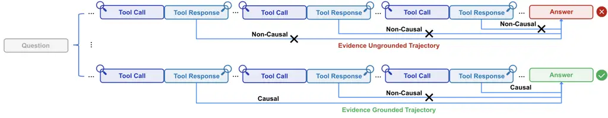
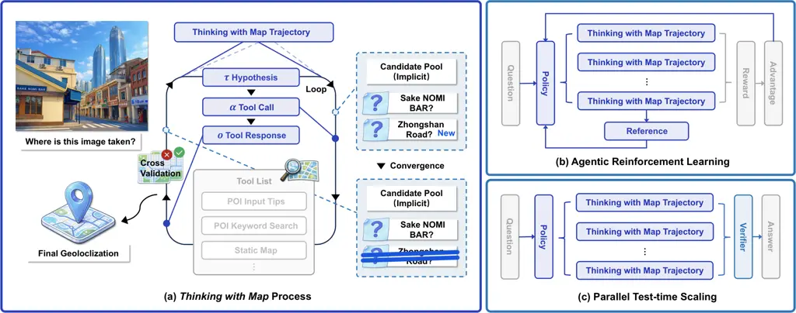

# Thinking with Map: Reinforced Parallel Map-Augmented Agent for Geolocalization

Yuxiang Ji^(1,2)  Yong Wang²  Ziyu Ma²  Yiming Hu²  Hailang Huang²    
Xuecai Hu²  Guanhua Chen³  Liaoni Wu¹  Xiangxiang Chu²  
¹Xiamen University ²AMAP, Alibaba Group ³Southern University of Science
and Technology

![[Uncaptioned
image]](arxiv-2601-05432--1d69b8b131b7.figures/figure-1.webp)
[https://amap-ml.github.io/Thinking-with-Map](https://amap-ml.github.io/Thinking-with-Map)
^(†)^(†)thanks: Work done during internship at AMAP, Alibaba
Group.^(†)^(†)thanks: Project lead.

###### Abstract

The image geolocalization task aims to predict the location where an
image was taken anywhere on Earth using visual clues. Existing large
vision-language model (LVLM) approaches leverage world knowledge,
chain-of-thought reasoning, and agentic capabilities, but overlook a
common strategy used by humans — using maps. In this work, we first
equip the model Thinking with Map ability and formulate it as an
agent-in-the-map loop. We develop a two-stage optimization scheme for
it, including agentic reinforcement learning (RL) followed by parallel
test-time scaling (TTS). The RL strengthens the agentic capability of
model to improve sampling efficiency, and the parallel TTS enables the
model to explore multiple candidate paths before making the final
prediction, which is crucial for geolocalization. To evaluate our method
on up-to-date and in-the-wild images, we further present MAPBench, a
comprehensive geolocalization training and evaluation benchmark composed
entirely of real-world images. Experimental results show that our method
outperforms existing open- and closed-source models on most metrics,
specifically improving Acc@500m from 8.0% to 22.1% compared to
Gemini-3-Pro with Google Search/Map grounded mode.

![[Uncaptioned
image]](arxiv-2601-05432--1d69b8b131b7.figures/figure-2.webp)

Figure 1: (Up) The illustration of a complete Thinking with Map process.
(Bottom) Comparison with up-to-date open- and closed-source models on
three geolocalization benchmarks. Our method is built upon the model
Qwen3-VL-30B-A3B. POI represents Point of Interest.

## 1 Introduction



Figure 2: The Thinking with Map trajectories from parallel sampling. The
abundant map-API results make the trajectories easily verified based on
their causal relationships.

Image geolocalization is a challenging task to determine the latitude
and longitude of an image as accurately as possible. Conventional vision
research typically attributes this problem to a classification (Seo et
al., 2018; Weyand et al., 2016; Müller-Budack et al., 2018; Clark et
al., 2023) or retrieval (Ji et al., 2025a; Ji et al., 2025b; Haas et
al., 2024; Yang et al., 2021; Jia et al., 2024) task, achieving
localization by predicting a region-level cell or retrieving the most
similar image from a geo-tagged database. Although these methods are
well established in applications such as indoor localization (Taira et
al., 2018; Sarlin et al., 2019) and landmark recognition (Arandjelovic
et al., 2016; Noh et al., 2017; Weyand et al., 2020; Zheng et al.,
2009), they treat the entire image as a coupled feature for
discrimination and fail to disentangle independent clues. This less
interpretable paradigm is inherently constrained by the training data
and is difficult to generalize to images in the wild.

In the era of large vision-language models (LVLM), geolocalization can
be viewed as a natural testbed for vision, understanding and reasoning.
Beyond single-image discriminative paradigm, it requires LVLMs to
inspect visual clues (e.g., climate, architecture, and cultural context)
in detail, and reason over the complex intersection of evidence to make
the final prediction. This process is closer to how human beings behave
when inferring image locations. Recent studies follow frontier
models (DeepSeek-AI et al., 2025; OpenAI, 2025; Google DeepMind, 2025b;
Bai et al., 2025; Seed, 2025; Wang et al., 2025a) to further enhance
such behavior by using chain-of-thought (CoT) reasoning (Li et al.,
2024; Li et al., 2025a; Jia et al., 2025) and incorporating external
tools within the reasoning chain (Lai et al., 2025; Su et al., 2025;
Qian et al., 2025; Wang et al., 2025b). However, despite their increased
reasoning capability, these methods still depend on the model internal
reasoning ability over knowledge.

In contrast, human beings rarely rely on internal reasoning alone for
geolocalization. When identifying visual clues, humans typically propose
multiple location hypotheses and then verify them in turn using map
tools. By querying points of interest (POIs), examining road topology,
and checking spatial consistency, maps provide an essential mechanism
for validating visual clues against real-world geography. Surprisingly,
despite being the most fundamental tool for geolocalization, maps are
almost absent from existing LVLM-based methods. To bridge this gap, we
equip the LVLM with map tools for the first time, enabling the model to
Think with Map. Specifically, we expose map interfaces such as keyword
search, POI details lookup, and static map query as callable tools,
allowing the model to retrieve information and verify visual clues in
the structured map environment during reasoning. As illustrated in
Figure 1, the process of Thinking with Map is a multi-turn agentic
behavior. The model invokes tools based on multiple visual clues, then
cross-validates the gathered evidence to produce the final prediction.
We further formulate this localization process as an agent-in-the-map
loop, in which the agent iteratively proposes and verifies location
hypotheses.

Similar to human beings, when the model encounters an ambiguous image,
it needs to go through an iterative process of repeated hypothesis
generation and verification. However, simply increasing the reasoning
budget to let the model explore sequentially not only leads to context
explosion, but has also been found to yield marginal gains (Wen et al.,
2025; Zheng et al., 2025a). Inspired by the success of Google Gemini in
parallel thinking (Google DeepMind, 2025a), we also enable the model to
explore multiple hypotheses in a parallel paradigm. Unlike conventional
reasoning tasks, Thinking with Map inherently leaves a large number of
map-API results in the reasoning trace. These factual outputs make the
reasoning trajectory largely self-verifying. As Figures 2 and 4, we find
that the LVLM can easily identify the better trajectory among multiple
parallel Thinking with Map trajectories by causal relationships. Based
on this observation, we introduce a simple parallel sampling with
verifier framework for test-time scaling (TTS) in Thinking with Map. To
further improve the model’s pass@K performance and enable more effective
parallel sampling, we conduct agentic Reinforcement Learning (RL)
training for Thinking with Map.

To evaluate our method, we propose MAPBench, which consists of
up-to-date and broadly covered Chinese urban street-view and POI images.
We categorize the data into two difficulty levels for further analysis
of the model’s performance: easy cases are those that the model can
localize at a glance, while hard cases contain less distinctive clues
and are unlikely to be encountered during pre-training. We also conduct
rigorous evaluations on recently released benchmarks, including
IMAGEO-Bench (Li et al., 2025b) and GeoBench (Wang et al., 2025b). The
results show that our method consistently outperforms all open-source
models by a large margin and even surpasses Gemini-3-Pro (with Google
Search/Map grounded mode) on most metrics. Our contributions are
summarized as follows:

- •
  We propose a map-augmented agent for the world-wide image
  geolocalization, equipped with the model Thinking with Map ability.
- •
  Building on the Thinking with Map capability, we propose a
  parallel-and-verifier TTS method and further enhance it with agentic
  RL.
- •
  We evaluate our method on the proposed MAPBench and other
  geolocalization benchmarks. The results show that our method
  outperforms all open- and closed-source models on most metrics.

## 2 Related Work

Worldwide Geolocalization. Predicting the geographic location of a given
image over the world is quite a challenging task (Haas et al., 2024;
Qian et al., 2025). Over the past decades, computer vision research
primarily treats this task as a retrieval or classification problem. The
former relies on an enormous geo-tagged reference database as the
retrieval gallery and introduces several large-scale benchmarks Hays and
Efros (2008); Berton et al. (2022); Berton and Masone (2025). The latter
partitions the Earth into structured “geocells” and predicts geographic
coordinates either directly or hierarchically (Müller-Budack et al.,
2018; Clark et al., 2023; Haas et al., 2024). Recent LVLM-based methods
leverage the visual understanding and reasoning capabilities of frontier
models to directly infer a location from an image, without any database
or map partitioning (Jia et al., 2025; Li et al., 2025a; Wang et al.,
2024b; Li et al., 2025b; Huang et al., 2025). Although explicit
reasoning reduces the black-box nature of the model, it cannot prevent
hallucinations and biases of LVLMs.

LVLM Powered Agent. As foundation models advance, researchers begin to
focus on agentic capabilities and apply LVLM-powered agents to tasks
that require interaction with open environments (Team et al., 2025; Li
et al., 2025d; Gur et al., 2023; Yao et al., 2023). Recent works employ
an end-to-end agentic RL (Feng et al., 2025; Wang et al., 2025c; Ji et
al., 2025c; Dong et al., 2025; Chu et al., 2025; Yuan et al., 2025; Li
et al., 2025c; Xiong et al., 2025) to improve tool use and long-horizon
decision-making abilities of the base model in specific task
environments, demonstrating a broad vision. GeoVista (Wang et al.,
2025b) applies this paradigm to geolocalization by optimizing models to
use vision and search tools for localization. Some studies (Qian et al., 2025) also argue that general search tools offer very limited benefits
for localization. Beyond RL, some works also try to improve agent
performance via test-time scaling methods such as parallel sampling (Wen
et al., 2025), sequential revision (Zhu et al., 2025), and multi-agent
exploration (Qiao et al., 2025).



Figure 3: (a) The process of Thinking with Map, consists of an
agent-in-the-map loop. During the loop, the agent implicitly maintains a
candidate pool of hypotheses. (b) The agentic reinforcement learning for
Thinking with Map. (c) The parallel test-time scaling with verifier
pipeline for Thinking with Map.

|                     |                      |                     |
| ------------------- | -------------------- | ------------------- |
| Tool Name           | Parameter            | Output              |
| image_zoom_tool     | Zoom in bounding box | Zoomed region image |
| poi_input_tips      | Query text           | Search Suggestions  |
| poi_keyword_search  | POI keyword          | POI list            |
| poi_detail_query    | POI id               | POI details         |
| static_map_query    | Location center      | Static map image    |
| satellite_map_query | Location center      | Satellite map image |

Table 1: The involved tools for Thinking with Map.

## 3 Method

In this section, we present Thinking with Map, a map-augmented agent for
improved LVLM-based geolocalization. The overview of our method can be
viewed in Figure 3. We first present the definition and implementation
of Thinking with Map (§ 3.1). Then we use agentic RL to improve sampling
efficiency by optimizing performance from pass@N to pass@K (§ 3.2).
Finally, we apply parallel TTS to explore multiple candidate hypotheses
during geolocalization, to gain performance from pass@K to pass@1
(§ 3.3).

### 3.1 Thinking with Map

Unlike direct discrimination or internal knowledge reasoning, we
reformulate geolocalization as a Thinking with Map process. As Figure 3
(a), it follows an agent-in-the-map iterative loop of proposing location
hypotheses, map retrieval, cross-validation and decision convergence.
Formally, we model Thinking with Map as an iterative interaction process
between a policy model $`\pi_{\theta}`$ and a structured map environment
$`P_{\text{env}}`$. Given a geolocalization query
$`q_{\text{image,text}}`$, at each iteration $`t`$ the policy model can
either propose a hypothesis $`\tau_{t}`$ (optional)
explicitly/implicitly or verify existing hypotheses $`\tau_{<t}`$
through tool-call actions $`\alpha_{t}`$ to retrieve candidates within
the map environment $`P_{\text{env}}`$. Then the map tool responses are
treated as an observation $`o_{t}`$, and together with all previous
interaction history, form an evidence chain $`s_{t}`$ for
cross-validation over the structured information:

```math
s_{t}=\{(\tau_{0},\alpha_{0},o_{0}),...,(\tau_{t},\alpha_{t},o_{t})\}, \tag{1}
```

```math
p_{\theta}(\tau,\alpha,o|s_{0})=\prod_{t=0}^{T-1}\biggl[\pi_{\theta}(\tau_{t}|s_{t})\pi_{\theta}(\alpha_{t}|s_{t},\tau_{t})P_{\text{env}}(o_{t+1}|\alpha_{t})\biggr]. \tag{2}
```

Let there be an implicit candidate pool $`\mathcal{C}_{t}`$ in this
iterative process. Then the evidence chain $`s_{t}`$ composed by
propositions and map observation at each step $`t`$ can be regarded as a
maintenance update to the candidate pool:

```math
\mathcal{C}_{t+1}\triangleq\text{Update}(\mathcal{C}_{t},s_{t})\subseteq\mathcal{L}, \tag{3}
```

where $`\mathcal{L}`$ is the overall location set. The policy model
keeps maintaining this pool until it becomes sufficiently confident or
the interaction budget is exhausted, and then selects the final answer
from the candidate pool.

Here we provide a suite of map tools that human beings commonly use when
looking for a location in Table 1. Among these tools, POI search serves
as the primary information source from the map engine, helping the model
obtain location details for specific places. Static and satellite maps
then enable the model to verify and cross-check the surrounding scene
and places around a candidate location. Due to the region-specific
availability of map services, we employ two types of map API providers²²
2 AMAP: [https://lbs.amap.com/](https://lbs.amap.com/)³³ 3 Google Map:
[https://developers.google.com/maps](https://developers.google.com/maps)
to enable global geolocalization. In addition, we provide an
image_zoom_tool, which helps the model progressively inspect visual
clues in large-scene images.

|                    |                  |                      |                      |                                |                                  |               |
| ------------------ | ---------------- | -------------------- | -------------------- | ------------------------------ | -------------------------------- | ------------- |
| Benchmark          | Im2GPS3K         | YFC100M              | OSV-5M               | IMAGEO-Bench                   | GeoBench                         | MAPBench      |
| Reference          | Vo et al. (2017) | Thomee et al. (2016) | Astruc et al. (2024) | Li et al. (2025b)              | Wang et al. (2025b)              | \-            |
| Number             | 3,000            | 100M                 | 5M                   | 6,152 / 2,929 / 220            | 512 / 512 / 108                  | 2,500 / 2,500 |
| Image Source       | Flickr           | Flickr               | Mapillary            | Mapillary/KartaView/Google Map | Web/Mapillary/Planetary Computer | AMAP          |
| Up-to-date         | ✗                | ✗                    | ✗                    | ✗                              | ✗                                | ✓             |
| Difficulty Tiering | ✗                | ✗                    | ✗                    | ✗                              | ✗                                | ✓             |

Table 2: The comparison of MAPBench and existing geolocalization
benchmarks.

### 3.2 RL for Map-augmented Agent

To enhance the model Thinking with Map capability, we adopt a widely
explored RL paradigm to improve agentic performance from pass@N to
pass@K. Instead of some recent Qwen2.5-VL-based works (Wang et al.,
2025b; Lai et al., 2025; Zheng et al., 2025b) that adopt a two-stage
SFT-then-RL training pipeline, we find that the Qwen3-VL model already
shows basic tool-use ability after equipping it with map tools via the
unified tool interface. Therefore, we directly apply agentic RL from
this base model.

As shown in Figure 3 (b), we adopt the Group Relative Policy
Optimization (GRPO) (Shao et al., 2024) as the agentic RL algorithm.
Specifically, for each geolocalization query $`q`$, the LVLM-based agent
generates a group of agent trajectories
$`\{\mathcal{H}_{i}=(\tau_{0},\alpha_{0},o_{0},...,\tau_{T},\alpha_{T})\}_{i=1}^{G}`$
based on the previous policy $`\pi_{\theta_{\text{old}}}`$. The policy
$`\pi_{\theta}`$ is then optimized by maximizing the advantages:

```math
\displaystyle J_{\text{GRPO}}(\theta)=\mathbb{E}_{q\sim\mathcal{D},\mathcal{H}\stackrel{{\scriptstyle\textit{Agent}}}{{\sim}}\pi_{\text{old}}(\cdot|q)}\Biggl[\frac{1}{G}\sum_{i=1}^{G}\frac{1}{|\mathcal{H}^{i}|}\sum_{t=1}^{|\mathcal{H}^{i}|} \tag{4}
```

```math
\displaystyle\hat{r}_{i,t}(\theta)\hat{A}(\mathcal{H}^{i})-\beta\mathbb{D}_{\text{KL}}\bigl(\pi_{\theta}(\mathcal{H}|q)\,\|\,\pi_{\text{ref}}(\mathcal{H}|q)\bigr)\Biggr],
```

where $`\hat{r}_{i,t}(\theta)`$ is the importance sampling ratio, and
clipping is applied in practice to stabilize RL training. We prompt the
model to output answers in a fixed JSON format for each query, enabling
structured parsing for the verifiable reward function. For
geolocalization tasks evaluated by continuous distance, we simply use a
piecewise discrete scheme that assigns different rewards to different
distance ranges:

```math
r=\begin{cases}1,&dis\in[0,500m)\\
0.8,&dis\in[500m,2km)\\
0.6,&dis\in[2km,10km)\\
0.4,&dis\in[10km,25km)\\
0.2,&dis\in[25km,200km)\\
0.1,&dis\in[200km,750km)\\
0,&dis\in[750km,+\infty)\\
\end{cases} \tag{5}
```

This hierarchical reward reflects different localization granularity,
e.g., $`500m`$ for fine-level and $`25km`$ for city-level. In our
experiments, this simple design works well with group-based RL and
provides a discriminative learning signal.

### 3.3 Parallel Test-time Scaling

After RL training, the reinforced model can perform image localization
reasoning while interacting with map tools. However, as with how human
beings guess locations, images with limited clues often require a
sequence of hypotheses and verification steps. Due to the limited memory
and reflection capabilities (Li et al., 2025d; Liu et al., 2025), such
long-horizon sequential reasoning is a challenging task for LVLM-based
agents.

Fortunately, we find that Thinking with Map trajectories naturally
contain many self-verifiable factual information from map APIs, as shown
in Figure 2. Therefore, we adopt a parallel-sampling pipeline with a
verifier, where the model explores multiple paths through lightweight
independent samples and a verifier aggregates the results. Formally,
given a geolocalization query $`q`$ and reinforced model
$`\pi_{\theta}`$, we first sample a set of $`N`$ Thinking with Map
trajectories in parallel as:

```math
\biggl\{\mathcal{H}|\mathcal{H}_{i}=\prod_{t=0}^{T-1}\bigl[\pi_{\theta}(\tau_{t}|s_{t})\pi_{\theta}(\alpha_{t}|s_{t},\tau_{t})P_{\text{env}}(o_{t+1}|\alpha_{t})\bigr]\biggr\}_{i=1}^{N}. \tag{6}
```

Then we feed the set of Thinking with Map trajectories, together with
the original image and a simple instruction $`I`$ into a LVLM-based
verifier $`\pi_{\text{verifier}}`$, which summarizes the evidence and
selects the most plausible prediction as:

```math
\text{Answer}=\pi_{\text{verifier}}(q,\{\mathcal{H}\}_{i=1}^{N},I). \tag{7}
```

As Figure 4, when we use Qwen3-VL-30B-A3B to perform parallel sampling
with different numbers, verifier@N closely matches oracle best@N. In
particular, when $`N=2`$ or $`4`$, the performance loss introduced by
the verifier is almost negligible. With this parallel test-time scaling,
we enable the model to explore multiple Thinking with Map hypotheses and
aggregate self-verifiable trajectories to produce the final answer. This
approach transfers performance gains from pass@K to pass@1.

|                                       |                                     |           |               |           |              |               |                                     |           |               |           |              |               |
| ------------------------------------- | ----------------------------------- | --------- | ------------- | --------- | ------------ | ------------- | ----------------------------------- | --------- | ------------- | --------- | ------------ | ------------- |
| Method                                | MAPBench-test-easy ($`Acc@Dis,\%`$) |           |               |           |              |               | MAPBench-test-hard ($`Acc@Dis,\%`$) |           |               |           |              |               |
|                                       | Fine 500m                           | Local 2km | District 10km | City 25km | Region 200km | Country 750km | Fine 500m                           | Local 2km | District 10km | City 25km | Region 200km | Country 750km |
| Closed Source Model                   |                                     |           |               |           |              |               |                                     |           |               |           |              |               |
| GPT-o3                                | 7.68                                | 35.23     | 86.64         | 88.98     | 89.82        | 92.32         | 0.05                                | 0.74      | 4.53          | 9.10      | 20.73        | 44.13         |
| GPT-5                                 | 9.02                                | 34.39     | 87.48         | 90.32     | 92.99        | 95.49         | 0.05                                | 0.79      | 4.10          | 8.94      | 22.30        | 47.45         |
| Gemini-3-Pro (w/. Google Search/Map)  | 20.86                               | 48.28     | 74.31         | 80.69     | 86.90        | 93.79         | 4.02                                | 11.73     | 23.45         | 29.64     | 41.86        | 67.48         |
| Open Source Model                     |                                     |           |               |           |              |               |                                     |           |               |           |              |               |
| Qwen3-VL-235B-A22B                    | 9.35                                | 34.06     | 86.14         | 88.48     | 90.82        | 93.66         | 0.63                                | 3.42      | 13.41         | 19.31     | 32.88        | 57.18         |
| GLOBE-7B                              | 0.17                                | 6.53      | 42.21         | 58.29     | 73.70        | 82.91         | 0.05                                | 0.85      | 6.34          | 11.35     | 27.68        | 52.29         |
| GeoVista-7B (w/. Google Search)       | 0.33                                | 4.17      | 28.21         | 39.39     | 47.74        | 51.08         | 0.00                                | 0.53      | 4.16          | 6.52      | 10.94        | 18.99         |
| Qwen3-VL-30B-A3B                      | 4.01                                | 21.87     | 68.61         | 71.95     | 75.63        | 83.31         | 0.21                                | 1.89      | 10.36         | 14.20     | 28.56        | 52.76         |
| $`+`$ Thinking with Map               | 33.10                               | 40.28     | 53.68         | 56.89     | 59.94        | 64.73         | 10.83                               | 12.05     | 16.08         | 19.06     | 25.58        | 38.28         |
| $`+`$ Reinforcement Learning          | 41.51                               | 50.88     | 76.88         | 79.35     | 83.07        | 89.67         | 12.33                               | 14.67     | 26.89         | 31.62     | 42.58        | 67.17         |
| $`+`$ Parallel$`\times 2`$ & Verifier | 43.65                               | 54.38     | 79.93         | 82.27     | 85.12        | 90.64         | 13.70                               | 16.45     | 28.98         | 33.79     | 44.32        | 68.85         |
| $`+`$ Parallel$`\times 4`$ & Verifier | 44.98                               | 55.02     | 80.27         | 82.27     | 85.79        | 91.30         | 14.86                               | 17.40     | 29.88         | 34.37     | 45.21        | 68.85         |

Table 3: Comparison of Thinking with Map with open- and closed-source
models on MAPBench. Results are reported as accuracy at multiple
granularities ($`Acc@Dis`$). The bold indicates the best.

## 4 Dataset

As Table 2, most existing geolocalization benchmarks use images
collected earlier from Google Street View (Vo et al., 2017; Wang et al.,
2024a; Wang et al., 2025b), Mapillary (Astruc et al., 2024), and
Flickr (Thomee et al., 2016). In our early experiments, we identified
several major issues with these datasets:

- •
  Timeliness. Most of existing datasets are not up to date, and POIs
  shown in the images may no longer exist. As a result, they fail to
  assess an LVLM-based geolocalization method that leverage current,
  real-world knowledge. Moreover, obsolete POIs can contradict
  information from map APIs or the web, which can mislead the agent and
  impact localization performance.
- •
  Difficulty tiering. Because LVLMs are pretrained on massive amount of
  world knowledge and images, many landmark-style images can be easily
  recognized and even memorized coordinates. Such images mainly measure
  memorization, but fail to evaluate the reasoning ability and
  capability to acquire and use external knowledge.
- •
  Global coverage. Although existing datasets appear geographically
  diverse, their image sources bias them toward Europe and North
  America, with no coverage of China.

Based on these issues, we propose MAPBench, an up-to-date
geolocalization benchmark with broad coverage across China. The MAPBench
consists of 5,000 nearby street-view images centered on POIs, with no
POI repeated across samples. We randomly split the dataset into 2,500
training samples and 2,500 test samples. Furthermore, we categorize test
samples based on the zero-shot predictions of three base models GPT-5,
GPT-o3, and Qwen3-VL-235B-A22B. The sample is labeled as easy if at
least two models predict locations within $`10km`$ of the ground truth,
and labeled as hard otherwise. The easy split evaluates the memorization
and world knowledge of base model, while the hard split specifically
assesses agentic capabilities. As a result, 599 test samples are labeled
as easy, while the remaining 1,901 test samples are labeled as hard.

Figure 4: The comparison on parallel sampling.

## 5 Experiment

|                                       |                           |           |               |           |              |               |                                |           |               |           |              |               |
| ------------------------------------- | ------------------------- | --------- | ------------- | --------- | ------------ | ------------- | ------------------------------ | --------- | ------------- | --------- | ------------ | ------------- |
| Method                                | GeoBench ($`Acc@Dis,\%`$) |           |               |           |              |               | IMAGEO-2-test ($`Acc@Dis,\%`$) |           |               |           |              |               |
|                                       | Fine 500m                 | Local 2km | District 10km | City 25km | Region 200km | Country 750km | Fine 500m                      | Local 2km | District 10km | City 25km | Region 200km | Country 750km |
| Closed Source Model                   |                           |           |               |           |              |               |                                |           |               |           |              |               |
| GPT-o3                                | 33.08                     | 50.75     | 61.99         | 64.45     | 67.67        | 73.45         | 9.66                           | 18.76     | 27.41         | 30.85     | 47.06        | 67.04         |
| GPT-5                                 | 33.30                     | 46.90     | 59.64         | 63.17     | 67.13        | 75.05         | 11.14                          | 19.91     | 28.12         | 32.62     | 50.62        | 72.78         |
| Gemini-3-Pro (w/. Google Search/Map)  | 37.79                     | 47.22     | 51.61         | 53.64     | 56.32        | 59.10         | 16.33                          | 27.33     | 33.22         | 37.00     | 48.78        | 62.67         |
| Open Source Model                     |                           |           |               |           |              |               |                                |           |               |           |              |               |
| Qwen3-VL-235B-A22B                    | 19.38                     | 46.68     | 66.60         | 71.52     | 78.05        | 91.54         | 1.78                           | 5.66      | 11.88         | 15.76     | 34.07        | 62.38         |
| GLOBE-7B                              | 11.21                     | 43.69     | 69.15         | 71.72     | 78.50        | 88.78         | 0.33                           | 1.33      | 4.77          | 7.77      | 31.74        | 65.37         |
| GeoVista-7B (w/. Google Search)       | 6.85                      | 26.55     | 45.50         | 51.17     | 54.81        | 58.35         | 0.22                           | 1.11      | 3.77          | 5.66      | 12.54        | 20.08         |
| Qwen3-VL-30B-A3B                      | 12.21                     | 40.47     | 66.60         | 71.52     | 76.02        | 90.90         | 1.11                           | 3.22      | 8.77          | 12.99     | 34.52        | 65.82         |
| $`+`$ Thinking with Map               | 49.82                     | 59.05     | 66.64         | 68.28     | 71.72        | 81.36         | 17.75                          | 19.33     | 21.55         | 23.72     | 31.93        | 47.36         |
| $`+`$ Reinforcement Learning          | 52.57                     | 64.01     | 72.83         | 74.53     | 77.92        | 86.62         | 18.64                          | 20.50     | 23.77         | 27.19     | 42.59        | 72.41         |
| $`+`$ Parallel$`\times 2`$ & Verifier | 55.61                     | 67.06     | 75.23         | 76.17     | 79.44        | 87.38         | 19.64                          | 21.86     | 25.53         | 29.08     | 45.06        | 74.14         |
| $`+`$ Parallel$`\times 4`$ & Verifier | 57.94                     | 69.16     | 76.17         | 77.57     | 80.84        | 89.02         | 20.53                          | 22.64     | 26.19         | 30.19     | 46.06        | 75.69         |

Table 4: Comparison of Thinking with Map with open- and closed-source
models on GeoBench and IMAGEO. Results are reported as accuracy at
multiple granularities ($`Acc@Dis`$). The bold indicates the best.

|                       |                                    |           |               |           |              |               |
| --------------------- | ---------------------------------- | --------- | ------------- | --------- | ------------ | ------------- |
| RL Method             | MAPBench-test-all ($`Acc@Dis,\%`$) |           |               |           |              |               |
|                       | Fine 500m                          | Local 2km | District 10km | City 25km | Region 200km | Country 750km |
| Qwen3-VL-30B-A3B      | 1.12                               | 6.67      | 24.29         | 28.01     | 39.82        | 60.07         |
| $`+`$ image_zoom_tool | 1.48                               | 6.81      | 23.27         | 26.53     | 35.36        | 53.60         |
| $`+`$ web_search_tool | 1.77                               | 9.55      | 26.05         | 29.34     | 36.73        | 49.73         |
| $`+`$ map_tool        | 16.16                              | 18.80     | 25.07         | 28.11     | 33.80        | 44.61         |

Table 5: The ablation study on tool types.

### 5.1 Experimental Setup

Models. We compare the proposed Thinking with Map against multiple
series of state-of-the-art closed-source models, including GPT-o3 and
GPT-5 from OpenAI, and Gemini-3-Pro from Google. We also compare against
a large-scale open-source model Qwen3-VL-235B-A22B from Alibaba, as well
as two open-source geolocalization methods GLOBE (Li et al., 2025a) and
GeoVista (Wang et al., 2025b). Our method is built upon
Qwen3-VL-30B-A3B-Instruct.

Datasets. To evaluate our method for worldwide geolocalization
capability, in addition to the proposed MAPBench, we also include two
recently released benchmarks IMAGEO-Bench (Li et al., 2025b) and
GeoBench (Wang et al., 2025b). In particular, we use an IMAGEO-2 subset
as it exhibits greater difficulty in our experiments. For RL training,
we use the MAPBench training set and 2,000 examples from IMAGEO-2,
achieving globally covered samples. More details are in Appendix A.

Evaluation. To analyze the model localization accuracy at different
granularities, we report $`acc@dis`$ at six levels (500m@Fine,
2km@Local, 10km@District, 25km@City, 200km@Region and 750km@Country),
with distance thresholds matching the reward settings. Specifically, a
prediction is considered correct if its distance to the ground truth is
below the corresponding threshold.

Settings. For closed-source models, we query them directly via APIs.
Some of them have built-in tool-use capabilities, such as image
manipulation tools of GPT-o3 and Google Search / Google Maps grounded
mode of Gemini-3-Pro. For the two open-source geolocalization methods,
we follow the original papers to set the corresponding inference
hyperparameters, and equip GeoVista-7B with image_zoom_tool and
web_search_tool via a unified tool interface. If not specified, we use
Qwen3-VL-235B-A22B as the verifier for the results of parallel sampling.
More details are in Appendix B.1.

Figure 5: The evolution of pass@K accuracy across RL training steps on
MAPBench.

|                    |                                     |           |               |           |              |               |                                     |           |               |           |              |               |
| ------------------ | ----------------------------------- | --------- | ------------- | --------- | ------------ | ------------- | ----------------------------------- | --------- | ------------- | --------- | ------------ | ------------- |
| Verifier Model     | MAPBench-test-easy ($`Acc@Dis,\%`$) |           |               |           |              |               | MAPBench-test-hard ($`Acc@Dis,\%`$) |           |               |           |              |               |
|                    | Fine 500m                           | Local 2km | District 10km | City 25km | Region 200km | Country 750km | Fine 500m                           | Local 2km | District 10km | City 25km | Region 200km | Country 750km |
| Verifier@2         |                                     |           |               |           |              |               |                                     |           |               |           |              |               |
| Qwen3-VL-30B-A3B   | 43.48                               | 53.18     | 77.93         | 80.27     | 83.95        | 89.97         | 13.64                               | 16.34     | 28.34         | 32.95     | 42.99        | 67.42         |
| Qwen3-VL-235B-A22B | 43.65                               | 54.35     | 79.93         | 82.27     | 85.12        | 90.64         | 13.70                               | 16.45     | 28.98         | 33.79     | 44.32        | 68.86         |
| GPT-5              | 43.81                               | 54.01     | 79.93         | 82.27     | 85.79        | 91.47         | 13.86                               | 16.61     | 28.45         | 33.21     | 43.89        | 68.06         |
| Verifier@4         |                                     |           |               |           |              |               |                                     |           |               |           |              |               |
| Qwen3-VL-30B-A3B   | 44.15                               | 53.85     | 79.26         | 81.10     | 85.12        | 90.13         | 14.65                               | 17.03     | 28.98         | 33.74     | 44.32        | 68.48         |
| Qwen3-VL-235B-A22B | 44.98                               | 55.02     | 80.27         | 82.27     | 85.79        | 91.30         | 14.86                               | 17.40     | 29.88         | 34.37     | 45.21        | 68.85         |
| GPT-5              | 45.82                               | 54.85     | 80.94         | 83.11     | 86.96        | 92.31         | 14.86                               | 17.19     | 29.88         | 34.58     | 44.79        | 68.96         |

Table 6: The ablation study on verifier models. Verifier@N means
verifier with N parallel samples.

### 5.2 Main Results

As shown in Tables 3 and 4, our proposed Thinking with Map method
achieves the best performance comparing with all open- and closed-source
models on most metrics across four test sets. In particular, for fine
localization Acc@500m, our method outperforms the best closed-source
model Gemini-3-Pro on MAPBench-test-hard by a large margin, from 4.02%
to 14.86%. The substantial gains on GeoBench and IMAGEO-2-test also show
improvingAcc@500m from 37.79% to 57.94% and 16.33% to 20.53%,
respectively. Due to the base model used in existing open-source
geolocalization methods are relatively small (7B), their performance
also cannot match closed-source models. On the other hand, our task
directly predicts latitude and longitude, which differs from the models
original training targets and can hurt performance.

In our experiments, we find that the capability of base model can
determine coarse-grained localization performance (e.g., Acc@25km and
Acc@200km), while the search and map tools can greatly enhance
fine-grained localization performance (e.g., Acc@500m). For example, on
MAPBench-test-hard, all base models achieve nearly 0% accuracy for
fine-localization, while only Gemini-3-Pro with Google Search/Map
grounded mode and our method reach 4.02% and 14.86% respectively.
However, directly integrating map tools can also lead to negative
effects. Noisy information from the map tools (e.g., wrong search
results) may introduce substantial bias in coarse localization, which is
reflected by the performance drop in “$`+`$ Thinking with Map” row. This
performance drop is addressed after reinforcement learning training.
Notably, our Thinking with Map method already outperforms the other
approaches even before incorporating parallel TTS.

When incorporating parallel TTS, our method achieves further performance
gains, and the improvement is positively correlated with the number of
parallel samples. This gain trend is consistent with that of the base
model with parallel TTS in Figure 4.

### 5.3 Quantitative Analysis

Different Tools. Here we explore how different types of tools affect the
geolocalization task. We use Qwen3-VL-30B-A3B-Instruct as the base model
and integrate three types of tools separately. The results in Table 5
align with our earlier discussion in § 5.2. All three tool types improve
fine-grained localizaiton ($`<2km`$), but hurt coarse-grained
localization ($`>200km`$). Among them, image_zoom_tool and
web_search_tool bring very marginal improvements, whereas map_tool
yields a clear gain from 1.12% to 16.16% on Acc@500m.

Evolution of Pass@K across RL. Many recent studies (Yue et al., 2025)
explore the impact of RL-based post-training on LVLMs. Here we evaluate
the effect of RL on the geolocalization task by examining the evolution
of pass@K accuracy throughout RL training, as shown in Figure 5. As RL
training progresses, the prediction accuracy at all granularities shows
lower variance, as Range@2/4 becoming smaller. This trend is consistent
with the view that RL helps optimize performance from pass@K toward
pass@1. Notably, accuracy at larger distance thresholds (i.e.,
$`Dis>10km`$) shows a clear upward trend under best@N. This suggests
that RL also helps the model achieve stronger pass@K from pass@N
($`K<N`$). However, Best@500m shows little to no improvement, and can
even limit exploration.

Different Verifier Models. To further validate the role of the verifier
and investigate what makes a better verifier in parallel TTS, we
experiment with different verifier models in Table 6. The results show
that when the parallel size $`N=2`$, the choice of model has only a
minor impact, and a 30B model is already sufficient to serve as a strong
verifier. As the parallel size increases, the verifying task becomes
harder, and the impact of model capacity becomes correspondingly more
important.

## 6 Conclusion

In this work, we propose a map-augmented agent for image
geolocalization, to enable model Thinking with Map. We model this
process as an agent-in-the-map loop of proposing hypotheses, map
retrieval, cross-validation, and decision convergence. Based on this, we
propose a two-stage optimizaiton approach that combines agentic RL and
parallel test-time scaling to gain pass@N capability within a single
query. Experimental results show that our method outperforms all open-
and closed-source models on most metrics.

## Limitation

In this work, we equip the agent with map tools, enabling the LVLM agent
to do geolocalization by iteratively interacting within a structured map
environment. Although the model can perform evidence-grounded reasoning
with map tools, we find that its map-use ability still falls far short
of human performance. For example, we do not observe the model inferring
orientation from relative spatial relationships, which is a common
strategy humans use when estimating locations. For agentic RL, our
training data remain very limited, which constrains the model to learn
in open environments. One promising avenue for future work is to
investigate what emergent capabilities arise when scaling up this RL
paradigm. Finally, we consider parallel TTS a pragmatic interim solution
that compensates for the current limitations of a single agent. How to
build a single agent with stronger long-horizon problem-solving
capabilities remains an open problem.

## 7 Acknowledgment

We acknowledge the helpful discussion with Kaibin Tian, the author of
SeekWorld (Tian et al., 2025), and our intern colleagues, Shidong Yang
and Zengbin Wang for their assistance.

## References

- Arandjelovic et al. (2016) R. Arandjelovic, P. Gronat, A. Torii, T.
  Pajdla, and J. Sivic NetVLAD: cnn architecture for weakly supervised
  place recognition. In Proceedings of the IEEE conference on computer
  vision and pattern recognition, pp. 5297–5307. Cited by: §1.
- Astruc et al. (2024) G. Astruc, N. Dufour, I. Siglidis, C.
  Aronssohn, N. Bouia, S. Fu, R. Loiseau, V. N. Nguyen, C. Raude, E.
  Vincent, et al. Openstreetview-5m: the many roads to global visual
  geolocation. In Proceedings of the IEEE/CVF Conference on Computer
  Vision and Pattern Recognition, pp. 21967–21977. Cited by: Table 2,
  §4.
- Bai et al. (2025) S. Bai, Y. Cai, R. Chen, K. Chen, X. Chen, Z.
  Cheng, L. Deng, W. Ding, C. Gao, C. Ge, W. Ge, Z. Guo, Q. Huang, J.
  Huang, F. Huang, B. Hui, S. Jiang, Z. Li, M. Li, M. Li, K. Li, Z.
  Lin, J. Lin, X. Liu, J. Liu, C. Liu, Y. Liu, D. Liu, S. Liu, D. Lu, R.
  Luo, C. Lv, R. Men, L. Meng, X. Ren, X. Ren, S. Song, Y. Sun, J.
  Tang, J. Tu, J. Wan, P. Wang, P. Wang, Q. Wang, Y. Wang, T. Xie, Y.
  Xu, H. Xu, J. Xu, Z. Yang, M. Yang, J. Yang, A. Yang, B. Yu, F.
  Zhang, H. Zhang, X. Zhang, B. Zheng, H. Zhong, J. Zhou, F. Zhou, J.
  Zhou, Y. Zhu, and K. Zhu Qwen3-VL Technical Report. arXiv. Note:
  arXiv:2511.21631 \[cs\] External Links:
  [Link](http://arxiv.org/abs/2511.21631),
  [Document](https://dx.doi.org/10.48550/arXiv.2511.21631) Cited by: §1.
- Berton et al. (2022) G. Berton, C. Masone, and B. Caputo Rethinking
  visual geo-localization for large-scale applications. In Proceedings
  of the IEEE/CVF Conference on Computer Vision and Pattern Recognition,
  pp. 4878–4888. Cited by: §2.
- Berton and Masone (2025) G. Berton and C. Masone Megaloc: one
  retrieval to place them all. In Proceedings of the Computer Vision and
  Pattern Recognition Conference, pp. 2861–2867. Cited by: §2.
- Chu et al. (2025) X. Chu, H. Huang, X. Zhang, F. Wei, and Y. Wang GPG:
  A Simple and Strong Reinforcement Learning Baseline for Model
  Reasoning. arXiv. Note: arXiv:2504.02546 \[cs\] External Links:
  [Link](http://arxiv.org/abs/2504.02546),
  [Document](https://dx.doi.org/10.48550/arXiv.2504.02546) Cited by: §2.
- Clark et al. (2023) B. Clark, A. Kerrigan, P. P. Kulkarni, V. V.
  Cepeda, and M. Shah Where We Are and What We’re Looking At: Query
  Based Worldwide Image Geo-localization Using Hierarchies and Scenes.
  arXiv (en-US). Note: arXiv:2303.04249 \[cs\] External Links:
  [Link](http://arxiv.org/abs/2303.04249),
  [Document](https://dx.doi.org/10.48550/arXiv.2303.04249) Cited by: §1,
  §2.
- DeepSeek-AI et al. (2025) DeepSeek-AI, D. Guo, D. Yang, H. Zhang, J.
  Song, R. Zhang, R. Xu, Q. Zhu, S. Ma, P. Wang, X. Bi, X. Zhang, X.
  Yu, Y. Wu, Z. F. Wu, Z. Gou, Z. Shao, Z. Li, Z. Gao, A. Liu, B.
  Xue, B. Wang, B. Wu, B. Feng, C. Lu, C. Zhao, C. Deng, C. Zhang, C.
  Ruan, D. Dai, D. Chen, D. Ji, E. Li, F. Lin, F. Dai, F. Luo, G.
  Hao, G. Chen, G. Li, H. Zhang, H. Bao, H. Xu, H. Wang, H. Ding, H.
  Xin, H. Gao, H. Qu, H. Li, J. Guo, J. Li, J. Wang, J. Chen, J.
  Yuan, J. Qiu, J. Li, J. L. Cai, J. Ni, J. Liang, J. Chen, K. Dong, K.
  Hu, K. Gao, K. Guan, K. Huang, K. Yu, L. Wang, L. Zhang, L. Zhao, L.
  Wang, L. Zhang, L. Xu, L. Xia, M. Zhang, M. Zhang, M. Tang, M. Li, M.
  Wang, M. Li, N. Tian, P. Huang, P. Zhang, Q. Wang, Q. Chen, Q. Du, R.
  Ge, R. Zhang, R. Pan, R. Wang, R. J. Chen, R. L. Jin, R. Chen, S.
  Lu, S. Zhou, S. Chen, S. Ye, S. Wang, S. Yu, S. Zhou, S. Pan, S. S.
  Li, S. Zhou, S. Wu, S. Ye, T. Yun, T. Pei, T. Sun, T. Wang, W.
  Zeng, W. Zhao, W. Liu, W. Liang, W. Gao, W. Yu, W. Zhang, W. L.
  Xiao, W. An, X. Liu, X. Wang, X. Chen, X. Nie, X. Cheng, X. Liu, X.
  Xie, X. Liu, X. Yang, X. Li, X. Su, X. Lin, X. Q. Li, X. Jin, X.
  Shen, X. Chen, X. Sun, X. Wang, X. Song, X. Zhou, X. Wang, X.
  Shan, Y. K. Li, Y. Q. Wang, Y. X. Wei, Y. Zhang, Y. Xu, Y. Li, Y.
  Zhao, Y. Sun, Y. Wang, Y. Yu, Y. Zhang, Y. Shi, Y. Xiong, Y. He, Y.
  Piao, Y. Wang, Y. Tan, Y. Ma, Y. Liu, Y. Guo, Y. Ou, Y. Wang, Y.
  Gong, Y. Zou, Y. He, Y. Xiong, Y. Luo, Y. You, Y. Liu, Y. Zhou, Y. X.
  Zhu, Y. Xu, Y. Huang, Y. Li, Y. Zheng, Y. Zhu, Y. Ma, Y. Tang, Y.
  Zha, Y. Yan, Z. Z. Ren, Z. Ren, Z. Sha, Z. Fu, Z. Xu, Z. Xie, Z.
  Zhang, Z. Hao, Z. Ma, Z. Yan, Z. Wu, Z. Gu, Z. Zhu, Z. Liu, Z. Li, Z.
  Xie, Z. Song, Z. Pan, Z. Huang, Z. Xu, Z. Zhang, and Z. Zhang
  DeepSeek-R1: Incentivizing Reasoning Capability in LLMs via
  Reinforcement Learning. arXiv. Note: arXiv:2501.12948 \[cs\] External
  Links: [Link](http://arxiv.org/abs/2501.12948),
  [Document](https://dx.doi.org/10.48550/arXiv.2501.12948) Cited by: §1.
- Dong et al. (2025) G. Dong, H. Mao, K. Ma, L. Bao, Y. Chen, Z.
  Wang, Z. Chen, J. Du, H. Wang, F. Zhang, G. Zhou, Y. Zhu, J. Wen,
  and Z. Dou Agentic Reinforced Policy Optimization. arXiv. Note:
  arXiv:2507.19849 \[cs\] External Links:
  [Link](http://arxiv.org/abs/2507.19849),
  [Document](https://dx.doi.org/10.48550/arXiv.2507.19849) Cited by: §2.
- Feng et al. (2025) L. Feng, Z. Xue, T. Liu, and B. An Group-in-Group
  Policy Optimization for LLM Agent Training. arXiv. Note:
  arXiv:2505.10978 \[cs\] External Links:
  [Link](http://arxiv.org/abs/2505.10978),
  [Document](https://dx.doi.org/10.48550/arXiv.2505.10978) Cited by: §2.
- Google DeepMind (2025a) Google DeepMind Advanced version of gemini
  with deep think officially achieves gold-medal standard at the
  international mathematical olympiad. Note: BlogAccessed: 2025-12-25
  External Links:
  [Link](https://deepmind.google/blog/advanced-version-of-gemini-with-deep-think-officially-achieves-gold-medal-standard-at-the-international-mathematical-olympiad/)
  Cited by: §1.
- Google DeepMind (2025b) Google DeepMind Gemini 3 pro model card. Note:
  Model cardAccessed: 2025-12-25 External Links:
  [Link](https://storage.googleapis.com/deepmind-media/Model-Cards/Gemini-3-Pro-Model-Card.pdf)
  Cited by: §1.
- Gur et al. (2023) I. Gur, H. Furuta, A. Huang, M. Safdari, Y.
  Matsuo, D. Eck, and A. Faust A real-world webagent with planning, long
  context understanding, and program synthesis. arXiv preprint
  arXiv:2307.12856. Cited by: §2.
- Haas et al. (2024) L. Haas, M. Skreta, S. Alberti, and C. Finn PIGEON:
  Predicting Image Geolocations. arXiv (en-US). Note: arXiv:2307.05845
  \[cs\] External Links: [Link](http://arxiv.org/abs/2307.05845),
  [Document](https://dx.doi.org/10.48550/arXiv.2307.05845) Cited by: §1,
  §2.
- Hays and Efros (2008) J. Hays and A. A. Efros Im2gps: estimating
  geographic information from a single image. In 2008 ieee conference on
  computer vision and pattern recognition, pp. 1–8. Cited by: §2.
- Huang et al. (2025) J. Huang, J. Huang, Z. Liu, X. Liu, W. Wang,
  and J. Zhao AI Sees Your Location, But With A Bias Toward The Wealthy
  World. arXiv. Note: arXiv:2502.11163 \[cs\] External Links:
  [Link](http://arxiv.org/abs/2502.11163),
  [Document](https://dx.doi.org/10.48550/arXiv.2502.11163) Cited by: §2.
- Ji et al. (2025a) Y. Ji, B. He, Z. Tan, and L. Wu Game4Loc: a uav
  geo-localization benchmark from game data. In AAAI, Cited by: §1.
- Ji et al. (2025b) Y. Ji, B. He, Z. Tan, and L. Wu MMGeo: multimodal
  compositional geo-localization for uavs. In Proceedings of the
  IEEE/CVF International Conference on Computer Vision, pp. 25165–25175.
  Cited by: §1.
- Ji et al. (2025c) Y. Ji, Z. Ma, Y. Wang, G. Chen, X. Chu, and L. Wu
  Tree Search for LLM Agent Reinforcement Learning. arXiv. Note:
  arXiv:2509.21240 \[cs\] External Links:
  [Link](http://arxiv.org/abs/2509.21240),
  [Document](https://dx.doi.org/10.48550/arXiv.2509.21240) Cited by: §2.
- Jia et al. (2024) P. Jia, Y. Liu, X. Li, Y. Wang, Y. Du, X. Han, X.
  Wei, S. Wang, D. Yin, and X. Zhao G3: An Effective and Adaptive
  Framework for Worldwide Geolocalization Using Large Multi-Modality
  Models. arXiv. Note: arXiv:2405.14702 \[cs\] External Links:
  [Link](http://arxiv.org/abs/2405.14702),
  [Document](https://dx.doi.org/10.48550/arXiv.2405.14702) Cited by: §1.
- Jia et al. (2025) P. Jia, Y. Zhang, X. Zhao, and S. Li GeoArena: An
  Open Platform for Benchmarking Large Vision-language Models on
  WorldWide Image Geolocalization. arXiv (en-US). Note: arXiv:2509.04334
  \[cs\] External Links: [Link](http://arxiv.org/abs/2509.04334),
  [Document](https://dx.doi.org/10.48550/arXiv.2509.04334) Cited by: §1,
  §2.
- Lai et al. (2025) X. Lai, J. Li, W. Li, T. Liu, T. Li, and H. Zhao
  Mini-o3: Scaling Up Reasoning Patterns and Interaction Turns for
  Visual Search. arXiv. Note: arXiv:2509.07969 \[cs\] External Links:
  [Link](http://arxiv.org/abs/2509.07969),
  [Document](https://dx.doi.org/10.48550/arXiv.2509.07969) Cited by: §1,
  §3.2.
- Li et al. (2024) L. Li, Y. Ye, Y. Zhou, B. Jiang, and W. Zeng
  Georeasoner: geo-localization with reasoning in street views using a
  large vision-language model. arXiv preprint arXiv:2406.18572. Cited
  by: §1.
- Li et al. (2025a) L. Li, Y. Zhou, Y. Liang, F. Tsung, and J. Wei
  Recognition through Reasoning: Reinforcing Image Geo-localization with
  Large Vision-Language Models. arXiv (en-US). Note: arXiv:2506.14674
  \[cs\] External Links: [Link](http://arxiv.org/abs/2506.14674),
  [Document](https://dx.doi.org/10.48550/arXiv.2506.14674) Cited by: §1,
  §2, §5.1.
- Li et al. (2025b) L. Li, R. Yu, Q. Hu, B. Li, M. Deng, Y. Zhou, and X.
  Jia From Pixels to Places: A Systematic Benchmark for Evaluating Image
  Geolocalization Ability in Large Language Models. arXiv (en-US). Note:
  arXiv:2508.01608 \[cs\] External Links:
  [Link](http://arxiv.org/abs/2508.01608),
  [Document](https://dx.doi.org/10.48550/arXiv.2508.01608) Cited by: 1st
  item, §1, §2, Table 2, §5.1.
- Li et al. (2025c) R. Li, H. Huang, F. Wei, F. Xiong, Y. Wang, and X.
  Chu AdaCuRL: adaptive curriculum reinforcement learning with invalid
  sample mitigation and historical revisiting. arXiv preprint
  arXiv:2511.09478. Cited by: §2.
- Li et al. (2025d) X. Li, W. Jiao, J. Jin, G. Dong, J. Jin, Y. Wang, H.
  Wang, Y. Zhu, J. Wen, Y. Lu, and Z. Dou DeepAgent: A General Reasoning
  Agent with Scalable Toolsets. arXiv. Note: arXiv:2510.21618 \[cs\]
  External Links: [Link](http://arxiv.org/abs/2510.21618),
  [Document](https://dx.doi.org/10.48550/arXiv.2510.21618) Cited by: §2,
  §3.3.
- Liu et al. (2025) T. Liu, Z. Wang, J. Miao, I. Hsu, J. Yan, J.
  Chen, R. Han, F. Xu, Y. Chen, K. Jiang, S. Daruki, Y. Liang, W. Y.
  Wang, T. Pfister, and C. Lee Budget-Aware Tool-Use Enables Effective
  Agent Scaling. arXiv. Note: arXiv:2511.17006 \[cs\] External Links:
  [Link](http://arxiv.org/abs/2511.17006),
  [Document](https://dx.doi.org/10.48550/arXiv.2511.17006) Cited by:
  §3.3.
- Müller-Budack et al. (2018) E. Müller-Budack, K. Pustu-Iren, and R.
  Ewerth Geolocation Estimation of Photos Using a Hierarchical Model and
  Scene Classification. In Computer Vision – ECCV 2018, V. Ferrari, M.
  Hebert, C. Sminchisescu, and Y. Weiss (Eds.), Vol. 11216, pp. 575–592
  (en). Note: Series Title: Lecture Notes in Computer Science External
  Links: ISBN 978-3-030-01257-1 978-3-030-01258-8,
  [Link](https://link.springer.com/10.1007/978-3-030-01258-8_35),
  [Document](https://dx.doi.org/10.1007/978-3-030-01258-8%5F35) Cited
  by: §1, §2.
- Noh et al. (2017) H. Noh, A. Araujo, J. Sim, T. Weyand, and B. Han
  Large-scale image retrieval with attentive deep local features. In
  Proceedings of the IEEE international conference on computer vision,
  pp. 3456–3465. Cited by: §1.
- OpenAI (2025) OpenAI OpenAI o3-mini system card. Note: System
  cardAccessed: 2025-12-25 External Links:
  [Link](https://cdn.openai.com/o3-mini-system-card-feb10.pdf) Cited by:
  §1.
- Qian et al. (2025) Z. Qian, H. Chen, Z. Wang, L. Zhang, Z. Wang, X.
  Huang, H. Liu, X. Tang, Z. Zheng, H. Tu, C. Xie, and Y. Zhou Where on
  Earth? A Vision-Language Benchmark for Probing Model Geolocation
  Skills Across Scales. arXiv. Note: arXiv:2510.10880 \[cs\] External
  Links: [Link](http://arxiv.org/abs/2510.10880),
  [Document](https://dx.doi.org/10.48550/arXiv.2510.10880) Cited by: §1,
  §2, §2.
- Qiao et al. (2025) Z. Qiao, G. Chen, X. Chen, D. Yu, W. Yin, X.
  Wang, Z. Zhang, B. Li, H. Yin, K. Li, R. Min, M. Liao, Y. Jiang, P.
  Xie, F. Huang, and J. Zhou WebResearcher: Unleashing unbounded
  reasoning capability in Long-Horizon Agents. arXiv. Note:
  arXiv:2509.13309 \[cs\] External Links:
  [Link](http://arxiv.org/abs/2509.13309),
  [Document](https://dx.doi.org/10.48550/arXiv.2509.13309) Cited by: §2.
- Sarlin et al. (2019) P. Sarlin, C. Cadena, R. Siegwart, and M. Dymczyk
  From coarse to fine: robust hierarchical localization at large scale.
  In Proceedings of the IEEE/CVF conference on computer vision and
  pattern recognition, pp. 12716–12725. Cited by: §1.
- Seed (2025) Seed Seed-1.8 model card. Note: Model cardAccessed:
  2025-12-25 External Links:
  [Link](https://lf3-static.bytednsdoc.com/obj/eden-cn/lapzild-tss/ljhwZthlaukjlkulzlp/research/Seed-1.8-Modelcard.pdf)
  Cited by: §1.
- Seo et al. (2018) P. H. Seo, T. Weyand, J. Sim, and B. Han CPlaNet:
  Enhancing Image Geolocalization by Combinatorial Partitioning of Maps.
  arXiv (en-US). Note: arXiv:1808.02130 \[cs\] External Links:
  [Link](http://arxiv.org/abs/1808.02130),
  [Document](https://dx.doi.org/10.48550/arXiv.1808.02130) Cited by: §1.
- Shao et al. (2024) Z. Shao, P. Wang, Q. Zhu, R. Xu, J. Song, X. Bi, H.
  Zhang, M. Zhang, Y. K. Li, Y. Wu, and D. Guo DeepSeekMath: Pushing the
  Limits of Mathematical Reasoning in Open Language Models. arXiv
  (en-US). Note: arXiv:2402.03300 \[cs\] External Links:
  [Link](http://arxiv.org/abs/2402.03300),
  [Document](https://dx.doi.org/10.48550/arXiv.2402.03300) Cited by:
  §3.2.
- Su et al. (2025) Z. Su, P. Xia, H. Guo, Z. Liu, Y. Ma, X. Qu, J.
  Liu, Y. Li, K. Zeng, Z. Yang, et al. Thinking with images for
  multimodal reasoning: foundations, methods, and future frontiers.
  arXiv preprint arXiv:2506.23918. Cited by: §1.
- Taira et al. (2018) H. Taira, M. Okutomi, T. Sattler, M. Cimpoi, M.
  Pollefeys, J. Sivic, T. Pajdla, and A. Torii InLoc: indoor visual
  localization with dense matching and view synthesis. In Proceedings of
  the IEEE conference on computer vision and pattern recognition,
  pp. 7199–7209. Cited by: §1.
- Tang et al. (2025) Y. Tang, K. Zheng, G. Synnaeve, and R. Munos
  Optimizing language models for inference time objectives using
  reinforcement learning. arXiv preprint arXiv:2503.19595. Cited by:
  §B.3.
- Team et al. (2025) K. Team, Y. Bai, Y. Bao, G. Chen, J. Chen, N.
  Chen, R. Chen, Y. Chen, Y. Chen, Y. Chen, Z. Chen, J. Cui, H. Ding, M.
  Dong, A. Du, C. Du, D. Du, Y. Du, Y. Fan, Y. Feng, K. Fu, B. Gao, H.
  Gao, P. Gao, T. Gao, X. Gu, L. Guan, H. Guo, J. Guo, H. Hu, X. Hao, T.
  He, W. He, W. He, C. Hong, Y. Hu, Z. Hu, W. Huang, Z. Huang, Z.
  Huang, T. Jiang, Z. Jiang, X. Jin, Y. Kang, G. Lai, C. Li, F. Li, H.
  Li, M. Li, W. Li, Y. Li, Y. Li, Z. Li, Z. Li, H. Lin, X. Lin, Z.
  Lin, C. Liu, C. Liu, H. Liu, J. Liu, J. Liu, L. Liu, S. Liu, T. Y.
  Liu, T. Liu, W. Liu, Y. Liu, Y. Liu, Y. Liu, Y. Liu, Z. Liu, E. Lu, L.
  Lu, S. Ma, X. Ma, Y. Ma, S. Mao, J. Mei, X. Men, Y. Miao, S. Pan, Y.
  Peng, R. Qin, B. Qu, Z. Shang, L. Shi, S. Shi, F. Song, J. Su, Z.
  Su, X. Sun, F. Sung, H. Tang, J. Tao, Q. Teng, C. Wang, D. Wang, F.
  Wang, H. Wang, J. Wang, J. Wang, J. Wang, S. Wang, S. Wang, Y.
  Wang, Y. Wang, Y. Wang, Y. Wang, Y. Wang, Z. Wang, Z. Wang, Z.
  Wang, C. Wei, Q. Wei, W. Wu, X. Wu, Y. Wu, C. Xiao, X. Xie, W.
  Xiong, B. Xu, J. Xu, J. Xu, L. H. Xu, L. Xu, S. Xu, W. Xu, X. Xu, Y.
  Xu, Z. Xu, J. Yan, Y. Yan, X. Yang, Y. Yang, Z. Yang, Z. Yang, Z.
  Yang, H. Yao, X. Yao, W. Ye, Z. Ye, B. Yin, L. Yu, E. Yuan, H.
  Yuan, M. Yuan, H. Zhan, D. Zhang, H. Zhang, W. Zhang, X. Zhang, Y.
  Zhang, Y. Zhang, Y. Zhang, Y. Zhang, Y. Zhang, Y. Zhang, Z. Zhang, H.
  Zhao, Y. Zhao, H. Zheng, S. Zheng, J. Zhou, X. Zhou, Z. Zhou, Z.
  Zhu, W. Zhuang, and X. Zu Kimi K2: Open Agentic Intelligence. arXiv.
  Note: arXiv:2507.20534 \[cs\] External Links:
  [Link](http://arxiv.org/abs/2507.20534),
  [Document](https://dx.doi.org/10.48550/arXiv.2507.20534) Cited by: §2.
- Thomee et al. (2016) B. Thomee, D. A. Shamma, G. Friedland, B.
  Elizalde, K. Ni, D. Poland, D. Borth, and L. Li Yfcc100m: the new data
  in multimedia research. Communications of the ACM 59 (2), pp. 64–73.
  Cited by: Table 2, §4.
- Tian et al. (2025) K. Tian, Z. Xin, and J. Liu SeekWorld: geolocation
  is a natural RL task for o3-like visual clue-tracking. Note:
  [https://github.com/TheEighthDay/SeekWorld](https://github.com/TheEighthDay/SeekWorld)GitHub
  repository Cited by: §7.
- Vo et al. (2017) N. Vo, N. Jacobs, and J. Hays Revisiting im2gps in
  the deep learning era. In Proceedings of the IEEE international
  conference on computer vision, pp. 2621–2630. Cited by: Table 2, §4.
- Walder and Karkhanis (2025) C. Walder and D. Karkhanis Pass@ k policy
  optimization: solving harder reinforcement learning problems. arXiv
  preprint arXiv:2505.15201. Cited by: §B.3.
- Wang et al. (2025a) Y. Wang, F. Xiong, Y. Wang, L. Li, X. Chu,
  and D. D. Zeng Position bias mitigates position bias: mitigate
  position bias through inter-position knowledge distillation. In
  Proceedings of the 2025 Conference on Empirical Methods in Natural
  Language Processing, pp. 1495–1512. Cited by: §1.
- Wang et al. (2025b) Y. Wang, Z. Liu, Z. Wang, P. Liu, H. Hu, and Y.
  Rao GeoVista: Web-Augmented Agentic Visual Reasoning for
  Geolocalization. arXiv (en-US). Note: arXiv:2511.15705 \[cs\] External
  Links: [Link](http://arxiv.org/abs/2511.15705),
  [Document](https://dx.doi.org/10.48550/arXiv.2511.15705) Cited by: 2nd
  item, §1, §1, §2, §3.2, Table 2, §4, §5.1, §5.1.
- Wang et al. (2024a) Z. Wang, D. Xu, R. M. S. Khan, Y. Lin, Z. Fan,
  and X. Zhu Llmgeo: benchmarking large language models on image
  geolocation in-the-wild. arXiv preprint arXiv:2405.20363. Cited by:
  §4.
- Wang et al. (2024b) Z. Wang, D. Xu, R. M. S. Khan, Y. Lin, Z. Fan,
  and X. Zhu LLMGeo: Benchmarking Large Language Models on Image
  Geolocation In-the-wild. arXiv (en-US). Note: arXiv:2405.20363 \[cs\]
  External Links: [Link](http://arxiv.org/abs/2405.20363),
  [Document](https://dx.doi.org/10.48550/arXiv.2405.20363) Cited by: §2.
- Wang et al. (2025c) Z. Wang, K. Wang, Q. Wang, P. Zhang, L. Li, Z.
  Yang, X. Jin, K. Yu, M. N. Nguyen, L. Liu, E. Gottlieb, Y. Lu, K.
  Cho, J. Wu, L. Fei-Fei, L. Wang, Y. Choi, and M. Li RAGEN:
  Understanding Self-Evolution in LLM Agents via Multi-Turn
  Reinforcement Learning. arXiv. Note: arXiv:2504.20073 \[cs\] External
  Links: [Link](http://arxiv.org/abs/2504.20073),
  [Document](https://dx.doi.org/10.48550/arXiv.2504.20073) Cited by: §2.
- Wen et al. (2025) H. Wen, Y. Su, F. Zhang, Y. Liu, Y. Liu, Y. Zhang,
  and Y. Li ParaThinker: Native Parallel Thinking as a New Paradigm to
  Scale LLM Test-time Compute. arXiv. Note: arXiv:2509.04475 \[cs\]
  External Links: [Link](http://arxiv.org/abs/2509.04475),
  [Document](https://dx.doi.org/10.48550/arXiv.2509.04475) Cited by: §1,
  §2.
- Weyand et al. (2020) T. Weyand, A. Araujo, B. Cao, and J. Sim Google
  landmarks dataset v2-a large-scale benchmark for instance-level
  recognition and retrieval. In Proceedings of the IEEE/CVF conference
  on computer vision and pattern recognition, pp. 2575–2584. Cited by:
  §1.
- Weyand et al. (2016) T. Weyand, I. Kostrikov, and J. Philbin PlaNet -
  Photo Geolocation with Convolutional Neural Networks. Vol. 9912,
  pp. 37–55. Note: arXiv:1602.05314 \[cs\] External Links:
  [Link](http://arxiv.org/abs/1602.05314),
  [Document](https://dx.doi.org/10.1007/978-3-319-46484-8%5F3) Cited by:
  §1.
- Xiong et al. (2025) F. Xiong, H. Xu, Y. Wang, R. Cheng, Y. Wang,
  and X. Chu HS-star: hierarchical sampling for self-taught reasoners
  via difficulty estimation and budget reallocation. arXiv preprint
  arXiv:2505.19866. Cited by: §2.
- Yan et al. (2023) A. Yan, Z. He, J. Li, T. Zhang, and J. McAuley
  Personalized showcases: generating multi-modal explanations for
  recommendations. In Proceedings of the 46th International ACM SIGIR
  Conference on Research and Development in Information Retrieval,
  pp. 2251–2255. Cited by: 1st item.
- Yang et al. (2021) H. Yang, X. Lu, and Y. Zhu Cross-view
  Geo-localization with Layer-to-Layer Transformer. In Advances in
  Neural Information Processing Systems, Vol. 34, pp. 29009–29020.
  External Links:
  [Link](https://proceedings.neurips.cc/paper/2021/hash/f31b20466ae89669f9741e047487eb37-Abstract.html)
  Cited by: §1.
- Yao et al. (2023) S. Yao, J. Zhao, D. Yu, N. Du, I. Shafran, K.
  Narasimhan, and Y. Cao ReAct: Synergizing Reasoning and Acting in
  Language Models. arXiv. Note: arXiv:2210.03629 \[cs\] External Links:
  [Link](http://arxiv.org/abs/2210.03629),
  [Document](https://dx.doi.org/10.48550/arXiv.2210.03629) Cited by: §2.
- Yuan et al. (2025) Z. Yuan, X. Qu, C. Qian, R. Chen, J. Tang, L.
  Sun, X. Chu, D. Zhang, Y. Wang, Y. Cai, et al. Video-star: reinforcing
  open-vocabulary action recognition with tools. arXiv preprint
  arXiv:2510.08480. Cited by: §2.
- Yue et al. (2025) Y. Yue, Z. Chen, R. Lu, A. Zhao, Z. Wang, S. Song,
  and G. Huang Does reinforcement learning really incentivize reasoning
  capacity in llms beyond the base model?. arXiv preprint
  arXiv:2504.13837. Cited by: §5.3.
- Zheng et al. (2025a) T. Zheng, H. Zhang, W. Yu, X. Wang, R. Dai, R.
  Liu, H. Bao, C. Huang, H. Huang, and D. Yu Parallel-R1: Towards
  Parallel Thinking via Reinforcement Learning. arXiv. Note:
  arXiv:2509.07980 \[cs\] External Links:
  [Link](http://arxiv.org/abs/2509.07980),
  [Document](https://dx.doi.org/10.48550/arXiv.2509.07980) Cited by: §1.
- Zheng et al. (2009) Y. Zheng, M. Zhao, Y. Song, H. Adam, U.
  Buddemeier, A. Bissacco, F. Brucher, T. Chua, and H. Neven Tour the
  world: building a web-scale landmark recognition engine. In 2009 IEEE
  Conference on Computer Vision and Pattern Recognition, Vol. ,
  pp. 1085–1092. External Links:
  [Document](https://dx.doi.org/10.1109/CVPR.2009.5206749) Cited by: §1.
- Zheng et al. (2025b) Z. Zheng, M. Yang, J. Hong, C. Zhao, G. Xu, L.
  Yang, C. Shen, and X. Yu DeepEyes: incentivizing" thinking with
  images" via reinforcement learning. arXiv preprint arXiv:2505.14362.
  Cited by: §3.2.
- Zhu et al. (2025) K. Zhu, H. Li, S. Wu, T. Xing, D. Ma, X. Tang, M.
  Liu, J. Yang, J. Liu, Y. E. Jiang, C. Zhang, C. Lin, J. Wang, G.
  Zhang, and W. Zhou Scaling Test-time Compute for LLM Agents. arXiv
  (en-US). Note: arXiv:2506.12928 \[cs\] External Links:
  [Link](http://arxiv.org/abs/2506.12928),
  [Document](https://dx.doi.org/10.48550/arXiv.2506.12928) Cited by: §2.

## Appendix

## Appendix A Datasets

Here we provide more details of our proposed MAPBench. We uniformly and
randomly sample 5,000 valid POIs across 20 cities in China, and for each
POI we randomly select either a street-view or storefront photo, forming
a final set of 5,000 images. This simple construction process ensures
that the samples are both up-to-date and broadly coverage.

Considering the worldwide coverage and timeliness of the image sources,
in addition to our proposed MAPBench, we also use two recently released
datasets for global images:

- •
  IMAGEO-2 is a subset of IMAGEO-Bench (Li et al., 2025b), and
  constructed from crowdsourced images from Google Map POIs. The
  original data are released by Yan et al. (2023), then compiled and
  filtered to final 2,929 images. We use 2,027 randomly sampled
  instances for training (as IMAGEO-2-train) and the remaining 902
  instances for testing (as IMAGEO-2-test).
- •
  GeoBench (Wang et al., 2025b) is a recently released datasets composed
  of three types images, including 512 normal photos, 512 panoramas and
  108 satellite images. The normal photos are sourced from Internet, the
  panoramas are collected via the Mapilary API, and the satellite images
  come from Sentinel-2 Level-2A imagery accessed through Microsoft
  Planetary Computer. We use all the data for testing.

|                          |         |
| ------------------------ | ------- |
| Config                   | Setting |
| RL Training              |         |
| optimizer                | AdamW   |
| learning rate            | 1e-6    |
| KL coefficient           | 0.001   |
| training epoch           | 2       |
| training batch size      | 64      |
| PPO mini batch size      | 16      |
| max response length      | 4096    |
| max tool response length | 1024    |
| max turns                | 8       |
| group size               | 16      |
| Parallel Testing         |         |
| top K                    | 60      |
| top P                    | 0.95    |
| temperature              | 1.0     |

Table 7: Hyperparameters for Thinking with Map RL training and parallel
testing.

|                    |                           |           |               |           |              |               |                                |           |               |           |              |               |
| ------------------ | ------------------------- | --------- | ------------- | --------- | ------------ | ------------- | ------------------------------ | --------- | ------------- | --------- | ------------ | ------------- |
| Verifier Model     | GeoBench ($`Acc@Dis,\%`$) |           |               |           |              |               | IMAGEO-2-test ($`Acc@Dis,\%`$) |           |               |           |              |               |
|                    | Fine 500m                 | Local 2km | District 10km | City 25km | Region 200km | Country 750km | Fine 500m                      | Local 2km | District 10km | City 25km | Region 200km | Country 750km |
| Verifier@2         |                           |           |               |           |              |               |                                |           |               |           |              |               |
| Qwen3-VL-30B-A3B   | 56.78                     | 66.82     | 75.47         | 76.40     | 79.44        | 87.38         | 19.76                          | 21.75     | 25.19         | 28.41     | 45.62        | 74.25         |
| Qwen3-VL-235B-A22B | 55.61                     | 67.06     | 75.23         | 76.17     | 79.44        | 87.38         | 19.64                          | 21.86     | 25.53         | 29.08     | 45.06        | 74.14         |
| GPT-5              | 60.51                     | 72.90     | 80.37         | 81.31     | 84.11        | 90.65         | 21.64                          | 24.20     | 28.52         | 31.63     | 49.06        | 75.69         |
| Best@2             | 57.48                     | 69.86     | 77.34         | 78.27     | 80.84        | 88.79         | 19.76                          | 22.09     | 26.42         | 30.52     | 48.72        | 78.36         |
| Verifier@4         |                           |           |               |           |              |               |                                |           |               |           |              |               |
| Qwen3-VL-30B-A3B   | 57.71                     | 69.86     | 76.64         | 77.80     | 81.07        | 89.02         | 20.31                          | 22.09     | 25.97         | 29.41     | 45.84        | 74.14         |
| Qwen3-VL-235B-A22B | 57.94                     | 69.16     | 76.17         | 77.57     | 80.84        | 89.02         | 20.53                          | 22.64     | 26.19         | 30.19     | 46.06        | 75.69         |
| GPT-5              | 63.32                     | 75.00     | 82.01         | 83.64     | 86.45        | 92.76         | 22.09                          | 24.64     | 29.19         | 33.07     | 49.39        | 77.36         |
| Best@4             | 61.92                     | 73.13     | 78.50         | 79.44     | 82.48        | 89.95         | 22.31                          | 24.42     | 28.52         | 33.74     | 53.05        | 82.24         |

Table 8: The ablation study of verifier models on GeoBench and IMAGEO.
Verifier@N means verifier with N parallel samples.

Figure 6: Reward dynamics across RL training.

## Appendix B Experiment Details

### B.1 Implementation Details

Our agentic RL training is implemented on VeRL codebase. The specific
hyperparameter settings for RL training and parallel testing are shown
in Table 7. The RL training and other experiments are conducted on 32
NVIDIA H20 GPUs.

|              |                                |           |               |           |              |               |
| ------------ | ------------------------------ | --------- | ------------- | --------- | ------------ | ------------- |
| RL Algorithm | AMAP-test-all ($`Acc@Dis,\%`$) |           |               |           |              |               |
|              | Fine 500m                      | Local 2km | District 10km | City 25km | Region 200km | Country 750km |
| GRPO         | 19.33                          | 23.36     | 38.89         | 43.07     | 52.29        | 72.57         |
| Pass@K-GRPO  | 16.28                          | 19.35     | 27.52         | 31.91     | 40.46        | 60.48         |
| PKPO         | 16.97                          | 19.35     | 26.43         | 30.15     | 36.68        | 50.41         |

Table 9: The ablation study of RL algorithm.

Here we provide the prompt template for Thinking with Map and other base
models as follows. They all pose a straightforward geolocalization task
and require the final answer to be returned in a fixed JSON format. The
only difference is that the former additionally provides guidance on
tool use. The verifier prompt consists of the original geolocalization
query together with multiple parallel Thinking with Map trajectories.
The prediction format matches the requirements for the single-agent and
base-model setting, that the answer must be in the same fixed JSON
format.

### B.2 Training Dynamics of RL

To better understand the benefits of agentic RL, we show the reward
dynamics over RL training steps in Figure 6. From the reward curve, we
find that the training reward increases from 0.25 in the early stage to
0.45 by the end, showing an overall upward trend. This further
demonstrates the positive effect of RL on localization accuracy. In the
second epoch (i.e., the latter half of training), the reward gradually
oscillates and approaches to stable, which suggests that more data may
be needed.

### B.3 Ablation Study on RL Algorithm

We also try other RL algorithms for Thinking with Map agentic training,
in particular Pass@K-GRPO (Tang et al., 2025) and PKPO (Walder and
Karkhanis, 2025). Results in Table 9 show that although these methods
explicitly optimize for pass@K, they perform substantially worse than
vanilla GRPO on our task. Therefore, we still use GRPO-trained model for
parallel TTS.

### B.4 More Ablation Studies on Verifier Models

Here we provide more ablation studies of verifier models on GeoBench and
IMAGEO-2-test. As shown in Table 8, unlike the results on MAPBench,
using a verifier based on a different base model (e.g., GPT-5) can even
outperform the corresponding Best@N (Oracle). This suggests that the
verifier is not merely selecting among existing candidates. In few
cases, it also identifies more plausible answers along the Thinking with
Map trajectory.


