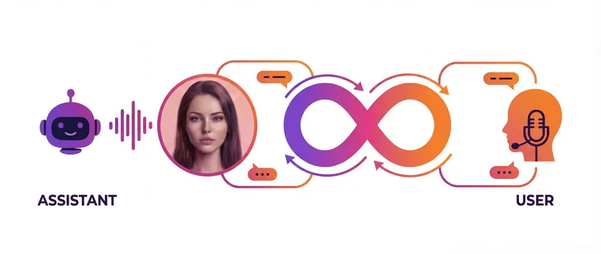
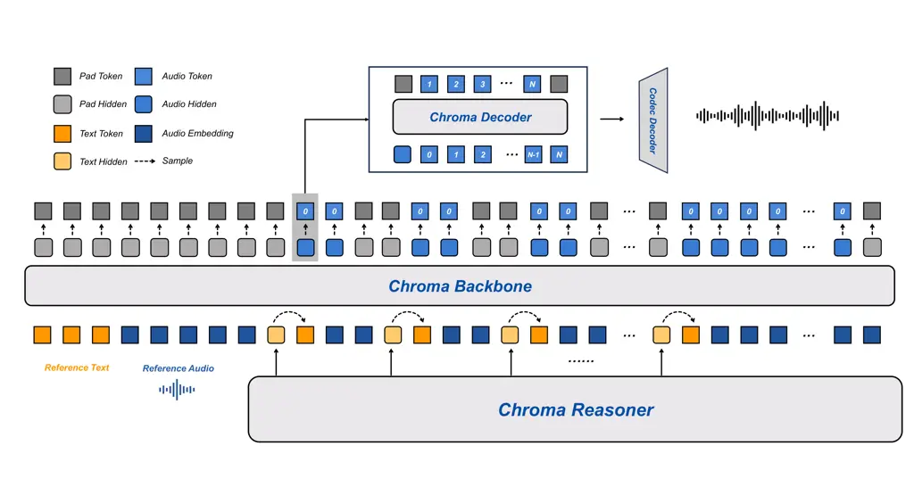

# FlashLabs Chroma 1.0: A Real-Time End-to-End Spoken Dialogue Model with Personalized Voice Cloning

Tanyu Chen^(\*)    Tairan Chen^(\*)    Kai Shen^(\*)    Zhenghua Bao   
Zhihui Zhang    Man Yuan    Yi ShiFlashLabs Correspondence:
[zhenghua.bao@flashlabs.ai](mailto:zhenghua.bao@flashlabs.ai),
[chroma@flashlabs.ai](mailto:chroma@flashlabs.ai)

###### Abstract

Recent end-to-end spoken dialogue systems leverage speech tokenizers and
neural audio codecs to enable LLMs to operate directly on discrete
speech representations. However, these models often exhibit limited
speaker identity preservation, hindering personalized voice interaction.
In this work, we present Chroma 1.0, the first open-source, real-time,
end-to-end spoken dialogue model that achieves both low-latency
interaction and high-fidelity personalized voice cloning. Chroma
achieves sub-second end-to-end latency through an interleaved text-audio
token schedule (1:2) that supports streaming generation, while
maintaining high-quality personalized voice synthesis across multi-turn
conversations. Our experimental results demonstrate that Chroma achieves
a 10.96% relative improvement in speaker similarity over the human
baseline, with a Real-Time Factor of 0.43, while maintaining strong
reasoning and dialogue capabilities. Our code and models are publicly
available at
[GitHub](https://github.com/FlashLabs-AI-Corp/FlashLabs-Chroma) and
[HuggingFace](https://huggingface.co/FlashLabs/Chroma-4B).

^(\*)^(\*)footnotetext: Equal
contribution.^(\$\dagger\$)^(\$\dagger\$)footnotetext: Corresponding
author.



Figure 1: System workflow of Chroma 1.0. Chroma takes speech as input
and produces speech as output, maintaining consistent speaker identity
throughout the conversation.

## 1 Introduction

Building real-time, interactive speech dialogue systems remains
challenging. Most deployed systems follow a cascaded pipeline: input
speech is first transcribed into text via automatic speech recognition
(ASR), the transcript is then processed by a downstream large language
model (LLM), and the generated response is finally converted back to
speech by a text-to-speech (TTS) module. While effective for offline or
latency-tolerant scenarios, such pipelines incur high end-to-end
latency, suffer from error propagation, and tend to lose paralinguistic
information such as speaker identity, speaking rate, timbre, emotion,
and prosody. These limitations become especially limiting in real-time
conversational settings, where naturalness, responsiveness, and speaker
fidelity are essential.

Recent advances in speech tokenization and neural codecs Hsu et al.
(2021); Défossez et al. (2022); Ji et al. (2024) enable LLMs to operate
directly on discrete speech representations, giving rise to
_speech-to-speech_ (S2S) systems that bypass explicit intermediate
transcription. End-to-end large audio language models (LALMs) emerged
following the success of GPT-4o Hurst et al. (2024), which demonstrated
the feasibility of end-to-end speech processing without explicit textual
intermediates. Subsequent works Défossez et al. (2024); Zeng et al.
(2024); Xu et al. (2025a); Xu et al. (2025b); Nguyen et al. (2025);
Huang et al. (2025a); Huang et al. (2025b); Wu et al. (2025) have
adopted this principle, processing and generating speech directly
through diverse architectural strategies: interleaved speech-text token
sequences Nguyen et al. (2025), unified audio-text representations Huang
et al. (2025a); Huang et al. (2025b); Wu et al. (2025); Zeng et al.
(2024), or parallel dual-stream architectures that decouple semantic
reasoning from acoustic generation Xu et al. (2025a); Xu et al. (2025b).

However, existing end-to-end LALMs still face several critical
limitations in both speech understanding and speech generation. Early
models such as Spirit LM Nguyen et al. (2025) and GLM-4-Voice Zeng et
al. (2024) primarily focus on aligning semantic content from speech to
text, often showing limited ability to capture paralinguistic cues that
are essential for natural interaction. While more recent
audio-understanding models like Qwen2-Audio Chu et al. (2024) and
Kimi-Audio Ding et al. (2025) can comprehend such paralinguistic
information, they generate only textual outputs, failing to leverage
this understanding for expressive speech generation. Moreover, current
S2S systems typically prioritize dialogue quality over personalized
voice fidelity. While speech systems capable of voice cloning, such as
VALL-E Wang et al. (2023), the CosyVoice series Du et al. (2024a); Du et
al. (2024b); Du et al. (2025), and industrial solutions (e.g.,
Qwen-TTS¹¹ 1
[https://qwenlm.github.io/blog/qwen-tts/](https://qwenlm.github.io/blog/qwen-tts/)
and ElevenLabs²² 2
[https://elevenlabs.io/voice-cloning](https://elevenlabs.io/voice-cloning)),
achieve high-quality speaker adaptation, they lack real-time streaming
capabilities with consistent voice cloning across multi-turn
conversations. Conversely, real-time dialogue models Défossez et al.
(2024); Xie and Wu (2024b); Xie and Wu (2024a); Fang et al. (2024)
sacrifice fine-grained speaker control for low latency.

To address these limitations, we propose Chroma 1.0, the first
open-source, real-time end-to-end spoken dialogue model that achieves
both low-latency interaction and high-fidelity personalized voice
cloning. Our main contributions are as follows:

- •
  A streaming architecture that tightly couples speech understanding
  with speech generation through semantic state representations,
  enabling sub-second end-to-end latency.
- •
  High-fidelity voice cloning that conditions the generation model on
  audio embeddings from just a few seconds of reference audio, achieving
  10.96% relative improvement in speaker similarity over human baseline.
- •
  An interleaved text-audio token schedule (1:2) that enables
  synchronized generation of acoustic codes with incremental text
  output, achieving real-time streaming synthesis.
- •
  Strong reasoning and dialogue capabilities with only 4B parameters,
  demonstrating competitive performance across understanding, reasoning,
  and oral conversation tasks.

We release the complete codebase, training pipeline, and pretrained
model weights to support reproducibility and further research³³ 3
[https://github.com/FlashLabs-AI-Corp/FlashLabs-Chroma](https://github.com/FlashLabs-AI-Corp/FlashLabs-Chroma)⁴⁴
4
[https://huggingface.co/FlashLabs/Chroma-4B](https://huggingface.co/FlashLabs/Chroma-4B).



Figure 2: Overall architecture of Chroma 1.0. The Reasoner outputs text
tokens and hidden states. These form an interleaved text–audio embedding
sequence (1:2) consumed by the Backbone to generate coarse acoustic
codes $`c_{t}^{0}`$ and hidden states $`h_{t}`$. The Decoder predicts
the remaining RVQ levels $`c_{t}^{1:N-1}`$, and the Codec Decoder
reconstructs the full codebook sequence into a continuous waveform,
enabling high-fidelity S2S generation.

## 2 Related Works

### 2.1 Cascaded Speech–Text Pipelines vs. End-to-End S2S Conversation

Cascaded approaches remain widely deployed due to the maturity of ASR,
LLM, and TTS modules, as well as established engineering practices Zhang
et al. (2023a); Radford et al. (2023); Wang et al. (2023); Chu et al.
(2023); Tan et al. (2024); Huang et al. (2024); Lin et al. (2024); Fang
et al. (2024). They offer flexibility but accumulate latency and errors,
and often discard paralinguistic cues once speech is reduced to text,
limiting downstream speaker fidelity and emotional expressiveness. In
contrast, end-to-end S2S dialogue systems avoid explicit transcription
by learning to map directly between discrete speech units.
SeamlessM4T Duquenne et al. (2023) established a multilingual S2S
baseline, while GPT-4o Hurst et al. (2024) demonstrated the commercial
viability of native audio processing without intermediate text
conversions. Recent research efforts have explored diverse architectural
strategies for end-to-end speech modeling. Moshi Défossez et al. (2024)
introduces a full-duplex streaming architecture for real-time dialogue,
while Spirit LM Nguyen et al. (2025) employs interleaved speech-text
token sequences to maintain multimodal alignment. GLM-4-Voice Zeng et
al. (2024) and the early Step-Audio series Huang et al. (2025a); Huang
et al. (2025b) adopt unified token representations that map speech and
text into a shared vocabulary space, with Step-Audio-2 Wu et al. (2025)
further advancing generation quality using retrieval-augmented
generation (RAG) and reinforcement learning techniques. Qwen2.5-Omni Xu
et al. (2025a) and Qwen3-Omni Xu et al. (2025b) propose parallel
dual-stream (Thinker-Talker) architectures that decouple semantic
reasoning from acoustic generation. Specifically, Qwen3-Omni employs a
multi-codebook token prediction (MTP) module in the Talker to predict
residual codebooks per frame. Models focused primarily on audio
understanding—such as Qwen2-Audio Chu et al. (2024) and Kimi-Audio Ding
et al. (2025)—generate textual responses, demonstrating the capability
to comprehend paralinguistic information from speech inputs.

### 2.2 Voice Cloning and Personalized Speech Synthesis

A major advancement in voice cloning came with _neural codec language
models_ (NCLMs), which cast TTS as discrete acoustic token generation.
VALL-E (Wang et al., 2023) demonstrated that modeling EnCodec codes with
a large conditional language model yields natural, expressive zero-shot
TTS from approximately 3 seconds of reference audio while preserving
paralinguistic cues. VALL-E X (Zhang et al., 2023b) extends this
capability across languages. Diffusion and flow-matching approaches
further advance fidelity and control. StyleTTS-2 (Li et al., 2023)
introduces style diffusion achieving strong naturalness and zero-shot
adaptation, NaturalSpeech 3 (Ju et al., 2024) factorizes content,
prosody, and timbre for state-of-the-art similarity, and Voicebox (Le et
al., 2023) demonstrates high-speed non-autoregressive flow-matching.
Open-source systems like CosyVoice series (Du et al., 2024a; Du et al.,
2024b; Du et al., 2025), and OpenVoice (Qin et al., 2023) demonstrate
practical cloning with improved content consistency and fine-grained
control, with later iterations adding streaming support. Commercial
platforms (e.g. Elevenlabs) further validate few-second cloning at
production scale.

## 3 Model Architecture

Chroma 1.0 is built upon an end-to-end spoken dialogue architecture
designed to achieve high-quality, real-time voice interaction through
tight coupling of speech perception and language understanding. As
illustrated in Fig. 2, the system consists of two integrated subsystems:
(i) the Chroma Reasoner, responsible for multimodal input comprehension
and textual response generation; and (ii) a speech synthesis pipeline
composed of the Chroma Backbone for acoustic modeling, the Chroma
Decoder for audio codebook decoding, and the Chroma Codec Decoder for
waveform reconstruction.

### 3.1 Chroma Reasoner

The Chroma Reasoner, built upon the Thinker module Xu et al. (2025a),
performs multimodal understanding and semantic representation
construction. It processes both text and audio inputs through the
standard Qwen2-Audio encoding pipeline Chu et al. (2024), generating
high-level semantic representations that capture both linguistic content
and acoustic characteristics.

The Reasoner employs a cross-modal attention mechanism to fuse text and
audio features. The encoded representations are unified into a sequence
of hidden states with temporal alignment through Time-aligned Multimodal
Rotary Position Embedding (TM-RoPE) Xu et al. (2025a). This fusion
enables the model to leverage prosodic and rhythmic cues from speech
alongside textual semantics, enhancing both dialogue understanding and
contextual modeling for subsequent speech synthesis.

### 3.2 Chroma Backbone

The Chroma Backbone adopts a 1B-parameter variant of the LLaMA Touvron
et al. (2023) architecture, designed to generate speech that matches the
timbre of a given reference audio. To enable high-fidelity voice
cloning, we encode the reference audio and its corresponding transcript
into embedding prompts using CSM-1B⁵⁵ 5
[https://github.com/SesameAILabs/csm](https://github.com/SesameAILabs/csm)
and prepend them to the input sequence, explicitly conditioning the
model on the target speaker’s acoustic characteristics. During
inference, to ensure strict alignment between the audio output and the
Reasoner’s text modality while maintaining low parameter count, we apply
a shared token embedding strategy: the Reasoner’s token embeddings and
hidden states are fed into the Backbone as unified textual context.

To support efficient streaming generation, we interleave text tokens
with audio code tokens $`c^{0}`$ at a fixed ratio of $`1:2`$, meaning
each text token is paired with two audio codes. This mechanism enables
the Backbone to autoregressively generate audio sequences in parallel
with the Reasoner’s incremental text generation, allowing the system to
produce outputs without waiting for complete text sequences.
Consequently, the Time-to-First-Token (TTFT) is significantly reduced,
enabling improved real-time interaction.

### 3.3 Chroma Decoder

To substantially accelerate inference while preserving generation
quality, we introduce a lightweight module—the Chroma
Decoder—responsible for generating the remaining acoustic codes
($`c_{t}^{1},\ldots,c_{t}^{N-1}`$), rather than having the Backbone
produce all codebooks directly. The Chroma Decoder is implemented as a
variant of the LLaMA architecture with approximately 100M parameters.
Unlike the Backbone, this module does not rely on the full history of
text inputs or reference audio context; instead, it performs
frame-synchronous inference conditioned only on the Backbone outputs at
the current time step, thereby greatly reducing computational overhead
associated with long-context processing.

Specifically, at each time step $`t`$, the Chroma Decoder takes as input
the hidden-state features $`h_{t}`$ and the initial audio codebook
$`c_{t}^{0}`$ produced by the Backbone, and autoregressively generates
the remaining RVQ codebooks $`c_{t}^{i}`$ ($`i=1,\ldots,N-1`$) within
each frame using level-specific projection heads conditioned on
previously generated levels. This decoupled design not only reduces
inference latency but also enables the Chroma Decoder to enrich
fine-grained acoustic attributes, such as prosody and articulation
details, building upon the coarse semantic representation from the
Backbone.

### 3.4 Chroma Codec Decoder

As the final acoustic reconstruction module, the Chroma Codec Decoder
maps the discrete codebook sequence into a continuous, high-fidelity
speech waveform. At each time step, the module concatenates the coarse
codebook ($`c^{0}`$) and the refined acoustic codebooks
($`c^{1},\ldots,c^{N-1}`$) generated by the Chroma Decoder to form the
complete discrete acoustic representation. Architecturally, this module
follows the decoder design of the Mimi vocoder Défossez et al. (2024)
and employs a causal convolutional neural network (Causal CNN), ensuring
strict temporal causality during waveform reconstruction to support
streaming generation.

To meet real-time interaction requirements, we employ 8 codebooks
($`N=8`$). This configuration significantly reduces the autoregressive
refinement steps required by the Chroma Decoder, thereby improving
inference efficiency.

### 3.5 Training Datasets

Publicly available datasets lack high-quality speech dialogue data that
meet our model’s requirements for semantic understanding and reasoning
capabilities. To address this limitation, we propose a data generation
pipeline that leverages the synergistic collaboration between LLMs and
TTS systems.

Pipeline Workflow. The generation process consists of two stages: (1)
Text Generation: User questions are fed into a Reasoner-like LLM module
to generate corresponding textual responses. (2) Speech Synthesis: The
textual responses are synthesized into speech using a TTS system, with
timbre characteristics matching the reference audio. This synthesized
speech serves as the training target, enabling the Backbone and Decoder
modules to learn voice cloning and acoustic modeling.

### 3.6 Training Objective

Our training strategy optimizes two primary components: the Backbone and
the Decoder, while keeping the Reasoner frozen as a feature extractor.
For each audio-text pair, the Reasoner provides fixed text embeddings
and multimodal hidden states that serve as semantic and prosodic
conditioning. The Backbone is trained to autoregressively predict the
first layer of coarse acoustic codes ($`c^{0}`$). To ensure causal
alignment, it attends only to the prefix of the acoustic codes and the
corresponding Reasoner representations. This objective enables the model
to capture long-term temporal structure and align acoustic generation
with the text progression. The Decoder refines the coarse acoustic
representation by predicting the remaining Residual Vector Quantization
(RVQ) levels ($`c^{1:N-1}`$). Conditioned on the Backbone’s coarse code
and hidden state, the Decoder operates via an intra-frame autoregressive
process. This factorization allows it to progressively enhance acoustic
fidelity while maintaining consistency with the coarse trajectory
established by the Backbone. More details can be found in Appendix C.

## 4 Experiments

### 4.1 Experimental Setup

#### Datasets.

We evaluate our model on multiple benchmark datasets to assess different
aspects of speech generation quality. For general performance
evaluation, we use the CommonVoice dataset Ardila et al. (2020), which
provides diverse speakers and recording conditions for measuring speaker
similarity. To assess voice cloning capability, we conduct subjective
experiments measuring naturalness and voice fidelity between generated
and reference audio. To evaluate the model’s ability to understand and
reason about input speech, we utilize a subset of URO-Bench Yan et al.
(2025), which provides speech-based question-answering tasks requiring
semantic comprehension. Unless otherwise specified, all experiments were
conducted on an NVIDIA H200 GPU.

#### Training Configuration.

Our implementation is based on PyTorch 2.7.1. We employ the AdamW
optimizer Loshchilov and Hutter (2017) with a learning rate of
$`5\times 10^{-5}`$ and a per-device batch size of 4. The model is
trained for 100K steps on 8 NVIDIA H200 GPUs (141GB memory each),
achieving convergence in approximately 6 hours. Gradient clipping with a
maximum norm of 1.0 is applied to ensure training stability.

#### Evaluation Metrics.

We conduct comprehensive evaluation using both objective and subjective
metrics, covering speech quality, naturalness, speaker similarity, and
system efficiency. For objective evaluation, we employ Speaker
Similarity (SIM), Time-to-First-Token (TTFT), and Real-Time Factor
(RTF). For subjective evaluation, we conduct Comparative Mean Opinion
Score (CMOS) tests through human listeners. Our SIM evaluation is based
on the SEED-TTS-EVAL framework⁶⁶ 6
[https://github.com/BytedanceSpeech/seed-tts-eval](https://github.com/BytedanceSpeech/seed-tts-eval).

Speaker Similarity (SIM) evaluates voice cloning quality by measuring
how closely the generated speech matches the target speaker’s voice
characteristics. We use WavLM-Large Chen et al. (2022a), a
self-supervised speech representation model fine-tuned on speaker
verification tasks Chen et al. (2022b), to extract 192-dimensional
speaker embeddings from both generated and reference audio. Similarity
is computed as the cosine similarity between these embeddings.

Comparative Mean Opinion Score (CMOS) measures naturalness (NCMOS) and
speaker similarity (SCMOS) through pairwise comparisons. For NCMOS,
participants compare two systems and select from four options: “A sounds
more natural”, “B sounds more natural”, “About the same”, or “Hard to
tell”. For SCMOS, participants first listen to reference audio, then
compare which of two synthesized samples better matches the reference
speaker’s characteristics using the same four-option scale. The order of
samples A and B is randomized to avoid position bias. CMOS scores are
computed as the mean preference difference, where positive values
indicate preference for our system.

Latency Metrics. We measure system efficiency using two complementary
metrics: Time-to-First-Token (TTFT) and Real-Time Factor (RTF). TTFT
measures system responsiveness by recording the time elapsed from
receiving the input to generating the first audio token, which is
critical for natural conversation flow. RTF measures computational
efficiency as the ratio of generation time to audio duration. An RTF
below 1.0 indicates the system can generate speech faster than real-time
playback. Both metrics are essential for evaluating real-time
interactive performance, with lower values indicating better efficiency.

| Model          | SIM $`\uparrow`$                                                                                                                      |
| -------------- | ------------------------------------------------------------------------------------------------------------------------------------- |
| Human Baseline | 0.73                                                                                                                                  |
| F5-TTS         | 0.64                                                                                                                                  |
| Seed-TTS       | 0.76                                                                                                                                  |
| FireRedTTS-2   | 0.66                                                                                                                                  |
| Step-Audio-TTS | 0.66                                                                                                                                  |
| CosyVoice 3    | 0.72                                                                                                                                  |
| Chroma 1.0     | 0.81⁷⁷ 7 Chroma operates at 24kHz sample rate, which better preserves speaker characteristics compared to 16kHz used by other models. |

Table 1: Performance comparison of speech models on zero-shot voice
cloning. Higher SIM indicates better speaker similarity.

### 4.2 Objective Voice Cloning Evaluation

We evaluate Chroma’s voice cloning capability by measuring SIM, the
primary focus of this work. Given that Chroma currently generates
English-only audio, we assess its performance in a zero-shot setting
using English samples from the CommonVoice dataset, following the
protocol established by Seed-TTS Anastassiou et al. (2024). Our model is
evaluated at its native sampling rate of 24kHz. Table 1 presents the
comparative results against current state-of-the-art speech models and a
human baseline.

As shown in Table 1, most contemporary TTS models achieve comparable
speaker similarity scores, typically ranging 1–9% below the human
baseline. A notable exception is Seed-TTS, which slightly exceeds the
human baseline. Chroma, on the other hand, outperforms all competing
models, achieving a relative improvement of 10.96% over the human
baseline. This result suggests that Chroma effectively captures
fine-grained paralinguistic features, enabling the generation of
high-fidelity, personalized speech with exceptional speaker identity
preservation.

| Metric | Chroma | ElevenLabs | Deuce |
| ------ | ------ | ---------- | ----- |
| NCMOS  | 24.4%  | 57.2%      | 18.3% |
| SCMOS  | 40.6%  | 42.4%      | 17.0% |

Table 2: Comparative evaluation between Chroma and ElevenLabs.

|            |           |            |
| ---------- | --------- | ---------- |
| Preference | Reference | ElevenLabs |
| Total      | 4 (8.0%)  | 46 (92.0%) |

Table 3: Comparison between ElevenLabs and reference (ground truth)
audio.

|                            |           |                            |                    |
| -------------------------- | --------- | -------------------------- | ------------------ |
| Component                  | TTFT (ms) | Avg Latency per Frame (ms) | Total Duration (s) |
| Reasoner                   | 119.12    | 26.03                      | 3.74               |
| Backbone                   | 8.48      | 8.75                       | 4.27               |
| Decoder                    | 19.27     | 17.56                      | 8.57               |
| Codec Decoder              | –         | 3.08                       | 2.99               |
| Overall Generation Latency | 146.87    | 52.34                      | 16.58              |
| Generated Audio Length     | –         | –                          | 38.80              |
| Generation RTF             |           | 0.43                       |                    |

Table 4: Latency breakdown for speech generation. The system achieves
TTFT of 146.87ms and RTF of 0.43.

### 4.3 Subject Voice Cloning Evaluation

We conducted comparative experiments between Chroma and ElevenLabs, a
state-of-the-art commercial voice cloning system. The experiments
measured both NCMOS and SCMOS. We used their eleven_multilingual_v2
API⁸⁸ 8
[https://elevenlabs.io/docs/overview/models](https://elevenlabs.io/docs/overview/models)
to generate outputs. For each dimension, we selected 15 samples and
generated corresponding outputs using both models, resulting in 30
comparative samples evaluated across 12 independent sessions. Responses
of “About the same” or “Hard to tell” were grouped into a “Deuce”
category, representing cases where no clear preference could be
established.

Table 2 presents the comparative results. For NCMOS, ElevenLabs
demonstrated superior performance, receiving 57.2% of preferences
compared to Chroma’s 24.4% (18.3% Deuce), indicating significantly more
natural-sounding speech. However, for SCMOS, where participants first
listened to reference audio before comparing synthesized outputs, the
results were remarkably close: ElevenLabs received 42.4% compared to
Chroma’s 40.6% (17.0% Deuce). This near-tie, with only 1.8 percentage
points difference, suggests comparable capability in capturing
speaker-specific characteristics.

This phenomenon reflects fundamental differences in system design.
ElevenLabs employs a two-stage approach: first creating a voice profile
from reference audio, then using it for TTS generation. In contrast,
Chroma uses an end-to-end approach that directly processes reference
audio in a single pass. While ElevenLabs optimizes for naturalness and
clarity, its two-stage pipeline may lose fine-grained speaker
characteristics during voice profile extraction. Chroma’s end-to-end
architecture preserves these nuanced features by maintaining direct
access to reference audio throughout generation.

To investigate this trade-off, we conducted an additional experiment
comparing ElevenLabs outputs directly with reference audio. Table 3
shows results from 5 sessions with 10 samples each, where evaluators
chose which audio sounded more natural and human-like. Remarkably,
evaluators overwhelmingly preferred ElevenLabs-generated audio (92.0%)
over actual human recordings (8.0%). This reveals a critical insight:
subjective listener preference does not necessarily align with speaker
similarity.

This finding reframes our SCMOS interpretation. While ElevenLabs
achieved marginally higher SCMOS preference (42.4% vs 40.6%), this
advantage likely reflects listeners’ inherent bias toward naturalness
rather than superior speaker fidelity. The overwhelming preference (92%)
for synthesized audio over ground truth recordings demonstrates that
naturalness dominates speaker similarity in subjective evaluations.
Consequently, Chroma’s competitive SCMOS performance suggests stronger
speaker fidelity than the raw percentages indicate, as it maintains
competitiveness despite prioritizing faithful reproduction of speaker
characteristics—including natural imperfections, speaking rate
variations, and subtle prosodic features—over the perceptual naturalness
that ElevenLabs optimizes for.

|               |           |                  |                  |                    |                    |                    |                   |                 |                    |                    |                   |         |
| ------------- | --------- | ---------------- | ---------------- | ------------------ | ------------------ | ------------------ | ----------------- | --------------- | ------------------ | ------------------ | ----------------- | ------- |
| Models        | LLM Scale | Understanding    |                  |                    | Reasoning          |                    |                   | Oral Conv.      |                    |                    |                   | Overall |
|               |           | Rep.$`\uparrow`$ | Sum.$`\uparrow`$ | Gaokao$`\uparrow`$ | Storal$`\uparrow`$ | Truth.$`\uparrow`$ | Gsm8k$`\uparrow`$ | MLC$`\uparrow`$ | Alpaca$`\uparrow`$ | Common$`\uparrow`$ | Wild.$`\uparrow`$ |         |
| GLM-4-Voice   | 9B        | 90.95            | 91.07            | 64.47              | 73.80              | 59.28              | 30.93             | 57.82           | 80.77              | 63.07              | 78.76             | 69.09   |
| LLaMA-Omni    | 8B        | 45.62            | 80.68            | 16.06              | 50.65              | 45.13              | 3.89              | 44.44           | 64.36              | 58.40              | 72.19             | 48.14   |
| Freeze-Omni   | 7B        | 70.89            | 78.87            | 26.29              | 57.74              | 46.95              | 2.81              | 42.56           | 52.23              | 48.70              | 55.80             | 48.28   |
| Mini-Omni     | 0.5B      | 5.07             | 32.20            | 0                  | 23.25              | 25.06              | 0                 | 2.82            | 30.99              | 29.80              | 31.42             | 18.06   |
| Mini-Omni2    | 0.5B      | 8.10             | 40.06            | 0.66               | 28.49              | 26.92              | 0                 | 6.97            | 34.81              | 30.70              | 36.43             | 21.31   |
| SLAM-Omni     | 0.5B      | 12.26            | 66.21            | 1.32               | 36.95              | 34.65              | 0                 | 21.85           | 48.98              | 41.03              | 52.61             | 31.59   |
| Chroma (ours) | 4B        | 69.05            | 74.12            | 38.61              | 71.14              | 51.69              | 22.74             | 60.26           | 60.47              | 62.07              | 64.24             | 57.44   |

Table 5: Task accomplishment scores for end-to-end spoken dialogue
models across understanding, reasoning, and oral conversation
capabilities. Bold values indicate Chroma’s performance, which remains
competitive across all dimensions despite using only 4B parameters.

### 4.4 Practical Generation Latency

The current Chroma architecture does not support batch processing,
therefore, we measured its latency under concurrency 1. Table 4 presents
the latency breakdown for each component during response generation. The
total generation latency is the sum of all individual component
latencies. We demonstrate the measured latency on a real example
generating a 38.80-second audio response.

#### Prefilling Strategy.

Before generating speech, we prefill the prompt text and prompt audio to
reduce TTFT. Specifically, we encode and concatenate the prompt text and
prompt audio to obtain prompt embeddings, which are then fed into the
Backbone to perform prefill computation and generate the corresponding
KV cache Pope et al. (2023). By constructing the KV cache before the
generation phase, the model avoids reprocessing prompt content during
inference, enabling immediate autoregressive generation upon receiving
user input. This strategy effectively reduces response latency and
substantially improves real-time interaction performance.

#### Component-wise Latency Analysis.

The Reasoner TTFT (119.12ms) represents the time from processing input
data to generating the first audio token. The Backbone TTFT (8.48ms)
measures the time to produce the first audio hidden states after
receiving the audio token from the Reasoner. The Decoder then generates
the remaining 7 codebooks ($`c^{1:7}`$) to capture fine-grained acoustic
features, taking an average of 17.56ms per frame. Finally, the Codec
Decoder reconstructs the waveform from the complete codebook sequence.
Since we concatenate every 4 frames before passing them to the Codec
Decoder for efficient batch processing, TTFT is not applicable for this
component.

The overall system achieves a TTFT of 146.87ms, demonstrating sub-second
responsiveness suitable for real-time interaction. The average latency
per frame is 52.34ms, and with an RTF of 0.43, the system generates
speech significantly faster than real-time playback, enabling smooth
streaming generation.

#### Real-Time Factor.

The generation RTF is calculated by dividing the total generation
latency by the length of the generated audio:

```math
\text{RTF}=\frac{T_{\text{generation}}}{T_{\text{audio}}}=\frac{16.58\text{s}}{38.80\text{s}}\approx 0.43. \tag{1}
```

An RTF of 0.43 indicates that Chroma generates speech 2.3× faster than
real-time playback, demonstrating strong performance for streaming
applications. This efficiency allows the system to maintain low latency
even during extended multi-turn conversations.

### 4.5 Reasoning and Dialogue Capabilities

While Chroma’s primary focus is high-fidelity voice cloning, we evaluate
its general dialogue capabilities to demonstrate that personalized voice
generation does not compromise cognitive and conversational abilities.
Table 5 compares Chroma against existing end-to-end spoken dialogue
models across three dimensions using the basic track of URO-Bench Yan et
al. (2025).

Despite being optimized for voice cloning, Chroma demonstrates strong
performance across all capabilities. In reasoning tasks, Chroma
consistently achieves second-best performance: 71.14% on Storal (vs.
73.80% for GLM-4-Voice), 51.69% on TruthfulQA (vs. 59.28%), and 22.74%
on GSM8K (vs. 30.93%). Notably, GLM-4-Voice uses 9B parameters, more
than twice Chroma’s 4B scale. In oral conversation, Chroma achieves the
highest scores on MLC (60.26%) and CommonVoice (62.07%), demonstrating
natural dialogue flow. For understanding tasks, Chroma achieves
competitive scores of 69.05% on repetition and 74.12% on summarization,
ranking second among all models.

Critically, Chroma is the only model in this comparison with
personalized voice cloning capability. All other models focus
exclusively on dialogue and reasoning, without the ability to clone
specific speaker characteristics. This makes Chroma’s competitive
performance particularly noteworthy: it maintains strong cognitive and
conversational abilities while simultaneously supporting high-fidelity
voice personalization, a capability absent in all compared systems.
Furthermore, with only 4B parameters, Chroma achieves efficiency
advantages over larger models (7B-9B) and delivers superior performance
compared to smaller models (0.5B) across all evaluated tasks.

## 5 Conclusion

We present Chroma 1.0, the first open-source, real-time end-to-end
spoken dialogue model that achieves both low-latency interaction and
high-fidelity personalized voice cloning. Trained entirely on synthetic
speech-to-speech data, Chroma achieves significant improvements in
speaker similarity from only a few seconds of reference audio while
maintaining real-time performance. Comparative evaluations demonstrate
competitive performance against state-of-the-art commercial systems in
voice cloning, alongside strong reasoning and dialogue capabilities. The
system’s efficient architecture enables smooth streaming generation
suitable for natural multi-turn conversations. By combining low-latency
streaming with high-fidelity voice cloning, Chroma opens new
possibilities for accessible, personalized voice AI applications across
diverse domains. We release our code and models to facilitate further
research in personalized spoken dialogue systems.

## 6 Acknowledgements

We thank Yusen Lin, Kaiwen Zhou, and Liujie Zhen for their contributions
to the early stages of this work. We are grateful to the volunteers who
participated in our human evaluation experiments.

## References

- Anastassiou et al. (2024) P. Anastassiou, J. Chen, J. Chen, Y.
  Chen, Z. Chen, Z. Chen, J. Cong, L. Deng, C. Ding, L. Gao, et al.
  Seed-tts: a family of high-quality versatile speech generation models.
  arXiv preprint arXiv:2406.02430. Cited by: §4.2.
- Ao et al. (2022) J. Ao, R. Wang, L. Zhou, C. Wang, S. Ren, Y. Wu, S.
  Liu, T. Ko, Q. Li, Y. Zhang, et al. Speecht5: unified-modal
  encoder-decoder pre-training for spoken language processing. In
  Proceedings of the 60th annual meeting of the association for
  computational linguistics (volume 1: Long papers), pp. 5723–5738.
  Cited by: Appendix A.
- Ardila et al. (2020) R. Ardila, M. Branson, K. Davis, M. Kohler, J.
  Meyer, M. Henretty, R. Morais, L. Saunders, F. Tyers, and G. Weber
  Common voice: a massively-multilingual speech corpus. In Proceedings
  of the twelfth language resources and evaluation conference,
  pp. 4218–4222. Cited by: §4.1.
- Chen et al. (2022a) S. Chen, C. Wang, Z. Chen, Y. Wu, S. Liu, Z.
  Chen, J. Li, N. Kanda, T. Yoshioka, X. Xiao, et al. Wavlm: large-scale
  self-supervised pre-training for full stack speech processing. IEEE
  Journal of Selected Topics in Signal Processing 16 (6), pp. 1505–1518.
  Cited by: §4.1.
- Chen et al. (2022b) Z. Chen, S. Chen, Y. Wu, Y. Qian, C. Wang, S.
  Liu, Y. Qian, and M. Zeng Large-scale self-supervised speech
  representation learning for automatic speaker verification. In ICASSP
  2022-2022 IEEE International Conference on Acoustics, Speech and
  Signal Processing (ICASSP), pp. 6147–6151. Cited by: §4.1.
- Chu et al. (2024) Y. Chu, J. Xu, Q. Yang, H. Wei, X. Wei, Z. Guo, Y.
  Leng, Y. Lv, J. He, J. Lin, et al. Qwen2-audio technical report. arXiv
  preprint arXiv:2407.10759. Cited by: §1, §2.1, §3.1.
- Chu et al. (2023) Y. Chu, J. Xu, X. Zhou, Q. Yang, S. Zhang, Z.
  Yan, C. Zhou, and J. Zhou Qwen-audio: advancing universal audio
  understanding via unified large-scale audio-language models. arXiv
  preprint arXiv:2311.07919. Cited by: §2.1.
- Colin (2020) R. Colin Exploring the limits of transfer learning with a
  unified text-to-text transformer. J. Mach. Learn. Res. 21. Cited by:
  Appendix A.
- Défossez et al. (2022) A. Défossez, J. Copet, G. Synnaeve, and Y. Adi
  High fidelity neural audio compression. arXiv preprint
  arXiv:2210.13438. Cited by: §1.
- Défossez et al. (2024) A. Défossez, L. Mazaré, M. Orsini, A. Royer, P.
  Pérez, H. Jégou, E. Grave, and N. Zeghidour Moshi: a speech-text
  foundation model for real-time dialogue. arXiv preprint
  arXiv:2410.00037. Cited by: §1, §1, §2.1, §3.4.
- Ding et al. (2025) D. Ding, Z. Ju, Y. Leng, S. Liu, T. Liu, Z.
  Shang, K. Shen, W. Song, X. Tan, H. Tang, et al. Kimi-audio technical
  report. arXiv preprint arXiv:2504.18425. Cited by: §1, §2.1.
- Du et al. (2024a) Z. Du, Q. Chen, S. Zhang, K. Hu, H. Lu, Y. Yang, H.
  Hu, S. Zheng, Y. Gu, Z. Ma, et al. Cosyvoice: a scalable multilingual
  zero-shot text-to-speech synthesizer based on supervised semantic
  tokens. arXiv preprint arXiv:2407.05407. Cited by: §1, §2.2.
- Du et al. (2025) Z. Du, C. Gao, Y. Wang, F. Yu, T. Zhao, H. Wang, X.
  Lv, H. Wang, C. Ni, X. Shi, et al. Cosyvoice 3: towards in-the-wild
  speech generation via scaling-up and post-training. arXiv preprint
  arXiv:2505.17589. Cited by: §1, §2.2.
- Du et al. (2024b) Z. Du, Y. Wang, Q. Chen, X. Shi, X. Lv, T. Zhao, Z.
  Gao, Y. Yang, C. Gao, H. Wang, et al. Cosyvoice 2: scalable streaming
  speech synthesis with large language models. arXiv preprint
  arXiv:2412.10117. Cited by: §1, §2.2.
- Duquenne et al. (2023) P. Duquenne, H. Elsahar, H. Gong, K.
  Heffernan, J. Hoffman, C. Klaiber, et al. SeamlessM4t—massively
  multilingual and multimodal machine translation. Menlo Park,
  California, United States: Meta. Cited by: §2.1.
- Fang et al. (2024) Q. Fang, S. Guo, Y. Zhou, Z. Ma, S. Zhang, and Y.
  Feng Llama-omni: seamless speech interaction with large language
  models. arXiv preprint arXiv:2409.06666. Cited by: §1, §2.1.
- Hsu et al. (2021) W. Hsu, B. Bolte, Y. H. Tsai, K. Lakhotia, R.
  Salakhutdinov, and A. Mohamed Hubert: self-supervised speech
  representation learning by masked prediction of hidden units. IEEE/ACM
  transactions on audio, speech, and language processing 29,
  pp. 3451–3460. Cited by: §1.
- Huang et al. (2025a) A. Huang, B. Li, B. Wang, B. Wu, C. Yan, C.
  Feng, H. Wang, H. Zhou, H. Wang, J. Li, et al. Step-audio-aqaa: a
  fully end-to-end expressive large audio language model. arXiv preprint
  arXiv:2506.08967. Cited by: §1, §2.1.
- Huang et al. (2025b) A. Huang, B. Wu, B. Wang, C. Yan, C. Hu, C.
  Feng, F. Tian, F. Shen, J. Li, M. Chen, et al. Step-audio: unified
  understanding and generation in intelligent speech interaction. arXiv
  preprint arXiv:2502.11946. Cited by: §1, §2.1.
- Huang et al. (2024) R. Huang, M. Li, D. Yang, J. Shi, X. Chang, Z.
  Ye, Y. Wu, Z. Hong, J. Huang, J. Liu, et al. Audiogpt: understanding
  and generating speech, music, sound, and talking head. In Proceedings
  of the AAAI Conference on Artificial Intelligence, Vol. 38,
  pp. 23802–23804. Cited by: §2.1.
- Hurst et al. (2024) A. Hurst, A. Lerer, A. P. Goucher, A. Perelman, A.
  Ramesh, A. Clark, A. Ostrow, A. Welihinda, A. Hayes, A. Radford, et
  al. Gpt-4o system card. arXiv preprint arXiv:2410.21276. Cited by: §1,
  §2.1.
- Ji et al. (2024) S. Ji, Z. Jiang, W. Wang, Y. Chen, M. Fang, J.
  Zuo, Q. Yang, X. Cheng, Z. Wang, R. Li, et al. Wavtokenizer: an
  efficient acoustic discrete codec tokenizer for audio language
  modeling. arXiv preprint arXiv:2408.16532. Cited by: §1.
- Ju et al. (2024) Z. Ju, Y. Wang, K. Shen, X. Tan, D. Xin, D. Yang, Y.
  Liu, Y. Leng, K. Song, S. Tang, et al. Naturalspeech 3: zero-shot
  speech synthesis with factorized codec and diffusion models. arXiv
  preprint arXiv:2403.03100. Cited by: §2.2.
- Le et al. (2023) M. Le, A. Vyas, B. Shi, B. Karrer, L. Sari, R.
  Moritz, M. Williamson, V. Manohar, Y. Adi, J. Mahadeokar, et al.
  Voicebox: text-guided multilingual universal speech generation at
  scale. Advances in neural information processing systems 36,
  pp. 14005–14034. Cited by: §2.2.
- Lewis et al. (2020) M. Lewis, Y. Liu, N. Goyal, M. Ghazvininejad, A.
  Mohamed, O. Levy, V. Stoyanov, and L. Zettlemoyer BART: denoising
  sequence-to-sequence pre-training for natural language generation,
  translation, and comprehension. In Proceedings of the 58th annual
  meeting of the association for computational linguistics,
  pp. 7871–7880. Cited by: Appendix A.
- Li et al. (2023) Y. A. Li, C. Han, V. Raghavan, G. Mischler, and N.
  Mesgarani Styletts 2: towards human-level text-to-speech through style
  diffusion and adversarial training with large speech language models.
  Advances in Neural Information Processing Systems 36, pp. 19594–19621.
  Cited by: §2.2.
- Lin et al. (2024) G. Lin, C. Chiang, and H. Lee Advancing large
  language models to capture varied speaking styles and respond properly
  in spoken conversations. arXiv preprint arXiv:2402.12786. Cited by:
  §2.1.
- Loshchilov and Hutter (2017) I. Loshchilov and F. Hutter Decoupled
  weight decay regularization. arXiv preprint arXiv:1711.05101. Cited
  by: §4.1.
- Nguyen et al. (2025) T. A. Nguyen, B. Muller, B. Yu, M. R.
  Costa-Jussa, M. Elbayad, S. Popuri, C. Ropers, P. Duquenne, R.
  Algayres, R. Mavlyutov, et al. Spirit-lm: interleaved spoken and
  written language model. Transactions of the Association for
  Computational Linguistics 13, pp. 30–52. Cited by: §1, §1, §2.1.
- Ouyang et al. (2022) L. Ouyang, J. Wu, X. Jiang, D. Almeida, C.
  Wainwright, P. Mishkin, C. Zhang, S. Agarwal, K. Slama, A. Ray, et al.
  Training language models to follow instructions with human feedback.
  Advances in neural information processing systems 35, pp. 27730–27744.
  Cited by: Appendix A.
- Pope et al. (2023) R. Pope, S. Douglas, A. Chowdhery, J. Devlin, J.
  Bradbury, J. Heek, K. Xiao, S. Agrawal, and J. Dean Efficiently
  scaling transformer inference. Proceedings of machine learning and
  systems 5, pp. 606–624. Cited by: §4.4.
- Qin et al. (2023) Z. Qin, W. Zhao, X. Yu, and X. Sun Openvoice:
  versatile instant voice cloning. arXiv preprint arXiv:2312.01479.
  Cited by: §2.2.
- Radford et al. (2023) A. Radford, J. W. Kim, T. Xu, G. Brockman, C.
  McLeavey, and I. Sutskever Robust speech recognition via large-scale
  weak supervision. In International conference on machine learning,
  pp. 28492–28518. Cited by: §2.1.
- Rafailov et al. (2023) R. Rafailov, A. Sharma, E. Mitchell, C. D.
  Manning, S. Ermon, and C. Finn Direct preference optimization: your
  language model is secretly a reward model. Advances in neural
  information processing systems 36, pp. 53728–53741. Cited by: Appendix
  A.
- Tan et al. (2024) X. Tan, J. Chen, H. Liu, J. Cong, C. Zhang, Y.
  Liu, X. Wang, Y. Leng, Y. Yi, L. He, et al. Naturalspeech: end-to-end
  text-to-speech synthesis with human-level quality. IEEE Transactions
  on Pattern Analysis and Machine Intelligence 46 (6), pp. 4234–4245.
  Cited by: §2.1.
- Touvron et al. (2023) H. Touvron, T. Lavril, G. Izacard, X.
  Martinet, M. Lachaux, T. Lacroix, B. Rozière, N. Goyal, E. Hambro, F.
  Azhar, et al. Llama: open and efficient foundation language models.
  arXiv preprint arXiv:2302.13971. Cited by: §3.2.
- Wang et al. (2023) C. Wang, S. Chen, Y. Wu, Z. Zhang, L. Zhou, S.
  Liu, Z. Chen, Y. Liu, H. Wang, J. Li, et al. Neural codec language
  models are zero-shot text to speech synthesizers. arXiv preprint
  arXiv:2301.02111. Cited by: §1, §2.1, §2.2.
- Wu et al. (2025) B. Wu, C. Yan, C. Hu, C. Yi, C. Feng, F. Tian, F.
  Shen, G. Yu, H. Zhang, J. Li, et al. Step-audio 2 technical report.
  arXiv preprint arXiv:2507.16632. Cited by: §1, §2.1.
- Xie and Wu (2024a) Z. Xie and C. Wu Mini-omni2: towards open-source
  gpt-4o with vision, speech and duplex capabilities. arXiv preprint
  arXiv:2410.11190. Cited by: §1.
- Xie and Wu (2024b) Z. Xie and C. Wu Mini-omni: language models can
  hear, talk while thinking in streaming. arXiv preprint
  arXiv:2408.16725. Cited by: §1.
- Xu et al. (2025a) J. Xu, Z. Guo, J. He, H. Hu, T. He, S. Bai, K.
  Chen, J. Wang, Y. Fan, K. Dang, et al. Qwen2. 5-omni technical report.
  arXiv preprint arXiv:2503.20215. Cited by: §1, §2.1, §3.1, §3.1.
- Xu et al. (2025b) J. Xu, Z. Guo, H. Hu, Y. Chu, X. Wang, J. He, Y.
  Wang, X. Shi, T. He, X. Zhu, Y. Lv, Y. Wang, D. Guo, H. Wang, L.
  Ma, P. Zhang, X. Zhang, H. Hao, Z. Guo, B. Yang, B. Zhang, Z. Ma, X.
  Wei, S. Bai, K. Chen, X. Liu, P. Wang, M. Yang, D. Liu, X. Ren, B.
  Zheng, R. Men, F. Zhou, B. Yu, J. Yang, L. Yu, J. Zhou, and J. Lin
  Qwen3-omni technical report. External Links: 2509.17765,
  [Link](https://arxiv.org/abs/2509.17765) Cited by: Appendix A, §1,
  §2.1.
- Yan et al. (2025) R. Yan, X. Li, W. Chen, Z. Niu, C. Yang, Z. Ma, K.
  Yu, and X. Chen Uro-bench: a comprehensive benchmark for end-to-end
  spoken dialogue models. arXiv preprint arXiv:2502.17810. Cited by:
  §4.1, §4.5.
- Yu et al. (2022) J. Yu, Y. Xu, J. Y. Koh, T. Luong, G. Baid, Z.
  Wang, V. Vasudevan, A. Ku, Y. Yang, B. K. Ayan, et al. Scaling
  autoregressive models for content-rich text-to-image generation. arXiv
  preprint arXiv:2206.10789 2 (3), pp. 5. Cited by: Appendix A.
- Zeng et al. (2024) A. Zeng, Z. Du, M. Liu, K. Wang, S. Jiang, L.
  Zhao, Y. Dong, and J. Tang Glm-4-voice: towards intelligent and
  human-like end-to-end spoken chatbot. arXiv preprint arXiv:2412.02612.
  Cited by: §1, §1, §2.1.
- Zhang et al. (2023a) D. Zhang, S. Li, X. Zhang, J. Zhan, P. Wang, Y.
  Zhou, and X. Qiu Speechgpt: empowering large language models with
  intrinsic cross-modal conversational abilities. arXiv preprint
  arXiv:2305.11000. Cited by: §2.1.
- Zhang et al. (2023b) Z. Zhang, L. Zhou, C. Wang, S. Chen, Y. Wu, S.
  Liu, Z. Chen, Y. Liu, H. Wang, J. Li, et al. Speak foreign languages
  with your own voice: cross-lingual neural codec language modeling.
  arXiv preprint arXiv:2303.03926. Cited by: §2.2.

## Appendix

## Appendix A Limitations and Future Work

The current system does not incorporate external tool use or
task-specific post-training techniques such as reinforcement learning
from human feedback (RLHF) Ouyang et al. (2022) or direct preference
optimization (DPO) Rafailov et al. (2023). Integrating such methods
could further improve dialogue quality, instruction following, and user
preference alignment, particularly for conversational naturalness and
contextual appropriateness.

Recent work on multi-codebook token prediction (MTP), such as
Qwen3-Omni Xu et al. (2025b), reduces first-packet latency by predicting
residual codebooks in parallel rather than sequentially. Investigating
whether MTP can be integrated into Chroma’s decoder stage without
compromising voice cloning fidelity presents a promising avenue for
further latency reduction.

Although Chroma’s speech reasoner supports multilingual input (currently
Chinese and English), the system generates speech output only in
English. Extending codec training and decoder modules to support
multilingual output generation would broaden the system’s applicability
across diverse linguistic contexts. Cross-lingual voice cloning, where
input and output languages differ while preserving speaker identity,
remains an important research direction.

While Chroma’s Backbone employs a decoder-only architecture aligning
with recent trends in speech language modeling, encoder-decoder
architectures have demonstrated strong performance across multiple
domains, including machine translation Colin (2020), text
generation Lewis et al. (2020), text-to-image generation Yu et al.
(2022), and spoken language processing Ao et al. (2022). These
architectures may offer distinct advantages in controllability,
cross-modal alignment, and explicit separation of understanding and
generation processes. Exploring encoder-decoder designs for
speech-to-speech dialogue could provide complementary benefits to our
current approach, particularly for scenarios requiring fine-grained
control over both semantic content and acoustic properties in voice
cloning and streaming generation.

## Appendix B Ethical Considerations

While Chroma demonstrates substantial advancements in voice cloning
technology, it also introduces important ethical considerations. The
capability to generate high-fidelity, personalized speech from minimal
reference audio raises several risks, including the potential for
impersonation, fraud, and the creation of misleading or harmful audio
content without an individual’s consent.

To mitigate these risks, we recommend adopting strong technical and
policy-based safeguards, such as:

- •
  Requiring explicit and verifiable consent for any form of voice
  cloning,
- •
  Developing and deploying reliable synthetic speech detection
  mechanisms,
- •
  Enforcing clear usage policies and access controls to prevent misuse,
- •
  Investigating watermarking or traceability techniques for generated
  audio.

When developed and used responsibly, voice cloning systems like Chroma
can provide meaningful benefits, such as supporting voice restoration
for individuals with speech impairments, enabling inclusive
accessibility applications, and facilitating creative or personalized
communication tools. We encourage the research community to advance
ethical guidelines, regulatory frameworks, and robust detection
technologies in parallel with progress in speech synthesis systems to
ensure their safe and responsible deployment.

## Appendix C Training Objective

During training, the Reasoner is frozen and functions solely as a
feature provider. For each training pair consisting of an audio sample
$`\mathbf{x}_{\text{audio}}`$ and its corresponding transcription
$`\mathbf{x}_{\text{text}}`$, the Reasoner produces text embeddings
$`\mathbf{E}_{\text{text}}\in\mathbb{R}^{T\times d}`$ and multimodal
hidden states $`\mathbf{H}_{\text{reasoner}}\in\mathbb{R}^{T\times d}`$,
where $`T`$ is the length of the text sequence and $`d`$ is the hidden
dimension. These representations remain fixed throughout optimization
and serve as semantic and prosodic conditioning for the downstream
acoustic models.

Conditioned on reference audio $`\mathbf{x}_{\text{ref-audio}}`$ and
reference text $`\mathbf{x}_{\text{ref-text}}`$, the Backbone
autoregressively predicts a coarse discrete acoustic code sequence

```math
\mathbf{c}^{0}=\{c_{t}^{0}\mid t=1,\ldots,L\},\qquad c_{t}^{0}\in\{1,\ldots,V\},
```

where $`L`$ denotes the number of audio frames and $`V`$ is the codebook
size.

The Chroma Decoder further refines each frame by producing the remaining
$`N-1`$ residual quantization levels of an RVQ representation. For each
level $`j\in\{1,\ldots,N-1\}`$, the Decoder predicts

```math
\mathbf{c}^{j}=\{c_{t}^{j}\mid t=1,\ldots,L\},\qquad c_{t}^{j}\in\{1,\ldots,V\}.
```

We define the complete $`N`$-level discrete acoustic representation as

```math
c_{t}^{0:N-1}=(c_{t}^{0},c_{t}^{1},\ldots,c_{t}^{N-1}).
```

#### Backbone Loss.

To maintain causal alignment between text and audio generation, the
Backbone at time $`t`$ is allowed to attend only to prefix information.
We define the causal conditioning set

```math
\mathbf{z}_{<t}=\big(c^{0}_{<t},\;\mathbf{E}_{\text{text},<t},\;\mathbf{H}_{\text{reasoner},<t}\big),
```

where $`c^{0}_{<t}`$ denotes the autoregressively generated acoustic
prefix and $`\mathbf{E}_{\text{text},<t}`$,
$`\mathbf{H}_{\text{reasoner},<t}`$ represent the Reasoner-provided
prefix signals.

The Backbone predicts the coarse code sequence
$`\mathbf{c}^{0}=\{c_{t}^{0}\}_{t=1}^{L}`$, and its loss is defined as

```math
\mathcal{L}_{\text{backbone}}=-\frac{1}{L}\sum_{t=1}^{L}\log p\!\left(c_{t}^{0}\mid\mathbf{z}_{<t}\right). \tag{2}
```

This objective trains the Backbone to capture inter-frame temporal
structure and produce a coarse acoustic representation aligned with the
text progression.

#### Decoder Loss.

Given the coarse code $`c_{t}^{0}`$ and the Backbone hidden state
$`\mathbf{h}_{t}^{B}`$, the Chroma Decoder refines each frame $`t`$ via
an _intra-frame_ autoregressive process. Specifically, it predicts the
residual quantization levels

```math
c_{t}^{1:N-1}=(c_{t}^{1},c_{t}^{2},\ldots,c_{t}^{N-1}),\qquad c_{t}^{j}\in\{1,\ldots,V\}.
```

The conditional distribution over refinement levels factorizes as

```math
p_{\theta}\!\left(c_{t}^{1:N-1}\mid c_{t}^{0},\,\mathbf{h}_{t}^{B}\right)=\prod_{j=1}^{N-1}p_{\theta}\!\left(c_{t}^{j}\mid c_{t}^{0},\,\mathbf{h}_{t}^{B},\,c_{t}^{1:j-1}\right), \tag{3}
```

where $`c_{t}^{1:j-1}=(c_{t}^{1},\ldots,c_{t}^{j-1})`$ denotes the
prefix for teacher forcing.

The training objective for the Chroma Decoder is the negative
log-likelihood across all frames and refinement levels:

```math
\mathcal{L}_{\text{decoder}}=-\frac{1}{L}\sum_{t=1}^{L}\sum_{j=1}^{N-1}\log p_{\theta}\!\left(c_{t}^{j}\mid c_{t}^{0},\,\mathbf{h}_{t}^{B},\,c_{t}^{1:j-1}\right). \tag{4}
```

This objective encourages the Decoder to progressively refine each
frame’s acoustic representation while remaining consistent with the
Backbone coarse code $`c_{t}^{0}`$ and the contextual information
encoded in $`\mathbf{h}_{t}^{B}`$.

### C.1 Training Strategy

We adopt a two-stage training strategy to stabilize optimization and
progressively strengthen the refinement of acoustic representations.

In the first stage, we jointly train the Backbone and Decoder by setting
the loss weight to $`\lambda=0.5`$. This balanced weighting encourages
the model to learn both the coarse acoustic code distribution and the
residual quantization levels, helping the system establish consistent
semantic-acoustic alignment in the early phase of training.

In the second stage, we freeze the Backbone parameters and set
$`\lambda=1`$, thereby shifting optimization entirely to the Decoder.
This fine-tuning phase focuses on refining the higher-level quantization
layers, enabling the model to capture fine-grained speech
characteristics such as timbre nuances, prosodic variations, and
articulatory details. As a result, the final model achieves improved
voice cloning fidelity and enhanced overall speech naturalness.
