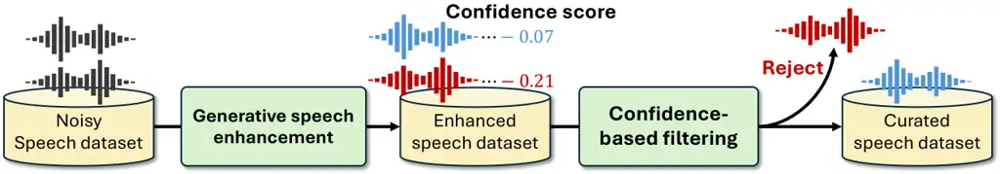
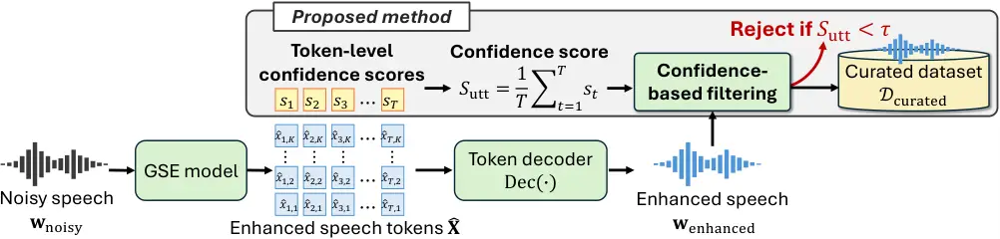
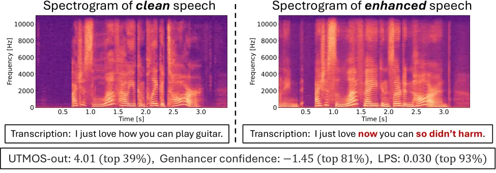
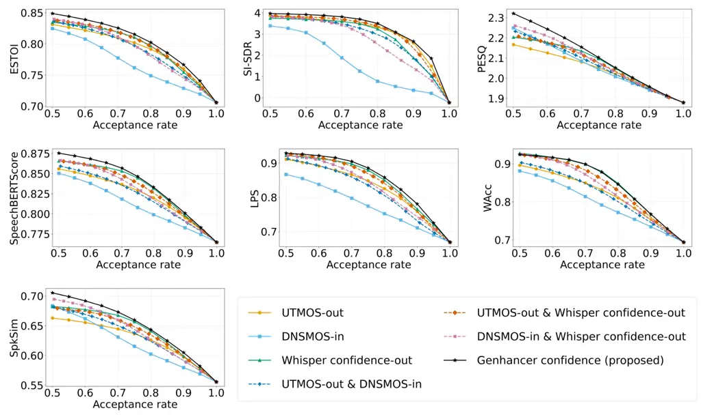

# Confidence-based Filtering for Speech Dataset Curation with Generative Speech Enhancement Using Discrete Tokens

Kazuki Yamauchi    Masato Murata    Shogo Seki

###### Abstract

Generative speech enhancement (GSE) models show great promise in
producing high-quality clean speech from noisy inputs, enabling
applications such as curating noisy text-to-speech (TTS) datasets into
high-quality ones. However, GSE models are prone to hallucination
errors, such as phoneme omissions and speaker inconsistency, which
conventional error filtering based on non-intrusive speech quality
metrics often fails to detect. To address this issue, we propose a
non-intrusive method for filtering hallucination errors from discrete
token-based GSE models. Our method leverages the log-probabilities of
generated tokens as confidence scores to detect potential errors.
Experimental results show that the confidence scores strongly correlate
with a suite of intrusive SE metrics, and that our method effectively
identifies hallucination errors missed by conventional filtering
methods. Furthermore, we demonstrate the practical utility of our
method: curating an in-the-wild TTS dataset with our confidence-based
filtering improves the performance of subsequently trained TTS models.

###### Index Terms: 

speech enhancement, discrete token, dataset curation, text-to-speech
synthesis, in-the-wild dataset

^(†)^(†)address: ¹CyberAgent, Japan, ²The University of Tokyo, Japan  
yamauchi-kazuki042@g.ecc.u-tokyo.ac.jp, murata_masato@cyberagent.co.jp,
seki_shogo@cyberagent.co.jp

## 1 Introduction

Speech enhancement (SE) is a technology to improve the quality and
intelligibility of degraded speech, which is corrupted by background
noise, suboptimal recording conditions, or codec artifacts \[1\].
Traditional approaches have relied on deep neural networks (DNNs) to
estimate complex masks over degraded spectrograms \[2, 3\]. A key
application of SE is the cleaning of large-scale, noisy, “in-the-wild”
speech datasets, which offer a promising source of diverse speech
data \[4\]. While in-the-wild datasets are invaluable for developing
text-to-speech (TTS) systems, their inherent noise and variability
necessitate effective curation \[5\]. A common strategy for in-the-wild
dataset curation \[4\] follows a two-stage pipeline consisting of: (1)
cleaning noisy source speech with an SE model, and (2) subsequently
filtering the enhanced speech with a non-intrusive speech quality metric
such as DNSMOS \[6\].

Recently, generative SE (GSE) models have emerged \[7, 8, 9\], showing
great promise for producing high-quality clean speech from noisy input
by leveraging components developed for TTS systems \[10, 11\]. Building
on this progress, we explore the use of GSE to curate in-the-wild
datasets into high-quality datasets suitable for TTS training.

Despite this promise, GSE models often introduce characteristic
“hallucination errors,” such as phoneme omissions and speaker
inconsistency \[12\]. These errors can contaminate the training data and
ultimately degrade the performance of subsequently trained TTS models,
making the filtering of such artifacts a critical step in the curation
pipeline. A key challenge, however, is that conventional filtering
methods based on non-intrusive speech quality metrics often fail to
detect enhancement-failed speech that, despite sounding acoustically
clean, contains GSE-specific hallucination errors \[12\]. While
intrusive SE metrics, such as PESQ \[13\], SpeechBERTScore \[14\], and
LPS \[12\], can detect these errors by comparing the enhanced speech
with a clean reference, they are impractical for in-the-wild dataset
curation where such references are unavailable.

In this work, we propose a non-intrusive method for filtering
hallucination errors from discrete token-based GSE models, as
illustrated in Figure 1. Our method leverages the log-probabilities of
generated tokens as confidence scores. This score serves as a quality
metric for filtering potential errors. Experimental results show that
the confidence scores strongly correlate with a suite of intrusive SE
metrics. Furthermore, we show the practical utility of our method by
showing that curating an in-the-wild dataset with our confidence-based
filtering improves the performance of subsequently trained TTS models.
Our main contributions are summarized as follows:

- •
  We propose a non-intrusive filtering method that leverages confidence
  scores derived from discrete token-based GSE models for TTS dataset
  curation.
- •
  We show that our filtering method effectively detects GSE-specific
  hallucination errors missed by conventional filtering methods.
- •
  We demonstrate that curating a noisy in-the-wild TTS dataset with our
  confidence-based filtering improves the performance of subsequently
  trained TTS models.



Figure 1: Overview of the speech dataset curation process with our
proposed confidence-based filtering.

## 2 Methods

This section details our method for filtering errors from discrete
token-based GSE, as illustrated in Figure 2. Our method leverages
confidence scores derived from the probabilities of generated tokens.
These scores are used to detect enhancement-failed speech, enabling
effective TTS dataset curation.



Figure 2: The entire process of our confidence-based filtering. A
discrete token-based GSE model outputs enhanced speech
$`\mathbf{w}_{\text{enhanced}}`$, along with token-level confidence
scores ($`s_{1},s_{2},\dots,s_{T}`$). If the confidence score
$`S_{\text{utt}}`$ is below a threshold $`\tau`$,
$`\mathbf{w}_{\text{enhanced}}`$ is filtered out.

### 2.1 Discrete audio token-based GSE

A GSE model in a discrete latent space aims to generate a sequence of
discrete tokens corresponding to clean speech, conditioned on features
extracted from noisy speech. Specifically, a feature extractor encodes
the noisy waveform $`\mathbf{w}_{\text{noisy}}`$ into conditional
features $`\mathbf{c}`$, and a tokenizer $`\text{Tok}(\cdot)`$ converts
the target clean waveform $`\mathbf{w}_{\text{clean}}`$ into a sequence
of discrete tokens:
$`\mathbf{X}=\text{Tok}(\mathbf{w}_{\text{clean}})`$. The goal of the
GSE model is to generate $`\mathbf{X}`$ conditioned on $`\mathbf{c}`$.
To this end, the model is trained to learn the conditional probability
distribution $`p(\mathbf{X}|\mathbf{c};\theta)`$, where $`\theta`$
denotes the model parameters. During inference, a token sequence is
sampled from the learned distribution:
$`\hat{\mathbf{X}}\sim p(\mathbf{X}|\mathbf{c};\theta)`$, which is then
fed into a decoder $`\text{Dec}(\cdot)`$ to synthesize the enhanced
speech waveform:
$`\mathbf{w}_{\text{enhanced}}=\text{Dec}(\hat{\mathbf{X}})`$.

Genhancer as a backbone model: In this work, we employ Genhancer \[7\]
as a backbone SE model. Genhancer utilizes Descript Audio Codec
(DAC) \[15\] for both its audio tokenizer $`\text{Tok}(\cdot)`$ and
decoder $`\text{Dec}(\cdot)`$. DAC is a neural audio codec based on
Residual Vector Quantization (RVQ) \[16\], which quantizes the residual
from the previous quantizer, creating a hierarchical representation
across $`K`$ codebooks, each with a vocabulary size of $`V`$. While
Genhancer supports several inference strategies, we adopt parallel token
prediction, which generates all tokens within a single quantizer in
parallel but sequentially across quantizers. Specifically, the
conditional distribution over token sequences is factorized as:

```math
p(\mathbf{X}|\mathbf{c};\theta)=\prod_{k=1}^{K}\prod_{t=1}^{T}p(x_{t,k}|\mathbf{x}_{:,<k},\mathbf{c};\theta), \tag{1}
```

where $`x_{t,k}\in\{1,\dots,V\}`$ denotes the token at time step $`t`$
from the $`k`$-th quantizer, and $`\mathbf{x}_{:,<k}`$ represents the
token sequences of length $`T`$ from all preceding quantizers.

### 2.2 Confidence scores from discrete token-based GSE

We propose to leverage log-probabilities of generated tokens as
confidence scores to filter out low-confidence outputs that potentially
contain errors. Our method begins by defining a token-level confidence
score $`s_{t}`$ for each time step $`t`$. This score is defined as the
log-probability of the generated token $`\hat{x}_{t,1}`$ from the first
quantizer layer ($`k=1`$), which is chosen as it has the greatest
perceptual impact in RVQ-based codecs \[17, 18\]:

```math
s_{t}=\log p(x_{t,1}=\hat{x}_{t,1}|\mathbf{c};\theta). \tag{2}
```

To obtain a confidence score for the entire utterance, these token-level
scores are then averaged over the sequence length $`T`$ to produce the
utterance-level confidence score $`S_{\text{utt}}`$:

```math
S_{\text{utt}}=\frac{1}{T}\sum_{t=1}^{T}s_{t}=\frac{1}{T}\sum_{t=1}^{T}\log p(x_{t,1}=\hat{x}_{t,1}|\mathbf{c};\theta). \tag{3}
```

We use this final score $`S_{\text{utt}}`$ as a non-intrusive quality
metric to filter the enhanced speech. A high score indicates that the
model generated the output with high confidence, suggesting the
enhancement was successful. Conversely, a low score implies the presence
of challenging noise or acoustic distortions that impede the model’s
processing, flagging the output as a potential enhancement failure.

### 2.3 TTS dataset curation with confidence-based filtering

We leverage the utterance-level confidence score $`S_{\text{utt}}`$ to
curate in-the-wild speech datasets into high-quality TTS corpora. The
curation process consists of two stages: (1) cleaning noisy speech with
a GSE model and (2) confidence-based filtering.

First, we apply the pre-trained Genhancer model to each utterance in the
source speech dataset $`\mathcal{D}_{\text{noisy}}`$. For each source
speech $`\mathbf{w}_{\text{noisy}}\in\mathcal{D}_{\text{noisy}}`$, this
step yields both an enhanced speech $`\mathbf{w}_{\text{enhanced}}`$ and
its corresponding confidence score $`S_{\text{utt}}`$.

Second, we perform confidence-based filtering to refine the enhanced
dataset $`\mathcal{D}_{\text{enhanced}}`$. We define a threshold
$`\tau`$ and retain the enhanced speech $`\mathbf{w}_{\text{enhanced}}`$
only if its score $`S_{\text{utt}}`$ exceeds this threshold:

```math
\mathcal{D}_{\text{curated}}=\{\mathbf{w}_{\text{enhanced}}\in\mathcal{D}_{\text{enhanced}}\mid S_{\text{utt}}\geq\tau\}. \tag{4}
```

The threshold $`\tau`$ can be set empirically, for example, by retaining
the top $`N\%`$ of utterances based on their score distribution. This
filtering step effectively rejects enhancement-failed speech, thereby
improving the overall quality of the resultant TTS dataset
$`\mathcal{D}_{\text{curated}}`$.

| Metric                          | ESTOI | SI-SDR | PESQ  | SpeechBERTScore | LPS   | WAcc  | SpkSim |
| ------------------------------- | ----- | ------ | ----- | --------------- | ----- | ----- | ------ |
| UTMOS-out                       | 0.703 | 0.540  | 0.606 | 0.656           | 0.737 | 0.610 | 0.512  |
| UTMOS-in                        | 0.541 | 0.179  | 0.604 | 0.491           | 0.467 | 0.423 | 0.501  |
| DNSMOS-out                      | 0.372 | 0.181  | 0.338 | 0.427           | 0.330 | 0.323 | 0.383  |
| DNSMOS-in                       | 0.673 | 0.381  | 0.720 | 0.614           | 0.569 | 0.546 | 0.639  |
| Whisper confidence-out          | 0.728 | 0.529  | 0.676 | 0.736           | 0.770 | 0.766 | 0.636  |
| Whisper confidence-in           | 0.468 | 0.277  | 0.420 | 0.438           | 0.500 | 0.504 | 0.365  |
| CTC score-out                   | 0.511 | 0.389  | 0.483 | 0.492           | 0.644 | 0.564 | 0.402  |
| CTC score-in                    | 0.340 | 0.160  | 0.365 | 0.293           | 0.447 | 0.350 | 0.246  |
| Genhancer confidence (proposed) | 0.880 | 0.590  | 0.883 | 0.892           | 0.788 | 0.730 | 0.790  |

Table 1: SRCC between non-intrusive and intrusive SE metrics on the
EARS-WHAM dataset, with “-in” metrics calculated on the noisy input
speech and “-out” metrics on the output speech enhanced by Genhancer.
Bold text highlights the best score for each metric.

## 3 Related works

TTS dataset curation with SE: Several works have used SE for TTS dataset
curation. For instance, \[4\] constructed a noisy in-the-wild TTS
dataset (TITW-hard) and curated it into a cleaner version (TITW-easy).
Their curation process relied on a discriminative SE model,
DEMUCS \[19\], and a quality-filtering based on DNSMOS \[6\]. More
recently, the LibriTTS-R corpus \[20\], a high-quality TTS corpus, was
created by cleaning the LibriTTS corpus \[21\] with Miipher \[8\], a GSE
model. While this work shows the potential of GSE for TTS dataset
curation, LibriTTS is not an in-the-wild dataset. Consequently, it
remains unclear how well GSE performs in more challenging in-the-wild
scenarios. Our work aims to address this gap by investigating the
effectiveness of GSE for curating in-the-wild datasets.

In-the-wild dataset screening with quality-filtering: A different line
of work focuses on screening in-the-wild speech datasets without SE. One
approach employs DNN-based quality predictors, such as DNSMOS \[6\],
which are trained to directly estimate subjective quality scores from
speech samples \[4\]. Another approach leverages automatic speech
recognition (ASR) systems, for example, by using the connectionist
temporal classification (CTC) scores \[22\] to filter for intelligible
speech \[5\]. While effective for this initial screening of in-the-wild
datasets, the utility of these non-intrusive metrics is limited in a
GSE-based curation process, as they are incapable of detecting the
hallucination errors introduced by GSE models.

Confidence scores for quality estimation: The probabilities of generated
tokens from discrete token-based generative models are interpreted as a
measure of the model’s confidence, which is utilized for output quality
estimation. For instance, the perplexity of a language model
(LM)—derived from negative log-probabilities—is a standard metric for
evaluating generated text quality. Similarly, confidence scores from ASR
models such as Whisper \[23\] are used to detect ASR errors \[24\]. For
assessing speech generation, SpeechLMScore \[25\] utilizes the
log-probabilities of generated tokens from a pre-trained speech LM.
While our method adopts a similar conceptual approach, it differs in two
key aspects. First, the SE model performs a “self-assessment” of its own
output, rather than relying on an external speech LM. Second, our
confidence-based metric inherently leverages information from both the
input and the output, whereas conventional methods evaluate the output
in isolation.

## 4 Experiments

We conducted experiments to validate the proposed confidence score as a
quality metric for GSE, particularly its ability to detect hallucination
errors. We also evaluated TTS models trained on in-the-wild datasets
curated with and without our confidence-based filtering.

### 4.1 Experimental setup

#### 4.1.1 Datasets

GSE training: We trained Genhancer on public datasets at a 44.1 kHz
sampling rate. For training data, we used: 1) clean speech from
LibriTTS-R \[20\], upsampled using bandwidth extension \[26\]; 2) noise
samples from the TAU Urban Audio-Visual Scenes 2021 \[27\], DNS
Challenge \[28\], and SFS-Static \[29\] datasets; and 3) impulse
response data from the MIT IR Survey \[30\], EchoThief¹¹ 1
[http://www.echothief.com/echothief/](http://www.echothief.com/echothief/),
and OpenSLR28 \[31\]. Degraded speech for training data was generated
using the original configuration from the Genhancer paper. \[7\].

Evaluation of filtering methods: We used EARS-WHAM dataset (v2)²² 2
[https://github.com/sp-uhh/ears_benchmark](https://github.com/sp-uhh/ears_benchmark)
to investigate the correlation between our confidence score and
intrusive SE metrics. This is a simulated dataset created by mixing
clean speech from EARS dataset \[32\] with noise from WHAM!
dataset \[33\]. EARS-WHAM consists of approximately 100 hours of
simulated noisy speech from 107 speakers and their corresponding clean
references that are used to calculate a suite of SE metrics.

Evaluation of subsequently trained TTS models: We used TITW-hard
dataset \[4\] as our source of in-the-wild TTS data. This dataset was
constructed from the VoxCeleb1 database \[34\], a large collection of
speech data from YouTube. TITW-hard consists of 282,606 utterances (189
hours) from 1,238 speakers. We divided them into training (280,130
utterances) and validation (2,476 utterances) sets.

#### 4.1.2 Models and training

Discrete token-based GSE model: We used Genhancer \[7\] for the GSE
model. We followed the official configuration³³ 3
[https://sophieymie.github.io/#training](https://sophieymie.github.io/#training)
for the model architecture and training setup. We used the pre-trained
DAC model \[15\]⁴⁴ 4
[https://github.com/descriptinc/descript-audio-codec](https://github.com/descriptinc/descript-audio-codec)
for the audio tokenizer and the layer-wise weighted sum of the
pre-trained WavLM model \[35\]⁵⁵ 5
[https://huggingface.co/microsoft/wavlm-large](https://huggingface.co/microsoft/wavlm-large)
to extract conditional features from noisy input. The model was trained
for 400k steps with a batch size of 16 on four NVIDIA A100 GPUs. During
inference, we used a temperature of 0.1 to compute token probabilities.

TTS model: We used Matcha-TTS \[10\] with the pre-trained HiFi-GAN
vocoder (UNIVERSAL_V1) \[11\]⁶⁶ 6
[https://github.com/jik876/hifi-gan](https://github.com/jik876/hifi-gan)
for the TTS model. We followed the official implementation of
Matcha-TTS⁷⁷ 7
[https://github.com/shivammehta25/Matcha-TTS](https://github.com/shivammehta25/Matcha-TTS)
for the model architecture and training setup. The model was initialized
with publicly available weights pre-trained on the VCTK dataset \[36\].
Starting from this pre-trained model, we trained it for 500k steps with
a batch size of 32 on a single NVIDIA A100 GPU.

#### 4.1.3 Metrics

Non-intrusive metrics for comparison: We evaluated the following
non-intrusive metrics as data filtering criteria. The “-in” and “-out”
suffixes denote whether the metric was applied to the noisy input or the
enhanced output, respectively.

- •
  UTMOS-out/in: A speech naturalness metric that uses the UTMOS
  model \[37\] to predict a mean opinion score (MOS).
- •
  DNSMOS-out/in: An overall speech quality metric that uses the DNSMOS
  model \[6\] to predict an MOS.
- •
  Whisper confidence-out/in: A speech intelligibility metric that uses
  the mean probabilities of words predicted by a pre-trained Whisper
  Large v3 model \[23, 24\].
- •
  CTC score-out/in: A speech intelligibility metric that uses an
  open-source toolkit⁸⁸ 8
  [https://gist.github.com/lumaku/75eca1c86d9467a54888d149dc7b84f1](https://gist.github.com/lumaku/75eca1c86d9467a54888d149dc7b84f1)
  to calculate the CTC score \[22, 5\].
- •
  Genhancer confidence (proposed): The confidence score
  $`S_{\text{utt}}`$ derived from Genhancer, as described in
  Section 2.2.

Intrusive metrics for evaluation: We calculated Spearman’s Rank
Correlation Coefficient (SRCC) \[38\] between the non-intrusive metrics
described above and the following intrusive SE metrics from the URGENT
Challenge 2024 \[39\]: ESTOI \[40\], SI-SDR \[41\], PESQ \[13\],
SpeechBERTScore \[14\], Levenshtein phoneme similarity (LPS) \[12, 39\],
word accuracy (WAcc, equal to “$`1-\text{word error rate (WER)}`$’’),
and speaker similarity (SpkSim). ESTOI, SI-SDR, and PESQ are traditional
intrusive SE metrics for measuring speech signal similarity. In
contrast, SpeechBERTScore and LPS are more recent metrics that evaluate
the semantic fidelity of generated speech, with LPS specifically
designed to detect hallucination errors in GSE. To calculate these
metrics, we used the official open-source implementation from the URGENT
Challenge 2024⁹⁹ 9
[https://github.com/urgent-challenge/urgent2024_challenge/tree/main/evaluation_metrics](https://github.com/urgent-challenge/urgent2024_challenge/tree/main/evaluation_metrics).

### 4.2 Validation of the confidence score as a GSE metric

To validate the proposed confidence score as a quality metric for GSE,
we evaluated its correlation with intrusive SE metrics. We enhanced all
samples in the EARS-WHAM dataset using the trained Genhancer model and
calculated the metric scores described in Section 4.1.3 for each
utterance. Table 1 reports the SRCC between a suite of non-intrusive and
intrusive SE metrics. Among the non-intrusive metrics, the Genhancer
confidence score exhibits the strongest correlation with all intrusive
metrics except for WAcc. This shows that the confidence score is a
reliable non-intrusive metric for GSE.

To demonstrate the ability of our method to detect hallucination errors,
Figure 3 shows an example of an enhanced speech spectrogram with such
errors. In this example, the enhanced speech sounds acoustically clean
but suffers from content corruption, including the generation of
meaningless sounds during silent intervals. In this case, UTMOS-out
shows a high score of 4.01 (top $`39\%`$), suggesting that filtering
based on UTMOS-out has difficulty detecting such hallucination errors.
In contrast, both LPS and our confidence score yield relatively low
scores, placing them in the top $`93\%`$ and top $`81\%`$, respectively.
Note that while LPS is intrusive, making it impractical for in-the-wild
dataset curation, our confidence score is non-intrusive and does not
require clean reference speech. This demonstrates that our
confidence-based filtering can effectively detect hallucination errors
missed by conventional non-intrusive metrics such as UTMOS.



Figure 3: An example of a hallucination error caused by GSE, showing the
spectrogram of clean speech (left) and enhanced speech (right).



Figure 4: Average quality of the filtered dataset vs. acceptance rate
for each filtering method with varying filtering thresholds.

|                       | \# Utterances | UTMOS $`\uparrow`$ | DNSMOS $`\uparrow`$ | WER (%) $`\downarrow`$ |
| --------------------- | ------------- | ------------------ | ------------------- | ---------------------- |
| Source (noisy)        | 280,130       | 2.73               | 2.74                | 21.31                  |
| Enhanced (unfiltered) | 280,130       | 3.64               | 3.10                | 20.45                  |
| Enhanced (top 90%)    | 252,117       | 3.76               | 3.14                | 19.29                  |
| Enhanced (top 80%)    | 224,104       | 3.80               | 3.17                | 18.79                  |
| Enhanced (top 70%)    | 196,091       | 3.76               | 3.15                | 18.14                  |
| Enhanced (top 60%)    | 168,078       | 3.73               | 3.12                | 18.78                  |
| Enhanced (top 50%)    | 140,065       | 3.68               | 3.11                | 20.18                  |

Table 2: Evaluation results of TTS models trained on dataset curated
using our proposed method. “top $`N\%`$” indicates the percentage of
data with the highest confidence scores that was retained for training.
Bold text highlights the best performance for each metric.

### 4.3 Analysis of dataset quality vs. quantity

To examine the trade-off between filtered data quality and quantity, we
evaluated filtering methods with varying thresholds on EARS-WHAM. As
baseline filtering criteria, we selected three non-intrusive metrics
(UTMOS-out, DNSMOS-in, and Whisper confidence-out) due to their high
correlation with intrusive metrics, as shown in Table 1. We also
evaluated methods combining two metrics, which are denoted by “&” in
Figure 4. For these combined methods, a sample was rejected if its score
on either metric fell below the threshold.

Figure 4 shows the relationship between the acceptance rate (percentage
of retained samples) and the resultant scores on a suite of intrusive SE
metrics, averaged over retained samples. At any given acceptance rate,
filtering with Genhancer confidence consistently outperforms the other
methods (including combined-metric approaches) across all intrusive
metrics except WAcc. While Whisper confidence-out filtering is
competitive with our method on WAcc, its impact on other metrics is
marginal. This indicates that while Whisper confidence primarily focuses
on content errors, Genhancer confidence effectively filters for both
content and acoustic errors.

### 4.4 Evaluation of subsequently trained TTS models

To demonstrate the practical utility of our method, we evaluated TTS
models trained on in-the-wild datasets curated with and without our
confidence-based filtering. First, we enhanced all utterances in
TITW-hard using the trained Genhancer model. Subsequently, we created
several subsets by filtering the enhanced dataset based on Genhancer
confidence scores. This filtering was applied at various thresholds,
retaining the top $`90\%`$, $`80\%`$, $`70\%`$, $`60\%`$, and $`50\%`$
of the utterances. We then trained a separate Matcha-TTS model on each
of these curated subsets. For comparison, we also trained two baseline
models: one on the noisy source data and another on the enhanced but
unfiltered data. For TTS evaluation, we followed the methodology of the
TITW paper \[4\] except for the text source. We used each trained model
to synthesize speech from 200 randomly selected texts from the SeedTTS
test-en \[42\]. For each of the texts, we randomly selected 40 target
speakers from the TITW-hard dataset, generating a total of 8,000
($`=40\times 200`$) synthetic utterances per model. The synthetic speech
was then evaluated using UTMOS, DNSMOS, and WER.

Table 2 shows the evaluation results for TTS models trained on TITW-hard
curated using confidence-based filtering with varying thresholds. The
results show that the model trained on the enhanced dataset curated with
our confidence-based filtering outperformed the model trained on the
unfiltered enhanced dataset (“Enhanced (unfiltered)”). Specifically,
performance improved as the filtering threshold became stricter, with
the best UTMOS and DNSMOS scores (3.80 and 3.17) at the “top 80%”
threshold and the lowest WER (18.14%) at “top 70%”. However, overly
aggressive filtering (e.g., retaining only the top 60% or 50%) led to a
decline in performance. These results demonstrate that enhancement
errors negatively affect the performance of the subsequently trained TTS
model, and confidence-based filtering effectively removes
enhancement-failed samples, leading to superior TTS models. They also
suggest a trade-off between data quality and quantity in creating an
optimal TTS training dataset.

## 5 Conclusion

In this work, we propose a non-intrusive method for filtering errors
from discrete token-based GSE models. Experimental results show that our
method effectively detects GSE-specific hallucination errors, which are
frequently overlooked by conventional filtering methods. Furthermore, we
demonstrate the practical utility of our method: curating an in-the-wild
TTS dataset with our confidence-based filtering improves the performance
of subsequently trained TTS models. However, our current approach is
limited to discrete token-based GSE models. To address this issue,
future work will explore leveraging the probability distribution of
continuous features as a confidence measure for GSE models operating in
a continuous latent space \[43, 44\].

## References

- \[1\] Z. Zhao, H. Liu, and T. Fingscheidt (2018) Convolutional neural
  networks to enhance coded speech. IEEE/ACM Transactions on Audio,
  Speech, and Language Processing 27 (4), pp. 663–678. Cited by: §1.
- \[2\] Y. Xu, J. Du, L. Dai, and C. Lee (2014) A regression approach to
  speech enhancement based on deep neural networks. IEEE/ACM
  transactions on audio, speech, and language processing 23 (1),
  pp. 7–19. Cited by: §1.
- \[3\] D. S. Williamson and D. Wang (2017) Time-frequency masking in
  the complex domain for speech dereverberation and denoising. IEEE/ACM
  transactions on audio, speech, and language processing 25 (7),
  pp. 1492–1501. Cited by: §1.
- \[4\] J. Jung, W. Zhang, S. Maiti, Y. Wu, X. Wang, J. Kim, Y.
  Matsunaga, S. Um, J. Tian, H. Shim, et al. (2025) The text-to-speech
  in the wild (titw) database. In Proc. Interspeech, pp. 4798–4802.
  Cited by: §1, §3, §3, §4.1.1, §4.4.
- \[5\] K. Seki, S. Takamichi, T. Saeki, and H. Saruwatari (2023)
  Text-to-speech synthesis from dark data with evaluation-in-the-loop
  data selection. In Proc. ICASSP, pp. 1–5. Cited by: §1, §3, 4th item.
- \[6\] C. K. A. Reddy, V. Gopal, and R. Cutler (2021) Dnsmos: a
  non-intrusive perceptual objective speech quality metric to evaluate
  noise suppressors. In Proc. ICASSP, pp. 6493–6497. Cited by: §1, §3,
  §3, 2nd item.
- \[7\] H. Yang, J. Su, M. Kim, and Z. Jin (2024) Genhancer:
  high-fidelity speech enhancement via generative modeling on discrete
  codec tokens. In Proc. Interspeech, pp. 1170–1174. Cited by: §1, §2.1,
  §4.1.1, §4.1.2.
- \[8\] Y. Koizumi, H. Zen, S. Karita, Y. Ding, K. Yatabe, N.
  Morioka, Y. Zhang, W. Han, A. Bapna, and M. Bacchiani (2023) Miipher:
  a robust speech restoration model integrating self-supervised speech
  and text representations. In Proc. WASPAA, pp. 1–5. Cited by: §1, §3.
- \[9\] J. Su, Z. Jin, and A. Finkelstein (2021) HiFi-gan-2:
  studio-quality speech enhancement via generative adversarial networks
  conditioned on acoustic features. In Proc. WASPAA, pp. 166–170. Cited
  by: §1.
- \[10\] S. Mehta, R. Tu, J. Beskow, É. Székely, and G. E. Henter (2024)
  Matcha-TTS: a fast tts architecture with conditional flow matching. In
  Proc. ICASSP, pp. 11341–11345. Cited by: §1, §4.1.2.
- \[11\] J. Kong, J. Kim, and J. Bae (2020) HiFi-GAN: generative
  adversarial networks for efficient and high fidelity speech synthesis.
  In Proc. NeurIPS, pp. 17022–17033. Cited by: §1, §4.1.2.
- \[12\] J. Pirklbauer, M. Sach, K. Fluyt, W. Tirry, W. Wardah, S.
  Moeller, and T. Fingscheidt (2023) Evaluation metrics for generative
  speech enhancement methods: issues and perspectives. In Speech
  Communication; 15th ITG Conference, pp. 265–269. Cited by: §1, §4.1.3.
- \[13\] A.W. Rix, J.G. Beerends, M.P. Hollier, and A.P. Hekstra (2001)
  Perceptual evaluation of speech quality (pesq)-a new method for speech
  quality assessment of telephone networks and codecs. In Proc. ICASSP,
  pp. 749–752 vol.2. Cited by: §1, §4.1.3.
- \[14\] T. Saeki, S. Maiti, S. Takamichi, S. Watanabe, and H.
  Saruwatari (2024) Speechbertscore: reference-aware automatic
  evaluation of speech generation leveraging nlp evaluation metrics. In
  Proc. Interspeech, pp. 4943–4947. Cited by: §1, §4.1.3.
- \[15\] R. Kumar, P. Seetharaman, A. Luebs, I. Kumar, and K.
  Kumar (2023) High-fidelity audio compression with improved RVQGAN. In
  Proc. NeurIPS, Cited by: §2.1, §4.1.2.
- \[16\] A. Vasuki and P. T. Vanathi (2006) A review of vector
  quantization techniques. IEEE Potentials 25 (4), pp. 39–47. Cited by:
  §2.1.
- \[17\] J. Xue, Y. Deng, Y. Han, Y. Gao, and Y. Li (2024) Improving
  audio codec-based zero-shot text-to-speech synthesis with multi-modal
  context and large language model. In Proc. Interspeech, pp. 682–686.
  Cited by: §2.2.
- \[18\] A. H. Liu, Q. Wang, Y. Gong, and J. Glass (2024) A closer look
  at neural codec resynthesis: bridging the gap between codec and
  waveform generation. In NeurIPS 2024 Audio Imagination workshop, Cited
  by: §2.2.
- \[19\] A. Defossez, G. Synnaeve, and Y. Adi (2020) Real time speech
  enhancement in the waveform domain. In Proc. Interspeech,
  pp. 3291–3295. Cited by: §3.
- \[20\] Y. Koizumi, H. Zen, S. Karita, Y. Ding, K. Yatabe, N.
  Morioka, M. Bacchiani, Y. Zhang, W. Han, and A. Bapna (2023)
  LibriTTS-R: a restored multi-speaker text-to-speech corpus. In Proc.
  Interspeech, pp. 5496–5500. Cited by: §3, §4.1.1.
- \[21\] H. Zen, V. Dang, R. Clark, Y. Zhang, R. J. Weiss, Y. Jia, Z.
  Chen, and Y. Wu (2019) Libritts: a corpus derived from librispeech for
  text-to-speech. In Proc. Interspeech, pp. 1526–1530. Cited by: §3.
- \[22\] L. Kürzinger, D. Winkelbauer, L. Li, T. Watzel, and G.
  Rigoll (2020) CTC-segmentation of large corpora for german end-to-end
  speech recognition. In Proc. SPECOM, pp. 267–278. Cited by: §3, 4th
  item.
- \[23\] A. Radford, J. W. Kim, T. Xu, G. Brockman, C. McLeavey, and I.
  Sutskever (2023) Robust speech recognition via large-scale weak
  supervision. In Proc. ICML, pp. 28492–28518. Cited by: §3, 3rd item.
- \[24\] M. Naderi, E. Hermann, A. Nanchen, S. Hovsepyan, and M. M.
  Doss (2024) Towards interfacing large language models with asr systems
  using confidence measures and prompting. In Proc. Interspeech,
  pp. 2980–2984. Cited by: §3, 3rd item.
- \[25\] S. Maiti, Y. Peng, T. Saeki, and S. Watanabe (2023)
  Speechlmscore: evaluating speech generation using speech language
  model. In Proc. ICASSP, pp. 1–5. Cited by: §3.
- \[26\] J. Su, Y. Wang, A. Finkelstein, and Z. Jin (2021) Bandwidth
  extension is all you need. In Proc. ICASSP, pp. 696–700. Cited by:
  §4.1.1.
- \[27\] S. Wang, A. Mesaros, T. Heittola, and T. Virtanen (2021) A
  curated dataset of urban scenes for audio-visual scene analysis. In
  Proc. ICASSP, pp. 626–630. Cited by: §4.1.1.
- \[28\] H. Dubey, A. Aazami, V. Gopal, B. Naderi, S. Braun, R.
  Cutler, A. Ju, M. Zohourian, M. Tang, M. Golestaneh, et al. (2024)
  ICASSP 2023 deep noise suppression challenge. IEEE Open Journal of
  Signal Processing 5, pp. 725–737. Cited by: §4.1.1.
- \[29\] Z. Chen, X. Hu, and A. Owens (2021) Structure from silence:
  learning scene structure from ambient sound. In 5th Annual Conference
  on Robot Learning, Cited by: §4.1.1.
- \[30\] J. Traer and J. H. McDermott (2016) Statistics of natural
  reverberation enable perceptual separation of sound and space.
  Proceedings of the National Academy of Sciences 113 (48),
  pp. E7856–E7865. Cited by: §4.1.1.
- \[31\] T. Ko, V. Peddinti, D. Povey, M. L. Seltzer, and S.
  Khudanpur (2017) A study on data augmentation of reverberant speech
  for robust speech recognition. In Proc. ICASSP, pp. 5220–5224. Cited
  by: §4.1.1.
- \[32\] J. Richter, Y. Wu, S. Krenn, S. Welker, B. Lay, S. Watanabe, A.
  Richard, and T. Gerkmann (2024) EARS: an anechoic fullband speech
  dataset benchmarked for speech enhancement and dereverberation. In
  Proc. Interspeech, pp. 4873–4877. Cited by: §4.1.1.
- \[33\] G. Wichern, J. Antognini, M. Flynn, L. R. Zhu, E. McQuinn, D.
  Crow, E. Manilow, and J. L. Roux (2019) Wham!: extending speech
  separation to noisy environments. In Proc. Interspeech, pp. 1368–1372.
  Cited by: §4.1.1.
- \[34\] A. Nagrani, J. S. Chung, W. Xie, and A. Zisserman (2020)
  Voxceleb: large-scale speaker verification in the wild. Computer
  Science and Language 60 (C). Cited by: §4.1.1.
- \[35\] S. Chen, C. Wang, Z. Chen, Y. Wu, S. Liu, Z. Chen, J. Li, N.
  Kanda, T. Yoshioka, X. Xiao, et al. (2022) Wavlm: large-scale
  self-supervised pre-training for full stack speech processing. IEEE
  Journal of Selected Topics in Signal Processing 16 (6), pp. 1505–1518.
  Cited by: §4.1.2.
- \[36\] C. Veaux, J. Yamagishi, and Kirsten. MacDonald (2017)
  SUPERSEDED - cstr vctk corpus: english multi-speaker corpus for cstr
  voice cloning toolkit. In The Centre for Speech Technology Research
  (CSTR), Cited by: §4.1.2.
- \[37\] T. Saeki, D. Xin, W. Nakata, T. Koriyama, S. Takamichi, and H.
  Saruwatari (2022) UTMOS: UTokyo-SaruLab System for VoiceMOS Challenge 2022. In Proc. Interspeech, pp. 4521–4525. Cited by: 1st item.
- \[38\] C. Spearman (1987) The proof and measurement of association
  between two things. The American journal of psychology 100 (3/4),
  pp. 441–471. Cited by: §4.1.3.
- \[39\] W. Zhang, R. Scheibler, K. Saijo, S. Cornell, C. Li, Z. Ni, A.
  Kumar, J. Pirklbauer, M. Sach, S. Watanabe, et al. (2024) Urgent
  challenge: universality, robustness, and generalizability for speech
  enhancement. In Proc. Interspeech, pp. 4868–4872. Cited by: §4.1.3.
- \[40\] J. Jensen and C. H. Taal (2016) An algorithm for predicting the
  intelligibility of speech masked by modulated noise maskers. IEEE/ACM
  Transactions on Audio, Speech, and Language Processing 24 (11),
  pp. 2009–2022. Cited by: §4.1.3.
- \[41\] J. Le Roux, S. Wisdom, H. Erdogan, and J. R. Hershey (2019)
  SDR–half-baked or well done?. In Proc. ICASSP, pp. 626–630. Cited by:
  §4.1.3.
- \[42\] P. Anastassiou, J. Chen, J. Chen, Y. Chen, Z. Chen, Z. Chen, J.
  Cong, L. Deng, C. Ding, L. Gao, et al. (2024) Seed-tts: a family of
  high-quality versatile speech generation models. arXiv preprint
  arXiv:2406.02430. Cited by: §4.4.
- \[43\] Y. Lu, Z. Wang, S. Watanabe, A. Richard, C. Yu, and Y.
  Tsao (2022) Conditional diffusion probabilistic model for speech
  enhancement. In Proc. ICASSP, pp. 7402–7406. Cited by: §5.
- \[44\] R. Korostik, R. Nasretdinov, and A. Jukić (2025) Modifying flow
  matching for generative speech enhancement. In Proc. ICASSP, pp. 1–5.
  Cited by: §5.
