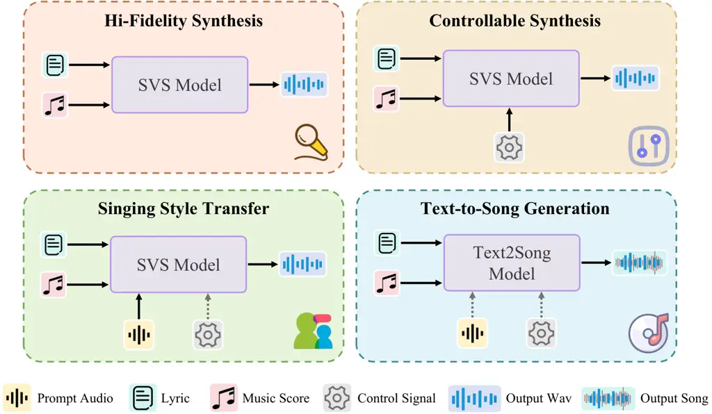
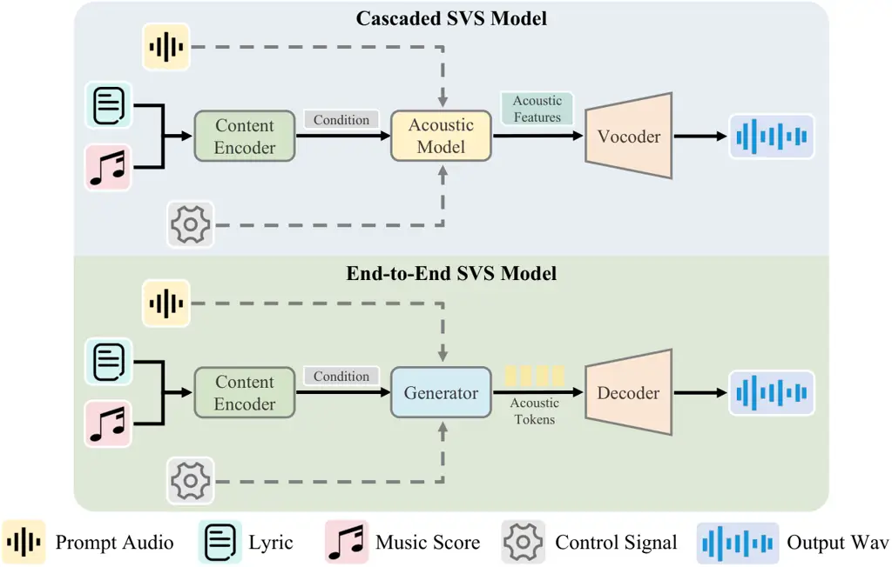
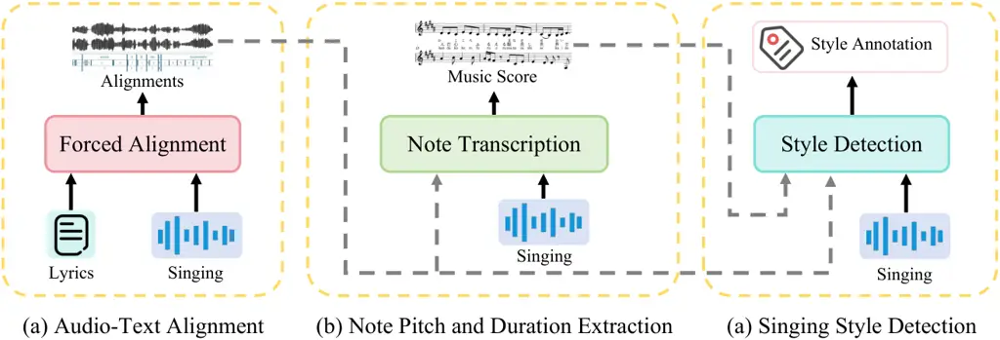

# Synthetic Singers A Review of Deep-Learning-based Singing Voice Synthesis Approaches

Changhao Pan¹¹footnotemark: 1 Affiliation: Zhejiang University,
Hangzhou, China Email: [panch@zju.edu.cn](mailto:)    Dongyu Yao
^(†)^(†)thanks: \$ \$ Equal Contribution. Affiliation: Zhejiang
University, Hangzhou, China Email: [dongyuyao@zju.edu.cn](mailto:)    Yu
Zhang Affiliation: Zhejiang University, Hangzhou, China
Email: [zhaozhou@zju.edu.cn](mailto:)    Wenxiang Guo
Affiliation: Zhejiang University, Hangzhou, China    Jingyu Lu
Affiliation: Zhejiang University, Hangzhou, China    Zhiyuan Zhu
Affiliation: Zhejiang University, Hangzhou, China    Zhou Zhao
^(†)^(†)thanks: \$ \$ Corresponding Author. Affiliation: Zhejiang
University, Hangzhou, China

###### Abstract

Recent advances in singing voice synthesis (SVS) have attracted
substantial attention from both academia and industry. With the advent
of large language models and novel generative paradigms, producing
controllable, high-fidelity singing voices has become an attainable
goal. Yet the field still lacks a comprehensive survey that
systematically analyzes deep-learning-based singing voice synthesis
systems and their enabling technologies. To address the aforementioned
issue, this survey first categorizes existing systems by task type and
then organizes current architectures into two major paradigms: cascaded
and end-to-end approaches. Moreover, we provide an in-depth analysis of
core technologies, covering singing modeling and control techniques.
Finally, we review relevant datasets, annotation tools, and evaluation
benchmarks that support training and assessment. In appendix, we
introduce training strategies and further discussion of SVS. This survey
provides an up-to-date review of the literature on SVS models, which
would be a useful reference for both researchers and engineers. Related
materials are available
at [https://github.com/David-Pigeon/SyntheticSingers](https://github.com/David-Pigeon/SyntheticSingers).

## 1 Introduction

Singing voice synthesis (SVS) seeks to generate high-fidelity singing
from textual lyrics and symbolic musical scores, and has garnered
sustained interest in both industry and academic communities. The field
has evolved from early engines such as VOCALOID¹¹ 1
[https://www.vocaloid.com/en/](https://www.vocaloid.com/en/) and virtual
singers like Hatsune Miku²² 2
[https://vocaloid.fandom.com/wiki/Hatsune_Miku](https://vocaloid.fandom.com/wiki/Hatsune_Miku)
to contemporary song-generation platforms, including Seed-Music Bai
et al. (2024b) and Suno³³ 3
[https://suno.com/home](https://suno.com/home), which deliver immersive,
realistic listening experiences. Unlike conventional text-to-speech, SVS
accepts richer inputs and imposes stricter constraints: synthesized
vocals must articulate lyrics clearly while strictly following the
prescribed melody. Moreover, modern SVS systems are expected to preserve
fidelity, provide controllable stylistic variation, and convey
expressive emotion.

Driven by the development of deep learning Vaswani et al. (2017) and
generative models Ho et al. (2020), recent years have witnessed
remarkable advances in SVS. Relative to traditional methods such as
waveform concatenation Kenmochi and Ohshita (2007) and statistical
parametric synthesis Saino et al. (2006), deep-learning approaches
provide finer acoustic detail Chen et al. (2020a) and markedly enhance
the clarity and naturalness of the generated vocals Zhang et al.
(2022c). Benefiting from the strong extensibility of modern generative
models, contemporary SVS systems further deliver superior
controllability and generalization, enabling zero-shot singing
generation while consistently maintaining high audio quality Zhang
et al. (2024c); Byun et al. (2024).

The evolution of singing-voice synthesis begins with the canonical goal
of producing high-fidelity vocals. Early systems, largely inherited from
text-to-speech frameworks Wang et al. (2017); Ren et al. (2019), reach
this objective by introducing music-specific modules such as score
encoders Lu et al. (2020) and pitch predictors He et al. (2023). As
generative AI matures and vision-domain applications proliferate Rombach
et al. (2022); Peebles and Xie (2023), users grow to expect equally
personalized and controllable audio experiences. Researchers and
engineers have therefore advanced multi-speaker models capable of
high-quality timbre generation Cho et al. (2022); Huang et al. (2021),
along with editing schemes that enable fine-grained control over emotion
and singing style Hong et al. (2023); Dai et al. (2024). The advent of
multimodal large language models Achiam et al. (2023); Chu et al. (2024)
has raised expectations for customized singing-voice generation.
Zero-shot SVS systems endowed with style control and transfer Zhang
et al. (2024c), have therefore received considerable attention.
Meanwhile, emerging tasks such as speech-to-singing conversion Li et al.
(2023) and text-to-song generation Liu et al. (2025); Yuan et al. (2025)
have gained momentum, markedly expanding the application landscape of
SVS across the entertainment, education, and film.

On synthesis process, the continuity of audio signals and the inherently
one-to-many mapping from score to waveform initially led researchers to
adopt an “acoustic-model + vocoder” pipeline Lu et al. (2020). In this
cascaded approach, an acoustic model predicts intermediate acoustic
features from the score, after which a vocoder converts these features
into the waveform. To reduce error accumulation and utilize the prior
knowledge in LLMs, recent works move toward vocoder-free frameworks that
generate waveforms directly. We refer to these newer systems as
end-to-end approaches. Building on prevailing SVS architectures, we
identify three core technologies: singing-voice modeling, control
mechanisms, and training strategies.

Considering the aforementioned factors, the organization of this survey
is shown below. Section 2 introduces the mainstream tasks and scenarios
of SVS. Section 3 examines the different architectures of SVS models. We
discuss the method for modeling and control in Section 4. Finally, we
present resources of SVS models in Section 5.

## 2 Tasks of SVS

Figure 1: An overall demonstration of four prevailing tasks of SVS
systems.

Drawing on demonstrations and user interfaces from SVS systems such as
DiffSinger Liu et al. (2022a) and UTAU⁴⁴ 4
[https://utau-synth.com](https://utau-synth.com), and referencing the
historical progress of SVS, we divide the prevailing SVS tasks into four
categories as shown in Figure 1.

#### Hi-Fidelity Synthesis

High-fidelity vocal reproduction is the foundational goal in SVS
research Wagner and Watson (2010). Early work pursued greater
naturalness by embedding music-specific inductive biases. XiaoiceSing Lu
et al. (2020) extends the FastSpeech architecture Ren et al. (2019) with
constraints on note duration and pitch, while HiFiSinger Chen et al.
(2020a) replaces the conventional vocoder in XiaoiceSing with Parallel
WaveGAN Yamamoto et al. (2020), achieving superior audio fidelity. To
counter the over-smoothing typical of Transformer-based generators,
DiffSinger Liu et al. (2022a) introduces a shallow-diffusion DDPM,
markedly improving spectral detail. The value of fundamental frequency
(F0) for singing has also been highlighted: RMSSinger employs
diffusion-based pitch modeling to enhance naturalness He et al. (2023),
and SiFiSinger Cui et al. (2024) adds a source module that produces
F0-controlled excitation signals for finer pitch control. Moreover, by
consistency models Song et al. (2023), researchers also propose
high-efficiency and high-quality SVS solutions Ye et al. (2023); Lu
et al. (2024).

#### Controllable Synthesis

Beyond high-fidelity audio, contemporary SVS systems are expected to
afford fine-grained control over timbre, singing techniques, and singing
style, trying to achieve a comprehensive improvement in quality and
controllability. At the timbre level, MuSE-SVS Kim et al. (2023) offers
a multi-singer, emotion-aware synthesizer that enables timbre selection.
To manipulate expressive prosody, Song et al. (2022) introduces a
DL-based SVS model that controls multiple aspects of vibrato. For
technique controllability, SinTechSVS Zhao et al. (2024) integrates an
attention-based local-score module to model singing techniques. The
emergence of LLM opens a new frontier in prompt-based conditioning.
PromptSinger Wang et al. (2024a) uses natural-language prompts to steer
timbre, emotion, and loudness, while TechSinger Guo et al. (2025b)
extends this paradigm to precisely control techniques with classifier
free guidance  Ho and Salimans (2021). Notably, the expressive diversity
of singing has motivated style-specific generation models. Examples
include FreeStyler for rap generation Ning et al. (2025b) and SongSong
for classical art-song synthesis Hu et al. (2025). Future work is poised
to explore multi-modal prompt-driven, multi-dimensional control for
richer user interaction.

#### Singing Style Transfer

Audio prompt conveys richer acoustic detail and more distinctive
stylistic cues than textual information. Consequently, singing-style
transfer and voice-conversion techniques have become pivotal research
directions. The pioneering work in this field Shen et al. (2024); Zhang
et al. (2024b) demonstrates that residual vector quantization(RVQ)
effectively captures diverse stylistic attributes. While TCSinger
replaces RVQ with clustering vector quantization(CVQ) for more stable
style compression and augments the system with an LM to jointly model
prosody and style Zhang et al. (2024c). ExpressiveSinger Dai et al.
(2024) further enhances expressiveness by cascading diffusion-based
control modules. Moreover, due to the scarcity of singing data and the
high requirements for singers, speech-to-singing(STS) Li et al. (2023)
paradigm has emerged, aiming to improve both musicality and style
fidelity Dai et al. (2025). The request for broader personalization also
spurs unified frameworks: TCSinger2 unifies controllable synthesis and
style transfer via contrastive learning and a mixture of experts (MOE)
architecture Zhang et al. (2025b). Developing more customized and
adaptable generation schemes remains a fruitful avenue for future
research.

#### Text-to-Song Generation

Song generation has also remained a sustained focus for audio
researchers. One of the earliest works is JukeBox Dhariwal et al.
(2020). With the advance of SVS and music generation Donahue et al.
(2023), a natural idea is to design cascaded frameworks. Prior
works Hong et al. (2024); Li et al. (2024a) decomposes song synthesis
into two steps: (i) SVS and (ii) vocal-to-accompaniment generation.
Versband Zhang et al. (2025d)further enhances this pipeline by MOE to
improve controllability and vocal–accompaniment alignment. Moreover,
several studies have explored end-to-end generation. SongGen Liu et al.
(2025) employs a single-stage auto-regressive Transformer for
text-to-song generation. Meanwhile, built upon the LLaMA2 Touvron et al.
(2023), YuE Yuan et al. (2025) introduces structural progressive
conditioning, addressing the challenge of long-form music generation. In
addition to the auto-regressive paradigm, DiffRhythm Ning et al. (2025a)
and MuDiT Wang et al. (2024b) explore DiT Peebles and Xie (2023)
backbones for non-autoregressive song generation, while Levo Lei et al.
(2025) further introduces a mixed-token strategy together with direct
preference optimization Wallace et al. (2024), achieving
multi-preference alignment and improving musicality. These developments
underscore the growing potential of end-to-end models in song
generation.

## 3 Architecture

Figure 2: We categorize SVS models into two paradigms, cascaded and
end-to-end approaches. A system is end-to-end if it outputs waveforms
directly, without intermediate modules or hand-crafted interfaces. Thus
requiring a vocoder implies a cascaded design. Dashed lines indicate
optional process.

In singing synthesis, the fundamental challenge is delivering stable,
high-quality outputs despite the one-to-many mapping from score to
waveform. As shown in Figure 2, we therefore classify SVS models by
whether they employ a vocoder in waveform generation: cascaded and
end-to-end frameworks.

### 3.1 Cascaded SVS Systems

#### Acoustic Model

In cascaded models, the acoustic model manages the "music score $`\to`$
spectral feature" mapping. Great progress has been made in the network
architecture for SVS. Inspired by Transformer-based TTS models, early
DL-based SVS frameworks such as HiFiSinger Chen et al. (2020a) adopts
non-autoregressive acoustic models, while ByteSing Gu et al. (2021) is
designed based on an autoregressive Tacotron-like Wang et al. (2017)
architecture. DeepSinger Ren et al. (2020b) propose a feed-forward
Transformer-based singing model while using a large amount of internet
singing data for training. WeSinger Zhang et al. (2022c) introduces data
augmentation methods and replaces the commonly used mel-spectrogram
features with LPC features to improve accuracy. An adversarial
multi-task learning framework Kim et al. (2022) is also novelly
introduced to disentangle timbre and pitch features in singing.
Furthermore, diffusion models Ho et al. (2020), as a flexible and
interpretable generative framework, are also emerging in the audio
modality. DiffSinger Liu et al. (2022a) employs a conditional diffusion
process that, guided by score information, reconstructs target
Mel-spectrograms from Gaussian noise with high fidelity. RMSSinger He
et al. (2023) further introduces a diffusion-based pitch predictor to
yield more accurate and controllable F0 trajectories. These approaches
provide new avenues for improving the naturalness and expressiveness of
synthesized singing. More recently, flow matching has emerged as a
prominent generative paradigm; flow-matching acoustic models like
TechSinger Guo et al. (2025b) offer faster and more stable generation
while maintaining quality.

#### Vocoder

Before the widespread adoption of deep learning, vocoders were typically
of two types: (i) algorithmic reconstruction, such as the Griffin–Lim
algorithm; and (ii) parametric reconstruction, exemplified by
WORLD Morise et al. (2016). Neural vocoders have since become prevalent
due to their superior reconstruction quality and strong generalization.
WaveRNN Kalchbrenner et al. (2018) is a commonly used autoregressive
vocoder in SVS systems. Non-autoregressive alternatives include
teacher–student frameworks Oord et al. (2018) and diffusion-based
methods Chen et al. (2020b). At present, the most widely adopted neural
vocoders are GAN-based, with HiFi-GAN Kong et al. (2020a) and
BigVGAN Lee et al. (2022b) demonstrating strong performance in audio
reconstruction. Leveraging the unique characteristics of singing,
researchers have also developed task-specific neural vocoders tailored
for SVS, enabling expressive reconstruction Huang et al. (2021).

### 3.2 End-to-End SVS Systems

To mitigate error accumulation and train–test domain mismatch inherent
to cascaded pipelines, researchers have advanced end-to-end SVS models.
VISinger Zhang et al. (2022b) first brought the VITS architecture Kim
et al. (2021b) to SVS, delivering a fully end-to-end system.
VISinger2 Zhang et al. (2023) further integrates DSP techniques and
raises the sampling rate to substantially improve acoustic fidelity.
SiFiSinger Cui et al. (2024), an extension of VISinger, introduces a
source module that generates F0-controlled excitation signals for
enhanced pitch control. UniSyn Lei et al. (2023) adopts a
multi-conditioned VAE Kingma et al. (2013) to provide flexible control
over audio attributes and singing style. CSSinger Cui et al. (2025)
designs a semi-streaming framework that leverages latent representations
within a VAE to achieve fully end-to-end streaming synthesis, improving
quality while reducing latency. Besides, inspired by LLMs, researchers
have also explored neural-codec–based high-fidelity SVS schemes Hwang
et al. (2025); Wu et al. (2024).

## 4 SVS Representations and Control

### 4.1 Representations and Modeling of SVS

Representations are central to SVS, determining how inputs are
interpreted and how vocals are ultimately rendered. Required dimensions
span content (lyrics, score), acoustic information and semantic
embeddings. In this chapter, we survey commonly used representation and
modeling choices for both content and audio signals in SVS systems.

#### Singing’s Content Representation

Content representations focus on the question of "what to sing" and
"when to sing", mapping lyrics and score onto time, and providing the
backbone for SVS stability. A common pipeline uses G2P-derived phoneme
sequences⁵⁵ 5
[https://github.com/Kyubyong/g2p](https://github.com/Kyubyong/g2p) fused
with score cues (MIDI pitch, note duration/boundaries) Lu et al. (2020);
Liu et al. (2022a). To address the one-to-many rhythm mapping and
melisma, systems rely on: (i) external forced alignment for
phoneme/syllable durations He et al. (2022); (ii) learnable monotonic
alignment with stochastic duration prediction to model rhythmic
uncertainty Zhang et al. (2022b); and (iii) learnable up-sampling or a
length regulator to expand token-level states to frames He et al.
(2023); Zhang et al. (2024b). Despite wide adoption, studies have
highlighted limitations in robustness and naturalness Jiang et al.
(2025). Consequently, recent systems refine alignment modeling, for
example by introducing RL–based optimization to improve perceptual
objectives Li et al. (2025), and masked-token representations to
stabilize monotonic alignments Zhang et al. (2025b).

#### Singing’s Acoustic Representation

Acoustic representations determine “who sings” and largely drive
perceived quality and naturalness. Cascaded SVS predicts hand-crafted
targets like Mel, F0, and UV, because they are stable and easy to
optimize Liu et al. (2022a); Zhang et al. (2022c); He et al. (2023).
Recent work adopts learned latents to capture long-range structure and
micro-textures. Two main lines are: (i) neural-codec tokens with RVQ,
providing compact, robust discrete acoustic units Zeghidour et al.
(2021); and (ii) continuous latents from VAE/RQ-VAE encoders, typically
arranged in multi-band or multi-scale hierarchies to balance timbral
detail and global coherence Lee et al. (2022a). Among discrete methods,
HiddenSinger discretizes acoustics with stacked RVQ blocks Hwang et al.
(2025), while TokSing fuses VQ-VAE, RVQ, and clustered SSL embeddings to
construct tokens Wu et al. (2024); Van Den Oord et al. (2017).
Meanwhile, continuous latents are usually adopted to couple high-level
conditioning with waveform rendering. VITS-like Kim et al. (2021b) SVS
systems use VAE latents with a learned prior to model frame-level
variability while keeping alignment monotonic Zhang et al. (2023).
UniSyn Lei et al. (2023) further introduces a multi-conditional VAE that
factorizes speaker and style subspaces. More recently, contrastive
learning have been coupled with VAEs to learn style-aware acoustic
tokens Zhang et al. (2025b).

#### Singing’s Semantic Representation

Semantic representations target content and expressivity, shaping
correctness and control, and primarily focus on the question of “how to
sing.” Early work on semantic representations used classical ML (SVMs,
HMMs) with hand-crafted spectral and statistical features. Deep learning
then popularized CNN/RNN extractors for speech and singing semantics
Shirian and Guha (2021). Pretrained speech encoders have since delivered
further breakthroughs. For emotion recognition, wav2vec 2.0 Baevski
et al. (2020) employs masked latent modeling with quantized contrastive
learning, setting strong baselines for speaker and emotion recognition
Huang et al. (2022). HuBERT Hsu et al. (2021) couples offline clustering
targets with masked-region prediction to learn joint acoustic–linguistic
representations; its hierarchical attention captures prosodic cues
linked to emotion. WavLM Chen et al. (2022) jointly optimizes
masked-speech prediction and denoising, further improving
discriminability. And a systematic evaluation Atmaja and Sasou (2022)
reports strong performance from both HuBERT and WavLM. Moreover, given
the expressive power of language, LLM-based interfaces are emerging for
complex singing semantics. For instance, SeCap Xu et al. (2024) uses a
Q-Former bridge to convert speech into style-aware tokens for LLaMA
Touvron et al. (2023), and this semantic modeling solution may also be a
beneficial exploration direction.

### 4.2 Control Techniques for Generation

Style control in audio generation mainly follows two routes: audio-based
transfer and text-based control. Audio-driven transfer is especially
popular because it avoids extra annotations, and recently style control
via multi-modal prompting has gradually become a research hotspot. These
approaches have matured into several representative pathways, delivering
notable advances in both TTS and SVS Jiang et al. (2023); Zhao et al.
(2024).

#### Audio-based Style Transfer

Within classical autoregressive TTS, Wang et al. Wang et al. (2018)
introduces Global Style Tokens (GST), establishing the paradigm for
disentangled, controllable prosody. Attentron Choi et al. (2020a)
further leverages an attention mechanism to extract prosodic cues,
enabling fine-grained transfer. Building on this line, Li et al. Li
et al. (2021) designs a multi-scale reference encoder that captures
phoneme-level style, achieving precise control. Spurred by advances in
non-autoregressive audio generation Lam et al. (2021), research has
explored new style-transfer paradigms. Styler Lee et al. (2021)
factorizes style into disentangled components and Mega-TTS Jiang et al.
(2024) models prosody with a latent LM, learning distributions over
rhythmic and stylistic patterns to support style transfer. HierSpeech
line Lee et al. (2022c); Lee et al. (2023) conditions jointly on text
and audio prompts to generate pitch, providing control over prosodic
style. In SVS, researchers advance beyond GST by introducing style
adaptors and adaptive decoders, enabling more versatile transfer Zhang
et al. (2024b). Moreover, in singing voice conversion, a
well-established paradigm disentangles the reference audio into multiple
factors (content, rhythm, timbre, etc.) and then fuses them to achieve
zero-shot transfer Li et al. (2023); Dai et al. (2025).

#### Text-based Style Control

A natural route to precise style control is to inject control signals by
concatenation or addition. PromptSinger Wang et al. (2024a) concatenates
style features within a multi-scale Transformer to steer timbre,
emotion, and loudness. SinTechSVS Zhao et al. (2024) follows a similar
idea, introducing an attention-based local-score module to enhance
controllability of specific singing techniques. A direct extension is
cross-attention, and Lyth et al. Lyth and King (2024) model speaker
style and emotion in this way, removing dependence on reference audio.
In parallel, many SVS systems adopt adaptive normalization Huang and
Belongie (2017); Peebles and Xie (2023) to modulate intermediate
activations with style codes, providing lightweight, continuous control
that composes well with attention-based conditioning Zhang et al.
(2025d). Moreover, the widespread use of conditional generators in SVS
naturally enables CFG–based control Ho and Salimans (2021), allowing
users to adjust the strength of style conditioning at inference Guo
et al. (2025b). Notably, recent work also introduces MoE controllers: by
learning routing policies that select specialized generation experts,
these systems achieve high-quality style control while preserving
robustness and efficiency Zhang et al. (2025b).

## 5 Resources in SVS Models

| Corpus                                 | Lang | Song               | Singer | Dur. (hour) | Score | Align       | Style |
| -------------------------------------- | ---- | ------------------ | ------ | ----------- | ----- | ----------- | ----- |
| VocalSet Wilkins et al. (2018)         | 1    | 3(mainly vocalise) | 20     | 10.1        | ✗     | ✗           | ✗     |
| PJS Koguchi et al. (2020)              | 1    | 100(sentences)     | 1      | 0.5         | Both  | ✗           | ✓     |
| MIR-1K Hsu and Jang (2009)             | 1    | 110                | 19     | 2.2         | ✗     | Voiced type | ✗     |
| NUS-48E Duan et al. (2013)             | 1    | 20                 | 12     | 2.8         | ✗     | ✓           | ✗     |
| KVT Kim et al. (2020)                  | 1    | 466                | 114    | 18.9        | ✗     | ✗           | ✓     |
| CSD Choi et al. (2020b)                | 2    | 100                | 1      | 4.9         | MIDI  | ✓           | ✗     |
| NHSS Sharma et al. (2021)              | 1    | 20                 | 10     | 4.8         | ✗     | word        | ✗     |
| OpenSinger Huang et al. (2021)         | 1    | 1146               | 66     | 50          | ✗     | ✗           | ✗     |
| Tohoku Kiritan Ogawa and Morise (2021) | 1    | 50                 | 1      | 3.5         | Score | ✓           | ✗     |
| PopCS Liu et al. (2022a)               | 1    | 117                | 1      | 5.9         | ✗     | ✗           | ✗     |
| M4Singer Zhang et al. (2022a)          | 1    | 700                | 20     | 29.8        | MIDI  | ✓           | ✗     |
| PopBuTFy Liu et al. (2022b)            | 2    | 542                | 34     | 50.8        | ✗     | ✗           | ✓     |
| Opencpop Wang et al. (2022b)           | 1    | 100                | 1      | 5.3         | MIDI  | ✓           | ✗     |
| SingStyle111 Dai et al. (2023)         | 3    | 111                | 8      | 12.8        | Both  | ✓           | ✓     |
| GTSinger Zhang et al. (2024d)          | 9    | 1366               | 20     | 80.6        | Score | ✓           | ✓     |
| ACE-Opencpop Shi et al. (2024)         | 1    | 100                | 30     | 4.3         | MIDI  | ✓           | ✗     |
| ACE-KiSing Shi et al. (2024)           | 2    | 23                 | 34     | 1.0         | MIDI  | ✓           | ✗     |

Table 1: Overview of publicly available singing voice datasets. Lang
denotes the number of supported languages. Dur. (hour) refers to the
total annotated duration. Score indicates whether musical score or
note-level information is provided. Align shows the availability of
precise text-audio alignment. Style indicates whether vocal style
annotations are included.

### 5.1 Open-Source Datasets

High-quality datasets are the foundation of effective singing voice
synthesis (SVS) systems. Compared with speech synthesis, SVS demands
higher data quality and finer-grained annotations to capture singing’s
intrinsic complexity, making dataset collection substantially more
challenging. Several singing corpora have been released to alleviate
this data bottleneck, as summarized in Table 1. VocalSet Wilkins et al.
(2018), built for waveform-concatenative synthesis, mainly records
isolated phonemes and is thus unsuitable for natural SVS. For DL-based
SVS, MIR-1K Hsu and Jang (2009), PopBuTFy Liu et al. (2022b) and NHSS
 Sharma et al. (2021) examine speech–singing relations, while
NUS-48E Duan et al. (2013) introduces phoneme-level alignments,
motivating later Mandarin corpora Huang et al. (2021); Liu et al.
(2022a). Recent datasets add musical-score annotations (pitch, note
boundaries, duration, meter) to improve musicality in synthesis Wang
et al. (2022b); Choi et al. (2020b); Koguchi et al. (2020); Ogawa and
Morise (2021). With rising demand for customized vocals, M4Singer Zhang
et al. (2022a) and KVT Kim et al. (2020) introduce substantial diversity
in timbre and style, respectively. The most customization-oriented open
corpora to date are SingStyle111 Dai et al. (2023) and GTSinger Zhang
et al. (2024d), which provide rich annotations alongside multilingual
recordings. Additionally, ACE-Opencpop and ACE-KiSing Shi et al. (2024)
are synthesizer-generated corpora, offering a complementary avenue for
data augmentation.

### 5.2 Annotation Tools for Singing Data

Figure 3: Three data annotation tasks required by the singing voice
synthesis system.

Training data for SVS should at minimum include lyric text, phoneme
durations, and note information. The annotation tasks required by SVS is
shown in Figure 3. For alignment, Praat⁶⁶ 6
[https://www.fon.hum.uva.nl/praat/](https://www.fon.hum.uva.nl/praat/)
is the de-facto tool for manual labeling; while MFA is an HMM-based
automatic tool, which is widely and effectively used in clean
vocals McAuliffe et al. (2017); a CTC-loss singing aligner, SOFA⁷⁷ 7
[https://github.com/qiuqiao/SOFA](https://github.com/qiuqiao/SOFA),
further builds on MFA. For vocal-note transcription, Parselmouth⁸⁸ 8
[https://github.com/YannickJadoul/Parselmouth](https://github.com/YannickJadoul/Parselmouth)
provides convenient pitch extraction interfaces  Ren et al. (2020b).
More recent learning-based systems achieve higher accuracy: ROSVOT
leverages a Conformer Gulati et al. (2020) backbone for robust pitch and
duration estimation Li et al. (2024c), while MusicYOLO Wang et al.
(2022a) adapts the YOLO detection framework to jointly detect note pitch
and duration. As for style annotations, the principal methods are
outlined in Section 4. Notably, recent work proposes end-to-end,
multi-task annotation frameworks Guo et al. (2025c), offering a more
efficient route to automatic singing labeling.

### 5.3 Evaluations for SVS

Singing is intrinsically multifaceted, encompassing pitch accuracy,
timbre similarity, naturalness, expressiveness, and technique, which
makes evaluation both challenging and essential Cho et al. (2021). This
section details a range of evaluation metrics, re-categorized by the
specific attribute they assess: accuracy, expressiveness & naturalness,
timbral quality , similarity, controllability.

#### Accuracy

Accuracy metrics assess fidelity to score and lyrics—the basis of
intelligible, musically correct SVS. Lyric accuracy, the most basic
requirement, typically assessed using character error rate (CER), as in
TTS Du et al. (2024); Huang et al. (2023). Pitch accuracy measures the
conformity of the synthesized fundamental frequency (F0) contour to the
target pitch derived from a musical score or a reference recording and
it is a cornerstone metric in many SVS challenges (e.g., SVS-VC Huang
et al. (2023)). Common criteria include F0 Frame Error (FFE) Zhang
et al. (2024c) and Root Mean Square Error (RMSE) Zhang et al. (2023),
and some studies additionally provide the linear correlation between
ground-truth and synthesized F0 contours Zhang et al. (2022c). What’s
more, as a critical dimension for rhythmic integrity and
intelligibility, duration and rhythm accuracy are commonly evaluated by
Duration RMSE/MAE (the error between predicted and ground-truth phoneme
durations) and Duration Prediction Accuracy.

#### Expressiveness and Naturalness

Expressiveness metrics quantify artistic, emotional, and nuanced aspects
beyond basic accuracy. Subjectively, Mean Opinion Score (MOS) remains
the gold standard for perceptual quality Zhang et al. (2022a).
Objectively, early work often sought to model subjective judgments. For
example, SingMOS Tang et al. (2024); Tang et al. (2025) introduces a
dedicated dataset for singing MOS prediction, and many studies trained
neural predictors on this resource; the VoiceMOS challenges Cooper
et al. (2023); Huang et al. (2024) also include tracks specifically
targeting the prediction of subjective ratings for SVS and SVC. An
emerging direction is using MLLM Chen et al. (2024) to evaluate
expressiveness. For instance, an RL agent can be trained to optimize a
singing model toward a perceptual objective, such as maximizing a
predicted emotion score, and the resulting reward can serve as an
objective proxy for that expressive dimension Lei et al. (2025); Bai
et al. (2025). Another practical strategy is to leverage Singing Voice
Deepfake Detection to assess the authenticity of vocals Zhang et al.
(2024a).

#### Sound Quality

Noise- and artifact-free singing is a fundamental requirement for SVS.
Early audio quality evaluation practices in SVS were adopted from TTS,
including the use of PESQ Rix et al. (2001) for objective perceptual
quality estimation and SNR Tandra and Sahai (2008) for quantifying the
noise proportion in synthesized singing. Other studies quantify timbral
differences between synthesized and reference audio by comparing
spectral representations, employing metrics such as Mel-Cepstral
Distortion (MCD) Zhang et al. (2024c) and alternatives based on
Bark-frequency cepstral coefficients (BFCC) Zhang et al. (2022c).

#### Similarity

Similarity metrics are crucial for tasks such as singing voice
conversion (SVC) and voice cloning, assessing how well the synthesized
voice matches a target singer’s identity or style. The most reliable
approach remains subjective evaluation, exemplified by the Similarity
Mean Opinion Score (MOS-S) Zhang et al. (2024b), which uses a 5-point
scale to rate the similarity between reference and synthesized audio.
Preference-based protocols such as the AXY Test Skerry-Ryan et al.
(2018) ask listeners to choose, from two synthesized samples, the one
closer to the reference, enabling robust cross-system comparison; this
protocol is widely used in evaluations like the Singing Voice Conversion
Challenge. On the objective side, Speaker Embedding Cosine Similarity
(COS) is commonly employed, where SSL encoders Chen et al. (2022)
extract speaker embeddings (e.g., x-vectors Snyder et al. (2018),
d-vectors) and cosine similarity between reference and generated
embeddings serves as a proxy for the model’s transfer capability.

#### Controllability

Controllability metrics evaluate a model’s ability to precisely
manipulate specified singing-voice attributes in response to user
inputs. Control MOS (MOS-C) Zhang et al. (2024d) is a subjective test in
which listeners judge how well the model follows a given instruction,
such as altering style, emotion, or a singing technique. On the
objective side, evaluation typically relies on attribute prediction
models; for example, an emotion recognition model Ma et al. (2024) can
infer the emotion of the synthesized audio, which is then compared with
the input control signal. Common summary metrics include Accuracy and F1
score.

## 6 Conclusion

In this survey, we systematically review the recent research on singing
voice synthesis based on deep learning from tasks and architectures to
core technologies in SVS including singing modeling, control techniques
and training strategies. We also collect and demonstrate datasets,
annotation tools and evaluation benchmarks for SVS systems. Through
reviewing recent progress, we hope to drive SVS development by clearer
insights, gap identification, and ideas for more expressive synthesis.

## Limitations

Recent advances in generative models (e.g. GANs Goodfellow et al.
(2014), Transformers Vaswani et al. (2017), diffusion models Ho et al.
(2020); Rombach et al. (2022); Peebles and Xie (2023), and flow-matching
frameworks Liu et al. (2022c); Lipman et al. (2022) have accelerated
progress in singing voice synthesis. Consequently, this survey mainly
focuses on deep-learning-based SVS researches. Relative to traditional
methods such as waveform concatenation Kenmochi and Ohshita (2007) and
statistical parametric synthesis Saino et al. (2006), modern deep models
yield markedly better voice quality and naturalness, while affording
superior controllability and generalization. For the above
considerations, we don’t introduce the paradigms of traditional singing
voice synthesis at length.

## Ethical Considerations

Although this survey itself raises no immediate ethical concerns, two
potential risks must be addressed when applying the reviewed methods.
(1) Data licensing. Users must respect the licenses of public corpora
and obtain explicit permission before crawling or repurposing web-hosted
singing recordings. (2) Misuse of generative models. Modern SVS systems
can convincingly imitate a singer’s timbre and style; without
safeguards, they may be used for unauthorized voice-over, infringing
intellectual-property and personality rights. Practitioners should
comply with model developers’ usage policies and local regulations, and
future research should explore mitigation measures like voice-print
watermarking to protect singers’ privacy and provenance.

## Acknowledgements

This work was supported by National Natural Science Foundation of China
under Grant No.U24A20326.

## References

- Achiam et al. (2023) Josh Achiam, Steven Adler, Sandhini Agarwal, Lama
  Ahmad, Ilge Akkaya, Florencia Leoni Aleman, Diogo Almeida, Janko
  Altenschmidt, Sam Altman, Shyamal Anadkat, et al. 2023. Gpt-4
  technical report. _arXiv preprint arXiv:2303.08774_.
- Anastassiou et al. (2024) Philip Anastassiou, Jiawei Chen, Jitong
  Chen, Yuanzhe Chen, Zhuo Chen, Ziyi Chen, Jian Cong, Lelai Deng,
  Chuang Ding, Lu Gao, et al. 2024. Seed-tts: A family of high-quality
  versatile speech generation models. _arXiv preprint arXiv:2406.02430_.
- Atmaja and Sasou (2022) Bagus Tris Atmaja and Akira Sasou. 2022.
  Evaluating self-supervised speech representations for speech emotion
  recognition. _IEEE Access_, 10:124396–124407.
- Baevski et al. (2020) Alexei Baevski, Yuhao Zhou, Abdelrahman Mohamed,
  and Michael Auli. 2020. wav2vec 2.0: A framework for self-supervised
  learning of speech representations. _Advances in neural information
  processing systems_, 33:12449–12460.
- Bai et al. (2024a) Bingsong Bai, Fengping Wang, Yingming Gao, and
  Ya Li. 2024a. Spa-svc: Self-supervised pitch augmentation for singing
  voice conversion. _arXiv preprint arXiv:2406.05692_.
- Bai et al. (2025) Yatong Bai, Jonah Casebeer, Somayeh Sojoudi, and
  Nicholas J Bryan. 2025. Dragon: Distributional rewards optimize
  diffusion generative models. _arXiv preprint arXiv:2504.15217_.
- Bai et al. (2024b) Ye Bai, Haonan Chen, Jitong Chen, Zhuo Chen,
  Yi Deng, Xiaohong Dong, Lamtharn Hantrakul, Weituo Hao, Qingqing
  Huang, Zhongyi Huang, et al. 2024b. Seed-music: A unified framework
  for high quality and controlled music generation. _arXiv preprint
  arXiv:2409.09214_.
- Bain et al. (2023) Max Bain, Jaesung Huh, Tengda Han, and Andrew
  Zisserman. 2023. Whisperx: Time-accurate speech transcription of
  long-form audio. _INTERSPEECH 2023_.
- Byun et al. (2024) Dong-Min Byun, Sang-Hoon Lee, Ji-Sang Hwang, and
  Seong-Whan Lee. 2024. Midi-voice: Expressive zero-shot singing voice
  synthesis via midi-driven priors. In _ICASSP 2024-2024 IEEE
  International Conference on Acoustics, Speech and Signal Processing
  (ICASSP)_, pages 12622–12626. IEEE.
- Chen et al. (2024) Dongping Chen, Ruoxi Chen, Shilin Zhang, Yaochen
  Wang, Yinuo Liu, Huichi Zhou, Qihui Zhang, Yao Wan, Pan Zhou, and
  Lichao Sun. 2024. Mllm-as-a-judge: Assessing multimodal llm-as-a-judge
  with vision-language benchmark. In _Forty-first International
  Conference on Machine Learning_.
- Chen et al. (2020a) Jiawei Chen, Xu Tan, Jian Luan, Tao Qin, and
  Tie-Yan Liu. 2020a. Hifisinger: Towards high-fidelity neural singing
  voice synthesis. _arXiv preprint arXiv:2009.01776_.
- Chen et al. (2020b) Nanxin Chen, Yu Zhang, Heiga Zen, Ron J Weiss,
  Mohammad Norouzi, and William Chan. 2020b. Wavegrad: Estimating
  gradients for waveform generation. _arXiv preprint arXiv:2009.00713_.
- Chen et al. (2022) Sanyuan Chen, Chengyi Wang, Zhengyang Chen, Yu Wu,
  Shujie Liu, Zhuo Chen, Jinyu Li, Naoyuki Kanda, Takuya Yoshioka, Xiong
  Xiao, et al. 2022. Wavlm: Large-scale self-supervised pre-training for
  full stack speech processing. _IEEE Journal of Selected Topics in
  Signal Processing_, 16(6):1505–1518.
- Cho et al. (2022) Yin-Ping Cho, Yu Tsao, Hsin-Min Wang, and Yi-Wen
  Liu. 2022. Mandarin singing voice synthesis with denoising diffusion
  probabilistic wasserstein gan. In _2022 Asia-Pacific Signal and
  Information Processing Association Annual Summit and Conference
  (APSIPA ASC)_, pages 1956–1963. IEEE.
- Cho et al. (2021) Yin-Ping Cho, Fu-Rong Yang, Yung-Chuan Chang,
  Ching-Ting Cheng, Xiao-Han Wang, and Yi-Wen Liu. 2021. A survey on
  recent deep learning-driven singing voice synthesis systems. In _2021
  IEEE International Conference on Artificial Intelligence and Virtual
  Reality (AIVR)_, pages 319–323. IEEE.
- Choi et al. (2020a) Seungwoo Choi, Seungju Han, Dongyoung Kim, and
  Sungjoo Ha. 2020a. Attentron: Few-shot text-to-speech utilizing
  attention-based variable-length embedding. In _Proc. Interspeech
  2020_, pages 2007–2011.
- Choi et al. (2020b) Soonbeom Choi, Wonil Kim, Saebyul Park, Sangeon
  Yong, and Juhan Nam. 2020b. Children’s song dataset for singing voice
  research. In _International Society for Music Information Retrieval
  Conference (ISMIR)_, volume 4.
- Chu et al. (2024) Yunfei Chu, Jin Xu, Qian Yang, Haojie Wei, Xipin
  Wei, Zhifang Guo, Yichong Leng, Yuanjun Lv, Jinzheng He, Junyang Lin,
  et al. 2024. Qwen2-audio technical report. _arXiv preprint
  arXiv:2407.10759_.
- Comanici et al. (2025) Gheorghe Comanici, Eric Bieber, Mike
  Schaekermann, Ice Pasupat, Noveen Sachdeva, Inderjit Dhillon, Marcel
  Blistein, Ori Ram, Dan Zhang, Evan Rosen, et al. 2025. Gemini 2.5:
  Pushing the frontier with advanced reasoning, multimodality, long
  context, and next generation agentic capabilities. _arXiv preprint
  arXiv:2507.06261_.
- Cooper et al. (2023) Erica Cooper, Wen-Chin Huang, Yu Tsao, Hsin-Min
  Wang, Tomoki Toda, and Junichi Yamagishi. 2023. The voicemos challenge
  2023: Zero-shot subjective speech quality prediction for multiple
  domains. In _2023 IEEE Automatic Speech Recognition and Understanding
  Workshop (ASRU)_, pages 1–7. IEEE.
- Cui et al. (2025) Jianwei Cui, Yu Gu, Shihao Chen, Jie Zhang, Liping
  Chen, and Lirong Dai. 2025. Cssinger: End-to-end chunkwise streaming
  singing voice synthesis system based on conditional variational
  autoencoder. In _Proceedings of the AAAI Conference on Artificial
  Intelligence_, pages 23704–23714.
- Cui et al. (2024) Jianwei Cui, Yu Gu, Chao Weng, Jie Zhang, Liping
  Chen, and Lirong Dai. 2024. Sifisinger: A high-fidelity end-to-end
  singing voice synthesizer based on source-filter model. In _ICASSP
  2024-2024 IEEE International Conference on Acoustics, Speech and
  Signal Processing (ICASSP)_, pages 11126–11130. IEEE.
- Dai et al. (2024) Shuqi Dai, Ming-Yu Liu, Rafael Valle, and Siddharth
  Gururani. 2024. Expressivesinger: Multilingual and multi-style
  score-based singing voice synthesis with expressive performance
  control. In _Proceedings of the 32nd ACM International Conference on
  Multimedia_.
- Dai et al. (2025) Shuqi Dai, Yunyun Wang, Roger B Dannenberg, and Zeyu
  Jin. 2025. Everyone-can-sing: Zero-shot singing voice synthesis and
  conversion with speech reference. In _ICASSP 2025-2025 IEEE
  International Conference on Acoustics, Speech and Signal Processing
  (ICASSP)_.
- Dai et al. (2023) Shuqi Dai, Yuxuan Wu, Siqi Chen, Roy Huang, and
  Roger B Dannenberg. 2023. Singstyle111: A multilingual singing dataset
  with style transfer. In _ISMIR_, pages 765–773.
- Dhariwal et al. (2020) Prafulla Dhariwal, Heewoo Jun, Christine Payne,
  Jong Wook Kim, Alec Radford, and Ilya Sutskever. 2020. Jukebox: A
  generative model for music. _arXiv preprint arXiv:2005.00341_.
- Ding et al. (2024) Shuangrui Ding, Zihan Liu, Xiaoyi Dong, Pan Zhang,
  Rui Qian, Conghui He, Dahua Lin, and Jiaqi Wang. 2024. Songcomposer: A
  large language model for lyric and melody composition in song
  generation. _arXiv preprint arXiv:2402.17645_.
- Donahue et al. (2023) Chris Donahue, Antoine Caillon, Adam Roberts,
  Ethan Manilow, Philippe Esling, Andrea Agostinelli, Mauro Verzetti,
  Ian Simon, Olivier Pietquin, Neil Zeghidour, et al. 2023. Singsong:
  Generating musical accompaniments from singing. _arXiv preprint
  arXiv:2301.12662_.
- Du et al. (2024) Zhihao Du, Qian Chen, Shiliang Zhang, Kai Hu, Heng
  Lu, Yexin Yang, Hangrui Hu, Siqi Zheng, Yue Gu, Ziyang Ma,
  et al. 2024. Cosyvoice: A scalable multilingual zero-shot
  text-to-speech synthesizer based on supervised semantic tokens. _arXiv
  preprint arXiv:2407.05407_.
- Du et al. (2025) Zhihao Du, Changfeng Gao, Yuxuan Wang, Fan Yu, Tianyu
  Zhao, Hao Wang, Xiang Lv, Hui Wang, Chongjia Ni, Xian Shi,
  et al. 2025. Cosyvoice 3: Towards in-the-wild speech generation via
  scaling-up and post-training. _arXiv preprint arXiv:2505.17589_.
- Duan et al. (2013) Zhiyan Duan, Haotian Fang, Bo Li, Khe Chai Sim, and
  Ye Wang. 2013. The nus sung and spoken lyrics corpus: A quantitative
  comparison of singing and speech. In _2013 Asia-Pacific Signal and
  Information Processing Association Annual Summit and Conference_,
  pages 1–9. IEEE.
- Elizalde et al. (2023) Benjamin Elizalde, Soham Deshmukh, Mahmoud
  Al Ismail, and Huaming Wang. 2023. Clap learning audio concepts from
  natural language supervision. In _ICASSP 2023-2023 IEEE International
  Conference on Acoustics, Speech and Signal Processing (ICASSP)_, pages
  1–5. IEEE.
- Goodfellow et al. (2014) Ian J Goodfellow, Jean Pouget-Abadie, Mehdi
  Mirza, Bing Xu, David Warde-Farley, Sherjil Ozair, Aaron Courville,
  and Yoshua Bengio. 2014. Generative adversarial nets. _Advances in
  neural information processing systems_, 27.
- Gu et al. (2021) Yu Gu, Xiang Yin, Yonghui Rao, Yuan Wan, Benlai Tang,
  Yang Zhang, Jitong Chen, Yuxuan Wang, and Zejun Ma. 2021. Bytesing: A
  chinese singing voice synthesis system using duration allocated
  encoder-decoder acoustic models and wavernn vocoders. In _2021 12th
  International Symposium on Chinese Spoken Language Processing
  (ISCSLP)_, pages 1–5. IEEE.
- Gulati et al. (2020) Anmol Gulati, James Qin, Chung-Cheng Chiu, Niki
  Parmar, Yu Zhang, Jiahui Yu, Wei Han, Shibo Wang, Zhengdong Zhang,
  Yonghui Wu, et al. 2020. Conformer: Convolution-augmented transformer
  for speech recognition. In _Proc. Interspeech 2020_, pages 5036–5040.
- Guo et al. (2022) Shuai Guo, Jiatong Shi, Tao Qian, Shinji Watanabe,
  and Qin Jin. 2022. Singaug: Data augmentation for singing voice
  synthesis with cycle-consistent training strategy. _arXiv preprint
  arXiv:2203.17001_.
- Guo et al. (2025a) Wenxiang Guo, Changhao Pan, Zhiyuan Zhu, Xintong
  Hu, Yu Zhang, Li Tang, Rui Yang, Han Wang, Zongbao Zhang, Yuhan Wang,
  et al. 2025a. Mrsaudio: A large-scale multimodal recorded spatial
  audio dataset with refined annotations. _arXiv preprint
  arXiv:2510.10396_.
- Guo et al. (2025b) Wenxiang Guo, Yu Zhang, Changhao Pan, Rongjie
  Huang, Li Tang, Ruiqi Li, Zhiqing Hong, Yongqi Wang, and Zhou Zhao.
  2025b. Techsinger: Technique controllable multilingual singing voice
  synthesis via flow matching. In _Proceedings of the AAAI Conference on
  Artificial Intelligence_.
- Guo et al. (2025c) Wenxiang Guo, Yu Zhang, Changhao Pan, Zhiyuan Zhu,
  Ruiqi Li, Zhetao Chen, Wenhao Xu, Fei Wu, and Zhou Zhao. 2025c. Stars:
  A unified framework for singing transcription, alignment, and refined
  style annotation. _arXiv preprint arXiv:2507.06670_.
- He et al. (2024) Haorui He, Zengqiang Shang, Chaoren Wang, Xuyuan Li,
  Yicheng Gu, Hua Hua, Liwei Liu, Chen Yang, Jiaqi Li, Peiyang Shi,
  et al. 2024. Emilia: An extensive, multilingual, and diverse speech
  dataset for large-scale speech generation. In _2024 IEEE Spoken
  Language Technology Workshop (SLT)_, pages 885–890. IEEE.
- He et al. (2023) Jinzheng He, Jinglin Liu, Zhenhui Ye, Rongjie Huang,
  Chenye Cui, Huadai Liu, and Zhou Zhao. 2023. Rmssinger:
  Realistic-music-score based singing voice synthesis. In _Findings of
  the Association for Computational Linguistics: ACL 2023_, pages
  236–248.
- He et al. (2025a) Xuming He, Zhiyuan You, Junchao Gong, Couhua Liu,
  Xiaoyu Yue, Peiqin Zhuang, Wenlong Zhang, and Lei Bai. 2025a. Radarqa:
  Multi-modal quality analysis of weather radar forecasts. _arXiv
  preprint arXiv:2508.12291_.
- He et al. (2025b) Xuming He, Zhiwang Zhou, Wenlong Zhang, Xiangyu
  Zhao, Hao Chen, Shiqi Chen, and Lei Bai. 2025b. Diffsr: Learning radar
  reflectivity synthesis via diffusion model from satellite
  observations. In _ICASSP 2025-2025 IEEE International Conference on
  Acoustics, Speech and Signal Processing (ICASSP)_.
- He et al. (2022) Yunchao He, Jian Luan, and Yujun Wang. 2022.
  Pama-tts: Progression-aware monotonic attention for stable seq2seq tts
  with accurate phoneme duration control. In _ICASSP 2022-2022 IEEE
  International Conference on Acoustics, Speech and Signal Processing
  (ICASSP)_.
- Ho et al. (2020) Jonathan Ho, Ajay Jain, and Pieter Abbeel. 2020.
  Denoising diffusion probabilistic models. _Advances in neural
  information processing systems_, 33:6840–6851.
- Ho and Salimans (2021) Jonathan Ho and Tim Salimans. 2021.
  Classifier-free diffusion guidance. In _NeurIPS 2021 Workshop on Deep
  Generative Models and Downstream Applications_.
- Hong et al. (2023) Zhiqing Hong, Chenye Cui, Rongjie Huang, Lichao
  Zhang, Jinglin Liu, Jinzheng He, and Zhou Zhao. 2023. Unisinger:
  Unified end-to-end singing voice synthesis with cross-modality
  information matching. In _Proceedings of the 31st ACM International
  Conference on Multimedia_.
- Hong et al. (2024) Zhiqing Hong, Rongjie Huang, Xize Cheng, Yongqi
  Wang, Ruiqi Li, Fuming You, Zhou Zhao, and Zhimeng Zhang. 2024.
  Text-to-song: Towards controllable music generation incorporating
  vocal and accompaniment. In _Proceedings of the 62nd Annual Meeting of
  the Association for Computational Linguistics (Volume 1: Long
  Papers)_, pages 6248–6261.
- Hsu and Jang (2009) Chao-Ling Hsu and Jyh-Shing Roger Jang. 2009. On
  the improvement of singing voice separation for monaural recordings
  using the mir-1k dataset. _IEEE transactions on audio, speech, and
  language processing_, 18(2):310–319.
- Hsu et al. (2021) Wei-Ning Hsu, Benjamin Bolte, Yao-Hung Hubert Tsai,
  Kushal Lakhotia, Ruslan Salakhutdinov, and Abdelrahman Mohamed. 2021.
  Hubert: Self-supervised speech representation learning by masked
  prediction of hidden units. _IEEE/ACM Transactions on Audio, Speech,
  and Language Processing_, 29:3451–3460.
- Hu et al. (2025) Jiliang Hu, Jiajia Li, Ziyi Pan, Chong Chen, Zuchao
  Li, Ping Wang, and Lefei Zhang. 2025. Songsong: A time phonograph for
  chinese songci music from thousand of years away. In _Proceedings of
  the AAAI Conference on Artificial Intelligence_.
- Huang et al. (2025a) Dingbang Huang, Wenbo Li, Yifei Zhao, Xinyu Pan,
  Yanhong Zeng, and Bo Dai. 2025a. Psdiffusion: Harmonized multi-layer
  image generation via layout and appearance alignment. _arXiv preprint
  arXiv:2505.11468_.
- Huang et al. (2025b) Kexin Huang, Qian Tu, Liwei Fan, Chenchen Yang,
  Dong Zhang, Shimin Li, Zhaoye Fei, Qinyuan Cheng, and Xipeng Qiu.
  2025b. Instructttseval: Benchmarking complex natural-language
  instruction following in text-to-speech systems. _arXiv preprint
  arXiv:2506.16381_.
- Huang et al. (2021) Rongjie Huang, Feiyang Chen, Yi Ren, Jinglin Liu,
  Chenye Cui, and Zhou Zhao. 2021. Multi-singer: Fast multi-singer
  singing voice vocoder with a large-scale corpus. In _Proceedings of
  the 29th ACM International Conference on Multimedia_, pages 3945–3954.
- Huang et al. (2022) Rongjie Huang, Yi Ren, Jinglin Liu, Chenye Cui,
  and Zhou Zhao. 2022. Generspeech: Towards style transfer for
  generalizable out-of-domain text-to-speech. _Advances in Neural
  Information Processing Systems_, pages 10970–10983.
- Huang et al. (2024) Wen-Chin Huang, Szu-Wei Fu, Erica Cooper,
  Ryandhimas E Zezario, Tomoki Toda, Hsin-Min Wang, Junichi Yamagishi,
  and Yu Tsao. 2024. The voicemos challenge 2024: Beyond speech quality
  prediction. In _2024 IEEE Spoken Language Technology Workshop (SLT)_,
  pages 803–810. IEEE.
- Huang et al. (2023) Wen-Chin Huang, Lester Phillip Violeta, Songxiang
  Liu, Jiatong Shi, and Tomoki Toda. 2023. The singing voice conversion
  challenge 2023. In _2023 IEEE Automatic Speech Recognition and
  Understanding Workshop (ASRU)_, pages 1–8. IEEE.
- Huang and Belongie (2017) Xun Huang and Serge Belongie. 2017.
  Arbitrary style transfer in real-time with adaptive instance
  normalization. In _Proceedings of the IEEE international conference on
  computer vision_.
- Hwang et al. (2025) Ji-Sang Hwang, Sang-Hoon Lee, and Seong-Whan
  Lee. 2025. Hiddensinger: High-quality singing voice synthesis via
  neural audio codec and latent diffusion models. _Neural Networks_.
- Jia et al. (2025) Dongya Jia, Zhuo Chen, Jiawei Chen, Chenpeng Du,
  Jian Wu, Jian Cong, Xiaobin Zhuang, Chumin Li, Zhen Wei, Yuping Wang,
  et al. 2025. Ditar: Diffusion transformer autoregressive modeling for
  speech generation. _arXiv preprint arXiv:2502.03930_.
- Jiang et al. (2024) Ziyue Jiang, Jinglin Liu, Yi Ren, Jinzheng He,
  Zhenhui Ye, Shengpeng Ji, Qian Yang, Chen Zhang, Pengfei Wei, Chunfeng
  Wang, et al. 2024. Mega-tts 2: Boosting prompting mechanisms for
  zero-shot speech synthesis. In _The Twelfth International Conference
  on Learning Representations_.
- Jiang et al. (2025) Ziyue Jiang, Yi Ren, Ruiqi Li, Shengpeng Ji,
  Boyang Zhang, Zhenhui Ye, Chen Zhang, Bai Jionghao, Xiaoda Yang,
  Jialong Zuo, et al. 2025. Megatts 3: Sparse alignment enhanced latent
  diffusion transformer for zero-shot speech synthesis. _arXiv preprint
  arXiv:2502.18924_.
- Jiang et al. (2023) Ziyue Jiang, Yi Ren, Zhenhui Ye, Jinglin Liu, Chen
  Zhang, Qian Yang, Shengpeng Ji, Rongjie Huang, Chunfeng Wang, Xiang
  Yin, et al. 2023. Mega-tts: Zero-shot text-to-speech at scale with
  intrinsic inductive bias. _arXiv preprint arXiv:2306.03509_.
- Kalchbrenner et al. (2018) Nal Kalchbrenner, Erich Elsen, Karen
  Simonyan, Seb Noury, Norman Casagrande, Edward Lockhart, Florian
  Stimberg, Aaron Oord, Sander Dieleman, and Koray Kavukcuoglu. 2018.
  Efficient neural audio synthesis. In _International Conference on
  Machine Learning_, pages 2410–2419. PMLR.
- Kenmochi and Ohshita (2007) Hideki Kenmochi and Hayato Ohshita. 2007.
  Vocaloid-commercial singing synthesizer based on sample concatenation.
  In _Interspeech_.
- Kim et al. (2021a) Gwantae Kim, David K Han, and Hanseok Ko. 2021a.
  Specmix: A mixed sample data augmentation method for training
  withtime-frequency domain features. _arXiv preprint arXiv:2108.03020_.
- Kim et al. (2021b) Jaehyeon Kim, Jungil Kong, and Juhee Son. 2021b.
  Vits: Conditional variational autoencoder with adversarial learning
  for end-to-end text-tospeech. In _Proc. ICML_, pages 5530–5540.
- Kim et al. (2020) Keunhyoung Luke Kim, Jongpil Lee, Sangeun Kum,
  Chae Lin Park, and Juhan Nam. 2020. Semantic tagging of singing voices
  in popular music recordings. _IEEE/ACM Transactions on Audio, Speech,
  and Language Processing_, 28:1656–1668.
- Kim et al. (2023) Sungjae Kim, Yewon Kim, Jewoo Jun, and Injung
  Kim. 2023. Muse-svs: Multi-singer emotional singing voice synthesizer
  that controls emotional intensity. _IEEE/ACM Transactions on Audio,
  Speech, and Language Processing_.
- Kim et al. (2022) Tae-Woo Kim, Min-Su Kang, and Gyeong-Hoon Lee. 2022.
  Adversarial multi-task learning for disentangling timbre and pitch in
  singing voice synthesis. _arXiv preprint arXiv:2206.11558_.
- Kingma et al. (2013) Diederik P Kingma, Max Welling, et al. 2013.
  Auto-encoding variational bayes.
- Koguchi et al. (2020) Junya Koguchi, Shinnosuke Takamichi, and
  Masanori Morise. 2020. Pjs: Phoneme-balanced japanese singing-voice
  corpus. In _2020 Asia-Pacific Signal and Information Processing
  Association Annual Summit and Conference (APSIPA ASC)_, pages 487–491.
  IEEE.
- Kong et al. (2020a) Jungil Kong, Jaehyeon Kim, and Jaekyoung Bae.
  2020a. Hifi-gan: Generative adversarial networks for efficient and
  high fidelity speech synthesis. _Advances in neural information
  processing systems_, 33:17022–17033.
- Kong et al. (2020b) Qiuqiang Kong, Yin Cao, Turab Iqbal, Yuxuan Wang,
  Wenwu Wang, and Mark D Plumbley. 2020b. Panns: Large-scale pretrained
  audio neural networks for audio pattern recognition. _IEEE/ACM
  Transactions on Audio, Speech, and Language Processing_.
- Lam et al. (2021) Max WY Lam, Jun Wang, Rongjie Huang, Dan Su, and
  Dong Yu. 2021. Bilateral denoising diffusion models. _arXiv preprint
  arXiv:2108.11514_.
- Lee et al. (2022a) Doyup Lee, Chiheon Kim, Saehoon Kim, Minsu Cho, and
  Wook-Shin Han. 2022a. Autoregressive image generation using residual
  quantization. In _Proceedings of the IEEE/CVF conference on computer
  vision and pattern recognition_.
- Lee et al. (2021) Keon Lee, Kyumin Park, and Daeyoung Kim. 2021.
  Styler: Style factor modeling with rapidity and robustness via speech
  decomposition for expressive and controllable neural text to speech.
  In _22nd Annual Conference of the International Speech Communication
  Association, INTERSPEECH 2021_, pages 3431–3435. International Speech
  Communication Association.
- Lee et al. (2022b) Sang-gil Lee, Wei Ping, Boris Ginsburg, Bryan
  Catanzaro, and Sungroh Yoon. 2022b. Bigvgan: A universal neural
  vocoder with large-scale training. _arXiv preprint arXiv:2206.04658_.
- Lee et al. (2023) Sang-Hoon Lee, Ha-Yeong Choi, Seung-Bin Kim, and
  Seong-Whan Lee. 2023. Hierspeech++: Bridging the gap between semantic
  and acoustic representation of speech by hierarchical variational
  inference for zero-shot speech synthesis. _arXiv preprint
  arXiv:2311.12454_.
- Lee et al. (2022c) Sang-Hoon Lee, Seung-Bin Kim, Ji-Hyun Lee, Eunwoo
  Song, Min-Jae Hwang, and Seong-Whan Lee. 2022c. Hierspeech: Bridging
  the gap between text and speech by hierarchical variational inference
  using self-supervised representations for speech synthesis. _Advances
  in Neural Information Processing Systems_, 35:16624–16636.
- Lei et al. (2025) Shun Lei, Yaoxun Xu, Zhiwei Lin, Huaicheng Zhang,
  Wei Tan, Hangting Chen, Jianwei Yu, Yixuan Zhang, Chenyu Yang, Haina
  Zhu, et al. 2025. Levo: High-quality song generation with
  multi-preference alignment. _arXiv preprint arXiv:2506.07520_.
- Lei et al. (2024) Shun Lei, Yixuan Zhou, Boshi Tang, Max WY Lam, Feng
  Liu, Hangyu Liu, Jingcheng Wu, Shiyin Kang, Zhiyong Wu, and Helen
  Meng. 2024. Songcreator: Lyrics-based universal song generation.
  _arXiv preprint arXiv:2409.06029_.
- Lei et al. (2023) Yi Lei, Shan Yang, Xinsheng Wang, Qicong Xie, Jixun
  Yao, Lei Xie, and Dan Su. 2023. Unisyn: an end-to-end unified model
  for text-to-speech and singing voice synthesis. In _Proceedings of the
  AAAI Conference on Artificial Intelligence_.
- Li et al. (2024a) Ruiqi Li, Zhiqing Hong, Yongqi Wang, Lichao Zhang,
  Rongjie Huang, Siqi Zheng, and Zhou Zhao. 2024a. Accompanied singing
  voice synthesis with fully text-controlled melody. _arXiv preprint
  arXiv:2407.02049_.
- Li et al. (2024b) Ruiqi Li, Rongjie Huang, Yongqi Wang, Zhiqing Hong,
  and Zhou Zhao. 2024b. Self-supervised singing voice pre-training
  towards speech-to-singing conversion. _arXiv preprint
  arXiv:2406.02429_.
- Li et al. (2023) Ruiqi Li, Rongjie Huang, Lichao Zhang, Jinglin Liu,
  and Zhou Zhao. 2023. Alignsts: Speech-to-singing conversion via
  cross-modal alignment. In _Findings of the Association for
  Computational Linguistics: ACL 2023_, pages 7074–7088.
- Li et al. (2024c) Ruiqi Li, Yu Zhang, Yongqi Wang, Zhiqing Hong,
  Rongjie Huang, and Zhou Zhao. 2024c. Robust singing voice
  transcription serves synthesis. In _Proceedings of the 62nd Annual
  Meeting of the Association for Computational Linguistics (Volume 1:
  Long Papers)_, pages 9751–9766.
- Li et al. (2021) Xiang Li, Changhe Song, Jingbei Li, Zhiyong Wu, Jia
  Jia, and Helen Meng. 2021. Towards multi-scale style control for
  expressive speech synthesis. _arXiv preprint arXiv:2104.03521_.
- Li et al. (2025) Yinghao Aaron Li, Xilin Jiang, Fei Tao, Cheng Niu,
  Kaifeng Xu, Juntong Song, and Nima Mesgarani. 2025. Dmospeech 2:
  Reinforcement learning for duration prediction in metric-optimized
  speech synthesis. _arXiv preprint arXiv:2507.14988_.
- Liang et al. (2025) Susan Liang, Dejan Markovic, Israel D Gebru,
  Steven Krenn, Todd Keebler, Jacob Sandakly, Frank Yu, Samuel Hassel,
  Chenliang Xu, and Alexander Richard. 2025. Binauralflow: A causal and
  streamable approach for high-quality binaural speech synthesis with
  flow matching models. _arXiv preprint arXiv:2505.22865_.
- Lipman et al. (2022) Yaron Lipman, Ricky TQ Chen, Heli Ben-Hamu,
  Maximilian Nickel, and Matthew Le. 2022. Flow matching for generative
  modeling. In _The Eleventh International Conference on Learning
  Representations_.
- Liu et al. (2024) Aixin Liu, Bei Feng, Bing Xue, Bingxuan Wang, Bochao
  Wu, Chengda Lu, Chenggang Zhao, Chengqi Deng, Chenyu Zhang, Chong
  Ruan, et al. 2024. Deepseek-v3 technical report. _arXiv preprint
  arXiv:2412.19437_.
- Liu et al. (2023) Haohe Liu, Zehua Chen, Yi Yuan, Xinhao Mei, Xubo
  Liu, Danilo Mandic, Wenwu Wang, and Mark D Plumbley. 2023. Audioldm:
  Text-to-audio generation with latent diffusion models. _arXiv preprint
  arXiv:2301.12503_.
- Liu et al. (2022a) Jinglin Liu, Chengxi Li, Yi Ren, Feiyang Chen, and
  Zhou Zhao. 2022a. Diffsinger: Singing voice synthesis via shallow
  diffusion mechanism. In _Proceedings of the AAAI conference on
  artificial intelligence_, volume 36, pages 11020–11028.
- Liu et al. (2022b) Jinglin Liu, Chengxi Li, Yi Ren, Zhiying Zhu, and
  Zhou Zhao. 2022b. Learning the beauty in songs: Neural singing voice
  beautifier. In _Proceedings of the 60th Annual Meeting of the
  Association for Computational Linguistics (Volume 1: Long Papers)_,
  pages 7970–7983.
- Liu et al. (2022c) Xingchao Liu, Chengyue Gong, et al. 2022c. Flow
  straight and fast: Learning to generate and transfer data with
  rectified flow. In _The Eleventh International Conference on Learning
  Representations_.
- Liu et al. (2025) Zihan Liu, Shuangrui Ding, Zhixiong Zhang, Xiaoyi
  Dong, Pan Zhang, Yuhang Zang, Yuhang Cao, Dahua Lin, and Jiaqi
  Wang. 2025. Songgen: A single stage auto-regressive transformer for
  text-to-song generation. _arXiv preprint arXiv:2502.13128_.
- Lu et al. (2022) Cheng Lu, Yuhao Zhou, Fan Bao, Jianfei Chen,
  Chongxuan Li, and Jun Zhu. 2022. Dpm-solver: A fast ode solver for
  diffusion probabilistic model sampling in around 10 steps. _Advances
  in neural information processing systems_.
- Lu et al. (2020) Peiling Lu, Jie Wu, Jian Luan, Xu Tan, and
  Li Zhou. 2020. Xiaoicesing: A high-quality and integrated singing
  voice synthesis system. In _Proc. Interspeech 2020_, pages 1306–1310.
- Lu et al. (2024) Yiwen Lu, Zhen Ye, Wei Xue, Xu Tan, Qifeng Liu, and
  Yike Guo. 2024. Comosvc: Consistency model-based singing voice
  conversion. In _2024 IEEE 14th International Symposium on Chinese
  Spoken Language Processing (ISCSLP)_.
- Lyth and King (2024) Dan Lyth and Simon King. 2024. Natural language
  guidance of high-fidelity text-to-speech with synthetic annotations.
  _arXiv preprint arXiv:2402.01912_.
- Ma et al. (2024) Ziyang Ma, Zhisheng Zheng, Jiaxin Ye, Jinchao Li,
  Zhifu Gao, Shiliang Zhang, and Xie Chen. 2024. emotion2vec:
  Self-supervised pre-training for speech emotion representation. In
  _Findings of the Association for Computational Linguistics: ACL 2024_.
- Manku et al. (2025) Ruskin Raj Manku, Yuzhi Tang, Xingjian Shi, Mu Li,
  and Alex Smola. 2025. Emergenttts-eval: Evaluating tts models on
  complex prosodic, expressiveness, and linguistic challenges using
  model-as-a-judge. _arXiv preprint arXiv:2505.23009_.
- McAuliffe et al. (2017) Michael McAuliffe, Michaela Socolof, Sarah
  Mihuc, Michael Wagner, and Morgan Sonderegger. 2017. Montreal forced
  aligner: Trainable text-speech alignment using kaldi. In
  _Interspeech_, volume 2017, pages 498–502.
- Morise et al. (2016) Masanori Morise, Fumiya Yokomori, and Kenji
  Ozawa. 2016. World: a vocoder-based high-quality speech synthesis
  system for real-time applications. _IEICE TRANSACTIONS on Information
  and Systems_.
- Ning et al. (2025a) Ziqian Ning, Huakang Chen, Yuepeng Jiang, Chunbo
  Hao, Guobin Ma, Shuai Wang, Jixun Yao, and Lei Xie. 2025a. Diffrhythm:
  Blazingly fast and embarrassingly simple end-to-end full-length song
  generation with latent diffusion. _arXiv preprint arXiv:2503.01183_.
- Ning et al. (2025b) Ziqian Ning, Shuai Wang, Yuepeng Jiang, Jixun Yao,
  Lei He, Shifeng Pan, Jie Ding, and Lei Xie. 2025b. Drop the beat!
  freestyler for accompaniment conditioned rapping voice generation. In
  _Proceedings of the AAAI Conference on Artificial Intelligence_.
- Ogawa and Morise (2021) Itsuki Ogawa and Masanori Morise. 2021. Tohoku
  kiritan singing database: A singing database for statistical
  parametric singing synthesis using japanese pop songs. _Acoustical
  Science and Technology_, 42(3):140–145.
- Onken et al. (2021) Derek Onken, Samy Wu Fung, Xingjian Li, and Lars
  Ruthotto. 2021. Ot-flow: Fast and accurate continuous normalizing
  flows via optimal transport. In _Proceedings of the AAAI Conference on
  Artificial Intelligence_.
- Oord et al. (2018) Aaron Oord, Yazhe Li, Igor Babuschkin, Karen
  Simonyan, Oriol Vinyals, Koray Kavukcuoglu, George Driessche, Edward
  Lockhart, Luis Cobo, Florian Stimberg, et al. 2018. Parallel wavenet:
  Fast high-fidelity speech synthesis. In _International conference on
  machine learning_. PMLR.
- Pan et al. (2025) Changhao Pan, Wenxiang Guo, Yu Zhang, Zhiyuan Zhu,
  Zhetao Chen, Han Wang, and Zhou Zhao. 2025. A multimodal evaluation
  framework for spatial audio playback systems: From localization to
  listener preference. In _Proceedings of the 33rd ACM International
  Conference on Multimedia_.
- Park et al. (2019) Daniel S Park, William Chan, Yu Zhang, Chung-Cheng
  Chiu, Barret Zoph, Ekin D Cubuk, and Quoc V Le. 2019. Specaugment: A
  simple data augmentation method for automatic speech recognition.
  _arXiv preprint arXiv:1904.08779_.
- Peebles and Xie (2023) William Peebles and Saining Xie. 2023. Scalable
  diffusion models with transformers. In _Proceedings of the IEEE/CVF
  International Conference on Computer Vision_, pages 4195–4205.
- Ren et al. (2020a) Yi Ren, Chenxu Hu, Xu Tan, Tao Qin, Sheng Zhao,
  Zhou Zhao, and Tie-Yan Liu. 2020a. Fastspeech 2: Fast and high-quality
  end-to-end text to speech. In _International Conference on Learning
  Representations_.
- Ren et al. (2019) Yi Ren, Yangjun Ruan, Xu Tan, Tao Qin, Sheng Zhao,
  Zhou Zhao, and Tie-Yan Liu. 2019. Fastspeech: Fast, robust and
  controllable text to speech. _Advances in neural information
  processing systems_, 32.
- Ren et al. (2020b) Yi Ren, Xu Tan, Tao Qin, Jian Luan, Zhou Zhao, and
  Tie-Yan Liu. 2020b. Deepsinger: Singing voice synthesis with data
  mined from the web. In _Proceedings of the 26th ACM SIGKDD
  International Conference on Knowledge Discovery & Data Mining_, pages
  1979–1989.
- Rix et al. (2001) Antony W Rix, John G Beerends, Michael P Hollier,
  and Andries P Hekstra. 2001. Perceptual evaluation of speech quality
  (pesq)-a new method for speech quality assessment of telephone
  networks and codecs. In _2001 IEEE international conference on
  acoustics, speech, and signal processing. Proceedings (Cat. No.
  01CH37221)_, volume 2, pages 749–752. IEEE.
- Rombach et al. (2022) Robin Rombach, Andreas Blattmann, Dominik
  Lorenz, Patrick Esser, and Björn Ommer. 2022. High-resolution image
  synthesis with latent diffusion models. In _Proceedings of the
  IEEE/CVF conference on computer vision and pattern recognition_, pages
  10684–10695.
- Sadat et al. (2024) Seyedmorteza Sadat, Otmar Hilliges, and Romann M
  Weber. 2024. Eliminating oversaturation and artifacts of high guidance
  scales in diffusion models. In _The Thirteenth International
  Conference on Learning Representations_.
- Saino et al. (2006) Keijiro Saino, Heiga Zen, Yoshihiko Nankaku,
  Akinobu Lee, and Keiichi Tokuda. 2006. An hmm-based singing voice
  synthesis system. In _INTERSPEECH_, pages 2274–2277.
- Sharma et al. (2021) Bidisha Sharma, Xiaoxue Gao, Karthika Vijayan,
  Xiaohai Tian, and Haizhou Li. 2021. Nhss: A speech and singing
  parallel database. _Speech Communication_, 133:9–22.
- Shen et al. (2024) Kai Shen, Zeqian Ju, Xu Tan, Eric Liu, Yichong
  Leng, Lei He, Tao Qin, Sheng Zhao, and Jiang Bian. 2024. Naturalspeech
  2: Latent diffusion models are natural and zero-shot speech and
  singing synthesizers. In _ICLR_.
- Shi et al. (2024) Jiatong Shi, Yueqian Lin, Xinyi Bai, Keyi Zhang,
  Yuning Wu, Yuxun Tang, Yifeng Yu, Qin Jin, and Shinji Watanabe. 2024.
  Singing voice data scaling-up: An introduction to ace-opencpop and
  ace-kising. _arXiv preprint arXiv:2401.17619_.
- Shirian and Guha (2021) Amir Shirian and Tanaya Guha. 2021. Compact
  graph architecture for speech emotion recognition. In _ICASSP
  2021-2021 IEEE International Conference on Acoustics, Speech and
  Signal Processing (ICASSP)_, pages 6284–6288. IEEE.
- Skerry-Ryan et al. (2018) RJ Skerry-Ryan, Eric Battenberg, Ying Xiao,
  Yuxuan Wang, Daisy Stanton, Joel Shor, Ron Weiss, Rob Clark, and Rif A
  Saurous. 2018. Towards end-to-end prosody transfer for expressive
  speech synthesis with tacotron. In _international conference on
  machine learning_, pages 4693–4702. PMLR.
- Snyder et al. (2018) David Snyder, Daniel Garcia-Romero, Gregory Sell,
  Daniel Povey, and Sanjeev Khudanpur. 2018. X-vectors: Robust dnn
  embeddings for speaker recognition. In _2018 IEEE international
  conference on acoustics, speech and signal processing (ICASSP)_, pages
  5329–5333. IEEE.
- Song et al. (2020) Jiaming Song, Chenlin Meng, and Stefano
  Ermon. 2020. Denoising diffusion implicit models. _arXiv preprint
  arXiv:2010.02502_.
- Song et al. (2023) Yang Song, Prafulla Dhariwal, Mark Chen, and Ilya
  Sutskever. 2023. Consistency models.
- Song et al. (2022) Yingjie Song, Wei Song, Wei Zhang, Zhengchen Zhang,
  Dan Zeng, Zhi Liu, and Yang Yu. 2022. Singing voice synthesis with
  vibrato modeling and latent energy representation. In _2022 IEEE 24th
  International Workshop on Multimedia Signal Processing (MMSP)_, pages
  1–6. IEEE.
- Sun et al. (2024) Peiwen Sun, Sitong Cheng, Xiangtai Li, Zhen Ye,
  Huadai Liu, Honggang Zhang, Wei Xue, and Yike Guo. 2024. Both ears
  wide open: Towards language-driven spatial audio generation. _arXiv
  preprint arXiv:2410.10676_.
- Tandra and Sahai (2008) Rahul Tandra and Anant Sahai. 2008. Snr walls
  for signal detection. _IEEE Journal of selected topics in Signal
  Processing_, 2(1):4–17.
- Tang et al. (2025) Yuxun Tang, Lan Liu, Wenhao Feng, Yiwen Zhao,
  Jionghao Han, Yifeng Yu, Jiatong Shi, and Qin Jin. 2025. Singmos-pro:
  An comprehensive benchmark for singing quality assessment. _arXiv
  preprint arXiv:2510.01812_.
- Tang et al. (2024) Yuxun Tang, Jiatong Shi, Yuning Wu, and Qin
  Jin. 2024. Singmos: An extensive open-source singing voice dataset for
  mos prediction. _arXiv preprint arXiv:2406.10911_.
- Touvron et al. (2023) Hugo Touvron, Thibaut Lavril, Gautier Izacard,
  Xavier Martinet, Marie-Anne Lachaux, Timothée Lacroix, Baptiste
  Rozière, Naman Goyal, Eric Hambro, Faisal Azhar, et al. 2023. Llama:
  Open and efficient foundation language models. _arXiv preprint
  arXiv:2302.13971_.
- Van Den Oord et al. (2017) Aaron Van Den Oord, Oriol Vinyals,
  et al. 2017. Neural discrete representation learning. _Advances in
  neural information processing systems_, 30.
- Vaswani et al. (2017) Ashish Vaswani, Noam Shazeer, Niki Parmar, Jakob
  Uszkoreit, Llion Jones, Aidan N Gomez, Łukasz Kaiser, and Illia
  Polosukhin. 2017. Attention is all you need. In _Advances in neural
  information processing systems_, pages 5998–6008.
- Wagner and Watson (2010) Michael Wagner and Duane G Watson. 2010.
  Experimental and theoretical advances in prosody: A review. _Language
  and cognitive processes_, 25(7-9):905–945.
- Wallace et al. (2024) Bram Wallace, Meihua Dang, Rafael Rafailov,
  Linqi Zhou, Aaron Lou, Senthil Purushwalkam, Stefano Ermon, Caiming
  Xiong, Shafiq Joty, and Nikhil Naik. 2024. Diffusion model alignment
  using direct preference optimization. In _Proceedings of the IEEE/CVF
  Conference on Computer Vision and Pattern Recognition_.
- Wang et al. (2025a) Chun Wang, Xiaoran Pan, Zihao Pan, Haofan Wang,
  and Yiren Song. 2025a. Gre suite: Geo-localization inference via
  fine-tuned vision-language models and enhanced reasoning chains.
  _arXiv preprint arXiv:2505.18700_.
- Wang et al. (2025b) Le Wang, Jun Wang, Chunyu Qiang, Feng Deng, Chen
  Zhang, Di Zhang, and Kun Gai. 2025b. Audiogen-omni: A unified
  multimodal diffusion transformer for video-synchronized audio, speech,
  and song generation. _arXiv preprint arXiv:2508.00733_.
- Wang et al. (2022a) Xianke Wang, Bowen Tian, Weiming Yang, Wei Xu, and
  Wenqing Cheng. 2022a. Musicyolo: A vision-based framework for
  automatic singing transcription. _IEEE/ACM Transactions on Audio,
  Speech, and Language Processing_, pages 229–241.
- Wang et al. (2025c) Xinsheng Wang, Mingqi Jiang, Ziyang Ma, Ziyu
  Zhang, Songxiang Liu, Linqin Li, Zheng Liang, Qixi Zheng, Rui Wang,
  Xiaoqin Feng, et al. 2025c. Spark-tts: An efficient llm-based
  text-to-speech model with single-stream decoupled speech tokens.
  _arXiv preprint arXiv:2503.01710_.
- Wang et al. (2025d) Yashan Wang, Shangda Wu, Jianhuai Hu, Xingjian Du,
  Yueqi Peng, Yongxin Huang, Shuai Fan, Xiaobing Li, Feng Yu, and
  Maosong Sun. 2025d. Notagen: Advancing musicality in symbolic music
  generation with large language model training paradigms. _arXiv
  preprint arXiv:2502.18008_.
- Wang et al. (2024a) Yongqi Wang, Ruofan Hu, Rongjie Huang, Zhiqing
  Hong, Ruiqi Li, Wenrui Liu, Fuming You, Tao Jin, and Zhou Zhao. 2024a.
  Prompt-singer: Controllable singing-voice-synthesis with natural
  language prompt. In _Proceedings of the 2024 Conference of the North
  American Chapter of the Association for Computational Linguistics:
  Human Language Technologies (Volume 1: Long Papers)_, pages 4780–4794.
- Wang et al. (2022b) Yu Wang, Xinsheng Wang, Pengcheng Zhu, Jie Wu,
  Hanzhao Li, Heyang Xue, Yongmao Zhang, Lei Xie, and Mengxiao Bi.
  2022b. Opencpop: A high-quality open source chinese popular song
  corpus for singing voice synthesis. In _Proc. Interspeech 2022_, pages
  4242–4246.
- Wang et al. (2017) Yuxuan Wang, RJ Skerry-Ryan, Daisy Stanton, Yonghui
  Wu, Ron J Weiss, Navdeep Jaitly, Zongheng Yang, Ying Xiao, Zhifeng
  Chen, Samy Bengio, et al. 2017. Tacotron: Towards end-to-end speech
  synthesis. _Interspeech 2017_, page 4006.
- Wang et al. (2018) Yuxuan Wang, Daisy Stanton, Yu Zhang, RJ-Skerry
  Ryan, Eric Battenberg, Joel Shor, Ying Xiao, Ye Jia, Fei Ren, and
  Rif A Saurous. 2018. Style tokens: Unsupervised style modeling,
  control and transfer in end-to-end speech synthesis. In _International
  conference on machine learning_, pages 5180–5189. PMLR.
- Wang et al. (2024b) Zihao Wang, Haoxuan Liu, Jiaxing Yu, Tao Zhang,
  Yan Liu, and Kejun Zhang. 2024b. Mudit & musit: Alignment with
  colloquial expression in description-to-song generation. _arXiv
  preprint arXiv:2407.03188_.
- Wilkins et al. (2018) Julia Wilkins, Prem Seetharaman, Alison Wahl,
  and Bryan Pardo. 2018. Vocalset: A singing voice dataset. In _ISMIR_,
  pages 468–474.
- Wu et al. (2024) Yuning Wu, Chunlei Zhang, Jiatong Shi, Yuxun Tang,
  Shan Yang, and Qin Jin. 2024. Toksing: Singing voice synthesis based
  on discrete tokens. In _Proc. Interspeech 2024_, pages 2549–2553.
- Xu et al. (2025a) Jin Xu, Zhifang Guo, Hangrui Hu, Yunfei Chu, Xiong
  Wang, Jinzheng He, Yuxuan Wang, Xian Shi, Ting He, Xinfa Zhu, et al.
  2025a. Qwen3-omni technical report. _arXiv preprint arXiv:2509.17765_.
- Xu et al. (2025b) Kai-Tuo Xu, Feng-Long Xie, Xu Tang, and Yao Hu.
  2025b. Fireredasr: Open-source industrial-grade mandarin speech
  recognition models from encoder-decoder to llm integration. _arXiv
  preprint arXiv:2501.14350_.
- Xu et al. (2025c) Xuenan Xu, Jiahao Mei, Zihao Zheng, Ye Tao, Zeyu
  Xie, Yaoyun Zhang, Haohe Liu, Yuning Wu, Ming Yan, Wen Wu, et al.
  2025c. Uniflow-audio: Unified flow matching for audio generation from
  omni-modalities. _arXiv preprint arXiv:2509.24391_.
- Xu et al. (2024) Yaoxun Xu, Hangting Chen, Jianwei Yu, Qiaochu Huang,
  Zhiyong Wu, Shi-Xiong Zhang, Guangzhi Li, Yi Luo, and Rongzhi
  Gu. 2024. Secap: Speech emotion captioning with large language model.
  In _Proceedings of the AAAI Conference on Artificial Intelligence_,
  volume 38, pages 19323–19331.
- Yamamoto et al. (2020) Ryuichi Yamamoto, Eunwoo Song, and Jae-Min
  Kim. 2020. Parallel wavegan: A fast waveform generation model based on
  generative adversarial networks with multi-resolution spectrogram. In
  _ICASSP 2020-2020 IEEE International Conference on Acoustics, Speech
  and Signal Processing (ICASSP)_, pages 6199–6203. IEEE.
- Ye et al. (2023) Zhen Ye, Wei Xue, Xu Tan, Jie Chen, Qifeng Liu, and
  Yike Guo. 2023. Comospeech: One-step speech and singing voice
  synthesis via consistency model. In _Proceedings of the 31st ACM
  International Conference on Multimedia_.
- Yu et al. (2024) Yifeng Yu, Jiatong Shi, Yuning Wu, Yuxun Tang, and
  Shinji Watanabe. 2024. Visinger2+: End-to-end singing voice synthesis
  augmented by self-supervised learning representation. In _2024 IEEE
  Spoken Language Technology Workshop (SLT)_, pages 719–726. IEEE.
- Yuan et al. (2025) Ruibin Yuan, Hanfeng Lin, Shuyue Guo, Ge Zhang,
  Jiahao Pan, Yongyi Zang, Haohe Liu, Yiming Liang, Wenye Ma, Xingjian
  Du, et al. 2025. Yue: Scaling open foundation models for long-form
  music generation. _arXiv preprint arXiv:2503.08638_.
- Zeghidour et al. (2021) Neil Zeghidour, Alejandro Luebs, Ahmed Omran,
  Jan Skoglund, and Marco Tagliasacchi. 2021. Soundstream: An end-to-end
  neural audio codec. _IEEE/ACM Transactions on Audio, Speech, and
  Language Processing_, 30:495–507.
- Zhang et al. (2025a) Bowen Zhang, Congchao Guo, Geng Yang, Hang Yu,
  Haozhe Zhang, Heidi Lei, Jialong Mai, Junjie Yan, Kaiyue Yang, Mingqi
  Yang, et al. 2025a. Minimax-speech: Intrinsic zero-shot text-to-speech
  with a learnable speaker encoder. _arXiv preprint arXiv:2505.07916_.
- Zhang et al. (2021) Chen Zhang, Jiaxing Yu, LuChin Chang, Xu Tan,
  Jiawei Chen, Tao Qin, and Kejun Zhang. 2021. Pdaugment: Data
  augmentation by pitch and duration adjustments for automatic lyrics
  transcription. _arXiv preprint arXiv:2109.07940_.
- Zhang et al. (2022a) Lichao Zhang, Ruiqi Li, Shoutong Wang, Liqun
  Deng, Jinglin Liu, Yi Ren, Jinzheng He, Rongjie Huang, Jieming Zhu,
  Xiao Chen, et al. 2022a. M4singer: A multi-style, multi-singer and
  musical score provided mandarin singing corpus. _Advances in Neural
  Information Processing Systems_, 35:6914–6926.
- Zhang et al. (2022b) Yongmao Zhang, Jian Cong, Heyang Xue, Lei Xie,
  Pengcheng Zhu, and Mengxiao Bi. 2022b. Visinger: Variational inference
  with adversarial learning for end-to-end singing voice synthesis. In
  _ICASSP 2022-2022 IEEE International Conference on Acoustics, Speech
  and Signal Processing (ICASSP)_, pages 7237–7241. IEEE.
- Zhang et al. (2023) Yongmao Zhang, Heyang Xue, Hanzhao Li, Lei Xie,
  Tingwei Guo, Ruixiong Zhang, and Caixia Gong. 2023. Visinger2:
  High-fidelity end-to-end singing voice synthesis enhanced by digital
  signal processing synthesizer. In _Proc. Interspeech 2023_, pages
  4444–4448.
- Zhang et al. (2024a) You Zhang, Yongyi Zang, Jiatong Shi, Ryuichi
  Yamamoto, Tomoki Toda, and Zhiyao Duan. 2024a. Svdd 2024: The
  inaugural singing voice deepfake detection challenge. In _2024 IEEE
  Spoken Language Technology Workshop (SLT)_, pages 782–787. IEEE.
- Zhang et al. (2025b) Yu Zhang, Wenxiang Guo, Changhao Pan, Dongyu Yao,
  Zhiyuan Zhu, Ziyue Jiang, Yuhan Wang, Tao Jin, and Zhou Zhao. 2025b.
  Tcsinger 2: Customizable multilingual zero-shot singing voice
  synthesis. _arXiv preprint arXiv:2505.14910_.
- Zhang et al. (2025c) Yu Zhang, Wenxiang Guo, Changhao Pan, Zhiyuan
  Zhu, Tao Jin, and Zhou Zhao. 2025c. Isdrama: Immersive spatial drama
  generation through multimodal prompting. In _Proceedings of the 33rd
  ACM International Conference on Multimedia_.
- Zhang et al. (2025d) Yu Zhang, Wenxiang Guo, Changhao Pan, Zhiyuan
  Zhu, Ruiqi Li, Jingyu Lu, Rongjie Huang, Ruiyuan Zhang, Zhiqing Hong,
  Ziyue Jiang, et al. 2025d. Versatile framework for song generation
  with prompt-based control. _arXiv preprint arXiv:2504.19062_.
- Zhang et al. (2024b) Yu Zhang, Rongjie Huang, Ruiqi Li, JinZheng He,
  Yan Xia, Feiyang Chen, Xinyu Duan, Baoxing Huai, and Zhou Zhao. 2024b.
  Stylesinger: Style transfer for out-of-domain singing voice synthesis.
  In _Proceedings of the AAAI Conference on Artificial Intelligence_,
  volume 38, pages 19597–19605.
- Zhang et al. (2024c) Yu Zhang, Ziyue Jiang, Ruiqi Li, Changhao Pan,
  Jinzheng He, Rongjie Huang, Chuxin Wang, and Zhou Zhao. 2024c.
  Tcsinger: Zero-shot singing voice synthesis with style transfer and
  multi-level style control. In _Proceedings of the 2024 Conference on
  Empirical Methods in Natural Language Processing_, pages 1960–1975.
- Zhang et al. (2024d) Yu Zhang, Changhao Pan, Wenxiang Guo, Ruiqi Li,
  Zhiyuan Zhu, Jialei Wang, Wenhao Xu, Jingyu Lu, Zhiqing Hong, Chuxin
  Wang, et al. 2024d. Gtsinger: A global multi-technique singing corpus
  with realistic music scores for all singing tasks. In _The
  Thirty-eight Conference on Neural Information Processing Systems
  Datasets and Benchmarks Track_.
- Zhang et al. (2022c) Zewang Zhang, Yibin Zheng, Xinhui Li, and Li Lu.
  2022c. Wesinger: Data-augmented singing voice synthesis with auxiliary
  losses. In _Proc. Interspeech 2022_, pages 4252–4256.
- Zhao et al. (2024) Junchuan Zhao, Low Qi Hong Chetwin, and
  Ye Wang. 2024. Sintechsvs: A singing technique controllable singing
  voice synthesis system. _IEEE/ACM Transactions on Audio, Speech, and
  Language Processing_.
- Zhou et al. (2022) Yanqi Zhou, Tao Lei, Hanxiao Liu, Nan Du, Yanping
  Huang, Vincent Zhao, Andrew M Dai, Quoc V Le, James Laudon,
  et al. 2022. Mixture-of-experts with expert choice routing. _Advances
  in Neural Information Processing Systems_.
- Zhou et al. (2025) Yuhao Zhou, Yiheng Wang, Xuming He, Ruoyao Xiao,
  Zhiwei Li, Qiantai Feng, Zijie Guo, Yuejin Yang, Hao Wu, Wenxuan
  Huang, et al. 2025. Scientists’ first exam: Probing cognitive
  abilities of mllm via perception, understanding, and reasoning. _arXiv
  preprint arXiv:2506.10521_.
- Zhu et al. (2025) Zhiyuan Zhu, Yu Zhang, Wenxiang Guo, Changhao Pan,
  and Zhou Zhao. 2025. Asaudio: A survey of advanced spatial audio
  research. _arXiv preprint arXiv:2508.10924_.

## Appendix A Training and Inference Strategies

### A.1 Training Data Augmentation

Public singing datasets often suffer from limited scale, uneven
recording quality, and inconsistent annotations, creating a data
bottleneck that poses substantial challenges to training stable and
robust SVS systems Zhang et al. (2024d). Data augmentation seeks to
expand acoustic-condition diversity while preserving score consistency.
Common strategies include: (a) Score-aware pitch/tempo transforms.
Specifically, do semitone transposition and BPM-proportional
time-stretching, with synchronized updates to MIDI, F0, and durations,
which enlarges timbre/prosody coverage while preserving musical
structure Guo et al. (2022); Zhang et al. (2021). (b) Spectral
perturbations. The application of spectrogram perturbations, such as
frequency/time masking and spectrogram-domain mixup, functions as an
effective regularizer for the acoustic model and effectively improves
robustness Park et al. (2019); Kim et al. (2021a). (c) F0-centric
perturbations. To add small vibratos and slightly shift UV boundary for
training data could effectively improve cross-domain generalization
while keeping musicality Bai et al. (2024a). (d) Speech infusion.
Incorporating speech data expands style and prosody coverage by
exploiting shared human-voice attributes, benefiting the controllability
of SVS Wang et al. (2024a). Together, these techniques alleviate data
scarcity, improve robustness, and yield more controllable SVS models.

### A.2 Training Strategies

Training strategies in SVS aim to balance quality, controllability, data
efficiency, and inference cost. We summarize two complementary axes.

#### Pre-train & Fine-tune

Large-scale self supervised encoders Baevski et al. (2020); Hsu et al.
(2021) and singing-specific pre-training Li et al. (2024b) provide
robust features and transfer well to low-resource singers and languages.
The above training methods are generally based on the following steps.
Firstly, freeze or partially fine-tune the SSL backbone while training
SVS heads; then, add PEFT for efficient style adaptation; and finally
use domain adapters to bridge speech and singing. Such strategies are
also applicable to latent diffusion backbones Liu et al. (2023).

#### Multi-Stage Training

For cascaded systems, a typical schedule trains the acoustic model and
duration/F0 (note) predictors first, followed by the vocoder; a
subsequent joint fine-tuning stage aligns the conditional distributions
and mitigates error accumulation Chen et al. (2020a); Liu et al.
(2022a). For consistency-model frameworks, lightweight high-throughput
synthesis is commonly achieved via teacher–student distillation,
compressing sampling steps while preserving fidelity; this distillation
is performed after training a high-quality teacher (often a diffusion
model) and serves as its downstream refinement Ye et al. (2023).

### A.3 Inference Acceleration Method

In addition to the consistency model, rapid progress in deep generative
modeling Ho et al. (2020); Liu et al. (2022c); He et al. (2025b); Huang
et al. (2025a) enable faster inference for diffusion-based and
flow-matching SVS systems. For diffusion models, fast ODE/SDE
solvers—notably DDIM Song et al. (2020) and DPM-Solver Lu et al.
(2022)—recast the reverse process as an ODE and use higher-order,
adaptive updates to achieve high fidelity with few steps. For flow
matching, which learns an explicit velocity field from data to noise,
acceleration is largely intrinsic: integrators provide short
trajectories with minimal overhead Guo et al. (2025b). Beyond step-size
reduction, methods that smooth the vector field like Rectified Flow Liu
et al. (2022c) and OT-Flow Onken et al. (2021) regularize the transport
dynamics to yield straighter, more stable paths, thereby further cutting
the number of required steps.

## Appendix B Discussions about Singing Voice Synthesis

### B.1 Novel Singing Tasks

As discussed in Section 2, recent SVS systems already achieve strong
performance on core accuracy dimensions—e.g., lyric and pitch
correctness Liu et al. (2022a); Zhang et al. (2022b). Nevertheless, a
substantial gap remains between current outputs and human
expectations Zhang et al. (2025b). This gap stems in part from the
community’s ambitions moving beyond merely “singing the notes correctly”
toward richer objectives that encompass expressivity, style, and
realism. Building on this, future SVS research can advance along two
axes: (1) customization and (2) high expressivity. For
customization-oriented singing, instruction following should be
prioritized once basic audio quality is ensured. A practical route is to
strengthen both generative capacity and cross-modal alignment—for
example, by using MLLMs Comanici et al. (2025) to encode heterogeneous
conditioning into a unified representation, or by leveraging contrastive
learning Elizalde et al. (2023) to build a task-specific, multimodal
singing representation. Moreover, reinforcement learning has
demonstrated improvements in instruction following across domains Liu
et al. (2024); Bai et al. (2025); Du et al. (2025). For high
expressivity singing, beyond fine-grained control over dimensions such
as emotion and style Dai et al. (2024), and beyond joint
vocal–accompaniment generation Ning et al. (2025a); Liu et al. (2025),
an equally promising direction is immersive (spatial) singing synthesis.
While spatial audio generation has seen breakthroughs in speech and
sound effects Liang et al. (2025); Sun et al. (2024); Zhang et al.
(2025c), it remains underexplored for singing. Given its growing
deployment in in-car and headphone scenarios Pan et al. (2025); Zhu
et al. (2025) and the recent release of recorded spatial-singing
datasets Guo et al. (2025a), we anticipate rapid progress in immersive
singing generation.

### B.2 Architectures of SVS

The architectural discussion for SVS systems can be framed along two
perspectives: (i) cascaded vs. end-to-end designs, and (ii)
autoregressive(AR) vs. non-autoregressive(NAR) paradigms.

#### Cascaded vs. End-to-End

Evidently, end-to-end (single-stage) generation is a more promising
direction, benefiting from direct modeling. In contrast to TTS, where
end to end designs are widely adopted Zhang et al. (2025a); Du et al.
(2025), the SVS community still features many strong cascaded
systems Zhang et al. (2024c). A likely reason is that cascaded pipelines
rely on hand-crafted targets such as Mel spectrograms to regularize the
acoustic stage, which adds auxiliary supervision and reduces the
compression rate, thereby securing a higher performance floor,
especially in low resource settings Wang et al. (2022b). By comparison,
end to end systems offer a higher ceiling but face challenges, including
greater data requirements, training instability, and heightened
sensitivity to alignment and temporal modeling Peebles and Xie (2023).
Recent work often mitigates these issues by introducing neural codecs or
continuous latents as intermediate representations to ease waveform
prediction Wu et al. (2024); Hwang et al. (2025). Looking ahead, end to
end SVS can be advanced by reducing data and compute requirements and by
incorporating reinforcement learning and contrastive learning to improve
perceptual quality. These directions merit deeper investigation.

#### AR vs. NAR

Inspired by FastSpeech Ren et al. (2020a), NAR SVS gained broad adoption
in academia and industry due to its inference speed. However, the rise
of long form generation introduces unavoidable compute overheads for non
autoregressive models, and the progress of MLLMs together with the
inherently sequential nature of singing has renewed interest in
autoregressive modeling Liu et al. (2025). Autoregressive generation, in
turn, can suffer from training instability and longer inference
time Wang et al. (2017). Hybrid approaches that combine autoregressive
and non autoregressive modeling, such as DITAR Jia et al. (2025), as
well as streaming inference Cui et al. (2025), may provide practical
avenues for SVS.

### B.3 Representation of SVS

#### Continuous Representation vs. Discrete Representation

There is no consensus on whether singing voice generation should adopt
continuous or discrete representations. Discrete
representations Zeghidour et al. (2021) align naturally with
autoregressive and LLM next-token objectives, enabling long-context
caching, streaming inference, instruction following, and precise
control Hwang et al. (2025); however, quantization may smooth out fine
vocal details. Continuous representations preserve fine-grained acoustic
textures and phase structure, yet they often rely on powerful decoders
and are more sensitive to alignment Lei et al. (2023); Kim et al.
(2021b). A dual-track approach that combines discrete and continuous
representations may offer the best balance among efficiency,
controllability, and high fidelity for SVS.

#### Trade-off between Quality and Controllability

Experiences show that an overemphasis on control can degrade audio
fidelity Sadat et al. (2024). Moreover, achieving sufficient
disentanglement of content, acoustic, and semantic factors, together
with effective cross-lingual and cross-style transfer, remains
challenging Jiang et al. (2025). Therefore, relying on a single encoder
to extract control and transfer features is insufficient, and increasing
guidance strength only at inference time does not yield genuine
controllability Ho and Salimans (2021). To address these issues, future
work can explore sparse architectures such as Mixture-of-Experts Zhou
et al. (2022) to enhance style control and transfer Zhang et al.
(2025d), and apply reinforcement learning to align model behavior with
human preferences Wang et al. (2025d).

### B.4 Data for SVS

A significant challenge for SVS is the scarcity and quality of training
data Zhang et al. (2022a). In contrast to speech datasets, which exceed
100,000 hours, open-source singing data is extremely limited and plagued
by long-tail distributions in style and language, as well as poor
annotation quality (e.g., inaccurate lyric timestamps) Zhang et al.
(2024d). Consequently, for the SVS community, a more pragmatic strategy
is to pursue large-scale, weakly-labeled data collection rather than
investing heavily in small, perfectly annotated corpora Kong et al.
(2020b). This points to two crucial long-term research directions:
developing efficient data processing pipelines He et al. (2024) and
designing effective self-supervised or weakly-supervised encoding
schemes for singing Li et al. (2024b).

## Appendix C Potential Contribution of MLLMs to SVS Field

Multimodal Large Language Models (MLLMs) Xu et al. (2025a); He et al.
(2025a); Wang et al. (2025a) are increasingly shaping the landscape of
Singing Voice Synthesis (SVS). To highlight their growing significance,
we provide a systematic discussion of their contributions from six key
perspectives. This section outlines how MLLMs are driving progress in
SVS, offering both new methodological insights and practical
advancements for the field.

### C.1 Data Captioning and Annotation

One of the longstanding challenges in SVS is the scarcity of richly
annotated singing datasets, especially those with semantic labels such
as emotion, style, or techniques Guo et al. (2025c); Dai et al. (2023).
MLLMs offer a powerful solution by enabling automated, high-level
semantic annotation. For instance, Automatic Speech Recognition(ASR)
systems like Whisper Bain et al. (2023) and FireRedASR Xu et al. (2025b)
can first transcribe singing content, while advanced MLLMs (e.g.,
GPT-4o Achiam et al. (2023), Gemini 2.5 Pro Comanici et al. (2025)) can
then be prompted to analyze the transcribed lyrics, melody context, and
acoustic features to generate descriptive captions Wang et al. (2025c).
This capability significantly reduces manual annotation costs and
enables the creation of semantically enriched datasets that support more
expressive and controllable synthesis.

### C.2 Content Understanding and Generation

Beyond annotation, MLLMs excel at deep semantic understanding and
creative generation of musical content Lei et al. (2024); Ding et al.
(2024). They can assist in high-level music composition tasks such as
lyric writing, melody suggestion, rhyme structuring, and even
genre-aware song structuring Bai et al. (2024b); Yuan et al. (2025). By
conditioning on textual prompts, MLLMs can generate coherent and
stylistically appropriate lyrics that align with intended emotional
narratives. Moreover, when integrated with symbolic music models or
score-based diffusion systems Wang et al. (2025d), they enable
end-to-end co-creation of lyrics and melodies, forming a crucial bridge
between natural language semantics and musical structure.

### C.3 Expressiveness Prediction and Guidance

A key frontier in SVS is achieving human-like expressiveness, with
subtle variations in pitch, timing, dynamics, and timbre that convey
emotion and artistry Zhang et al. (2024d); Yu et al. (2024). MLLMs may
contribute by modeling the pragmatic and contextual aspects of singing
performance. Recent works such as Prompt-Singer Wang et al. (2024a) and
TechSinger Guo et al. (2025b) demonstrate how textual prompts describing
singing styles or techniques can guide systems to produce more
contextually appropriate and nuanced outputs. MLLMs serve as
interpreters between human intentions and acoustic parameters, enabling
intuitive control over expressiveness without requiring technical
expertise in signal processing.

### C.4 Voice and Song Generation

Thanks to their strong long-sequence modeling capabilities and emergent
multimodal alignment, large models have become foundational in
end-to-end singing voice and full-song generation. Systems like YuE Yuan
et al. (2025), Seed-Music Bai et al. (2024b), Suno ⁹⁹ 9
[https://suno.com/](https://suno.com/), and Mureka ¹⁰¹⁰ 10
[https://www.mureka.ai/](https://www.mureka.ai/) leverage MLLM-like
architectures to generate high-quality singing voices directly from text
and melody inputs, often in a zero-shot or few-shot manner. These models
capture complex dependencies across lyrics, rhythm, pitch, and prosody,
producing musically coherent and emotionally engaging results.
Furthermore, emerging "all-in-one" audio foundation models such as
AudioGen-Omni Wang et al. (2025b) and UniFlow-Audio Xu et al. (2025c)
push the boundary by supporting unified generation of speech, sound
effects, and singing from diverse inputs, including text and video
modalities, highlighting the potential of MLLMs as general-purpose audio
creators.

### C.5 Cross-Modal Alignment

MLLMs inherently promote better cross-modal alignment between text,
music, and audio, ensuring semantic consistency across layers of
expression Elizalde et al. (2023). For example, if a lyric mentions “a
storm is coming,” an MLLM-guided SVS system can adjust both the vocal
intensity and background instrumentation to reflect tension or drama,
thereby enhancing narrative coherence. This holistic integration of
meaning across modalities is difficult to achieve with traditional
pipeline systems but emerges naturally in MLLM-based frameworks due to
their joint training on vast multimodal corpora.

### C.6 MLLMs as SVS Evaluation

Beyond generation, MLLMs can serve as intelligent evaluators for singing
voice synthesis. Traditional metrics and small-scale human tests often
fail to capture semantic fidelity, emotional expression, or musical
naturalness Anastassiou et al. (2024). MLLMs, with their cross-modal
understanding, can assess synthesized singing by answering targeted
questions Zhou et al. (2025). Inspired by the “LLM-as-a-Judge”
paradigm Chen et al. (2024), this approach has been already widely
applied in TTS benchmarks Manku et al. (2025); Huang et al. (2025b) and
shows strong potential for automating and scaling SVS evaluation with
high correlation to human judgment. Moreover, MLLMs can generate
interpretable feedback, offering actionable insights beyond scalar
scores. This enables faster, more informative model iteration and paves
the way toward standardized, explainable evaluation in future SVS
research.

In summary, MLLMs are not merely auxiliary tools in SVS; they are
becoming central enablers of semantic richness, expressivity, and
accessibility in singing synthesis. Their integration marks a paradigm
shift, from purely signal-driven systems to intention-aware,
context-sensitive, and user-centered music generation platforms.
