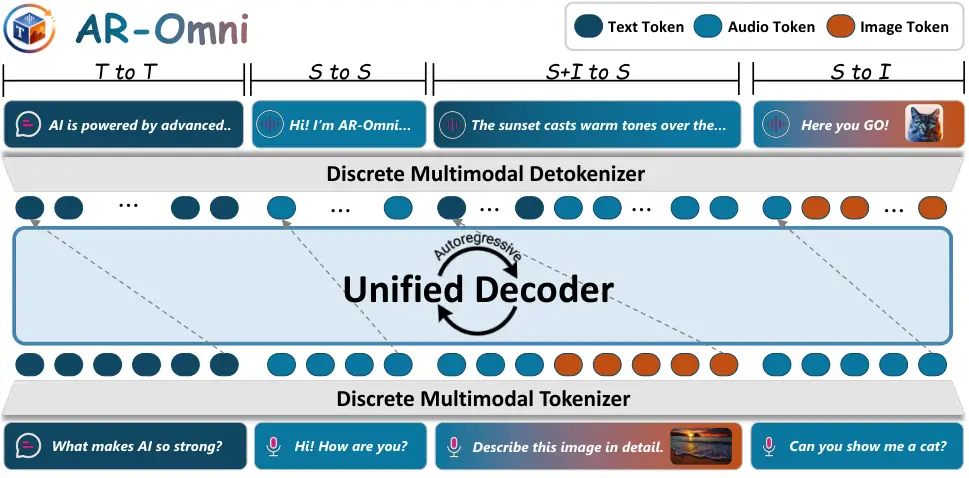
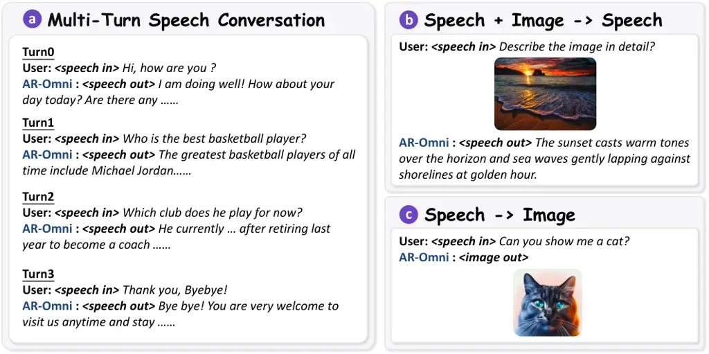
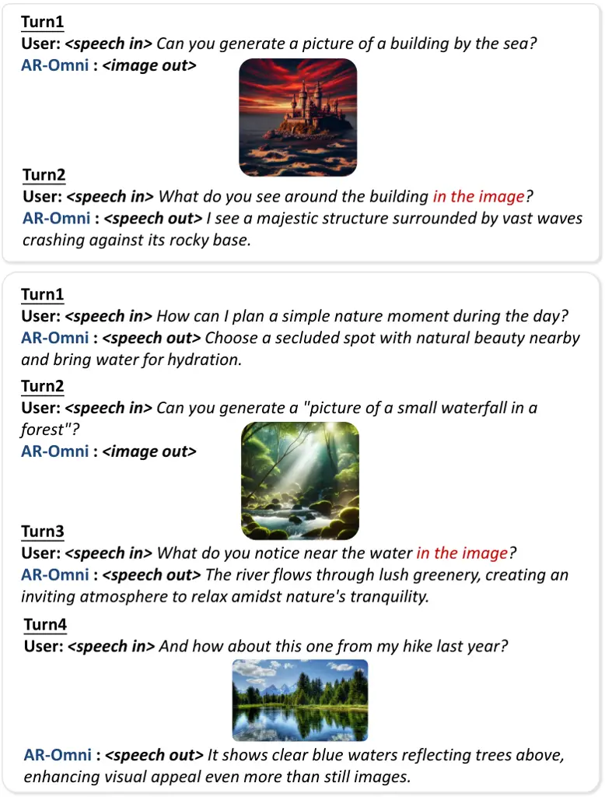
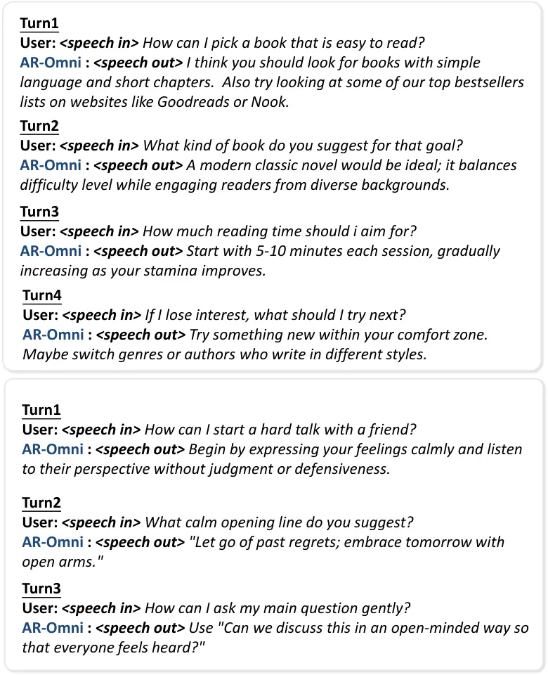
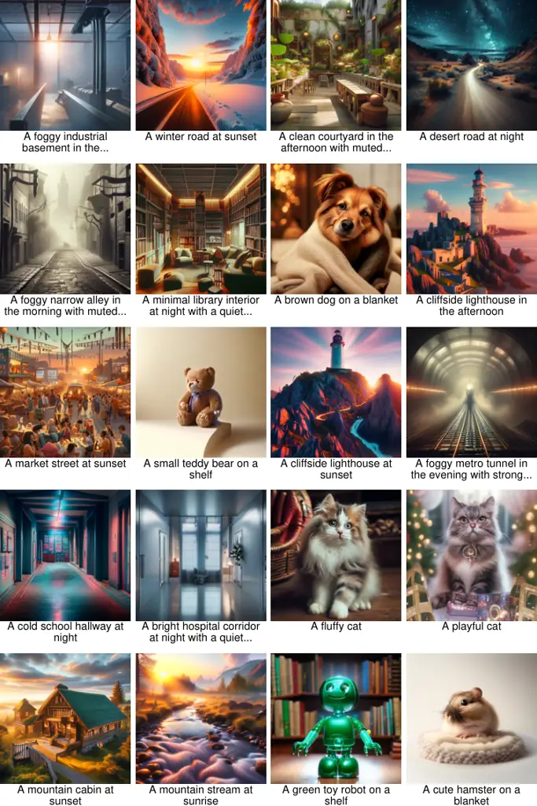
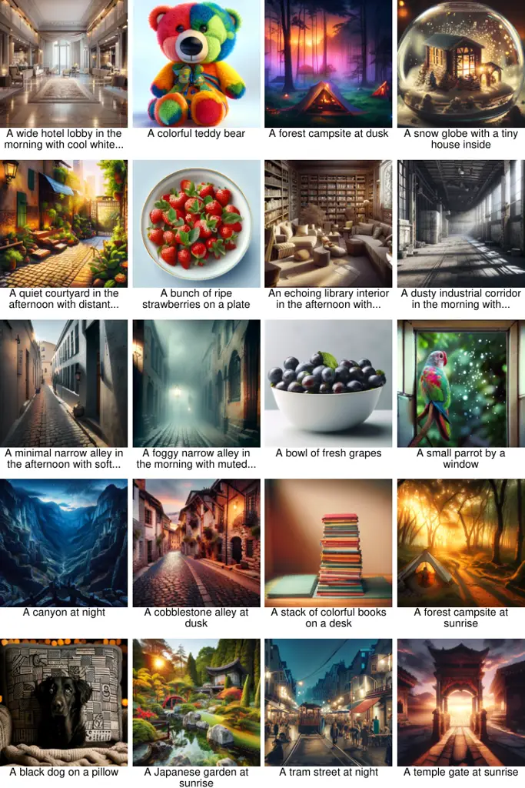
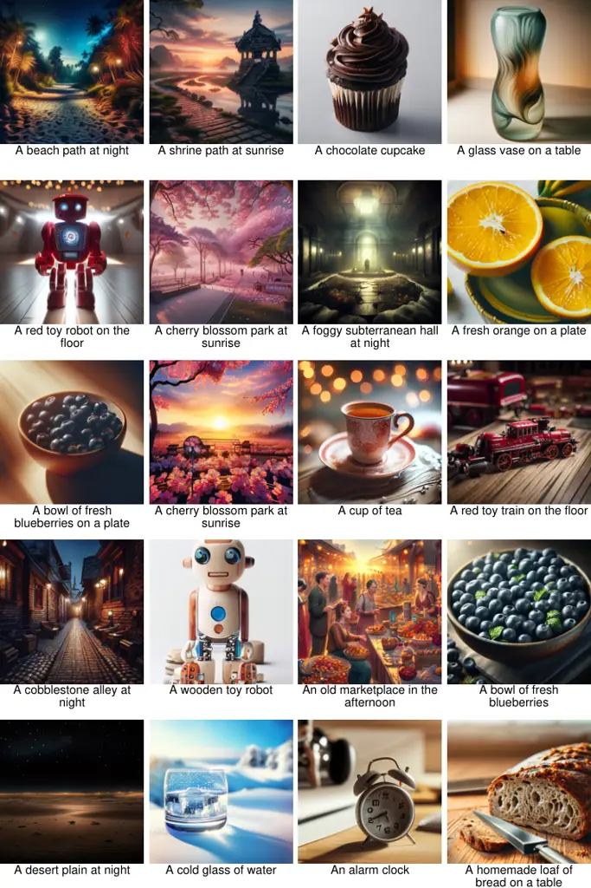
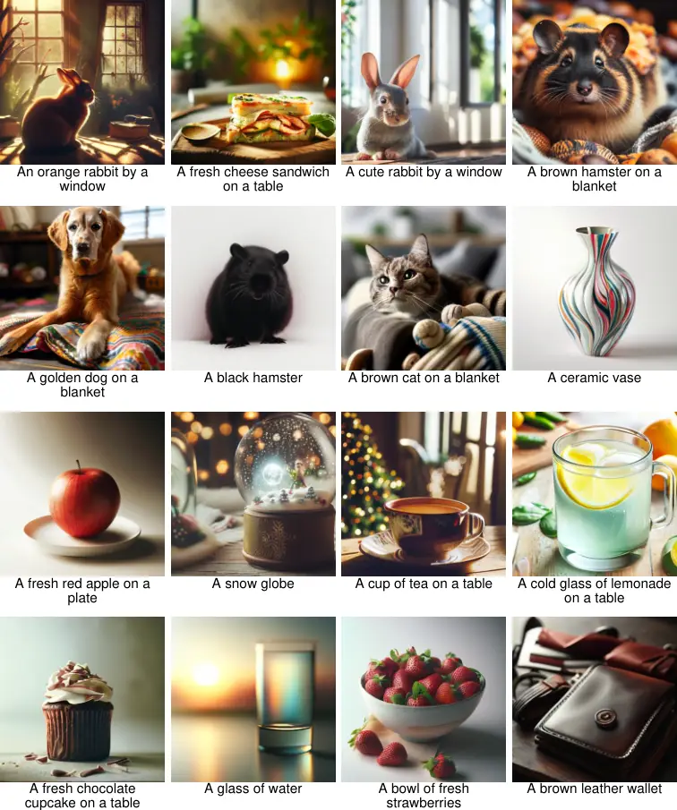

\PublicDate

2026-1-22

# AR-Omni: A Unified Autoregressive Model for Any-to-Any Generation

Dongjie Cheng\equal Ruifeng Yuan\equal Yongqi Li\advisor Runyang You  
Wenjie Wang  Liqiang Nie  Lei Zhang  Wenjie Li Affiliation: The Hong
Kong Polytechnic University Affiliation: University of Science and
Technology of China   Harbin Institute of Technology (Shenzhen)  
{dong-jie.cheng,ruifeng.yuan}@connect.polyu.hk, liyongqi0@gmail.com

###### Abstract

Real-world perception and interaction are inherently multimodal,
encompassing not only language but also vision and speech, which
motivates the development of “Omni” MLLMs that support both multimodal
inputs and multimodal outputs. While a sequence of omni MLLMs has
emerged, most existing systems still rely on additional expert
components to achieve multimodal generation, limiting the simplicity of
unified training and inference. Autoregressive (AR) modeling, with a
single token stream, a single next-token objective, and a single
decoder, is an elegant and scalable foundation in the text domain.
Motivated by this, we present AR-Omni, a unified any-to-any model in the
autoregressive paradigm without any expert decoders. AR-Omni supports
autoregressive text and image generation, as well as streaming speech
generation, all under a single Transformer decoder. We further address
three practical issues in unified AR modeling: modality imbalance via
task-aware loss reweighting, visual fidelity via a lightweight
token-level perceptual alignment loss for image tokens, and
stability–creativity trade-offs via a finite-state decoding mechanism.
Empirically, AR-Omni achieves strong quality across three modalities
while remaining real-time, achieving a 0.88 real-time factor for speech
generation.

## 1 Introduction

Large Language Models (LLMs) have achieved strong performance in
understanding and generating natural language \[1\]. However, their
interface is largely limited to text. In contrast, real-world perception
and interaction are inherently multimodal, encompassing not only
language but also vision and speech. This interaction gap has motivated
Multimodal Large Language Models (MLLMs), which extend LLMs to process
multimodal capabilities. Early MLLMs extend LLMs with strong _multimodal
perception_, enabling them to interpret multimodal inputs. A natural
next step is to further equip MLLMs with _multimodal generation_
capabilities, allowing them to respond to users in multiple modalities.
This ability that supports both multimodal inputs and multimodal outputs
is often called “Omni” \[2\].

A sequence of omni MLLMs has progressively emerged. SpeechGPT \[3\]
enables speech-text outputs by discretizing speech and training for
cross-modal conversational instruction following. Chameleon \[4\]
extends the same ambition to vision, proposing an early-fusion MLLM over
a joint discrete vocabulary that supports both image and text
generation. Building toward tri-modal any-to-any interaction, AnyGPT
\[5\] and MIO \[6\] perform autoregressive modeling paired with expert
diffusion decoders, thereby supporting flexible tri-modal understanding
and generation.

|                 |                |                |                |                |
| --------------- | -------------- | -------------- | -------------- | -------------- |
| Method          | Modality I/O   | Diffusion-free | Streaming      | Real-time      |
| Kosmos \[7\]    | T,I \| T       | –              | –              | –              |
| Flamingo \[8\]  | T,I \| T       | –              | –              | –              |
| Chameleon \[4\] | T,I \| T,I     | $`\checkmark`$ | –              | –              |
| USLM \[9\]      | T,S \| S       | –              | $`\times`$     | $`\checkmark`$ |
| AnyGPT \[5\]    | T,S,I \| T,S,I | $`\times`$     | $`\times`$     | $`\times`$     |
| MiO \[6\]       | T,S,I \| T,S,I | $`\times`$     | $`\times`$     | $`\times`$     |
| AR-Omni (7B)    | T,S,I \| T,S,I | $`\checkmark`$ | $`\checkmark`$ | $`\checkmark`$ |

Table 1: High-level comparison of multimodal coverage and real-time
streaming capability. Diffusion-free marks methods that do not rely on
an external diffusion decoder for image synthesis. Streaming indicates
early emission of playable audio chunks. Real-time indicates
faster-than-real-time synthesis (RTF$`<1`$) under our setup. “–” denotes
not applicable. AR-Omni is the only model that achieves both Unified I/O
and Real-time Streaming without external diffusion models.

Autoregressive (AR) modeling has proven to be an exceptionally elegant
and scalable foundation in the text domain: with a single token stream,
a single next-token objective, and a single decoder, it can already
support powerful text generation. This simplicity is appealing not only
conceptually but also practically, which offers the potential for
unified training and inference for omni MLLMs. As summarized in Table 1,
most existing omni MLLMs still rely on additional expert components
(e.g., diffusion-style image decoders or non-AR speech generators) to
achieve multimodal generation. Motivated by this, we aim to explore
whether an omni model can be built with the same AR purity: a single
autoregressive model that natively handles text, images, and speech.

We present AR-Omni, a unified any-to-any model in the autoregressive
paradigm without any expert decoders. AR-Omni tokenizes text, images,
and speech into discrete symbols and integrates them into a single joint
vocabulary. After training, AR-Omni supports autoregressive text and
image generation, as well as streaming speech generation, all under a
single 7B-parameter Transformer backbone.

We further address three practical issues in unified AR modeling: 1)
Modality imbalance. Unified AR training can be dominated by certain
modalities/tasks, leading to skewed learning. We mitigate this via
task-aware reweighting on response tails. 2) Visual fidelity.
Autoregressively predicting image tokens may sacrifice perceptual
quality in the reconstructed visuals. We introduce a lightweight
token-level perceptual alignment loss for image tokens. 3)
Stability-creativity trade-offs. Different tasks prefer different
decoding behaviors, yet a single decoding strategy can be suboptimal
across tasks. We employ a finite-state decoding machine that
automatically selects greedy decoding for ASR/TTS and sampling decoding
for open-ended generation.

Empirically, AR-Omni achieves strong quality across modalities while
remaining real-time: AR-Omni attains 146 ms first-token latency and 0.88
real-time factor for speech generation, together with competitive
objective accuracy (6.5 zero-shot TTS WER on VCTK and 9.4 ASR WER on
LibriSpeech test-clean). Section 5 reports detailed quantitative results
and qualitative examples demonstrating these any-to-any capabilities.

The key contributions are summarized:

- •
  We introduce AR-Omni, a unified autoregressive model that supports
  understanding and generation for text, image, and speech without any
  external task-specific decoders.
- •
  We equip AR-Omni with an efficient speech tokenizer, allowing it to
  decode audio after only a small number of speech tokens and thereby
  enabling streaming speech.
- •
  We address modality imbalance via task-aware reweighting on the
  response tail and improve visual fidelity with a token-level
  perceptual alignment loss for image tokens. We also address the
  trade-off between stability and creativity through a finite-state
  decoding machine.



Figure 1: Overview of AR-Omni. Text, speech, and image inputs are
tokenized and embedded into a shared space. A single autoregressive
decoder operates over a joint vocabulary to generate a unified token
stream. T denotes text, S denotes speech, and I denotes image.

## 2 Related Work

### 2.1 Multimodal Large Language Models

Early Multimodal Large Language Models (MLLMs) \[10, 11\] typically
attach modality adapters to Large Language Models (LLMs), enabling
multimodal perception and supporting text response. Such approaches have
witnessed impressive progress recently, as many more powerful MLLMs
\[12, 13\] have emerged. Not satisfied with text-only generation,
SpeechGPT \[3\] discretized speech and enables direct speech
understanding and generation. NExT-GPT \[14\] connected an LLM with
modality adaptors and diffusion-based decoders to support multimodal
inputs and outputs. Building toward tri-modal any-to-any interaction,
AnyGPT \[5\] unified text-speech-image understanding and generation. MIO
\[6\] scaled the formulation to video generation under the same
paradigm. However, they still rely on an external diffusion decoder for
multimodal generation, which means the multimodal modeling
responsibility is still mainly taken by external expert models.

### 2.2 Discrete Multimodal Tokenization

The foundation of autoregressive multimodal modeling is to convert
continuous modalities into discrete token sequences with
vector-quantized (VQ) \[15\] tokenizers.

#### Image tokenizers.

Representative designs include VQ-VAE-2 \[16\], VQGAN \[17\], and the
dVAE used in DALL$`\cdot`$E \[18\]. They compressed images into a 2D
grid of discrete codebook indices, which can be flattened for AR
training. In practice, the SEED tokenizer \[19, 20, 21\] produced 1D
visual codes and maps these codes to an image embedding that conditions
a diffusion UNet to generate pixels.

#### Speech tokenizers.

Neural audio codecs such as SoundStream \[22\] and EnCodec \[23\]
quantized waveforms into discrete codes that can be decoded into
high-fidelity audio. Another line \[24, 9\] factorized speech into
semantic tokens for linguistic content and acoustic tokens for timbre.
WavTokenizer \[25\] further explored single codebook tokenization for
speech to better support streaming speech generation.

## 3 AR-Omni

### 3.1 Unified Autoregressive Modeling

AR-Omni performs any-to-any generation by mapping all modalities into a
shared discrete embedding space, allowing a single transformer-based
backbone to generate multimodal data through next-token prediction. This
unification is achieved by the joint vocabulary
$`\mathcal{V}=\mathcal{V}_{text}\cup\mathcal{V}_{speech}\cup\mathcal{V}_{image}`$
that spans all modalities, where each sub-vocabulary contains the
discrete tokens for its respective modality.

#### Text.

We utilize the SentencePiece BPE tokenizer from Chameleon \[4\] to
tokenize text.

#### Speech.

Unlike prior methods that rely on dual-codebook (semantic and acoustic)
tokenizers for easier modeling, we adopt a purely acoustic-based
discrete tokenizer \[25\], eliminating the need for traditional
semantic-to-acoustic modeling, thus bypassing the traditional
"complete-then-decode" bottleneck and enabling streamed speech responses
with low latency.

#### Image.

Images are mapped into a sequence of discrete visual codes using a
scene-aware VQ tokenizer \[4\]. Capturing essential geometric and
semantic structures of the visual input in a causal 1D order, this
aligns the visual generation process with the language and speech
pathways without external diffusion decoders.

#### Interleaved modeling.

To integrate these heterogeneous tokens into a single stream, we
introduce a set of special tokens to manage modality transitions.
Specifically, all tokens are concatenated into a single interleaved
sequence $`x`$, where speech tokens are bracketed by \<boa\> and
\<eoa\>, and image tokens by \<boi\> and \<eoi\>. Additionally, we use
\<eoh\> to indicate the end of the input. For multi-turn dialogues, we
use \<eom\> to mark the end of the model’s response for the current
turn, and \<eos\> to mark the end of the entire conversation. Text acts
as the bridge that maintains semantic continuity across these markers.
Prompt templates, marker usage, and examples are elaborated in Appendix
C. This unified formatting reformulates any-to-any generation to a
causal probabilistic modeling task:

```math
p_{\theta}(\mathbf{x})=\prod_{t=1}^{T}p_{\theta}(x_{t}\mid\mathbf{x}_{<t}), \tag{1}
```

At inference time, our decoding strategy is task-aware: we use greedy
decoding for deterministic subtasks such as Automatic Speech Recognition
(ASR) and Text-to-Speech (TTS), and sampling for open-ended generation
such as Text-to-Image generation (T2I). The effectiveness is further
discussed in Section 6.2.

|                      |                |                    |                  |
| -------------------- | -------------- | ------------------ | ---------------- |
| Method               | Diffusion-free | CIDEr $`\uparrow`$ | Modality I/O     |
| Kosmos \[7\]         | N/S            | 84.7               | T,I  \|  T       |
| Flamingo (9B) \[8\]  | N/S            | 79.4               | T,I  \|  T       |
| Flamingo (80B)       | N/S            | 84.3               | T,I  \|  T       |
| AnyGPT (8B) \[5\]    | $`\times`$     | 107.5              | T,S,I  \|  T,S,I |
| MIO (7B) \[6\]       | $`\times`$     | 120.4              | T,S,I  \|  T,S,I |
| Chameleon (7B) \[4\] | $`\checkmark`$ | 13.72              | T,I  \|  T,I     |
| Anole (7B) \[26\]    | $`\checkmark`$ | 15.07              | T,I  \|  T,I     |
| AR-Omni (7B)         | $`\checkmark`$ | 56.53              | T,S,I  \|  T,S,I |

Table 2: Image captioning on the MS-COCO Karpathy test split. We report
CIDEr. “Diffusion-free” indicates whether a model relies on an external
diffusion decoder for image generation; N/S means the model does not
support image generation. Modality I/O reports supported input (left)
and output (right) modalities, separated by “\|”; {T,S,I} denote {text,
speech, image}.

### 3.2 Optimization

We employ a composite optimization strategy to address the challenges of
multimodal generation. Specifically, we combine the Weighted Next-Token
Prediction (Weighted NTP) objective to balance modality imbalance with a
Perceptual Loss (PL) that encourages geometric consistency in the latent
visual space.

#### Weighted NTP.

To mitigate modality imbalance caused by heterogeneous token budgets in
tokenized sequences (e.g., speech vs. text), we compute the loss as:

```math
\mathcal{L}_{\text{wNTP}}\;=\;-\frac{1}{T}\sum_{t=1}^{T}w_{t}\,\log p_{\theta}(x_{t}\mid x_{<t}), \tag{2}
```

where $`w_{t}`$ is a scalar weight. In practice, for X2T tasks,
including ASR and image captioning, we assign larger weights to the
response text tokens. This amplifies supervision on the specific text
outputs and reduces the tendency of modalities with longer sequences to
dominate optimization. Experimental results in Section 6.2 demonstrate
the effectiveness of the reweighting strategy.

#### Perceptual loss.

While standard cross-entropy is effective for exact token matching, it
lacks geometric awareness in the discrete latent space: it penalizes all
non-target codes equally, ignoring the semantic similarity between
visual tokens. To address this, we introduce a perceptual loss that
aligns the last-layer hidden states to a frozen, pretrained embedding
space of target codes. This guides the model to produce visually
coherent structures even when exact token matching fails.

Let $`E\in\mathbb{R}^{|V_{image}|\times d_{e}}`$ be the fixed image
embedding matrix, $`h_{t}\in\mathbb{R}^{d_{h}}`$ as the last-layer
hidden state, and $`W_{h}\in\mathbb{R}^{d_{e}\times d_{h}}`$ a trainable
projection. For timesteps $`\mathcal{T}`$ whose targets
$`y_{t}\in\mathcal{V}_{image}`$, we minimize

```math
\mathcal{L}_{\text{perc}}\;=\;\frac{1}{|\mathcal{T}|}\sum_{t\in\mathcal{T}}\big\|\,W_{h}\,h_{t}-E[y_{t}]\,\big\|_{2}^{2}, \tag{3}
```

so the hidden states are encouraged to match the target code embedding,
providing a smoother notion of similarity among visual codes than
one-hot supervision.

#### Total objective.

The total loss is defined as:

```math
\mathcal{L}\;=\;\mathcal{L}_{\text{wNTP}}\;+\;\lambda_{\text{perc}}\,\mathcal{L}_{\text{perc}}, \tag{4}
```

with a small $`\lambda_{\text{perc}}`$ to balance NTP and perceptual
gradients.

#### Training stabilization.

Long interleaved multimodal sequences can be sensitive to optimization.
We use _residual-post-norm_ (swin-norm) \[27\], which applies
normalization on the residual branch. Let $`x\in\mathbb{R}^{T\times d}`$
be the input hidden states of a Transformer block. Let $`\mathrm{Attn}`$
denote multi-head self-attention, $`\mathrm{FFN}`$ the feed-forward
network, and $`\mathrm{Norm}`$ a normalization operator. The block
updates are

```math
h\;=\;x+\mathrm{Norm}\,(\mathrm{Attn}(x)). \tag{5}
```

```math
x^{\prime}\;=\;h+\mathrm{Norm}\,(\mathrm{FFN}(h)), \tag{6}
```

where $`h`$ is the post-attention state and $`x^{\prime}`$ is the block
output.

### 3.3 Data

#### Pre-training data.

Our pre-training data source is summarized in Table 3. To maintain a
balanced mixture, we sample data with a ratio of $`0.5\!:\!1\!:\!2`$ for
text-only, text-image, and text-speech, respectively. We stop sampling
once any modality subset is exhausted, ensuring a controlled modality
composition without over-sampling scarce sources. Concretely, we use
Ultra-FineWeb \[28\] for large-scale text pretraining; LAION and its
Aesthetics subset \[29\] provide broad web-scale image–text pairs for
general cross-modal alignment, while JourneyDB \[30\] adds
higher-quality image–prompt data to improve text-to-image generation.
For speech–text supervision, we use GigaSpeech \[31\], Common Voice
\[32\], and MLS \[33\]. Detailed data description can be found in
Appendix B.

|             |                                                            |
| ----------- | ---------------------------------------------------------- |
| Modality    | Dataset                                                    |
| Text-only   | Ultra-FineWeb \[28\]                                       |
| Image–Text  | LAION-2B \[29\], LAION-Aesthetics \[29\], JourneyDB \[30\] |
| Speech–Text | GigaSpeech \[31\], Common Voice \[32\], MLS \[33\]         |

Table 3: Summary of pre-training corpora.

|                      |                |                |                            |                  |
| -------------------- | -------------- | -------------- | -------------------------- | ---------------- |
| Method               | Decoder Params | Diffusion-free | CLIP\_(score) $`\uparrow`$ | Modality I/O     |
| GILL \[34\]          | 900M           | $`\times`$     | 0.67                       | T,I  \|  T,I     |
| Emu \[35\]           | 900M           | $`\times`$     | 0.66                       | T,I  \|  T,I     |
| AnyGPT \[5\]         | 900M           | $`\times`$     | 0.65                       | T,S,I  \|  T,S,I |
| MiO \[6\]            | 900M           | $`\times`$     | 0.64                       | T,S,I  \|  T,S,I |
| Chameleon (7B) \[4\] | 41M            | $`\checkmark`$ | N/S                        | T,I  \|  T,I     |
| Anole (7B) \[26\]    | 41M            | $`\checkmark`$ | 0.27                       | T,I  \|  T,I     |
| AR-Omni (7B)         | 41M            | $`\checkmark`$ | 0.24                       | T,S,I  \|  T,S,I |

Table 4: Text-to-image generation on MS-COCO. We report CLIP\_(score)
between generated images and reference captions. Decoder Params count
only the modality-specific image generation module; diffusion-based
methods use a latent diffusion UNet ($`\sim`$900M params), while ours
uses a VQGAN detokenizer ($`\sim`$41M). “Diffusion-free” uses
$`\checkmark`$/$`\times`$ to denote without/with external diffusion, and
N/S indicates not supported. Modality I/O reports supported input (left)
and output (right) modalities, separated by “\|”; {T,S,I} denote {text,
speech, image}.

|                         |                    |                                |          |                  |
| ----------------------- | ------------------ | ------------------------------ | -------- | ---------------- |
| Method                  | WER $`\downarrow`$ | Speech-in tok/s $`\downarrow`$ | Codebook | Modality I/O     |
| Human-level \[36\]      | 5.8                | N/S                            | N/S      | S  \|  T         |
| Wav2vec 2.0 \[37\]      | 2.7                | N/S                            | N/S      | S  \|  T         |
| Whisper Large V2 \[38\] | 2.7                | N/S                            | N/S      | S  \|  T         |
| AnyGPT \[5\]            | 8.5                | 50                             | Dual     | T,S,I  \|  T,S,I |
| MiO \[6\]               | 6.3                | 200                            | Dual     | T,S,I  \|  T,S,I |
| Anole (7B) \[26\]       | N/S                | N/S                            | N/S      | T,I  \|  T,I     |
| AR-Omni (7B)            | 9.4                | 40                             | Single   | T,S,I  \|  T,S,I |

Table 5: ASR performance on LibriSpeech test-clean. We report WER.
Speech-in tok/s is the number of discrete tokens per second produced by
the speech tokenizer for the input audio; N/S indicates not supported.
Codebook uses _Dual_ for separate semantic and acoustic codebooks and
_Single_ for a unified codebook. Modality I/O reports supported input
(left) and output (right) modalities, separated by “\|”; {T,S,I} denote
{text, speech, image}.

|                   |                    |                                 |                         |                    |                              |          |                  |
| ----------------- | ------------------ | ------------------------------- | ----------------------- | ------------------ | ---------------------------- | -------- | ---------------- |
| Method            | WER $`\downarrow`$ | Speech-out tok/s $`\downarrow`$ | FTL (ms) $`\downarrow`$ | RTF $`\downarrow`$ | Real-time ($`\text{RTF}<1`$) | Codebook | Modality I/O     |
| Ground Truth      | 1.9                | N/S                             | N/S                     | N/S                | N/S                          | N/S      | T,S  \|  S       |
| VALL-E \[39\]     | 7.9                | 600                             | N/S                     | N/S                | N/S                          | Dual     | T,S  \|  S       |
| USLM \[9\]        | 6.5                | 50 (+350)                       | 11611                   | 0.89               | $`\checkmark`$               | Dual     | T,S  \|  S       |
| AnyGPT \[5\]      | 8.5                | 50 (+350)                       | 6602                    | 2.92               | $`\times`$                   | Dual     | T,S,I  \|  T,S,I |
| MiO \[6\]         | 12.0               | 200                             | 29079                   | 48.90              | $`\times`$                   | Dual     | T,S,I  \|  T,S,I |
| Anole (7B) \[26\] | N/S                | N/S                             | N/S                     | N/S                | N/S                          | N/S      | T,I  \|  T,I     |
| AR-Omni (7B)      | 6.5                | 40                              | 146                     | 0.88               | $`\checkmark`$               | Single   | T,S,I  \|  T,S,I |

Table 6: Zero-shot TTS results on VCTK. We report WER, first-token
latency (FTL), and real-time factor (RTF); N/S indicates not supported.
Speech-out tok/s measures the length of the generated speech token
stream per second; for dual-codebook methods, $`a(+b)`$ denotes semantic
tokens at $`a`$ tok/s plus acoustic tokens at $`b`$ tok/s. Codebook uses
_Dual_ for separate semantic and acoustic codebooks and _Single_ for a
unified codebook. Modality I/O reports supported input (left) and output
(right) modalities, separated by “\|”; {T,S,I} denote {text, speech,
image}.

#### Omni-interleaved instruction data.

We build our multimodal interleaved instruction data on AnyInstruct
\[5\] by reformatting it under our unified tokenization and task
definitions, preserving its interleaved text–image–speech structure. We
further apply speech augmentation by mixing in indoor environmental
noises from the DEMAND noise dataset \[40\]. We additionally incorporate
VoiceAssistant-400K \[41\] to enrich speech-centric dialogues. To match
the acoustic characteristics of pre-training, we extract the timbre from
AR-Omni-Pretrain and synthesize assistant replies using CosyVoice2
\[42\], reducing the train–test distribution gap in speech. For
text-only conversation, we include UltraChat \[43\] as a text-only
dialogue source.

Figure 2: Stage 1 pretraining losses of AR-Omni. From left to right:
weighted NTP loss, perceptual loss, and total loss. Curves are smoothed
for readability and plotted over 1k–93k training steps.

## 4 Experimental Setup

### 4.1 Training

The training process of AR-Omni consists of two stages: pre-training and
fine-tuning. We initialize from Anole \[26\], a 7B autoregressive
Transformer designed for interleaved image–text modeling. Stage 1
focuses on pre-training by optimizing the weighted NTP objective with
the perceptual loss. Stage 2 performs fine-tuning on omni-interleaved
instruction data, where the loss is applied exclusively to the response
tokens. Further technical details are provided in Appendix A.

### 4.2 Image Evaluation

#### Image understanding.

We evaluated image-to-text understanding on the MS-COCO 2014 captioning
benchmark \[44\] using the Karpathy test split, following prior work
\[45\]. We reported CIDEr in a zero-shot setting. CIDEr is computed by
measuring the cosine similarity between TF-IDF–weighted n-gram vectors
of the generated caption and the set of reference captions.

#### Image generation.

We evaluated text-to-image generation on MS-COCO by randomly sampling
30k captions from the validation set, following prior protocols \[20\].
We generated images with AR-Omni and reported CLIP*(score). CLIP*(score)
is computed as the cosine similarity between the CLIP image embedding of
a generated image and the CLIP text embedding of its caption using CLIP
ViT-L, averaged over all samples.

### 4.3 Speech Evaluation

#### ASR.

We evaluated Automatic Speech Recognition (ASR) on the LibriSpeech
test-clean split \[46\]. We reported Word Error Rate (WER). WER is
computed as (substitutions + deletions + insertions) divided by the
number of words in the reference transcript, based on Levenshtein
alignment.

#### TTS.

We evaluated zero-shot text-to-speech (TTS) on the VCTK \[47\] dataset
by conditioning AR-Omni on text prompts. For TTS, WER is computed
between the ASR transcript of the synthesized audio and the reference
text. We used Whisper-Large-V2 \[38\] as the transcriber model. First
Token Latency (FTL) is a theoretical lower bound defined as the latency
to the first generated speech token that can be immediately decoded into
audio. In the dual-codebook scheme, decoding is conditioned on aligned
token pairs, so it typically starts once the corresponding tokens from
both codebooks are available. Real Time Factor (RTF) is computed as the
total wall-clock synthesis time divided by the duration of the generated
audio.

## 5 Main Results

### 5.1 Image Results

#### Image understanding.

Table 2 presents zero-shot image captioning results. Within the
diffusion-free autoregressive setting, AR-Omni outperforms the Anole
\[26\] initialization on image-to-text generation. This suggests that
extending a diffusion-free AR backbone to an any-to-any training regime
does not compromise captioning quality, and can instead strengthen it.

#### Image generation.

Table 4 presents text-to-image generation results. Compared with the
Anole initialization, AR-Omni incurs only a slight drop on this
benchmark, suggesting that any-to-any training largely preserves the
ability to autoregressively generate image tokens. Meanwhile,
diffusion-based systems score higher, consistent with the advantage of
employing a diffusion-style image decoder for image synthesis. These
results highlight a clear trade-off: AR-Omni maintains a diffusion-free,
single-model generation pipeline, whereas diffusion decoders improve
text-to-image quality at the cost of additional expert components.

### 5.2 Speech Results

#### ASR.

Table 5 presents the ASR results along with the speech tokenization rate
for the input audio. Compared to any-to-any baselines, AR-Omni achieves
comparable recognition accuracy while using significantly fewer speech
tokens. This demonstrates that a single-codebook, low-rate speech
tokenization can serve as an effective interface for integrating speech
into a unified AR model, without requiring separate modality-specific
generators.

#### TTS.

Table 6 reports zero-shot TTS results, including streaming-related
metrics. Under the same evaluation setup, AR-Omni matches the
best-performing token-based baseline in intelligibility, while
exhibiting more favorable streaming characteristics in latency and
throughput. In contrast, prior any-to-any systems often incur higher
latency and slower generation, reflecting the overhead of heavier or
more complex generation pipelines.

|               |                  |                  |                    |                    |
| ------------- | ---------------- | ---------------- | ------------------ | ------------------ |
| Method        | I2T $`\uparrow`$ | T2I $`\uparrow`$ | ASR $`\downarrow`$ | TTS $`\downarrow`$ |
| AR-Omni       | 0.5022           | 0.2406           | 0.1535             | 0.1105             |
| w/o PL        | 0.4874           | 0.2356           | 0.1395             | 0.1175             |
| w/o swin-norm | 0.5488           | 0.2392           | 0.1329             | 0.1633             |
| Simple NTP    | 0.5074           | 0.2248           | 0.2270             | 0.1589             |

Table 7: Ablation results on four omni-pretraining tasks at 40k steps. T
denotes text, S denotes speech, and I denotes image. I2T reports CIDEr
on image captioning. T2I reports CLIP\_(score) on text-to-image
generation. ASR and TTS report WER. $`\uparrow`$ indicates higher is
better and $`\downarrow`$ indicates lower is better.

Figure 3: Loss curves of AR-Omni (Ours) and the simple NTP training
objective. The naive objective exhibits a sharp loss jump, whereas
AR-Omni maintains a smooth and stable loss throughout training.



Figure 4: Case studies of AR-Omni: (a) multi-turn speech conversation
(S$`\rightarrow`$S), (b) speech+image understanding with speech response
(S+I$`\rightarrow`$S), and (c) speech-to-image generation
(S$`\rightarrow`$I).

## 6 Further Analysis

### 6.1 Analysis on Training Objectives

We analyze the stage-1 loss decomposition to understand how the
composite pretraining objective is optimized. The results are shown in
Figure 2. The weighted NTP term decreases smoothly throughout training,
indicating a stable token-level learning signal under the unified setup.
In contrast, the perceptual term converges quickly and saturates at a
much smaller magnitude, so the total loss is largely governed by the
weighted NTP trajectory; the residual fluctuations are therefore more
consistent with mini-batch variance than optimization instability.

### 6.2 Ablation Study

To validate the training design of AR-Omni  we conduct ablation analysis
focusing on 1) the contribution of individual components to performance,
and 2) their impact on long-term training stability.

#### Component effectiveness.

We first assess the impact of key components by ablating them at 40k
steps, with results summarized in Table 7. Removing the perceptual loss
slightly reduces I2T and T2I, degrades TTS, and improves ASR. This
indicates that PL mainly benefits vision generation and speech synthesis
in our unified training framework. Dropping swin-norm improves I2T and
ASR but substantially worsens TTS and slightly reduces T2I, suggesting
swin-norm is crucial for maintaining speech quality. When removing
Weighted NTP, PL, and swin-norm (hereby referred to as simple NTP), ASR
and TTS errors increase sharply and T2I performance also drops, further
demonstrating the effectiveness of the weighted NTP objective for
mitigating modality imbalance.

#### Training stability.

We further investigate the training dynamics of the Simple NTP variant
over a longer horizon to assess stability. As illustrated in Figure 3,
Simple NTP exhibits training instability, characterized by a loss
rebound and abrupt spikes in the late stages, indicating a tendency
toward model collapse. In contrast, our AR-Omni maintains a smooth and
convergent loss trajectory throughout training. These results confirm
that our proposed strategies not only enhance multimodal capabilities
but also effectively prevent late-stage collapse, ensuring robust
training stability.

### 6.3 Case Study

After omni supervised instruction tuning, AR-Omni exhibits omni
multimodal capabilities across text, images, and speech, including
understanding and generation. Figure 4 presents representative case
studies. In (a), AR-Omni maintains a multi-turn speech context and
answers follow-up questions speech coherently. In (b), given a spoken
instruction and an image as context, AR-Omni produces a grounded image
description in speech; in (c), AR-Omni generates an image from a spoken
prompt. Together, these cases illustrate unified perception,
understanding, and generation across heterogeneous modality contexts.
Longer-horizon and more fully interleaved demonstrations are provided in
Appendix D.

## 7 Conclusion and Future Work

We presented AR-Omni, a unified any-to-any model in the autoregressive
paradigm without any expert decoders, which tokenizes text, images, and
speech into a discrete token stream. With one Transformer backbone,
AR-Omni supports autoregressive text and image generation as well as
streaming speech generation. To make unified AR modeling practical, we
mitigate modality imbalance with task-aware loss reweighting, improve
visual fidelity with perceptual loss, and adapt decoding behavior via a
finite-state decoding machine. Experiments show competitive tri-modal
capabilities while remaining real-time for streaming speech. A key
limitation is that diffusion-free autoregressive image generation still
lags behind diffusion-based systems in terms of image generation. Future
work will focus on enhancing the quality of diffusion-free image
generation while respecting the purity of the unified AR.

## References

- \[1\] J. Achiam, S. Adler, S. Agarwal, L. Ahmad, I. Akkaya, F. L.
  Aleman, D. Almeida, J. Altenschmidt, S. Altman, S. Anadkat, et
  al. (2023) Gpt-4 technical report. arXiv preprint arXiv:2303.08774.
  Cited by: §1.
- \[2\] A. Hurst, A. Lerer, A. P. Goucher, A. Perelman, A. Ramesh, A.
  Clark, A. Ostrow, A. Welihinda, A. Hayes, A. Radford, et al. (2024)
  Gpt-4o system card. arXiv preprint arXiv:2410.21276. Cited by: §1.
- \[3\] D. Zhang, S. Li, X. Zhang, J. Zhan, P. Wang, Y. Zhou, and X.
  Qiu (2023) SpeechGPT: empowering large language models with intrinsic
  cross-modal conversational abilities. In Findings of EMNLP, External
  Links: [Link](https://aclanthology.org/2023.findings-emnlp.1055/)
  Cited by: §1, §2.1.
- \[4\] Chameleon Team (2024) Chameleon: mixed-modal early-fusion
  foundation models. arXiv preprint arXiv:2405.09818. Cited by: Appendix
  A, Table 1, §1, §3.1, §3.1, Table 2, Table 4.
- \[5\] J. Zhan, J. Dai, J. Ye, Y. Zhou, D. Zhang, Z. Liu, X. Zhang, R.
  Yuan, G. Zhang, L. Li, H. Yan, J. Fu, T. Gui, T. Sun, Y. Jiang, and X.
  Qiu (2024) AnyGPT: unified multimodal LLM with discrete sequence
  modeling. In Proceedings of ACL, External Links:
  [Link](https://arxiv.org/abs/2402.12226) Cited by: Table 1, §1, §2.1,
  §3.3, Table 2, Table 4, Table 5, Table 6.
- \[6\] Z. Wang, K. Zhu, C. Xu, W. Zhou, J. Liu, Y. Zhang, J. Wang, N.
  Shi, S. Li, Y. Li, H. Que, Z. Zhang, Y. Zhang, G. Zhang, K. Xu, J. Fu,
  and W. Huang (2024) MIO: a foundation model on multimodal tokens.
  arXiv preprint arXiv:2409.17692. Cited by: Table 1, §1, §2.1, Table 2,
  Table 4, Table 5, Table 6.
- \[7\] S. Huang, L. Dong, W. Wang, Y. Hao, S. Singhal, S. Ma, T. Lv, L.
  Cui, O. K. Mohammed, B. Patra, et al. (2023) Language is not all you
  need: aligning perception with language models. Advances in Neural
  Information Processing Systems 36, pp. 72096–72109. Cited by: Table 1,
  Table 2.
- \[8\] J. Alayrac, J. Donahue, P. Luc, A. Miech, I. Barr, Y. Hasson, K.
  Lenc, A. Mensch, K. Millican, M. Reynolds, R. Ring, E. Rutherford, S.
  Cabi, T. Han, Z. Gong, S. Samangooei, M. Monteiro, J. Menick, S.
  Borgeaud, A. Brock, A. Nematzadeh, S. Sharifzadeh, M. Binkowski, R.
  Barreira, O. Vinyals, A. Zisserman, and K. Simonyan (2022) Flamingo: a
  visual language model for few-shot learning. ArXiv preprint
  abs/2204.14198. External Links:
  [Link](https://arxiv.org/abs/2204.14198) Cited by: Table 1, Table 2.
- \[9\] X. Zhang, D. Zhang, S. Li, Y. Zhou, and X. Qiu (2023)
  SpeechTokenizer: unified speech tokenizer for speech large language
  models. arXiv preprint arXiv:2308.16692. Cited by: Table 1, §2.2,
  Table 6.
- \[10\] J. Li, D. Li, S. Savarese, and S. Hoi (2023) BLIP-2:
  bootstrapping language-image pre-training with frozen image encoders
  and large language models. arXiv preprint arXiv:2301.12597. Cited by:
  §2.1.
- \[11\] H. Liu, C. Li, Q. Wu, and Y. J. Lee (2023) Visual instruction
  tuning. arXiv preprint arXiv:2304.08485. Cited by: §2.1.
- \[12\] S. Bai, K. Chen, X. Liu, J. Wang, W. Ge, S. Song, K. Dang, P.
  Wang, S. Wang, J. Tang, et al. (2025) Qwen2. 5-vl technical report.
  arXiv preprint arXiv:2502.13923. Cited by: §2.1.
- \[13\] J. Zhu, W. Wang, Z. Chen, Z. Liu, S. Ye, L. Gu, H. Tian, Y.
  Duan, W. Su, J. Shao, et al. (2025) Internvl3: exploring advanced
  training and test-time recipes for open-source multimodal models.
  arXiv preprint arXiv:2504.10479. Cited by: §2.1.
- \[14\] S. Wu, H. Fei, L. Qu, W. Ji, and T. Chua (2023) NExT-gpt:
  any-to-any multimodal llm. arXiv preprint arXiv:2309.05519. Cited by:
  §2.1.
- \[15\] A. van den Oord, O. Vinyals, and K. Kavukcuoglu (2017) Neural
  discrete representation learning. In NeurIPS, Cited by: §2.2.
- \[16\] A. Razavi, A. van den Oord, and O. Vinyals (2019) Generating
  diverse high-fidelity images with vq-vae-2. In Advances in Neural
  Information Processing Systems (NeurIPS), Cited by: §2.2.
- \[17\] P. Esser, R. Rombach, and B. Ommer (2021) Taming transformers
  for high-resolution image synthesis. In Proceedings of the IEEE/CVF
  Conference on Computer Vision and Pattern Recognition (CVPR), Cited
  by: §2.2.
- \[18\] A. Ramesh, M. Pavlov, G. Goh, S. Gray, C. Voss, A. Radford, M.
  Chen, and I. Sutskever (2021) Zero-shot text-to-image generation.
  arXiv preprint arXiv:2102.12092. Cited by: §2.2.
- \[19\] Y. Ge, Y. Ge, Z. Zeng, X. Wang, and Y. Shan (2023) Planting a
  seed of vision in large language model. arXiv preprint
  arXiv:2307.08041. Cited by: §2.2.
- \[20\] Y. Ge, S. Zhao, Z. Zeng, Y. Ge, C. Li, X. Wang, and Y.
  Shan (2023) Making llama see and draw with seed tokenizer. arXiv
  preprint arXiv:2310.01218. Cited by: §2.2, §4.2.
- \[21\] R. Rombach, A. Blattmann, D. Lorenz, P. Esser, and B.
  Ommer (2022) High-resolution image synthesis with latent diffusion
  models. In CVPR, Cited by: §2.2.
- \[22\] N. Zeghidour, A. Luebs, A. Omran, et al. (2021) SoundStream: an
  end-to-end neural audio codec. arXiv preprint arXiv:2107.03312. Cited
  by: §2.2.
- \[23\] A. Défossez, J. Copet, G. Synnaeve, and Y. Adi (2022) High
  fidelity neural audio compression. arXiv preprint arXiv:2210.13438.
  Cited by: §2.2.
- \[24\] Z. Borsos et al. (2022) AudioLM: a language modeling approach
  to audio generation. arXiv preprint arXiv:2209.03143. Cited by: §2.2.
- \[25\] S. Ji, Z. Jiang, W. Wang, Y. Chen, M. Fang, J. Zuo, Q. Yang, X.
  Cheng, Z. Wang, R. Li, Z. Zhang, X. Yang, R. Huang, Y. Jiang, Q.
  Chen, S. Zheng, W. Wang, and Z. Zhao (2024) WavTokenizer: an efficient
  acoustic discrete codec tokenizer for audio language modeling. arXiv
  preprint arXiv:2408.16532. Cited by: §2.2, §3.1.
- \[26\] E. Chern, J. Su, Y. Ma, and P. Liu (2024) Anole: an open,
  autoregressive, native large multimodal models for interleaved
  image-text generation. arXiv preprint arXiv:2407.06135. Cited by:
  Table 2, Table 4, Table 5, Table 6, §4.1, §5.1.
- \[27\] Z. Liu, H. Hu, Y. Lin, Z. Yao, Z. Xie, Y. Wei, J. Ning, Y.
  Cao, Z. Zhang, L. Dong, et al. (2022) Swin transformer v2: scaling up
  capacity and resolution. In Proceedings of the IEEE/CVF conference on
  computer vision and pattern recognition, pp. 12009–12019. Cited by:
  §3.2.
- \[28\] Y. Wang, Z. Fu, J. Cai, P. Tang, H. Lyu, Y. Fang, Z. Zheng, J.
  Zhou, G. Zeng, C. Xiao, et al. (2025) Ultra-fineweb: efficient data
  filtering and verification for high-quality llm training data. arXiv
  preprint arXiv:2505.05427. Cited by: §3.3, Table 3.
- \[29\] C. Schuhmann, R. Beaumont, R. Vencu, C. Gordon, R. Wightman, M.
  Cherti, T. Coombes, A. Katta, C. Mullis, M. Wortsman, et al. (2022)
  Laion-5b: an open large-scale dataset for training next generation
  image-text models. Advances in neural information processing systems
  35, pp. 25278–25294. Cited by: §3.3, Table 3.
- \[30\] K. Sun, J. Pan, Y. Ge, H. Li, H. Duan, X. Wu, R. Zhang, A.
  Zhou, Z. Qin, Y. Wang, et al. (2023) Journeydb: a benchmark for
  generative image understanding. Advances in neural information
  processing systems 36, pp. 49659–49678. Cited by: §3.3, Table 3.
- \[31\] G. Chen, S. Chai, G. Wang, J. Du, W. Zhang, C. Weng, D. Su, D.
  Povey, J. Trmal, J. Zhang, et al. (2021) Gigaspeech: an evolving,
  multi-domain asr corpus with 10,000 hours of transcribed audio. arXiv
  preprint arXiv:2106.06909. Cited by: §3.3, Table 3.
- \[32\] R. Ardila, M. Branson, K. Davis, M. Kohler, J. Meyer, M.
  Henretty, R. Morais, L. Saunders, F. Tyers, and G. Weber (2020) Common
  voice: a massively-multilingual speech corpus. In Proceedings of the
  twelfth language resources and evaluation conference, pp. 4218–4222.
  Cited by: §3.3, Table 3.
- \[33\] V. Pratap, Q. Xu, A. Sriram, G. Synnaeve, and R.
  Collobert (2020) Mls: a large-scale multilingual dataset for speech
  research. arXiv preprint arXiv:2012.03411. Cited by: §3.3, Table 3.
- \[34\] J. Y. Koh, D. Fried, and R. Salakhutdinov (2023) Generating
  images with multimodal language models. ArXiv preprint abs/2305.17216.
  External Links: [Link](https://arxiv.org/abs/2305.17216) Cited by:
  Table 4.
- \[35\] Q. Sun, Q. Yu, Y. Cui, F. Zhang, X. Zhang, Y. Wang, H. Gao, J.
  Liu, T. Huang, and X. Wang (2023) Emu: generative pretraining in
  multimodality. arXiv preprint arXiv:2307.05222. Cited by: Table 4.
- \[36\] D. Amodei, S. Ananthanarayanan, R. Anubhai, J. Bai, E.
  Battenberg, C. Case, J. Casper, B. Catanzaro, Q. Cheng, G. Chen, et
  al. (2016) Deep speech 2: end-to-end speech recognition in english and
  mandarin. In International conference on machine learning,
  pp. 173–182. External Links: [Link](https://arxiv.org/abs/1512.02595)
  Cited by: Table 5.
- \[37\] A. Baevski, Y. Zhou, A. Mohamed, and M. Auli (2020) Wav2vec
  2.0: A framework for self-supervised learning of speech
  representations. In Advances in Neural Information Processing Systems
  33: Annual Conference on Neural Information Processing Systems 2020,
  NeurIPS 2020, December 6-12, 2020, virtual, H. Larochelle, M.
  Ranzato, R. Hadsell, M. Balcan, and H. Lin (Eds.), External Links:
  [Link](https://proceedings.neurips.cc/paper/2020/hash/92d1e1eb1cd6f9fba3227870bb6d7f07-Abstract.html)
  Cited by: Table 5.
- \[38\] A. Radford, J. W. Kim, T. Xu, G. Brockman, C. McLeavey, and I.
  Sutskever (2022) Robust speech recognition via large-scale weak
  supervision. ArXiv preprint abs/2212.04356. External Links:
  [Link](https://arxiv.org/abs/2212.04356) Cited by: Table 5, §4.3.
- \[39\] C. Wang, S. Chen, Y. Wu, Z. Zhang, L. Zhou, S. Liu, Z. Chen, Y.
  Liu, H. Wang, J. Li, L. He, S. Zhao, and F. Wei (2023) Neural codec
  language models are zero-shot text to speech synthesizers. ArXiv
  preprint abs/2301.02111. External Links:
  [Link](https://arxiv.org/abs/2301.02111) Cited by: Table 6.
- \[40\] J. Thiemann, N. Ito, and E. Vincent (2013) DEMAND: a collection
  of multi-channel recordings of acoustic noise in diverse environments.
  Zenodo. External Links:
  [Document](https://dx.doi.org/10.5281/zenodo.1227121),
  [Link](https://doi.org/10.5281/zenodo.1227121) Cited by: §3.3.
- \[41\] Z. Xie and C. Wu (2024) Mini-omni: language models can hear,
  talk while thinking in streaming. arXiv preprint arXiv:2408.16725.
  Cited by: §3.3.
- \[42\] Z. Du, Y. Wang, Q. Chen, X. Shi, X. Lv, T. Zhao, Z. Gao, Y.
  Yang, C. Gao, H. Wang, et al. (2024) Cosyvoice 2: scalable streaming
  speech synthesis with large language models. arXiv preprint
  arXiv:2412.10117. Cited by: §3.3.
- \[43\] N. Ding, Y. Chen, B. Xu, Y. Qin, Z. Zheng, S. Hu, Z. Liu, M.
  Sun, and B. Zhou (2023) Enhancing chat language models by scaling
  high-quality instructional conversations. arXiv preprint
  arXiv:2305.14233. Cited by: §3.3.
- \[44\] T. Lin, M. Maire, S. J. Belongie, J. Hays, P. Perona, D.
  Ramanan, P. Dollár, and C. L. Zitnick (2014) Microsoft coco: common
  objects in context. In European Conference on Computer Vision,
  External Links:
  [Link](https://api.semanticscholar.org/CorpusID:14113767) Cited by:
  §4.2.
- \[45\] Z. Tang, Z. Yang, C. Zhu, M. Zeng, and M. Bansal (2023)
  Any-to-any generation via composable diffusion. ArXiv preprint
  abs/2305.11846. External Links:
  [Link](https://arxiv.org/abs/2305.11846) Cited by: §4.2.
- \[46\] V. Panayotov, G. Chen, D. Povey, and S. Khudanpur (2015)
  Librispeech: an ASR corpus based on public domain audio books. In 2015
  IEEE International Conference on Acoustics, Speech and Signal
  Processing, ICASSP 2015, South Brisbane, Queensland, Australia, April
  19-24, 2015, pp. 5206–5210. External Links:
  [Document](https://dx.doi.org/10.1109/ICASSP.2015.7178964),
  [Link](https://doi.org/10.1109/ICASSP.2015.7178964) Cited by: §4.3.
- \[47\] C. Veaux, J. Yamagishi, and K. MacDonald (2017) CSTR vctk
  corpus: english multi-speaker corpus for cstr voice cloning toolkit.
  Cited by: §4.3.

## Appendix A Training Details

We train AR-Omni on 8 NVIDIA A100 GPUs. The pipeline consists of a
pre-training stage followed by fine-tuning, both optimized with Adam and
a linear learning-rate schedule with warmup. We apply global gradient
clipping to stabilize unified multimodal training. Our implementation is
developed on top of the Chameleon repository \[4\], including training
and inference code. Table 8 lists the key hyperparameters for both
stages.

|                     |                     |                     |
| ------------------- | ------------------- | ------------------- |
| Hyperparameter      | Pre-training        | Fine-tuning         |
| GPU Type            | A100                | A100                |
| Optimizer           | Adam                | Adam                |
| LR Scheduler        | Linear              | Linear              |
| Gradient Clipping   | 1.0                 | 1.0                 |
| Max Sequence Length | 1300                | 3456                |
| Warmup Ratio        | 0.05                | 0.05                |
| Batch Size          | 480                 | 64                  |
| Training Steps      | 140,000             | 18,000              |
| Peak Learning Rate  | $`6\times 10^{-5}`$ | $`2\times 10^{-5}`$ |

Table 8: Training hyperparameters for pre-training and fine-tuning.
Batch size denotes the global batch size.

## Appendix B Dataset Details

Table 9 summarizes the pre-training corpora used for AR-Omni, covering
image–text, speech–text, and text-only data. For each dataset, we report
modality pairing, scale statistics, and brief notes on source and
preprocessing to facilitate reproducibility. We use publicly available
datasets and follow standard filtering and deduplication practices to
reduce noise and unsafe content.

[TABLE]

Table 9: Detailed statistics of pre-training corpora.

## Appendix C Prompt Templates

We adopt a unified dialogue-style prompt format for any-to-any
multimodal tasks (Table 10). Each user turn begins with \<bos\> and ends
with \<eoh\>. Non-text modalities are explicitly bracketed by boundary
tokens, including \<boa\>/\<eoa\> for audio tokens and \<boi\>/\<eoi\>
for image tokens. For single-turn (non-chat) tasks, the assistant
response is terminated by \<eos\>. For multi-turn chat settings, the
assistant response is terminated by \<eom\>, and the dialogue history is
formed by concatenating previous turns in the same format.

This unified formatting casts diverse tasks into a single next-token
prediction interface while keeping modality boundaries explicit for both
inputs and outputs.

|                                                                                                              |
| ------------------------------------------------------------------------------------------------------------ |
| Prompt Templates:                                                                                            |
| Image Generation (Text $`\rightarrow`$ Image)                                                                |
| \<bos\> USER: Create an image for: {caption} \<eoh\>                                                         |
| ASSISTANT: \<boi\> {image} \<eoi\> \<eos\>                                                                   |
| ASR (Audio $`\rightarrow`$ Text)                                                                             |
| \<bos\> USER: Transcribe the audio. \<boa\> {audio} \<eoa\> \<eoh\>                                          |
| ASSISTANT: {transcript} \<eos\>                                                                              |
| TTS (Text $`\rightarrow`$ Audio)                                                                             |
| \<bos\> USER: Convert the text to speech: {text} \<eoh\>                                                     |
| ASSISTANT: \<boa\> {audio} \<eoa\> \<eos\>                                                                   |
| Image Captioning (Image $`\rightarrow`$ Text)                                                                |
| \<bos\> USER: Describe the image. \<boi\> {image} \<eoi\> \<eoh\>                                            |
| ASSISTANT: {caption} \<eos\>                                                                                 |
| Chat-Image Generation (Audio $`\rightarrow`$ Text $`\rightarrow`$ Image)                                     |
| {history}                                                                                                    |
| \<bos\> USER: \<boa\> {audio} \<eoa\> Transcribe the audio and generate an image for the transcript. \<eoh\> |
| ASSISTANT: {transcript} \<boi\> {image} \<eoi\> \<eom\>                                                      |
| Chat-Speech Conversation (Audio $`\rightarrow`$ Text)                                                        |
| {history}                                                                                                    |
| \<bos\> USER: \<boa\> {audio} \<eoa\> Reply in text. \<eoh\>                                                 |
| ASSISTANT: {response} \<eom\>                                                                                |

Table 10: Dialogue-style prompt templates with explicit modality
boundaries. Single-turn tasks terminate assistant outputs with \<eos\>,
while chat settings terminate each assistant message with \<eom\>.
{history} denotes a concatenation of previous turns in the same format.

## Appendix D Case Study

We provide additional qualitative examples illustrating AR-Omni’s
any-to-any behavior. Figures 5 and 6 show multi-turn interactions with
interleaved multimodal inputs and outputs. Figures 7–10 present
text-to-image samples generated by AR-Omni without external diffusion
decoders; images are obtained by decoding the autoregressively generated
discrete image tokens with the detokenizer.



Figure 5: Multi-turn interleaved conversation example.



Figure 6: Multi-turn speech conversation example.



Figure 7: Qualitative image generation results with AR-Omni across
diverse prompts and styles.



Figure 8: Qualitative image generation results with AR-Omni across
diverse prompts and styles.



Figure 9: Qualitative image generation results with AR-Omni across
diverse prompts and styles.



Figure 10: Qualitative image generation results with AR-Omni across
diverse prompts and styles.
