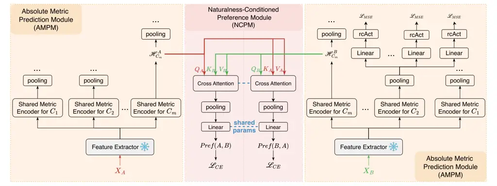
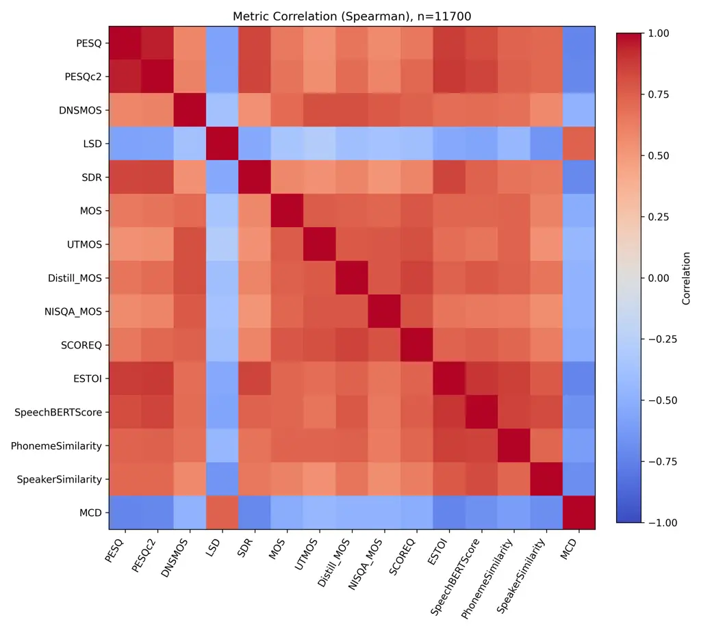
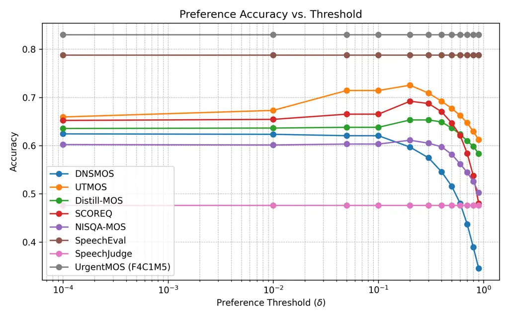
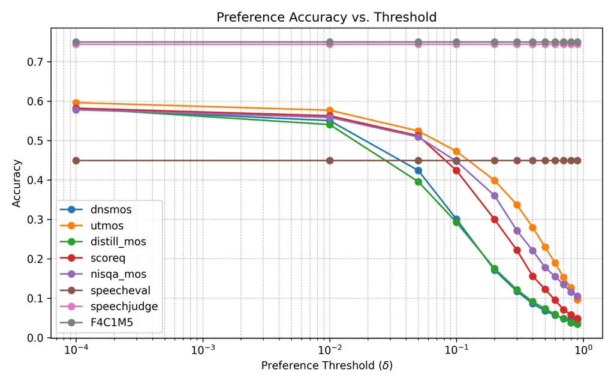

# UrgentMOS: Unified Multi-Metric and Preference Learning for Robust Speech Quality Assessment

Wei Wang Affiliation: Shanghai Jiao Tong University, China    Wangyou
Zhang Affiliation: Shanghai Jiao Tong University, China    Chenda Li
Affiliation: Shanghai Jiao Tong University, China    Jiahe Wang
Affiliation: Shanghai Jiao Tong University, China    Samuele Cornell
Affiliation: Carnegie Mellon University, USA    Marvin Sach
Affiliation: Technische Universität Braunschweig, Germany    Kohei Saijo
Affiliation: Waseda University, Japan    Yihui Fu
Affiliation: Technische Universität Braunschweig, Germany    Zhaoheng Ni
Affiliation: Meta, USA    Bing Han Affiliation: Shanghai Jiao Tong
University, China    Xun Gong Affiliation: Shanghai Jiao Tong
University, China    Mengxiao Bi Affiliation: VUI Labs, Hangzhou, China
   Tim Fingscheidt Affiliation: Technische Universität Braunschweig,
Germany    Shinji Watanabe Affiliation: Carnegie Mellon University, USA
   Yanmin Qian Affiliation: Shanghai Jiao Tong University, China

###### Abstract

Automatic speech quality assessment has become increasingly important as
modern speech generation systems continue to advance, while human
listening tests remain costly, time-consuming, and difficult to scale.
Most existing learning-based assessment models rely primarily on scarce
human-annotated mean opinion score (MOS) data, which limits robustness
and generalization, especially when training across heterogeneous
datasets. In this work, we propose UrgentMOS, a unified speech quality
assessment framework that jointly learns from diverse objective and
perceptual quality metrics, while explicitly tolerating the absence of
arbitrary subsets of metrics during training. By leveraging
complementary quality facets under heterogeneous supervision, UrgentMOS
enables effective utilization of partially annotated data and improves
robustness when trained on large-scale, multi-source datasets. Beyond
absolute score prediction, UrgentMOS explicitly models pairwise quality
preferences by directly predicting comparative MOS (CMOS), making it
well suited for preference-based evaluation scenarios commonly adopted
in system benchmarking. Extensive experiments across a wide range of
speech quality datasets, including simulated distortions, speech
enhancement, and speech synthesis, demonstrate that UrgentMOS
consistently achieves state-of-the-art performance in both absolute and
comparative evaluation settings.

## 1 Introduction

Automatic speech quality assessment has become an essential component
for evaluating generative speech AI systems such as speech synthesis,
enhancement and coding Huang et al. (2022); Yi et al. (2022a); Shi et
al. (2024). This task has received increasing attention in recent years
due to the rapid advancement of speech generation models and the growing
demand for reliable and scalable evaluation methods. However, the gold
standard for assessing speech quality remains human listening tests,
which are costly, time-consuming, and difficult to scale Anastassiou et
al. (2024); Guo et al. (2025); Jia et al. (2025); Chen et al. (2025).

Evaluating modern speech generation systems with human judgments remains
challenging beyond issues of cost and scalability. As synthesized speech
approaches natural quality, perceptual differences between systems
become increasingly subtle, making judgments more sensitive to listener
bias and preference. Even under controlled protocols, listeners may
prioritize different quality aspects—such as naturalness,
intelligibility, or residual artifacts—leading to higher annotation
noise and reduced consistency Zielinski et al. (2008); Loizou (2011);
Jiménez et al. (2021); Naderi et al. (2020); Sach et al. (2025). These
limitations are especially evident in Absolute Category Rating (ACR)
settings, where score saturation and inter-listener variability weaken
discriminative power. Consequently, there is growing interest in
comparison-based evaluation paradigms that directly assess relative
quality differences Wang et al. (2025a); Zhang et al. (2025a), which
better support system-level comparisons and provide more stable
judgments when absolute ratings become unreliable. This shift motivates
speech quality assessment models that can natively learn from
comparative supervision.

Objective speech quality assessment has been widely studied as a
scalable alternative to human listening tests Kubichek (1993); Rix et
al. (2001); Vincent et al. (2006); Taal et al. (2011). Early methods
relied on signal processing and psychoacoustic principles, often
requiring clean reference signals and capturing only limited aspects of
speech quality, which restricts their applicability in real-world
settings. More recently, neural Mean Opinion Score (MOS)
predictors Mittag et al. (2021); Reddy et al. (2022); Ragano et al.
(2024); Wang et al. (2025d); Stahl and Gamper (2025) have emerged to
estimate perceptual quality without references. However, large-scale and
consistent MOS annotations remain scarce, and MOS scores are often
poorly aligned across datasets due to differences in annotation
protocols and listener populations. As a result, models trained solely
on MOS supervision can exhibit limited robustness, especially when
learning from heterogeneous data.

Motivated by these challenges, we propose UrgentMOS, a unified speech
quality assessment framework inspired by the URGENT Challenges Zhang et
al. (2024); Saijo et al. (2025); Li et al. (2026), in which speech
enhancement systems are evaluated using a diverse set of objective and
perceptual metrics under both ACR and Comparison Category Rating (CCR)
protocols. To address the instability and limited comparability of human
MOS annotations across datasets, UrgentMOS adopts multi-metric
supervision, grounding MOS prediction in multiple complementary quality
facets. Robust generalization is achieved by training on a large and
diverse collection of datasets while allowing arbitrary subsets of
metrics to be absent, such as intrusive metrics that require reference
signals or large-scale corpora without human MOS annotations. In
addition, to meet the growing demand for comparative evaluation,
UrgentMOS directly incorporates preference prediction into the training
objective by explicitly modeling paired speech samples from
preference-annotated datasets as well as carefully constructed pairs
derived from ACR datasets, enabling unified support for both absolute
and comparative speech quality evaluation. Our contributions can be
summarized as follows:

- •
  We propose UrgentMOS, a unified speech quality assessment framework
  that jointly learns from objective and perceptual metrics, enabling
  robust training across heterogeneous datasets with incomplete
  annotations.
- •
  UrgentMOS aligns model training with practical evaluation protocols by
  directly supporting both absolute and comparative supervision.
- •
  We construct and release a preference annotated speech quality dataset
  derived from existing ACR datasets, providing a benchmark for
  comparative speech quality assessment.
- •
  Extensive experiments on diverse speech quality datasets show that
  UrgentMOS achieves state-of-the-art performance in both absolute and
  comparative evaluation settings.



Figure 1: Overview of the UrgentMOS architecture and training paradigm.
UrgentMOS consists of an Absolute Metric Prediction Module (AMPM) and a
Naturalness-Conditioned Preference Module (NCPM). Each speech sample is
processed by a shared feature extractor; the two AMPM blocks shown for
Audio A and Audio B correspond to the _same AMPM with shared
parameters_. AMPM predicts multiple objective and perceptual quality
metrics via shared metric encoders and metric-specific heads, while NCPM
operates on representations from the naturalness-related metric group to
model pairwise quality preferences using cross-attention.
$`\mathcal{L}_{CE}`$ denotes cross entropy loss. $`\mathcal{L}_{MSE}`$
is detailed in (5).

## 2 Related Works

### 2.1 Absolute Score based Speech Quality Assessment

Learning-based speech quality assessment has primarily focused on
predicting absolute Mean Opinion Scores (MOS) from speech signals.
MOSNet Lo et al. (2019) formulates MOS prediction as supervised
regression using neural networks trained on human-annotated data.
DNSMOS Reddy et al. (2022) introduces a multi-stage self-teaching
framework for non-intrusive evaluation of noise suppression systems with
strong correlation to human ratings. DNSMOS Pro Cumlin et al. (2024)
extends DNSMOS with a lightweight architecture and probabilistic MOS
prediction, enabling efficient training using only MOS labels across
datasets. NISQA-MOS Mittag et al. (2021) employs self-attention–based
temporal modeling to predict overall MOS and multiple perceptual
dimensions. UTMOS Saeki et al. (2022) and UTMOSv2 Baba et al. (2024)
improve robustness to out-of-domain conditions through ensemble learning
over self-supervised speech representations. SCOREQ Ragano et al. (2024)
addresses domain generalization by introducing a contrastive regression
objective with triplet loss for MOS prediction. Distill-MOS Stahl and
Gamper (2025) improves data efficiency and model compactness by
distilling large self-supervised MOS predictors into smaller models
using pseudo-labels on unlabeled data. However, in practical evaluation
scenarios where model improvements across iterations are often marginal,
absolute MOS prediction can be insensitive to small quality differences,
making pairwise comparison a more suitable formulation for detecting
subtle improvements by directly contrasting two speech samples.

### 2.2 Preference based Speech Quality Assessment

Preference-based speech quality assessment models relative quality
differences between speech samples. Early work reformulates MOS
prediction using pairwise comparisons, demonstrating improved ranking
performance when absolute MOS values are close Wang et al. (2023).
Subsequent studies encode preference relationships in embedding spaces
to improve robustness under domain shifts Hu et al. (2024), or propose
end-to-end frameworks that jointly model pair construction and
preference prediction for system-level ranking Hu et al. (2025). In
speech enhancement, URGENT-PK Wang et al. (2025b) employs a pairwise
model that directly compares homologous enhanced utterances. To mitigate
annotation scarcity, some approaches derive pairwise supervision from
existing MOS datasets Shi et al. (2025b). Preference-based modeling has
also been explored under weak or indirect supervision, such as
comparative assessment using non-matching reference signals Manocha et
al. (2021). In speech synthesis, pairwise preference prediction has been
studied for samples sharing the same linguistic content to enforce
consistency in relative judgments Valentini-Botinhao et al. (2022); Hu
et al. (2023).

### 2.3 Speech Quality Assessment with Natural Language Reasoning

Recent work has begun to explore natural language reasoning for speech
quality assessment, shifting from scalar score prediction toward
language-based evaluation that better reflects human perceptual
judgments. PAM prompts pretrained audio–language models with structured
textual queries to assess speech quality, demonstrating strong zero-shot
capability without task-specific training Deshmukh et al. (2024).
SpeechLLM-as-Judges further leverages large speech–language models as
general-purpose evaluators, emphasizing interpretability through natural
language explanations alongside quality judgments Zhang et al. (2025a).
SpeechJudge advances this paradigm by training dedicated judgment models
to achieve human-level performance in evaluating speech naturalness via
language-based reasoning Zhang et al. (2025b). Nevertheless, these
methods remain largely experimental, with limited cross-domain
generalization.

Complementing these model-centric approaches, QualiSpeech introduces a
large-scale dataset with natural language descriptions and reasoning
annotations, enabling systematic study of explainable speech quality
assessment Wang et al. (2025c).

## 3 Method

Figure 2: Feature extractor in UrgentMOS. Representations are temporally
aligned via interpolation before fusion.

The overall architecture and training pipeline of UrgentMOS are
illustrated in Figure 1. UrgentMOS adopts a modular design that jointly
supports absolute and comparative speech quality assessment within a
unified framework. Given a pair of speech samples $`X_{A}`$ and
$`X_{B}`$, each signal is first processed independently by a shared
feature extractor to obtain high-level acoustic representations, which
are then used by both evaluation modules.

Absolute quality assessment is performed by the Absolute Metric
Prediction Module (AMPM), which is shared across both inputs. AMPM
follows a multi-metric prediction paradigm similar to Uni-VERSA Shi et
al. (2025a), but differs in both architectural design and training
formulation. Specifically, AMPM organizes speech quality metrics into
semantically coherent groups $`C_{1},\dots,C_{m}`$ (Table 1), each
corresponding to a distinct quality aspect and containing multiple
related metrics. For each group $`C_{i}`$, a shared metric encoder
transforms the acoustic representation into a group-specific latent
representation $`\mathcal{H}^{A}_{C_{i}}`$ or
$`\mathcal{H}^{B}_{C_{i}}`$ for inputs $`X_{A}`$ and $`X_{B}`$,
respectively. Metric-specific prediction heads are applied to pooled
representations $`\mathcal{H}_{C_{i}}`$ to produce individual
predictions , which are further constrained by range-constraining
activation functions (rcAct) to ensure valid outputs while maintaining
smooth optimization.

In addition to absolute metric prediction, UrgentMOS explicitly models
relative quality judgments through a Naturalness-Conditioned Preference
Module (NCPM). NCPM operates on representations from the
naturalness-related metric group $`C_{m}`$, which includes human MOS and
learned naturalness predictors. Given the corresponding representations
$`\mathcal{H}^{A}_{C_{m}}`$ and $`\mathcal{H}^{B}_{C_{m}}`$ from two
speech samples, NCPM employs cross-attention to model interactions
between paired inputs and produces comparative quality predictions, such
as preference labels or comparative MOS (CMOS).

### 3.1 Model Components

#### 3.1.1 Feature Extractor

UrgentMOS adopts a multi-branch, architecture-agnostic feature extractor
to obtain complementary speech representations at different temporal
resolutions, as shown in Figure 2. Given an input waveform $`X`$, the
signal is processed in parallel by a set of heterogeneous feature
encoders $`\{\mathcal{F}_{i}\}_{i=1}^{n}`$. Each encoder produces a
sequence of layer-wise representations, which are optionally aggregated
by an aggregation module $`\mathcal{A}_{i}`$ using a weighted sum. The
resulting representation is denoted as
$`H_{i}\in\mathbb{R}^{d_{i}\times l_{i}}`$, where $`d_{i}`$ and
$`l_{i}`$ correspond to the encoder-specific feature dimension and
temporal length.

All representations are temporally aligned via length interpolation to a
common sequence length $`L=\max_{i}l_{i}`$, yielding aligned features
$`\hat{H}_{i}\in\mathbb{R}^{d_{i}\times L}`$. The aligned features are
then fused into a unified representation $`\hat{H}`$, which serves as
the shared input to downstream absolute metric prediction and preference
modeling modules. This design enables multi-resolution modeling and
supports seamless integration of diverse pretrained audio encoders,
including WavLM Chen et al. (2022), Kimi-Audio Ding et al. (2025),
Qwen3OmniCaptioner Xu et al. (2025), and Audio Flamingo Goel et al.
(2025).

#### 3.1.2 Range-Constraining Activations (rcAct)

To ensure that predicted metric values lie within their valid numerical
ranges, UrgentMOS applies a Range-Constraining Activation Module after
each metric-specific prediction head. Given an unconstrained scalar
prediction $`x`$, the module enforces lower and/or upper bounds
according to the target metric’s domain. When both lower and upper
bounds are finite, a scaled sigmoid function is used:

```math
y=v_{\min}+(v_{\max}-v_{\min})\cdot\sigma(x), \tag{1}
```

which smoothly maps predictions to the interval $`[v_{\min},v_{\max}]`$.
When only a lower bound is defined, the output is constrained via a
softplus-based transformation:

```math
y=v_{\min}+\mathrm{softplus}(x-v_{\min}), \tag{2}
```

ensuring $`y\geq v_{\min}`$. Conversely, when only an upper bound is
specified, the output is given by:

```math
y=v_{\max}-\mathrm{softplus}(v_{\max}-x), \tag{3}
```

which enforces $`y\leq v_{\max}`$. If the output shall be unbounded, the
identity mapping is applied. Compared to hard clipping, this formulation
preserves gradient continuity near the boundaries, avoiding optimization
instability while respecting metric-specific value constraints.

|     |                         |                                          |                           |      |
| --- | ----------------------- | ---------------------------------------- | ------------------------- | ---- |
| \#  | Category                | Metric                                   | Range                     | Ref. |
| 1   | Noise & Distortion      | PESQ ITU (2001); Rix et al. (2001)       | \[1, 4.5\]                | ✓    |
| 2   |                         | PESQc2 ITU (2001); Torcoli et al. (2025) | \[1, 4.5\]                | ✓    |
| 3   |                         | DNSMOS Reddy et al. (2022)               | \[1, 5\]                  | ✗    |
| 4   |                         | LSD Gray and Markel (1976)               | \[0, $`\infty`$)          | ✓    |
| 5   |                         | SDR Vincent et al. (2006)                | ($`-\infty`$, $`\infty`$) | ✓    |
| 6   | Naturalness             | MOS (human)                              | \[1, 5\]                  | ✗    |
| 7   |                         | UTMOS Saeki et al. (2022)                | \[1, 5\]                  | ✗    |
| 8   |                         | Distill_MOS Stahl and Gamper (2025)      | \[1, 5\]                  | ✗    |
| 9   |                         | NISQA_MOS Mittag et al. (2021)           | \[1, 5\]                  | ✗    |
| 10  |                         | SCOREQ Ragano et al. (2024)              | \[1, 5\]                  | ✗    |
| 11  | Intelligibility         | ESTOI Jensen and Taal (2016)             | \[0, 1\]                  | ✓    |
| 12  |                         | SpeechBERTScore Saeki et al. (2024)      | \[-1, 1\]                 | ✓    |
| 13  |                         | LPS Pirklbauer et al. (2023)             | ($`-\infty`$ ,1\]         | ✓    |
| 14  | Speaker Characteristics | SpeakerSimilarity                        | \[–1, 1\]                 | ✓    |
| 15  | Spectral Accuracy       | MCD Kubichek (1993)                      | \[0, $`\infty`$)          | ✓    |

Table 1: Predicted Categorized Metrics in UrgentMOS. “Ref.” indicates
whether the metric requires a reference signal for computation.

### 3.2 Training Data Construction and Supervision

#### 3.2.1 Learning with Incomplete Metric Annotations

UrgentMOS leverages multi-metric supervision to improve robustness and
generalization; however, in practice, different datasets provide
heterogeneous subsets of quality annotations. Intrusive metrics require
reference signals, while perceptual labels such as MOS are often
unavailable at scale. Discarding samples with incomplete annotations
would significantly reduce training data and domain coverage.

To address this, UrgentMOS explicitly tolerates missing metric
annotations during training. For each metric $`k`$, unavailable labels
are marked as NaN and excluded via a binary validity mask
$`m_{k}\in\{0,1\}^{B}`$, where $`B`$ is the batch size and
$`m_{k}^{(b)}=1`$ indicates that the ground-truth label $`y_{k}^{(b)}`$
is available. The metric-specific loss is computed only over valid
samples and normalized:

```math
\mathcal{L}_{MSE}^{k}=w_{k}\frac{\sum_{b=1}^{B}m_{k}^{(b)}\,\ell\!\left(\hat{y}_{k}^{(b)},y_{k}^{(b)}\right)}{\sum_{b=1}^{B}m_{k}^{(b)}}, \tag{4}
```

where $`\hat{y}_{k}^{(b)}`$ denotes the prediction,
$`\ell(\cdot,\cdot)`$ is the regression loss, and $`w_{k}`$ is a
metric-specific weight. The overall objective averages losses over
metrics with at least one valid label in the batch:

```math
\mathcal{L}_{MSE}=\frac{1}{|\mathcal{K}_{\mathrm{valid}}|}\sum_{k\in\mathcal{K}_{\mathrm{valid}}}\mathcal{L}_{MSE}^{k}, \tag{5}
```

where $`\mathcal{K}_{\mathrm{valid}}`$ denotes the set of valid metrics.

#### 3.2.2 Deriving Preference Supervision from ACR Annotations

Comparative evaluation protocols such as CCR are widely adopted in
speech quality assessment, yet publicly available CCR datasets remain
limited in scale. In contrast, ACR datasets with MOS annotations are
more abundant. UrgentMOS therefore derives preference supervision from
existing ACR data by constructing sample pairs and assigning relative
quality labels based on MOS differences.

Given two speech samples $`X_{A}`$ and $`X_{B}`$ with MOS scores
$`s_{A}`$ and $`s_{B}`$, preference pairs are generated under different
matching strategies. _Arbitrary matching_ ($`\mathcal{D}_{\text{any}}`$)
allows pairing any two samples. To mitigate biases from dataset-specific
annotation scales, _corpus-level matching_
($`\mathcal{D}_{\text{corpus}}`$) restricts pairs to samples from the
same dataset. _Reference-level matching_ ($`\mathcal{D}_{\text{ref}}`$)
further constrains pairs to samples produced by different systems but
sharing the same reference content.

To account for annotation noise and uncertainty in MOS values, a tunable
tie threshold $`\delta>0`$ is introduced. Preference labels are assigned
as

```math
y_{A,B}=\begin{cases}A\succ B,&s_{A}-s_{B}>\delta,\\
B\succ A,&s_{B}-s_{A}>\delta,\\
\text{tie},&|s_{A}-s_{B}|\leq\delta,\end{cases} \tag{6}
```

where $`y_{A,B}`$ denotes the derived preference relation.

#### 3.2.3 Symmetric Pair Construction for Preference Learning

Pairwise preference prediction should ideally be invariant to the
ordering of input samples. While this property can be enforced through
specialized network architectures, such constraints may unnecessarily
limit model capacity and flexibility. UrgentMOS instead adopts a
data-driven approach that encourages order-invariant behavior without
modifying the model architecture. Concretely, for each
preference-annotated pair $`(X_{A},X_{B})`$, we additionally construct
its symmetric counterpart $`(X_{B},X_{A})`$ with a reversed preference
label. ¹¹ 1 Potential inconsistencies from independently annotated
bidirectional preference pairs are not explicitly handled, as the
datasets used either do not contain such paired annotations or do not
provide sufficient metadata to reliably identify them.

| Dataset                               | Domain            | Samples      | Hours  | Systems |
| ------------------------------------- | ----------------- | ------------ | ------ | ------- |
| BC19 Cooper et al. (2022)             | TTS               | $`136`$      | 0.32   | 21      |
| BVCC Cooper and Yamagishi (2021)      | VC                | $`4,973`$    | 5.56   | 175     |
| NISQA Mittag et al. (2021)            | Simulated         | $`11,020`$   | 27.21  | –       |
| PSTN Mittag et al. (2020)             | Simulated         | $`58,709`$   | 163.08 | –       |
| SOMOS Maniati et al. (2022)           | TTS               | $`14,100`$   | 18.32  | 181     |
| TCD-VoIP Harte et al. (2015)          | Simulated (VoIP)  | $`384`$      | 0.87   | 24      |
| Tencent Yi et al. (2022b)             | SE Enhanced       | $`11,563`$   | 23.51  | –       |
| TMHINT-QI Chen and Tsao (2022)        | Simulated (Noise) | $`12,937`$   | 11.35  | 98      |
| TTSDS2 Minixhofer et al. (2025)       | TTS               | $`460`$      | 0.96   | 80      |
| URGENT2024-SQA Wang et al. (2025d)    | SE Enhanced       | $`238,000`$  | 429.34 | 238     |
| URGENT2025-SQA Wang et al. (2025d)    | SE Enhanced       | $`100,000`$  | 261.31 | 100     |
| SpeechEval Wang et al. (2025a)        | Mixed             | 73,123 pairs | 18.25  | 15      |
| SpeechJudge-Data Zhang et al. (2025a) | Mixed             | 41,755 pairs | 328.50 | –       |

Table 2: Training datasets used in UrgentMOS. “pairs” refers to
preference-labeled sample pairs.

## 4 Experiment Setup

### 4.1 Datasets

#### 4.1.1 Training

UrgentMOS is trained on a diverse collection of speech quality datasets
spanning text-to-speech (TTS), voice conversion (VC), speech enhancement
(SE), and simulated distortion domains, as summarized in Table 2. The
training corpus comprises both absolute-score annotated samples and
preference-labeled pairs, enabling unified learning of absolute quality
estimation and comparative assessment. Absolute-score supervision covers
synthesized speech (e.g., BC19, SOMOS, TTSDS2), voice conversion outputs
(BVCC), simulated and real-world degradations such as telephony
artifacts (PSTN, TCD-VoIP) and background noise (TMHINT-QI), as well as
enhanced speech produced by SE systems (Tencent, URGENT2024-SQA,
URGENT2025-SQA). In addition, preference-annotated datasets, including
SpeechEval and SpeechJudge-Data, are incorporated to provide explicit
comparative supervision.

#### 4.1.2 Evaluation

Evaluation is conducted using a combination of officially released test
sets and constructed preference pairs to reflect both absolute and
comparative assessment scenarios. For datasets that provide standard
evaluation splits, we directly adopt the official test sets. To further
align evaluation with practical preference-based assessment, we
additionally construct pairwise comparison data using _reference-scope
matching_, where samples generated under the same reference content are
paired to form comparative judgments. This construction is applied only
to datasets that contain sufficient system and reference information to
support such pairing, as summarized in Table 3. For large-scale
datasets, the total number of constructed preference pairs is capped at
100,000.

| Dataset            | \#Preference Pairs |
| ------------------ | ------------------ |
| NISQA P501         | $`14,160`$         |
| NISQA FOR          | $`6,496`$          |
| SOMOS              | $`7,250`$          |
| TMHINT-QI          | $`16,708`$         |
| CHiME-7-UDASE-Eval | $`2,560`$          |
| URGENT2024-SQA     | $`100,000`$        |
| URGENT2025-SQA     | $`100,000`$        |

Table 3: Constructed preference pairs using reference-scope matching for
evaluation.

### 4.2 Metrics

We evaluate UrgentMOS using preference-based and absolute-score metrics.
For pairwise evaluation, we report preference prediction accuracy over
$`\{A\succ B,B\succ A,\text{tie}\}`$. For absolute evaluation, we report
utterance-level Pearson correlation (LCC) and Spearman rank correlation
(SRCC) between predicted scores and ground-truth MOS.

### 4.3 Training Details

Each shared metric encoder in UrgentMOS is implemented as a Transformer
with 6 layers, 8 attention heads, a model dimension of 768, and a
feed-forward dimension of 2048. The weights of the multiple metrics in
the loss computation in (4) are set to be equal. The model is trained
using a constant learning rate of $`3\times 10^{-5}`$. We adopt a
dynamic batching strategy based on audio duration, with each batch
containing approximately 400 seconds of speech. Training is conducted
for 20k optimization steps on a single NVIDIA A100 GPU. Depending on the
number of feature extractors, the total training time ranges from 3 to
20 hours.

## 5 Results

UrgentMOS variants in Table 4 are denoted as F#C#M#–$`\mathcal{D}_{*}`$.
F# indicates the number of feature extractors (F1: WavLM only; F4: four
extractors described in Section 3.1.1); C# denotes the number of metric
categories (C1: all metrics treated as one group; C5: categorized as in
Table 1); M# specifies the supervision scope (M1: MOS only; M5:
naturalness-related metrics; M15: all metrics listed in Table 1).
$`\mathcal{D}_{*}`$ denotes the preference-pair construction strategy in
3.2.2. Training and inference statistics are available in Appendix  B.

|                                          |             |             |              |             |             |
| ---------------------------------------- | ----------- | ----------- | ------------ | ----------- | ----------- |
| Model                                    | SOMOS       | TMHINT-QI   | URGENT24-SQA | SpeechEval  | SpeechJudge |
| DNSMOS                                   | 0.49 / 0.51 | 0.43 / 0.62 | 0.54 / 0.63  | 0.52 / 0.73 | 0.07 / 0.58 |
| UTMOS                                    | 0.52 / 0.64 | 0.46 / 0.68 | 0.55 / 0.67  | 0.68 / 0.76 | 0.23 / 0.60 |
| SCOREQ                                   | 0.51 / 0.61 | 0.48 / 0.63 | 0.58 / 0.68  | 0.65 / 0.76 | 0.12 / 0.58 |
| Distill-MOS                              | 0.48 / 0.51 | 0.47 / 0.63 | 0.54 / 0.66  | 0.64 / 0.74 | 0.07 / 0.58 |
| NISQA-MOS                                | 0.47 / 0.51 | 0.46 / 0.60 | 0.55 / 0.67  | 0.58 / 0.71 | 0.18 / 0.58 |
| SpeechEval                               | 0.35 / 0.68 | 0.57 / 0.84 | 0.43 / 0.67  | 0.79 / 0.87 | 0.45 / 0.55 |
| SpeechJudge                              | 0.28 / 0.56 | 0.50 / 0.70 | 0.29 / 0.54  | 0.48 / 0.59 | 0.74 / 0.74 |
| Random                                   | 0.34 / 0.50 | 0.34 / 0.50 | 0.33 / 0.50  | 0.33 / 0.50 | 0.30 / 0.52 |
| UrgentMOS                                |             |             |              |             |             |
| F1C1M1-$`\mathcal{D}_{\mathrm{ref}}`$    | 0.57 / 0.71 | 0.60 / 0.77 | 0.57 / 0.67  | 0.80 / 0.87 | 0.67 / 0.67 |
| F1C1M5-$`\mathcal{D}_{\mathrm{ref}}`$    | 0.58 / 0.72 | 0.63 / 0.77 | 0.58 / 0.69  | 0.81 / 0.89 | 0.68 / 0.68 |
| F1C1M5-$`\mathcal{D}_{\mathrm{corpus}}`$ | 0.59 / 0.72 | 0.62 / 0.77 | 0.58 / 0.68  | 0.81 / 0.89 | 0.63 / 0.63 |
| F1C1M5-$`\mathcal{D}_{\mathrm{any}}`$    | 0.58 / 0.71 | 0.62 / 0.77 | 0.59 / 0.69  | 0.81 / 0.91 | 0.69 / 0.69 |
| F4C1M5-$`\mathcal{D}_{\mathrm{ref}}`$    | 0.60 / 0.73 | 0.63 / 0.78 | 0.59 / 0.69  | 0.83 / 0.91 | 0.75 / 0.75 |
| F1C1M15-$`\mathcal{D}_{\mathrm{ref}}`$   | 0.57 / 0.69 | 0.58 / 0.75 | 0.57 / 0.68  | 0.78 / 0.90 | 0.65 / 0.65 |
| F1C5M15-$`\mathcal{D}_{\mathrm{ref}}`$   | 0.57 / 0.70 | 0.62 / 0.76 | 0.59 / 0.69  | 0.82 / 0.89 | 0.71 / 0.71 |

Table 4: Preference evaluation accuracy (acc\_(0.5) / acc₀). Best results
are shown in bold and second-best results are underlined. Additional
results are reported in Table 9 in Appendix F.

|                                          |             |             |              |             |             |
| ---------------------------------------- | ----------- | ----------- | ------------ | ----------- | ----------- |
| Model                                    | SOMOS       | TMHINT-QI   | URGENT24-SQA | BVCC        | NISQA-FOR   |
| DNSMOS                                   | 0.01 / 0.01 | 0.41 / 0.37 | 0.65 / 0.64  | 0.49 / 0.50 | 0.54 / 0.54 |
| UTMOS                                    | 0.44 / 0.42 | 0.60 / 0.48 | 0.72 / 0.74  | 0.88 / 0.88 | 0.80 / 0.77 |
| SCOREQ                                   | 0.32 / 0.31 | 0.62 / 0.47 | 0.79 / 0.79  | 0.81 / 0.82 | 0.93 / 0.93 |
| Distill-MOS                              | 0.00 / 0.01 | 0.57 / 0.46 | 0.76 / 0.75  | 0.82 / 0.81 | 0.82 / 0.83 |
| NISQA-MOS                                | 0.02 / 0.03 | 0.53 / 0.35 | 0.71 / 0.70  | 0.62 / 0.63 | 0.89 / 0.88 |
| UrgentMOS                                |             |             |              |             |             |
| F1C1M1-$`\mathcal{D}_{\mathrm{ref}}`$    | 0.64 / 0.63 | 0.79 / 0.74 | 0.75 / 0.75  | 0.83 / 0.83 | 0.91 / 0.90 |
| F1C1M5-$`\mathcal{D}_{\mathrm{ref}}`$    | 0.68 / 0.67 | 0.80 / 0.76 | 0.78 / 0.78  | 0.84 / 0.85 | 0.92 / 0.91 |
| F1C1M5-$`\mathcal{D}_{\mathrm{corpus}}`$ | 0.65 / 0.63 | 0.80 / 0.76 | 0.77 / 0.77  | 0.86 / 0.86 | 0.93 / 0.92 |
| F1C1M5-$`\mathcal{D}_{\mathrm{any}}`$    | 0.65 / 0.64 | 0.80 / 0.76 | 0.78 / 0.77  | 0.85 / 0.85 | 0.91 / 0.90 |
| F4C1M5-$`\mathcal{D}_{\mathrm{ref}}`$    | 0.68 / 0.67 | 0.82 / 0.78 | 0.80 / 0.79  | 0.86 / 0.86 | 0.93 / 0.94 |
| F1C1M15-$`\mathcal{D}_{\mathrm{ref}}`$   | 0.57 / 0.55 | 0.78 / 0.72 | 0.76 / 0.76  | 0.82 / 0.82 | 0.90 / 0.90 |
| F1C5M15-$`\mathcal{D}_{\mathrm{ref}}`$   | 0.62 / 0.61 | 0.80 / 0.75 | 0.79 / 0.78  | 0.85 / 0.85 | 0.93 / 0.92 |

Table 5: Correlation results (LCC / SRCC) on representative datasets.
Best results are shown in bold and second-best results are underlined.
Additional results are reported in Table 10 in Appendix F.

### 5.1 Preference-based Evaluation

Table 4 reports preference prediction accuracy under two settings,
acc*(0.5) and acc₀. For natively preference-based datasets (SpeechEval
and SpeechJudge), acc*(0.5) allows tie predictions, whereas acc₀
evaluates only strictly ordered pairs by removing ties. For derived
preference datasets, acc\_(0.5) uses a threshold $`\delta=0.5`$ to treat
pairs with small score differences as ties, while acc₀ sets $`\delta=0`$
and evaluates all pairs as strict preferences (see (6)).

As shown in Table 4, SpeechEval and SpeechJudge models perform well on
their own benchmarks but show noticeably weaker generalization to other
domains., indicating dataset-specific overfitting. In contrast,
UrgentMOS variants consistently achieve strong performance across TTS,
simulated noise, speech enhancement, and mixed-domain datasets,
demonstrating better robustness.

Notably, most existing MOS predictors perform worse than random under
acc\_(0.5) on the SpeechJudge test set, which consists of synthesized
speech from recent TTS systems. This behavior can be attributed to score
compression: for modern, high-quality samples, these predictors tend to
output highly similar scores, leading to a large proportion of predicted
ties when $`\delta=0.5`$ is applied. Because the SpeechJudge test set
does not include tie annotations, such ambiguous predictions are
penalized, indicating that existing MOS models have limited sensitivity
to the subtle quality differences exhibited by state-of-the-art TTS
systems.

Interestingly, the choice of preference construction strategy has
limited impact on UrgentMOS performance. Models trained using
reference-level ($`\mathcal{D}_{\mathrm{ref}}`$), corpus-level
($`\mathcal{D}_{\mathrm{corpus}}`$), or unconstrained
($`\mathcal{D}_{\mathrm{any}}`$) pairing achieve comparable accuracy
across evaluation datasets. This suggests that a threshold of
$`\sigma=0.5`$ during training is sufficient to separate perceptually
different samples, even when cross-corpus inconsistencies exist.

Moreover, models trained with naturalness-related multi-metric
supervision (C5) consistently outperform their MOS-only counterparts
(C1), indicating that incorporating complementary perceptual cues
substantially improves preference discrimination. In contrast, extending
supervision to all 15 metrics does not always yield additional gains.
Notably, F1C1M15 shows degraded performance on several datasets,
particularly when a single shared feature encoder is used across all
metrics. This degradation is likely due to weak or inconsistent
correlations among certain metrics, as evidenced by the correlation
analysis in Appendix A. Nevertheless, the broader multi-metric
prediction capability of the M15 variants remains valuable, as it
provides rich, multi-aspect quality signals that may support more
informative audio quality reasoning in LLM-based speech assessment
frameworks.

### 5.2 Correlation-based Evaluation

Table 5 presents LCC and SRCC on datasets with absolute MOS annotations;
The correlation results largely align with the preference accuracy
trends.

UrgentMOS consistently achieves strong correlations across all datasets,
demonstrating better cross-domain robustness than conventional MOS
predictors. Naturalness-focused multi-metric supervision (M5) and
multi-feature extraction (F4) provide consistent gains, while
incorporating all metrics (M15) does not always yield further
improvements, likely due to weaker inter-metric correlations.

##### Ablation Study and Analysis

Table 11 evaluates encoders adopted in
F4C1M5-$`\mathcal{D}_{\mathrm{ref}}`$. Ablation studies on symmetric
pair construction are reported in Appendix D. Analysis on the CMOS
threshold for preference prediction with post-hoc MOS scores is provided
in Appendix E. Analysis on other predicted metrics are provided in
Appendix C.

## 6 Conclusion

In this work, we presented UrgentMOS, a unified speech quality
assessment framework designed to address the limitations of existing
MOS-based evaluators in modern speech generation scenarios. UrgentMOS
learns from heterogeneous objective and perceptual metrics while
explicitly tolerating missing annotations, enabling robust training on
large-scale, multi-source datasets with inconsistent supervision. By
integrating absolute metric prediction with naturalness-conditioned
preference modeling, it supports both utterance-level quality estimation
and pairwise preference evaluation, aligning model training with
practical benchmarking protocols. Experiments across diverse domains
show that UrgentMOS consistently outperforms strong baselines.

## Limitations

Despite its strong performance, UrgentMOS does not provide explicit
natural language explanations for its quality judgments, which contrasts
with recent language-based evaluation approaches. Nevertheless, its
ability to predict multiple complementary quality metrics offers
structured cues that may support downstream reasoning or explainability
modules.

Incorporating multiple feature extractors improves robustness but
increases inference cost, potentially limiting the use of UrgentMOS in
large-scale or latency-sensitive data filtering scenarios. In addition,
while multi-metric supervision generally enhances generalization,
introducing a large number of heterogeneous metrics can degrade
performance in some settings, particularly when correlations among
metrics are weak or inconsistent. Identifying optimal metric subsets or
developing training strategies to better resolve such conflicts remains
an open direction.

## References

- Anastassiou et al. (2024) P. Anastassiou, J. Chen, J. Chen, Y.
  Chen, Z. Chen, Z. Chen, J. Cong, L. Deng, C. Ding, L. Gao, M. Gong, P.
  Huang, Q. Huang, Z. Huang, Y. Huo, D. Jia, C. Li, F. Li, H. Li, J.
  Li, X. Li, X. Li, L. Liu, S. Liu, S. Liu, X. Liu, Y. Liu, Z. Liu, L.
  Lu, J. Pan, X. Wang, Y. Wang, Y. Wang, Z. Wei, J. Wu, C. Yao, Y.
  Yang, Y. Yi, J. Zhang, Q. Zhang, S. Zhang, W. Zhang, Y. Zhang, Z.
  Zhao, D. Zhong, and X. Zhuang Seed-TTS: a family of high-quality
  versatile speech generation models. arXiv preprint arXiv:2406.02430.
  Cited by: §1.
- Baba et al. (2024) K. Baba, W. Nakata, Y. Saito, and H. Saruwatari The
  T05 system for the VoiceMOS challenge 2024: transfer learning from
  deep image classifier to naturalness MOS prediction of high-quality
  synthetic speech. In IEEE Spoken Language Technology Workshop (SLT),
  pp. 818–824. Cited by: §2.1.
- Chen et al. (2022) S. Chen, C. Wang, Z. Chen, Y. Wu, S. Liu, Z.
  Chen, J. Li, N. Kanda, T. Yoshioka, X. Xiao, J. Wu, L. Zhou, S.
  Ren, Y. Qian, Y. Qian, M. Zeng, X. Yu, and F. Wei WavLM: large-scale
  self-supervised pre-training for full stack speech processing. IEEE
  Journal of Selected Topics in Signal Processing 16 (6), pp. 1505–1518.
  Cited by: §3.1.1.
- Chen and Tsao (2022) Y. Chen and Y. Tsao InQSS: a speech
  intelligibility and quality assessment model using a multi-task
  learning network. In Proc. Interspeech, pp. 3088–3092. Cited by: Table 2.
- Chen et al. (2025) Y. Chen, Z. Niu, Z. Ma, K. Deng, C. Wang, J.
  JianZhao, K. Yu, and X. Chen F5-TTS: a fairytaler that fakes fluent
  and faithful speech with flow matching. In Annual Meeting of the
  Association for Computational Linguistics (ACL), pp. 6255–6271. Cited
  by: §1.
- Cooper et al. (2022) E. Cooper, W. Huang, T. Toda, and J. Yamagishi
  Generalization ability of mos prediction networks. In ICASSP 2022-2022
  IEEE International Conference on Acoustics, Speech and Signal
  Processing (ICASSP), pp. 8442–8446. Cited by: Table 2.
- Cooper and Yamagishi (2021) E. Cooper and J. Yamagishi How do voices
  from past speech synthesis challenges compare today?. In Proc. SSW
  2021, pp. 183–188. Cited by: Table 2.
- Cumlin et al. (2024) F. Cumlin, X. Liang, V. Ungureanu, C. K. A.
  Reddy, C. Schüldt, and S. Chatterjee DNSMOS Pro: A Reduced-Size DNN
  for Probabilistic MOS of Speech. In Interspeech 2024, pp. 4818–4822.
  External Links:
  [Document](https://dx.doi.org/10.21437/Interspeech.2024-478), ISSN
  2958-1796 Cited by: §2.1.
- Deshmukh et al. (2024) S. Deshmukh, D. Alharthi, B. Elizalde, H.
  Gamper, M. Al Ismail, R. Singh, B. Raj, and H. Wang PAM: prompting
  audio-language models for audio quality assessment. In Proc.
  Interspeech, pp. 3320–3324. Cited by: §2.3.
- Ding et al. (2025) D. Ding, Z. Ju, Y. Leng, S. Liu, T. Liu, Z.
  Shang, K. Shen, W. Song, X. Tan, H. Tang, Z. Wang, C. Wei, Y. Xin, X.
  Xu, J. Yu, Y. Zhang, X. Zhou, Y. Charles, J. Chen, Y. Chen, Y. Du, W.
  He, Z. Hu, G. Lai, Q. Li, Y. Liu, W. Sun, J. Wang, Y. Wang, Y. Wu, Y.
  Wu, D. Yang, H. Yang, Y. Yang, Z. Yang, A. Yin, R. Yuan, Y. Zhang,
  and Z. Zhou Kimi-audio technical report. arXiv preprint
  arXiv:2504.18425. Cited by: §3.1.1.
- Goel et al. (2025) A. Goel, S. Ghosh, J. Kim, S. Kumar, Z. Kong, S.
  Lee, C. H. Yang, R. Duraiswami, D. Manocha, R. Valle, and B. Catanzaro
  Audio Flamingo 3: advancing audio intelligence with fully open large
  audio language models. arXiv preprint arXiv:2507.08128. Cited by:
  §3.1.1.
- Gray and Markel (1976) A. Gray and J. Markel Distance measures for
  speech processing. IEEE Transactions on Acoustics, Speech, and Signal
  Processing 24 (5), pp. 380–391. Cited by: Table 1.
- Guo et al. (2025) Y. Guo, W. Wang, Z. Yuan, R. Cao, K. Chen, Z.
  Chen, Y. Huo, Y. Zhang, Y. Wang, S. Liu, and Y. Wang SplitMeanFlow:
  interval splitting consistency in few-step generative modeling. arXiv
  preprint arXiv:2507.16884. Cited by: §1.
- Harte et al. (2015) N. Harte, E. Gillen, and A. Hines TCD-VoIP, a
  research database of degraded speech for assessing quality in VoIP
  applications. In 2015 Seventh International Workshop on Quality of
  Multimedia Experience (QoMEX), Vol. , pp. 1–6. External Links:
  [Document](https://dx.doi.org/10.1109/QoMEX.2015.7148100) Cited by:
  Table 2.
- Hu et al. (2023) C. Hu, Y. Yasuda, and T. Toda Preference-based
  training framework for automatic speech quality assessment using deep
  neural network. arXiv preprint arXiv:2308.15203. Cited by: §2.2.
- Hu et al. (2025) C. Hu, Y. Yasuda, and T. Toda E2EPref: an end-to-end
  preference-based framework for speech quality assessment to alleviate
  bias in direct assessment scores. Computer Speech & Language 93,
  pp. 101799. Cited by: §2.2.
- Hu et al. (2024) C. Hu, Y. Yasuda, and T. Toda Embedding learning for
  preference-based speech quality assessment. In Proc. Interspeech,
  pp. 2685–2689. External Links:
  [Document](https://dx.doi.org/10.21437/Interspeech.2024-1243), ISSN
  2958-1796 Cited by: §2.2.
- Huang et al. (2022) W. C. Huang, E. Cooper, Y. Tsao, H. Wang, T. Toda,
  and J. Yamagishi The VoiceMOS Challenge 2022. In Proc. ISCA
  Interspeech, pp. 4536–4540. External Links: ISSN 2958-1796 Cited by:
  §1.
- ITU (2001) ITU Rec. P.862: Perceptual Evaluation of Speech Quality
  (PESQ). International Telecommunication Union, Telecommunication
  Standardization Sector (ITU-T). Cited by: Table 1, Table 1.
- Jensen and Taal (2016) J. Jensen and C. H. Taal An algorithm for
  predicting the intelligibility of speech masked by modulated noise
  maskers. IEEE/ACM Transactions on Audio, Speech, and Language
  Processing 24 (11), pp. 2009–2022. External Links:
  [Document](https://dx.doi.org/10.1109/TASLP.2016.2585878) Cited by:
  Table 1.
- Jia et al. (2025) D. Jia, Z. Chen, J. Chen, C. Du, J. Wu, J. Cong, X.
  Zhuang, C. Li, Z. Wei, Y. Wang, and Y. Wang DiTAR: diffusion
  transformer autoregressive modeling for speech generation. In
  International Conference on Machine Learning (ICML), Cited by: §1.
- Jiménez et al. (2021) R. Z. Jiménez, G. Mittag, and S. Möller Removing
  the bias in speech quality scores collected in noisy crowdsourcing
  environments. In Proc. IEEE QoMEX, pp. 49–54. Cited by: §1.
- Kubichek (1993) R. Kubichek Mel-cepstral distance measure for
  objective speech quality assessment. In Proc. PACRIM, pp. 125–128.
  Cited by: §1, Table 1.
- Li et al. (2026) C. Li, W. Wang, M. Sach, W. Zhang, K. Saijo, S.
  Cornell, Y. Fu, Z. Ni, T. Fingscheidt, S. Watanabe, et al. ICASSP 2026
  URGENT Speech Enhancement Challenge. arXiv preprint arXiv:2601.13531.
  Cited by: §1.
- Lo et al. (2019) C. Lo, S. Fu, W. Huang, X. Wang, J. Yamagishi, Y.
  Tsao, and H. Wang MOSNet: deep learning-based objective assessment for
  voice conversion. In Proc. Interspeech, pp. 1541–1545. Cited by: §2.1.
- Loizou (2011) P. C. Loizou Speech quality assessment. In Multimedia
  analysis, processing and communications, pp. 623–654. Cited by: §1.
- Maniati et al. (2022) G. Maniati, A. Vioni, N. Ellinas, K.
  Nikitaras, K. Klapsas, J. S. Sung, G. Jho, A. Chalamandaris, and P.
  Tsiakoulis SOMOS: the Samsung open MOS dataset for the evaluation of
  neural text-to-speech synthesis. In Proc. Interspeech, pp. 2388–2392.
  Cited by: Table 2.
- Manocha et al. (2021) P. Manocha, B. Xu, and A. Kumar NORESQA: a
  framework for speech quality assessment using non-matching references.
  In Neural Information Processing Systems (NeurIPS), Vol. 34,
  pp. 22363–22378. Cited by: §2.2.
- Minixhofer et al. (2025) C. Minixhofer, O. Klejch, and P. Bell TTSDS2:
  resources and benchmark for evaluating human-quality text to speech
  systems. arXiv preprint arXiv:2506.19441. Cited by: Table 2.
- Mittag et al. (2020) G. Mittag, R. Cutler, Y. Hosseinkashi, M.
  Revow, S. Srinivasan, N. Chande, and R. Aichner DNN no-reference PSTN
  speech quality prediction. In Proc. Interspeech, pp. 2867–2871. Cited
  by: Table 2.
- Mittag et al. (2021) G. Mittag, B. Naderi, A. Chehadi, and S. Möller
  NISQA: a deep CNN-self-attention model for multidimensional speech
  quality prediction with crowdsourced datasets. In interspeech,
  pp. 2127–2131. Cited by: §1, §2.1, Table 1, Table 2.
- Naderi et al. (2020) B. Naderi, R. Zequeira Jiménez, M. Hirth, S.
  Möller, F. Metzger, and T. Hoßfeld Towards speech quality assessment
  using a crowdsourcing approach: evaluation of standardized methods.
  Quality and User Experience 6, pp. 1–21. Cited by: §1.
- Pirklbauer et al. (2023) J. Pirklbauer, M. Sach, K. Fluyt, W.
  Tirry, W. Wardah, S. Moeller, and T. Fingscheidt Evaluation metrics
  for generative speech enhancement methods: issues and perspectives. In
  Speech Communication; 15th ITG Conference, pp. 265–269. Cited by:
  Table 1.
- Ragano et al. (2024) A. Ragano, J. Skoglund, and A. Hines SCOREQ:
  speech quality assessment with contrastive regression. In Neural
  Information Processing Systems (NeurIPS), Vol. 37, pp. 105702–105729.
  Cited by: §1, §2.1, Table 1.
- Reddy et al. (2022) C. K. Reddy, V. Gopal, and R. Cutler DNSMOS P.835:
  a non-intrusive perceptual objective speech quality metric to evaluate
  noise suppressors. In IEEE International Conference on Acoustics,
  Speech and SP (ICASSP), pp. 886–890. Cited by: §1, §2.1, Table 1.
- Rix et al. (2001) A. W. Rix, J. G. Beerends, M. P. Hollier, and A. P.
  Hekstra Perceptual evaluation of speech quality (PESQ)—a new method
  for speech quality assessment of telephone networks and codecs. In
  IEEE International Conference on Acoustics, Speech and SP (ICASSP),
  pp. 749–752. Cited by: §1, Table 1.
- Sach et al. (2025) M. Sach, Y. Fu, K. Saijo, W. Zhang, S. Cornell, R.
  Scheibler, C. Li, A. Kumar, W. Wang, Y. Qian, S. Watanabe, and T.
  Fingscheidt P. 808 multilingual speech enhancement testing: approach
  and results of URGENT 2025 Challenge. arXiv preprint arXiv:2507.11306.
  Cited by: §1.
- Saeki et al. (2024) T. Saeki, S. Maiti, S. Takamichi, S. Watanabe,
  and H. Saruwatari SpeechBERTScore: reference-aware automatic
  evaluation of speech generation leveraging NLP evaluation metrics. In
  Proc. Interspeech, pp. 4943–4947. Cited by: Table 1.
- Saeki et al. (2022) T. Saeki, D. Xin, W. Nakata, T. Koriyama, S.
  Takamichi, and H. Saruwatari UTMOS: UTokyo-SaruLab system for VoiceMOS
  Challenge 2022. In Proc. Interspeech 2022, pp. 4521–4525. Cited by:
  §2.1, Table 1.
- Saijo et al. (2025) K. Saijo, W. Zhang, S. Cornell, R. Scheibler, C.
  Li, Z. Ni, A. Kumar, M. Sach, Y. Fu, W. Wang, T. Fingscheidt, and S.
  Watanabe Interspeech 2025 URGENT Speech Enhancement Challenge. In
  Proc. Interspeech, pp. 858–862. Cited by: §1.
- Shi et al. (2025a) J. Shi, H. Shim, and S. Watanabe Uni-VERSA:
  versatile speech assessment with a unified network. In Proc.
  Interspeech, pp. 1798–1802. Cited by: §3.
- Shi et al. (2024) J. Shi, J. Tian, Y. Wu, J. Jung, J. Q. Yip, Y.
  Masuyama, W. Chen, Y. Wu, Y. Tang, M. Baali, D. Alharthi, D. Zhang, R.
  Deng, T. Srivastava, H. Wu, A. Liu, B. Raj, Q. Jin, R. Song, and S.
  Watanabe ESPnet-codec: comprehensive training and evaluation of neural
  codecs for audio, music, and speech. In 2024 IEEE Spoken Language
  Technology Workshop (SLT), Vol. , pp. 562–569. External Links:
  [Document](https://dx.doi.org/10.1109/SLT61566.2024.10832289) Cited
  by: §1.
- Shi et al. (2025b) Y. Shi, Y. Ai, and Z. Ling Universal
  preference-score-based pairwise speech quality assessment. arXiv
  preprint arXiv:2506.01455. Cited by: §2.2.
- Stahl and Gamper (2025) B. Stahl and H. Gamper Distillation and
  pruning for scalable self-supervised representation-based speech
  quality assessment. In IEEE International Conference on Acoustics,
  Speech and SP (ICASSP), Cited by: §1, §2.1, Table 1.
- Taal et al. (2011) C. H. Taal, R. C. Hendriks, R. Heusdens, and J.
  Jensen An algorithm for intelligibility prediction of time–frequency
  weighted noisy speech. IEEE Trans. ASLP. 19 (7), pp. 2125–2136. Cited
  by: §1.
- Torcoli et al. (2025) M. Torcoli, M. M. Halimeh, and E. A. Habets
  Navigating PESQ: up-to-date versions and open implementations. arXiv
  preprint arXiv:2505.19760. Cited by: Table 1.
- Valentini-Botinhao et al. (2022) C. Valentini-Botinhao, M. S.
  Ribeiro, O. Watts, K. Richmond, and G. E. Henter Predicting pairwise
  preferences between TTS audio stimuli using parallel ratings data and
  anti-symmetric twin neural networks. arXiv preprint arXiv:2209.11003.
  Cited by: §2.2.
- Vincent et al. (2006) E. Vincent, R. Gribonval, and C. Févotte
  Performance measurement in blind audio source separation. IEEE Trans.
  ASLP. 14 (4), pp. 1462–1469. Cited by: §1, Table 1.
- Wang et al. (2025a) H. Wang, J. Zhao, Y. Yang, S. Liu, J. Chen, Y.
  Zhang, S. Zhao, J. Li, J. Zhou, H. Sun, Y. Lu, and Q. Yong
  SpeechLLM-as-Judges: towards general and interpretable speech quality
  evaluation. arXiv preprint arXiv:2510.14664. Cited by: §1, Table 2.
- Wang et al. (2025b) J. Wang, C. Li, W. Wang, W. Zhang, S. Cornell, M.
  Sach, R. Scheibler, K. Saijo, Y. Fu, Z. Ni, A. Kumar, T.
  Fingscheidt, S. Watanabe, and Y. Qian URGENT-PK: Perceptually-Aligned
  Ranking Model Designed for Speech Enhancement Competition. arXiv
  preprint arXiv:2506.23874. Cited by: §2.2.
- Wang et al. (2023) K. Wang, Y. Zhao, Q. Dong, T. Ko, and M. Wang
  MOSPC: MOS prediction based on pairwise comparison. arXiv preprint
  arXiv:2306.10493. Cited by: §2.2.
- Wang et al. (2025c) S. Wang, W. Yu, X. Chen, X. Tian, J. Zhang, L.
  Lu, Y. Tsao, J. Yamagishi, Y. Wang, and C. Zhang QualiSpeech: a speech
  quality assessment dataset with natural language reasoning and
  descriptions. arXiv preprint arXiv:2503.20290. Cited by: §2.3.
- Wang et al. (2025d) W. Wang, W. Zhang, C. Li, J. Shi, S. Watanabe,
  and Y. Qian Improving speech enhancement with multi-metric supervision
  from learned quality assessment. arXiv preprint arXiv:2506.12260.
  Cited by: §1, Table 2, Table 2.
- Xu et al. (2025) J. Xu, Z. Guo, H. Hu, Y. Chu, X. Wang, J. He, Y.
  Wang, X. Shi, T. He, X. Zhu, Y. Lv, Y. Wang, D. Guo, H. Wang, L.
  Ma, P. Zhang, X. Zhang, H. Hao, Z. Guo, B. Yang, B. Zhang, Z. Ma, X.
  Wei, S. Bai, K. Chen, X. Liu, P. Wang, M. Yang, D. Liu, X. Ren, B.
  Zheng, R. Men, F. Zhou, B. Yu, J. Yang, L. Yu, J. Zhou, and J. Lin
  Qwen3-omni technical report. arXiv preprint arXiv:2503.20215. Cited
  by: §3.1.1.
- Yi et al. (2022a) G. Yi, W. Xiao, Y. Xiao, B. Naderi, S. Möller, W.
  Wardah, G. Mittag, R. Culter, Z. Zhang, D. S. Williamson, F. Chen, F.
  Yang, and S. Shang ConferencingSpeech 2022 challenge: non-intrusive
  objective speech quality assessment (NISQA) challenge for online
  conferencing applications. In Proc. ISCA Interspeech, pp. 3308–3312.
  External Links: ISSN 2958-1796 Cited by: §1.
- Yi et al. (2022b) G. Yi, W. Xiao, Y. Xiao, B. Naderi, S. Möller, W.
  Wardah, G. Mittag, R. Cutler, Z. Zhang, D. S. Williamson, F. Chen, F.
  Yang, and S. Shang ConferencingSpeech 2022 challenge: non-intrusive
  objective speech quality assessment (NISQA) challenge for online
  conferencing applications. In Proc. Interspeech, pp. 3308–3312. Cited
  by: Table 2.
- Zhang et al. (2024) W. Zhang, R. Scheibler, K. Saijo, S. Cornell, C.
  Li, Z. Ni, J. Pirklbauer, M. Sach, S. Watanabe, T. Fing-scheidt,
  and Y. Qian URGENT challenge: universality, robustness, and
  generalizability for speech enhancement. In Proc. Interspeech,
  pp. 4868–4872. Cited by: §1.
- Zhang et al. (2025a) X. Zhang, C. Wang, H. Liao, Z. Li, Y. Wang, L.
  Wang, D. Jia, Y. Chen, X. Li, Z. Chen, and Z. Wu SpeechJudge: towards
  human-level judgment for speech naturalness. arXiv preprint
  arXiv:2511.07931. Cited by: §1, §2.3, Table 2.
- Zhang et al. (2025b) X. Zhang, C. Wang, H. Liao, Z. Li, Y. Wang, L.
  Wang, D. Jia, Y. Chen, X. Li, Z. Chen, and Z. Wu SpeechJudge: towards
  human-level judgment for speech naturalness. arXiv preprint
  arXiv:2511.07931. Cited by: §2.3.
- Zielinski et al. (2008) S. Zielinski, F. Rumsey, and S. Bech On some
  biases encountered in modern audio quality listening tests-a review.
  Journal of the Audio Engineering Society 56 (6), pp. 427–451. Cited
  by: §1.

## Appendix A Correlation between Metrics

Figure 3 illustrates the correlation structure among different speech
quality metrics. Most perceptual and learning-based metrics (e.g., MOS,
UTMOS, Distill-MOS, NISQA-MOS, ESTOI, and semantic or speaker similarity
scores) form a strongly correlated cluster, suggesting that they capture
largely overlapping perceptual cues. In contrast, several signal-level
distortion metrics, notably LSD and MCD, show much weaker or even
negative correlations with MOS and related perceptual measures.

This disparity partially explains why predicting a larger set of metrics
can degrade performance. Jointly optimizing metrics that are weakly
aligned with human perception introduces conflicting supervision, which
can interfere with learning a coherent quality representation.
Consequently, simply increasing the number of predicted metrics does not
guarantee gains.



Figure 3: Spearman correlation across different speech quality metrics
on the Urgent2025-SQA dataset.

## Appendix B Computational Cost

### B.1 Training Efficiency

Table 6 reports the training efficiency of UrgentMOS measured in
iterations per second. Configurations using a single feature extractor
(F1) achieve stable training throughput, with only minor overhead
introduced by additional metric groups. Training speed decreases
noticeably when using larger or computationally heavier encoders (e.g.,
Kimi-Audio, AF-Whisper), and drops most significantly in the
multi-encoder setting (F4C1M5) due to parallel feature extraction.

| Setting              | iter / s |
| -------------------- | -------- |
| F1C1M1 (WavLM).      | 2.30     |
| F1C1M5 (WavLM).      | 2.16     |
| F1C1M5 (Kimi-Audio). | 0.74     |
| F1C1M5 (Qwen3).      | 2.02     |
| F1C1M5 (AF-Whisper). | 0.68     |
| F1C1M15 (WavLM)      | 2.12     |
| F1C5M15 (WavLM)      | 1.38     |
| F4C1M5               | 0.32     |

Table 6: Training Efficiency of UrgentMOS

### B.2 Inference Efficiency

Table 7 summarizes inference efficiency in terms of real-time factor
(RTF), defined as the ratio between processing time and audio duration,
where lower values indicate faster inference. UrgentMOS achieves very
low RTFs with a single feature extractor ($`\leq 0.003`$), while
configurations with multiple extractors incur higher computational cost,
as illustrated by the increased RTF of the F4C1M5 setting. Baseline
results are reported using their respective open-source implementations
and do not necessarily reflect intrinsic model efficiency. By contrast,
UrgentMOS adopts inference-oriented optimizations such as
padding-efficient batching, and the reported numbers reflect practical
deployment efficiency under direct, off-the-shelf usage.

|                     |                        |
| ------------------- | ---------------------- |
| Setting             | real time factor (RTF) |
| DNSMOS              | 0.011                  |
| UTMOS               | 0.006                  |
| SCOREQ              | 0.027                  |
| Distill-MOS         | 0.005                  |
| NISQA-MOS           | 0.031                  |
| SpeechEval          | 0.018                  |
| SpeechJudge         | 0.037                  |
| UrgentMOS           |                        |
| F1C1M1 (WavLM)      | 0.001                  |
| F1C1M5 (WavLM)      | 0.002                  |
| F1C1M5 (Kimi-Audio) | 0.002                  |
| F1C1M5 (Qwen3)      | 0.002                  |
| F1C1M5 (AF-Whisper) | 0.003                  |
| F1C1M15 (WavLM)     | 0.002                  |
| F1C5M15 (WavLM)     | 0.002                  |
| F4C1M5              | 0.009                  |

Table 7: Inference Efficiency of UrgentMOS

## Appendix C Additional Metric Correlation Results

Table 12 reports correlations between predicted and ground-truth quality
metrics on the URGENT-SQA test sets, excluding MOS. UrgentMOS achieves
consistently strong correlations across diverse metric families,
including distortion-related (e.g., PESQ, SDR), spectral (e.g., MCD),
intelligibility (e.g., ESTOI, SpeechBERTScore), and speaker similarity
metrics, indicating that it can reliably recover multiple complementary
aspects of speech quality within a unified framework.

Although the MOS correlation of the full multi-metric configuration
(F1C5M15-$`\mathcal{D}_{ref}`$) is not always higher than that of
F1C1M5-$`\mathcal{D}_{ref}`$, the ability to jointly predict
heterogeneous quality metrics remains valuable. These multi-aspect
predictions provide structured and interpretable cues that extend beyond
a single scalar score and can serve as informative signals for
downstream analysis and natural language-based quality reasoning, where
explicit access to different perceptual dimensions is beneficial.

## Appendix D Ablation Study on Symmetric Pair Construction

| Setting   | SpeechEval  | SpeechJudge |
| --------- | ----------- | ----------- |
| w/ symm.  | 0.81 / 0.89 | 0.68 / 0.68 |
| w/o symm. | 0.79 / 0.85 | 0.63 / 0.63 |

Table 8: Effect of symmetric pair construction of
F1C1M5-$`\mathcal{D}_{\mathrm{ref}}`$ on preference accuracy (acc\_(0.5)
/ acc₀).

## Appendix E Preference Pair Construction Threshold Analysis

Figure 4 illustrates preference accuracy as a function of the tie
threshold $`\delta`$. Models that directly predict pairwise preferences,
including UrgentMOS, SpeechEval, and SpeechJudge, exhibit constant
performance across all thresholds, as they do not rely on score
differences and are therefore insensitive to $`\delta`$.

In contrast, conventional MOS predictors are highly sensitive to the
threshold choice, with the optimal $`\delta`$ varying across models.
Even when an oracle threshold is used to maximize their performance, a
substantial gap remains compared to UrgentMOS, highlighting the benefit
of explicitly modeling preferences rather than deriving them from
absolute MOS scores.

|                                          |             |             |             |              |
| ---------------------------------------- | ----------- | ----------- | ----------- | ------------ |
| Model                                    | NISQA-P501  | NISQA-FOR   | CHiME-7.    | URGENT25-SQA |
| DNSMOS                                   | 0.46 / 0.78 | 0.47 / 0.69 | 0.37 / 0.51 | 0.52 / 0.63  |
| UTMOS                                    | 0.72 / 0.85 | 0.67 / 0.79 | 0.49 / 0.57 | 0.50 / 0.66  |
| SCOREQ                                   | 0.81 / 0.90 | 0.79 / 0.88 | 0.60 / 0.75 | 0.57 / 0.69  |
| Distill-MOS                              | 0.75 / 0.86 | 0.69 / 0.82 | 0.55 / 0.67 | 0.55 / 0.67  |
| NISQA-MOS                                | 0.74 / 0.87 | 0.74 / 0.85 | 0.51 / 0.59 | 0.52 / 0.65  |
| SpeechEval                               | 0.68 / 0.91 | 0.53 / 0.77 | 0.46 / 0.74 | 0.50 / 0.78  |
| SpeechJudge                              | 0.54 / 0.71 | 0.42 / 0.65 | 0.30 / 0.58 | 0.33 / 0.57  |
| Random                                   | 0.33 / 0.50 | 0.33 / 0.50 | 0.34 / 0.51 | 0.33 / 0.50  |
| UrgentMOS                                |             |             |             |              |
| F1C1M1-$`\mathcal{D}_{\mathrm{ref}}`$    | 0.78 / 0.90 | 0.76 / 0.86 | 0.56 / 0.69 | 0.57 / 0.69  |
| F1C1M5-$`\mathcal{D}_{\mathrm{ref}}`$    | 0.79 / 0.89 | 0.77 / 0.87 | 0.64 / 0.76 | 0.59 / 0.70  |
| F1C1M5-$`\mathcal{D}_{\mathrm{corpus}}`$ | 0.79 / 0.90 | 0.79 / 0.88 | 0.64 / 0.77 | 0.58 / 0.70  |
| F1C1M5-$`\mathcal{D}_{\mathrm{any}}`$    | 0.80 / 0.90 | 0.76 / 0.86 | 0.66 / 0.78 | 0.58 / 0.70  |
| F4C1M5-$`\mathcal{D}_{\mathrm{ref}}`$    | 0.81 / 0.91 | 0.81 / 0.89 | 0.60 / 0.80 | 0.59 / 0.74  |
| F1C1M15-$`\mathcal{D}_{\mathrm{ref}}`$   | 0.76 / 0.88 | 0.75 / 0.86 | 0.60 / 0.76 | 0.58 / 0.69  |
| F1C5M15-$`\mathcal{D}_{\mathrm{ref}}`$   | 0.80 / 0.90 | 0.79 / 0.88 | 0.62 / 0.77 | 0.59 / 0.70  |

Table 9: Preference evaluation accuracy (acc\_(0.5) / acc₀) on additional
test sets not included in the main paper. CHiME-7. refers to the
CHiME-7-UDASE-Eval set.

|                                 |             |             |             |             |              |
| ------------------------------- | ----------- | ----------- | ----------- | ----------- | ------------ |
| Model                           | BC19        | NISQA-LIVE  | NISQA-P501  | CHiME-7.    | URGENT25-SQA |
| DNSMOS                          | 0.48 / 0.47 | 0.60 / 0.59 | 0.65 / 0.70 | 0.28 / 0.28 | 0.65 / 0.65  |
| UTMOS                           | 0.61 / 0.65 | 0.77 / 0.77 | 0.85 / 0.88 | 0.26 / 0.33 | 0.65 / 0.69  |
| SCOREQ                          | 0.69 / 0.66 | 0.76 / 0.74 | 0.93 / 0.94 | 0.75 / 0.75 | 0.74 / 0.74  |
| Distill-MOS                     | 0.84 / 0.81 | 0.86 / 0.84 | 0.90 / 0.90 | 0.72 / 0.71 | 0.71 / 0.70  |
| NISQA-MOS                       | 0.43 / 0.33 | 0.78 / 0.76 | 0.90 / 0.91 | 0.48 / 0.47 | 0.68 / 0.66  |
| UrgentMOS                       |             |             |             |             |              |
| F1C1M1-$`\mathcal{D}_{ref}`$    | 0.81 / 0.77 | 0.83 / 0.81 | 0.92 / 0.93 | 0.64 / 0.63 | 0.74 / 0.74  |
| F1C1M5-$`\mathcal{D}_{ref}`$    | 0.87 / 0.84 | 0.83 / 0.82 | 0.93 / 0.93 | 0.76 / 0.75 | 0.76 / 0.76  |
| F1C1M5-$`\mathcal{D}_{corpus}`$ | 0.80 / 0.77 | 0.82 / 0.79 | 0.93 / 0.94 | 0.76 / 0.75 | 0.74 / 0.74  |
| F1C1M5-$`\mathcal{D}_{any}`$    | 0.81 / 0.76 | 0.83 / 0.80 | 0.92 / 0.94 | 0.79 / 0.78 | 0.74 / 0.73  |
| F4C1M5-$`\mathcal{D}_{ref}`$    | 0.83 / 0.77 | 0.87 / 0.87 | 0.93 / 0.94 | 0.77 / 0.76 | 0.75 / 0.74  |
| F1C1M15-$`\mathcal{D}_{ref}`$   | 0.74 / 0.69 | 0.87 / 0.85 | 0.90 / 0.92 | 0.68 / 0.67 | 0.75 / 0.74  |
| F1C5M15-$`\mathcal{D}_{ref}`$   | 0.82 / 0.78 | 0.86 / 0.84 | 0.93 / 0.94 | 0.76 / 0.75 | 0.76 / 0.75  |

Table 10: Additional correlation results (LCC / SRCC) on evaluation
datasets not shown in the main paper. Best results are in bold,
second-best are underlined. CHiME-7. refers to the CHiME-7-UDASE-Eval
set.

| Encoder     | SOMOS       | TMHINT-QI      | URGENT24-SQA | BVCC        | NISQA-FOR    |
| ----------- | ----------- | -------------- | ------------ | ----------- | ------------ |
| WavLM       | 0.64 / 0.63 | 0.80 / 0.76    | 0.78 / 0.78  | 0.84 / 0.85 | 0.92 / 0.91  |
| Kimi-Audio  | 0.68 / 0.67 | 0.81 / 0.77    | 0.77 / 0.78  | 0.85 / 0.85 | 0.93 / 0.93  |
| Qwen3Omni   | 0.60 / 0.59 | 0.78 / 0.74    | 0.78 / 0.77  | 0.82 / 0.83 | 0.90 / 0.89  |
| AF-Whisper  | 0.65 / 0.64 | 0.80 / 0.76    | 0.77 / 0.77  | 0.82 / 0.81 | 0.90 / 0.90  |
| (continued) |             |                |              |             |              |
| Encoder     | BC19        | NISQA-LIVETALK | NISQA-P501   | CHiME-7     | URGENT25-SQA |
| WavLM       | 0.81 / 0.77 | 0.83 / 0.81    | 0.93 / 0.93  | 0.76 / 0.75 | 0.74 / 0.74  |
| Kimi-Audio  | 0.86 / 0.83 | 0.88 / 0.87    | 0.92 / 0.92  | 0.77 / 0.76 | 0.73 / 0.73  |
| Qwen3Omni   | 0.62 / 0.46 | 0.85 / 0.84    | 0.92 / 0.92  | 0.78 / 0.78 | 0.77 / 0.76  |
| AF-Whisper  | 0.72 / 0.59 | 0.84 / 0.82    | 0.89 / 0.91  | 0.78 / 0.78 | 0.72 / 0.72  |

Table 11: Correlation results (LCC / SRCC) for
F1C1M5-$`\mathcal{D}_{\mathrm{ref}}`$ of UrgentMOS with different
encoders on main and additional evaluation datasets.

|                 |                |                |
| --------------- | -------------- | -------------- |
| Metric          | URGENT2024-SQA | URGENT2025-SQA |
| UTMOS           | 0.99 / 0.98    | 0.98 / 0.98    |
| Distill-MOS     | 0.93 / 0.92    | 0.93 / 0.93    |
| SCOREQ          | 0.95 / 0.96    | 0.95 / 0.95    |
| NISQA-MOS       | 0.90 / 0.90    | 0.87 / 0.86    |
| DNSMOS          | 0.91 / 0.87    | 0.89 / 0.88    |
| LSD             | 0.45 / 0.35    | 0.48 / 0.47    |
| SDR             | 0.81 / 0.88    | 0.70 / 0.77    |
| PESQ            | 0.85 / 0.86    | 0.85 / 0.84    |
| PESQc2          | 0.90 / 0.90    | 0.86 / 0.86    |
| LPS             | 0.92 / 0.91    | 0.87 / 0.89    |
| SpeechBERTScore | 0.91 / 0.92    | 0.89 / 0.89    |
| ESTOI           | 0.87 / 0.91    | 0.89 / 0.90    |
| SpeakerSim      | 0.72 / 0.73    | 0.76 / 0.76    |
| MCD             | 0.73 / 0.66    | 0.68 / 0.69    |

Table 12: Correlation (LCC / SRCC) between predicted and ground-truth
quality metrics from F1C5M15-$`\mathcal{D}_{ref}`$ on URGENT-SQA test
sets (excluding MOS).



Figure 4: Preference accuracy on the SpeechEval test set versus tie
threshold $`\delta`$. Direct preference models are threshold-invariant,
while MOS predictors are highly sensitive.



Figure 5: Preference accuracy on the SpeechJudge test set versus tie
threshold $`\delta`$.

## Appendix F Additional Evaluation Results

Additional evaluation results for preference-based, correlation-based
metrics and feature extractors are provided in Tables 9, Table 10, and
Table 11 respectively.

## Appendix G The Use of Large Language Models

We acknowledge the use of LLM for assisting with tasks such as grammar
correction, enhancing expression diversity, formatting tables, and
debugging code. However, we emphasize that all core ideas and
experiments are original contributions.
