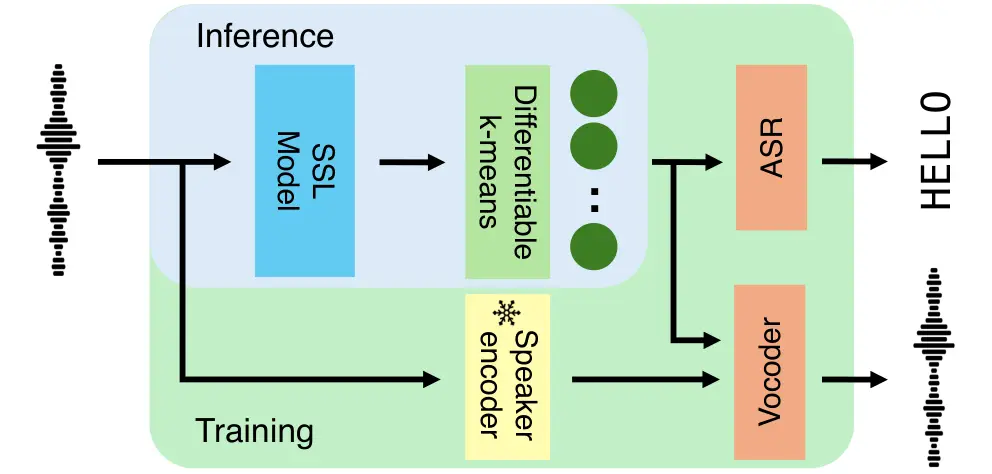
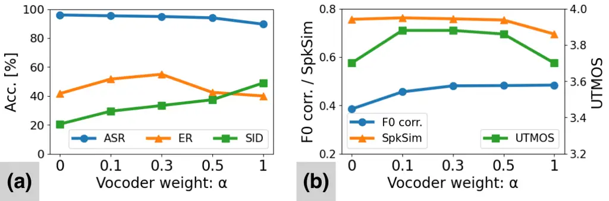

# PHONOLOGICAL TOKENIZER: PROSODY-AWARE PHONETIC TOKEN VIA MULTI-OBJECTIVE FINE-TUNING WITH DIFFERENTIABLE K-MEANS

Kentaro Onda^(⋆†)    Hayato Futami^(†)    Yosuke Kashiwagi^(†)    Emiru
Tsunoo^(†)    Shinji Watanabe ^(‡)

###### Abstract

In recent years, there has been growing interest in representing speech
with discrete tokens, which serve as pseudo-text for speech language
models (speechLMs) and as efficient intermediate representations for
downstream tasks. These tokens are typically categorized as acoustic and
phonetic tokens: the former holds detailed acoustic information for
reconstruction while the latter mainly captures linguistic content. In
human speech communication, however, unnecessary acoustic details such
as speaker information are abstracted, while both linguistic and
prosodic information are utilized for speech comprehension and
production. Given this, neither type of token seems an ideal
representation for tasks sensitive to prosody, such as speechLMs. In
this study, we propose the Phonological Tokenizer, a method that
fine-tunes phonetic tokens via differentiable k-means with a multi-task
objective of ASR and speech resynthesis. Experimental validation on
diverse tasks confirms that our tokens retain phonological (both
linguistic and prosodic) information while appropriately discarding
speaker identity.

###### Index Terms: 

Discrete speech tokens, self-supervised learning, differentiable
k-means, speechLM

^(†)^(†)address: ^(⋆) The University of Tokyo   ^(†)Sony Group
Corporation   ^(‡)Carnegie Mellon University

## 1 Introduction

In recent years, there has been increasing research interest in
representing and processing speech as a sequence of discrete tokens
\[16, 29\]. These discrete tokens are utilized as “pseudo-text” in
speech language models (speechLMs) \[24, 1\] and serve as efficient
intermediate representations for various tasks such as automatic speech
recognition (ASR) and text-to-speech (TTS) \[28, 2\]. Generally,
discrete tokens can be categorized into two types: acoustic tokens and
phonetic tokens ¹¹ 1 Phonetic tokens are sometimes also referred to as
semantic tokens, but their actual property is closer to phoneme-like
units \[43, 39, 5\]. Acoustic tokens are typically learned using
VQ-VAE-based models with the goal of reconstructing speech waveforms
\[47, 7\]. They retain detailed acoustic information, including speaker
identity and background noise, and are considered suitable for speech
synthesis tasks. On the other hand, phonetic tokens are obtained by
applying k-means clustering to the outputs of pre-trained
self-supervised learning (SSL) models \[17\], and are regarded as being
more suitable for extracting linguistic information \[45\].

However, considering how human speech communication functions, both
types of tokens appear somewhat extreme. Humans abstract away
unnecessary acoustic details such as voice timbre or background noise
when perceiving speech, while combining prosody with linguistic
information for both speech comprehension and production \[6, 31\].
Therefore, rather than retaining all the acoustic details or reducing
speech to purely linguistic content, what is desirable is a
representation that captures the holistic phonological aspects of
speech, that is, linguistic content and prosody. This type of token will
have intermediate properties between acoustic and phonetic tokens.
Several recent studies partially address this need by incorporating a
pretrained SSL model into the learning of acoustic tokens to enhance
their ability to capture linguistic information \[49, 8, 46\], known as
hybrid tokens. However, these methods are mainly based on the residual
vector quantization (RVQ) framework and the overall representation
remains essentially a multi-codebook acoustic token. Thus, fully
leveraging the advantages of these tokens requires additional, somewhat
complex architectures in downstream models to manage multiple streams
effectively. Also, the use of multiple codebooks inherently reduces data
compression efficiency, which is the key advantages of discrete
representations \[3, 41\].

In this study, we propose the Phonological Tokenizer: a single-codebook
speech tokenizer that captures the holistic phonological aspects of
speech, namely linguistic and prosodic information, while discarding
unnecessary acoustic details such as background noise and speaker
identity. We leverage the flexible discretization capability of the
recently proposed differentiable k-means \[33\] to build this tokenizer.
We fine-tune phonetic tokens obtained from a pre-trained SSL model using
differentiable k-means in a multi-objective framework combining ASR and
speech resynthesis. The resulting tokenizer demonstrates high
performance in both speech understanding and generation tasks, as well
as in speechLM applications.

The key strengths of our approach are summarized as follows:

- •
  Balancing prosody preservation and speaker information removal: We
  fine-tune phonetic tokens for both ASR and speech resynthesis with
  weighted losses, along with conditioning the vocoder on speaker
  embeddings during training. As a result, our method effectively
  incorporates prosodic information while preserving the ability of
  phonetic tokens to capture linguistic information and discard speaker
  information. It exhibits especially strong performance in tasks where
  prosody is crucial, such as emotion recognition, voice conversion, and
  speechLMs.
- •
  High compression efficiency: By optimizing SSL-based phonetic tokens
  using differentiable k-means \[33, 12\], our method enables
  fine-tuning of token properties while maintaining a single codebook.
  This achieves significantly higher data compression efficiency
  compared to multi-codebook acoustic tokens, while showing superior or
  comparable performance to baseline tokenizers \[49, 4, 19\] on many
  tasks.
- •
  Reduced training data requirement: Since our approach fine-tunes a
  pre-trained large-scale speech foundation model (WavLM-large \[4\]),
  it can build a versatile speech tokenizer with only small training
  data. In this study, we fine-tune phonetic tokens using 44 hours of
  additional training data (VCTK corpus \[40\]) to modify its
  properties. This represents a substantially smaller data requirement
  compared to prior studies \[49, 19\] using large-scale datasets such
  as LibriSpeech (960h) \[34\] or LibriTTS (585h) \[48\].

## 2 Related Works

### 2.1 Hybrid tokens utilizing pretrained SSL models

Several prior studies have proposed hybrid tokens that extend RVQ-based
acoustic tokens by integrating pre-trained SSL models to better capture
linguistic content \[49, 8, 46\]. These tokens demonstrate superior
language understanding capabilities compared to acoustic tokens, which
are trained solely for reconstruction. However, as discussed in
Introduction, these tokens consist of multiple codebooks, which results
in low efficiency and limited usability. In this study, we propose
hybrid tokens based on phonetic tokens by fine-tuning them using
differentiable k-means, enabling a single codebook.

### 2.2 Supervised tokenizers

Several studies have proposed ASR-based tokenizers that allow tokens to
better capture linguistic information \[37, 10\]. Our previous work
\[33\], which optimized phonetic tokens for ASR using differentiable
k-means, can also be categorized as this type of tokens. In this work,
we further extend this idea by fine-tuning phonetic tokens with
multi-objective of ASR and speech resynthesis.

### 2.3 Disentanglement-oriented codec tokens

Several prior studies have proposed codec-based tokens designed to
promote disentanglement by representing global information, such as
speaker identity, in separate branches \[36, 20, 15\]. However,
approaches based on phonetic tokens have not yet been explored. In this
work, we aim to incorporate prosodic information into phonetic tokens in
which speaker information is already suppressed, through fine-tuning
within a multi-task learning framework.

## 3 Multi-objective Optimization with Differentiable K-means



Figure 1: Architecture of the Phonological Tokenizer: multi-objective
fine-tuning of SSL-derived phonetic tokens

### 3.1 Phonetic token optimization via differentiable k-means

Our previous study \[33\] proposed to optimize discrete tokens obtained
from SSL models for specific purposes by introducing differentiable
k-means. The ASR loss $`\mathcal{L}^{\text{asr}}`$ is used to jointly
optimize all components of the model: 1) the SSL model
$`\theta_{\text{ssl}}`$, performing feature extraction
$`\mathrm{SSL}(X;\theta_{\text{ssl}})`$ from the input speech $`X`$; 2)
the cluster centroids $`M`$, used for the differentiable k-means
$`\mathrm{DiffKM}(\cdot;M)`$ to discretize the SSL features; and 3) the
ASR model $`\theta_{\text{asr}}`$, predicting the text transcription
$`Y`$ from the token sequence via
$`\mathrm{ASR}(\cdot;\theta_{\text{asr}})`$.

```math
\displaystyle\mathcal{L}^{\text{asr}}\Bigl(Y,\,\mathrm{ASR}\bigl(\mathrm{DiffKM}\bigl(\mathrm{SSL}(X;\,\theta_{\text{ssl}});\,M\bigr);\,\theta_{\text{asr}}\bigr)\Bigr) \tag{1}
```

This approach not only improved the accuracy of ASR but also modified
the properties of the tokens, enabling them to represent purer
linguistic information. This demonstrates the effectiveness of
differentiable k-means in manipulating the properties of discrete
tokens.

### 3.2 Proposed method: multi-objective optimization

In this study, we propose to extend the loss function in Eq. (1) by
incorporating a weighted reconstruction loss, to achieve Phonological
Tokenizer, which retains linguistic and prosodic information while
appropriately removing speaker information. The ASR loss
$`\mathcal{L}^{\text{asr}}`$ encourages the extraction of linguistic
information while suppressing prosody and speaker information. In
contrast, the reconstruction loss $`\mathcal{L}^{\text{voc}}`$ drives
the tokens to capture all the acoustic details, including prosody and
speaker identity. Thus, these two losses can be seen as tuning the token
properties toward those of the phonetic and acoustic tokens,
respectively. Therefore, to obtain the Phonological Tokenizer that has
intermediate properties between phonetic and acoustic tokens, it is
reasonable to balance these two losses and optimize the tokens in a
multi-task manner.

```math
\displaystyle\mathcal{L}=(1-\alpha)\,\mathcal{L}^{\text{asr}}\Bigl(Y,\,\mathrm{ASR}\bigl(\mathrm{DiffKM}\bigl(\mathrm{SSL}(X;\,\theta_{\text{ssl}});\,M\bigr);\,\theta_{\text{asr}}\bigr)\Bigr)
```

```math
\displaystyle+\alpha\,\mathcal{L}^{\text{voc}}\Bigl(X,\,\mathrm{Voc}\bigl(\mathrm{DiffKM}\bigl(\mathrm{SSL}(X;\,\theta_{\text{ssl}});\,M\bigr),E_{\text{spk}};\,\theta_{\text{voc}}\bigr)\Bigr) \tag{2}
```

We weight these two losses using $`\alpha`$. Both the ASR model
$`\theta_{\text{asr}}`$ used for transcription
$`\mathrm{ASR}(\cdot;\theta_{\text{asr}})`$ and the vocoder
$`\theta_{\text{voc}}`$ for resynthesis
$`\mathrm{Voc}(\cdot;\theta_{\text{voc}})`$ are trained using the
discrete tokens obtained through differentiable k-means as a shared
input. Thus, the tokens are optimized for both tasks in a balanced way.
In order to help disentangle speaker information from the tokens, we
employed a pre-trained speaker encoder to provide the speaker embedding
$`E_{\text{spk}}`$ as an auxiliary conditioning input to the vocoder.

An overview of our tokenizer is presented in Fig. 1. During training,
the entire module, except for the speaker encoder, is jointly optimized.
At inference time, discrete tokens are generated using only the
fine-tuned SSL model $`\theta_{\text{ssl}}`$ followed by differentiable
k-means with learned cluster centroids $`M`$.

## 4 Experiments

### 4.1 Experimental setup

The model training was conducted using ESPnet \[42\]. The configuration
related to differentiable k-means followed the settings described in
\[33\], and the cluster size was set to 2000. For the SSL model, we used
the 21st layer of WavLM-large \[4\], and the cluster centroids $`M`$
were initialized using standard k-means clustering, trained on a 30-hour
subset of the LibriSpeech-100h dataset \[34\]. For ASR, we employed the
joint CTC/attantion-based encoder-decoder (AED) model \[22\], and for
the vocoder, we used HiFi-GAN \[23\]²² 2
[https://github.com/kan-bayashi/ParallelWaveGAN](https://github.com/kan-bayashi/ParallelWaveGAN)
. As the speaker encoder, we adopted a pretrained ECAPA-TDNN model
\[9\]³³ 3
[https://hf.co/speechbrain/spkrec-ecapa-voxceleb](https://hf.co/speechbrain/spkrec-ecapa-voxceleb).
As described in \[33\], training was conducted in two stages. In the
first stage, the SSL model $`\theta_{\text{ssl}}`$ and cluster centroids
$`M`$ were kept frozen, and only the ASR $`\theta_{\text{asr}}`$ and
vocoder $`\theta_{\text{voc}}`$ components were trained for 30 epochs
with a learning rate of 1e-4. In the second stage, the entire module,
including the SSL model $`\theta_{\text{ssl}}`$ and centroids $`M`$
(except the speaker encoder) was fine-tuned for 60 epochs with a
learning rate of 1e-5. The vocoder training included adversarial
learning, with the discriminator updated concurrently throughout both
stages.

Training was conducted using the VCTK corpus \[40\] with speed
perturbation ($`\times`$0.9, 1.0, and 1.1). We adopted $`\alpha=0.1`$⁴⁴
4 See Sec.4.5 for the results of the ablation study as the weight for
the vocoder loss (in Eq.(2)). For reference, we also show the results
for $`\alpha=0`$ and $`\alpha=1`$, where the tokens are fine-tuned with
single-task objectives of ASR and vocoder, respectively. In the
following experiments, we used the tokens obtained from the trained
model to perform various discrete token-based speech tasks, and compared
their performance with that of existing models. As baselines, we used
WavLM (21st layer) followed by standard offline k-means clustering
(k=2000) as phonetic token. We also used SpeechTokenizer \[49\] (using
only the first codebook) trained on LibriSpeech as hybrid token, and
WavTokenizer \[19\] trained on LibriTTS as acoustic token. We present a
comparison of the basic properties of these baseline tokens and our
proposed tokens in Table 1. This shows that once initialized with
phonetic tokens, our tokens can be effectively fine-tuned with very
limited additional data, while keeping high compression efficiency.

|          |                        |            |       |        |        |          |
| -------- | ---------------------- | ---------- | ----- | ------ | ------ | -------- |
|          |                        |            | Bit   | Vocab. | Tokens | Train    |
|          |                        |            | rate  | size   | /sec.  | data     |
| Baseline | Discrete WavLM         | (phonetic) | 548.3 | 2000   | 50     | 130h     |
|          | SpeechTokenizer        | (hybrid)   | 500.0 | 1024   | 50     | 960h     |
|          | WavTokenizer           | (acoustic) | 900.0 | 4096   | 75     | 585h     |
| Proposed | Phonological Tokenizer |            | 548.3 | 2000   | 50     | 30 + 44h |

Table 1: Statistics of baseline and proposed tokens

### 4.2 Evaluation on discriminative tasks

|             |                 |                  |                            |                |                |
| ----------- | --------------- | ---------------- | -------------------------- | -------------- | -------------- |
|             |                 |                  | ASR                        | ER             | SID            |
|             |                 |                  | WER (test-{clean / other}) | acc.           | acc.           |
|             |                 |                  | ($`\downarrow`$)           | ($`\uparrow`$) | ($`\uparrow`$) |
| Baseline    | Discrete WavLM  | (phonetic)       | 14.3/17.1                  | 41.7           | 27.7           |
|             | SpeechTokenizer | (hybrid)         | 19.3/23.5                  | 39.2           | 29.1           |
|             | WavTokenizer    | (acoustic)       | 96.7/96.8                  | 24.2           | 82.7           |
| Single-task | ASR-only \[33\] | ($`\alpha=0`$)   | 14.0/17.0                  | 41.7           | 20.6           |
| Optimized   | Voc-only        | ($`\alpha=1`$)   | 10.4/27.7                  | 40.0           | 49.0           |
| Proposed    | Phonological    | ($`\alpha=0.1`$) | 14.6/18.5                  | 51.7           | 29.5           |
|             | Tokenizer       |                  |                            |                |                |

Table 2: Discriminative task performance: ASR on librispeech-100 &
Emotion Recognition (ER) on Ravdess & Speaker Identification (SID) on
VoxCeleb. The best result in each column is bolded.

We first evaluated the performance of Phonological Tokenizer on
discriminative tasks. Focusing on three distinct aspects, linguistic
information, prosody, and speaker identity, we trained downstream models
for ASR, emotion recognition (ER), and speaker identification (SID). For
ASR, we trained joint CTC/AED models using LibriSpeech-100h. For ER, we
trained ECAPA-TDNN models on RAVDESS \[25\], a dataset of the same
sentences spoken with different emotions, using a speaker-independent
split. For SID, we trained ECAPA-TDNN models on VoxCeleb1 \[30\].

The results are shown in Table 2.

ASR: Our Phonological Tokenizer, while showing slightly lower
performance than Discrete WavLM, demonstrated clear superiority over
both SpeechTokenizer and WavTokenizer. This indicates that our token
represents sufficient linguistic information. Considering the
substantial drop observed when optimized solely for reconstruction
($`\alpha=1`$), our multi-task framework seems effective in preserving
the capability of phonetic tokens for capturing linguistic content.

ER: The Phonological Tokenizer achieved by far the best performance.
This indicates that our proposed tokens successfully capture prosodic
information in a speaker-independent manner.

SID: The Phonological Tokenizer properly showed quite low accuracy as
observed in Discrete WavLM and SpeechTokenizer, indicating minimal
speaker information in the tokens. The lower performance of Voc-only
($`\alpha=1`$) compared to WavTokenizer, despite being trained only for
reconstruction, suggests that using an SSL model and conditioning the
vocoder with speaker embeddings are effective for disentangling speaker
information from the tokens.

Overall, the results indicate that our Phonological Tokenizer
successfully captures prosodic information (as shown in ER) while
preserving the ability of phonetic tokens to capture linguistic
information (in ASR) and suppress speaker information (in SID).

### 4.3 Evaluation on generative tasks

|             |                 |                  |                              |                  |                |                  |                |                |                |                  |                   |                |                |                  |
| ----------- | --------------- | ---------------- | ---------------------------- | ---------------- | -------------- | ---------------- | -------------- | -------------- | -------------- | ---------------- | ----------------- | -------------- | -------------- | ---------------- |
|             |                 |                  | LJSpeech reconstruction (ID) |                  |                |                  | TIMIT VC (OOD) |                |                |                  | Expresso VC (OOD) |                |                |                  |
|             |                 |                  | MCD                          | F0 RMSE          | UTMOS          | WER              | F0 corr.       | SpkSim         | UTMOS          | WER              | F0 corr.          | SpkSim         | UTMOS          | WER              |
|             |                 |                  | ($`\downarrow`$)             | ($`\downarrow`$) | ($`\uparrow`$) | ($`\downarrow`$) | ($`\uparrow`$) | ($`\uparrow`$) | ($`\uparrow`$) | ($`\downarrow`$) | ($`\uparrow`$)    | ($`\uparrow`$) | ($`\uparrow`$) | ($`\downarrow`$) |
| Baseline    | Discrete WavLM  | (phonetic)       | 5.64                         | 0.289            | 3.81           | 2.8              | 0.371          | 0.757          | 3.63           | 10.3             | 0.382             | 0.737          | 3.47           | 12.2             |
|             | SpeechTokenizer | (hybrid)         | 5.35                         | 0.270            | 3.91           | 3.3              | 0.383          | 0.726          | 3.53           | 18.6             | 0.388             | 0.706          | 3.13           | 24.0             |
|             | WavTokenizer    | (acoustic)       | 4.47                         | 0.176            | 4.13           | 2.7              | 0.356          | 0.256          | 2.02           | 34.0             | 0.520             | 0.352          | 2.24           | 27.7             |
| Single-task | ASR-only \[33\] | ($`\alpha=0`$)   | 5.77                         | 0.300            | 3.82           | 2.9              | 0.385          | 0.756          | 3.70           | 10.6             | 0.391             | 0.738          | 3.61           | 12.6             |
| Optimized   | Voc-only        | ($`\alpha=1`$)   | 4.42                         | 0.183            | 4.08           | 3.3              | 0.484          | 0.695          | 3.70           | 16.4             | 0.543             | 0.608          | 2.96           | 26.8             |
| Proposed    | Phonological    | ($`\alpha=0.1`$) | 4.99                         | 0.208            | 4.06           | 2.9              | 0.456          | 0.762          | 3.88           | 19.8             | 0.538             | 0.724          | 3.58           | 12.6             |
|             | Tokenizer       |                  |                              |                  |                |                  |                |                |                |                  |                   |                |                |                  |

Table 3: Generative task performance: reconstruction on in-domain
LJSpeech & voice conversion on out-of-domain neutral read speech (TIMIT)
and expressive speech (Expresso). The best result in each column is
bolded, and those that outperform all baselines are underlined.

We then evaluated performances on generative tasks. We trained unit
HiFi-GAN on the LJSpeech \[18\] with the obtained tokens. The evaluation
is done both on reconstruction on in-domain (ID) LJSpeech and on voice
conversion (VC) on out-of-domain (OOD) corpora. In VC, the tokens from
OOD speech are input to the LJSpeech-trained vocoder to generate speech
in the voice of LJSpeech speaker. If the tokens appropriately preserve
only the linguistic and prosodic information, the output should maintain
the spoken content and speaking style of the input while converting only
the voice timbre to that of LJSpeech. As OOD data, we used TIMIT \[13\]
as neutral read speech and Expresso \[32\] as expressive speech. For ID
reconstruction, we evaluated mel cepstral distortion (MCD) and F0 root
mean square error (F0 RMSE). For OOD VC, we evaluated F0 correlation (F0
corr.) with the source speech and speaker similarity (SpkSim) with the
target speaker of LJSpeech. To assess overall quality, we checked UTMOS
\[38\] and WER computed from Whisper-large-v3 \[35\] transcriptions for
both tasks.

The results are shown in Table 3.

LJSpeech reconstruction (ID): Across all the metrics, our model
outperformed or matched Discrete WavLM and SpeechTokenizer. Although not
as good as WavTokenizer, the degradation in UTMOS and WER was minimal.
This demonstrates that our Phonological Tokenizer is sufficiently
effective for generative tasks. While our token does not retain
fine-grained acoustic details sufficient for precise signal-level
reconstruction, it is still effective enough to enable highly natural
and intelligible speech synthesis.

TIMIT VC (OOD): The Phonological Tokenizer outperformed all the
baselines across all the metrics. Although it was slightly worse than
the Voc-only ($`\alpha=1`$) in F0 corr., it achieved the best
performance in all other metrics. This demonstrates its ability to
retain prosodic information while removing source speaker identity (as
also shown in Sec. 4.2) and to enable high-quality speech synthesis.

Expresso VC (OOD): Our model outperformed all the baselines in F0 corr.
and UTMOS, but SpkSim and WER were not as good as Discrete WavLM and
ASR-only ($`\alpha=0`$). This is likely because these evaluation metrics
tend to favor neutral speech over emotional speech. Indeed, listening to
our demo site⁵⁵ 5
[https://ondatk68.github.io/onda-demo/projects/phonological-tokenizer](https://ondatk68.github.io/onda-demo/projects/phonological-tokenizer),
you can find that when using these tokens that focus on linguistic
information, the output speech sounds neutral, regardless of the
speaking style of the input speech. In contrast, the Phonological
Tokenizer reproduces both the target speaker identity and the speaking
style of the input speech. This is particularly interesting considering
that both our tokenizer and the vocoder were trained without using any
emotional speech.

Overall, the results showed that the Phonological Tokenizer is
sufficiently useful for speech synthesis tasks. Our tokens showed only
slight degradation even compared to acoustic token baseline
(WavTokenizer) in ID reconstruction. Also, the overall strong
performance of our tokens on OOD VC indicates that the Phonological
Tokenizer successfully disentangles prosodic and speaker information,
which is consistent with the ER and SID results in Sec. 4.2.

### 4.4 Evaluation on speechLMs

|             |                 |                  |                |                |                |                |                     |                |
| ----------- | --------------- | ---------------- | -------------- | -------------- | -------------- | -------------- | ------------------- | -------------- |
|             |                 |                  | ZeroSpeech     |                | SALMon         |                | Speech Continuation |                |
|             |                 |                  |                |                | (consistency)  |                |                     |                |
|             |                 |                  | sWUGGY         | sBLIMP         | Sent.          | Spk            | GenPPL              | UTMOS          |
|             |                 |                  | ($`\uparrow`$) | ($`\uparrow`$) | ($`\uparrow`$) | ($`\uparrow`$) | ($`\downarrow`$)    | ($`\uparrow`$) |
| Baseline    | Discrete WavLM  | (phonetic)       | 68.6           | 57.1           | 80.5           | 86.0           | 5.81                | 3.60           |
|             | SpeechTokenizer | (hybrid)         | 66.4           | 54.4           | 59.5           | 65.0           | 5.73                | 3.64           |
|             | WavTokenizer    | (acoustic)       | 52.5           | 49.3           | 66.0           | 74.0           | 6.34                | 2.57           |
| Single-task | ASR-only \[33\] | ($`\alpha=0`$)   | 70.0           | 59.7           | 61.0           | 61.0           | 5.60                | 3.56           |
| Optimized   | Voc-only        | ($`\alpha=1`$)   | 56.9           | 51.2           | 62.5           | 79.5           | 6.40                | 3.67           |
| Proposed    | Phonological    | $`(\alpha=0.1`$) | 67.0           | 55.2           | 67.5           | 66.0           | 5.60                | 3.86           |
|             | Tokenizer       |                  |                |                |                |                |                     |                |

Table 4: SpeechLM performance: sWUGGY and sBLIMP for lexical and
syntactic knowledge; sentiment and speaker consistency for awareness to
paralinguistic and non-linguistic aspects; and assesments of the quality
of generated speech continuations.

Lastly, we trained speechLMs using the obtained tokens and evaluated
their performance. We used the slam recipe \[26\] based on Qwen2.5-0.5B
\[44\]. We used the 6,000-hour subset of LibriLight \[21\] as training
data and trained each model for 4 epochs. As evaluation metrics, we
adopted sWUGGY and sBLIMP from the Zero Resource Speech Challenge \[11\]
to assess lexical and syntactic knowledge. To measure awareness to
paralinguistic and non-linguistic information, we used SALMon’s
sentimental and speaker consistency metrics \[27\]. Additionally, to
evaluate the quality of speech continuations generated by the speechLMs,
we checked generative perplexity (GenPPL) and UTMOS. To calculate
GenPPL, we first transcribed the generated speech using
Whisper-large-v3, and then calculated perplexity using Llama-3.2-1B
\[14\], following \[26\].

The results are shown in Table 4. The results of ZeroSpeech, which
focuses on linguistic information, and the sentimental and speaker
consistency results from SALMon, largely align with the ASR, ER, and SID
results reported in Sec. 4.2. In ZeroSpeech, the Phonological Tokenizer
performed slightly worse than Discrete WavLM and ASR-only
($`\alpha=0`$), but still outperformed the other baselines. In SALMon,
Discrete WavLM achieved exceptionally high scores contrary to the
results of ER and SID, but the Phonological Tokenizer exhibited the
second highest sentimental consistency, while its speaker consistency
was lower than that of WavTokenizer and the Voc-only ($`\alpha=1`$). For
speech continuation, the Phonological Tokenizer achieved the best
performance in both GenPPL and UTMOS. These results highlights that the
speechLM constructed with our proposed tokens achieved high naturalness
in both spoken content and speech quality in the speech continuation
task.

### 4.5 Ablation study on the vocoder loss weight

We conducted an ablation study on the vocoder loss weight $`\alpha`$ (in
Eq.(2)). Fig. 2 presents the results for the discriminative tasks (ASR,
ER, and SID) and the generative tasks (only for TIMIT VC). For the
results of the discriminative tasks, increasing $`\alpha`$ gradually
degrades ASR performance while improving SID. However, ER achieves its
optimal value at $`\alpha=0.3`$. This suggests that increasing
$`\alpha`$ allows both prosodic and speaker information to be encoded in
the tokens, but too large value of $`\alpha`$ make it more difficult to
disentangle prosody and speaker timbre. For the results of the
generative tasks, increasing $`\alpha`$ leads to higher F0 corr., but
when $`\alpha=1`$, SpkSim decreases largely. The low UTMOS at the two
ends can be attributed to different factors: at $`\alpha=0`$, due to the
absence of prosody, and at $`\alpha=1`$, due to the inclusion of
unnecessary speaker information. These results highlight the advantage
of our Phonological Tokenizer, which is trained in a multi-task manner
to achieve balanced properties between acoustic and phonetic tokens.



Figure 2: Ablation results for the vocoder loss weight $`\alpha`$: (a)
Discriminative tasks (ASR, ER, SID), (b) generative task (TIMIT VC).

## 5 Conclusions

In this work, we propose the Phonological Tokenizer, which has
intermediate properties between acoustic and phonetic tokens. The
tokenizer is obtained by fine-tuning phonetic tokens through
differentiable k-means using a multi-objective of ASR and speech
reconstruction. Experimental results across diverse downstream tasks,
including speechLMs, demonstrate that the resulting tokens achieve
strong performance in capturing linguistic and prosodic information
while appropriately disentangling speaker identity. Our tokens showed
the best results in prosody-sensitive tasks (ER, VC, and speech
continuation in speechLM) among all the token tested, and also surpassed
hybrid token baseline, SpeechTokenizer, in all the tasks including
speech understanding and generation. Moreover, the fact that our
tokenizer relies on a single codebook and trained with only a small
amount of data, further underscores the advantages of our method. Future
work includes scaling up the training data for enhanced performance, as
well as enabling inference-time controllability for more flexible
adjustment of token properties.

## References

- \[1\] S. Arora, K. Chang, C. Chien, Y. Peng, H. Wu, Y. Adi, E.
  Dupoux, H. Lee, K. Livescu, and S. Watanabe (2025) On the landscape of
  spoken language models: a comprehensive survey. TMLR. External Links:
  2504.08528, [Link](https://arxiv.org/abs/2504.08528) Cited by: §1.
- \[2\] X. Chang, J. Shi, J. Tian, Y. Wu, Y. Tang, Y. Wu, S.
  Watanabe, Y. Adi, X. Chen, and Q. Jin (2024) The Interspeech 2024
  challenge on speech processing using discrete units. In Interspeech,
  External Links:
  [Document](https://dx.doi.org/10.21437/Interspeech.2024-1878), ISSN
  2958-1796 Cited by: §1.
- \[3\] X. Chang, B. Yan, K. Choi, J. Jung, Y. Lu, S. Maiti, R.
  Sharma, J. Shi, J. Tian, S. Watanabe, Y. Fujita, T. Maekaku, P.
  Guo, Y. Cheng, P. Denisov, K. Saijo, and H. Wang (2024) Exploring
  speech recognition, translation, and understanding with discrete
  speech units: a comparative study. In ICASSP, Vol. . External Links:
  [Document](https://dx.doi.org/10.1109/ICASSP48485.2024.10447929) Cited
  by: §1.
- \[4\] S. Chen, C. Wang, Z. Chen, Y. Wu, S. Liu, Z. Chen, J. Li, N.
  Kanda, T. Yoshioka, X. Xiao, J. Wu, L. Zhou, S. Ren, Y. Qian, Y.
  Qian, M. Zeng, and F. Wei (2021) WavLM: large-scale self-supervised
  pre-training for full stack speech processing. JSTSP 16. External
  Links: [Link](https://api.semanticscholar.org/CorpusID:239885872)
  Cited by: 2nd item, 3rd item, §4.1.
- \[5\] K. Choi, A. Pasad, T. Nakamura, S. Fukayama, K. Livescu, and S.
  Watanabe (2024) Self-Supervised Speech Representations are More
  Phonetic than Semantic. In Interspeech, External Links:
  [Document](https://dx.doi.org/10.21437/Interspeech.2024-1157), ISSN
  2958-1796 Cited by: footnote 1.
- \[6\] A. Cutler, D. Dahan, and W. Van Donselaar (1997) Prosody in the
  comprehension of spoken language: a literature review. Language and
  speech 40 (2). Cited by: §1.
- \[7\] A. Défossez, J. Copet, G. Synnaeve, and Y. Adi (2023) High
  fidelity neural audio compression. TMLR. External Links: ISSN
  2835-8856, [Link](https://openreview.net/forum?id=ivCd8z8zR2) Cited
  by: §1.
- \[8\] A. Défossez, L. Mazaré, M. Orsini, A. Royer, P. Pérez, H.
  Jégou, E. Grave, and N. Zeghidour (2024) Moshi: a speech-text
  foundation model for real-time dialogue. arXiv. External Links:
  2410.00037, [Link](https://arxiv.org/abs/2410.00037) Cited by: §1,
  §2.1.
- \[9\] B. Desplanques, J. Thienpondt, and K. Demuynck (2020)
  ECAPA-TDNN: emphasized channel attention, propagation and aggregation
  in TDNN based speaker verification. In Interspeech, Cited by: §4.1.
- \[10\] Z. Du, Q. Chen, S. Zhang, K. Hu, H. Lu, Y. Yang, H. Hu, S.
  Zheng, Y. Gu, Z. Ma, et al. (2024) Cosyvoice: a scalable multilingual
  zero-shot text-to-speech synthesizer based on supervised semantic
  tokens. arXiv. Cited by: §2.2.
- \[11\] E. Dunbar, M. Bernard, N. Hamilakis, T. A. Nguyen, M. de
  Seyssel, P. Rozé, M. Rivière, E. Kharitonov, and E. Dupoux (2021) The
  zero resource speech challenge 2021: spoken language modelling. In
  Interspeech, External Links:
  [Document](https://dx.doi.org/10.21437/Interspeech.2021-1755), ISSN
  2958-1796 Cited by: §4.4.
- \[12\] B. Gao, Y. Yang, H. Gouk, and T. M. Hospedales (2020) Deep
  clustering with concrete k-means. In ICASSP, Vol. . External Links:
  [Document](https://dx.doi.org/10.1109/ICASSP40776.2020.9053265) Cited
  by: 2nd item.
- \[13\] J. Garofolo, L. Lamel, W. Fisher, J. Fiscus, D. Pallett, N.
  Dahlgren, and V. Zue (1992) TIMIT acoustic-phonetic continuous speech
  corpus. Linguistic Data Consortium, pp. . Cited by: §4.3.
- \[14\] A. Grattafiori, A. Dubey, A. Jauhri, A. Pandey, A. Kadian, A.
  Al-Dahle, A. Letman, A. Mathur, A. Schelten, A. Vaughan, A. Yang, A.
  Fan, A. Goyal, A. Hartshorn, A. Yang, A. Mitra, A. Sravankumar, A.
  Korenev, A. Hinsvark, A. Rao, A. Zhang, A. Rodriguez, A. Gregerson, A.
  Spataru, B. Roziere, B. Biron, B. Tang, B. Chern, C. Caucheteux, C.
  Nayak, C. Bi, C. Marra, C. McConnell, C. Keller, C. Touret, C. Wu, C.
  Wong, C. C. Ferrer, C. Nikolaidis, D. Allonsius, D. Song, D. Pintz, D.
  Livshits, D. Wyatt, D. Esiobu, D. Choudhary, D. Mahajan, D.
  Garcia-Olano, D. Perino, D. Hupkes, E. Lakomkin, E. AlBadawy, E.
  Lobanova, E. Dinan, E. M. Smith, F. Radenovic, F. Guzmán, F. Zhang, G.
  Synnaeve, G. Lee, G. L. Anderson, G. Thattai, G. Nail, G. Mialon, G.
  Pang, G. Cucurell, H. Nguyen, H. Korevaar, H. Xu, H. Touvron, I.
  Zarov, I. A. Ibarra, I. Kloumann, I. Misra, I. Evtimov, J. Zhang, J.
  Copet, J. Lee, J. Geffert, J. Vranes, J. Park, J. Mahadeokar, J.
  Shah, J. van der Linde, J. Billock, J. Hong, J. Lee, J. Fu, J. Chi, J.
  Huang, J. Liu, J. Wang, J. Yu, J. Bitton, J. Spisak, J. Park, J.
  Rocca, J. Johnstun, J. Saxe, J. Jia, K. V. Alwala, K. Prasad, K.
  Upasani, K. Plawiak, K. Li, K. Heafield, K. Stone, K. El-Arini, K.
  Iyer, K. Malik, K. Chiu, K. Bhalla, K. Lakhotia, L. Rantala-Yeary, L.
  van der Maaten, L. Chen, L. Tan, L. Jenkins, L. Martin, L. Madaan, L.
  Malo, L. Blecher, L. Landzaat, L. de Oliveira, M. Muzzi, M.
  Pasupuleti, M. Singh, M. Paluri, M. Kardas, M. Tsimpoukelli, M.
  Oldham, M. Rita, M. Pavlova, M. Kambadur, M. Lewis, M. Si, M. K.
  Singh, M. Hassan, N. Goyal, N. Torabi, N. Bashlykov, N. Bogoychev, N.
  Chatterji, N. Zhang, O. Duchenne, O. Çelebi, P. Alrassy, P. Zhang, P.
  Li, P. Vasic, P. Weng, P. Bhargava, P. Dubal, P. Krishnan, P. S.
  Koura, P. Xu, Q. He, Q. Dong, R. Srinivasan, R. Ganapathy, R.
  Calderer, R. S. Cabral, R. Stojnic, R. Raileanu, R. Maheswari, R.
  Girdhar, R. Patel, R. Sauvestre, R. Polidoro, R. Sumbaly, R.
  Taylor, R. Silva, R. Hou, R. Wang, S. Hosseini, S. Chennabasappa, S.
  Singh, S. Bell, S. S. Kim, S. Edunov, S. Nie, S. Narang, S.
  Raparthy, S. Shen, S. Wan, S. Bhosale, S. Zhang, S. Vandenhende, S.
  Batra, S. Whitman, S. Sootla, S. Collot, S. Gururangan, S.
  Borodinsky, T. Herman, T. Fowler, T. Sheasha, T. Georgiou, T.
  Scialom, T. Speckbacher, T. Mihaylov, T. Xiao, U. Karn, V. Goswami, V.
  Gupta, V. Ramanathan, V. Kerkez, V. Gonguet, V. Do, V. Vogeti, V.
  Albiero, V. Petrovic, W. Chu, W. Xiong, W. Fu, W. Meers, X.
  Martinet, X. Wang, X. Wang, X. E. Tan, X. Xia, X. Xie, X. Jia, X.
  Wang, Y. Goldschlag, Y. Gaur, Y. Babaei, Y. Wen, Y. Song, Y. Zhang, Y.
  Li, Y. Mao, Z. D. Coudert, Z. Yan, Z. Chen, Z. Papakipos, A. Singh, A.
  Srivastava, A. Jain, A. Kelsey, A. Shajnfeld, A. Gangidi, A.
  Victoria, A. Goldstand, A. Menon, A. Sharma, A. Boesenberg, A.
  Baevski, A. Feinstein, A. Kallet, A. Sangani, A. Teo, A. Yunus, A.
  Lupu, A. Alvarado, A. Caples, A. Gu, A. Ho, A. Poulton, A. Ryan, A.
  Ramchandani, A. Dong, A. Franco, A. Goyal, A. Saraf, A. Chowdhury, A.
  Gabriel, A. Bharambe, A. Eisenman, A. Yazdan, B. James, B. Maurer, B.
  Leonhardi, B. Huang, B. Loyd, B. D. Paola, B. Paranjape, B. Liu, B.
  Wu, B. Ni, B. Hancock, B. Wasti, B. Spence, B. Stojkovic, B.
  Gamido, B. Montalvo, C. Parker, C. Burton, C. Mejia, C. Liu, C.
  Wang, C. Kim, C. Zhou, C. Hu, C. Chu, C. Cai, C. Tindal, C.
  Feichtenhofer, C. Gao, D. Civin, D. Beaty, D. Kreymer, D. Li, D.
  Adkins, D. Xu, D. Testuggine, D. David, D. Parikh, D. Liskovich, D.
  Foss, D. Wang, D. Le, D. Holland, E. Dowling, E. Jamil, E.
  Montgomery, E. Presani, E. Hahn, E. Wood, E. Le, E. Brinkman, E.
  Arcaute, E. Dunbar, E. Smothers, F. Sun, F. Kreuk, F. Tian, F.
  Kokkinos, F. Ozgenel, F. Caggioni, F. Kanayet, F. Seide, G. M.
  Florez, G. Schwarz, G. Badeer, G. Swee, G. Halpern, G. Herman, G.
  Sizov, Guangyi, Zhang, G. Lakshminarayanan, H. Inan, H.
  Shojanazeri, H. Zou, H. Wang, H. Zha, H. Habeeb, H. Rudolph, H.
  Suk, H. Aspegren, H. Goldman, H. Zhan, I. Damlaj, I. Molybog, I.
  Tufanov, I. Leontiadis, I. Veliche, I. Gat, J. Weissman, J.
  Geboski, J. Kohli, J. Lam, J. Asher, J. Gaya, J. Marcus, J. Tang, J.
  Chan, J. Zhen, J. Reizenstein, J. Teboul, J. Zhong, J. Jin, J.
  Yang, J. Cummings, J. Carvill, J. Shepard, J. McPhie, J. Torres, J.
  Ginsburg, J. Wang, K. Wu, K. H. U, K. Saxena, K. Khandelwal, K.
  Zand, K. Matosich, K. Veeraraghavan, K. Michelena, K. Li, K.
  Jagadeesh, K. Huang, K. Chawla, K. Huang, L. Chen, L. Garg, L. A, L.
  Silva, L. Bell, L. Zhang, L. Guo, L. Yu, L. Moshkovich, L.
  Wehrstedt, M. Khabsa, M. Avalani, M. Bhatt, M. Mankus, M. Hasson, M.
  Lennie, M. Reso, M. Groshev, M. Naumov, M. Lathi, M. Keneally, M.
  Liu, M. L. Seltzer, M. Valko, M. Restrepo, M. Patel, M. Vyatskov, M.
  Samvelyan, M. Clark, M. Macey, M. Wang, M. J. Hermoso, M. Metanat, M.
  Rastegari, M. Bansal, N. Santhanam, N. Parks, N. White, N. Bawa, N.
  Singhal, N. Egebo, N. Usunier, N. Mehta, N. P. Laptev, N. Dong, N.
  Cheng, O. Chernoguz, O. Hart, O. Salpekar, O. Kalinli, P. Kent, P.
  Parekh, P. Saab, P. Balaji, P. Rittner, P. Bontrager, P. Roux, P.
  Dollar, P. Zvyagina, P. Ratanchandani, P. Yuvraj, Q. Liang, R.
  Alao, R. Rodriguez, R. Ayub, R. Murthy, R. Nayani, R. Mitra, R.
  Parthasarathy, R. Li, R. Hogan, R. Battey, R. Wang, R. Howes, R.
  Rinott, S. Mehta, S. Siby, S. J. Bondu, S. Datta, S. Chugh, S.
  Hunt, S. Dhillon, S. Sidorov, S. Pan, S. Mahajan, S. Verma, S.
  Yamamoto, S. Ramaswamy, S. Lindsay, S. Lindsay, S. Feng, S. Lin, S. C.
  Zha, S. Patil, S. Shankar, S. Zhang, S. Zhang, S. Wang, S. Agarwal, S.
  Sajuyigbe, S. Chintala, S. Max, S. Chen, S. Kehoe, S. Satterfield, S.
  Govindaprasad, S. Gupta, S. Deng, S. Cho, S. Virk, S. Subramanian, S.
  Choudhury, S. Goldman, T. Remez, T. Glaser, T. Best, T. Koehler, T.
  Robinson, T. Li, T. Zhang, T. Matthews, T. Chou, T. Shaked, V.
  Vontimitta, V. Ajayi, V. Montanez, V. Mohan, V. S. Kumar, V.
  Mangla, V. Ionescu, V. Poenaru, V. T. Mihailescu, V. Ivanov, W. Li, W.
  Wang, W. Jiang, W. Bouaziz, W. Constable, X. Tang, X. Wu, X. Wang, X.
  Wu, X. Gao, Y. Kleinman, Y. Chen, Y. Hu, Y. Jia, Y. Qi, Y. Li, Y.
  Zhang, Y. Zhang, Y. Adi, Y. Nam, Yu, Wang, Y. Zhao, Y. Hao, Y.
  Qian, Y. Li, Y. He, Z. Rait, Z. DeVito, Z. Rosnbrick, Z. Wen, Z.
  Yang, Z. Zhao, and Z. Ma (2024) The llama 3 herd of models. arXiv.
  External Links: 2407.21783, [Link](https://arxiv.org/abs/2407.21783)
  Cited by: §4.4.
- \[15\] Y. Guo, Z. Li, C. Du, H. Wang, X. Chen, and K. Yu (2025)
  LSCodec: Low-Bitrate and Speaker-Decoupled Discrete Speech Codec. In
  Interspeech, External Links:
  [Document](https://dx.doi.org/10.21437/Interspeech.2025-1106), ISSN
  2958-1796 Cited by: §2.3.
- \[16\] Y. Guo, Z. Li, H. Wang, B. Li, C. Shao, H. Zhang, C. Du, X.
  Chen, S. Liu, and K. Yu (2025) Recent advances in discrete speech
  tokens: a review. IEEE TPAMI (). External Links:
  [Document](https://dx.doi.org/10.1109/TPAMI.2025.3643619) Cited by:
  §1.
- \[17\] W. Hsu, B. Bolte, Y. H. Tsai, K. Lakhotia, R. Salakhutdinov,
  and A. Mohamed (2021) HuBERT: self-supervised speech representation
  learning by masked prediction of hidden units. TASLP 29. External
  Links: [Document](https://dx.doi.org/10.1109/TASLP.2021.3122291) Cited
  by: §1.
- \[18\] K. Ito and L. Johnson (2017) The lj speech dataset. Cited by:
  §4.3.
- \[19\] S. Ji, Z. Jiang, W. Wang, Y. Chen, M. Fang, J. Zuo, Q. Yang, X.
  Cheng, Z. Wang, R. Li, et al. (2025) WavTokenizer: an efficient
  acoustic discrete codec tokenizer for audio language modeling. In
  ICLR, Cited by: 2nd item, 3rd item, §4.1.
- \[20\] Z. Ju, Y. Wang, K. Shen, X. Tan, D. Xin, D. Yang, Y. Liu, Y.
  Leng, K. Song, S. Tang, Z. Wu, T. Qin, X. Li, W. Ye, S. Zhang, J.
  Bian, L. He, J. Li, and S. Zhao (2024) NaturalSpeech 3: zero-shot
  speech synthesis with factorized codec and diffusion models. In ICML,
  Cited by: §2.3.
- \[21\] J. Kahn, M. Rivière, W. Zheng, E. Kharitonov, Q. Xu, P.E.
  Mazaré, J. Karadayi, V. Liptchinsky, R. Collobert, C. Fuegen, T.
  Likhomanenko, G. Synnaeve, A. Joulin, A. Mohamed, and E. Dupoux (2020)
  Libri-light: a benchmark for asr with limited or no supervision. In
  ICASSP, Vol. . External Links:
  [Document](https://dx.doi.org/10.1109/ICASSP40776.2020.9052942) Cited
  by: §4.4.
- \[22\] S. Kim, T. Hori, and S. Watanabe (2017) Joint CTC-attention
  based end-to-end speech recognition using multi-task learning. In
  ICASSP, Vol. . External Links:
  [Document](https://dx.doi.org/10.1109/ICASSP.2017.7953075) Cited by:
  §4.1.
- \[23\] J. Kong, J. Kim, and J. Bae (2020) Hifi-gan: generative
  adversarial networks for efficient and high fidelity speech synthesis.
  NeurIPS. Cited by: §4.1.
- \[24\] K. Lakhotia, E. Kharitonov, W. Hsu, Y. Adi, A. Polyak, B.
  Bolte, T. Nguyen, J. Copet, A. Baevski, A. Mohamed, and E.
  Dupoux (2021) On generative spoken language modeling from raw audio.
  TACL 9. Cited by: §1.
- \[25\] S. R. Livingstone and F. A. Russo (2018) The ryerson
  audio-visual database of emotional speech and song (ravdess): a
  dynamic, multimodal set of facial and vocal expressions in north
  american english. PLOS ONE 13 (5). External Links:
  [Document](https://dx.doi.org/10.1371/journal.pone.0196391),
  [Link](https://doi.org/10.1371/journal.pone.0196391) Cited by: §4.2.
- \[26\] G. Maimon, A. Elmakies, and Y. Adi (2025) Slamming: training a
  speech language model on one GPU in a day. In ACL, External Links:
  [Link](https://aclanthology.org/2025.findings-acl.631/),
  [Document](https://dx.doi.org/10.18653/v1/2025.findings-acl.631), ISBN
  979-8-89176-256-5 Cited by: §4.4.
- \[27\] G. Maimon, A. Roth, and Y. Adi (2025) Salmon: a suite for
  acoustic language model evaluation. In ICASSP, Cited by: §4.4.
- \[28\] P. Mousavi, J. Duret, S. Zaiem, L. Della Libera, A.
  Ploujnikov, C. Subakan, and M. Ravanelli (2024) How should we extract
  discrete audio tokens from self-supervised models?. In Interspeech,
  External Links:
  [Document](https://dx.doi.org/10.21437/Interspeech.2024-2135), ISSN
  2958-1796 Cited by: §1.
- \[29\] P. Mousavi, G. Maimon, A. Moumen, D. Petermann, J. Shi, H.
  Wu, H. Yang, A. Kuznetsova, A. Ploujnikov, R. Marxer, B.
  Ramabhadran, B. Elizalde, L. Lugosch, J. Li, C. Subakan, P.
  Woodland, M. Kim, H. Lee, S. Watanabe, Y. Adi, and M. Ravanelli (2025)
  Discrete audio tokens: more than a survey!. TMLR. Note: External
  Links: ISSN 2835-8856,
  [Link](https://openreview.net/forum?id=eqNchtvc6v) Cited by: §1.
- \[30\] A. Nagrani, J. S. Chung, W. Xie, and A. Zisserman (2020)
  Voxceleb: large-scale speaker verification in the wild. Computer
  Speech & Language 60. Cited by: §4.2.
- \[31\] M. Nespor and I. Vogel (2007) Prosodic phonology: with a new
  foreword. Vol. 28, Walter de Gruyter. Cited by: §1.
- \[32\] T. A. Nguyen, W. Hsu, A. D’Avirro, B. Shi, I. Gat, M.
  Fazel-Zarani, T. Remez, J. Copet, G. Synnaeve, M. Hassid, F. Kreuk, Y.
  Adi, and E. Dupoux (2023) Expresso: a benchmark and analysis of
  discrete expressive speech resynthesis. In Interspeech, External
  Links: [Document](https://dx.doi.org/10.21437/Interspeech.2023-1905),
  ISSN 2958-1796 Cited by: §4.3.
- \[33\] K. Onda, Y. Kashiwagi, E. Tsunoo, H. Futami, and S.
  Watanabe (2025) Differentiable K-means for Fully-optimized Discrete
  Token-based ASR. In Interspeech, External Links:
  [Document](https://dx.doi.org/10.21437/Interspeech.2025-593), ISSN
  2958-1796 Cited by: 2nd item, §1, §2.2, §3.1, §4.1, Table 2, Table 3,
  Table 4.
- \[34\] V. Panayotov, G. Chen, D. Povey, and S. Khudanpur (2015)
  Librispeech: an ASR corpus based on public domain audio books. In
  ICASSP, External Links:
  [Document](https://dx.doi.org/10.1109/ICASSP.2015.7178964) Cited by:
  3rd item, §4.1.
- \[35\] A. Radford, J. W. Kim, T. Xu, G. Brockman, C. Mcleavey, and I.
  Sutskever (2023) Robust speech recognition via large-scale weak
  supervision. In ICML, External Links:
  [Link](https://proceedings.mlr.press/v202/radford23a.html) Cited by:
  §4.3.
- \[36\] Y. Ren, T. Wang, J. Yi, L. Xu, J. Tao, C. Y. Zhang, and J.
  Zhou (2024) Fewer-token neural speech codec with time-invariant codes.
  In ICASSP, Cited by: §2.3.
- \[37\] P. K. Rubenstein, C. Asawaroengchai, D. D. Nguyen, A. Bapna, Z.
  Borsos, F. d. C. Quitry, P. Chen, D. E. Badawy, W. Han, E. Kharitonov,
  et al. (2023) Audiopalm: a large language model that can speak and
  listen. arXiv. Cited by: §2.2.
- \[38\] T. Saeki, D. Xin, W. Nakata, T. Koriyama, S. Takamichi, and H.
  Saruwatari (2022) UTMOS: UTokyo-SaruLab System for VoiceMOS Challenge 2022. In Interspeech, External Links:
  [Document](https://dx.doi.org/10.21437/Interspeech.2022-439), ISSN
  2958-1796 Cited by: §4.3.
- \[39\] A. Sicherman and Y. Adi (2023) Analysing discrete self
  supervised speech representation for spoken language modeling. In
  ICASSP, Vol. . External Links:
  [Document](https://dx.doi.org/10.1109/ICASSP49357.2023.10097097) Cited
  by: footnote 1.
- \[40\] C. Veaux, J. Yamagishi, K. MacDonald, et al. (2017) CSTR VCTK
  corpus: english multi-speaker corpus for CSTR voice cloning toolkit.
  University of Edinburgh. CSTR 6. Cited by: 3rd item, §4.1.
- \[41\] D. Wang, J. Li, M. Cui, D. Yang, X. Chen, and H. M. Meng (2025)
  Speech discrete tokens or continuous features? a comparative analysis
  for spoken language understanding in SpeechLLMs. In EMNLP, External
  Links: [Link](https://aclanthology.org/2025.emnlp-main.1266/),
  [Document](https://dx.doi.org/10.18653/v1/2025.emnlp-main.1266), ISBN
  979-8-89176-332-6 Cited by: §1.
- \[42\] S. Watanabe, T. Hori, S. Karita, T. Hayashi, J. Nishitoba, Y.
  Unno, N. Enrique Yalta Soplin, J. Heymann, M. Wiesner, N. Chen, A.
  Renduchintala, and T. Ochiai (2018) ESPnet: end-to-end speech
  processing toolkit. In Interspeech, External Links:
  [Document](https://dx.doi.org/10.21437/Interspeech.2018-1456), ISSN
  2958-1796 Cited by: §4.1.
- \[43\] D. Wells, H. Tang, and K. Richmond (2022) Phonetic Analysis of
  Self-supervised Representations of English Speech. In Interspeech,
  External Links:
  [Document](https://dx.doi.org/10.21437/Interspeech.2022-10884), ISSN
  2958-1796 Cited by: footnote 1.
- \[44\] A. Yang, B. Yang, B. Hui, B. Zheng, B. Yu, C. Zhou, C. Li, C.
  Li, D. Liu, F. Huang, G. Dong, H. Wei, H. Lin, J. Tang, J. Wang, J.
  Yang, J. Tu, J. Zhang, J. Ma, J. Xu, J. Zhou, J. Bai, J. He, J.
  Lin, K. Dang, K. Lu, K. Chen, K. Yang, M. Li, M. Xue, N. Ni, P.
  Zhang, P. Wang, R. Peng, R. Men, R. Gao, R. Lin, S. Wang, S. Bai, S.
  Tan, T. Zhu, T. Li, T. Liu, W. Ge, X. Deng, X. Zhou, X. Ren, X.
  Zhang, X. Wei, X. Ren, Y. Fan, Y. Yao, Y. Zhang, Y. Wan, Y. Chu, Y.
  Liu, Z. Cui, Z. Zhang, and Z. Fan (2024) Qwen2 technical report.
  arXiv. Cited by: §4.4.
- \[45\] Y. Yang, F. Shen, C. Du, Z. Ma, K. Yu, D. Povey, and X.
  Chen (2024) Towards universal speech discrete tokens: a case study for
  ASR and TTS. In ICASSP, Vol. . External Links:
  [Document](https://dx.doi.org/10.1109/ICASSP48485.2024.10447751) Cited
  by: §1.
- \[46\] Z. Ye, P. Sun, J. Lei, H. Lin, X. Tan, Z. Dai, Q. Kong, J.
  Chen, J. Pan, Q. Liu, et al. (2025) Codec does matter: exploring the
  semantic shortcoming of codec for audio language model. In AAAI, Cited
  by: §1, §2.1.
- \[47\] N. Zeghidour, A. Luebs, A. Omran, J. Skoglund, and M.
  Tagliasacchi (2021) Soundstream: an end-to-end neural audio codec.
  TASLP 30. Cited by: §1.
- \[48\] H. Zen, V. Dang, R. Clark, Y. Zhang, R. J. Weiss, Y. Jia, Z.
  Chen, and Y. Wu (2019) LibriTTS: a corpus derived from librispeech for
  text-to-speech. In Interspeech, External Links:
  [Document](https://dx.doi.org/10.21437/Interspeech.2019-2441), ISSN
  2958-1796 Cited by: 3rd item.
- \[49\] X. Zhang, D. Zhang, S. Li, Y. Zhou, and X. Qiu (2024)
  SpeechTokenizer: unified speech tokenizer for speech language models.
  In ICLR, Cited by: 2nd item, 3rd item, §1, §2.1, §4.1.
