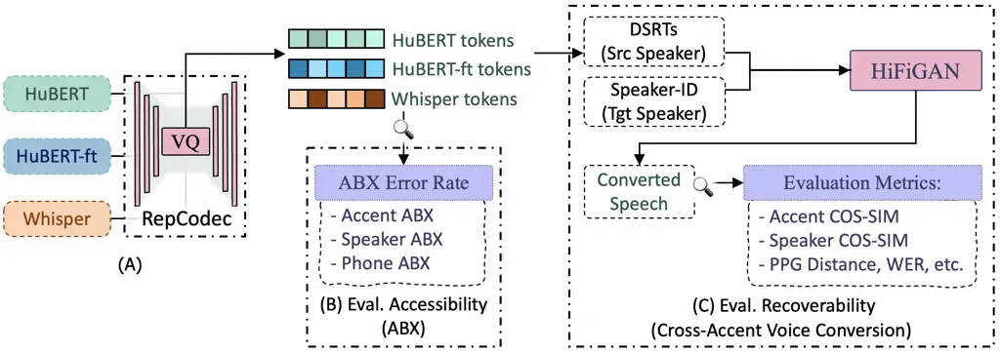
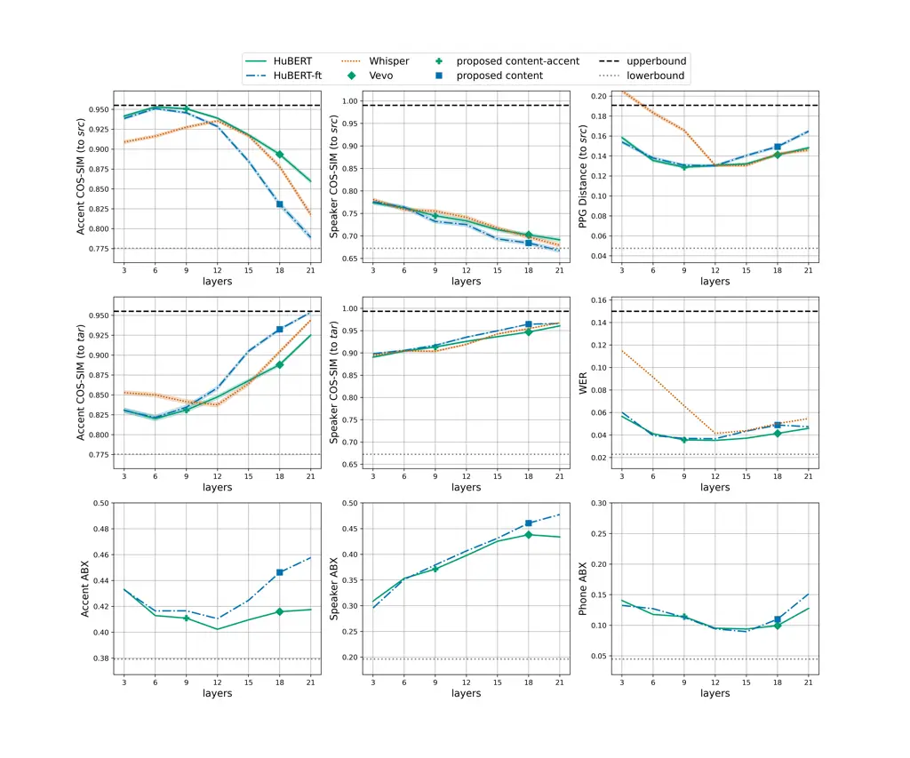
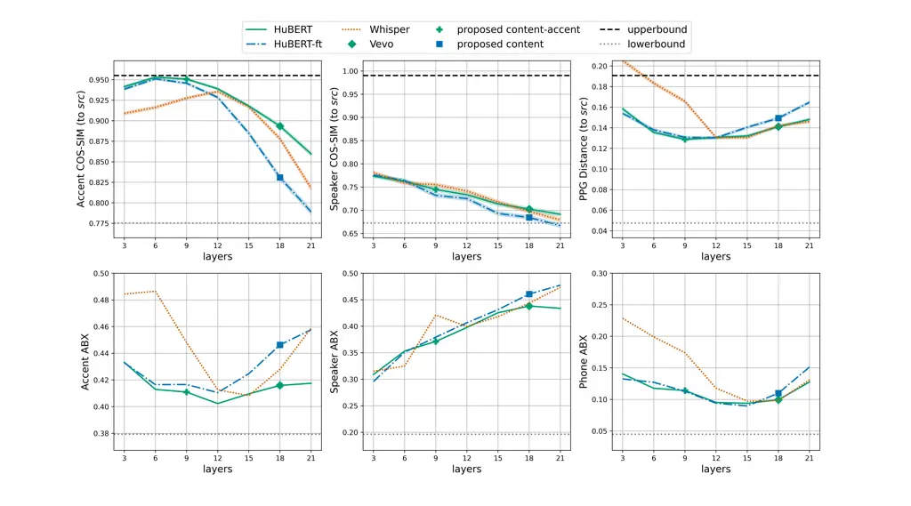
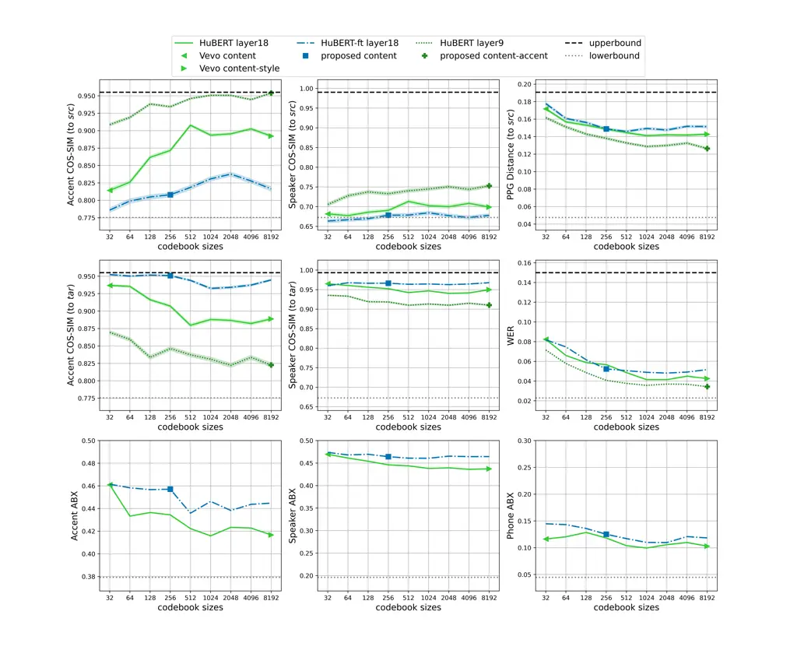

Zhong Wang Richmond Bell \definecolordarkgreenRGB0,100,0

# Rethinking Discrete Speech Representation Tokens for Accent Generation

Jinzuomu    Yi    Korin    Peter

###### Abstract

Discrete Speech Representation Tokens (DSRTs) have become a foundational
component in speech generation. While prior work has extensively studied
phonetic and speaker information in DSRTs, how accent information is
encoded in DSRTs remains largely unexplored. In this paper, we present
the first systematic investigation of accent information in DSRTs. We
propose a unified evaluation framework that measures both accessibility
of accent information via a novel Accent ABX task and recoverability via
cross-accent Voice Conversion (VC) resynthesis. Using this framework, we
analyse DSRTs derived from several widely used speech representations.
Our results reveal that: (1) choice of layers has the most significant
impact on retaining accent information, (2) accent information is
substantially reduced by ASR supervision; (3) naive codebook size
reduction cannot effectively disentangle accent from phonetic and
speaker information.

###### keywords

accent, discrete speech representation, voice conversion, accent
conversion

^(†)^(†)address: ¹ Centre for Speech Technology Research, University of
Edinburgh, UK ^(†)^(†)email: jinzuomu.zhong@ed.ac.uk, wang.yi@ed.ac.uk,
korin.richmond@ed.ac.uk, peter.bell@ed.ac.uk

## 1 Introduction

Inspired by the tokenisation schemes employed by text-based Large
Language Models (LLMs), discrete speech tokenisation has emerged as an
active research area for bridging speech and LLMs. By compressing speech
signals or learned continuous representations into a finite set of
discrete units, discrete speech tokens enable efficient storage of
complex acoustic information while remaining inherently compatible with
LLM architectures. As a result, they are rapidly becoming established as
a foundational representation across a wide range of speech tasks \[1\].

Directly compressing raw speech signals, however, tends to produce a
representation that preserves abundant low-level acoustic detail, making
phonetic content difficult to access. Such an approach works well for
waveform reconstruction, but places a heavier modelling burden on
downstream speech generation tasks \[2\]. To address this, discrete
speech representation tokens (DSRTs), which are quantised from speech
representations, are often used. DSRTs have seen huge success in various
speech generation tasks, including Speech Language Models (SpeechLMs)
\[3\], Zero-Shot Text-to-Speech (ZS-TTS) \[4\], Speech-to-Speech
Translation (S2ST) \[5\] and full-duplex dialogue systems \[6\].

Despite the significant progress brought by DSRTs, the representation of
a speaker’s accent is largely overlooked in the design, evaluation, and
application of the tokens. Prior user perception studies have
demonstrated a similarity–attraction effect, whereby listeners prefer
accents similar to their own in spoken interaction \[7\]. Unfortunately,
ZS-TTS systems are shown to hallucinate accents that differ from those
of the reference speakers \[8\], while spoken dialogue systems still
lack broad adoption of benchmarks or evaluation settings that consider
appropriate, accent-controlled speech generation \[9\].

Although some recent ZS-TTS systems have demonstrated some ability to
mimic or control the accent of generated speech using DSRTs, how much
accent information is encoded in these tokens remains unexplored \[10,
11, 2\]. Existing claims – such as that naive codebook size adjustment
\[11\] or ASR supervision \[10\] can facilitate accent control and
generation – lack systematic investigation. Crucially, the accent
information actually preserved in these DSRTs remains unquantified,
leaving it unclear whether the observed accent generation capabilities
in ZS-TTS stem from the representations themselves or are merely a
byproduct of large-scale pretraining. To this end, we ask the following
research questions: (1) How do different design choices in DSRTs
influence the amount of accent information they encode? (2) How can
these insights be leveraged to enable more controllable accent
generation, e.g. in voice conversion (VC)?

To answer the research questions, we propose a framework for evaluating
DSRTs from both the recoverability and accessibility perspectives, in
terms of accent, speaker, and phonetic information encoded. Existing
DSRT evaluation frameworks focus on phonetic and speaker information and
rarely consider accent \[12\]. To the best of our knowledge, this is the
first work to incorporate accent in evaluating DSRTs, and to apply ABX
to the study of accent. Specifically, we extend the existing
investigation of accessibility to accent information, with a novel
accent ABX method that evaluates the discriminability of representations
for words uttered in different accents. Additionally, we propose to
evaluate the recoverability of accent, speaker, and phonetic information
by cross-accent VC, resynthesising with DSRTs from source speakers and
speaker IDs from target speakers of different accents as input.

Using this proposed framework, we observe the following key findings:
(1) Accent information is most prominent in mid-early layers of HuBERT,
different from speaker or phonetic information distribution. (2) Naive
adjustment of codebook sizes provides only very limited disentanglement
of accent, speaker and content information. (3) Predominant design of
DSRTs for speech generation (quantising a later layer in a speech
representation model, or using ASR supervision) discards most accent
information. These findings challenge existing claims using naive
codebook size adjustment \[11\] or ASR supervision \[10\] for accent
control and generation.

Finally, based on our findings, we propose DSRT design choices that are
appropriate for both accent-preserving VC – preserving source speaker
accent, and accent-adaptive VC – adapting to target speaker accent. Both
objective and subjective evaluation show superior performance to
existing approaches. We will release links to code and demo in the final
version.

## 2 Related Work

### 2.1 Discrete Speech Tokens

Discrete speech tokens can be largely categorised into two groups:
semantic tokens¹¹ 1 A severe misnomer as these tokens contain primarily
phonetic information and little semantic information \[13, 14\]. and
acoustic tokens. We refer to semantic tokens as Discrete Speech
Representation Tokens (DSRTs) here, naming them strictly by how these
tokens are designed and trained, rather than what information some
researchers assume them to possess. DSRTs are tokens obtained by
quantising learned speech representations, such as HuBERT \[15\] and
w2v-BERT \[16\]; while acoustic tokens are obtained by directly
quantising waveforms. Common quantisation techniques include k-means,
Vector Quantisation (VQ) \[17\], Residual Vector Quantisation (RVQ)
\[18\], and Finite-State Quantisation (FSQ) \[19\], with k-means, VQ,
and FSQ primarily used for DSRTs, VQ and RVQ primarily used for acoustic
tokens.

### 2.2 Investigation of Speech Representations

In terms of of continuous speech representations, most previous work has
focused on accessibility, finding that phonetic information peaks in
intermediate layers, while acoustic information dominates earlier layers
\[14, 20\]. After finetuning on the ASR task, it has been observed
deeper layers become dominated by task-specific information, exhibiting
higher phonetic discrimination.

In the investigation of DSRTs, Wells et al. \[13\] find that DSRTs
obtained by k-means on hubert-base-ls960 correspond to sub-phonetic
events. Yeh et al. \[21\], using their information completeness and
accessibility framework, found that DSRTs obtained from
hubert-base-ls960 layer 4 contain more accessible pitch and speaker
information, but less accessible phone information, than layer 9.
Phonetic and speaker information in both layers consistently decrease
with lower bitrates of RVQ codes, refuting claims that content and
speaker disentanglement can be achieved by VQ.

### 2.3 DSRTs in ZS-TTS and SpeechLMs

In ZS-TTS, researchers found that DSRTs provide more accessible phonetic
information than acoustic tokens do, while suffering information loss
such as timbre and acoustic environment \[2\]. Motivated by such
findings, many state-of-the-art (SOTA) models utilise a hierarchical
approach, first predicting DSRTs from text or source speech and then
predicting acoustic tokens from DSRTs \[10, 22, 2, 11\]. In SpeechLMs,
researchers seek to combine DSRTs with acoustic tokens for both
accessible and complete/recoverable information, such as SpeechTokenizer
\[23\] and Mimi tokeniser \[24\].

When designing such DSRTs, ZS-TTS researchers have introduced some
claims that are either unverified or contradicted by speech
representation investigations. Vevo \[11\] chooses layer 18 of
hubert-large-ll60k and claims that reducing the codebook size in VQ
leads to natural disentanglement of speaker, style (accent and emotion
by their definition) and content, with a codebook size of 32 containing
only content, and a codebook size of 8,192 containing only content and
style. This claim not only contradicts the findings in \[21\] that VQ or
k-means with 1024 codebook size still retain significant speaker
information, but also lacks verification in terms of accent and emotion.
CosyVoice \[10\] proposes to use “supervised semantic token”, obtained
by injecting FSQ in an internal ASR model encoder, for content
consistency in the generated speech; how ASR pretraining affects accent
information in discrete tokens remains unclear.

### 2.4 Accent Control and Generation

Unfortunately, ZS-TTS speech generation systems suffer accent
hallucination, whereby they generate a hallucinated synthetic accent
that deviates from the reference or prompt speech \[8\]. Recent systems
that have been specially built for accent generation have not yet
utilised DSRTs along with powerful LLM architectures \[8, 25\]. General
ZS-TTS systems are reported to have certain accent control capabilities,
but there has been little or no investigation about accent information
in DSRTs. Understanding how accent information is encoded could help
build more inclusive ZS-TTS systems for diverse accents.

### 2.5 ABX Evaluation

The ABX error rate is a distance-based, model-agnostic evaluation
metric, assessing whether the representations pull data of the same
category (e.g. sample $`x=`$ \textipa\[bIt\], another sample $`a=`$
\textipa\[bIt\], of the same triphone category) closer and push
dissimilar data (e.g. $`x=`$ \textipa\[bIt\], $`b=`$ \textipa\[bi:t\])
farther in representational space.

Previous work introduced Minimal Pair ABX (MP-ABX) \[26\], where
instances differ only in a central phonetic unit while sharing the same
phonetic context. Prior studies \[2, 27, 11\] have used this metric to
assess the phonetic discriminability of DSRT tokens. In addition, ABX
has been extended to probe speaker-related information by defining
triplets that contrast speaker identity under controlled linguistic
content \[28\]. Nevertheless, to the best of our knowledge, no prior
work has systematically employed machine ABX to reveal accent
discriminability in speech representations or DSRTs.

## 3 Method

Figure 1: Proposed pipeline for evaluating the recoverability and
accessibility of accent, speaker, and phonetic information in various
Discrete Speech Representation Tokens (DSRTs).

Inspired by the perspective of separately measuring information
completeness and accessibility \[21\], we focus on evaluating DSRTs from
both aspects, but in the context of accent generation. Since
completeness cannot be measured by resynthesis, we introduce
recoverability as a task-grounded measure of how much accent, speaker,
and phonetic information encoded in DSRTs can be recovered in
resynthesised speech. Together with accessibility, we propose a pipeline
that evaluates DSRTs from both synthesis-facing and
representation-facing perspectives.

Figure 1 provides an overview of the proposed pipeline. First, we obtain
DSRTs from several commonly used speech representations using RepCodec
\[29\] with Vector Quantisation (VQ) \[17\] as the quantiser (see
Section 3.1). For each DSRT configuration, we then train a
unit-to-speech resynthesis model using HiFiGAN \[12\]. To assess
information recoverability, we infer unit-to-speech models with DSRTs
from a source speaker and speaker ID from a target speaker with a
different accent, thereby conducting cross-accent VC. The generated
speech is evaluated using a combination of objective metrics and
subjective listening tests (see Section 3.2). Finally, to assess
information accessibility, we directly probe the DSRTs using a range of
ABX setups (see Section 3.3).

### 3.1 Discrete Speech Representation Tokens

We choose three speech representation models to obtain Discrete Speech
Representation Tokens (DSRTs): HuBERT; HuBERT finetuned for ASR
(HuBERT-ft); and Whisper. We include HuBERT \[15\] as it provides the
most widely used speech representations in various speech tasks such as
SpeechLM and TTS \[1, 3\]. Recently, there has been a growing trend
toward using ASR-based speech representations for obtaining DSRTs.
Therefore, we include HuBERT-ft and Whisper \[30\] as two representative
ASR-based representations, with Encoder-only and Encoder-Decoder
architectures, respectively. All three speech representations
investigated, despite being at least three years old, are still widely
used in current speech LLMs, evidenced by their usage in speech
tokenisers of 19 systems \[3, Table 1\].

Following RepCodec \[29\], we use VQ-VAE \[17\] to discretise the speech
representations. The model consists of three modules: Encoder and
Decoder, which are both convolution layers with residual paths, and a
Vector Quantisation module that quantises latent representations from
Encoder output into a series of discrete tokens. The model is trained to
reconstruct the speech representation, with additional Exponential
Moving Average (EMA) optimisation to gradually update the codebook. For
model details, we refer readers to the original paper \[29\].

### 3.2 Cross-Accent Voice Conversion

After extracting DSRTs, we train a unit-to-speech HiFiGAN model for each
DSRT configuration, following \[12\]. In prior work, information
recoverability is typically evaluated using resynthesis or Voice
Conversion (VC) on General American English datasets, with evaluation
focusing primarily on intelligibility and speaker similarity, while
accent is largely ignored.

We train unit-to-speech models on data covering multiple accents to
assess the generalisability of DSRTs across accents. We then perform
cross-accent VC in inference, by conditioning the model on DSRTs from a
source speaker and a target speaker ID with a different accent.
Afterwards, during evaluation, following \[31\], we explicitly assess
accent, speaker, and phonetic similarity in the converted speech,
against ground truth reference clips. Utterance-level embeddings from
Accent Identification (AID) and Speaker Verification (SV) models are
used to calculate cosine similarity, which serves as a proxy for
perceived accent and speaker similarity. Phonetic Posteriorgrams (PPGs)
are extracted, aligned, and then used to calculate phonetic distances as
a proxy for perceived phonetic similarity, and to some degree,
intelligibility.

By analysing the similarity of the generated speech to the source and
target speech along these dimensions, we can determine whether accent
information is primarily derived from the source DSRTs or overridden by
the target speaker identity, thereby quantifying the amount of accent
information preserved in the DSRTs.

### 3.3 Accent, Speaker, and Phonetic ABX

We choose ABX as a model-free method to estimate the accessibility of
accent information, as well as phone and speaker information in DSRTs.
Table 1 lists the three different ABX conditions we use to evaluate
accent, speaker, and phonetic information accessibility.

|          |                    |                |                      |
| -------- | ------------------ | -------------- | -------------------- |
| ABX type | on $`(A=X\neq B)`$ | by $`(A=B=X)`$ | across $`(A\neq X)`$ |
| Accent   | accent             | word           | speaker              |
| Speaker  | speaker            | word, accent   | —                    |
| Phone    | phone              | context^(∗)    | speaker              |

Table 1: Different ABX conditions for selecting $`(a,b,x)`$ triplets to
evaluate accent, speaker, and phonetic information accessibility. ^(∗):
context refers to the previous and next phones.

When constructing $`(a,b,x)`$ triplets, a condition can be described as
ABX ON the category of interest, BY the category of controlled constant
among triplets, ACROSS the category of free variables among triplets.
The classic Phone ABX select triplets ON phone BY context, where 1)
$`x`$ and $`a`$ share the same phone, with $`b`$ of a different phone,
and 2) $`x`$, $`a`$, and $`b`$ share identical phonetic context, e.g.
bit \textipa\[bIt\] vs beat \textipa\[bi:t\]. To evaluate how prominent
phonetic information is, compared to other variables, such as speaker,
most Phone ABX would also be conditioned ACROSS speaker, with $`a`$,
$`b`$ coming from the same speaker, and $`x`$ from a different speaker,
e.g. $`x=`$ \textipa\[bIt\] by speaker₁, $`a=`$ \textipa\[bIt\] by
speaker₂, $`b=`$ \textipa\[bi:t\] by speaker₂.

In the proposed Accent ABX, instances $`a`$ and $`x`$ share the same
accent, while instance $`b`$ differs in accent. Triplets $`(a,b,x)`$ are
constructed to share identical lexical content rather than phonetic
context, as accent distinctions arise from accent-dependent realisations
of the same words or lexical units, which may involve different phone
sequences. We further require that $`a`$, $`b`$, and $`x`$ come from
different speakers to avoid trivial similarity between $`a`$ and $`x`$
due to shared speaker identity, e.g. a triplet $`(a,b,x)`$ comprosing
$`x=`$ “water” spoken by a Scottish speaker₁, $`a=`$ “water” by a
Scottish speaker₂, and $`b=`$ “water” by a Southern English speaker₃.

In practice, words uttered by different speakers differ due to both
accent-induced pronunciation variation and speaker-specific
pronunciation patterns. While standard ABX aggregates scores over all
valid triplets, we adopt a word selection scheme to improve the
sensitivity of Accent ABX. We first select the 100 most frequent words
in the training data, compute ABX scores for each (accent $`A`$, accent
$`B`$, word) combination, and retain the 10% with the lowest scores as
the most accent-discriminative. The choice of most frequent words is to
ensure there are enough triplets to sample from in Accent ABX, while the
selection of most accent-discriminative combinations is to avoid
conducting Accent ABX on words that are pronounced similarly in two
distinct accents. The combination selection is performed using
continuous features from GenAID \[8\], a supervised Accent
Identification (AID) model finetuned from XLSR \[32\], to ensure
effective word selection and a fair comparison among DSRTs.

|                 |          |                 |
| --------------- | -------- | --------------- |
| Accent A        | Word     | Accent B        |
| SouthernEnglish | first    | Scottish        |
| NorthernEnglish | first    | Scottish        |
| SouthernEnglish | Scottish | Irish           |
| SouthernEnglish | however  | Scottish        |
| SouthernEnglish | work     | Scottish        |
| NorthernEnglish | however  | Scottish        |
| Irish           | last     | Scottish        |
| Scottish        | Scottish | Irish           |
| NorthernEnglish | Scottish | Irish           |
| SouthernEnglish | work     | Irish           |
| NorthernEnglish | their    | Scottish        |
| SouthernEnglish | first    | Irish           |
| NorthernEnglish | however  | Irish           |
| SouthernEnglish | however  | Irish           |
| SouthernEnglish | their    | Scottish        |
| SouthernEnglish | never    | Scottish        |
| SouthernEnglish | year     | Scottish        |
| SouthernEnglish | next     | Irish           |
| SouthernEnglish | Mr.      | Scottish        |
| NorthernEnglish | year     | Scottish        |
| NorthernEnglish | other    | Irish           |
| SouthernEnglish | other    | Irish           |
| Scottish        | first    | SouthernEnglish |
| SouthernEnglish | from     | Irish           |
| Scottish        | first    | NorthernEnglish |

Table 2: Samples of most accent-discriminative (Accent $`A`$, Accent
$`B`$, Word) combinations selected, for Accent ABX.

Table 2 shows the first 25 selected combinations as an example. The
table reveals a few well-established phonetic dimensions that underlie
accent differences, successfully captured by our data-driven selection
scheme. First, rhoticity emerges as a dominant cue. Words such as
_first_ and _work_ sharply distinguish Southern or Northern English from
Scottish and Irish accents, reflecting the systematic presence of
post-vocalic \[r\] in Scottish and Irish English and its absence in
Southern English. The table shows that our metric takes good advantage
of using rhoticity difference. Second, differences in vowel quality,
particularly in stressed lexical vowels, play a central role. For
instance, _first_ and _year_ involve the near-front vowel spaces, which
are realised as long centralised vowels in Southern English but shift
toward more open or fronted realisations in Scottish and Irish English.
Third, consonantal realisation, especially of \[t\], contributes
substantially to discrimination. Words such as _scottish_ and _last_
contain environments where Scottish English strongly favours glottal or
lenited realisations of \[t\], in contrast to the more alveolar
realisations found in Southern and Irish English. Finally, patterns of
vowel reduction and weak-form realisation further differentiate accents.
Function words such as _however_, _other_, and _from_ show strong schwa
reduction in Southern English, whereas Irish and Scottish English tend
to preserve fuller vowel qualities. These differences in reduction
strategies, particularly in unstressed positions, amplify accent
contrasts and explain why relevant accent-word combinations are picked
in the table.

## 4 Experiments

### 4.1 Obtaining DSRTs

We extract continuous speech representations from various layers of
HuBERT²² 2
[https://huggingface.co/facebook/hubert-large-ll60k](https://huggingface.co/facebook/hubert-large-ll60k),
HuBERT-ft³³ 3
[https://huggingface.co/facebook/hubert-large-ls960-ft](https://huggingface.co/facebook/hubert-large-ls960-ft)
and Whisper⁴⁴ 4
[https://huggingface.co/openai/whisper-medium.en](https://huggingface.co/openai/whisper-medium.en).
All three speech representation models share the same Encoder
architecture (24 Transformer layers) and are trained on English-only
data. Here, we focus on investigating how layer choice and ASR
pretraining affect the information encoded in speech representations,
and leave the investigation of how multilingual pretraining or
larger-scale pretraining data/model to future work.

The extracted representations are then discretised using RepCodec⁵⁵ 5
[https://github.com/mct10/RepCodec](https://github.com/mct10/RepCodec),
which we train on the train-clean-100 subset of LibriSpeech⁶⁶ 6
[https://www.openslr.org/12](https://www.openslr.org/12), similar to
\[11, 29\], with various codebook sizes. This subset contains 100 hours
of speech with ”accents closer to US English” \[33\]. RepCodec is
trained for 200,000 steps with the same hyperparameters in \[29\].

### 4.2 Evaluation Dataset

To evaluate information recoverability and accessibility with respect to
accent, we use the VCTK corpus⁷⁷ 7
[https://datashare.ed.ac.uk/handle/10283/3443](https://datashare.ed.ac.uk/handle/10283/3443),
which provides relatively broad coverage of native English accents.
Based on the provided country labels and detailed region descriptions,
we manually group speakers into 13 accent regions, as some coarse
country-level labels (e.g. “US”, “England”) conflate multiple distinct
regional accent varieties.

We withhold 3–4 speakers from each accent region (50 speakers in total,
with balanced gender and accent distribution) for testing. For the
remaining speakers, we use 4 accent regions that have sufficient
speakers (45 speakers in total) for training unit-to-speech HiFiGAN in
Section 3.2 and for selecting accent-discriminative words in
Section 3.3. Out of the 13 accent regions, 4 are seen in HiFiGAN
training and Accent ABX word selection, 5 are likely seen by RepCodec in
LibriSpeech given they are North American accents, and the remaining 4
are unseen at any stage, allowing for analysis on the generalisability
of DSRTs across accents.

### 4.3 Evaluating Information Recoverability

To evaluate information recoverability, we train unit-to-speech HiFiGAN
models⁸⁸ 8
[https://github.com/facebookresearch/speech-resynthesis](https://github.com/facebookresearch/speech-resynthesis)
for 100,000 steps with the same hyperparameters as in \[12\], using 4
accent regions (45 speakers), as described in Section 4.2. During
inference, we perform cross-accent VC using source (src) DSRTs from 12
accent regions (46 speakers, excluding Southern English), together with
speaker IDs from 4 Southern English speakers as target (tgt) voices. We
fix the target voices to one accent region to control for target-side
accent variability, enabling a clearer analysis of how accent
information is preserved in the source DSRTs.

For objective evaluation of the converted speech, we adopt metrics
recommended by \[31\]. (1) Accent similarity: We calculate cosine
similarity of accent embeddings (Accent COS-SIM or A-SIM) extracted from
GenAID⁹⁹ 9
[https://github.com/jzmzhong/GenAID](https://github.com/jzmzhong/GenAID)
\[8\]. GenAID is trained with explicit speaker-accent disentanglement,
preserving little speaker information in the extracted accent
embeddings. (2) Speaker similarity: We calculate cosine similarity of
speaker embeddings (Speaker COS-SIM or S-SIM) extracted from WavLM¹⁰¹⁰
10
[https://huggingface.co/microsoft/wavlm-base-plus-sv](https://huggingface.co/microsoft/wavlm-base-plus-sv)
\[34\]. These speaker embeddings encode some accent information,
evidenced by improved performance in AID when transfer learned from SV
models \[35\]. (3) Phonetic similarity: We calculate Jensen-Shannon
distance between aligned PPGs¹¹¹¹ 11
[https://github.com/interactiveaudiolab/ppgs](https://github.com/interactiveaudiolab/ppgs)
(PPG Distance), extracted from a phone recognition model \[36\]. It is
worth noting that PPG distance, primarily designed for pronunciation
distance, is sensitive to accent information, as accent can be
characterised partially as different realisations of the same phoneme.
(4) Intelligibility: We calculate Word Error Rate (WER) using
whisper-medium.en transcriptions, compared against ground-truth
transcriptions. Despite its evident accent bias \[37\], WER is included
here due to its broad adoption in previous DSRT evaluation frameworks to
reflect how DSRTs are commonly selected.

We use the first 24 utterances per speaker, which is an elicitation
paragraph shared across speakers, to calculate Accent COS-SIM, Speaker
COS-SIM, and PPG distance. In this way, we allow for similarity/distance
calculation to either source speech that provides DSRTs or target speech
that provides the speaker ID of the same content, removing the influence
of content on these metrics. As for WER, we randomly choose 24
utterances per speaker to cover diverse content.

For clearer visualisation, we annotate each metric with a practical
lower bound (chance-level performance) and a practical upper bound (best
possible performance), which anchor the visual scale and facilitate
interpretation of values. For Accent COS-SIM, PPG, and WER, the lower
bound measures the source speaker ground truth with respect to target
speaker ground truth, and the upper bound measures the source speaker
copy-synthesis with respect to source speaker ground truth. For Speaker
COS-SIM, the lower bound measures similarity between source speaker
ground truth and target speaker ground truth, while the upper bound
measures similarity between target speaker copy-synthesis and target
speaker ground truth.

Finally, we select several DSRTs to evaluate their performance in both
accent-preserving VC and accent-adaptive VC, respectively, and conduct
subjective listening tests on the converted speech. Three sets of
5-point Similarity MOS (SMOS) listening tests are conducted, with 15
listeners for each listening test, recruited on Prolific¹²¹² 12
[https://www.prolific.com/](https://www.prolific.com/) from the target
accent regions. To evaluate accent similarity between the generated
speech and the source speech (Accent SMOS (src)) in accent-preserving
VC, we randomly sample 20 utterances per selected DSRT, with speaker
pairs drawn randomly from all 44 possible pairs (mapping from 11
American Midwest, Scottish, and Oceanian speakers to 4 Southern English
speakers, covering both seen and unseen source accents). This results in
300 ratings per system per source accent region. To evaluate accent
similarity between the generated speech and the target accent reference
clip (Accent SMOS (tgt)) in accent-adaptive VC, we randomly sample 30
utterances per selected DSRT, again using random speaker pairs from the
same 44 possible mappings. This results in 450 ratings per system. To
evaluate speaker similarity between the generated speech and the target
speaker reference clip (Speaker SMOS (tgt)) in both accent-preserving
and accent-adaptive VC, we randomly sample 15 utterances per selected
DSRT from the same pool of 44 speaker pairs, yielding 225 ratings per
system.

### 4.4 Evaluating Information Accessibility

Information accessibility is evaluated only on the accents seen during
HiFiGAN training, ensuring sufficient numbers of speakers for each
accent. As described in Section 3.3, a training set is required to
select high-frequency words and accent-discriminative combinations,
while a separate test set is used for ABX evaluation to prevent speaker
leakage. Accents outside the four seen accents contain no more than four
speakers each, severely limiting the number of valid ABX triplets.

We follow the same training–test partition as in HiFiGAN experiments for
simplicity. Accent ABX is conducted using this partition, whereas phone
and speaker ABX are computed only on the test split, as they do not
require a training phase. Test experiments used all utterances in the
split, except for the first 24 utterances to avoid identical sentences
across all train and test speakers, which could bias the ABX scores
toward lexical-context matching instead of reflecting true accent or
speaker discrimination. Phone-level alignment (phone boundaries and
labels) required by phone ABX, were obtained through the Montreal Forced
Aligner with the English ARPABET dictionary \[38, 39\].

We treat the accent ABX score computed on HuBERT layer 6 continuous
features as an upper bound, as this layer exhibits the strongest
accent-related information. Similarly, we use the phonetic and speaker
ABX scores computed on HuBERT-ft layers 3 and 9 continuous features as
upper bounds, respectively, since these layers demonstrate the highest
phonetic and speaker recoverability in Section 5. In addition, we
evaluate the accent ABX error rate of the accent-discriminative GenAID
features, which achieves a low error rate of 9.87%, validating the
effectiveness of the proposed metric.

(a) Cross-accent VC evaluation results for information recoverability.

(b) ABX evaluation results for information accessibility.

Figure 2: Accent, speaker, and phonetic information in DSRTs obtained
across different layers and continuous speech representations.  
All codebook sizes and code dimensions are set to 1024 for fair
comparison.

(a) Cross-accent VC evaluation results for information recoverability.

(b) ABX evaluation results for information accessibility.

Figure 3: Accent, speaker, and phonetic information in different DSRTs
across codebook sizes.

## 5 Results

### 5.1 Layer Choice Matters for Accent

Layer choice has a prominent impact on the recoverability and
accessibility of information in HuBERT DSRTs, shown in Figure 2 (dark
green curve). Notably, accent, speaker and phonetic information are
distributed differently across layers. (1) Accent information
recoverability, reflected by Accent COS-SIM w.r.t. source speaker, is
most prominent in mid–early HuBERT layers (L6 & L9), and decreases in
earlier or latter layers, indicating that accent cues emerge after
low-level acoustic processing but are progressively abstracted away in
higher layers. (2) Speaker information is most recoverable in early
HuBERT layers (L3), indicated by Speaker COS-SIM to the source speaker,
and decreases monotonically with depth. Overall, speaker information is
limited, as cross-accent VC aims to generate voice similar to that of
the target speaker with speaker ID conditioning. (3) Phonetic
information, measured by PPG Distance to the source speech, is most
complete in middle layers (L9 & L12). Both earlier and later layers show
reduced phonetic completeness, reflecting a trade-off between raw
acoustic detail and higher-level abstraction. (4) Information
accessibility, measured by ABX error rates (see Figure 2(b)), reveals
weak accent accessibility for HuBERT across layers, despite clear
inter-layer variations. Accent accessibility peaks at L12, which differs
from the recoverability peak at L6 or L9. This discrepancy highlights
the necessity of resynthesis-based recoverability evaluation when
assessing DSRTs for accent generation: while ABX accessibility captures
relative trends, it cannot reliably identify optimal layers for
synthesis.

### 5.2 ASR Supervision Removes Accent Information

ASR supervision reduces the recoverability and accessibility of accent
information in DSRTs across layers, shown in Figure 2 (blue curve for
HuBERT-ft, orange curve for Whisper). (1) HuBERT consistently shows
higher accent recoverability and accessibility than HuBERT-ft or
Whisper, particularly in latter layers, which are more affected by ASR
supervision. (2) Whisper exhibits a peak in accent and phonetic
information at intermediate layers (L12 & L15), different from the
distribution of information in HuBERT or HuBERT-ft.

[TABLE]

Table 3: Objective evaluation of proposed content and content-accent
tokens, compared with content and content-style tokens from Vevo \[11\].
Differences in DSRT design choices are marked in red, with best
performances marked in bold.  
$`*`$: For content tokens, we want little accent information recovered
from DSRTs, i.e. low A-SIM (src) and high A-SIM (tar). For
content-accent or content-style tokens, we want the opposite.

|                         |                               |           |           |                                |
| ----------------------- | ----------------------------- | --------- | --------- | ------------------------------ |
| Accent-preserving VC    | Accent SMOS (src)$`\uparrow`$ |           |           | Speaker SMOS (tgt)$`\uparrow`$ |
|                         | American Midwest              | Oceanian  | Scottish  |                                |
| Vevo content-style      | 2.39±0.15                     | 2.81±0.15 | 3.16±0.14 | 3.18±0.17                      |
| Proposed content-accent | 3.61±0.14                     | 3.39±0.14 | 3.59±0.13 | 2.65±0.18                      |
| Accent-adaptive VC      | Accent SMOS (tgt)$`\uparrow`$ |           |           | Speaker SMOS (tgt)$`\uparrow`$ |
|                         | Southern English              |           |           |                                |
| Vevo content            | 2.82±0.12                     |           |           | 3.40±0.17                      |
| Proposed content        | 3.15±0.12                     |           |           | 3.60±0.16                      |

Table 4: Subjective evaluation of proposed content and content-accent
tokens, compared with content and content-style tokens from Vevo \[11\],
with best performances marked in bold. 95% confidence intervals are
reported.

### 5.3 Reducing Codebook Size Provides Limited Disentanglement

We then vary codebook sizes for three selected layers: HuBERT L18 (a
common choice, as in Vevo \[11\]), HuBERT-ft L18 (a layer with little
accent information while retaining high phonetic information), and
HuBERT L9 (a layer with most accent information), shown in Figure 3. (1)
Focusing on accent recoverability, varying codebook sizes has a markedly
smaller effect than changing representation models or layers. For each
layer, increasing codebook sizes from 32 to 2048 consistently improves
accent and phonetic recoverability across all inspected DSRTs. However,
the recoverability gap induced by codebook sizes variation within a
layer is substantially smaller than that induced by changing layers at a
fixed codebook sizes. (2) Speaker and phonetic recoverability also
increase with larger codebook sizes. Taking HuBERT DSRTs as an example,
Accent COS-SIM drops sharply as codebook sizes decreases from 1024 to
32, while PPG distance also rises 20.4%. Despite speaker identity being
partially suppressed by the injected speaker ID during resynthesis,
speaker recoverability also declines. The parallel degradation across
accent, speaker, and phonetic metrics suggests minimal disentanglement
when reducing codebook size. The VQ bottleneck acts more as a lossy
compressor for all information rather than a filter for specific
features.

### 5.4 Limitations of Commonly Used DSRTs in Speech Generation

Based on the above findings, we highlight the limitations of commonly
used DSRTs here. (1) Vevo’s choice of using DSTRs based on HuBERT L18
with codebook size 32 as content tokens and codebook size 8,192 as
content-style tokens \[11\] is suboptimal. Significant accent
information is likely already lost and unrecoverable in HuBERT L18 -
leading to insufficient accent information encoded in content-style
tokens. Since naive reduction of codebook size cannot remove accent
without harming phonetic information, content tokens achieve little
accent information at the cost of intelligibility in resynthesised
speech. (2) ASR-supervised DSRTs, adopted by \[10\], exhibit lower peak
accent and phonetic recoverability than HuBERT DSRTs. Similar to
content-style tokens, ASR-supervised DSRTs cannot encode accent
sufficiently.

### 5.5 Proposed Content and Content-Accent Tokens

To enable better accent generation and control, we propose
content-accent and content tokens for accent-preserving and
accent-adaptive VC, respectively. A comparison between the proposed
tokens and the tokens used in Vevo, together with the objective
evaluation metrics, is presented in Table 3. The listening test results
are reported in Table 4, which further validate the objective findings.

Overall, the proposed content and content-accent tokens outperform
Vevo’s content and content-style tokens across most metrics,
particularly in generating the desired accent while maintaining high
content consistency and intelligibility. These results suggest improved
disentanglement between accent and content. However, while the proposed
content tokens achieve high speaker similarity to the target speaker in
accent-adaptive VC, the proposed content-accent tokens perform worse in
accent-preserving VC. This indicates that accent information remains
partially entangled with speaker characteristics in the content-accent
tokens.

The lower speaker similarity observed for content-accent tokens may also
be influenced by speaker–accent entanglement in both objective and
subjective evaluations. As discussed in Section 4.3, the speaker
embeddings used in the system encode some accent information.
Consequently, when the generated speech more closely matches the source
speaker’s accent, the measured similarity to the target speaker may
decrease. A similar phenomenon may occur in the subjective evaluation.
Although listeners were instructed to ignore accent when rating speaker
similarity, accent differences may still influence perceived speaker
identity, as listeners often associate distinct accents with different
speakers. This raises the broader question of whether accent and speaker
characteristics can be fully disentangled in practice, particularly
given that training data rarely contains the same speaker producing
multiple accents. Additional supervision, such as explicit accent and
speaker classification, may be required to further disentangle these
factors.

## 6 Discussion

We observed a systematic delay of the optimal accessible layer relative
to the recoverability peak. As discussed in \[21\], earlier layers
retain more complete acoustic information that can be effectively
extracted by a strong HiFiGAN vocoder, whereas later layers gain
phonetic discriminability from ASR-related objectives,

Across both metrics, accent information follows a distinct yet
intermediate trend between phonetic and speaker information. This aligns
with linguistic intuition: accent is partially realised through
systematic phonetic variation and partially through speaker-specific
pronunciation patterns.

Layer selection enables accent control precisely because accent,
speaker, and phonetic information are distributed differently across
layers. Consequently, a single ”style layer”, as suggested by the
content–style token design in Vevo, is insufficient to jointly capture
multiple speech attributes such as content, accent, and emotion. A more
thorough investigation of more speech attributes, and how their
information are represented across multiple layers and representations,
is therefore necessary to support better controllable speech generation.

Finally, our findings provide potential explanations for the
hallucinated accents by ZS-TTS systems \[8\]. Many ZS-TTS systems rely
on representations (often deep or supervised layers) where accent
recoverability is already attenuated, encouraging the model to guess
accent patterns in inference or default to mainstream accents in
training data.

## 7 Conclusion

In this work, we propose a framework for evaluating discrete speech
representation tokens (DSRTs) from both recoverability and accessibility
perspectives, in terms of accent, speaker, and phonetic information
encoded, with a focus on providing guidance for accent generation and
control. Based on the results using this framework on HuBERT- and
Whipser-based DSRTs, we propose content and content-accent tokens,
achieving more controllable accent in voice conversion (VC) than
existing works.

## 8 Acknowledgments

\[DEDACTED\]

## 9 Generative AI Use Disclosure

During the preparation of this manuscript, the authors used ChatGPT
(version 5.2 and 5.3) for language editing and readability improvement.
The authors subsequently reviewed and revised the manuscript and take
full responsibility for the final content.

## References

- \[1\] Y. Guo, Z. Li, H. Wang, B. Li, C. Shao, H. Zhang, C. Du, X.
  Chen, S. Liu, and K. Yu (2025) Recent Advances in Discrete Speech
  Tokens: A Review. arXiv preprint arXiv:2502.06490. Cited by: §1, §3.1.
- \[2\] Y. Wang, H. Zhan, L. Liu, R. Zeng, H. Guo, J. Zheng, Q.
  Zhang, X. Zhang, S. Zhang, and Z. Wu (2025) MaskGCT: Zero-Shot
  Text-to-Speech with Masked Generative Codec Transformer. In The
  Thirteenth International Conference on Learning Representations,
  External Links: [Link](https://openreview.net/forum?id=ExuBFYtCQU)
  Cited by: §1, §1, §2.3, §2.5.
- \[3\] W. Cui, D. Yu, X. Jiao, Z. Meng, G. Zhang, Q. Wang, S. Y. Guo,
  and I. King (2025) Recent Advances in Speech Language Models: A
  Survey. In Proceedings of the 63rd Annual Meeting of the Association
  for Computational Linguistics (Volume 1: Long Papers), W. Che, J.
  Nabende, E. Shutova, and M. T. Pilehvar (Eds.), Vienna, Austria,
  pp. 13943–13970. External Links:
  [Link](https://aclanthology.org/2025.acl-long.682/),
  [Document](https://dx.doi.org/10.18653/v1/2025.acl-long.682), ISBN
  979-8-89176-251-0 Cited by: §1, §3.1.
- \[4\] E. Kharitonov, D. Vincent, Z. Borsos, R. Marinier, S. Girgin, O.
  Pietquin, M. Sharifi, M. Tagliasacchi, and N. Zeghidour (2023) Speak,
  Read and Prompt: High-Fidelity Text-to-Speech with Minimal
  Supervision. Transactions of the Association for Computational
  Linguistics 11, pp. 1703–1718. External Links:
  [Link](https://aclanthology.org/2023.tacl-1.95/),
  [Document](https://dx.doi.org/10.1162/tacl%5Fa%5F00618) Cited by: §1.
- \[5\] A. Lee, P. Chen, C. Wang, J. Gu, S. Popuri, X. Ma, A. Polyak, Y.
  Adi, Q. He, Y. Tang, J. Pino, and W. Hsu (2022) Direct
  Speech-to-Speech Translation With Discrete Units. In Proceedings of
  the 60th Annual Meeting of the Association for Computational
  Linguistics (Volume 1: Long Papers), S. Muresan, P. Nakov, and A.
  Villavicencio (Eds.), Dublin, Ireland, pp. 3327–3339. External Links:
  [Link](https://aclanthology.org/2022.acl-long.235/),
  [Document](https://dx.doi.org/10.18653/v1/2022.acl-long.235) Cited by:
  §1.
- \[6\] T. A. Nguyen, E. Kharitonov, J. Copet, Y. Adi, W. Hsu, A.
  Elkahky, P. Tomasello, R. Algayres, B. Sagot, A. Mohamed, and E.
  Dupoux (2023) Generative spoken dialogue language modeling.
  Transactions of the Association for Computational Linguistics 11,
  pp. 250–266. External Links:
  [Link](https://aclanthology.org/2023.tacl-1.15/),
  [Document](https://dx.doi.org/10.1162/tacl%5Fa%5F00545) Cited by: §1.
- \[7\] N. Dahlbäck, Q. Wang, C. Nass, and J. Alwin (2007) Similarity is
  more important than expertise: accent effects in speech interfaces. In
  Proceedings of the SIGCHI Conference on Human Factors in Computing
  Systems, CHI ’07, New York, NY, USA, pp. 1553–1556. External Links:
  ISBN 9781595935939, [Link](https://doi.org/10.1145/1240624.1240859),
  [Document](https://dx.doi.org/10.1145/1240624.1240859) Cited by: §1.
- \[8\] J. Zhong, K. Richmond, Z. Su, and S. Sun (2025) AccentBox:
  towards high-fidelity zero-shot accent generation. In 2025 IEEE
  International Conference on Acoustics, Speech and Signal Processing
  (ICASSP), Vol. , pp. 1–5. External Links:
  [Document](https://dx.doi.org/10.1109/ICASSP49660.2025.10888332) Cited
  by: §1, §2.4, §3.3, §4.3, §6.
- \[9\] X. Cheng, R. Hu, X. Yang, J. Lu, D. Fu, Z. Wang, S. Ji, R.
  Huang, B. Zhang, T. Jin, and Z. Zhao (2025) VoxDialogue: Can Spoken
  Dialogue Systems Understand Information Beyond Words?. In The
  Thirteenth International Conference on Learning Representations,
  External Links: [Link](https://openreview.net/forum?id=vbmSSIhKAM)
  Cited by: §1.
- \[10\] Z. Du, Q. Chen, S. Zhang, K. Hu, H. Lu, Y. Yang, H. Hu, S.
  Zheng, Y. Gu, Z. Ma, et al. (2024) CosyVoice: A Scalable Multilingual
  Zero-shot Text-to-speech Synthesizer based on Supervised Semantic
  Tokens. arXiv preprint arXiv:2407.05407. Cited by: §1, §1, §2.3, §2.3,
  §5.4.
- \[11\] X. Zhang, X. Zhang, K. Peng, Z. Tang, V. Manohar, Y. Liu, J.
  Hwang, D. Li, Y. Wang, J. Chan, Y. Huang, Z. Wu, and M. Ma (2025)
  Vevo: Controllable Zero-Shot Voice Imitation with Self-Supervised
  Disentanglement. In The Thirteenth International Conference on
  Learning Representations, External Links:
  [Link](https://openreview.net/forum?id=anQDiQZhDP) Cited by: §1, §1,
  §2.3, §2.3, §2.5, §4.1, §5.3, §5.4, Table 3, Table 3, Table 4, Table 4.
- \[12\] A. Polyak, Y. Adi, J. Copet, E. Kharitonov, K. Lakhotia, W.
  Hsu, A. Mohamed, and E. Dupoux (2021) Speech Resynthesis from Discrete
  Disentangled Self-Supervised Representations. In Interspeech 2021,
  pp. 3615–3619. External Links:
  [Document](https://dx.doi.org/10.21437/Interspeech.2021-475), ISSN
  2958-1796 Cited by: §1, §3.2, §3, §4.3.
- \[13\] D. Wells, H. Tang, and K. Richmond (2022) Phonetic Analysis of
  Self-supervised Representations of English Speech. In Interspeech
  2022, pp. 3583–3587. External Links:
  [Document](https://dx.doi.org/10.21437/Interspeech.2022-10884), ISSN
  2958-1796 Cited by: §2.2, footnote 1.
- \[14\] K. Choi, A. Pasad, T. Nakamura, S. Fukayama, K. Livescu, and S.
  Watanabe (2024) Self-Supervised Speech Representations are More
  Phonetic than Semantic. In Interspeech 2024, pp. 4578–4582. External
  Links: [Document](https://dx.doi.org/10.21437/Interspeech.2024-1157),
  ISSN 2958-1796 Cited by: §2.2, footnote 1.
- \[15\] W. Hsu, B. Bolte, Y. H. Tsai, K. Lakhotia, R. Salakhutdinov,
  and A. Mohamed (2021) HuBERT: Self-Supervised Speech Representation
  Learning by Masked Prediction of Hidden Units. IEEE/ACM Trans. Audio,
  Speech and Lang. Proc. 29, pp. 3451–3460. External Links: ISSN
  2329-9290, [Link](https://doi.org/10.1109/TASLP.2021.3122291),
  [Document](https://dx.doi.org/10.1109/TASLP.2021.3122291) Cited by:
  §2.1, §3.1.
- \[16\] Y. Chung, Y. Zhang, W. Han, C. Chiu, J. Qin, R. Pang, and Y.
  Wu (2021) w2v-BERT: Combining Contrastive Learning and Masked Language
  Modeling for Self-Supervised Speech Pre-Training. In 2021 IEEE
  Automatic Speech Recognition and Understanding Workshop (ASRU), Vol. ,
  pp. 244–250. External Links:
  [Document](https://dx.doi.org/10.1109/ASRU51503.2021.9688253) Cited
  by: §2.1.
- \[17\] A. van den Oord, O. Vinyals, and K. Kavukcuoglu (2017) Neural
  Discrete Representation Learning. In Proceedings of the 31st
  International Conference on Neural Information Processing Systems,
  NIPS’17, Red Hook, NY, USA, pp. 6309–6318. External Links: ISBN
  9781510860964 Cited by: §2.1, §3.1, §3.
- \[18\] N. Zeghidour, A. Luebs, A. Omran, J. Skoglund, and M.
  Tagliasacchi (2021) SoundStream: An End-to-End Neural Audio Codec.
  IEEE/ACM Trans. Audio, Speech and Lang. Proc. 30, pp. 495–507.
  External Links: ISSN 2329-9290,
  [Link](https://doi.org/10.1109/TASLP.2021.3129994),
  [Document](https://dx.doi.org/10.1109/TASLP.2021.3129994) Cited by:
  §2.1.
- \[19\] F. Mentzer, D. Minnen, E. Agustsson, and M. Tschannen (2024)
  Finite Scalar Quantization: VQ-VAE Made Simple. In The Twelfth
  International Conference on Learning Representations, External Links:
  [Link](https://openreview.net/forum?id=8ishA3LxN8) Cited by: §2.1.
- \[20\] A. Pasad, J. Chou, and K. Livescu (2021) Layer-Wise Analysis of
  a Self-Supervised Speech Representation Model. In 2021 IEEE Automatic
  Speech Recognition and Understanding Workshop (ASRU), Vol. ,
  pp. 914–921. External Links:
  [Document](https://dx.doi.org/10.1109/ASRU51503.2021.9688093) Cited
  by: §2.2.
- \[21\] S. Yeh and H. Tang (2024) Estimating the Completeness of
  Discrete Speech Units. In 2024 IEEE Spoken Language Technology
  Workshop (SLT), Vol. , pp. 415–422. External Links:
  [Document](https://dx.doi.org/10.1109/SLT61566.2024.10832198) Cited
  by: §2.2, §2.3, §3, §6.
- \[22\] S. Lee, H. Choi, S. Kim, and S. Lee (2025) HierSpeech++:
  Bridging the Gap Between Semantic and Acoustic Representation of
  Speech by Hierarchical Variational Inference for Zero-Shot Speech
  Synthesis. IEEE Transactions on Neural Networks and Learning Systems
  36 (10), pp. 18422–18436. External Links:
  [Document](https://dx.doi.org/10.1109/TNNLS.2025.3584944) Cited by:
  §2.3.
- \[23\] X. Zhang, D. Zhang, S. Li, Y. Zhou, and X. Qiu (2024)
  SpeechTokenizer: Unified Speech Tokenizer for Speech Language Models.
  In The Twelfth International Conference on Learning Representations,
  External Links: [Link](https://openreview.net/forum?id=AF9Q8Vip84)
  Cited by: §2.3.
- \[24\] A. Défossez, L. Mazaré, M. Orsini, A. Royer, P. Pérez, H.
  Jégou, E. Grave, and N. Zeghidour (2024) Moshi: A Speech-text
  Foundation Model for Real-time Dialogue. arXiv preprint
  arXiv:2410.00037. Cited by: §2.3.
- \[25\] H. L. Xinyuan, Z. Cai, A. Garg, K. Duh, L. P. García-Perera, S.
  Khudanpur, N. Andrews, and M. Wiesner (2025) Scalable Controllable
  Accented TTS. arXiv preprint arXiv:2508.07426. Cited by: §2.4.
- \[26\] T. Schatz, V. Peddinti, F. Bach, A. Jansen, H. Hermansky,
  and E. Dupoux (2013) Evaluating Speech Features with the Minimal-pair
  ABX Task: Analysis of the Classical MFC/PLP Pipeline. In Interspeech
  2013, pp. 1781–1785. External Links:
  [Document](https://dx.doi.org/10.21437/Interspeech.2013-441), ISSN
  2958-1796 Cited by: §2.5.
- \[27\] Z. Borsos, R. Marinier, D. Vincent, E. Kharitonov, O.
  Pietquin, M. Sharifi, D. Roblek, O. Teboul, D. Grangier, M.
  Tagliasacchi, et al. (2023) AudioLM: A Language Modeling Approach to
  Audio Generation. IEEE/ACM transactions on audio, speech, and language
  processing 31, pp. 2523–2533. Cited by: §2.5.
- \[28\] M. de Seyssel, G. Wisniewski, and E. Dupoux (2022) Is the
  Language Familiarity Effect Gradual? A Computational Modelling
  Approach. arXiv preprint arXiv:2206.13415. Cited by: §2.5.
- \[29\] Z. Huang, C. Meng, and T. Ko (2024) RepCodec: A Speech
  Representation Codec for Speech Tokenization. In Proceedings of the
  62nd Annual Meeting of the Association for Computational Linguistics
  (Volume 1: Long Papers), L. Ku, A. Martins, and V. Srikumar (Eds.),
  Bangkok, Thailand, pp. 5777–5790. External Links:
  [Link](https://aclanthology.org/2024.acl-long.314/),
  [Document](https://dx.doi.org/10.18653/v1/2024.acl-long.314) Cited by:
  §3.1, §3, §4.1.
- \[30\] A. Radford, J. W. Kim, T. Xu, G. Brockman, C. McLeavey, and I.
  Sutskever (2023) Robust Speech Recognition via Large-scale Weak
  Supervision. In International Conference on Machine Learning,
  pp. 28492–28518. Cited by: §3.1.
- \[31\] J. Zhong, S. Liu, D. Wells, and K. Richmond (2025) Pairwise
  Evaluation of Accent Similarity in Speech Synthesis. In Interspeech
  2025, pp. 2290–2294. External Links:
  [Document](https://dx.doi.org/10.21437/Interspeech.2025-2283), ISSN
  2958-1796 Cited by: §3.2, §4.3.
- \[32\] A. Babu, C. Wang, A. Tjandra, K. Lakhotia, Q. Xu, N. Goyal, K.
  Singh, P. von Platen, Y. Saraf, J. Pino, A. Baevski, A. Conneau,
  and M. Auli (2022) XLS-R: Self-supervised Cross-lingual Speech
  Representation Learning at Scale. In Interspeech 2022, pp. 2278–2282.
  External Links:
  [Document](https://dx.doi.org/10.21437/Interspeech.2022-143), ISSN
  2958-1796 Cited by: §3.3.
- \[33\] V. Panayotov, G. Chen, D. Povey, and S. Khudanpur (2015)
  Librispeech: An ASR Corpus based on Public Domain Audio Books. In 2015
  IEEE International Conference on Acoustics, Speech and Signal
  Processing (ICASSP), Vol. , pp. 5206–5210. External Links:
  [Document](https://dx.doi.org/10.1109/ICASSP.2015.7178964) Cited by:
  §4.1.
- \[34\] S. Chen, C. Wang, Z. Chen, Y. Wu, S. Liu, Z. Chen, J. Li, N.
  Kanda, T. Yoshioka, X. Xiao, J. Wu, L. Zhou, S. Ren, Y. Qian, Y.
  Qian, J. Wu, M. Zeng, X. Yu, and F. Wei (2022) WavLM: Large-Scale
  Self-Supervised Pre-Training for Full Stack Speech Processing. IEEE
  Journal of Selected Topics in Signal Processing 16 (6), pp. 1505–1518.
  External Links:
  [Document](https://dx.doi.org/10.1109/JSTSP.2022.3188113) Cited by:
  §4.3.
- \[35\] J. Zuluaga-Gomez, S. Ahmed, D. Visockas, and C. Subakan (2023)
  CommonAccent: Exploring Large Acoustic Pretrained Models for Accent
  Classification Based on Common Voice. In Interspeech 2023,
  pp. 5291–5295. External Links:
  [Document](https://dx.doi.org/10.21437/Interspeech.2023-2419), ISSN
  2958-1796 Cited by: §4.3.
- \[36\] C. Churchwell, M. Morrison, and B. Pardo (2024) High-Fidelity
  Neural Phonetic Posteriorgrams. In 2024 IEEE International Conference
  on Acoustics, Speech, and Signal Processing Workshops (ICASSPW), Vol.
  , pp. 823–827. External Links:
  [Document](https://dx.doi.org/10.1109/ICASSPW62465.2024.10669905)
  Cited by: §4.3.
- \[37\] M. Jahan, P. Mazumdar, T. Thebaud, M. Hasegawa-Johnson, J.
  Villalba, N. Dehak, and L. Moro-Velazquez (2025) Unveiling Performance
  Bias in ASR Systems: A Study on Gender, Age, Accent, and More. In 2025
  IEEE International Conference on Acoustics, Speech and Signal
  Processing (ICASSP), Vol. , pp. 1–5. External Links:
  [Document](https://dx.doi.org/10.1109/ICASSP49660.2025.10887767) Cited
  by: §4.3.
- \[38\] M. McAuliffe and M. Sonderegger (2024) English (US) ARPA
  Acoustic Model v3.0.0. Technical report
  [https://mfa-models.readthedocs.io/acoustic/English/English(US)ARPAacousticmodelv3_0_0.html](<https://mfa-models.readthedocs.io/acoustic/English/English(US)ARPAacousticmodelv3_0_0.html>).
  Cited by: §4.4.
- \[39\] K. Gorman, J. Howell, and M. Wagner (2011) Prosodylab-Aligner:
  A Tool for Forced Alignment of Laboratory Speech. Canadian Acoustics
  39 (3), pp. 192–193. Cited by: §4.4.
