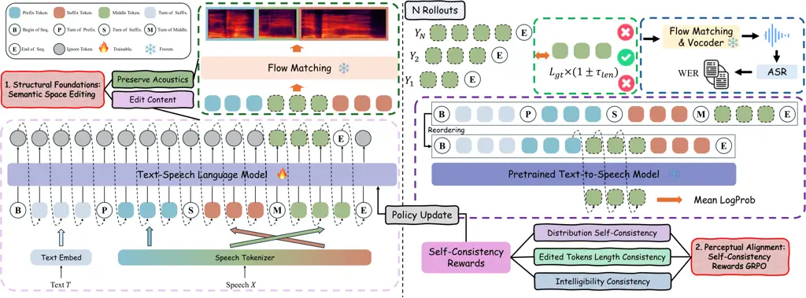

Ren Yi Tao Wang Xu Wen

# Edit Content, Preserve Acoustics: Imperceptible Text-Based Speech Editing via Self-Consistency Rewards

Yong    Jiangyan    Jianhua    Tao    Le    Zhengqi

###### Abstract

Imperceptible text-based speech editing modifies spoken content through
transcript manipulation while preserving acoustic continuity. Prior
acoustic-space approaches suffer from content–style entanglement,
causing unstable generation and boundary artifacts. We introduce a
framework guided by the principle ‘Edit Content, Preserve Acoustics’.
Editing is conducted in a stable semantic space, while acoustic
realization is handled by a Flow Matching decoder. To ensure perceptual
consistency, we propose Self-Consistency Rewards Group Relative Policy
Optimization, which leverages a pre-trained Text-to-Speech model as an
implicit critic, together with intelligibility and duration constraints.
Experiments demonstrate consistent improvements over state-of-the-art
autoregressive and non-autoregressive baselines in intelligibility,
robustness, and perceptual quality.

###### keywords

text-based speech editing, semantic token, reinforcement learning,
self-consistency rewards

^(†)^(†)address: ¹ The State Key Laboratory of Multimodal Artificial
Intelligence Systems, Institute of Automation, Chinese Academy of
Sciences ² School of Artificial Intelligence, University of Chinese
Academy of Sciences ³ Department of Automation, Tsinghua University ⁴
BNRist, Tsinghua University ^(†)^(†)email: thurenyong@gmail.com,
yijy@tsinghua.edu.cn, jhtao@tsinghua.edu.cn, zqwen@tsinghua.edu.cn

## 1 Introduction

Text-based speech editing modifies spoken content by editing
transcripts, enabling word insertion, deletion, or substitution without
costly re-recording \[1, 2, 3, 4, 5\]. The capability is critical for
applications such as podcast correction, audiobook revision, and
post-production dialogue editing \[6, 7\].

Despite significant progress, achieving ‘imperceptible’ editing remains
challenging. Early Non-Autoregressive (NAR) speech editing methods \[3,
8, 9, 10\] offer stable inference but struggle with long-range
dependency modeling, leading to flattened prosody. Conversely, recent
Autoregressive (AR) speech editing models based on Neural Codec Language
Models (NCLMs) \[6, 11, 12, 13, 14\] have achieved state-of-the-art
(SOTA) naturalness. However, these methods typically operate on acoustic
tokens \[15, 16\] where content and style are entangled. This coupling
often compromises robustness, leading to hallucinations and boundary
artifacts when modifying content \[17\].

To advance the state of text-based speech editing, we revisit the task
and contend that it differs fundamentally from Text-to-Speech (TTS). We
characterize text-based speech editing as a context-constrained
incremental generation problem. Achieving imperceptibility requires
balancing modification with continuity; to this end, we propose a
framework grounded in the principle of Edit Content, Preserve Acoustics.

Structural Foundations for Acoustic Preservation. A key limitation of
existing text-based speech editing approaches is their direct
manipulation of acoustic representations, where linguistic content and
timbre are tightly coupled. This entanglement makes joint prediction
unstable and often leads to hallucinations or boundary artifacts. To
address this issue, we decouple the editing process by performing
content modification in a disentangled semantic space that captures
linguistic content and coarse prosody. Acoustic reconstruction is
subsequently handled by a Flow Matching \[18\] decoder. This
hierarchical design projects both edited regions and original context
into a unified acoustic manifold, preserving acoustic coherence while
enabling precise content manipulation.



Figure 1: The overall framework of our proposed method. The pipeline
consists of two stages: (1) Structural Foundations (Left), where we
employ a semantic-token-based LLM for conditional content infilling
followed by a Flow Matching decoder for acoustic reconstruction; and (2)
Perceptual Alignment (Right), where the policy is fine-tuned via
Self-Consistency Rewards GRPO.

Perceptual Alignment for Further Coherence. Although structural
decoupling maintains the acoustic foundation (such as timbre and
acoustic environment), semantic tokens inherently encode rhythm and
paralinguistic information. Consequently, ensuring that the edited
content fuses indistinguishably with the utterance requires explicit
perceptual alignment. Reinforcement Learning (RL) has emerged as a
powerful paradigm for aligning Large Language Models (LLMs) \[19, 20,
21\], with initial explorations in speech generation \[22, 23, 24, 25\].
However, existing speech rewards typically target Text-to-Speech (TTS)
metrics like intelligibility or speaker similarity, failing to address
the seamless fusion of the edited region with the surrounding context
beyond mere timbre coherence. To address this, we introduce a novel
alignment mechanism using a pre-trained Text-to-Speech (TTS) model as an
implicit critic. Based on the premise that a powerful TTS model captures
the distribution of natural speech, we utilize the conditional
likelihood of the edited tokens given the context as a statistical proxy
for the coherence between the edited region and the entire sentence.
Complemented by strict constraints on Automatic Speech Recognition (ASR)
Word Error Rate (WER) and duration validity, we construct a composite
reward that aligns the generation with human perceptual expectations. In
summary, our contributions are as follows:

- •
  We propose a novel framework for imperceptible text-based speech
  editing, addressing the problem through structural foundations and
  perceptual alignment.
- •
  Semantic Space Editing. We adopt a semantic-token-based architecture
  to decouple content editing from acoustic reconstruction,
  significantly reducing artifacts compared to acoustic-token-based
  baselines.
- •
  Self-Consistency Rewards GRPO. We are the first to utilize a
  pre-trained TTS model as a consistency critic within a RL framework
  for speech editing. Combined with ASR and length rewards, it
  effectively enhances global coherence and achieves perceptual
  alignment.
- •
  Empirical evaluations demonstrate that our method significantly
  outperforms NAR and AR baselines, achieving superior intelligibility,
  robustness and perceptual quality.

## 2 Method

This section presents the proposed framework for imperceptible
text-based speech editing. We first describe the overall architecture,
followed by the formulation of Structural Foundations and the Perceptual
Alignment mechanism.

### 2.1 Overall architecture

Guided by the principle of Edit Content, Preserve Acoustics, we design a
hierarchical framework illustrated in Figure 1. The system operates in
two stages:

- •
  Structural Foundations via Decoupling: Editing is restricted to a
  discrete semantic space to isolate linguistic manipulation from
  acoustic variations. The edited semantics are subsequently rendered
  into waveform space by a Flow Matching decoder within a unified
  acoustic manifold.
- •
  Perceptual Alignment via RL: To ensure the edited region fuses
  indistinguishably with the bidirectional context, we introduce a
  Self-Consistency Rewards GRPO stage. We leverage a pre-trained TTS
  model as an implicit critic to maximize the conditional likelihood of
  the generated tokens, thereby enhancing global coherence of semantic
  tokens without requiring paired ground-truth data.

### 2.2 Structural Foundations: Semantic Space Editing

Prior AR speech editing approaches operate in acoustic-token space,
where linguistic content and timbre are inherently entangled \[6\]. To
address this issue, we adopt a decoupled architecture consisting of an
LLM for semantic generation and a Flow Matching decoder for acoustic
reconstruction \[26\].

We formulate text-based speech editing as a conditional token infilling
problem in semantic space. To facilitate this, we employ a
Prefix-Suffix-Middle (PSM) formatting strategy. Given an input waveform
$`X`$, a semantic tokenizer $`\mathcal{T}(\cdot)`$ encodes it into a
discrete token sequence $`S=\mathcal{T}(X).`$ The sequence is
partitioned into three segments, $`\mathbf{S}_{\text{pre}}`$,
$`\mathbf{S}_{\text{mid}}`$, and $`\mathbf{S}_{\text{suf}}`$,
representing the left context, editable region, and right context,
respectively. The model input $`\mathbf{Q}`$ is then constructed by:

```math
\mathbf{Q}=[\mathbf{T};\mathbf{S}_{\text{pre}};\mathbf{S}_{\text{suf}}], \tag{1}
```

where $`\mathbf{T}`$ denotes the tokenized transcription.

We employ a decoder-only transformer as the policy model
$`\pi_{\theta}`$. During supervised training, the model minimizes
negative log-likelihood of the missing middle tokens conditioned on
$`\mathbf{Q}`$:

```math
\small\mathcal{L}(\theta)=-\sum_{t=1}^{|\mathbf{S}_{\text{mid}}|}\log\pi_{\theta}(s_{\text{mid},t}\mid\mathbf{Q},s_{\text{mid},<t}). \tag{2}
```

This objective enables coherent semantic infilling between the prefix
and suffix, after which the waveform is reconstructed using a Flow
Matching decoder and vocoder.

### 2.3 Perceptual Alignment: Self-Consistency Rewards GRPO

Although semantic-space editing preserves acoustic structure, semantic
tokens still encode prosodic and paralinguistic cues, causing
autoregressive sampling to produce hallucinations or mismatches. To
achieve imperceptible editing, we introduce a perceptual alignment
mechanism that enforces statistical consistency with the surrounding
context under the natural speech distribution. This is realized through
a novel Self-Consistency Rewards GRPO, illustrated in Figure 1 (right).

GRPO estimates the baseline from the relative performance of multiple
samples generated for the same prompt. For each editing query
$`\mathbf{Q}`$, we sample a group of $`G`$ candidate sequences
$`\{\mathbf{o}_{1},\dots,\mathbf{o}_{G}\}`$ from the previous policy
$`\pi_{\theta_{\text{old}}}`$. The optimization relies on the Relative
Advantage $`\hat{A}_{i}`$, which measures each sample against its peers.
Formally, given rewards $`\{R_{1},\dots,R_{G}\}`$, the advantage is
defined as:

```math
\hat{A}_{i}=\frac{R_{i}-\mu_{R}}{\sigma_{R}}, \tag{3}
```

where $`i`$ indexes the $`i`$-th completion among the $`G`$ candidates
for input $`\mathbf{Q}`$, and $`\mu_{R}`$ and $`\sigma_{R}`$ denote the
mean and standard deviation of rewards within the sampled group.

#### 2.3.1 Log-Probability Self-Consistency Reward ($`r_{\text{sc}}`$)

We leverage a frozen pre-trained TTS model as an implicit critic that
evaluates the likelihood of edited tokens under the natural speech
distribution.

Formulation. Given a generated token sequence
$`\hat{\mathbf{S}}_{\text{mid}}`$, the reward is defined as the average
log-likelihood under the frozen TTS reference model
$`\pi_{\text{tts}}`$:

```math
\small r_{\text{sc}}=\frac{1}{|\hat{\mathbf{S}}_{\text{mid}}|}\sum_{t=1}^{|\hat{\mathbf{S}}_{\text{mid}}|}\log\pi_{\text{tts}}(\hat{s}_{\text{mid},t}\mid[\mathbf{T};\mathbf{S}_{\text{pre}}],\hat{s}_{\text{mid},<t}). \tag{4}
```

#### 2.3.2 Intelligibility Reward ($`r_{\text{wer}}`$)

Optimizing only $`r_{\text{sc}}`$ may lead to reward hacking, where
high-likelihood yet semantically trivial outputs (e.g., silence or
repetition) are favored. To enforce content correctness, we introduce an
intelligibility reward:

```math
\small r_{\text{wer}}=1-\operatorname{WER}(\mathbf{W}_{\text{rec}},\mathbf{T}_{\text{tgt}}), \tag{5}
```

where $`\operatorname{WER}`$ is computed by an ASR model on the
reconstructed waveform $`\mathbf{W}_{\text{rec}}`$.

|              |                   |                                    |                               |                                  |                               |
| ------------ | ----------------- | ---------------------------------- | ----------------------------- | -------------------------------- | ----------------------------- |
| Edit Type    | Model             | Performance                        |                               |                                  |                               |
|              |                   | WER(%)$`\downarrow`$ basic \| full | SIM$`\uparrow`$ basic \| full | DNSMOS$`\uparrow`$ basic \| full | MOS$`\uparrow`$ basic \| full |
| Insertion    | FluentSpeech      | 12.00 \| 11.91                     | 0.60 \| 0.60                  | 2.90 \| 2.91                     | 3.46 \| 3.45                  |
|              | VoiceCraft        | 10.70 \| 12.94                     | 0.67 \| 0.67                  | 3.00 \| 3.00                     | 3.62 \| 3.60                  |
|              | Ming-UniAudio^(⋄) | 6.63 \| 7.59                       | 0.79 \| 0.79                  | \- \| -                          | \- \| -                       |
|              | Ours              | 4.70 \| 5.12                       | 0.82 \| 0.82                  | 3.14 \| 3.13                     | 3.86 \| 3.84                  |
|              | Ours (w. GRPO)    | 4.50 \| 4.97                       | 0.82 \| 0.82                  | 3.17 \| 3.18                     | 4.01 \| 3.95                  |
|              |                   | WER(%)$`\downarrow`$ basic \| full | SIM$`\uparrow`$ basic \| full | DNSMOS$`\uparrow`$ basic \| full | MOS$`\uparrow`$ basic \| full |
| Deletion     | FluentSpeech      | 8.16 \| 8.78                       | 0.51 \| 0.52                  | 2.91 \| 2.91                     | 3.47 \| 3.46                  |
|              | VoiceCraft        | 16.99 \| 17.88                     | 0.60 \| 0.62                  | 3.01 \| 3.04                     | 3.34 \| 3.36                  |
|              | Ming-UniAudio^(⋄) | 14.85 \| 27.60                     | 0.76 \| 0.74                  | \- \| -                          | \- \| -                       |
|              | Ours              | 7.38 \| 7.70                       | 0.76 \| 0.77                  | 3.07 \| 3.08                     | 3.79 \| 3.80                  |
|              | Ours (w. GRPO)    | 6.91 \| 6.88                       | 0.77 \| 0.78                  | 3.09 \| 3.09                     | 3.88 \| 3.87                  |
|              |                   | WER(%)$`\downarrow`$ basic \| full | SIM$`\uparrow`$ basic \| full | DNSMOS$`\uparrow`$ basic \| full | MOS$`\uparrow`$ basic \| full |
| Substitution | FluentSpeech      | 4.66 \| 4.65                       | 0.51 \| 0.51                  | 2.92 \| 2.92                     | 3.49 \| 3.48                  |
|              | VoiceCraft        | 11.98 \| 12.73                     | 0.58 \| 0.59                  | 3.01 \| 3.02                     | 3.57 \| 3.58                  |
|              | Ming-UniAudio^(⋄) | 8.99 \| 7.64                       | 0.78 \| 0.77                  | \- \| -                          | \- \| -                       |
|              | Ours              | 4.40 \| 4.61                       | 0.78 \| 0.78                  | 3.12 \| 3.09                     | 3.88 \| 3.86                  |
|              | Ours (w. GRPO)    | 4.13 \| 4.41                       | 0.78 \| 0.78                  | 3.15 \| 3.11                     | 3.96 \| 3.93                  |

Table 1: Performance comparison on the text-based speech editing
benchmark. The symbol ’$`\diamond`$’ indicates that the results are
cited directly from the original paper \[14\]. Red indicates the best
result, and Blue indicates the second best.

#### 2.3.3 Gated Self-Consistency Rewards Fusion

To balance acoustic naturalness ($`r_{\text{sc}}`$) and content accuracy
($`r_{\text{wer}}`$), we introduce a gated reward aggregation strategy
that filters low-quality samples via a hard validity constraint. The
total reward $`R`$ is defined as:

```math
\small R=\begin{cases}R_{\text{base}}+r_{\text{sc}}+r_{\text{wer}},&\text{if }\mathbb{I}_{\text{valid}},\\
0,&\text{otherwise},\end{cases} \tag{6}
```

where $`R_{\text{base}}`$ is a shaping constant ensuring positive
rewards for valid samples.

The validity indicator $`\mathbb{I}_{\text{valid}}`$ enforces both
intelligibility and duration consistency:

```math
\small\mathbb{I}_{\text{valid}}=\underbrace{\left(\operatorname{WER}(\mathbf{W}_{\text{rec}},\mathbf{T}_{\text{tgt}})\leq\tau_{\text{wer}}\right)}_{\text{Content Integrity}}\land\underbrace{\left(\left|\frac{L_{\text{gen}}-L_{\text{gt}}}{L_{\text{gt}}}\right|\leq\tau_{\text{len}}\right)}_{\text{Duration Stability}}, \tag{7}
```

where $`L_{\text{gen}}=|\hat{\mathbf{S}}_{\text{mid}}|`$ and
$`L_{\text{gt}}=|\mathbf{S}_{\text{mid}}|`$. The thresholds
$`\tau_{\text{wer}}`$ and $`\tau_{\text{len}}`$ specify admissible
tolerances. This gating removes invalid samples from optimization,
stabilizing GRPO training.

## 3 Experiments

### 3.1 Experimental Settings

Datasets. Training is conducted on Libriheavy \[27\], a 50k-hour English
speech corpus from LibriVox. We evaluate editing performance on two
benchmarks. First, we adopt the Ming-Freeform-Audio-Edit-Benchmark
\[14\] (basic & full), covering insertion, deletion, and substitution
tasks. Ground-truth editing intervals are obtained via forced alignment
using WhisperX \[28\]. Second, to assess robustness under varying edit
durations, we construct an additional test set from Seed-TTS-Eval \[29\]
by sampling 200 utterances ($`>`$4s) and applying random masks with
durations $`\{0.5\text{s},\dots,2.5\text{s}\}`$.

Baselines. We benchmark our framework against three representative
models covering diverse editing paradigms:

- •
  FluentSpeech \[30\]: A NAR diffusion-based model generating
  mel-spectrograms directly.
- •
  VoiceCraft \[6\]: A SOTA AR NCLM operating on quantized acoustic
  tokens.
- •
  Ming-UniAudio \[14\]: A unified LLM designed for speech understanding,
  editing, and generation.

Evaluation Metrics. We report both objective and subjective metrics: WER
(Whisper \[31\]) for intelligibility and boundary consistency; SIM
(WavLM \[32\]) for speaker preservation; DNSMOS \[33\] for perceptual
quality; and MOS, obtained from 15 raters on 90 samples using a 1–5
naturalness scale.

### 3.2 Implementation Details

Our framework consists of supervised pre-training followed by RL
alignment. We adopt the semantic tokenizer, Flow Matching decoder, and
HiFiGAN vocoder from CosyVoice3 \[26\], keeping them frozen. The
semantic-token LLM is trained on Libriheavy with learning rate
$`1\times 10^{-5}`$ for up to 10 epochs (gradient accumulation = 2).
During RL training, we use learning rate $`1\times 10^{-6}`$, batch size
4, rollout group size 8, and KL coefficient $`\beta=0.01`$. Training
runs for 400 steps with gradient accumulation 10. The log-probability
reward is computed using CosyVoice3 \[26\], and the ASR reward using
SenseVoiceSmall \[34\]. Thresholds are set to $`\tau_{\text{wer}}=0.2`$
and $`\tau_{\text{len}}=0.2`$. All experiments are conducted on 8 NVIDIA
H800 GPUs.

### 3.3 Main Results Analysis

Table 1 summarizes results on the first benchmark.

Intelligibility and Robustness. Our semantic-token-based editing
framework achieves the lowest WER across all three editing operations,
consistently outperforming SOTA baselines. This advantage arises from
decoupling semantic generation from acoustic rendering, which simplifies
the modeling objective and reduces prediction instability. Furthermore,
incorporating GRPO leads to additional WER reductions across all tasks.
We attribute these improvements to the ASR-based reward and length
constraint in GRPO, which discourage unintelligible outputs and
repetitive generation.

Detailed analysis of different types of editing operations:

- •
  Insertion: AR systems generally outperform NAR models, with
  Ming-UniAudio also showing competitive performance. The NAR baseline
  (FluentSpeech) exhibits the highest WER, likely due to mask-based
  prediction, where the predefined masked duration often mismatches the
  length required by inserted text, resulting in noticeable artifacts.
- •
  Deletion: This task proves most challenging for traditional AR models
  (e.g., VoiceCraft), which suffer from severe hallucinations and often
  fail to emit the EOS token in time. Conversely, NAR models perform
  better by simply predicting silence. Our method achieves the best
  performance; by editing only semantic tokens, we significantly reduce
  prediction difficulty, enabling precise stopping. Moreover, with GRPO,
  the WER drops drastically (0.47% on basic and 0.82% on full),
  confirming that the length reward effectively suppresses repetition
  and incoherent generation.
- •
  Substitution: While NAR methods excel here due to similar durations
  between original and edited text, our method still surpasses the
  strong NAR baseline.

|                       |                |                 |        |        |        |        |
| --------------------- | -------------- | --------------- | ------ | ------ | ------ | ------ |
| Metrics               | Model          | Masked Duration |        |        |        |        |
|                       |                | 0.5s            | 1s     | 1.5s   | 2s     | 2.5s   |
| WER(%) $`\downarrow`$ | FluentSpeech   | 7.533           | 7.107  | 7.231  | 8.300  | 7.390  |
|                       | VoiceCraft     | 8.504           | 10.505 | 10.813 | 11.525 | 11.190 |
|                       | Ours           | 3.342           | 3.858  | 4.126  | 4.430  | 4.333  |
|                       | Ours (w. GRPO) | 3.202           | 3.400  | 4.067  | 4.117  | 4.227  |
|                       |                | 0.5s            | 1s     | 1.5s   | 2s     | 2.5s   |
| SIM $`\uparrow`$      | FluentSpeech   | 0.797           | 0.750  | 0.685  | 0.615  | 0.535  |
|                       | VoiceCraft     | 0.790           | 0.761  | 0.723  | 0.695  | 0.639  |
|                       | Ours           | 0.866           | 0.855  | 0.840  | 0.828  | 0.809  |
|                       | Ours (w. GRPO) | 0.865           | 0.854  | 0.840  | 0.829  | 0.811  |
|                       |                | 0.5s            | 1s     | 1.5s   | 2s     | 2.5s   |
| DNSMOS $`\uparrow`$   | FluentSpeech   | 2.915           | 2.930  | 2.975  | 2.991  | 3.006  |
|                       | VoiceCraft     | 2.970           | 2.978  | 3.016  | 3.021  | 3.008  |
|                       | Ours           | 3.126           | 3.139  | 3.138  | 3.138  | 3.128  |
|                       | Ours (w. GRPO) | 3.124           | 3.138  | 3.143  | 3.148  | 3.148  |

Table 2: Robustness evaluation on the subset of Seed-TTS test set across
varying masked durations (0.5s to 2.5s). Red indicates the best result,
and Blue indicates the second best.

Speaker Similarity and Perceptual Quality. Our method consistently
achieves the highest SIM, DNSMOS, and subjective MOS scores,
outperforming all baselines.

In terms of SIM, the Audio-LLM-based Ming-UniAudio scores slightly lower
than ours, followed by VoiceCraft, with FluentSpeech performing worst.
This validates the superiority of AR-based approaches over
diffusion-based NAR methods in capturing speaker characteristics.
Notably, GRPO does not significantly alter the SIM score. This is
expected, as we optimize the policy for semantic tokens, while timbre
preservation is primarily handled by the fixed Flow Matching decoder.

Regarding DNSMOS and Subjective MOS, our method outperforms baselines in
naturalness.

- •
  Our method significantly outperforms both the AR baseline (VoiceCraft)
  and the NAR baseline (FluentSpeech).
- •
  The introduction of GRPO yields substantial improvements in perceptual
  metrics. This is driven by the Self-Consistency Rewards, which ensure
  the style of the edited region aligns seamlessly with the unedited
  context.
- •
  Subjective MOS results mirror the objective DNSMOS, confirming that
  human listeners perceive our method—especially with GRPO alignment—as
  the most natural.

### 3.4 Robustness on Edited Duration

Table 2 evaluates performance stability as the masked duration increases
from 0.5s to 2.5s.

Impact on Intelligibility. Our method consistently achieves the lowest
WER across all durations, with GRPO providing further improvements.
Unlike the main benchmark, this setting enforces equal lengths between
the masked region and generated content, where the NAR baseline
(FluentSpeech) surpasses the traditional AR baseline (VoiceCraft). As
edit duration increases, VoiceCraft’s WER rises sharply due to error
accumulation in acoustic-token autoregression. In contrast, our method
degrades more gradually and remains significantly better than
FluentSpeech even at 2.5s, demonstrating strong robustness under
long-context editing.

Impact on Speaker Similarity. Our approach maintains the highest speaker
similarity across all durations. Consistent with earlier results, GRPO
has minimal influence on SIM, since speaker characteristics are
primarily determined by the frozen Flow Matching decoder. Among
baselines, VoiceCraft outperforms FluentSpeech, while the NAR model
exhibits a pronounced decline as duration increases (dropping to 0.535
at 2.5s). Our method preserves high similarity with only minor decay,
benefiting from unified acoustic reconstruction that is largely
insensitive to edit length.

Impact on Naturalness (DNSMOS). Our method consistently achieves the
best naturalness scores, with GRPO becoming increasingly beneficial as
edit duration grows. Gains are marginal for short edits but widen for
longer ones. While baseline methods and our non-aligned model show
little improvement or plateau, Ours (with GRPO) shows a clear upward
trend. This validates the efficacy of our Self-Consistency Reward: by
leveraging a pre-trained TTS model to approximate the natural speech
distribution, RL optimization guides the model to generate coherent
prosody even for complex, long-form edits.

## 4 Conclusion

In this paper, we presented a novel framework for imperceptible
text-based speech editing through the principle of Edit Content,
Preserve Acoustics. By shifting the editing operation from the acoustic
space to a disentangled semantic space, we established a robust
structural foundation for acoustic preservation. Furthermore, to ensure
the edited region fuses indistinguishably with the context, we
introduced a Perceptual Alignment stage via Self-Consistency Rewards
GRPO. Extensive evaluations on two benchmarks demonstrate that our
method significantly outperforms SOTA AR and NAR baselines, achieving
superior intelligibility, speaker similarity, and perceptual
naturalness, even in long-duration scenarios. Future work will explore
extending this semantic-based framework and the GRPO alignment method to
freeform speech editing.

## 5 Acknowledgments

This work is supported by the National Natural Science Foundation of
China (NSFC) (No. 62322120, No.U2436210, No. 62306316, No. 62206278),
and the China Postdoctoral Science Foundation (No. 2025T180461,
2025M771685).

## 6 Generative AI Use Disclosure

We used generative AI tools solely to assist with English writing
refinement. These tools were not used to generate or modify the
technical content of the paper, including the research ideas, method
design, algorithms, mathematical formulations, experimental setup,
results, figures, or conclusions, nor to generate citations or
attributed text. All authors reviewed, verified, and edited the
AI-assisted text, ensured proper attribution and originality, and take
full responsibility and accountability for the entire content of the
submission.

## References

- \[1\] Z. Jin, G. J. Mysore, S. Diverdi, J. Lu, and A.
  Finkelstein (2017) Voco: text-based insertion and replacement in audio
  narration. ACM Transactions on Graphics (TOG) 36 (4), pp. 1–13. Cited
  by: §1.
- \[2\] D. Tan, L. Deng, Y. T. Yeung, X. Jiang, X. Chen, and T.
  Lee (2021) Editspeech: a text based speech editing system using
  partial inference and bidirectional fusion. In 2021 IEEE Automatic
  Speech Recognition and Understanding Workshop (ASRU), pp. 626–633.
  Cited by: §1.
- \[3\] T. Wang, J. Yi, R. Fu, J. Tao, and Z. Wen (2022) Campnet:
  context-aware mask prediction for end-to-end text-based speech
  editing. IEEE/ACM Transactions on Audio, Speech, and Language
  Processing 30, pp. 2241–2254. Cited by: §1, §1.
- \[4\] T. Wang, J. Yi, L. Deng, R. Fu, J. Tao, and Z. Wen (2022)
  Context-aware mask prediction network for end-to-end text-based speech
  editing. In ICASSP 2022-2022 IEEE International Conference on
  Acoustics, Speech and Signal Processing (ICASSP), pp. 6082–6086. Cited
  by: §1.
- \[5\] T. Wang, J. Yi, R. Fu, J. Tao, Z. Wen, and C. Y. Zhang (2024)
  Emotion selectable end-to-end text-based speech editing. Artificial
  Intelligence 329, pp. 104076. Cited by: §1.
- \[6\] P. Peng, P. Huang, S. Li, A. Mohamed, and D. Harwath (2024)
  VoiceCraft: zero-shot speech editing and text-to-speech in the wild.
  In Proceedings of the 62nd Annual Meeting of the Association for
  Computational Linguistics (Volume 1: Long Papers), pp. 12442–12462.
  Cited by: §1, §1, §2.2, 2nd item.
- \[7\] T. Kim, U. Lee, H. Park, C. Cho, N. I. Park, and Y. H.
  Lee (2025) Instance-specific test-time training for speech editing in
  the wild. arXiv preprint arXiv:2506.13295. Cited by: §1.
- \[8\] H. Bai, R. Zheng, J. Chen, M. Ma, X. Li, and L. Huang (2022) A
  $`{}^{3}`$ t: alignment-aware acoustic and text pretraining for speech
  synthesis and editing. In International Conference on Machine
  Learning, pp. 1399–1411. Cited by: §1.
- \[9\] T. Wang, J. Yi, R. Fu, C. Qiang, D. Chong, C. Wang, Z. Wen, J.
  Tao, et al. (2025) SpeechPalette: a comprehensive speech editing
  method for text-based speech editing, one-shot tts and attributes
  editing.. IEEE Transactions on Pattern Analysis and Machine
  Intelligence. Cited by: §1.
- \[10\] R. Liu, J. Xi, Z. Jiang, and H. Li (2025) FluentEditor2:
  text-based speech editing by modeling multi-scale acoustic and prosody
  consistency. IEEE Transactions on Audio, Speech and Language
  Processing. Cited by: §1.
- \[11\] Z. Zheng, P. Peng, A. Diwan, C. P. Huynh, X. Sun, Z. Liu, V.
  Bhat, and D. Harwath (2025) VoiceCraft-x: unifying multilingual,
  voice-cloning speech synthesis and speech editing. In Proceedings of
  the 2025 Conference on Empirical Methods in Natural Language
  Processing, pp. 2737–2756. Cited by: §1.
- \[12\] B. Mohammad, M. Zhussip, and S. Lefkimmiatis (2025) Speak,
  edit, repeat: high-fidelity voice editing and zero-shot tts with
  cross-attentive mamba. arXiv preprint arXiv:2510.04738. Cited by: §1.
- \[13\] D. Yang, J. Tian, X. Tan, R. Huang, S. Liu, X. Chang, J.
  Shi, S. Zhao, J. Bian, X. Wu, et al. (2023) Uniaudio: an audio
  foundation model toward universal audio generation. arXiv preprint
  arXiv:2310.00704. Cited by: §1.
- \[14\] C. Yan, C. Jin, D. Huang, H. Yu, H. Peng, H. Zhan, J. Gao, J.
  Peng, J. Chen, J. Zhou, et al. (2025) Ming-uniaudio: speech llm for
  joint understanding, generation and editing with unified
  representation. arXiv preprint arXiv:2511.05516. Cited by: §1, Table
  1, 3rd item, §3.1.
- \[15\] A. Défossez, J. Copet, G. Synnaeve, and Y. Adi (2023) High
  fidelity neural audio compression. Trans. Mach. Learn. Res.. Cited by:
  §1.
- \[16\] R. Kumar, P. Seetharaman, A. Luebs, I. Kumar, and K.
  Kumar (2023) High-fidelity audio compression with improved rvqgan.
  Advances in Neural Information Processing Systems 36, pp. 27980–27993.
  Cited by: §1.
- \[17\] S. Huang, H. Kuo, Z. Chen, X. Yang, P. Ku, A. Jukic, C. H.
  Yang, Y. Tsao, Y. F. Wang, H. Lee, et al. (2025) VoiceNoNG: robust
  high-quality speech editing model without hallucinations. In Proc.
  Interspeech 2025, pp. 3469–3473. Cited by: §1.
- \[18\] Y. Lipman, R. T. Chen, H. Ben-Hamu, M. Nickel, and M. Le (2023)
  Flow matching for generative modeling. In The Eleventh International
  Conference on Learning Representations, Cited by: §1.
- \[19\] Z. Shao, P. Wang, Q. Zhu, R. Xu, J. Song, X. Bi, H. Zhang, M.
  Zhang, Y. Li, Y. Wu, et al. (2024) Deepseekmath: pushing the limits of
  mathematical reasoning in open language models. arXiv preprint
  arXiv:2402.03300. Cited by: §1.
- \[20\] J. Uesato, N. Kushman, R. Kumar, F. Song, N. Siegel, L.
  Wang, A. Creswell, G. Irving, and I. Higgins (2022) Solving math word
  problems with process-and outcome-based feedback. arXiv preprint
  arXiv:2211.14275. Cited by: §1.
- \[21\] H. Lightman, V. Kosaraju, Y. Burda, H. Edwards, B. Baker, T.
  Lee, J. Leike, J. Schulman, I. Sutskever, and K. Cobbe (2023) Let’s
  verify step by step. In The Twelfth International Conference on
  Learning Representations, Cited by: §1.
- \[22\] D. Zhang, Z. Li, S. Li, X. Zhang, P. Wang, Y. Zhou, and X.
  Qiu (2024) Speechalign: aligning speech generation to human
  preferences. Advances in Neural Information Processing Systems 37,
  pp. 50343–50360. Cited by: §1.
- \[23\] Y. Zhong, P. Yang, and Z. Wang (2025) Multi-reward grpo for
  stable and prosodic single-codebook tts llms at scale. arXiv preprint
  arXiv:2511.21270. Cited by: §1.
- \[24\] C. Gao, Y. Li, K. An, Z. Gao, Z. Du, H. Zhao, and X. Li (2025)
  Explore the reinforcement learning for the llm based asr and tts
  system. arXiv preprint arXiv:2509.18569. Cited by: §1.
- \[25\] Y. Ren, J. Li, H. Sun, Y. Chen, C. Yi, Y. Huang, H. Gu, Y. Bai,
  and X. Yang (2026) Evaluating and rewarding lalms for expressive
  role-play tts via mean continuation log-probability. arXiv preprint
  arXiv:2601.22661. Cited by: §1.
- \[26\] Z. Du, C. Gao, Y. Wang, F. Yu, T. Zhao, H. Wang, X. Lv, H.
  Wang, C. Ni, X. Shi, et al. (2025) Cosyvoice 3: towards in-the-wild
  speech generation via scaling-up and post-training. arXiv preprint
  arXiv:2505.17589. Cited by: §2.2, §3.2.
- \[27\] W. Kang, X. Yang, Z. Yao, F. Kuang, Y. Yang, L. Guo, L. Lin,
  and D. Povey (2024) Libriheavy: a 50,000 hours asr corpus with
  punctuation casing and context. In ICASSP 2024-2024 IEEE International
  Conference on Acoustics, Speech and Signal Processing (ICASSP),
  pp. 10991–10995. Cited by: §3.1.
- \[28\] M. Bain, J. Huh, T. Han, and A. Zisserman (2023) WhisperX:
  time-accurate speech transcription of long-form audio. In Proc.
  Interspeech 2023, pp. 4489–4493. Cited by: §3.1.
- \[29\] P. Anastassiou, J. Chen, J. Chen, Y. Chen, Z. Chen, Z. Chen, J.
  Cong, L. Deng, C. Ding, L. Gao, et al. (2024) Seed-tts: a family of
  high-quality versatile speech generation models. arXiv preprint
  arXiv:2406.02430. Cited by: §3.1.
- \[30\] Z. Jiang, Q. Yang, J. Zuo, Z. Ye, R. Huang, Y. Ren, and Z.
  Zhao (2023) FluentSpeech: stutter-oriented automatic speech editing
  with context-aware diffusion models. In Findings of the Association
  for Computational Linguistics: ACL 2023, pp. 11655–11671. Cited by:
  1st item.
- \[31\] A. Radford, J. W. Kim, T. Xu, G. Brockman, C. McLeavey, and I.
  Sutskever (2023) Robust speech recognition via large-scale weak
  supervision. In International conference on machine learning,
  pp. 28492–28518. Cited by: §3.1.
- \[32\] S. Chen, C. Wang, Z. Chen, Y. Wu, S. Liu, Z. Chen, J. Li, N.
  Kanda, T. Yoshioka, X. Xiao, et al. (2022) Wavlm: large-scale
  self-supervised pre-training for full stack speech processing. IEEE
  Journal of Selected Topics in Signal Processing 16 (6), pp. 1505–1518.
  Cited by: §3.1.
- \[33\] C. K. Reddy, V. Gopal, and R. Cutler (2021) DNSMOS: a
  non-intrusive perceptual objective speech quality metric to evaluate
  noise suppressors. In ICASSP 2021-2021 IEEE International Conference
  on Acoustics, Speech and Signal Processing (ICASSP), pp. 6493–6497.
  Cited by: §3.1.
- \[34\] K. An, Q. Chen, C. Deng, Z. Du, C. Gao, Z. Gao, Y. Gu, T.
  He, H. Hu, K. Hu, et al. (2024) Funaudiollm: voice understanding and
  generation foundation models for natural interaction between humans
  and llms. arXiv preprint arXiv:2407.04051. Cited by: §3.2.
