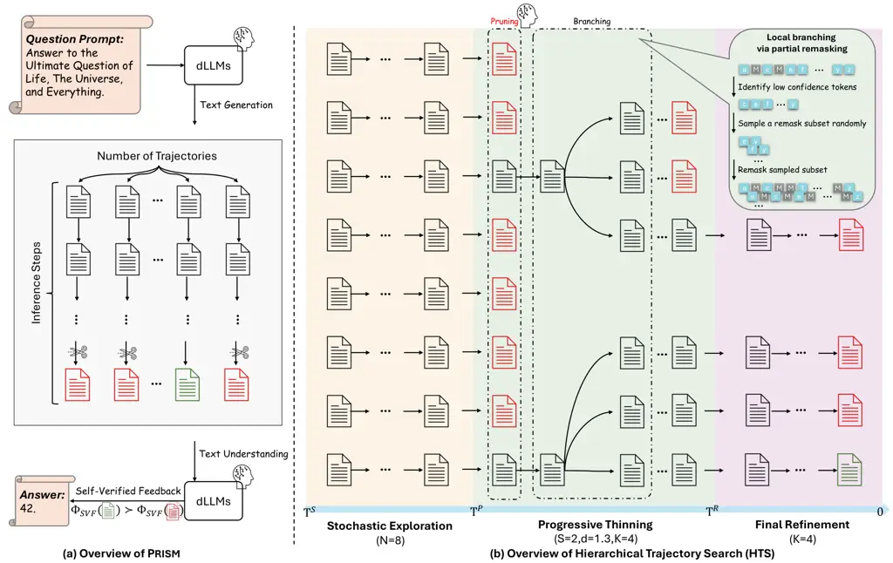

# Prism: Efficient Test-Time Scaling via Hierarchical Search and Self-Verification for Discrete Diffusion Language Models

Jinbin Bai Affiliation: National University of Singapore
Affiliation: Collov Labs Correspondence to: <jinbin.bai@u.nus.edu>   
Yixuan Li Affiliation: Xi’an Jiaotong University    Yuchen Zhu
Affiliation: Georgia Institute of Technology    Yi Xin
Affiliation: Shanghai Innovation Institute    Qingyu Shi
Affiliation: Peking University    Aosong Feng Affiliation: Yale
University    Xiaohong Liu Affiliation: Shanghai Innovation Institute   
Molei Tao Affiliation: Georgia Institute of Technology    Jianru Xue
Affiliation: Xi’an Jiaotong University    Xiangtai Li
Affiliation: Peking University    Ming-Hsuan Yang Affiliation: UC Merced

###### Abstract

Inference-time compute has re-emerged as a practical way to improve LLM
reasoning. Most test-time scaling (TTS) algorithms rely on
autoregressive decoding, which is ill-suited to discrete diffusion
language models (dLLMs) due to their parallel decoding over the entire
sequence. As a result, developing effective and efficient TTS methods to
unlock dLLMs’ full generative potential remains an underexplored
challenge. To address this, we propose Prism (Pruning, Remasking, and
Integrated Self-verification Method), an efficient TTS framework for
dLLMs that (i) performs Hierarchical Trajectory Search (HTS) which
dynamically prunes and reallocates compute in an early-to-mid denoising
window, (ii) introduces Local branching with partial remasking to
explore diverse implementations while preserving high-confidence tokens,
and (iii) replaces external verifiers with Self-Verified Feedback (SVF)
obtained via self-evaluation prompts on intermediate completions. Across
four mathematical reasoning and code generation benchmarks on three
dLLMs, including LLaDA 8B Instruct, Dream 7B Instruct, and LLaDA
2.0-mini, our Prism achieves a favorable performance-efficiency
trade-off, matching best-of-$`N`$ performance with substantially fewer
function evaluations (NFE). The code is released at
[https://github.com/viiika/Prism](https://github.com/viiika/Prism).

###### Keywords: 

Machine Learning, ICML

## 1 Introduction

The scaling laws of Large Language Models (LLMs) (Achiam et al., 2023)
have traditionally focused on training-time compute by increasing model
parameters and dataset size. Recently, test-time scaling (TTS), which
allocates additional compute at inference time to perform exploration,
verification, and selection, has become a dominant paradigm for
improving complex reasoning without retraining (Jaech et al., 2024a).
However, most prior TTS work (Muennighoff et al., 2025; Wei et al.,
2022; Wang et al., 2022; Brown et al., 2024; Jain et al., 2024; Snell et
al., 2024), is built around autoregressive (AR) decoding, where search
expands a left-to-right tree and early mistakes are difficult to correct
without backtracking.

Discrete diffusion language models (dLLMs) such as LLaDA (Nie et al.,
2025; Bie et al., 2025), Seed Diffusion  (Song et al., 2025),
Mercury (Khanna et al., 2025), and Gemini Diffusion (Google DeepMind, 2025) represent a fundamental departure from the autoregressive (AR)
paradigm. By generating sequences with iterative denoising from a masked
state, dLLMs utilize global bidirectional context at every generation
step. This parallel, non-autoregressive generation process theoretically
makes dLLMs superior candidates for planning and self-correction.

Figure 1: Comparison between Best-of-N and Prism on LLaDA-8B-Instruct.
The red curve illustrates Best-of-N scaling, while the blue curve
depicts Prism scaling, with a dashed line indicating the difference in
inference compute (NFE) with comparable accuracy.

Previous test-time scaling methods typically allocate additional
inference compute along two complementary axes (Muennighoff et al.,
2025): _(i) length scaling_ and _(ii) width scaling_. Length scaling
extends the reasoning budget by generating longer responses (e.g.,
chain-of-thought (Wei et al., 2022)) or increasing iterative refinement
steps, whereas width scaling broadens the hypothesis space by exploring
multiple candidate trajectories. Notably, increasing the number of
denoising steps is often a less practical lever for dLLMs. In current
dLLMs implementations, the default inference schedule is typically
already saturated, with the number of generation steps commonly tied to
the target sequence length, unlike image generation models where
thousands of image tokens can often be predicted with only 10-50
inference steps (Chang et al., 2022; Li et al., 2025; Bai et al., 2024;
Shi et al., 2025; Yang et al., 2025; Xin et al., 2025). Consequently, we
focus on scaling width by generating $`N`$ diverse trajectories and
selecting the best one to increase the likelihood of finding an optimal
answer. Concurrent work, such as HEX (Lee et al., 2025a), successfully
explores a related width-scaling paradigm by ensembling across diverse
semi-autoregressive block schedules. While this schedule-induced
diversity yields strong reasoning gains, it fundamentally relies on
exhaustive parallel decoding where all candidate trajectories must run
to completion. Realizing this potential is non-trivial: naive
best-of-$`N`$ search or HEX (Lee et al., 2025a) for dLLMs is
computationally prohibitive, since evaluating $`N`$ trajectories over
$`T`$ denoising steps requires $`O(NT)`$ function evaluations (NFE), and
standard external verifiers further introduce substantial overhead
(e.g., GPU memory).

To address these bottlenecks, we introduce Prism, an efficient test-time
scaling framework tailored for dLLMs. First, we propose Hierarchical
Trajectory Search (HTS), which employs a geometric decay schedule to
progressively prune the active trajectory set and reallocate compute
_within the early-to-mid denoising window_ when the high-level logic
skeleton is formed. Second, we introduce local branching via partial
re-masking, an exploration operator that preserves high-confidence
tokens as a stable “logic skeleton” while selectively re-masking
low-confidence positions to explore diverse implementations under the
same solution plan. Third, we replace external reward models with
Self-Verified Feedback(SVF): we reuse the same dLLM as a lightweight
binary verifier by applying a dedicated Yes/No self-evaluation prompt to
intermediate completions, enabling verifier-guided pruning and selection
with minimal additional overhead. This design yields a favorable compute
profile: while best-of-$`N`$ incurs $`O(NT)`$ denoising cost, HTS
rapidly contracts the trajectory pool from $`N`$ to $`K<N`$ after a
short warm-up, resulting in near-linear scaling in NFE, approximately
$`O(N+KT)`$ in practice.

Our contributions are summarized as follows:

- •
  We propose Prism, an efficient TTS framework for dLLMs that integrates
  Hierarchical Trajectory Search (HTS), local branching with partial
  re-masking, and Self-Verified Feedback (SVF) to enable adaptive
  exploration and selection without external reward models.
- •
  Across four math and code benchmarks on three dLLMs, Prism yields
  consistent gains over $`N{=}1`$ and matches or approaches
  Best-of-$`N`$ baselines under markedly reduced denoising compute
  (NFE), demonstrating a strong performance-efficiency trade-off.

## 2 Related Work

##### Discrete Diffusion Language Models.

Discrete diffusion language models (dLLMs) (Khanna et al., 2025; Google
DeepMind, 2025) replace left-to-right autoregressive decoding  (Achiam
et al., 2023; Hurst et al., 2024; Team et al., 2023) with a Markovian
denoising process over token sequences. A canonical formulation builds
on D3PM-style categorical diffusion(Austin et al., 2021a; Campbell et
al., 2022; Lou et al., 2023), where a forward corruption chain is
specified by time-dependent transition matrices and a learned reverse
process iteratively denoises toward natural text. Two corruption
families are most widely used. _Uniform_ transitions (Schiff et al.,
2024; Sahoo et al., 2025) mix tokens toward a uniform stationary
distribution, offering a conceptually clean categorical analogue of
Gaussian diffusion. _Absorbing-state_ (a.k.a. masked) transitions (Ou et
al., 2024; Sahoo et al., 2024; Shi et al., 2024) instead map tokens into
a special absorbing symbol (typically \[MASK\]), yielding the masked
diffusion model that aligns naturally with masked language modeling and
admits particularly simple training and sampling rules.

Building on these foundations, subsequent work focused on simplifying
objectives (e.g., reweighted denoising cross-entropy (Chang et al.,
2022)) and scaling architectures (Bai et al., 2024; Shi et al., 2025) to
modern LLM regimes. Recent dLLMs (Nie et al., 2025; Bie et al., 2025;
Khanna et al., 2025) demonstrate competitive performance on code and
reasoning benchmarks while enabling non-autoregressive refinement and
global bidirectional conditioning at each denoising step. Several works
study how to obtain strong dLLMs at scale, either by training from
scratch (Nie et al., 2025), or adopting a block-diffusion interface
(Arriola et al., 2025), or by converting pretrained autoregressive
backbones into diffusion LMs (Gong et al., 2024; Ye et al., 2025). While
recent works have attempted to scale discrete diffusion models (Huang et
al., 2025b; Chen et al., 2025; Wang et al., 2025; Lee et al., 2025c),
they often achieve only marginal performance gains or require
significant computational overhead.

Our work operates in both inference settings and resolves a
complementary question: how to allocate test-time compute effectively
under multi-step denoising dynamics, without relying on external
verifiers.

##### Test-Time Scaling and Verification.

Test-time scaling (Wei et al., 2022; Wang et al., 2022; Brown et al.,
2024; Jaech et al., 2024b; Muennighoff et al., 2025; Snell et al., 2024)
studies how to convert additional inference-time computation into higher
task accuracy by generating, refining, and selecting among multiple
trajectories. Existing methods can be organized by their compute
allocation pattern: parallel scaling expands a set of independent
candidates and selects or aggregates them (e.g., best-of-$`N`$,
self-consistency with majority voting) (Irvine et al., 2023; Brown et
al., 2024; Snell et al., 2024; Wang et al., 2022); sequential scaling
iteratively revises a small number of evolving solutions (e.g.,
self-refinement and correction loops) (Gou et al., 2023; Yao et al.,
2022; Muennighoff et al., 2025); and search-based scaling adaptively
expands and prunes a trajectory set under a scoring rule (e.g.,
tree-style or MCTS-style deliberation) (Yao et al., 2023; Huang et al.,
2025b). In all cases, the key algorithmic question is how to allocate
compute adaptively by deciding which trajectories to keep exploring or
to stop.

Verification provides the control signal that enables selection and
pruning decisions. Prior work commonly distinguishes outcome
verification (ORMs), which evaluates final answers using learned
judges/reward models (Cobbe et al., 2021), self-consistency/voting (Wang
et al., 2022), tool-assisted checks (Gou et al., 2023), or task-specific
executors (especially effective in code) (Lee et al., 2025b), from
process verification (PRMs) (Lightman et al., 2023; Yao et al., 2023),
which scores intermediate states or step-wise progress to guide
branching and pruning during search.

While PRMs have enabled effective tree-search for autoregressive
decoding, they are typically trained on well-formed textual prefixes.
For discrete diffusion language models (dLLMs) (Nie et al., 2025; Bie et
al., 2025), intermediate denoising states are partially masked and do
not follow a left-to-right prefix structure, which can make direct
application of standard PRMs brittle or ill-calibrated. Moreover, in
dLLMs each “candidate” often corresponds to a full denoising trajectory,
so naive trajectory scaling can be computationally inefficient. These
considerations motivate diffusion-aligned TTS in which (i) the scoring
signal remains meaningful on partially denoised states and (ii)
computation is concentrated on the structure-formation stage rather than
uniformly spread across steps. Our method follows this direction by
using a lightweight self-verification score derived from the model’s
Yes/No confidence under a dedicated verification prompt and coupling it
with hierarchical trajectory search for budgeted allocation.

##### Relation to PG-DLM and SMC-style inference.

Dang et al. (2025) formulate inference-time scaling for diffusion
language models as reward-tilted probabilistic inference and introduce
PG-DLM, which constructs a Markov chain over full denoising trajectories
using a conditional sequential Monte Carlo (SMC) kernel. Prism shares
with SMC-style methods a high-level population-based structure:
maintaining multiple trajectories, scoring them, selecting promising
candidates, and diversifying the remaining search pool. However, the
underlying objectives and operators are different. PG-DLM targets a
reward-weighted trajectory distribution and uses importance-weighted
resampling within a probabilistic inference framework, thereby enabling
convergence analysis under its assumptions. By contrast, Prism is a
budgeted combinatorial search procedure for verifiable reasoning tasks.
SVF scores are used as heuristic ranking signals rather than
density-ratio importance weights; HTS performs sparse top-$`S`$ pruning
instead of resampling at every denoising step; and partial remasking
locally mutates low-confidence positions rather than duplicating
weighted particles. Thus, PG-DLM emphasizes sampling from a
reward-tilted distribution while preserving generation quality, whereas
Prism emphasizes NFE-efficient allocation of search compute under a
fixed inference budget.

This distinction is also relevant to particle-based inference-time
scaling for autoregressive LLMs (Puri et al., 2025). In autoregressive
decoding, each step conditions on a fixed prefix, and maintaining broad
sampling diversity can be critical for mode coverage. In dLLMs, early
denoising states are highly entropic and partially specified, so
uniformly completing all candidates can waste compute on weak
trajectories. Our entropy analysis and empirical results suggest that,
for dLLMs, concentrating compute on promising trajectories during the
early-to-mid denoising window is an effective alternative to exhaustive
width scaling.

## 3 Method

### 3.1 Preliminaries: Discrete Diffusion Language Models

##### Notation.

Let $`\mathbf{z}_{0}=(z_{0,1},\dots,z_{0,L})\in[K]^{L}`$ denote a
length-$`L`$ token sequence over a vocabulary of size $`K`$. Let
$`\mathbf{e}(k)\in\{0,1\}^{K}`$ be the one-hot vector for token $`k`$,
and let $`\mathbf{1}\in\mathbb{R}^{K}`$ denote the all-ones vector. We
use the symbol $`m`$ (e.g., \[MASK\]) to denote the special absorbing
mask state and write $`\mathbf{e}_{m}\triangleq\mathbf{e}(m)`$ for its
one-hot vector. The diffusion timestep is $`t\in\{1,\dots,T\}`$. When
conditioning on a prompt, we denote it by $`c`$.

##### Masked diffusion models.

Masked diffusion models (MDM) (also known as absorbing-state discrete
diffusion models) are an especially effective variant of discrete
diffusion models. MDM employs a forward process where the clean data
sequences are progressively replaced with the mask token \[MASK\].
Formally speaking, the forward process follows the transition kernel

```math
\displaystyle q(\mathbf{z}_{t}\mid\mathbf{z}_{0},c)=\prod_{i=1}^{L}q_{t|0}(z_{t,i}|z_{0,i}),
```

```math
\displaystyle q_{t|0}(z_{t,i}\mid z_{0,i})=\mathrm{Cat}\!\big(z_{t,i};\,\alpha_{t}\,\mathbf{e}(z_{0,i})+(1-\alpha_{t})\mathbf{e}_{m}\big),
```

where $`\alpha_{t}`$ is a monotonic mask-noising schedule. Recent works
have shown that the training objectives can be directly related to
optimizing an ELBO of the data log likelihood, given by

```math
\resizebox{21931650}{}{$\mathcal{L}(\theta)=\mathbb{E}_{t,\mathbf{z}_{0},\mathbf{z}_{t}}\!\left[w(t)\underset{i:z_{t,i}=m}{\sum}\big(-\log\tilde{p}_{\theta}(z_{0,i}\mid\mathbf{z}_{t},c,t)\big)\right]$},
```

##### Inference through Block Diffusion.

Masked diffusion language model inference can be performed by
iteratively unmasking tokens from a sequence of masks. Here, we adopt
block diffusion decoding, an effective variant of such a sampling
procedure, where a length-$`L`$ sequence is partitioned into $`B=L/M`$
contiguous blocks of size $`M`$ (e.g., $`L=256`$, $`M=32`$). Generation
proceeds block-by-block, in a left-to-right manner: once a block is
finalized, it is treated as a fixed prefix, and the model moves to the
next block.

Formally, at block index $`b\in\{1,\dots,B\}`$, we maintain a partially
specified state $`\mathbf{z}_{t}^{(b)}\in(\mathcal{V}\cup\{m\})^{L}`$
where blocks $`1,\dots,b\!-\!1`$ are already committed tokens, while the
current block $`b`$ is denoised from a fully masked initialization.
Specifically, we start each block with

```math
\mathbf{z}_{T}^{(b)}=\big[\;\mathbf{x}^{(<b)},\;[m]^{M},\;[m]^{L-bM}\;\big],
```

and iteratively update the tokens within the current block for
$`t=T,\dots,1`$. Although the model predicts logits for all positions at
every step (via a $`\mathbf{z}_{0}`$-prediction head), the sampling
schedule commits only the current block, keeping the previously
generated blocks fixed. After $`T`$ denoising steps, we finalize block
$`b`$ and advance to $`b\!+\!1`$ until all blocks are generated.

0:  Prompt $`c`$; dLLM denoiser $`\mathcal{C}_{\theta}`$; total steps
$`T`$; initial width $`N`$; pruning window ratios
$`W=[w_{\min},w_{\max}]`$ (normalized by $`T`$); decay factor $`d>1`$;
pruning interval $`i`$; survivor width $`S`$; final target width $`K`$.

0:  Final completion $`\hat{\mathbf{z}}_{0}`$.

1:  Initialization.

2:  $`T_{p}\leftarrow\lceil w_{\max}\cdot T\rceil`$;
$`T_{r}\leftarrow\lceil w_{\min}\cdot T\rceil`$.

3:  Initialize
$`\mathcal{P}_{T}\leftarrow\{\mathbf{z}^{(n)}_{T}\}_{n=1}^{N}`$ with
$`\mathbf{z}^{(n)}_{T}=[\mathrm{MASK}]^{L}`$.

4:  Stage I: Stochastic exploration ($`T_{p}<t\leq T`$).

5:  for $`t=T,T-1,\ldots,T_{p}+1`$ do

6:
   $`\mathcal{P}_{t-1}\leftarrow\{\mathrm{DenoiseStep}(\mathcal{C}_{\theta},\mathbf{z}_{t},c,t)\;|\;\mathbf{z}_{t}\in\mathcal{P}_{t}\}`$.

7:  end for

8:  Stage II: Progressive thinning ($`T_{r}<t\leq T_{p}`$).

9:  $`r\leftarrow 0`$. // prune and branch iff $`r=0`$

10:  for $`t=T_{p},T_{p}-1,\ldots,T_{r}+1`$ do

11:    if $`r=0`$ then

12:
    $`M_{t-1}\leftarrow\max\!\big(\lceil N\cdot d^{-(T_{p}-(t-1))}\rceil,\ K\big)`$.

13:      // target width after pruning at step $`t`$

14:
    $`\text{score}(\mathbf{z}_{t})\leftarrow\Phi_{\mathrm{SVF}}(\mathbf{z}_{t};c)`$
for all $`\mathbf{z}_{t}\in\mathcal{P}_{t}`$.

15:
    $`\mathcal{S}_{t}\leftarrow\mathrm{TopS}(\mathcal{P}_{t},S;\text{score})`$.
// select top-$`S`$ seeds

16:     $`b_{t}\leftarrow\left\lceil\frac{M_{t-1}}{S}\right\rceil`$. //
children per survivor

17:     $`\mathcal{C}_{t}\leftarrow[\ ]`$.

18:     for each seed $`\mathbf{z}_{t}\in\mathcal{S}_{t}`$ do

19:      for $`j=1`$ to $`b_{t}`$ do

20:
      $`\tilde{\mathbf{z}}_{t}\leftarrow\mathrm{LocalBranch}(\mathbf{z}_{t},c,t)`$.

21:        // local branching via partial remasking

22:       append
$`\mathrm{DenoiseStep}(\mathcal{C}_{\theta},\tilde{\mathbf{z}}_{t},c,t)`$
to $`\mathcal{C}_{t}`$.

23:      end for

24:     end for

25:     $`r\leftarrow i`$. // wait $`i`$ steps before next
pruning/branching

26:    else

27:
    $`\mathcal{P}_{t-1}\leftarrow\{\mathrm{DenoiseStep}(\mathcal{C}_{\theta},\mathbf{z}_{t},c,t)\;|\;\mathbf{z}_{t}\in\mathcal{P}_{t}\}`$.

28:     $`r\leftarrow r-1`$.

29:    end if

30:  end for

31:
 $`\mathcal{P}_{T_{r}}\leftarrow\mathrm{Truncate}(\mathcal{P}_{T_{r}},K)`$.
// ensure final target width $`K`$ before refinement

32:  Stage III: Final refinement ($`1\leq t\leq T_{r}`$).

33:  for $`t=T_{r},T_{r}-1,\ldots,1`$ do

34:
   $`\mathcal{P}_{t-1}\leftarrow\{\mathrm{DenoiseStep}(\mathcal{C}_{\theta},\mathbf{z}_{t},c,t)\;|\;\mathbf{z}_{t}\in\mathcal{P}_{t}\}`$.

35:    if all $`\mathbf{z}\in\mathcal{P}_{t-1}`$ satisfy StopCond then

36:     break // e.g., no remaining MASK in the active window or an
end-of-answer marker is detected

37:    end if

38:  end for

39:
 $`\hat{\mathbf{z}}_{0}\leftarrow\mathrm{SelectFinal}(\mathcal{P}_{0})`$.
// majority voting

40:  return $`\hat{\mathbf{z}}_{0}`$.

Algorithm 1 Prism inference via Hierarchical Trajectory Search (HTS) and
Self-Verified Feedback (SVF).

##### Sampling interface.

Even though $`\mathbf{z}_{t}^{(b)}`$ contains masked positions (within
the current and future blocks) and is not a complete answer. The
$`\mathbf{z}_{0}`$-prediction head provides a natural completion
interface that yields a full hypothesis at any step:

```math
\hat{\mathbf{z}}_{0}^{(i)}\;=\;\mathcal{C}_{\theta}(\mathbf{z}_{t}^{(b,i)},c,t), \tag{1}
```

where $`\mathcal{C}_{\theta}`$ is instantiated by token-wise argmax
$`\hat{z}_{0,j}=\arg\max_{k}\,\tilde{p}_{\theta}(z_{0,j}=k\mid\mathbf{z}_{t},c,t)`$.
We apply verification and trajectory selection on completed hypotheses
$`\hat{\mathbf{z}}_{0}^{(i)}`$, while continuing denoising within the
current block state $`\mathbf{z}_{t}^{(b,i)}`$ to preserve the
block-wise parallel refinement dynamics.

We present an overview of Prism in Fig. 2 and give a detailed
introduction to each framework in the following sections.



Figure 2: Overview of Prism. (a) Given a prompt, multiple diffusion
trajectories are generated in parallel, and intermediate completions are
evaluated by Self-Verified Feedback (SVF) using the same dLLM. (b)
Hierarchical Trajectory Search (HTS) allocates inference compute
dynamically across different stages: stochastic exploration, progressive
thinning with SVF-guided pruning and branching, and final refinement on
a small survivor set. During thinning, local branching via partial
remasking selectively re-masks low-confidence tokens to explore diverse
realizations while preserving a high-confidence logic skeleton.

0:  Trajectory state $`\mathbf{z}_{t}`$; prompt $`c`$; step $`t`$.

0:  Expanded state $`\mathbf{z}_{t}^{\mathrm{exp}}`$.

1:
 $`\hat{\mathbf{z}}_{0}\leftarrow\mathcal{C}_{\theta}(\mathbf{z}_{t},c,t)`$.

2:  Compute token-wise uncertainty from
$`\tilde{p}_{\theta}(\mathbf{z}_{0}\mid\mathbf{z}_{t},c,t)`$ (e.g.,
entropy).

3:  Identify a low-confidence pool $`U_{t}\subseteq\{1,\ldots,L\}`$ from
the uncertainty scores.

4:  Sample a remask subset $`I_{t}\subseteq U_{t}`$ randomly.

5:
 $`\mathbf{z}_{t}^{\mathrm{exp}}\leftarrow\mathrm{Remask}(\mathbf{z}_{t};I_{t})`$.

6:  return $`\mathbf{z}_{t}^{\mathrm{exp}}`$.

Algorithm 2 Local branching via partial remasking.

### 3.2 Self-Verified Feedback (SVF)

Test-time scaling requires a signal for ranking intermediate hypotheses.
External verifiers (e.g., separate reward models) incur additional
memory and system complexity. We instead reuse the same dLLM as a binary
verifier by prompting it to judge the correctness of a completed
hypothesis. Concretely, for each trajectory state
$`\mathbf{z}_{t}^{(i)}`$ we first obtain
$`\hat{\mathbf{z}}_{0}^{(i)}=\mathcal{C}_{\theta}(\mathbf{z}_{t}^{(i)},c,t)`$,
then construct a verification prompt
$`\pi(c,\hat{\mathbf{z}}_{0}^{(i)})`$ that asks the model to answer Yes
or No only. Let $`\ell_{\theta}(\cdot\mid\pi)`$ denote the verifier’s
logits under prompt $`\pi(c,\hat{\mathbf{z}}_{0}^{(i)})`$, we aggregate
logits over two small token-ID sets $`\mathcal{I}_{\texttt{Yes}}`$ and
$`\mathcal{I}_{\texttt{No}}`$:

```math
\displaystyle s_{\texttt{Yes}} \displaystyle=\max_{y\in\mathcal{I}_{\texttt{Yes}}}\ell_{\theta}\!\left(y\mid\pi(c,\hat{\mathbf{z}}_{0}^{(i)})\right), \tag{2}
```

```math
\displaystyle s_{\texttt{No}} \displaystyle=\max_{n\in\mathcal{I}_{\texttt{No}}}\ell_{\theta}\!\left(n\mid\pi(c,\hat{\mathbf{z}}_{0}^{(i)})\right).
```

We define the SVF score as the Yes probability under a restricted binary
normalization:

```math
\Phi_{\mathrm{SVF}}(\mathbf{z}_{t}^{(i)};c)\triangleq\frac{\exp(s_{\texttt{Yes}})}{\exp(s_{\texttt{Yes}})+\exp(s_{\texttt{No}})}. \tag{3}
```

If both scores are undefined, we set $`\Phi_{\mathrm{SVF}}=0.5`$.

##### Compute accounting and sparse evaluation.

SVF is not free: Eq. (2) and (3) require an additional forward pass
(prefill + decoding a single token) per evaluated hypothesis. To
maintain efficiency, we (i) apply SVF only after a warm-up period when
hypotheses become semantically meaningful, and (ii) evaluate SVF
sparsely using a pruning interval $`i`$. Let
$`\mathcal{T}_{\mathrm{svf}}\subseteq\{1,\dots,T\}`$ denote timesteps at
which SVF is computed, and $`W_{t}`$ denote the number of active
trajectories at step $`t`$ under HTS. The total number of SVF calls is
then $`\sum_{t\in\mathcal{T}_{\mathrm{svf}}}W_{t}`$. In experiments, we
report denoising compute (NFE) and verification compute (SVF calls)
separately. Since SVF calls are much fewer than NFE, we focus on NFE as
the primary compute budget when comparing baselines.

### 3.3 Hierarchical Trajectory Search (HTS)

A naive linear search allocates $`T`$ denoising steps to all $`N`$
trajectories, yielding $`O(NT)`$ denoising cost. We instead adopt a
coarse-to-fine allocation: broad exploration at high noise, progressive
thinning as structure emerges, and final refinement on a small survivor
set. HTS uses the following schedule:

```math
\begin{cases}\textbf{Exploration}&T_{p}<t\leq T,\\
\textbf{Thinning}&T_{r}<t\leq T_{p},\\
\textbf{Refinement}&1\leq t\leq T_{r},\end{cases} \tag{4}
```

where $`T_{p}=\lceil w_{\max}T\rceil`$ and
$`T_{r}=\lceil w_{\min}T\rceil`$ are determined by the pruning window
ratio $`W=[w_{\min},w_{\max}]`$, satisfying $`1\leq T_{r}<T_{p}\leq T`$,
and denoising proceeds from $`t=T`$ to $`t=1`$.

##### Stage I: Stochastic exploration ($`T_{p}<t\leq T`$).

We sample $`N`$ initial trajectories and run a short warm-up without
aggressive pruning. At high noise, completions $`\hat{\mathbf{z}}_{0}`$
are unstable, and SVF is less reliable; thus we prioritize diversity. We
keep the active width fixed as $`W_{t}=N`$ in this stage.

##### Stage II: Progressive thinning ($`T_{r}<t\leq T_{p}`$).

We maintain an active pool size $`W_{t}`$ that decays geometrically as
the noise decreases:

```math
W_{t}\;=\;\max\!\left(\left\lfloor N\cdot d^{-(T_{p}-t)}\right\rfloor,\ K\right),\qquad d>1, \tag{5}
```

and we choose $`T_{r}`$ such that $`W_{T_{r}}=K`$. For
$`t=T_{p},T_{p}\!-\!1,\dots,T_{r}\!+\!1`$, we allocate computation to
produce the _next-step_ pool of size $`W_{t-1}`$: (i) compute SVF scores
on the current pool of size $`W_{t}`$ (optionally only when
$`t\in\mathcal{T}_{\mathrm{svf}}`$), (ii) select the top-$`S`$
trajectories as seeds, and (iii) local branch around seeds via partial
remasking operation (Sec. 3.4) to obtain $`W_{t-1}`$ children. Only
these $`W_{t-1}`$ children perform the denoising transition from $`t`$
to $`t-1`$. A convenient branch factor is

```math
b_{t}\;=\;\left\lceil\frac{W_{t-1}}{S}\right\rceil, \tag{6}
```

with truncation to match exactly $`W_{t-1}`$ children.

##### Stage III: Final refinement ($`1\leq t\leq T_{r}`$).

Once the active width reaches $`W_{T_{r}}=K`$, branching ceases. We
refine the $`K`$ surviving trajectories independently down to $`t=1`$.
To avoid wasting compute on already-determined tokens, we adopt an
efficient sampling strategy within each block, so the realized number of
refinement iterations can be smaller than the nominal $`T_{r}`$ steps.
Concretely, at each iteration we (i) _commit_ any masked position whose
maximum predicted probability exceeds a confidence threshold $`\tau`$,
and (ii) _early terminate_ the current trajectory once an end-of-answer
semantic marker (e.g., \boxed{} for math) is detected, in which case the
remaining unfilled positions are padded with eos_id. Finally, we select
the final output using majority voting on the completed samples.

### 3.4 Local Branching via Partial Remasking Operation

To mitigate premature loss of diversity during thinning, we introduce a
local branching operator around high-scoring trajectories. Given a
survivor state $`\mathbf{z}_{t}`$ and its completion
$`\hat{\mathbf{z}}_{0}=\mathcal{C}_{\theta}(\mathbf{z}_{t},c,t)`$, we
estimate token-wise uncertainty from the $`\mathbf{z}_{0}`$-prediction
distribution
$`\tilde{p}_{\theta}(\mathbf{z}_{0}\mid\mathbf{z}_{t},c,t)`$ (e.g.,
entropy). We preserve a high-confidence “logic skeleton” and re-mask a
complementary subset of low-confidence positions:

```math
\mathbf{z}_{t}^{\mathrm{}}\;=\;\operatorname{Remask}(\mathbf{z}_{t};\ \mathcal{I}_{t}),\qquad\mathcal{I}_{t}\subseteq\{1,\dots,L\}. \tag{7}
```

Multiple branches are generated by sampling different
$`\mathcal{I}_{t}`$ per survivor state $`\mathbf{z}_{t}`$. Each branch
continues denoising from $`\mathbf{z}_{t}^{\mathrm{}}`$, exploring
alternative realizations that remain consistent with the preserved
skeleton. Because local branching reuses the current partially specified
state instead of restarting from $`[m]^{L}`$, it provides targeted
diversity while keeping additional denoising cost controlled under a
fixed budget.

### 3.5 Algorithm of Prism

Algorithm 1 summarizes the complete inference pipeline of Prism, and
Algorithm 2 details the local branching operator via partial remasking.
Given a prompt $`c`$, Prism performs a three-stage Hierarchical
Trajectory Search (HTS): (i) stochastic exploration with $`N`$
trajectories at high noise, (ii) progressive thinning within the pruning
window $`[T_{r},T_{p}]`$ where $`T_{p}=\lceil w_{\max}T\rceil`$ and
$`T_{r}=\lceil w_{\min}T\rceil`$, and (iii) final refinement with width
$`K`$ until completion. During thinning, pruning and branching are
executed once every $`i`$ denoising steps, where SVF ranks trajectories
to select top $`S`$ and each one is expanded using Algorithm 2.

##### Complexity analysis.

We measure inference compute by the number of function evaluations
(NFE). Algorithm 1 consists of (i) exploration over $`N`$ trajectories
for $`T-T_{p}`$ steps, (ii) hierarchical thinning with geometric decay
factor $`d>1`$, and (iii) final refinement over $`K`$ trajectories for
$`T_{r}`$ steps. Therefore, the denoising cost can be written as

```math
C_{\mathrm{HTS}}\;=\;N(T-T_{p})\;+\;\sum_{t=T_{r}+1}^{T_{p}}|\mathcal{P}_{t}|\;+\;KT_{r}. \tag{8}
```

In practice, the trajectory pool quickly contracts from $`N`$ to a
smaller set ($`K<N`$), and the warm-up stage is short ($`T-T_{p}<T`$).
Hence the overall complexity simplifies to a near-linear scaling:

```math
C_{\mathrm{HTS}}\approx O(N+KT), \tag{9}
```

which outperforms conventional linear search baseline with $`O(NT)`$
complexity.

## 4 Experiments

|                                              |       |                                            |      |     |         |     |      |     |           |     |      |     |       |     |      |     |
| -------------------------------------------- | ----- | ------------------------------------------ | ---- | --- | ------- | --- | ---- | --- | --------- | --- | ---- | --- | ----- | --- | ---- | --- |
| Model                                        | Math  |                                            |      |     |         |     |      |     | Code      |     |      |     |       |     |      |     |
|                                              | GSM8K |                                            | NFE  |     | MATH500 |     | NFE  |     | HumanEval |     | NFE  |     | MBPP  |     | NFE  |     |
| LLaDA 8B Instruct                            | 67.58 |                                            | 256  |     | 26.40   |     | 256  |     | 54.88     |     | 512  |     | 21.80 |     | 512  |     |
| +bst4                                        | 69.32 |                                            | 1024 |     | 32.00   |     | 1024 |     | 77.44     |     | 2048 |     | 32.80 |     | 2048 |     |
| +bst8                                        | 82.73 |                                            | 2048 |     | 36.80   |     | 2048 |     | 81.71     |     | 4096 |     | 33.20 |     | 4096 |     |
| +bst16                                       | 87.50 |                                            | 4096 |     | 38.00   |     | 4096 |     | 82.32     |     | 8192 |     | 35.20 |     | 8192 |     |
| \+Prism (K=2)                                | 74.24 | $`\begin{subarray}{c}\Delta\text{+6.66}\\  |
| \text{(9.9\%\,$\uparrow$)}\end{subarray}`$   | 283   | $`\begin{subarray}{c}\text{+27 (SVF)}\\    |
| \text{(110.5\%)}\end{subarray}`$             | 30.16 | $`\begin{subarray}{c}\Delta\text{+3.76}\\  |
| \text{(14.2\%\,$\uparrow$)}\end{subarray}`$  | 334   | $`\begin{subarray}{c}\text{+27 (SVF)}\\    |
| \text{(130.5\%)}\end{subarray}`$             | 71.34 | $`\begin{subarray}{c}\Delta\text{+16.46}\\ |
| \text{(30.0\%\,$\uparrow$)}\end{subarray}`$  | 549   | $`\begin{subarray}{c}\text{+27 (SVF)}\\    |
| \text{(107.2\%)}\end{subarray}`$             | 29.40 | $`\begin{subarray}{c}\Delta\text{+7.60}\\  |
| \text{(34.9\%\,$\uparrow$)}\end{subarray}`$  | 561   | $`\begin{subarray}{c}\text{+27 (SVF)}\\    |
| \text{(109.6\%)}\end{subarray}`$             |
| \+Prism (K=4)                                | 75.30 | $`\begin{subarray}{c}\Delta\text{+7.72}\\  |
| \text{(11.4\%\,$\uparrow$)}\end{subarray}`$  | 509   | $`\begin{subarray}{c}\text{+29 (SVF)}\\    |
| \text{(198.8\%)}\end{subarray}`$             | 37.70 | $`\begin{subarray}{c}\Delta\text{+11.30}\\ |
| \text{(42.8\%\,$\uparrow$)}\end{subarray}`$  | 622   | $`\begin{subarray}{c}\text{+29 (SVF)}\\    |
| \text{(243.0\%)}\end{subarray}`$             | 76.19 | $`\begin{subarray}{c}\Delta\text{+21.31}\\ |
| \text{(38.8\%\,$\uparrow$)}\end{subarray}`$  | 1133  | $`\begin{subarray}{c}\text{+29 (SVF)}\\    |
| \text{(221.3\%)}\end{subarray}`$             | 32.40 | $`\begin{subarray}{c}\Delta\text{+10.60}\\ |
| \text{(48.6\%\,$\uparrow$)}\end{subarray}`$  | 1196  | $`\begin{subarray}{c}\text{+29 (SVF)}\\    |
| \text{(233.6\%)}\end{subarray}`$             |
| \+Prism (K=8)                                | 85.30 | $`\begin{subarray}{c}\Delta\text{+17.72}\\ |
| \text{(26.2\%\,$\uparrow$)}\end{subarray}`$  | 1048  | $`\begin{subarray}{c}\text{+33 (SVF)}\\    |
| \text{(409.4\%)}\end{subarray}`$             | 42.80 | $`\begin{subarray}{c}\Delta\text{+16.40}\\ |
| \text{(62.1\%\,$\uparrow$)}\end{subarray}`$  | 1304  | $`\begin{subarray}{c}\text{+33 (SVF)}\\    |
| \text{(509.4\%)}\end{subarray}`$             | 79.27 | $`\begin{subarray}{c}\Delta\text{+24.39}\\ |
| \text{(44.4\%\,$\uparrow$)}\end{subarray}`$  | 2480  | $`\begin{subarray}{c}\text{+33 (SVF)}\\    |
| \text{(484.4\%)}\end{subarray}`$             | 38.20 | $`\begin{subarray}{c}\Delta\text{+16.40}\\ |
| \text{(75.2\%\,$\uparrow$)}\end{subarray}`$  | 2576  | $`\begin{subarray}{c}\text{+33 (SVF)}\\    |
| \text{(503.1\%)}\end{subarray}`$             |
| Dream 7B Instruct                            | 39.09 |                                            | 256  |     | 21.00   |     | 256  |     | 42.68     |     | 512  |     | 15.60 |     | 512  |     |
| +bst4                                        | 44.55 |                                            | 1024 |     | 25.80   |     | 1024 |     | 46.34     |     | 2048 |     | 18.40 |     | 2048 |     |
| +bst8                                        | 51.89 |                                            | 2048 |     | 27.80   |     | 2048 |     | 47.56     |     | 4096 |     | 25.00 |     | 4096 |     |
| +bst16                                       | 55.61 |                                            | 4096 |     | 29.20   |     | 4096 |     | 55.49     |     | 8192 |     | 25.80 |     | 8192 |     |
| \+Prism (K=2)                                | 40.45 | $`\begin{subarray}{c}\Delta\text{+1.36}\\  |
| \text{(3.5\%\,$\uparrow$)}\end{subarray}`$   | 763   | $`\begin{subarray}{c}\text{+25 (SVF)}\\    |
| \text{(298.0\%)}\end{subarray}`$             | 24.80 | $`\begin{subarray}{c}\Delta\text{+3.80}\\  |
| \text{(18.1\%\,$\uparrow$)}\end{subarray}`$  | 876   | $`\begin{subarray}{c}\text{+25 (SVF)}\\    |
| \text{(342.2\%)}\end{subarray}`$             | 48.78 | $`\begin{subarray}{c}\Delta\text{+6.10}\\  |
| \text{(14.3\%\,$\uparrow$)}\end{subarray}`$  | 1172  | $`\begin{subarray}{c}\text{+25 (SVF)}\\    |
| \text{(233.0\%)}\end{subarray}`$             | 24.00 | $`\begin{subarray}{c}\Delta\text{+8.40}\\  |
| \text{(53.8\%\,$\uparrow$)}\end{subarray}`$  | 1089  | $`\begin{subarray}{c}\text{+25 (SVF)}\\    |
| \text{(212.7\%)}\end{subarray}`$             |
| \+Prism (K=4)                                | 44.24 | $`\begin{subarray}{c}\Delta\text{+5.15}\\  |
| \text{(13.2\%\,$\uparrow$)}\end{subarray}`$  | 852   | $`\begin{subarray}{c}\text{+27 (SVF)}\\    |
| \text{(332.8\%)}\end{subarray}`$             | 25.40 | $`\begin{subarray}{c}\Delta\text{+4.40}\\  |
| \text{(21.0\%\,$\uparrow$)}\end{subarray}`$  | 1088  | $`\begin{subarray}{c}\text{+27 (SVF)}\\    |
| \text{(425.0\%)}\end{subarray}`$             | 54.88 | $`\begin{subarray}{c}\Delta\text{+12.20}\\ |
| \text{(28.6\%\,$\uparrow$)}\end{subarray}`$  | 1305  | $`\begin{subarray}{c}\text{+27 (SVF)}\\    |
| \text{(251.6\%)}\end{subarray}`$             | 26.80 | $`\begin{subarray}{c}\Delta\text{+11.20}\\ |
| \text{(71.8\%\,$\uparrow$)}\end{subarray}`$  | 1175  | $`\begin{subarray}{c}\text{+27 (SVF)}\\    |
| \text{(229.5\%)}\end{subarray}`$             |
| \+Prism (K=8)                                | 53.94 | $`\begin{subarray}{c}\Delta\text{+14.85}\\ |
| \text{(38.0\%\,$\uparrow$)}\end{subarray}`$  | 1076  | $`\begin{subarray}{c}\text{+30 (SVF)}\\    |
| \text{(420.3\%)}\end{subarray}`$             | 29.60 | $`\begin{subarray}{c}\Delta\text{+8.60}\\  |
| \text{(41.0\%\,$\uparrow$)}\end{subarray}`$  | 1557  | $`\begin{subarray}{c}\text{+30 (SVF)}\\    |
| \text{(608.2\%)}\end{subarray}`$             | 57.32 | $`\begin{subarray}{c}\Delta\text{+14.64}\\ |
| \text{(34.3\%\,$\uparrow$)}\end{subarray}`$  | 1573  | $`\begin{subarray}{c}\text{+30 (SVF)}\\    |
| \text{(284.2\%)}\end{subarray}`$             | 30.40 | $`\begin{subarray}{c}\Delta\text{+14.80}\\ |
| \text{(94.9\%\,$\uparrow$)}\end{subarray}`$  | 1294  | $`\begin{subarray}{c}\text{+30 (SVF)}\\    |
| \text{(252.7\%)}\end{subarray}`$             |
| LLaDA 2.0 mini                               | 52.35 |                                            | 256  |     | 20.40   |     | 256  |     | 34.76     |     | 512  |     | 17.60 |     | 512  |     |
| +bst4                                        | 66.67 |                                            | 1024 |     | 27.00   |     | 1024 |     | 75.00     |     | 2048 |     | 22.40 |     | 2048 |     |
| +bst8                                        | 74.47 |                                            | 2048 |     | 29.60   |     | 2048 |     | 80.49     |     | 4096 |     | 23.60 |     | 4096 |     |
| +bst16                                       | 76.89 |                                            | 4096 |     | 30.60   |     | 4096 |     | 82.32     |     | 8192 |     | 28.80 |     | 8192 |     |
| \+Prism (K=2)                                | 57.73 | $`\begin{subarray}{c}\Delta\text{+5.38}\\  |
| \text{(10.3\%\,$\uparrow$)}\end{subarray}`$  | 325   | $`\begin{subarray}{c}\text{+27 (SVF)}\\    |
| \text{(127.0\%)}\end{subarray}`$             | 24.80 | $`\begin{subarray}{c}\Delta\text{+4.40}\\  |
| \text{(21.6\%\,$\uparrow$)}\end{subarray}`$  | 325   | $`\begin{subarray}{c}\text{+27 (SVF)}\\    |
| \text{(127.0\%)}\end{subarray}`$             | 50.00 | $`\begin{subarray}{c}\Delta\text{+15.24}\\ |
| \text{(43.8\%\,$\uparrow$)}\end{subarray}`$  | 707   | $`\begin{subarray}{c}\text{+27 (SVF)}\\    |
| \text{(138.1\%)}\end{subarray}`$             | 21.00 | $`\begin{subarray}{c}\Delta\text{+3.40}\\  |
| \text{(19.3\%\,$\uparrow$)}\end{subarray}`$  | 704   | $`\begin{subarray}{c}\text{+27 (SVF)}\\    |
| \text{(137.5\%)}\end{subarray}`$             |
| \+Prism (K=4)                                | 66.59 | $`\begin{subarray}{c}\Delta\text{+14.24}\\ |
| \text{(27.2\%\,$\uparrow$)}\end{subarray}`$  | 633   | $`\begin{subarray}{c}\text{+29 (SVF)}\\    |
| \text{(247.3\%)}\end{subarray}`$             | 30.00 | $`\begin{subarray}{c}\Delta\text{+9.60}\\  |
| \text{(47.1\%\,$\uparrow$)}\end{subarray}`$  | 650   | $`\begin{subarray}{c}\text{+29 (SVF)}\\    |
| \text{(253.9\%)}\end{subarray}`$             | 72.00 | $`\begin{subarray}{c}\Delta\text{+37.24}\\ |
| \text{(107.1\%\,$\uparrow$)}\end{subarray}`$ | 1485  | $`\begin{subarray}{c}\text{+29 (SVF)}\\    |
| \text{(290.0\%)}\end{subarray}`$             | 26.80 | $`\begin{subarray}{c}\Delta\text{+9.20}\\  |
| \text{(52.3\%\,$\uparrow$)}\end{subarray}`$  | 1489  | $`\begin{subarray}{c}\text{+29 (SVF)}\\    |
| \text{(290.8\%)}\end{subarray}`$             |
| \+Prism (K=8)                                | 75.91 | $`\begin{subarray}{c}\Delta\text{+23.56}\\ |
| \text{(45.0\%\,$\uparrow$)}\end{subarray}`$  | 2072  | $`\begin{subarray}{c}\text{+33 (SVF)}\\    |
| \text{(809.4\%)}\end{subarray}`$             | 32.60 | $`\begin{subarray}{c}\Delta\text{+12.20}\\ |
| \text{(59.8\%\,$\uparrow$)}\end{subarray}`$  | 1336  | $`\begin{subarray}{c}\text{+33 (SVF)}\\    |
| \text{(521.9\%)}\end{subarray}`$             | 82.32 | $`\begin{subarray}{c}\Delta\text{+47.56}\\ |
| \text{(136.8\%\,$\uparrow$)}\end{subarray}`$ | 3168  | $`\begin{subarray}{c}\text{+33 (SVF)}\\    |
| \text{(618.8\%)}\end{subarray}`$             | 32.20 | $`\begin{subarray}{c}\Delta\text{+14.60}\\ |
| \text{(83.0\%\,$\uparrow$)}\end{subarray}`$  | 3180  | $`\begin{subarray}{c}\text{+33 (SVF)}\\    |
| \text{(621.1\%)}\end{subarray}`$             |

Table 1: Performance on math and code benchmarks with NFE metrics. We
report accuracy on GSM8K and MATH500, and Pass@1 on HumanEval and MBPP.
Annotations indicate absolute and relative improvements over
single-trajectory decoding ($`N{=}1`$), as well as additional SVF calls.
For Prism, we fix the initial width as $`N{=}16`$, set the number of
survivors to $`S=K/2`$ for $`K\in\{2,4,8\}`$, and report three target
widths $`K\in\{2,4,8\}`$.

### 4.1 Experimental Setup

##### Tasks.

We evaluate our method on four reasoning benchmarks spanning two
categories: mathematical reasoning and code generation. For mathematical
reasoning, we use GSM8K (Cobbe et al., 2021), a benchmark of
grade-school arithmetic word problems that requires multi-step symbolic
reasoning, and MATH-500 (Hendrycks et al., 2021), a curated set of 500
challenging competition-level mathematics problems. For code generation,
we use HumanEval (Chen, 2021), which contains handwritten Python
programming problems described in docstrings, MBPP (Austin et al.,
2021b), which consists of everyday Python tasks with natural language
prompts and associated unit tests.

##### Models.

We leverage three popular dLLMs: LLaDA-8B-Instruct (Nie et al., 2025),
Dream-7B-Instruct (Ye et al., 2025), LLaDA-2.0-mini (Bie et al., 2025).

##### Baselines.

We compare against (i) single-trajectory decoding ($`N{=}1`$) as the
baseline, and (ii) Best-of-$`N`$ ($`N\in{4,8,16}`$), which samples $`N`$
independent trajectories under identical inference hyperparameters and
selects the final output via majority voting.

##### Evaluation.

For all benchmarks, we evaluate models with zero-shot to assess their
performance unless otherwise stated. We report accuracy for math
reasoning tasks and pass@1 for code generation tasks. All results are
reported on the official test sets of each benchmark. We use official
checkpoints for all models. To ensure a fair comparison, all baselines
are implemented and evaluated under the identical inference setting with
the same hyperparameters. To measure computational cost, we adopt the
number of function evaluations (NFE) as the metric, consistent with
previous studies on inference methods for dLLM (Wu et al., 2025).

### 4.2 Implementation details

##### Hyperparameters.

For math benchmarks (GSM8K and MATH500), we set the generation length to
256 for all models unless otherwise stated. For code benchmarks
(HumanEval, MBPP), the generation length is set to 512 across all models
unless otherwise stated. For the LLaDA family, we adopt
block-autoregressive with a block length of 32 and the number of
generation steps is set to 32 for each block unless otherwise stated. We
apply low-confidence remasking and set threshold to 0.95 and temperature
to 0.7 for all LLaDA-based models. For the Dream family, the number of
generation steps is set to the generation length, and we use nucleus
sampling with $`p=0.95`$ and temperature to 0.1.

##### Task Prompts.

For all evaluation tasks, we use the default prompts provided by
lm-evaluation-harness v0.4.9.2 (Gao et al., 2024). For self-verification
function (SVF), we query with a task-specific prompt that asks for a
binary judgment (Yes/No) on whether the generated solution is likely
correct. We present the prompt in Appendix C.

### 4.3 Main Results

The results for mathematical reasoning and code generation are presented
in Tab. 1. Across all benchmarks and foundation models, Prism (K=8)
consistently outperforms single-trajectory decoding with at least 26%
improvement with a comparable cost to Best-of-$`4`$.

##### Overall Performance.

On all three dLLMs, Prism yields substantial accuracy gains over the
$`N{=}1`$ baseline. For example, on LLaDA-8B, Prism (K=8) improves GSM8K
accuracy from 67.58% to 85.30% and MATH500 from 26.40% to 42.80%, while
also boosting HumanEval and MBPP by 24.39 and 16.40 points,
respectively. Similar trends are observed on Dream-7B and
LLaDA-2.0-mini, demonstrating the robustness of our method across model
scales and paradigms.

##### Efficiency-Accuracy Trade-off.

Compared with linear Best-of-$`N`$ search, Prism achieves comparable or
better performance with substantially fewer function evaluations. For
instance, on LLaDA-8B, Prism (K=8) reaches 85.30% on GSM8K using 1,048
NFE, whereas Best-of-16 requires 4,096 NFE to achieve 87.50%. This
corresponds to over $`4\times`$ reduction in denoising cost with only
marginal accuracy degradation. On MATH500 and MBPP benchmarks, Prism
often matches or surpasses Best-of-16 under less than one-third of the
inference budget.

##### Effect of Target Width $`K`$.

Increasing the final target width $`K`$ consistently improves
performance across tasks. Small values (e.g., $`K{=}2`$) already provide
noticeable gains over the baseline with minimal overhead, while moderate
values (e.g., $`K{=}4`$ and $`K{=}8`$) offer the best balance between
accuracy and efficiency.

##### Impact of Self-Verified Feedback.

The additional SVF calls, reported separately in Tab. 1, remain sparse
compared to denoising steps. In most settings, the number of SVF
evaluations is less than 10% of the total NFE. This confirms that SVF
provides an effective verification signal with negligible computational
overhead, enabling adaptive pruning and selection without external
reward models.

Overall, these results demonstrate that Prism can reliably transform
additional inference compute into accuracy improvements for dLLMs, while
avoiding the prohibitive computation cost of naive width scaling.

##### Qualitative Examples.

We present qualitative examples between baselines and Prism in
Appendix D.

|             |                                                              |           |
| ----------- | ------------------------------------------------------------ | --------- |
| Method      | TruthfulQA                                                   | Inference |
|             | $`\Delta`$ ROUGE-1/2/L                                       | Time (s)  |
| LLaDA       | $`27.1_{\pm 0.4}`$ / $`30.1_{\pm 0.4}`$ / $`27.2_{\pm 0.4}`$ | 941.5     |
| LLaDA-ReMDM | $`29.5_{\pm 0.4}`$ / $`31.8_{\pm 0.4}`$ / $`29.5_{\pm 0.3}`$ | 1354.8    |
| Prism       | $`31.8_{\pm 0.4}/35.5_{\pm 0.4}/31.9_{\pm 0.4}`$             | 1048.0    |

Table 2: Comparison with ReMDM on TruthfulQA.

|            |                      |               |
| ---------- | -------------------- | ------------- |
| Verifier   | Pass@1               | Params loaded |
| SVF (Ours) | 85.30                |  8B           |
| Qwen-7B    | 84.39 $`\downarrow`$ |  15B          |
| Qwen2-7B   | 85.98 $`\uparrow`$   |  15B          |
| Qwen3-8B   | 87.35 $`\uparrow`$   |  16B          |

Table 3: Comparison with external verifiers on GSM8K.

### 4.4 SVF Reliability Analysis

SVF is used to rank intermediate completions during the pruning window,
where ground-truth final correctness is not directly observable. To
evaluate whether SVF provides a meaningful pruning signal, we use
Qwen3-235B-A22B-Instruct as a strong proxy evaluator. For each pruning
event, the proxy evaluator produces keep/prune reference decisions on
intermediate completions, and we compare SVF decisions against these
references using F1 and Expected Calibration Error (ECE). Because both
SVF and the proxy reference retain a fixed number of survivors at each
pruning event, precision and recall are numerically identical; we
therefore report F1.

|                              |         |         |         |
| ---------------------------- | ------- | ------- | ------- |
| Method                       | $`K=2`$ | $`K=4`$ | $`K=8`$ |
| Full Prism (SVF + remasking) | 74.24   | 75.30   | 85.30   |
| Random pruning (w/o SVF)     | 70.68   | 70.98   | 81.59   |
| No remasking                 | 73.11   | 73.41   | 84.09   |
| Neither SVF nor remasking    | 69.09   | 69.39   | 82.12   |

Table 4: Component ablation on GSM8K with LLaDA-8B.

|          |             |                 |         |         |                  |         |         |
| -------- | ----------- | --------------- | ------- | ------- | ---------------- | ------- | ------- |
| Dataset  | Eval. point | F1, $`K=2/4/8`$ |         |         | ECE, $`K=2/4/8`$ |         |         |
|          |             | $`K=2`$         | $`K=4`$ | $`K=8`$ | $`K=2`$          | $`K=4`$ | $`K=8`$ |
| GSM8K    | First SVF   | .676            | .696    | .731    | .330             | .281    | .231    |
| GSM8K    | Last SVF    | .649            | .631    | .639    | .286             | .170    | .091    |
| MATH-500 | First SVF   | .650            | .697    | .704    | .306             | .267    | .204    |
| MATH-500 | Last SVF    | .634            | .629    | .631    | .258             | .158    | .097    |

Table 5: Reliability of SVF on intermediate completions. We report F1
and ECE at the first and last SVF evaluations within the pruning window.
SVF remains informative across both GSM8K and MATH-500, and ECE
consistently improves as denoising progresses.

As shown in Table 5, SVF achieves F1 scores between $`0.63`$ and
$`0.73`$, indicating that it provides a useful ranking signal beyond
random pruning. More importantly, ECE decreases from the first to the
last SVF evaluation across all $`K`$ values on both benchmarks. This
trend suggests that SVF confidence becomes better calibrated as
denoising progresses and intermediate completions become more
semantically stable. The MATH-500 results are close to GSM8K despite the
much lower single-trajectory base accuracy on MATH-500, suggesting that
SVF does not collapse in harder low-accuracy regimes.

### 4.5 Comparison with Other TTS Methods

We compare Prism with recent test-time scaling methods (Chen et al.,
2025; Huang et al., 2025a; Wang et al., 2025). Since MEDAL and RFG are
not open-sourced and their reported results are obtained under different
inference settings, we summarize their published performance and compute
as reference points. MEDAL (Huang et al., 2025a) reports using
$`12.3\times`$ the baseline runtime and achieving higher accuracy than
best-of-15 on GSM8K (66.7 vs. 65.3). Under our setting, Prism (N=20,
S=4, K=8) uses roughly $`8.38\times`$ the baseline denoising compute
(NFE) and achieves better performance than best-of-15 on GSM8K (87.88 vs
86.74). RFG (Chen et al., 2025) reports accuracy improvements of up to
9.2% across four benchmarks with about $`2\times`$ NFE, whereas Prism
achieves $`>10\%`$ gains with a comparable $`\sim 2\times`$ NFE budget.
For ReMDM (Wang et al., 2025), we run a direct head-to-head comparison
on TruthfulQA (Lin et al., 2022) using its default hyperparameters
(Tab. 2). Inference time is measured on a single H100 GPU.

Overall, these results suggest that Prism achieves a better
performance-efficiency trade-off, often matching best-of-$`N`$
performance with substantially fewer function evaluations (NFE).

### 4.6 Comparison with External Verifiers.

We compare SVF with external verifier models of comparable scale.
Specifically, we evaluate LLaDA-8B-Instruct with SVF against the same
model paired with external LLM-based verifiers, including Qwen-7B (Bai
et al., 2023), Qwen2-7B (Team and others, 2024), and Qwen3-8B (Team,
2025), on GSM8K. Tab. 3 reports the results. While external verifiers
can yield better performance, they require loading and running a
separate model during inference, substantially increasing memory usage
and often exceeding the capacity of a 40GB A100. In contrast, SVF is
designed to enable efficient test-time scaling without introducing extra
models which would double deployment memory.

### 4.7 Component Ablation

Table 4 isolates the contributions of SVF and partial remasking.
Replacing SVF-guided pruning with random pruning reduces accuracy by
$`3.56`$, $`4.32`$, and $`3.71`$ points for $`K=2,4,8`$, respectively,
showing that SVF is the main source of adaptive search gains. Removing
partial remasking causes a smaller but consistent drop of
$`1.13`$–$`1.89`$ points, indicating that local branching improves
diversity without restarting trajectories from scratch. Removing both
mechanisms yields the largest degradation, confirming that guided
pruning and local remasking are complementary.

### 4.8 Hyperparameter Analysis

We study the sensitivity of Prism to key hyperparameters in Hierarchical
Trajectory Search (HTS) and Self-Verified Feedback (SVF) and present
detailed analyses on HumanEval, GSM8K, Math-500 and MBPP using LLaDA 8B
Instruct under the same inference setup in Appendix B.

## 5 Conclusion

We present Prism, a framework that unlocks efficient test-time scaling
for discrete diffusion language models. We designed a hierarchical
search algorithm that concentrates compute on the critical early-to-mid
denoising window. Prism demonstrates that dLLMs can achieve competitive
mathematical reasoning and code generation performance with
significantly lower inference cost than vanilla width-scaling methods,
paving the way for non-autoregressive models to serve as powerful
reasoners.

## Impact Statement

This paper proposes an efficient test-time scaling framework for
discrete diffusion language models, aiming to improve reasoning and
generation quality under a constrained inference budget. By reallocating
computation via hierarchical search and replacing external verifiers
with lightweight self-verification, our approach can reduce additional
memory overhead and improve the accessibility of test-time scaling.

Potential risks are similar to those of general-purpose language models:
stronger inference-time reasoning could be misused to generate harmful
or misleading content, and self-verification may be imperfect or
overconfident on out-of-distribution inputs. Our method does not
introduce new data collection or user profiling, and it inherits the
biases and limitations of the underlying pretrained models.

## References

- Achiam et al. (2023) J. Achiam, S. Adler, S. Agarwal, L. Ahmad, I.
  Akkaya, F. L. Aleman, D. Almeida, J. Altenschmidt, S. Altman, S.
  Anadkat, et al. Gpt-4 technical report. arXiv preprint
  arXiv:2303.08774. Cited by: §1, §2.
- Arriola et al. (2025) M. Arriola, A. Gokaslan, J. T. Chiu, Z. Yang, Z.
  Qi, J. Han, S. S. Sahoo, and V. Kuleshov Block diffusion:
  interpolating between autoregressive and diffusion language models.
  arXiv preprint arXiv:2503.09573. Cited by: §2.
- Austin et al. (2021a) J. Austin, D. D. Johnson, J. Ho, D. Tarlow,
  and R. Van Den Berg Structured denoising diffusion models in discrete
  state-spaces. Advances in neural information processing systems 34,
  pp. 17981–17993. Cited by: §2.
- Austin et al. (2021b) J. Austin, A. Odena, M. Nye, M. Bosma, H.
  Michalewski, D. Dohan, E. Jiang, C. Cai, M. Terry, Q. Le, et al.
  Program synthesis with large language models. arXiv preprint
  arXiv:2108.07732. Cited by: §4.1.
- Bai et al. (2024) J. Bai, T. Ye, W. Chow, E. Song, Q. Chen, X. Li, Z.
  Dong, L. Zhu, and S. Yan Meissonic: revitalizing masked generative
  transformers for efficient high-resolution text-to-image synthesis. In
  The Thirteenth International Conference on Learning Representations,
  Cited by: §1, §2.
- Bai et al. (2023) J. Bai, S. Bai, Y. Chu, Z. Cui, K. Dang, X. Deng, Y.
  Fan, W. Ge, Y. Han, F. Huang, et al. Qwen technical report. arXiv
  preprint arXiv:2309.16609. Cited by: §4.6.
- Bie et al. (2025) T. Bie, M. Cao, K. Chen, L. Du, M. Gong, Z. Gong, Y.
  Gu, J. Hu, Z. Huang, Z. Lan, et al. LLaDA2. 0: scaling up diffusion
  language models to 100b. arXiv preprint arXiv:2512.15745. Cited by:
  §1, §2, §2, §4.1.
- Brown et al. (2024) B. Brown, J. Juravsky, R. Ehrlich, R. Clark, Q. V.
  Le, C. Ré, and A. Mirhoseini Large language monkeys: scaling inference
  compute with repeated sampling. arXiv preprint arXiv:2407.21787. Cited
  by: §1, §2.
- Campbell et al. (2022) A. Campbell, J. Benton, V. De Bortoli, T.
  Rainforth, G. Deligiannidis, and A. Doucet A continuous time framework
  for discrete denoising models. Advances in Neural Information
  Processing Systems 35, pp. 28266–28279. Cited by: §2.
- Chang et al. (2022) H. Chang, H. Zhang, L. Jiang, C. Liu, and W. T.
  Freeman Maskgit: masked generative image transformer. In Proceedings
  of the IEEE/CVF conference on computer vision and pattern recognition,
  pp. 11315–11325. Cited by: §1, §2.
- Chen (2021) M. Chen Evaluating large language models trained on code.
  arXiv preprint arXiv:2107.03374. Cited by: §4.1.
- Chen et al. (2025) T. Chen, M. Xu, J. Leskovec, and S. Ermon Rfg:
  test-time scaling for diffusion large language model reasoning with
  reward-free guidance. arXiv preprint arXiv:2509.25604. Cited by: §2,
  §4.5.
- Cobbe et al. (2021) K. Cobbe, V. Kosaraju, M. Bavarian, M. Chen, H.
  Jun, L. Kaiser, M. Plappert, J. Tworek, J. Hilton, R. Nakano, et al.
  Training verifiers to solve math word problems. arXiv preprint
  arXiv:2110.14168. Cited by: §2, §4.1.
- Dang et al. (2025) M. Dang, J. Han, M. Xu, K. Xu, A. Srivastava,
  and S. Ermon Inference-time scaling of diffusion language models with
  particle gibbs sampling. arXiv preprint arXiv:2507.08390. Cited by:
  §2.
- Gao et al. (2024) L. Gao, J. Tow, B. Abbasi, S. Biderman, S. Black, A.
  DiPofi, C. Foster, L. Golding, J. Hsu, A. Le Noac’h, H. Li, K.
  McDonell, N. Muennighoff, C. Ociepa, J. Phang, L. Reynolds, H.
  Schoelkopf, A. Skowron, L. Sutawika, E. Tang, A. Thite, B. Wang, K.
  Wang, and A. Zou The language model evaluation harness. Zenodo.
  External Links:
  [Document](https://dx.doi.org/10.5281/zenodo.12608602),
  [Link](https://zenodo.org/records/12608602) Cited by: §4.2.
- Gong et al. (2024) S. Gong, S. Agarwal, Y. Zhang, J. Ye, L. Zheng, M.
  Li, C. An, P. Zhao, W. Bi, J. Han, et al. Scaling diffusion language
  models via adaptation from autoregressive models. arXiv preprint
  arXiv:2410.17891. Cited by: §2.
- Google DeepMind (2025) Google DeepMind Gemini diffusion: our
  state-of-the-art, experimental text diffusion model. External Links:
  [Link](https://deepmind.google/models/gemini-diffusion/) Cited by: §1,
  §2.
- Gou et al. (2023) Z. Gou, Z. Shao, Y. Gong, Y. Shen, Y. Yang, N. Duan,
  and W. Chen Critic: large language models can self-correct with
  tool-interactive critiquing. arXiv preprint arXiv:2305.11738. Cited
  by: §2, §2.
- Hendrycks et al. (2021) D. Hendrycks, C. Burns, S. Kadavath, A.
  Arora, S. Basart, E. Tang, D. Song, and J. Steinhardt Measuring
  mathematical problem solving with the math dataset. arXiv preprint
  arXiv:2103.03874. Cited by: §4.1.
- Huang et al. (2025a) Z. Huang, K. Ramnath, Y. Chen, A. Feng, S.
  Woo, B. Srinivasan, Z. Xu, K. Zhou, S. Wang, H. Ding, et al. Diffusion
  language model inference with monte carlo tree search. arXiv preprint
  arXiv:2512.12168. Cited by: §4.5.
- Huang et al. (2025b) Z. Huang, K. Ramnath, Y. Chen, A. Feng, S.
  Woo, B. Srinivasan, Z. Xu, K. Zhou, S. Wang, H. Ding, et al. Diffusion
  language model inference with monte carlo tree search. arXiv preprint
  arXiv:2512.12168. Cited by: §2, §2.
- Hurst et al. (2024) A. Hurst, A. Lerer, A. P. Goucher, A. Perelman, A.
  Ramesh, A. Clark, A. Ostrow, A. Welihinda, A. Hayes, A. Radford, et
  al. Gpt-4o system card. arXiv preprint arXiv:2410.21276. Cited by: §2.
- Irvine et al. (2023) R. Irvine, D. Boubert, V. Raina, A. Liusie, Z.
  Zhu, V. Mudupalli, A. Korshuk, Z. Liu, F. Cremer, V. Assassi, et al.
  Rewarding chatbots for real-world engagement with millions of users.
  arXiv preprint arXiv:2303.06135. Cited by: §2.
- Jaech et al. (2024a) A. Jaech, A. Kalai, A. Lerer, A. Richardson, A.
  El-Kishky, A. Low, A. Helyar, A. Madry, A. Beutel, A. Carney, et al.
  Openai o1 system card. arXiv preprint arXiv:2412.16720. Cited by: §1.
- Jaech et al. (2024b) A. Jaech, A. Kalai, A. Lerer, A. Richardson, A.
  El-Kishky, A. Low, A. Helyar, A. Madry, A. Beutel, A. Carney, et al.
  Openai o1 system card. arXiv preprint arXiv:2412.16720. Cited by: §2.
- Jain et al. (2024) N. Jain, K. Han, A. Gu, W. Li, F. Yan, T. Zhang, S.
  Wang, A. Solar-Lezama, K. Sen, and I. Stoica Livecodebench: holistic
  and contamination free evaluation of large language models for code.
  arXiv preprint arXiv:2403.07974. Cited by: §1.
- Khanna et al. (2025) S. Khanna, S. Kharbanda, S. Li, H. Varma, E.
  Wang, S. Birnbaum, Z. Luo, Y. Miraoui, A. Palrecha, S. Ermon, et al.
  Mercury: ultra-fast language models based on diffusion. arXiv preprint
  arXiv:2506.17298 1. Cited by: §1, §2, §2.
- Lee et al. (2025a) J. Lee, H. Moon, K. Zhai, A. K. Chithanar, A. K.
  Sahu, S. Kar, C. Lee, S. Chakraborty, and A. S. Bedi Test-time scaling
  in diffusion llms via hidden semi-autoregressive experts. arXiv
  preprint arXiv:2510.05040. Cited by: §1.
- Lee et al. (2025b) K. Lee, I. Fischer, Y. Wu, D. Marwood, S.
  Baluja, D. Schuurmans, and X. Chen Evolving deeper llm thinking. arXiv
  preprint arXiv:2501.09891. Cited by: §2.
- Lee et al. (2025c) S. Lee, K. Kreis, S. P. Veccham, M. Liu, D.
  Reidenbach, Y. Peng, S. Paliwal, W. Nie, and A. Vahdat Genmol: a drug
  discovery generalist with discrete diffusion. arXiv preprint
  arXiv:2501.06158. Cited by: §2.
- Li et al. (2025) S. Li, J. Gu, K. Liu, Z. Lin, Z. Wei, A. Grover,
  and J. Kuen Lavida-o: elastic large masked diffusion models for
  unified multimodal understanding and generation. arXiv preprint
  arXiv:2509.19244. Cited by: §1.
- Lightman et al. (2023) H. Lightman, V. Kosaraju, Y. Burda, H.
  Edwards, B. Baker, T. Lee, J. Leike, J. Schulman, I. Sutskever, and K.
  Cobbe Let’s verify step by step. In The Twelfth International
  Conference on Learning Representations, Cited by: §2.
- Lin et al. (2022) S. Lin, J. Hilton, and O. Evans Truthfulqa:
  measuring how models mimic human falsehoods. In Proceedings of the
  60th annual meeting of the association for computational linguistics
  (volume 1: long papers), pp. 3214–3252. Cited by: §4.5.
- Lou et al. (2023) A. Lou, C. Meng, and S. Ermon Discrete diffusion
  modeling by estimating the ratios of the data distribution. arXiv
  preprint arXiv:2310.16834. Cited by: §2.
- Muennighoff et al. (2025) N. Muennighoff, Z. Yang, W. Shi, X. L.
  Li, L. Fei-Fei, H. Hajishirzi, L. Zettlemoyer, P. Liang, E. Candès,
  and T. B. Hashimoto S1: simple test-time scaling. In Proceedings of
  the 2025 Conference on Empirical Methods in Natural Language
  Processing, pp. 20286–20332. Cited by: §1, §1, §2.
- Nie et al. (2025) S. Nie, F. Zhu, Z. You, X. Zhang, J. Ou, J. Hu, J.
  Zhou, Y. Lin, J. Wen, and C. Li Large language diffusion models. arXiv
  preprint arXiv:2502.09992. Cited by: §1, §2, §2, §4.1.
- Ou et al. (2024) J. Ou, S. Nie, K. Xue, F. Zhu, J. Sun, Z. Li, and C.
  Li Your absorbing discrete diffusion secretly models the conditional
  distributions of clean data. arXiv preprint arXiv:2406.03736. Cited
  by: §2.
- Puri et al. (2025) I. Puri, S. Sudalairaj, G. Xu, K. Xu, and A.
  Srivastava Rollout roulette: a probabilistic inference approach to
  inference-time scaling of llms using particle-based monte carlo
  methods. arXiv preprint arXiv:2502.01618. Cited by: §2.
- Sahoo et al. (2024) S. Sahoo, M. Arriola, Y. Schiff, A. Gokaslan, E.
  Marroquin, J. Chiu, A. Rush, and V. Kuleshov Simple and effective
  masked diffusion language models. Advances in Neural Information
  Processing Systems 37, pp. 130136–130184. Cited by: §2.
- Sahoo et al. (2025) S. S. Sahoo, J. Deschenaux, A. Gokaslan, G.
  Wang, J. Chiu, and V. Kuleshov The diffusion duality. arXiv preprint
  arXiv:2506.10892. Cited by: §2.
- Schiff et al. (2024) Y. Schiff, S. S. Sahoo, H. Phung, G. Wang, S.
  Boshar, H. Dalla-torre, B. P. de Almeida, A. Rush, T. Pierrot, and V.
  Kuleshov Simple guidance mechanisms for discrete diffusion models.
  arXiv preprint arXiv:2412.10193. Cited by: §2.
- Shi et al. (2024) J. Shi, K. Han, Z. Wang, A. Doucet, and M. Titsias
  Simplified and generalized masked diffusion for discrete data.
  Advances in neural information processing systems 37,
  pp. 103131–103167. Cited by: §2.
- Shi et al. (2025) Q. Shi, J. Bai, Z. Zhao, W. Chai, K. Yu, J. Wu, S.
  Song, Y. Tong, X. Li, X. Li, et al. Muddit: liberating generation
  beyond text-to-image with a unified discrete diffusion model. arXiv
  preprint arXiv:2505.23606. Cited by: §1, §2.
- Snell et al. (2024) C. Snell, J. Lee, K. Xu, and A. Kumar Scaling llm
  test-time compute optimally can be more effective than scaling model
  parameters. arXiv preprint arXiv:2408.03314. Cited by: §1, §2.
- Song et al. (2025) Y. Song, Z. Zhang, C. Luo, P. Gao, F. Xia, H.
  Luo, Z. Li, Y. Yang, H. Yu, X. Qu, et al. Seed diffusion: a
  large-scale diffusion language model with high-speed inference. arXiv
  preprint arXiv:2508.02193. Cited by: §1.
- Team et al. (2023) G. Team, R. Anil, S. Borgeaud, J. Alayrac, J.
  Yu, R. Soricut, J. Schalkwyk, A. M. Dai, A. Hauth, K. Millican, et al.
  Gemini: a family of highly capable multimodal models. arXiv preprint
  arXiv:2312.11805. Cited by: §2.
- Team et al. (2024) Q. Team et al. Qwen2 technical report. arXiv
  preprint arXiv:2407.10671 2 (3). Cited by: §4.6.
- Team (2025) Q. Team Qwen3 technical report. External Links:
  2505.09388, [Link](https://arxiv.org/abs/2505.09388) Cited by: §4.6.
- Wang et al. (2025) G. Wang, Y. Schiff, S. S. Sahoo, and V. Kuleshov
  Remasking discrete diffusion models with inference-time scaling. arXiv
  preprint arXiv:2503.00307. Cited by: §2, §4.5.
- Wang et al. (2022) X. Wang, J. Wei, D. Schuurmans, Q. Le, E. Chi, S.
  Narang, A. Chowdhery, and D. Zhou Self-consistency improves chain of
  thought reasoning in language models. arXiv preprint arXiv:2203.11171.
  Cited by: §1, §2, §2.
- Wei et al. (2022) J. Wei, X. Wang, D. Schuurmans, M. Bosma, F. Xia, E.
  Chi, Q. V. Le, D. Zhou, et al. Chain-of-thought prompting elicits
  reasoning in large language models. Advances in neural information
  processing systems 35, pp. 24824–24837. Cited by: §1, §1, §2.
- Wu et al. (2025) C. Wu, H. Zhang, S. Xue, Z. Liu, S. Diao, L. Zhu, P.
  Luo, S. Han, and E. Xie Fast-dllm: training-free acceleration of
  diffusion llm by enabling kv cache and parallel decoding. arXiv
  preprint arXiv:2505.22618. Cited by: §4.1.
- Xin et al. (2025) Y. Xin, Q. Qin, S. Luo, K. Zhu, J. Yan, Y. Tai, J.
  Lei, Y. Cao, K. Wang, Y. Wang, et al. Lumina-dimoo: an omni diffusion
  large language model for multi-modal generation and understanding.
  arXiv preprint arXiv:2510.06308. Cited by: §1.
- Yang et al. (2025) L. Yang, Y. Tian, B. Li, X. Zhang, K. Shen, Y.
  Tong, and M. Wang Mmada: multimodal large diffusion language models.
  arXiv preprint arXiv:2505.15809. Cited by: §1.
- Yao et al. (2023) S. Yao, D. Yu, J. Zhao, I. Shafran, T. Griffiths, Y.
  Cao, and K. Narasimhan Tree of thoughts: deliberate problem solving
  with large language models. Advances in neural information processing
  systems 36, pp. 11809–11822. Cited by: §2, §2.
- Yao et al. (2022) S. Yao, J. Zhao, D. Yu, N. Du, I. Shafran, K. R.
  Narasimhan, and Y. Cao React: synergizing reasoning and acting in
  language models. In The eleventh international conference on learning
  representations, Cited by: §2.
- Ye et al. (2025) J. Ye, Z. Xie, L. Zheng, J. Gao, Z. Wu, X. Jiang, Z.
  Li, and L. Kong Dream 7b: diffusion large language models. arXiv
  preprint arXiv:2508.15487. Cited by: §2, §4.1.

## Appendix A Entropy Analysis

We provide an auxiliary diagnostic on the uncertainty dynamics of
Dream-7B-Instruct, one of the dLLMs evaluated in our main experiments.
Specifically, we track the token-averaged predictive entropy along the
denoising trajectory. For each benchmark (GSM8K, HumanEval, Math-500,
and MBPP), we randomly sample eight independent stochastic trajectories
(e.g., different random seeds under the same sampling hyperparameters)
and visualize their entropy curves in Figs. 3–6. This analysis
complements our NFE-based cost reporting by revealing how quickly the
model’s distribution sharpens over timesteps and how much
trajectory-to-trajectory variability remains throughout decoding. These
dynamics also motivate our design of a pruning window: pruning is most
effective when applied after the early high-entropy phase, where the
model’s uncertainty has substantially decreased while multiple plausible
trajectories still coexist. In the plots, we highlight eight final
trajectories (colored); the light gray trajectories correspond to
branches that are pruned during progressive thinning stage.

##### Token-averaged predictive entropy.

At each timestep $`t`$, the model produces a categorical distribution
over the vocabulary for every token position. We compute the entropy per
position and then average over the $`L`$ positions:

```math
\mathcal{H}(t)=\frac{1}{L}\sum_{i=1}^{L}H\!\left(p_{\theta}(\cdot\mid\mathbf{z}_{t},c,t)_{i}\right),\qquad H(p)=-\sum_{v\in\mathcal{V}}p(v)\log p(v), \tag{10}
```

where $`p_{\theta}(\cdot\mid\mathbf{z}_{t},c,t)_{i}`$ denotes the
predicted token distribution at position $`i`$ conditioned on the
current noisy state $`\mathbf{z}_{t}`$, the prompt/context $`c`$, and
timestep $`t`$ (we use the natural logarithm). Intuitively,
$`\mathcal{H}(t)`$ summarizes the model’s average uncertainty about
token identities at timestep $`t`$; lower entropy indicates a sharper,
more confident predictive distribution.

##### Qualitative observations.

Across all four benchmarks, entropy drops sharply in the very early
timesteps and then decays more gradually, with occasional non-monotonic
“bumps” that reflect stochastic exploration and local ambiguity. We also
observe larger trajectory-to-trajectory variance on code generation
benchmarks than on GSM8K, suggesting that early-to-mid decoding can
sustain multiple plausible partial programs before converging near
completion.

Figure 3: Token-averaged predictive entropy trajectories of
Dream-7B-Instruct on GSM8K. Each curve corresponds to one independently
sampled decoding trajectory under identical inference settings, and the
y-axis reports $`\mathcal{H}(t)`$ from Eq. (10) (entropy averaged over
all token positions at each timestep). The light gray curves indicate
trajectories that are pruned during thinning (shown only up to the
timestep where they are discarded). Entropy decreases rapidly at the
beginning, followed by a smoother decay with mild mid-trajectory
fluctuations, and all runs converge to a low-entropy regime near the end
of decoding, indicating increasing confidence in token identities as
denoising progresses.

Figure 4: Token-averaged predictive entropy trajectories of
Dream-7B-Instruct on HumanEval. Each curve corresponds to one
independently sampled decoding trajectory under identical inference
settings, and the y-axis reports $`\mathcal{H}(t)`$ from Eq. (10)
(entropy averaged over all token positions at each timestep). The light
gray curves indicate trajectories that are pruned during thinning (shown
only up to the timestep where they are discarded). Compared with GSM8K,
the curves exhibit a more pronounced high-entropy plateau and larger
inter-trajectory variance in the early-to-mid timesteps, consistent with
multiple competing program structures remaining plausible for longer.
Despite such variability, all trajectories eventually enter a
low-entropy phase and converge toward completion.

Figure 5: Token-averaged predictive entropy trajectories of
Dream-7B-Instruct on Math-500. Each curve corresponds to one
independently sampled decoding trajectory under identical inference
settings, and the y-axis reports $`\mathcal{H}(t)`$ from Eq. (10)
(entropy averaged over all token positions at each timestep). The light
gray curves indicate trajectories that are pruned during thinning (shown
only up to the timestep where they are discarded). The entropy starts at
a relatively high value and decays over a longer horizon, with
noticeable differences in decay rate across trajectories, reflecting
heterogeneous levels of difficulty and ambiguity during mathematical
reasoning. Near late timesteps, trajectories progressively collapse to
low entropy as predictions become more deterministic.

Figure 6: Token-averaged predictive entropy trajectories of
Dream-7B-Instruct on MBPP. Each curve corresponds to one independently
sampled decoding trajectory under identical inference settings, and the
y-axis reports $`\mathcal{H}(t)`$ from Eq. (10) (entropy averaged over
all token positions at each timestep). The light gray curves indicate
trajectories that are pruned during thinning (shown only up to the
timestep where they are discarded). Similar to HumanEval, MBPP shows
substantial trajectory-to-trajectory variability and non-monotonic
segments in the mid timesteps, suggesting that the model may maintain
multiple plausible partial solutions before committing. All runs
nevertheless converge to a low-entropy regime toward the end, indicating
increased confidence as denoising completes.

## Appendix B Hyperparameter Analysis

We study the sensitivity of Prism to key hyperparameters in Hierarchical
Trajectory Search (HTS) and Self-Verified Feedback (SVF). All analyses
are conducted on HumanEval, GSM8K, Math-500 and MBPP using LLaDA 8B
Instruct under the same inference setup. We report task performance
(Pass@1 for code and accuracy for math) together with inference cost
measured by the number of function evaluations (NFE), and focus our main
analysis on HumanEval. For reference, we include a single-trajectory
baseline ($`N{=}1`$) and a linear width-scaling baseline (Best-of-16).
Throughout this section, Speedup is computed with respect to Linear
Search ($`N{=}16`$), i.e.,
$`\text{Speedup}=\text{NFE}_{\text{linear}}/\text{NFE}`$. We also
visualize the hyperparameter combinations across the four benchmarks in
Fig. 7, 8, 9, and 10.

Figure 7: Prism strategy trade-off between HumanEval Pass@1 and
inference compute (NFE).

Figure 8: Prism strategy trade-off between GSM8K Accuracy and inference
compute (NFE).

Figure 9: Prism strategy trade-off between Math500 Accuracy and
inference compute (NFE).

Figure 10: Prism strategy trade-off between MBPP Pass@1 and inference
compute (NFE).

### B.1 Analyses on HumanEval

##### Effect of Pruning Window.

Tab. 6 analyzes the pruning window $`W=[t_{\min},t_{\max}]`$ (normalized
by the expected inference steps $`T`$), where SVF-guided pruning and
branching are activated. We observe a clear sweet spot around
$`W=0.1\text{--}0.6`$, which achieves the best Pass@1 (79.27%) among all
Prism configurations in Tab. 6. Pruning too early or too late
consistently degrades performance, suggesting that effective compute
reallocation should focus on the Logic Phase Transition where the
high-level solution skeleton is largely determined.

##### Effect of Pruning Interval.

Tab. 7 analyzes the pruning interval $`i`$, i.e., pruning once every
$`i`$ inference steps within the window. A moderate interval ($`i=3`$)
performs best, whereas overly frequent pruning (small $`i`$) can
prematurely discard promising trajectories, and overly sparse pruning
(large $`i`$) reduces the benefits of adaptive compute reallocation.

##### Effect of Decay.

Tab. 8 analyzes the decay factor $`d`$ controlling how fast the active
trajectory width shrinks during progressive thinning. An intermediate
decay ($`d=1.8`$) yields the strongest results. Both weaker decay
(slower thinning) and stronger decay (more aggressive thinning) lead to
noticeable drops in Pass@1.

##### Effect of Survivors.

Tab. 9 analyzes the survivor width $`S`$, i.e., the number of top-ranked
trajectories retained at each pruning step before branching. Too small
$`S`$ harms diversity and leads to inferior performance, while too large
$`S`$ dilutes the focus of branching.

##### Effect of Final Target.

Tab. 10 analyzes the final target width $`K`$ used in the refinement
stage. Increasing $`K`$ improves Pass@1 monotonically but comes with a
predictable NFE increase. In particular, $`K=8`$ achieves a strong
efficiency–accuracy trade-off (79.27% at $`3.3\times`$ speedup).

|                      |             |               |               |               |                |      |            |                |
| -------------------- | ----------- | ------------- | ------------- | ------------- | -------------- | ---- | ---------- | -------------- |
| Method               | Window      | Decay ($`d`$) | Intv. ($`i`$) | Surv. ($`S`$) | Target ($`K`$) | NFE  | Pass@1 (%) | Speedup        |
| Baseline (N=1)       | –           | –             | –             | –             | 1              | 512  | 54.88      | -              |
| Linear Search (N=16) | –           | –             | –             | –             | 16             | 8192 | 82.32      | 1.00$`\times`$ |
| Prism (Ours)         | 0.05 – 0.55 | 1.8           | 3             | 4             | 8              | 2464 | 75.61      | 3.33$`\times`$ |
| Prism (Ours)         | 0.1 – 0.6   | 1.8           | 3             | 4             | 8              | 2480 | 79.27      | 3.30$`\times`$ |
| Prism (Ours)         | 0.2 – 0.7   | 1.8           | 3             | 4             | 8              | 2448 | 75.61      | 3.35$`\times`$ |
| Prism (Ours)         | 0.25 – 0.75 | 1.8           | 3             | 4             | 8              | 2480 | 72.56      | 3.30$`\times`$ |
| Prism (Ours)         | 0.4 – 0.9   | 1.8           | 3             | 4             | 8              | 2512 | 72.56      | 3.26$`\times`$ |

Table 6: Effect of Pruning Window on HumanEval (Fixed:
$`d=1.8,i=3,S=4,K=8`$)

|                      |               |           |               |               |                |      |            |                |
| -------------------- | ------------- | --------- | ------------- | ------------- | -------------- | ---- | ---------- | -------------- |
| Method               | Intv. ($`i`$) | Window    | Decay ($`d`$) | Surv. ($`S`$) | Target ($`K`$) | NFE  | Pass@1 (%) | Speedup        |
| Baseline (N=1)       | –             | –         | –             | –             | 1              | 512  | 54.88      | -              |
| Linear Search (N=16) | –             | –         | –             | –             | 16             | 8192 | 82.32      | 1.00$`\times`$ |
| Prism (Ours)         | $`i=1`$       | 0.1 – 0.6 | 1.8           | 4             | 8              | 2432 | 76.83      | 3.37$`\times`$ |
| Prism (Ours)         | $`i=2`$       | 0.1 – 0.6 | 1.8           | 4             | 8              | 2432 | 77.44      | 3.37$`\times`$ |
| Prism (Ours)         | $`i=3`$       | 0.1 – 0.6 | 1.8           | 4             | 8              | 2480 | 79.27      | 3.30$`\times`$ |
| Prism (Ours)         | $`i=4`$       | 0.1 – 0.6 | 1.8           | 4             | 8              | 2448 | 76.22      | 3.35$`\times`$ |
| Prism (Ours)         | $`i=5`$       | 0.1 – 0.6 | 1.8           | 4             | 8              | 2448 | 78.66      | 3.35$`\times`$ |

Table 7: Effect of Pruning Interval on HumanEval (Fixed:
$`W=0.1-0.6,d=1.8,S=4,K=8`$)

|                      |               |           |               |               |                |      |            |                |
| -------------------- | ------------- | --------- | ------------- | ------------- | -------------- | ---- | ---------- | -------------- |
| Method               | Decay ($`d`$) | Window    | Intv. ($`i`$) | Surv. ($`S`$) | Target ($`K`$) | NFE  | Pass@1 (%) | Speedup        |
| Baseline (N=1)       | –             | –         | –             | –             | 1              | 512  | 54.88      | -              |
| Linear Search (N=16) | –             | –         | –             | –             | 16             | 8192 | 82.32      | 1.00$`\times`$ |
| Prism (Ours)         | $`d=1.1`$     | 0.1 – 0.6 | 3             | 4             | 8              | 2496 | 75.61      | 3.28$`\times`$ |
| Prism (Ours)         | $`d=1.5`$     | 0.1 – 0.6 | 3             | 4             | 8              | 2480 | 73.17      | 3.30$`\times`$ |
| Prism (Ours)         | $`d=1.8`$     | 0.1 – 0.6 | 3             | 4             | 8              | 2480 | 79.27      | 3.30$`\times`$ |
| Prism (Ours)         | $`d=2.1`$     | 0.1 – 0.6 | 3             | 4             | 8              | 2432 | 76.22      | 3.37$`\times`$ |
| Prism (Ours)         | $`d=2.5`$     | 0.1 – 0.6 | 3             | 4             | 8              | 2432 | 76.22      | 3.37$`\times`$ |

Table 8: Effect of Decay Factor on HumanEval (Fixed:
$`W=0.1-0.6,i=3,S=4,K=8`$)

|                      |               |           |               |               |                |      |            |                |
| -------------------- | ------------- | --------- | ------------- | ------------- | -------------- | ---- | ---------- | -------------- |
| Method               | Surv. ($`S`$) | Window    | Decay ($`d`$) | Intv. ($`i`$) | Target ($`K`$) | NFE  | Pass@1 (%) | Speedup        |
| Baseline (N=1)       | –             | –         | –             | –             | 1              | 512  | 54.88      | -              |
| Linear Search (N=16) | –             | –         | –             | –             | 16             | 8192 | 82.32      | 1.00$`\times`$ |
| Prism (Ours)         | $`S=1`$       | 0.1 – 0.6 | 1.8           | 3             | 8              | 2400 | 68.29      | 3.41$`\times`$ |
| Prism (Ours)         | $`S=2`$       | 0.1 – 0.6 | 1.8           | 3             | 8              | 2448 | 75.00      | 3.35$`\times`$ |
| Prism (Ours)         | $`S=4`$       | 0.1 – 0.6 | 1.8           | 3             | 8              | 2480 | 79.27      | 3.30$`\times`$ |
| Prism (Ours)         | $`S=6`$       | 0.1 – 0.6 | 1.8           | 3             | 8              | 2432 | 76.22      | 3.37$`\times`$ |
| Prism (Ours)         | $`S=8`$       | 0.1 – 0.6 | 1.8           | 3             | 8              | 2448 | 77.44      | 3.35$`\times`$ |

Table 9: Effect of Survivors on HumanEval (Fixed:
$`W=0.1-0.6,d=1.8,i=3,K=8`$)

|                      |                |           |               |               |               |      |            |                 |
| -------------------- | -------------- | --------- | ------------- | ------------- | ------------- | ---- | ---------- | --------------- |
| Method               | Target ($`K`$) | Window    | Decay ($`d`$) | Intv. ($`i`$) | Surv. ($`S`$) | NFE  | Pass@1 (%) | Speedup         |
| Baseline (N=1)       | –              | –         | –             | –             | –             | 512  | 54.88      | -               |
| Linear Search (N=16) | –              | –         | –             | –             | –             | 8192 | 82.32      | 1.00$`\times`$  |
| Prism (Ours)         | $`K=1`$        | 0.1 – 0.6 | 1.8           | 3             | 4             | 288  | 54.88      | 28.44$`\times`$ |
| Prism (Ours)         | $`K=2`$        | 0.1 – 0.6 | 1.8           | 3             | 4             | 544  | 67.68      | 15.06$`\times`$ |
| Prism (Ours)         | $`K=4`$        | 0.1 – 0.6 | 1.8           | 3             | 4             | 1152 | 74.39      | 7.11$`\times`$  |
| Prism (Ours)         | $`K=8`$        | 0.1 – 0.6 | 1.8           | 3             | 4             | 2480 | 79.27      | 3.30$`\times`$  |
| Prism (Ours)         | $`K=16`$       | 0.1 – 0.6 | 1.8           | 3             | 4             | 5216 | 80.49      | 1.57$`\times`$  |

Table 10: Effect of Final Target Width on HumanEval (Fixed:
$`W=0.1-0.6,d=1.8,i=3,S=4`$)

### B.2 Analyses on GSM8K

|                      |             |               |               |               |                |      |            |                |
| -------------------- | ----------- | ------------- | ------------- | ------------- | -------------- | ---- | ---------- | -------------- |
| Method               | Window      | Decay ($`d`$) | Intv. ($`i`$) | Surv. ($`S`$) | Target ($`K`$) | NFE  | Pass@1 (%) | Speedup        |
| Baseline (N=1)       | –           | –             | –             | –             | 1              | 256  | 67.58      | -              |
| Linear Search (N=16) | –           | –             | –             | –             | 16             | 4096 | 87.50      | 1.00$`\times`$ |
| Prism (Ours)         | 0.05 – 0.55 | 1.8           | 3             | 4             | 8              | 1032 | 83.71      | 3.97$`\times`$ |
| Prism (Ours)         | 0.1 – 0.6   | 1.8           | 3             | 4             | 8              | 1048 | 85.30      | 3.91$`\times`$ |
| Prism (Ours)         | 0.2 – 0.7   | 1.8           | 3             | 4             | 8              | 1064 | 84.92      | 3.85$`\times`$ |
| Prism (Ours)         | 0.25 – 0.75 | 1.8           | 3             | 4             | 8              | 1080 | 84.85      | 3.79$`\times`$ |
| Prism (Ours)         | 0.4 – 0.9   | 1.8           | 3             | 4             | 8              | 1104 | 83.33      | 3.71$`\times`$ |

Table 11: Effect of Pruning Window on GSM8K (Fixed:
$`d=1.8,i=3,S=4,K=8`$)

|                      |               |           |               |               |                |      |            |                |
| -------------------- | ------------- | --------- | ------------- | ------------- | -------------- | ---- | ---------- | -------------- |
| Method               | Intv. ($`i`$) | Window    | Decay ($`d`$) | Surv. ($`S`$) | Target ($`K`$) | NFE  | Pass@1 (%) | Speedup        |
| Baseline (N=1)       | –             | –         | –             | –             | 1              | 256  | 67.58      | -              |
| Linear Search (N=16) | –             | –         | –             | –             | 16             | 4096 | 87.50      | 1.00$`\times`$ |
| Prism (Ours)         | $`i=1`$       | 0.1 – 0.6 | 1.8           | 4             | 8              | 1040 | 83.11      | 3.94$`\times`$ |
| Prism (Ours)         | $`i=2`$       | 0.1 – 0.6 | 1.8           | 4             | 8              | 1048 | 83.86      | 3.91$`\times`$ |
| Prism (Ours)         | $`i=3`$       | 0.1 – 0.6 | 1.8           | 4             | 8              | 1048 | 85.30      | 3.91$`\times`$ |
| Prism (Ours)         | $`i=4`$       | 0.1 – 0.6 | 1.8           | 4             | 8              | 1048 | 83.86      | 3.91$`\times`$ |
| Prism (Ours)         | $`i=5`$       | 0.1 – 0.6 | 1.8           | 4             | 8              | 1056 | 84.02      | 3.88$`\times`$ |

Table 12: Effect of Pruning Interval on GSM8K (Fixed:
$`W=0.1-0.6,d=1.8,S=4,K=8`$)

|                      |               |           |               |               |                |      |            |                |
| -------------------- | ------------- | --------- | ------------- | ------------- | -------------- | ---- | ---------- | -------------- |
| Method               | Decay ($`d`$) | Window    | Intv. ($`i`$) | Surv. ($`S`$) | Target ($`K`$) | NFE  | Pass@1 (%) | Speedup        |
| Baseline (N=1)       | –             | –         | –             | –             | 1              | 256  | 67.58      | -              |
| Linear Search (N=16) | –             | –         | –             | –             | 16             | 4096 | 87.50      | 1.00$`\times`$ |
| Prism (Ours)         | $`d=1.1`$     | 0.1 – 0.6 | 3             | 4             | 8              | 1104 | 84.32      | 3.71$`\times`$ |
| Prism (Ours)         | $`d=1.5`$     | 0.1 – 0.6 | 3             | 4             | 8              | 1056 | 83.41      | 3.88$`\times`$ |
| Prism (Ours)         | $`d=1.8`$     | 0.1 – 0.6 | 3             | 4             | 8              | 1048 | 85.30      | 3.91$`\times`$ |
| Prism (Ours)         | $`d=2.1`$     | 0.1 – 0.6 | 3             | 4             | 8              | 1032 | 84.09      | 3.97$`\times`$ |
| Prism (Ours)         | $`d=2.5`$     | 0.1 – 0.6 | 3             | 4             | 8              | 1032 | 84.09      | 3.97$`\times`$ |

Table 13: Effect of Decay Factor on GSM8K (Fixed:
$`W=0.1-0.6,i=3,S=4,K=8`$)

|                      |               |           |               |               |                |      |            |                |
| -------------------- | ------------- | --------- | ------------- | ------------- | -------------- | ---- | ---------- | -------------- |
| Method               | Surv. ($`S`$) | Window    | Decay ($`d`$) | Intv. ($`i`$) | Target ($`K`$) | NFE  | Pass@1 (%) | Speedup        |
| Baseline (N=1)       | –             | –         | –             | –             | 1              | 256  | 67.58      | -              |
| Linear Search (N=16) | –             | –         | –             | –             | 16             | 4096 | 87.50      | 1.00$`\times`$ |
| Prism (Ours)         | $`S=1`$       | 0.1 – 0.6 | 1.8           | 3             | 8              | 1024 | 83.26      | 4.00$`\times`$ |
| Prism (Ours)         | $`S=2`$       | 0.1 – 0.6 | 1.8           | 3             | 8              | 1040 | 84.24      | 3.94$`\times`$ |
| Prism (Ours)         | $`S=4`$       | 0.1 – 0.6 | 1.8           | 3             | 8              | 1048 | 85.30      | 3.91$`\times`$ |
| Prism (Ours)         | $`S=6`$       | 0.1 – 0.6 | 1.8           | 3             | 8              | 1048 | 82.80      | 3.91$`\times`$ |
| Prism (Ours)         | $`S=8`$       | 0.1 – 0.6 | 1.8           | 3             | 8              | 1032 | 85.30      | 3.97$`\times`$ |

Table 14: Effect of Survivors on GSM8K (Fixed:
$`W=0.1-0.6,d=1.8,i=3,K=8`$)

|                      |                |           |               |               |               |      |            |                 |
| -------------------- | -------------- | --------- | ------------- | ------------- | ------------- | ---- | ---------- | --------------- |
| Method               | Target ($`K`$) | Window    | Decay ($`d`$) | Intv. ($`i`$) | Surv. ($`S`$) | NFE  | Pass@1 (%) | Speedup         |
| Baseline (N=1)       | –              | –         | –             | –             | –             | 256  | 67.58      | -               |
| Linear Search (N=16) | –              | –         | –             | –             | –             | 4096 | 87.50      | 1.00$`\times`$  |
| Prism (Ours)         | $`K=1`$        | 0.1 – 0.6 | 1.8           | 3             | 4             | 184  | 70.00      | 22.26$`\times`$ |
| Prism (Ours)         | $`K=2`$        | 0.1 – 0.6 | 1.8           | 3             | 4             | 288  | 72.73      | 14.22$`\times`$ |
| Prism (Ours)         | $`K=4`$        | 0.1 – 0.6 | 1.8           | 3             | 4             | 520  | 73.79      | 7.88$`\times`$  |
| Prism (Ours)         | $`K=8`$        | 0.1 – 0.6 | 1.8           | 3             | 4             | 1048 | 85.30      | 3.91$`\times`$  |
| Prism (Ours)         | $`K=16`$       | 0.1 – 0.6 | 1.8           | 3             | 4             | 2120 | 87.95      | 1.93$`\times`$  |

Table 15: Effect of Final Target Width on GSM8K (Fixed:
$`W=0.1-0.6,d=1.8,i=3,S=4`$)

### B.3 Analyses on Math-500

|                      |             |               |               |               |                |      |            |                |
| -------------------- | ----------- | ------------- | ------------- | ------------- | -------------- | ---- | ---------- | -------------- |
| Method               | Window      | Decay ($`d`$) | Intv. ($`i`$) | Surv. ($`S`$) | Target ($`K`$) | NFE  | Pass@1 (%) | Speedup        |
| Baseline (N=1)       | –           | –             | –             | –             | 1              | 256  | 26.40      | -              |
| Linear Search (N=16) | –           | –             | –             | –             | 16             | 4096 | 38.00      | 1.00$`\times`$ |
| Prism (Ours)         | 0.05 – 0.55 | 1.8           | 3             | 4             | 8              | 1272 | 38.20      | 3.22$`\times`$ |
| Prism (Ours)         | 0.1 – 0.6   | 1.8           | 3             | 4             | 8              | 1304 | 42.80      | 3.14$`\times`$ |
| Prism (Ours)         | 0.2 – 0.7   | 1.8           | 3             | 4             | 8              | 1304 | 41.40      | 3.14$`\times`$ |
| Prism (Ours)         | 0.25 – 0.75 | 1.8           | 3             | 4             | 8              | 1312 | 40.60      | 3.12$`\times`$ |
| Prism (Ours)         | 0.4 – 0.9   | 1.8           | 3             | 4             | 8              | 1352 | 39.60      | 3.03$`\times`$ |

Table 16: Effect of Pruning Window on Math500 (Fixed:
$`d=1.8,i=3,S=4,K=8`$)

|                      |               |           |               |               |                |      |            |                |
| -------------------- | ------------- | --------- | ------------- | ------------- | -------------- | ---- | ---------- | -------------- |
| Method               | Intv. ($`i`$) | Window    | Decay ($`d`$) | Surv. ($`S`$) | Target ($`K`$) | NFE  | Pass@1 (%) | Speedup        |
| Baseline (N=1)       | –             | –         | –             | –             | 1              | 256  | 26.40      | -              |
| Linear Search (N=16) | –             | –         | –             | –             | 16             | 4096 | 38.00      | 1.00$`\times`$ |
| Prism (Ours)         | $`i=1`$       | 0.1 – 0.6 | 1.8           | 4             | 8              | 1288 | 40.20      | 3.18$`\times`$ |
| Prism (Ours)         | $`i=2`$       | 0.1 – 0.6 | 1.8           | 4             | 8              | 1296 | 40.20      | 3.16$`\times`$ |
| Prism (Ours)         | $`i=3`$       | 0.1 – 0.6 | 1.8           | 4             | 8              | 1304 | 42.80      | 3.14$`\times`$ |
| Prism (Ours)         | $`i=4`$       | 0.1 – 0.6 | 1.8           | 4             | 8              | 1296 | 39.80      | 3.16$`\times`$ |
| Prism (Ours)         | $`i=5`$       | 0.1 – 0.6 | 1.8           | 4             | 8              | 1296 | 40.20      | 3.16$`\times`$ |

Table 17: Effect of Pruning Interval on Math500 (Fixed:
$`W=0.1-0.6,d=1.8,S=4,K=8`$)

|                      |               |           |               |               |                |      |            |                |
| -------------------- | ------------- | --------- | ------------- | ------------- | -------------- | ---- | ---------- | -------------- |
| Method               | Decay ($`d`$) | Window    | Intv. ($`i`$) | Surv. ($`S`$) | Target ($`K`$) | NFE  | Pass@1 (%) | Speedup        |
| Baseline (N=1)       | –             | –         | –             | –             | 1              | 256  | 26.40      | -              |
| Linear Search (N=16) | –             | –         | –             | –             | 16             | 4096 | 38.00      | 1.00$`\times`$ |
| Prism (Ours)         | $`d=1.1`$     | 0.1 – 0.6 | 3             | 4             | 8              | 1352 | 39.60      | 3.03$`\times`$ |
| Prism (Ours)         | $`d=1.5`$     | 0.1 – 0.6 | 3             | 4             | 8              | 1312 | 41.80      | 3.12$`\times`$ |
| Prism (Ours)         | $`d=1.8`$     | 0.1 – 0.6 | 3             | 4             | 8              | 1304 | 42.80      | 3.14$`\times`$ |
| Prism (Ours)         | $`d=2.1`$     | 0.1 – 0.6 | 3             | 4             | 8              | 1272 | 39.20      | 3.22$`\times`$ |
| Prism (Ours)         | $`d=2.5`$     | 0.1 – 0.6 | 3             | 4             | 8              | 1272 | 39.20      | 3.22$`\times`$ |

Table 18: Effect of Decay Factor on Math500 (Fixed:
$`W=0.1-0.6,i=3,S=4,K=8`$)

|                      |               |           |               |               |                |      |            |                |
| -------------------- | ------------- | --------- | ------------- | ------------- | -------------- | ---- | ---------- | -------------- |
| Method               | Surv. ($`S`$) | Window    | Decay ($`d`$) | Intv. ($`i`$) | Target ($`K`$) | NFE  | Pass@1 (%) | Speedup        |
| Baseline (N=1)       | –             | –         | –             | –             | 1              | 256  | 26.40      | -              |
| Linear Search (N=16) | –             | –         | –             | –             | 16             | 4096 | 38.00      | 1.00$`\times`$ |
| Prism (Ours)         | $`S=1`$       | 0.1 – 0.6 | 1.8           | 3             | 8              | 1264 | 39.40      | 3.24$`\times`$ |
| Prism (Ours)         | $`S=2`$       | 0.1 – 0.6 | 1.8           | 3             | 8              | 1288 | 38.00      | 3.18$`\times`$ |
| Prism (Ours)         | $`S=4`$       | 0.1 – 0.6 | 1.8           | 3             | 8              | 1304 | 42.80      | 3.14$`\times`$ |
| Prism (Ours)         | $`S=6`$       | 0.1 – 0.6 | 1.8           | 3             | 8              | 1296 | 41.00      | 3.16$`\times`$ |
| Prism (Ours)         | $`S=8`$       | 0.1 – 0.6 | 1.8           | 3             | 8              | 1280 | 41.40      | 3.20$`\times`$ |

Table 19: Effect of Survivors on Math500 (Fixed:
$`W=0.1-0.6,d=1.8,i=3,K=8`$)

|                      |                |           |               |               |               |      |            |                 |
| -------------------- | -------------- | --------- | ------------- | ------------- | ------------- | ---- | ---------- | --------------- |
| Method               | Target ($`K`$) | Window    | Decay ($`d`$) | Intv. ($`i`$) | Surv. ($`S`$) | NFE  | Pass@1 (%) | Speedup         |
| Baseline (N=1)       | –              | –         | –             | –             | –             | 256  | 26.40      | -               |
| Linear Search (N=16) | –              | –         | –             | –             | –             | 4096 | 38.00      | 1.00$`\times`$  |
| Prism (Ours)         | $`K=1`$        | 0.1 – 0.6 | 1.8           | 3             | 4             | 200  | 32.60      | 20.48$`\times`$ |
| Prism (Ours)         | $`K=2`$        | 0.1 – 0.6 | 1.8           | 3             | 4             | 336  | 32.20      | 12.19$`\times`$ |
| Prism (Ours)         | $`K=4`$        | 0.1 – 0.6 | 1.8           | 3             | 4             | 632  | 38.60      | 6.48$`\times`$  |
| Prism (Ours)         | $`K=8`$        | 0.1 – 0.6 | 1.8           | 3             | 4             | 1304 | 42.80      | 3.14$`\times`$  |
| Prism (Ours)         | $`K=16`$       | 0.1 – 0.6 | 1.8           | 3             | 4             | 2632 | 44.40      | 1.56$`\times`$  |

Table 20: Effect of Final Target Width on Math500 (Fixed:
$`W=0.1-0.6,d=1.8,i=3,S=4`$)

### B.4 Analyses on MBPP

|                      |             |               |               |               |                |      |            |                |
| -------------------- | ----------- | ------------- | ------------- | ------------- | -------------- | ---- | ---------- | -------------- |
| Method               | Window      | Decay ($`d`$) | Intv. ($`i`$) | Surv. ($`S`$) | Target ($`K`$) | NFE  | Pass@1 (%) | Speedup        |
| Baseline (N=1)       | –           | –             | –             | –             | 1              | 512  | 21.80      | -              |
| Linear Search (N=16) | –           | –             | –             | –             | 16             | 8192 | 35.20      | 1.00$`\times`$ |
| Prism (Ours)         | 0.05 – 0.55 | 1.8           | 3             | 4             | 8              | 2560 | 29.60      | 3.20$`\times`$ |
| Prism (Ours)         | 0.1 – 0.6   | 1.8           | 3             | 4             | 8              | 2576 | 38.20      | 3.18$`\times`$ |
| Prism (Ours)         | 0.2 – 0.7   | 1.8           | 3             | 4             | 8              | 2608 | 29.40      | 3.14$`\times`$ |
| Prism (Ours)         | 0.25 – 0.75 | 1.8           | 3             | 4             | 8              | 2608 | 32.20      | 3.14$`\times`$ |
| Prism (Ours)         | 0.4 – 0.9   | 1.8           | 3             | 4             | 8              | 2640 | 32.40      | 3.10$`\times`$ |

Table 21: Effect of Pruning Window on MBPP (Fixed:
$`d=1.8,i=3,S=4,K=8`$)

|                      |               |           |               |               |                |      |            |                |
| -------------------- | ------------- | --------- | ------------- | ------------- | -------------- | ---- | ---------- | -------------- |
| Method               | Intv. ($`i`$) | Window    | Decay ($`d`$) | Surv. ($`S`$) | Target ($`K`$) | NFE  | Pass@1 (%) | Speedup        |
| Baseline (N=1)       | –             | –         | –             | –             | 1              | 512  | 21.80      | -              |
| Linear Search (N=16) | –             | –         | –             | –             | 16             | 8192 | 35.20      | 1.00$`\times`$ |
| Prism (Ours)         | $`i=1`$       | 0.1 – 0.6 | 1.8           | 4             | 8              | 2576 | 31.40      | 3.18$`\times`$ |
| Prism (Ours)         | $`i=2`$       | 0.1 – 0.6 | 1.8           | 4             | 8              | 2576 | 28.60      | 3.18$`\times`$ |
| Prism (Ours)         | $`i=3`$       | 0.1 – 0.6 | 1.8           | 4             | 8              | 2576 | 38.20      | 3.18$`\times`$ |
| Prism (Ours)         | $`i=4`$       | 0.1 – 0.6 | 1.8           | 4             | 8              | 2576 | 32.80      | 3.18$`\times`$ |
| Prism (Ours)         | $`i=5`$       | 0.1 – 0.6 | 1.8           | 4             | 8              | 2592 | 27.60      | 3.16$`\times`$ |

Table 22: Effect of Pruning Interval on MBPP (Fixed:
$`W=0.1-0.6,d=1.8,S=4,K=8`$)

|                      |               |           |               |               |                |      |            |                |
| -------------------- | ------------- | --------- | ------------- | ------------- | -------------- | ---- | ---------- | -------------- |
| Method               | Decay ($`d`$) | Window    | Intv. ($`i`$) | Surv. ($`S`$) | Target ($`K`$) | NFE  | Pass@1 (%) | Speedup        |
| Baseline (N=1)       | –             | –         | –             | –             | 1              | 512  | 21.80      | -              |
| Linear Search (N=16) | –             | –         | –             | –             | 16             | 8192 | 35.20      | 1.00$`\times`$ |
| Prism (Ours)         | $`d=1.1`$     | 0.1 – 0.6 | 3             | 4             | 8              | 2640 | 30.20      | 3.10$`\times`$ |
| Prism (Ours)         | $`d=1.5`$     | 0.1 – 0.6 | 3             | 4             | 8              | 2592 | 28.80      | 3.16$`\times`$ |
| Prism (Ours)         | $`d=1.8`$     | 0.1 – 0.6 | 3             | 4             | 8              | 2576 | 38.20      | 3.18$`\times`$ |
| Prism (Ours)         | $`d=2.1`$     | 0.1 – 0.6 | 3             | 4             | 8              | 2560 | 30.80      | 3.20$`\times`$ |
| Prism (Ours)         | $`d=2.5`$     | 0.1 – 0.6 | 3             | 4             | 8              | 2560 | 30.80      | 3.20$`\times`$ |

Table 23: Effect of Decay Factor on MBPP (Fixed:
$`W=0.1-0.6,i=3,S=4,K=8`$)

|                      |               |           |               |               |                |      |            |                |
| -------------------- | ------------- | --------- | ------------- | ------------- | -------------- | ---- | ---------- | -------------- |
| Method               | Surv. ($`S`$) | Window    | Decay ($`d`$) | Intv. ($`i`$) | Target ($`K`$) | NFE  | Pass@1 (%) | Speedup        |
| Baseline (N=1)       | –             | –         | –             | –             | 1              | 512  | 21.80      | -              |
| Linear Search (N=16) | –             | –         | –             | –             | 16             | 8192 | 35.20      | 1.00$`\times`$ |
| Prism (Ours)         | $`S=1`$       | 0.1 – 0.6 | 1.8           | 3             | 8              | 2560 | 31.60      | 3.20$`\times`$ |
| Prism (Ours)         | $`S=2`$       | 0.1 – 0.6 | 1.8           | 3             | 8              | 2576 | 30.60      | 3.18$`\times`$ |
| Prism (Ours)         | $`S=4`$       | 0.1 – 0.6 | 1.8           | 3             | 8              | 2576 | 38.20      | 3.18$`\times`$ |
| Prism (Ours)         | $`S=6`$       | 0.1 – 0.6 | 1.8           | 3             | 8              | 2576 | 32.40      | 3.18$`\times`$ |
| Prism (Ours)         | $`S=8`$       | 0.1 – 0.6 | 1.8           | 3             | 8              | 2576 | 32.00      | 3.18$`\times`$ |

Table 24: Effect of Survivors on MBPP (Fixed:
$`W=0.1-0.6,d=1.8,i=3,K=8`$)

|                      |                |           |               |               |               |      |            |                 |
| -------------------- | -------------- | --------- | ------------- | ------------- | ------------- | ---- | ---------- | --------------- |
| Method               | Target ($`K`$) | Window    | Decay ($`d`$) | Intv. ($`i`$) | Surv. ($`S`$) | NFE  | Pass@1 (%) | Speedup         |
| Baseline (N=1)       | –              | –         | –             | –             | –             | 512  | 21.80      | -               |
| Linear Search (N=16) | –              | –         | –             | –             | –             | 8192 | 35.20      | 1.00$`\times`$  |
| Prism (Ours)         | $`K=1`$        | 0.1 – 0.6 | 1.8           | 3             | 4             | 304  | 20.20      | 26.95$`\times`$ |
| Prism (Ours)         | $`K=2`$        | 0.1 – 0.6 | 1.8           | 3             | 4             | 576  | 29.00      | 14.22$`\times`$ |
| Prism (Ours)         | $`K=4`$        | 0.1 – 0.6 | 1.8           | 3             | 4             | 1184 | 31.40      | 6.92$`\times`$  |
| Prism (Ours)         | $`K=8`$        | 0.1 – 0.6 | 1.8           | 3             | 4             | 2576 | 38.20      | 3.18$`\times`$  |
| Prism (Ours)         | $`K=16`$       | 0.1 – 0.6 | 1.8           | 3             | 4             | 5488 | 38.60      | 1.49$`\times`$  |

Table 25: Effect of Final Target Width on MBPP (Fixed:
$`W=0.1-0.6,d=1.8,i=3,S=4`$)

## Appendix C SVF Prompt Template

We use two templates depending on the task family: a _math-judge_ prompt
for mathematical reasoning benchmarks and a _code-judge_ prompt for code
generation benchmarks (Fig. 11 and 12). In both cases, we insert the
original problem statement and a truncated model completion into the
prompt, and the verifier must output a single word decision.


Figure 11: Self-verification prompt template for math tasks. The
verifier must output a single-word decision (Yes/No).


Figure 12: Self-verification prompt template for code tasks. The
verifier must output a single-word decision (Yes/No).

## Appendix D Qualitative Examples.

We provide qualitative comparisons between the baseline (LLaDA 8B
Instruct) and Prism on four benchmarks on the following pages.

### D.1 GSM8K

#### D.1.1 LLaDA 8B Instruct


#### D.1.2 Dream 7B Instruct


#### D.1.3 LLaDA 2.0 mini


### D.2 HumanEval

#### D.2.1 LLaDA 8B Instruct


#### D.2.2 Dream 7B Instruct


#### D.2.3 LLaDA 2.0 mini


### D.3 Math500

#### D.3.1 LLaDA 8B Instruct


#### D.3.2 Dream 7B Instruct


#### D.3.3 LLaDA 2.0 mini


### D.4 MBPP

#### D.4.1 LLaDA 8B Instruct


#### D.4.2 Dream 7B Instruct


#### D.4.3 LLaDA 2.0 mini


