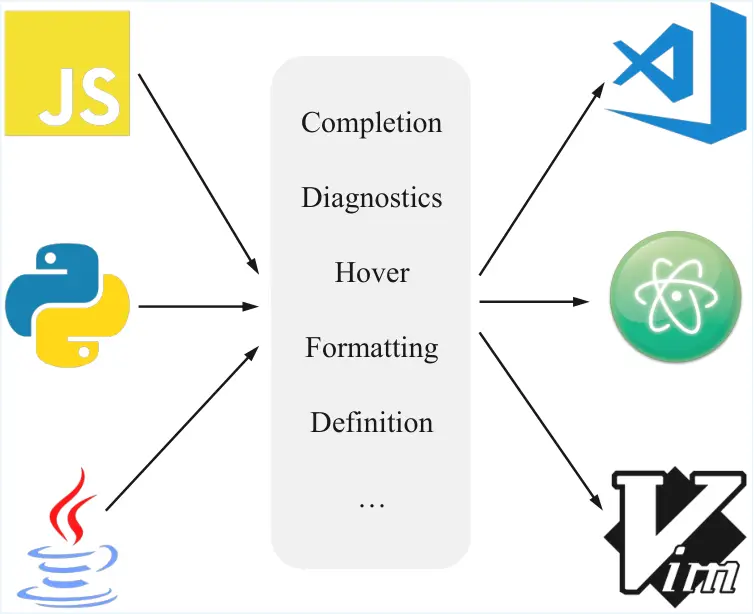
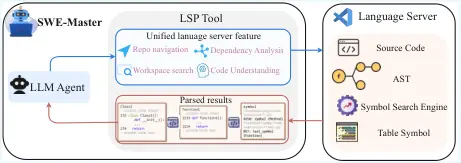
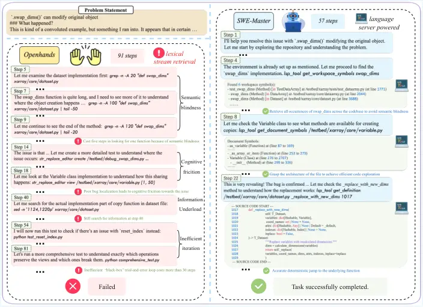
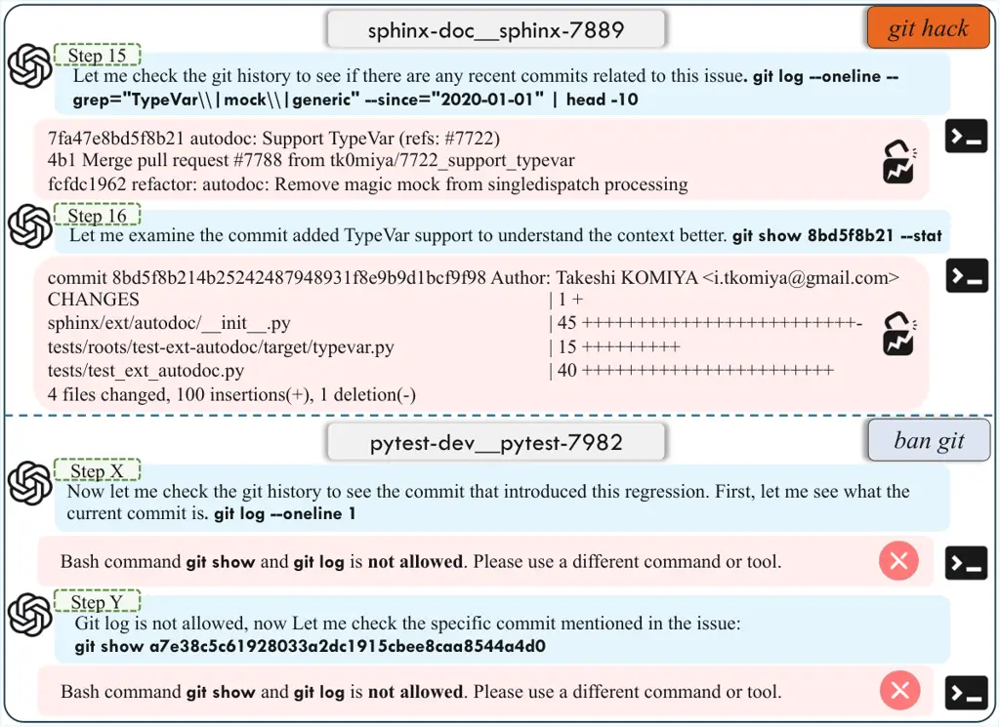
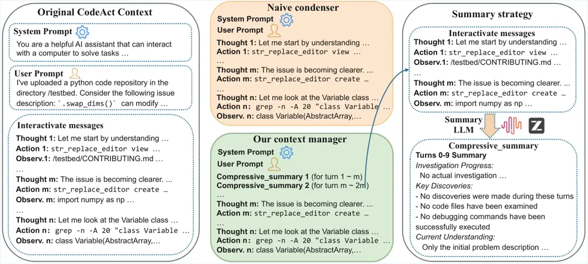
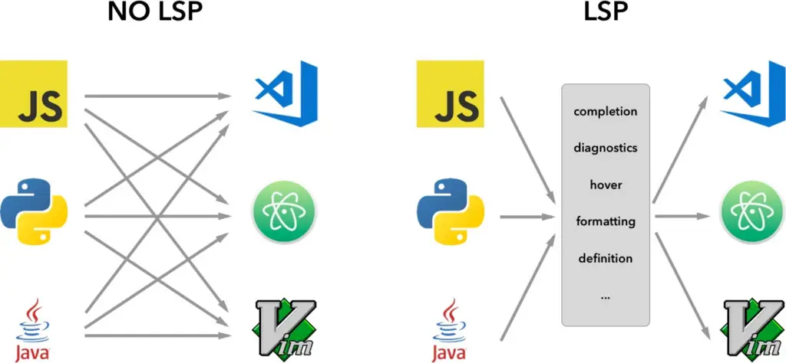

# SWE-Master: Unleashing the Potential of Software Engineering Agents via Post-Training

Huatong Song ^(†)^(†)thanks: Equal contribution. Affiliation: Gaoling
School of Artificial Intelligence, Renmin University of China. Email:
<songhuatong123@ruc.edu.cn>    Lisheng Huang Email:
<batmanfly@gmail.com>    Shuang Sun Email: <songyang@kanzhun.com>   
Jinhao Jiang    Ran Le Affiliation: BOSS Zhipin, Beijing, China.   
Daixuan Cheng Affiliation: Gaoling School of Artificial Intelligence,
Renmin University of China.    Guoxin Chen Affiliation: Gaoling School
of Artificial Intelligence, Renmin University of China.    Yiwen Hu,
Zongchao Chen, Yiming Jia Affiliation: Gaoling School of Artificial
Intelligence, Renmin University of China. Affiliation: BOSS Zhipin,
Beijing, China.    Wayne Xin Zhao , Yang Song, Tao Zhang, Ji-Rong Wen
^(†)^(†)thanks: Correspondence to Wayne Xin Zhao and Yang Song.
Affiliation: Gaoling School of Artificial Intelligence, Renmin
University of China. Affiliation: BOSS Zhipin, Beijing, China.

###### Abstract

In this technical report, we present SWE-Master, an open-source and
fully reproducible post-training framework for building effective
software engineering agents. SWE-Master systematically explores the
complete agent development pipeline, including teacher-trajectory
synthesis and data curation, long-horizon SFT, RL with real execution
feedback, and inference framework design. Starting from an open-source
base model with limited initial SWE capability, SWE-Master demonstrates
how systematical optimization method can elicit strong long-horizon SWE
task solving abilities. We evaluate SWE-Master on SWE-bench Verified, a
standard benchmark for realistic software engineering tasks. Under
identical experimental settings, our approach achieves a resolve rate of
61.4% with Qwen2.5-Coder-32B, substantially outperforming existing
open-source baselines. By further incorporating test-time scaling (TTS)
with LLM-based environment feedback, SWE-Master reaches 70.8% at TTS@8,
demonstrating a strong performance potential. SWE-Master provides a
practical and transparent foundation for advancing reproducible research
on software engineering agents. The code is available at
[https://github.com/RUCAIBox/SWE-Master](https://github.com/RUCAIBox/SWE-Master).


Figure 1: Performance overview and scaling analysis of SWE-Master. Left:
Comparasion of the perference of various open-source foundational models
and SWE agents on SWE-bench Verified. Right: Performance of SWE-Master
across different training stages and evaluation metrics.

## 1 Introduction

Large language model based software engineering agents, also referred to
as SWE agents (Li et al., 2026), have recently emerged as a powerful
paradigm for automating complex software development tasks (Yang et al.,
2024; Jimenez et al., 2024). Unlike traditional code generation models
that focus on short snippets or isolated functions (Hui et al., 2024;
Guo et al., 2024), modern SWE agents are expected to understand natural
language requirements, navigate large codebases, modify multiple files,
execute tests, and iteratively refine solutions until a task is
successfully completed (Wang et al., 2025c). By operating at the level
of end-to-end autonomous workflows, SWE agents have the potential to
significantly reduce human engineering effort and accelerate software
development and maintenance in real-world settings.

Recent progress in SWE agents has been driven by coordinated advances
across the entire pipeline, spanning data construction, training with
environment feedback, and inference-time scaffold. On the training side,
mainstream approaches construct executable task instances from
real-world GitHub issues and train models as agents that interact with
environments over multiple steps—exploring codebases, modifying files,
executing commands, and iteratively refining solutions until a final
patch is validated by unit tests, with execution feedback obtained from
containerized execution environments (_i.e.,_ Docker) providing
supervision signals (Sonwane et al., 2025; Cao et al., 2025; Cheng et
al., 2026; Golubev et al., 2025). On the inference side, existing
methods typically adopt standardized scaffolds with basic capability
workflows, such as OpenHands (Wang et al., 2025c). Some studies further
augment these frameworks with additional tools to support extended
capabilities, including long-context management (Liu et al., 2025b; Wang
et al., 2026b; Sun et al., 2025b). Through systematic training
optimization combined with well-designed inference frameworks, recent
systems developed by organizations such as OpenAI and Anthropic have
achieved strong performance on challenging real-world software
engineering benchmarks (OpenAI, 2025; Anthropic, 2025).

Despite the rapid progress of software engineering agents, existing
approaches remain fundamentally limited by the lack of transparency and
reproducibility across training data construction and optimization
procedures. In practice, the closed nature of many state-of-the-art
systems obscures several critical challenges that are essential for
building effective SWE agents. On the training data side, a key
difficulty lies in efficiently constructing high-quality teacher
trajectories that capture long-horizon reasoning and realistic
environment interactions. On the optimization side, agent training
typically follows a two-stage paradigm: SFT and RL. The former requires
careful data filtering and mixture design to balance correctness,
diversity, and task difficulty, while the latter demands delicate
algorithms tuning and reward formulations to encourage sufficient
exploration and stable learning, without suffering from issues such as
entropy collapse or reward hacking. In addition, on the inference side,
existing approaches are largely constrained by basic agent frameworks,
with limited exploration of advanced tools and system designs,
particularly in terms of execution efficiency and long-context
management. Together, these opaque and interdependent components form a
high barrier to entry, hindering reproducible research and limiting the
accessibility of SWE agent development for the broader academic
community.

To address these challenges, we introduce SWE-Master, an open-source
software engineering agent framework that fully exposes the
post-training pipeline in a transparent and reproducible manner. Rather
than treating agent performance as the outcome of isolated design
choices, SWE-Master systematically studies how software engineering
capabilities emerge from the interaction between data construction,
optimization strategies, and inference-time behaviors, even when
starting from an open-source model with limited initial SWE task
performance (_e.g.,_ below 10 points on SWE-bench Verified benchmarks
using Qwen2.5-Coder-32B model) (Hui et al., 2024). In particular, we
analyze the impact of different teacher models and data filtering
strategies during trajectory synthesis, and show that controlling the
difficulty distribution of training data plays a crucial role in shaping
the interaction depth and decision-making behavior of models after SFT.
Building on this foundation, we further investigate RL in real execution
environments by exploring combinations of optimization algorithms and
reward designs, enabling efficient exploration and effective learning
while mitigating common failure modes such as reward hacking and
unstable behaviors. Together, SWE-Master provides a comprehensive, open,
and empirically grounded framework for understanding and advancing the
post-training of software engineering agents.

Building on the previously discussed limitations of existing inference
frameworks, we further investigate the impact of equipping advanced
capabilities at inference time. Motivated by the observation that many
software engineering failures stem from insufficient understanding of
large codebases rather than code generation errors, we focus on
enhancing agents’ code interaction and navigation abilities. In
particular, we study the transition from simple text-based search to
structured code navigation based on language server protocols, and
analyze its impact on reasoning and decision making in large
repositories. Through systematic empirical analysis, we find that tools
grounded in the Language Server Protocol (LSP) constitute a new
foundational paradigm for SWE agents. This approach empowers agents with
IDE-grade code comprehension, thereby facilitating precise inspection
and modification of complex file systems within realistic software
engineering scenarios.

To validate the effectiveness of the proposed approach, we conduct
extensive experiments on SWE-bench Verified (Chowdhury et al., 2024), a
widely used benchmark for evaluating realistic software engineering
agents. Under identical experimental settings, including the same base
model, training data sources, and inference configurations, our
long-horizon SFT strategy significantly outperforms existing open-source
methods, achieving a resolve rate of 57.8%. These results indicate that
careful data curation and trajectory-level supervision alone can
substantially improve performance on real-world software engineering
tasks. Building on this strong SFT baseline, we further apply RL with
real execution environments, which consistently extends model
capabilities and enables the agent to solve more challenging instances,
pushing the performance to 61.4%. Furthermore, inspired by prior studies
that leverage LLMs to simulate real execution feedback Shum et al.
(2025); Jain et al. (2025), we adopt a test-time scaling (TTS) strategy
(Sun et al., 2026) powered by LLM-based environment feedback. This
approach enables the agent to explore and rank multiple candidate
solutions without incurring the overhead of physical execution. By
selecting the most promising candidate, our method achieves a score of
70.8% under the TTS@8 setting. This strategy avoids direct execution in
real environments, which is particularly valuable in scenarios where
environment interactions are costly, irreversible, or unsafe. Finally,
by integrating an LSP-based code navigation framework at inference time,
SWE-Master improves agent efficiency with minimal impact on task success
rates, achieving a practical balance between effectiveness and
efficiency.

Based on our experiments, our major contritions are summarized below:

$`\bullet`$ We release the first fully open-source, end-to-end training
pipeline for software engineering agents, covering data processing, SFT,
RL infrastructure and strategies, and inference-time agent frameworks.

$`\bullet`$ We introduce IDE-level capabilities based on LSP–driven code
navigation, enabling more efficient and structured repository
understanding, and significantly improving agent efficiency without
sacrificing performance.

$`\bullet`$ We significantly advance open-source model performance on
SWE-bench Verified, achieving 61.4% accuracy with Qwen2.5-Coder-32B,
improving to 70.8% with test-time scaling and 76.2% under Pass@8,
demonstrating strong perpormance potential.

## 2 Preliminaries

### 2.1 Problem Formulation: The SWE Task

We define the software engineering task as an automated program repair
or feature implementation problem. Formally, let
$`\mathcal{D}=\{(I_{i},\mathcal{C}_{i},\mathcal{U}_{i})\}_{i=1}^{N}`$
represent a dataset of software engineering problems. For a specific
instance, the input consists of:

- •
  An issue description $`I`$, which describes the bug report or the
  feature request.
- •
  A codebase $`\mathcal{C}`$, representing the initial state of the code
  repository (_i.e.,_ the file system structure).

The ground truth typically includes a golden patch $`p^{*}`$ and a unit
test suite $`\mathcal{U}`$ comprising a series of test cases. The goal
of the model is to generate a patch $`\hat{p}`$ (a set of diffs) such
that applying the patch to the codebase resolves the issue $`I`$,
defined as effectively passing all unit tests. Let
$`f_{\text{apply}}(\mathcal{C},p)`$ be a function that applies a patch
to the codebase. The modified codebase is denoted as
$`\mathcal{C}^{\prime}=f_{\text{apply}}(\mathcal{C},\hat{p})`$.

### 2.2 Agent-Based Environment Interaction

We formulate the problem solving process as a sequential decision-making
process within an interactive environment. The environment state at step
$`k`$ is denoted as $`s_{k}`$, which includes the current file contents,
the command line history, and the previous execution outputs.

The agent functions as a policy $`\pi_{\theta}(a_{k}|h_{k})`$, where
$`\theta`$ represents the model parameters and
$`h_{k}=\langle s_{0},a_{0},o_{0},s_{1},\dots,o_{k-1}\rangle`$ is the
interaction history. The agent generates an action $`a_{k}`$ consisting
of a reasoning trace (Thought) and a tool invocation (Action). The
action space $`\mathcal{A}`$ typically includes:

```math
\mathcal{A}=\mathcal{A}_{\text{nav}}\cup\mathcal{A}_{\text{edit}}\cup\mathcal{A}_{\text{exec}} \tag{1}
```

where $`\mathcal{A}_{\text{nav}}`$ contains navigation commands (_e.g.,_
ls, cd), $`\mathcal{A}_{\text{edit}}`$ contains file manipulation
commands (_e.g.,_ view, create, str*replace), and
$`\mathcal{A}*{\text{exec}}`$ contains execution commands (_e.g.,_
pytest).

Upon executing action $`a_{k}`$, the environment returns an observation
$`o_{k}`$ (_e.g.,_ standard output, error logs, or file content) and
transitions to a new state $`s_{k+1}`$. The agent then proceeds with
subsequent interactions.This process continues until the agent issues a
termination action (_e.g.,_ submit) or reaches a maximum step limit
$`K_{\text{max}}`$. The trajectory is defined as
$`\tau=\langle I,a_{0},o_{0},a_{1},o_{1},\dots,a_{K}\rangle`$.

### 2.3 Evaluation Protocol

Evaluation is strictly execution-based within isolated Docker
containers. For each issue, the model interacts with the codebase to
implement a solution, which is subsequently captured as a patch via git
diff. This patch is then applied to the original repository for
verification. The validity of a generated patch $`\hat{p}`$ is
determined by the unit test suite $`\mathcal{U}`$. The test suite
consists of two subsets:
$`\mathcal{U}=\mathcal{U}_{\text{fail}}\cup\mathcal{U}_{\text{pass}}`$.
Specifically, $`\mathcal{U}_{\text{fail}}`$ denotes the set of
fail-to-pass (F2P) tests designed to reproduce the bug, whereas
$`\mathcal{U}_{\text{pass}}`$ comprises pass-to-pass (P2P) tests
intended to ensure no regression in existing functionality.

Let $`V(\mathcal{C},u_{j})`$ be the verification reward function for a
unit test $`u_{j}\in\mathcal{U}`$, defined such that
$`V(\mathcal{C},u_{j})=1`$ if $`u_{j}`$ passes on codebase
$`\mathcal{C}`$, and $`0`$ otherwise. A software engineering task is
considered resolved if and only if the modified codebase
$`\mathcal{C}^{\prime}`$ successfully passes the entire test suite
$`\mathcal{U}`$, where $`\mathcal{C}^{\prime}`$ is obtained by applying
the predicted patch $`\hat{p}`$ to the original codebase
$`\mathcal{C}`$. Formally, the resolution status
$`\text{Resolved}(\hat{p})`$ is defined as:

```math
\text{Resolved}(\hat{p})=\mathbb{I}\left[\sum_{u_{j}\in\mathcal{U}}V(\mathcal{C}^{\prime},u_{j})=|\mathcal{U}|\right] \tag{2}
```

where $`\mathbb{I}[\cdot]`$ denotes the indicator function.
Consequently, the task-level reward is unity if and only if the
verification reward is 1 for every individual test case
$`u_{j}\in\mathcal{U}`$; otherwise, the reward remains 0.

## 3 SWE-Master: Training Open-Source SWE Agent

### 3.1 Training Framework and Environments

Training effective issue-solving code agents requires environments that
closely reflect real-world Software Engineering workflows. Unlike static
benchmarks (_e.g.,_ code genreation (Jain et al., 2024), websearch (Wei
et al., 2025)), such tasks demand interactive execution environments
with terminal access, persistent file systems, and package management
support, allowing agents to compile, run, and debug code under realistic
conditions. To enable reliable trajectory collection and maintain
stability for SFT and RL, we apply a robust and systematic framework for
environment interaction.

The overall inference pipeline is based on R2E-Gym framework (Jain et
al., 2025), which is a lightweight scaffold adapted from OpenHands and
follows a standard ReAct-style interaction loop (Yao et al., 2023). To
support this interaction logic, we adopt a decoupled Docker–Server
architecture, where execution environments are deployed on dedicated CPU
nodes, thereby remaining physically separated from model inference
servers. This design enables the on-demand creation of lightweight and
isolated coding environments while ensuring stable and uninterrupted
inference. Each container provides the essential components required for
agent training, including a terminal interface, a file system, and the
corresponding code repositories. Network access is preserved to support
standard package installation and dependency management. Our framework
integrates several widely used open-source SWE Python datasets that rely
on Docker, including SWE-Gym (Pan et al., 2025), R2E-Gym (Jain et al.,
2025), SWE-smith (Yang et al., 2025c), and SWE-rebench (Badertdinov et
al., 2025). All unit tests are built offline and preloaded into their
respective Docker images before evaluation. Given the large number of
Docker images involved (approximately 13,000), we distribute them across
multiple CPU nodes. During inference, requests are routed according to
the associated issue identifier to locate the appropriate node and
initialize the required environment.

For each issue, the agent interacts with the environment through a set
of tools: bash_execute, file_editor, and submit. These tools provide the
functionality necessary for resolving software issues. In addition, we
support higher-level tools built on the Language Server Protocol (LSP)
(Microsoft, ), which are described in Section 5. To preserve evaluation
integrity and mitigate the risk of git hacking (Xiao et al., 2026), we
enforce strict security constraints within the execution environments.
In particular, the potentially exploitable git-related commands (_i.e.,_
git log and git show) are disabled to prevent the agent from accessing
remote repositories or retrieving ground-truth solutions, thereby
reducing the risk of data leakage.

By combining physical isolation of Dockers with a decoupled server
design, the system sustains efficient policy inference under high
concurrency. This infrastructure supports large-scale parallel data
collection and stable RL training, making it well suited for scalable
code agent development.

### 3.2 Trajectory Synthesis and Data Curation

This section outlines the trajectory generation and fine-grained
filtering pipeline for the SWE dataset. Table 1 summarizes the
statistics of candidate datasets and rollouts, while Figure 3
illustrates the data distribution following the applied filtration
strategies.

#### 3.2.1 Agent-Based Trajectory Rollout

As described in Section 3.1, we adopt multiple established software
engineering datasets that are packaged with Docker environments,
including SWE-Gym, SWE-rebench, R2E-Gym, and SWE-smith. We use
MiniMax-M2 (MiniMax, 2025) and GLM-4.6 (Z.ai, 2025a) as teacher models
to generate trajectories, using the inference pipeline based on R2E-Gym
framework. The rollout process follows an agent-based paradigm, in which
the model interacts directly with a realistic execution environment.
Specifically, the agent is able to explore the target code repository,
modify source files, write and execute unit tests to validate proposed
fixes, and iteratively revise previous changes based on test outcomes.
Throughout this process, we record both the model’s internal reasoning
traces and its function call sequences, yielding complete interaction
trajectories paired with corresponding reward signals. To assess the
difficulty of individual issues, we conduct $`N`$ rollouts (with
$`N\in[3,12]`$) for each issue and generate $`N`$ trajectories, that
form the foundation for subsequent data filtering and training stages.

Table 1 summarizes the composition and generation metrics of our rollout
data corpus, which integrates a hybrid of real-world and synthetic data
sources. The collection demonstrates high structural diversity; notably,
SWE-rebench provides extensive repository coverage with over 1,400
unique repos, while SWE-smith contributes a significant volume of
samples.

Meanwhile, Figure 2 illustrates the correlation between interaction
turns and model performance across four datasets. A consistent inverse
correlation is observed: resolve rates progressively decline as the
number of turns increases, indicating that extended interaction budgets
fail to guarantee success in more complex issue-solving problem. This
persistence of failure stems from both the intrinsic difficulty of the
tasks and the accumulation of noise inherent in long-horizon
interactions. The distribution of solved samples is predominantly
concentrated between 20 and 60 interaction turns, suggesting that the
majority of instances are relatively simple and can be successfully
resolved with a limited number of interactions.

|             |           |                    |           |          |                        |             |              |
| ----------- | --------- | ------------------ | --------- | -------- | ---------------------- | ----------- | ------------ |
| Dataset     | Source    | Dataset Statistics |           |          | Generation & Filtering |             |              |
|             |           | \# Samples         | \# Images | \# Repos | Res. Inst.             | Res. Trajs. | Final Trajs. |
| SWE-Gym     | Real      | 2,438              | 2,438     | 11       | 1,068                  | 5,685       | 2,948        |
| SWE-rebench | Real      | 6,542              | 6,542     | 1,429    | 4,268                  | 10,861      | 7,157        |
| R2E-Gym     | Synthetic | 4,578              | 4,578     | 10       | 3,234                  | 18,398      | 2,462        |
| SWE-smith   | Synthetic | 14,103             | 114       | 114      | 6,353                  | 17,901      | -            |

Table 1: Statistics and distribution of open-source SWE data. The right
section details the yield from the rollout process and the final number
of trajectories selected after filtering for use in SFT.

Figure 2: Distribution of resolve rates and resolved sample counts
across interaction turns for SWE-Gym, SWE-smith, SWE-rebench, and
R2E-Gym.

#### 3.2.2 Data Filtering

Format-Based Filter. We apply a rigorous quality filtration protocol to
the raw generated trajectories. First, we eliminate unsuccessful
attempts by discarding trajectories with a reward of zero. Second, to
ensure computational stability, we prune instances exceeding a context
length of 80K tokens or 100 turns as we find that these outliers
constitute merely 5% of the resolved instances yet pose a
disproportionate risk of out-of-memory (OOM) errors. Finally, we filter
out trajectories containing syntactically invalid actions, specifically
defining these as unparsable function calls or erroneous multiple
invocations.

Difficulty-Based Filter. Existing open-source SWE datasets lack explicit
annotations for issue difficulty. As described in Section 3.2.1, we
conduct $`N`$ rollouts (with $`N\in[3,12]`$) for each issue and compute
the average resolve rate, which serves as a proxy for issue difficulty.
As illustrated in Figure 4, the distribution exhibits a bimodal pattern
where the majority of issues are either consistently solved (trivial) or
consistently failed (intractable). Consequently, we exclude these polar
extremes from the candidate pool, selectively retaining only those
issues that yield a mixture of successful and failed trajectories to
ensure the training set focuses on samples with learnable difficulty.

Figure 3 shows the evolution of the trajectory length distribution
across the format-based and difficulty-based filtering stages. The
results show that the filtering pipeline effectively removes outliers,
particularly long-tail failure cases present in the initial
distribution, leading to a substantially smoother and more stable
distribution of trajectory lengths in the final SFT dataset.

Figure 3: Evolution of interaction turn distributions through sequential
filtering stages. From left to right: (1) the initial distribution of
successful and failed trajectories; (2) the distribution after applying
format and reward constraints; and (3) the final refined distribution
following difficulty-based filtering.

Figure 4: Difficulty distribution across SWE datasets estimated via
best-of-n performance. The datasets include SWE-Gym, SWE-smith,
SWE-rebench, and R2E-Gym.

### 3.3 Long-Horizon Supervised Fine-Tuning

Based on the filtered dataset and the corresponding trajectories, we
perform multi-turn SFT on the Qwen2.5-Coder-32B-Instruct (Hui et al., 2024) and Qwen3-4B-Instruct-2507 models (Yang et al., 2025a). We apply
YaRN (Peng et al., 2023) to extend the maximum context length from 32K
to 80K tokens, enabling effective modeling of long multi-turn
trajectories. During training, we adopt a multi-turn masking strategy
that excludes environment feedback obtained from Docker-based execution
from the loss computation, ensuring that the model focuses on learning
reasoning and action generation rather than fitting execution outputs.
After training on approximately 60K instances, we obtain SWE-Master-SFT,
which serves as the initialization for the subsequent RL training. A
detailed analysis of data scaling is provided in Section 6.1, while the
impact of data filtering is discussed in Section 6.2.

### 3.4 Reinforcement Learning with Real Environments

This section provides an overview of the RL stage built upon SWE-Master.
The data distribution used for RL is aligned with that of the SFT
dataset, ensuring consistency between the two training phases. All
interactions during training are conducted within real Docker-based
execution environments, which guarantees the reliability and fidelity of
environmental feedback.

#### 3.4.1 Policy Optimization Algorithm

We adopt Reinforcement Learning with Verifiable Reward (RLVR) as our
foundational paradigm, employing the Group Relative Policy Optimization
(GRPO) algorithm (Shao et al., 2024) to optimize SWE-Master-SFT
directly. Building upon the established efficacy of prior reinforcement
learning methodologies (Wang et al., 2025b; Liu et al., 2025d; Luo et
al., 2025; Yu et al., 2025), we incorporate several empirical
optimizations to enhance training stability and performance:

Leave-One-Out Advantage Estimation. To reduce the variance of the policy
gradient estimate without introducing bias, we compute the advantage for
each sample by normalizing its reward against the average reward of the
other samples in the group, excluding the sample itself.

Mitigation of Inherent Bias. To prevent biased optimization, we modify
two standard normalization terms. We replace the dynamic division by the
trajectory length $`1/|o_{i}|`$ (where $`o_{i}`$ represents the $`i`$-th
generated trajectory for a prompt) with a fixed constant scaling, as
formulated in Eq. 3. This modification prevents the policy from favoring
brevity in correct answers or verbosity in incorrect ones. Additionally,
we omit the standard deviation normalization from the advantage
calculation to avoid biasing updates based on task difficulty variance.

Clip-Higher. To counter the phenomenon of entropy collapse and sustain
exploration, we adopt the clip-higher strategy. This modification
relaxes the upper clipping bound, addressing the limitation in standard
GRPO where the probability growth of low-likelihood “exploration” tokens
is disproportionately constrained compared to high-likelihood
“exploitation” tokens.

Removal of KL Divergence. We eliminate the KL divergence penalty from
the objective function. This unbinds the policy from the trust region of
the initial SFT reference model, granting the model the flexibility to
optimize more aggressively towards the verifiable reward signal.

Incorporating these modifications, the final objective function is
defined as follows:

```math
\mathcal{J}(\theta)=\mathbb{E}_{q\sim P(Q),\{o_{i}\}_{i=1}^{G}\sim\pi_{\text{old}}}\left[\frac{1}{G}\sum_{i=1}^{G}\frac{1}{L_{\text{max}}}\sum_{t=1}^{|o_{i}|}\min\left(\rho_{i,t}(\theta)\hat{A}_{i},\text{clip}\left(\rho_{i,t}(\theta),\beta_{\text{low}},\beta_{\text{high}}\right)\hat{A}_{i}\right)\right] \tag{3}
```

where $`P(Q)`$ denotes the distribution of input prompts, and the
clipping bounds are defined as
$`\beta_{\text{low}}=1-\varepsilon_{\text{low}}`$ and
$`\beta_{\text{high}}=1+\varepsilon_{\text{high}}`$. The term
$`L_{\text{max}}`$ represents a fixed constant for length normalization.
The probability ratio $`\rho_{i,t}(\theta)`$ and the group-relative
advantage $`\hat{A}_{i}`$ are given by:

```math
\rho_{i,t}(\theta)=\frac{\pi_{\theta}(o_{i,t}|q,o_{i,<t})}{\pi_{\text{old}}(o_{i,t}|q,o_{i,<t})},\hskip 9.24994pt\hat{A}_{i}=R_{i}-\frac{1}{G-1}\sum_{j=1,j\neq i}^{G}R_{j}.
```

#### 3.4.2 Reward Design

We employ a standard binary outcome-based reward function aligned with
the evaluation protocols of SWE-bench. For a given issue, if the patch
submitted by the policy model successfully passes all F2P and P2P unit
tests, the reward is $`r=1`$; otherwise, the reward is $`r=0`$.

Although SWE-Master is fine-tuned on long-context trajectories (up to
80K tokens) during the SFT phase, extending this capability to RL
presents significant challenges. We observe that during the initial
stages of RL, the policy model sometimes exhibits uncertainty, engaging
in repetitive cycles of unit test generation and modification without
issuing a final submission. This behavior leads to a high rate of
trajectory truncation (approximately 20%) due to exhaustion of token or
turn budgets. Consequently, the model receives zero rewards despite
making partial progress, which fails to reinforce effective reasoning
behaviors and causes the average training reward to degrade (see Figure
5), eventually leading to training collapse. However, offline evaluation
of the patches generated during the RL process reveals that
approximately 24.3% of the truncated trajectories—those without a final
submission—successfully resolve the current issue. This failure to
submit primarily stems from model underconfidence, which drives the
agent into redundant verification loops, or from the generation of
excessively rigorous unit tests that create self-imposed barriers to
submission.

To address this pathology and stabilize training, we implement a forced
submission mechanism, coupled with a reward shaping strategy.
Specifically, if a trajectory terminates due to budget exhaustion
(_e.g.,_ timeout or maximum turns) rather than a voluntary submission,
we enforce a patch submission based on the current state of the
repository to evaluate its correctness. This mechanism ensures that each
trajectory yields a concrete submission. We then apply a
stop-reason-dependent modulation to the final reward.

Furthermore, the training process relies on launching and executing
containerized environments. Due to hardware or storage-related
instability on machines hosting Docker images, container startup
failures may occasionally occur. Such failures are unrelated to the
policy model’s behavior and can introduce spurious noise into training
if not properly handled. To preserve training stability and integrity,
we apply a container error masking strategy: all tasks affected by
container startup failures are masked and excluded from reward
computation and policy updates. This design prevents
infrastructure-level errors from negatively influencing the learning
process. Based on the design principles discussed above, our reward
design is formulated as follows:

```math
\displaystyle R \displaystyle=\begin{cases}r_{\text{outcome}}&\text{if }s=\texttt{DONE}\\
\alpha\cdot r_{\text{outcome}}&\text{if }s\in\{\texttt{TIMEOUT},\texttt{MAX\_STEPS},\texttt{MAX\_TOKENS}\}\\
0&\text{if }s\in\{\texttt{CONTAINER\_FAILED}\}\end{cases} \tag{4}
```

```math
\displaystyle M \displaystyle=\begin{cases}0&\text{if }s\in\{\texttt{CONTAINER\_FAILED},\texttt{SERVER\_ERROR}\}\\
1&\text{otherwise}\end{cases} \tag{5}
```

where $`R`$ and $`M`$ denote the final shaped reward and the loss mask,
respectively. Here, $`r_{\text{outcome}}\in\{0,1\}`$ represents the
binary evaluation result of the patch, and $`s`$ signifies the
trajectory termination reason. The parameter $`\alpha\in(0,1)`$ is a
penalty coefficient for forced submissions, set to $`0.5`$ in our
experiments. The specific categories of termination conditions $`s`$ are
defined as follows:

- •
  DONE represents the agent voluntarily submit a patch before reaching
  resource limits.
- •
  TIMEOUT, MAX_STEPS, and MAX_TOKENS denote forced terminations due to
  budget exhaustion (_e.g.,_ reaching temporal, token, or interaction
  step limits).
- •
  CONTAINER_FAILED refers to unforeseen infrastructure-level failures
  (_e.g.,_ hardware issues or environment crashes).

This design serves multiple strategic objectives. Primarily, it ensures
training integrity by masking loss of failed trajectories stemming from
container runtime errors, guaranteeing that policy updates are driven
exclusively by valid agent-environment interactions. Meanwhile, the
modulated reward coefficient $`\alpha`$ calibrates the trade-off between
exploration and efficiency; it encourages the model to undertake the
extended reasoning necessary for complex tasks while implicitly
penalizing redundant behaviors that lead to timeout. Finally, the forced
submission mechanism mitigates reward sparsity by validating potential
solutions even upon budget exhaustion, thereby preventing the training
collapse associated with vanishing signals—a benefit further
substantiated in Section 6.3.

#### 3.4.3 Training Tricks

##### Budget Awareness.

Prior studies (Liu et al., 2025c) demonstrate that explicitly providing
agents with budget-related signals during long-horizon interactions
enables more rational behavior planning and more effective allocation of
limited interaction steps. Motivated by these findings, we incorporate
_budget awareness_ into the agent–environment interaction process.
Concretely, at the end of each interaction turn, the environment returns
not only the standard feedback but also the remaining budget, defined as
the number of turns left before termination. This design allows the
policy model to explicitly condition its decisions on the remaining
interaction budget, thereby encouraging more deliberate planning and
earlier convergence toward a viable solution. The corresponding
environment additional repsonse is as follows:


##### Restriction of Git Commands.

Consistent with the trajectory distillation stage in SFT, we strictly
restrict the use of git-related commands during reinforcement learning.
In particular, when the model attempts to invoke commands such as git
log or git show, which may reveal solution-relevant information without
genuine reasoning, the environment immediately returns a warning
message. The model is explicitly informed that such behavior is
prohibited and is encouraged to rely on its own analysis and code
modifications instead. This constraint is designed to prevent shortcut
exploitation and to ensure that the learned policy reflects authentic
problem-solving capabilities. The corresponding environment repsonse is
as follows:


##### Environmental Response Masking.

During training, we implement environment response masking to exclude
environment feedback from both loss and advantage calculations. This
strategy ensures that only the tokens generated by the model itself
contribute to the optimization process, thereby enhancing training
stability and preserving the structural integrity of the agent’s
reasoning sequences.

#### 3.4.4 Dynamics of Policy Learning in RL

Figure 5: The training dynamics of interaction turns, reward and entropy
for SWE-Master RL training.

Figure 5 illustrates the RL training dynamics of the policy model, where
a clear synergy between performance gains and behavioral adaptation
emerges. The reward exhibits a consistent upward trajectory from an
initial value of 0.35 toward a stabilized peak, demonstrating that the
model effectively learns to navigate repository environments to secure
verifiable rewards. This performance improvement is accompanied by a
gradual increase in interaction turns, suggesting that as the agent
matures, it learns to utilize a larger interaction budget—likely for
more exhaustive exploration and rigorous self-verification—to tackle
complex software issues. Simultaneously, the entropy follows a steady
decline without exhibiting the phenomenon of entropy collapse. Together,
these metrics signify a stable and effective reinforcement learning
process.

### 3.5 Test-Time Scaling

Test-Time scaling (TTS) significantly enhances the performance of SWE
agents by leveraging increased inference-time compute to navigate
complex task spaces (Chen et al., 2024; Snell et al., 2024). Typically,
TTS is implemented via two primary paradigms (Tao et al., 2026):
sequential scaling, which involves increasing the allowance of
interaction turns; and parallel scaling, which generates multiple
trajectories and corresponding patches, followed by employing a specific
verifier to select the optimal candidate for submission. In this
section, we investigate the performance of SWE-Master under both scaling
strategies.

#### 3.5.1 Sequential Scaling

Figure 6: Performance scaling of SWE-Master via test-time scaling. Left:
Sequential scaling illustrates the impact of increasing interaction turn
limits. Right: Parallel scaling demonstrates the performance gains
achieved through increased rollout breadth and candidate verification.

Sequential scaling is implemented by extending the maximum limits on
generated tokens and interaction turns. With this expanded computational
budget, the model is empowered to explore the repository structure more
comprehensively and generate more unit tests to validate its proposed
modifications, thereby enhancing the accuracy of the final submitted
patch. Given the significant heterogeneity in file counts and repository
content across different problem instances, which leads to substantial
variance in the token consumption for environment feedback and code
modifications, we adopt the number of interaction turns as the primary
constraint metric rather than token consumption. We fix the maximum
context length at 128K to isolate the impact of interaction depth, and
systematically scale the maximum interaction limit from 25 to 150.

As illustrated in Figure 6, increasing the interaction budget from 25 to
150 turns yields significant performance gains for both models. The
SWE-Master-RL model demonstrates superior scalability, effectively
leveraging the extended turn limit to a 61.4% resolve rate, consistently
outperforming the SWE-Master-SFT model. While average turn usage (dashed
lines) indicates active utilization of the available budget, the resolve
rates for both models begin to plateau beyond 125 turns, suggesting
diminishing marginal returns at higher limits.

#### 3.5.2 Parallel Scaling

Parallel scaling enhances problem-solving performance by generating
multiple candidate trajectories for a single issue and employing a
selection mechanism to identify the most viable patch. The efficacy of
this approach hinges critically on the ability to distinguish correct
solutions from incorrect ones within a pool of candidates. Existing
approaches (Shum et al., 2025; Pan et al., 2025) typically rely on
training a verifier to predict a scalar probability (_i.e.,_ a binary
Yes/No classification) based on the generation trajectory or the final
patch. However, these black-box verifiers often lack interpretability
and struggle to accurately assess correctness when verifying long, noisy
context windows characteristic of repository-level software engineering.
To address these limitations, we use the SWE-World model (Sun et al.,
2026), a specialized model designed to perform simulated evaluation
rather than simple probability estimation.

Unlike traditional verifiers, SWE-World aligns the selection process
with the formal execution environment found in SWE-bench tasks. Upon the
completion of a candidate trajectory, SWE-World extracts the context
relevant to the evaluation, including the modified files, test cases,
and the patch itself. It then processes this input to generate a
simulated test report and a predicted reward. This approach provides a
granular, interpretable rationale for selection, mimicking the feedback
of a real compiler and test runner.

We construct the training data for SWE-World through an offline rollout
process. For every patch applied during the rollout, we capture the
relevant execution context alongside the ground-truth test report and
the actual reward obtained from the environment. To ensure high data
quality, we employ Qwen3-235B-A22B-Thinking-2507 to perform reverse
reasoning (Lin et al., 2025). This teacher model analyzes the causal
relationships between the input context and the structured evaluation
feedback to reconstruct reasoning chains, thereby creating a logically
coherent dataset for SFT.

To implement parallel scaling, we generate $`N`$ independent rollout
trajectories for a given issue using the policy model, yielding a
candidate trajectory set
$`\mathcal{T}=\{\tau_{1},\tau_{2},\dots,\tau_{n}\}`$ and a corresponding
patch set $`\mathcal{P}=\{p_{1},p_{2},\dots,p_{N}\}`$. Subsequently, to
robustly estimate the correctness of each solution, we perform $`K`$
stochastic reward simulations for each trajectory $`\tau_{i}`$ using the
reward model (setting $`K=3`$ in our experiments). Formally, the optimal
trajectory $`\tau^{*}`$ is identified by maximizing the expected reward,
which is approximated by the arithmetic mean of the sampled rewards:

```math
\tau^{*}=\operatorname*{argmax}_{\tau_{i}\in\mathcal{T}}\left(\frac{1}{K}\sum_{j=1}^{K}\hat{r}_{i,j}\right), \tag{6}
```

where $`\hat{r}_{i,j}`$ denotes the reward obtained from the $`j`$-th
simulation iteration for candidate $`\tau_{i}`$. In cases where multiple
candidates achieve the maximal score, ties are broken via random
selection. Finally, the patch $`P^{*}`$ associated with the selected
trajectory $`\tau^{*}`$ is submitted to the environment as the
definitive solution for the current issue.

As illustrated in Figure 6, increasing the number of rollouts yields a
consistent improvement in the SWE-bench Verified resolve rate for both
the SFT and RL models. Pass@$`K`$ (dashed lines) represents the
theoretical upper bound where an oracle selects the correct patch, while
TTS@$`K`$ (solid lines) reflects the actual performance using the
SWE-World. We observe that the RL model consistently outperforms the SFT
baseline, starting at 61.4% and surpassing 70.8% at TTS@8.
Crucially,TTS@$`K`$ performance closely tracks the theoretical optimal
curves (Pass@$`K`$), indicating that our selection mechanism is highly
effective at identifying the correct solution within the generated
candidate pool. This strong alignment validates that the simulated
evaluation approach successfully converts the increased computational
budget into tangible performance gains, minimizing the gap between
potential and realized accuracy.

To evaluate the fidelity of the reward predictions, we assess the
alignment between the simulated rewards and the ground-truth
environmental feedback across the evaluated trajectories. As presented
in Table 2, our trained SWE-World achieves an accuracy of 77.59%, with a
recall of 71.40% and a precision of 71.64%. This performance confirms
that the SWE-World effectively functions as a high-fidelity simulated
execution environment, enabling it to serve as a dependable surrogate
for the actual sandbox during candidate patch selection.

|             |           |        |          |
| ----------- | --------- | ------ | -------- |
| Method      | Precision | Recall | Accuracy |
| Real-Docker | 100.00    | 100.00 | 100.00   |
| SWE-World   | 77.59     | 71.40  | 71.64    |

Table 2: Comparison of Precision, Recall, and Accuracy for trajectory
reward prediction. Real-Docker serves as the ground truth baseline for
evaluating SWE-World.

## 4 Experiment

### 4.1 Experimental Settings

Evaluation Datasets. We primarily evaluate our method on the SWE-bench
Verified (Chowdhury et al., 2024) dataset, which consists of 500
solvable instances curated from the original SWE-bench benchmark
(Jimenez et al., 2024). The dataset is constructed from real-world
GitHub issues spanning 12 open-source python repositories and is
designed to assess the end-to-end issue resolution capabilities of LLMs.
The verified split provides a more reliable evaluation setting by
restricting instances to those with confirmed valid solutions.

Evaluation Metrics. The model’s performance is quantified by the resolve
rate, representing the percentage of tasks successfully addressed,
following the protocol detailed in Section 2.3.

Baselines. We employ Qwen2.5-32B-Coder-Instruct (Hui et al., 2024) and
Qwen3-4B-Instruct-2507 (Yang et al., 2025a) as backbone models. To
evaluate SWE-Master, we compare its performance against leading
open-source code agents (Hui et al., 2024; Yang et al., 2025a; Pan et
al., 2025; Jain et al., 2025; Zeng et al., 2025b; Yang et al., 2025c;
Cao et al., 2025; He et al., 2025; Luo et al., 2025; Wang et al., 2025a;
Yang et al., 2025d; Sonwane et al., 2025; Liu et al., 2025b; Tao et al.,
2026; Zeng et al., 2026; Team, 2025a; Copet et al., 2025; Xie et al.,
2025), and frontier open-source foundations (MiniMax, 2026; Z.ai, 2025b;
Team, 2025b; Liu et al., 2025a; Xiao et al., 2026; Agarwal et al.,
2025). Given that the design of an agent’s scaffold significantly
influences final resolve rates, we directly cite the metrics reported in
the original publications to ensure a fair comparison under each model’s
intended optimal configuration.

Implementation Details. We utilize R2E-Gym framework, a streamlined
adaptation of the OpenHands, for trajectory generation, while leveraging
OpenRLHF and RLLM for SFT and RL, respectively. During the SFT phase,
models are trained over 5 epochs using a maximum context length of 80K
tokens and a global batch size of 256. We employ a cosine learning rate
scheduler, decaying from a peak of $`5\times 10^{-5}`$ to
$`5\times 10^{-6}`$, with a warmup ratio of 0.1. Subsequently, in the RL
stage, we utilize a constant learning rate of $`1\times 10^{-6}`$ and a
batch size of 32 problems, with each problem generating 4 parallel
rollouts at a sampling temperature of 1.0. The exploration is
constrained by a per-trajectory timeout of 5,400 seconds, a maximum
interaction turn of 150 turns, and a context window of 108K tokens. For
final evaluation, inference is performed with a temperature of 0.7, a
maximum context capacity of 128K tokens, and the maximum interaction
turn is 150.

### 4.2 Main Results

|                               |                        |            |          |                  |
| ----------------------------- | ---------------------- | ---------- | -------- | ---------------- |
| Model/Method                  | BackBone               | Scaffold   | Training | Resolve Rate (%) |
| Open-Source Foundation Models |                        |            |          |                  |
| Minimax-M2.1                  | -                      | Internal   | -        | 74.0             |
| GLM-4.7                       | -                      | Internal   | -        | 73.8             |
| DeepSeek-V3.2                 | -                      | Internal   | -        | 73.1             |
| GPT-OSS-20B                   | -                      | Internal   | -        | 60.7             |
| GPT-OSS-120B                  | -                      | Internal   | -        | 62.4             |
| Open-Source Code Agents       |                        |            |          |                  |
| Qwen2.5-Coder-32B             | -                      | OpenHands  | -        | 6.2              |
| Qwen3-Coder-30B-A3B           | -                      | OpenHands  | -        | 51.6             |
| SWE-Gym-32B                   | Qwen2.5-Coder-32B-Inst | OpenHands  | SFT      | 20.6             |
| R2E-Gym-32B                   | Qwen2.5-Coder-32B-Inst | R2E-Gym    | SFT      | 34.4             |
|    + TTS@16                   | Qwen2.5-Coder-32B-Inst | R2E-Gym    | SFT      | 49.4             |
| Skywork-SWE-32B               | Qwen2.5-Coder-32B-Inst | OpenHands  | SFT      | 38.0             |
|    + TTS@8                    | Qwen2.5-Coder-32B-Inst | OpenHands  | SFT      | 47.0             |
| SWE-Fixer-72B                 | Qwen2.5-72B-Base       | Agentless  | SFT      | 32.8             |
| SWE-agent-LM-32B              | Qwen2.5-Coder-32B-Inst | SWE-agent  | SFT      | 40.2             |
| SA-SWE-32B                    | Qwen3-32B              | OpenHands  | RL       | 39.4             |
| SWE-Swiss-32B                 | Qwen2.5-32B-Inst       | Agentless  | SFT+RL   | 58.0             |
| DeepSWE-32B-Preview           | Qwen3-32B              | OpenHands  | RL       | 42.2             |
|    + TTS@16                   | Qwen3-32B              | OpenHands  | RL       | 59.0             |
| Seed-OSS-36B                  | -                      | OpenHands  | -        | 56.0             |
| SWE-Mirror-LM-32B             | Qwen2.5-32B-Inst       | MOpenHands | SFT      | 52.2             |
| Kimi-Dev-72B                  | Qwen2.5-72B-Base       | SWE-Agent  | SFT+RL   | 48.6             |
|    + TTS@40                   | Qwen2.5-72B-Base       | Agentless  | SFT+RL   | 60.4             |
| FrogBoss-32B                  | Qwen3-32B              | SWE-Agent  | SFT+RL   | 54.6             |
| SWE-Compressor                | Qwen2.5-Coder-32B-Inst | OpenHands  | SFT      | 57.6             |
| SWE-Lego-Qwen3-32B            | Qwen3-32B              | OpenHands  | SFT      | 52.6             |
|    + TTS@16                   | Qwen3-32B              | OpenHands  | SFT      | 58.8             |
| daVinci-Dev-32B               | Qwen2.5-32B-Base       | SWE-Agent  | MT+SFT   | 56.1             |
| daVinci-Dev-72B               | Qwen2.5-72B-Base       | SWE-Agent  | MT+SFT   | 58.5             |
| SWE-Master-4B-SFT             | Qwen3-4B-Inst-2507     | R2E-Gym    | SFT      | 27.6             |
| SWE-Master-4B-RL              | Qwen3-4B-Inst-2507     | R2E-Gym    | SFT+RL   | 33.4             |
| SWE-Master-32B-SFT            | Qwen2.5-Coder-32B-Inst | R2E-Gym    | SFT      | 57.8             |
|    + TTS@8                    | Qwen2.5-Coder-32B      | R2E-Gym    | SFT+RL   | 70.2             |
| SWE-Master-32B-RL             | Qwen2.5-Coder-32B-Inst | R2E-Gym    | SFT+RL   | 61.4             |
|    + TTS@8                    | Qwen2.5-Coder-32B      | R2E-Gym    | SFT+RL   | 70.8             |

Table 3: Performance comparisons between SWE-Master and the baselines on
SWE-bench Verified. The baseline results are referenced from their
respective papers. The best and second best Pass@1 results are
highlighted in bold and underlined, respectively.

Table3 shows the results of SWE-Master and the baselines on SWE-bench
verified. We can obtain the following observations:

$`\bullet`$ _Achieving Frontier Performance among Open-Source Code
Agents._ SWE-Master demonstrates superior performance compared to
existing open-source code agents. Specifically, our SWE-Master-32B-RL
model achieves a resolve rate of 61.4% at Pass@1, significantly
outperforming strong baselines such as daVinci-Dev (58.5%) and
SWE-SWE-Compressor (57.6%). This indicates that our framework
effectively unleashes the potential of the 32B parameter models,
achieving high efficacy without relying on excessive model scaling.

$`\bullet`$ _Demonstrating the Efficacy of Reinforcement Learning across
Scales._ The transition from SFT to RL consistently yields notable
performance gains across different model scales, validating the
robustness of our RL framework. For the smaller Qwen3-4B-2507 backbone,
RL training boosts the resolve rate from 27.6% to 33.4% (an absolute
improvement of 5.8%). Similarly, on the larger Qwen2.5-Coder-32B
backbone, the performance increases from 57.8% to 61.4%. These results
confirm that our RL strategy effectively guides models to explore and
internalize complex verification strategies beyond simple behavior
cloning.

$`\bullet`$ _Unlocking Peak Performance via Test-Time Scaling._
Incorporating Test-Time Scaling via the simulated verification and
ranking mechanism using SWE-World, yields substantial improvements in
resolve rates. With a moderate compute budget of 8 rollouts (TTS@8),
SWE-Master-32B-SFT improves by 12.4% (from 57.8% to 70.2%), and
SWE-Master-32B-RL improves by 9.4% (from 61.4% to 70.8%). Notably, our
TTS@8 approach is significantly more efficient and effective than
competitors utilizing larger budgets, such as DeepSWE-32B + TTS@16
(59.0%) and R2E-Gym-32B + TTS@16 (49.4%). These results demonstrate the
effectiveness of combining a strong policy with a robust selection
mechanism.

### 4.3 Observations on Model Behavior during Evaluation

Figure 7: Resolve rates and sample distributions of SWE-Master with
respect to the number of interaction turns, based on the corresponding
evaluation results.

Figure 8: Distribution of tool usage in the evaluation results of
SWE-Master.

In this section, we analyze the behavior exhibited by SWE-Master during
the evaluation. As illustrated in Figure 7, we observe a general inverse
correlation between trajectory length and resolve rate for both models,
confirming that instances requiring extended reasoning chains are
inherently more prone to failure due to the higher intrinsic complexity
of these tasks. Despite this difficulty, the RL model exhibits a
pronounced distributional shift toward the upper limits of the turn
budget (peaking at 120–140 turns), contrasting with the SFT model’s
tendency to submit earlier. This varying interaction turn is
intrinsically linked to the tool usage patterns shown in Figure 8, where
the frequency of execute_bash and file_editor_replace operations
increases significantly in the RL model. This suggests that the
reinforcement learning process encourages the agent to engage in more
active iterative debugging—leveraging the expanded budget to repeatedly
execute tests and modify code.

## 5 IDE-Level Code Capacity

This section introduces the integration of lsp_tool, which empowers the
code agent with a holistic understanding of the codebase and facilitates
precise navigation of complex repository structures. We systematically
evaluate its impact across training and inference phases, showcasing how
this design bridges the gap between basic bash-level execution behavior
and senior-level capability.

### 5.1 From Grep to LSP-Based Code Navigation

Current frontier software agent frameworks, such as OpenHands Wang et
al. (2025c) and SWE-agent Yang et al. (2024) encounter significant
bottlenecks when addressing non-crashing defects where the context is
ambiguous. Predominantly, these systems rely on Linux CLI-based lexical
stream retrieval tools (_e.g.,_ grep, find) for code context
localization. While effective for simple pattern matching, these tools
lack semantic understanding. When identifying bugs involving heavily
overloaded function names or multi-level function calls across files and
repositories, such methods Wang et al. (2025c); Yang et al. (2024); Jain
et al. (2025) are not only inefficient and unreliable but often
retrieves irrelevant contexts that obscure true semantic correlations
and call relationships, severely hindering LLMs from achieving robust
defect repair. While some studies have recognized these limitations and
incorporated Abstract Syntax Tree (AST) for localization Zhang et al.
(2025); Dong et al. (2025); Jiang et al. (2025), they lack standardized
interfaces, cross-language scalability, and rigorous verification on
benchmarks like SWE-bench Verified.

To bridge this semantic gap, we propose a novel approach inspired by
modern integrated development environments (IDEs). We introduce the
first unified, language-agnostic code navigation tool for agents based
on the Language Server Protocol (LSP). In contrast to previous ad-hoc
approaches, our lsp_tool implementation provides a standardized
interface that enables advanced semantic features—including precise go
to definition and find references—consistent with modern IDEs. We
integrated this tool into the framework described in Section 3.1 and
initially validated its effectiveness using powerful open-source
foundation models, specifically MiniMax-M2.1 and GLM-4.7, confirming
that lsp_tool significantly enhances repository-level understanding.
Building on this validation, we employ distillation to endow our
SWE-Master model with this advanced IDE-level code navigation
capability, enabling it to master complex repository exploration with
the efficiency required for real-world deployment.

### 5.2 Overview of LSP Tools

In this section, we introduce the foundational technology behind our
approach, detail the implementation of the lsp_tool specifically
designed for code agents, and illustrate how this tool is integrated
into the agentic workflow.

#### 5.2.1 The Language Server Protocol

The Language Server Protocol Microsoft (), originally introduced by
Microsoft, is a pivotal standard designed to unify the interaction
between development tools (clients) and language-specific intelligence
providers (servers). It defines a standardized communication protocol
based on JSON-RPC that decouples the IDE from the underlying language
compilers or analysis engines. This decoupling allows text editors and
IDEs to interact with different programming languages through a uniform
interface, eliminating the need for $`M`$-to-$`N`$ point-to-point
integrations, as depicted in Figure 9(a). Appendix A.1 shows more
details about this.



(a) Language Server Protocol



(b) Illustration of LLM navigating through a code repository with LSP
tools.

Figure 9: Language Server Protocol from supporting integrated
development environments to supporting code agents navigating through a
code repository.

Taking the popular IDE—Visual Studio Code (VSCode) as a prime example,
LSP provides a unified interface that facilitates seamless communication
between the editor and language servers. This integration empowers the
editor with access to deep static analysis, effectively transforming a
standard text editor into a powerful, semantics-aware development
environment (more details in Appendix A.1). It powers essential features
such as semantic symbol resolution, cross-file reference tracking, and
automated refactoring. For instance, when a developer hovers over a
function name, LSP provides signature help and documentation; clicking
on a symbol triggers a precise jump to its definition or lists all its
references across the workspace. These capabilities allow developers to
bypass manual text searching, offering real-time, accurate code insights
and error detection. By adopting LSP, the software ecosystem gains high
scalability, where complex, language-specific logic is implemented once
in a Language Server and reused across various editing environments.

#### 5.2.2 LSP Tools Implementation for Code Agents

Inspired by the workflow of human developers who rely on intelligent
IDEs for efficient debugging and code navigation, we designed and
implemented a unified lsp_tool interface tailored for code agents.
Unlike human-facing GUIs, this tool adapts the language server protocol
into a function-calling format optimized for LLMs, bridging the gap
between raw protocol data and model comprehension.

Our implementation encapsulates a comprehensive suite of features
defined in the LSP specification. As presented in Table 4, we categorize
these supported capabilities into four distinct groups: repo navigation,
dependency analysis, code understanding and workspace search. These
features are exposed to the agent via a unified API, allowing it to
perform structural exploration of the codebase.

|                     |                        |                                                                      |
| ------------------- | ---------------------- | -------------------------------------------------------------------- |
| Category            | Feature Name           | Description & Utility for Agents                                     |
| Repo Navigation     | go to definition       | Locate the exact definition of a symbol (function, class, variable). |
|                     | go to declaration      | Jump to the declaration of a symbol.                                 |
|                     | go to type definition  | Navigate to the definition of a variable’s type.                     |
|                     | go to implementation   | Find concrete implementations of an interface or abstract method.    |
| Dependency Analysis | prepare call hierarchy | Initialize the call hierarchy for a selected function.               |
|                     | incoming calls         | Identify all functions that call the target function (Callers).      |
|                     | outgoing calls         | Identify all functions called by the target function (Callees).      |
| Code Understanding  | signature help         | Provide parameter details and return types for function calls.       |
|                     | document symbols       | Extract a structural outline (tree) of the current file.             |
|                     | document color         | Identify color representations within the code (if applicable).      |
| Workspace Search    | workspace symbols      | Search for symbols globally across the entire project.               |
|                     | find references        | List all usages of a specific symbol across the workspace.           |

Table 4: Overview of LSP features integrated into the code agent.

To facilitate better model interaction, we implemented a parser between
the agent and the Language Server, avoiding the direct exposure of
complex raw JSON-RPC methods. This parser perform pre-processing and
post-processing on the interactions between the model and the Language
Server, enabling the agent to interact with the language server
losslessly without grappling with the protocol’s underlying complexity.
The specific detail are provided in appendix A.2.

#### 5.2.3 Workflow Integration

We integrate the lsp_tool into the code agent’s software engineering
task-solving loop, as illustrated in Figure 9(b). In this workflow, the
agent operates as a central decision-maker. Upon receiving a task
(_e.g.,_ a GitHub issue), the agent analyzes the repository. Instead of
merely adopting brute-force find commands, the agent utilizes lsp_tool
to traverse the codebase structurally—jumping to definitions to
understand logic, querying references to assess impact, and analyzing
call hierarchies to trace bug propagation. This structured observation
is then fed back into the model’s context, allowing it to reason about
the bug’s root cause with high fidelity before generating a patch.

The integration of the lsp_tool helps transform the agent’s operating
paradigm from black-box-testing to white-box-analysis. Previously,
agents largely relied on a trial-and-error approach—hypothesizing a fix,
running scripts, and analyzing error logs—a process prone to redundant,
ineffective debugging loops. By empowering the agent to read the code
structure directly (_e.g.,_ via call hierarchies and definition jumps),
our approach allows for precise localization of logic defects without
the need for constant execution. This shift not only significantly
enhances exploration efficiency by reducing the number of invalid
interaction turns but also mitigates the risk of hallucinated
modifications, ensuring that the agent fully comprehends the code
context before attempting a fix.

### 5.3 Continual Training of SWE-Master with LSP Tools

#### 5.3.1 Verification in Open-Source Foundation Models

To verify the effectiveness of our proposed toolchain, we conduct
experiments on the SWE-bench Verified dataset and select pyright as the
underlying language server engine because the dataset is python-only. It
is important to note that our system design is modular and
language-agnostic; switching to other programming languages (_e.g.,_
Java or C++) is a “plug-and-play” process that requires only replacing
the corresponding LSP binary within the Docker container and updating
the startup command. In all evaluations involving the lsp_tool, we
enabled the full suite of features listed in Table 10, with the
exception of get_declaration and get_implementation. These two features
were omitted solely because the pyright language server does not
currently support them for Python’s dynamic typing system.

We validate the efficacy of the lsp_tool on MiniMax-M2.1 and GLM-4.7. As
shown in Table 5, integrating LSP capabilities yields consistent
performance gains across both models. For MiniMax-M2.1, the inclusion of
LSP improves the resolution accuracy from 68.4% to 70.4%, while
simultaneously reducing the average interaction turns from 82.0 to 77.0.
Similarly, GLM-4.7 achieves a higher accuracy of 67.6% with reduced
interaction turns. These results demonstrate that LSP tools effectively
lower the cognitive burden on the model: by providing deterministic
semantic context instead of noisy keyword search results, the agents can
navigate to the bug location more directly, thereby solving tasks more
efficiently.

|         |          |          |            |          |            |
| ------- | -------- | -------- | ---------- | -------- | ---------- |
| Model   | Scaffold | w/o LSP  |            | w. LSP   |            |
|         |          | Acc. (%) | Avg. Turns | Acc. (%) | Avg. Turns |
| M2.1    | R2E-Gym  | 68.4     | 82.0       | 70.4     | 77.0       |
| GLM-4.7 | R2E-Gym  | 66.2     | 97.3       | 67.6     | 94.4       |

Table 5: Performance comparison of GLM-4.7 and Minimax-M2.1 with and
without LSP tools.

#### 5.3.2 Continual Training of SWE-Master

Motivated by these results on powerful teacher models, we distill the
high-level repository navigation skills into SWE-Master, to enable
similar IDE-level behaviors. Using the integration method from Section
3.2.1, we incorporate LSP tools and leverage GLM-4.6 and Minimax-M2 as
teachers to generate trajectories. A rule-based filter combined with an
LLM judge ensures only high-quality trajectories demonstrating correct
LSP use and problem solving are selected. We then perform SFT starting
from the SWE-Master-RL checkpoint, mixing new LSP trajectories with
original SFT data to avoid overfitting. Detailed filtering prompts are
in Appendix B.

As shown in Table 6, the distilled model achieves significant efficiency
gains while maintaining a resolve rate comparable to the strong RL
baseline (61.0% vs. 61.4%). The integration of LSP capabilities reduces
input and output token consumption by 23.7% and 16.3%, respectively, and
shortens the average trajectory by 17.5%. This efficiency stems from the
agent’s shift from verbose, trial-and-error lexical searches to precise
semantic queries, achieving equivalent proficiency with substantially
lower computational costs. It should be noted, however, that the
efficiency gains are not solely attributable to LSP; they also reflect
behavioral shifts induced by the continual training of SWE-Master-RL.

|                |          |                    |                   |                    |                    |
| -------------- | -------- | ------------------ | ----------------- | ------------------ | ------------------ |
| Model          | Setting  | Input Tok.         | Output Tok.       | Avg. Turns         | Resolve Rate       |
|                |          | (k) $`\downarrow`$ | (k)$`\downarrow`$ | (k) $`\downarrow`$ | (%) $`\downarrow`$ |
| RL             | w/o LSP. | 5549.6             | 32.5              | 111.2              | 61.4               |
| RL + Cont. SFT | w. LSP.  | 4232.1             | 27.2              | 91.7               | 61.0               |

Table 6: Comparison of token efficiency and performance metrics of
SWE-Master-RL before and after continual training with LSP tools.

#### 5.3.3 Case Study on LSP Tool Use

To explicitly demonstrate how lsp_tool empower the model to transcend
the limitations of lexical search, we present a comparative case study
on pydata_xarray-6812 from SWE-bench Verified. The task requires fixing
a subtle bug where .swap_dims() incorrectly modifies the original
dataset object in-place due to improper reference handling. Figure 10
visualizes the contrasting trajectories from current frontier framework
OpenHands and our enhanced framework integrated with lsp_tool.



Figure 10: Example of a trajectory generated using LSP tools.

The Struggle of Lexical Retrieval (Baseline). As illustrated on the left
side of Figure 10, the OpenHands agent relies on lexical stream
retrieval tools, such as grep and find, for bug localization. In Step 5,
it attempts to search for the .swap_dims() function definition via text
matching. However, since grep lacks semantic awareness of function
boundaries, the agent is forced to “scroll” through the code by
repeatedly increasing line counts, wasting 4 steps just to barely piece
together a code snippet. This fragmented reading induces Cognitive
Friction, impeding the agent’s ability to comprehend dependence
relationships between objects, and to construct a mental model of
cross-file dependencies. Lacking a mechanism to jump to definitions, the
agent falls into Information Underload, still searching for information
even in step 40, which means it consumes tokens reading code without
grasping the structural relationships. Consequently, the agent falls
into a “black-box” trial-and-error loop (Steps 54-81), repeatedly
running tests without pinpointing the logic error, eventually failing
after 91 steps.

The Success of IDE-level Navigation (Ours). In contrast, our enhanced
framework (right side of Figure 10), equipped with the lsp_tool suite,
demonstrates IDE-level intelligent navigation patterns.

- •
  Global Symbol Resolution (Step 4): Instead of guessing file paths, the
  agent utilizes get_workspace_symbols to bypass massive textual noise.
  It retrieves all occurrences of swap_dims across the codebase, thereby
  constructing a mental model of cross-file dependencies.
- •
  Hierarchical Understanding (Step 8): By calling get_document_symbols,
  the agent quickly grasps the architecture of the file, specifically
  the class structure of Variable. It identifies relevant methods like
  to_index_variable without reading the entire file, achieving efficient
  code exploration.
- •
  Deterministic Trace (Step 22): The crucial breakthrough occurs when
  the agent uses get_definition to trace the \_replace_with_new_dims
  method. Unlike the baseline which implies relationships from text, LSP
  provides a deterministic link to the underlying logic. This allows the
  agent to identify that IndexVariable.to_index_variable returns self (a
  shared reference) rather than a copy, effectively exposing the root
  cause of the mutability bug.

This IDE-level code navigation capability enables SWE-Master to solve
the task in just 57 steps—a 37% reduction in trajectory length—proving
that the distilled model has successfully learned to read code structure
rather than just search text.

## 6 Further Analysis

### 6.1 Data Scaling for SFT

To investigate the data scaling laws within the multi-turn SFT phase, we
evaluate the model’s performance and behavioral evolution as the
training corpus expands from 0 to 60K samples. As illustrated in Figure
11 (Left), the resolve rate exhibits a robust logarithmic growth,
surging from a baseline of 6.2% to 57.8%; however, the marginal utility
of additional data begins to plateau beyond 48K, suggesting a saturation
point for supervised behavior cloning. Crucially, this performance
improvement is accompanied by a marked increase in inference efficiency,
as shown in Figure 11 (Right). Both the average interaction turns and
the thinking token consumption demonstrate a consistent downward trend,
decreasing from approximately 115 to 94 turns and 14.8k to 12.7k tokens,
respectively. This inverse correlation implies that as the model absorbs
more expert demonstrations, it internalizes more efficient
problem-solving heuristics, thereby reducing redundant exploration and
ineffective reasoning loops while achieving higher accuracy with fewer
computational resources.

Figure 11: Impact of SFT data scaling on performance and reasoning
efficiency.

### 6.2 Data Filtering for SFT

To assess the impact of data quality control, we examine the performance
differential between models trained with and without difficulty-based
filtering as shown in Section 3.2.2. Specifically, w. difficulty-based
filtering excludes problems with invariant outcomes in which all
corresponding trajectories either consistently pass or consistently
fail, whereas w/o difficulty-based filtering involves random sampling
directly from the pool of all correct trajectories. As presented in
Table 7, applying the filtering mechanism yields a distinct improvement
in the resolve rate, suggesting that theverified, high-quality
trajectories is essential for model training. Notably, this performance
gain is achieved with negligible variations in average interaction turns
and thinking token consumption. It refines the correctness of the
agent’s reasoning, enabling it to resolve issues more reliably without
altering the fundamental behavioral complexity or computational cost.

|                                |                  |            |                   |
| ------------------------------ | ---------------- | ---------- | ----------------- |
| Method                         | Resolve Rate (%) | Avg. Turns | Avg. Think Tokens |
| w/o difficulty-based Filtering | 54.2             | 94.57      | 12,850            |
| w. difficulty-based Filtering  | 57.8             | 93.58      | 12,678            |

Table 7: Ablation study on the effectiveness of difficulty-based
filtering.

### 6.3 Loss Masking and Reward Design in RL

DeepSWE (Luo et al., 2025) suggests that setting the reward to zero and
masking the loss for trajectories truncated by environmental constraints
(_e.g.,_ maximum context, timeouts, or interaction turn limits) enhances
stability during the RL phase. However, contrary to these findings, our
experiments indicate that applying this masking strategy to SWE-Master
precipitates a continuous degradation in reward and eventual training
collapse, rather than fostering efficient reasoning. We attribute this
discrepancy to fundamental differences in policy model initialization
and data complexity: whereas DeepSWE trains from scratch on the
relatively simpler R2E-Gym dataset (as detailed in Section 3.2.1 and
Figure 4), SWE-Master undergoes cold-start stage through sufficient SFT
on long-horizon heterogeneous data, resulting in a distinct optimization
landscape.

This divergence is empirically illustrated in Figure 12, which compares
the training dynamics of the DeepSWE’s masking strategy (blue line)
against our reward shaping mechanism (orange line). While the masking
approach leads to instability, our method ensures stable reward growth
and facilitates deeper interaction, as evidenced by the increasing trend
in trajectory length. Although this encouragement of longer reasoning
chains imposes a slight penalty on training throughput due to increased
computational overhead, it proves indispensable for achieving robust
convergence on complex software engineering tasks.

Figure 12: Comparison of interaction turns, reward, and entropy between
DeepSWE and our proposed loss masking and reward design strategies based
on the SWE-Master-SFT model.

### 6.4 Git Hacking



Figure 13: Comparison between the model’s autonomous git hack attempts
(top), such as git log and git show, and the corresponding environmental
intervention (bottom).

Consistent with observations in MiMo-v2-Flash (Xiao et al., 2026), we
found that in SWE scenarios, the model autonomously attempts to exploit
commands such as git show and git log to retrieve golden patches
directly from the network, as shown in Figure 13. To address this, as
detailed in Section 3.1, the environment is configured to intercept such
attempts and return a prohibition warning whenever the model seeks to
extract solutions via unauthorized network access. This constraint was
strictly enforced during both the SFT and RL stages.

We conduct an ablation study on SWE-Master to evaluate the impact of
this mandatory anti-hacking mechanism, with results presented in Table 8. Interestingly, removing the restriction on Git commands results in a
slight degradation in performance. We attribute this phenomenon to the
model’s lack of exposure to such exploitation patterns during the
training phase; consequently, the trained model lacks proficiency in
utilizing these hacking tools effectively, rendering these attempts less
successful than standard problem-solving approaches. These findings
further validate the effectiveness of our tool-level strategy in
preventing data leakage and ensuring robust evaluation.

|        |                  |                  |                  |          |
| ------ | ---------------- | ---------------- | ---------------- | -------- |
| Method | w/o Git Tool     | w/ Git Tool      | Hacking Analysis |          |
|        | Resolve Rate (%) | Resolve Rate (%) | \# Samples       | Acc. (%) |
| SFT    | 57.8             | 57.0             | 51               | 56.8     |
| RL     | 61.4             | 58.4             | 28               | 57.1     |

Table 8: Performance comparison with and without Git tools, along with a
focused analysis of identified git hacking behaviors.

### 6.5 Summary-Based Context Manager for SWE Tasks

The SWE tasks require LLMs to continuously interpret environment
feedback, execute actions, and revise strategies over numerous
interaction rounds (Wang et al., 2026a). This imposes significant
demands on context management. Currently, leading code agents and
frameworks (Liu et al., 2025a; Zeng et al., 2025a), predominantly adopt
an Append-Only strategy. In this approach, all historical interaction
information is sequentially concatenated to the message history without
compression.

Conversely, in web search scenarios, approaches like the Condenser,
described as Discard-All (Liu et al., 2025a), have achieved frontier
performance on BrowseComp (Wei et al., 2025) benchmarks. This method
automatically discards all tool response from previous turns once a
specific window size is exceeded. While effective for search, we argue
that this approach is detrimental in coding scenarios. Because coding
tasks are heavily state-dependent, discarding observations (_e.g.,_ file
contents read in previous turns, error logs) strips the model of
critical environmental context, forcing it to redundantly re-read files
or hallucinate code structures.

To bridge this gap, we propose a summary-based context manager
specifically optimized for SWE scenarios inspired by summary methods
(Huang et al., 2025) adopted in search scenarios. As shown in Figure 14,
instead of discarding history, we compress past interactions into
natural language summaries while maintaining a high-fidelity sliding
window for recent turns. Formally, let $`m`$ be the summarization
interval (_i.e.,_ a summary is triggered every $`m`$ turns) and $`k`$ be
the minimum size of the recent context window reserved for raw
interactions. At any given turn $`t`$, the number of completed summary
blocks is $`L=\lfloor(t-k)/m\rfloor`$. The context $`\tau_{t}`$ is
constructed as:

```math
\tau_{t}=(I,S_{1},S_{2},\dots,S_{L},\underbrace{(a_{t-w_{t}},o_{t-w_{t}}),\dots,(a_{t-1},o_{t-1})}_{\text{Recent Sliding Window }w_{t}}) \tag{7}
```

where $`w_{t}=t-L\cdot m`$ represents the raw context window,
dynamically varying between $`k`$ and $`k+m-1`$. The summarization
process is triggered only when the window size $`w_{t}`$ reaches
$`k+m`$. At that point, the oldest $`m`$ turns in the window are
condensed into a new summary $`S_{L+1}`$ by a summarizer model
$`\pi_{summary}`$:

```math
S_{L+1}=\pi_{\text{summary}}\left(\{(a_{j},o_{j})\}_{j=L\cdot m}^{(L+1)\cdot m-1}\right) \tag{8}
```

This hybrid structure ensures that the model retains long-term memory of
high-level logic while possessing precise, token-level access to the
immediate context required for debugging and editing.



Figure 14: Comparison of different context management strategies.

We integrate this strategy into our framework and evaluate it on the
SWE-bench Verified dataset using MiniMax-M2.1 and GLM-4.7, with each
model serving as its own summary model. As presented in Table 9, our
context manager significantly enhances efficiency without compromising
capabilities. For the M2.1 model, enabling the context manager yields a
42% saving in total input tokens (from 2.8M to 1.6M) and reduces the
average peak token usage per trajectory by nearly 50% (from 55.4k to
28.5k).This optimization effectively enables the model to transcend its
inherent context length limitations. Crucially, this aggressive
compression does not degrade performance, likely because the cleaner
context helps the model focus on relevant information. A similar trend
is observed with GLM-4.7, where token consumption drops by 36% while
maintaining a competitive resolve rate. The increase in average turns
suggests that the reduced context overhead allows the agent to explore
deeper and attempt more correction steps before hitting context limits.
However, when extending this mechanism to SWE-Master, we observed no
measurable improvements in either efficiency or efficacy. We attribute
this to the model’s smaller parameter scale, which limits its ability to
effectively utilize the managed context.

|         |          |                    |                 |                    |              |              |
| ------- | -------- | ------------------ | --------------- | ------------------ | ------------ | ------------ |
| Model   | Setting  | Input Tok          | Output Tok      | Avg Peak Tok       | Avg Turns    | Resolve Rate |
|         |          | (k) $`\downarrow`$ | (k)$`\uparrow`$ | (k) $`\downarrow`$ | $`\uparrow`$ | (%)          |
| M2.1    | w/o Mem. | 2821.9             | 18.7            | 55.4               | 82.0         | 68.4         |
|         | w. Mem.  | 1636.6             | 24.9            | 28.5               | 92.9         | 69.8         |
| GLM-4.7 | w/o Mem. | 3540.4             | 20.9            | 63.3               | 97.3         | 66.2         |
|         | w. Mem.  | 2259.8             | 28.5            | 32.5               | 120.0        | 65.8         |

Table 9: Comparison of token efficiency and performance metrics based on
Minimax-M2.1 and GLM-4.7. Input Tok and Output Tok refer to the average
all input and output all tokens across all evaluation trajectories,
respectively. Avg Peak Tok refers to the average maximum single-turn
context length per trajectory.

## 7 Related Work

Datasets for Software Engineering Tasks. The evaluation paradigm for
code models has witnessed a significant shift, transitioning from
standalone algorithmic code generation (Chen, 2021; Jain et al., 2024)
to complex, repository-level software engineering tasks. SWE-bench
(Jimenez et al., 2024) represents a pioneering milestone in this domain,
serving as the first comprehensive benchmark to assess the capability of
LLM-based code agents in resolving real-world GitHub issues. Building
upon this foundation, SWE-bench Verified (Chowdhury et al., 2024) is
subsequently introduced, providing a refined subset that rigorously
ensures issue solvability. In parallel, to enhance the proficiency of
code agents in repository-level issue resolution, recent research has
focused on the construction of high-quality training datasets and
execution environments. Works such as SWE-Gym (Pan et al., 2025),
R2E-Gym (Jain et al., 2025), SWE-smith (Yang et al., 2025c), and
SWE-rebench (Badertdinov et al., 2025) have established scalable
pipelines for harvesting, constructing, and filtering data from GitHub,
thereby creating robust environments for code agent training.
Furthermore, the landscape of agent evaluation is rapidly expanding to
cover broader dimensions. Recent initiatives(Xu et al., 2025), including
Multi-SWE-bench (Zan et al., 2025) and SWE-bench Pro(Deng et al., 2025)
extend the scope to diverse programming languages and introduce
heightened difficulty issues, while SWE-bench Multimodal Yang et al.
(2025b) extends the issue-solving paradigm to the multimodal domain.
Furthermore, Terminal-Bench Merrill et al. (2026) introduces diverse
task types, facilitating a more comprehensive and multi-faceted
evaluation of code agents’ capabilities.

Software Engineering LLMs and Agents. To enhance the capabilities of
autonomous code agents, researchers have pursued several distinct
paradigms. Early efforts primarily focused on the development of agentic
frameworks. Representative systems such as SWE-agent (Yang et al., 2024)
and OpenHands (Wang et al., 2025c) utilize powerful foundational models
(Liu et al., 2025a; Wong et al., 2025) within a real-world environment,
demonstrating strong performance in issue-solving tasks. Meanwhile,
recent studies have shifted toward enhancing the underlying models
specifically for software engineering tasks. For instance, daVinci-Dev
(Zeng et al., 2026) employs data synthesis and mid-training to instill
agentic reasoning into base models. Similarly, SWE-Mirror (Wang et al.,
2025a) and SWE-Lego (Tao et al., 2026) leverage agentic supervised
fine-tuning (Sun et al., 2025a) by generating and sampling high-quality
trajectories from proprietary LLMs within grounded execution
environments. To further bridge the gap between static training and
dynamic interaction, DeepSWE (Luo et al., 2025) and SkyRL (Cao et al., 2025) incorporate agentic reinforcement learning (Song et al., 2025;
Golubev et al., 2025). These approaches optimize agent policies by
allowing them to learn from trial-and-error feedback within sandboxed
container environments. In contrast to the end-to-end agentic loop, a
parallel line of research explores agentless pipelines (Xia et al.,
2024; Yang et al., 2025d). Instead of maintaining a continuous
autonomous state, agentless pipelines decompose the issue-solving task
into three discrete, predefined stages: fault localization, code repair,
and patch verification (Xie et al., 2025; He et al., 2025), and each
stage is optimized independently.

## 8 Conclusion

In this work, we present SWE-Master, an open-source software engineering
agents capable of resolving complex, repository-level issues. By
building a robust infrastructure with decoupled Docker execution
environments and adopting a carefully designed data curation
pipeline—including agent-based trajectory rollout, format-based
filtering, and difficulty-based selection—we construct a high-quality
dataset that substantially improves training effectiveness for both SFT
and RL. On top of this foundation, we propose a reinforcement learning
framework tailored to long-horizon software engineering tasks. In
addition, we reduce the semantic gap in code navigation by introducing a
novel, language-agnostic lsp_tool, which provides IDE-level structural
information to the agent. The evaluations on SWE-bench Verified show
that SWE-Master achieves advanced performance among open-source code
agents. These results demonstrate the effectiveness of our end-to-end
approach, spanning environment design, data engineering, and advanced
reinforcement learning techniques, in advancing autonomous software
engineering agents.

## References

- \[1\] C. Li, L. Guo, Y. Wang, D. Guo, W. Tao, Z. Shan, M. Liu, J.
  Chen, H. Song, D. Tang, et al. (2026) Advances and frontiers of
  llm-based issue resolution in software engineering: a comprehensive
  survey. arXiv preprint arXiv:2601.11655. Cited by: §1.
- \[2\] J. Yang, C. E. Jimenez, A. Wettig, K. Lieret, S. Yao, K.
  Narasimhan, and O. Press (2024) Swe-agent: agent-computer interfaces
  enable automated software engineering. Advances in Neural Information
  Processing Systems 37, pp. 50528–50652. Cited by: §1, §5.1, §7.
- \[3\] C. E. Jimenez, J. Yang, A. Wettig, S. Yao, K. Pei, O. Press,
  and K. Narasimhan (2024) SWE-bench: can language models resolve
  real-world github issues?. In The Twelfth International Conference on
  Learning Representations, Cited by: §1, §4.1, §7.
- \[4\] B. Hui, J. Yang, Z. Cui, J. Yang, D. Liu, L. Zhang, T. Liu, J.
  Zhang, B. Yu, K. Dang, et al. (2024) Qwen2. 5-coder technical report.
  arXiv preprint arXiv:2409.12186. Cited by: §1, §1, §3.3, §4.1.
- \[5\] D. Guo, Q. Zhu, D. Yang, Z. Xie, K. Dong, W. Zhang, G. Chen, X.
  Bi, Y. Wu, Y. Li, et al. (2024) DeepSeek-coder: when the large
  language model meets programming–the rise of code intelligence. arXiv
  preprint arXiv:2401.14196. Cited by: §1.
- \[6\] X. Wang, S. Rosenberg, J. Michelini, C. Smith, H. Tran, E.
  Nyst, R. Malhotra, X. Zhou, V. Chen, R. Brennan, et al. (2025) The
  openhands software agent sdk: a composable and extensible foundation
  for production agents. arXiv preprint arXiv:2511.03690. Cited by: §1,
  §1, §5.1, §7.
- \[7\] A. Sonwane, I. White, H. Lee, M. Pereira, L. Caccia, M. Kim, Z.
  Shi, C. Singh, A. Sordoni, M. Côté, et al. (2025) BugPilot: complex
  bug generation for efficient learning of swe skills. arXiv preprint
  arXiv:2510.19898. Cited by: §1, §4.1.
- \[8\] S. Cao, D. Li, F. Zhao, S. Yuan, S. R. Hegde, C. Chen, C.
  Ruan, T. Griggs, S. Liu, E. Tang, et al. (2025) SkyRL-agent: efficient
  rl training for multi-turn llm agent. arXiv preprint arXiv:2511.16108.
  Cited by: §1, §4.1, §7.
- \[9\] D. Cheng, S. Huang, Y. Gu, H. Song, G. Chen, L. Dong, W. X.
  Zhao, J. Wen, and F. Wei (2026) LLM-in-sandbox elicits general agentic
  intelligence. arXiv preprint arXiv:2601.16206. Cited by: §1.
- \[10\] A. Golubev, M. Trofimova, S. Polezhaev, I. Badertdinov, M.
  Nekrashevich, A. Shevtsov, S. Karasik, S. Abramov, A.
  Andriushchenko, F. Fisin, et al. (2025) Training long-context,
  multi-turn software engineering agents with reinforcement learning.
  arXiv preprint arXiv:2508.03501. Cited by: §1, §7.
- \[11\] S. Liu, J. Yang, B. Jiang, Y. Li, J. Guo, X. Liu, and B.
  Dai (2025) Context as a tool: context management for long-horizon
  swe-agents. arXiv preprint arXiv:2512.22087. Cited by: §1, §4.1.
- \[12\] Y. Wang, Y. Shi, M. Yang, R. Zhang, S. He, H. Lian, Y. Chen, S.
  Ye, K. Cai, and X. Gu (2026) SWE-pruner: self-adaptive context pruning
  for coding agents. arXiv preprint arXiv:2601.16746. Cited by: §1.
- \[13\] W. Sun, M. Lu, Z. Ling, K. Liu, X. Yao, Y. Yang, and J.
  Chen (2025) Scaling long-horizon llm agent via context-folding. arXiv
  preprint arXiv:2510.11967. Cited by: §1.
- \[14\] OpenAI (2025) Building more with gpt-5.1-codex-max. Note:
  [https://openai.com/index/gpt-5-1-codex-max/](https://openai.com/index/gpt-5-1-codex-max/)2025-11-19
  Cited by: §1.
- \[15\] Anthropic (2025) Introducing claude sonnet 4.5. Note:
  [https://www.anthropic.com/news/claude-sonnet-4-5](https://www.anthropic.com/news/claude-sonnet-4-5)2025-09-30
  Cited by: §1.
- \[16\] N. Chowdhury, J. Aung, C. J. Shern, O. Jaffe, D. Sherburn, G.
  Starace, E. Mays, R. Dias, M. Aljubeh, M. Glaese, C. E. Jimenez, J.
  Yang, L. Ho, T. Patwardhan, K. Liu, and A. Madry (2024) Introducing
  swe-bench verified. External Links:
  [Link](https://openai.com/index/introducing-swe-bench-verified/) Cited
  by: §1, §4.1, §7.
- \[17\] K. Shum, B. Hui, J. Chen, L. Zhang, J. Yang, Y. Huang, J.
  Lin, J. He, et al. (2025) SWE-rm: execution-free feedback for software
  engineering agents. arXiv preprint arXiv:2512.21919. Cited by: §1,
  §3.5.2.
- \[18\] N. Jain, J. Singh, M. Shetty, L. Zheng, K. Sen, and I.
  Stoica (2025) R2e-gym: procedural environments and hybrid verifiers
  for scaling open-weights swe agents. arXiv preprint arXiv:2504.07164.
  Cited by: §1, §3.1, §4.1, §5.1, §7.
- \[19\] S. Sun, H. Song, L. Huang, J. Jiang, R. Le, Z. Lv, Z. Chen, Y.
  Hu, W. Luo, W. X. Zhao, Y. Song, T. Zhang, and J. Wen (2026)
  SWE-world: building software engineering agents in docker-free
  environments. Note:
  [https://github.com/RUCAIBox/SWE-World](https://github.com/RUCAIBox/SWE-World)2026-02-03
  Cited by: §1, §3.5.2.
- \[20\] N. Jain, K. Han, A. Gu, W. Li, F. Yan, T. Zhang, S. Wang, A.
  Solar-Lezama, K. Sen, and I. Stoica (2024) Livecodebench: holistic and
  contamination free evaluation of large language models for code. arXiv
  preprint arXiv:2403.07974. Cited by: §3.1, §7.
- \[21\] J. Wei, Z. Sun, S. Papay, S. McKinney, J. Han, I.
  Fulford, H. W. Chung, A. T. Passos, W. Fedus, and A. Glaese (2025)
  Browsecomp: a simple yet challenging benchmark for browsing agents.
  arXiv preprint arXiv:2504.12516. Cited by: §3.1, §6.5.
- \[22\] S. Yao, J. Zhao, D. Yu, N. Du, I. Shafran, K. R. Narasimhan,
  and Y. Cao (2023) ReAct: synergizing reasoning and acting in language
  models. In The Eleventh International Conference on Learning
  Representations, ICLR 2023, Kigali, Rwanda, May 1-5, 2023, External
  Links: [Link](https://openreview.net/forum?id=WE%5C_vluYUL-X) Cited
  by: §3.1.
- \[23\] J. Pan, X. Wang, G. Neubig, N. Jaitly, H. Ji, A. Suhr, and Y.
  Zhang (2025) Training software engineering agents and verifiers with
  swe-gym. In Forty-second International Conference on Machine Learning,
  ICML 2025, Vancouver, BC, Canada, July 13-19, 2025, External Links:
  [Link](https://openreview.net/forum?id=Cq1BNvHx74) Cited by: §3.1,
  §3.5.2, §4.1, §7.
- \[24\] J. Yang, K. Lieret, C. E. Jimenez, A. Wettig, K. Khandpur, Y.
  Zhang, B. Hui, O. Press, L. Schmidt, and D. Yang (2025) SWE-smith:
  scaling data for software engineering agents. External Links:
  2504.21798 Cited by: §3.1, §4.1, §7.
- \[25\] I. Badertdinov, A. Golubev, M. Nekrashevich, A. Shevtsov, S.
  Karasik, A. Andriushchenko, M. Trofimova, D. Litvintseva, and B.
  Yangel (2025) SWE-rebench: an automated pipeline for task collection
  and decontaminated evaluation of software engineering agents. External
  Links: 2505.20411 Cited by: §3.1, §7.
- \[26\] Microsoft Language-server-protocol. Note:
  [https://microsoft.github.io/language-server-protocol/overviews/lsp/overview](https://microsoft.github.io/language-server-protocol/overviews/lsp/overview)
  Cited by: §A.1, §3.1, §5.2.1.
- \[27\] B. Xiao, B. Xia, B. Yang, B. Gao, B. Shen, C. Zhang, C. He, C.
  Lou, F. Luo, G. Wang, et al. (2026) MiMo-v2-flash technical report.
  arXiv preprint arXiv:2601.02780. Cited by: §3.1, §4.1, §6.4.
- \[28\] MiniMax (2025) MiniMax m2 & agent: ingenious in simplicity.
  Note:
  [https://www.minimax.io/news/minimax-m2](https://www.minimax.io/news/minimax-m2)2025-10-27
  Cited by: §3.2.1.
- \[29\] Z.ai (2025) GLM-4.6: advanced agentic, reasoning and coding
  capabilities. Note:
  [https://z.ai/blog/glm-4.6](https://z.ai/blog/glm-4.6)2025-09-30 Cited
  by: §3.2.1.
- \[30\] A. Yang, A. Li, B. Yang, B. Zhang, B. Hui, B. Zheng, B. Yu, C.
  Gao, C. Huang, C. Lv, et al. (2025) Qwen3 technical report. arXiv
  preprint arXiv:2505.09388. Cited by: §3.3, §4.1.
- \[31\] B. Peng, J. Quesnelle, H. Fan, and E. Shippole (2023) YaRN:
  efficient context window extension of large language models. External
  Links: 2309.00071, [Link](https://arxiv.org/abs/2309.00071) Cited by:
  §3.3.
- \[32\] Z. Shao, P. Wang, Q. Zhu, R. Xu, J. Song, X. Bi, H. Zhang, M.
  Zhang, Y. Li, Y. Wu, et al. (2024) Deepseekmath: pushing the limits of
  mathematical reasoning in open language models. arXiv preprint
  arXiv:2402.03300. Cited by: §3.4.1.
- \[33\] W. Wang, S. Xiong, G. Chen, W. Gao, S. Guo, Y. He, J. Huang, J.
  Liu, Z. Li, X. Li, et al. (2025) Reinforcement learning optimization
  for large-scale learning: an efficient and user-friendly scaling
  library. arXiv preprint arXiv:2506.06122. Cited by: §3.4.1.
- \[34\] Z. Liu, C. Chen, W. Li, P. Qi, T. Pang, C. Du, W. S. Lee,
  and M. Lin (2025) Understanding r1-zero-like training: a critical
  perspective. arXiv preprint arXiv:2503.20783. Cited by: §3.4.1.
- \[35\] M. Luo, N. Jain, J. Singh, S. Tan, A. Patel, Q. Wu, A.
  Ariyak, C. Cai, T. Venkat, S. Zhu, B. Athiwaratkun, M. Roongta, C.
  Zhang, L. E. Li, R. A. Popa, K. Sen, and I. Stoica (2025) DeepSWE:
  training a fully open-sourced, state-of-the-art coding agent by
  scaling rl. Note:
  [https://www.together.ai/blog/deepswe](https://www.together.ai/blog/deepswe)Blog
  post External Links: [Link](https://www.together.ai/blog/deepswe)
  Cited by: §3.4.1, §4.1, §6.3, §7.
- \[36\] Q. Yu, Z. Zhang, R. Zhu, Y. Yuan, X. Zuo, Y. Yue, W. Dai, T.
  Fan, G. Liu, L. Liu, et al. (2025) Dapo: an open-source llm
  reinforcement learning system at scale. arXiv preprint
  arXiv:2503.14476. Cited by: §3.4.1.
- \[37\] T. Liu, Z. Wang, J. Miao, I. Hsu, J. Yan, J. Chen, R. Han, F.
  Xu, Y. Chen, K. Jiang, et al. (2025) Budget-aware tool-use enables
  effective agent scaling. arXiv preprint arXiv:2511.17006. Cited by:
  §3.4.3.
- \[38\] Z. Chen, W. Wang, Y. Cao, Y. Liu, Z. Gao, E. Cui, J. Zhu, S.
  Ye, H. Tian, Z. Liu, et al. (2024) Expanding performance boundaries of
  open-source multimodal models with model, data, and test-time scaling.
  arXiv preprint arXiv:2412.05271. Cited by: §3.5.
- \[39\] C. Snell, J. Lee, K. Xu, and A. Kumar (2024) Scaling llm
  test-time compute optimally can be more effective than scaling model
  parameters. arXiv preprint arXiv:2408.03314. Cited by: §3.5.
- \[40\] C. Tao, J. Chen, Y. Jiang, K. Kou, S. Wang, R. Wang, X. Li, S.
  Yang, Y. Du, J. Dai, et al. (2026) SWE-lego: pushing the limits of
  supervised fine-tuning for software issue resolving. arXiv preprint
  arXiv:2601.01426. Cited by: §3.5, §4.1, §7.
- \[41\] H. Lin, Q. Pei, X. Gao, Z. Pan, Y. Li, J. Li, C. He, and L.
  Wu (2025) Scaling code-assisted chain-of-thoughts and instructions for
  model reasoning. arXiv preprint arXiv:2510.04081. Cited by: §3.5.2.
- \[42\] L. Zeng, Y. Li, Y. Xiao, C. Li, C. Y. Liu, R. Yan, T. Wei, J.
  He, X. Song, Y. Liu, et al. (2025) Skywork-swe: unveiling data scaling
  laws for software engineering in llms. arXiv preprint
  arXiv:2506.19290. Cited by: §4.1.
- \[43\] Z. He, Q. Yang, W. Sheng, X. Zhong, K. Zhang, C. An, W. Shi, T.
  Cai, D. He, J. Chen, and J. Xu (2025) SWE-swiss: a multi-task
  fine-tuning and rl recipe for high-performance issue resolution. Note:
  [https://github.com/zhenyuhe00/SWE-Swiss](https://github.com/zhenyuhe00/SWE-Swiss)Notion
  Blog Cited by: §4.1, §7.
- \[44\] J. Wang, D. Zan, S. Xin, S. Liu, Y. Wu, and K. Shen (2025)
  Swe-mirror: scaling issue-resolving datasets by mirroring issues
  across repositories. arXiv preprint arXiv:2509.08724. Cited by: §4.1,
  §7.
- \[45\] Z. Yang, S. Wang, K. Fu, W. He, W. Xiong, Y. Liu, Y. Miao, B.
  Gao, Y. Wang, Y. Ma, et al. (2025) Kimi-dev: agentless training as
  skill prior for swe-agents. arXiv preprint arXiv:2509.23045. Cited by:
  §4.1, §7.
- \[46\] J. Zeng, D. Fu, T. Mi, Y. Zhuang, Y. Huang, X. Li, L. Ye, M.
  Xie, Q. Hua, Z. Huang, et al. (2026) DaVinci-dev: agent-native
  mid-training for software engineering. arXiv preprint
  arXiv:2601.18418. Cited by: §4.1, §7.
- \[47\] B. S. Team (2025) Seed-oss open-source models. Note:
  [https://github.com/ByteDance-Seed/seed-oss](https://github.com/ByteDance-Seed/seed-oss)
  Cited by: §4.1.
- \[48\] J. Copet, Q. Carbonneaux, G. Cohen, J. Gehring, J. Kahn, J.
  Kossen, F. Kreuk, E. McMilin, M. Meyer, Y. Wei, et al. (2025) CWM: an
  open-weights llm for research on code generation with world models.
  arXiv preprint arXiv:2510.02387. Cited by: §4.1.
- \[49\] C. Xie, B. Li, C. Gao, H. Du, W. Lam, D. Zou, and K.
  Chen (2025) Swe-fixer: training open-source llms for effective and
  efficient github issue resolution. arXiv preprint arXiv:2501.05040.
  Cited by: §4.1, §7.
- \[50\] MiniMax (2026) M2.1: multilingual and multi-task coding with
  strong generalization. Note:
  [https://www.minimaxi.com/news/m21-multilingual-and-multi-task-coding-with-strong-general](https://www.minimaxi.com/news/m21-multilingual-and-multi-task-coding-with-strong-general)2025-01-04
  Cited by: §4.1.
- \[51\] Z.ai (2025) GLM-4.7: advancing the coding capability. Note:
  [https://z.ai/blog/glm-4.7](https://z.ai/blog/glm-4.7)2025-12-22 Cited
  by: §4.1.
- \[52\] K. Team (2025) Kimi k2: open agentic intelligence. External
  Links: 2507.20534, [Link](https://arxiv.org/abs/2507.20534) Cited by:
  §4.1.
- \[53\] A. Liu, A. Mei, B. Lin, B. Xue, B. Wang, B. Xu, B. Wu, B.
  Zhang, C. Lin, C. Dong, et al. (2025) Deepseek-v3. 2: pushing the
  frontier of open large language models. arXiv preprint
  arXiv:2512.02556. Cited by: §4.1, §6.5, §6.5, §7.
- \[54\] S. Agarwal, L. Ahmad, J. Ai, S. Altman, A. Applebaum, E.
  Arbus, R. K. Arora, Y. Bai, B. Baker, H. Bao, et al. (2025)
  Gpt-oss-120b & gpt-oss-20b model card. arXiv preprint
  arXiv:2508.10925. Cited by: §4.1.
- \[55\] Z. Zhang, Y. Duan, Y. Zhang, Y. Xu, J. He, and Y. Wu (2025) One
  tool is enough: reinforcement learning for repository-level llm
  agents. arXiv preprint arXiv:2512.20957. Cited by: §5.1.
- \[56\] Q. Dong, M. Wang, H. Zhang, Z. Li, Y. Yuan, M. Li, X. Gao, H.
  Sun, C. Hu, and W. Lv (2025) InfCode-c++: intent-guided semantic
  retrieval and ast-structured search for c++ issue resolution. arXiv
  preprint arXiv:2511.16005. Cited by: §5.1.
- \[57\] Z. Jiang, X. Ren, M. Yan, W. Jiang, Y. Li, and Z. Liu (2025)
  CoSIL: software issue localization via llm-driven code repository
  graph searching. arXiv preprint arXiv:2503.22424. Cited by: §5.1.
- \[58\] Q. Wang, Z. Cheng, S. Zhang, F. Liu, R. Xu, H. Lian, K.
  Wang, X. Yu, J. Yin, S. Hu, Y. Hu, S. Zhang, Y. Liu, R. Chen, and H.
  Wang (2026) MemGovern: enhancing code agents through learning from
  governed human experiences. External Links: 2601.06789,
  [Link](https://arxiv.org/abs/2601.06789) Cited by: §6.5.
- \[59\] A. Zeng, X. Lv, Q. Zheng, Z. Hou, B. Chen, C. Xie, C. Wang, D.
  Yin, H. Zeng, J. Zhang, et al. (2025) Glm-4.5: agentic, reasoning, and
  coding (arc) foundation models. arXiv preprint arXiv:2508.06471. Cited
  by: §6.5.
- \[60\] L. Huang, Y. Liu, J. Jiang, R. Zhang, J. Yan, J. Li, and W. X.
  Zhao (2025) ManuSearch: democratizing deep search in large language
  models with a transparent and open multi-agent framework. arXiv
  preprint arXiv:2505.18105. Cited by: §6.5.
- \[61\] M. Chen (2021) Evaluating large language models trained on
  code. arXiv preprint arXiv:2107.03374. Cited by: §7.
- \[62\] J. Xu, K. Deng, W. Li, S. Yu, H. Tang, H. Huang, Z. Lai, Z.
  Zhan, Y. Wu, C. Zhang, K. Lei, Y. Yao, X. Lei, W. Zhu, Z. Feng, H.
  Li, J. Xiong, D. Li, Z. Gao, K. Wu, W. Xiang, Z. Zhan, Y. Zhang, W.
  Gong, Z. Gao, G. Wang, Y. Xue, M. Li, M. Xie, X. Zhang, J. Wang, W.
  Zhuang, Z. Lin, H. Wang, Z. Zhang, Y. Zhang, H. Zhang, B. Chen, and J.
  Liu (2025) SWE-compass: towards unified evaluation of agentic coding
  abilities for large language models. External Links: 2511.05459,
  [Link](https://arxiv.org/abs/2511.05459) Cited by: §7.
- \[63\] D. Zan, Z. Huang, W. Liu, H. Chen, L. Zhang, S. Xin, L.
  Chen, Q. Liu, X. Zhong, A. Li, S. Liu, Y. Xiao, L. Chen, Y. Zhang, J.
  Su, T. Liu, R. Long, K. Shen, and L. Xiang (2025) Multi-swe-bench: a
  multilingual benchmark for issue resolving. External Links: 2504.02605
  Cited by: §7.
- \[64\] X. Deng, J. Da, E. Pan, Y. Y. He, C. Ide, K. Garg, N.
  Lauffer, A. Park, N. Pasari, C. Rane, K. Sampath, M. Krishnan, S.
  Kundurthy, S. Hendryx, Z. Wang, C. B. C. Zhang, N. Jacobson, B. Liu,
  and B. Kenstler (2025) SWE-bench pro: can AI agents solve long-horizon
  software engineering tasks?. CoRR abs/2509.16941. External Links:
  [Link](https://doi.org/10.48550/arXiv.2509.16941),
  [Document](https://dx.doi.org/10.48550/ARXIV.2509.16941), 2509.16941
  Cited by: §7.
- \[65\] J. Yang, C. E. Jimenez, A. L. Zhang, K. Lieret, J. Yang, X.
  Wu, O. Press, N. Muennighoff, G. Synnaeve, K. R. Narasimhan, D.
  Yang, S. I. Wang, and O. Press (2025) SWE-bench multimodal: do ai
  systems generalize to visual software domains?. In The Thirteenth
  International Conference on Learning Representations, External Links:
  [Link](https://openreview.net/forum?id=riTiq3i21b) Cited by: §7.
- \[66\] M. A. Merrill, A. G. Shaw, N. Carlini, B. Li, H. Raj, I.
  Bercovich, L. Shi, J. Y. Shin, T. Walshe, E. K. Buchanan, J. Shen, G.
  Ye, H. Lin, J. Poulos, M. Wang, M. Nezhurina, J. Jitsev, D. Lu, O. M.
  Mastromichalakis, Z. Xu, Z. Chen, Y. Liu, R. Zhang, L. L. Chen, A.
  Kashyap, J. Uslu, J. Li, J. Wu, M. Yan, S. Bian, V. Sharma, K. Sun, S.
  Dillmann, A. Anand, A. Lanpouthakoun, B. Koopah, C. Hu, E.
  Guha, G. H. S. Dreiman, J. Zhu, K. Krauth, L. Zhong, N.
  Muennighoff, R. Amanfu, S. Tan, S. Pimpalgaonkar, T. Aggarwal, X.
  Lin, X. Lan, X. Zhao, Y. Liang, Y. Wang, Z. Wang, C. Zhou, D.
  Heineman, H. Liu, H. Trivedi, J. Yang, J. Lin, M. Shetty, M. Yang, N.
  Omi, N. Raoof, S. Li, T. Y. Zhuo, W. Lin, Y. Dai, Y. Wang, W. Chai, S.
  Zhou, D. Wahdany, Z. She, J. Hu, Z. Dong, Y. Zhu, S. Cui, A.
  Saiyed, A. Kolbeinsson, J. Hu, C. M. Rytting, R. Marten, Y. Wang, A.
  Dimakis, A. Konwinski, and L. Schmidt (2026) Terminal-bench:
  benchmarking agents on hard, realistic tasks in command line
  interfaces. External Links: 2601.11868,
  [Link](https://arxiv.org/abs/2601.11868) Cited by: §7.
- \[67\] S. Wong, Z. Qi, Z. Wang, N. Hu, S. Lin, J. Ge, E. Gao, W.
  Chen, Y. Du, M. Yu, and Y. Zhang (2025) Confucius code agent: scalable
  agent scaffolding for real-world codebases. External Links:
  2512.10398, [Link](https://arxiv.org/abs/2512.10398) Cited by: §7.
- \[68\] S. Sun, H. Song, Y. Wang, R. Ren, J. Jiang, J. Zhang, F.
  Bai, J. Deng, W. X. Zhao, Z. Liu, L. Fang, Z. Wang, and J. Wen (2025)
  SimpleDeepSearcher: deep information seeking via web-powered reasoning
  trajectory synthesis. External Links: 2505.16834,
  [Link](https://arxiv.org/abs/2505.16834) Cited by: §7.
- \[69\] H. Song, J. Jiang, Y. Min, J. Chen, Z. Chen, W. X. Zhao, L.
  Fang, and J. Wen (2025) R1-searcher: incentivizing the search
  capability in llms via reinforcement learning. arXiv preprint
  arXiv:2503.05592. Cited by: §7.
- \[70\] C. S. Xia, Y. Deng, S. Dunn, and L. Zhang (2024) Agentless:
  demystifying llm-based software engineering agents. External Links:
  2407.01489 Cited by: §7.
- \[71\] M. Ranasinghe (2021) Understanding the language server
  protocol. Note:
  [https://medium.com/@malintha1996/understanding-the-language-server-protocol-5c0ba3ac83d2](https://medium.com/@malintha1996/understanding-the-language-server-protocol-5c0ba3ac83d2)
  Cited by: §A.1.

## Appendix A Detailed Implementation of LSP Tools

This section complements Section 5 with a more fine-grained details of
the implementation of LSP Tool, along with a fuller characterization of
the tool call format.

### A.1 Language Server Protocol

As shown in Figure 15, the core architectural contribution of the
Language Server Protocol is the mitigation of the $`M`$-to-$`N`$
point-to-point integration bottleneck. Historically, providing support
for $`N`$ programming languages across $`M`$ different editors required
$`M\times N`$ unique implementations. By introducing a standardized
intermediate protocol, LSP transforms this requirement into a more
scalable $`M+N`$ problem, where a single language server can serve any
compliant client, significantly lowering the barrier for language
support in diverse development environments.

There are three components of LSP, including Language Server (LS),
Language Client (LC) and the protocol \[71\]. Language Server is a
process that provides language smarts by communicating with development
tools. Language Client is a code editor/development tool or an extension
that can communicate with a particular Language Server. To deliver
intelligent language features, the Language Server functions essentially
as a persistent compiler frontend. Upon receiving source code updates
from the client, the server performs lexical and syntactic analysis to
construct an Abstract Syntax Tree (AST), a hierarchical representation
of the code’s structure. Traversing this AST, the server builds and
maintains a Symbol Table, which resolves identifier scopes, types, and
bindings. To support workspace-wide operations, the server further
aggregates these symbols into a Symbol Search Engine (or global index).
It is through the synthesis of the AST, Symbol Table, and Search Engine
that the server translates raw text positions from JSON-RPC requests
into semantic responses. The protocol is analogous to HTTP, which
consists of a header part and a content part. The header part consists
of two header fields named content length and content type. Content
length is a number indicating the length of the content part in bytes.
And the content type indicates the mime type of the content part which
defaults to application/vscode-jsonrpc; charset=utf-8 which is used to
encode the content part. More details in \[26\].

The lifecycle of an LSP session begins when the Language Client spawns
the Language Server process and establishes a communication channel,
typically utilizing standard I/O or TCP sockets. The interaction
formally commences with an initialization handshake, wherein the client
transmits an initialize request detailing its specific capabilities and
workspace context. In response, the server returns an InitializeResult
to negotiate and declare its supported language features, such as
incremental text synchronization or completion providers. Once the
session is established, it enters an operational loop driven by user
actions: the client sends JSON-RPC notifications (_e.g.,_
textDocument/didChange) to update the server’s internal state without
expecting a reply, and requests (_e.g.,_ textDocument/definition) to
query the server’s static analysis engine. The server processes these
queries and returns responses that the client renders in the UI.
Finally, the session concludes with a shutdown request to ensure
graceful resource cleanup, followed by an exit notification to terminate
the server process.

It is precisely through this structured workflow that the Language
Server Protocol establishes a unified mechanism for interaction and code
intelligence delivery between the server and the client. By enabling
this seamless exchange of semantic data, LSP facilitates the significant
leap from a text editor to the Integrated Development Environment.



Figure 15: The Language Server Protocol for use between integrated
development environments (IDEs) and servers that provide “language
intelligence tools”.

### A.2 LSP Features Integrated into the Code Agent

In the pre-processing phase, we expose a simplified, intuitive
function-calling interface to the model and translate these calls into
standard JSON-RPC requests. Notably, we aggregated the three distinct
call hierarchy methods defined in the LSP specification into a single,
unified feature—get_call_hierarchy—to streamline the analysis workflow,
thereby reducing token consumption and cognitive load.

In the post-processing phase, we parse the server’s raw JSON responses
into a format readable by the model. To maximize the validity and
density of the returned information, we selectively augment certain
outputs with necessary context (_e.g.,_ fetching the actual source code
content rather than just location coordinates) while filtering out
redundant noise. Table 10 details the specific input parameters and
output results for our processed tools, while the Appendix provides a
comparison with the standard raw JSON-RPC format.

|                    |                         |              |                                  |
| ------------------ | ----------------------- | ------------ | -------------------------------- |
| Category           | Tool Call Name          | Input Paras. | Output Results                   |
| Repo Navigation    | get_definition          | fp, l, s     | The symbol’s source code.        |
|                    | get_declaration         | fp, l, s     | The symbol’s source code.        |
|                    | get_type_definition     | fp, l, s     | The symbol’s source code.        |
|                    | get_implementation      | fp, l, s     | The symbol’s source code.        |
| Dependency Ana.    | get_call_hierarchy      | fp, l, s     | The function’s call hierarchy.   |
| Code Understanding | get_hover               | fp, l, s     | The function signature.          |
|                    | get_document_symbols    | fp           | The document outline.            |
|                    | get_document_highlights | fp, l, s     | Highlight usages of the symbol.  |
| Workspace Search   | get_workspace_symbols   | query        | All symbol information globally. |
|                    | get_references          | fp, l, s     | All symbol references globally.  |

Table 10: Overview of LSP Features Integrated into the Code Agent. fp is
an abbreviation of file_path. l is an abbreviation of line, the correct
line number of the selected symbol in the code file. s is an
abbreviation of symbol, the name of a code entity, including identifiers
for Classes, Functions, Methods, Variables, Fields, and Modules.

### A.3 Tool Call Format of LSP Tool

We show eight of the ten features used in the evaluation of SWE-bench
Verified, excluding get_declaration and get_implementation. These two
features are not shown because the Pyright language server does not
currently support them due to Python’s dynamic typing system, although
they are available for languages like C++ or Java and other programming
languages.


Output: Execution output of \[lsp_tool\]: \[status_code\]: success
\[Result\]: Found 6 workspace symbol(s): swap_dims (Method) \[in
DataArray\] at /testbed/xarray/core/dataarray.py (line 2044) swap_dims
(Method) \[in Dataset\] at /testbed/xarray/core/dataset.py (line 3688)
test_append_with_append_dim_not_set_raises (Method) \[in ZarrBase\] at
/testbed/xarray/tests/test_backends.py (line 2095)
test_no_warning_from_open_emptydim_with_chunks (Method) \[in ZarrBase\]
at /testbed/xarray/tests/test_backends.py (line 2231) test_swap_dims
(Method) \[in TestDataArray\] at /testbed/xarray/tests/test_dataarray.py
(line 1771) test_swap_dims (Method) \[in TestDataset\] at
/testbed/xarray/tests/test_dataset.py (line 2958)


Output: Execution output of \[lsp_tool\]: \[status_code\]: success
\[Result\]: Found definition at: /testbed/xarray/core/dataset.py (start
at line 1017 char 9, end at line 1017 char 31) --- SOURCE CODE START ---
1017 def \_replace_with_new_dims( 1018 self: T_Dataset, 1019 variables:
dict\[Hashable, Variable\], 1020 coord_names: set \| None = None, 1021
attrs: dict\[Hashable, Any\] \| None \| Default = \_default, 1022
indexes: dict\[Hashable, Index\] \| None = None, 1023 inplace: bool =
False, 1024 ) -\> T_Dataset: 1025 """Replace variables with recalculated
dimensions.""" 1026 dims = calculate_dimensions(variables) 1027 return
self.\_replace( 1028 variables, coord_names, dims, attrs, indexes,
inplace=inplace 1029 ) --- SOURCE CODE END ---


Output: \[status_code\]: success \[Result\]: Found definition at: -
/home/usr/anaconda3/lib/python3.12/site-packages/pyright/dist/dist/typeshed-fallback/stdlib/logging/\_\_init\_\_.pyi
(start at line 114 char 7, end at line 114 char 13) -
/home/usr/anaconda3/lib/python3.12/logging/\_\_init\_\_.py (start at
line 1482 char 7, end at line 1482 char 13) --- SOURCE CODE START ---
114 class Logger(Filterer): 115 name: str \# undocumented 116 level: int
\# undocumented 117 parent: Logger \| None \# undocumented 118
propagate: bool 119 handlers: list\[Handler\] \# undocumented 120
disabled: bool \# undocumented 121 root: ClassVar\[RootLogger\] \#
undocumented 122 manager: Manager \# undocumented 123 def
\_\_init\_\_(self, name: str, level: \_Level = 0) -\> None: ... 124 def
setLevel(self, level: \_Level) -\> None: ... 125 def isEnabledFor(self,
level: int) -\> bool: ... 126 def getEffectiveLevel(self) -\> int: ...
127 def getChild(self, suffix: str) -\> Self: ... \# see
python/typing\#980 128 if sys.version_info \>= (3, 12): 129 def
getChildren(self) -\> set\[Logger\]: ... 130 ...... 220 def makeRecord(
221 self, 222 name: str, 223 level: int, 224 fn: str, 225 lno: int, 226
msg: object, 227 args: \_ArgsType, 228 exc_info: \_SysExcInfoType \|
None, 229 func: str \| None = None, 230 extra: Mapping\[str, object\] \|
None = None, 231 sinfo: str \| None = None, 232 ) -\> LogRecord: ... 233
def hasHandlers(self) -\> bool: ... 234 def callHandlers(self, record:
LogRecord) -\> None: ... \# undocumented --- SOURCE CODE END ---


Output: \[status_code\]: success \[Result\]: Call Hierarchy Analysis
for: minimal_blocks Location:
file:///testbed/sympy/combinatorics/perm_groups.py === Incoming Calls
(Who calls this?) === - Caller: sylow_subgroup (Function) Location:
/testbed/sympy/combinatorics/perm_groups.py line 4258 - Caller:
test_minimal_blocks (Function) Location:
/testbed/sympy/combinatorics/tests/test_perm_groups.py line 514 ===
Outgoing Calls (Who does this call?) === - Callee: len (Function)
Location:
/opt/miniconda3/envs/testbed/lib/python3.9/site-packages/pyright/dist/dist/typeshed-fallback/stdlib/builtins.pyi
line 1572 - Callee: range (Class) Location:
/opt/miniconda3/envs/testbed/lib/python3.9/site-packages/pyright/dist/dist/typeshed-fallback/stdlib/builtins.pyi
line 1334 - Callee: tuple (Class) Location:
/opt/miniconda3/envs/testbed/lib/python3.9/site-packages/pyright/dist/dist/typeshed-fallback/stdlib/builtins.pyi
line 1043 - Callee: is_transitive (Method) Location:
/testbed/sympy/combinatorics/perm_groups.py line 2334 - Callee:
schreier_vector (Method) Location:
/testbed/sympy/combinatorics/perm_groups.py line 3702 - Callee: append
(Method) Location:
/opt/miniconda3/envs/testbed/lib/python3.9/site-packages/pyright/dist/dist/typeshed-fallback/stdlib/builtins.pyi
line 1126 - Callee: random_stab (Method) Location:
/testbed/sympy/combinatorics/perm_groups.py line 3311 - Callee:
PermutationGroup (Class) Location:
/testbed/sympy/combinatorics/perm_groups.py line 24 - Callee:
stabilizer (Method) Location:
/testbed/sympy/combinatorics/perm_groups.py line 3749 - Callee: orbits
(Method) Location: /testbed/sympy/combinatorics/perm_groups.py line 2850

- Callee: minimal_block (Method) Location:
  /testbed/sympy/combinatorics/perm_groups.py line 2481 - Callee:
  \_number_blocks (Function) Location:
  /testbed/sympy/combinatorics/perm_groups.py line 2155 - Callee: degree
  (Property) Location: /testbed/sympy/combinatorics/perm_groups.py line
  1292 - Callee: enumerate (Class) Location:
  /opt/miniconda3/envs/testbed/lib/python3.9/site-packages/pyright/dist/dist/typeshed-fallback/stdlib/builtins.pyi
  line 1327 - Callee: issubset (Method) Location:
  /opt/miniconda3/envs/testbed/lib/python3.9/site-packages/pyright/dist/dist/typeshed-fallback/stdlib/builtins.pyi
  line 1271


Output: Execution output of \[lsp_tool\]: \[status_code\]: success
\[Result\]: Hover Info: (variable) tickdate: NDArray\[Any\]


Output: \[status_code\]: success \[Result\]: Document Symbols: -
ConditionSet (Class) at (line 22 to 224) - \_\_new\_\_ (Method) at
(line 91 to 165) - sig (Function) at (line 146 to 147) - free_symbols
(Method) at (line 171 to 174) - bound_symbols (Method) at (line 176 to 179) - \_contains (Method) at (line 181 to 198) - ok_sig (Function) at
(line 182 to 190) - as_relational (Method) at (line 200 to 206) -
\_eval_subs (Method) at (line 208 to 224)


Output: \[status_code\]: success \[Result\]: Found 2 related
highlight(s) in this document: - (Module) at (at line 2133) - (Module)
at (at line 4354)


Output: \[status_code\]: success \[Result\]: Found 5 reference(s) across
2 file(s): /testbed/sympy/combinatorics/perm_groups.py: - (at line 2133) - (at line 4354)
/testbed/sympy/combinatorics/tests/test_perm_groups.py: - (at line 516)

- (at line 519) - (at line 522)

## Appendix B LLM Prompts


