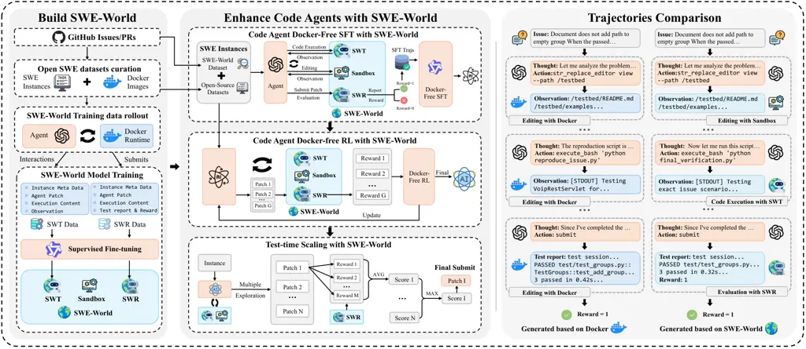
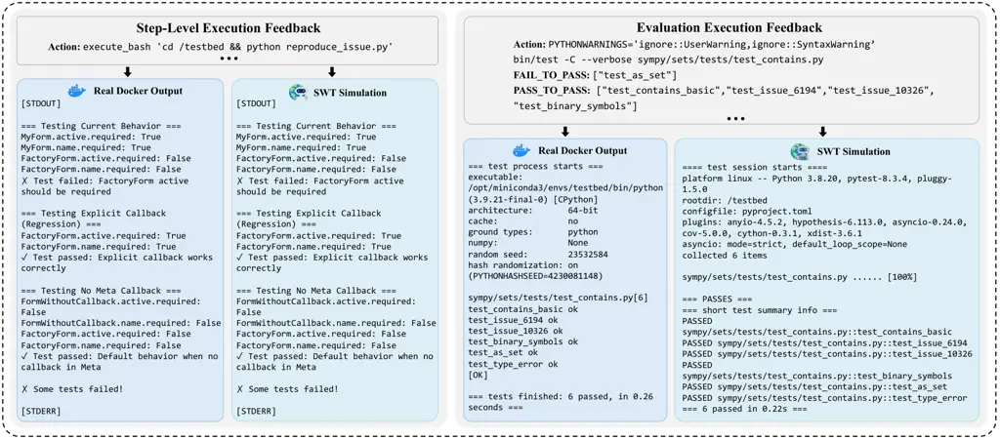

# SWE-World: Building Software Engineering Agents in Docker-Free Environments

Shuang Sun ^(†)^(†)thanks: Equal contribution. Affiliation: Gaoling
School of Artificial Intelligence, Renmin University of China. Email:
<sunshuang@ruc.edu.cn>    Huatong Song Email: <batmanfly@gmail.com>   
Lisheng Huang Email: <songyang@kanzhun.com>    Jinhao Jiang    Ran Le,
Zhihao Lv, Zongchao Chen Affiliation: Gaoling School of Artificial
Intelligence, Renmin University of China. Affiliation: BOSS Zhipin,
Beijing, China.    Yiwen Hu Affiliation: Gaoling School of Artificial
Intelligence, Renmin University of China.    Wenyang Luo Affiliation:
Gaoling School of Artificial Intelligence, Renmin University of China.
   Wayne Xin Zhao , Yang Song, Hongteng Xu, Tao Zhang ^(†)^(†)thanks:
Correspondence to Wayne Xin Zhao and Yang Song. Affiliation: Gaoling
School of Artificial Intelligence, Renmin University of China.
Affiliation: BOSS Zhipin, Beijing, China.    Ji-Rong Wen Affiliation:
Gaoling School of Artificial Intelligence, Renmin University of China.

###### Abstract

Recent advances in large language models (LLMs) have enabled software
engineering agents to tackle complex code modification tasks. Most
existing approaches rely on execution feedback from containerized
environments, which require dependency-complete setup and physical
execution of programs and tests. While effective, this paradigm is
resource-intensive and difficult to maintain, substantially complicating
agent training and limiting scalability. We propose SWE-World, a
Docker-free framework that replaces physical execution environments with
a learned surrogate for training and evaluating software engineering
agents. SWE-World leverages LLM-based models trained on real
agent–environment interaction data to predict intermediate execution
outcomes and final test feedback, enabling agents to learn without
interacting with physical containerized environments. This design
preserves the standard agent–environment interaction loop while
eliminating the need for costly environment construction and maintenance
during agent optimization and evaluation. Furthermore, because SWE-World
can simulate the final evaluation outcomes of candidate trajectories
without real submission, it enables selecting the best solution among
multiple test-time attempts, thereby facilitating effective test-time
scaling (TTS) in software engineering tasks. Experiments on SWE-bench
Verified demonstrate that SWE-World raises Qwen2.5-Coder-32B from 6.2%
to 52.0% via Docker-free SFT, 55.0% with Docker-free RL, and 68.2% with
further TTS. The code is available at
[https://github.com/RUCAIBox/SWE-World](https://github.com/RUCAIBox/SWE-World)


## 1 Introduction

Recent years have seen rapid progress in software engineering (SWE)
agents that leverage large language models (LLMs) (Zhao et al., 2023),
which are beginning to deliver practical value in real-world settings
(Jimenez et al., 2024; Chowdhury et al., 2024). Such agents typically
operate in an iterative agent–environment interaction loop driven by
physical environment execution feedback (Wang et al., 2025b; Team,
2024). In SWE scenarios, this environment corresponds to an isolated,
dependency-complete workspace instantiated from the target repository,
most commonly realized via containerization frameworks such as Docker,
where programs and unit tests can be executed reliably (Pan et al.,
2025; Badertdinov et al., 2025). Consequently, existing approaches to
training and evaluating SWE agents highly depend on physical execution
environments, which serve as a central prerequisite for effective agent
optimization (Yang et al., 2025b).

In practice, execution feedback in SWE tasks encompasses both
intermediate program behaviors (_e.g.,_ reproducing failures) and
running unit tests for final evaluation. In particular, evaluation
requires executing the agent-fixed repository and verifying that all
designated tests pass. Compared to lightweight execution settings that
require only a basic interpreter/runtime and limited dependencies
(_e.g.,_ algorithmic programming tasks), SWE tasks necessitate a full
repository workspace together with a dependency-complete environment,
requiring environment setup, dependency resolution, and program
execution, and thus making execution feedback substantially more
resource-intensive to construct and maintain in practice Yang et al.
(2025c). To support such execution-based training, prior work has
predominantly relied on Docker to instantiate task-specific environments
and provide reliable execution feedback for supervised fine-tuning (SFT)
or reinforcement learning (RL), enabling agents to improve their
performance through multi-turn environment interaction (Tao et al.,
2026; Luo et al., 2025a; Zeng et al., 2026).

Despite their effectiveness, Docker-based training paradigms introduce
several fundamental scalability limitations for SWE agents. At a high
level, these limitations manifest across data, training, and test-time
regimes. First, data scalability is constrained: many real-world
repositories and pull requests cannot be readily leveraged, as complex
or brittle dependency configurations often prevent projects from
building or executing reliably within containerized environments (Wang
et al., 2025a). Second, training scalability is hindered: the storage,
management, and distribution of large numbers of Docker images impose
substantial infrastructure overhead, which significantly complicates
large-scale optimization, particularly reinforcement learning, in
resource-constrained academic settings (Luo et al., 2025a). Third,
test-time scalability is limited: because environment interactions are
computationally expensive and often irreversible, it becomes difficult
to fully exploit additional test-time computation through iterative
exploration or trial-and-error strategies (Jain et al., 2025).

Motivated by recent advances in world modeling with LLMs (Copet et al.,
2025; Luo et al., 2025b), we explore an alternative paradigm that
replaces physical execution environments with learned models. This
raises a central question: can execution feedback traditionally obtained
from Docker-based environments be approximated by LLMs, enabling
Docker-free training and deployment of software engineering agents? If
feasible, such an approach would fundamentally alleviate the scalability
bottlenecks of Docker-centric SWE pipelines by decoupling agent
optimization from costly environment instantiation. However, modeling
execution at the repository level is inherently challenging: it requires
reasoning over large, evolving codebases where localized edits may
induce complex, non-local effects, and demands accurate prediction of
diverse execution behaviors across heterogeneous projects. In this work,
we address this challenge by training LLMs on real agent–environment
interaction data to predict execution outcomes, yielding a learned
surrogate environment that provides effective feedback for SWE agent
training while overcoming the data, training, and test-time scalability
constraints of Docker-based approaches.

To this end, we propose SWE-World, a Docker-free framework that replaces
resource-intensive physical execution environments with a learned
surrogate for training SWE agents. The design of SWE-World is motivated
by a key observation: while dependency-complete, runnable environments
required for program and test execution are costly to construct and
maintain, many agent actions—such as file navigation, text inspection,
and code editing (_e.g.,_ ls, grep, vim)—only involve lightweight
file-system operations and incur negligible computational overhead.
SWE-World explicitly separates these two classes of actions during the
interaction loop. Lightweight operations are handled deterministically
by a sandbox that directly updates the repository state, whereas
execution-oriented commands that would traditionally require Docker are
routed to an LLM-based transition model that predicts execution outcomes
without instantiating runnable environments. By learning to approximate
execution behavior observed in Docker, the transition model effectively
replaces dependency-complete containers as the source of execution
feedback, allowing agents to receive feedback without incurring the high
resource cost of physical execution. Upon episode termination, _i.e.,_
when the agent submits its final code patch, an LLM-based reward model
replaces containerized test execution by acting as a virtual test runner
that evaluates the patch and produces structured test feedback together
with a binary success signal. Together, these components form a unified
surrogate world for the agent, capturing both step-level dynamics and
terminal outcomes, alleviating the scalability bottlenecks of
resource-heavy execution.

We conduct extensive experiments to evaluate the effectiveness of
SWE-World as a Docker-free training and inference environment. Using a
combination of open-source benchmarks and newly crawled tasks, we show
that agents optimized entirely without physical execution environments
achieve strong performance on SWE-bench Verified Chowdhury et al.
(2024). In particular, when trained with _Docker-free execution
feedback_ provided by SWE-World, Qwen2.5-Coder-32B improves from a base
resolve rate of 6.2% to 52.0%, and further to 55.0% with additional
Docker-free RL optimization, while the smaller Qwen3-4B-Instruct reaches
25.6% and 30.0%, respectively. Beyond training, SWE-World also enables
effective _Docker-free test-time scaling_: by using the learned reward
model to evaluate and select candidate solutions, Qwen2.5-Coder-32B
attains a resolve rate of 68.2% with TTS@8. These results demonstrate
that SWE-World can match, and in some settings surpass the effectiveness
of Docker-based pipelines, while drastically lowering the infrastructure
and resource barrier of SWE experimentation, enabling large-scale SWE
research and iteration without industrial-grade container
infrastructure.

Our main contributions are summarized as follows:

$`\bullet`$ Docker-Free SWE Environment: We propose SWE-World, a
Docker-free framework that replaces physical execution environments with
a learned surrogate for training and evaluating software engineering
agents.

$`\bullet`$ Effective Agent Training without Execution: We show that
LLM-based environment feedback can successfully support SFT and RL,
achieving performance comparable to or better than training with real
execution.

$`\bullet`$ Scalable Use of Open-Source SWE Data: By eliminating the
requirement for buildable environments, SWE-World enables substantially
broader utilization of real-world GitHub data for training software
engineering agents.

## 2 Related Work

Datasets for Software Engineering Tasks. The evaluation paradigm for
large language models (LLMs) in software engineering has transitioned
from isolated code generation tasks (Chen, 2021; Jain et al., 2024)
toward complex, repository-level issue resolution. SWE-bench (Jimenez et
al., 2024) and its refined counterpart, SWE-bench-verified (Chowdhury et
al., 2024), pioneered this shift by establishing a rigorous benchmark
for assessing the capacity of LLM-based code agents to resolve
real-world software issues. Building upon this, several studies have
focused on synthesizing issue-solving tasks from GitHub data to
facilitate model training (Pan et al., 2025). SWE-Gym (Pan et al., 2025)
and SWE-rebench (Badertdinov et al., 2025) directly harvest interactive
SWE tasks from diverse GitHub repositories, while SWE-smith (Yang et
al., 2025b) introduces an automated pipeline for large-scale issue
generation. However, a significant bottleneck in these existing datasets
is their heavy infrastructure dependency; each data sample typically
necessitates a dedicated Docker environment for execution and
verification, incurring substantial computational and storage overhead
(Yang et al., 2025c). In contrast, our approach streamlines this process
by directly filtering issues from GitHub and utilizing only the
underlying code repositories and unit tests for trajectory synthesis. By
bypassing the requirement for per-sample containerization, our method
significantly reduces the resource barrier while maintaining high
fidelity in training data.

Software Engineering LLMs and Agents. To unlock the potential of LLMs as
autonomous software agents, researchers have introduced various agentic
frameworks, such as SWE-agent (Yang et al., 2024b) and OpenHands (Wang
et al., 2025b), which provide the necessary infrastructure for
environment interaction. Current research in autonomous issue resolution
generally follows two paradigms. The first is the agent-based approach,
which situates models within authentic, sandboxed environments (_e.g.,_
Docker) to generate interaction trajectories and perform agentic SFT
(Sun et al., 2025; Tao et al., 2026; Wang et al., 2025a; Liu et al., 2025) and RL (Cao et al., 2025; Luo et al., 2025a; Song et al., 2025;
Golubev et al., 2025) training. While effective, this paradigm suffers
from significant resource overhead, as each data sample typically
demands a dedicated container. The second is the agentless approach (Xia
et al., 2024; Yang et al., 2025c), which decomposes software engineering
tasks into a structured, three-stage pipeline: fault localization, code
repair, and patch verification (Xie et al., 2025; He et al., 2025).
Although more efficient, these predefined workflows often restrict the
agent’s capacity for autonomous exploration and adaptive reasoning.
Diverging from these two paths, our method maintains an agentic loop to
preserve exploratory autonomy but introduces an LLM-based environment
simulator. By simulating environmental feedback rather than relying on
heavy-weight containerization, our approach eliminates the
infrastructure bottleneck of traditional agent-based systems while
maintaining the flexibility of autonomous agents.

## 3 Preliminaries



Figure 1: Overview of SWE-World. Left: We collect agent-Docker
interaction data to train the SWE-World Transition Model (SWT) and
SWE-World Reward Model (SWR). Middle: SWE-World forms a Docker-free
surrogate environment, enabling scalable agent enhancement via SFT, RL,
and Test-Time Scaling. Right: Comparison of Code Agent trajectories
generated based on Docker and SWE-World.

We study software engineering (SWE) issue resolution as an interactive
process involving three components: (i) a _code agent_ that proposes
edits and execution commands, (ii) a _codebase_ (repository workspace)
to be modified, and (iii) an _execution environment_ $`\mathcal{E}`$
that provides step-level feedback and evaluates candidate fixes.

SWE Task Instances. A task instance is defined by an issue description
and a reference repository snapshot. We denote an instance as
$`\mathcal{I}=(R,b,d,\mathcal{U})`$, where $`R`$ is a repository, $`b`$
is a base commit, $`d`$ is the problem statement (_e.g.,_ a bug report),
and $`\mathcal{U}`$ is the validation unit tests that must pass for a
correct fix. Additional instance metadata is provided in Appendix A.

Interactive Repair Process. The agent operates in a mutable workspace
initialized at $`(R,b)`$ and interacts with an execution environment
$`\mathcal{E}`$. At each step $`t`$, the agent produces a thought
$`z_{t}`$ and takes an action $`a_{t}`$; the environment $`\mathcal{E}`$
executes $`a_{t}`$ and returns step-level feedback $`y_{t}`$:

```math
y_{t}\sim\mathcal{E}(a_{t};\,R,b,P_{t}). \tag{1}
```

We represent code edits as a patch $`P`$ (a set of line-level
modifications to the codebase). A repair episode terminates when the
agent takes a submit action, producing the final patch $`P`$. A complete
trajectory is denoted as

```math
\tau=\big[\mathcal{I},(z_{1},a_{1},y_{1}),\ldots,(z_{T},a_{T},y_{T}),P\big]. \tag{2}
```

Evaluation. Given a submitted patch $`P`$, the environment
$`\mathcal{E}`$ evaluates the modified workspace by running the
designated unit tests $`\mathcal{U}`$. This yields a final evaluation
output

```math
y_{\text{eval}}=\langle\texttt{test\_report},r\rangle\sim\mathcal{E}(P;R,b,\mathcal{U}), \tag{3}
```

where test_report summarizes execution logs, and the binary reward
$`r\in\{0,1\}`$ follows the standard criterion:

```math
r=1\;\Longleftrightarrow\;\text{all required unit tests in }\mathcal{U}\text{ pass under }P, \tag{4}
```

and $`r=0`$ otherwise.

### 3.1 Execution Environments for SWE

A central challenge in SWE is the _execution environment_
$`\mathcal{E}`$: it must support both lightweight interactions (file
navigation and editing) and heavyweight repository-specific execution
(running programs and unit tests) (Yang et al., 2025b). To make this
clear, we distinguish four increasingly capable layers of environment
that often appear implicitly in prior work.

File System. The repository workspace—files and directories that the
agent reads and modifies—is the mutable state to transform from
$`(R,b)`$ into a correct fix.

Terminal. A terminal provides generic interfaces (_e.g.,_ ls, grep, vim)
and editing tools to navigate and modify the file system, but does not
inherently provide repository-specific code execution.

Sandbox. A sandbox couples the file system with a terminal to
deterministically support navigation/editing for any repository. It
typically cannot run repo-specific programs or tests due to missing
dependencies and runtime setup.

Docker. Docker instantiates a dependency-complete environment for a
given repository snapshot, subsuming sandbox operations while enabling
repo-specific code execution and test runs. However, building and
maintaining Docker images is brittle in practice: different repositories
require different installation procedures and dependency constraints,
and large-scale SWE training requires spawning and managing many images
and containers. As a result, the storage, management, and distribution
of Docker impose significant infrastructure overhead.

### 3.2 From Docker-Based to LLM-Based Environments

The above decomposition suggests a key observation: many agent actions
in SWE only require the lightweight sandbox, while the main scalability
bottleneck comes from repository-specific code execution traditionally
provided by Docker. This motivates our core idea: replace the Docker
execution component with learned models, while retaining a deterministic
sandbox for file operations.

Concretely, we aim to construct a surrogate environment
$`\mathcal{E}_{\text{world}}`$ that preserves the standard
agent–environment interface: the sandbox maintains the workspace state
and supports navigation/editing actions, while LLMs approximate the
execution feedback and test-based evaluation that would otherwise
require Docker. By combining a universal sandbox with LLM-based
execution surrogates, we can eliminate the need for Docker-based
environments during training and inference, substantially improving
scalability. Details of the learned components are introduced in Section 4.

## 4 SWE-World: LLM-Based Docker-Free Environment

We propose SWE-World, a surrogate execution environment
$`\mathcal{E}_{\text{world}}`$ that approximates containerized runtimes
by training LLMs to predict execution feedback from real
agent–environment interaction traces. By decoupling the agent from
physical execution, SWE-World enables scalable training and inference
without Docker.

### 4.1 System Architecture

SWE-World replaces Docker with a universal lightweight sandbox and
learned LLM components. Given an agent action $`a_{t}`$, we categorize
it into two types:

- •
  Navigation & Editing: file exploration and edits via generic
  shell/tool commands (_e.g.,_ ls, cat, grep, view, create,
  str_replace).
- •
  Code Execution: repository-specific execution commands whose outputs
  depend on runtime semantics (_e.g.,_ python reproduce.py, pytest).

Navigation and editing actions are executed deterministically by a
lightweight Sandbox, which maintains the workspace state and returns
step feedback $`y_{t}`$. Code execution actions are handled by the
learned SWE-World Transition Model (SWT), which predicts step-level
execution feedback $`\hat{y}_{t}`$. When the agent terminates by
submitting a final patch $`P`$, the SWE-World Reward Model (SWR) acts as
a virtual test runner and produces a test report together with the
binary reward. To drive the learned models, we construct a compact
_context_ $`\kappa`$ that includes the instance information and the
current workspace state; concrete context definitions are given below.

#### 4.1.1 Lightweight Sandbox for Navigation and Editing

The sandbox consists of the file system and terminal: it
deterministically supports navigation and editing over the repository
workspace. We delegate these operations to the sandbox (instead of an
LLM) for two reasons: (1) Reliability: file operations are
deterministic; LLM simulation may hallucinate files or contents and
catastrophically mislead the agent. (2) Efficiency: navigation/editing
is inexpensive and does not require semantic reasoning, making LLM
inference unnecessary. As a result, the workspace state and the code
content referenced by the learned models remain accurate and strictly
consistent with the agent’s edit history.

#### 4.1.2 SWT: Step-Level Execution Feedback Simulation

For Code Execution actions, we employ the SWE-World Transition Model,
denoted as $`\mathcal{M}_{\text{SWT}}`$. Modeling execution at the
repository level is inherently challenging: it requires reasoning over
large, evolving codebases where localized edits may induce complex,
non-local effects, and demands accurate prediction of diverse execution
behaviors across heterogeneous projects. Moreover, SWT must be sensitive
to the agent’s incremental edits, producing meaningfully different
feedback as the patch evolves.

Transition Context. At step $`t`$, we construct an transition context
$`\kappa^{\text{SWT}}_{t}`$ consisting of three parts:

- •
  Instance Meta Data: problem description, an initial analysis generated
  by a powerful LLM (summarizing the core bug and intended fix), and a
  ground-truth patch as an internal reference. This reference is
  strictly hidden from the agent to prevent leakage.
- •
  Agent Patch: the current patch reflecting the agent’s modifications so
  far.
- •
  Execution Content: the command (action $`a_{t}`$) to be simulated and
  the relevant code content needed to determine the runtime behavior.

Given an context $`\kappa^{\text{SWT}}_{t}`$, SWT predicts step-level
execution feedback:

```math
\hat{y}_{t}=\langle\texttt{stdout},\texttt{stderr},\texttt{exit\_code}\rangle\sim\mathcal{M}_{\text{SWT}}(\kappa^{\text{SWT}}_{t}). \tag{5}
```

By conditioning on $`\kappa^{\text{SWT}}_{t}`$, SWT can produce
realistic feedback such as error tracebacks and printed logs, enabling
iterative debugging and refinement without Docker execution. See
Appendix A for transition context details.

#### 4.1.3 SWR: Test Report and Reward Generation for Evaluation Simulation

The SWE-World Reward Model, denoted as $`\mathcal{M}_{\text{SWR}}`$,
validates the agent’s final submission. Prevalent approaches cast
validation as a generative classification task, prompting an LLM to map
the agent trajectory directly to a binary token (_i.e.,_ Yes/No) Shum et
al. (2025); Tao et al. (2026). During inference, they extract token
log-probabilities $`l_{\textsc{yes}}`$ and $`l_{\textsc{no}}`$ and
compute a scalar score via softmax:

```math
\hat{r}=\frac{\exp(l_{\textsc{yes}})}{\exp(l_{\textsc{yes}})+\exp(l_{\textsc{no}})}. \tag{6}
```

This black-box formulation provides limited interpretability and can be
sensitive to long, noisy trajectories.

In contrast, SWR acts as a _virtual test runner_, simulating the
execution of the unit tests $`\mathcal{U}`$ on the final submitted patch
$`P`$ and generating a structured test report before assigning the final
binary reward. Moreover, SWR must faithfully account for complex test
logic and aggregate outcomes across many test cases, where a single
failing case determines $`\hat{r}=0`$.

Evaluation Context. For a trajectory $`\tau`$, to drive this simulation,
we construct an evaluation context $`\kappa^{\text{SWR}}_{\tau}`$. It
contains the same three parts as the transition context (Instance Meta
Data, Agent Patch, and Execution Content), and additionally includes the
unit tests $`\mathcal{U}`$:

- •
  Fail to Pass (F2P): tests that reproduce the issue and must transition
  to passing.
- •
  Pass to Pass (P2P): regression tests that must remain passing.

In particular, for $`\kappa^{\text{SWR}}_{\tau}`$, the Agent Patch is
the final submitted patch $`P`$, and the Execution Content corresponds
to the test command and the test-case content of $`\mathcal{U}`$.

Given $`\kappa^{\text{SWR}}_{\tau}`$, SWR predicts the evaluation
output:

```math
\hat{y}_{\text{eval}}=\langle\texttt{test\_report},\hat{r}\rangle\sim\mathcal{M}_{\text{SWR}}(\kappa^{\text{SWR}}_{\tau}),\qquad\hat{r}\in\{0,1\}. \tag{7}
```

By enforcing the generation of a detailed test report prior to
$`\hat{r}`$, SWR provides an interpretable verification signal that
supports scalable Docker-free selection and optimization. See Appendix A
for evaluation context details.

### 4.2 Training SWT and SWR

We train SWT and SWR based on Qwen2.5-Instruct-32B and
Qwen2.5-Instruct-72B (Yang et al., 2024a) via SFT, utilizing data
collected directly from the interactions between SWE agents and real
execution environments.

#### 4.2.1 Data Collection from Real Docker Rollouts

We construct our training corpus by generating trajectory rollouts on
open-source SWE datasets (Jain et al., 2025; Pan et al., 2025;
Badertdinov et al., 2025) and corresponding Docker images. For each code
execution step, we extract $`\kappa^{\text{SWT}}_{t}`$ and the real
execution feedback $`y_{t}`$ directly from the Docker container’s
output, yielding transition samples:

```math
\mathcal{D}_{\text{trans}}=\{(\kappa^{\text{SWT}}_{t},y_{t})\}. \tag{8}
```

For a trajectory $`\tau`$, at the terminal step, we extract
$`\kappa^{\text{SWR}}_{\tau}`$ execute the unit tests to obtain the
evaluation outcome $`y_{\text{eval}}`$, forming the reward dataset:

```math
\mathcal{D}_{\text{reward}}=\{(\kappa^{\text{SWR}}_{\tau},y_{\text{eval}})\}. \tag{9}
```

Crucially, this collection process achieves high data efficiency: a
single rollout simultaneously yields multiple interaction samples for
supervising the environment models and an agent trajectory for policy
training. Details are provided in Appendix B.

#### 4.2.2 Reverse-Reasoning Distillation for CoT Backfilling

Directly mapping complex repository contexts to precise execution
feedback poses a significant learning challenge. Chain-of-Thought (CoT)
(Wei et al., 2022) reasoning mitigates this by providing intermediate
logical steps, effectively breaking down the reasoning process and
enhancing model learnability. Moreover, during inference, the explicit
generation of CoT facilitates more granular analysis, leading to higher
prediction accuracy Huang et al. (2025); Kojima et al. (2022).

To obtain high-quality CoT data, we employ a reverse-reasoning strategy
(Chen et al., 2025; Lin et al., 2025). We feed both the input context
$`\kappa`$ and the ground-truth execution feedback $`y_{\text{GT}}`$
(from Docker) to a powerful reasoning model, requiring it to produce a
strictly forward derivation without explicitly revealing the answer in
the reasoning process. This model is prompted to generate a step-by-step
derivation CoT that reasons from the input to the specified output:

```math
\text{CoT}\leftarrow\pi_{\text{teacher}}(\text{Reasoning}\mid\kappa,y_{\text{GT}}). \tag{10}
```

Before integration, we employ an LLM-as-a-Judge (Gu et al., 2024) to
assess the quality of the generated CoTs, filtering out invalid
reasoning, or CoTs that directly leak $`y_{\text{GT}}`$. We backfill the
high-quality thoughts into our dataset, formatting the target output by
wrapping the thoughts within \<think\> tags followed immediately by the
ground truth. Consequently, both SWT and SWR are trained to predict the
sequence $`\texttt{<think>}\text{CoT}\texttt{</think>}y_{\text{GT}}`$,
enabling them to learn the underlying execution logic more effectively.
Details are provided in Appendix B.

## 5 Training SWE Agents with SWE-World

In this section, we leverage SWE-World to establish an end-to-end, fully
Docker-free training pipeline for training SWE agents, enabling scalable
data curation, supervised fine-tuning, and reinforcement learning.

### 5.1 Software Eengineering Data Preparation

We construct a unified instance pool from two sources.

Open-Source SWE Datasets. We aggregate instances from open-source SWE
datasets, including R2E-Gym, SWE-Gym, and SWE-rebench. We convert these
instances into a unified schema compatible with SWE-World.

SWE-World Dataset. A limitation of previous dataset construction
pipelines is the heavy reliance on Docker environments; a vast number of
Pull Requests (PRs) and issues are typically discarded simply because
their repositories fail to build in a container (Yang et al., 2025b).
Leveraging SWE-World’s ability to simulate execution without physical
constraints, we bypass this bottleneck. We crawled a fresh collection of
PRs and issues from GitHub, applied deduplication against existing
datasets, and parsed the relevant repository information. After applying
heuristic filtering rules, we obtain SWE-World Dataset, a curated set of
16.6K high-quality instances. As shown in Table 1, the SWE-World Dataset
covers more tasks and far more repositories than prior SWE datasets,
offering broader coverage and higher diversity. The detailed data
processing pipeline is provided in the Appendix F. The final training
set is a mixture of these open-source and newly curated instances.

|                   |          |          |        |
| ----------------- | -------- | -------- | ------ |
| Dataset           | \# Tasks | \# Repos | Source |
| SWE-rebench       | 6.5k     | 1,429    | Real   |
| SWE-Gym           | 2.4k     | 11       | Real   |
| R2E-Gym           | 4.6k     | 10       | Synth  |
| SWE-World Dataset | 16.6k    | 3,763    | Real   |

Table 1: Comparison of SWE-World Dataset and other SWE datasets with
Docker environments.

### 5.2 Docker-Free Supervised Fine-tuning

We employ a rejection sampling fine-tuning strategy to train the policy
model. This process consists of three key steps:

Trajectory Generation. For each training instance, we use a powerful
code agent (Z.ai, 2025; MiniMax, 2025) to interact within the SWE-World
environment (including the SWT and the Sandbox). This interaction yields
agent trajectories efficiently and in parallel, bypassing the overhead
of container management.

Dual-Stage Filtering. To ensure the quality of the training data, we
apply a rigorous filtering mechanism to the generated agent
trajectories:

- •
  Rule-Based Filtering: We discard agent trajectories exhibiting invalid
  tool usage, execution timeouts, excessive context length, exceeding
  the maximum turn limit, or failure to produce a final submission.
- •
  SWR-Based Verification: We use the SWR to assess the correctness of
  the remaining agent trajectories. We retain only those receiving a
  positive reward ($`\hat{r}=1`$), which indicates that the agent has
  successfully resolved the issue according to the surrogate evaluation.

Agentic Supervised Fine-Tuning. Finally, we use the high-quality agent
trajectories to train our policy model (Qwen2.5-32B-Coder-Instruct (Hui
et al., 2024) and Qwen3-4B-Instruct-2507 (Yang et al., 2025a)).
Following standard practices for agentic training, we perform agentic
SFT (Wang et al., 2025a) on the agent’s thoughts and actions. Crucially,
the entire SFT pipeline is Docker-free. Training details are provided in
Appendix C.

### 5.3 Docker-Free Reinforcement Learning

SWE reinforcement learning (Golubev et al., 2025; Cao et al., 2025) is
expensive and brittle due to its heavy reliance on Docker containers,
since repeatedly spawning and managing containers for rollouts and
validation consumes massive memory, CPU, and storage resources and often
destabilizes the training infrastructure. SWE-RM (Shum et al., 2025)
replaces part of the validation with a learned verifier, but still
relies on Docker containers for transition feedback during rollouts and
mixes execution-based signals for final rewards, leaving Docker in the
RL loop. In contrast, building on SWE-World, we achieve fully
Docker-free RL.

Agentic RL Loop with SWE-World. Starting from the SFT-trained model, we
further optimize the agent with RL. We first launch SWT and SWR as
inference services. During training rollouts, the agent interacts with
SWE-World, receiving transition feedback from the SWT and Sandbox, while
the SWR assigns the final trajectory reward. Crucially, this pipeline
eliminates the need for Docker containers, requiring only the
maintenance of inference servers for SWT and SWR models.

Optimization. We optimize the policy following the Group Relative Policy
Optimization (GRPO) paradigm (Shao et al., 2024; Luo et al., 2025a).
Specifically, we employ a stabilized variant that incorporates clipped
ratio objectives, leave-one-out advantage estimation, and length
normalization to effectively handle long-horizon reasoning tasks.

By using SWT for transition feedback and SWR for terminal rewards,
SWE-World supports stable, scalable, fully Docker-free RL for SWE
agents. Training details are provided in Appendix D.

### 5.4 Test-Time Scaling with SWR

We further improve inference performance via test-time scaling (TTS),
where multiple candidate solutions are generated and a verifier selects
the best one. While prevalent verifiers rely on the single-token
generative classification discussed previously (Jain et al., 2025; Pan
et al., 2025), SWR enables verification grounded in simulated execution
mechanics.

SWR is explicitly designed to judge whether an agent trajectory has
successfully resolved the issue, making it inherently suitable for TTS.
Given that SWR outputs a discrete binary reward, we employ a
multi-sample voting strategy to derive a fine-grained confidence score.
Specifically, for a given instance, we sample $`N`$ candidate
trajectories using the code agent. For each trajectory $`\tau`$, we
query SWR $`M`$ times to mitigate variance and calculate the mean
reward:

```math
\text{Score}(\tau)=\frac{1}{M}\sum_{i=1}^{M}\hat{r}_{i}. \tag{11}
```

where
$`\langle\texttt{test\_report},\hat{r}_{i}\rangle\sim\mathcal{M}_{\text{reward}}(\kappa^{\text{SWR}}_{\tau})`$
and $`\kappa^{\text{SWR}}_{\tau}`$ denotes the evaluation context
derived from the candidate trajectory $`\tau`$. The trajectory with the
highest average score is selected as the final submission.

## 6 Experiments

In this section, we first detail the training implementation for the
SWE-World components (SWT and SWR) and SWE agents. We then present our
evaluation results, ablation studies, and further analyses to validate
our motivation and methodology.

### 6.1 Experimental Settings

Agent Scaffolding. We build our agent on top of R2E-Gym framework (Jain
et al., 2025), which is a minimal scaffold adapted from OpenHands (Wang
et al., 2025b) and follows a standard ReAct-style interaction loop (Yao
et al., 2022). The agent is equipped with three tools:
str_replace_editor for file reading and editing, execute_bash for
running shell commands, and submit tool for terminating the episode. We
integrate SWE-World into the R2E-Gym framework execution backend,
enabling the same scaffold to run either with Docker or with SWE-World
as the environment.

Evaluation Benchmark. We evaluate on SWE-bench Verified (Jimenez et al.,
2024), a curated split of 500 real-world GitHub issue–PR tasks over 12
Python repositories. Performance is measured by _resolve rate_ (%),
_i.e.,_ the fraction of instances whose final patch passes all
designated tests in the evaluation harness.

SWT Evaluation. We evaluate SWT in an end-to-end setting by replacing
Docker-based step feedback with SWT during rollouts, while keeping the
code agent fixed (Minimax-M2.1 (MiniMax, 2026)). After each rollout
terminates with a submitted patch, we run the unit test in Docker to
obtain the reward and report the resolve rate on SWE-bench Verified.

SWR Evaluation. For SWR evaluation, we compute the Accuracy, Precision,
Recall, and F1 by comparing the SWR-predicted rewards against the
ground-truth rewards obtained via Docker-based test execution on a
held-out set of SWE-bench Verified trajectories.

SWE Agents Evaluation. We evaluate SWE-World models on the SWE-bench
Verified dataset, utilizing a Docker execution backend for verification
and benchmarking against the open-source code agents (Hui et al., 2024;
Yang et al., 2025a; Pan et al., 2025; Jain et al., 2025; Zeng et al.,
2025; Yang et al., 2025b; Cao et al., 2025; Luo et al., 2025a; Wang et
al., 2025a; Yang et al., 2025c; Sonwane et al., 2025; Tao et al., 2026;
Xie et al., 2025; Ma et al., 2024; Wei et al., 2025). To prevent git
hacking (Xiao et al., 2026), we disallow solution-revealing git commands
(_e.g.,_ git log, git show).

Test-Time Scaling Setup. When using SWR for test-time scaling, we sample
$`N{=}8`$ candidate trajectories per instance and query SWR $`M{=}3`$
times per candidate to estimate its expected reward; we report this
setting as TTS@8.

### 6.2 Main Results

|                     |            |          |                |                  |
| ------------------- | ---------- | -------- | -------------- | ---------------- |
| Model/Method        | Scaffold   | Training | Environment    | Resolve Rate (%) |
| Qwen2.5-Coder-32B   | OpenHands  | -        | Docker         | 6.2              |
| Qwen3-32B           | OpenHands  | -        | Docker         | 23.2             |
| Qwen3-Coder-30B-A3B | OpenHands  | -        | Docker         | 51.6             |
| SWE-Gym-32B         | OpenHands  | SFT      | Docker         | 20.6             |
| R2E-Gym-32B         | R2E-Gym    | SFT      | Docker         | 34.4             |
|    + TTS@16         | R2E-Gym    | SFT      | Docker         | 49.4             |
| Skywork-SWE-32B     | OpenHands  | SFT      | Docker         | 38.0             |
|    + TTS@8          | OpenHands  | SFT      | Docker         | 47.0             |
| SWE-agent-LM-32B    | SWE-agent  | SFT      | Docker         | 40.2             |
| SWE-Fixer-72B       | Agentless  | SFT      | -              | 32.8             |
| SA-SWE-32B          | OpenHands  | RL       | Docker         | 39.4             |
| Llama3-SWE-RL-70B   | Agentless  | SFT+RL   | -              | 41.0             |
| Lingma-SWE-GPT-72B  | Agentless  | SFT      | -              | 30.2             |
| DeepSWE-32B-Preview | OpenHands  | RL       | Docker         | 42.2             |
|    + TTS@16         | OpenHands  | RL       | Docker         | 59.0             |
| Kimi-Dev-72B        | SWE-Agent  | SFT+RL   | -              | 48.6             |
|    + TTS@40         | Agentless  | SFT+RL   | -              | 60.4             |
| SWE-Mirror-LM-32B   | MOpenHands | SFT      | Docker         | 52.2             |
| FrogBoss-32B        | SWE-Agent  | SFT+RL   | Docker         | 54.6             |
| SWE-Lego-Qwen3-32B  | OpenHands  | SFT      | Docker         | 52.6             |
|    + TTS@16         | OpenHands  | SFT      | Docker         | 58.8             |
| SWE-World-4B-SFT    | R2E-Gym    | SFT      | Sandbox + LLMs | 25.6             |
| SWE-World-4B-RL     | R2E-Gym    | SFT+RL   |                | 30.0             |
| SWE-World-32B-SFT   | R2E-Gym    | SFT      |                | 52.0             |
| SWE-World-32B-RL    | R2E-Gym    | SFT+RL   |                | 55.0             |
|    + TTS@8          | R2E-Gym    | SFT+RL   |                | 68.2             |

Table 2: Performance of various models on SWE-Bench Verified. The best
results are in bold and the second-best are underlined, excluding
test-time scaling (TTS) results.

|                     |                  |                              |
| ------------------- | ---------------- | ---------------------------- |
| Transition feedback | Resolve Rate (%) | $`\Delta`$                   |
| Docker (GT)         | 68.4             | –                            |
| Minmax-M2.1         | 56.2             | $`\downarrow 12.2\%`$        |
| GLM-4.7             | 59.4             | $`\downarrow 9.0\%`$         |
| SWT-32B             | 55.2             | $`\downarrow 13.2\%`$        |
| SWT-72B             | 60.2             | $`\downarrow\textbf{8.2\%}`$ |

Table 3: SWE-bench Verified performance using different
transition-feedback providers.

|                   |       |       |        |       |
| ----------------- | ----- | ----- | ------ | ----- |
| Reward Simulation | Acc.  | Prec. | Recall | F1    |
| Docker (GT)       | 1.00  | 1.00  | 1.00   | 1.00  |
| Minmax-M2.1       | 0.740 | 0.709 | 0.891  | 0.790 |
| GLM-4.7           | 0.768 | 0.763 | 0.836  | 0.798 |
| SWR-32B           | 0.754 | 0.779 | 0.770  | 0.774 |
| SWR-72B           | 0.770 | 0.780 | 0.807  | 0.794 |

Table 4: Performance of reward simulation against Docker ground truth.

Performance of SWE Agents. As shown in Table 2, our method reaches the
frontier performance among open-source 32B models. Starting from the
Qwen2.5-Coder backbone (6.2%), SFT and RL boost performance to 52.0% and
54.8% respectively. Crucially, our purely Docker-free models
significantly outperform baselines trained with real Docker execution
(_e.g.,_ FrogBoss-32B at 54.6%), validating the efficacy of our
pipeline. With SWR-based TTS@8, performance peaks at 68.2%, surpassing
the previous best (Kimi-Dev-72B TTS@40) by a large margin.

Effectiveness of SWT. While a performance gap between simulation and
reality is inevitable, SWT-72B minimizes this degradation most
effectively. It supports a resolve rate of 60.2% for Minmax M2.1 (Table
4), outperforming general-purpose LLMs like GLM-4.7 (59.4%) and
Minimax-M2.1 (56.2%) as a more faithful environmental surrogate.

Effectiveness of SWR. Table 4 validates the robustness of our reward
models. SWR-32B achieves an accuracy of 0.754, surpassing Minmax-M2.1,
and notably outperforms both Minmax-M2.1 and GLM-4.7 in Precision
(0.779). Scaling up, SWR-72B further advances performance, overtaking
GLM-4.7 in both Accuracy (0.770) and Precision (0.780), thereby
demonstrating the strongest comprehensive capability in reward
simulation.

### 6.3 Ablation Study

|                    |              |                  |
| ------------------ | ------------ | ---------------- |
| SFT data source    | Total \#Traj | Resolve Rate (%) |
| Docker (baseline)  | 5.7K         | 51.4             |
| SWE-World          | 5.7K         | 52.2             |
| SWE-World + Docker | 9.3K         | 53.8             |

Table 5: SFT performance comparison using trajectories collected from
Docker, SWE-World, and their mixture, under identical training settings.

We investigate whether replacing the ground-truth Docker environment
with SWE-World affects the quality of training data. We generated two
parallel datasets of 5.7K trajectories using identical expert agents and
prompt settings, differing only in the execution backend used during the
rollout phase. As shown in Table 5, the model fine-tuned on SWE-World
trajectories achieves a resolve rate of 52.2%, slightly outperforming
the model trained on Docker-generated data (51.4%). Moreover, starting
from the 5.7K SWE-World trajectories, we deduplicate an additional
Docker-collected set and retain 3.6K unique trajectories; mixing them
yields 9.3K trajectories in total and further improves performance to
53.8%. This result suggests that our simulated environment provides
supervision quality comparable to, or even better than, the physical
environment. Furthermore, mixing in Docker-based trajectories yields
additional gains, confirming that SWE-World is a highly effective,
scalable alternative for data generation.

## 7 Further Analysis

This section provides further analyses on the impact of CoT (Section
7.1), RL training dynamics (Section 7.2), test-time scaling behavior
(Section 7.3), and qualitative fidelity of SWT/SWR simulation (Section
7.4), to clarify the key factors behind SWE-World’s effectiveness.

### 7.1 Impact of Chain-of-Thought

|         |           |                  |
| ------- | --------- | ---------------- |
| Method  | Data Size | Resolve Rate (%) |
| w/o CoT | 26K       | 55.2             |
| w\. CoT | 26K       | 56.0             |

Table 6: CoT yields only a marginal improvement for SWT.

|         |           |       |       |        |       |
| ------- | --------- | ----- | ----- | ------ | ----- |
| Method  | Data Size | Acc.  | Prec. | Recall | F1    |
| w/o CoT | 4K        | 0.578 | 0.609 | 0.704  | 0.653 |
| w\. CoT | 4K        | 0.712 | 0.754 | 0.704  | 0.728 |

Table 7: CoT substantially improves SWR reward prediction quality.

We observe a distinct asymmetry in the benefits of Chain-of-Thought
(CoT) reasoning between the transition and reward models:

Marginal Gain for SWT. As shown in Table 7, adding CoT to the transition
model yields only a negligible improvement (0.8%) in the downstream
agent’s resolve rate. We attribute this to the informational robustness
of the transition task. The primary role of SWT is to simulate textual
feedback (_i.e.,_ stdout, stderr, exit_code). Small inconsistencies in
such feedback are often tolerable: the agent can still interpret the
signal, continue exploring, and correct itself via subsequent actions
and verification. Since CoT can substantially increase inference
latency, the modest fidelity gain is typically not worth the added cost
for step-level simulation.

Significant Gain for SWR. In contrast, Table 7 shows that CoT is
critical for the reward model, boosting accuracy by over 13% (0.578
$`\to`$ 0.712) and Precision significantly. This is due to the binary
sensitivity of the reward task. The SWR must synthesize complex test
execution report into a strictly binary signal (Success/Failure). A
minor misinterpretation of a test report can flip the reward label. CoT
encourages more complete reasoning over repository context, patch
effects, and test logic, thereby improving the fidelity of the predicted
test report and making the resulting reward assignment substantially
more accurate. We further analyze how this CoT integration impacts the
stability of RL training in Section 7.2.

### 7.2 RL Dynamics

Figure 2: RL training dynamics using SWT-32B. Orange lines denote
average reward; Green dashed lines denote mean interaction turns. Left:
Main experiment using CoT-enhanced SWR-32B shows stable learning. Right:
Comparison with non-CoT SWR-32B leads to trajectory length collapse,
indicating reward hacking.

Figure 3: Test-time scaling on SWE-bench Verified: comparing SWR-32B
with prior verifiers.

We analyze the stability of our reinforcement learning process by
tracking the reward and interaction turns over training steps. Figure 2
contrasts our main RL training with a comparison run under an
alternative reward model setting.

Main RL Training. In the main run (Left), the agent exhibits healthy
optimization dynamics: the reward steadily increases while the
interaction length shows a gentle, efficiency-driven decline. This
suggests that the policy performance improves steadily over training,
without collapsing into degenerate behaviors.

Comparison Run. In contrast, the comparison run (Right), which uses a
non-CoT SWR, exhibits clear signs of _reward hacking_. The trajectory
length collapses drastically after step 20, as the policy learns to
exploit the reward model’s low precision by submitting short, invalid
solutions that are mistakenly flagged as correct. These results suggest
that a robust and faithful reward signal is critical for stable
Docker-free reinforcement learning, and CoT provides an effective way to
enhance it.

### 7.3 Test-Time Scaling

Figure 3 compares test-time scaling on SWE-bench Verified using agent
rollouts generated by SWT-32B, where we rank $`K`$ candidate
trajectories with a verifier and select the best submission.

Superior Scaling Performance. As shown in Figure 3, SWR-32B delivers
strong gains under TTS: performance increases from 55.0 at $`K{=}1`$ to
68.2 at TTS@8, an absolute improvement of 13.2%, and substantially
outperforms both R2E-Gym-Verifier-14B (59.4 at TTS@8) and
OpenHands-32B-Verifier (59.6 at TTS@8). Notably, the gap between SWR-32B
and the Pass@$`K`$ (Optimal) upper bound is much smaller than that of
prior verifiers, indicating stronger reward modeling and a more
effective ranking signal. Moreover, SWR-32B improves monotonically from
$`K=1`$ to $`K=8`$, indicating a promising scaling behavior.

Generative Verification vs. Regression. Beyond the final score, the
scaling trend reveals a fundamental difference in signal fidelity.
SWR-32B improves steadily from $`K=1`$ to $`K=8`$, whereas
R2E-Gym-Verifier-14B plateaus early (around TTS@5) and yields little
benefit thereafter; OpenHands-32B-Verifier is even less stable, showing
noticeable fluctuations after $`K{\geq}3`$. This contrast highlights the
advantage of our generative simulation paradigm over token-level
scoring. By functioning as a virtual test runner that explicitly
predicts a structured test report based on the evaluation context, SWR
grounds its judgment in fine-grained execution logic, enabling it to
robustly distinguish truly correct fixes from near-misses even within a
large candidate pool. In contrast, baselines that bypass this reasoning
to derive scores directly from trajectory-level Yes/No log-probabilities
(via softmax) are highly susceptible to the noise inherent in long
interaction histories. Lacking explicit verification steps, these
“black-box” signals lose discrimination power as the candidate set
grows, leading to early saturation and unstable scaling.

### 7.4 Qualitative Fidelity of SWT and SWR Simulation



Figure 4: Qualitative fidelity of SWE-World simulation.

We qualitatively validate the fidelity of SWE-World feedback by
comparing Docker ground-truth outputs with SWT/SWR predictions under the
same context (Figure 4). For readability, we omit lengthy fields in the
input context and only present the essential information: (i) the
command (action) to be simulated for SWT, and (ii) the test command
(action) together with the F2P/P2P test sets for SWR.

SWT: Faithful Step-Level Execution Feedback. In the SWT example, the
agent runs python reproduce_issue.py to reproduce a Django issue. The
simulated stdout matches the real output almost _line-by-line_,
capturing the printed field requirements, the failure mode, and the
assertion error message and exit status. It also preserves the script’s
structure, indicating that SWT emulates the causal consequence of the
current code state under the given command rather than producing
generic-looking feedback.

SWR: Semantically Consistent Test-Based Verification. For SWR, we
compare real test execution with SWR’s predicted report on a SymPy
instance.

There are some formatting differences between the real test report and
the output generated by SWR, as the training data adopts a unified
template that produces standardized pytest-style reports. Despite the
format shift, the semantics align: SWR correctly predicts that all
collected tests pass and explicitly lists key ones, including the F2P
target and the P2P regression set. Non-essential artifacts (_e.g.,_
version strings and wall-clock time) may differ, but the core
verification signal is preserved.

Overall, these examples suggest that SWE-World produces realistic and
trustworthy feedback: SWT closely matches real step outputs, and SWR
provides content-faithful test-based verification under a standardized
report format.

## 8 Conclusion

In this paper, we propose SWE-World, a Docker-free framework (_i.e.,_
execution-free) for training code agents. By training and leveraging
repository-level environment and reward simulation models (_i.e.,_ SWT
and SWR), we establish a fully Docker-free pipeline for data synthesis,
supervised fine-tuning, and reinforcement learning. This approach
effectively circumvents the deployment complexity and concurrency
bottlenecks inherent in traditional Docker-based trajectory generation.
Evaluation results on the SWE-bench-Verified dataset demonstrate that
agents trained within this framework achieve performance comparable to
those trained with ground-truth execution feedback. Furthermore, the SWR
model proves highly effective for test-time scaling, providing a
grounded verification mechanism to select superior solutions without the
need to execute actual unit tests. Additionally, by eliminating the
strict dependency on buildable environments, SWE-World unlocks vast
amounts of previously inaccessible open-source data resources, such as
unbuildable Pull Requests and issues.

## References

- \[1\] W. X. Zhao, K. Zhou, J. Li, T. Tang, X. Wang, Y. Hou, Y. Min, B.
  Zhang, J. Zhang, Z. Dong, et al. (2023) A survey of large language
  models. arXiv preprint arXiv:2303.18223 1 (2). Cited by: §1.
- \[2\] C. E. Jimenez, J. Yang, A. Wettig, S. Yao, K. Pei, O. Press,
  and K. Narasimhan (2024) SWE-bench: can language models resolve
  real-world github issues?. In The Twelfth International Conference on
  Learning Representations, Cited by: §1, §2, §6.1.
- \[3\] N. Chowdhury, J. Aung, C. J. Shern, O. Jaffe, D. Sherburn, G.
  Starace, E. Mays, R. Dias, M. Aljubeh, M. Glaese, C. E. Jimenez, J.
  Yang, L. Ho, T. Patwardhan, K. Liu, and A. Madry (2024) Introducing
  swe-bench verified. External Links:
  [Link](https://openai.com/index/introducing-swe-bench-verified/) Cited
  by: §1, §1, §2.
- \[4\] X. Wang, S. Rosenberg, J. Michelini, C. Smith, H. Tran, E.
  Nyst, R. Malhotra, X. Zhou, V. Chen, R. Brennan, et al. (2025) The
  openhands software agent sdk: a composable and extensible foundation
  for production agents. arXiv preprint arXiv:2511.03690. Cited by: §1,
  §2, §6.1.
- \[5\] S. Team (2024) Mini-swe-agent. GitHub. Note:
  [https://github.com/SWE-agent/Mini-SWE-Agent](https://github.com/SWE-agent/Mini-SWE-Agent)
  Cited by: §1.
- \[6\] J. Pan, X. Wang, G. Neubig, N. Jaitly, H. Ji, A. Suhr, and Y.
  Zhang (2025) Training software engineering agents and verifiers with
  swe-gym. In Forty-second International Conference on Machine Learning,
  ICML 2025, Vancouver, BC, Canada, July 13-19, 2025, External Links:
  [Link](https://openreview.net/forum?id=Cq1BNvHx74) Cited by: §B.1, §1,
  §2, §4.2.1, §5.4, §6.1.
- \[7\] I. Badertdinov, A. Golubev, M. Nekrashevich, A. Shevtsov, S.
  Karasik, A. Andriushchenko, M. Trofimova, D. Litvintseva, and B.
  Yangel (2025) SWE-rebench: an automated pipeline for task collection
  and decontaminated evaluation of software engineering agents. External
  Links: 2505.20411 Cited by: §B.1, §1, §2, §4.2.1.
- \[8\] J. Yang, K. Lieret, C. E. Jimenez, A. Wettig, K. Khandpur, Y.
  Zhang, B. Hui, O. Press, L. Schmidt, and D. Yang (2025) SWE-smith:
  scaling data for software engineering agents. External Links:
  2504.21798 Cited by: §1, §2, §3.1, §5.1, §6.1.
- \[9\] Z. Yang, S. Wang, K. Fu, W. He, W. Xiong, Y. Liu, Y. Miao, B.
  Gao, Y. Wang, Y. Ma, et al. (2025) Kimi-dev: agentless training as
  skill prior for swe-agents. arXiv preprint arXiv:2509.23045. Cited by:
  §1, §2, §2, §6.1.
- \[10\] C. Tao, J. Chen, Y. Jiang, K. Kou, S. Wang, R. Wang, X. Li, S.
  Yang, Y. Du, J. Dai, et al. (2026) SWE-lego: pushing the limits of
  supervised fine-tuning for software issue resolving. arXiv preprint
  arXiv:2601.01426. Cited by: §1, §2, §4.1.3, §6.1.
- \[11\] M. Luo, N. Jain, J. Singh, S. Tan, A. Patel, Q. Wu, A.
  Ariyak, C. Cai, T. Venkat, S. Zhu, B. Athiwaratkun, M. Roongta, C.
  Zhang, L. E. Li, R. A. Popa, K. Sen, and I. Stoica (2025) DeepSWE:
  training a fully open-sourced, state-of-the-art coding agent by
  scaling rl. Note:
  [https://www.together.ai/blog/deepswe](https://www.together.ai/blog/deepswe)Blog
  post External Links: [Link](https://www.together.ai/blog/deepswe)
  Cited by: §1, §1, §2, §5.3, §6.1.
- \[12\] J. Zeng, D. Fu, T. Mi, Y. Zhuang, Y. Huang, X. Li, L. Ye, M.
  Xie, Q. Hua, Z. Huang, et al. (2026) DaVinci-dev: agent-native
  mid-training for software engineering. arXiv preprint
  arXiv:2601.18418. Cited by: §1.
- \[13\] J. Wang, D. Zan, S. Xin, S. Liu, Y. Wu, and K. Shen (2025)
  Swe-mirror: scaling issue-resolving datasets by mirroring issues
  across repositories. arXiv preprint arXiv:2509.08724. Cited by: §1,
  §2, §5.2, §6.1.
- \[14\] N. Jain, J. Singh, M. Shetty, L. Zheng, K. Sen, and I.
  Stoica (2025) R2e-gym: procedural environments and hybrid verifiers
  for scaling open-weights swe agents. arXiv preprint arXiv:2504.07164.
  Cited by: §1, §4.2.1, §5.4, §6.1, §6.1.
- \[15\] J. Copet, Q. Carbonneaux, G. Cohen, J. Gehring, J. Kahn, J.
  Kossen, F. Kreuk, E. McMilin, M. Meyer, Y. Wei, et al. (2025) CWM: an
  open-weights llm for research on code generation with world models.
  arXiv preprint arXiv:2510.02387. Cited by: §1.
- \[16\] Z. Luo, Z. Shen, W. Yang, Z. Zhao, P. Jwalapuram, A. Saha, D.
  Sahoo, S. Savarese, C. Xiong, and J. Li (2025) Mcp-universe:
  benchmarking large language models with real-world model context
  protocol servers. arXiv preprint arXiv:2508.14704. Cited by: §1.
- \[17\] M. Chen (2021) Evaluating large language models trained on
  code. arXiv preprint arXiv:2107.03374. Cited by: §2.
- \[18\] N. Jain, K. Han, A. Gu, W. Li, F. Yan, T. Zhang, S. Wang, A.
  Solar-Lezama, K. Sen, and I. Stoica (2024) Livecodebench: holistic and
  contamination free evaluation of large language models for code. arXiv
  preprint arXiv:2403.07974. Cited by: §2.
- \[19\] J. Yang, C. E. Jimenez, A. Wettig, K. Lieret, S. Yao, K.
  Narasimhan, and O. Press (2024) Swe-agent: agent-computer interfaces
  enable automated software engineering. Advances in Neural Information
  Processing Systems 37, pp. 50528–50652. Cited by: §2.
- \[20\] S. Sun, H. Song, Y. Wang, R. Ren, J. Jiang, J. Zhang, F.
  Bai, J. Deng, W. X. Zhao, Z. Liu, L. Fang, Z. Wang, and J. Wen (2025)
  SimpleDeepSearcher: deep information seeking via web-powered reasoning
  trajectory synthesis. External Links: 2505.16834,
  [Link](https://arxiv.org/abs/2505.16834) Cited by: §2.
- \[21\] S. Liu, J. Yang, B. Jiang, Y. Li, J. Guo, X. Liu, and B.
  Dai (2025) Context as a tool: context management for long-horizon
  swe-agents. arXiv preprint arXiv:2512.22087. Cited by: §2.
- \[22\] S. Cao, D. Li, F. Zhao, S. Yuan, S. R. Hegde, C. Chen, C.
  Ruan, T. Griggs, S. Liu, E. Tang, et al. (2025) SkyRL-agent: efficient
  rl training for multi-turn llm agent. arXiv preprint arXiv:2511.16108.
  Cited by: §2, §5.3, §6.1.
- \[23\] H. Song, J. Jiang, Y. Min, J. Chen, Z. Chen, W. X. Zhao, L.
  Fang, and J. Wen (2025) R1-searcher: incentivizing the search
  capability in llms via reinforcement learning. arXiv preprint
  arXiv:2503.05592. Cited by: §2.
- \[24\] A. Golubev, M. Trofimova, S. Polezhaev, I. Badertdinov, M.
  Nekrashevich, A. Shevtsov, S. Karasik, S. Abramov, A.
  Andriushchenko, F. Fisin, et al. (2025) Training long-context,
  multi-turn software engineering agents with reinforcement learning.
  arXiv preprint arXiv:2508.03501. Cited by: §2, §5.3.
- \[25\] C. S. Xia, Y. Deng, S. Dunn, and L. Zhang (2024) Agentless:
  demystifying llm-based software engineering agents. External Links:
  2407.01489 Cited by: §2.
- \[26\] C. Xie, B. Li, C. Gao, H. Du, W. Lam, D. Zou, and K.
  Chen (2025) Swe-fixer: training open-source llms for effective and
  efficient github issue resolution. arXiv preprint arXiv:2501.05040.
  Cited by: §2, §6.1.
- \[27\] Z. He, Q. Yang, W. Sheng, X. Zhong, K. Zhang, C. An, W. Shi, T.
  Cai, D. He, J. Chen, and J. Xu (2025) SWE-swiss: a multi-task
  fine-tuning and rl recipe for high-performance issue resolution. Note:
  [https://github.com/zhenyuhe00/SWE-Swiss](https://github.com/zhenyuhe00/SWE-Swiss)Notion
  Blog Cited by: §2.
- \[28\] K. Shum, B. Hui, J. Chen, L. Zhang, J. Yang, Y. Huang, J.
  Lin, J. He, et al. (2025) SWE-rm: execution-free feedback for software
  engineering agents. arXiv preprint arXiv:2512.21919. Cited by: §4.1.3,
  §5.3.
- \[29\] A. Yang, B. Yang, B. Zhang, B. Hui, B. Zheng, B. Yu, C. Li, D.
  Liu, F. Huang, H. Wei, H. Lin, J. Yang, J. Tu, J. Zhang, J. Yang, J.
  Yang, J. Zhou, J. Lin, K. Dang, K. Lu, K. Bao, K. Yang, L. Yu, M.
  Li, M. Xue, P. Zhang, Q. Zhu, R. Men, R. Lin, T. Li, T. Xia, X.
  Ren, X. Ren, Y. Fan, Y. Su, Y. Zhang, Y. Wan, Y. Liu, Z. Cui, Z.
  Zhang, and Z. Qiu (2024) Qwen2.5 technical report. CoRR
  abs/2412.15115. External Links:
  [Link](https://doi.org/10.48550/arXiv.2412.15115),
  [Document](https://dx.doi.org/10.48550/ARXIV.2412.15115), 2412.15115
  Cited by: §4.2.
- \[30\] J. Wei, X. Wang, D. Schuurmans, M. Bosma, F. Xia, E. Chi, Q. V.
  Le, D. Zhou, et al. (2022) Chain-of-thought prompting elicits
  reasoning in large language models. Advances in neural information
  processing systems 35, pp. 24824–24837. Cited by: §4.2.2.
- \[31\] Y. Huang, Z. Wen, A. Singh, Y. Chi, and Y. Chen (2025)
  Transformers provably learn chain-of-thought reasoning with length
  generalization. arXiv preprint arXiv:2511.07378. Cited by: §4.2.2.
- \[32\] T. Kojima, S. S. Gu, M. Reid, Y. Matsuo, and Y. Iwasawa (2022)
  Large language models are zero-shot reasoners. Advances in neural
  information processing systems 35, pp. 22199–22213. Cited by: §4.2.2.
- \[33\] J. Chen, Z. Wang, H. Palangi, R. Han, S. Ebrahimi, L. Le, V.
  Perot, S. Mishra, M. Bansal, C. Lee, et al. (2025) Reverse thinking
  makes llms stronger reasoners. In Proceedings of the 2025 Conference
  of the Nations of the Americas Chapter of the Association for
  Computational Linguistics: Human Language Technologies (Volume 1: Long
  Papers), pp. 8611–8630. Cited by: §4.2.2.
- \[34\] H. Lin, Q. Pei, X. Gao, Z. Pan, Y. Li, J. Li, C. He, and L.
  Wu (2025) Scaling code-assisted chain-of-thoughts and instructions for
  model reasoning. arXiv preprint arXiv:2510.04081. Cited by: §4.2.2.
- \[35\] J. Gu, X. Jiang, Z. Shi, H. Tan, X. Zhai, C. Xu, W. Li, Y.
  Shen, S. Ma, H. Liu, et al. (2024) A survey on llm-as-a-judge. The
  Innovation. Cited by: §4.2.2.
- \[36\] Z.ai (2025) GLM-4.6: advanced agentic, reasoning and coding
  capabilities. Note:
  [https://z.ai/blog/glm-4.6](https://z.ai/blog/glm-4.6)2025-09-30 Cited
  by: §5.2.
- \[37\] MiniMax (2025) MiniMax m2 & agent: ingenious in simplicity.
  Note:
  [https://www.minimax.io/news/minimax-m2](https://www.minimax.io/news/minimax-m2)2025-10-27
  Cited by: §5.2.
- \[38\] B. Hui, J. Yang, Z. Cui, J. Yang, D. Liu, L. Zhang, T. Liu, J.
  Zhang, B. Yu, K. Lu, et al. (2024) Qwen2. 5-coder technical report.
  arXiv preprint arXiv:2409.12186. Cited by: §5.2, §6.1.
- \[39\] A. Yang, A. Li, B. Yang, B. Zhang, B. Hui, B. Zheng, B. Yu, C.
  Gao, C. Huang, C. Lv, C. Zheng, D. Liu, F. Zhou, F. Huang, F. Hu, H.
  Ge, H. Wei, H. Lin, J. Tang, J. Yang, J. Tu, J. Zhang, J. Yang, J.
  Yang, J. Zhou, J. Zhou, J. Lin, K. Dang, K. Bao, K. Yang, L. Yu, L.
  Deng, M. Li, M. Xue, M. Li, P. Zhang, P. Wang, Q. Zhu, R. Men, R.
  Gao, S. Liu, S. Luo, T. Li, T. Tang, W. Yin, X. Ren, X. Wang, X.
  Zhang, X. Ren, Y. Fan, Y. Su, Y. Zhang, Y. Zhang, Y. Wan, Y. Liu, Z.
  Wang, Z. Cui, Z. Zhang, Z. Zhou, and Z. Qiu (2025) Qwen3 technical
  report. External Links: 2505.09388,
  [Link](https://arxiv.org/abs/2505.09388) Cited by: §5.2, §6.1.
- \[40\] Z. Shao, P. Wang, Q. Zhu, R. Xu, J. Song, X. Bi, H. Zhang, M.
  Zhang, Y. Li, Y. Wu, et al. (2024) Deepseekmath: pushing the limits of
  mathematical reasoning in open language models. arXiv preprint
  arXiv:2402.03300. Cited by: §5.3.
- \[41\] S. Yao, J. Zhao, D. Yu, N. Du, I. Shafran, K. R. Narasimhan,
  and Y. Cao (2022) React: synergizing reasoning and acting in language
  models. In The eleventh international conference on learning
  representations, Cited by: §6.1.
- \[42\] MiniMax (2026) M2.1: multilingual and multi-task coding with
  strong generalization. Note:
  [https://www.minimaxi.com/news/m21-multilingual-and-multi-task-coding-with-strong-general](https://www.minimaxi.com/news/m21-multilingual-and-multi-task-coding-with-strong-general)2025-01-04
  Cited by: §6.1.
- \[43\] L. Zeng, Y. Li, Y. Xiao, C. Li, C. Y. Liu, R. Yan, T. Wei, J.
  He, X. Song, Y. Liu, et al. (2025) Skywork-swe: unveiling data scaling
  laws for software engineering in llms. arXiv preprint
  arXiv:2506.19290. Cited by: §6.1.
- \[44\] A. Sonwane, I. White, H. Lee, M. Pereira, L. Caccia, M. Kim, Z.
  Shi, C. Singh, A. Sordoni, M. Côté, et al. (2025) BugPilot: complex
  bug generation for efficient learning of swe skills. arXiv preprint
  arXiv:2510.19898. Cited by: §6.1.
- \[45\] Y. Ma, R. Cao, Y. Cao, Y. Zhang, J. Chen, Y. Liu, Y. Liu, B.
  Li, F. Huang, and Y. Li (2024) Lingma swe-gpt: an open
  development-process-centric language model for automated software
  improvement. arXiv preprint arXiv:2411.00622. Cited by: §6.1.
- \[46\] Y. Wei, O. Duchenne, J. Copet, Q. Carbonneaux, L. Zhang, D.
  Fried, G. Synnaeve, R. Singh, and S. I. Wang (2025) Swe-rl: advancing
  llm reasoning via reinforcement learning on open software evolution.
  arXiv preprint arXiv:2502.18449. Cited by: §6.1.
- \[47\] B. Xiao, B. Xia, B. Yang, B. Gao, B. Shen, C. Zhang, C. He, C.
  Lou, F. Luo, G. Wang, et al. (2026) MiMo-v2-flash technical report.
  arXiv preprint arXiv:2601.02780. Cited by: §6.1.

## Appendix A Instance Metadata and Context Fields

This section details the instance-level metadata used throughout the
paper, including the task definition $`\mathcal{I}=(R,b,d,\mathcal{U})`$
and the fields involved in constructing SWT/SWR contexts.

### A.1 Instance Metadata Schema

|                   |                                                                                      |
| ----------------- | ------------------------------------------------------------------------------------ |
| Key               | Description                                                                          |
| repo              | Repository name from which the task is sourced.                                      |
| instance_id       | A unique identifier constructed from the repository and its PR/issue ID.             |
| base_commit       | Commit hash of the reference repository snapshot used to instantiate the task.       |
| hints_text        | Optional natural-language hints that guide the intended fix.                         |
| problem_statement | Natural-language specification of the desired change (bug report / feature request). |
| FAIL_TO_PASS      | Unit tests expected to flip from failing to passing after a correct fix (F2P).       |
| PASS_TO_PASS      | Regression unit tests that must remain passing after the fix (P2P).                  |
| gold_patch        | Reference solution in .patch format, used internally for supervision and analysis.   |
| test_patch        | .patch-format string that adds hidden/unseen evaluation tests.                       |

Table 8: Instance metadata fields used to define
$`\mathcal{I}=(R,b,d,\mathcal{U})`$ and to construct SWT/SWR contexts.

Table 8 summarizes the key metadata fields defining each SWE task
instance and used to construct the SWT and SWR contexts.

### A.2 Instance Meta Data in SWT/SWR Contexts

Initial Analysis Generation. The _Initial Analysis_ used in both SWT and
SWR contexts is generated from the instance metadata using GLM-4.6. This
analysis is designed to help SWT and SWR quickly grasp the core issue
and the expected fix direction. The prompt template is shown in Figure
G.

SWT Context Meta Data. At step $`t`$, SWT takes a context
$`\kappa^{\text{SWT}}_{t}`$. Its _Instance Meta Data_ includes: (i) the
problem statement problem*statement ($`d`$), (ii) an *Initial Analysis*
summarizing the failure behavior, likely root cause, and intended fix,
and (iii) the reference solution gold_patch as an internal patch
$`P^{\star}`$ for comparison, which is never exposed to the code agent.
In addition, $`\kappa^{\text{SWT}}*{t}`$ contains the agent’s current
patch $`P*{t}`$ and the execution content needed to simulate the command
$`a*{t}`$. The prompt template for SWT is shown in Figure G.

SWR Context Meta Data. SWR operates on an evaluation context
$`\kappa^{\text{SWR}}_{\text{eval}}`$, which follows the same three-part
structure as $`\kappa^{\text{SWT}}_{t}`$ (Instance Meta Data, Agent
Patch, and Execution Content) and additionally includes the unit tests
$`\mathcal{U}`$, consisting of FAIL*TO_PASS and PASS_TO_PASS. For
$`\kappa^{\text{SWR}}*{\text{eval}}`$, the Agent Patch corresponds to
the final submitted patch $`P`$, and the Execution Content corresponds
to the unit-test command together with the test content in
$`\mathcal{U}`$. The prompt template for SWR is shown in Figure G

## Appendix B Training Details for SWT and SWR

### B.1 Detailed Training Setup

Data Collection. We collect training data using the R2E-Gym framework,
with at most 100 interaction turns per rollout. Our task pool is built
upon three open-source SWE datasets: SWE-Gym \[6\], SWE-rebench \[7\],
and R2E-Gym. We use powerful LLMs (GLM-4.6 and MinMax-M2; temperature
0.7) to interact with Docker-based environments and record real
step-level execution outputs, final unit test reports and rewards.

Importantly, we use _both successful and failed_ rollouts: regardless of
whether the final reward is $`0`$ or $`1`$, a trajectory is useful as
long as we can extract the corresponding context and the _ground-truth_
Docker outputs for supervision. We additionally filter out trajectories
whose Docker environments are corrupted (_e.g.,_ broken images,
dependency failures, or abnormal logs) that produce invalid or
inconsistent outputs. For SWR data, we enforce a balanced label
distribution by subsampling to achieve a $`1{:}1`$ ratio between
reward-$`0`$ and reward-$`1`$ examples.

Chain-of-Thought (CoT) Augmentation. To improve reasoning fidelity, we
augment both SWT and SWR training outputs with chain-of-thought
generated by Qwen3-235B-A22B-Thinking (prompt shown in Figure G). For
each example, we produce two versions of supervision: (i) a _non-CoT_
version with only the final structured output, and (ii) a _CoT_ version
that prepends a reasoning trace wrapped by \<think\> …\</think\>. After
augmentation, we obtain training datasets: SWT: 26K non-CoT + 26K CoT;
SWR: 21K non-CoT + 21K CoT.

Models and Baselines. We train SWT and SWR using Qwen2.5-32B-Instruct
and Qwen2.5-72B-Instruct. As prompt-engineering baselines for both SWT
and SWR, we adopt powerful open models (MinMax-M2.1 and GLM-4.7) to
directly generate simulated feedback via carefully designed prompts.

Prompt Templates and Output Formats. We format each training example
into a unified instruction-following template with explicit input
fields. The SWT and SWR input prompt templates are shown in Figure G and
Figure G, respectively. For outputs, we enforce a strict JSON format to
facilitate reliable parsing:

- •
  SWT: {"stdout": ..., "stderr": ..., "exit_code": ...}
- •
  SWR: {"test_report": ..., "reward": ...}

For CoT, we prepend the reasoning trace before the JSON: \<think\> ...
\</think\> {...}. This design allows us to extract structured fields
(_e.g.,_ stdout/exit_code or reward) without ambiguity.

### B.2 SFT Hyperparameters

Table 9 summarizes the main SFT hyperparameters extracted from our
training commands. All runs use AdamW and DeepSpeed ZeRO-3, with BF16,
FlashAttention, ring attention, and gradient checkpointing enabled.

|                   |                   |         |                      |           |        |        |
| ----------------- | ----------------- | ------- | -------------------- | --------- | ------ | ------ |
| Component         | Global Batch Size | Max Len | LR                   | Scheduler | Warmup | Epochs |
| SWT-32B (non-CoT) | 512               | 98304   | $`4{\times}10^{-5}`$ | cosine    | 0.1    | 4      |
| SWT-32B (CoT)     | 512               | 98304   | $`4{\times}10^{-5}`$ | cosine    | 0.1    | 4      |
| SWR-32B (CoT)     | 512               | 98304   | $`3{\times}10^{-5}`$ | cosine    | 0.1    | 2      |

Table 9: Key SFT hyperparameters for SWT/SWR training.

Final Trained Models. Considering resource constraints and training
time, we train the following models used in the main paper: SWT-32B
(non-CoT; trained on 26K training examples), SWT-32B-CoT (CoT; trained
on 26K training examples), SWT-72B-CoT (CoT; trained on 26K training
examples), SWR-32B (CoT; trained on 21K training examples), SWR-72B
(CoT; trained on 21K training examples).

## Appendix C Training Details for Docker-Free SFT with SWE-World

Data Collection with SWE-World Rollouts. We collect training data by
rolling out code agents in a Docker-free setting using the R2E-Gym
framework, with at most 100 interaction turns per rollout. The rollout
task pool includes three public SWE datasets—R2E-Gym, SWE-Gym, and
SWE-rebench—together with our SWE-World dataset. During rollouts, we
replace the Docker backend with SWE-World: SWT provides step-level
feedback, and SWR assigns the trajectory-level reward after termination.
For a favorable efficiency–accuracy trade-off, we use SWT-32B and
SWR-32B with a 128K context window, using a sampling temperature of 0.
We drive rollouts with powerful LLM agents (GLM-4.6 and MinMax-M2;
temperature 0.7) to generate diverse high-quality interaction traces.

Trajectory Filtering. We apply format-based filtering to ensure training
stability. We keep only successful trajectories (reward $`=1`$), and
drop outliers that exceed 80K tokens or 100 turns to reduce OOM risks.
We further discard trajectories containing malformed actions (_e.g.,_
unparsable tool/function calls or invalid repeated invocations). After
filtering, we obtain 5.7K SWE-World-only trajectories for Docker-free
SFT.

Backbones. We fine-tune two policy backbones: Qwen2.5-32B-Coder-Instruct
and Qwen3-4B-Instruct-2507.

SFT Hyperparameters. We train for 5 epochs with a maximum context length
of 80K tokens and a global batch size of 256. We use AdamW with a cosine
learning-rate schedule, warming up for 10% of training and decaying the
learning rate from $`5\times 10^{-5}`$ to $`5\times 10^{-6}`$.

## Appendix D Training Details for Docker-Free Agent RL with SWE-World

Task Pool. We conduct reinforcement learning on a unified task pool
constructed from three open-source SWE datasets: R2E-Gym, SWE-Gym, and
SWE-rebench.

Execution-Free Rollouts with SWE-World. All RL rollouts are generated in
the R2E-Gym framework with the Docker backend fully replaced by the
SWE-World backend. Concretely, we use SWT-32B to provide step-level
execution feedback and SWR-32B to assign the terminal unit-test reward
after the agent submits a patch. Both SWT and SWR operate with a 128K
context window, and we sample both models with a temperature of 0.

Policy Initialization. The RL policies are initialized from our
Docker-free SFT checkpoints: SWE-World-4B-SFT and SWE-World-32B-SFT.

Optimization with GRPO++. We optimize the policy using GRPO++. GRPO++ is
a stabilized variant of group-based policy optimization that uses a
clipped ratio objective with leave-one-out advantages and length
normalization. For completeness, we provide the objective and related
definitions below.

```math
\displaystyle\mathcal{J}(\theta) \displaystyle=\mathbb{E}_{\{o_{i}\}_{i=1}^{G}\sim\pi_{\text{old}}(\cdot\mid q)}\Bigg[\frac{1}{G}\sum_{i=1}^{G}\frac{1}{L_{\max}}\sum_{t=1}^{|o_{i}|}\min\Bigg(\frac{\pi_{\theta}(o_{i,t}\mid q,o_{i,<t})}{\pi_{\text{old}}(o_{i,t}\mid q,o_{i,<t})}\Bigg(R_{i}-\frac{1}{G-1}\!\!\sum_{\begin{subarray}{c}j=1\\
j\neq i\end{subarray}}^{G}R_{j}\Bigg),
```

```math
\displaystyle\hskip 48.09964pt\text{clip}\!\left(\frac{\pi_{\theta}(o_{i,t}\mid q,o_{i,<t})}{\pi_{\text{old}}(o_{i,t}\mid q,o_{i,<t})},\,1-\varepsilon_{\text{low}},\,1+\varepsilon_{\text{high}}\right)\Bigg(R_{i}-\frac{1}{G-1}\!\!\sum_{\begin{subarray}{c}j=1\\
j\neq i\end{subarray}}^{G}R_{j}\Bigg)\Bigg)\Bigg], \tag{12}
```

where $`L_{\max}`$ is a fixed constant.

Return Definition with SWR. Let $`\hat{r}_{i}\in\{0,1\}`$ denote the
terminal reward predicted by SWR for rollout $`o_{i}`$. We define the
scalar return $`R_{i}`$ as

```math
R_{i}=\begin{cases}\hat{r}_{i},&\text{if the rollout ends with {submit}},\\
\alpha\,\hat{r}_{i},&\text{otherwise},\end{cases}\qquad\alpha=0.5. \tag{13}
```

RL Hyperparameters and Rollout Budget. We train with a constant learning
rate of $`1{\times}10^{-6}`$ and optimize on batches of 32 problems per
update. For each problem, we sample 4 rollouts in parallel with a policy
sampling temperature of 1.0. To control cost and stabilize long-context
training, each trajectory is capped at 150 interaction turns, uses a
maximum context length of 108K tokens during training, and is subject to
a per-trajectory timeout of 5,400 seconds.

## Appendix E Additional Evaluation Configurations

This section provides the concrete inference configurations used in our
evaluations.

SWT/SWR/TTS Inference Settings. For SWT Evaluation, SWR Evaluation, and
Test-Time Scaling, we use a maximum context length of 128K tokens and
set the sampling temperature to 0 for deterministic model outputs.

SWE Agent Evaluation Settings. For SWE agent evaluation, we run the
agent with a sampling temperature of 0.7, a maximum context length of
128K tokens, and a maximum of 150 interaction turns. All final
correctness judgments are obtained by running the submitted patch in the
Docker evaluation harness.

## Appendix F SWE-World Dataset Construction and Statistics

We construct SWE-World dataset by extracting Python Issue-PR pairs from
the GitHub Archive covering the period from 2010 to 2025. To ensure the
semantic richness and quality required for downstream tasks, we apply a
rigorous filtering pipeline.

### F.1 Data Selection Heuristics

We first utilize regex matching to eliminate bot-generated noise. We
retain issues that contain bug-related keywords and meet specific length
constraints: titles must exceed 20 characters and issue bodies must
exceed 200 characters. Additionally, we require at least three
high-quality community comments to ensure sufficient context.

For the linked Pull Requests (PRs), we apply the following structural
constraints to ensure the tasks are solvable yet non-trivial:

- •
  File Count: The number of modified files ranges from 1 to 20.
- •
  Code Churn: The total code churn (additions + deletions) is between 1
  and 2,000 lines.
- •
  Patch Size: The maximum patch length is limited to 10,000 characters.

After filtering, we deduplicate the remaining instances against existing
open-source SWE datasets. This pipeline distills an initial pool of 627k
records into approximately 17k high-quality samples.

### F.2 Dataset Statistics

Table 10 presents the detailed statistics of our collected dataset,
including the distribution of patch sizes and unit test breakdown. Our
dataset contains 16,550 instances across 3,763 unique repositories. On
average, each solution patch modifies 1.55 files and 18.76 lines of
code. regarding verification, each instance includes an average of 1.98
FAIL_TO_PASS tests (verification tests) and 42.11 PASS_TO_PASS tests
(regression tests).

Table 11 compares our dataset with other standard benchmarks in the
field. Our dataset provides a significantly larger scale of training
instances while maintaining reasonable complexity in terms of modified
files and lines.

|                      |             |                   |
| -------------------- | ----------- | ----------------- |
| Metric               | Total Count | Avg. per Instance |
| General Statistics   |             |                   |
| Total Samples        | 16,550      | -                 |
| Unique Repositories  | 3,763       | -                 |
| Fix Patch Statistics |             |                   |
| Lines Edited (Churn) | 310,544     | 18.76             |
| Files Edited         | 25,703      | 1.55              |
| Unit Test Statistics |             |                   |
| Fail to Pass (F2P)   | 32,819      | 1.98              |
| Pass to Pass (P2P)   | 696,895     | 42.11             |

Table 10: Detailed statistics of the collected dataset, focusing on the
solution patches (Gold Patch) and evaluation unit tests.

|                  |          |          |        |
| ---------------- | -------- | -------- | ------ |
| Dataset          | \# Tasks | \# Repos | Source |
| R2E              | 0.25k    | 137      | Synth  |
| R2E-gym (Subset) | 4.6k     | 10       | Synth  |
| SWE-bench-extra  | 6.38k    | 2k       | Real   |
| SWE-bench-train  | 19k      | 37       | Real   |
| SWE-fixer        | 115k     | 856      | Real   |
| SWE-gym          | 2.4k     | 11       | Real   |
| SWE-smith        | 50k      | 128      | Both   |
| SWE-World        | 16.55k   | 3,763    | Real   |

Table 11: Comparison of our dataset with related SWE datasets. We
exclude execution environment details for brevity.

## Appendix G Prompt Templates


