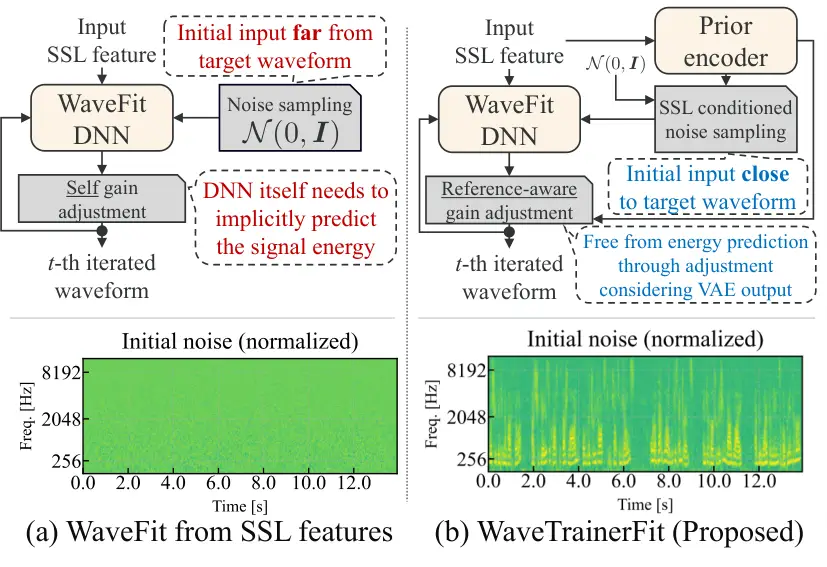
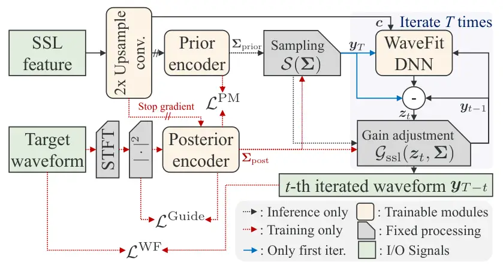

# Wave-Trainer-Fit: Neural Vocoder with Trainable Prior and Fixed-Point Iteration towards High-Quality Speech Generation from SSL features

Hien Ohnaka\sthanksWork done during part-time job in LY Corporation   
Yuma Shirahata    Masaya Kawamura

###### Abstract

We propose WaveTrainerFit, a neural vocoder that performs high-quality
waveform generation from data-driven features such as SSL features.
WaveTrainerFit builds upon the WaveFit vocoder, which integrates
diffusion model and generative adversarial network. Furthermore, the
proposed method incorporates the following key improvements: 1. By
introducing trainable priors, the inference process starts from noise
close to the target speech instead of Gaussian noise. 2. Reference-aware
gain adjustment is performed by imposing constraints on the trainable
prior to matching the speech energy. These improvements are expected to
reduce the complexity of waveform modeling from data-driven features,
enabling high-quality waveform generation with fewer inference steps.
Through experiments, we showed that WaveTrainerFit can generate highly
natural waveforms with improved speaker similarity from data-driven
features, while requiring fewer iterations than WaveFit. Moreover, we
showed that the proposed method works robustly with respect to the depth
at which SSL features are extracted. Code and pre-trained models are
available from
[https://github.com/line/WaveTrainerFit](https://github.com/line/WaveTrainerFit).

###### Index Terms: 

Neural vocoder, self-supervised learning, variational autoencoder,
speech synthesis.

^(†)^(†)address: ¹Nara Institute of Science and Technology, Nara,
Japan  
²LY Corporation, Tokyo, Japan

## 1 Introduction

Neural vocoders are deep neural networks (DNNs) that generate speech
waveforms from acoustic features. Recently, they have become
indispensable components in various tasks such as text-to-speech \[1,
2\], voice conversion \[3\], and speech-to-speech translation \[4\].
Specifically, neural vocoders from Mel-spectrograms have been widely
researched, and they have become capable of generating waveforms of the
same quality as human speech \[5, 6\].

In recent years, the advancement of self-supervised learning (SSL)
models \[7, 8, 9\] has changed the way of conventional speech processing
tasks. SSL models have demonstrated high performance in generative
applications such as text-to-speech synthesis \[10, 11\], and speech
restoration \[12, 13\]. Their advantage is the ability to learn
data-driven features that represent speech signals from large amounts of
unlabeled data. In light of this background, robust vocoders from SSL
features are becoming increasingly essential.

WaveFit \[5, 12\] is a fixed-point iteration vocoder that combines
generative adversarial networks (GANs) \[6, 14, 15, 16\] with diffusion
model \[17, 18\]-like inference. Due to the combination of the two
generative models, WaveFit can generate high-quality waveforms from not
only Mel-spectrograms, but also SSL features that are not specialized
for waveform generation tasks \[12, 13, 19, 20\].

When Mel-spectrograms are used as input of WaveFit \[5\], signal
processing knowledge could be applied for effective training of
diffusion models in two ways: 1. initial noise could be sampled from a
hand-crafted prior distribution using the spectral envelope \[17\],
rather than the Gaussian noise. 2. Gain adjustment is done explicitly
using the power of the Mel-Spectrogram. However, when SSL features are
used as input \[12\], these methods cannot be used since SSL features
are not derived from signal-processing.



Figure 1: Conceptual diagrams and noise examples of each methods. The
bottom images show the log Mel-spectrograms of initial noise.

To overcome these limitations, we propose a neural vocoder with
trainable prior and fixed-point iteration (WaveTrainerFit) for improved
waveform generation from SSL features. The key improvements in
WaveTrainerFit over WaveFit are illustrated in Fig. 1. First, by
introducing variational autoencoder (VAE) \[21\]-based trainable priors,
we achieve sampling of noise close to target waveform. Since inference
can start from a point close to speech, high-quality waveform generation
with fewer iterations could be expected. Furthermore, by imposing
constraints on the priors to learn the energy of speech, we realize gain
adjustment using the energy of the priors , which frees the vocoder from
the implicit energy inference task. As a result, the model can focus on
more important aspects of waveform modeling, and is thought to mitigate
the difficulty of training.

Objective evaluations showed that WaveTrainerFit achieves better quality
waveform generation compared to WaveFit with fewer iterations. Moreover,
the proposed method can generate natural waveforms even when conditioned
on SSL features from deep layers, which contain limited acoustic
information. Finally, subjective evaluation showed that the proposed
method outperforms the baselines in speaker similarity. Audio samples
are available on our demo page ¹¹ 1
[https://i17oonaka-h.github.io/projects/research_topics/wave_trainer_fit/](https://i17oonaka-h.github.io/projects/research_topics/wave_trainer_fit/).

## 2 Related work

### 2.1 WaveFit: Neural vocoder with fixed-point iteration

WaveFit \[5, 12\] is an iterative-style non-autoregressive neural
vocoder that combines the iterative processing of diffusion models with
GAN-based loss. Although WaveFit has variants that take both
Mel-spectrograms and SSL features as inputs, in this work we focus on
the latter. This method generates the speech waveform
$`\bm{y}_{0}\in\mathbb{R}^{D}`$ from Gaussian noise
$`\bm{y}_{T}\in\mathbb{R}^{D}\sim\mathcal{N}(0,\bm{I})`$ and SSL
features $`\bm{c}`$ by applying $`T`$ denoising mapping
processes \[12\]:

```math
\displaystyle\bm{y}_{t-1} \displaystyle=\hat{\mathcal{G}}(\bm{z}_{t}),\quad\bm{z}_{t}=\bm{y}_{t}-\mathcal{F}_{\theta}(\bm{y}_{t},\bm{c},t), \tag{1}
```

```math
\displaystyle\hat{\mathcal{G}}(\bm{z}_{t}) \displaystyle=\beta_{\mathrm{scale}}\cdot\bm{z}_{t}/\max(\mathrm{abs}(\bm{z}_{t})), \tag{2}
```

where $`D`$ is the number of time-domain samples,
$`\mathcal{F}_{\theta}`$ is a DNN trained to estimate noise components,
$`\beta_{\mathrm{scale}}`$ is a scaling factor, and
$`\mathrm{abs}(\cdot)`$ returns element-wise absolute values of the
input vector. $`\hat{\mathcal{G}}(\bm{z}_{t})`$ is a self-gain
adjustment operator that normalizes the power of predicted waveform. The
loss function $`\mathcal{L}^{\mathrm{WF}}`$ is represented by the
following equation:

```math
\displaystyle\mathcal{L}^{\mathrm{WF}}\!\! \displaystyle=\!\frac{1}{T}\!\sum_{t=0}^{T-1}\mathcal{L}_{\mathrm{G}}^{\mathrm{gan}}(\bm{x}_{0},\bm{y}_{t})\!+\!\mathcal{L}_{\mathrm{D}}^{\mathrm{gan}}(\bm{x}_{0},\bm{y}_{t})\!+\!\lambda_{\mathrm{S}}\mathcal{L}^{\mathrm{S}}(\bm{x}_{0},\bm{y}_{t}). \tag{3}
```

Here, $`\bm{x}_{0}`$ is a target waveform,
$`\mathcal{L}_{\mathrm{G}}^{\mathrm{gan}}`$ and
$`\mathcal{L}_{\mathrm{D}}^{\mathrm{gan}}`$ are the loss functions of
the generators and discriminators in \[5\], $`\lambda_{\mathrm{S}}`$ is
the weight parameter, and $`\mathcal{L}^{\mathrm{S}}`$ is the
multi-resolution STFT loss \[14, 15\].

WaveFit has been successfully employed as a vocoder from SSL features in
tasks such as speech restoration \[12, 13\] and high-quality dataset
creation \[19, 20\]. However, since WaveFit was originally designed as a
vocoder for the Mel-spectrogram, a signal-processing-based acoustic
feature, it makes the following two compromises when using data-driven
SSL features as input:

1. Noise sampling. In the initial noise sampling of the diffusion model,
   it cannot use hand-crafted noise sampling methods \[17, 22\], which
   leverages signal-processing knowledge derived from the Mel-spectrogram.
   Therefore, it resorts to simple Gaussian noise.
2. Gain adjustment. In gain adjustment, it cannot utilize the power
   obtained from the Mel-spectrogram. Therefore, it must instead be learned
   by the model as in (2).

### 2.2 RestoreGrad: Diffusion model with trainable prior

RestoreGrad \[23\] is a method to obtain an informative prior for
diffusion models even when hand-crafted noise sampling methods are
difficult. To achieve this, RestoreGrad combines diffusion models with
trainable priors, which are modeled by VAEs. Specifically, RestoreGrad
is trained to minimize the Kullback-Leibler (KL) divergence between the
posterior distribution $`\mathcal{N}(0,\bm{\Sigma}_{\mathrm{post}})`$
and the prior distribution
$`\mathcal{N}(0,\bm{\Sigma}_{\mathrm{prior}})`$:

```math
\displaystyle\mathcal{L}^{\mathrm{PM}}(\bm{\Sigma}_{\mathrm{post}},\bm{\Sigma}_{\mathrm{prior}}) \displaystyle=\log\frac{|\bm{\Sigma}_{\mathrm{prior}}|}{|\bm{\Sigma}_{\mathrm{post}}|}+\mathrm{tr}(\bm{\Sigma}_{\mathrm{prior}}^{-1}\bm{\Sigma}_{\mathrm{post}}). \tag{4}
```

$`\bm{\Sigma}_{\mathrm{prior}}`$ and $`\bm{\Sigma}_{\mathrm{post}}`$ are
the covariance matrix generated by the prior encoder
$`\mathcal{V}_{\mathrm{prior}}(\bm{c})`$ and the posterior encoder
$`\mathcal{V}_{\mathrm{post}}(\bm{c},\bm{x}_{0})`$, respectively.
$`\bm{x}_{0}`$ is the target waveform, and $`\bm{c}`$ is the conditional
feature. To help the posterior encoder learn the informative
representation, additional loss term
$`\mathcal{L}^{\mathrm{LR}}(\bm{x}_{0},\bm{\Sigma}_{\mathrm{post}})`$ is
introduced:

```math
\displaystyle\mathcal{L}^{\mathrm{LR}}(\bm{x}_{0},\bm{\Sigma}_{\mathrm{post}}) \displaystyle=\log{|\bm{\Sigma}_{\mathrm{post}}|}+\overline{\alpha}_{T}\bm{x}_{0}^{T}\bm{\Sigma}_{\mathrm{post}}^{-1}\bm{x}_{0}, \tag{5}
```

where $`\overline{\alpha}_{T}`$ is a weight based on the variance
schedule. The first term is the regularization term that prevents
numerical inflation of encoder outputs and training collapse. The second
term guides $`\bm{\Sigma}_{\mathrm{post}}`$ to have a similar power to
the target waveform $`\bm{x}_{0}`$.

During inference steps of the diffusion model, the model can sample the
initial noise from the prior
$`\mathcal{N}(0,\bm{\Sigma}_{\mathrm{prior}})`$. Since the prior
contains information related to the target waveform, it is expected to
facilitate waveform generation compared to the naive approach of
sampling from Gaussian noise.

In experiments \[23\], RestoreGrad showed superior results in speech
enhancement and image restoration compared to the hand-crafted
method \[22\] and sampling from standard normal distribution.

## 3 Proposed method

### 3.1 Motivation

We hypothesize that the noise sampling issues of WaveFit described in
Sec. 2.1 can be addressed by introducing the trainable priors in
RestoreGrad described in Sec. 2.2. In addition, imposing a new
constraint on the trainable prior to match the energy of the target
speech enables reference-aware gain adjustment, thereby resolving the
gain adjustment issue. These improvements are expected to reduce the
difficulty of waveform modeling from data-driven features, enabling
high-quality waveform generation with fewer inference steps.

### 3.2 Model overview



Figure 2: Overview of the proposed model. During training, the posterior
encoder derived from the target waveform and the SSL feature is used for
noise sampling and gain adjustment. During inference, the prior encoder
derived from the SSL feature is used for same process. Solid arrows are
used for both training and inference.

Figure 2 shows an overview of the proposed method. The proposed method
introduces a prior encoder and a posterior encoder to achieve a
trainable initial noise sampling as in RestoreGrad. For the conditional
input $`c`$, we used SSL features up-sampled by a factor of two using a
transposed 2D convolutional layer as in \[12, 13\]. $`\bm{c}`$ is used
as the input of the posterior encoder, the prior encoder and the WaveFit
DNN. During training, initial noise is sampled from the posterior
distribution $`\mathcal{N}(0,\bm{\Sigma}_{\mathrm{post}})`$, which is
conditioned on the SSL feature and the target waveform. During
inference, it is sampled from the prior distribution
$`\mathcal{N}(0,\bm{\Sigma}_{\mathrm{prior}})`$, which is conditioned
solely on SSL features.

### 3.3 Noise sampling in time-frequency domain

While RestoreGrad introduced trainable priors in the waveform domain,
the proposed method incorporates them in the time-frequency domain to
shorten the sequence length and reduce the modeling complexity.
Specifically, the variance feature $`\bm{\Sigma}`$ obtained from either
the posterior or the prior encoder, is changed to have a shape of
$`\mathbb{R}^{F\times K}`$. Here, $`F`$ is the frequency bin size and
$`K`$ is the number of frames. Then, the time domain initial noise
$`\bm{y}_{T}=\mathcal{S}(\bm{\Sigma})\in\mathbb{R}^{D}`$ is sampled with
Eq. (6):

```math
\displaystyle\mathcal{S}(\bm{\Sigma}) \displaystyle=\mathrm{iSTFT}(\mathcal{R}(\bm{N})\odot\bm{\Sigma}+i\mathcal{I}(\bm{N})\odot\bm{\Sigma}), \tag{6}
```

```math
\displaystyle\bm{N} \displaystyle=\mathrm{STFT}(\epsilon)\in\mathbb{C}^{F\times K},~\epsilon\in\mathbb{R}^{D}\sim\mathcal{N}(0,\bm{I}). \tag{7}
```

This process corresponds to the reparameterization trick in a
complex-valued VAE \[24\] when assuming zero mean and zero
pseudo-covariance. $`\mathcal{R}(\cdot)`$ and $`\mathcal{I}(\cdot)`$ are
operators that extract only the real and imaginary parts, respectively.

### 3.4 Loss function and gain adjustment

The loss function of the proposed method is as follows:

```math
\displaystyle\mathcal{L}^{\mathrm{TrainerFit}} \displaystyle=\mathcal{L}^{\mathrm{WF}}+\lambda_{\mathrm{PM}}\mathcal{L}^{\mathrm{PM}}+\mathcal{L}^{\mathrm{Guide}}. \tag{8}
```

Here, the first term is the same loss function as in Eq (3), which is
responsible for the training of diffusion and GAN. The second term is
based on the loss term in Eq. (4), but is expanded to the time-frequency
domain. This loss minimizes the KL divergence between the output of the
prior encoder and that of the posterior encoder.
$`\lambda_{\mathrm{PM}}`$ is the weight parameter. Finally, the third
term softly provides guidance to the posterior encoder output
$`\bm{\Sigma}_{\mathrm{post}}`$:

```math
\displaystyle\mathcal{L}^{\mathrm{Guide}}\!\! \displaystyle=\!\left|\mathcal{E}(\bm{\Sigma}_{\mathrm{post}})\!-\!\mathcal{E}(|\bm{X}_{0}|^{2})\right|\!+\!\frac{\lambda_{\mathrm{Guide}}}{FK}\!\sum_{f=0}^{F-1}\sum_{k=0}^{K-1}\!\frac{\bm{\Sigma}_{\mathrm{post}}[f,k]}{|\bm{X}_{0}|^{2}[f,k]}. \tag{9}
```

Here, $`\lambda_{\mathrm{Guide}}`$ is the weight parameter,
$`|\bm{X}_{0}|^{2}\in\mathbb{R}^{F\times K}`$ is the power spectrogram
of target waveform, and $`f,k`$ represent the frequency and time index,
and $`\mathcal{E}(\cdot)`$ is a element-wise summation operation,
respectively. The first term aims to match the energy of the posterior
encoder output with that of the target speech. This encourages
$`\bm{\Sigma}_{\mathrm{post}}`$ to have the energy close to that of the
target waveform. As a result, we can define a reference-aware gain
adjustment operator as follows:

```math
\displaystyle\mathcal{G}_{\mathrm{ssl}}(\bm{z}_{t},\bm{\Sigma}) \displaystyle=\sqrt{(\mathcal{E}(\bm{\Sigma})/(\mathcal{E}(|\bm{Z}_{t}|^{2})+s))}\bm{z}_{t}. \tag{10}
```

Here, $`s`$ is a scalar to avoid zero-division. The second term is an
extension of the second term in Eq. (5) to two-dimensional signals,
guiding effective posterior learning by softly reflecting the power of
the target spectrogram.

## 4 Experimental evaluation

[TABLE]

Table 1: Evaluation results when using LibriTTS-R test-clean, 8-th layer
SSL features, and $`T=5`$. Bold indicates the best method under the same
conditions, and underlines indicate significant differences between
WaveFit and WaveTrainerFit.

Figure 3: Line plots of objective metrics over iterations. Real-Time
Factor (RTF) was measured on “Intel(R) Xeon(R) Silver 4316 CPU @
2.30GHz” using randomly selected 200 samples.

[TABLE]

Table 2: Layer-focused objective evaluation results. Here, we used WavLM
features as conditional features.

### 4.1 Experimental setup

Datasets. We used the LibriTTS-R corpus \[19\]. This corpus consists of
a total of $`585`$ hours of speech at $`24`$kHz from $`2,456`$ speakers
and text pairs. The “train-clean-360”, “dev-clean”, and “test-clean”
were used for training, validation, and test set, respectively.  
Model and training setup. Our model generates waveforms by upsampling
SSL features by $`480\times`$. The breakdown is as follows: First, as
shown in Fig. 2, a 2D transposed convolutional layer perform $`2\times`$
upsampling. Then, an architecture similar to WaveFit \[5\] with
upsampling scale of $`\{5,4,3,2,2\}`$ performs $`240\times`$. The model
was trained with a batch size of $`8`$ for $`400k`$ training steps. The
weight parameters $`\lambda_{\mathrm{Guide}}`$ and
$`\lambda_{\mathrm{PM}}`$ were set to $`0.1`$ and $`10`$, respectively.
For the encoder architecture, real-valued DCUnet-10 \[25\] was adopted
with two primary modifications. First, a linear layer was used to align
the dimension of SSL features with the frequency dimension of the power
spectrogram. Second, two U-Nets \[25\] were defined in the posterior
encoder: one used for the power spectrogram from the target waveform,
and the other for the SSL features. The intermediate outputs of the
first U-Net at each block were added to those of the second U-Net at the
same position. The channel size of the encoders was $`32`$ for the
posterior encoder and $`45`$ for the prior encoder. The total number of
parameters was $`2.61~M`$ and $`2.59~M`$, respectively. Other settings,
such as optimizer, scheduler, and discriminator are the same as in the
open-sourced implementation ²² 2
[https://github.com/yukara-ikemiya/wavefit-pytorch](https://github.com/yukara-ikemiya/wavefit-pytorch).  
Comparison methods. To evaluate the effectiveness of the proposed
method, we set up two baselines. In addition to WaveFit \[12\],
HiFi-GAN \[6\] was set as a baseline to clarify the effectiveness of the
WaveFit architecture itself in waveform generation from SSL features. To
align the upsamping scale to $`240`$, the upsample-rates were changed to
$`\{8,5,3,2\}`$, and the upsample-kernel-sizes were changed to
$`\{16,11,7,4\}`$. The total number of parameters for the generator was
$`17.18~M`$. The model was trained for $`1M`$ steps with the same batch
size as the proposed method.  
Evaluation metrics. We adopted the following objective metrics:
SpeechBERTScore \[26\] is an automatic speech evaluation metric that
measures semantic congruence between the generated speech and the
reference speech from the BERTScore \[27\] of SSL features. Mel-cepstrum
distortion (MCD) was computed to assess the spectral distortion.
Log-F0-RMSE was calculated by \[28\] to evaluate pitch accuracy. The
above three metrics were calculated using the open-sourced
implementation ³³ 3
[https://github.com/Takaaki-Saeki/DiscreteSpeechMetrics](https://github.com/Takaaki-Saeki/DiscreteSpeechMetrics).
Finally, speaker similarity is measured as the cosine similarity of
speaker embeddings \[29, 30\] between the target and the predicted
waveform. To evaluate the quality of the generated waveforms, we
conducted two subjective listening tests. A total of 450 samples per
method were evaluated on a five-point scale by 15 participants. To
eliminate the effects of differences in waveform energy in all
evaluations, all waveforms were aligned to the energy of clean speech.  
Conditional features. We used two SSL features and one ASR-driven
feature as the conditional features of the vocoders: 1.
WavLM-large \[7\] is an English-specialized SSL model pre-trained with
masked language modeling objective. 2. XLS-R-0.3B \[8\] is a
multilingual SSL model pre-trained with contrastive objective. 3.
Whisper-medium \[31\] is a multilingual speech-to-text model. Here, we
used the encoder part of Whisper as a feature extractor similar to \[32,
33\]. These features all come from different training objectives and
pre-trained data, and are expected to have different properties.

### 4.2 Experimental results

#### 4.2.1 Objective and subjective evaluation results

Table 1 shows the evaluation results. It can be seen that the proposed
method outperformed the baseline on all reference-aware objective
metrics regardless of SSL features. This suggests that the proposed
initial noise sampling and gain adjustment with trainable priors
effectively worked to improve the objective metrics. Regarding the
S-MOS, the proposed method again outperformed baselines for all the SSL
features. The reasons are discussed as follows: the spectral
characteristics of the target speech is learned through the second term
of Eq. (9) in the prior encoder. As a result, initial noise containing
pitch information can be sampled as shown in Fig. 1 (b), which led to
waveform generation that well captures speaker characteristics. For the
N-MOS, the proposed method outperformed the baselines with the Whisper
encoder, but fell short when using XLS-R. There are several possible
causes. One possibility is that the proposed method is sensitive to
hyperparameters. RestoreGrad, which our method is based on, showed a
tendency to be somewhat sensitive to the weight parameter of
$`\mathcal{L}^{\mathrm{LR}}`$ \[23\]. Due to computational cost, we
tested only the weight that achieved the highest score in RestoreGrad,
but careful tuning of these weights may yield better results. Another
possibility is that features of XLS-R themselves had a negative impact.
XLS-R shows worse performance compared to the baseline in English ASR
tasks, suggesting language interference within the model \[8\]. A
similar phenomenon may have occurred in our experiments, possibly
leading to degraded performance. An important future work is a detailed
analysis of how combinations of these hyperparameters, languages, SSL
features, and other factors affect performance.

#### 4.2.2 Performance at each iteration and processing speed

Figure 3 shows the objective metrics for each inference iteration.
During inference, the real-time factor (RTF) of the proposed method was
slightly increased by the prior encoder and the sampling process;
nevertheless, it showed superior scores in all metrics except for RTF
across all iterations. Specifically, the SpeechBERTScore at iteration 1
shows the largest improvement margin for the proposed method. These
results suggest that inference starting from initial noise close to the
target waveform leads to better waveform generation compared to the
baseline with the same number of iterations.

#### 4.2.3 Performance for SSL features from different layers

Features from shallow layers of SSL models are known to contain much
acoustic information from the input, while those from deeper layers
contain much semantic information \[34\]. To verify the robustness of
the proposed method when conditioning on features with different
properties, we conducted evaluations using WavLM features extracted from
the 2nd, 8th, and 24th layers. In this experiment, reference-free
UTMOS \[35\] was added as an evaluation metric that excludes speaker
characteristic deviations from the target waveform.

The results are shown in Table 2. It can be seen that the proposed
method shows better results than the baseline in all reference-aware
metrics except for two metrics in the 2nd layer. Notably, when
conditioned on features from the 24th layer, which contain limited
acoustic information, the proposed method achieved substantial
improvements in reference-aware metrics in addition to the
aforementioned advantages, without significant degradation in UTMOS.
This suggests that the proposed method is capable of generating
waveforms more consistent with the reference speech, thereby exhibiting
stronger robustness to variations in conditional features.

## 5 Conclusion

We proposed WaveTrainerFit for high-quality waveform generation from SSL
features. By introducing a VAE-based trainable prior, we achieved
superior initial noise sampling and reference-based gain adjustment,
addressing the problems of conventional WaveFit from SSL features. In
evaluation experiments, we showed that the proposed method can generate
high-quality waveforms from features lacking acoustic information and
with fewer iterations. In subjective evaluations, we confirmed that the
proposed method consistently showed better results in speaker similarity
MOS compared to the baseline. Future work includes building models from
large datasets and extending to multilingual models.

## References

- \[1\] Y. Wang, R. J. Skerry-Ryan, D. Stanton, Y. Wu, R. J. Weiss, N.
  Jaitly, Z. Yang, Y. Xiao, Z. Chen, S. Bengio, Q. V. Le, Y.
  Agiomyrgiannakis, R. Clark, and R. A. Saurous (2017) Tacotron: towards
  end-to-end speech synthesis. In Proc. of Interspeech, pp. 4006–4010.
  Cited by: §1.
- \[2\] Y. Ren, C. Hu, X. Tan, T. Qin, S. Zhao, Z. Zhao, and T.
  Liu (2021) FastSpeech 2: fast and high-quality end-to-end text to
  speech. In Proc. of ICLR, Cited by: §1.
- \[3\] B. Sisman, J. Yamagishi, S. King, and H. Li (2021) An overview
  of voice conversion and its challenges: from statistical modeling to
  deep learning. IEEE ACM Trans. Audio Speech Lang. Process. 29,
  pp. 132–157. Cited by: §1.
- \[4\] Y. Jia, M. T. Ramanovich, T. Remez, and R. Pomerantz (2022)
  Translatotron 2: high-quality direct speech-to-speech translation with
  voice preservation. In Proc. of ICML, Vol. 162, pp. 10120–10134. Cited
  by: §1.
- \[5\] Y. Koizumi, K. Yatabe, H. Zen, and M. Bacchiani (2022) WaveFit:
  an iterative and non-autoregressive neural vocoder based on
  fixed-point iteration. In Proc. of IEEE SLT, pp. 884–891. Cited by:
  §1, §1, §1, §2.1, §2.1, §4.1.
- \[6\] J. Kong, J. Kim, and J. Bae (2020) HiFi-GAN: generative
  adversarial networks for efficient and high fidelity speech synthesis.
  In Proc. of NeurIPS, Cited by: §1, §1, §4.1.
- \[7\] S. Chen, C. Wang, Z. Chen, Y. Wu, S. Liu, Z. Chen, J. Li, N.
  Kanda, T. Yoshioka, X. Xiao, J. Wu, L. Zhou, S. Ren, Y. Qian, Y.
  Qian, J. Wu, M. Zeng, X. Yu, and F. Wei (2022) WavLM: large-scale
  self-supervised pre-training for full stack speech processing. IEEE J.
  Sel. Top. Signal Process. 16 (6), pp. 1505–1518. Cited by: §1, §4.1.
- \[8\] A. Babu, C. Wang, A. Tjandra, K. Lakhotia, Q. Xu, N. Goyal, K.
  Singh, P. von Platen, Y. Saraf, J. Pino, A. Baevski, A. Conneau,
  and M. Auli (2022) XLS-R: self-supervised cross-lingual speech
  representation learning at scale. In Proc. of Interspeech,
  pp. 2278–2282. Cited by: §1, §4.1, §4.2.1.
- \[9\] W. Hsu, B. Bolte, Y. H. Tsai, K. Lakhotia, R. Salakhutdinov,
  and A. Mohamed (2021) HuBERT: self-supervised speech representation
  learning by masked prediction of hidden units. IEEE ACM Trans. Audio
  Speech Lang. Process. 29, pp. 3451–3460. Cited by: §1.
- \[10\] S. Wang, G. E. Henter, J. Gustafson, and É. Székely (2023) A
  comparative study of self-supervised speech representations in read
  and spontaneous TTS. In Proc. of ICASSP SASB Workshop, pp. 1–5. Cited
  by: §1.
- \[11\] T. Saeki, G. Wang, N. Morioka, I. Elias, K. Kastner, A.
  Rosenberg, B. Ramabhadran, H. Zen, F. Beaufays, and H. Shemtov (2024)
  Extending multilingual speech synthesis to 100+ languages without
  transcribed data. In Proc. of IEEE ICASSP, pp. 11546–11550. Cited by:
  §1.
- \[12\] Y. Koizumi, H. Zen, S. Karita, Y. Ding, K. Yatabe, N.
  Morioka, Y. Zhang, W. Han, A. Bapna, and M. Bacchiani (2023) Miipher:
  a robust speech restoration model integrating self-supervised speech
  and text representations. In Proc. of IEEE WASPAA, pp. 1–5. Cited by:
  §1, §1, §1, §2.1, §2.1, §3.2, §4.1.
- \[13\] S. Karita, Y. Koizumi, H. Zen, H. Ishikawa, R. Scheibler,
  and M. Bacchiani (2025) Miipher-2: a universal speech restoration
  model for million-hour scale data restoration. In Proc. of IEEE WASPAA
  (Accepted), Cited by: §1, §1, §2.1, §3.2.
- \[14\] R. Yamamoto, E. Song, and J. Kim (2020) Parallel WaveGAN: a
  fast waveform generation model based on generative adversarial
  networks with multi-resolution spectrogram. In Proc. of IEEE ICASSP,
  pp. 6199–6203. Cited by: §1, §2.1.
- \[15\] G. Yang, S. Yang, K. Liu, P. Fang, W. Chen, and L. Xie (2021)
  Multi-band MelGAN: faster waveform generation for high-quality
  text-to-speech. In Proc. of IEEE SLT, pp. 492–498. Cited by: §1, §2.1.
- \[16\] K. Kumar, R. Kumar, T. de Boissiere, L. Gestin, W. Z. Teoh, J.
  Sotelo, A. de Brébisson, Y. Bengio, and A. C. Courville (2019) MelGAN:
  generative adversarial networks for conditional waveform synthesis. In
  Proc. of NeurIPS, pp. 14881–14892. Cited by: §1.
- \[17\] Y. Koizumi, H. Zen, K. Yatabe, N. Chen, and M. Bacchiani (2022)
  SpecGrad: diffusion probabilistic model based neural vocoder with
  adaptive noise spectral shaping. In Proc. of Interspeech, pp. 803–807.
  Cited by: §1, §1, §2.1.
- \[18\] N. Chen, Y. Zhang, H. Zen, R. J. Weiss, M. Norouzi, and W.
  Chan (2021) WaveGrad: estimating gradients for waveform generation. In
  Proc. of ICLR, Cited by: §1.
- \[19\] Y. Koizumi, H. Zen, S. Karita, Y. Ding, K. Yatabe, N.
  Morioka, M. Bacchiani, Y. Zhang, W. Han, and A. Bapna (2023)
  LibriTTS-R: a restored multi-speaker text-to-speech corpus. In Proc.
  of Interspeech, pp. 5496–5500. Cited by: §1, §2.1, §4.1.
- \[20\] M. Ma, Y. Koizumi, S. Karita, H. Zen, J. Riesa, H. Ishikawa,
  and M. Bacchiani (2024) FLEURS-R: a restored multilingual speech
  corpus for generation tasks. In Proc. of Interspeech, Cited by: §1,
  §2.1.
- \[21\] D. P. Kingma and M. Welling (2014) Auto-encoding variational
  bayes. In Proc. of ICLR, Cited by: §1.
- \[22\] S. Lee, H. Kim, C. Shin, X. Tan, C. Liu, Q. Meng, T. Qin, W.
  Chen, S. Yoon, and T. Liu (2022) PriorGrad: improving conditional
  denoising diffusion models with data-dependent adaptive prior. In
  Proc. of ICLR, Cited by: §2.1, §2.2.
- \[23\] C. H. Lee, C. Yang, J. Cho, Y. M. Saidutta, R. S. Srinivasa, Y.
  Shen, and H. Jin (2025) RestoreGrad: signal restoration using
  conditional denoising diffusion models with jointly learned prior. In
  Proc. of ICML, Cited by: §2.2, §2.2, §4.2.1.
- \[24\] T. Nakashika (2020) Complex-valued variational autoencoder: a
  novel deep generative model for direct representation of complex
  spectra. In Proc. of Interspeech, pp. 2002–2006. Cited by: §3.3.
- \[25\] H. Choi, J. Kim, J. Huh, A. Kim, J. Ha, and K. Lee (2019)
  Phase-aware speech enhancement with deep complex u-net. In Proc. of
  ICLR, Cited by: §4.1.
- \[26\] T. Saeki, S. Maiti, S. Takamichi, S. Watanabe, and H.
  Saruwatari (2024) SpeechBERTScore: reference-aware automatic
  evaluation of speech generation leveraging NLP evaluation metrics. In
  Proc. of Interspeech, Cited by: §4.1.
- \[27\] T. Zhang, V. Kishore, F. Wu, K. Q. Weinberger, and Y.
  Artzi (2020) BERTScore: evaluating text generation with BERT. In Proc.
  of ICLR, Cited by: §4.1.
- \[28\] M. Morise (2017) Harvest: a high-performance fundamental
  frequency estimator from speech signals. In Proc. of Interspeech,
  pp. 2321–2325. Cited by: §4.1.
- \[29\] B. Desplanques, J. Thienpondt, and K. Demuynck (2020)
  ECAPA-TDNN: emphasized channel attention, propagation and aggregation
  in TDNN based speaker verification. In Proc. of Interspeech,
  pp. 3830–3834. Cited by: §4.1.
- \[30\] M. Ravanelli, T. Parcollet, P. Plantinga, A. Rouhe, S.
  Cornell, L. Lugosch, C. Subakan, N. Dawalatabad, A. Heba, J. Zhong, J.
  Chou, S. Yeh, S. Fu, C. Liao, E. Rastorgueva, F. Grondin, W. Aris, H.
  Na, Y. Gao, R. D. Mori, and Y. Bengio (2021) SpeechBrain: a
  general-purpose speech toolkit. Note: arXiv:2106.04624 Cited by: §4.1.
- \[31\] A. Radford, J. W. Kim, T. Xu, G. Brockman, C. McLeavey, and I.
  Sutskever (2023) Robust speech recognition via large-scale weak
  supervision. In Proc. of ICML, Vol. 202, pp. 28492–28518. Cited by:
  §4.1.
- \[32\] R. E. Zezario, Y. Chen, S. Fu, Y. Tsao, H. Wang, and C.
  Fuh (2024) A study on incorporating whisper for robust speech
  assessment. In Proc. of IEEE ICME, pp. 1–6. Cited by: §4.1.
- \[33\] L. Qian and G. Skantze (2024) Joint learning of context and
  feedback embeddings in spoken dialogue. In Proc. of Interspeech, Cited
  by: §4.1.
- \[34\] A. Pasad, J. Chou, and K. Livescu (2021) Layer-wise analysis of
  a self-supervised speech representation model. In Proc. of IEEE ASRU,
  pp. 914–921. Cited by: §4.2.3.
- \[35\] T. Saeki, D. Xin, W. Nakata, T. Koriyama, S. Takamichi, and H.
  Saruwatari (2022) UTMOS: utokyo-sarulab system for voicemos challenge 2022. In Proc. of Interspeech, pp. 4521–4525. Cited by: §4.2.3.
