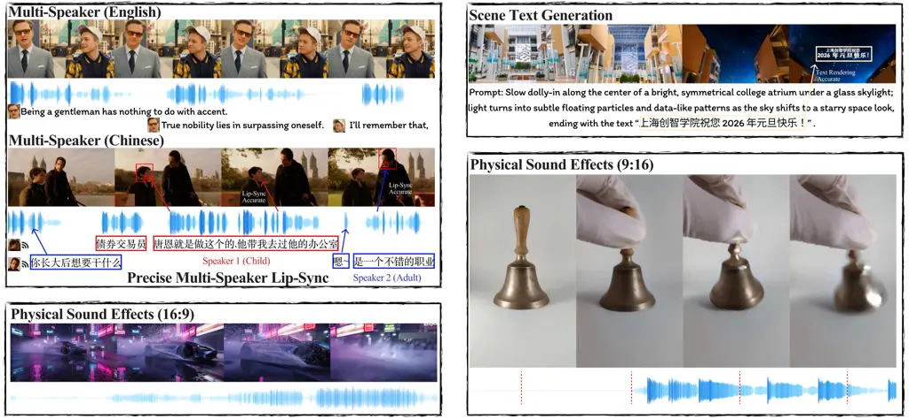
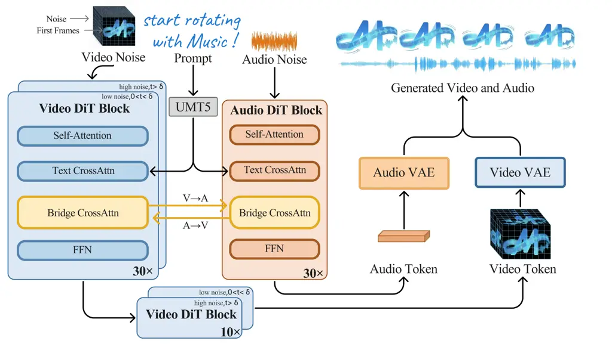
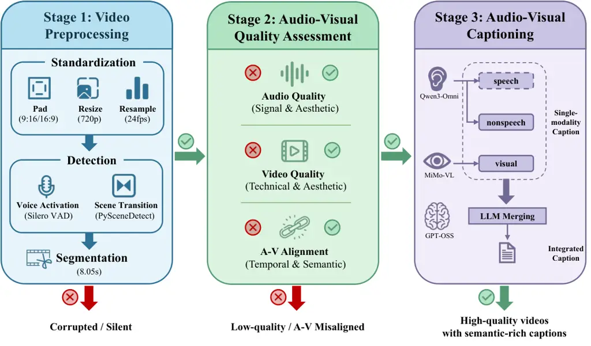
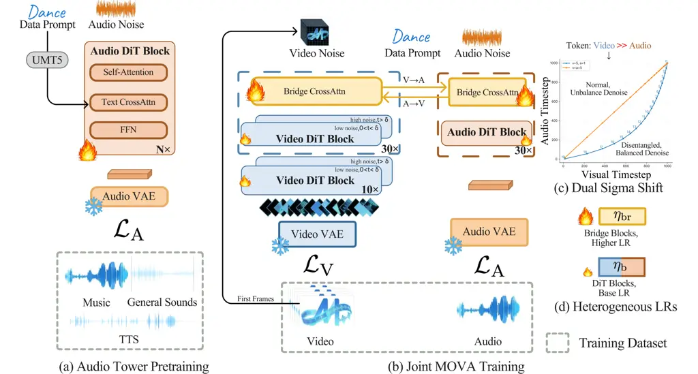
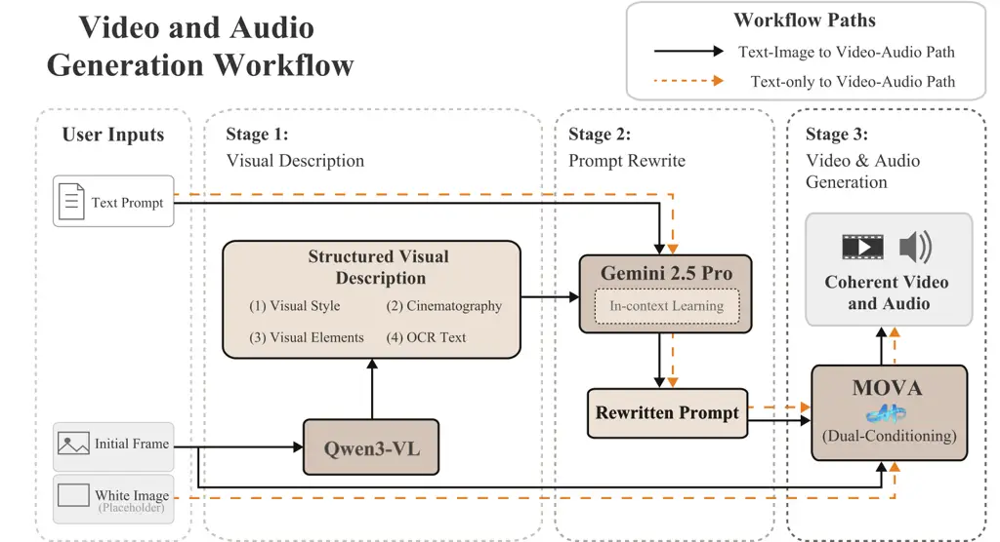
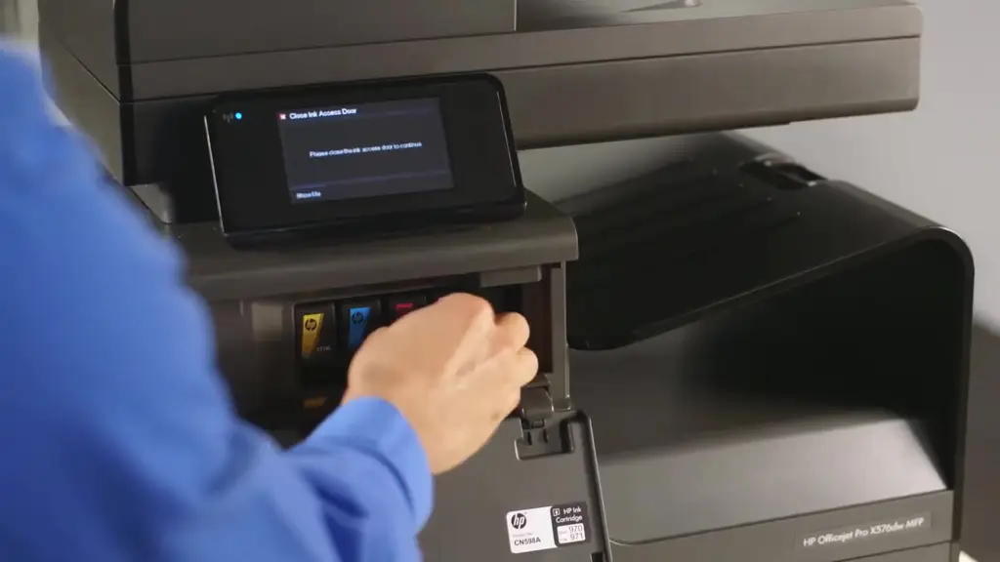
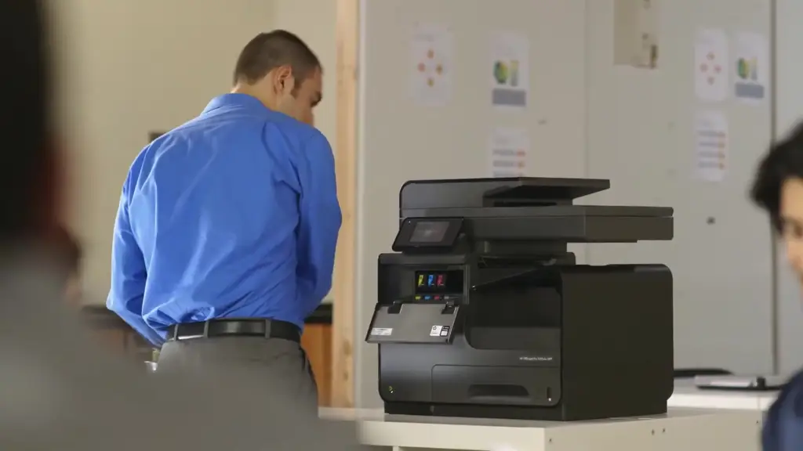
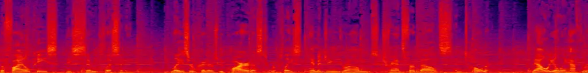

\checkdata

\[Blog\][https://mosi.cn/models/mova](https://mosi.cn/models/mova)
\checkdata\[Model\][https://huggingface.co/collections/OpenMOSS-Team/mova](https://huggingface.co/collections/OpenMOSS-Team/mova)
\checkdata\[Code\][https://github.com/OpenMOSS/MOVA](https://github.com/OpenMOSS/MOVA)

# MOVA: Towards Scalable and Synchronized Video–Audio Generation

SII-OpenMOSS Team^(\*)

###### Abstract

Audio is indispensable for real-world video, yet generation models have
largely overlooked audio components. Current approaches to producing
audio-visual content often rely on cascaded pipelines, which increase
cost, accumulate errors, and degrade overall quality. While systems such
as Veo 3 and Sora 2 emphasize the value of simultaneous generation,
joint multimodal modeling introduces unique challenges in architecture,
data, and training. Moreover, the closed-source nature of existing
systems limits progress in the field. In this work, we introduce MOVA
(MOSS Video and Audio), an open-source model capable of generating
high-quality, synchronized audio-visual content, including realistic
lip-synced speech, environment-aware sound effects, and content-aligned
music. MOVA employs a Mixture-of-Experts (MoE) architecture, with a
total of 32B parameters, of which 18B are active during inference. It
supports IT2VA (Image-Text to Video-Audio) generation task. By releasing
the model weights and code, we aim to advance research and foster a
vibrant community of creators. The released codebase features
comprehensive support for efficient inference, LoRA fine-tuning, and
prompt enhancement.

^(\*)^(\*)footnotetext: Full contributors can be found in the
Contributors section.

## 1 Introduction

Video generation has long been a pivotal domain in multimodal generative
modeling. Historically, limitations in model capacity, data volume, and
scalability hindered these models from achieving practically viable
performance. The emergence of the scalable Diffusion Transformer
architecture \[1\] has changed this landscape, giving rise to a series
of models-including Sora \[2\], OpenSora \[3, 4\], Wan \[5\], and LTX
\[6\]—that can generate high-fidelity, realistic videos. Beyond basic
video synthesis, these models also demonstrate advanced capabilities
such as long video generation \[7\], controllable synthesis \[8\], and
even few-shot learning and visual reasoning \[9, 10\].

However, traditional video generation models often neglect the audio
component, despite its critical role in multimedia content. Producing
videos with synchronized sound typically requires a cascaded
pipeline\[11\], e.g., generating video first and then synthesizing audio
based on the visuals, or vice versa. Such pipelines inherently limit
generation quality, as the audio and video modalities do not interact
during synthesis. End-to-end models like Veo3 \[12\] have demonstrated
that high-fidelity audio-visual generation with precise synchronization
is possible, highlighting the importance of joint audio-video modeling.
Similarly, Sora2 \[13\] exhibits impressive capabilities in generating
synchronized audio and video. Yet, all these state-of-the-art systems
are closed-source, and subsequent releases such as Wan2.6 \[14\], Kling
Video 3,0 \[15\], and Seedance 2.0 \[16\] remain proprietary. As a
result, the development of high-quality video-audio generation models
remains underexplored in the research community.

Compared to video-only generation models, video-audio generation models
introduce three major challenges: 1. Data Pipeline: Incorporating the
audio modality requires a fine-grained audio-video captioning pipeline. 2. Modality Fusion: To achieve harmonious and synchronized video-audio
generation, these two modalities must mutually integrate information
during the generation process. However, simultaneous bi-modal generation
faces challenges due to disparity in native information density between
the two modalities, as well as challenges regarding fusion mechanisms
and efficiency. 3. Scalability Verification: Most existing open-source
models are evaluated on small-scale architectures and limited datasets
\[17, 18, 19, 20\], often falling short in achieving high-quality
results across both modalities. It remains an open question whether
video-audio models can sustain continuous performance improvements with
larger datasets and model scales.



Figure 1: Overview of MOVA capabilities. MOVA generates synchronized
video and audio across diverse scenarios: multi-speaker speech with
precise lip synchronization in both English and Chinese, physical sound
effects aligned with visual events, and scene text generation. The model
supports both 16:9 and 9:16 aspect ratios.

In this work, we present MOVA (MOSS Video and Audio), a video-audio
generation foundation model capable of synthesizing multilingual speech
with high-quality lip synchronization, as well as environmental sounds
with precise audio-visual alignment. To achieve high-quality video-audio
generation, we propose an asymmetric dual-tower architecture, combining
a pre-trained video tower with a pre-trained audio tower. For modality
fusion, we employ a bidirectional cross-attention mechanism that enables
rich interaction between the two modalities. To unleash the potential of
this architecture, we construct a fine-grained video-audio annotation
pipeline and scale up the training data, resulting in strong performance
in synchronized video-audio generation. We observe consistent
improvements in both lip synchronization and video-audio alignment
metrics as training progresses. As illustrated in Figure 1, MOVA
realizes scalable and synchronized video-audio generation. To support
research and foster community creation, we release all model weights
along with training, inference, and fine-tuning code.

Our contributions can be summarized as follows:

- •
  We develop MOVA, a synchronized video-audio generation model with an
  asymmetric dual-tower architecture that leverages pre-trained video
  and audio generation models.
- •
  We design a fine-grained audio-video captioning pipeline to produce
  high-quality bimodal training data at scale.
- •
  By scaling video-audio training, we achieve continuous improvements in
  synchronization performance across both modalities.

## 2 Model Architecture

### 2.1 Preliminaries

We consider joint generation of temporally aligned video-audio pairs
from a text prompt (optionally with a first-frame image for I2VA). Let
$`V\in\mathbb{R}^{(1+T^{v})\times H\times W\times 3}`$ be a video of
$`T^{v}+1`$ frames and $`A\in\mathbb{R}^{T^{a}\times 1}`$ be the
corresponding 48 kHz mono audio waveform. We adopt pretrained VAEs to
define compact latent spaces: the Wan2.1 video VAE \[5\] compresses
$`V`$ into a spatiotemporal latent $`x^{v}`$, and a DAC-style audio VAE
from HunyuanVideo-Foley \[21\] encodes $`A`$ into an audio latent
$`x^{a}`$. All subsequent modules operate in these latent spaces. Given
a condition $`c`$, our goal is to generate synchronized
$`(x^{v},x^{a})`$.



Figure 2: Model Structure Overview. MOVA couples an A14B video DiT
backbone and a 1.3B audio DiT backbone via a 2.6B bidirectional Bridge
module.

Our training objective follows the flow matching method \[22, 23\]. At
each timestep $`t`$,

```math
\displaystyle x_{t}^{v} \displaystyle=(1-t)x^{v}+t\varepsilon^{v},
```

```math
\displaystyle x_{t}^{a} \displaystyle=(1-t)x^{a}+t\varepsilon^{a}, \tag{1}
```

where $`\varepsilon^{v},\varepsilon^{a}\sim\mathcal{N}(0,I)`$ and
$`t\sim\mathcal{U}(0,1)`$.

The target velocity is given by the derivative of the interpolation
path:

```math
\displaystyle v_{t}^{v} \displaystyle:=\frac{\mathrm{d}x_{t}^{v}}{\mathrm{d}t}=\varepsilon^{v}-x^{v},
```

```math
\displaystyle v_{t}^{a} \displaystyle:=\frac{\mathrm{d}x_{t}^{a}}{\mathrm{d}t}=\varepsilon^{a}-x^{a}. \tag{2}
```

The training loss is defined as a standard flow matching objective:

```math
\mathcal{L}_{\mathrm{FM}}=\mathbb{E}_{t,c,x^{v},x^{a},\varepsilon}\Big[\lambda_{v}\left\|\hat{v}^{v}_{\theta}(x_{t}^{v},x_{t}^{a},t,c)-v_{t}^{v}\right\|_{2}^{2}\;+\;\lambda_{a}\left\|\hat{v}^{a}_{\theta}(x_{t}^{v},x_{t}^{a},t,c)-v_{t}^{a}\right\|_{2}^{2}\Big], \tag{3}
```

where $`\theta`$ denotes the model parameters, $`\hat{v}_{\theta}`$
denotes the predicted cross-modal velocity field, $`c`$ denotes the
conditioning signal (text, optionally augmented with an input image),
and $`\lambda_{v},\lambda_{a}`$ are loss weights that balance the video-
and audio-velocity regression terms, respectively.

### 2.2 Dual-Tower Diffusion Transformer

Our goal is to leverage powerful pretrained single-modality diffusion
models and achieve synchronized video–audio generation with minimal
additional cost. Specifically, we adopt Wan2.2 I2V A14B \[5\] as the
video backbone (for image+text conditioned I2VA) and a 1.3B
text-to-audio diffusion model with a Wan2.1-style architecture as the
audio backbone. We couple these two backbones through a lightweight
dual-tower conditional Bridge, enabling bidirectional information
exchange while keeping the core towers intact.

##### Bridge Module.

The bridge operates at the hidden-state level of the two DiT backbones.
At each interaction layer, two cross-attention blocks are added: one
injects video hidden states into the audio DiT. and one injects audio
hidden states into the video DiT.

##### Aligned RoPE.

Video and audio latents live on different temporal grids: video latents
are relatively coarse (due to temporal downsampling in the video VAE),
while audio latents are much denser. If we apply cross-attention with
naive positional indices, tokens that represent the same physical time
can be assigned to different positional slots (and conversely different
physical times can share nearby indices), so queries and keys may
correspond to mismatched physical times, causing audio–visual drift;
this positional mismatch also breaks the translation invariance of the
interaction process.

Similarly to MMAudio \[24\] and OVI \[18\], we modify standard RoPE
\[25\] to align the two modalities on the same time grid.:

```math
\tilde{\mathbf{q}}_{(m)}=R\!\left(\tfrac{p}{\theta_{m}}\right)\mathbf{q}_{(m)},\quad\tilde{\mathbf{k}}_{(m)}=R\!\left(\tfrac{p}{\theta_{m}}\right)\mathbf{k}_{(m)},\qquad R(\phi)=\begin{bmatrix}\cos\phi&-\sin\phi\\
\sin\phi&\cos\phi\end{bmatrix}.
```

Let $`f_{v}`$ and $`f_{a}`$ denote the latent frame rates of video and
audio after their respective VAEs. We map video indices into the audio
time units by scaling the temporal position with the ratio
$`s=f_{a}/f_{v}`$:

```math
p_{v}(i)=s\cdot i,\qquad p_{a}(j)=j.
```

This puts video and audio tokens on the same temporal scale.

## 3 Data Engineering



Figure 3: Data curation overview. Our data pipeline consists of three
stages. In the first stage, we preprocess the raw data into fixed-length
clips with a resolution of 720p, a frame rate of 24fps, and a duration
of 8.05s. In the second stage, we filter these clips based on audio
quality, video quality, and audio-visual alignment to obtain
high-quality, synchronized clips. In the third stage, we utilize
Qwen3-Omni and MiMo-VL to label the audio and visual information within
the videos, respectively, and finally use GPT-OSS to merge these
single-modality captions. Through our data pipeline, we have
successfully curated high-quality audio-visual content along with
corresponding, semantically rich captions.

[TABLE]

Table 1: Retention Ratio of Total Dataset Duration

### 3.1 Overview

To transform heterogeneous and noisy raw videos into reliable resources
for video-audio generation, we develop a systematic data curation
pipeline. The pipeline first cleans and standardizes the inputs,
followed by the annotation of high-quality, richly-detailed captions
across multiple modalities. By carefully structuring the data pipeline
into three stages, we progressively filter out low-quality samples to
retain high-fidelity data characterized by strong audio-visual
consistency and coherent semantic labels.

We curate a high-quality subset of audio-visual data from various public
datasets (data collection, Section 3.2). Our collection spans multiple
video formats (e.g., movies, vlogs, and animations) and diverse themes
ranging from education and sports to animation and interviews. The
three-stage pipeline then processes the raw video data. In the first
stage (video preprocessing, Section 3.3), we normalize aspect ratios,
resize videos, resample streams, and segment videos into fixed-length
clips based on VAD and scene transition annotations. In the second stage
(audio-visual quality assessment, Section 3.4), we evaluate audio
quality, video quality, and audio-visual alignment, retaining only clips
that are both high-fidelity and well-aligned. In the third stage
(audio-visual captioning, Section 3.5), we design structured and
instructive prompts, generate modality-specific captions with MLLMs, and
integrate them into unified annotations using a LLM. Our data pipeline
is presented in Figure 3 and retention ratio is shown in Table 1.

### 3.2 Data Collection

We use filtered HQ subsets of the following public video datasets in our
work: VGGSound \[26\], AutoReCap \[27\], ChronoMagic-Pro \[28\],
ACAV-100M \[29\], OpenHumanVid \[30\], SpeakerVid-5M \[31\], and
OpenVid-1M \[32\]. In addition, we utilize a large amount of in-house
data. Our dataset encompasses a broad spectrum of domains (education,
sports, and beauty, news, etc.), providing the distributional diversity
necessary to enhance the model’s generalization across complex
real-world scenarios.

### 3.3 Video Preprocessing

We design and implement a scalable video preprocessing pipeline based on
the Ray distributed framework, balancing data quality and processing
efficiency. Initially, raw video data is filtered to remove samples with
decoding failures or missing valid audio channels. Videos with
unconventional container or encoding formats are remuxed or transcoded,
respectively. Then, the pipeline generates segmentation metadata through
three sequential steps:

- •
  Core Content Normalization: The FFmpeg cropdetect filter is applied to
  detect blank areas and retain the core visual content. The main
  content is then centered, resized to a 720p resolution, and
  symmetrically padded with black borders (pillarboxing or letterboxing)
  as necessary to conform to a 9:16 or 16:9 aspect ratio.
- •
  Voice Activity Detection: The audio track is extracted from each video
  and analyzed by the Silero Voice Activity Detection (VAD) \[33\] model
  to identify speech and non-speech intervals.
- •
  Scene Transition Analysis: PySceneDetect is employed to detect and
  record the timestamps of scene change points throughout the video.

By integrating the temporal information from VAD and scene transition
analysis, we generate four types of fixed-duration (8.05-second) video
segments: single-scene speech, single-scene non-speech, multi-scene
speech, and multi-scene non-speech. This duration corresponds precisely
to 193 video frames at 24 fps, calculated as the initial frame plus 8
seconds of video (1 + 8 × 24). For speech segments, the start time is
adaptively adjusted to avoid truncating ongoing speech and ensure
spoken-content continuity; the detailed algorithm is provided in
Section 10.3. Ultimately, only speech segments are selected for
training, accounting for 69.47% of all preprocessed segments.

### 3.4 Audio-Visual Quality Assessment

We conduct data quality assessment along three main dimensions: audio
quality, video quality, and audio-visual alignment.

- •
  Audio quality: We compute signal-level metrics such as silence ratio
  and bandwidth, and further evaluate both signal and aesthetic aspects
  using the Audiobox-aesthetics audio quality assessment tool \[34\].
- •
  Video quality: We apply the DOVER video quality assessment tool \[35\]
  to assess the video from both technical and aesthetic perspectives.
- •
  Audio-visual alignment: We employ SynchFormer \[36\] to compute the
  temporal audio-visual synchronization of each video, and use ImageBind
  \[37\] to evaluate semantic audio-visual alignment.

To determine the filtering thresholds, we manually inspect the videos
retained under different metric cutoffs and set reasonable thresholds
for each dimension accordingly. In addition, we apply an audio
classification model \[38\] to categorize audio and construct
speech/non-speech subsets depending on the target capability (e.g., lip
synchronization vs. general foley/ambience modeling). We provide the
detailed filtering thresholds in Section 10.4.

### 3.5 Audio-Visual Captioning

We employ open-source models for audio-visual captioning and
subsequently use a large language model (LLM) to merge the generated
captions into coherent natural language descriptions, utilizing both
NVIDIA GPUs and Ascend NPUs.

##### Bimodality Model.

To annotate the filtered audio-visual contents, we employ distinct
pipelines for video and audio modalities. For video annotation, we
utilize the MiMo-VL-7B-RL model \[39\] to generate video descriptions,
with explicit instructions focusing on video scene transitions. For
audio annotation, we implement a dual-model strategy to separately
handle speech and non-speech components. Specifically,
Qwen3-Omni-Instruct \[40\] was used for speech transcription, while
Qwen3-Omni-Captioner \[40\] was applied to generate captions for
non-speech sound and music. We then integrate these two subsets of
annotations. This joint annotation strategy enables comprehensive
coverage of both linguistic content and acoustic characteristics,
reducing information loss and capturing multi-aspect audio semantics.

##### Caption Merging.

For annotations generated by the separate modality pipelines, our
primary goal is to integrate the content from the visual and audio
dimensions. We employ the GPT-OSS-120B model \[41\] to merge the video
captions with the aggregated audio annotations (comprising both speech
and non-speech elements) while performing a consistency check to resolve
potential cross-modal conflicts. Specifically, the model verifies the
alignment between visual scenes and audio events to resolve potential
conflicts. It then synthesizes these inputs into a cohesive, natural
language description that seamlessly blends visual information with
audio details, ensuring the final output is contextually unified and
suitable for the target application. All prompts of our caption process
and a detailed caption example are provided in Section 10.5.

## 4 Training Strategy

### 4.1 Overview

Our training pipeline consists of two stages, as illustrated in Figure 4. We initialize the video tower and video VAE from Wan2.2 weights
\[5\], and adopt the audio VAE from HunyuanVideo-Foley \[21\]; both VAEs
remain frozen throughout training. In the first stage (audio tower
pretraining, Section 4.2), we train a standalone 1.3B text-to-audio DiT
on diverse audio data covering music, general sounds, and speech. In the
second stage (joint training, Section 4.4), the pretrained video tower
(A14B), audio tower, and a randomly initialized Bridge module are
optimized together with heterogeneous learning rates. This joint
training further proceeds through three phases with progressively
refined data and resolution (Section 4.3): Phase 1 (360p, diverse data),
Phase 2 (360p, quality-filtered data), and Phase 3 (720p,
highest-quality data).



Figure 4: Training pipeline overview. (a) Audio tower pretraining: We
train a 1.3B text-to-audio model with Wan2.1-style architecture on
music, general sounds, and TTS data. The audio VAE remains frozen during
this stage. (b) Synchronous joint training: The video tower (A14B, blue)
and audio tower (1.3B, orange) are connected via bidirectional Bridge
cross-attention modules. (c) Video and audio timesteps are sampled
independently, allowing each modality to follow its own noise schedule.
(d) Bridge modules use a higher learning rate
($`\eta_{\text{br}}=2\times 10^{-5}`$) than backbone DiT blocks
($`\eta_{\text{b}}=1\times 10^{-5}`$) to accelerate cross-modal
alignment while preserving pretrained priors. Both VAEs remain frozen
throughout training.

### 4.2 Audio Tower Training

##### Overview.

To aligned with the video tower, we train an audio tower with the same
architecture of Wan2.1-1.3B backbone. Relative to the original Wan2.1
setup, we replace Wan2.1’s 3D positional encoding over $`(f,h,w)`$ with
a 1D positional encoding along the temporal axis. All other components
and depth remain unchanged to maximally reuse engineering and training
practices.

##### Training Data.

The text-to-audio model is trained on three domains: (i) general sounds
drawn from WavCaps and VGGSound \[42, 26\]; (ii) music from
JamendoMaxCaps \[43\]; and (iii) our in-house TTS data. We train on
fixed-length clips. Each clip is paired with a text prompt, which also
carries an explicit duration token to control target length.

##### Evaluation Metrics.

We assess the capability of our audio tower through various robustness
metrics and compare with other size-matched baselines. Specifically, we
consider fidelity, diversity, semantic alignment, and perceptual
quality, which provide an overall view of audio generation performance.
For fidelity, we use the Fréchet Distance (FD) with OpenL3 Embeddings
\[44\], which measures how closely the generated audio matches real
audio in distribution. Diversity is quantified using the Inception Score
(IS)\[45\] which evaluates whether the model produces both varied and
high-quality samples. Furthermore, robustness is captured by KL
divergence with PaSST\[46\] in order to assess the stability of
generated audio across different conditions. To assess the semantic
consistency, we compute the CLAP score\[47\] to measure alignment
between the conditioning text prompt and the generated audio. Beyond
four metrics mentioned above, we incorporate perceptual evaluation using
the AudioBox Aesthetic Benchmark\[48\]. The benchmark reports four
human—preference-oriented indicators: aesthetics, naturalness,
intelligibility and consistency. These dimensions capture overall
appeal, absence of audible artifacts, clarity of linguistic or musical
content, and the temporal coherence across the entire audio clip
respectively.

##### Results.

As shown in Table 2, our model achieves competitive performance on the
AudioCaps \[49\] benchmark. It attains a strong IS of 10.54, clearly
higher than AudioLDM2 (7.79), while maintaining a competitive CLAP score
of 0.463. In terms of FD openl3, our result (72.25) is nearly identical
to AudioLDM2 \[50, 51\] (72.04) and much better than TangoFLUX \[52\]
(80.47), indicating stronger semantic fidelity. The KL divergence (1.47)
also improves upon AudioLDM2 (1.66), suggesting better distribution
alignment.

In Table 3, our method achieves the best results on Consistency (CU =
5.56) and Perceptual Quality (PQ = 6.20), surpassing advanced baselines
such as AudioLDM2 and Tango2 \[53\]. Although it does not lead in CE or
PC, the scores remain competitive. All these results demonstrate that
our audio tower provides improvements in fidelity and coherence, while
enhancing perceptual quality and semantic alignment compared to existing
approaches.

|                  |        |     |                         |                        |                        |                |
| ---------------- | ------ | --- | ----------------------- | ---------------------- | ---------------------- | -------------- |
| Model            | Params | NFE | FD openl3$`\downarrow`$ | KL passt$`\downarrow`$ | CLAP score$`\uparrow`$ | IS$`\uparrow`$ |
| TangoFLUX \[52\] | 516M   | 50  | 80.47                   | 1.02                   | 0.546                  | 13.28          |
| AudioLDM2 \[51\] | 346M   | 200 | 72.04                   | 1.66                   | 0.409                  | 7.79           |
| Ours             | 1.3B   | 100 | 72.25                   | 1.47                   | 0.463                  | 10.54          |

Table 2: Text-to-audio performance benchmark with AudioCaps Dataset. We
report parameter size, number of function evaluations (NFE), Fréchet
Distance with Openl3 embeddings (FD openl3), KL divergence with PaSST
(KL passt), CLAP score, and Inception Score (IS).

|                        |      |      |      |      |
| ---------------------- | ---- | ---- | ---- | ---- |
| Model                  | CE   | CU   | PC   | PQ   |
| AudioLDM \[50\]        | 3.27 | 5.10 | 3.23 | 5.82 |
| AudioLDM2 \[53\]       | 3.48 | 5.54 | 3.00 | 6.09 |
| Make-An-Audio 2 \[54\] | 3.23 | 4.98 | 3.17 | 5.58 |
| Tango 2 \[53\]         | 3.47 | 5.20 | 3.84 | 5.89 |
| TangoFLUX \[52\]       | 3.54 | 5.07 | 3.64 | 5.78 |
| Ours                   | 3.41 | 5.56 | 3.04 | 6.20 |

Table 3: AudioBox Benchmark results. CE, CU, PC, and PQ denote the four
evaluation indicators from AudioBox. Best results are highlighted in
bold.

### 4.3 Progressive Joint Training

Our joint training follows a three-phase data and resolution curriculum,
progressively refining both data quality and output resolution.

Phase 1 (360p baseline): We initialize from pretrained Wan2.2 A14B
(video) and a 1.3B audio tower, inserting the Bridge module with random
initialization. Training proceeds at 360$`\times`$640 resolution for 193
frames (8 seconds at 24 fps) on 1024 GPUs. We train on approximately
61,500 hours of diverse video-audio data drawn from SpeakerVid5M,
Chinese drama, cartoon, movies, YouTube, and OpenHumanVid. We use
asymmetric sigma-shift values with $`\text{shift}_{v}=5.0`$ and
$`\text{shift}_{a}=1.0`$ to focus video learning on aggressive denoising
while keeping audio transitions smoother, and employ aggressive text
dropout ($`p_{\text{drop}}^{\text{text}}=0.5`$) to force Bridge-based
alignment learning. This phase runs for 1 epoch (15 days).

Phase 2 (quality-filtered alignment): We refine the noise schedule by
aligning audio to match video, setting $`\text{shift}_{a}=5.0`$ to match
the video schedule. While Phase 1 uses a smoother audio schedule for
stability, we find that high-fidelity timbre is sensitive to the noise
schedule and denoising steps. Therefore, in Phase 2 we align the audio
sigma shift to the video setting ($`\text{shift}_{a}=5.0`$) to
strengthen audio denoising and improve timbre fidelity. This alignment
enables the audio tower to benefit from the same aggressive noise
schedule that improves video quality, without requiring architectural
changes—only the sigma-shift parameter is updated. We also reduce text
dropout to $`p_{\text{drop}}^{\text{text}}=0.2`$ to allow text-guided
refinement while retaining learned cross-modal priors, and introduce
LUFS normalization to mitigate CFG-induced loudness explosion. This
phase trains on approximately 37,600 hours of quality-filtered data for
1 epoch (7 days). To improve training quality, we curate the Phase 2
dataset using three complementary filters. First, we use OCR to identify
videos without burned-in subtitles, retaining $`\sim`$9.5M clips and
appending “This video has no subtitles.” to their prompts to teach the
model this distinction. Second, we retain videos with LSE-D $`\leq 9.5`$
and LSE-C $`\geq 4.5`$, yielding $`\sim`$2.5M clips with high-quality
lip-audio correspondence. Third, we apply DOVER technical quality score
$`>0.15`$ to select videos with superior visual fidelity, yielding
$`\sim`$2.4M clips. The resulting dataset contains 16.8M clips
($`\sim`$37,600 hours), balancing scale and quality.

Phase 3 (720p fine-tuning): We upscale to 720$`\times`$1280 resolution,
training on approximately 11,000 hours of the 720p highest-quality
subset (DOVER technical score $`>0.14`$). The increased sequence length
requires modified parallelism configuration: we increase context
parallelism from CP=8 to CP=16. Checkpoint frequency increases to every
2000 steps to capture rapid convergence. This phase runs for 1 epoch (20
days).

##### Computational Resources.

All three phases run on 1024 GPUs (128 nodes, 8 GPUs per node). For 360p
training (Phases 1–2), we use CP=8, yielding effective batch size 128.
For 720p fine-tuning (Phase 3), increased sequence length requires
CP=16, reducing effective batch size to 64. The complete training spans
42 days, totaling approximately 43,000 GPU-days. See Appendix 10.1 for
the complete hyperparameter configuration.

### 4.4 Optimization Details

Throughout all three phases, we optimize the full model end-to-end: the
Bridge module and both pretrained towers are updated jointly from the
first step. This differs from a two-stage warm-start that first trains
the Bridge with frozen towers and then fine-tunes the full model. In our
early experiments, the two-stage scheme reached an early performance
plateau, which motivated end-to-end joint optimization. The main tension
is that the Bridge must learn cross-modal correspondence quickly, while
the large pretrained towers should remain stable and preserve their
strong unimodal priors. We mitigate this tension with heterogeneous
learning rates across module groups.

##### Heterogeneous Learning Rates.

To balance fast Bridge convergence with tower stability, we use a higher
learning rate for the Bridge ($`\eta_{br}=2\times 10^{-5}`$) than for
the backbone towers ($`\eta_{b}=1\times 10^{-5}`$). This factor-of-two
difference accelerates Bridge learning while reducing forgetting in the
pretrained towers. In our experiments, a uniform learning rate either
destabilizes the towers (if too high) or leaves the Bridge under-trained
(if too low).

##### Dual Sigma Shift.

Conventional joint diffusion that forces video and audio to share the
same timestep can be suboptimal. The two modalities have different
effective complexities: audio uses fewer tokens per second, yet timbre
fidelity is highly sensitive to noise schedules. A single noise level
may be too aggressive for one modality and too mild for the other,
causing imbalanced gradients.

To enable this, we decouple the timestep sampling for each modality.
During training, we independently draw $`t_{v}`$ and $`t_{a}`$ from
$`\mathcal{U}(0,1)`$:

```math
\displaystyle z_{v}^{t_{v}} \displaystyle=(1-\sigma_{v}(t_{v}))\cdot z_{v}^{0}+\sigma_{v}(t_{v})\cdot\epsilon_{v}, \tag{4}
```

```math
\displaystyle z_{a}^{t_{a}} \displaystyle=(1-\sigma_{a}(t_{a}))\cdot z_{a}^{0}+\sigma_{a}(t_{a})\cdot\epsilon_{a},
```

where
$`\sigma_{m}(t)=\frac{\text{shift}_{m}\cdot t}{\text{shift}_{m}+t(1-\text{shift}_{m})}`$
controls the noise schedule for modality $`m\in\{v,a\}`$.

This decoupling provides two benefits. First, each modality follows its
natural denoising trajectory—we set $`\text{shift}_{v}=5.0`$
(aggressive) and $`\text{shift}_{a}=1.0`$ (gradual) in Phase 1, then
align them to $`\text{shift}_{a}=5.0`$ in Phase 2 to improve timbre
fidelity. Second, noise schedules can be adjusted at inference time
without retraining.

### 4.5 Training Efficiency

For large-scale training, we shard model parameters with Fully Sharded
Data Parallel (FSDP) \[55\] and adopt sequence parallelism via USP
\[56\], achieving approximately 35% MFU. To eliminate redundant VAE
computation introduced by sequence parallelism, we follow the approach
in Wan \[5\]: for each CP group, the input preprocessing (primarily the
VAE) is performed only once per CP step, and the preprocessed features
are then broadcast from a designated rank to all other ranks within the
same CP group before being fed into the DiT backbone, thereby avoiding
duplicated computation. We use manual memory management to avoid the
same Python’s garbage collection (GC) overhead reported in OpenSora2
\[4\]. We also port our training stack to Ascend NPUs and apply operator
fusion for attention kernels, tensor layout transforms, and rotary
embedding computation to reduce framework overhead. Under an 8-device
configuration (CP=4, DP-shard=2), we measure 34.1 s/step on $`8\times`$
Ascend 910A2; benchmark details are provided in Appendix 10.2.

Because standard FSDP requires a consistent computation graph, for the
A14B MoE video tower we adopt an alternating optimization strategy: on
odd steps we sample high-noise timesteps for all samples and optimize
the high-noise DiT, while on even steps we sample low-noise timesteps
and optimize the low-noise DiT. In addition, the shared bridge and the
audio tower are optimized at every step.

## 5 Inference

### 5.1 Dual Classifier-Free Guidance

In the text-conditioned video-audio generation (T2VA) setting, we may
view a paired video-audio sample as a single joint latent, where the
only explicit condition is text. However, from a single-modality
perspective, the other modality provides additional conditional
information: when predicting video, audio serves as a condition, and
vice versa. This perspective introduces extra controllability, because
we can separately adjust the guidance strengths for text conditioning
and cross-modal conditioning.

Following the dual Classifier-Free Guidance (dual CFG) proposed in
InstructPix2Pix \[57\], we adapt CFG to joint audio-video models with
two conditioning sources: the textual prompt $`c_{T}`$ and the
cross-modal information induced by Bridge interactions $`c_{B}`$. We
derive a principled dual CFG formulation by decomposing the joint
posterior via Bayes’ rule:

```math
P(z\mid c_{T},c_{B})=\frac{P(c_{T}\mid c_{B},z)P(c_{B}\mid z)P(z)}{P(c_{T},c_{B})}. \tag{5}
```

Taking the score function (gradient of log-likelihood) and applying CFG
scaling leads to:

```math
\displaystyle\tilde{v}_{\theta} \displaystyle=v_{\theta}(z_{t},\varnothing,\varnothing) \tag{6}
```

```math
\displaystyle+s_{B}\cdot\left[v_{\theta}(z_{t},\varnothing,c_{B})-v_{\theta}(z_{t},\varnothing,\varnothing)\right]
```

```math
\displaystyle+s_{T}\cdot\left[v_{\theta}(z_{t},c_{T},c_{B})-v_{\theta}(z_{t},\varnothing,c_{B})\right],
```

where $`\varnothing`$ denotes null conditioning,
$`v_{\theta}(z_{t},c_{T},c_{B})`$ is the model’s velocity prediction
with both text and Bridge active, and
$`v_{\theta}(z_{t},\varnothing,\varnothing)`$ disables both (the
“no-bridge” mode disables cross-modal injection).

By tuning $`s_{B}`$ and $`s_{T}`$, we control the trade-off between
alignment and perceptual quality. In the most general setting, we use
Dual CFG with three function evaluations per step (NFE$`=3`$), and the
two common special cases below reduce to NFE$`=2`$:

- •
  Dual CFG (general) ($`s_{B}=s_{b},\,s_{T}=s_{t}`$): The full
  formulation that independently scales (i) modality-alignment guidance
  through the Bridge term and (ii) text guidance. This provides the most
  flexible control over the alignment–quality trade-off, at the cost of
  one additional model call (NFE$`=3`$).
- •
  Text-only CFG ($`s_{B}=1,\,s_{T}=s`$): Standard formulation. Bridge
  remains active in both branches, so guidance does not explicitly
  amplify cross-modal alignment. Yields high semantic fidelity (e.g.,
  ImageBind scores) but weaker temporal sync (higher DeSync). This is a
  two-branch guidance scheme (NFE$`=2`$).
- •
  Text + modality CFG ($`s_{B}=s,\,s_{T}=s`$): The unconditional branch
  disables Bridge injection, isolating the alignment signal. Produces
  stronger synchronization (lower DeSync, better lip-sync). This also
  uses two branches (NFE$`=2`$).



Figure 5: The overall workflow of MOVA for text-image and text-only to
video-audio generation.

### 5.2 Generation Workflow

To address diverse user input formats and maintain style consistency
with training data, which, in our opinion, can incentivize model’s full
potential. Given a user-provided initial frame and a text prompt, our
workflow generates coherent video and audio, as illustrated in Figure 5.
The primary objective of this pipeline is prompt enhancement: rather
than directly using raw user inputs which often lack descriptive detail,
we refine them to incentivize the model’s full generative potential. We
observe that maintaining high performance is closely tied to the quality
of the prompt; therefore, our multi-stage conditioning pipeline
explicitly extracts visual grounding from the reference image and
synthesizes an enriched narrative. This ensures that the final synthesis
not only preserves the style, lighting, and cinematography established
in the first frame but also aligns with the sophisticated data
distribution the model was trained on.

Our pipeline consists of three primary stages. First, we utilize
Qwen3-VL \[58\], a vision-language model, to extract a structured visual
description. This extraction is guided by a curated prompt that
constrains the model to four essential categories: (i) visual style,
including color palette and lighting; (ii) cinematography, covering shot
size, framing, and composition; (iii) visual elements, comprising
subjects and their spatial relations; and (iv) OCR text, preserved
exactly as it appears. This structured representation serves as an
intermediate grounding that bridges the gap between the static image and
the dynamic video.

Second, we synthesize a video generation prompt using LLMs (e.g. Gemini
2.5 Pro \[59\], conditioned on both the input text and the extracted
visual description. The core design principle is to preserve the static
attributes from the visual description while incorporating the temporal
dynamics specified by the user text. We employ in-context learning
\[60\] to ensure the generated prompt follows the narrative style and
architecture of the training data.

Finally, MOVA generates video content by leveraging both the synthesized
prompt and the initial frame as dual conditioning. This mechanism
integrates narrative descriptions with visual grounding to ensure
temporal synchronization while adhering to established visual priors.
Furthermore, the versatility of our workflow allows for
text-to-video-audio generation using a text prompt and an uninformative
white image as input, thereby demonstrating MOVA’s capacity for
high-quality, zero-shot video synthesis.

## 6 Evaluation

### 6.1 Experiment Setup

##### Benchmarks.

In this work, we use two benchmarks to test the model’s video generation
capabilities. We adopt Verse-Bench \[17\], which consists of 600
image–text prompt pairs. To facilitate joint video–audio generation, we
employ GPT-5 \[61\] to unify visual and audio descriptions into a
single, cohesive prompt. While Verse-Bench \[17\] provides a large-scale
collection of image–text prompts, it is not specifically designed for
evaluating video–audio generation in various scenes. To further evaluate
joint video–audio generation in realistic and challenging settings, we
construct a dedicated evaluation benchmark covering diverse video
generation scenarios. The benchmark is designed to assess capabilities
that are critical for joint video–audio modeling, including temporal
coherence, audio–visual synchronization, multi-character interaction,
and dynamic scene evolution. Unlike Verse-Bench, which provides broad
visual coverage, our benchmark adopts a finer-grained scenario taxonomy
and explicitly categorizes samples into six representative video
generation types, including multi-speaker interaction, movie-style
narratives, sports competitions, game livestreams, camera motion
sequences, and anime-style content. Detailed benchmark construction
procedures and category descriptions are provided in Appendix 10.6.

Figure 6: Dataset overview. (a) Category distribution of samples in the
dataset, illustrating the relative proportions of different image
categories. (b) Statistical distribution of prompt lengths.

##### Evaluation metrics.

We evaluate our method through both objective benchmarks and subjective
human evaluations.

- •
  Objective evaluation: For objective evaluation, we report performance
  on Verse-Bench across several dimensions. We measure acoustic fidelity
  and diversity using the Inception Score (IS) computed with a PANNs
  \[62\] classifier, and assess speech quality with DNSMOS \[63\].
  Cross-modal semantic alignment is quantified using the ImageBind score
  (IB-Score) \[37\] computed on joint audio-video embeddings. Temporal
  consistency is measured by the DeSync score predicted by Synchformer
  \[36\]. Furthermore, to rigorously evaluate lip-sync precision, we
  include the Lip Sync Error - Confidence (LSE-C) and Distance (LSE-D)
  metrics derived from SyncNet \[64\]. Additionally, we evaluate the
  concatenated minimum permutation character error rate (cpCER) score on
  the multi-speaker subset of our constructed benchmark. This metric is
  designed to assess whether the speaker identities and speaking content
  are correctly reflected in the generated outputs. To evaluate speaker
  timbre and dialogue content, we employ the MOSS Transcribe Diarize
  \[65\]. This model performs speaker diarization using explicit speaker
  tags such as \[S01\] and \[S02\], followed by automatic speech
  recognition that transcribes the corresponding spoken content for each
  identified speaker.
- •
  Subjective Evaluation: We conduct an arena-style preference study to
  evaluate human perception. The evaluation set comprises 732 samples,
  including 600 from Verse-Bench and 132 from our newly introduced
  benchmark, where half of the originally English-only Verse-Bench
  speech data was manually translated to construct a bilingual mix. For
  each comparison, participants are tasked with selecting the superior
  video across five dimensions: (i) prompt adherence, (ii) visual-audio
  synchrony, (iii) lip-sync accuracy, (iv) video quality, and (v)
  audio-speech fidelity. A standard ELO rating system is employed to
  compute model rankings based on pairwise human preference judgments.
  Following the official Chatbot Arena implementation ²² 2
  [https://colab.research.google.com/drive/1RAWb22-PFNI-X1gPVzc927SGUdfr6nsR](https://colab.research.google.com/drive/1RAWb22-PFNI-X1gPVzc927SGUdfr6nsR),
  we set the initial ELO rating to 1000 with a K-factor of 4. The
  logistic scale and base are configured at 400 and 10, respectively. To
  ensure statistical robustness, we report the results using 1000
  bootstrap iterations.

##### Baselines.

We compare MOVA with three baseline models under a unified protocol.
Specifically, the baselines span two paradigms: (i) synchronous
audio–visual generators that produce video and speech jointly: LTX-2
\[66\] and Ovi \[18\]. (ii) a cascaded pipeline formed by coupling
WAN2.1 \[5\] for video with MMAudio \[24\] for audio. For fair
comparison, we standardize the spatial resolution at 720p and adopt the
recommended configurations for all baseline models.

- •
  Ovi \[18\] is a single-stage audio–video generation model that jointly
  models both audio and video modalities within a single process. By
  employing two architecturally DiTs for audio and video, Ovi achieves
  natural audiovisual synchronization without relying on separate
  pipelines or post hoc alignment. In the fusion blocks, OVI uses a
  frozen T5 encoder to integrate the video model with a pretrained audio
  model capable of generating both speech and environmental sounds. This
  shared semantic conditioning allows the audio and video branches to be
  guided by the same semantic context, strengthening cross-modal
  coherence and synchronization.
- •
  LTX-2 \[66\] introduces an efficient audiovisual generation model
  that, like OVI, produces video and its synchronized audio within a
  single diffusion process. Unlike OVI, LTX-2 adopts an asymmetric
  dual-stream Transformer architecture, enabling temporal alignment
  through bidirectional attention across all layers. The model employs
  modality-specific VAEs and positional encodings for audio and video,
  which preserve generation quality while significantly improving
  computational efficiency.
- •
  WAN2.1 + MMAudio is a cascaded baseline that decouples video and audio
  generation. Specifically, we use WAN2.1 \[5\] as the video backbone,
  followed by MMAudio \[24\] for video-conditioned audio synthesis.
  Unlike joint or synchronous modeling, this pipeline allocates the
  primary modeling burden to a strong video generator to capture
  spatiotemporal dynamics and kinematics, while the conditional audio
  generator focuses on acoustic consistency. This approach provides a
  competitive system-level baseline for audio-visual pairing.

### 6.2 Experimental Results

|                  |           |                |                    |                      |                      |                     |                   |                     |
| ---------------- | --------- | -------------- | ------------------ | -------------------- | -------------------- | ------------------- | ----------------- | ------------------- |
| Model            | $`s_{B}`$ | Audio-Speech   |                    | AV-Align             |                      | Lip Sync            |                   | ASR Acc             |
|                  |           | IS$`\uparrow`$ | DNSMOS$`\uparrow`$ | DeSync$`\downarrow`$ | IB-Score$`\uparrow`$ | LSE-D$`\downarrow`$ | LSE-C$`\uparrow`$ | cpCER$`\downarrow`$ |
| LTX-2 \[66\]     | \-        | 3.066          | 3.635              | 0.451                | 0.213                | 7.261               | 6.109             | 0.220               |
| Ovi \[18\]       | \-        | 3.680          | 3.516              | 0.515                | 0.190                | 7.468               | 6.378             | 0.436               |
| WAN2.1 + MMAudio | \-        | 4.036          | –                  | 0.260                | 0.317                | –                   | –                 | –                   |
| MOVA-360p        | 1.0       | 4.269          | 3.797              | 0.475                | 0.286                | 8.098               | 6.278             | 0.177               |
|   w/ dual CFG    | 3.5       | 4.169          | 3.674              | 0.351                | 0.315                | 7.004               | 7.800             | 0.247               |
| MOVA-720p        | 1.0       | 3.936          | 3.671              | 0.485                | 0.277                | 8.048               | 6.593             | 0.149               |
|   w/ dual CFG    | 3.5       | 3.814          | 3.751              | 0.370                | 0.297                | 7.094               | 7.452             | 0.218               |

Table 4: Quantitative comparison of audio-visual generation performance
on Verse-Bench. IS and AV-Align metrics are evaluated on all Verse-Bench
subsets; DNSMOS and Lip Sync metrics are evaluated on Verse-Bench set3;
ASR Acc is evaluated on the multi-speaker subset. Bold and underlined
values denote the best and second-best results, respectively.

#### 6.2.1 Comparison with Baseline Methods

We evaluate the performance of MOVA against several competitive
baselines, including LTX-2 \[66\], Ovi \[18\], and a cascaded pipeline
(WAN2.1 + MMAudio). Table 4 presents a comprehensive quantitative
comparison across four critical dimensions.

##### Audio Fidelity and Speech Quality.

MOVA demonstrates a clear advantage in generating high-quality audio.
Specifically, MOVA-360p achieves a state-of-the-art IS of 4.269 and a
DNSMOS \[63\] of 3.797, significantly outperforming LTX-2 and Ovi. We
observe that while the cascaded WAN2.1 + MMAudio baseline shows
respectable IS (4.036), it lacks the capability to generate intelligible
speech content. In contrast, MOVA maintains high speech naturalness and
clarity even as we scale the resolution to 720p (DNSMOS of 3.671),
suggesting that our unified modeling effectively captures the complex
distribution of human speech and ambient sounds.

##### Audio-Visual Alignment.

We evaluate audio-visual alignment through two lenses: temporal
synchronization (DeSync \[36\]) and cross-modal semantic alignment
(IB-Score \[37\]). Compared to contemporary unified models like LTX-2
and Ovi, MOVA exhibits a pronounced advantage. Specifically, MOVA-360p
with dual CFG ($`s_{B}=3.5`$) achieves a DeSync of 0.351 and an IB-Score
of 0.315, significantly surpassing LTX-2 (0.451 / 0.213) and Ovi (0.515
/ 0.190). This substantial margin, particularly the $`\sim`$50%
improvement in IB-Score over Ovi, suggests that MOVA effectively binds
auditory events to generated visual context. Notably, although the
specialized cascaded pipeline (WAN2.1 + MMAudio) yields the best DeSync
(0.260) due to its task-specific audio generator, MOVA virtually closes
the gap in both temporal and semantic metrics. This demonstrates that
our dual CFG strategy effectively amplifies the cross-modal alignment
signal during inference, allowing a unified architecture to match the
precision of modularized pipelines without sacrificing structural
simplicity or end-to-end coherence.

##### Lip-Sync Precision.

The accuracy of fine-grained lip synchronization is measured by LSE-D
and LSE-C \[64\]. MOVA variants, particularly those equipped with dual
CFG, exhibit a dominant performance in this category. MOVA-360p w/ dual
CFG achieves the best LSE-D (7.004) and LSE-C (7.800), representing a
substantial margin over LTX-2 ($`7.261/6.109`$) and Ovi
($`7.468/6.378`$). Interestingly, even without dual CFG, MOVA-720p
maintains a competitive LSE-C of 6.593. This superior lip-sync
performance confirms that our model has internalized a sophisticated
mapping between phonetic features and labial dynamics, which is further
refined by the explicit guidance of the Bridge interactions during
inference.

##### Multi-Speaker Attribution.

As illustrated in Table 4, MOVA-720p achieves the cpCER of 0.149, lower
than LTX-2 (0.220) and Ovi (0.436). The high error rate of Ovi in this
metric suggests a frequent "voice-identity mismatch," where the model
fails to associate the correct speech with the corresponding subject.
The low cpCER of MOVA demonstrates its ability to maintain high-fidelity
identity consistency and correct audio-visual attribution in crowded
scenes, a crucial requirement for realistic content generation. For both
MOVA-360p and MOVA-720p, the introduction of dual CFG leads to a slight
increase in cpCER. This is primarily because dual CFG redistributes the
guidance strength among multiple conditional branches during sampling,
thereby diluting the relative weight of the text condition and reducing
the model’s ability to follow explicit speaker instructions, such as
speaker tags \[S01\]/\[S02\] and their corresponding speech content. In
multi-speaker scenarios, this weakened instruction-following behavior
more easily results in mismatches between speaker identities and
transcribed content, which is reflected in higher cpCER. In addition,
compared to MOVA-360p, MOVA-720p consistently achieves lower cpCER under
both settings. This advantage mainly stems from differences in training
data scale and training stages. MOVA-720p is further fine-tuned on top
of MOVA-360p with broader data coverage and more extensive exposure to
multi-speaker samples, leading to improved stability in speaker identity
and speech content association.

Figure 7: Ablation study on human preference.

#### 6.2.2 Ablation Study

We conduct a series of ablation experiments of MOVA to evaluate the
impact of our training strategy and inference configurations, which is
shown in Table 4, Table 5 and Table 6.

##### Scaling to High Resolution.

We evaluate the empirical robustness of MOVA by scaling the generation
resolution from 360p to 720p. As summarized in Table 4, the 720p variant
demonstrates remarkawble consistency across diverse evaluation
dimensions. Specifically, in terms of temporal and semantic alignment,
MOVA-720p maintains a DeSync of 0.485 and an IB-Score of 0.277, showing
negligible degradation compared to the 360p base model (0.475 and 0.286,
respectively). This stability is particularly noteworthy as increasing
visual resolution often introduces challenges in maintaining cross-modal
coherence. Additionally, MOVA-720p achieves a Lip Sync LSE-C of 6.593,
outperforming the 360p version’s 6.278. Similarly, it reports the
best-ever cpCER (0.149) on the multi-speaker subset. While there is a
marginal decrease in audio fidelity and speech quality metrics, which is
a common trade-off when the model capacity is further distributed to
handle increased visual complexity, the overall performance profile
remains highly competitive. These results collectively validate our
staged training strategy, confirming that MOVA can effectively scale to
high-resolution synthesis while preserving its foundational audio-visual
generative priors.

|                |           |                |                    |                      |                      |                     |                   |                     |
| -------------- | --------- | -------------- | ------------------ | -------------------- | -------------------- | ------------------- | ----------------- | ------------------- |
| Model          | $`s_{B}`$ | Audio-Speech   |                    | AV-Align             |                      | Lip Sync            |                   | ASR Acc             |
|                |           | IS$`\uparrow`$ | DNSMOS$`\uparrow`$ | DeSync$`\downarrow`$ | IB-Score$`\uparrow`$ | LSE-D$`\downarrow`$ | LSE-C$`\uparrow`$ | cpCER$`\downarrow`$ |
| MOVA-360p      | 1.0       | 4.269          | 3.797              | 0.475                | 0.286                | 8.098               | 6.278             | 0.177               |
|    w/ dual CFG | 2.0       | 4.222          | 3.748              | 0.421                | 0.305                | 7.323               | 7.331             | 0.185               |
|                | 3.0       | 4.319          | 3.686              | 0.388                | 0.312                | 7.014               | 7.774             | 0.188               |
|                | 3.5       | 4.169          | 3.674              | 0.351                | 0.315                | 7.004               | 7.800             | 0.247               |
|                | 4.0       | 4.225          | 3.631              | 0.365                | 0.316                | 6.957               | 7.891             | 0.264               |

Table 5: Ablation study of $`s_{B}`$. IS and AV-Align metrics are
evaluated on all Verse-Bench subsets; DNSMOS and Lip Sync metrics are
evaluated on Verse-Bench set3; ASR Acc is evaluated on the multi-speaker
subset. Bold and underlined values denote the best and second-best
results, respectively.

##### Effect of Dual Classifier-Free Guidance.

We evaluate the influence of the dual CFG scale $`s_{B}`$ in Table 5.
Our results demonstrate a synergistic improvement across all
alignment-related metrics as $`s_{B}`$ increases from 1.0 to 4.0.
Specifically, we observe a consistent reduction in DeSync and LSE-D,
alongside a significant gain in IB-Score and LSE-C. For instance, as
$`s_{B}`$ scales to 4.0, the LSE-C reaches a peak of 7.891 and the
DeSync score is minimized to 0.365. This uniform progression across
multiple distinct metrics suggests that strengthening the
modality-alignment guidance effectively improves the synchronization
between generated video and audio. However, this heightened alignment
precision comes at a clear cost to speech quality and instruction
following. As the guidance toward audio-visual alignment becomes more
dominant, we observe a concurrent degradation in DNSMOS and a rise in
cpCER (from 0.177 to 0.264). We interpret this phenomenon as a form of
conditional interference: in the multi-branch sampling process,
excessively high $`s_{B}`$ prioritizes the geometric constraints of
synchronization over the generative fidelity of the speech signal. This
"over-regularization" potentially leads to a diminished sensitivity to
textual instructions (e.g., speaker-specific tags), causing the model to
prioritize how the speech aligns with the video at the expense of what
is being said and how natural it sounds.

##### Emergent T2VA Capability.

Interestingly, we find that MOVA exhibits a strong emergent capability
for the T2VA task, which is summarized in Table 6. By substituting the
reference image with a null placeholder (MOVA-360p-T2VA), we test
whether the model can synthesize synchronized content driven solely by
textual prompts. As summarized in Table 6, several intriguing
observations emerge. Notably, the T2VA variant achieves a superior IS of
4.370 and a lower DeSync of 0.441 compared to the standard TI2VA
baseline. This performance gain suggests that in the absence of explicit
structural constraints from a reference image, the model can more freely
explore the joint audio-visual manifold, leading to higher audio
fidelity and improved temporal synchronization. Predictably,
identity-dependent metrics like LSE-C and LSE-D show a marginal decline,
as the null placeholder provides no lip geometry. However, the overall
stability of the T2VA results is remarkable. This underscores that MOVA
has internalized a robust, decoupled yet highly coordinated prior for
video and audio synthesis, allowing it to maintain temporal
synchronization and semantic alignment even when the visual conditioning
is entirely removed.

#### 6.2.3 Arena-Based Human Evaluation

Given the limitations of current objective evaluation frameworks for
audio-visual generation models, MOVA introduces an Arena-based human
preference evaluation paradigm that includes the latest open-source
audio-visual generation models worldwide. The evaluation collected over
5,000 valid votes and systematically analyzed the results. To ensure a
fair comparison, all models utilize their respective official
prompt-refinement methods (e.g., our rewriter described in Section 5.2)
to enhance the video generation prompt.

##### Subjective Comparison with Baseline Methods.

As shown in Figure 8, MOVA demonstrates a clear superiority in human
preference: it is more frequently selected by users in pairwise
comparisons, achieving an ELO rating of 1113.8 (starting from an initial
rating of 1000), significantly higher than all baseline models. MOVA
consistently maintains a win rate exceeding 50%, with win rates
surpassing 70% against Ovi and the cascaded system (WAN + MMAudio).

##### Subjective Ablation Study.

As illustrated in Figure 7, we conduct an internal Arena to dissect the
impact of prompt refinement, resolution scaling, and inference
strategies on human preference. A primary observation is the critical
role of the prompt rewriter. Variants utilizing refined prompts
consistently achieve superior ELO ratings, with MOVA-720p (w/ rewriter)
reaching the peak score of 1025.3. Compared to the standard MOVA-720p
(982.9), this substantial ELO gain validates our motivation:
user-provided inputs often vary in format and level of detail, creating
a distribution gap with the model’s training data. By employing our
multi-stage conditioning pipeline, which leverages LLMs to synthesize
prompts that preserve visual grounding (e.g., style, cinematography)
while incorporating temporal dynamics, we bridge this gap and
effectively incentivize the model’s full generative potential. Regarding
our inference strategy, we observe a subtle trade-off; while dual CFG
($`s_{B}=3.5`$) significantly improves objective alignment metrics, it
leads to a slight decrease in human preference scores, dropping from
1025.3 to 1014.5 in the rewriter-enhanced 720p models. We attribute this
decrease to the formulation of dual CFG: by explicitly amplifying
cross-modal alignment signals, the relative guidance scale for the
primary text instruction is effectively diminished. This can
occasionally result in reduced instruction-following.

(a) Human preference ELO ranking.

(b) Win rates of MOVA against baseline models.

Figure 8: Arena evaluation results showing MOVA’s performance in human
preference studies. (a) ELO ratings demonstrate MOVA’s superiority over
baseline models. (b) Pairwise win rates show MOVA consistently
outperforms all competitors, particularly against Ovi and the WAN +
MMAudio cascade.

|                |                |                    |                      |                      |                     |                   |                     |
| -------------- | -------------- | ------------------ | -------------------- | -------------------- | ------------------- | ----------------- | ------------------- |
| Model          | Audio-Speech   |                    | AV-Align             |                      | Lip Sync            |                   | ASR Acc             |
|                | IS$`\uparrow`$ | DNSMOS$`\uparrow`$ | DeSync$`\downarrow`$ | IB-Score$`\uparrow`$ | LSE-D$`\downarrow`$ | LSE-C$`\uparrow`$ | cpCER$`\downarrow`$ |
| MOVA-360p      | 4.269          | 3.797              | 0.475                | 0.286                | 8.098               | 6.278             | 0.177               |
| MOVA-360p-T2VA | 4.370          | 3.767              | 0.441                | 0.281                | 8.362               | 5.830             | 0.188               |

Table 6: Evaluation of T2VA effectiveness. IS and AV-Align metrics are
evaluated on all Verse-Bench subsets; DNSMOS and Lip Sync metrics are
evaluated on Verse-Bench set3; ASR Acc is evaluated on the multi-speaker
subset. Bold values denote the best results.

### 6.3 Scaling to Lip Synchronization

Lip synchronization is among the most demanding audio–video generation
tasks. Unlike discrete, onset-driven events (e.g., “chopping fruit” or
“hitting a drum”) where alignment depends on a few salient temporal
onsets, speech requires continuous, fine-grained correspondence between
mouth shapes and phonemes across long spans. We find that architectural
mechanisms alone (e.g., Bridge modules for cross-modal attention) are
insufficient to achieve high-quality lip synchronization—the model must
also learn phoneme-to-viseme mappings from data, which requires larger
capacity and more training examples.

Figure 9 shows the progression of LSE-C (higher is better) and LSE-D
(lower is better) across our three-stage training process. In Stage 1,
we train at 360p with aggressive video denoising, mild audio denoising,
and high text dropout to force the model to rely on cross-modal bridging
for alignment. LSE-D drops rapidly and LSE-C rises, indicating the model
quickly learns basic synchronization patterns. Stage 2 maintains 360p
but aligns the noise schedules across modalities for more stable
cross-modal attention, reduces text dropout to refine semantic details,
and applies loudness normalization to avoid CFG-induced volume
distortion. LSE-D continues to decrease while LSE-C shows a notable
jump, reflecting improved consistency and confidence in alignment.
Finally, Stage 3 scales to 720p. With stable cross-modal alignment
already established, the model can safely allocate capacity to higher
resolution and finer spatial details without disrupting the learned
synchronization structure. LSE-D further decreases and plateaus, while
LSE-C stabilizes at a high level, indicating convergence to high-quality
lip synchronization.

Figure 9: Training progression across three stages. Stage 1 (360p,
aggressive bridging) establishes basic alignment; Stage 2 (360p, aligned
schedules) refines consistency; Stage 3 (720p) scales to high resolution
while preserving synchronization.

## 7 Discussion

### 7.1 Predefined sigma as an Implicit Synchronization Prior

Audio-visual synchronization inherently contains a tension in
conditioning direction. For many discrete, event-driven cases, the most
natural formulation is Video$`\rightarrow`$Audio: the visual stream
deterministically anchors when and where events occur, and most sound
events (impacts, collisions, cuts, percussive gestures) are visually
driven with clear temporal onsets. In these settings, generating audio
conditioned on video aligns with both human intuition and the causal
structure of the scene. In contrast, other synchronization tasks are
more realistically Audio$`\rightarrow`$Video and better match practical
applications. Speech-driven generation is the canonical example: given
an audio track, the target is to produce temporally consistent facial
motion and lip articulation (Speech$`\rightarrow`$Video), potentially
with speaker-specific dynamics, language-dependent phoneme–viseme
mappings, and context-dependent expressiveness. This directionality is
often required in downstream pipelines such as dubbing, avatar
animation, and talking-head generation, where audio is fixed and visuals
must adapt.

This tension becomes more pronounced under the diffusion formulation. At
each timestep, the noise levels for video and audio latents are governed
by pre-defined schedules $`\sigma_{v}(t_{v})`$ and $`\sigma_{a}(t_{a})`$
(introduced in Dual Sigma Shift.), which act as fixed priors and are not
learnable during training. As a result, the relative corruption of the
audio stream is largely fixed by design, whereas the effective
uncertainty in the visual stream can vary substantially with object
scale and visual dominance in the frame (as discussed in Stable
Diffusion 3 \[67\]). Consequently, the same global schedule can
implicitly bias the conditional direction: for close-up shots of lip
motion where the target region occupies a large portion of the frame,
the visual latent is relatively informative and the generation tends to
behave like Video$`\rightarrow`$Audio; conversely, when the relevant
speaker occupies only a small region, the visual evidence becomes
comparatively uncertain, and the process may naturally shift toward
Audio$`\rightarrow`$Video, letting speech provide the more reliable
temporal anchor.

### 7.2 Classifier-Free Guidance: factorization order

Our dual-CFG derivation starts from the factorization
$`P(z\mid c_{T},c_{B})\propto P(c_{T}\mid c_{B},z)\,P(c_{B}\mid z)\,P(z),`$
which induces a natural nesting structure: we first “turn on”
cross-modal information (via $`c_{B}`$) and then apply text guidance on
top of it (via $`c_{T}`$). This order is not the only valid choice. For
example, one may alternatively decompose the posterior as

```math
P(z\mid c_{T},c_{B})\propto P(c_{B}\mid c_{T},z)\,P(c_{T}\mid z)\,P(z), \tag{7}
```

and derive an analogous two-term guidance by swapping the roles of
$`c_{T}`$ and $`c_{B}`$.

We adopt our order for a practical reason: it admits a clean reduction
to the standard text-only CFG as a special case. Concretely, setting
$`s_{B}=1`$ makes the Bridge condition appear in both the conditional
and “unconditional” text branches, so the guidance collapses to the
familiar text-CFG form while keeping cross-modal injection fixed. In
other words, by tuning $`(s_{B},s_{T})`$ we can continuously interpolate
between “text-only CFG” and “text + modality CFG” without changing the
sampling procedure.

In contrast, under the alternative factorization, the branch structure
couples $`c_{B}`$ to the text-unconditional baseline in a way that
prevents an equivalent “text-only CFG” limit: there is no choice of
guidance weights that keeps the Bridge behavior identical across the two
text branches while still producing the standard text-CFG difference
term. As a result, the swapped order does not provide an intuitive knob
for “only amplify text while leaving cross-modal interactions
unchanged.”

### 7.3 Limitations

##### Audio Modeling Capacity and Coverage.

Our audio tower follows the Wan2.1-1.3B backbone, which may limit the
modeling capacity for acoustically rich or highly structured signals. In
particular, we observe degraded performance on singing voice, complex
sound textures, and music/instrumental content, where fine-grained
pitch/harmonic structure and long-range temporal dependencies are
critical. More broadly, some audio–visual phenomena require stronger
physical reasoning (e.g., correctly reflecting propagation delays such
as the temporal offset between lightning and thunder), which is not
explicitly enforced by our current objective and data.

##### Multi-speaker Synchronization and Annotation Reliability.

While our model can handle single-speaker lip-sync reliably in many
cases, multi-speaker scenes remain challenging. Rapid speaker
turn-taking, overlapping speech, and ambiguous on-screen attribution can
lead to incorrect mouth–audio assignment and temporal drift. This issue
is compounded by the data pipeline: diarization errors and imperfect
active-speaker labels can propagate to training, making the model
conflate speakers or learn inconsistent supervision. Improving
multi-speaker supervision (e.g., stronger active-speaker detection,
cross-modal speaker tracking, and better filtering of noisy segments) is
necessary for robust deployment.

##### Sequence Length and Computational Cost.

Our current training and inference are constrained by sequence length.
For example, a 720p, 8 s clip at 24 fps yields on the order of
$`1.6\times 10^{5}`$ tokens, resulting in high memory and compute costs.
This limits throughput during training and increases latency at
inference, especially when using the most general guidance setting
(NFE$`=3`$). Future work could address this bottleneck via more
aggressive temporal/spatial compression, hierarchical or blockwise
generation, and system-level optimizations tailored to long-context
video tokens.

## 8 Related Work

##### Video Generation.

Diffusion transformers (DiTs) \[68, 1\] have enabled large-scale video
synthesis. Open models such as Wan \[5\] and HunyuanVideo \[69\] achieve
near-photorealistic generation through efficient attention \[70, 71\]
and transformer scaling \[72\]. Recent work extends these models to
long-horizon generation \[73\], controllable camera motion \[74\], and
high-resolution outputs exceeding 1080p. However, most text-to-video
systems remain video-only, leaving audio generation as a separate
problem. Proprietary systems Veo3 \[12\] and Sora2 \[13\] demonstrate
joint audio-video capabilities, but their closed-source nature limits
reproducibility.

##### Audio Generation and Cascaded Pipelines.

Latent diffusion enables scalable text-to-audio generation \[50, 75\].
Audio VAEs compress waveforms into compact latent representations: DAC
\[76\] uses residual vector quantization for high-quality
reconstruction, while Stable Audio \[77\] employs a stereo variational
autoencoder with spectral losses. Cascaded video-to-audio (V2A)
pipelines \[78, 79, 24\] represent a prevalent approach for audiovisual
content creation. MMAudio \[24\] achieves temporal alignment by
extracting features from video and using them as conditioning signals.
While cascaded pipelines utilize strong single-modality priors, the
sequential factorization ignores bidirectional modality influence: audio
cannot inform visual trajectory during sampling, and vice versa.

##### Joint Audio-Video Generation.

End-to-end joint generation has been explored to overcome cascaded
limitations \[80, 81, 82, 18, 17, 20, 19\]. MMDisCo \[83\] uses
discriminator-guided cooperative diffusion to align pretrained models,
though adversarial training introduces instability at scale.
MM-Diffusion \[82\] and JavisDiT \[81\] propose dual-stream
architectures with cross-modal attention but are restricted to ambient
sounds. MTV \[80\] explicitly separates audio into speech, effects, and
music tracks with disentangled control over lip motion, event timing,
and visual mood, achieving precise audio-visual synchronization across
diverse audio types. UniVerse-1 \[17\] integrates Wan2.1 and Ace through
a stitching-of-experts paradigm with independent noise sampling, but
suffers from audio-video drift. Recent works such as Ovi \[18\], Harmony
\[19\], and UniAVGen \[20\] adopt dual-tower architectures with
RoPE-based positional encoding, achieving lip-synchronized video
generation results without requiring prior separation of speech and
environmental sounds. However, they have not scaled to general domains
to demonstrate the full potential of the architecture. LTX-2 \[66\]
successfully scales the dual-tower approach to cover both
lip-synchronized speech and general domain sounds through large-scale
data training, though the audio quality exhibits some electronic
artifacts that require cleaner reconstruction. We address these
limitations through capacity scaling with a 29B dual-tower architecture,
achieving high-fidelity audio and strong performance on both
lip-synchronized speech and general domain sounds across bilingual
settings.

## 9 Conclusions

We presented MOVA, an open and scalable framework for joint video–audio
generation with 32B total parameters (18B active). MOVA uses an
asymmetric dual-tower design (an A14B video backbone and a 1.3B audio
backbone) together with a 2.6B bidirectional bridge and Aligned RoPE to
support fine-grained temporal audio–visual interaction.

Our work targets three key challenges in joint audio–video generation:
data, modeling, and scaling. We curate over 100,000 hours of
fine-grained audio–visual data with sound, music, and speech annotations
aligned to visual content. We also propose training and architectural
designs that improve the stability of large-scale multimodal diffusion
training, including decoupled timestep sampling to allow
modality-specific noise schedules. Through controlled scaling studies,
we find that increasing video model capacity and training data
substantially improves lip synchronization, where smaller models show
clear performance saturation.

In addition, we report practical system optimizations for large-scale
training (Context Parallelism, FSDP2 strategies, and scheduled garbage
collection), enabling stable 1024-GPU runs and achieving approximately
35% MFU. We will release the model weights, training code, and inference
pipelines, and we hope MOVA can serve as a strong open baseline for
future research on synchronized audio–video generation. Finally,
important limitations remain, including high training cost and remaining
failure cases in motion generation, which we leave for future work.

## Contributors

Core Contributors and Contributors are sorted alphabetically by first
name, excluding advisors.

Core Contributors:  
Donghua Yu, Mingshu Chen, Qi Chen, Qi Luo, Qianyi Wu, Qinyuan
Cheng^(\*), Ruixiao Li, Tianyi Liang^(\*), Wenbo Zhang, Wenming Tu,
Xiangyu Peng, Yang Gao, Yanru Huo, Ying Zhu, Yinze Luo, Yiyang Zhang,
Yuerong Song, Zhe Xu, Zhiyu Zhang

Contributors:  
Chenchen Yang, Cheng Chang, Chushu Zhou, Hanfu Chen, Hongnan Ma, Jiaxi
Li, Jingqi Tong, Junxi Liu, Ke Chen, Shimin Li, Songlin Wang, Wei Jiang,
Zhaoye Fei, Zhiyuan Ning

Advisors: Chunguo Li, Chenhui Li, Ziwei He, Zengfeng Huang, Xie
Chen^(†), Xipeng Qiu^(†)

Affiliations:  
Shanghai Innovation Institute  
MOSI Intelligence  
Fudan University  
Shanghai Jiao Tong University  
East China Normal University  
Tongji University  
Southeast University  
Xiamen University  
University of Electronic Science and Technology of China

^(†)^(†)footnotetext: ^(∗)Project Lead. ^(†)Corresponding authors:
chenxie95@sjtu.edu.cn, xpqiu@fudan.edu.cn

## References

- \[1\] W. Peebles and S. Xie (2023) Scalable diffusion models with
  transformers. In IEEE/CVF International Conference on Computer Vision,
  ICCV 2023, Paris, France, October 1-6, 2023, pp. 4172–4182. External
  Links: [Link](https://doi.org/10.1109/ICCV51070.2023.00387),
  [Document](https://dx.doi.org/10.1109/ICCV51070.2023.00387) Cited by:
  §1, §8.
- \[2\] T. Brooks, B. Peebles, C. Holmes, W. DePue, Y. Guo, L. Jing, D.
  Schnurr, J. Taylor, T. Luhman, E. Luhman, C. Ng, R. Wang, and A.
  Ramesh (2024) Video generation models as world simulators. External
  Links:
  [Link](https://openai.com/research/video-generation-models-as-world-simulators)
  Cited by: §1.
- \[3\] Z. Zheng, X. Peng, T. Yang, C. Shen, S. Li, H. Liu, Y. Zhou, T.
  Li, and Y. You (2024) Open-sora: democratizing efficient video
  production for all. CoRR abs/2412.20404. External Links:
  [Link](https://doi.org/10.48550/arXiv.2412.20404),
  [Document](https://dx.doi.org/10.48550/ARXIV.2412.20404), 2412.20404
  Cited by: §1.
- \[4\] X. Peng, Z. Zheng, C. Shen, T. Young, X. Guo, B. Wang, H. Xu, H.
  Liu, M. Jiang, W. Li, Y. Wang, A. Ye, G. Ren, Q. Ma, W. Liang, X.
  Lian, X. Wu, Y. Zhong, Z. Li, C. Gong, G. Lei, L. Cheng, L. Zhang, M.
  Li, R. Zhang, S. Hu, S. Huang, X. Wang, Y. Zhao, Y. Wang, Z. Wei,
  and Y. You (2025) Open-sora 2.0: training a commercial-level video
  generation model in \$200k. CoRR abs/2503.09642. External Links:
  [Link](https://doi.org/10.48550/arXiv.2503.09642),
  [Document](https://dx.doi.org/10.48550/ARXIV.2503.09642), 2503.09642
  Cited by: §1, §4.5.
- \[5\] A. Wang, B. Ai, B. Wen, C. Mao, C. Xie, D. Chen, F. Yu, H.
  Zhao, J. Yang, J. Zeng, J. Wang, J. Zhang, J. Zhou, J. Wang, J.
  Chen, K. Zhu, K. Zhao, K. Yan, L. Huang, X. Meng, N. Zhang, P. Li, P.
  Wu, R. Chu, R. Feng, S. Zhang, S. Sun, T. Fang, T. Wang, T. Gui, T.
  Weng, T. Shen, W. Lin, W. Wang, W. Wang, W. Zhou, W. Wang, W. Shen, W.
  Yu, X. Shi, X. Huang, X. Xu, Y. Kou, Y. Lv, Y. Li, Y. Liu, Y. Wang, Y.
  Zhang, Y. Huang, Y. Li, Y. Wu, Y. Liu, Y. Pan, Y. Zheng, Y. Hong, Y.
  Shi, Y. Feng, Z. Jiang, Z. Han, Z. Wu, and Z. Liu (2025) Wan: open and
  advanced large-scale video generative models. CoRR abs/2503.20314.
  External Links: [Link](https://doi.org/10.48550/arXiv.2503.20314),
  [Document](https://dx.doi.org/10.48550/ARXIV.2503.20314), 2503.20314
  Cited by: §1, §2.1, §2.2, §4.1, §4.5, 3rd item, §6.1, §8.
- \[6\] Y. HaCohen, N. Chiprut, B. Brazowski, D. Shalem, D. Moshe, E.
  Richardson, E. Levin, G. Shiran, N. Zabari, O. Gordon, P. Panet, S.
  Weissbuch, V. Kulikov, Y. Bitterman, Z. Melumian, and O. Bibi (2024)
  LTX-video: realtime video latent diffusion. arXiv preprint
  arXiv:2501.00103. Cited by: §1.
- \[7\] S. Yang, W. Huang, R. Chu, Y. Xiao, Y. Zhao, X. Wang, M. Li, E.
  Xie, Y. Chen, Y. Lu, and S. H. Y. Chen (2025) LongLive: real-time
  interactive long video generation. External Links: 2509.22622 Cited
  by: §1.
- \[8\] M. Cai, X. Cun, X. Li, W. Liu, Z. Zhang, Y. Zhang, Y. Shan,
  and X. Yue (2024) DiTCtrl: exploring attention control in multi-modal
  diffusion transformer for tuning-free multi-prompt longer video
  generation. arXiv:2412.18597. Cited by: §1.
- \[9\] T. Wiedemer, Y. Li, P. Vicol, S. S. Gu, N. Matarese, K.
  Swersky, B. Kim, P. Jaini, and R. Geirhos (2025) Video models are
  zero-shot learners and reasoners. CoRR abs/2509.20328. External Links:
  [Link](https://doi.org/10.48550/arXiv.2509.20328),
  [Document](https://dx.doi.org/10.48550/ARXIV.2509.20328), 2509.20328
  Cited by: §1.
- \[10\] J. Tong, Y. Mou, H. Li, M. Li, Y. Yang, M. Zhang, Q. Chen, T.
  Liang, X. Hu, Y. Zheng, et al. (2025) Thinking with video: video
  generation as a promising multimodal reasoning paradigm. arXiv
  preprint arXiv:2511.04570. Cited by: §1.
- \[11\] X. Gao, L. Hu, S. Hu, M. Huang, C. Ji, D. Meng, J. Qi, P.
  Qiao, Z. Shen, Y. Song, K. Sun, L. Tian, G. Wang, Q. Wang, Z. Wang, J.
  Xiao, S. Xu, B. Zhang, P. Zhang, X. Zhang, Z. Zhang, J. Zhou, and L.
  Zhuo (2025) Wan-s2v: audio-driven cinematic video generation. External
  Links: 2508.18621, [Link](https://arxiv.org/abs/2508.18621) Cited by:
  §1.
- \[12\] G. /. DeepMind (2025) Veo 3: a text-to-video generation system.
  Technical Report Technical Report –, Google DeepMind. Note: Accessed:
  2025-09-28 External Links:
  [Link](https://storage.googleapis.com/deepmind-media/veo/Veo-3-Tech-Report.pdf)
  Cited by: §1, §8.
- \[13\] OpenAI (2025) Sora 2 is here. Note:
  [https://openai.com/index/sora-2/](https://openai.com/index/sora-2/)Accessed:
  2026-01-13 Cited by: §1, §8.
- \[14\] Wan AI (2025) Wan 2.6 — ai video generation introduction. Note:
  [https://wan.video/introduction/wan2.6](https://wan.video/introduction/wan2.6)Accessed:
  2026-02-09 Cited by: §1.
- \[15\] Kling AI (2026) Kling 3.0 ai video generator. Note:
  [https://kling3.io/](https://kling3.io/)Accessed: 2026-02-09 Cited by:
  §1.
- \[16\] ByteDance / Seedance AI (2026) Seedance 2.0 ai video generation
  platform. Note:
  [https://seedance2.com/](https://seedance2.com/)Accessed: 2026-02-09
  Cited by: §1.
- \[17\] D. Wang, W. Zuo, A. Li, L. Chen, X. Liao, D. Zhou, Z. Yin, X.
  Dai, D. Jiang, and G. Yu (2025) UniVerse-1: unified audio-video
  generation via stitching of experts. arXiv preprint arXiv:2509.06155.
  Cited by: §1, §6.1, §8.
- \[18\] C. Low, W. Wang, and C. Katyal (2025) Ovi: twin backbone
  cross-modal fusion for audio-video generation. arXiv preprint
  arXiv:2510.01284. Cited by: §1, §2.2, 1st item, §6.1, §6.2.1, Table 4,
  §8.
- \[19\] T. Hu, Z. Yu, G. Zhang, Z. Su, Z. Zhou, Y. Zhang, Y. Zhou, Q.
  Lu, and R. Yi (2025) Harmony: harmonizing audio and video generation
  through cross-task synergy. arXiv preprint arXiv:2511.21579. Cited by:
  §1, §8.
- \[20\] G. Zhang, Z. Zhou, T. Hu, Z. Peng, Y. Zhang, Y. Chen, Y.
  Zhou, Q. Lu, and L. Wang (2025) UniAVGen: unified audio and video
  generation with asymmetric cross-modal interactions. arXiv preprint
  arXiv:2511.03334. Cited by: §1, §8.
- \[21\] S. Shan, Q. Li, Y. Cui, M. Yang, Y. Wang, Q. Yang, J. Zhou,
  and Z. Zhong (2025) HunyuanVideo-foley: multimodal diffusion with
  representation alignment for high-fidelity foley audio generation.
  External Links: 2508.16930, [Link](https://arxiv.org/abs/2508.16930)
  Cited by: §2.1, §4.1.
- \[22\] Y. Lipman, R. T. Chen, H. Ben-Hamu, M. Nickel, and M. Le (2022)
  Flow matching for generative modeling. arXiv preprint
  arXiv:2210.02747. Cited by: §2.1.
- \[23\] X. Liu, C. Gong, and Q. Liu (2022) Flow straight and fast:
  learning to generate and transfer data with rectified flow. arXiv
  preprint arXiv:2209.03003. Cited by: §2.1.
- \[24\] H. K. Cheng, M. Ishii, A. Hayakawa, T. Shibuya, A. Schwing,
  and Y. Mitsufuji (2025) MMAudio: taming multimodal joint training for
  high-quality video-to-audio synthesis. In Proceedings of the Computer
  Vision and Pattern Recognition Conference, pp. 28901–28911. Cited by:
  §2.2, 3rd item, §6.1, §8.
- \[25\] J. Su, Y. Lu, S. Pan, B. Wen, and Y. Liu (2021) RoFormer:
  enhanced transformer with rotary position embedding. External Links:
  2104.09864 Cited by: §2.2.
- \[26\] H. Chen, W. Xie, A. Vedaldi, and A. Zisserman (2020) Vggsound:
  a large-scale audio-visual dataset. In Proceedings of the IEEE
  International Conference on Acoustics, Speech and Signal Processing,
  Cited by: §3.2, §4.2.
- \[27\] M. Haji-Ali, W. Menapace, A. Siarohin, G. Balakrishnan, and V.
  Ordonez (2024) Taming data and transformers for audio generation.
  arXiv preprint arXiv:2406.19388. Cited by: §3.2.
- \[28\] S. Yuan, J. Huang, Y. Xu, Y. Liu, S. Zhang, Y. Shi, R. Zhu, X.
  Cheng, J. Luo, and L. Yuan (2024) Chronomagic-bench: a benchmark for
  metamorphic evaluation of text-to-time-lapse video generation.
  Advances in Neural Information Processing Systems 37, pp. 21236–21270.
  Cited by: §3.2.
- \[29\] S. Lee, J. Chung, Y. Yu, G. Kim, T. M. Breuel, G. Chechik,
  and Y. Song (2021) ACAV100M: automatic curation of large-scale
  datasets for audio-visual video representation learning. In 2021
  IEEE/CVF International Conference on Computer Vision, ICCV 2021,
  Montreal, QC, Canada, October 10-17, 2021, pp. 10254–10264. External
  Links: [Link](https://doi.org/10.1109/ICCV48922.2021.01011),
  [Document](https://dx.doi.org/10.1109/ICCV48922.2021.01011) Cited by:
  §3.2.
- \[30\] H. Li, M. Xu, Y. Zhan, S. Mu, J. Li, K. Cheng, Y. Chen, T.
  Chen, M. Ye, J. Wang, et al. (2025) Openhumanvid: a large-scale
  high-quality dataset for enhancing human-centric video generation. In
  Proceedings of the Computer Vision and Pattern Recognition Conference,
  pp. 7752–7762. Cited by: §3.2.
- \[31\] Y. Zhang, Z. Li, D. Wang, J. Zhang, D. Zhou, Z. Yin, X. Dai, G.
  Yu, and X. Li (2025) Speakervid-5m: a large-scale high-quality dataset
  for audio-visual dyadic interactive human generation. arXiv preprint
  arXiv:2507.09862. Cited by: §3.2.
- \[32\] K. Nan, R. Xie, P. Zhou, T. Fan, Z. Yang, Z. Chen, X. Li, J.
  Yang, and Y. Tai (2024) Openvid-1m: a large-scale high-quality dataset
  for text-to-video generation. arXiv preprint arXiv:2407.02371. Cited
  by: §3.2.
- \[33\] S. Team (2024) Silero vad: pre-trained enterprise-grade voice
  activity detector (vad), number detector and language classifier.
  GitHub. Note:
  [https://github.com/snakers4/silero-vad](https://github.com/snakers4/silero-vad)
  Cited by: 2nd item.
- \[34\] A. Tjandra, Y. Wu, B. Guo, J. Hoffman, B. Ellis, A. Vyas, B.
  Shi, S. Chen, M. Le, N. Zacharov, et al. (2025) Meta audiobox
  aesthetics: unified automatic quality assessment for speech, music,
  and sound. arXiv preprint arXiv:2502.05139. Cited by: 1st item.
- \[35\] H. Wu, E. Zhang, L. Liao, C. Chen, J. H. Hou, A. Wang, W. S.
  Sun, Q. Yan, and W. Lin (2023) Exploring video quality assessment on
  user generated contents from aesthetic and technical perspectives. In
  International Conference on Computer Vision (ICCV), Cited by: 2nd
  item.
- \[36\] V. Iashin, W. Xie, E. Rahtu, and A. Zisserman (2024)
  Synchformer: efficient synchronization from sparse cues. In ICASSP
  2024-2024 IEEE International Conference on Acoustics, Speech and
  Signal Processing (ICASSP), pp. 5325–5329. Cited by: 3rd item, 1st
  item, §6.2.1.
- \[37\] R. Girdhar, A. El-Nouby, Z. Liu, M. Singh, K. V. Alwala, A.
  Joulin, and I. Misra (2023) Imagebind: one embedding space to bind
  them all. In Proceedings of the IEEE/CVF Conference on Computer Vision
  and Pattern Recognition, Cited by: 3rd item, 1st item, §6.2.1.
- \[38\] W. Chen, Y. Liang, Z. Ma, Z. Zheng, and X. Chen (2024) EAT:
  self-supervised pre-training with efficient audio transformer. arXiv
  preprint arXiv:2401.03497. Cited by: 2nd item, §3.4.
- \[39\] X. L. T. Z. Yue, Z. Lin, Y. Song, W. Wang, S. Ren, S. Gu, S.
  Li, P. Li, L. Zhao, L. Li, K. Bao, H. Tian, H. Zhang, G. Wang, D. Zhu,
  Cici, C. He, B. Ye, B. Shen, Z. Zhang, Z. Jiang, Z. Zheng, Z. Song, Z.
  Luo, Y. Yu, Y. Wang, Y. Tian, Y. Tu, Y. Yan, Y. Huang, X. Wang, X.
  Xu, X. R. Song, X. Zhang, X. Yong, X. Zhang, X. Deng, W. Yang, W.
  Ma, W. Lv, W. Zhuang, W. Liu, S. Deng, S. Liu, S. Chen, S. Yu, S.
  Liu, S. Wang, R. Ma, Q. Wang, P. Wang, N. Chen, M. Zhu, K. Zhou, K.
  Zhou, K. Fang, J. Shi, J. Dong, J. Xiao, J. Xu, H. Liu, H. Xu, H.
  Qu, H. Zhao, H. Lv, G. Wang, D. Zhang, D. Zhang, D. Zhang, C. Ma, C.
  Liu, C. Cai, and B. Xia (2025) MiMo-vl technical report. ArXiv
  abs/2506.03569. External Links:
  [Link](https://api.semanticscholar.org/CorpusID:279155294) Cited by:
  §10.5, §3.5.
- \[40\] J. Xu, Z. Guo, H. Hu, Y. Chu, X. Wang, J. He, Y. Wang, X.
  Shi, T. He, X. Zhu, Y. Lv, Y. Wang, D. Guo, H. Wang, L. Ma, P.
  Zhang, X. Zhang, H. Hao, Z. Guo, B. Yang, B. Zhang, Z. Ma, X. Wei, S.
  Bai, K. Chen, X. Liu, P. Wang, M. Yang, D. Liu, X. Ren, B. Zheng, R.
  Men, F. Zhou, B. Yu, J. Yang, L. Yu, J. Zhou, and J. Lin (2025)
  Qwen3-omni technical report. arXiv preprint arXiv:2509.17765. Cited
  by: §10.5, §3.5.
- \[41\] S. Agarwal, L. Ahmad, J. Ai, S. Altman, A. Applebaum, E.
  Arbus, R. K. Arora, Y. Bai, B. Baker, H. Bao, et al. (2025)
  Gpt-oss-120b & gpt-oss-20b model card. arXiv preprint
  arXiv:2508.10925. Cited by: §10.5, §10.5, §3.5.
- \[42\] X. Mei, C. Meng, H. Liu, Q. Kong, T. Ko, C. Zhao, M. D.
  Plumbley, Y. Zou, and W. Wang (2024) WavCaps: a ChatGPT-assisted
  weakly-labelled audio captioning dataset for audio-language multimodal
  research. IEEE/ACM Transactions on Audio, Speech, and Language
  Processing, pp. 1–15. Cited by: §4.2.
- \[43\] A. Roy, R. Liu, T. Lu, and D. Herremans (2025) JamendoMaxCaps:
  a large scale music-caption dataset with imputed metadata.
  arXiv:2502.07461. Cited by: §4.2.
- \[44\] J. Cramer, H. Wu, J. Salamon, and J. P. Bello (2019) Look,
  listen, and learn more: design choices for deep audio embeddings. In
  Proc. IEEE International Conference on Acoustics, Speech and Signal
  Processing (ICASSP), pp. 3852–3856. External Links:
  [Document](https://dx.doi.org/10.1109/ICASSP.2019.8683142) Cited by:
  §4.2.
- \[45\] T. Salimans, I. Goodfellow, W. Zaremba, V. Cheung, A. Radford,
  and X. Chen (2016) Improved techniques for training gans. In Advances
  in Neural Information Processing Systems (NeurIPS), pp. 2234–2242.
  Cited by: §4.2.
- \[46\] K. Koutini, M. Moritz, H. Eghbal-Zadeh, and G. Widmer (2021)
  Efficient training of audio transformers with patchout. In Proc.
  Interspeech, pp. 179–183. External Links:
  [Document](https://dx.doi.org/10.21437/Interspeech.2021-2041) Cited
  by: §4.2.
- \[47\] Y. Wu, H. Liu, K. Chen, X. Wang, Q. Tian, R. Chen, Q. Kong, W.
  Huang, and Y. Wang (2023) Large-scale contrastive language-audio
  pretraining with feature fusion and keyword-to-caption augmentation.
  In Proc. IEEE International Conference on Acoustics, Speech and Signal
  Processing (ICASSP), pp. 1–5. External Links:
  [Document](https://dx.doi.org/10.1109/ICASSP49357.2023.10094846) Cited
  by: §4.2.
- \[48\] B. Zhang, X. Wang, S. Chen, C. Xu, Y. Wang, and Q. Kong (2023)
  AudioBox: unified aesthetic quality assessment for audio generation.
  arXiv preprint arXiv:2309.07825. External Links:
  [Link](https://arxiv.org/abs/2309.07825) Cited by: §4.2.
- \[49\] C. D. Kim, B. Kim, H. Lee, and G. Kim (2019) AudioCaps:
  generating captions for audios in the wild. In NAACL-HLT, Cited by:
  §4.2.
- \[50\] H. Liu, Z. Chen, Y. Yuan, X. Mei, X. Liu, D. Mandic, W. Wang,
  and M. D. Plumbley (2023) AudioLDM: text-to-audio generation with
  latent diffusion models. In Proceedings of the International
  Conference on Machine Learning, Cited by: §4.2, Table 3, §8.
- \[51\] H. Liu, Y. Yuan, X. Liu, X. Mei, Q. Kong, Q. Tian, Y. Wang, W.
  Wang, Y. Wang, and M. D. Plumbley (2024) AudioLDM 2: learning holistic
  audio generation with self-supervised pretraining. IEEE/ACM
  Transactions on Audio, Speech, and Language Processing 32,
  pp. 2871–2883. External Links:
  [Document](https://dx.doi.org/10.1109/TASLP.2024.3399607) Cited by:
  §4.2, Table 2.
- \[52\] C. Hung, N. Majumder, Z. Kong, A. Mehrish, A. A.
  Bagherzadeh, C. Li, R. Valle, B. Catanzaro, and S. Poria (2024)
  Tangoflux: super fast and faithful text to audio generation with flow
  matching and clap-ranked preference optimization. arXiv preprint
  arXiv:2412.21037. Cited by: §4.2, Table 2, Table 3.
- \[53\] N. Majumder, C. Hung, D. Ghosal, W. Hsu, R. Mihalcea, and S.
  Poria (2024) Tango 2: aligning diffusion-based text-to-audio
  generations through direct preference optimization. External Links:
  2404.09956, [Link](https://arxiv.org/abs/2404.09956) Cited by: §4.2,
  Table 3, Table 3.
- \[54\] J. Huang, Y. Ren, R. Huang, D. Yang, Z. Ye, C. Zhang, J.
  Liu, X. Yin, Z. Ma, and Z. Zhao (2023) Make-an-audio 2:
  temporal-enhanced text-to-audio generation. External Links: 2305.18474
  Cited by: Table 3.
- \[55\] Y. Zhao, A. Gu, R. Varma, L. Luo, C. Huang, M. Xu, L.
  Wright, H. Shojanazeri, M. Ott, S. Shleifer, et al. (2023) Pytorch
  fsdp: experiences on scaling fully sharded data parallel. arXiv
  preprint arXiv:2304.11277. Cited by: §4.5.
- \[56\] J. Fang and S. Zhao (2024) Usp: a unified sequence parallelism
  approach for long context generative ai. arXiv preprint
  arXiv:2405.07719. Cited by: §4.5.
- \[57\] T. Brooks, A. Holynski, and A. A. Efros (2023) Instructpix2pix:
  learning to follow image editing instructions. In Proceedings of the
  IEEE/CVF conference on computer vision and pattern recognition,
  pp. 18392–18402. Cited by: §5.1.
- \[58\] S. Bai, Y. Cai, R. Chen, K. Chen, X. Chen, Z. Cheng, L.
  Deng, W. Ding, C. Gao, C. Ge, W. Ge, Z. Guo, Q. Huang, J. Huang, F.
  Huang, B. Hui, S. Jiang, Z. Li, M. Li, M. Li, K. Li, Z. Lin, J.
  Lin, X. Liu, J. Liu, C. Liu, Y. Liu, D. Liu, S. Liu, D. Lu, R. Luo, C.
  Lv, R. Men, L. Meng, X. Ren, X. Ren, S. Song, Y. Sun, J. Tang, J.
  Tu, J. Wan, P. Wang, P. Wang, Q. Wang, Y. Wang, T. Xie, Y. Xu, H.
  Xu, J. Xu, Z. Yang, M. Yang, J. Yang, A. Yang, B. Yu, F. Zhang, H.
  Zhang, X. Zhang, B. Zheng, H. Zhong, J. Zhou, F. Zhou, J. Zhou, Y.
  Zhu, and K. Zhu (2025) Qwen3-vl technical report. CoRR abs/2511.21631.
  External Links: [Link](https://doi.org/10.48550/arXiv.2511.21631),
  [Document](https://dx.doi.org/10.48550/ARXIV.2511.21631), 2511.21631
  Cited by: §5.2.
- \[59\] G. Team (2025) Gemini 2.5: pushing the frontier with advanced
  reasoning, multimodality, long context, and next generation agentic
  capabilities. Note:
  [https://storage.googleapis.com/deepmind-media/gemini/gemini_v2_5_report.pdf](https://storage.googleapis.com/deepmind-media/gemini/gemini_v2_5_report.pdf)Accessed:
  2025-09-28 Cited by: §5.2.
- \[60\] T. B. Brown, B. Mann, N. Ryder, M. Subbiah, J. Kaplan, P.
  Dhariwal, A. Neelakantan, P. Shyam, G. Sastry, A. Askell, S.
  Agarwal, A. Herbert-Voss, G. Krueger, T. Henighan, R. Child, A.
  Ramesh, D. M. Ziegler, J. Wu, C. Winter, C. Hesse, M. Chen, E.
  Sigler, M. Litwin, S. Gray, B. Chess, J. Clark, C. Berner, S.
  McCandlish, A. Radford, I. Sutskever, and D. Amodei (2020) Language
  models are few-shot learners. In Advances in Neural Information
  Processing Systems 33: Annual Conference on Neural Information
  Processing Systems 2020, NeurIPS 2020, December 6-12, 2020,
  virtual, H. Larochelle, M. Ranzato, R. Hadsell, M. Balcan, and H. Lin
  (Eds.), External Links:
  [Link](https://proceedings.neurips.cc/paper/2020/hash/1457c0d6bfcb4967418bfb8ac142f64a-Abstract.html)
  Cited by: §5.2.
- \[61\] A. Singh, A. Fry, A. Perelman, A. Tart, A. Ganesh, A.
  El-Kishky, A. McLaughlin, A. Low, A. Ostrow, A. Ananthram, et
  al. (2025) Openai gpt-5 system card. arXiv preprint arXiv:2601.03267.
  Cited by: §6.1.
- \[62\] Q. Kong, Y. Cao, T. Iqbal, Y. Wang, W. Wang, and M. D.
  Plumbley (2020) PANNs: large-scale pretrained audio neural networks
  for audio pattern recognition. IEEE ACM Trans. Audio Speech Lang.
  Process. 28, pp. 2880–2894. External Links:
  [Link](https://doi.org/10.1109/TASLP.2020.3030497),
  [Document](https://dx.doi.org/10.1109/TASLP.2020.3030497) Cited by:
  1st item.
- \[63\] C. K. A. Reddy, V. Gopal, and R. Cutler (2021) Dnsmos: A
  non-intrusive perceptual objective speech quality metric to evaluate
  noise suppressors. In IEEE International Conference on Acoustics,
  Speech and Signal Processing, ICASSP 2021, Toronto, ON, Canada, June
  6-11, 2021, pp. 6493–6497. External Links:
  [Link](https://doi.org/10.1109/ICASSP39728.2021.9414878),
  [Document](https://dx.doi.org/10.1109/ICASSP39728.2021.9414878) Cited
  by: 1st item, §6.2.1.
- \[64\] J. S. Chung and A. Zisserman (2016) Out of time: automated lip
  sync in the wild. In Asian conference on computer vision, pp. 251–263.
  Cited by: 1st item, §6.2.1.
- \[65\] D. Yu, Z. Lin, C. Yang, Y. Zhang, Z. Fei, H. Chen, J. Chen, K.
  Chen, Q. Cheng, L. Fan, et al. (2026) MOSS transcribe diarize:
  accurate transcription with speaker diarization. arXiv preprint
  arXiv:2601.01554. Cited by: 1st item.
- \[66\] Y. HaCohen, B. Brazowski, N. Chiprut, Y. Bitterman, A.
  Kvochko, A. Berkowitz, D. Shalem, D. Lifschitz, D. Moshe, E. Porat, et
  al. (2026) LTX-2: efficient joint audio-visual foundation model. arXiv
  preprint arXiv:2601.03233. Cited by: 2nd item, §6.1, §6.2.1, Table 4,
  §8.
- \[67\] P. Esser, S. Kulal, A. Blattmann, R. Entezari, J. Müller, H.
  Saini, Y. Levi, D. Lorenz, A. Sauer, F. Boesel, et al. (2024) Scaling
  rectified flow transformers for high-resolution image synthesis. In
  Forty-first International Conference on Machine Learning, Cited by:
  §7.1.
- \[68\] J. Ho, A. Jain, and P. Abbeel (2020) Denoising diffusion
  probabilistic models. In Proceedings of the Advances in Neural
  Information Processing Systems, Cited by: §8.
- \[69\] W. Kong, Q. Tian, Z. Zhang, R. Min, Z. Dai, J. Zhou, J.
  Xiong, X. Li, B. Wu, J. Zhang, et al. (2024) Hunyuanvideo: a
  systematic framework for large video generative models. arXiv preprint
  arXiv:2412.03603. Cited by: §8.
- \[70\] T. Dao, D. Y. Fu, S. Ermon, A. Rudra, and C. Ré (2022)
  FlashAttention: fast and memory-efficient exact attention with
  IO-awareness. In Advances in Neural Information Processing Systems
  (NeurIPS), Cited by: §8.
- \[71\] T. Dao (2024) FlashAttention-2: faster attention with better
  parallelism and work partitioning. In International Conference on
  Learning Representations (ICLR), Cited by: §8.
- \[72\] J. Kaplan, S. McCandlish, T. Henighan, T. B. Brown, B.
  Chess, R. Child, S. Gray, A. Radford, J. Wu, and D. Amodei (2020)
  Scaling laws for neural language models. arXiv preprint
  arXiv:2001.08361. Cited by: §8.
- \[73\] Meituan LongCat Team, X. Cai, Q. Huang, Z. Kang, H. Li, S.
  Liang, L. Ma, S. Ren, X. Wei, R. Xie, and T. Zhang (2025)
  LongCat-video technical report. arXiv preprint arXiv:2510.22200.
  External Links: [Link](https://arxiv.org/abs/2510.22200) Cited by: §8.
- \[74\] H. He, Y. Xu, Y. Guo, G. Wetzstein, B. Dai, H. Li, and C.
  Yang (2024) CameraCtrl: enabling camera control for text-to-video
  generation. arXiv preprint arXiv:2404.02101. Cited by: §8.
- \[75\] H. Liu, Q. Tian, Y. Yuan, X. Liu, X. Mei, Q. Kong, Y. Wang, W.
  Wang, Y. Wang, and M. D. Plumbley (2023) AudioLDM 2: learning holistic
  audio generation with self-supervised pretraining. arXiv preprint
  arXiv:2308.05734. Cited by: §8.
- \[76\] R. Kumar, P. Seetharaman, A. Luebs, I. Kumar, and K.
  Kumar (2024) High-fidelity audio compression with improved rvqgan.
  Advances in Neural Information Processing Systems 36. Cited by: §8.
- \[77\] Z. Evans, J. D. Parker, C. Carr, Z. Zukowski, J. Taylor, and J.
  Pons (2025) Stable audio open. In ICASSP 2025-2025 IEEE International
  Conference on Acoustics, Speech and Signal Processing (ICASSP),
  pp. 1–5. Cited by: §8.
- \[78\] S. Luo, C. Yan, C. Hu, and H. Zhao (2023) Diff-foley:
  synchronized video-to-audio synthesis with latent diffusion models.
  Advances in Neural Information Processing Systems 36, pp. 48855–48876.
  Cited by: §8.
- \[79\] Y. Zhang, Y. Gu, Y. Zeng, Z. Xing, Y. Wang, Z. Wu, and K.
  Chen (2024) Foleycrafter: bring silent videos to life with lifelike
  and synchronized sounds. arXiv preprint arXiv:2407.01494. Cited by:
  §8.
- \[80\] S. Weng, H. Zheng, Z. Chang, S. Li, B. Shi, and X. Wang (2025)
  Audio-sync video generation with multi-stream temporal control.
  NeurIPS. Cited by: §8.
- \[81\] K. Liu, W. Li, L. Chen, S. Wu, Y. Zheng, J. Ji, F. Zhou, R.
  Jiang, J. Luo, H. Fei, et al. (2025) Javisdit: joint audio-video
  diffusion transformer with hierarchical spatio-temporal prior
  synchronization. arXiv preprint arXiv:2503.23377. Cited by: §8.
- \[82\] L. Ruan, Y. Ma, H. Yang, H. He, B. Liu, J. Fu, N. J. Yuan, Q.
  Jin, and B. Guo (2023) MM-diffusion: learning multi-modal diffusion
  models for joint audio and video generation. In CVPR, Cited by: §8.
- \[83\] A. Hayakawa, M. Ishii, T. Shibuya, and Y. Mitsufuji (2024)
  MMDisCo: multi-modal discriminator-guided cooperative diffusion for
  joint audio and video generation. arXiv preprint arXiv:2405.17842.
  Cited by: §8.

\beginappendix

## Appendix Contents

## 10 Appendix

### 10.1 Training Hyperparameters

Table 7 summarizes the complete training configuration across all three
phases, including parallelism settings, learning rates, noise schedule
parameters, and data curation details for reproducibility.

|                          |                  |                  |                   |
| ------------------------ | ---------------- | ---------------- | ----------------- |
| Hyperparameter           | Phase 1          | Phase 2          | Phase 3           |
| Resolution               | 360$`\times`$640 | 360$`\times`$640 | 720$`\times`$1280 |
| Frames                   | 193              | 193              | 193               |
| Batch size               | 128              | 128              | 64                |
| Context Parallel (CP)    | 8                | 8                | 16                |
| Learning rate (backbone) | 1e-5             | 1e-5             | 1e-5              |
| Learning rate (Bridge)   | 2e-5             | 2e-5             | 2e-5              |
| Weight decay             | 0.001            | 0.001            | 0.001             |
| Visual sigma shift       | 5.0              | 5.0              | 5.0               |
| Audio sigma shift        | 1.0              | 5.0              | 5.0               |
| Text dropout prob        | 0.5              | 0.2              | 0.2               |
| Audio loss weight        | 0.2              | 0.2              | 0.2               |
| LUFS normalization       | No               | Yes              | Yes               |
| Training duration        | 15 days          | 7 days           | 20 days           |
| Checkpoint interval      | 5000             | 5000             | 2000              |

Table 7: Training hyperparameters for reproducibility. All phases use
1024 GPUs with DP replicate size 64.

### 10.2 Ascend 910A2 Benchmark Details

We report a small system microbenchmark that measures end-to-end
training step time under a fixed configuration (CP=4, DP-shard=2, 8
devices). The numbers depend on the software stack (driver/runtime
versions, compiler and kernel coverage, and distributed communication
settings), and should not be interpreted as a complete statement of
training cost at scale.

|                   |               |                        |                |               |
| ----------------- | ------------- | ---------------------- | -------------- | ------------- |
| Hardware          | FP16 (TFLOPs) | VRAM (Consumption/GPU) | Host RAM       | Step Time (s) |
| $`8\times`$ 910A2 | 376           | $`\approx`$40 GB       | $`\geq`$128 GB | 34.1          |

Table 8: Hardware summary and step time for an 8-device training
microbenchmark on Ascend 910A2 (CP=4, DP-shard=2).

### 10.3 Multi-shot and Single-shot Speech Window Generation

In this section, we provide the pseudocode implementation for Multi-shot
and Single-shot Speech Window Generation.

The multi-shot algorithm 1 advances over the speech segments from VAD.
The upper bound of the window start time is set to the beginning of the
current segment. The sampling range of the window start is further
constrained such that it does not precede the end of the previous speech
segment, does not precede the nearest scene split point before the
current speech segment (to encourage natural scene transitions), and
does not shift earlier than half of the window length relative to the
current segment. A window start time is then randomly sampled within
this constrained interval. Only windows whose temporal span contains at
least one scene split point are kept.

1: Input:

2:  speech_segments: VAD results

3:  scene_split_spots: scene-detection results

4:  $`\textit{segment\_duration}=8.05`$

5: $`idx\leftarrow 0`$

6: while $`idx<\text{length}(\textit{speech\_segments})`$ do

7:   $`upper\_bound\leftarrow\textit{speech\_segments}[idx].start`$

8:   if $`idx=0`$ then

9:    $`window\_start\leftarrow upper\_bound`$

10:   else

11:    $`lower\_bound\leftarrow\max\big(`$

12:       $`\textit{speech\_segments}[idx-1].end,`$

13:
      $`\max\{p\in\textit{scene\_split\_spots}\mid p<\textit{speech\_segments}[idx].start\},`$

14:
      $`\textit{speech\_segments}[idx].start-\textit{segment\_duration}/2`$

15:       $`\big)`$

16:
   $`window\_start\leftarrow\text{RandomUniform}(lower\_bound,upper\_bound)`$

17:   end if

18:   $`window\_end\leftarrow window\_start+\textit{segment\_duration}`$

19:   if $`\exists\,p\in\textit{scene\_split\_spots}`$ such that
$`window\_start\leq p\leq window\_end`$ then

20:    append $`(window\_start,window\_end)`$ to
speech_multi_shot_segments

21:   end if

22:   $`idx\leftarrow`$ next $`idx`$ such that
$`\textit{speech\_segments}[idx].start>window\_end`$

23: end while

Algorithm 1 Multi-shot Speech Windows

The single-shot algorithm 2 iterates over consecutive scene intervals
defined by scene split points. Within each scene interval, it identifies
speech segments whose start time allows a fixed-length window to be
fully contained in the scene. For each eligible speech segment, the
upper bound of the window start time is set to the segment start, while
the sampling range is constrained by the scene boundary, the end of the
previous speech segment, and a half-window-length offset relative to the
current segment. A single scene window is then generated by randomly
selecting a start time within this range, while the index is advanced to
skip overlapping windows, similar to the multi-shot algorithm above.

1: Input:

2:  speech_segments: VAD results

3:  scene_split_spots: scene-detection results

4:  $`\textit{segment\_duration}=8.05`$

5: $`i\leftarrow 0`$

6: while $`i<\text{length}(\textit{scene\_split\_spots})-1`$ do

7:   $`scene\_start\leftarrow\textit{scene\_split\_spots}[i]`$

8:   $`scene\_end\leftarrow\textit{scene\_split\_spots}[i+1]`$

9:   Find the first index $`idx`$ such that

10:   $`\textit{speech\_segments}[idx].start>scene\_start`$

11:   and
$`\textit{speech\_segments}[idx].start+\textit{segment\_duration}<scene\_end`$

12:   if no such $`idx`$ exists then

13:    $`i\leftarrow i+1`$

14:    continue

15:   end if

16:   while $`idx<\text{length}(\textit{speech\_segments})`$ do

17:    $`upper\_bound\leftarrow\textit{speech\_segments}[idx].start`$

18:    if $`idx=0`$ then

19:      $`window\_start\leftarrow upper\_bound`$

20:    else

21:      $`lower\_bound\leftarrow\max\big(`$

22:       $`\textit{speech\_segments}[idx-1].end,`$

23:       $`scene\_start,`$

24:
      $`\textit{speech\_segments}[idx].start-\textit{segment\_duration}/2`$

25:       $`\big)`$

26:
     $`window\_start\leftarrow\text{RandomUniform}(lower\_bound,upper\_bound)`$

27:    end if

28:
   $`window\_end\leftarrow window\_start+\textit{segment\_duration}`$

29:    if $`window\_end\geq scene\_end`$ then

30:      break

31:    end if

32:    append $`(window\_start,window\_end)`$ to
speech_single_shot_segments

33:    $`idx\leftarrow`$ next $`idx`$ such that
$`\textit{speech\_segments}[idx].start>window\_end`$

34:   end while

35:   $`i\leftarrow i+1`$

36: end while

Algorithm 2 Single-shot Speech Windows

### 10.4 Detailed Filtering Thresholds

In this section, we provide the specific filtering thresholds used
during our data quality assessment process, as discussed in Sec. 3.4.
These thresholds were determined by empirical observation to ensure a
high-quality corpus while maintaining sufficient data diversity.

#### 10.4.1 Threshold Specifications

Table 9 summarizes the metrics and their corresponding cutoffs across
the three dimensions: audio quality, video quality, and audio-visual
alignment.

|               |                                  |              |
| ------------- | -------------------------------- | ------------ |
| Dimension     | Metric                           | Threshold    |
| Audio Quality | Silence Ratio                    | $`<0.8`$     |
|               | Bandwidth (Hz)                   | $`>1,000`$   |
|               | Audiobox-PQ (Production Quality) | $`>5.0`$     |
|               | Audiobox-CU (Content Usefulness) | $`>4.5`$     |
|               | Audiobox-CE (Content Enjoyment)  | $`>2.5`$     |
| Video Quality | DOVER-Aesthetic                  | $`>0.85`$    |
|               | DOVER-Technical                  | $`>0.05`$    |
| A-V Alignment | ImageBind Score (IB-Score)       | $`\geq 0.2`$ |
|               | OR SynchFormer Offset (DeSync)   | $`\leq 0.5`$ |

Table 9: Filtering thresholds for data quality assessment.

#### 10.4.2 Subset Construction and Logic

- •
  Audio-Visual Alignment Logic: For alignment filtering, we apply a
  relaxed logical “OR” gate between semantic and temporal alignment. A
  video is retained if it satisfies either $`\text{IB-Score}\geq 0.2`$
  OR $`\text{DeSync}\leq 0.5`$. This ensures that both semantically
  relevant ambient sounds and temporally synchronized speech/actions are
  preserved.
- •
  Speech Data Filtering: To construct specialized subsets for tasks such
  as lip synchronization, we utilize the EAT \[38\] classification
  model. Specifically, for the Speech Subset, we only retain samples
  where both EAT-contained-Speech and EAT-contained-Singing tags are
  evaluated as True (or satisfy the model’s positive classification
  confidence).

### 10.5 Audio-visual Captioning Details

We present detailed prompt design schemes tailored for our multimodal
annotation pipeline, comprising three key components: (1) prompts for
video captioning utilizing the MiMo-VL-7B-RL model \[39\]; (2) prompts
for the dual-model audio strategy, specifically covering speech
transcription with Qwen3-Omni-Instruct \[40\] and non-speech sound
captioning with Qwen3-Omni-Captioner \[40\]; and (3) instructions for
the GPT-OSS-120B model \[41\] to facilitate consistency checks and
caption merging.


We provide the caption examples generated by bimodality models,
including the caption results of three dimensions: sound, music, and
video, as well as the final total caption result, which is obtained by
merging the dimension-specific captions mentioned above using a large
language model \[41\]. Figure 10 presents the original video clips and
audio mel-spectrogram corresponding to this example.









Figure 10: Example video 1 for audio-visual captioning.


### 10.6 Benchmark Details

This appendix provides additional details of the benchmark construction.
Our benchmark is constructed from real-world videos by extracting the
first-frame image and a corresponding prompt. Each prompt concisely
describes key visual elements, such as the scene setting, characters,
and environmental conditions. Depending on the scenario, audio-related
information is incorporated to form a unified prompt for joint
video–audio generation. All samples are adapted to ensure temporal
consistency and logical coherence of the generated videos.

The benchmark consists of six scenario categories, each targeting
specific challenges in joint video–audio generation:

- •
  Multi-speaker scenarios, which evaluate the model’s ability to
  generate synchronized speech, facial expressions, and interactions
  among multiple characters.
- •
  Movie videos, which require film-level narrative generation with plots
  referencing the background of the original films.
- •
  Sports competitions, focusing on athletes’ performances, with some
  prompts including commentators’ narration.
- •
  Game livestream videos, covering shooting games, 3D games, and
  competitive games.
- •
  Camera motion sequences, designed to assess visual realism under
  camera panning, zooming, and rotation.
- •
  Anime-style videos, including both 2D anime and 3D animated content.
