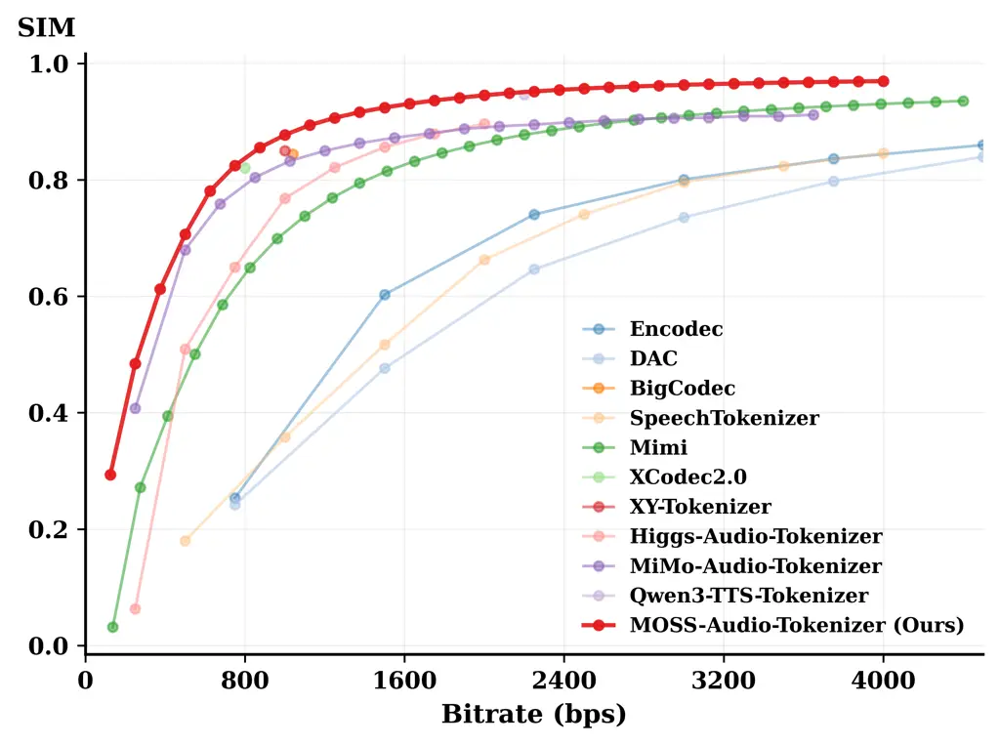
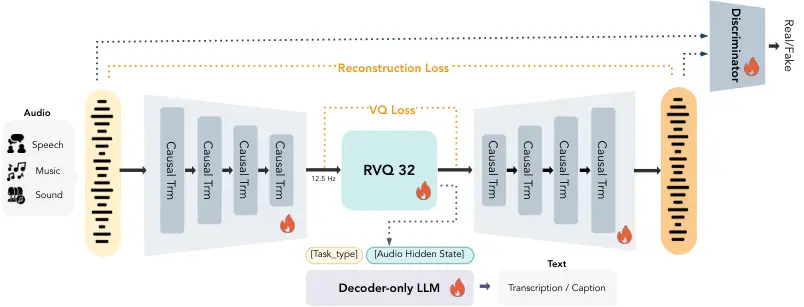
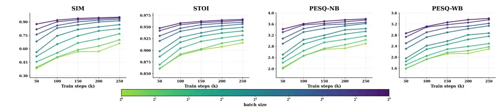
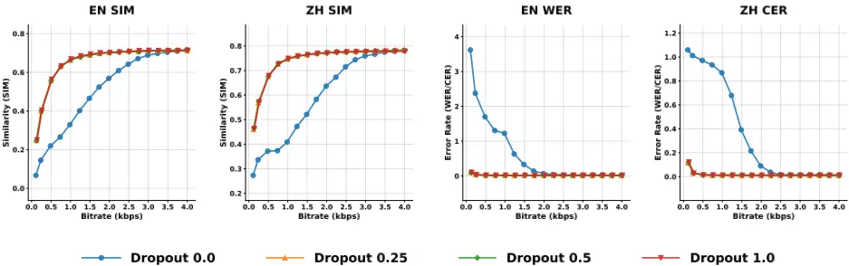
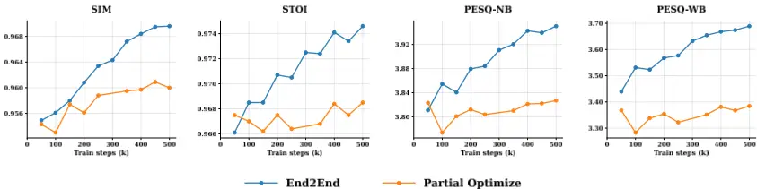
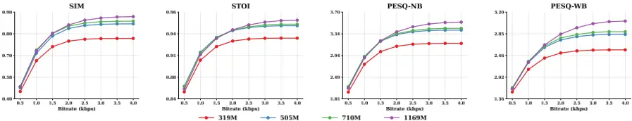
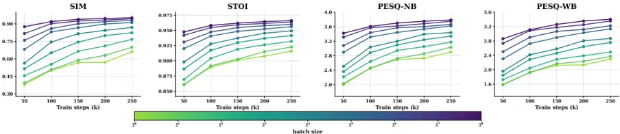
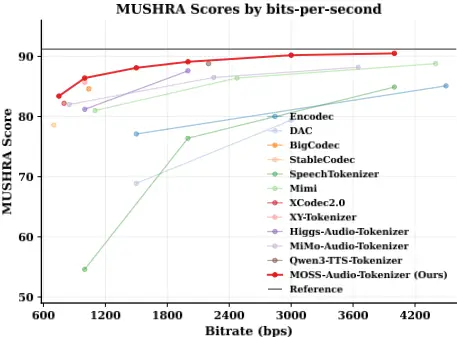
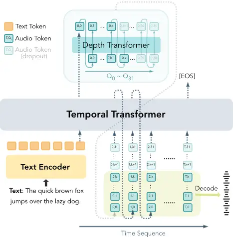

## MOSS-Audio-Tokenizer: Scaling Audio Tokenizers for Future Audio Foundation Models

## MOSI.AI \*

## Abstract

Discrete audio tokenizers are fundamental to empowering large language models with native audio processing and generation capabilities. Despite recent progress, existing approaches often rely on pretrained encoders, semantic distillation, or heterogeneous CNN-based architectures. These designs introduce fixed inductive biases that limit reconstruction fidelity and hinder effective scaling. In this paper, we argue that discrete audio tokenization should be learned fully end-to-end using a homogeneous and scalable architecture. To this end, we first propose CAT (Causal Audio Tokenizer with Transformer), a purely Transformer-based architecture that jointly optimizes the encoder, quantizer, and decoder from scratch for high-fidelity reconstruction. Building on the CAT architecture, we develop MOSS-Audio-Tokenizer, a large-scale audio tokenizer featuring 1.6 billion parameters, pre-trained on 3 million hours of diverse, general audio data. We show that this simple, fully endto-end approach built from homogeneous, causal Transformer blocks scales gracefully and supports high-fidelity reconstruction across diverse audio domains. Across speech, sound, and music, MOSSAudio-Tokenizer consistently outperforms prior codecs over a wide range of bitrates, while exhibiting predictable improvements with increased scale. Notably, leveraging the discrete tokens from our model, we develop the first purely autoregressive TTS model that surpasses prior non-autoregressive and cascaded systems. Furthermore, MOSS-Audio-Tokenizer enables competitive ASR performance without auxiliary encoders. Our findings position the CAT architecture as a unified, scalable interface for the next generation of native audio foundation models.

[Code: https://github.com/OpenMOSS/MOSS-Audio-Tokenizer Model: https://huggingface.co/OpenMOSS-Team/MOSS-Audio-Tokenizer](https://huggingface.co/OpenMOSS-Team/MOSS-Audio-Tokenizer)

## 1 Introduction

Recent advances in large language models [1-8] have demonstrated the effectiveness of autoregressive modeling over discrete token sequences. By providing a unified discrete interface, text tokenizers [9, 10] allow large language models to operate directly on raw text, serving as the foundation upon which compression, understanding, generation, and in-context learning capabilities emerge within a single autoregressive modeling framework. Extending this paradigm to audio requires a unified discrete audio tokenizer that can serve as a native interface for autoregressive modeling [11-14].

∗ Full contributors can be found in the Contributors section.

Figure 1 Audio reconstruction quality comparison.

Table 1 Comparison of representative audio tokenizers with respect to architectural design and functional capabilities. 4 indicates support, 8 indicates not supported, and '-' indicates not specified. Trans. denotes Transformer, and Hybrid denotes a hybrid architecture combining CNN and Transformer. End-to-end optimize indicates whether all modules are jointly optimized under a unified objective.

| Model                 | Frame rate | Encoder Arch. | Decoder Arch. | Stream- ing | Variable Bitrate | Semantic rich | Reconstruction - Speech | Reconstruction - Sound | Reconstruction - Music | Pretrained encoder free | End-to-end optimize |
| --------------------- | ---------- | ------------- | ------------- | ----------- | ---------------- | ------------- | ----------------------- | ---------------------- | ---------------------- | ----------------------- | ------------------- |
| Encodec               | 75         | CNN           | CNN           | 4           | 4                | 8             | 4                       | 4                      | 4                      | 4                       | 4                   |
| DAC                   | 75         | CNN           | CNN           | 8           | 4                | 8             | 4                       | 4                      | 4                      | 4                       | 4                   |
| SpeechTokenizer       | 50         | CNN           | CNN           | 8           | 4                | 4             | 4                       | 8                      | 8                      | 8                       | 8                   |
| Mimi                  | 12.5       | Hybrid        | Hybrid        | 4           | 4                | 4             | 4                       | 4                      | 4                      | 8                       | 8                   |
| BigCodec              | 80         | CNN           | CNN           | 8           | 8                | 8             | 4                       | 8                      | 8                      | 4                       | 4                   |
| StableCodec           | 25         | Hybrid        | Hybrid        | 8           | 4                | 8             | 4                       | 8                      | 8                      | 4                       | 4                   |
| XCodec2.0             | 50         | Hybrid        | Hybrid        | 8           | 8                | 4             | 4                       | 8                      | 8                      | 8                       | 8                   |
| XY-Tokenizer          | 12.5       | Hybrid        | Hybrid        | 8           | 8                | 4             | 4                       | 8                      | 8                      | 8                       | 8                   |
| DualCodec             | 12.5       | Hybrid        | CNN           | 8           | 4                | 4             | 4                       | 8                      | 8                      | 8                       | 8                   |
| Higgs-Audio-Tokenizer | 25         | Hybrid        | CNN           | 8           | -                | 4             | 4                       | 4                      | 4                      | 8                       | 8                   |
| MiMo-Audio-Tokenizer  | 25         | Hybrid        | Hybrid        | 8           | 4                | 4             | 4                       | 4                      | 4                      | 4                       | 8                   |
| Qwen3-TTS-Tokenizer   | 12.5       | Hybrid        | Hybrid        | 4           | -                | 4             | 4                       | -                      | -                      | 8                       | 8                   |
| MOSS-Audio-Tokenizer  | 12.5       | Trans.        | Trans.        | 4           | 4                | 4             | 4                       | 4                      | 4                      | 4                       | 4                   |

Unlike text, audio contains both fine-grained acoustic details and long-range structure, making discrete tokenization more challenging [11]. A unified audio tokenizer should enable high-fidelity reconstruction of diverse audio signals while remaining compatible with autoregressive sequence modeling [14-16]. Existing approaches typically address these requirements through pretrained encoders [17-22], multi-stage training pipelines [14, 23, 24], or architecture-specific inductive biases [25-27], achieving strong performance under particular design choices. However, such designs introduce additional dependencies and architectural constraints that make it difficult to scale models, data, and quantization capacity in a unified manner. From this perspective, we draw inspiration from the success of large language models, where simple and efficient architectures trained on large-scale data have proven critical for achieving strong performance [28, 29]. We posit that enabling an audio tokenizer to reach a higher performance ceiling similarly requires a simple and scalable architecture that can be trained end-to-end on large amounts of data. Such a design emphasizes joint optimization and scale, while minimizing reliance on external priors, pretrained components, or complex architectural heuristics.

In this work, we propose MOSS-Audio-Tokenizer, a fully end-to-end audio tokenizer that serves as a unified discrete interface for autoregressive audio language models. Our tokenizer, build on CAT (Causal Audio Tokenizer with Transformer) architecture, operates at a 24 kHz sampling rate with a low token frame rate of 12.5Hz, and jointly optimizes the encoder, quantizer, decoder, and discriminator within a single training pipeline, without relying on pretrained encoders, distillation, or separate optimization of individual components. Both the encoder and decoder are built entirely from causal Transformer blocks, resulting in a simple and scalable architecture that is naturally aligned with autoregressive modeling [30]. All components of MOSS-Audio-Tokenizer are designed to operate in a streaming manner, enabling low-latency inference and consistent training-inference behavior [15, 25, 26].

By scaling large amounts of paired audio-text data, MOSS-Audio-Tokenizer learns discrete representations that are both structurally rich and acoustically expressive, while remaining robust across a wide range of bitrates. As a result, the tokenizer achieves high-quality reconstruction of general audio, including speech, sound, and music, from very low to high bitrate regimes, providing a strong lower bound and a high upper bound for downstream audio language models.

Across speech, sound, and music, MOSS-Audio-Tokenizer achieves state-of-the-art reconstruction quality at all evaluated bitrates. Leveraging its discrete tokens, we further introduce a purely autoregressive textto-speech model with a Progressive Sequence Dropout training strategy, which naturally exploits the tokenizer's robustness across bitrates and, for the first time, enables a fully autoregressive discrete TTS system [31-34] to outperform prior non-autoregressive [35, 36] and cascaded approaches [37-44]. In addition, MOSS-Audio-Tokenizer supports competitive automatic speech recognition performance without requiring an auxiliary audio encoder, matching or exceeding models that rely on dedicated audio encoders combined with large language models [45-49]. Together, these results demonstrate that CAT architecture provides a scalable and effective foundation for audio compression, understanding, and generation within a unified autoregressive framework.

Our contributions can be summarized as follows:

- Homogeneous and Scalable Architecture: We propose CAT (Causal Audio Tokenizer with Transformer), a purely Transformer-based architecture for discrete audio tokenization. By utilizing a homogeneous stack of causal Transformer blocks, CAT provides a simple and highly scalable discrete interface, minimizing fixed inductive biases and facilitating effective model scaling.
- Large-ScaleGeneralTokenization: Basedon theCATarchitecture,wedevelopMOSS-Audio-Tokenizer, a 1.6-billion-parameter audio tokenizer pre-trained from scratch on 3 million hours of diverse audio. It achieves high-fidelity reconstruction across speech, sound, and music at a low frame rate of 12.5Hz. The model natively supports variable bitrates ranging from 0.125 kbps to 4 kbps and enables low-latency, frame-level streaming encoding and decoding for real-time applications.
- Breakthrough in End-to-End Autoregressive Audio Generation: Leveraging CAT's discrete tokens, we develop the first purely autoregressive (AR) TTS system that outperforms prior non-autoregressive and cascaded models. Furthermore, we propose Progressive Sequence Dropout, a training strategy that enables a single autoregressive model to perform variable-bitrate speech generation by effectively utilizing the tokenizer's hierarchical quantization structure.
- Consistent Scaling Performance: We investigate the scaling behavior of the CAT architecture with respect to model parameters and training computation (via batch size). Our results demonstrate that CAT exhibits consistent performance gains in reconstruction quality as the model capacity and total computational budget increase, establishing it as a unified and robust foundation for future large-scale audio foundation models.

## 2 Rethinking Discrete Audio Tokenization for Future Audio FoundationModels

We rethink discrete audio tokenization from the perspective of autoregressive audio language modeling. Analogous to text tokenizers in large language models, a discrete audio tokenizer should serve as a native interface that bridges raw audio signals and autoregressive sequence modeling [14, 15, 50]. This viewpoint places stringent requirements on the structure, representation capacity, and scalability of the tokenizer, beyond traditional objectives of audio compression or reconstruction.

From this perspective, we identify several key design principles that an audio tokenizer must satisfy in order to effectively support autoregressive audio language models.

UnifiedAudioRepresentation. Atokenizer shouldprovide aunifieddiscrete representation capable ofmodeling and reconstructing diverse audio domains, including speech, sound, and music. Crucially, the resulting tokens should preserve both fine-grained acoustic information and semantic structure, enabling them to function as a meaningful sequence for autoregressive modeling rather than merely a compressed signal.

Simplicity and Scalability. To enable efficient scaling with model capacity, data, and computation, the tokenizer architecture should remain simple and homogeneous. Excessive architectural heterogeneity or reliance on specialized components can introduce fixed bottlenecks that hinder joint scaling and limit the effectiveness of large-scale training.

Figure 2 Architecture of CAT (Causal Audio Tokenizer with Transformer). Both the encoder and decoder are built upon causal Transformers. All components, including the encoder, quantizer, decoder, causal language model, and discriminator, are optimized jointly in an end-to-end manner.

Causality. For compatibilitywith autoregressive generation and low-latency inference, tokenization should be strictly causal, ensuring that each token is computed without access to future audio context. This property aligns the tokenizer with the operational constraints of autoregressive audio language models and avoids discrepancies between training and inference.

Low Frame Rate and Bitrate Robustness. An effective audio tokenizer should operate at a low frame rate to reduce downstream sequence modeling complexity, while remaining robust across a wide range of bitrates. Such flexibility allows a single tokenizer to support diverse downstream tasks, including audio reconstruction, understanding, and generation, without requiring task-specific redesign.

## 3 Causal Audio Tokenizer with Transformer (CAT)

## 3.1 Homogeneous Architecture for Scalable Audio Tokenization

A central design goal of CAT is to enable scalable audio tokenization that can seamlessly integrate with large autoregressive and multimodal foundation models. To this end, we adopt a CNN-free architecture that is built entirely upon causal Transformer blocks, as illustrated in Figure 2. Compared to prior neural audio codecs that rely heavily on convolutional inductive biases or hybrid CNN-Transformer designs, our approach deliberately minimizes architectural specialization, favoring simplicity, uniformity, and scalability.

Fully Transformer-based encoder-decoder. Both the encoder and decoder in CAT are implemented as stacks of causal Transformer blocks, forming a CNN-free architecture and enabling streaming encoding and decoding. CAT operates directly on raw audio waveforms at both the input and output, avoiding intermediate signal representations such as mel-spectrograms. The input waveform is first patchified into a sequence of fixeddimensional vectors and processed by the causal Transformer encoder. To progressively compress long audio sequences into a compact representation, we insert patchify operations between Transformer blocks, which gradually reduce the temporal resolution. As a result, the encoder maps 24kHz waveforms into discrete token sequences at an average rate of 12.5 frames per second. The decoder mirrors this process in reverse, reconstructing the waveform from discrete tokens in a fully causal manner. Further implementation details are provided in Appendix A.

Scalable residual vector quantization. For discretization, we employ residual vector quantization (RVQ). To support robust modeling across a wide range of bitrates, we adopt 𝑁𝑞 = 32 residual quantization layers and enable quantizer dropout during training. This variable-bitrate design directly facilitates the controllable audio generation framework introduced later.

## 3.2 Unified AudioModeling

We use multi-task learning to enable CAT to achieve both strong alignment with text and high-quality audio reconstruction.

SemanticModeling viaAudio-to-Text Tasks. To encourage the token representation to be semantically rich and aligned with text-based language modeling, we incorporate an auxiliary audio-to-text objective. Specifically, we employ a 0.5B-parameter decoder-only LLM [51] and condition it on the representations produced by CAT. Concretely, we feed the hidden states from the quantizer output into the LLM, which then autoregressively predicts textual tokens. We consider a diverse set of audio-to-text tasks, including automatic speech recognition (ASR), multi-speaker ASR, and audio captioning. For audio samples that are paired with textual annotations, we apply the corresponding semantic modeling objective. Each task is specified by a fixed task tag 𝒯 , which is prepended to the LLM input. The semantic objective is optimized using a standard cross-entropy loss:

<!-- formula-not-decoded -->

where s = (s1, . . . , s|s|) denotes the target text token sequence, q denotes the sequence of quantized audio representations produced by CAT, 𝒯 is a task-specific prompt token, and 𝜃LLM are the parameters of the causal language model.

Quantizer Optimization. For training simplicity and stability, each quantization layer in CAT adopts factorized vector quantization [27], where codebooks are directly optimized via gradient descent, without relying on additional codebook update mechanisms [26]. We incorporate a commitment loss and a codebook loss to jointly optimize the encoder and the codebook entries:

<!-- formula-not-decoded -->

<!-- formula-not-decoded -->

where z𝑐 denotes the input to the 𝑐-th quantization layer, 𝑞𝑐(z𝑐) is the corresponding quantized output, 𝑁𝑞 is the number of quantizers, and sg(·) denotes the stop-gradient operator [52].

AcousticModeling via Reconstruction Tasks. To ensure high-fidelity and domain-robust audio reconstruction, we adopt a multi-scale mel-spectrogram loss:

<!-- formula-not-decoded -->

where 𝑆2 𝑖 (·) denotes the mel-spectrogram computed using a normalized short-time Fourier transform (STFT) with window size 2 𝑖 and hop size 2 𝑖-2 . Here, x is the ground-truth waveform and ˆx is the reconstructed waveform generated by the decoder.

Adversarial Training. To further improve reconstruction fidelity and perceptual quality, we employ adversarial training with multiple discriminators. Specifically, we adopt the discriminator architecture and training objectives, including the adversarial loss, feature matching loss and discriminator loss, following XYTokenizer [21].

Overall Training Objective. The overall generator objective is a weighted combination of all loss terms:

<!-- formula-not-decoded -->

where ℒadv and ℒfeat denote the adversarial and feature matching losses defined in XY-Tokenizer [21]. 𝜆sem, 𝜆rec, 𝜆cmt, 𝜆code, 𝜆adv, 𝜆feat are scalar hyperparameters controlling the relative contribution of each loss term.

All components of CAT, including the encoder, quantizer, decoder, and discriminators, are optimized jointly in an end-to-end manner. By scaling large amounts of audio data, CAT learns to achieve both high-fidelity reconstruction of general audio and semantically rich discrete representations, without relying on pretrained encoders or external semantic teachers [17, 18, 20, 50].

## 3.3 Bitrate Controllable Audio Generation

End-to-end variable-bitrate autoregressive speech generation. Building on CAT, we construct CAT-TTS, a fully end-to-end, purely autoregressive speech generation model that supports variable-bitrate synthesis. The model directly generates speech from text tokens and a speaker prompt by predicting CAT's RVQ tokens at a controllable depth, without requiring semantic disentanglement [50, 53, 54] or cascading multiple generative models [39, 40, 44]. By leveraging CAT as a unified discrete interface, both linguistic content and acoustic information are modeled within a single autoregressive framework.

Autoregressive modeling over RVQ tokens. Since CAT represents audio using residual vector quantization (RVQ), we adopt the Temporal Transformer + Depth Transformer architecture [15] for multi-stream autoregressive modeling. The Temporal Transformer captures long-range dependencies along the temporal dimension, while the Depth Transformer models the coarse-to-fine residual structure across RVQ layers within each time step. Under this design, each RVQ token conditions only on tokens from previous time steps and on preceding RVQ layers at the current time step, ensuring strict causality without information leakage.

Progressive Sequence Dropout. To enable robust generation across a wide range of bitrates within a single model, we propose Progressive Sequence Dropout, a simple yet effective training strategy that requires no architectural modifications or additional parameters. During training, dropout is activated with probability 𝑝. When activated, we uniformly sample a prefix length 𝐾 ∈ {1, . . . , 𝑁𝑞 - 1}, where 𝑁𝑞 denotes the total number of RVQ layers, and discard RVQ tokens from layers 𝐾+1 to 𝑁𝑞. Otherwise, all RVQ layers are retained. This strategy exposes the model to truncated RVQ prefixes during training, where a prefix length is randomly sampled independently for each training sample, encouraging the model to learn conditional generation under varying bitrates.

Prefix definition. We introduce a Bernoulli randomvariable

<!-- formula-not-decoded -->

where 𝑧 = 1 indicates that Progressive Sequence Dropout is applied and 𝑧 = 0 otherwise. When 𝑧 = 1, the prefix length 𝐾 is sampled uniformly as described above; when 𝑧 = 0, we set 𝐾 = 𝑁𝑞 . The effective number of active RVQ layers is then defined as

<!-- formula-not-decoded -->

Global input aggregation and training objective. Let q𝑡,𝑘 denote the RVQ token at time step 𝑡 and layer 𝑘, and let Emb𝑘(·) denote the embedding lookup table for the 𝑘-th RVQ codebook. For each time step 𝑡, the speech input to the Temporal Transformer is constructed by aggregating the embeddings of the first ˆ 𝐾 RVQ layers:

<!-- formula-not-decoded -->

The Temporal Transformer processes the resulting acoustic embedding sequence {˜e𝑡} 𝑇 𝑡=1 using a causal attention mask along the temporal dimension.

The Depth Transformer predicts RVQ tokens autoregressively along the depth dimension. The training loss is computed only over the retained RVQ prefix:

<!-- formula-not-decoded -->

where 𝜃 denotes the model parameters, x represents the input text token sequence, q&lt;𝑡 denotes all RVQ tokens from previous time steps, and q𝑡 ,&lt;𝑘 denotes RVQ tokens from preceding layers at the same time step.

Inference. At inference time, we explicitly control the synthesis bitrate by selecting an inference depth 𝐾infer. The Temporal Transformer takes as input the text tokens together with the first 𝐾infer RVQ token streams at each time step. The Depth Transformer then autoregressively predicts only these 𝐾infer RVQ layers, while finer layers are omitted. Finally, the predicted RVQ tokens from the first 𝐾infer layers are decoded into waveforms using the CAT decoder. As CAT is trained with quantizer dropout, the decoder is inherently robust to varying effective bitrates, which aligns naturally with Progressive Sequence Dropout in the speech generation model.

Special case. When 𝑝 = 0, Progressive Sequence Dropout is disabled, yielding 𝑧 = 0 for all training samples and ˆ 𝐾 = 𝑁𝑞. In this case, the proposed method reduces exactly to the standard Temporal Transformer + Depth Transformer formulation for multi-stream autoregressive speech generation.

## 4 Experiments

## 4.1 ImplementationDetails

Building upon the CAT architecture, we develop MOSS-Audio-Tokenizer, a large-scale audio tokenizer featuring 1.6 billion parameters. The model utilizes a causal Transformer-based encoder-decoder paired with hierarchical patching, which facilitates efficient streaming audio modeling. Discrete representations are learned using a 32-layer residual vector quantizer with quantizer dropout to support variable-bitrate tokenization. To encourage semantic alignment, we attach a decoder-only causal language model for audioto-text supervision. Training is performed on approximately 3M hours of diverse speech, sound, and music data, using a combination of reconstruction, semantic, and adversarial objectives. All components of MOSS-Audio-Tokenizer, including the encoder, quantizer, decoder, discriminator, decoder-only LLM are optimized jointly in an end-to-end manner. All architectural details, optimization hyperparameters, and training schedules are provided in Appendix A.

## 4.2 Reconstruction Evaluation

We compare MOSS-Audio-Tokenizer with open-source audio tokenizers using both objective and subjective evaluation metrics across low (750-1500 bps), medium (1500-2500 bps), and high (2500-6000 bps) bitrate regimes. Table 2 summarizes the objective reconstruction results on speech, general audio, and music benchmarks.

Across all evaluated bitrate regimes, MOSS-Audio-Tokenizer achieves strong performance on speech reconstruction, outperforming prior methods at low bitrates and achieving state-of-the-art results at medium and high bitrates. On audio and music benchmarks, MOSS-Audio-Tokenizer maintains competitive performance across all evaluated bitrates, with reconstruction quality improving as bitrate increases, indicating that the model effectively benefits from increased bitrate and model capacity through joint end-to-end optimization.

Additional details on the compared open-source audio tokenizers, as well as subjective evaluation results are provided in Appendix B.

Table 2 Reconstruction quality comparison of open-source audio tokenizers on speech and audio/music data. Speech metrics are evaluated on LibriSpeech test-clean (English) and AISHELL-2 (Chinese) and reported as English/Chinese. Audio metrics are evaluated on the AudioSet evaluation subset, while music metrics are evaluated on the MUSDB dataset; values are reported as audio/music. STFT-Dist. denotes the STFT distance. Higher is better for speech metrics, whereas lower is better for audio/music metrics. NVQ denotes the number of quantizers.

|                       |      |            |     |             |             |             |             |               |               |
| --------------------- | ---- | ---------- | --- | ----------- | ----------- | ----------- | ----------- | ------------- | ------------- |
| Model                 | bps  | Frame rate | NVQ |             |             | Speech      |             | Audio / Music | Audio / Music |
|                       |      |            |     | SIM ↑       | STOI ↑      | PESQ-NB↑    | PESQ-WB↑    | Mel-Loss↓     | STFT-Dist. ↓  |
| StableCodec           | 700  | 25         | 2   | 0.62 / 0.45 | 0.91 / 0.86 | 2.91 / 2.50 | 2.24 / 1.93 | - / -         | - / -         |
| XCodec2.0             | 800  | 50         | 1   | 0.82 / 0.74 | 0.92 / 0.86 | 3.04 / 2.46 | 2.43 / 1.96 | - / -         | - / -         |
| MiMo-Audio-Tokenizer  | 850  | 25         | 4   | 0.80 / 0.74 | 0.91 / 0.87 | 2.94 / 2.62 | 2.39 / 2.14 | 0.82 / 0.81   | 2.33 / 2.23   |
| Higgs-Audio-Tokenizer | 1000 | 25         | 4   | 0.77 / 0.68 | 0.83 / 0.82 | 3.03 / 2.61 | 2.48 / 2.14 | 0.83 / 0.80   | 2.20 / 2.05   |
| SpeechTokenizer       | 1000 | 50         | 2   | 0.36 / 0.25 | 0.77 / 0.68 | 1.59 / 1.38 | 1.25 / 1.17 | - / -         | - / -         |
| XY-Tokenizer          | 1000 | 12.5       | 8   | 0.85 / 0.79 | 0.92 / 0.87 | 3.10 / 2.63 | 2.50 / 2.12 | - / -         | - / -         |
| BigCodec              | 1040 | 80         | 1   | 0.84 / 0.69 | 0.93 / 0.88 | 3.27 / 2.55 | 2.68 / 2.06 | - / -         | - / -         |
| Mimi                  | 1100 | 12.5       | 8   | 0.74 / 0.59 | 0.91 / 0.85 | 2.80 / 2.24 | 2.25 / 1.78 | 1.24 / 1.19   | 2.62 / 2.49   |
| MOSS-Audio-Tokenizer  | 750  | 12.5       | 6   | 0.82 / 0.75 | 0.93 / 0.89 | 3.14 / 2.73 | 2.60 / 2.22 | 0.86 / 0.85   | 2.21 / 2.10   |
| MOSS-Audio-Tokenizer  | 1000 | 12.5       | 8   | 0.88 / 0.81 | 0.94 / 0.91 | 3.38 / 2.96 | 2.87 / 2.43 | 0.82 / 0.80   | 2.16 / 2.04   |
| DAC                   | 1500 | 75         | 2   | 0.48 / 0.41 | 0.83 / 0.79 | 1.87 / 1.67 | 1.48 / 1.37 | - / -         | - / -         |
| Encodec               | 1500 | 75         | 2   | 0.60 / 0.45 | 0.85 / 0.81 | 1.94 / 1.80 | 1.56 / 1.48 | 1.12 / 1.04   | 2.60 / 2.42   |
| Higgs-Audio-Tokenizer | 2000 | 25         | 8   | 0.90 / 0.83 | 0.85 / 0.85 | 3.59 / 3.22 | 3.11 / 2.73 | 0.74 / 0.70   | 2.07 / 1.92   |
| SpeechTokenizer       | 2000 | 50         | 4   | 0.66 / 0.50 | 0.88 / 0.80 | 2.38 / 1.79 | 1.92 / 1.49 | - / -         | - / -         |
| Qwen3-TTS-Tokenizer   | 2200 | 12.5       | 16  | 0.95 / 0.88 | 0.96 / 0.93 | 3.66 / 3.10 | 3.19 / 2.62 | - / -         | - / -         |
| MiMo-Audio-Tokenizer  | 2250 | 25         | 12  | 0.89 / 0.83 | 0.95 / 0.92 | 3.57 / 3.25 | 3.05 / 2.71 | 0.70 / 0.68   | 2.21 / 2.10   |
| Mimi                  | 2475 | 12.5       | 18  | 0.89 / 0.76 | 0.94 / 0.91 | 3.49 / 2.90 | 2.97 / 2.35 | 1.10 / 1.06   | 2.45 / 2.32   |
| MOSS-Audio-Tokenizer  | 1500 | 12.5       | 12  | 0.92 / 0.86 | 0.95 / 0.93 | 3.64 / 3.27 | 3.20 / 2.74 | 0.77 / 0.74   | 2.08 / 1.96   |
| MOSS-Audio-Tokenizer  | 2000 | 12.5       | 16  | 0.95 / 0.89 | 0.96 / 0.94 | 3.78 / 3.46 | 3.41 / 2.96 | 0.73 / 0.70   | 2.03 / 1.90   |
| DAC                   | 3000 | 75         | 4   | 0.74 / 0.67 | 0.90 / 0.88 | 2.76 / 2.47 | 2.31 / 2.07 | 0.86 / 0.83   | 2.23 / 2.10   |
| MiMo-Audio-Tokenizer  | 3650 | 25         | 20  | 0.91 / 0.85 | 0.95 / 0.93 | 3.73 / 3.44 | 3.25 / 2.89 | 0.66 / 0.65   | 2.17 / 2.06   |
| SpeechTokenizer       | 4000 | 50         | 8   | 0.85 / 0.69 | 0.92 / 0.85 | 3.05 / 2.20 | 2.60 / 1.87 | - / -         | - / -         |
| Mimi                  | 4400 | 12.5       | 32  | 0.94 / 0.83 | 0.96 / 0.94 | 3.80 / 3.31 | 3.43 / 2.78 | 1.02 / 0.98   | 2.34 / 2.21   |
| Encodec               | 4500 | 75         | 6   | 0.86 / 0.75 | 0.92 / 0.91 | 2.91 / 2.63 | 2.46 / 2.15 | 0.91 / 0.84   | 2.33 / 2.17   |
| DAC                   | 6000 | 75         | 8   | 0.89 / 0.84 | 0.95 / 0.94 | 3.75 / 3.57 | 3.41 / 3.20 | 0.65 / 0.63   | 1.97 / 1.87   |
| MOSS-Audio-Tokenizer  | 3000 | 12.5       | 24  | 0.96 / 0.92 | 0.97 / 0.96 | 3.90 / 3.64 | 3.61 / 3.20 | 0.69 / 0.66   | 1.98 / 1.84   |
| MOSS-Audio-Tokenizer  | 4000 | 12.5       | 32  | 0.97 / 0.93 | 0.97 / 0.96 | 3.95 / 3.71 | 3.69 / 3.30 | 0.68 / 0.64   | 1.96 / 1.82   |

## 4.3 SpeechGeneration

Experimental Settings. We initialize the Temporal Transformer with the pretrained Qwen3-1.7B model [7]. The Depth Transformer consists of four Transformer blocks and is randomly initialized. We train the model on a mixture of VoxBox, as introduced in SparkAudio [33], and an internal dataset, totaling approximately 200k hours of speech data. Evaluation is conducted on the Seed-TTS-Eval benchmark [39]. Training details are provided in Appendix C.

Effectiveness of Progressive Sequence Dropout. We investigate the effect of Progressive Sequence Dropout by varying the dropout probability 𝑝 ∈ {0.0, 0.25, 0.5, 1.0}, with results summarized in Figure 3. At full bitrate, all models achieve comparable performance, exhibiting low word error rate and high speaker similarity. However, as the bitrate decreases, the model trained without dropout exhibits a much steeper degradation in similarity and word error rate. This stems from the mismatch between training and inference, as the model is trained exclusively with full RVQ depth but evaluated using truncated representations.

In contrast, models trained with Progressive Sequence Dropout are substantially more robust under reduced bitrate settings. Across different dropout probabilities (𝑝 = 0.25, 0.5, and 1.0), TTS performance remains highly consistent at each bitrate, indicating the exact dropout probability has limited impact on generation quality. Meanwhile, increasing 𝑝 significantly reduces GPUmemory consumption during training. Therefore, we adopt 𝑝 = 1.0 in all subsequent experiments to maximize training efficiency while maintaining comparable synthesis quality.

Figure 3 Effect of Progressive Sequence Dropout on fully autoregressive TTS across different bitrates.

ComparisonwithOpen-Source TTS Systems. We evaluate the performance of our CAT-based fully autoregressive (AR) TTS system against a comprehensive suite of open-source models. These baselines encompass three major paradigms: (i) cascaded systems (e.g., AR+NAR), (ii) purely non-autoregressive systems, and (iii) prior purely autoregressive systems based on discrete or continuous representations. Detailed descriptions and categorizations of these baseline systems are provided in Appendix D.

As shown in Table 3, CAT-TTS significantly outperforms previous discrete fully autoregressive models, particularly in speaker similarity (SIM). Moreover, our method achieves competitive performance compared to recent state-of-the-art systems such as IndexTTS2, MaskGCT, and VoxCPM, with all systems maintaining very low word error rates (WER), typically below 2%.

Notably, CAT-TTS achieves the highest speaker similarity scores on Seed-TTS-Eval for both English and Chinese among the compared open-source models. This demonstrates that scaling CAT, as a unified discrete interface, effectively captures fine-grained acoustic characteristics required for high-quality, zero-shot speech generation.

## 4.4 Speech Understanding

In addition to speech generation, we further evaluate the speech understanding capability of CAT by applying it to downstream LLM-based ASR and comparing against representative open-source state-of-the-art speech understanding models; detailed results are provided in Appendix E.

## 5 Analysis Of Scalling Behavior

## 5.1 End-to-EndOptimizationMakes CAT a Scalable Audio Tokenizer

A key goal of CAT is scalability-the ability to continuously improve reconstruction quality with increased training budget. Although CAT consists of multiple adversarial components, its optimization strategy is critical for enabling such scalability. We compare full end-to-end optimization with the partial protocol used in prior works [14, 16, 21, 23], where the encoder and quantizer are frozen while the decoder and discriminator are optimized. As shown in Figure 4, end-to-end training yields sustained improvements across all metrics without early saturation. In contrast, partial optimization plateaus early, as freezing components restricts the model's ability to refine representations. These results demonstrate that end-to-end optimization is crucial for scaling CAT effectively with increased computation and capacity.

Table 3 Comparison with open-source TTS systems on Seed-TTS-Eval. Bitrate control indicates whether a TTS system allows explicit specification of the synthesis bitrate at inference time. For FlexiCodec-TTS, bitrate is controlled by switching the frame rate of the autoregressive model. For CAT-TTS, bitrate is controlled by specifying the number of RVQ tokens generated by the Depth Transformer.

| TTS Systems                | Bitrate - Control.         | Seed-EN - WER↓             | Seed-EN - SIM↑             | Seed-ZH - CER↓             | Seed-ZH - SIM↑             |
| -------------------------- | -------------------------- | -------------------------- | -------------------------- | -------------------------- | -------------------------- |
| Cascade (AR+NAR / NAR+NAR) | Cascade (AR+NAR / NAR+NAR) | Cascade (AR+NAR / NAR+NAR) | Cascade (AR+NAR / NAR+NAR) | Cascade (AR+NAR / NAR+NAR) | Cascade (AR+NAR / NAR+NAR) |
| MaskGCT                    | 8                          | 2.62                       | 71.7                       | 2.27                       | 77.4                       |
| FireRedTTS                 | 8                          | 3.84                       | 46.0                       | 1.51                       | 63.5                       |
| CosyVoice2                 | 8                          | 3.09                       | 65.9                       | 1.38                       | 75.7                       |
| Qwen2.5-Omni               | 8                          | 2.72                       | 63.2                       | 1.70                       | 75.2                       |
| CosyVoice3-1.5B            | 8                          | 2.22                       | 72.0                       | 1.12                       | 78.1                       |
| IndexTTS2                  | 8                          | 2.23                       | 70.6                       | 1.03                       | 76.5                       |
| FlexiCodec-TTS             | 4                          | 2.63                       | 65.7                       | -                          | -                          |
| GLM-TTS                    | 8                          | 1.91                       | 68.1                       | 0.89                       | 76.4                       |
| NAR / Continuous AR        | NAR / Continuous AR        | NAR / Continuous AR        | NAR / Continuous AR        | NAR / Continuous AR        | NAR / Continuous AR        |
| F5-TTS                     | 8                          | 2.00                       | 67.0                       | 1.53                       | 76.0                       |
| VibeVoice                  | 8                          | 3.04                       | 68.9                       | 1.16                       | 74.4                       |
| VoxCPM                     | 8                          | 1.85                       | 72.9                       | 0.93                       | 77.2                       |
| Discrete AR                | Discrete AR                | Discrete AR                | Discrete AR                | Discrete AR                | Discrete AR                |
| Llasa                      | 8                          | 2.97                       | 57.4                       | 1.59                       | 68.4                       |
| SparkTTS                   | 8                          | 1.98                       | 58.4                       | 1.20                       | 67.2                       |
| OpenAudio-s1-mini          | 8                          | 1.94                       | 55.0                       | 1.18                       | 68.5                       |
| HiggsAudio-v2              | 8                          | 2.44                       | 67.7                       | 1.50                       | 74.0                       |
| FireRedTTS2                | 8                          | 1.95                       | 66.5                       | 1.14                       | 73.6                       |
| CAT-TTS (Ours)             | 4                          | 1.89                       | 73.1                       | 1.23                       | 78.5                       |

Figure 4 Comparison between full end-to-end optimization and partial (stage-wise) optimization for CAT.

## 5.2 Co-Scaling of Model Parameters andQuantization Capicity

We examine how CAT scales with model size. Following Section 3, we jointly optimize all components while varying the hidden dimension (256, 384, 512, 768)-totaling 319M, 505M, 710M, and 1169M combined encoder-decoder parameters, respectively. Throughout, the quantizer is held constant at 32 layers and 12.5 Hz.

Figure 5 shows that increasing the parameter count improves reconstruction quality across 0.5-4 kbps. While the 1169Mmodel benefits most from high bitrates, smaller versions saturate early. Notably, at low bitrates, the 1169Mmodel can underperform smaller models operating at higher bitrates, indicating that bitraterather than parameter count-becomes the primary bottleneck. These findings reveal that parameter scaling and quantization depth are fundamentally co-dependent. Neither can be scaled effectively in isolation, as system performance is governed by the narrowest bottleneck. Optimal scaling thus requires a synchronized expansion of both model parameters and quantization capacity within an end-to-end framework.

Figure 5 Scaling behavior of CAT reconstruction performance with respect to bitrate and model parameters.

Figure 6 Scaling behavior of CAT reconstruction performance with respect to training batch size. The color gradient represents the batch size scale from 2 0 to 2 8 . Larger batch sizes consistently yield superior reconstruction fidelity across all metrics.

## 5.3 Reconstruction Fidelity Benefits Consistently from Increased Training Scale

Beyond model parameters and bitrate, a key indicator of a tokenizer's scalability is its capacity to effectively translate increased training computation into higher fidelity. We investigate this by varying the global training batch size from a baseline factor of 2 0 up to 2 8 , while keeping the total number of training steps and other hyperparameters constant.

As illustrated in Figure 6, CAT exhibits a clear and positive correlation between training scale and reconstruction quality across all evaluated speech metrics (SIM, STOI, and PESQ). At any given point in the training process, increasing the batch size yields strictly better performance. Notably, the performance curves for larger batch sizes maintain a strong upward trajectory even at 250k steps, achieving substantially higher quality within the same step budget compared to smaller scales.

These results suggest that CAT exhibits stable and predictable scaling behavior with respect to training batch size. Increasing data throughput leads to systematically higher-fidelity representations, highlighting the model's suitability for large-scale audio tokenizer training where computational resources can be traded directly for reconstruction quality.

## 6 RelatedWorks

## 6.1 Discrete Audio Tokenizers

Discrete audio tokenizers aim to encode continuous audio waveforms into sequences of discrete tokens and reconstruct audio signals from these tokens. Most existing methods adopt an RVQGAN-style framework, which employs an encoder-quantizer-decoder architecture combined with adversarial training to achieve high-fidelity audio reconstruction [15, 25-27].

SoundStream [25] introduces quantizer dropout, enabling a single tokenizer to support variable bitrate reconstruction. Encodec [26] further improves reconstruction quality by incorporating a multi-scale STFT (MS-STFT) discriminator to capture audio structures at different temporal resolutions. DAC [27] simplifies the training process via factorized vector codes and employs complex STFT discriminators at multiple time scales to enhance phase modeling. Other acoustic codecs, including BigCodec [55], Stable-Codec [56] and TS3-Codec [57], focus on improving reconstruction quality under extremely low bitrates.

Beyond reconstruction fidelity, recent studies have explored injecting semantic information into audio tokenizers to better support downstream generative and understanding tasks. A common approach is knowledge distillation from pretrained teacher models [17, 18, 58]. SpeechTokenizer [50], Mimi [15], and Qwen3 TTS Tokenizer [59] align the encoder and quantizer representations with self-supervised speech models through distillation objectives. In contrast, XCodec2.0 [20], Higgs Audio Tokenizer [60], Dual Codec [22], and SAC [61] directly initialize the tokenizer encoder using pretrained SSL or ASR models, thereby reducing the difficulty of semantic modeling.

A scale-driven approach introduces semantic information into audio tokenizers through large-scale audiotext supervision. Methods such as Baichuan Audio Tokenizer [16], XY-Tokenizer [21], and MiMo Audio Tokenizer [14] leverage audio-to-text tasks and massive paired datasets, enabling the tokenizer to implicitly learn rich semantic representations while maintaining high-fidelity reconstruction.

Despite these advances, it remains unclear what characteristics make an audio tokenizer truly suitable for native audio language models. We argue that such a tokenizer should minimize handcrafted priors and architectural constraints, and instead adopt a simple and scalable design. Our goal is to obtain an audio tokenizer that is well aligned with the modeling needs of audio language models by scaling up both computation and data and training the tokenizer in an end-to-end manner.

## 6.2 Audio Generation

Audio generation models have witnessed rapid progress in recent years [11, 62-64], largely driven by the combination of discrete audio representations [18, 26, 65] and large-scale language modeling [3, 28]. A dominant paradigm is to perform generation in a compressed acoustic space, where audio is represented by sequences of discrete tokens produced by neural audio codecs [15, 26], and generation is formulated as a language modeling problem.

AudioLM [11] proposes a hierarchical generation strategy that decomposes audio generation into three stages: semantic modeling, coarse acoustic modeling, and fine acoustic modeling. By combining representations from self-supervised speech models [18] with neural codec tokens, AudioLM achieves high-quality audio generation with strong long-term consistency. VALL-E [38] introduces a hybrid autoregressive (AR) [66] and non-autoregressive (NAR) [67] architecture for speech synthesis, and demonstrates that scaling training data to tens of thousands of hours leads to the emergence of in-context learning capabilities for speech generation. Tortoise-TTS [37] further explores expressive text-to-speech by combining autoregressive sequence modeling with diffusion-based [68] refinement, enabling multi-voice and highly expressive synthesis.

Along this line, an important trend is the move toward end-to-end audio generation [12, 31, 63, 69, 70], where a single generative model directly produces audio tokens, rather than cascading multiple generative models (e.g., BERT-style or GPT-style language models, or diffusion-based generative models) in a multi-stage pipeline. This simplification substantially reduces system complexity and error propagation across stages, while also improving training stability and inference efficiency.

In the context of discrete token-based generation, MusicGen [12] systematically studies different multi-sequence modeling patterns and finds that the delay pattern enables a single autoregressive model to perform both text- and melody-conditioned music generation. More recent systems such as Moshi [15] adopts a combination of temporal transformers and depth transformers to efficiently model long audio sequences, and further leverage streaming audio tokenizers to significantly reduce inference latency, enabling faster and more responsive audio generation.

Beyond discrete tokenization, there is also a growing body of work on audio generation based on continuous representations. These approaches augment auto-regressive large language models with local diffusion transformers (LocDiT) [70-73], enabling the auto-regressive model to directly generate continuous latent representations and capture fine-grained acoustic details without explicit discretization.

Overall, modern audio generation research is converging toward scalable, end-to-end architectures that tightly couple representation learning and generation. This trend highlights the increasing importance of well-designed audio tokenizers that are not only faithful in reconstruction quality, but also compatible with the architectural choices and scaling properties of audio language models [14, 15, 50, 74].

## 6.3 End-to-End Audio LanguageModels

End-to-end audio language models [14-16, 75-78] aim to unify speech understanding, generation, and reasoning within a single large-scale model, moving beyond conventional three-stage pipelines that decompose speech processing into ASR, text-based language modeling, and TTS. By directly modeling audio representations using language modeling objectives, these systems aim to equip large language models with native audio understanding and generation capabilities.

Early efforts in this direction include SpeechGPT [75], which is among the first large-scale models to support end-to-end speech interaction. SpeechGPT leverages discrete speech representations derived from selfsupervised speech encoders [17] and scales training on large amounts of cross-modal data, enabling large language models to acquire intrinsic conversational abilities across speech and text modalities. Subsequent works such as Spirit-LM [76], GLM4-Voice [77], and MOSS-Speech [78] further improve speech-text alignment by scaling up speech-text interleaved data, demonstrating that tightly coupled multimodal pretraining is critical for robust end-to-end speech understanding and generation.

More recent systems push this paradigm to significantly larger scales. Models such as Kimi-Audio [79] and Qwen3-Omni [49] expand training data to hundreds of thousands or even millions of hours of audio, leading to substantially improved robustness in complex and diverse audio scenarios. These results suggest that endto-end audio language models benefit strongly from data scaling, similar to trends observed in text-only large language models [3, 28, 29].

An emerging line of work explores end-to-end audio language modeling based on information-preserving or near-lossless audio representations [15, 26]. Moshi [15] employs a multi-stream speech-to-speech Transformer together with a streaming audio tokenizer to enable full-duplex spoken dialogue, achieving lowlatency, highly responsive, and human-like interactions. MiMo-Audio [14] further demonstrates that scaling training data to the order of 100 million hours allows end-to-end audio language models to exhibit emergent few-shot in-context learning capabilities in audio, highlighting the strong interaction between tokenizer design, data scale, and model capacity.

Overall, these studies highlight the central role of audio tokenizers in end-to-end audio language models. Similar to text tokenizers for LLMs, an audio tokenizer is expected to provide a native discrete interface that scales effectively with autoregressive modeling. Accordingly, our goal is to develop a unified, fully end-toend trained audio tokenizer built from homogeneous causal Transformers, supporting predictable scaling with data and model capacity while minimizing handcrafted constraints.

## 7 Conclusion

In this paper, we introduced CAT (Causal Audio Tokenizer with Transformer), a fully end-to-end Transformerbased architecture that serves as a unified discrete interface for autoregressive audio language modeling.

Leveraging the CAT architecture, we developed MOSS-Audio-Tokenizer, a 1.6-billion-parameter audio tokenizer pre-trained from scratch on 3 million hours of diverse audio data, effectively acquiring general audio representations across various domains. Through the joint end-to-end optimization of all components -including the encoder, quantizer, decoder, discriminators, and a decoder-only LLM for semantic alignment-within a purely causal framework, MOSS-Audio-Tokenizer achieves state-of-the-art reconstruction performance among open-source audio tokenizers. Furthermore, its discrete representations demonstrate exceptional performance in both downstream speech generation and speech understanding. Our findings position the CAT architecture as a unified, scalable interface for the next generation of native audio foundation models.

## Contributors

## Contributors

Yitian Gong ∗ , Kuangwei Chen, Zhaoye Fei, Xiaogui Yang, Ke Chen, Yang Wang, Kexin Huang, Mingshu Chen, Ruixiao Li, Qinyuan Cheng, Shimin Li

## Advisors

Xipeng Qiu †

## Affiliations:

MOSI Intelligence Shanghai Innovation Institute Fudan University

∗ ytgong24@m.fudan.edu.cn † Corresponding author: xpqiu@fudan.edu.cn

## References

- [1] Tom Brown, Benjamin Mann, Nick Ryder, Melanie Subbiah, Jared D Kaplan, Prafulla Dhariwal, Arvind Neelakantan, Pranav Shyam, Girish Sastry, Amanda Askell, et al. Language models are few-shot learners. Advances in neural information processing systems, 33:1877-1901, 2020.
- [2] Hugo Touvron, Thibaut Lavril, Gautier Izacard, Xavier Martinet, Marie-Anne Lachaux, Timothée Lacroix, Baptiste Rozière, Naman Goyal, Eric Hambro, Faisal Azhar, et al. Llama: Open and efficient foundation language models. arXiv preprint arXiv:2302.13971, 2023.
- [3] JoshAchiam, StevenAdler, SandhiniAgarwal, LamaAhmad, IlgeAkkaya, FlorenciaLeoniAleman, DiogoAlmeida, Janko Altenschmidt, SamAltman, Shyamal Anadkat, et al. Gpt-4 technical report. arXiv preprint arXiv:2303.08774, 2023.
- [4] Aaron Hurst, Adam Lerer, Adam P Goucher, Adam Perelman, Aditya Ramesh, Aidan Clark, AJ Ostrow, Akila Welihinda, Alan Hayes, Alec Radford, et al. Gpt-4o system card. arXiv preprint arXiv:2410.21276, 2024.
- [5] Abhimanyu Dubey, Abhinav Jauhri, Abhinav Pandey, Abhishek Kadian, Ahmad Al-Dahle, Aiesha Letman, Akhil Mathur, Alan Schelten, Amy Yang, Angela Fan, et al. The llama 3 herd of models. arXiv preprint arXiv:2407.21783, 2024.
- [6] An Yang, Baosong Yang, Beichen Zhang, Binyuan Hui, Bo Zheng, Bowen Yu, Chengyuan Li, Dayiheng Liu, Fei Huang, HaoranWei, et al. Qwen2. 5 technical report. arXiv preprint arXiv:2412.15115, 2024.
- [7] An Yang, Anfeng Li, Baosong Yang, Beichen Zhang, Binyuan Hui, Bo Zheng, Bowen Yu, Chang Gao, Chengen Huang, Chenxu Lv, et al. Qwen3 technical report. arXiv preprint arXiv:2505.09388, 2025.
- [8] Daya Guo, Dejian Yang, Haowei Zhang, Junxiao Song, Ruoyu Zhang, Runxin Xu, Qihao Zhu, Shirong Ma, Peiyi Wang, Xiao Bi, et al. Deepseek-r1: Incentivizing reasoning capability in llms via reinforcement learning. arXiv preprint arXiv:2501.12948, 2025.
- [9] Rico Sennrich, Barry Haddow, and Alexandra Birch. Neural machine translation of rare words with subword units. In Proceedings of the 54th annual meeting of the association for computational linguistics (volume 1: long papers), pages 1715-1725, 2016.
- [10] Taku Kudo and John Richardson. Sentencepiece: A simple and language independent subword tokenizer and detokenizer for neural text processing. arXiv preprint arXiv:1808.06226, 2018.
- [11] Zalán Borsos, Raphaël Marinier, Damien Vincent, Eugene Kharitonov, Olivier Pietquin, Matt Sharifi, Dominik Roblek, Olivier Teboul, David Grangier, Marco Tagliasacchi, et al. Audiolm: a language modeling approach to audio generation. IEEE/ACM transactions on audio, speech, and language processing, 31:2523-2533, 2023.
- [12] Andrea Agostinelli, Timo I Denk, Zalán Borsos, Jesse Engel, Mauro Verzetti, Antoine Caillon, Qingqing Huang, Aren Jansen, Adam Roberts, Marco Tagliasacchi, et al. Musiclm: Generating music from text. arXiv preprint arXiv:2301.11325, 2023.
- [13] Dongchao Yang, Haohan Guo, Yuanyuan Wang, Rongjie Huang, Xiang Li, Xu Tan, Xixin Wu, and Helen Meng. Uniaudio 1.5: Large language model-driven audio codec is a few-shot audio task learner. Advances in Neural Information Processing Systems, 37:56802-56827, 2024.
- [14] Dong Zhang, Gang Wang, Jinlong Xue, Kai Fang, Liang Zhao, Rui Ma, Shuhuai Ren, Shuo Liu, Tao Guo, Weiji Zhuang, et al. Mimo-audio: Audio language models are few-shot learners. arXiv preprint arXiv:2512.23808, 2025.
- [15] Alexandre Défossez, Laurent Mazaré, Manu Orsini, Amélie Royer, Patrick Pérez, Hervé Jégou, Edouard Grave, and Neil Zeghidour. Moshi: a speech-text foundation model for real-time dialogue. arXiv preprint arXiv:2410.00037, 2024.
- [16] Tianpeng Li, Jun Liu, Tao Zhang, Yuanbo Fang, Da Pan, Mingrui Wang, Zheng Liang, Zehuan Li, Mingan Lin, Guosheng Dong, et al. Baichuan-audio: A unified framework for end-to-end speech interaction. arXiv preprint arXiv:2502.17239, 2025.

- [17] Wei-Ning Hsu, Benjamin Bolte, Yao-Hung Hubert Tsai, Kushal Lakhotia, Ruslan Salakhutdinov, and Abdelrahman Mohamed. Hubert: Self-supervised speech representation learning by masked prediction of hidden units. IEEE/ACM transactions on audio, speech, and language processing, 29:3451-3460, 2021.
- [18] Yu-An Chung, Yu Zhang, Wei Han, Chung-Cheng Chiu, James Qin, Ruoming Pang, and Yonghui Wu. W2v-bert: Combining contrastive learning and masked language modeling for self-supervised speech pre-training. In 2021 IEEE Automatic Speech Recognition and Understanding Workshop (ASRU), pages 244-250. IEEE, 2021.
- [19] Alec Radford, Jong Wook Kim, Tao Xu, Greg Brockman, Christine McLeavey, and Ilya Sutskever. Robust speech recognition via large-scale weak supervision. In International conference on machine learning, pages 28492-28518. PMLR, 2023.
- [20] Zhen Ye, Peiwen Sun, Jiahe Lei, Hongzhan Lin, Xu Tan, Zheqi Dai, Qiuqiang Kong, Jianyi Chen, Jiahao Pan, Qifeng Liu, et al. Codec does matter: Exploring the semantic shortcoming of codec for audio language model. In Proceedings of the AAAI Conference on Artificial Intelligence, volume 39, pages 25697-25705, 2025.
- [21] Yitian Gong, Luozhijie Jin, Ruifan Deng, Dong Zhang, Xin Zhang, Qinyuan Cheng, Zhaoye Fei, Shimin Li, and Xipeng Qiu. Xy-tokenizer: Mitigating the semantic-acoustic conflict in low-bitrate speech codecs. arXiv preprint arXiv:2506.23325, 2025.
- [22] Jiaqi Li, Xiaolong Lin, Zhekai Li, Shixi Huang, Yuancheng Wang, Chaoren Wang, Zhenpeng Zhan, and Zhizheng Wu. Dualcodec: A low-frame-rate, semantically-enhanced neural audio codec for speech generation. arXiv preprint arXiv:2505.13000, 2025.
- [23] Yi-Chiao Wu, Israel D Gebru, Dejan Marković, and Alexander Richard. Audiodec: An open-source streaming highfidelity neural audio codec. In ICASSP 2023-2023 IEEE International Conference on Acoustics, Speech and Signal Processing (ICASSP), pages 1-5. IEEE, 2023.
- [24] SimonWelker,MatthewLe, RickyTQChen,Wei-NingHsu, TimoGerkmann, Alexander Richard, andYi-ChiaoWu. Flowdec: A flow-based full-band general audio codec with high perceptual quality. arXiv preprint arXiv:2503.01485, 2025.
- [25] Neil Zeghidour, Alejandro Luebs, Ahmed Omran, Jan Skoglund, and Marco Tagliasacchi. Soundstream: An end-toend neural audio codec. IEEE/ACM Transactions on Audio, Speech, and Language Processing, 30:495-507, 2021.
- [26] Alexandre Défossez, Jade Copet, Gabriel Synnaeve, and Yossi Adi. High fidelity neural audio compression. arXiv preprint arXiv:2210.13438, 2022.
- [27] Rithesh Kumar, Prem Seetharaman, Alejandro Luebs, Ishaan Kumar, and Kundan Kumar. High-fidelity audio compression with improved rvqgan. Advances in Neural Information Processing Systems, 36:27980-27993, 2023.
- [28] Jared Kaplan, Sam McCandlish, Tom Henighan, Tom B Brown, Benjamin Chess, Rewon Child, Scott Gray, Alec Radford, Jeffrey Wu, and Dario Amodei. Scaling laws for neural language models. arXiv preprint arXiv:2001.08361, 2020.
- [29] Tom Henighan, Jared Kaplan, Mor Katz, Mark Chen, Christopher Hesse, Jacob Jackson, Heewoo Jun, Tom B Brown, Prafulla Dhariwal, Scott Gray, et al. Scaling laws for autoregressive generative modeling. arXiv preprint arXiv:2010.14701, 2020.
- [30] Ashish Vaswani, Noam Shazeer, Niki Parmar, Jakob Uszkoreit, Llion Jones, Aidan N Gomez, Łukasz Kaiser, and Illia Polosukhin. Attention is all you need. Advances in neural information processing systems, 30, 2017.
- [31] Shijia Liao, YuxuanWang, Tianyu Li, Yifan Cheng, Ruoyi Zhang, Rongzhi Zhou, and Yijin Xing. Fish-speech: Leveraging large language models for advanced multilingual text-to-speech synthesis. arXiv preprint arXiv:2411.01156, 2024.
- [32] Zhen Ye, Xinfa Zhu, Chi-Min Chan, Xinsheng Wang, Xu Tan, Jiahe Lei, Yi Peng, Haohe Liu, Yizhu Jin, Zheqi Dai, et al. Llasa: Scaling train-time and inference-time compute for llama-based speech synthesis. arXiv preprint arXiv:2502.04128, 2025.
- [33] Xinsheng Wang, Mingqi Jiang, Ziyang Ma, Ziyu Zhang, Songxiang Liu, Linqin Li, Zheng Liang, Qixi Zheng, Rui Wang, Xiaoqin Feng, et al. Spark-tts: An efficient llm-based text-to-speech model with single-stream decoupled speech tokens. arXiv preprint arXiv:2503.01710, 2025.

- [34] Kun Xie, Feiyu Shen, Junjie Li, Fenglong Xie, Xu Tang, and Yao Hu. Fireredtts-2: Towards long conversational speech generation for podcast and chatbot. arXiv preprint arXiv:2509.02020, 2025.
- [35] Sefik Emre Eskimez, Xiaofei Wang, Manthan Thakker, Canrun Li, Chung-Hsien Tsai, Zhen Xiao, Hemin Yang, Zirun Zhu, Min Tang, Xu Tan, et al. E2 tts: Embarrassingly easy fully non-autoregressive zero-shot tts. In 2024 IEEE Spoken Language Technology Workshop (SLT), pages 682-689. IEEE, 2024.
- [36] Yushen Chen, Zhikang Niu, Ziyang Ma, Keqi Deng, Chunhui Wang, JianZhao JianZhao, Kai Yu, and Xie Chen. F5-tts: A fairytaler that fakes fluent and faithful speech with flow matching. In Proceedings of the 63rd Annual Meeting of the Association for Computational Linguistics (Volume 1: Long Papers), pages 6255-6271, 2025.
- [37] James Betker. Better speech synthesis through scaling. arXiv preprint arXiv:2305.07243, 2023.
- [38] Chengyi Wang, Sanyuan Chen, Yu Wu, Ziqiang Zhang, Long Zhou, Shujie Liu, Zhuo Chen, Yanqing Liu, Huaming Wang, Jinyu Li, et al. Neural codec language models are zero-shot text to speech synthesizers. arXiv preprint arXiv:2301.02111, 2023.
- [39] Philip Anastassiou, Jiawei Chen, Jitong Chen, Yuanzhe Chen, Zhuo Chen, Ziyi Chen, Jian Cong, Lelai Deng, Chuang Ding, Lu Gao, et al. Seed-tts: A family of high-quality versatile speech generation models. arXiv preprint arXiv:2406.02430, 2024.
- [40] Zhihao Du, Qian Chen, Shiliang Zhang, Kai Hu, Heng Lu, Yexin Yang, Hangrui Hu, Siqi Zheng, Yue Gu, Ziyang Ma, et al. Cosyvoice: A scalable multilingual zero-shot text-to-speech synthesizer based on supervised semantic tokens. arXiv preprint arXiv:2407.05407, 2024.
- [41] Yuancheng Wang, Haoyue Zhan, Liwei Liu, Ruihong Zeng, Haotian Guo, Jiachen Zheng, Qiang Zhang, Xueyao Zhang, Shunsi Zhang, and Zhizheng Wu. Maskgct: Zero-shot text-to-speech with masked generative codec transformer. arXiv preprint arXiv:2409.00750, 2024.
- [42] Bowen Zhang, Congchao Guo, Geng Yang, Hang Yu, Haozhe Zhang, Heidi Lei, Jialong Mai, Junjie Yan, Kaiyue Yang, Mingqi Yang, et al. Minimax-speech: Intrinsic zero-shot text-to-speech with a learnable speaker encoder. arXiv preprint arXiv:2505.07916, 2025.
- [43] Siyi Zhou, Yiquan Zhou, Yi He, Xun Zhou, Jinchao Wang, Wei Deng, and Jingchen Shu. Indextts2: A breakthrough in emotionally expressive and duration-controlled auto-regressive zero-shot text-to-speech. arXiv preprint arXiv:2506.21619, 2025.
- [44] Jiayan Cui, Zhihan Yang, Naihan Li, Jiankun Tian, Xingyu Ma, Yi Zhang, Guangyu Chen, Runxuan Yang, Yuqing Cheng, Yizhi Zhou, et al. Glm-tts technical report. arXiv preprint arXiv:2512.14291, 2025.
- [45] Yunfei Chu, Jin Xu, Qian Yang, Haojie Wei, Xipin Wei, Zhifang Guo, Yichong Leng, Yuanjun Lv, Jinzheng He, Junyang Lin, et al. Qwen2-audio technical report. arXiv preprint arXiv:2407.10759, 2024.
- [46] Alexander H Liu, Andy Ehrenberg, Andy Lo, Clément Denoix, Corentin Barreau, Guillaume Lample, Jean-Malo Delignon, Khyathi Raghavi Chandu, Patrick von Platen, Pavankumar Reddy Muddireddy, et al. Voxtral. arXiv preprint arXiv:2507.13264, 2025.
- [47] Kai-Tuo Xu, Feng-Long Xie, Xu Tang, and Yao Hu. Fireredasr: Open-source industrial-grade mandarin speech recognition models from encoder-decoder to llm integration. arXiv preprint arXiv:2501.14350, 2025.
- [48] Jin Xu, Zhifang Guo, Jinzheng He, Hangrui Hu, Ting He, Shuai Bai, Keqin Chen, Jialin Wang, Yang Fan, Kai Dang, et al. Qwen2. 5-omni technical report. arXiv preprint arXiv:2503.20215, 2025.
- [49] Jin Xu, Zhifang Guo, Hangrui Hu, Yunfei Chu, XiongWang, Jinzheng He, YuxuanWang, Xian Shi, Ting He, Xinfa Zhu, Yuanjun Lv, Yongqi Wang, Dake Guo, He Wang, Linhan Ma, Pei Zhang, Xinyu Zhang, Hongkun Hao, Zishan Guo, Baosong Yang, Bin Zhang, Ziyang Ma, Xipin Wei, Shuai Bai, Keqin Chen, Xuejing Liu, Peng Wang, Mingkun Yang, Dayiheng Liu, Xingzhang Ren, Bo Zheng, Rui Men, Fan Zhou, Bowen Yu, Jianxin Yang, Le Yu, Jingren Zhou, and Junyang Lin. Qwen3-omni technical report, 2025. URL https://arxiv.org/abs/2509.17765.
- [50] Xin Zhang, Dong Zhang, Shimin Li, Yaqian Zhou, and Xipeng Qiu. Speechtokenizer: Unified speech tokenizer for speech large language models. arXiv preprint arXiv:2308.16692, 2023.
- [51] An Yang, Baosong Yang, Beichen Zhang, Binyuan Hui, Bo Zheng, Bowen Yu, Chengyuan Li, Dayiheng Liu, Fei Huang, HaoranWei, et al. Qwen2.5 technical report. arXiv preprint arXiv:2412.15115, 2024.

- [52] Aaron Van Den Oord, Oriol Vinyals, et al. Neural discrete representation learning. Advances in neural information processing systems, 30, 2017.
- [53] Dong Zhang, Xin Zhang, Jun Zhan, Shimin Li, Yaqian Zhou, and Xipeng Qiu. Speechgpt-gen: Scaling chain-ofinformation speech generation. arXiv preprint arXiv:2401.13527, 2024.
- [54] Xueyao Zhang, Xiaohui Zhang, Kainan Peng, Zhenyu Tang, Vimal Manohar, Yingru Liu, Jeff Hwang, Dangna Li, Yuhao Wang, Julian Chan, et al. Vevo: Controllable zero-shot voice imitation with self-supervised disentanglement. arXiv preprint arXiv:2502.07243, 2025.
- [55] Detai Xin, Xu Tan, Shinnosuke Takamichi, and Hiroshi Saruwatari. Bigcodec: Pushing the limits of low-bitrate neural speech codec. arXiv preprint arXiv:2409.05377, 2024.
- [56] JulianDParker, Anton Smirnov, Jordi Pons, CJ Carr, Zack Zukowski, Zach Evans, and Xubo Liu. Scaling transformers for low-bitrate high-quality speech coding. arXiv preprint arXiv:2411.19842, 2024.
- [57] Haibin Wu, Naoyuki Kanda, Sefik Emre Eskimez, and Jinyu Li. Ts3-codec: Transformer-based simple streaming single codec. arXiv preprint arXiv:2411.18803, 2024.
- [58] Sanyuan Chen, Chengyi Wang, Zhengyang Chen, Yu Wu, Shujie Liu, Zhuo Chen, Jinyu Li, Naoyuki Kanda, Takuya Yoshioka, Xiong Xiao, et al. Wavlm: Large-scale self-supervised pre-training for full stack speech processing. IEEE Journal of Selected Topics in Signal Processing, 16(6):1505-1518, 2022.
- [59] Hangrui Hu, Xinfa Zhu, Ting He, Dake Guo, Bin Zhang, Xiong Wang, Zhifang Guo, Ziyue Jiang, Hongkun Hao, Zishan Guo, et al. Qwen3-tts technical report. arXiv preprint arXiv:2601.15621, 2026.
- [60] BosonAI. Higgs audio v2: Redefining expressiveness in audio generation. https://github.com/boson-ai/higgs-audio, 2025.
- [61] Wenxi Chen, Xinsheng Wang, Ruiqi Yan, Yushen Chen, Zhikang Niu, Ziyang Ma, Xiquan Li, Yuzhe Liang, Hanlin Wen, Shunshun Yin, et al. Sac: Neural speech codec with semantic-acoustic dual-stream quantization. arXiv preprint arXiv:2510.16841, 2025.
- [62] Felix Kreuk, Gabriel Synnaeve, Adam Polyak, Uriel Singer, Alexandre Défossez, Jade Copet, Devi Parikh, Yaniv Taigman, and Yossi Adi. Audiogen: Textually guided audio generation. arXiv preprint arXiv:2209.15352, 2022.
- [63] Haohe Liu, Zehua Chen, Yi Yuan, Xinhao Mei, Xubo Liu, Danilo Mandic, Wenwu Wang, and Mark D Plumbley. Audioldm: Text-to-audio generation with latent diffusion models. arXiv preprint arXiv:2301.12503, 2023.
- [64] Rongjie Huang, Jiawei Huang, Dongchao Yang, Yi Ren, Luping Liu, Mingze Li, Zhenhui Ye, Jinglin Liu, Xiang Yin, and Zhou Zhao. Make-an-audio: Text-to-audio generation with prompt-enhanced diffusion models. In International Conference on Machine Learning, pages 13916-13932. PMLR, 2023.
- [65] Haina Zhu, Yizhi Zhou, Hangting Chen, Jianwei Yu, Ziyang Ma, Rongzhi Gu, Yi Luo, Wei Tan, and Xie Chen. Muq: Self-supervised music representation learning with mel residual vector quantization. arXiv preprint arXiv:2501.01108, 2025.
- [66] Alec Radford, Karthik Narasimhan, Tim Salimans, Ilya Sutskever, et al. Improving language understanding by generative pre-training. 2018.
- [67] Jacob Devlin, Ming-Wei Chang, Kenton Lee, and Kristina Toutanova. Bert: Pre-training of deep bidirectional transformers for language understanding. In Proceedings of the 2019 conference of the North American chapter of the association for computational linguistics: human language technologies, volume 1 (long and short papers), pages 4171-4186, 2019.
- [68] Jonathan Ho, Ajay Jain, and Pieter Abbeel. Denoising diffusion probabilistic models. Advances in neural information processing systems, 33:6840-6851, 2020.
- [69] Ziqian Ning, Huakang Chen, Yuepeng Jiang, Chunbo Hao, Guobin Ma, Shuai Wang, Jixun Yao, and Lei Xie. Diffrhythm: Blazingly fast and embarrassingly simple end-to-end full-length song generation with latent diffusion. arXiv preprint arXiv:2503.01183, 2025.
- [70] Zhiliang Peng, Jianwei Yu, Wenhui Wang, Yaoyao Chang, Yutao Sun, Li Dong, Yi Zhu, Weijiang Xu, Hangbo Bao, ZehuaWang, et al. Vibevoice technical report. arXiv preprint arXiv:2508.19205, 2025.

- [71] Zhijun Liu, Shuai Wang, Sho Inoue, Qibing Bai, and Haizhou Li. Autoregressive diffusion transformer for text-tospeech synthesis. arXiv preprint arXiv:2406.05551, 2024.
- [72] Dongya Jia, Zhuo Chen, Jiawei Chen, Chenpeng Du, Jian Wu, Jian Cong, Xiaobin Zhuang, Chumin Li, Zhen Wei, Yuping Wang, et al. Ditar: Diffusion transformer autoregressive modeling for speech generation. arXiv preprint arXiv:2502.03930, 2025.
- [73] Yixuan Zhou, Guoyang Zeng, Xin Liu, Xiang Li, Renjie Yu, Ziyang Wang, Runchuan Ye, Weiyue Sun, Jiancheng Gui, Kehan Li, et al. Voxcpm: Tokenizer-free tts for context-aware speech generation and true-to-life voice cloning. arXiv preprint arXiv:2509.24650, 2025.
- [74] Ruibin Yuan, Hanfeng Lin, Shuyue Guo, Ge Zhang, Jiahao Pan, Yongyi Zang, Haohe Liu, Yiming Liang, Wenye Ma, Xingjian Du, et al. Yue: Scaling open foundation models for long-form music generation. arXiv preprint arXiv:2503.08638, 2025.
- [75] Dong Zhang, Shimin Li, Xin Zhang, Jun Zhan, Pengyu Wang, Yaqian Zhou, and Xipeng Qiu. Speechgpt: Empowering large language models with intrinsic cross-modal conversational abilities. arXiv preprint arXiv:2305.11000, 2023.
- [76] TuAnhNguyen, BenjaminMuller, Bokai Yu,MartaRCosta-Jussa,MahaElbayad, SravyaPopuri, ChristopheRopers, Paul-Ambroise Duquenne, Robin Algayres, Ruslan Mavlyutov, et al. Spirit-lm: Interleaved spoken and written language model. Transactions of the Association for Computational Linguistics, 13:30-52, 2025.
- [77] Aohan Zeng, Zhengxiao Du, Mingdao Liu, Kedong Wang, Shengmin Jiang, Lei Zhao, Yuxiao Dong, and Jie Tang. Glm-4-voice: Towards intelligent and human-like end-to-end spoken chatbot. arXiv preprint arXiv:2412.02612, 2024.
- [78] XingjianZhao, ZheXu, QinyuanCheng, ZhaoyeFei, Luozhijie Jin, YangWang,HanfuChen, Yaozhou Jiang, Qinghui Gao, Ke Chen, et al. Moss-speech: Towards true speech-to-speech models without text guidance. arXiv preprint arXiv:2510.00499, 2025.
- [79] Ding Ding, Zeqian Ju, Yichong Leng, Songxiang Liu, Tong Liu, Zeyu Shang, Kai Shen, Wei Song, Xu Tan, Heyi Tang, et al. Kimi-audio technical report. arXiv preprint arXiv:2504.18425, 2025.
- [80] Alexey Dosovitskiy. An image is worth 16x16 words: Transformers for image recognition at scale. arXiv preprint arXiv:2010.11929, 2020.
- [81] Jianlin Su, Murtadha Ahmed, Yu Lu, Shengfeng Pan, Wen Bo, and Yunfeng Liu. Roformer: Enhanced transformer with rotary position embedding. Neurocomputing, 568:127063, 2024.
- [82] Ilya Loshchilov and Frank Hutter. Decoupled weight decay regularization. arXiv preprint arXiv:1711.05101, 2017.
- [83] Vassil Panayotov, Guoguo Chen, Daniel Povey, and Sanjeev Khudanpur. Librispeech: an asr corpus based on public domain audio books. In 2015 IEEE international conference on acoustics, speech and signal processing (ICASSP), pages 5206-5210. IEEE, 2015.
- [84] Jiayu Du, Xingyu Na, Xuechen Liu, and Hui Bu. Aishell-2: Transforming mandarin asr research into industrial scale. arXiv preprint arXiv:1808.10583, 2018.
- [85] Cees H Taal, Richard C Hendriks, Richard Heusdens, and Jesper Jensen. A short-time objective intelligibility measure for time-frequency weighted noisy speech. In 2010 IEEE international conference on acoustics, speech and signal processing, pages 4214-4217. IEEE, 2010.
- [86] Antony W Rix, John G Beerends, Michael P Hollier, and Andries P Hekstra. Perceptual evaluation of speech quality (pesq)-a newmethod for speech quality assessment of telephone networks and codecs. In 2001 IEEE international conference on acoustics, speech, and signal processing. Proceedings (Cat. No. 01CH37221), volume 2, pages 749-752. IEEE, 2001.
- [87] Jort FGemmeke, Daniel PWEllis, DylanFreedman, Aren Jansen,WadeLawrence, RChanningMoore,Manoj Plakal, and Marvin Ritter. Audio set: An ontology and human-labeled dataset for audio events. In 2017 IEEE international conference on acoustics, speech and signal processing (ICASSP), pages 776-780. IEEE, 2017.
- [88] Zafar Rafii, Antoine Liutkus, Fabian-Robert Stöter, Stylianos Ioannis Mimilakis, and Rachel Bittner. The musdb18 corpus for music separation. 2017.

- [89] B Series. Method for the subjective assessment of intermediate quality level of audio systems. International Telecommunication Union Radiocommunication Assembly, 2, 2014.
- [90] Tri Dao. Flashattention-2: Faster attention with better parallelism and work partitioning. arXiv preprint arXiv:2307.08691, 2023.
- [91] Zhihao Du, Changfeng Gao, Yuxuan Wang, Fan Yu, Tianyu Zhao, Hao Wang, Xiang Lv, Hui Wang, Chongjia Ni, Xian Shi, et al. Cosyvoice 3: Towards in-the-wild speech generation via scaling-up and post-training. arXiv preprint arXiv:2505.17589, 2025.
- [92] Jiaqi Li, Yao Qian, Yuxuan Hu, Leying Zhang, Xiaofei Wang, Heng Lu, Manthan Thakker, Jinyu Li, Sheng Zhao, and Zhizheng Wu. Flexicodec: A dynamic neural audio codec for low frame rates. arXiv preprint arXiv:2510.00981, 2025.
- [93] OpenAudio. Openaudio s1: a cutting-edge text-to-speech model that performs like voice actors. https://openaudio.com/blogs/s1, 2024.
- [94] Ailin Huang, Boyong Wu, Bruce Wang, Chao Yan, Chen Hu, Chengli Feng, Fei Tian, Feiyu Shen, Jingbei Li, Mingrui Chen, et al. Step-audio: Unified understanding and generation in intelligent speech interaction. arXiv preprint arXiv:2502.11946, 2025.

## Appendix

## Appendix Contents

| A More Details Of MOSS-Audio-Tokenizer | A More Details Of MOSS-Audio-Tokenizer                 | . . . . . . . . . . . . .                                         | . . . . . . . . . . . . . . . . . . . . . 22 |
| -------------------------------------- | ------------------------------------------------------ | ----------------------------------------------------------------- | -------------------------------------------- |
|                                        | A.1                                                    | Architecture . . . . . . . . . . . . . . . . . . . . . . . . . .  | . . . . . . . . . . . . . . . . . . . . . 22 |
|                                        | A.2                                                    | Dataset and Optimization. . . . . . . . . . . . . . . . . . .     | . . . . . . . . . . . . . . . . . . . . . 22 |
|                                        | A.3                                                    | Training schedule. . . . . . . . . . . . . . . . . . . . . . . .  | . . . . . . . . . . . . . . . . . . . . . 22 |
| B                                      | More Details on Evaluation of Audio Tokenizers         | . . . . . . . .                                                   | . . . . . . . . . . . . . . . . . . . . . 22 |
|                                        | B.1                                                    | Reconstruction Evaluation Protocol . . . . . . . . . . . . .      | . . . . . . . . . . . . . . . . . . . . . 22 |
|                                        | B.2                                                    | Results Of Subjective Evaluation . . . . . . . . . . . . . .      | . . . . . . . . . . . . . . . . . . . . . 23 |
|                                        | B.3                                                    | Baseline Audio Tokenizers . . . . . . . . . . . . . . . . . .     | . . . . . . . . . . . . . . . . . . . . . 23 |
| C                                      | More Details Of Bitrate Controllable Speech Generation | . . . .                                                           | . . . . . . . . . . . . . . . . . . . . . 25 |
|                                        | C.1                                                    | Architecture . . . . . . . . . . . . . . . . . . . . . . . . . .  | . . . . . . . . . . . . . . . . . . . . . 25 |
|                                        | C.2                                                    | Training Details . . . . . . . . . . . . . . . . . . . . . . . .  | . . . . . . . . . . . . . . . . . . . . . 25 |
|                                        | C.3                                                    | Inference Details . . . . . . . . . . . . . . . . . . . . . . . . | . . . . . . . . . . . . . . . . . . . . . 25 |
| D                                      | More Details on Baseline Text-to-Speech Systems        | . . . . . . . .                                                   | . . . . . . . . . . . . . . . . . . . . . 26 |
| E                                      | Speech Understanding On CAT                            | . . . . . . . . . . . . . . . . . .                               | . . . . . . . . . . . . . . . . . . . . . 26 |

## A More Details Of MOSS-Audio-Tokenizer

## A.1 Architecture

The encoder and decoder of MOSS-Audio-Tokenizer each consist of 68 causal Transformer blocks with a 10 s sliding-window attention, enabling efficient streaming inference. To progressively reduce the sequence length, the encoder inserts patchify operations [80] at the input stage and after layers 12, 24, and 36, with patch sizes of 240/2/2/2, respectively. Since patchify operations modify the feature dimensionality, a linear projection is applied after each patchify stage to map the hidden states to the corresponding Transformer block dimension. This design maps raw 24 kHz waveforms to a low frame rate of 12.5Hz.

The encoder is composed of four stages with hidden dimensions of 768, 768, 768, and 1280, respectively. These stages contain 12, 12, 12, and 32 Transformer blocks. For each stage, the feed-forward network (FFN) dimension is set to four times the corresponding hidden dimension. Multi-head self-attention uses 12, 12, 12, and 20 attention heads for the four stages, respectively. All Transformer blocks employ rotary positional embeddings (RoPE) [81].

The decoder mirrors the encoder architecture in a fully causal manner. Both the encoder and decoder contain approximately 0.8B parameters and are trained from scratch.

Discrete tokenization is performed using a 32-layer residual vector quantizer (RVQ). Each layer uses a codebook of size 1024 with factorized vector quantization (latent dimension 8) [27] and L2-normalized codes. Quantizer dropout with probability 1.0 is applied during training to enable variable-bitrate tokenization.

To encourage semantically structured discrete representations, we attach a 0.5B decoder-only causal language model [51] for audio-to-text supervision, which autoregressively predicts text conditioned on the quantizer outputs. The audio-to-text tasks include ASR, multi-speaker ASR, and audio captioning.

For adversarial training, we employ a multi-period discriminator [26] and a complex STFT discriminator [27]. All components-encoder, quantizer, decoder, semantic head, and discriminators-are optimized jointly in an end-to-end manner.

## A.2 Dataset andOptimization.

We train MOSS-Audio-Tokenizer on approximately 3M hours of speech, sound, and music data, covering both clean and in-the-wild recordings, and mixing audio-only and paired (audio, text) samples. For samples with available transcriptions or captions, we apply an auxiliary audio-to-text training objective, while audioonly samples are used without text supervision. We optimize both the generator and discriminators using AdamW [82] optimizer and conduct training in bfloat16 (bf16) precision. The generator is trained with a learning rate of 1 × 10 -4 and a weight decay of 0.01, while no weight decay is applied to the discriminators. The loss weights are set to 𝜆sem=20, 𝜆rec=15, 𝜆cmt=0.25, 𝜆code=1.0, 𝜆adv=1.0, and 𝜆feat=2.0.

## A.3 Training schedule.

Due to computational constraints, we adopt a two-stage training schedule to improve training efficiency: nonadversarial pretraining without discriminator-related losses for 520k steps (batch size 1536, approximately 5 hours of audio per batch), followed by adversarial finetuning for 500k steps (batch size 768). All modules are optimized end-to-end without pretrained encoders or semantic teachers [15, 17, 19, 20, 50].

## B More Details on Evaluation of Audio Tokenizers

## B.1 Reconstruction Evaluation Protocol

We evaluate the reconstruction quality of MOSS-Audio-Tokenizer and open-source audio tokenizers across three domains: speech, sound, and music.

Objective evaluation. For speechreconstruction,we conduct evaluationsonLibriSpeech test-clean (English) [83] and AISHELL-2 (Chinese) [84]. We report speaker similarity (SIM), computed as the cosine similarity between speaker embeddings extracted from the original and reconstructed audio using a pretrained speaker verification model 2 . In addition, we report short-time objective intelligibility (STOI) [85] and perceptual evaluation of speech quality (PESQ) [86].

For sound and music reconstruction, following prior work [27], we evaluate on the AudioSet evaluation subset [87] and MUSDB [88]. We report mel-spectrogram distance and short-time Fourier transform (STFT) distance as objective metrics.

Subjective evaluation. In addition to objective metrics, we conduct a crowd-sourced listening test based on the MUSHRA protocol [89]. In this test, each listener rates the perceptual quality of reconstructed audio samples on a 1-100 scale.

For tokenizers that support variable bitrate decoding, we report results at multiple bitrates to characterize reconstruction quality across different bitrate regimes.

## B.2 Results Of Subjective Evaluation

We conduct subjective evaluations on speech data to compare MOSS-Audio-Tokenizer with opensource audio tokenizers. For tokenizers that support variable bitrates, we report subjective scores at multiple bitrates. The results are shown in Figure 7.

Overall, MOSS-Audio-Tokenizer achieves strong and consistent performance across a wide range of bitrates, indicating high perceptual quality in reconstructed speech. For Encodec, DAC, and SpeechTokenizer, the subjective scores are competitive at higher bitrates but degrade noticeably at lower bitrates. In contrast, audio tokenizers designed for a specific target bitrate (e.g., BigCodec, XCodec 2.0, XY-Tokenizer, and the Qwen3 TTS Tokenizer) performwell at their respective training

Figure 7 MUSHRA subjective evaluation results.

bitrates, where their perceptual quality is competitive with MOSS-Audio-Tokenizer at comparable bitrates.

Overall, these results demonstrate that MOSS-Audio-Tokenizer provides a scalable and robust tokenizer for general audio, enabling high-fidelity compression and reconstruction of speech, sound, and music across a wide range of bitrates.

## B.3 Baseline Audio Tokenizers

In this section, we provide additional implementation and configuration details for the baseline audio tokenizers reported in Table 1. Unless otherwise specified, for models based on vector quantization, the target bitrate is controlled during evaluation by truncating residual vector quantization (RVQ) codes to the first several layers.

Encodec. We evaluate the official causal EnCodec model operating at 24kHz for monophonic audio 3 [26] and it contains approximately 14M parameters.

[2 https://github.com/microsoft/UniSpeech/tree/main/downstreams/speaker_verification](https://github.com/microsoft/UniSpeech/tree/main/downstreams/speaker_verification)

[3 https://huggingface.co/facebook/encodec_24khz](https://huggingface.co/facebook/encodec_24khz)

DAC (Descript Audio Codec). DAC [27] is a neural audio codec designed for high-fidelity waveform reconstruction using carefully engineered discriminators and improved vector quantization strategies. We use the official 24 kHz monophonic model for evaluation. The released checkpoint contains approximately 74M parameters.

SpeechTokenizer. Weadopt theofficial speechtokenizer_hubert_avgmodel 4 ,which is trainedonmonophonic speech at 16 kHz [50]. SpeechTokenizer distills HuBERT representations using the first layer of residual vector quantization, enabling effective disentanglement of speech information, and further supports a unified speech language model (USLM). The model contains approximately 103.67M parameters.

Mimi. We evaluate the official Mimi codec 5 [15]. Mimi operates on monophonic audio at 24kHz and produces discrete audio tokens at a frame rate of 12.5Hz, while supporting streaming encoding and decoding.

BigCodec. We use the authors' released checkpoint with the default 16kHzmonophonic configuration. BigCodec [55] employs a single vector quantization (VQ) codebook with a size of 8,192 and produces discrete tokens at an 80Hz frame rate. The model contains approximately 159M parameters.

Stable Codec. For Stable Codec, we use the released stable-codec-speech-16k-base checkpoint 6 , which operates on monophonic speech at 16 kHz. Stable Codec [56] adopts a residual finite scalar quantization (RFSQ) bottleneck. Following the official recommendation, we apply the 1x46656_400bps and 2x15625_700bps FSQ bottleneck preset during evaluation. The base checkpoint contains approximately 953M parameters.

XCodec2.0. XCodec2.0 is a semantically enhanced speech codec that incorporates a pre-trained speech encoder [18]. We use the authors' released checkpoint 7 and follow the official inference pipeline. XCodec2.0 encodes 16kHz monophonic audio into discrete tokens at a 50Hz frame rate using a single-layer vector quantizer. The released checkpoint contains approximately 822M parameters.

XY-Tokenizer. XY-Tokenizer [21] is designed to mitigate the semantic-acoustic conflict at ultra-low bitrates by jointly modeling semantic and acoustic information using two encoders. We evaluate the officially released checkpoint 8 . XY-Tokenizer encodes 16 kHz monophonic audio into discrete tokens at a 12.5 Hz frame rate using an 8-layer RVQ (codebook size 1,024). Quantizer dropout is disabled in the released model. The tokenizer contains approximately 519M parameters.

Higgs Audio Tokenizer. We evaluate the released Higgs-audio-v2-tokenizer checkpoint 9 [60], which operates on monophonic audio at 24kHz. The checkpoint used in our experiments contains approximately 201M parameters.

MiMo Audio Tokenizer. MiMo-Audio-Tokenizer [14] is designed to support both waveform reconstruction and downstream language modeling. The tokenizer jointly optimizes semantic and reconstruction objectives on a large-scale corpus, reportedly exceeding 11 million hours of audio. In our evaluation, we use the official released checkpoint 10 . The model contains approximately 1.2 B parameters.

[4 https://huggingface.co/fnlp/SpeechTokenizer/tree/main/speechtokenizer_hubert_avg](https://huggingface.co/fnlp/SpeechTokenizer/tree/main/speechtokenizer_hubert_avg)

[5 https://huggingface.co/kyutai/mimi](https://huggingface.co/kyutai/mimi)

[6 https://huggingface.co/stabilityai/stable-codec-speech-16k-base](https://huggingface.co/stabilityai/stable-codec-speech-16k-base)

[7 https://huggingface.co/HKUSTAudio/xcodec2](https://huggingface.co/HKUSTAudio/xcodec2)

[8 https://huggingface.co/fdugyt/XY_Tokenizer](https://huggingface.co/fdugyt/XY_Tokenizer)

[9 https://huggingface.co/bosonai/higgs-audio-v2-tokenizer](https://huggingface.co/bosonai/higgs-audio-v2-tokenizer)

[10 https://huggingface.co/XiaomiMiMo/MiMo-Audio-Tokenizer](https://huggingface.co/XiaomiMiMo/MiMo-Audio-Tokenizer)

Figure 8 Architecture of bitrate controllable audio modeling. During training, Progressive Sequence Dropout randomly truncates the number of active RVQ layers. During inference, when decoding with a fixed depth 𝑘, only the first 𝑘 RVQ tokens are provided as input at each time step, and the Depth Transformer autoregressively predicts only these 𝑘 tokens, while finer RVQ layers are omitted.

Qwen3 TTS Tokenizer. Qwen3-TTS-Tokenizer [59] is the discrete speech tokenizer used in Qwen3-TTS for speech generation and streaming text-to-speech. We evaluate the released tokenizer checkpoint 11 on monophonic audio at 24 kHz. The tokenizer encodes waveforms into discrete tokens at a frame rate of 12.5 Hz and contains approximately 170 M parameters.

## C More Details Of Bitrate Controllable SpeechGeneration

## C.1 Architecture

The Temporal Transformer is initialized fromQwen3-1.7B [7]. The Depth Transformer is randomly initialized and consists of 4 Transformer blocks with a hidden size of 1536 and an FFN dimension of 8960.

## C.2 Training Details

We adopt a global batch size of 1.35M tokens, including both text tokens and speech tokens, where speech tokens are counted at a frame rate of 12.5 Hz. During training, text tokens and speech tokens are concatenated along the temporal dimension to form the input sequence for the TTS model. FlashAttention-2 [90] is used to accelerate training. All models are trained using the AdamW optimizer with a peak learning rate of 2 × 10 -4 . For ablation studies, models are trained for 50k steps, while the final models are trained for 200k steps.

## C.3 Inference Details

At inference time, to maintain consistency with the training procedure, we synthesize speech in a continuationbased manner. Given a prompt audio with its transcription and a target text to be synthesized, we concatenate the prompt transcription tokens xprompt, the target text tokens xsyn, and the prompt audio tokens sprompt into a single input sequence. The TTS model then autoregressively predicts the speech tokens corresponding to the target text. Finally, the predicted speech tokens are decoded into waveforms using the CAT decoder.

[11 https://huggingface.co/Qwen/Qwen3-TTS-Tokenizer-12Hz](https://huggingface.co/Qwen/Qwen3-TTS-Tokenizer-12Hz)

## D More Details on Baseline Text-to-Speech Systems

We compare our CAT-TTS system with a wide range of open-source text-to-speech (TTS) models. These models can be broadly categorized into three groups.

The first group consists of cascaded TTS systems that employ multiple generative models, such as AR+NAR or NAR+NAR architectures. Representative examples include MaskGCT [41], FireRedTTS [34], CosyVoice2 [40], Qwen2.5-Omni [48], CosyVoice3 [91], IndexTTS2 [43], FlexiCodec-TTS [92], and GLM-TTS [44].

The second group includes purely non-autoregressive TTS systems, such as F5-TTS [36].

The third group comprises prior fully autoregressive TTS models based on either discrete or continuous representations, including Llasa [32], SparkTTS [33], OpenAudio-s1 [93], HiggsAudio-v2 [60], FireRedTTS2 [34], DiTAR [72], and VoxCPM [73].

CAT-TTS adopts a purely autoregressive architecture based on discrete tokens to perform zero-shot TTS in an end-to-end manner, directly generating speech from text without relying on predefined intermediate representations, such as semantic tokens [17, 40]. Moreover, CAT-TTS supports variable-bitrate speech generation through Progressive Sequence Dropout.

## E Speech Understanding On CAT

Table 4 ASR performance comparison.

|                     | Model Size | EN-WER ↓ | ZH-CER ↓ |
| ------------------- | ---------- | -------- | -------- |
| Whisper-Large-v3    | 1.5B       | 2.90     | 5.80     |
| Voxtral Small-24B   | 24B        | 1.53     | 13.80    |
| FireredASR-AED      | 1.1B       | 1.93     | 3.00     |
| Qwen2-Audio-Base    | 7B         | 1.74     | 3.08     |
| Baichuan-Audio-Base | 7B         | 3.02     | 3.87     |
| Step-Audio-Chat     | 130B       | 3.11     | 3.60     |
| Qwen2.5-Omni        | 7B         | 2.37     | 2.56     |
| Kimi-Audio          | 7B         | 1.28     | 2.56     |
| CAT-ASR (Ours)      | 1.7B       | 2.96     | 3.44     |

We explore the capability of CAT for speech understanding tasks by developing CAT-ASR. Specifically, we investigate whether CAT tokens can be directly used as inputs to a large language model (LLM) for automatic speech recognition (ASR), in order to evaluate the alignment between CAT and text as well as the information preservation of the discrete speech representation.

We adopt Qwen3-1.7B [7] as the backbone LLM. To enable speech understanding, we initialize a set of 32 speech tokens in the vocabulary and directly feed the discretized CAT speech tokens into the LLM. For each speech frame, the tokens along the RVQ dimensions are summed and treated as a single input embedding to the LLM. The model is then trained in a fully autoregressive manner to predict the corresponding text sequence given the speech token inputs.

The model is trained on an internal dataset consisting of approximately 2 million hours of paired (audio, text) data. We use a global batch size of 1M tokens and train the model for 200k steps with a warmup of 4k steps. The Adam optimizer is adopted with a peak learning rate of 5×10 -5 . All experiments are conducted without any additional alignment or auxiliary supervision beyond the standard ASR objective.

We evaluate the trained CAT-based ASR model on both English and Chinese benchmarks. For English, we report word error rate (WER) on the LibriSpeech test-clean set [83]. For Chinese, we report character error rate (CER) on the AIShell-2 iOS subset [84]. We compare our model with a range of previous open-source ASR systems and speech-language models [16, 19, 45-48, 79, 94], as summarized in Table 4.

As shown in Table 4, CAT-ASR achieves competitive performance across both English and Chinese benchmarks. These results suggest that CAT tokens retain sufficient linguistic content and exhibit good alignment with text, enabling effective speech understanding when directly consumed by an LLM. We believe CAT-ASR can be further improved by scaling up paired training data and model capacity.
