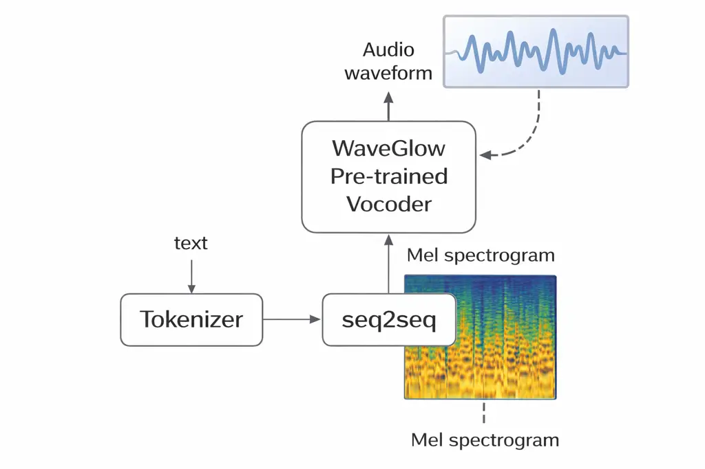
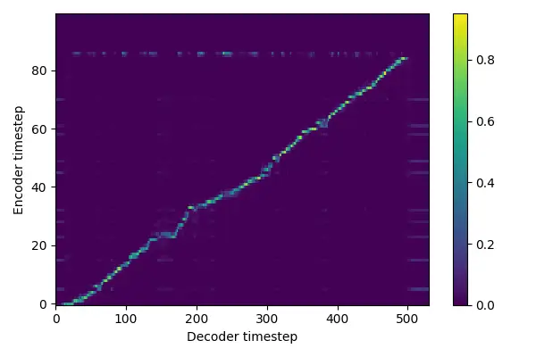
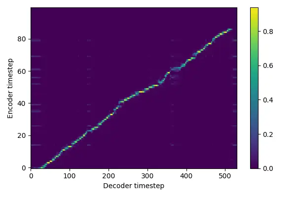
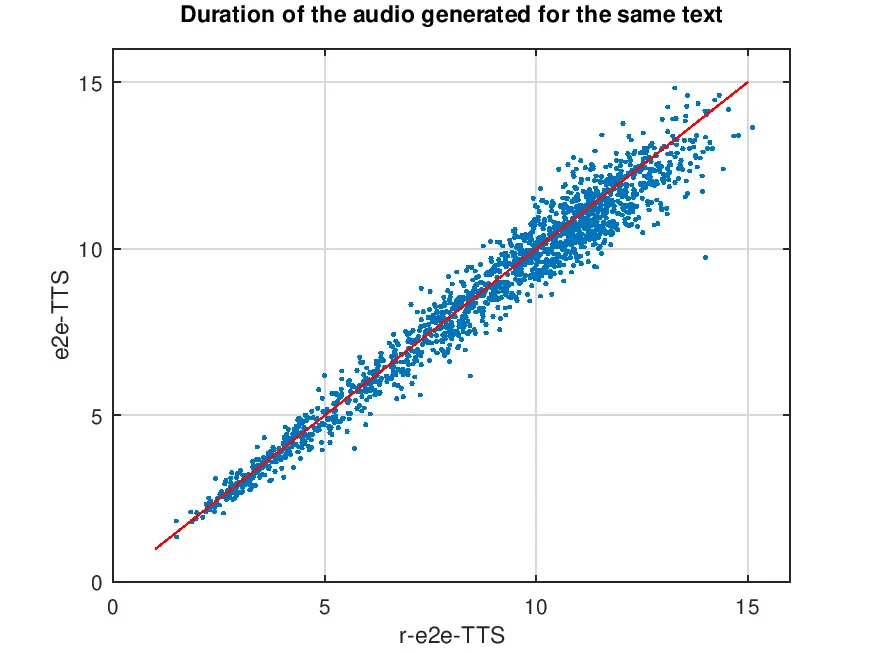
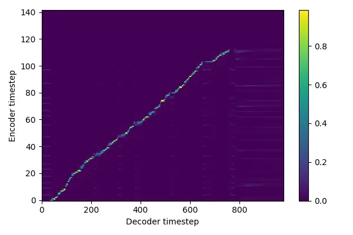
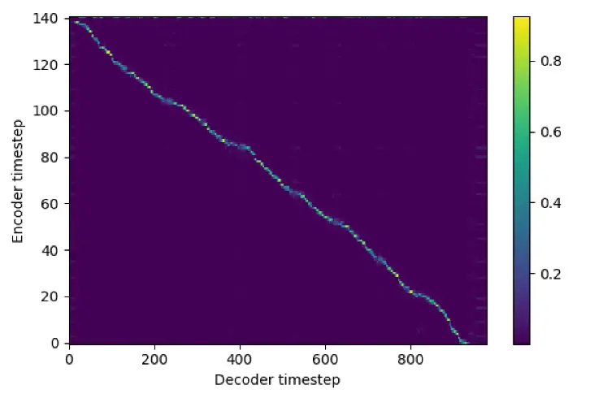
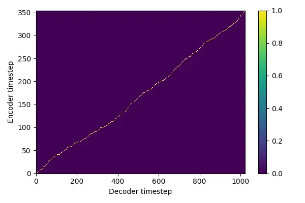

# Probing Human Articulatory Constraints in End-to-End TTS with Reverse and Mismatched Speech-Text Directions

Parth Khadse    Sunil Kumar Kopparapu Affiliation: TCS Research, Tata
Consultancy Services Limited, Mumbai, India  
[http://www.tcs.com](http://www.tcs.com)
E-mail <%7Bparth.khadse,sunilkumar.kopparapu%7D@tcs.com>

###### Abstract

An end-to-end (e2e) text-to-speech (TTS) system is a deep architecture
that learns to associate a text string with acoustic speech patterns
from a curated dataset. It is expected that all aspects associated with
speech production, such as phone duration, speaker characteristics, and
intonation among other things are captured in the trained TTS model to
enable the synthesized speech to be natural and intelligible. Human
speech is complex, involving smooth transitions between articulatory
configurations (ACs). Due to anatomical constraints, some ACs are
challenging to mimic or transition between. In this paper, we
experimentally study if the constraints imposed by human anatomy have an
implication on training an e2e-TTS systems. We experiment with two
e2e-TTS architectures, namely, Tacotron-2 an autoregressive model and
VITS-TTS a non-autoregressive model. In this study, we build TTS systems
using (a) forward text, forward speech (conventional, e2e-TTS), (b)
reverse text, reverse speech (r-e2e-TTS), and (c) reverse text, forward
speech (rtfs-e2e-TTS). Experiments demonstrate that e2e-TTS systems are
purely data-driven. Interestingly, the generated speech by r-e2e-TTS
systems exhibits better fidelity, better perceptual intelligibility, and
better naturalness.

###### Keywords: 

TTS reverse speech end to end models tokenization

## 1 Introduction

Articulation is the process of producing speech sounds by manipulating
the air-stream from the lungs using the articulatory organs. The
specific movements of the articulatory organs, called articulatory
configuration (AC) determine the different speech sounds that humans
produce. One could look at a sequence of AC smoothly transitioning from
one AC to another resulting in spoken speech. Visible speech (VS)
symbols \[3\], introduced in 1867, provided visual representation of the
position of the speech organs needed to articulate an individual sound.
The concept of VS was used effectively to identify words that are
difficult to articulate based on the degree of change in the position of
articulators that is required to speak a word \[20\]. While appreciating
the fact that speech production is much more complex, namely, the next
word or phrase that we produce is dependent on what has been spoken
prior not only linguistically but also in terms of how we emote it in
the form of intonation, there is also an aspect of breath cycle, pauses,
filler words, stress on certain words, language grammar and much more.
Aware of this, we hypothesize that the language we speak has evolved
over a period of time and the sounds that we produce are such that they
are optimal in terms of the amount of energy required to change the
position of the articulators or transition from one AC to another when
we speak a sentence. We call the speech produced with these constraints,
to contain natural patterns in spoken speech. Maybe, we as humans have
refined or adapted the language structure, syntax, etc. to make it
suitable, comfortable and easy for us to use. For example speaking
“txet” (reverse of “text”) is harder than “text” (see Appendix 0.A).

With growing need for voice user interfaces, there is a dire need for
generating speech from text, also called text to speech (TTS). The area
of TTS has evolved significantly from the rudimentary Klatt synthesizer
\[10\] to current day e2e-TTS models like Tacotron-2 \[19\], FastSpeech
\[16\], Glow-TTS \[7\], F5-TTS \[4\], Variational Inference
Text-to-Speech (VITS-TTS) \[9\]. The e2e-TTS systems are traditionally
sequence to sequence (seq2seq) architectures that learn to map a text
sequence and the corresponding audio. These e2e-TTS are trained on a
large amount of training text-speech corpora. In this paper, we
experimentally explore if these e2e-TTS models benefit from (a) the
constraints imposed by the articulatory anatomy where only certain
transitions of AC’s are possible (see Appendix 0.A) or (b) some implicit
patterns in the syntactic structure of the language and speech. We
further assume that these patterns or AC transition constraints do not
exist in a reverse audio. For clarity, if $`s(t)`$ is the spoken speech
of duration $`T`$, namely, $`0\leq t\leq T`$ then $`s(T-t)=\bar{s}(t)`$
is the reverse speech. In this paper, we would like to study and
understand if an e2e-TTS architecture can be trained on an unnatural (to
human) patterns or in other words does the constraints on possible AC
imposed by the articulatory anatomy or the smooth transition from one AC
to another help the conventionally trained e2e-TTS system.

The rest of the paper is organized as follows. In Section 2 we describe
the approach that we adopted and in Section 3 we analyze the experiments
that we conducted and conclude in Section 4.

## 2 The Setup

Tacotron-2 \[19\] is an e2e-TTS deep learning architecture that consists
of two main components. As seen in Figure 1, the first component is a
recurrent sequence-to-sequence (seq2seq) model with an attention
mechanism, and a WaveGlow-based vocoder. The seq2seq model takes in a
sequence of characters (text) and outputs a sequence of mel-spectrogram
features. These output mel-spectrogram features pass through a
pre-trained WaveGlow vocoder to generate the audio waveform (speech).

Specifically, the text to mel-spectrogram seq2seq model consists of an
encoder and a decoder, implemented as recurrent neural networks (RNNs).
The encoder takes in the input text and encodes it into a sequence of
high-level representations, which are then passed to the decoder. The
decoder uses an attention mechanism to focus on different parts of the
input sequence at each time step, allowing it to generate a sequence of
mel-spectrogram features that represent the input text. On the other
hand, the WaveGlow\[13\] vocoder is a deep generative flow-based model
trained on a large corpus of speech data, allowing it to generate highly
realistic and natural-sounding speech. The two stage architecture of
seq2seq followed by vocoder (see Fig. 1) allows generation of
high-quality and natural-sounding speech from input text.



Figure 1: High level block diagram of e2e-TTS architecture. We train the
seq2seq block while using a pre-trained vocoder.

While using a pre-trained vocoder \[5\] we built several e2e-TTS systems
by training several different seq2seq models as shown in Fig. 1. The
first seq2seq model was trained using the standard text, denoted by
$`w`$ and mel-spectrogram extracted from $`s(t)`$ for the system denoted
by e2e-TTS. Namely,

```math
w\longrightarrow\framebox{{\color[rgb]{0,0,0}{{\tt e2e-TTS}}}{}}\longrightarrow s(t)
```

The second system, called, r-e2e-TTS while using the same pre-trained
vocoder, used the reverse text¹¹ 1 “dlrow olleh” is the reverse text
corresponding to “hello world” denoted by $`\bar{w}`$ and
mel-spectrogram extracted from reverse speech denoted by $`\bar{s}(t)`$
to train the seq2seq model. The trained r-e2e-TTS is denoted by

```math
\bar{w}\longrightarrow\framebox{{\color[rgb]{0,0,0}{{\tt r-e2e-TTS}}}}\longrightarrow\bar{s}(t)
```

Note that $`\bar{s}(t)`$ has to be reversed for any further analysis,
namely $`\bar{\bar{s}}(t)`$ (reverse of $`\bar{s}(t)`$). In both the
cases we use the same standard seq2seq architecture to train for the
text to its corresponding mel-spectrogram, while using a pre-trained
WaveGlow model.

## 3 Experimental Details

The Tacotron-2 \[19\] model is trained on the text-speech paired data of
English male speaker, released as part of the LIMMITS’25 grand challenge
\[6\]. The dataset consist of approximately $`40`$ hours of speech data
spoken by a single speaker recorded at $`48`$ kHz sampling rate. Note
that we do not experiment with different datasets or multiple number of
speakers because that is not the focus of this experimental study.

The following data-prepossessing was done on the dataset to train the
seq2seq model. The speech was down-sampled to $`22.05`$ kHz using sox
utility and mel-spectrogram was extracted from the speech with window
length of $`1024`$ samples, hop length of $`256`$ samples and $`80`$ mel
channels. The text was converted to lower case, followed by
normalization (numerical converted to words, for example “10” was
converted to “ten”, etc). We followed the same pre-processing for
training the seq2seq model for different e2e-TTS models.

Comparing e2e-TTS and r-e2e-TTS, both seq2seq models were trained under
identical conditions, namely, on the same machine, using a batch size of
$`16`$ and a learning rate of $`2.5*10^{-4}`$. All the models were
trained for $`50000`$ iteration.



(a) Alignment plot (e2e-TTS).



(b) Alignment plot (r-e2e-TTS).

Figure 2: Alignment plots for both e2e-TTS and r-e2e-TTS show no
observable differences.

Figure 2 shows the alignment plots between encoder and decoder steps
generated during the training process at the $`45000^{th}`$ iteration.
It can be observed that there is no noticable differences in the two
alignment plots, demonstrating that both the trained models e2e-TTS
(r-e2e-TTS) effectively learned to convert text sequence, $`w`$
($`\bar{w}`$) into audio $`s(t)`$ ($`\bar{s}(t)`$).

For the purposes of quantitative comparison, we selected $`2500`$ text
samples, not used during seq2seq training, at random, from
Librispeech-960 \[12\] corpus. We discarded all sentences that had less
than $`5`$ words or greater that $`40`$ words which resulted in a total
of $`1715`$ sentences. We generated audio, using the trained e2e-TTS and
r-e2e-TTS models separately for these $`1715`$ sentences. A well
documented problem in seq2seq model is its inability to identify the
End-of-Sentence (EoS). A total of $`14`$ generated audio (see Table 1)
by either e2e-TTS ($`10`$) or r-e2e-TTS ($`4`$) resulted in an extended
duration (limited by the maximum duration of the audio chosen as the
hyper-parameter) audio because they resulted in the seq2seq model not
being able to identify EoS. We discarded these $`14`$ audio files from
further analysis. All the analysis is based on the remaining $`1701`$
generated audio, common to both e2e-TTS and r-e2e-TTS.

| Model     | Generated (#) | EoS issues (#) |
| --------- | ------------- | -------------- |
| e2e-TTS   | 1715          | 10             |
| r-e2e-TTS | 1715          | 4              |

Table 1: Synthesized audio seq2seq EoS problem.

We evaluated the audio generated by e2e-TTS and r-e2e-TTS in two
different ways. In the first set of evaluation, we transcribed the
generated audio using OpenAI’s Whisper small.en and WhisperX small model
\[15\]. Note that while we passed $`s(t)`$ generated by e2e-TTS
directly, we reversed the output of r-e2e-TTS namely used
$`\bar{\bar{s}}(t)`$ for transcription. As an objective evaluation
metric, we computed the Word Error Rate (WER) and Character Error Rate
(CER), by finding the edit distance between the transcribed text and the
original text used for generating the audio. Table 2 captures the
fidelity of the audio generated by e2e-TTS and r-e2e-TTS, in terms of
WER and CER as a proxy measure. Note that smaller values of WER and CER
are better and suggest that the generated audio is more reliably
transcribed by the speech recognition engine.

Clearly, the speech synthesized by r-e2e-TTS is better recognised by the
ASR (both Whisper and WhisperX) than the conventional e2e-TTS generated
audio. It can be observed that the r-e2e-TTS performance is $`6.5\%`$
($`5.6\%`$) better than e2e-TTS in absolute terms and $`37.58\%`$
($`34.36\%`$) in relative terms for Whisper (WhisperX). It can also be
observed that WhisperX, the more recent model performs, as expected,
better than Whisper in all instances.

|                    | Model     | WER (%) | CER (%) |
| ------------------ | --------- | ------- | ------- |
| Whisper (small.en) | e2e-TTS   | 17.3    | 7.5     |
|                    | r-e2e-TTS | 10.8    | 4.0     |
| WhisperX (small)   | e2e-TTS   | 16.3    | 6.9     |
|                    | r-e2e-TTS | 10.7    | 3.9     |

Table 2: WER and CER (lower values better) calculated on $`1701`$ text
samples, using Tacotron-2 architecture.

These observations indicate that r-e2e-TTS is not only capable of
learning the seq2seq mapping between the reverse text sequence and the
corresponding mel-spectrogram of the reverse audio, but also generates
speech that is better transcribed by the automatic speech recognition
engine; both Whisper \[14\] and WhisperX \[2\].

The second set of evaluations are based on human perception, in terms of
mean opinion scores (MOS). We asked $`5`$ subjects ($`3`$ male, $`2`$
female) to listen to a total of $`16`$ generated audio waveform ($`8`$
each generated using e2e-TTS and r-e2e-TTS) and give a score between
$`1`$ and $`5`$ for both naturalness and intelligibility. The subjects
were provided the information mentioned in Table 3 as reference.

| Score | Naturalness         | Intelligibility                |
| ----- | ------------------- | ------------------------------ |
| 1     | awkward, robotic    | cannot understand speech       |
| 2     | strange/ not smooth | understandable; mostly unclear |
| 3     | like human voice    | understandable; hard to follow |
| 4     | smooth and natural  | easy to understand             |
| 5     | sounds very natural | completely understandable      |

Table 3: Reference provided to subjects to mark naturalness and
intelligibility.

Note that the subjects were not aware of which audio was generated by
which system. Table 4 shows the results of this perceptual evaluation in
terms of MOS. While the MOS for both e2e-TTS and r-e2e-TTS are close to
each other, the audio generated by r-e2e-TTS gets a higher(better) MOS
for both naturalness ($`3.75`$ in comparison to $`3.4`$) and
intelligibility ($`3.58`$ compared to $`3.38`$). Again demonstrating the
superior performance of r-e2e-TTS over e2e-TTS.

|                 | e2e-TTS          | r-e2e-TTS         |
| --------------- | ---------------- | ----------------- |
| Naturalness     | $`3.40\pm 0.11`$ | 3.75 $`\pm`$ 0.22 |
| Intelligibility | $`3.38\pm 0.27`$ | 3.58 $`\pm`$ 0.60 |

Table 4: Mean Opinion Scores (Naturalness and Intelligibility).

In another perceptual evaluation test, the same $`5`$ subjects were
presented with $`5`$ pairs of audio samples, generated using the same
text ($`w`$ for e2e-TTS and $`\bar{w}`$ for r-e2e-TTS), while one was
generated using e2e-TTS the other paired audio was generated using
r-e2e-TTS. These audio waveform were presented in random order, meaning
in some instances the first audio waveform in the pair was from e2e-TTS
while in some instances the first waveform was from r-e2e-TTS. The
subjects were then asked to mark the audio sample which they felt was
comparatively better of the two. Note that no specific instruction was
communicated to the subjects in terms of what they should look for in
the audio. In all, we got $`5`$ responses from each of the $`5`$
subjects, totaling $`25`$ responses as shown in Table 5. It can be
observed that $`92\%`$ of the time ($`23/25`$) the subjects felt that
the audio generated by r-e2e-TTS was better than the corresponding audio
generated by e2e-TTS and only in $`2`$ instances did the subjects choose
the audio generated by e2e-TTS over r-e2e-TTS (see Table 5).

|         | Sub# 1 | Sub# 2 | Sub# 3 | Sub# 4 | Sub# 5 |
| ------- | ------ | ------ | ------ | ------ | ------ |
| Pair# 1 | $`0`$  | $`1`$  | $`1`$  | $`1`$  | $`1`$  |
| Pair# 2 | $`1`$  | $`1`$  | $`1`$  | $`1`$  | $`1`$  |
| Pair# 3 | $`1`$  | $`0`$  | $`1`$  | $`1`$  | $`1`$  |
| Pair# 4 | $`1`$  | $`1`$  | $`1`$  | $`1`$  | $`1`$  |
| Pair# 5 | $`1`$  | $`1`$  | $`1`$  | $`1`$  | $`1`$  |

Table 5: Paired audio perceptual test. A $`1`$ represents the instance
when r-e2e-TTS generated audio was chosen as being better.

Clearly, the perceptual evaluation, though by a small set of $`5`$
independent subjects, demonstrates the trend towards their preference
for audio generated by r-e2e-TTS.

Further, it was observed that the total duration of the $`1701`$ audio
generated by r-e2e-TTS was $`1.85\%`$ shorter ($`14786.21`$ seconds
compared to $`15064.73`$ seconds by e2e-TTS) than that generated by
e2e-TTS. On an average for the same $`w`$ ($`\bar{w}`$ for r-e2e-TTS)
the e2e-TTS generated $`s(t)`$ was of longer duration ($`8.85`$ s)
compared to the duration of $`\bar{s}(t)`$ ($`8.69`$ s). Figure 3
captures the scatter plot of the duration of the audio produced by
e2e-TTS and r-e2e-TTS for the same text. It can be observed that the
number of points below the red diagonal far exceed the number of points
above the diagonal.

We conclude that the r-e2e-TTS system seems to perform better in terms
of lower WER and higher MOS (perceptual score) compared to e2e-TTS
everything else remaining same in terms of the architecture (Tacotron-2)
and the hyper parameters, number of training samples, number of
iterations.



Figure 3: Scatter plot of duration of the audio for the same text
produced by e2e-TTS (y-axis) and r-e2e-TTS (x-axis). The duration of
audio generated by e2e-TTS is overall longer than the audio generated by
r-e2e-TTS.

### 3.1 Effect of Text Tokenization

Motivated by \[18\], in addition to e2e-TTS and r-e2e-TTS we also
trained a set of models where the input text was encoded using byte pair
encoding (BPE) \[17\] instead of directly using the characters in the
text (see Fig. 1). For the same text input, generally BPE encoding
results in lesser number of tokens, compared to character tokenization.
As seen in Table 6 BPE results in $`21`$ tokens compared to $`34`$
character tokens for the example text ‘‘The stars twinkle and shine
bright’’.

| Tokenizer (# of tokens)            | Tokens                                                                                  |
| ---------------------------------- | --------------------------------------------------------------------------------------- |
| character (34)                     | t h e \_ s t a r s \_ t w i n k l e \_ a n d \_ s h i n e \_ b r i g h t                |
| BPE (21)                           | the, \_, st, ar, s, \_t, w, in, k, le, \_, and, \_s, h, in, e, \_b, ri, g, h, t         |
| BPE (token length $`\leq 2`$) (24) | \_t, he, \_s, t, ar, s, \_t, w, in, k, l, e, \_a, nd, \_s, h, in, e, \_b, r, i, g, h, t |

Table 6: Tokenization for the sentence ‘‘The stars twinkle and shine
bright’’. We use character tokenizer for e2e-TTS and r-e2e-TTS while we
use Byte Pair Encoding (BPE) for BPE-e2e-TTS and BPE-r-e2e-TTS.

Tokenization algorithms, broadly work on the principle of iteratively
merging frequently occurring pairs of characters or tokens to create a
vocabulary of tokens that can represent the language’s vocabulary
efficiently. This as we will observe later, results in better machine
transcription of the generated audio. We call these TTS systems,

```math
w\longrightarrow\overbrace{\framebox{BPE}\rightarrow\framebox{$\mathcal{L}$}\rightarrow\framebox{{\color[rgb]{0,0,0}{{\tt e2e-TTS}}}{}}}^{\mbox{BPE-{\color[rgb]{0,0,0}{{\tt e2e-TTS}}}{}}}\longrightarrow s(t)
```

and

```math
\bar{w}\longrightarrow\overbrace{\framebox{BPE}\rightarrow\framebox{$\mathcal{L}$}\rightarrow\framebox{{\color[rgb]{0,0,0}{{\tt r-e2e-TTS}}}{}}}^{\mbox{BPE-{\color[rgb]{0,0,0}{{\tt r-e2e-TTS}}}{}}}\longrightarrow\bar{s}(t).
```

Where $`\mathcal{L}`$ is a length-regulator operator which modifies the
length of the BPE tokenized sequence. The operator $`\mathcal{L}`$
expands the sequence by repeating each token to reflect its length. As
an example,

```math
\texttt{bright}\rightarrow\framebox{BPE}\rightarrow[\texttt{br, i, ght}]\rightarrow\framebox{$\mathcal{L}$}\rightarrow[\texttt{br, br, i, ght, ght, ght}]
```

the token “br” of length two occurs twice and the token “ght” of length
three occurs thrice while the token ‘i’ of length 1 occurs just once. We
find that $`\mathcal{L}`$ is crucial to produce intelligible speech when
using Tacotron-2.

As mentioned earlier, the BPE models were trained on $`w`$ for
BPE-e2e-TTS while it was trained with $`\bar{w}`$ for BPE-r-e2e-TTS.
Figure 4 shows the alignment plots between the encoder and decoder
steps. From the plots it can seen clearly that the trained BPE models
BPE-e2e-TTS (BPE-r-e2e-TTS) are able to effectively convert the BPE
sequence to speech. As earlier identical training condition was enabled
for training both BPE-e2e-TTS and BPE-r-e2e-TTS. We trained the
SentencePiece \[11\], with BPE (–vocab_size=n, –model_type=bpe,
–split_by_whitespace=False). We use $`n=50`$ and impose a constraint on
the token length to be $`2`$.


(a) BPE-e2e-TTS



(b) BPE-r-e2e-TTS

Figure 4: Alignment plots for both BPE-e2e-TTS and BPE-r-e2e-TTS show no
observable differences.

These BPE models were also evaluated on the same set of $`1715`$
sentences. We generated separate audio files for all the $`1715`$ files
for both the models. A total of $`7`$ (see Table 7) generated audio
files suffered from EoS problem, while BPE-e2e-TTS resulted in $`4`$
instances of EoS BPE-r-e2e-TTS resulted in $`3`$. So during the
evaluation these $`7`$ files were discarded and the evaluation process
was performed on the remaining $`1708`$ files.

| Model         | Generated (#) | EoS issues (#) |
| ------------- | ------------- | -------------- |
| BPE-e2e-TTS   | 1715          | 4              |
| BPE-r-e2e-TTS | 1715          | 3              |

Table 7: Synthesized audio seq2seq EoS problem using BPE-e2e-TTS and
BPE-r-e2e-TTS.

Along earlier lines, we computed the WER and CER of the audio files
generated using BPE models and used the same ASR models for
transcription. Table 8 shows that though BPE-r-e2e-TTS ($`9.4\%`$)
performs better than BPE-e2e-TTS ($`9.6\%`$), the improvement, $`0.2\%`$
($`0.4\%`$) in absolute terms and $`2.1\%`$ ($`4.2\%`$) relative terms
for Whisper (WhisperX) is significantly dwarfed compared to using text
without tokenization, namely, e2e-TTS and r-e2e-TTS.

Note that the audio produced by BPE models (both BPE-e2e-TTS and
BPE-r-e2e-TTS; Table 8) result in better WER ($`9.6\%`$) than the best
when the input text is not encoded using BPE ($`10.7\%`$; Table 2).

|                    | Model         | WER (%) | CER (%) |
| ------------------ | ------------- | ------- | ------- |
| Whisper (small.en) | BPE-e2e-TTS   | 9.6     | 3.4     |
|                    | BPE-r-e2e-TTS | 9.4     | 3.3     |
| WhisperX (small)   | BPE-e2e-TTS   | 9.5     | 3.4     |
|                    | BPE-r-e2e-TTS | 9.1     | 3.2     |

Table 8: WER and CER (lower values better) calculated on $`1708`$ text
samples on audio generated by BPE-e2e-TTS and BPE-r-e2e-TTS.

### 3.2 Architecture Dependency

To validate if the performance of r-e2e-TTS being better than e2e-TTS
was dependent on the auto-regressive nature of Tacotron-2, we
experimented with VITS-TTS (Variational Inference Text-to-Speech) \[9\]
a non-autoregressive TTS architecture. Appendix 0.B captures the salient
differences between the Tacotron-2 model and VITS-TTS model.

|                    | Model     | WER (%) | CER (%) |
| ------------------ | --------- | ------- | ------- |
| Whisper (small.en) | e2e-TTS   | 12.36   | 6.37    |
|                    | r-e2e-TTS | 11.80   | 5.90    |
| WhisperX (small)   | e2e-TTS   | 12.11   | 6.18    |
|                    | r-e2e-TTS | 11.69   | 5.80    |

Table 9: WER and CER (lower values better) calculated on $`1715`$ text
samples using VITS-TTS architecture.

Table 9 shows the objective evaluation results of the VITS-TTS model.
The speech synthesized by r-e2e-TTS, a model trained using $`\bar{w}`$
and $`\bar{s}(t)`$ is better transcribed by the ASR compared to the
e2e-TTS (trained using $`w`$ and $`s(t)`$) for the same VITS-TTS
architecture. As seen in Table 9 the performance of r-e2e-TTS is
$`0.56\%`$ ($`0.47\%`$) better than e2e-TTS in absolute terms for
Whisper (WhisperX). We can conclude that the performance of the
r-e2e-TTS is better that the performance of e2e-TTS irrespective of the
TTS architecture, as seen in Table 2 for Tacotron-2 and Table 9 for
VITS-TTS.

Additionally, on an average for the same text $`w`$ ($`\bar{w}`$ for
r-e2e-TTS) the duration of the generated audio was $`8.62`$ s for
e2e-TTS compared to a duration of $`8.54`$ s for the r-e2e-TTS system
(shorter by $`0.93\%`$). A trend similar to that observed using the
Tacotron-2 architecture.

### 3.3 Reverse Text and Forward Speech (rtfs-e2e-TTS)

Encouraged by the superior performance of r-e2e-TTS independent of the
architecture (autoregressive or non-autoregressive) we wanted explore if
training with reverse text ($`\bar{w}`$) and normal speech (s(t)),
namely, rtfs-e2e-TTS was trainable. We trained an e2e-TTS systems using
both Tacotron-2 and VITS-TTS architectures.



(a) Alignment plot rtfs-e2e-TTS (Tacotron-2)



(b) Alignment plot rtfs-e2e-TTS (VITS-TTS)

Figure 5: Alignment plots for training rtfs-e2e-TTS. (a) Tacotron-2, (b)
VITS-TTS.

Figure 5(a) shows the alignment plot between the reversed text and
normal speech frames generated by the Tacotron-2 model. It can be
clearly observed that the model is able to identify and map the initial
text character tokens to the final audio frames. Notice that the slope
of the alignment curve is diagonally opposite to the alignment plots in
Fig. 2 and Fig. 4. As can be seen from Table 10 the performance in terms
of WER and CER on 1711 audio transcriptions (of the 1715 audio files; 4
samples suffered from the EoS problem) is better that what has been
observed for e2e-TTS, r-e2e-TTS in Table 2 as well as the performance of
BPE-e2e-TTS and BPE-r-e2e-TTS as seen in Table 8.

While Tacotron-2 model is able to learn, in contrast VITS-TTS
architecture shows no such alignment when an e2e-TTS as can be seen in
Fig. 5(b). The reason for the differences in the learning behaviour can
be attributed to the differences in the alignment strategies used by
Tacotron-2 and VITS-TTS. While Tacotron-2 adopts uses the
Location-Sensitive-Attention mechanism which is an extension of
Bahadanau attention \[1\] to enable soft-alignment between the text
tokens and the speech frames, VITS-TTS uses Monotonic Alignment Search
(MAS)\[8\] to align the text and speech. MAS introduces a constraint
which requires the input text-sequence and the mapped audio-sequence
have a strict left-to-right (monotonic) correspondence which results in
necessarily mapping the first text token to the first audio frame in the
generated sample. This MAS constraint results in the decoder in the TTS
model not to attend to any of the previous tokens which are aligned
already resulting in no alignment between the text and the audio. Note
that the soft-alignment gives Tacotron-2 a free-hand to explore all the
possible relations between the text-tokens and the audio-frames, the
monotonic alignment in VITS-TTS restricts the alignment between reverse
input text and the forward audio.

|                    |              |        |         |
| ------------------ | ------------ | ------ | ------- |
|                    | Model        | WER(%) | CER (%) |
| Whisper (small.en) | rtfs-e2e-TTS | 9      | 3       |
| WhisperX (small)   | rtfs-e2e-TTS | 8.31   | 3.73    |

Table 10: WER and CER ($`\downarrow`$ better) calculated on 1711 text
samples on audio generated by rtfs-e2e-TTS. Using Tacotron-2.

|            |            |               |         |       |          |       |
| ---------- | ---------- | ------------- | ------- | ----- | -------- | ----- |
| TTS Arch   | Text Embed | Model type    | Whisper |       | WhisperX |       |
|            |            |               | WER     | CER   | WER      | CER   |
| Tacotron-2 | char       | e2e-TTS       | 17.32   | 3.44  | 16.33    | 6.94  |
|            |            | r-e2e-TTS     | 10.79   | 3.28  | 10.69    | 3.9   |
|            |            | rtfs-e2e-TTS  | 9       | 3     | 8.31     | 3.73  |
| VITS-TTS   | char       | e2e-TTS       | 12.36   | 6.37  | 12.11    | 6.18  |
|            |            | r-e2e-TTS     | 11.83   | 5.96  | 11.69    | 5.8   |
|            |            | rtfs-e2e-TTS  | 101.69  | 85.03 | 110.15   | 84.55 |
| Tacotron-2 | BPE        | BPE-e2e-TTS   | 9.58    | 3.44  | 9.55     | 3.41  |
|            |            | BPE-r-e2e-TTS | 9.39    | 3.28  | 9.16     | 3.23  |

Table 11: Summary of Results from all the experiments.

Table 11 summarizes all the experimental results. It can be observed
that the best performance in terms of WER (a proxy measure to determine
the intelligibility of synthesized speech) is enabled using rtfs-e2e-TTS
model with Tacotron-2 architecture. This experimental exploration seems
to suggest that e2e-TTS systems are purely data driven and is not
constrained by the Human Articulatory Constraints that restricts the
certain sequence of phonemes in human generated speech (see Appendix
0.A).

## 4 Conclusion

We hypothesized that there might be hidden natural properties in the
speech produced by human because of the constraints imposed by the
anatomy of the human articulatory mechanism and asked ourselves if these
properties, if any, influenced the training of an e2e-TTS system. Our
experiments, based on Tacotron-2 and VITS-TTS architecture suggest that
e2e deep learning systems execute as a brute-force and blind
data-mapping exercise, seq2seq learning the text sequence and the
corresponding mel-spectrogram of the audio.

All our experiments used read speech (it is common to use read speech in
TTS literature), however, it remains to be seen if the articulately
transition constraints are more visible if spontaneous speech was used
to train an e2e-TTS system. In normal communication, humans speak
spontaneously, which introduces pauses and variations in word
arrangement within sentences randomly. It remains to be explored whether
e2e-TTS systems exploit these properties.

We enumerate some of our observations, many of which, in our opinion,
require further exploration for deeper analysis and better
understanding.

1.  1.  End-to-end TTS (e2e-TTS) systems seem to primarily adopt a blind
        data-mapping exercise and train well for forward-forward,
        reverse-reverse, forward-reverse e2e-TTS systems, especially when
        Tacotron-2 architecture is used.

    1.  (a)
        All the models namely, e2e-TTS, r-e2e-TTS (both Tacotron-2 and
        VITS-TTS), BPE-e2e-TTS and BPE-r-e2e-TTS are able to train and
        produce natural and intelligible speech.
    1.  (b)
        It is not clear why the performance, in terms of speech
        recognition by ASR and speech perception by humans, is better
        for audio generated using r-e2e-TTS and BPE-r-e2e-TTS. A deeper
        study might shed some light on this aspect.

2.  2.  The audio generated by BPE-r-e2e-TTS, r-e2e-TTS, and rtfs-e2e-TTS,
        are transcribed more accurately than the audio generated by e2e-TTS
        by the state of the art ASR engines, Whisper and WhisperX. This
        needs to be investigated further.
3.  3.  The use of BPE results in lower (better) WER, demonstrating that use
        of a text encoder to represent input text to train the seq2seq model
        seems to better capture the text-speech mapping. It is probably
        because longer length tokens can capture contextual information
        embedded in the speech better than character based tokens.

    1.  (a)
        However, using longer size tokens ($`\geq 3`$) when using
        Tacotron-2 architecture resulted in poor quality audio
        generation in terms of both naturalness and intelligibility.
        This requires further investigation as well.

4.  4.  While there are no challenges in training an r-e2e-TTS
        (BPE-r-e2e-TTS), the appropriateness of the data used to train
        requires attention.

    1.  (a)
        The $`\bar{s}(t)`$ (reverse audio) used for training is
        artificial and synthetically generating; the reverse speech used
        in our experiments is not really equivalent to a human speaking
        in reverse.
    1.  (b)
        Our attempt to get a few subjects (see Appendix 0.C) to speak a
        sentence in reverse showed that it was not only impossible to
        utter the sentence (expressed by all the subjects) without
        unusual pauses, but also when the recorded sentence was played
        in reverse, it sounded gibberish.

## References

- \[1\] D. Bahdanau, K. Cho, and Y. Bengio (2014) Neural machine
  translation by jointly learning to align and translate. arXiv preprint
  arXiv:1409.0473. Cited by: §3.3.
- \[2\] M. Bain, J. Huh, T. Han, and A. Zisserman (2023) WhisperX:
  time-accurate speech transcription of long-form audio. External Links:
  2303.00747, [Link](https://arxiv.org/abs/2303.00747) Cited by: §3.
- \[3\] A. M. Bell (1867) Visible speech: the science of universal
  alphabetics. Internet Archive. Note: Accessed: 2025-05-29 External
  Links: [Link](https://archive.org/details/b21782520) Cited by: §1.
- \[4\] Y. Chen, Z. Niu, Z. Ma, K. Deng, C. Wang, J. Zhao, K. Yu, and X.
  Chen (2025) F5-tts: a fairytaler that fakes fluent and faithful speech
  with flow matching. External Links: 2410.06885,
  [Link](https://arxiv.org/abs/2410.06885) Cited by: §1.
- \[5\] N. Corporation WaveGlow: a flow-based generative network for
  speech synthesis. Note:
  [https://github.com/NVIDIA/waveglow](https://github.com/NVIDIA/waveglow)Accessed:
  2023-03-21 Cited by: §2.
- \[6\] IISc LIMMITS25 multi-speaker, multi-lingual indic tts with voice
  cloning grand challenge. Note: Accessed: 2023-03-22 External Links:
  [Link](https://sites.google.com/view/limmits25) Cited by: §3.
- \[7\] J. Kim, S. Kim, J. Kong, and S. Yoon (2020) Glow-tts: a
  generative flow for text-to-speech via monotonic alignment search. In
  Proceedings of the 34th International Conference on Neural Information
  Processing Systems, NIPS ’20, Red Hook, NY, USA. External Links: ISBN
  9781713829546 Cited by: §1.
- \[8\] J. Kim, S. Kim, J. Kong, and S. Yoon (2020) Glow-tts: a
  generative flow for text-to-speech via monotonic alignment search.
  Advances in Neural Information Processing Systems 33, pp. 8067–8077.
  Cited by: §3.3.
- \[9\] J. Kim, J. Kong, and J. Son (2021) Conditional variational
  autoencoder with adversarial learning for end-to-end text-to-speech.
  In International Conference on Machine Learning, pp. 5530–5540. Cited
  by: §1, §3.2.
- \[10\] D. H. Klatt (1980) Software for a casette-based speech
  synthesis system. Technical report Technical Report HLR-80-06, Haskins
  Laboratories, New Haven, CT. External Links:
  [Link](http://www.haskins.yale.edu/pubs/pubs.html) Cited by: §1.
- \[11\] T. Kudo and J. RichardsonE. Blanco and W. Lu (Eds.) (2018)
  SentencePiece: a simple and language independent subword tokenizer and
  detokenizer for neural text processing. Association for Computational
  Linguistics, Brussels, Belgium. External Links:
  [Link](https://aclanthology.org/D18-2012),
  [Document](https://dx.doi.org/10.18653/v1/D18-2012) Cited by: §3.1.
- \[12\] V. Panayotov, G. Chen, D. Povey, and S. Khudanpur (2015)
  Librispeech: an asr corpus based on public domain audio books. In 2015
  IEEE international conference on acoustics, speech and signal
  processing (ICASSP), pp. 5206–5210. Cited by: §3.
- \[13\] R. Prenger, R. Valle, and B. Catanzaro (2019) Waveglow: a
  flow-based generative network for speech synthesis. In ICASSP
  2019-2019 IEEE International Conference on Acoustics, Speech and
  Signal Processing (ICASSP), pp. 3617–3621. Cited by: §2.
- \[14\] A. Radford, I. Khosla, C. Hesse, P. Mishkin, D. Grangier, P.
  Nguyen, and et al. Whisper: Automatic Speech Recognition with Open AI.
  Note:
  [https://openai.com/index/whisper/](https://openai.com/index/whisper/)Accessed:
  2023-03-22 Cited by: §3.
- \[15\] A. Radford, J. W. Kim, T. Xu, G. Brockman, C. McLeavey, and I.
  Sutskever (2023) Robust speech recognition via large-scale weak
  supervision. In International conference on machine learning,
  pp. 28492–28518. Cited by: §3.
- \[16\] Y. Ren, Y. Ruan, X. Tan, T. Qin, S. Zhao, Z. Zhao, and T.
  Liu (2019) FastSpeech: fast, robust and controllable text to speech.
  In Advances in Neural Information Processing Systems, H. Wallach, H.
  Larochelle, A. Beygelzimer, F. d'Alché-Buc, E. Fox, and R. Garnett
  (Eds.), Vol. 32, pp. . Cited by: §1.
- \[17\] R. Sennrich, B. Haddow, and A. Birch (2016) Neural machine
  translation of rare words with subword units. In Proceedings of the
  54th Annual Meeting of the Association for Computational Linguistics
  (Volume 1: Long Papers), K. Erk and N. A. Smith (Eds.), Berlin,
  Germany, pp. 1715–1725. External Links:
  [Link](https://aclanthology.org/P16-1162),
  [Document](https://dx.doi.org/10.18653/v1/P16-1162) Cited by: §3.1.
- \[18\] N. Shah, P. Khadse, S. Karande, and S. K. Kopparapu (2025)
  HamaraAwaz: advancing low-latency streaming tts for multilingual
  speech in indian languages. In ICASSP 2025-2025 IEEE International
  Conference on Acoustics, Speech and Signal Processing (ICASSP),
  pp. 1–2. Cited by: §3.1.
- \[19\] J. Shen, R. Pang, R. J. Weiss, M. Schuster, N. Jaitly, Z.
  Yang, Z. Chen, Y. Zhang, Y. Wang, R. Skerrv-Ryan, et al. (2018)
  Natural tts synthesis by conditioning wavenet on mel spectrogram
  predictions. In 2018 IEEE international conference on acoustics,
  speech and signal processing (ICASSP), pp. 4779–4783. Cited by: §1,
  §2, §3.
- \[20\] A. Tripathi, S. Bhosale, and S. K. Kopparapu (2021) Automatic
  speaker independent dysarthric speech intelligibility assessment
  system. Computer Speech & Language 69, pp. 101213. External Links:
  ISSN 0885-2308,
  [Document](https://dx.doi.org/https%3A//doi.org/10.1016/j.csl.2021.101213),
  [Link](https://www.sciencedirect.com/science/article/pii/S0885230821000206)
  Cited by: §1.

## Appendix 0.A Articulatory Factors Underlying the Difficulty of Producing “txet”

Producing the non-word “txet” is articulatorily more demanding than
producing the real word “text” due to differences in phoneme sequencing
and motor coordination requirements. In “text” (/t$`\epsilon`$kst/), the
phoneme sequence follows common English phonotactic patterns,
progressing from an alveolar stop to a vowel, then to a velar stop, a
fricative, and finally returning to an alveolar stop. This sequence,
alveolar $`\rightarrow`$ vowel $`\rightarrow`$ velar $`\rightarrow`$
fricative $`\rightarrow`$ alveolar—is typical in English and allows for
smooth and incremental transitions between articulatory configurations.

In contrast, “txet” (/tx$`\epsilon`$t/) imposes an unusual and less
natural phoneme order. The transition from /t/ (an alveolar stop)
directly to /x/ (a velar fricative) occurs without an intervening vowel.
This forces a rapid and substantial backward movement of the tongue,
shifting from an alveolar closure to a velar constriction within a very
short temporal window. Such a transition is biomechanically demanding,
as it requires precise timing and large-scale tongue repositioning
without the articulatory “buffer” typically provided by a vowel.

These difficulties are further compounded by coarticulation effects. In
natural speech production, articulatory gestures are planned
anticipatorily, allowing upcoming sounds to influence current
articulator positioning. In “text”, the presence of a vowel facilitates
gradual tongue repositioning and smooth coarticulatory overlap between
consonants. In “txet”, however, the absence of an intermediate vowel
before /x/ disrupts this process, forcing an abrupt articulatory jump
that limits coarticulatory smoothing.

As a result, producing “txet” demands greater articulatory precision,
tighter temporal coordination, and increased motor control compared to
“text”. This elevated motor effort increases both cognitive and physical
load during speech production, providing a plausible explanation for the
increased difficulty associated with producing the non-word relative to
the real word.

## Appendix 0.B Tacotron-2 versus VITS-TTS

Tacotron-2 and VITS-TTS represent two distinct generations of
text-to-speech architectures with fundamentally different design
philosophies. Tacotron-2, introduced in 2018, follows a two-stage
autoregressive pipeline in which text is first converted into a
mel-spectrogram using an encoder–decoder architecture with
location-sensitive attention, and raw audio is subsequently synthesized
using a separate neural vocoder such as WaveGlow. This staged design
results in frame-wise, sequential generation, which limits inference
speed despite its strong alignment learning capabilities.

In contrast, VITS-TTS, proposed in 2021, adopts a single-stage,
non-autoregressive framework that integrates text encoding, alignment
learning, and waveform generation into a unified model. Its architecture
comprises a prior encoder, posterior encoder, and decoder trained
jointly within a normalizing flow framework, eliminating the need for an
external vocoder. Alignment between text and speech is learned using
Monotonic Alignment Search (MAS), enabling stable and interpretable
duration modeling. Additionally, VITS-TTS incorporates a duration
predictor and an adversarial discriminator, allowing fully parallel
waveform generation and significantly improved inference efficiency.

Overall, while Tacotron-2 relies on explicit attention mechanisms and a
modular pipeline that trades speed for interpretability, VITS-TTS
achieves faster and more scalable synthesis through end-to-end training,
implicit alignment learning, and parallel generation, marking a
substantial advancement in neural TTS system design. Details in Table 12.

|              |                                                      |                                                      |
| ------------ | ---------------------------------------------------- | ---------------------------------------------------- |
| Aspect       | Tacotron-2 (2018)                                    | VITS-TTS (2021)                                      |
| Architecture | Two-stage (autoregressive)                           | Single-stage (non-autoregressive)                    |
| Structure    | Encoder-decoder with attention (text to spectrogram) | Integrated prior encoder, posterior encoder, decoder |
|              | WaveGlow vocoder for raw audio from spectrogram      | Duration predictor + discriminator                   |
| Efficiency   | Slower (frame-wise generation)                       | Faster (parallel generation)                         |
| Alignment    | Location-sensitive attention                         | Monotonic Alignment Search                           |
|              | —                                                    | Normalizing flow framework                           |

Table 12: Comparison between Tacotron-2 and VITS-TTS models

## Appendix 0.C Can $`\bar{s}(t)`$ be produced by Human?


\(a\)


\(b\)

Figure 6: (a) $`\bar{s}(t)`$ and (b) $`s(t)`$

We asked $`5`$ subjects who knew Hindi to read the Hindi sentence in Fig
6 (a) which is the reverse of 6 (b). Even after extensive rehearsing,
all the subjects expressed difficulty in reading the reverse text. They
claimed that the sentence had no semantics and there were not many known
words. We further observed that the read reverse speech had no
intonation, the sentence was made as Word by word utterance and had too
many unrealistic pauses. Further, playing the recorded $`\bar{s}(t)`$ in
reverse neither sounded natural nor was it intelligible.

We conclude that true reverse speech can not be produced by Human which
makes us believe collecting actual reverse speech data is very
difficult.
