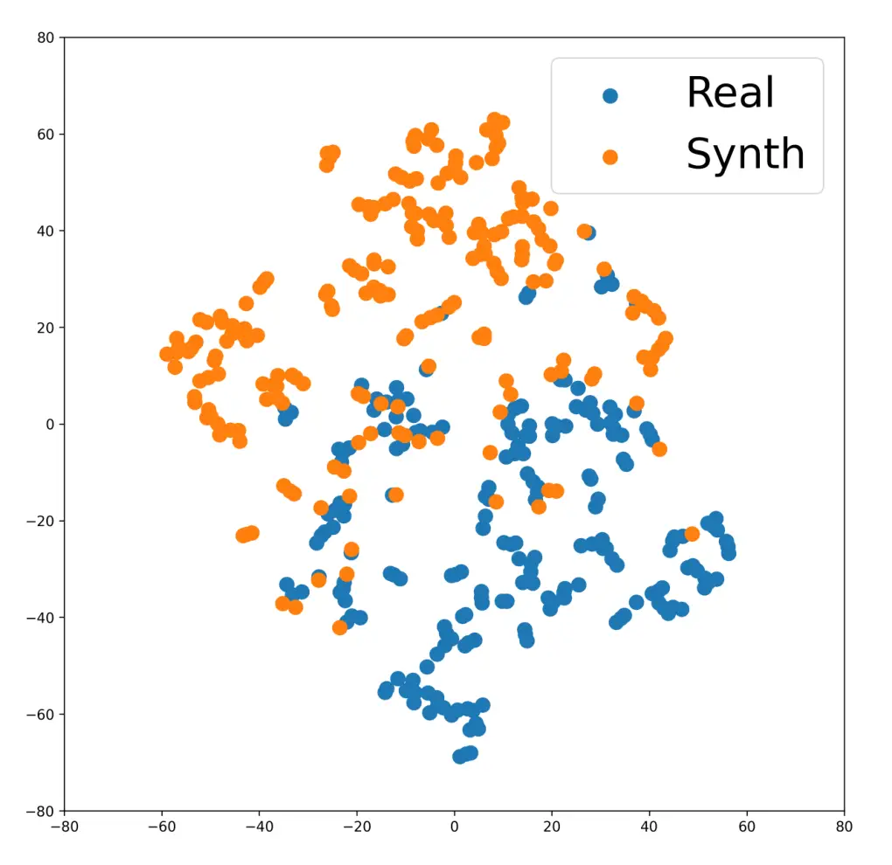
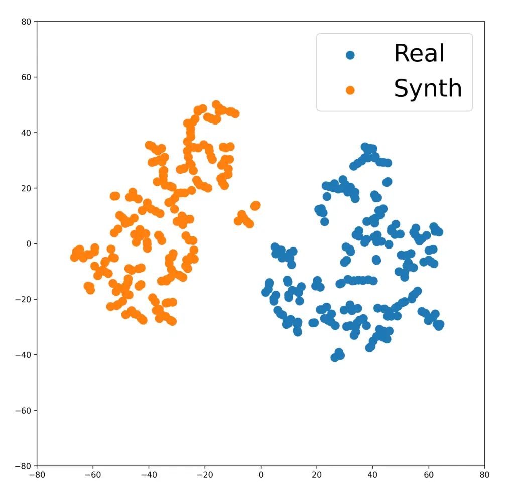

Choi Oh Kim Kim

# ZeSTA: Zero-Shot TTS Augmentation with Domain-Conditioned Training for Data-Efficient Personalized Speech Synthesis

Youngwon    Jinwoo    Hwayeon    Hyeonyu

###### Abstract

We investigate the use of zero-shot text-to-speech (ZS-TTS) as a data
augmentation source for low-resource personalized speech synthesis.
While synthetic augmentation can provide linguistically rich and
phonetically diverse speech, naively mixing large amounts of synthetic
speech with limited real recordings often leads to speaker similarity
degradation during fine-tuning. To address this issue, we propose ZeSTA,
a simple domain-conditioned training framework that distinguishes real
and synthetic speech via a lightweight domain embedding, combined with
real-data oversampling to stabilize adaptation under extremely limited
target data, without modifying the base architecture. Experiments on
LibriTTS and an in-house dataset with two ZS-TTS sources demonstrate
that our approach improves speaker similarity over naive synthetic
augmentation while preserving intelligibility and perceptual quality.
Audio samples are available on our web page¹¹ 1
https://zeroone-universe.github.io/zesta/.

###### keywords

text to speech, data augmentation, low-resource adaptation

^(†)^(†)address: ¹ Maum AI Inc., Republic of Korea  
² Humelo Inc., Republic of Korea ^(†)^(†)email: youngwonchoi@maum.ai,
jwoh@humelo.com, khy0908@maum.ai, hykim@maum.ai

## 1 Introduction

Recent neural text-to-speech (TTS) models have achieved near human-level
naturalness under sufficient training data, including lightweight
architectures suitable for practical deployment \[1, 2, 3, 4\]. With
these advances, personalized TTS, which adapts a model to a specific
target speaker, has gained increasing attention with the growing demand
for custom voices \[5, 6\]. However, adapting a model to previously
unseen speakers remains challenging, particularly when only limited
target-speaker recordings are available, motivating data-efficient
adaptation methods.

Following the categorization in \[7\], existing approaches to
personalized TTS can be broadly grouped into zero-shot and fine-tuning
paradigms. Recent zero-shot TTS (ZS-TTS) models are built upon
large-scale generative modeling frameworks to generate the voices of
unseen speakers without additional training, showing impressive
generalization \[8, 9, 10\]. However, such models are often
computationally demanding for practical deployment. Meanwhile,
lightweight ZS-TTS models based on conventional TTS acoustic
modeling \[11, 12, 13\] can be deployed more easily but have been
reported to achieve speaker similarity lower than large-scale generative
ZS-TTS models \[8\]. Adaptation via fine-tuning \[5, 14, 15\], on the
other hand, can produce high-fidelity speech when adequate
target-speaker data are available, yet its performance is highly
sensitive to data scarcity.

In low-resource scenarios where target-speaker recordings are extremely
limited, fine-tuning with data augmented by ZS-TTS may offer a promising
solution for building lightweight personalized models suitable for
practical deployment. However, principled strategies for incorporating
synthetic speech into such low-resource fine-tuning settings remain
largely underexplored. We observe that naively mixing large amounts of
ZS-TTS speech with scarce target-speaker data improves intelligibility
while degrading speaker similarity. To address this challenge, we
propose ZeSTA, a simple domain-conditioned training framework that
distinguishes between real and synthetic speech with a small additional
embedding and employs real-data oversampling to stabilize adaptation,
without modifying the base TTS architecture. Objective evaluations on
LibriTTS and the in-house dataset with multiple ZS-TTS models
demonstrate that the proposed approach preserves speaker similarity
while retaining intelligibility gains from synthetic augmentation.
Subjective evaluations further confirm improved perceptual speaker
similarity without degrading speech naturalness.

## 2 Related Works

Previous studies have explored generating synthetic speech samples to
expand training data for TTS systems. Voice conversion (VC)
methods \[16, 17, 18\] have been used to create additional
target-speaker utterances without parallel data. However, these
approaches typically require training or adapting a VC model using
recordings from the target speaker, which may limit their practicality
in low-resource personalization scenarios. Separately, several
works \[19, 20, 21\] have utilized TTS models for data augmentation of
TTS itself, where an autoregressive TTS system generates synthesized
speech to train non-autoregressive or lightweight models. Such
approaches often rely on sufficient data to train a capable teacher
model and do not explicitly address scenarios with extremely limited
target-speaker recordings.

Meanwhile, several studies \[22, 23, 24\] have used ZS-TTS to generate
personalized or task-specific speech for downstream applications,
highlighting its ability to provide diverse and controllable synthetic
data. Motivated by this potential, we explore the use of ZS-TTS as an
augmentation source for personalized TTS under low-resource conditions.

Figure 1: ZeSTA framework: training pipeline (a) and inference pipeline
(b).

## 3 Method

### 3.1 Zero-Shot Speech Synthesis for Data Augmentation

To mitigate data scarcity in personalized TTS, we leverage publicly
available ZS-TTS models as external data generators to synthesize
additional speech for adaptation. Given a limited set of reference
utterances from a target speaker, the source ZS-TTS models generate
speech conditioned on the target speaker’s style while preserving the
linguistic content of the input text. While speech samples generated
with ZS-TTS are typically highly stable and intelligible, they often
exhibit reduced speaker similarity to the target speaker, as reflected
by the speaker embedding cosine similarity scores in Table 2. When large
amounts of such synthetic speech are used during fine-tuning, this
mismatch can bias the model toward synthetic-domain characteristics,
highlighting the need to account for the domain discrepancy between real
and synthetic speech during adaptation.

### 3.2 Domain-Conditioned Training

To address this domain discrepancy, we adopt a simple domain-conditioned
training (DC) strategy that explicitly encodes the data origin of each
training sample. Under DC, TTS adaptation can be interpreted as
optimizing a conditional probability $`p(y\mid x,d)`$, where $`x`$
denotes the input text, $`d\in\{\text{real},\text{synthetic}\}`$
indicates the domain of each training sample, and $`y`$ denotes the
target speech. At inference time, synthesis is performed by conditioning
on $`d=\text{real}`$.

From an architectural perspective, this formulation aligns with modern
multi-speaker TTS systems \[2, 4, 25\], where linguistic encoding
primarily captures speaker-independent phonetic information, while
speaker-related factors are injected into the acoustic generation
module. Specifically, the text encoder $`f_{\text{text}}(\cdot)`$ maps
the input text $`x`$ to a speaker-agnostic linguistic representation
$`h_{\text{ling}}=f_{\text{text}}(x)`$, and the acoustic generation
module $`g(\cdot)`$ generates synthesized speech $`\hat{y}`$ conditioned
on both $`h_{\text{ling}}`$ and the domain label $`d`$, i.e.,
$`\hat{y}=g(h_{\text{ling}},d)`$. As a result, linguistic augmentation
effects provided by synthetic speech are retained through the text
representation, while domain-specific acoustic characteristics are
modulated via the domain label, effectively mitigating speaker identity
drift.

### 3.3 Real-Data Oversampling

While domain-conditioned training effectively mitigates the bias
introduced by abundant synthetic speech, we observe that speaker
similarity can be further enhanced by modestly emphasizing real
target-speaker samples during fine-tuning. Specifically, we oversample
(OS) real utterances by a small factor, which consistently improves
speaker similarity without altering the model architecture or inference
procedure. Figure 1 illustrates the training and inference pipelines of
the ZeSTA framework.

| Corpus   | \#Spk (M/F) | Train         | Valid       | Test        |
| -------- | ----------- | ------------- | ----------- | ----------- |
| LibriTTS | 8 (4/4)     | $`[198,286]`$ | $`[20,29]`$ | $`[20,29]`$ |
| YoBind   | 6 (3/3)     | $`[133,375]`$ | $`[13,37]`$ | $`[13,37]`$ |

Table 1: Summary statistics of the LibriTTS and YoBind datasets. Both
datasets are gender-balanced. Ranges denote the minimum and maximum
number of utterances per speaker.

| Corpus   | Fish-Speech | CosyVoice 2 |
| -------- | ----------- | ----------- |
| LibriTTS | 0.763       | 0.794       |
| YoBind   | 0.756       | 0.788       |

Table 2: SECS scores of synthetic speech used as Synth 90%.

|                    |                                     |     |     |                   |                    |                    |                   |                    |                    |
| ------------------ | ----------------------------------- | --- | --- | ----------------- | ------------------ | ------------------ | ----------------- | ------------------ | ------------------ |
| Source ZS-TTS      | Training Data                       | DC  | OS  | LibriTTS          |                    |                    | YoBind            |                    |                    |
|                    |                                     |     |     | SECS $`\uparrow`$ | CER $`\downarrow`$ | WER $`\downarrow`$ | SECS $`\uparrow`$ | CER $`\downarrow`$ | WER $`\downarrow`$ |
| Real-Only Training | Real 10%                            | –   | –   | 0.818             | 5.932              | 12.520             | 0.813             | 5.063              | 11.035             |
|                    | Real 100%                           | –   | –   | 0.832             | 6.539              | 13.645             | 0.840             | 4.743              | 10.424             |
| Fish-Speech \[26\] | Real 10% + Synth 90%                | –   | –   | 0.765             | 4.738              | 10.348             | 0.764             | 4.081              | 9.358              |
|                    | Real 10% + Synth 90%                | –   | ✓   | 0.770             | 4.802              | 10.470             | 0.770             | 4.085              | 9.542              |
|                    | Real 10% + Synth 90%                | ✓   | –   | 0.807             | 4.962              | 10.879             | 0.792             | 4.471              | 9.965              |
|                    | Real 10% + Synth 90%                | ✓   | ✓   | 0.815             | 4.765              | 10.563             | 0.799             | 4.174              | 9.553              |
|                    | Real 10% + Synth 90% (+Extra Synth) | ✓   | ✓   | 0.812             | 4.123              | 9.467              | 0.794             | 3.912              | 8.951              |
| CosyVoice 2 \[27\] | Real 10% + Synth 90%                | –   | –   | 0.789             | 4.857              | 10.786             | 0.774             | 4.045              | 9.065              |
|                    | Real 10% + Synth 90%                | –   | ✓   | 0.793             | 4.933              | 10.826             | 0.782             | 4.044              | 9.377              |
|                    | Real 10% + Synth 90%                | ✓   | –   | 0.808             | 5.225              | 11.345             | 0.795             | 4.279              | 9.531              |
|                    | Real 10% + Synth 90%                | ✓   | ✓   | 0.815             | 4.943              | 10.907             | 0.804             | 4.023              | 9.006              |
|                    | Real 10% + Synth 90% (+Extra Synth) | ✓   | ✓   | 0.814             | 4.560              | 10.194             | 0.805             | 3.684              | 8.364              |

Table 3: Objective evaluation results on LibriTTS and YoBind datasets.
(+Extra Synth) indicates extra synthetic augmentation. Arrows indicate
whether higher ($`\uparrow`$) or lower ($`\downarrow`$) values are
better.

## 4 Experiments

### 4.1 Experimental Setup

Models.  
We employ two open-source ZS-TTS systems with different architectures as
source models to examine the generality of the proposed approach:
Fish-Speech (FS) \[26\] and CosyVoice 2 (CV2) \[27\]. As the target
model, we adopt the VITS \[2\], which is widely used for lightweight and
efficient speech synthesis. For DC, we leverage the speaker embedding
matrix of the original multi-speaker VITS implementation, with the
hidden size reduced from 256 to 64, and analyze the impact of this
design choice on speaker similarity in Section 4.3.

Datasets.  
We use the VCTK corpus \[28\] to pretrain the target TTS model,
following the standard multi-speaker split adopted in the original VITS
setup. For fine-tuning, we select eight speakers from the combined
train-clean-100 and train-clean-360 subsets of LibriTTS corpus \[29\],
after removing utterances shorter than three words or containing special
symbols and non-verbal tokens. To further evaluate generalization to
speakers and recording conditions not seen during ZS-TTS training, we
additionally use an in-house dataset, referred to as YoBind, comprising
six speakers recorded for voice assistant TTS applications.

For each target speaker, the available utterances are split into
training, validation, and test sets with a ratio of 10:1:1. To simulate
a low-resource personalization scenario, only 10% of the training
utterances are randomly sampled and retained as real target-speaker
recordings (Real 10%), while the remaining 90% are synthesized using
source ZS-TTS models (Synth 90%). For zero-shot synthesis, the longest
utterance among the Real 10% recordings that is permitted by each source
model is selected as the reference prompt to maximize speaker-style
coverage, based on the prior evidence that longer prompts enhance
speaker similarity \[30\]. In addition to this low-resource setting, we
also consider a full-data fine-tuning configuration (Real 100%), where
the target TTS model is adapted using all available real training
utterances of each speaker without synthetic augmentation.

All audio samples are resampled to a sampling rate of 22 kHz and trimmed
using Silero VAD ²² 2 https://github.com/snakers4/silero-vad with a 0.2
second margin at both ends for consistency across datasets. Dataset
statistics are summarized in Table 1, and the speaker similarity
characteristics of ZS-TTS synthetic speech are reported in Table 2.

Training Details.  
For pre-training the target TTS model, we follow the training setup
described in \[7\]. Specifically, we employ the AdamW optimizer
($`\beta_{1}=0.8`$, $`\beta_{2}=0.99`$) with an initial learning rate of
$`2\times 10^{-4}`$ decayed by a factor of $`0.99118`$, and pre-train
the model for 400 epochs using four NVIDIA A100 GPUs.

During fine-tuning, all hyperparameters are kept identical to the
pre-training setup except for the learning rate, batch size, and the
number of training epochs. The learning rate and batch size are set to
$`1\times 10^{-5}`$ and 32, respectively, and fine-tuning is performed
for 600 epochs to ensure stable convergence. OS is applied by repeating
each real target-speaker utterance three times. All fine-tuning
experiments are conducted on a single A100 GPU.

Evaluation Metrics.  
We evaluate synthesized speech using three objective metrics: speaker
embedding cosine similarity (SECS), character error rate (CER), and word
error rate (WER). SECS is computed as the cosine similarity between
speaker embeddings extracted by the ECAPA-TDNN model \[31\] trained on
the VoxCeleb \[32\] and VoxCeleb2 \[33\] corpora, and CER and WER are
measured using the Whisper medium model \[34\]. To ensure stable and
reliable evaluation, we additionally include 100 randomly selected texts
from the test-clean subset of LibriSpeech corpus \[35\] for ASR-based
metric computation. All reported objective evaluation results are
obtained by averaging over three independent runs with different random
seeds for each target speaker.

We further conduct subjective evaluation with 18 listeners on randomly
selected samples, using mean opinion score (MOS) to assess speech
naturalness (reported for FS as a representative ZS-TTS source) and an
ABX-style preference test to directly compare speaker similarity with
respect to reference recordings. In the ABX test, listeners selected the
sample closer to the reference speaker, and preference percentages were
computed accordingly.

|                                  |                      |     |     |                   |                   |
| -------------------------------- | -------------------- | --- | --- | ----------------- | ----------------- |
| ZS-TTS                           | Training Data        | DC  | OS  | LibriTTS          | YoBind            |
| MOS (Naturalness)                |                      |     |     |                   |                   |
| Ground Truth (Recordings)        |                      | –   | –   | 4.31 $`\pm`$ 0.28 | 4.31 $`\pm`$ 0.30 |
| Real-Only                        | Real 10%             | –   | –   | 3.58 $`\pm`$ 0.42 | 2.85 $`\pm`$ 0.47 |
|                                  | Real 100%            | –   | –   | 3.67 $`\pm`$ 0.34 | 3.50 $`\pm`$ 0.40 |
| FS                               | Real 10% + Synth 90% | –   | –   | 3.86 $`\pm`$ 0.37 | 3.50 $`\pm`$ 0.35 |
|                                  | Real 10% + Synth 90% | ✓   | ✓   | 3.92 $`\pm`$ 0.27 | 3.58 $`\pm`$ 0.38 |
| ABX Preference over Baseline (%) |                      |     |     |                   |                   |
| FS                               | Real 10% + Synth 90% | ✓   | ✓   | 70.8              | 66.7              |
| CV2                              | Real 10% + Synth 90% | ✓   | ✓   | 61.8              | 60.2              |

Table 4: Subjective evaluation results on LibriTTS and YoBind datasets.
MOS scores (95% CI) measure perceived naturalness. ABX values indicate
preference (%) for the proposed system over the baseline (Real 10% +
Synth 90% without DC or OS). All ABX results are statistically
significant under a two-sided binomial test ($`p<0.05`$).

### 4.2 Experimental Results

Table 3 shows objective evaluation results on LibriTTS and YoBind
datasets with respect to the different training configurations. Across
both datasets, fine-tuning with the full set of real data (Real 100%)
consistently yields higher speaker embedding similarity than the
low-resource setting (Real 10%). However, this trend is not consistently
observed for ASR-based intelligibility, particularly on LibriTTS, which
contains expressive audiobook-style speech with diverse prosodic
patterns. Naive mixing of zero-shot synthesized speech (Real 10% + Synth
90%) substantially improves ASR-based intelligibility across both
datasets, despite using the same training transcripts as the Real 100%
setting. This finding is consistent with prior observations that TTS
models trained on synthetic data can achieve lower WER scores,
potentially due in part to lower background noise and reduced
variability of synthesized speech \[36, 37\]. However, this
intelligibility improvement is accompanied by a degradation in SECS,
revealing a clear trade-off between intelligibility and speaker
similarity.

Applying DC effectively restores speaker similarity degraded by naive
synthetic augmentation, while largely preserving the intelligibility
gains from synthetic data, at the cost of a slight increase in CER and
WER. OS complements DC by emphasizing scarce real target-speaker
recordings and yields additional gains in speaker similarity while
partially recovering intelligibility; on YoBind with CV2, it surpasses
naive mixing across all metrics. These trends are consistent across both
ZS-TTS sources, suggesting that the proposed method is not tied to a
specific generator. By contrast, OS alone shows limited and unstable
improvements, implying that emphasizing real samples is more reliable
when synthetic-domain bias is first mitigated by DC.

To further assess realistic augmentation scenarios, we additionally
synthesize extra speech using 800 randomly sampled transcripts from the
VCTK corpus. To suppress potential hallucination artifacts such as
omissions and mispronunciations \[38\] in ZS-TTS outputs, we filter
synthesized speech using Whisper medium and retain only those with WER
below 5%. Under this synthetic data scaling setting, speaker embedding
similarity slightly decreases compared to the non-scaled setting, while
CER and WER improve substantially. Overall, these results suggest that
the proposed approach remains effective under increased synthetic data
augmentation in practical personalization scenarios.

Table 4 presents subjective evaluation results. MOS results indicate
that the proposed DC and OS strategies do not degrade overall speech
quality, yielding naturalness scores comparable to those obtained with
Real 100% fine-tuning and naive synthetic augmentation. In contrast, the
ABX preference test shows a clear advantage of the proposed method in
terms of speaker similarity. Listeners consistently prefer speech
synthesized with DC and OS over the baseline configuration (Real 10% +
Synth 90% without DC or OS), demonstrating that the proposed approach
effectively preserves target-speaker similarity without compromising
speech quality.

(a) Speaker-matched

(b) Speaker-mismatched

Figure 2: t-SNE visualization of latent representations for a target
speaker under different synthetic augmentation settings.

| Emb. Size | SECS $`\uparrow`$ | CER $`\downarrow`$ | WER $`\downarrow`$ |
| --------- | ----------------- | ------------------ | ------------------ |
| 16        | 0.807             | 5.118              | 11.229             |
| 64        | 0.807             | 4.962              | 10.879             |
| 256       | 0.800             | 5.036              | 11.033             |

Table 5: Effect of domain embedding size on speaker similarity and
intelligibility evaluated on LibriTTS. Synthetic data are generated
using Fish-Speech. All models are trained with Real 10% + Synth 90% data
using DC without OS.

### 4.3 Analysis of Domain Conditioning

Figure 2(a) presents the t-SNE visualization \[39\] of utterance-level
latent representations, obtained by mean-pooling frame-level features
extracted after the domain-conditioned flow module in VITS. Real and
synthetic samples exhibit partial overlap with a moderate domain shift
rather than strict separation. This observation is consistent with the
design of our domain-conditioned training, in which domain information
is introduced as a controllable conditioning signal rather than being
explicitly separated in the latent space. In contrast, the
speaker-mismatched augmentation setting in Figure 2(b), where synthetic
speech is generated from a different speaker of the same gender, shows a
more pronounced separation, which we analyze in detail in the following
subsection.

Table 5 examines the impact of domain embedding size on speaker
similarity and intelligibility. To isolate the effect of domain
conditioning, experiments are conducted under DC without OS. Performance
does not improve monotonically as the embedding size increases. A small
embedding size (16) yields comparable speaker similarity but degraded
intelligibility, suggesting limited capacity for effective conditioning.
Conversely, a large embedding (256) slightly reduces speaker similarity
without providing further gains in ASR-based metrics. A moderate
embedding size (64) achieves the best overall trade-off, maintaining
speaker similarity while substantially improving CER and WER. These
results indicate that appropriate embedding capacity is important for
stable adaptation in domain-conditioned training.

| Training Data       | SECS $`\uparrow`$ | CER $`\downarrow`$ | WER $`\downarrow`$ |
| ------------------- | ----------------- | ------------------ | ------------------ |
| Real 10% (baseline) | 0.818             | 5.932              | 12.520             |
| Speaker-matched     | 0.807             | 4.962              | 10.879             |
| Speaker-mismatched  | 0.792             | 5.817              | 12.354             |

Table 6: Ablation on speaker-matched vs. speaker-mismatched synthetic
data. Synthetic augmentation uses the same setup (Real 10% + Synth 90%)
with DC and without OS.

### 4.4 Speaker Consistency in Synthetic Data Augmentation

To examine whether the gains from synthetic augmentation with
domain-conditioned training depend on speaker consistency rather than
simply on reduced acoustic variability in ZS-TTS speech, we compare
speaker-matched and speaker-mismatched synthetic data under identical
training conditions. Using Fish-Speech on LibriTTS, models are trained
under the same setup (Real 10% + Synth 90%) with DC and without OS,
pairing the real recordings of each target speaker with either
speaker-matched synthetic speech or synthetic speech from a different
speaker of the same gender. As shown in Table 6, speaker-mismatched
augmentation yields only minor CER and WER improvements over the
real-only baseline, but exhibits substantially lower speaker similarity
than the speaker-matched setting. This trend is consistent with the
latent representations in Figure 2(b), where speaker-mismatched
synthetic data shows stronger separation from real samples. Such
separation suggests a larger domain gap between real and synthetic
samples, which may hinder the transfer of useful linguistic information
during training. This observation highlights the importance of
speaker-consistent synthetic augmentation for both speaker similarity
and intelligibility.

## 5 Conclusion

We investigate the use of ZS-TTS as a data augmentation source for
low-resource personalized speech synthesis and show that naively
incorporating synthetic speech often degrades speaker similarity during
fine-tuning. To address this challenge, we propose ZeSTA, a simple
domain-conditioned training framework with real-data oversampling that
mitigates this issue without modifying the base TTS architecture.
Through objective and subjective evaluations, we confirm that ZeSTA
improves speaker similarity while retaining intelligibility gains,
providing a practical strategy for controlled synthetic data integration
in low-resource speaker adaptation. Future work will explore extending
ZeSTA to diverse TTS architectures and investigating
architecture-specific conditioning strategies.

## 6 Acknowledgments

This research was supported by Culture, Sports and Tourism R&D Program
through the Korea Creative Content Agency grant funded by the Ministry
of Culture, Sports and Tourism in 2026 (Project Name: Development of
AI-based personalized cultural and arts learning services using smart
device, Project Number: RS-2026-25524629, Contribution Rate: 50%). This
research was supported by the Startup Growth Technology Development
Program (Deep-Tech TIPS) funded by the Ministry of SMEs and Startups in
2026 (Project Number: RS-2026-25542293, Contribution Rate: 50%). The
authors would like to thank the 18 listeners who participated in the
subjective evaluation.

## 7 Use of Generative AI Disclosure

During the preparation of this manuscript, the authors used OpenAI’s
ChatGPT for editing and language polishing, and the Cursor IDE for
implementation-level assistance such as code refinement and debugging.
These tools were used solely to improve readability, grammar,
expression, and code clarity, and were not involved in the design of the
proposed methods, experimental protocols, or scientific interpretations.
All content, code, and conclusions were reviewed, revised, and approved
by the authors, who take full responsibility for the manuscript and its
submission.

## References

- \[1\] Y. Ren, C. Hu, X. Tan, T. Qin, S. Zhao, Z. Zhao, and T.
  Liu (2021) FastSpeech 2: fast and high-quality end-to-end text to
  speech. In ICLR, Cited by: §1.
- \[2\] J. Kim, J. Kong, and J. Son (2021) Conditional variational
  autoencoder with adversarial learning for end-to-end text-to-speech.
  In ICML, Cited by: §1, §3.2, item Models..
- \[3\] D. Lim, S. Jung, and E. Kim (2022) JETS: jointly training
  fastspeech2 and hifi-gan for end to end text to speech. In
  INTERSPEECH, Cited by: §1.
- \[4\] J. Kim, S. Kim, J. Kong, and S. Yoon (2020) Glow-tts: a
  generative flow for text-to-speech via monotonic alignment search. In
  NeurIPS, Cited by: §1, §3.2.
- \[5\] M. Chen, X. Tan, B. Li, Y. Liu, T. Qin, T. Liu, et al. (2021)
  AdaSpeech: adaptive text to speech for custom voice. In ICLR, Cited
  by: §1, §1.
- \[6\] D. Min, D. B. Lee, E. Yang, and S. J. Hwang (2021)
  Meta-stylespeech: multi-speaker adaptive text-to-speech generation. In
  ICML, Cited by: §1.
- \[7\] C. Hong, J. H. Lee, and H. K. Kim (2024) Leveraging low-rank
  adaptation for parameter-efficient fine-tuning in multi-speaker
  adaptive text-to-speech synthesis. IEEE Access. Cited by: §1, item
  Training Details..
- \[8\] M. Le, A. Vyas, B. Shi, B. Karrer, L. Sari, R. Moritz, M.
  Williamson, V. Manohar, Y. Adi, J. Mahadeokar, et al. (2023) Voicebox:
  text-guided multilingual universal speech generation at scale. In
  NeurIPS, Cited by: §1.
- \[9\] Z. Borsos, R. Marinier, D. Vincent, E. Kharitonov, O.
  Pietquin, M. Sharifi, D. Roblek, O. Teboul, D. Grangier, M.
  Tagliasacchi, et al. (2023) Audiolm: a language modeling approach to
  audio generation. IEEE/ACM Transactions on Audio, Speech, and Language
  Processing 31, pp. 2523–2533. Cited by: §1.
- \[10\] E. Kharitonov, D. Vincent, Z. Borsos, R. Marinier, S.
  Girgin, O. Pietquin, M. Sharifi, M. Tagliasacchi, and N.
  Zeghidour (2023) Speak, read and prompt: high-fidelity text-to-speech
  with minimal supervision. Transactions of the Association for
  Computational Linguistics 11, pp. 1703–1718. Cited by: §1.
- \[11\] E. Casanova, C. Shulby, E. Gölge, N. M. Müller, F. S. de
  Oliveira, A. Candido Jr, A. da Silva Soares, S. M. Aluisio, and M. A.
  Ponti (2021) SC-glowtts: an efficient zero-shot multi-speaker
  text-to-speech model. In INTERSPEECH, Cited by: §1.
- \[12\] E. Casanova, J. Weber, C. D. Shulby, A. C. Junior, E. Gölge,
  and M. A. Ponti (2022) Yourtts: towards zero-shot multi-speaker tts
  and zero-shot voice conversion for everyone. In ICML, Cited by: §1.
- \[13\] S. Lee, S. Kim, J. Lee, E. Song, M. Hwang, and S. Lee (2022)
  HierSpeech: bridging the gap between text and speech by hierarchical
  variational inference using self-supervised representations for speech
  synthesis. In NeurIPS, Cited by: §1.
- \[14\] A. Mehrish, A. R. Kashyap, Y. Li, N. Majumder, and S.
  Poria (2023) ADAPTERMIX: exploring the efficacy of mixture of adapters
  for low-resource tts adaptation. In INTERSPEECH, Cited by: §1.
- \[15\] S. Huang, C. Lin, D. Liu, Y. Chen, and H. Lee (2022) Meta-tts:
  meta-learning for few-shot speaker adaptive text-to-speech. IEEE/ACM
  Transactions on Audio, Speech, and Language Processing 30,
  pp. 1558–1571. Cited by: §1.
- \[16\] G. Huybrechts, T. Merritt, G. Comini, B. Perz, R. Shah, and J.
  Lorenzo-Trueba (2021) Low-resource expressive text-to-speech using
  data augmentation. In ICASSP, Cited by: §2.
- \[17\] G. Comini, G. Huybrechts, M. S. Ribeiro, A. Gabryś, and J.
  Lorenzo-Trueba (2022) Low-data? no problem: low-resource,
  language-agnostic conversational text-to-speech via f0-conditioned
  data augmentation. In INTERSPEECH, Cited by: §2.
- \[18\] M. S. Ribeiro, J. Roth, G. Comini, G. Huybrechts, A. Gabryś,
  and J. Lorenzo-Trueba (2022) Cross-speaker style transfer for
  text-to-speech using data augmentation. In ICASSP, Cited by: §2.
- \[19\] M. Sharma, T. Kenter, and R. Clark (2020) StrawNet:
  self-training wavenet for tts in low-data regimes.. In INTERSPEECH,
  Cited by: §2.
- \[20\] M. Hwang, R. Yamamoto, E. Song, and J. Kim (2021) TTS-by-tts:
  tts-driven data augmentation for fast and high-quality speech
  synthesis. In ICASSP, Cited by: §2.
- \[21\] E. Song, R. Yamamoto, O. Kwon, C. Song, M. Hwang, S. Oh, H.
  Yoon, J. Kim, and J. Kim (2022) TTS-by-tts 2: data-selective
  augmentation for neural speech synthesis using ranking support vector
  machine with variational autoencoder. In INTERSPEECH, Cited by: §2.
- \[22\] F. Nespoli, D. Barreda, and P. A. Naylor (2023) Zero shot text
  to speech augmentation for automatic speech recognition on
  low-resource accented speech corpora. In Asilomar Conference on
  Signals, Systems, and Computers, Cited by: §2.
- \[23\] J. Bae, A. Kuznetsova, D. Manocha, J. Hershey, T. Kristjansson,
  and M. Kim (2025) Generative data augmentation challenge: zero-shot
  speech synthesis for personalized speech enhancement. In ICASSP
  Workshops, Cited by: §2.
- \[24\] M. Kim, M. Han, S. Hong, and M. Koo (2025) Data augmentation
  using speech synthesis for speaker-independent dysarthria severity
  classification. In INTERSPEECH, Cited by: §2.
- \[25\] M. Chen, X. Tan, Y. Ren, J. Xu, H. Sun, S. Zhao, and T.
  Qin (2020) MultiSpeech: multi-speaker text to speech with transformer.
  In INTERSPEECH, Cited by: §3.2.
- \[26\] S. Liao, Y. Wang, T. Li, Y. Cheng, R. Zhang, R. Zhou, and Y.
  Xing (2024) Fish-speech: leveraging large language models for advanced
  multilingual text-to-speech synthesis. arXiv preprint
  arXiv:2411.01156. Cited by: Table 3, item Models..
- \[27\] Z. Du, Y. Wang, Q. Chen, X. Shi, X. Lv, T. Zhao, Z. Gao, Y.
  Yang, C. Gao, H. Wang, et al. (2024) Cosyvoice 2: scalable streaming
  speech synthesis with large language models. arXiv preprint
  arXiv:2412.10117. Cited by: Table 3, item Models..
- \[28\] J. Yamagishi, C. Veaux, and K. MacDonald (2019) CSTR VCTK
  Corpus: english multi-speaker corpus for CSTR voice cloning toolkit
  (version 0.92). University of Edinburgh. The Centre for Speech
  Technology Research (CSTR). External Links:
  [Document](https://dx.doi.org/10.7488/ds/2645) Cited by: item
  Datasets..
- \[29\] H. Zen, V. Dang, R. Clark, Y. Zhang, R. J. Weiss, Y. Jia, Z.
  Chen, and Y. Wu (2019) LibriTTS: a corpus derived from librispeech for
  text-to-speech. In INTERSPEECH, Cited by: item Datasets..
- \[30\] J. Giraldo, A. Peiró-Lilja, R. Zevallos, and C.
  España-Bonet (2026) Zero-shot tts with enhanced audio prompts: bsc
  submission for the 2026 wildspoof challenge tts track. In ICASSP,
  Cited by: item Datasets..
- \[31\] B. Desplanques, J. Thienpondt, and K. Demuynck (2020)
  ECAPA-tdnn: emphasized channel attention, propagation and aggregation
  in tdnn based speaker verification. In INTERSPEECH, Cited by: item
  Evaluation Metrics..
- \[32\] A. Nagrani, J. S. Chung, and A. Zisserman (2017) VoxCeleb: a
  large-scale speaker identification dataset. In INTERSPEECH, Cited by:
  item Evaluation Metrics..
- \[33\] J. S. Chung, A. Nagrani, and A. Zisserman (2018) VoxCeleb2:
  deep speaker recognition. In INTERSPEECH, Cited by: item Evaluation
  Metrics..
- \[34\] A. Radford, J. W. Kim, T. Xu, G. Brockman, C. McLeavey, and I.
  Sutskever (2023) Robust speech recognition via large-scale weak
  supervision. In ICML, Cited by: item Evaluation Metrics..
- \[35\] V. Panayotov, G. Chen, D. Povey, and S. Khudanpur (2015)
  Librispeech: an asr corpus based on public domain audio books. In
  ICASSP, Cited by: item Evaluation Metrics..
- \[36\] T. Zhou, L. Zhang, Z. Chen, and Y. Qian (2025) Training
  text-to-speech model with purely synthetic data: feasibility,
  sensitivity, and generalization capability. arXiv preprint
  arXiv:2512.17356. Cited by: §4.2.
- \[37\] C. Minixhofer, O. Klejch, and P. Bell (2023) Evaluating and
  reducing the distance between synthetic and real speech distributions.
  In INTERSPEECH, Cited by: §4.2.
- \[38\] X. Zhang, Y. Wang, C. Wang, Z. Li, Z. Chen, and Z. Wu (2025)
  Advancing zero-shot text-to-speech intelligibility across diverse
  domains via preference alignment. In ACL, Cited by: §4.2.
- \[39\] L. v. d. Maaten and G. Hinton (2008) Visualizing data using
  t-sne. Journal of machine learning research 9 (Nov), pp. 2579–2605.
  Cited by: §4.3.
