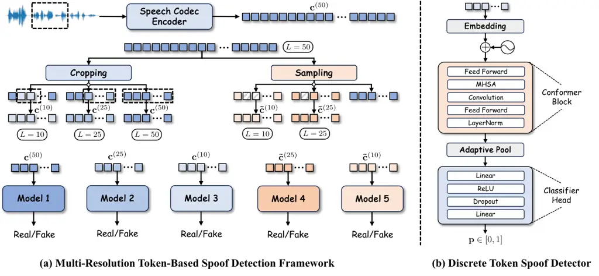

Zhao\* Vu\* Wang

# MSpoofTTS: Multi-Resolution Spoof-Guided Inference for Discrete Speech Synthesis

Junchuan    Minh Duc    Ye

###### Abstract

Neural codec language models enable high-quality discrete speech
synthesis, yet their inference remains vulnerable to token-level
artifacts and distributional drift that degrade perceptual realism.
Rather than relying on preference optimization or retraining, we propose
MSpoof-TTS, a training-free inference framework that improves zero-shot
synthesis through multi-resolution spoof guidance. We introduce a
Multi-Resolution Token-based Spoof Detection framework that evaluates
codec sequences at different temporal granularities to detect locally
inconsistent or unnatural patterns. We then integrate the spoof
detectors into a hierarchical decoding strategy, progressively pruning
low-quality candidates and re-ranking hypotheses. This
discriminator-guided generation enhances robustness without modifying
model parameters. Experiments validate the effectiveness of our
framework for robust and high-quality codec-based speech generation.
Audio samples¹¹ 1
[https://danny-nus.github.io/MSpoofTTS.github.io/](https://danny-nus.github.io/MSpoofTTS.github.io/)
and code²² 2
[https://github.com/Danny-NUS/MSpoofTTS](https://github.com/Danny-NUS/MSpoofTTS)
are available.

###### keywords

speech synthesis, spoof detection, neural codec language models

^(†)^(†)address: ¹ School of Computing, National University of
Singapore, Singapore  
² Department of Statistics & Data Science, National University of
Singapore, Singapore ^(†)^(†)email: junchuan@u.nus.edu,
minhduc.vu@u.nus.edu, dcswangy@nus.edu.sg^(\*)^(\*)footnotetext: These
authors contributed equally to this work.

## 1 Introduction

Neural codec language models have recently become a practical and
effective approach for zero-shot speech synthesis \[1, 2, 3, 4, 5, 6, 7,
8, 9, 10\]. As these systems continue to improve, robustness during
decoding has become an important concern alongside expressiveness and
controllability \[11, 12, 13, 14, 15\], particularly in long-form and
zero-shot generation settings. By modeling speech as sequences of
discrete codec tokens with autoregressive or transformer architectures,
these systems streamline the synthesis pipeline and naturally adopt
scalable decoding strategies from large language models. In practice,
however, generation in the discrete token space can be fragile. Small
inconsistencies at the token level may accumulate during autoregressive
decoding, resulting in audible artifacts, locally unnatural transitions,
or a gradual drift away from natural speech characteristics \[16\].
Since next-token prediction objectives do not explicitly constrain such
behavior, these issues are often difficult to detect or correct during
inference.

To mitigate these decoding instabilities, existing methods generally
fall into two categories. One line of work introduces additional
supervision or reward-driven objectives to better align model outputs
with perceptual or distributional goals \[16, 17, 18, 19, 20\]. For
example, SpeechAlign \[16\] reduces the mismatch between golden and
synthesized codec tokens through preference-based optimization. Building
on similar ideas, \[17\] leverages human feedback signals as training
supervision to improve perceptual quality, while \[18\] integrates
differentiable reward signals directly into the optimization objective
to refine generation behavior. In addition, \[19\] introduces an
auxiliary reverse inference objective to enhance robustness under
distributional shift. Although effective, these approaches often require
retraining, iterative optimization, or carefully curated data, which
increases computational cost and system complexity.

Another line of work focuses on decoding-time adjustments, including
repetition control, alignment constraints, or modified sampling
strategies \[21, 7, 22\]. VALL-E 2 \[21\] introduces repetition-aware
sampling to mitigate degeneration during autoregressive decoding. ELLA-V
\[7\] improves stability by refining decoding strategies under
long-context and zero-shot settings. VALL-E R \[22\] enhances robustness
through inference-time alignment constraints and decoding refinements.
These methods are simple to apply and avoid retraining, but they
primarily target specific failure patterns rather than explicitly
assessing whether the generated token sequence remains globally
consistent or locally natural.

A related idea has been explored in controllable text generation, where
external classifiers are incorporated directly during decoding to guide
model outputs without retraining the base language model \[23, 24\].
Instead of optimizing the generator through reinforcement learning,
these approaches influence generation at inference time by adjusting
token probabilities or re-ranking candidate sequences based on auxiliary
evaluation signals. Such strategies demonstrate that generation behavior
can be steered through an explicit evaluation mechanism applied during
decoding, rather than by modifying model parameters. Motivated by this
perspective, we introduce a spoof detection model as an authenticity
evaluator and integrate it into the decoding process to guide discrete
speech generation.

To this end, spoofed and deepfake speech detection provides a natural
foundation. Detection of synthetic or manipulated speech has been
extensively studied in the continuous audio domain \[25, 26, 27, 28,
29\], with large-scale benchmarks such as the ASVspoof challenge series
\[30, 31, 32, 33\] driving substantial progress in waveform-level
countermeasure design. More recently, codec-based deepfake datasets have
revealed additional challenges introduced by neural codec synthesis
\[34, 35, 36\]. However, existing spoof detection systems are primarily
formulated on reconstructed audio signals and are designed for post-hoc
classification. They do not operate on discrete codec token sequences,
nor are they intended to guide generation during decoding.

Figure 1: Overview of multi-resolution token-based spoof detection
framework. (a) Construction of token sequences at multiple temporal
resolutions for training separate real/fake detectors. (b)
Conformer-based discrete token spoof detector architecture.

Building on this perspective, we propose MSpoof-TTS, a framework that
integrates a separately trained multi-resolution token-level spoof
detector into the decoding process for codec-based speech synthesis,
while keeping the underlying language model fixed. The main
contributions of this work are as follows:

- •
  We extend spoof detection to the token level by introducing a
  multi-resolution authenticity modeling approach tailored to discrete
  codec sequences.
- •
  We develop an inference-time decoding strategy that leverages
  spoof-based authenticity scores for candidate pruning and reranking,
  without retraining the base codec language model.
- •
  We demonstrate consistent improvements in perceptual quality and
  robustness across diverse decoding configurations.

## 2 Method

### 2.1 Overview

(a) Full Utterance

(b) Segment Length = 50

(c) Segment Length = 25

(d) Segment Length = 10

Figure 2: t-SNE visualization of embedding distributions under different
segment lengths.

Pretrained codec-based language models have demonstrated strong
capability in zero-shot speech synthesis by modeling discrete codec
token sequences autoregressively. In this work, we adopt NeuTTS³³ 3
[https://github.com/neuphonic/neutts](https://github.com/neuphonic/neutts)
\[37\], a pretrained codec-based TTS system, as the base generator,
whose parameters remain fixed throughout our framework. While such
models are trained to predict next tokens conditioned on ground-truth
codec sequences, inference relies on previously generated tokens. This
shift introduces a discrepancy between training and decoding, under
which synthesized token sequences may progressively deviate from the
natural codec distribution, as previously observed in \[16\].

Following this approach, token representations are obtained by mean
pooling over the temporal dimension to aggregate token embeddings across
multiple temporal resolutions. As illustrated in Figure 2, we observe a
consistent trend, where the statistical gap between golden and
synthesized codec tokens appears not only at the utterance level but
also across multiple segment lengths, including 50-token, 25-token, and
10-token segments. This indicates that the distribution mismatch
manifests at different temporal resolutions, suggesting that local
token-level deviations accumulate during decoding and contribute to
perceptual degradation.

Rather than modifying the pretrained TTS model to compensate for this
mismatch, we explicitly model the discrepancy through a spoof detection
framework. Specifically, we train discriminators (spoof detection
models) to distinguish the golden (ground-truth) codec sequences from
synthetic ones, using token segments constructed at multiple temporal
scales. The resulting authenticity scores are then incorporated into an
inference-time guidance strategy that evaluates candidate sequences
during decoding. By progressively pruning low-quality candidates and
re-ranking hypotheses based on spoof scores, the proposed framework
steers generation toward more natural and robust outputs without
altering the underlying codec language model.

### 2.2 Multi-Resolution Token-Level Spoof Detection

To explicitly model the distribution gap between golden and synthesized
codec tokens, we propose a multi-resolution token-level spoof detection
framework as illustrated in Figure 1. Given an utterance-level codec
sequence $`\mathbf{c}=\{c_{1},\dots,c_{T}\}`$, we construct token
segments using two complementary resolution strategies to expose
discrepancies across temporal and structural scales.

We first vary the temporal span by extracting contiguous subsequences
with lengths $`L\in\{10,25,50\}`$. Short segments emphasize fine-grained
and local transition dynamics, whereas longer segments capture broader
contextual coherence and higher-level structural dependencies. Modeling
multiple segment lengths enables the detector to approximate
distributional characteristics across diverse temporal horizons.

In addition, inspired by multi-scale discriminators in neural vocoders
\[38, 39\], we introduce a resolution-based skip sampling strategy with
downsampling rates $`r\in\{1,2,5\}`$. When $`r=1`$, the sequence remains
at its native resolution, corresponding to the full 50-token span.
Larger $`r`$ values subsample the sequence to form coarser token
representations, encouraging the detector to uncover structural
inconsistencies that may not be evident at the original granularity.
While temporal cropping enhances coverage across time spans, skip
sampling perturbs token resolution to probe structural regularity from a
complementary perspective.

Each token segment is processed by an embedding layer followed by
stacked Conformer \[40\] blocks to jointly capture local correlations
and long-range dependencies. The resulting sequence representation is
aggregated via adaptive pooling and passed to a lightweight classifier
to predict the probability of the segment being real or synthetic. The
detector is trained with the binary cross-entropy (BCE) objective and
optimized independently of the TTS backbone. The architecture is shared
across all resolution settings, while parameters are learned separately
for each configuration. Specifically, we train five models:
$`\mathcal{M}_{50}`$, $`\mathcal{M}_{25}`$, and $`\mathcal{M}_{10}`$ for
contiguous cropping with segment lengths $`L=50,25,10`$, respectively,
and $`\mathcal{M}_{50\leftarrow 25}`$ and
$`\mathcal{M}_{50\leftarrow 10}`$ for skip-sampled variants obtained by
downsampling 50-token segments with rates $`r=2`$ and $`r=5`$,
respectively.

1: Text $`x`$, pre-trained AR model $`\theta_{AR}`$, prefix $`c_{<t}`$;
top-$`p`$ threshold $`v`$, cluster size $`k_{e}`$, memory window size
$`W`$; $`\alpha,\beta,\gamma`$

2: Generated tokens $`c_{1:T}`$

3: $`\mathcal{M}\leftarrow\emptyset`$

4: for $`t=1,2,\dots,T`$ do

5:   $`\mathbf{s}_{t}\leftarrow p(\cdot\mid x,c_{<t};\theta_{AR})`$

6:   for all $`(i,r,a)\in\mathcal{M}`$ do

7:
   $`\pi_{t}(j)\leftarrow\min(\gamma,\;\sum_{(i,r,a)\in\mathcal{M},\ i=j}\alpha\cdot\frac{1}{1+r}\cdot\beta^{a})`$

8:   end for

9:
  $`\mathbf{s}^{\prime}_{t}\leftarrow\mathbf{s}_{t}-\boldsymbol{\pi}_{t}`$

10:
  $`c_{t}\leftarrow\mathrm{NucleusSample}(\mathbf{s}^{\prime}_{t};\,v)`$

11:
  $`\mathcal{M}\leftarrow\{(i,r,a+1):(i,r,a)\in\mathcal{M},\ a+1\leq W\}`$

12:
  $`\mathcal{K}_{t}\leftarrow\mathrm{TopK}(\mathbf{s}^{\prime}_{t},k_{e})\cup\{c_{t}\}`$

13:   for $`r=1,\cdots,|\mathcal{K}_{t}|`$ do

14:
   $`\mathcal{M}\leftarrow\mathcal{M}\cup\{(\mathcal{K}_{t}[r],r,0)\}`$

15:   end for

16:   $`c_{<t+1}\leftarrow c_{<t}\cup\{c_{t}\}`$

17: end for

Algorithm 1 Entropy-Aware Sampling (EAS)

1: $`x`$, $`\theta_{AR}`$; discriminators
$`\mathcal{M}_{10},\mathcal{M}_{25},\mathcal{M}_{50}`$;
$`\mathcal{M}_{50\leftarrow 25},\mathcal{M}_{50\leftarrow 10}`$; warmup
lengths $`L_{w}`$; stage lengths $`(L_{1},L_{2},L_{3})`$; beams
$`(B_{0},B_{1},B_{2})`$; max length $`L_{\max}`$; rank weights
$`(w_{50},w_{25},w_{10})`$

2: $`y`$

3: $`y\leftarrow x`$

4: // Warmup using EAS

5: $`y\leftarrow y\cup\mathrm{EAS}(y,L_{w};\theta_{AR})`$

6: while $`|y|<L_{\max}`$ do

7: // Stage 1: generate $`B_{0}`$ candidates up to $`L_{1}`$

8:
  $`\mathbf{B}\leftarrow\{\,\mathrm{EAS}(y,L_{1};\theta_{AR})\,\}_{b=1}^{B_{0}}`$

9: // Prune to top $`B_{1}`$ by $`\mathcal{M}_{10}`$

10:   for all $`b_{i}\in\mathbf{B}`$ do

11:    $`s_{i}\leftarrow\mathcal{M}_{10}(b_{i})`$

12:   end for

13:   Keep top $`B_{1}`$ beams ranked by $`s_{i}`$

14: // Stage 2: extend remaining beams to $`L_{2}`$

15:   for all $`b_{i}\in\mathbf{B}`$ do

16:
   $`b_{i}\leftarrow b_{i}\cup\mathrm{EAS}(b_{i},L_{2}-L_{1};\theta_{AR})`$

17:   end for

18: // Prune to top $`B_{2}`$ by $`\mathcal{M}_{25}`$

19:   for all $`b_{i}\in\mathbf{B}`$ do

20:    $`s_{i}\leftarrow\mathcal{M}_{25}(b_{i})`$

21:   end for

22:   Keep top $`B_{2}`$ beams ranked by $`s_{i}`$

23: // Stage 3: extend to $`L_{3}`$

24:   for all $`b_{i}\in\mathbf{B}`$ do

25:
   $`b_{i}\leftarrow b_{i}\cup\mathrm{EAS}(b_{i},L_{3}-L_{2};\theta_{AR})`$

26:   end for

27: // Rank aggregation for final selection

28:   for all $`b_{i}\in\mathbf{B}`$ do

29:    $`s_{50}[i]\leftarrow\mathcal{M}_{50}(b_{i})`$

30:    $`s_{25}[i]\leftarrow\mathcal{M}_{50\leftarrow 25}(b_{i})`$

31:    $`s_{10}[i]\leftarrow\mathcal{M}_{50\leftarrow 10}(b_{i})`$

32:   end for

33:
  $`\mathbf{r}_{50},\mathbf{r}_{25},\mathbf{r}_{10}\leftarrow\mathrm{Rank}(\mathbf{s}_{50},\mathbf{s}_{25},\mathbf{s}_{10})`$

34:   $`R[i]\leftarrow w_{50}r_{50}[i]+w_{25}r_{25}[i]+w_{10}r_{10}[i]`$

35:   $`b^{\star}\leftarrow\arg\min_{i}R[i]`$

36:   $`y\leftarrow y\cup b^{\star}`$

37: end whilereturn $`y`$

Algorithm 2 Hierarchical Sampling with Progressive Discriminator Pruning

### 2.3 Hierarchical Spoof-Guided Sampling

To improve the decoding robustness of autoregressive codec language
models, we propose a hierarchical spoof-guided sampling framework that
integrates Entropy-Aware Sampling (EAS) with the multi-resolution
token-level spoof detection introduced in Section 2.2. We first adopt
Entropy-Aware Sampling (EAS), shown in Algorithm 1, as the base decoding
strategy. EAS is adapted from repetition-aware sampling (RAS) proposed
in VALL-E 2 \[21\], which penalizes recently generated tokens to
mitigate looping behavior. However, conventional RAS relies on heuristic
repetition counting and may over-suppress high-probability tokens,
resulting in unstable decoding or excessive randomness. In contrast, EAS
maintains a memory buffer that records competitive candidate tokens
along with their rank positions and temporal age. The token-level
penalty is modulated by inverse rank weighting and exponential temporal
decay, with a clipping mechanism to prevent over-penalization. The
adjusted distribution is then used for nucleus sampling, introducing
entropy regularization while preserving distributional diversity.

Building upon EAS, we introduce a hierarchical spoof-guided pruning
strategy, summarized in Algorithm 2. After generating an initial warmup
segment of length $`L_{w}`$ to stabilize early decoding, the algorithm
proceeds iteratively. At each iteration, $`B_{0}`$ candidate
continuations are generated from the current prefix using EAS up to
length $`L_{1}`$. These candidates are evaluated by the short-span
discriminator $`\mathcal{M}_{10}`$, and only the top $`B_{1}`$ beams are
retained. The remaining beams are then extended to length $`L_{2}`$
using EAS and pruned by the mid-range discriminator $`\mathcal{M}_{25}`$
to keep the top $`B_{2}`$ candidates. Finally, the surviving beams are
extended to length $`L_{3}`$, forming complete candidate segments.

For final selection, we perform multi-resolution rank aggregation rather
than relying on a single discriminator score. Each candidate segment is
evaluated by the long-span discriminator $`\mathcal{M}_{50}`$ and its
sampled variants $`\mathcal{M}_{50\leftarrow 25}`$ and
$`\mathcal{M}_{50\leftarrow 10}`$. The ranking positions across
resolutions are combined using weighted aggregation, and the candidate
with the best aggregated score is appended to the decoded sequence. This
procedure repeats until reaching the maximum decoding length. The
proposed coarse-to-fine, multi-resolution pruning improves decoding
stability and structural consistency without modifying or retraining the
AR backbone.

## 3 Experiments

### 3.1 Datasets

For spoof detection training, we use the LibriTTS \[41\] training split
(approximately 100 hours of clean read English speech). LibriTTS is a
multi-speaker corpus with careful segmentation and noise filtering. For
each ground-truth utterance, we generate three synthetic counterparts
using the same transcript but a different reference utterance from the
same speaker under the default inference scheme. All real and synthetic
waveforms are converted into discrete token sequences using the default
speech tokenizer (NeuCodec).

For evaluation, experiments are conducted on both LibriSpeech \[42\] and
LibriTTS (test split), which provide diverse speakers and clean
TTS-style speech, respectively. These datasets enable evaluation under
standard speech conditions using WER, speaker similarity, and perceptual
quality metrics. To further assess robustness under challenging phonetic
patterns, we additionally evaluate on the TwistList benchmark \[43\],
which consists of linguistically constructed tongue twisters
characterized by dense alliteration and repetitive phoneme patterns. We
use the official test split and synthesize speech using the same
conditioning and decoding pipeline as in the standard evaluation.

### 3.2 Implementation Details

The spoof detection models use $`d_{\text{model}}=256`$, 8 attention
heads, 4 Transformer layers, and a feedforward dimension of 1024, with
dropout set to 0.1. The discriminator is trained with AdamW using a
learning rate of $`1\times 10^{-4}`$ and weight decay of
$`1\times 10^{-4}`$ on a single NVIDIA L40S GPU. For decoding, the
default baseline adopts top-$`k`$ sampling with $`k=50`$ and temperature
1.0. Repetition-Aware Sampling (RAS) uses top-$`k=50`$, top-$`p=0.8`$,
window size $`W=25`$, and repetition penalty $`\tau_{r}=0.1`$.
Entropy-Aware Sampling (EAS) follows Algorithm 1 with cluster size
$`k_{e}=3`$, memory window $`W=15`$, and hyperparameters $`\alpha=0.2`$,
$`\beta=0.7`$, and $`\gamma=0.8`$, while using top-$`p=0.8`$,
top-$`k=50`$, and temperature 1.0. Hierarchical decoding follows
Algorithm 2 with warm-up length $`L_{w}=20`$, stage lengths
$`(L_{1},L_{2},L_{3})=(10,25,50)`$, and beam sizes
$`(B_{0},B_{1},B_{2})=(8,5,3)`$. Ranking weights
$`(w_{50},w_{25},w_{10})`$ are set equally. Hierarchical RAS and EAS
inherit the corresponding sampling hyperparameters.

### 3.3 Evaluation Metrics

For objective evaluation, we report ASR-based intelligibility, speaker
similarity, perceptual quality, and spoof detection performance.
Intelligibility is measured using Word Error Rate (WER), computed with
Whisper-large-v3 \[44\]⁴⁴ 4
[https://huggingface.co/openai/whisper-large-v3](https://huggingface.co/openai/whisper-large-v3)
for all decoding schemes. Speaker similarity is evaluated using the
WavLM \[45\]⁵⁵ 5
[https://huggingface.co/microsoft/wavlm-base-plus-sv](https://huggingface.co/microsoft/wavlm-base-plus-sv)
model by computing cosine similarity between L2-normalized embeddings of
the generated utterance and another real utterance from the same
speaker. Perceptual quality is assessed using neural MOS estimators,
including NISQA \[46\] and MOSNet \[47\], both reflecting overall speech
quality.

For spoof detection evaluation, we report Accuracy, Macro-F1 (threshold
= 0.5), and AUROC. As the spoof detiection models is primarily used for
ranking candidate token sequences, AUROC is considered the main
indicator of discriminative capability. In addition, subjective
evaluation is conducted using mean opinion scores for naturalness
(MOS-N), quality (MOS-Q), and speaker similarity (SMOS). 15 participants
rate audio samples from different inference methods on a 1–5 scale,
where higher scores indicate better perceptual quality.

## 4 Results

|                  |                    |                  |                    |                     |                    |                  |                    |                     |
| ---------------- | ------------------ | ---------------- | ------------------ | ------------------- | ------------------ | ---------------- | ------------------ | ------------------- |
|                  | LibriSpeech        |                  |                    |                     | LibriTTS           |                  |                    |                     |
| Inference Scheme | WER $`\downarrow`$ | SIM $`\uparrow`$ | NISQA $`\uparrow`$ | MOSNET $`\uparrow`$ | WER $`\downarrow`$ | SIM $`\uparrow`$ | NISQA $`\uparrow`$ | MOSNET $`\uparrow`$ |
| Ground Truth     | 0.0337             | 0.915            | 4.620              | 4.5259              | 0.0430             | 0.904            | 4.593              | 4.4766              |
| Original         | 0.0694             | 0.894            | 4.462              | 4.3418              | 0.0715             | 0.872            | 4.397              | 4.1879              |
| RAS              | 0.0641             | 0.905            | 4.553              | 4.2772              | 0.0657             | 0.880            | 4.425              | 4.2565              |
| EAS              | 0.0576             | 0.902            | 4.571              | 4.3298              | 0.0672             | 0.883            | 4.408              | 4.1937              |
| HierRAS          | 0.0591             | 0.902            | 4.596              | 4.3486              | 0.0628             | 0.886            | 4.520              | 4.3277              |
| HierEAS          | 0.0532             | 0.901            | 4.602              | 4.4158              | 0.0633             | 0.883            | 4.562              | 4.3409              |

Table 1: Objective evaluation on LibriTTS and LibriSpeech. HierEAS
(MSpoofTTS) uses Hierarchical Spoof-Guided Sampling with EAS, while
HierRAS replaces EAS with RAS under the same framework. Original refers
to the vanilla top-k sampling method. The best results are highlighted
in bold, and the second-best results are underlined.

### 4.1 Evaluation on Standard Benchmarks

We compare several inference strategies, including the default top-k
sampling decoder (Original), repetition-aware sampling (RAS),
entropy-aware sampling (EAS), and their hierarchical extensions (HierRAS
and HierEAS). HierRAS and HierEAS integrate the proposed hierarchical
spoof-guided sampling framework with RAS and EAS, respectively, with
HierEAS corresponding to the proposed MSpoofTTS method.

As shown in Table 1, both EAS and RAS consistently outperform the
original top-k sampling baseline across LibriSpeech and LibriTTS,
confirming that entropy- and repetition-aware decoding mitigates
degeneration and improves token-level selection. Incorporating
hierarchical spoof-guided ranking yields further improvements in most
settings. Notably, hierarchical variants demonstrate more consistent
gains in perceptual quality metrics, including NISQA and MOSNET, across
both datasets. These results suggest that multi-resolution discriminator
guidance enhances structural consistency beyond local decoding
refinements.

In contrast, improvements in WER and SIM are comparatively modest. Given
the already strong lexical accuracy and speaker consistency of the
baseline decoder, substantial gains in these metrics are naturally
limited. Importantly, hierarchical sampling preserves competitive WER
and SIM performance while improving perceptual quality, indicating that
discriminator-guided ranking enhances generation quality without
compromising intelligibility or speaker identity. Overall, HierEAS
(MSpoofTTS) achieves the best or second-best performance across most
metrics and datasets, supporting the effectiveness of the proposed
method.

### 4.2 Evaluation under Challenging Conditions

| Methods  | WER $`\downarrow`$ | SIM $`\uparrow`$ | NISQA $`\uparrow`$ | MOSNET $`\uparrow`$ |
| -------- | ------------------ | ---------------- | ------------------ | ------------------- |
| Original | 0.1654             | 0.871            | 4.459              | 3.8692              |
| RAS      | 0.1572             | 0.820            | 4.477              | 3.8754              |
| EAS      | 0.1433             | 0.876            | 4.465              | 3.9265              |
| HierRAS  | 0.1702             | 0.802            | 4.496              | 3.9566              |
| HierEAS  | 0.1531             | 0.877            | 4.513              | 3.9802              |

Table 2: Objective evaluation on TwistList test set.

Table 2 reports results on the TwistList test set, which consists of
phonetically dense tongue-twister utterances and serves as a stress test
for decoding robustness. As expected, WER values are higher across all
methods compared to standard benchmarks, reflecting the increased
difficulty of this dataset.

The overall trend aligns with observations on LibriTTS and LibriSpeech:
entropy- and repetition-aware decoding (EAS and RAS) consistently
outperform the original top-k sampling baseline in most metrics. In
particular, EAS achieves the lowest WER on TwistList, slightly
surpassing RAS, suggesting that entropy-aware regularization better
balances repetition control with legitimate phonetic recurrence under
challenging conditions. While hierarchical variants do not always obtain
the lowest WER in this setting, HierEAS maintains competitive
intelligibility and achieves the best perceptual quality scores in both
NISQA and MOSNET. Notably, the relative increase in WER remains
moderate, indicating that the proposed method preserves lexical accuracy
even under highly constrained phonetic structures.

### 4.3 Subjective Listening Tests

Figure 3: Subjective evaluation of different inference strategies
measured by MOS-N (naturalness), MOS-Q (quality), and SMOS (similarity).

We conduct a subjective evaluation across different inference
strategies, reporting MOS-N, MOS-Q, and SMOS to measure naturalness,
overall speech quality, and speaker similarity, respectively. As shown
in Figure 3, hierarchical spoof-guided decoding consistently achieves
higher perceptual scores than the baseline methods. In particular, the
hierarchical variants (HierRAS and HierEAS) demonstrate clear
improvements in naturalness (MOS-N) over their non-hierarchical
counterparts, suggesting that spoof-aware hierarchical decoding helps
mitigate unnatural token patterns during generation. Similar trends are
observed for overall quality (MOS-Q), where the hierarchical strategies
achieve slightly higher scores, although the improvement remains modest.
For speaker similarity (SMOS), all methods maintain consistently high
scores. Although our approach does not obtain the highest SMOS, the
results indicate that the proposed inference strategy preserves speaker
identity while improving perceptual naturalness and quality.

### 4.4 Analysis of the Multi-Resolution Spoof Detectors

| Model   | Resolution          | AUC    | Acc    | Macro-F1 |
| ------- | ------------------- | ------ | ------ | -------- |
| Model 1 | 50                  | 0.9199 | 0.8616 | 0.8180   |
| Model 2 | 25                  | 0.8298 | 0.8034 | 0.6892   |
| Model 3 | 10                  | 0.6842 | 0.7506 | 0.5336   |
| Model 4 | 50$`\rightarrow`$25 | 0.8346 | 0.7935 | 0.5973   |
| Model 5 | 50$`\rightarrow`$10 | 0.6914 | 0.7456 | 0.5952   |

Table 3: Evaluation of the multi-resolution spoof detection models on
the LibriTTS test-clean split.

Table 3 reports the performance of the five multi-resolution spoof
detection models on LibriTTS test-clean. A clear dependence on temporal
context length is observed: the full-resolution discriminator with
$`L=50`$ achieves the strongest performance, indicating that longer
token sequences provide richer structural cues for distinguishing real
from synthetic speech.

Although performance declines for shorter segments ($`L=25`$ and
$`L=10`$), they retain meaningful discriminative capability, suggesting
that local token-level irregularities remain detectable. The strided
variants derived from $`L=50`$ maintain moderate ranking ability,
indicating that structural signals persist under resolution
perturbation. These results highlight complementary roles across
temporal scales and provide empirical support for the hierarchical
multi-resolution ranking strategy adopted in our inference framework.

## 5 Conclusion

We present MSpoofTTS, a training-free framework that improves discrete
speech synthesis through hierarchical spoof-guided inference. We use
multi-resolution spoof detectors to guide decoding and suppress locally
inconsistent codec token patterns, without modifying the pretrained
speech language model. Experiments on LibriTTS and LibriSpeech show
consistent improvements in perceptual quality while maintaining
competitive intelligibility and speaker similarity. Evaluation on the
challenging TwistList dataset further demonstrates robustness under
highly repetitive phonetic structures. Subjective listening tests show
improved perceptual naturalness without degrading speaker identity,
supporting spoof-guided inference as an effective approach to enhancing
neural codec-based speech generation.

## References

- \[1\] X. Tan, J. Chen, H. Liu, J. Cong, C. Zhang, Y. Liu, X. Wang, Y.
  Leng, Y. Yi, L. He, et al. (2024) Naturalspeech: end-to-end
  text-to-speech synthesis with human-level quality. IEEE Transactions
  on Pattern Analysis and Machine Intelligence 46 (6), pp. 4234–4245.
  External Links:
  [Document](https://dx.doi.org/10.1109/TPAMI.2024.3356232) Cited by:
  §1.
- \[2\] Z. Ju, Y. Wang, K. Shen, X. Tan, D. Xin, D. Yang, Y. Liu, Y.
  Leng, K. Song, S. Tang, et al. (2024) NaturalSpeech 3: zero-shot
  speech synthesis with factorized codec and diffusion models. In
  International Conference on Machine Learning, ICML 2024, Vol. 235,
  pp. 22605–22623. Cited by: §1.
- \[3\] Z. Du, Q. Chen, S. Zhang, K. Hu, H. Lu, Y. Yang, H. Hu, S.
  Zheng, Y. Gu, Z. Ma, et al. (2024) Cosyvoice: a scalable multilingual
  zero-shot text-to-speech synthesizer based on supervised semantic
  tokens. arXiv preprint arXiv:2407.05407. Cited by: §1.
- \[4\] Z. Ye, X. Zhu, C. Chan, X. Wang, X. Tan, J. Lei, Y. Peng, H.
  Liu, Y. Jin, Z. Dai, et al. (2025) Llasa: scaling train-time and
  inference-time compute for llama-based speech synthesis. arXiv
  preprint arXiv:2502.04128. Cited by: §1.
- \[5\] L. Meng, L. Zhou, S. Liu, S. Chen, B. Han, S. Hu, Y. Liu, J.
  Li, S. Zhao, X. Wu, et al. (2025) Autoregressive speech synthesis
  without vector quantization. In Proceedings of the 63rd Annual Meeting
  of the Association for Computational Linguistics (Volume 1: Long
  Papers), pp. 1287–1300. Cited by: §1.
- \[6\] Y. Wang, H. Zhan, L. Liu, R. Zeng, H. Guo, J. Zheng, Q.
  Zhang, X. Zhang, S. Zhang, and Z. Wu (2025) MaskGCT: zero-shot
  text-to-speech with masked generative codec transformer. In The
  Thirteenth International Conference on Learning Representations, Cited
  by: §1.
- \[7\] Y. Song, Z. Chen, X. Wang, Z. Ma, and X. Chen (2025) Ella-v:
  stable neural codec language modeling with alignment-guided sequence
  reordering. In Proceedings of the AAAI Conference on Artificial
  Intelligence, Vol. 39, pp. 25174–25182. External Links:
  [Document](https://dx.doi.org/10.1609/AAAI.V39I24.34703) Cited by: §1,
  §1.
- \[8\] Y. Chen, Z. Niu, Z. Ma, K. Deng, C. Wang, J. JianZhao, K. Yu,
  and X. Chen (2025) F5-tts: a fairytaler that fakes fluent and faithful
  speech with flow matching. In Proceedings of the 63rd Annual Meeting
  of the Association for Computational Linguistics (Volume 1: Long
  Papers), pp. 6255–6271. Cited by: §1.
- \[9\] J. Zhao, X. Wang, and Y. Wang (2025) Prosody-adaptable audio
  codecs for zero-shot voice conversion via in-context learning. In
  Interspeech 2025, pp. 4893–4897. External Links:
  [Document](https://dx.doi.org/10.21437/INTERSPEECH.2025-464) Cited by:
  §1.
- \[10\] Q. Liang, Y. Liu, R. Wei, N. Lu, J. Zhao, and Y. Wang (2026)
  Segment-aware conditioning for training-free intra-utterance emotion
  and duration control in text-to-speech. arXiv preprint
  arXiv:2601.03170. Cited by: §1.
- \[11\] T. Xie, Y. Rong, P. Zhang, W. Wang, and L. Liu (2025) Towards
  controllable speech synthesis in the era of large language models: a
  systematic survey. In Proceedings of the 2025 Conference on Empirical
  Methods in Natural Language Processing, pp. 764–791. Cited by: §1.
- \[12\] H. Choi, S. Lee, and S. Lee (2025) Personalized and
  controllable voice style transfer with speech diffusion transformer.
  IEEE Transactions on Audio, Speech and Language Processing 33,
  pp. 922–934. Cited by: §1.
- \[13\] J. Zhao, L. Q. H. Chetwin, and Y. Wang (2024) Sintechsvs: a
  singing technique controllable singing voice synthesis system.
  IEEE/ACM Transactions on Audio, Speech, and Language Processing 32,
  pp. 2641–2653. Cited by: §1.
- \[14\] S. Alwaisi and G. Németh (2024) Advancements in expressive
  speech synthesis: a review. INFOCOMMUNICATIONS JOURNAL: A PUBLICATION
  OF THE SCIENTIFIC ASSOCIATION FOR INFOCOMMUNICATIONS (HTE) 16 (1),
  pp. 35–46. Cited by: §1.
- \[15\] J. Zhao, C. Low, and Y. Wang (2025) Spsinger: multi-singer
  singing voice synthesis with short reference prompt. In ICASSP
  2025-2025 IEEE International Conference on Acoustics, Speech and
  Signal Processing (ICASSP), pp. 1–5. Cited by: §1.
- \[16\] D. Zhang, Z. Li, S. Li, X. Zhang, P. Wang, Y. Zhou, and X.
  Qiu (2024) Speechalign: aligning speech generation to human
  preferences. Advances in Neural Information Processing Systems 37,
  pp. 50343–50360. Cited by: §1, §1, §2.1.
- \[17\] Y. Hu, C. Chen, S. Wang, E. S. Chng, and C. Zhang (2024) Robust
  zero-shot text-to-speech synthesis with reverse inference
  optimization. arXiv preprint arXiv:2407.02243. Cited by: §1.
- \[18\] C. Gao, Z. Du, and S. Zhang (2025) Differentiable reward
  optimization for llm based tts system. In Interspeech 2025,
  pp. 2450–2454. External Links:
  [Document](https://dx.doi.org/10.21437/INTERSPEECH.2025-704) Cited by:
  §1.
- \[19\] C. Chen, Y. Hu, W. Wu, H. Wang, E. S. Chng, and C. Zhang (2024)
  Enhancing zero-shot text-to-speech synthesis with human feedback.
  arXiv preprint arXiv:2406.00654. Cited by: §1.
- \[20\] J. Zhao, W. Zeng, T. Lyu, and Y. Wang (2026) Comelsinger:
  discrete token-based zero-shot singing synthesis with structured
  melody control and guidance. IEEE Transactions on Audio, Speech and
  Language Processing. External Links:
  [Document](https://dx.doi.org/10.1109/TASLPRO.2026.3664643) Cited by:
  §1.
- \[21\] S. Chen, S. Liu, L. Zhou, Y. Liu, X. Tan, J. Li, S. Zhao, Y.
  Qian, and F. Wei (2024) Vall-e 2: neural codec language models are
  human parity zero-shot text to speech synthesizers. arXiv preprint
  arXiv:2406.05370. Cited by: §1, §2.3.
- \[22\] B. Han, L. Zhou, S. Liu, S. Chen, L. Meng, Y. Qian, Y. Liu, S.
  Zhao, J. Li, and F. Wei (2024) Vall-e r: robust and efficient
  zero-shot text-to-speech synthesis via monotonic alignment. arXiv
  preprint arXiv:2406.07855. Cited by: §1.
- \[23\] A. Liu, M. Sap, X. Lu, S. Swayamdipta, C. Bhagavatula, N. A.
  Smith, and Y. Choi (2021) DExperts: decoding-time controlled text
  generation with experts and anti-experts. In Proceedings of the 59th
  Annual Meeting of the Association for Computational Linguistics and
  the 11th International Joint Conference on Natural Language Processing
  (Volume 1: Long Papers), pp. 6691–6706. Cited by: §1.
- \[24\] S. Dathathri, A. Madotto, J. Lan, J. Hung, E. Frank, P.
  Molino, J. Yosinski, and R. Liu (2020) Plug and play language models:
  a simple approach to controlled text generation. In The Eighth
  International Conference on Learning Representations, Cited by: §1.
- \[25\] J. Sanchez, I. Saratxaga, I. Hernaez, E. Navas, D. Erro, and T.
  Raitio (2015) Toward a universal synthetic speech spoofing detection
  using phase information. IEEE Transactions on Information Forensics
  and Security 10 (4), pp. 810–820. External Links:
  [Document](https://dx.doi.org/10.1109/TIFS.2015.2398812) Cited by: §1.
- \[26\] Y. Zhang, F. Jiang, and Z. Duan (2021) One-class learning
  towards synthetic voice spoofing detection. IEEE Signal Processing
  Letters 28, pp. 937–941. External Links:
  [Document](https://dx.doi.org/10.1109/LSP.2021.3076358) Cited by: §1.
- \[27\] L. Wang, L. Yu, Y. Zhang, and H. Xie (2024) Generalizable
  speech spoofing detection against silence trimming with data
  augmentation and multi-task meta-learning. IEEE/ACM Transactions on
  Audio, Speech, and Language Processing 32, pp. 3296–3310. External
  Links: [Document](https://dx.doi.org/10.1109/TASLP.2024.3414340) Cited
  by: §1.
- \[28\] J. Sun, X. Deng, S. Liu, X. Fan, Y. Huang, Y. He, C. Wu, and J.
  Park (2025) Contrastive learning-based speech spoofing detection for
  multimedia security in edge intelligence. ACM Transactions on
  Multimedia Computing, Communications and Applications 21 (8),
  pp. 1–21. External Links:
  [Document](https://dx.doi.org/10.1145/3698773) Cited by: §1.
- \[29\] A. Javed, K. M. Malik, H. Malik, and A. Irtaza (2022) Voice
  spoofing detector: a unified anti-spoofing framework. Expert Systems
  with Applications 198, pp. 116770. External Links:
  [Document](https://dx.doi.org/10.1016/J.ESWA.2022.116770) Cited by:
  §1.
- \[30\] Z. Wu, J. Yamagishi, T. Kinnunen, C. Hanilçi, M. Sahidullah, A.
  Sizov, N. Evans, M. Todisco, and H. Delgado (2017) ASVspoof: the
  automatic speaker verification spoofing and countermeasures challenge.
  IEEE Journal of Selected Topics in Signal Processing 11 (4),
  pp. 588–604. External Links:
  [Document](https://dx.doi.org/10.1109/JSTSP.2017.2671435) Cited by:
  §1.
- \[31\] M. Todisco, X. Wang, V. Vestman, M. Sahidullah, H. Delgado, A.
  Nautsch, J. Yamagishi, N. Evans, T. Kinnunen, and K. A. Lee (2019)
  ASVspoof 2019: future horizons in spoofed and fake audio detection. In
  Interspeech 2019, pp. 1008–1012. Cited by: §1.
- \[32\] X. Liu, X. Wang, M. Sahidullah, J. Patino, H. Delgado, T.
  Kinnunen, M. Todisco, J. Yamagishi, N. Evans, A. Nautsch, and K. A.
  Lee (2023) ASVspoof 2021: towards spoofed and deepfake speech
  detection in the wild. IEEE/ACM Transactions on Audio, Speech and
  Language Processing 31, pp. 2507–2522. External Links: ISSN 2329-9290,
  [Document](https://dx.doi.org/10.1109/TASLP.2023.3285283) Cited by:
  §1.
- \[33\] X. Wang, H. Delgado, H. Tak, J. Jung, H. Shim, M. Todisco, I.
  Kukanov, X. Liu, M. Sahidullah, T. H. Kinnunen, N. Evans, K. A. Lee,
  and J. Yamagishi (2024) ASVspoof 5: crowdsourced speech data,
  deepfakes, and adversarial attacks at scale. In The Automatic Speaker
  Verification Spoofing Countermeasures Workshop (ASVspoof 2024),
  pp. 1–8. External Links:
  [Document](https://dx.doi.org/10.21437/ASVspoof.2024-1) Cited by: §1.
- \[34\] H. Wu, Y. Tseng, and H. Lee (2024) CodecFake: enhancing
  anti-spoofing models against deepfake audios from codec-based speech
  synthesis systems. In Interspeech 2024, pp. 1770–1774. External Links:
  [Document](https://dx.doi.org/10.21437/INTERSPEECH.2024-2093) Cited
  by: §1.
- \[35\] X. Chen, J. Du, H. Wu, L. Zhang, I. Lin, I. Chiu, W. Ren, Y.
  Tseng, Y. Tsao, J. R. Jang, et al. (2025) Codecfake+: a large-scale
  neural audio codec-based deepfake speech dataset. arXiv preprint
  arXiv:2501.08238. Cited by: §1.
- \[36\] J. Du, X. Chen, H. Wu, L. Zhang, I. Lin, I. Chiu, W. Ren, Y.
  Tseng, Y. Tsao, J. R. Jang, et al. (2025) Codecfake-omni: a
  large-scale codec-based deepfake speech dataset. arXiv e-prints,
  pp. arXiv–2501. Cited by: §1.
- \[37\] H. Julian, R. Beeson, L. Konathala, J. Ulin, and J. Gao (2025)
  Finite scalar quantization enables redundant and transmission-robust
  neural audio compression at low bit-rates. arXiv preprint
  arXiv:2509.09550. Cited by: §2.1.
- \[38\] J. Kong, J. Kim, and J. Bae (2020) Hifi-gan: generative
  adversarial networks for efficient and high fidelity speech synthesis.
  Advances in neural information processing systems 33, pp. 17022–17033.
  Cited by: §2.2.
- \[39\] S. Lee, W. Ping, B. Ginsburg, B. Catanzaro, and S. Yoon (2023)
  BigVGAN: a universal neural vocoder with large-scale training. In The
  Eleventh International Conference on Learning Representations, Cited
  by: §2.2.
- \[40\] A. Gulati, J. Qin, C. Chiu, N. Parmar, Y. Zhang, J. Yu, W.
  Han, S. Wang, Z. Zhang, Y. Wu, et al. (2020) Conformer:
  convolution-augmented transformer for speech recognition. In
  Interspeech 2020, pp. 5036–5040. External Links:
  [Document](https://dx.doi.org/10.21437/INTERSPEECH.2020-3015) Cited
  by: §2.2.
- \[41\] H. Zen, V. Dang, R. Clark, Y. Zhang, R. J. Weiss, Y. Jia, Z.
  Chen, and Y. Wu (2019) LibriTTS: a corpus derived from librispeech for
  text-to-speech. In Interspeech 2019, pp. 1526–1530. External Links:
  [Document](https://dx.doi.org/10.21437/INTERSPEECH.2019-2441) Cited
  by: §3.1.
- \[42\] V. Panayotov, G. Chen, D. Povey, and S. Khudanpur (2015)
  Librispeech: an asr corpus based on public domain audio books. In 2015
  IEEE international conference on acoustics, speech and signal
  processing (ICASSP), pp. 5206–5210. External Links:
  [Document](https://dx.doi.org/10.1109/ICASSP.2015.7178964) Cited by:
  §3.1.
- \[43\] T. Loakman, C. Tang, and C. Lin (2023) TwistList: resources and
  baselines for tongue twister generation. In Proceedings of the 61st
  Annual Meeting of the Association for Computational Linguistics
  (Volume 2: Short Papers), pp. 579–589. External Links:
  [Document](https://dx.doi.org/10.18653/v1/2023.acl-short.51) Cited by:
  §3.1.
- \[44\] A. Radford, J. W. Kim, T. Xu, G. Brockman, C. McLeavey, and I.
  Sutskever (2023) Robust speech recognition via large-scale weak
  supervision. In International Conference on Machine Learning, ICML
  2023, pp. 28492–28518. Cited by: §3.3.
- \[45\] S. Chen, C. Wang, Z. Chen, Y. Wu, S. Liu, Z. Chen, J. Li, N.
  Kanda, T. Yoshioka, X. Xiao, et al. (2022) Wavlm: large-scale
  self-supervised pre-training for full stack speech processing. IEEE
  Journal of Selected Topics in Signal Processing 16 (6), pp. 1505–1518.
  External Links:
  [Document](https://dx.doi.org/10.1109/JSTSP.2022.3188113) Cited by:
  §3.3.
- \[46\] G. Mittag, B. Naderi, A. Chehadi, and S. Möller (2021) NISQA: a
  deep cnn-self-attention model for multidimensional speech quality
  prediction with crowdsourced datasets. In Interspeech 2021,
  pp. 2127–2131. External Links:
  [Document](https://dx.doi.org/10.21437/INTERSPEECH.2021-299) Cited by:
  §3.3.
- \[47\] C. Lo, S. Fu, W. Huang, X. Wang, J. Yamagishi, Y. Tsao, and H.
  Wang (2019) MOSNet: deep learning-based objective assessment for voice
  conversion. Interspeech 2019. External Links:
  [Document](https://dx.doi.org/10.21437/INTERSPEECH.2019-2003) Cited
  by: §3.3.
