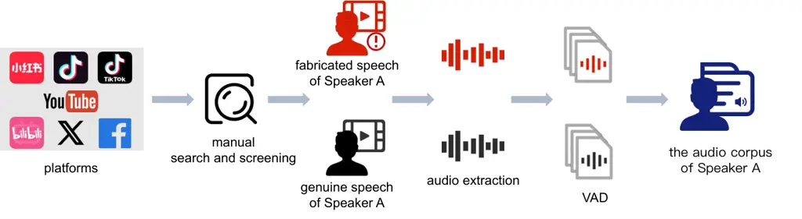

# ML-ITW: A Multilingual In-the-Wild Benchmark for Speech Deepfake Detection

Daixian Li^(\*), Jun Xue^(\*), Zhuolin Yi, Yanzhen Ren^(†), Yihuan
Huang, Guanxiang Feng, Yi Chai ^(†)^(†)thanks: ^(\*)These authors
contributed equally. ^(†)indicates the corresponding author.

###### Abstract

Recent advances in speech synthesis and voice conversion have greatly
improved the naturalness and authenticity of generated audio. Meanwhile,
evolving encoding, compression, and transmission mechanisms on social
media platforms further obscure deepfake artifacts. These factors
complicate reliable detection in real-world environments, underscoring
the need for representative evaluation benchmarks. To this end, we
introduce ML-ITW (Multilingual In-The-Wild), a multilingual dataset
covering 14 languages, seven major platforms, and 180 public figures,
totaling 28.39 hours of audio. We evaluate three detection paradigms:
end-to-end neural models, self-supervised feature-based (SSL) methods,
and audio large language models (Audio LLMs). Experimental results
reveal significant performance degradation across diverse languages and
real-world acoustic conditions, highlighting the limited generalization
ability of existing detectors in practical scenarios. The ML-ITW dataset
is publicly available¹¹ 1 https://huggingface.co/datasets/chlo1/ML-ITW.

###### Index Terms: 

speech deepfake detection, multilingual dataset, generalization

^(†)^(†)address: School of Cyber Science and Engineering, Wuhan
University hiimchlo1@whu.edu.cn, junxue@whu.edu.cn, renyz@whu.edu.cn

## 1 Introduction

Recent advances in neural speech synthesis and voice conversion enable
generated audio to closely mimic human timbre, prosody, and semantic
coherence, bringing both practical benefits and security risks such as
identity impersonation, misinformation and large-scale manipulation of
public opinion. To counter such threats, speech deepfake detection has
been extensively studied and benchmarked. Standardized evaluation
campaigns such as the ASVspoof series \[1, 2, 3, 4\] have driven rapid
methodological progress, fostering diverse detection paradigms,
including end-to-end architectures operating on spectral or waveform
inputs (e.g., LCNN \[5\], RawNet2 \[6\], AASIST \[7\]), self-supervised
hybrids leveraging pretrained encoders (e.g., XLSR+AASIST \[8\],
ML_SSLFG \[9\]), and emerging audio large language models (e.g.,
ALLM4ADD \[10\], HoliAntiSpoof \[11\]). Despite strong performance on
controlled benchmarks, their robustness under realistic deployment
conditions remains to be further investigated.

In real-world scenarios, audio distributed through social media
platforms undergoes encoding, compression, transcoding, and
redistribution, with platform-specific processing strategies introducing
distinct artifacts. These transformations alter spectral and statistical
characteristics, leading to cross-platform distribution shifts that can
degrade detection performance. Therefore, evaluating models under
multi-platform propagation conditions is critical to understand their
practical generalization ability.

Figure 1: Data collection pipeline for a specific speaker in the ML-ITW
dataset.

Although numerous datasets have been proposed to support speech deepfake
research, most are constructed in controlled settings with relatively
homogeneous sources and processing pipelines. ASVspoof2019, ASVspoof5,
WaveFake \[12\], ADD \[13, 14\], DFADD \[15\], CodecFake \[16\], and
CD-ADD \[17\] expand coverage of synthesis and codec variations, while
MLAAD \[18\], SpeechFake \[19\], and SpoofCeleb \[20\] enhance
linguistic and speaker diversity. Nevertheless, distortions introduced
by real social media dissemination are often absent or only partially
modeled. ITW \[21\] moved evaluation closer to real-world conditions and
demonstrated substantial performance degradation compared with
ASVspoof2019, yet it remains monolingual (English) and limited to a
single platform (YouTube), constraining broader cross-regional analysis.
FSW \[22\] further extends evaluation across four Chinese platforms,
representing an important step toward realistic benchmarking within a
specific linguistic and regional context. However, a unified benchmark
that encompasses diverse languages, regions, and platforms remains
lacking, making it difficult to fully evaluate model generalization in
practical environments.

To address this gap, we introduce ML-ITW, a multilingual in-the-wild
benchmark covering 14 languages, seven major social media platforms, and
180 public figures, totaling 28.39 hours of audio. Using a unified
evaluation protocol, we assess representative end-to-end models,
self-supervised hybrids, and audio large language models across
ASVspoof2019-LA, ITW, and ML-ITW. Results show consistent and
significant performance degradation under multilingual and
multi-platform conditions, highlighting persistent generalization
limitations of current detection approaches in realistic dissemination
environments.

Overall, the main contributions of this work are summarized as follows:

- •
  We introduce ML-ITW, a multilingual in-the-wild audio deepfake
  benchmark spanning 14 languages, seven social media platforms, and 180
  public figures, reflecting real-world dissemination and providing a
  challenging evaluation benchmark for cross-lingual and multi-speaker
  generalization.
- •
  We conduct unified cross-dataset and cross-lingual evaluations of
  representative end-to-end, self-supervised hybrid, and audio large
  language models on ASVspoof2019-LA, ITW, and ML-ITW, demonstrating
  significant performance degradation and language-dependent variability
  under realistic multilingual conditions.
- •
  The experimental results show that reliance on controlled benchmarks
  may overestimate model robustness, and emphasize the importance of
  diverse, real-world evaluation settings for advancing reliable and
  generalizable audio deepfake detection systems.

## 2 ML-ITW Dataset Construction

### 2.1 Dataset Collection

The ML-ITW dataset was constructed from publicly available multimedia
content collected from seven major social media and video platforms,
including Bilibili, Facebook, TikTok, Douyin, X, Rednote, and YouTube. A
total of 180 public figures, including politicians and internationally
recognized celebrities, were selected as target speakers. The dataset
covers 14 languages to reflect the linguistic diversity encountered in
real-life deployment scenarios.

| Dataset    | \#Spk | Hours  | Languages | Platforms |
| ---------- | ----- | ------ | --------- | --------- |
| ITW \[21\] | 54    | 37.90  | English   | 1         |
| FSW \[22\] | 128   | 254.58 | Chinese   | 4         |
| ML-ITW     | 180   | 28.39  | 14 langs  | 7         |

Table 1: Statistical overview of in-the-wild datasets compared with
ML-ITW.

For each speaker, both spoofed and bona fide speech were collected.
Spoofed samples were required to satisfy at least one of the following
criteria:

- •
  The video explicitly stated that the audio was generated or
  synthesized using AI technologies.
- •
  The spoken content was clearly inconsistent with the speaker’s public
  identity, known stance, or contextual behavior, indicating a high
  likelihood of synthetic manipulation.

To reduce labeling noise, we apply a conservative validation strategy.
Explicitly labeled AI-generated samples were directly included, while
context-based cases were cross-checked against verified speeches and
reliable sources. Ambiguous or uncertain instances were excluded from
the dataset to prioritize label reliability.

For each spoofed instance, corresponding real speech recordings were
subsequently retrieved from verified interviews, public speeches, or
official appearances of the same individual. This paired collection
strategy ensures speaker consistency while preserving realistic
variability in recording conditions.

### 2.2 Data Standardization and Segmentation

|             |        |       |        |      |        |       |
| ----------- | ------ | ----- | ------ | ---- | ------ | ----- |
| Platform    | Real   |       | Fake   |      | Total  |       |
|             | \# Utt | Hrs   | \# Utt | Hrs  | \# Utt | Hrs   |
| YouTube     | 5,948  | 8.00  | 531    | 0.61 | 6,479  | 8.61  |
| Bilibili    | 4,263  | 4.57  | 793    | 0.83 | 5,056  | 5.40  |
| Facebook    | 3,027  | 3.50  | 1,129  | 1.18 | 4,156  | 4.68  |
| X (Twitter) | 3,046  | 2.98  | 1,061  | 1.29 | 4,107  | 4.27  |
| Rednote     | 1,333  | 1.50  | 1,393  | 1.42 | 2,726  | 2.92  |
| Douyin      | 182    | 0.26  | 1,149  | 1.41 | 1,331  | 1.67  |
| TikTok      | 369    | 0.47  | 305    | 0.35 | 674    | 0.82  |
| Total       | 18,168 | 21.29 | 6,361  | 7.09 | 24,529 | 28.39 |

Table 2: Distribution of the ML-ITW dataset across different social
media platforms.

|                                             |                   |                    |                    |                    |     |                    |                    |                    |                    |     |                    |                    |                    |                    |
| ------------------------------------------- | ----------------- | ------------------ | ------------------ | ------------------ | --- | ------------------ | ------------------ | ------------------ | ------------------ | --- | ------------------ | ------------------ | ------------------ | ------------------ |
| Model                                       | ASVspoof2019-LA   |                    |                    |                    |     | ITW                |                    |                    |                    |     | ML-ITW             |                    |                    |                    |
|                                             | EER$`\downarrow`$ | AUC$`\uparrow`$    | ACC$`\uparrow`$    | F1$`\uparrow`$     |     | EER$`\downarrow`$  | AUC$`\uparrow`$    | ACC$`\uparrow`$    | F1$`\uparrow`$     |     | EER$`\downarrow`$  | AUC$`\uparrow`$    | ACC$`\uparrow`$    | F1$`\uparrow`$     |
| End-to-End Models                           |                   |                    |                    |                    |     |                    |                    |                    |                    |     |                    |                    |                    |                    |
| LCNN \[5\]                                  | $`7.89`$          | $`97.38`$          | $`92.11`$          | $`95.44`$          |     | $`51.47`$          | $`47.63`$          | $`48.54`$          | $`41.22`$          |     | $`48.84`$          | $`51.22`$          | $`51.16`$          | $`35.20`$          |
| RawNet2 \[6\]                               | $`6.02`$          | $`97.73`$          | $`88.66`$          | $`93.25`$          |     | $`44.90`$          | $`57.81`$          | $`55.00`$          | $`47.78`$          |     | $`47.59`$          | $`53.76`$          | $`41.07`$          | $`40.22`$          |
| RawGAT-ST \[23\]                            | $`1.92`$          | $`\mathbf{99.83}`$ | $`96.44`$          | $`97.98`$          |     | $`33.19`$          | $`73.32`$          | $`49.20`$          | $`\mathbf{57.56}`$ |     | $`42.12`$          | $`58.82`$          | $`28.80`$          | $`39.05`$          |
| LibriSeVoc \[24\]                           | $`36.55`$         | $`68.44`$          | $`29.21`$          | $`35.03`$          |     | $`\mathbf{26.22}`$ | $`\mathbf{79.66}`$ | $`\mathbf{67.00}`$ | $`37.83`$          |     | $`42.00`$          | $`\mathbf{61.42}`$ | $`\mathbf{66.88}`$ | $`35.17`$          |
| AASIST \[7\]                                | $`\mathbf{1.89}`$ | $`99.71`$          | $`\mathbf{98.14}`$ | $`\mathbf{98.96}`$ |     | $`52.13`$          | $`49.92`$          | $`43.78`$          | $`48.48`$          |     | $`\mathbf{41.85}`$ | $`60.60`$          | $`26.40`$          | $`\mathbf{40.97}`$ |
| Self-Supervised Representation-Based Models |                   |                    |                    |                    |     |                    |                    |                    |                    |     |                    |                    |                    |                    |
| XLSR+AASIST \[8\]                           | $`\mathbf{0.15}`$ | $`\mathbf{99.99}`$ | $`\mathbf{99.72}`$ | $`\mathbf{99.84}`$ |     | $`7.25`$           | $`97.30`$          | $`56.03`$          | $`62.75`$          |     | $`49.40`$          | $`51.37`$          | $`27.01`$          | $`40.79`$          |
| ML_SSLFG \[9\]                              | $`0.45`$          | $`99.98`$          | $`99.55`$          | $`99.75`$          |     | $`\mathbf{5.06}`$  | $`\mathbf{98.87}`$ | $`\mathbf{94.93}`$ | $`\mathbf{93.30}`$ |     | $`\mathbf{40.49}`$ | $`\mathbf{59.87}`$ | $`\mathbf{58.19}`$ | $`\mathbf{41.92}`$ |
| XLSR+SLS \[25\]                             | $`40.45`$         | $`63.30`$          | $`68.63`$          | $`80.28`$          |     | $`47.85`$          | $`53.03`$          | $`46.02`$          | $`50.31`$          |     | $`48.83`$          | $`51.74`$          | $`38.03`$          | $`39.68`$          |
| Audio Large Language Models                 |                   |                    |                    |                    |     |                    |                    |                    |                    |     |                    |                    |                    |                    |
| ALLM4ADD \[10\]                             | $`\mathbf{0.43}`$ | $`\mathbf{99.97}`$ | $`\mathbf{99.39}`$ | $`\mathbf{99.5}`$  |     | $`26.99`$          | $`\mathbf{80.83}`$ | $`\mathbf{79.28}`$ | $`\mathbf{61.57}`$ |     | $`43.7`$           | $`\mathbf{67.25}`$ | $`\mathbf{68.98}`$ | $`\mathbf{45.26}`$ |
| HoliAntiSpoof \[11\]                        | $`1.11`$          | $`97.8`$           | $`96.59`$          | $`97`$             |     | $`\mathbf{18.51}`$ | $`75.63`$          | $`70.36`$          | $`45.69`$          |     | $`\mathbf{42.45}`$ | $`53.78`$          | $`57.01`$          | $`42.56`$          |
| FT-GRPO \[26\]                              | $`0.52`$          | $`99.67`$          | $`98.79`$          | $`99.33`$          |     | $`26.97`$          | $`68.82`$          | $`52.42`$          | $`45.76`$          |     | $`50.03`$          | $`49.97`$          | $`25.47`$          | $`40.60`$          |

Table 3: Performance comparison of different models on ASVspoof 2019 LA,
ITW, and ML-ITW datasets.

All videos were converted to a unified audio format. Audio was extracted
from MP4 files using FFmpeg, converted to mono, and resampled to 16 kHz,
then saved as uncompressed WAV files. No denoising or source separation
was introduced, preserving real-world acoustic characteristics. Speech
segmentation employed a dual-backend VAD framework. Silero VAD ²² 2
https://github.com/snakers4/silero-vad served as the primary detector
with a 0.5 threshold, 250 ms minimum speech duration, 200 ms minimum
silence, and 50 ms padding.

To highlight the distinct contributions of this work, we present a
statistical comparison between ML-ITW and existing audio deepfake
in-the-wild benchmarks in Table 1. The ML-ITW dataset consists of 24,529
speech segments, totaling approximately 28.4 hours of audio, including
18,168 bona fide and 6,361 spoofed segments. The average duration per
speaker is approximately 9.46 minutes, with an average utterance length
of 4.17 seconds. The platform distribution is detailed in Table 2. In
terms of linguistic diversity, the dataset covers 14 languages. English
and Chinese constitute the primary subsets, accounting for over 19 hours
combined. Japanese, German, Portuguese, and Korean provide substantial
coverage (approx. 1–2 hours each), while the remaining tail includes
Spanish, Turkish, Hindi, Russian, French, Hungarian, Ukrainian, and
Hebrew, ensuring broad representation for cross-lingual evaluation.

## 3 Experimental Setup

### 3.1 Evaluation of Three Model Categories

To comprehensively assess the robustness and generalization of speech
anti-spoofing systems on ML-ITW, we evaluate three categories of models:
end-to-end architectures (LCNN, RawNet2, RawGAT-ST \[23\], LibriSeVoc
\[24\], AASIST), self-supervised representation-based models (ML_SSLFG,
XLSR+SLS \[25\], XLSR+AASIST), and audio large language models
(ALLM4ADD, HoliAntiSpoof, FT-GRPO \[26\]). In addition to ML-ITW, model
performance is also assessed on the ASVspoof2019-LA test set and the ITW
dataset.

For all models, we use publicly available pretrained checkpoints
whenever possible. If pretrained weights are not provided, the detector
is trained on the ASVspoof2019-LA training set. In all cases, we adhere
to the original hyperparameters and training protocols. The checkpoint
with the best development-set performance is selected for final
evaluation.

For consistency and efficiency, a fixed input length of 64,600 samples
(approximately four seconds) is used. Longer utterances are truncated,
while shorter ones are repeated to reach the target length, avoiding
zero-padding to prevent introducing silence that could bias results.

### 3.2 Cross-Dataset Training Evaluation

To assess cross-dataset generalization, we perform a controlled
comparison using the XLSR+AASIST architecture with XLSR-300M as the
fixed frontend encoder. Individual models are trained on ASVspoof5,
ASVspoof2019-LA, CD-ADD, Codecfake, DFADD, FSW, SpeechFake, and
SpoofCeleb. Training settings remain consistent, with a batch size of
16, a learning rate of $`1\times 10^{-6}`$, and a maximum of 100 epochs.
Early stopping occurs if the development-set EER does not improve for 10
consecutive epochs. RawBoost data augmentation \[27\] is applied
throughout training. After training on each dataset, models are
evaluated on ML-ITW using identical preprocessing and protocols,
enabling a fair comparison of how various training data affect
cross-domain performance on real-world, multilingual deepfake speech.

### 3.3 Evaluation Metrics

To rigorously evaluate detection performance and generalization, we
adopt standard metrics including Accuracy (ACC), F1-score, Area Under
the ROC Curve (AUC), and Equal Error Rate (EER), with EER serving as the
primary evaluation criterion.

## 4 Evaluation Results

### 4.1 Overall System-Level Performance

Table 3 summarizes results on ASVspoof2019-LA, ITW, and ML-ITW. All
three categories of models achieve near-saturated performance on
ASVspoof2019-LA, with EERs typically very low and AUCs approaching 100%.
On ITW, performance becomes more differentiated: several self-supervised
and large language models retain moderate robustness, whereas
traditional architectures degrade more noticeably. However, this
advantage diminishes on ML-ITW. Across all model types, EERs rise to the
40–50% range and AUC values approach near-random levels, indicating that
multilingual and cross-platform distribution shifts substantially
undermine learned decision boundaries.

The consistent performance degradation across architectures suggests
that the challenge extends beyond model capacity. Real-world
transmission effects, such as compression, re-encoding, and
platform-specific processing, alter spectral structure in ways not
captured by controlled benchmarks. Furthermore, exposure to a limited
set of synthesis methods during training yields limited robustness to
the broader and evolving generation techniques reflected in ML-ITW.
Significantly, the comparable degradation indicates that neither
architectural sophistication nor large-scale pretraining alone
guarantees stable generalization under realistic multilingual
conditions.

| Training Set          | ASVspoof2019-LA   |                    |                    |                    |     | ITW               |                    |                    |                    |     | ML-ITW             |                    |                    |                    |
| --------------------- | ----------------- | ------------------ | ------------------ | ------------------ | --- | ----------------- | ------------------ | ------------------ | ------------------ | --- | ------------------ | ------------------ | ------------------ | ------------------ |
|                       | EER$`\downarrow`$ | AUC$`\uparrow`$    | ACC$`\uparrow`$    | F1$`\uparrow`$     |     | EER$`\downarrow`$ | AUC$`\uparrow`$    | ACC$`\uparrow`$    | F1$`\uparrow`$     |     | EER$`\downarrow`$  | AUC$`\uparrow`$    | ACC$`\uparrow`$    | F1$`\uparrow`$     |
| ASVspoof5 \[4\]       | $`16.91`$         | $`90.75`$          | $`28.19`$          | $`33.22`$          |     | $`14.39`$         | $`92.16`$          | $`74.83`$          | $`49.00`$          |     | $`42.89`$          | $`61.29`$          | $`74.90`$          | $`7.82`$           |
| ASVspoof2019-LA \[2\] | $`\mathbf{0.15}`$ | $`\mathbf{99.99}`$ | $`\mathbf{99.72}`$ | $`\mathbf{99.84}`$ |     | $`7.25`$          | $`97.30`$          | $`56.03`$          | $`62.75`$          |     | $`49.40`$          | $`51.37`$          | $`27.01`$          | $`40.79`$          |
| CD-ADD \[17\]         | $`9.59`$          | $`96.67`$          | $`57.74`$          | $`69.23`$          |     | $`9.53`$          | $`93.82`$          | 87.28              | $`80.02`$          |     | $`35.12`$          | $`69.67`$          | $`75.10`$          | $`11.22`$          |
| Codecfake \[16\]      | $`1.99`$          | $`99.81`$          | $`97.34`$          | $`98.50`$          |     | $`5.06`$          | $`98.61`$          | $`86.37`$          | $`84.40`$          |     | $`35.89`$          | $`68.19`$          | $`57.77`$          | $`47.81`$          |
| DFADD \[15\]          | $`16.04`$         | $`91.35`$          | $`78.00`$          | $`86.02`$          |     | $`11.81`$         | $`94.59`$          | $`61.39`$          | $`65.40`$          |     | $`45.28`$          | $`56.46`$          | $`27.20`$          | $`41.38`$          |
| FSW \[22\]            | $`49.45`$         | $`53.16`$          | $`33.21`$          | $`41.92`$          |     | $`47.98`$         | $`52.70`$          | $`62.94`$          | $`1.29`$           |     | $`36.79`$          | $`68.50`$          | $`75.54`$          | $`14.17`$          |
| SpeechFake-BD \[19\]  | $`10.55`$         | $`96.31`$          | $`89.22`$          | $`93.69`$          |     | $`\mathbf{2.62}`$ | $`\mathbf{99.42}`$ | $`74.21`$          | $`74.20`$          |     | $`32.92`$          | $`72.48`$          | $`65.20`$          | $`\mathbf{51.01}`$ |
| SpoofCeleb \[20\]     | $`20.79`$         | $`87.81`$          | $`48.01`$          | $`59.21`$          |     | $`3.59`$          | $`98.96`$          | $`\mathbf{96.19}`$ | $`\mathbf{94.80}`$ |     | $`\mathbf{27.65}`$ | $`\mathbf{79.62}`$ | $`\mathbf{79.73}`$ | $`42.41`$          |

Table 4: Impact of training data distribution on cross-dataset
generalization. All systems employ the fixed XLSR+AASIST architecture
but are trained on different datasets.

|               |                    |           |                   |
| ------------- | ------------------ | --------- | ----------------- |
| Language      | AASIST             | ML_SSLFG  | ALLM4ADD          |
| Chinese       | $`51.99`$          | $`39.30`$ | $`49.46`$         |
| English       | $`33.66`$          | $`44.99`$ | $`45.76`$         |
| French        | $`16.40`$          | $`80.42`$ | $`42.97`$         |
| German        | $`40.68`$          | $`52.47`$ | $`39.28`$         |
| Hebrew        | $`45.30`$          | $`1.39`$  | $`43.81`$         |
| Hindi         | $`37.38`$          | $`42.77`$ | $`46.89`$         |
| Hungarian     | $`4.73`$           | $`33.39`$ | $`35.31`$         |
| Japanese      | $`40.08`$          | $`50.17`$ | $`46.82`$         |
| Korean        | $`47.29`$          | $`35.52`$ | $`51.95`$         |
| Portuguese    | $`39.83`$          | $`35.21`$ | $`49.48`$         |
| Russian       | $`9.10`$           | $`34.07`$ | $`47.33`$         |
| Spanish       | $`34.97`$          | $`66.26`$ | $`37.66`$         |
| Turkish       | $`38.09`$          | $`42.02`$ | $`40.42`$         |
| Ukrainian     | $`53.87`$          | $`58.86`$ | $`50.06`$         |
| Macro Average | $`\mathbf{35.24}`$ | $`44.06`$ | $`44.80`$         |
| Std. Dev.     | $`15.03`$          | $`18.73`$ | $`\mathbf{4.87}`$ |

Table 5: Language-wise EER (%)$`\downarrow`$ comparison on ML-ITW. The
bottom two rows report the Macro Average (mean EER across all languages)
and Std. Dev. (standard deviation), indicating overall performance and
cross-lingual stability.

### 4.2 Impact of Training Data Distribution on Cross-Dataset Generalization

As shown in Table 4, models trained on ASVspoof2019-LA achieve
near-saturated performance on its in-domain test set, but this advantage
does not transfer to more realistic conditions. On ITW, systems trained
on SpeechFake, SpoofCeleb, and Codecfake outperform the
ASVspoof2019-trained model, indicating that strong performance on a
controlled benchmark does not necessarily translate to better
generalization when the evaluation distribution changes. The gap widens
further on ML-ITW, where all models experience substantial degradation,
and EERs rise to 30%–50%. Although training on SpoofCeleb and SpeechFake
leads to comparatively lower error rates than training on
ASVspoof2019-LA, none of the training sets maintain stable performance
in the setting of ML-ITW. Since the model architecture, optimization
strategy, and preprocessing pipeline are strictly controlled, the
observed performance differences can be attributed to variations in
training data distribution. This comparison demonstrates that models
remain highly sensitive to unseen linguistic, acoustic, and propagation
variations, even when trained on diverse corpora. Datasets that
partially reflect real-world distortions offer modest improvements, but
these gains are still insufficient to address the broader linguistic and
propagation diversity, confirming that existing corpora lack the
coverage necessary for stable generalization in realistic dissemination
scenarios.

### 4.3 Language-wise Analysis

To ensure representativeness, we select AASIST, ML_SSLFG and ALLM4ADD,
which demonstrate strong performance in their respective categories,
enabling an architecture-focused comparison at comparable performance
levels. Table 5 shows their performance across languages on ML-ITW.
There is no consistent difficulty ranking across languages, yet distinct
error patterns still emerge. AASIST achieves the lowest macro-average
EER (35.24%), though it still exhibits substantial variation across
languages. ML_SSLFG yields a higher average error rate (44.06%) and
displays extreme imbalances in certain languages, with some results
approaching random performance. In contrast, ALLM4ADD attains a
macro-average EER of 44.80%, which is the highest among the three, but
its standard deviation is only 4.87, indicating the most concentrated
error distribution. The three models also differ in their ranking of
language difficulty, suggesting that performance variation arises not
only from language characteristics but also from differences in how each
architecture encodes language-specific acoustic features and spoofing
cues.

This variation might arise from distinct representation learning
paradigms. AASIST employs end-to-end optimization, directly aligning
features with the spoof detection objective to learn stable
task-specific cues. ML_SSLFG relies on self-supervised pretraining
followed by task adaptation, which may leave language statistics and
spoofing artifacts insufficiently disentangled under homogeneous
training distributions. In contrast, ALLM4ADD leverages large-scale
contextual modeling, which tends to smooth language-dependent
fluctuations and yields more uniform behavior across languages. Results
thus reveal differing stability profiles across modeling paradigms and
highlight ongoing limitations in achieving both cross-lingual
consistency and high discriminative power in real-world multilingual
conditions.

## 5 Discussion

Driven by rapid advances in speech synthesis and ongoing updates in
platform-level encoding and compression, we construct ML-ITW to
encompass a wide range of languages, speakers, and social media sources,
thereby providing a more comprehensive and realistic evaluation
benchmark for the evaluation of deepfake detection systems. Model
accuracy declines significantly on ML-ITW, revealing major
generalization gaps under multilingual, multi-speaker, and
cross-platform conditions. These findings suggest that modern forgery
artifacts and real-world transmission effects appear to disrupt decision
boundaries established on controlled datasets.

In addition to quantifying performance loss, this work provides
empirical evidence for reexamining evaluation standards in audio
deepfake detection. ML-ITW serves as a more realistic benchmark for
assessing cross-lingual and cross-platform robustness, highlighting the
need to incorporate propagation variability into both dataset design and
model development. One remaining limitation is the relatively small
sample size for some low-resource languages, which may affect the
reliability of language-level analyses. Future efforts will seek to
improve language balance, enhancing both statistical reliability and
cross-lingual evaluation. In parallel, expanding both the quantity and
diversity of audio sources will better reflect the evolving landscape of
online speech synthesis and dissemination, and further strengthen the
validity of benchmark evaluations.

## 6 Conclusion

This paper introduces ML-ITW, a multilingual in-the-wild benchmark for
speech deepfake detection, comprising bona fide and spoofed speech
collected from seven social media platforms across 14 languages and 180
public figures. Systematic evaluations of end-to-end models,
self-supervised representation-based models, and audio large language
models show that performance advantages on conventional benchmarks do
not readily transfer to ML-ITW. Cross-dataset training experiments
further demonstrate that the choice of training data can substantially
improve detection performance but remains insufficient to close the
generalization gap in real-world conditions. Language-wise analyses also
reveal that detection ability and cross-lingual stability do not
consistently align across models. These findings highlight the need to
consider training data, language coverage, and real-world dissemination
conditions jointly when evaluating speech deepfake detectors. ML-ITW
provides a publicly available benchmark for such evaluations. Future
work will expand the dataset and improve language balance to support
more comprehensive studies of generalization.

## References

- \[1\] Z. Wu, T. Kinnunen, N. Evans, J. Yamagishi, C. Hanilçi, Md.
  Sahidullah, and A. Sizov (2015) ASVspoof 2015: the first automatic
  speaker verification spoofing and countermeasures challenge. In
  Interspeech 2015, pp. 2037–2041. External Links:
  [Document](https://dx.doi.org/10.21437/Interspeech.2015-462), ISSN
  2958-1796 Cited by: §1.
- \[2\] X. Wang, J. Yamagishi, M. Todisco, H. Delgado, A. Nautsch, N.
  Evans, M. Sahidullah, V. Vestman, T. Kinnunen, K. A. Lee, et
  al. (2020) ASVspoof 2019: a large-scale public database of
  synthesized, converted and replayed speech. Computer Speech & Language
  64, pp. 101114. Cited by: §1, Table 4.
- \[3\] J. Yamagishi, X. Wang, M. Todisco, M. Sahidullah, J. Patino, A.
  Nautsch, X. Liu, K. A. Lee, T. Kinnunen, N. Evans, et al. (2021)
  ASVspoof 2021: accelerating progress in spoofed and deepfake speech
  detection. In Proc. ASVSPOOF 2021, pp. 47–54. Cited by: §1.
- \[4\] X. Wang, H. Delgado, H. Tak, J. Jung, H. Shim, M. Todisco, I.
  Kukanov, X. Liu, M. Sahidullah, T. H. Kinnunen, N. Evans, K. A. Lee,
  and J. Yamagishi (2024) ASVspoof 5: crowdsourced speech data,
  deepfakes, and adversarial attacks at scale. In The Automatic Speaker
  Verification Spoofing Countermeasures Workshop (ASVspoof 2024),
  pp. 1–8. External Links:
  [Document](https://dx.doi.org/10.21437/ASVspoof.2024-1) Cited by: §1,
  Table 4.
- \[5\] G. Lavrentyeva, S. Novoselov, A. Tseren, M. Volkova, A.
  Gorlanov, and A. Kozlov (2019) STC antispoofing systems for the
  asvspoof2019 challenge. In Proc. Interspeech 2019, pp. 1033–1037.
  Cited by: §1, Table 3.
- \[6\] H. Tak, J. Patino, M. Todisco, A. Nautsch, N. Evans, and A.
  Larcher (2021) End-to-end anti-spoofing with rawnet2. In ICASSP
  2021-2021 IEEE International Conference on Acoustics, Speech and
  Signal Processing (ICASSP), pp. 6369–6373. Cited by: §1, Table 3.
- \[7\] J. Jung, H. Heo, H. Tak, H. Shim, J. S. Chung, B. Lee, H. Yu,
  and N. Evans (2022) Aasist: audio anti-spoofing using integrated
  spectro-temporal graph attention networks. In ICASSP 2022-2022 IEEE
  international conference on acoustics, speech and signal processing
  (ICASSP), pp. 6367–6371. Cited by: §1, Table 3.
- \[8\] H. Tak, M. Todisco, X. Wang, J. Jung, J. Yamagishi, and N.
  Evans (2022) Automatic speaker verification spoofing and deepfake
  detection using wav2vec 2.0 and data augmentation. In Proc. Odyssey
  2022, pp. 112–119. Cited by: §1, Table 3.
- \[9\] H. M. Tran, D. Lolive, A. Sini, A. Delhay, P. Marteau, and D.
  Guennec (2025) Multi-level ssl feature gating for audio deepfake
  detection. In Proceedings of the 33rd ACM International Conference on
  Multimedia, pp. 11766–11775. Cited by: §1, Table 3.
- \[10\] H. Gu, J. Yi, C. Wang, J. Tao, Z. Lian, J. He, Y. Ren, Y. Chen,
  and Z. Wen (2025) Allm4add: unlocking the capabilities of audio large
  language models for audio deepfake detection. In Proceedings of the
  33rd ACM International Conference on Multimedia, pp. 11736–11745.
  Cited by: §1, Table 3.
- \[11\] X. Xu, Y. Ren, L. Liu, W. Wu, B. Li, C. Lu, S. Wang, and C.
  Zhang (2026) HoliAntiSpoof: audio llm for holistic speech
  anti-spoofing. arXiv preprint arXiv:2602.04535. Cited by: §1, Table 3.
- \[12\] J. Frank and L. Schönherr (2021) WaveFake: A Data Set to
  Facilitate Audio Deepfake Detection. In Thirty-fifth Conference on
  Neural Information Processing Systems Datasets and Benchmarks Track,
  Cited by: §1.
- \[13\] J. Yi, R. Fu, J. Tao, S. Nie, H. Ma, C. Wang, T. Wang, Z.
  Tian, Y. Bai, C. Fan, S. Liang, S. Wang, S. Zhang, X. Yan, L. Xu, Z.
  Wen, and H. Li (2022) ADD 2022: the first audio deep synthesis
  detection challenge. In ICASSP 2022 - 2022 IEEE International
  Conference on Acoustics, Speech and Signal Processing (ICASSP), Vol. ,
  pp. 9216–9220. External Links:
  [Document](https://dx.doi.org/10.1109/ICASSP43922.2022.9746939) Cited
  by: §1.
- \[14\] J. Yi, J. Tao, R. Fu, X. Yan, C. Wang, T. Wang, C. Y. Zhang, X.
  Zhang, Y. Zhao, Y. Ren, L. Xu, J. Zhou, H. Gu, Z. Wen, S. Liang, Z.
  Lian, S. Nie, and H. Li (2023) ADD 2023: the second audio deepfake
  detection challenge. External Links: 2305.13774,
  [Link](https://arxiv.org/abs/2305.13774) Cited by: §1.
- \[15\] J. Du, I. Lin, I. Chiu, X. Chen, H. Wu, W. Ren, Y. Tsao, H.
  Lee, and J. R. Jang (2024) Dfadd: the diffusion and flow-matching
  based audio deepfake dataset. In 2024 IEEE Spoken Language Technology
  Workshop (SLT), pp. 921–928. Cited by: §1, Table 4.
- \[16\] Y. Xie, Y. Lu, R. Fu, Z. Wen, Z. Wang, J. Tao, X. Qi, X.
  Wang, Y. Liu, H. Cheng, et al. (2025) The codecfake dataset and
  countermeasures for the universally detection of deepfake audio. IEEE
  Transactions on Audio, Speech and Language Processing 33, pp. 386–400.
  Cited by: §1, Table 4.
- \[17\] Y. Li, M. Zhang, M. Ren, X. Qiao, M. Ma, D. Wei, and H.
  Yang (2024) Cross-domain audio deepfake detection: dataset and
  analysis. In Proceedings of the 2024 Conference on Empirical Methods
  in Natural Language Processing, pp. 4977–4983. Cited by: §1, Table 4.
- \[18\] N. M. Müller, P. Kawa, W. H. Choong, E. Casanova, E. Gölge, T.
  Müller, P. Syga, P. Sperl, and K. Böttinger (2024) Mlaad: the
  multi-language audio anti-spoofing dataset. In 2024 International
  Joint Conference on Neural Networks (IJCNN), pp. 1–7. Cited by: §1.
- \[19\] W. Huang, Y. Gu, Z. Wang, H. Zhu, and Y. Qian (2025)
  SpeechFake: a large-scale multilingual speech deepfake dataset
  incorporating cutting-edge generation methods. In Proceedings of the
  63rd Annual Meeting of the Association for Computational Linguistics
  (Volume 1: Long Papers), pp. 9985–9998. Cited by: §1, Table 4.
- \[20\] J. Jung, Y. Wu, X. Wang, J. Kim, S. Maiti, Y. Matsunaga, H.
  Shim, J. Tian, N. Evans, J. S. Chung, et al. (2025) Spoofceleb: speech
  deepfake detection and sasv in the wild. IEEE Open Journal of Signal
  Processing. Cited by: §1, Table 4.
- \[21\] N. Müller, P. Czempin, F. Diekmann, A. Froghyar, and K.
  Böttinger (2022) Does Audio Deepfake Detection Generalize?. In
  Interspeech 2022, pp. 2783–2787. External Links:
  [Document](https://dx.doi.org/10.21437/Interspeech.2022-108), ISSN
  2958-1796 Cited by: §1, Table 1.
- \[22\] Y. Xie, R. Fu, X. Wang, Z. Wang, Y. Li, Y. Gao, Z. Wen, H.
  Cheng, and L. Ye (2026) Fake speech wild: detecting deepfake speech on
  social media platform. In ICASSP 2026-2026 IEEE International
  Conference on Acoustics, Speech and Signal Processing (ICASSP),
  pp. 13752–13756. Cited by: §1, Table 1, Table 4.
- \[23\] H. Tak, J. Jung, J. Patino, M. Kamble, M. Todisco, and N.
  Evans (2021) End-to-end spectro-temporal graph attention networks for
  speaker verification anti-spoofing and speech deepfake detection. In
  Proc. ASVSPOOF 2021, pp. 1–8. Cited by: Table 3, §3.1.
- \[24\] C. Sun, S. Jia, S. Hou, and S. Lyu (2023) AI-synthesized voice
  detection using neural vocoder artifacts. In Proceedings of the
  IEEE/CVF Conference on Computer Vision and Pattern Recognition (CVPR)
  Workshops, pp. 904–912. Cited by: Table 3, §3.1.
- \[25\] Q. Zhang, S. Wen, and T. Hu (2024) Audio deepfake detection
  with self-supervised xls-r and sls classifier. In Proceedings of the
  32nd ACM International Conference on Multimedia, pp. 6765–6773. Cited
  by: Table 3, §3.1.
- \[26\] Y. Xie, X. Guo, J. Zhou, T. Wang, J. Liu, R. Fu, X. Wang, H.
  Cheng, and L. Ye (2026) Interpretable all-type audio deepfake
  detection with audio llms via frequency-time reinforcement learning.
  arXiv preprint arXiv:2601.02983. Cited by: Table 3, §3.1.
- \[27\] H. Tak, M. Kamble, J. Patino, M. Todisco, and N. Evans (2022)
  Rawboost: a raw data boosting and augmentation method applied to
  automatic speaker verification anti-spoofing. In ICASSP 2022-2022 IEEE
  International Conference on Acoustics, Speech and Signal Processing
  (ICASSP), pp. 6382–6386. Cited by: §3.2.
