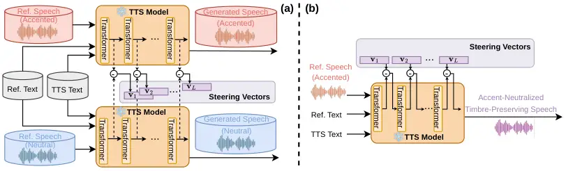

# Activation Steering for Accent-Neutralized Zero-Shot Text-To-Speech Thanks: This work was supported in part by Univ. of Texas at Dallas from the Distinguished University Chair in Telecommunications Engineering held by J.H.L. Hansen.

Mu Yang, John H. L. Hansen Affiliation: Center for Robust Speech Systems
(CRSS), University of Texas at Dallas, USA  
{mu.yang, john.hansen}@utdallas.edu

###### Abstract

Zero-shot Text-to-Speech (TTS) models can generate speech that captures
both the voice timbre and accent of a reference speaker. However,
disentangling these attributes and individually controlling the output
accent remains challenging. In this study, we introduce a post-hoc and
training-free approach to neutralize accent while preserving the
speaker’s original timbre, utilizing inference-time activation steering.
We first extract layer-specific “steering vectors” offline, which are
derived from the activation differences within the TTS model between
accented and native speech. During inference, the steering vectors guide
the model to produce accent-neutralized, timbre-preserving speech.
Empirical results demonstrate that the proposed steering vectors
effectively mitigate the output accent and exhibit strong
generalizability to unseen accented speakers, offering a practical
solution for accent-free voice cloning. We further confirm that speaker
timbre is largely preserved via speaker embedding cosine similarity and
speaker verification acceptance rate computed in an estimated
accent-orthogonal subspace, as well as subjective listening tests. Audio
demo: https://accentsteer.github.io/

###### Index Terms: 

Text-To-Speech, activation steering, accent neutralization, accent
conversion

## I Introduction

Zero-shot Text-To-Speech (TTS) is the task of generating speech for a
target text using a reference speech utterance (and sometimes
optionally, the reference speech’s transcript) of an arbitrary speaker.
The generated speech is expected to have the voice characteristics of
the reference speaker (e.g., timbre, prosody, accent, emotion, etc.).
Recent advances on Diffusion Models and Large Language Models (LLM) have
significantly improved zero-shot TTS \[1, 2, 3, 4, 5, 6, 7, 8, 9, 10,
11, 12, 13\].

However, individually controlling different voice characteristics
remains a challenge. When the reference speech has a second-language
(L2) English accent, the generated speech often inherits both the accent
and timbre from the reference. Although some prior instruction-based TTS
models support dialect control, none of them support L2 English accent
control in the zero-shot voice cloning scenario. For example, CosyVoice3
\[14\] only supports a fixed set of 26 instructions, none of which
control the L2 English accent, and other instructions have minimal
effects. Qwen3-TTS’s \[6\] “Voice Design” or “Custom Voice Generation”
modes (based on text prompts) cannot accept a reference speech sample to
clone its timbre. In this work, we aim to generate speech with the
timbre of the reference speaker but without the speaker’s L2 accent.
This is a practical problem for accent-free voice cloning, which can be
useful for applications such as creating training targets for Accent
Conversion models \[15, 16\], providing L2 language learners with
personalized accent-neutralized speech feedback for computer-aided
pronunciation training \[17\], etc.

Our solution is based on activation steering, a technique that modifies
the internal activations of a neural network to control specific model
behaviors. It has been used to detoxify and shift the sentiment of LLM
responses \[18\], alter LLMs’ persona traits \[19\], and more \[20, 21,
22\]. The efficacy of this approach demonstrates that high-level
semantic concepts can be represented as _linear directions_ in the
activation space, and that steering the activations along these
directions can effectively control the corresponding concepts in the
model responses. In this work, we ask the following research question:
since the internal activations of a zero-shot TTS model encode multiple
voice characteristics, can we steer the activations to neutralize the
reference speaker’s accent while preserving the timbre?

To this end, inspired by Persona Vectors \[19\], we propose a _post-hoc
and training-free_ approach. Specifically, as shown in Fig. 1, we first
extract “steering vectors” offline from the layer-wise differences
between the activation averages of accented and accent-neutral
conditions. Then, during inference, the steering vectors are applied to
corresponding layers to guide the model to produce accent-neutralized,
timbre-preserving speech. We conduct steering experiments on Qwen3-TTS
\[6\], a state-of-the-art LLM-based zero-shot TTS model. Empirical
results show that this simple steering approach can effectively mitigate
the accent in the output speech, while maintaining the reference
speaker’s timbre to a large extent. The steering vectors also show
strong generalizability to _unseen_ accented speakers, whose utterances
are not used for steering vector extraction, suggesting that the
steering vectors capture a general direction for accent neutralization
in the TTS model’s activation space. In addition, since raw speaker
embedding cosine similarities may overstate timbre differences due to
the intended accent change, we formulate objective measurements in an
estimated accent-orthogonal subspace for a more faithful speaker timbre
similarity evaluation.



Fig. 1: The proposed activation steering framework for
accent-neutralized zero-shot TTS. (a) Steering vectors are extracted
offline from the activation differences between accented and neutral
speech, and (b) applied during inference to guide the model towards
accent-neutralized output while preserving timbre. In this paper, we
experiment with single-layer steering, i.e., only one layer is steered
while other layers are left unchanged. The figure illustrates the
general framework where multiple layers can be steered simultaneously.

## II Related Work

Several prior works have explored activation steering to enhance the
controllability of zero-shot TTS. Suni et al. \[23\] proposed a method
to fit prosody and style vectors, which manipulate the embedding space
of reference utterances. Counterfactual Activation Editing \[24\] uses
external classifiers and regressors to edit the internal representations
of the TTS model to achieve post-hoc prosody and mispronunciation
control. EmoShift \[25\] builds lightweight activation steering layers
on top of the output embeddings for emotion-aware TTS. TruS \[26\]
adopts a similar steering vectors extraction method for inference-time
speaker unlearning in a Diffusion-based TTS model. Our work is related
to EmoSteer \[27\], which pre-extracts emotion steering vectors for a
Diffusion-based TTS model and relies on an external emotion classifier
to select top-k steering tokens, and thus requires multiple inference
passes to apply the steering vectors. In contrast, our method does not
require any external classifiers and applies the steering vectors in a
single autoregressive decoding pass, which is more efficient and
practical for real-time applications.

## III Method

### III-A The Qwen3-TTS Model

We extract steering vectors from the activations of Qwen3-TTS \[6\], a
state-of-the-art LLM-based zero-shot TTS model. It uses a 12.5 Hz
multi-codebook speech tokenizer with 1 semantic stream and 15 acoustic
streams derived from Residual Vector Quantization (RVQ) \[28\]. The
Qwen3-TTS model consists of a Qwen3-LLM-based backbone (28-layer
Transformer) and a lightweight Multi-Token Prediction (MTP) module
(5-layer Transformer) on top of the backbone. The backbone takes as
input the aggregated codebook features from the speech tokenizer and
predicts the semantic token, and the MTP module then predicts the
remaining acoustic tokens. In this work, we focus on the activations
from the backbone LLM, as it accounts for the majority of the model
parameters and is responsible for learning the shared representations
across different voice characteristics.

### III-B Steering Vector Extraction

For zero-shot TTS, Qwen3-TTS takes as input a reference speech and its
corresponding text transcript, and the target text to be synthesized. To
compute the steering vectors, we use ARCTIC \[29\] and L2-ARCTIC \[30\]
to curate an extraction dataset with contrastive accent conditions.
ARCTIC provides US American English speech (considered as
accent-neutral) from 4 native speakers, while L2-ARCTIC provides
L2-accented English speech for the same set of sentences in ARCTIC,
where each sentence is spoken by 4 L2 speakers. We randomly sample two
disjoint sets of $`M`$ sentences, one as the target texts and one as the
reference texts. For each target text, we pair it with one reference
text and aggregate the corresponding speech from the 4 native speakers
and 4 accented speakers, creating the (target text, reference text,
reference speech) triplets as the TTS inputs. As shown in Fig. 1, we
feed the triplets into the TTS model to generate accented and neutral
speech. For each generated speech, we record each Transformer layer’s
output within the backbone LLM, averaged over the generated tokens. Then
the steering vectors are computed as the difference between the mean
activations of the accented condition and the neutral condition:

```math
\displaystyle\mathbf{v}_{l}=\frac{1}{N_{a}}\sum_{i=1}^{N_{a}}\mathbf{a}_{l,i}^{(accented)}-\frac{1}{N_{n}}\sum_{i=1}^{N_{n}}\mathbf{a}_{l,i}^{(neutral)} \tag{1}
```

where $`\mathbf{v}_{l}\in\mathbb{R}^{d}`$ is the steering vector for
layer $`l`$ with dimension $`d`$, $`\mathbf{a}_{l,i}^{(accented)}`$ and
$`\mathbf{a}_{l,i}^{(neutral)}`$ are the averaged activations of the
$`i`$-th generated sample at layer $`l`$, for the accented and neutral
conditions, respectively, and $`N_{a}`$ and $`N_{n}`$ are the number of
samples in each condition. We only keep track of the activations of
generated tokens, while the activations of prompt tokens (i.e.,
reference speech and text) are excluded.

Since accent is coupled with speaker identity (i.e., the same speaker
always speaks with the same accent), the steering vectors may capture
not only the accent but also the speaker information. To break the
entanglement and encourage the steering vectors to capture more
accent-specific information, during steering vectors extraction, we
apply on-the-fly data augmentations on reference speech waveforms to
introduce perturbations that modify the speaker’s voice \[31, 32\].
These perturbations involve 3 sequential random transformations: 1)
scaling all formant frequencies within an utterance by a random factor; 2) scaling the fundamental frequency (F0) by a random factor; and 3)
applying a random frequency-shaping equalizer. As these scaling and
frequency-shaping operations are uniformly applied across the utterance,
they primarily modify the speaker’s voice timbre while having minimal
impact on the spoken content or accent. For each sample, a random
variable $`\gamma`$ is drawn from the uniform distribution
$`\mathcal{U}(0,1)`$. Perturbations are applied if $`\gamma>0.3`$;
otherwise, the original waveforms are used. We show the effect of the
data augmentation in the ablation study (Section. V-D).

### III-C Inference-Time Steering for Accent Neutralization

During inference, we apply the steering vectors to the corresponding
layers of the backbone LLM: at each decoding step $`t`$, we modify the
activations of layer $`l`$ as follows:

```math
\displaystyle\mathbf{a}_{l}^{t}\leftarrow\left(\mathbf{a}_{l}^{t}-\alpha\cdot\mathbf{v}_{l}\right)\cdot\frac{||\mathbf{a}_{l}^{t}||_{2}}{||\mathbf{a}_{l}^{t}-\alpha\cdot\mathbf{v}_{l}||_{2}} \tag{2}
```

where $`\mathbf{a}_{l}^{t}\in\mathbb{R}^{d}`$ is the activation at layer
$`l`$ and decoding step $`t`$, and $`\alpha`$ is a hyperparameter that
controls the steering strength. When the inference reference samples are
accented, subtracting the steering vectors enables the negation of such
“accent directions”, which steers the accent activations towards neutral
activations and thus mitigates the accent in the generated speech. The
normalization term is applied to maintain the original activation norm.
The steering vectors are only applied to the generated tokens, while the
activations of the prompt tokens are not modified. In this study, we
experiment with single-layer steering, where only one layer is steered
while other layers are left unchanged.

|     |                    |                |                  |               |                      |                           |                         |                      |                    |                        |
| --- | ------------------ | -------------- | ---------------- | ------------- | -------------------- | ------------------------- | ----------------------- | -------------------- | ------------------ | ---------------------- |
| ID  | Evaluation Dataset | Model          | Steering Setting | Prompt Accent | ISR $`\uparrow`$ (%) | AMR-CN $`\downarrow`$ (%) | AMR-US $`\uparrow`$ (%) | Spk Sim $`\uparrow`$ | UTMOS $`\uparrow`$ | WER $`\downarrow`$ (%) |
| 1   | L2-ARCTIC          | Qwen3-TTS 0.6B | Unsteered        | EN_US         | 100.00               | 0.00                      | 100.00                  | 0.87                 | 3.34               | 1.04                   |
| 2   |                    |                |                  | EN_CN         | 98.46                | 82.14                     | 0.00                    | 0.85                 | 3.31               | 3.98                   |
| 3   |                    |                | Steer layer 15   | EN_CN         | 98.68                | 1.78                      | 97.33                   | 0.73                 | 3.18               | 2.64                   |
| 4   |                    |                | Steer layer 10   | EN_CN         | 96.04                | 4.35                      | 94.74                   | 0.72                 | 3.10               | 3.18                   |
| 5   |                    | Qwen3-TTS 1.7B | Unsteered        | EN_US         | 100.00               | 0.00                      | 100.00                  | 0.87                 | 3.38               | 0.97                   |
| 6   |                    |                |                  | EN_CN         | 99.56                | 83.89                     | 1.10                    | 0.84                 | 3.33               | 3.40                   |
| 7   |                    |                | Steer layer 15   | EN_CN         | 99.56                | 9.49                      | 88.74                   | 0.76                 | 3.32               | 2.24                   |
| 8   |                    |                | Steer layer 10   | EN_CN         | 99.34                | 18.14                     | 79.87                   | 0.76                 | 3.22               | 2.63                   |
| 9   | speechocean762     | Qwen3-TTS 1.7B | Unsteered        | EN_CN         | 97.00                | 3.09                      | 0.00                    | 0.78                 | 2.73               | 56.41                  |
| 10  |                    |                | Steer layer 15   | EN_CN         | 92.00                | 3.26                      | 48.91                   | 0.74                 | 3.01               | 32.43                  |
| 11  |                    |                | Steer layer 10   | EN_CN         | 86.00                | 6.98                      | 48.84                   | 0.74                 | 2.93               | 32.85                  |

TABLE I: Evaluation results on L2-ARCTIC and speechocean762. The
steering vectors are extracted using the samples from L2-ARCTIC, and
applied to both L2-ARCTIC and speechocean762 for evaluation. EN_US (US
American English) and EN_CN (Mandarin Chinese accented English) denote
the reference speech accents; ISR denotes Inference Success Rate; AMR-CN
and AMR-US denotes Accent Match Rate with EN_CN and EN_US accent target,
respectively. See Section. IV for more details on the evaluation
metrics. Steering strength $`\alpha`$ is set to 1.0 for all the steered
models in the table.

## IV Experimental Setup

Datasets We use ARCTIC and L2-ARCTIC for steering vector extraction. We
focus on neutralizing the Mandarin Chinese-accented English. Speech and
transcripts from the 4 Chinese-L1 speakers in L2-ARCTIC and the 4 native
speakers in ARCTIC are used. For each speaker, we hold out 10% of the
utterances as the evaluation set, and we sample from the remaining
utterances to extract steering vectors. As an out-of-distribution
evaluation to test the generalizability of the steering vectors, we use
speechocean762 \[33\], which features 250 Mandarin Chinese-L1 speakers
(adults and children) with diverse English proficiency levels. We
randomly sample 100 utterances from the adult group of the test set,
which are paired with another 100 different text transcripts in
speechocean762 as the target texts for TTS inference.

Steering Vector Extraction and Steering Setting We experiment with two
sizes of the pre-trained Qwen3-TTS models, 0.6B and 1.7B parameters.
Both models have 28 Transformer layers in the backbone LLM. For each
model, we extract steering vectors from the following layer indices
(zero-indexed): $`{1,5,10,15,20,25,27}`$. We use 4,000 ARCTIC plus
L2-ARCTIC samples for steering vector extraction (i.e.
$`N_{a}+N_{n}=4000`$ in Eqn. 1). During inference, we experiment with
two steering strengths $`\alpha`$: 1.0 and 2.0.

Evaluation Metrics We evaluate the generated speech on five objective
metrics. 1) Inference Success Rate (ISR): the percentage of samples
generated without errors, measuring stability under steering¹¹ 1 With
larger $`\alpha`$, and in rare cases even for the unsteered baseline,
the model can get stuck in the decoding loop due to a missing stop
token. We consider such cases as failed inference.; 2) Accent Match Rate
(AMR): the percentage of samples classified as a given accent (e.g.,
EN_CN, EN_US) by a pre-trained accent classifier \[32\]²² 2 AMR-CN and
AMR-US do not sum to 1 because the classifier was trained on 7 accents
(ARCTIC + L2-ARCTIC).; 3) Spk Sim: cosine similarity between speaker
embeddings of the generated and reference speech, extracted with a
pre-trained speaker encoder³³ 3
https://github.com/resemble-ai/Resemblyzer; 4) UTMOS: naturalness Mean
of Opinion Score (MOS) predicted by UTMOSv2 \[34\]; 5) Word Error Rate
(WER): we use Whisper-turbo \[35\] to transcribe the generated speech
and compute WER against the target text.

For subjective evaluation, we collect three MOS (scale 1–5, higher is
better): 1) Naturalness MOS (NMOS), rating overall naturalness; 2)
Accent MOS (AMOS), where listeners are presented with pairs of reference
prompt speech (EN_CN accent) and (un)steered TTS output, and score how
much the accent of the TTS output is neutralized towards a US American
English accent; 3) Speaker Timbre MOS (SMOS), where the same pairs are
rated for timbre similarity to the reference.

## V Results

### V-A In-Domain and Cross-Domain Steering

Table I shows the evaluation results on L2-ARCTIC and speechocean762.
The unsteered models (Rows 1 and 2, 5 and 6) show high AMR following the
prompt accent, meaning that the generated speech inherits the accent
from the reference speech. For both the 0.6B and 1.7B models, for the
EN_CN prompt accent, activation steering significantly reduces AMR-CN
and increases AMR-US, indicating effective accent neutralization.
However, we also observe a Spk Sim drop, suggesting a trade-off between
accent neutralization and timbre preservation. The 1.7B model’s Spk Sim
drop (0.84 to 0.76 ) is less than the 0.6B model (Rows 6 and 7 vs. Rows
2 and 3). One reason of the Spk Sim drop may be due to the speaker
encoder model’s sensitivity to accent changes. Prior works on Emotional
Voice Conversion \[36\] showed that speaker embeddings could be distant
even for the same speaker with different emotions. We hypothesize that
this may also be the case for accent changes. After listening to the
speech generated with steering, we find that in some cases, there are
some local pitch shifts and prosody changes that may contribute to the
accent neutralization. Nevertheless, the overall speaker identity is
still largely preserved. We provide an in-depth analysis of what the raw
cosine similarity drop measures in Section. V-C.

In addition, UTMOS is also improved or maintained after steering. This
indicates the high naturalness of the generated speech under steering.
The WER improvement may be attributed to the reduced accent (and
potentially mispronunciations), making the generated speech more
intelligible \[37\]. The steering vectors also show strong
generalizability to unseen accented speakers in speechocean762, as
evidenced by the significant improvement of AMR-US compared to the
unsteered condition. Notably, WER is significantly reduced after
steering (56.41% to 32.43%, Rows 9 and 10). This may be due to the fact
that speechocean762 speakers have much more diverse proficiency levels,
and the speech recordings contain more pronunciation errors and
disfluencies than the L2-ARCTIC speakers, making the zero-shot voice
cloning more challenging and producing less natural and intelligible
speech. The proposed steering vectors may provide a mitigation solution
for such challenging cases.

Fig. 2 shows the subjective evaluation results. We select 20 triplets of
(reference prompt speech, unsteered TTS output, steered TTS output), and
ask 13 human listeners to conduct the MOS evaluation (Section. IV). The
overall trends on L2-ARCTIC and speechocean762 are similar: compared to
the unsteered group, the accent-steered group shows significantly higher
AMOS, indicating a clear accent neutralization effect. Although the
steered group shows a modest SMOS drop, the absolute SMOS is still high
($`>4.1`$), meaning that the speaker timbre is largely preserved. In
addition, both the unsteered and steered groups have high NMOS, even
surpassing the reference group. This suggests that the proposed
activation steering approach still produces highly natural TTS output.

Fig. 2: MOS and the 95% confidence intervals of Naturalness (NMOS),
Accent neutralization (AMOS) and Speaker timbre similarity (SMOS).

Fig. 3: Layerwise single-layer steering analyses on L2-ARCTIC. Layers
are zero-indexed (layer 1 means the 2nd layer). Solid and dashed lines
represent the results of steering with different models and steering
strengths. Dotted lines represent the unsteered baseline.

### V-B Layerwise Steering Analysis

We analyze the steering effect across layers. Fig. 3 shows the 6 metrics
when steering these layers with different models and steering strengths.
When $`\alpha=1.0`$, from the AMR-CN, AMR-US and Spk Sim curves, we can
see that in general, steering the middle layers (15 and 20) provides the
most balanced trade-off between accent neutralization and timbre
preservation, while steering the early layers and top layers has a
weaker effect on accent neutralization but stronger timbre preservation.
This echoes the findings in Persona Vectors \[19\], which showed that
steering middle layers has a stronger effect on persona trait
expression. When increasing to $`\alpha=2.0`$, although the overall
AMR-CN reduction is larger, Spk Sim also drops significantly. This
suggests a negative effect of over-steering the “accent vectors”: it
aggressively deviates the representations far from the reference
speaker’s original activation space, causing drastic speaker identity
change.

The UTMOS and WER curves show that steering middle layers (especially
layer 15) also leads to better naturalness and intelligibility, even
matching or surpassing the unsteered baseline, while steering early
layers and top layers could cause naturalness and intelligibility
degradation. When $`\alpha=2.0`$, steering early layers causes
significant ISR drops, suggesting that early layers are more sensitive
to over-steering and more likely to cause inference failure. In
addition, the 1.7B model shows better stability (steerability) than the
0.6B model, as evidenced by the higher ISR under the same steering
settings.

### V-C What Does the Cosine Similarity Drop Measure?

Our main results (Table I) report Spk Sim as the cosine similarity
between Resemblyzer embeddings of the reference and generated speech,
which falls from $`0.84`$ (unsteered) to $`0.76`$ under steering. We ask
whether this drop is partly an artifact of the metric reacting to the
intended accent change, and how much it affects the speaker-identity
judgement. Formalizing accent-invariant measurements in an estimated
accent-orthogonal subspace, we show that neutralized accent accounts for
$`\sim 25\%`$ of the drop, and that $`>95\%`$ of accent-neutralized
utterances still verify as the reference speaker.

To estimate the accent-orthogonal subspace, we build a probe set: for
each of the 28 ARCTIC and L2-ARCTIC speakers, we sample 150 utterances
(disjoint from the steering test utterances) and apply the same timbre
augmentation as in III-B (4 augmented waveforms per utterance) to
broaden per-accent timbre coverage. We then compute L2-normalized
speaker embeddings $`e`$ for all original and augmented utterances. Let
$`\mu_{a}=\mathbb{E}[e\mid\text{accent}=a]`$ be the centroid of accent
$`a`$ and $`\bar{\mu}=\frac{1}{K}\sum_{a}\mu_{a}`$ the global centroid
over $`K`$ accents. The matrix $`A\in\mathbb{R}^{K\times d}`$ stacks the
centroid differences $`A_{a}=\mu_{a}-\bar{\mu}`$; since its rows sum to
zero, $`\text{Rank}(A)\leq K-1=6`$. Its compact Singular Value
Decomposition (SVD),

```math
A=U\Sigma V^{\top} \tag{3}
```

with $`U\in\mathbb{R}^{K\times(K-1)}`$,
$`\Sigma\in\mathbb{R}^{(K-1)\times(K-1)}`$,
$`V\in\mathbb{R}^{d\times(K-1)}`$, has right singular vectors
$`v_{1},\dots,v_{K-1}\in\mathbb{R}^{d}`$ that span the accent subspace.
The projector $`P=I-VV^{\top}`$ then maps $`e`$ to the orthogonal
complement of this subspace:

```math
e^{\mathrm{accent-orthogonal}}=e-VV^{\top}e=(I-VV^{\top})e \tag{4}
```

We hypothesize that this subspace is more accent-invariant and better
suited to evaluating speaker properties such as timbre independently of
accent.

|                 |                              |                      |                        |
| --------------- | ---------------------------- | -------------------- | ---------------------- |
| Speaker Encoder | Accent F1 $`\downarrow`$ (%) | TimbreR $`\uparrow`$ | EER $`\downarrow`$ (%) |
| Resemb          | 28.96                        | 3.95                 | 3.35                   |
| ECAPA           | 34.57                        | 5.87                 | 0.75                   |
| WavLM           | 40.02                        | 2.21                 | 9.73                   |
| o-Resemb        | 0.00                         | 3.94                 | 3.59                   |
| o-ECAPA         | 0.00                         | 6.35                 | 0.48                   |
| o-WavLM         | 0.54                         | 2.23                 | 16.55                  |

TABLE II: Accent and timbre probing results (Section. V-C).
o-\<encoder\> denotes the accent-orthogonalized speaker encoder.

|                |           |                           |                         |                    |                        |                                                  |          |       |         |                                                       |          |       |         |
| -------------- | --------- | ------------------------- | ----------------------- | ------------------ | ---------------------- | ------------------------------------------------ | -------- | ----- | ------- | ----------------------------------------------------- | -------- | ----- | ------- |
| Model          | Steering  | AMR-CN $`\downarrow`$ (%) | AMR-US $`\uparrow`$ (%) | UTMOS $`\uparrow`$ | WER $`\downarrow`$ (%) | Speaker Embedding Cosine Similarity $`\uparrow`$ |          |       |         | Speaker Verification Acceptance Rate $`\uparrow`$ (%) |          |       |         |
|                |           |                           |                         |                    |                        | Resemb                                           | o-Resemb | ECAPA | o-ECAPA | Resemb                                                | o-Resemb | ECAPA | o-ECAPA |
| Qwen3-TTS 0.6B | Unsteered | 82.14                     | 0.00                    | 3.31               | 3.98                   | 0.85                                             | 0.84     | 0.69  | 0.62    | 99.33                                                 | 100.00   | 99.33 | 99.61   |
|                | Steer L15 | 1.78                      | 97.33                   | 3.18               | 2.64                   | 0.73                                             | 0.76     | 0.41  | 0.40    | 73.12                                                 | 96.74    | 65.04 | 88.23   |
| Qwen3-TTS 1.7B | Unsteered | 83.89                     | 1.10                    | 3.33               | 3.40                   | 0.84                                             | 0.84     | 0.70  | 0.63    | 98.04                                                 | 99.82    | 99.13 | 99.31   |
|                | Steer L15 | 9.49                      | 88.74                   | 3.32               | 2.24                   | 0.76                                             | 0.78     | 0.52  | 0.50    | 84.34                                                 | 99.13    | 88.12 | 95.42   |

TABLE III: Re-scoring speaker timbre similarity in the accent-orthogonal
subspace. Speaker Verification Acceptance Rate (SV-accept) is defined in
Eqn. 7. The evaluation is conducted on L2-ARCTIC with the EN_CN prompt
accent. Steering strength $`\alpha`$ is set to 1.0.

We run the following probing experiments on the speaker embeddings to
quantify accent decodability, timbre resolution, and speaker
verification performance:

Accent F1. We train a linear Logistic Regression probe on the probe set
(original and augmented waveforms) for 7-class accent classification,
evaluated by 4-fold cross-validation: each fold holds out one speaker
per accent as the test set (original waveforms only) and trains on the
rest, so every utterance is predicted once. We report the macro-F1.

Speaker Timbre Resolution (TimbreR). We formulate an accent-controlled
identity-resolution measure on the probe set’s original natural
waveforms only. Sampling 300k random index pairs $`(i,j),\,i\neq j`$, we
split their cosine similarities $`c_{ij}`$ into a genuine group
$`\mathcal{G}=\{c_{ij}|\mathrm{spk}_{i}=\mathrm{spk}_{j}\}`$ (same
speaker) and an impostor group
$`\mathcal{I}=\{c_{ij}|\mathrm{spk}_{i}\neq\mathrm{spk}_{j},\ \mathrm{accent}_{i}=\mathrm{accent}_{j}\}`$
(different speaker, _same accent_). Restricting impostors to same-accent
pairs isolates timbre, the identity signal that survives when accent is
held constant. With genuine/impostor means and variances
$`(\mu_{\mathcal{G}},\sigma_{\mathcal{G}}^{2})`$,
$`(\mu_{\mathcal{I}},\sigma_{\mathcal{I}}^{2})`$:

```math
\mathrm{TimbreR}=\dfrac{\mu_{\mathcal{G}}-\mu_{\mathcal{I}}}{\sqrt{\tfrac{1}{2}(\sigma_{\mathcal{G}}^{2}+\sigma_{\mathcal{I}}^{2})}} \tag{5}
```

estimates the standardized separability of timbre.

Speaker Verification Equal Error Rate (EER). Following a Speaker
Verification (SV) process, we decide whether two utterances share a
speaker by thresholding their cosine similarity. For threshold $`t`$,
the False Reject and False Accept Rates are
$`\mathrm{FRR}(t)=|\{c\in\mathcal{G}|c<t\}|/|\mathcal{G}|`$ and
$`\mathrm{FAR}(t)=|\{c\in\mathcal{I}|c\geq t\}|/|\mathcal{I}|`$. The
threshold $`t^{\star}`$ minimizing $`|\mathrm{FRR}-\mathrm{FAR}|`$ gives
the EER:

```math
t^{\star}=\arg\min_{t}|\mathrm{FRR}(t)-\mathrm{FAR}(t)|
```

```math
\mathrm{EER}=\tfrac{1}{2}\big(\mathrm{FRR}(t^{\star})+\mathrm{FAR}(t^{\star})\big) \tag{6}
```

We obtain $`t^{\star}`$ from the probe set, excluding the steering test
speakers to prevent leakage, and apply it to the steered outputs to
compute the Speaker Verification Acceptance Rate (SV-accept): for each
utterance $`u`$ in the steering test set $`\mathcal{D}`$, let
$`c_{u}=\cos(u^{ref},u^{gen})`$ be the cosine similarity between the
reference speech and the TTS-generated speech (steered or unsteered),
then

```math
\text{SV-accept}=\frac{|\{u\in\mathcal{D}|c_{u}\geq t^{\star}\}|}{|\mathcal{D}|} \tag{7}
```

is the fraction of TTS outputs an SV system verifies as the reference
speaker.

Table II reports the Accent F1, TimbreR (Eqn. 5), and EER (Eqn. 6) for
Resemblyzer and two additional encoders, SpeechBrain ECAPA-TDNN⁴⁴ 4
https://huggingface.co/speechbrain/spkrec-ecapa-voxceleb \[38, 39\] and
WavLM-base-plus-sv⁵⁵ 5
https://huggingface.co/microsoft/wavlm-base-plus-sv \[40\], each with
its accent-orthogonalized variant (Eqn. 4), denoted as o-\<encoder\>. We
want accent-invariant (low Accent F1) embeddings that assess timbre more
reliably. All three raw encoders are accent-leaky (above the $`1/7`$
chance F1), with Resemblyzer being the most accent-invariant, while
ECAPA-TDNN is the most timbre-discriminative with the lowest EER.
Orthogonalization drives Accent F1 to near $`0`$ for all (“accent
erasure”). It even improves ECAPA-TDNN’s resolution (TimbreR:
5.87$`\to`$6.35, EER: 0.75%$`\to`$0.48%), while barely affecting
Resemblyzer, and significantly degrading WavLM (EER:
9.73%$`\to`$16.55%). Thus Resemblyzer and ECAPA-TDNN have a more
separable accent subspace: erasing it leaves timbre and overall identity
intact or improved. WavLM encodes these properties more non-linearly, so
linear erasure harms verification, making it unsuitable for evaluating
accent-neutralized speaker similarity here.

Guided by these findings, we rescore speaker timbre similarity of the
steering experiments (Table I) in the accent-orthogonal subspace using
Resemblyzer and ECAPA-TDNN, adding SV-accept (Eqn. 7) as a further
metric (Table III). For the 1.7B model, orthogonalization shrinks the
cosine-similarity drop (Resemblyzer: 0.08$`\to`$0.06, ECAPA-TDNN:
0.18$`\to`$0.13), suggesting $`\sim`$25% of the drop is an accent
artifact. The original-space SV-accept (Resemblyzer: 84.34%, ECAPA-TDNN:
88.12%) conflate accent change with other voice characteristics
differences. In the accent-orthogonal subspace, they rise to 99.13% and
95.42% respectively. Hence, once accent is ruled out, over 95% of
neutralized utterances still verify as the reference speaker, indicating
that the raw cosine similarities in Table I overstate the identity
change from accent. Corroborating with the subjective evaluation in Fig.
2, both subjective evaluations and our accent-orthogonal objective
evaluations confirm that speaker timbre is largely preserved.

|            |              |                     |                        |                     |                   |                       |
| ---------- | ------------ | ------------------- | ---------------------- | ------------------- | ----------------- | --------------------- |
| \# Samples | Augmentation | ISR$`\uparrow`$ (%) | AMR-US$`\uparrow`$ (%) | Spk Sim$`\uparrow`$ | UTMOS$`\uparrow`$ | WER$`\downarrow`$ (%) |
| 4000       | w/ aug.      | 99.56               | 88.74                  | 0.76                | 3.32              | 2.24                  |
|            | w/o aug.     | 100.00              | 93.41                  | 0.75                | 3.27              | 2.49                  |
| 1000       | w/ aug.      | 99.56               | 87.42                  | 0.77                | 3.32              | 2.42                  |
|            | w/o aug.     | 99.78               | 93.61                  | 0.74                | 3.27              | 2.24                  |
| 40         | w/ aug.      | 100.00              | 93.19                  | 0.73                | 3.28              | 2.14                  |
|            | w/o aug.     | 100.00              | 95.60                  | 0.70                | 3.27              | 2.46                  |

TABLE IV: Ablation study: impact of the number of samples and data
augmentation for steering vectors extraction (Section. III-B). The
steering vectors are extracted from the 1.7B model’s layer 15. The
evaluation is conducted on L2-ARCTIC with EN_CN prompt accent. Steering
strength $`\alpha`$ is set to 1.0.

### V-D Ablation Study on Steering Vectors Extraction

In this section, we investigate the impact of the number of samples and
data augmentation for steering vector extraction (Section. III-B). We
experiment with three different numbers of samples: 40, 1000, and 4000.
For each setting, we compare the steering vectors extracted with and
without data augmentation. The results are shown in Table IV. We find
that the data augmentation effectively improves Spk Sim. This suggests
that the proposed data augmentation can help break the entanglement
between accent and speaker identity, and encourage the steering vectors
to capture more accent-specific information. In terms of the number of
needed samples for steering vector extraction, it seems that 1000
samples are sufficient to achieve a decent balance between accent
neutralization and timbre preservation.

## VI Conclusion

In this work, we introduce a novel, simple yet effective activation
steering method for accent-neutralized zero-shot TTS. We extract
layer-wise steering vectors based on the activation differences between
accented and neutral speech. During inference, these vectors guide the
model toward generating accent-neutralized speech. Experimental results
on Qwen3-TTS demonstrate that the proposed steering vectors effectively
reduce accents in the synthesized speech while largely retaining the
speaker’s timbre. Furthermore, the steering vectors exhibit strong
generalizability to unseen accented speakers, indicating that they
capture a universal direction for accent neutralization within the
activation space of the TTS model. Our analysis reveals that raw cosine
similarities conflate accent change with other voice characteristics. We
formulate objective measurements in an estimated accent-orthogonal
subspace, which provide a more faithful way to evaluate speaker timbre
similarity.

## VII Generative AI Use Disclosure

The authors used Google’s Gemini and Anthropic’s Claude to polish and
edit the manuscript. The authors additionally used Claude Code to write
portions of the code used for the probing experiments and analyses
reported in Section. V-C. All research ideas, experimental designs,
experiments, analyses, and conclusions were conceived, carried out, and
validated by the authors. The authors reviewed and verified all
AI-assisted outputs, including all generated code, and take full
responsibility for the content of this article.

## References

- \[1\] Y. Chen, Z. Niu, Z. Ma, K. Deng, C. Wang, J. JianZhao, K. Yu,
  and X. Chen (2025) F5-TTS: a fairytaler that fakes fluent and faithful
  speech with flow matching. In Proc. Annual Meeting of the Association
  for Computational Linguistics (ACL), Volume 1: Long Papers,
  pp. 6255–6271. Cited by: §I.
- \[2\] S. E. Eskimez, X. Wang, M. Thakker, C. Li, C. Tsai, Z. Xiao, H.
  Yang, Z. Zhu, M. Tang, X. Tan, et al. (2024) E2 TTS: embarrassingly
  easy fully non-autoregressive zero-shot TTS. In Proc. IEEE Spoken
  Language Technology Workshop (SLT), pp. 682–689. Cited by: §I.
- \[3\] Z. Ju, Y. Wang, K. Shen, X. Tan, D. Xin, D. Yang, Y. Liu, Y.
  Leng, K. Song, S. Tang, Z. Wu, T. Qin, X. Li, W. Ye, S. Zhang, J.
  Bian, L. He, J. Li, and S. Zhao (2024) NaturalSpeech 3: zero-shot
  speech synthesis with factorized codec and diffusion models. In Proc.
  International Conference on Machine Learning (ICML), Cited by: §I.
- \[4\] S. Kim, K. Shih, J. F. Santos, E. Bakhturina, M. Desta, R.
  Valle, S. Yoon, B. Catanzaro, et al. (2023) P-Flow: a fast and
  data-efficient zero-shot TTS through speech prompting. In Proc.
  Advances in Neural Information Processing Systems (NeurIPS), Vol. 36,
  pp. 74213–74228. Cited by: §I.
- \[5\] H. Zhu, W. Kang, Z. Yao, L. Guo, F. Kuang, Z. Li, W. Zhuang, L.
  Lin, and D. Povey (2025) ZipVoice: fast and high-quality zero-shot
  text-to-speech with flow matching. In Proc. IEEE Automatic Speech
  Recognition and Understanding Workshop (ASRU), Cited by: §I.
- \[6\] H. Hu, X. Zhu, T. He, D. Guo, B. Zhang, X. Wang, Z. Guo, Z.
  Jiang, H. Hao, Z. Guo, et al. (2026) Qwen3-TTS technical report. arXiv
  preprint arXiv:2601.15621. Cited by: §I, §I, §I, §III-A.
- \[7\] X. Wang, M. Jiang, Z. Ma, Z. Zhang, S. Liu, L. Li, Z. Liang, Q.
  Zheng, R. Wang, X. Feng, et al. (2025) Spark-TTS: an efficient
  LLM-based text-to-speech model with single-stream decoupled speech
  tokens. arXiv preprint arXiv:2503.01710. Cited by: §I.
- \[8\] Z. Ye, X. Zhu, C. Chan, X. Wang, X. Tan, J. Lei, Y. Peng, H.
  Liu, Y. Jin, Z. Dai, et al. (2025) Llasa: scaling train-time and
  inference-time compute for Llama-based speech synthesis. arXiv
  preprint arXiv:2502.04128. Cited by: §I.
- \[9\] Z. Du, Q. Chen, S. Zhang, K. Hu, H. Lu, Y. Yang, H. Hu, S.
  Zheng, Y. Gu, Z. Ma, et al. (2024) CosyVoice: a scalable multilingual
  zero-shot text-to-speech synthesizer based on supervised semantic
  tokens. arXiv preprint arXiv:2407.05407. Cited by: §I.
- \[10\] Z. Du, Y. Wang, Q. Chen, X. Shi, X. Lv, T. Zhao, Z. Gao, Y.
  Yang, C. Gao, H. Wang, et al. (2024) CosyVoice 2: scalable streaming
  speech synthesis with large language models. arXiv preprint
  arXiv:2412.10117. Cited by: §I.
- \[11\] H. Guo, Y. Hu, F. Shen, X. Tang, Y. Wu, F. Xie, and K.
  Xie (2025) FireRedTTS-1S: an upgraded streamable foundation
  text-to-speech system. arXiv preprint arXiv:2503.20499. Cited by: §I.
- \[12\] S. Zhou, Y. Zhou, Y. He, X. Zhou, J. Wang, W. Deng, and J.
  Shu (2025) IndexTTS2: a breakthrough in emotionally expressive and
  duration-controlled auto-regressive zero-shot text-to-speech. arXiv
  preprint arXiv:2506.21619. Cited by: §I.
- \[13\] X. Zhang, X. Zhang, K. Peng, Z. Tang, V. Manohar, Y. Liu, J.
  Hwang, D. Li, Y. Wang, J. Chan, et al. (2025) Vevo: controllable
  zero-shot voice imitation with self-supervised disentanglement. In
  Proc. International Conference on Learning Representations (ICLR),
  Cited by: §I.
- \[14\] Z. Du, C. Gao, Y. Wang, F. Yu, T. Zhao, H. Wang, X. Lv, H.
  Wang, X. Shi, K. An, et al. (2025) CosyVoice 3: towards in-the-wild
  speech generation via scaling-up and post-training. arXiv preprint
  arXiv:2505.17589. Cited by: §I.
- \[15\] Y. Halychanskyi, C. Churchwell, Y. Wen, and V.
  Kindratenko (2025) FAC-FACodec: controllable zero-shot foreign accent
  conversion with factorized speech codec. arXiv preprint
  arXiv:2510.10785. Cited by: §I.
- \[16\] W. Quamer, A. Das, J. Levis, E. Chukharev-Hudilainen, and R.
  Gutierrez-Osuna (2022) Zero-shot foreign accent conversion without a
  native reference. In Proc. Interspeech, pp. 4920–4924. External Links:
  [Document](https://dx.doi.org/10.21437/Interspeech.2022-10664), ISSN
  2958-1796 Cited by: §I.
- \[17\] K. Hirschi, O. Kang, M. Yang, J. H. Hansen, and K.
  Beloin (2025) Artificial intelligence-generated feedback for second
  language intelligibility: an exploratory intervention study on effects
  and perceptions. Language Learning 75 (S1), pp. 204–241. Cited by: §I.
- \[18\] A. M. Turner, L. Thiergart, G. Leech, D. Udell, J. J.
  Vazquez, U. Mini, and M. MacDiarmid (2023) Steering language models
  with activation engineering. arXiv preprint arXiv:2308.10248. Cited
  by: §I.
- \[19\] R. Chen, A. Arditi, H. Sleight, O. Evans, and J. Lindsey (2025)
  Persona vectors: monitoring and controlling character traits in
  language models. arXiv preprint arXiv:2507.21509. Cited by: §I, §I,
  §V-B.
- \[20\] K. Li, O. Patel, F. Viégas, H. Pfister, and M.
  Wattenberg (2023) Inference-time intervention: eliciting truthful
  answers from a language model. In Proc. Advances in Neural Information
  Processing Systems (NeurIPS), Vol. 36, pp. 41451–41530. Cited by: §I.
- \[21\] P. Rodriguez, A. Blaas, M. Klein, L. Zappella, N.
  Apostoloff, M. Cuturi, and X. Suau (2025) Controlling language and
  diffusion models by transporting activations. In Proc. International
  Conference on Learning Representations (ICLR), External Links:
  [Link](https://openreview.net/forum?id=l2zFn6TIQi) Cited by: §I.
- \[22\] T. Gaintseva, A. Oncescu, C. Ma, Z. Liu, M. Benning, G.
  Slabaugh, J. Deng, and I. Elezi (2026) CASteer: cross-attention
  steering for controllable concept erasure. In Proc. International
  Conference on Learning Representations (ICLR), External Links:
  [Link](https://openreview.net/forum?id=6D5Odqol1B) Cited by: §I.
- \[23\] A. Suni, S. Le Maguer, S. Kakouros, T. Törö, and J.
  Šimko (2025) Style and prosody control for zero-shot speech synthesis.
  In Proc. Speech Synthesis Workshop (SSW), pp. 28–34. External Links:
  [Document](https://dx.doi.org/10.21437/SSW.2025-5) Cited by: §II.
- \[24\] K. Lee, A. Stitsyuk, G. Jho, I. Hwang, and J. Choi (2025)
  Counterfactual activation editing for post-hoc prosody and
  mispronunciation correction in TTS models. In Proc. Interspeech,
  pp. 434–438. External Links:
  [Document](https://dx.doi.org/10.21437/Interspeech.2025-723), ISSN
  2958-1796 Cited by: §II.
- \[25\] L. Zhou, H. Jiang, J. Li, T. Wang, and H. Li (2026) EmoShift:
  lightweight activation steering for enhanced emotion-aware speech
  synthesis. arXiv preprint arXiv:2601.22873. Cited by: §II.
- \[26\] M. Lee, E. Shin, and J. Lee (2026) Erasing your voice before
  it’s heard: training-free speaker unlearning for zero-shot
  text-to-speech. arXiv preprint arXiv:2601.20481. Cited by: §II.
- \[27\] T. Xie, S. Yang, C. Li, D. Yu, and L. Liu (2025) EmoSteer-TTS:
  fine-grained and training-free emotion-controllable text-to-speech via
  activation steering. arXiv preprint arXiv:2508.03543. Cited by: §II.
- \[28\] A. Défossez, L. Mazaré, M. Orsini, A. Royer, P. Pérez, H.
  Jégou, E. Grave, and N. Zeghidour (2024) Moshi: a speech-text
  foundation model for real-time dialogue. arXiv preprint
  arXiv:2410.00037. Cited by: §III-A.
- \[29\] J. Kominek and A. W. Black (2004) The CMU Arctic speech
  databases. In Proc. ISCA Speech Synthesis Workshop (SSW), Cited by:
  §III-B.
- \[30\] G. Zhao, S. Sonsaat, A. Silpachai, et al. (2018) L2-ARCTIC: a
  non-native English speech corpus. In Proc. Interspeech, Cited by:
  §III-B.
- \[31\] K. Qian, Y. Zhang, H. Gao, J. Ni, C. Lai, D. Cox, M.
  Hasegawa-Johnson, and S. Chang (2022) ContentVec: an improved
  self-supervised speech representation by disentangling speakers. In
  Proc. International Conference on Machine Learning (ICML),
  pp. 18003–18017. Cited by: §III-B.
- \[32\] M. Yang, R. C. M. C. Shekar, O. Kang, and J. H. L.
  Hansen (2023) What can an accent identifier learn? Probing phonetic
  and prosodic information in a Wav2vec2-based accent identification
  model. In Proc. Interspeech, pp. 1923–1927. External Links:
  [Document](https://dx.doi.org/10.21437/Interspeech.2023-2254), ISSN
  2958-1796 Cited by: §III-B, §IV.
- \[33\] J. Zhang, Z. Zhang, Y. Wang, Z. Yan, Q. Song, Y. Huang, K.
  Li, D. Povey, and Y. Wang (2021) speechocean762: an open-source
  non-native English speech corpus for pronunciation assessment. In
  Proc. Interspeech, Cited by: §IV.
- \[34\] K. Baba, W. Nakata, Y. Saito, and H. Saruwatari (2024) The T05
  system for the VoiceMOS Challenge 2024: transfer learning from deep
  image classifier to naturalness MOS prediction of high-quality
  synthetic speech. In Proc. IEEE Spoken Language Technology Workshop
  (SLT), pp. 818–824. External Links:
  [Document](https://dx.doi.org/10.1109/SLT61566.2024.10832315) Cited
  by: §IV.
- \[35\] A. Radford, J. W. Kim, T. Xu, G. Brockman, C. McLeavey, and I.
  Sutskever (2023) Robust speech recognition via large-scale weak
  supervision. In Proc. International Conference on Machine Learning
  (ICML), pp. 28492–28518. Cited by: §IV.
- \[36\] Z. Du, J. Lu, K. Zhou, L. Kaushik, and B. Sisman (2024)
  Converting anyone’s voice: end-to-end expressive voice conversion with
  a conditional diffusion model. In Proc. Speaker and Language
  Recognition Workshop (Odyssey), pp. 172–179. External Links:
  [Document](https://dx.doi.org/10.21437/odyssey.2024-25) Cited by:
  §V-A.
- \[37\] M. Yang, K. Hirschi, S. D. Looney, O. Kang, and J. H.L.
  Hansen (2022) Improving mispronunciation detection with Wav2vec2-based
  momentum pseudo-labeling for accentedness and intelligibility
  assessment. In Proc. Interspeech, pp. 4481–4485. External Links:
  [Document](https://dx.doi.org/10.21437/Interspeech.2022-11039), ISSN
  2958-1796 Cited by: §V-A.
- \[38\] B. Desplanques, J. Thienpondt, and K. Demuynck (2020)
  ECAPA-TDNN: emphasized channel attention, propagation and aggregation
  in TDNN based speaker verification. In Proc. Interspeech,
  pp. 3830–3834. Cited by: §V-C.
- \[39\] M. Ravanelli, T. Parcollet, P. Plantinga, A. Rouhe, S.
  Cornell, L. Lugosch, C. Subakan, N. Dawalatabad, A. Heba, J. Zhong, J.
  Chou, S. Yeh, S. Fu, C. Liao, E. Rastorgueva, F. Grondin, W. Aris, H.
  Na, Y. Gao, R. D. Mori, and Y. Bengio (2021) SpeechBrain: a
  general-purpose speech toolkit. arXiv preprint arXiv:2106.04624. Cited
  by: §V-C.
- \[40\] S. Chen, C. Wang, Z. Chen, Y. Wu, S. Liu, Z. Chen, J. Li, N.
  Kanda, T. Yoshioka, X. Xiao, J. Wu, L. Zhou, S. Ren, Y. Qian, Y.
  Qian, J. Wu, M. Zeng, X. Yu, and F. Wei (2022) WavLM: large-scale
  self-supervised pre-training for full stack speech processing. IEEE
  Journal of Selected Topics in Signal Processing 16 (6), pp. 1505–1518.
  External Links:
  [Document](https://dx.doi.org/10.1109/JSTSP.2022.3188113) Cited by:
  §V-C.
