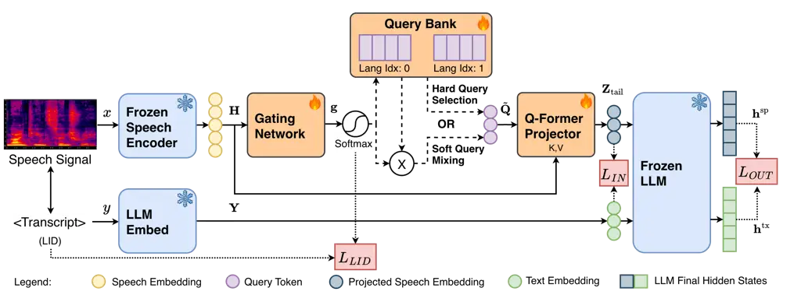

Gopal Wu Anshul Yue Heng Peng Li Liu Chng

# Language-Aware Distillation for Multilingual Instruction-Following Speech LLMs with ASR-Only Supervision

Shreyas    Donghang    Ashutosh    Yeo    Yizhou    Haoyang    Hexin   
Eng Siong

###### Abstract

Speech Large Language Models (LLMs) that understand and follow
instructions in many languages are useful for real-world interaction,
but are difficult to train with supervised fine-tuning, requiring large,
task-specific speech corpora. While recent distillation-based approaches
train performant English-only Speech LLMs using only annotated ASR data
by aligning text and speech using only a lightweight projector, these
models under-perform when scaled to multilingual settings due to
language interference in the shared projector. We address this by
introducing language-aware distillation using a query bank and a gating
network that selects or mixes query tokens using a Q-Former projector.
Our approach shows gains of 14% over matched multilingual distillation
baselines on instruction following. We further synthesize Audio–MLQA, a
multilingual spoken QA benchmark built on MLQA with high-quality TTS
questions. Our best model improves over existing Speech LLM baselines by
32% on Audio-MLQA.

###### keywords

speech language models, multi-lingual speech understanding, context
distillation, q-former

^(†)^(†)address: ¹ College of Computing and Data Science, Nanyang
Technological University, Singapore  
² AI Singapore, National University of Singapore  
³ Institute for Infocomm Research (I²R), A^(∗)STAR, Singapore
^(†)^(†)email: shreyas011@ntu.edu.sg; hexin.liu@ntu.edu.sg

## 1 Introduction

Speech Large Language Models (Speech LLMs) integrate a speech encoder
with a text LLM to support speech-conditioned understanding, reasoning,
and generation. Cascaded ASR-to-LLM pipelines convert speech signals to
text early in the ASR stage, leading to information beyond semantics
being discarded. In contrast, existing end-to-end approaches \[1, 2, 3\]
show that Speech LLMs can preserve paralinguistic information and
capture emotional cues. However, many recent Speech LLMs rely on
multi-stage training that combines large-scale pretraining with
supervised fine-tuning (SFT) \[4, 5, 6, 7\]. Other efforts scale
multilingual coverage through large training distributions and
specialized regional models \[8, 9, 10\]. While effective, these
pipelines require substantial training resources for SFT and commonly
fine-tune the speech encoder or the LLM, which can lead to poor
generation due to catastrophic forgetting \[11, 12\] while biasing
toward recent training data. The problem is exacerbated in multilingual
settings, where annotated data is inherently low-resource, annotation is
uneven across languages, and task-specific data is almost non-existent.

In such conditions, a common approach is to generate synthetic
task-specific training data using text-to-speech (TTS) systems \[13,
14\], which themselves require large amounts of data to train.
Alternatively, \[15\] propose alignment of discrete speech and text
tokens to generate pseudo-labels from text for non-English languages.
However, their supervision quality is limited by the reliability and
coverage of the pseudo-label generator. Alternatively, to reduce
training costs and avoid reliance on task-specific data, some recent
studies focus on speech–text alignment rather than large-scale SFT.
DiVA \[12\] adapts a frozen LLM to speech using paired ASR data via
context distillation. Similarly, BLSP \[16\] encourages consistent
generation when conditioned on speech versus the transcription,
improving semantic alignment via continuation writing.

Extending alignment-based Speech LLMs to multilingual settings reveals
critical architectural limitations in current projection methods. Prior
speech-to-LLM works \[12, 17, 18\] use a trainable Query-Transformer
(Q-Former) \[19\] style projector that learns a static sequence of query
tokens to align speech embeddings with transcript text embeddings. While
this shared projector facilitates some transfer across related
languages, we observe that a single, static query sequence proves
insufficient for capturing the distinct phonetic and semantic nuances as
the number and diversity of languages increases. Particularly for
distant pairs such as English and Chinese, this lack of
language-specific flexibility leads to performance degradation due to
language interference, where dominant languages in the training
distribution can overshadow lower-represented ones in the shared
representation space. This aligns with multilingual ASR findings where
explicit language conditioning is often beneficial \[20, 21\], and
language-aware routing and gating have also shown reduced interference
in multilingual systems \[22, 23\].

In this study we demonstrate how to extend ASR-only distillation and
behavior alignment toward robust multilingual speech understanding by
introducing a language-aware framework. Our aim is to train performant
multilingual Speech LLMs efficiently (using only 5.8K hours of data in
total to support 6 languages) and with minimal additional trainable
capacity, keeping the speech encoder and the LLM frozen. We also share
high-quality multi-lingual open-ended instruction following and
close-ended spoken question answering evaluation datasets to benefit
future research in this direction.

The main contributions of this work are:

- •
  We propose a novel language-aware distillation method for multilingual
  Speech LLMs requiring significantly fewer ASR-only training resources
- •
  We show consistent gains over a matched multilingual baseline and
  external models on open-ended instruction following and close-ended
  spoken QA tasks
- •
  We provide multilingual open-ended and close-ended evaluation data to
  support future benchmarking



Figure 1: End-to-end model architecture. Trainable components are
colored orange.

## 2 Methodology

Figure 1 illustrates our approach which consists of 4 components: (1) a
frozen speech encoder, (2) a Q-Former projector, (3) a frozen LLM and
(4) the query-selection module.

### 2.1 Model Architecture

Building on prior Speech LLM models, we train a lightweight adapter
using paired speech and transcript data. Given speech $`x`$ and
transcript $`y`$, the model learns a cross-modal projector that converts
speech embeddings into _text-like_ representations that act as a _soft
speech prefix_ for the frozen LLM to generate text.

Frozen Speech Encoder: We use the frozen Whisper-large-v3 encoder \[20\]
to compute speech embeddings
$`\mathbf{H}=E_{\text{sp}}(x)\in\mathbb{R}^{T\times d_{s}}`$, where
$`d_{s}`$ is the hidden size and $`T`$ is the number of time steps, and
$`x`$ stands for the speech input.

Frozen LLM and Text Embeddings: We use a frozen
Llama-SEA-LION-v3-8B-IT \[24\] as the text backbone. It is comparable in
scale to Llama3-8B \[25\] and provides better coverage for several
Southeast Asian languages especially low-resource languages (see
Table 2). Given tokens of text transcriptions,
$`\hat{y}=(\hat{y}_{1},\dots,\hat{y}_{N})`$, we obtain their input
embeddings from the frozen LLM embedding layer,
$`\mathbf{Y}=\text{Emb}(\hat{y})\in\mathbb{R}^{N\times d_{\ell}}`$. We
use $`\mathbf{Y}`$ as the teacher signal for input distillation and for
defining the text-conditioned teacher signal used in output distillation
(§2.3). Keeping the LLM frozen effectively prevents catastrophic
forgetting of reasoning ability.

Modality Adapter: The projector attends over $`\mathbf{H}`$ and produces
$`L`$ projected embeddings
$`\mathbf{Z}=P_{\theta}(\mathbf{Q},\mathbf{K},\mathbf{V})\in\mathbb{R}^{L\times d_{\ell}}`$,
with $`(\mathbf{K},\mathbf{V})=f(\mathbf{H})`$, where
$`\mathbf{Q}\in\mathbb{R}^{L\times d_{\ell}}`$ are learnable query
tokens. The output $`\mathbf{Z}`$ acts as a soft speech prefix for the
frozen LLM. We initialize queries with
$`\mathbf{Q}\sim\mathcal{N}(0,0.02^{2})`$, and projector weights from
whisper-large-v3 decoder following \[12\].

### 2.2 Language-Aware Distillation

Though the shared Q-Former projector shows some extent of cross-lingual
transfer for related languages, a single shared query sequence can
struggle as the number and diversity of languages increases. In
practice, languages that dominate the data distribution (and their
nearby languages) tend to improve, while distant and lower-represented
languages degrade due to interference. Hence, we introduce a _query
bank_ and a _gating network_ that selects or mixes queries conditioned
on the input speech to better disentangle language-specific information.

#### 2.2.1 Query Bank and Gating Network

Let $`K`$ be the number of languages. We maintain a bank of learnable
query tokens
$`\mathcal{B}=\{\mathbf{Q}^{(k)}\in\mathbb{R}^{L\times d_{\ell}}\}_{k=1}^{K}`$,
where $`\mathbf{Q}^{(k)}`$ denotes the query sequence for language
$`k`$. The projector is conditioned on effective query input
$`\tilde{\mathbf{Q}}`$, obtained by mixing queries across languages or
selecting a single language query.

Given speech embeddings $`\mathbf{H}\in\mathbb{R}^{T\times d_{s}}`$, the
gating network outputs language logits
$`\mathbf{g}=G_{\phi}(\mathbf{H})\in\mathbb{R}^{K}`$. We implement
$`G_{\phi}`$ using either (i) a convolutional LID-style network with
temporal down-sampling followed by pooling, or (ii) a lightweight
attention-pooling MLP that pools $`\mathbf{H}`$ into an utterance
vector. Both variants produce the same logits $`\mathbf{g}`$ and differ
only in how the utterance-level summary is computed. The logits
$`\mathbf{g}`$ are then used for soft query mixing or hard query
selection to prepare $`\tilde{\mathbf{Q}}`$. The performance of both
query selection methods (soft vs. hard), and gating designs (conv vs.
attn) are compared in § 4.3.

Soft Query Mixing: The mixture weights are computed as
$`\boldsymbol{\pi}=\mathrm{softmax}(\mathbf{g})`$ and the mixed query is
formed as
$`\tilde{\mathbf{Q}}_{\text{soft}}=\sum_{k=1}^{K}\pi_{k}\,\mathbf{Q}^{(k)}`$.
This allows smooth information sharing across related languages while
retaining language-specific features and emphasis through
$`\boldsymbol{\pi}`$.

Hard Query Selection: We select a single language index
$`k^{*}=\arg\max_{k}g_{k}`$ and use
$`\tilde{\mathbf{Q}}_{\text{hard}}=\mathbf{Q}^{(k^{*})}`$ in the forward
pass. To stabilize training, we use a straight-through estimator and
backpropagate through the soft mixture:
$`\tilde{\mathbf{Q}}\leftarrow\tilde{\mathbf{Q}}_{\text{hard}}+\big(\tilde{\mathbf{Q}}_{\text{soft}}-\mathrm{stopgrad}(\tilde{\mathbf{Q}}_{\text{soft}})\big)`$.
This keeps selection discrete for inference, providing significant
emphasis for each language, but allows the gate to learn from downstream
distillation losses.

#### 2.2.2 Scheduled Teacher Forcing

Each training sample is loosely annotated with a language label
$`\ell`$. Early on, due to random query initialization, we apply
scheduled teacher forcing for query selection to stabilise training. At
step $`s`$, with probability $`p_{\text{tf}}(s)`$ we set
$`k^{*}\leftarrow\ell`$; otherwise we use the model prediction. We
anneal $`p_{\text{tf}}(s)`$ from $`1`$ to $`0`$ with a cosine schedule
such that $`p_{\text{tf}}=0`$ at $`50\%`$ of the training steps.

### 2.3 Training Objective

The loss function consists of three components: language identification
loss, input distillation loss, and output distillation loss.

Language identification loss: We supervise the gating network using
cross-entropy on the language logits $`\mathbf{g}\in\mathbb{R}^{K}`$
with language labels $`\ell`$. We ignore samples with unknown labels
(encoded as $`-1`$). Let $`\mathcal{I}=\{b\mid\ell_{b}\geq 0\}`$ denote
the set of valid samples in a batch with size $`B`$. The LID loss is

```math
\mathcal{L}_{\text{LID}}=-\frac{1}{|\mathcal{I}|}\sum_{b\in\mathcal{I}}\log\mathrm{softmax}(\mathbf{g}_{b})_{\ell_{b}} \tag{1}
```

Input distillation loss: We encourage the projected speech embeddings
$`\mathbf{Z}`$ to match the transcript-derived LLM input embeddings
$`\mathbf{Y}`$. Since the speech sequence is typically longer than the
transcript, we align the first $`T`$ transcript embeddings with the last
$`T`$ projected speech embeddings (the “audio tail”), i.e.,
$`\mathbf{Y}_{\text{head}}=\mathbf{Y}_{1:T}`$ and
$`\mathbf{Z}_{\text{tail}}=\mathbf{Z}_{L-T+1:L}`$. The loss is only
computed over valid (non-padding) transcript positions using a mask
$`\mathbf{m}\in\{0,1\}^{T}`$, where $`N_{b}=\sum_{t=1}^{T}m_{b,t}`$.
Using $`L_{2}(\cdot,\cdot)`$ to denote $`L_{2}`$ distance, the input
distillation loss is:

```math
\mathcal{L}_{\text{IN}}=\frac{1}{B}\sum_{b=1}^{B}\frac{1}{\max(1,N_{b})}\sum_{t=1}^{T}m_{b,t}\,L_{2}\left(\mathbf{Z}^{(b)}_{\text{tail},t},\mathbf{Y}^{(b)}_{\text{head},t}\right) \tag{2}
```

Output distillation loss: In order to match LLM behavior under speech
versus transcript conditioning, we align the final hidden
representations produced by the frozen LLM. Let
$`\mathbf{h}^{\text{sp}}_{b,t}\in\mathbb{R}^{d_{\ell}}`$ be the
last-layer hidden state at position $`t`$ when the LLM is conditioned on
speech (via $`\mathbf{Z}`$), and let
$`\mathbf{h}^{\text{tx}}_{b}\in\mathbb{R}^{d_{\ell}}`$ be the
corresponding teacher vector obtained from transcript-only conditioning
(detached from gradients). For each sample we extract the hidden state
at the last non-padding token index $`t_{b}`$. The output distillation
loss is

```math
\mathcal{L}_{\text{OUT}}=\frac{1}{B}\sum_{b=1}^{B}L_{2}\left(\mathbf{h}^{\text{sp}}_{b,t_{b}},\ \mathbf{h}^{\text{tx}}_{b}\right) \tag{3}
```

$`L_{IN}`$ provides coarse prefix–text embedding alignment, avoiding
frame alignment \[12\]. $`L_{OUT}`$ matches
speech/transcript-conditioned LLM hidden states. The final loss function
is:

```math
\mathcal{L}=\lambda_{\text{IN}}\mathcal{L}_{\text{IN}}+\lambda_{\text{OUT}}\mathcal{L}_{\text{OUT}}+\lambda_{\text{LID}}\mathcal{L}_{\text{LID}},\\
 \tag{4}
```

where $`\lambda_{\text{IN}}`$, $`\lambda_{\text{OUT}}`$ and
$`\lambda_{\text{LID}}`$ are the loss weights.

## 3 Experiments

### 3.1 Training Data

Only annotated ASR data was used during the training of the model. The
various sources and amounts of data are detailed in Table 1. We filter
out audio samples with word error rate (WER%) greater than 10% from
expert ASR models.

### 3.2 Evaluation Data

| Dataset          | Language | Hours | \#Samples |
| ---------------- | -------- | ----- | --------- |
| CV21 \[26\]      | EN       | 1750  | 1.10M     |
| ViVoice \[27\]   | VI       | 900   | 0.785M    |
| YODAS2 \[28\]    | ID       | 950   | 0.996M    |
| MagicData \[29\] | ZH       | 755   | 0.500M    |
| CV24 \[26\]      | ZH       | 100   | 0.030M    |
| CV24 \[26\]      | ES       | 515   | 0.357M    |
| CV24 \[26\]      | DE       | 900   | 0.569M    |
| Total            |          | 5870  | 4.33M     |

Table 1: Breakdown of ASR training data by language, number of hours,
and sample count. CV is CommonVoice.

Due to the lack of established evaluation benchmarks for multilingual
speech understanding tasks, we have also developed in-house synthetic
evaluation data to support our findings in addition to existing
benchmarks. Data used for evaluation is “unseen” during training with no
speaker overlap in training and evaluation data. All high-quality
synthetic audio is generated at 44.1KHz using state-of-the-art
commercially available TTS.

#### 3.2.1 Open-Ended Evaluation Dataset

We evaluate three languages in the open-ended benchmark and test the
ability of the model to understand the spoken instruction and generate a
relevant response. For Chinese (ZH), we use the _AlpacaEval-zh_ split
from UROBench \[30\], which contains 147 open-ended
instruction-following samples derived and translated from
VoiceBench \[31\]. For English (EN), we use the ALPACA-Audio and
OpenHermes-Audio subsets from AudioBench \[32\], each containing 100
samples (200 total). For Indonesian (ID), we translate the English
ALPACA-Audio and OpenHermes-Audio prompts into Indonesian with the help
of expert native speakers, and synthesized the corresponding audio
prompts using state-of-the-art TTS systems with a fixed pool of 2 male
and 2 female high-quality voices.

#### 3.2.2 Close-Ended Evaluation Dataset - Audio–MLQA

To evaluate whether the model can align spoken questions with key words
and phrases from textual context, we build a close-ended spoken QA
benchmark; Audio-MLQA. The benchmark can be used to evaluate 5
languages: English (EN), Vietnamese (VI), Spanish (ES), German (DE), and
Chinese (ZH). We source text context and questions from MLQA \[33\],
which provides multilingual textual QA data. We randomly sample 250
items per language and synthesize the spoken questions using
state-of-the-art TTS systems. To reduce the speaker-specific bias, we
use a fixed pool of 10 voices per language (5 male and 5 female) and
randomly assign one voice to each sample.

### 3.3 Evaluation Metric

Similar to AudioBench \[32\] and VoiceBench \[31\], we use a
Model-as-Judge evaluation method. Prior work such as PEDANTS \[34\]
shows that model-based evaluation, especially with strong GPT-level
judges, aligns closely with human judgment when applied correctly. We
therefore use GPT-4.1 as the judge model. Each evaluation sample is
scored independently on a 0–5 scale, and we report the mean score.
Judging prompts are task-specific and shared in the supplementary
material.

### 3.4 Experimental Setup

All experiments were conducted on 4 NVIDIA H100 GPUs with an effective
batch size of 288 (24 per GPU with gradient accumulation of 3). We train
using DeepSpeed ZeRO Stage 2 and BF16 mixed precision. We use a linear
warm-up for the first 400 steps followed by cosine annealing with a peak
learning rate of $`5.6\times 10^{-5}`$. Optimization is performed with
AdamW ($`\beta_{1}=0.9`$, $`\beta_{2}=0.999`$) and early stopping with a
patience of 6 validation checks (2000 steps). We initialize the Whisper
encoder, projector, and LLM from pretrained HuggingFace checkpoints. To
ensure fair comparison, all systems are evaluated using the same
prompts, judge model, and scoring protocol.

|                                      |                                     |      |      |      |      |                                  |                                   |      |      |                                  |      |      |                                   |
| ------------------------------------ | ----------------------------------- | ---- | ---- | ---- | ---- | -------------------------------- | --------------------------------- | ---- | ---- | -------------------------------- | ---- | ---- | --------------------------------- |
| Model                                | Close-ended (A-MLQA) ($`\uparrow`$) |      |      |      |      |                                  | Open-ended ($`\uparrow`$)         |      |      |                                  |      |      |                                   |
|                                      | EN                                  | VI   | ES   | DE   | ZH   | Avg                              | ZH                                | EN   |      |                                  | ID   |      |                                   |
|                                      |                                     |      |      |      |      |                                  | AE                                | AE   | OH   | Avg                              | AE   | OH   | Avg                               |
| Text-only reference                  |                                     |      |      |      |      |                                  |                                   |      |      |                                  |      |      |                                   |
| SEA-LION-v3-8B-IT                    | 4.34                                | 4.10 | 4.19 | 4.08 | 3.98 | 4.14                             | 4.21                              | 4.59 | 4.44 | 4.52                             | 4.19 | 3.85 | 4.02                              |
| Cascaded                             |                                     |      |      |      |      |                                  |                                   |      |      |                                  |      |      |                                   |
| Whisper-v3 + SEA-LION-v3-8B-IT       | 4.20                                | 3.75 | 4.09 | 4.01 | 3.94 | 3.99                             | 3.95                              | 3.99 | 4.17 | 4.08                             | 3.68 | 3.61 | 3.65                              |
| Zero-shot end-to-end                 |                                     |      |      |      |      |                                  |                                   |      |      |                                  |      |      |                                   |
| Glm-4-voice \[35\]                   | 3.04                                | –    | –    | –    | 2.86 | 2.95                             | 3.41                              | 3.62 | 3.72 | 3.67                             | –    | –    | –                                 |
| MERaLiON-2-10B \[8\]                 | 1.73                                | 0.90 | 1.28 | 1.31 | 1.32 | 1.31                             | 1.96                              | 4.59 | 4.06 | 4.33                             | 3.59 | 3.06 | 3.33                              |
| SeaLLMs-Audio \[9\]                  | 3.74                                | 2.66 | 2.60 | 2.54 | 3.41 | 2.99                             | 3.72                              | 3.93 | 3.37 | 3.65                             | 3.78 | 3.27 | 3.53                              |
| Qwen2-Audio \[5\]                    | 3.54                                | –    | 3.37 | 3.09 | 3.38 | 3.02                             | 3.65                              | 3.77 | 3.65 | 3.71                             | –    | –    | –                                 |
| Distilled end-to-end                 |                                     |      |      |      |      |                                  |                                   |      |      |                                  |      |      |                                   |
| EN-DiVA \[12\] (re-trained baseline) | 4.12                                | –    | –    | –    | –    | 4.12                             | –                                 | 3.57 | 3.28 | 3.43                             | –    | –    | –                                 |
| ML-DiVA \[12\] (re-trained baseline) | 4.09                                | 3.64 | 4.02 | 3.97 | 3.55 | 3.85                             | 2.87                              | 4.28 | 4.03 | 4.16                             | 2.96 | 3.11 | 3.04                              |
| Ours (soft-gating)                   | 4.12                                | 3.68 | 4.03 | 4.02 | 3.56 | 3.88 \textcolorteal$`\uparrow`$1 | 3.21 \textcolorteal$`\uparrow`$12 | 4.58 | 4.29 | 4.44 \textcolorteal$`\uparrow`$7 | 3.66 | 3.58 | 3.62 \textcolorteal$`\uparrow`$19 |
| Ours (hard-gating)                   | 4.16                                | 3.72 | 4.13 | 4.07 | 3.70 | 3.96 \textcolorteal$`\uparrow`$3 | 3.33 \textcolorteal$`\uparrow`$16 | 4.39 | 4.42 | 4.41 \textcolorteal$`\uparrow`$6 | 3.76 | 3.66 | 3.71 \textcolorteal$`\uparrow`$22 |

Languages: EN = English, ID = Indonesian, ZH = Chinese-Simplified, VI =
Vietnamese, ES = Spanish, DE = German  
Datasets: AE = Audio-AlpacaEval, OH = Audio-OpenHermes, A-MLQA =
Audio-MLQA

Table 2: GPT-4.1 Model-as-Judge scores for open-ended instruction
following and close-ended spoken QA. Higher is better ($`\uparrow`$). To
keep comparison fair, if a model does not support a language, the score
has been left blank. EN-DiVA and ML-DiVA are matched DiVA \[12\]
baseline models trained on English-only ASR data and Multilingual ASR
data respectively from our pool of training data.

## 4 Results

In the cascaded baseline system, the LLM directly receives the
transcription of the speech instruction from whisper-large-v3. We also
establish the two matched baselines EN-DiVA (_which is closest to the
original DiVA model_) and ML-DiVA trained on only the English subset and
the entire training dataset respectively. Simply scaling data and adding
additional languages (notably similar languages such as German and
Spanish) improves open-ended EN performance by 21% (ML-DiVA), likely due
to (i) shared linguistic structure and (ii) increased data diversity and
volume. Next we detail gains obtained using our approach.

### 4.1 Open-Ended Evaluation

For this task, all models are evaluated without a preferred reference
answer, and the MaJ (GPT-4.1) evaluates the subjective correctness of
the response. As expected, the text-only LLM (SEA-LION-v3-8B-IT) acts as
the performance upper bound of the proposed method across all languages.
Our best approach (hard-gating) achieves an average gain of 14% over
ML-DiVA on instruction following. Notably, in the Indonesian (ID) task,
our model improves the average score from $`3.04`$ (ML-DiVA) to
$`3.71`$, demonstrating the effectiveness of language-aware routing in
protecting lower-represented languages from interference. Our approach
also performs better than existing Speech LLMs for all languages other
than ZH (least similar language).

### 4.2 Close-Ended Evaluation

On Audio-MLQA, our model improves over strong baselines \[9\] and \[4\]
by 32% and 31%. This result is expected for close-ended QA, where
performance relies heavily on speech–text alignment. However,
language-aware distillation still provides consistent additional gains,
as the hard-gating variant reaches a close-ended average of $`3.96`$, a
$`\sim`$3% improvement over ML-DiVA and close to the text-only reference
($`4.14`$). In contrast, some SFT-based models (e.g., MERaLiON-2-10B)
sometimes fail to align the audio question with the textual context and
default to generic “answer not found” responses, indicating weaker
generalization to varied task instructions.

### 4.3 Ablation Studies

|                             |                                                          |                                                         |                       |
| --------------------------- | -------------------------------------------------------- | ------------------------------------------------------- | --------------------- |
| Variant                     | $`\boldsymbol{\mathcal{L}_{\text{OUT}}}`$ $`\downarrow`$ | $`\boldsymbol{\mathcal{L}_{\text{IN}}}`$ $`\downarrow`$ | LID Acc. $`\uparrow`$ |
| $`L=64`$                    | 57.92                                                    | 8.63                                                    | –                     |
| $`L=128`$                   | 40.69                                                    | 1.16                                                    | –                     |
| $`\mathbf{L}=\mathbf{256}`$ | 39.47                                                    | 0.97                                                    | –                     |
| + Conv. DS + Pool Gate      | 37.31                                                    | 0.84                                                    | 95.15%                |
| + Attn. Pool Gate           | 36.93                                                    | 0.94                                                    | 94.97%                |

Table 3: Ablations on query length $`L`$ and gating design. We report
validation losses for input and output distillation
($`\mathcal{L}_{\text{IN}}`$, $`\mathcal{L}_{\text{OUT}}`$); for gating
variants we additionally report LID accuracy.

We perform ablation studies to evaluate the impact of query length
$`L`$, routing modes, and gating network architectures on model
performance (Table 3). First, we evaluate query length $`L`$ using a
static shared sequence; Increasing $`L`$ from 64 to 256 reduces input
distillation loss by 89% ($`8.63\rightarrow 0.97`$), suggesting that
higher capacity is important for capturing complex phonetic–semantic
mappings. Second, both proposed language-aware gating mechanisms (Conv.
DS and Attn. Pool) show strong performance, achieving language
identification (LID) accuracy exceeding 94.9%. This supports accurate
routing of speech features and indicates that dynamic query selection
facilitates cross-modal alignment regardless of the specific gating
architecture. Finally, we find that hard query selection consistently
outperforms soft mixing in downstream tasks (shown in Table 2). This
suggests that hard-gating provides stronger decoupling of
language-specific information and avoids an “averaging” effect where
dominant languages can still interfere with lower-represented ones
during retrieval.

## 5 Conclusion

In this study, we introduce a language-aware distillation framework to
resolve the language interference bottleneck in distilled multilingual
Speech LLMs. By replacing static query sequences with a dynamic query
bank and gating mechanism, we effectively disentangle language-specific
information while maintaining high data efficiency. Our results
demonstrate that this architecture allows performant multilingual
interaction using only 5.8K hours of ASR data while keeping the backbone
speech encoder and LLM frozen. This approach offers a scalable and
resource-efficient paradigm for extending advanced speech understanding
to a broader range of global languages.

## 6 Generative AI Use Disclosure

Generative AI tools were used for limited assistance with manuscript
editing and presentation (e.g., grammatical validation, removal of
redundant sentences and phrases, preparing LaTeX equations and LaTeX
formatting suggestions). The literature review, and all scientific
contributions including but not limited to problem formulation,
methodology, experiments, results, and conclusions were performed by the
authors. All authors reviewed the content and are responsible for the
final submission.

## References

- \[1\] C. Wang M. Liao et al. (2024) Blsp-emo: towards empathetic large
  speech-language models. In Proceedings of the 2024 Conference on
  Empirical Methods in Natural Language Processing, pp. 19186–19199.
  Cited by: §1.
- \[2\] Q. Wang H. B. Sailor et al. (2025) Benchmarking contextual and
  paralinguistic reasoning in speech-LLMs: a case study with in-the-wild
  data. In Findings of the Association for Computational Linguistics:
  EMNLP 2025, Suzhou, China, pp. 14133–14148. External Links:
  [Link](https://aclanthology.org/2025.findings-emnlp.760/),
  [Document](https://dx.doi.org/10.18653/v1/2025.findings-emnlp.760),
  ISBN 979-8-89176-335-7 Cited by: §1.
- \[3\] T. A. Nguyen, E. Kharitonov, J. Copet, Y. Adi, W. Hsu, A.
  Elkahky, P. Tomasello, R. Algayres, B. Sagot, A. Mohamed, et
  al. (2023) Generative spoken dialogue language modeling. Transactions
  of the Association for Computational Linguistics 11, pp. 250–266.
  Cited by: §1.
- \[4\] Y. Chu J. Xu et al. (2023) Qwen-audio: advancing universal audio
  understanding via unified large-scale audio-language models. arXiv
  preprint arXiv:2311.07919. Cited by: §1, §4.2.
- \[5\] Y. Chu J. Xu et al. (2024) Qwen2-audio technical report. arXiv
  preprint arXiv:2407.10759. Cited by: §1, Table 2.
- \[6\] C. Tang, W. Yu, G. Sun, X. Chen, T. Tan, W. Li, L. Lu, Z. MA,
  and C. Zhang (2024) SALMONN: towards generic hearing abilities for
  large language models. In The Twelfth International Conference on
  Learning Representations, External Links:
  [Link](https://openreview.net/forum?id=14rn7HpKVk) Cited by: §1.
- \[7\] Z. Chen, H. Huang, A. Andrusenko, O. Hrinchuk, K. C. Puvvada, J.
  Li, S. Ghosh, J. Balam, and B. Ginsburg (2024) SALM: speech-augmented
  language model with in-context learning for speech recognition and
  translation. In ICASSP 2024 - 2024 IEEE International Conference on
  Acoustics, Speech and Signal Processing (ICASSP), Vol. ,
  pp. 13521–13525. External Links:
  [Document](https://dx.doi.org/10.1109/ICASSP48485.2024.10447553) Cited
  by: §1.
- \[8\] Y. He, Z. Liu, G. Lin, S. Sun, B. Wang, W. Zhang, X. Zou, N. F.
  Chen, and A. Aw (2025) MERaLiON-AudioLLM: advancing speech and
  language understanding for Singapore. In Proceedings of the 63rd
  Annual Meeting of the Association for Computational Linguistics
  (Volume 3: System Demonstrations), P. Mishra, S. Muresan, and T. Yu
  (Eds.), Vienna, Austria, pp. 22–30. External Links:
  [Link](https://aclanthology.org/2025.acl-demo.3/),
  [Document](https://dx.doi.org/10.18653/v1/2025.acl-demo.3), ISBN
  979-8-89176-253-4 Cited by: §1, Table 2.
- \[9\] C. Liu M. Aljunied et al. (2025) SeaLLMs-audio: large
  audio-language models for southeast asia. External Links: 2511.01670,
  [Link](https://arxiv.org/abs/2511.01670) Cited by: §1, Table 2, §4.2.
- \[10\] Q. Fang, Y. Zhou, S. Guo, S. Zhang, and Y. Feng (2025)
  LLaMA-omni 2: llm-based real-time spoken chatbot with autoregressive
  streaming speech synthesis. In Proceedings of the 63rd Annual Meeting
  of the Association for Computational Linguistics (Volume 1: Long
  Papers), pp. 18617–18629. Cited by: §1.
- \[11\] C. Hsiao, K. Lu, K. Chang, C. Yang, W. Chen, and H. Lee (2025)
  Analyzing Mitigation Strategies for Catastrophic Forgetting in
  End-to-End Training of Spoken Language Models. In Interspeech 2025,
  pp. 3234–3238. External Links:
  [Document](https://dx.doi.org/10.21437/Interspeech.2025-409), ISSN
  2958-1796 Cited by: §1.
- \[12\] W. Held, Y. Zhang, M. Li, W. Shi, M. J. Ryan, and D.
  Yang (2025) Distilling an end-to-end voice assistant without
  instruction training data. In Proceedings of the 63rd Annual Meeting
  of the Association for Computational Linguistics (Volume 1: Long
  Papers), W. Che, J. Nabende, E. Shutova, and M. T. Pilehvar (Eds.),
  Vienna, Austria, pp. 7876–7891. External Links:
  [Link](https://aclanthology.org/2025.acl-long.388/),
  [Document](https://dx.doi.org/10.18653/v1/2025.acl-long.388), ISBN
  979-8-89176-251-0 Cited by: §1, §1, §1, §2.1, §2.3, Table 2, Table 2,
  Table 2.
- \[13\] N. Majumder, C. Hung, D. Ghosal, W. Hsu, R. Mihalcea, and S.
  Poria (2024) Tango 2: aligning diffusion-based text-to-audio
  generative models through direct preference optimization. In ACM
  Multimedia 2024, External Links:
  [Link](https://openreview.net/forum?id=7lqptq5dLG) Cited by: §1.
- \[14\] V. Noroozi, Z. Chen, S. Majumdar, S. Huang, J. Balam, and B.
  Ginsburg (2024) Instruction Data Generation and Unsupervised
  Adaptation for Speech Language Models. In Interspeech 2024,
  pp. 4049–4053. External Links:
  [Document](https://dx.doi.org/10.21437/Interspeech.2024-1575), ISSN
  2958-1796 Cited by: §1.
- \[15\] A. Dao, D. B. Vu, H. H. Ha, T. L. D. Anh, S. Gopal, Y. H.
  Yeo, W. K. H. Low, E. S. Chng, and J. Q. Yip (2025) Speechless: Speech
  Instruction Training Without Speech for Low Resource Languages. In
  Interspeech 2025, pp. 3239–3243. External Links:
  [Document](https://dx.doi.org/10.21437/Interspeech.2025-1292), ISSN
  2958-1796 Cited by: §1.
- \[16\] C. Wang, M. Liao, Z. Huang, J. Lu, J. Wu, Y. Liu, C. Zong,
  and J. Zhang (2023) Blsp: bootstrapping language-speech pre-training
  via behavior alignment of continuation writing. arXiv preprint
  arXiv:2309.00916. Cited by: §1.
- \[17\] L. Dong, Z. Yu, W. Wang, Y. Huang, S. Gao, and G. Zhou (2024)
  Integrating Speech Self-Supervised Learning Models and Large Language
  Models for ASR. In Interspeech 2024, pp. 3954–3958. External Links:
  [Document](https://dx.doi.org/10.21437/Interspeech.2024-1760), ISSN
  2958-1796 Cited by: §1.
- \[18\] H. Shang, Z. Li, J. Guo, S. Li, Z. Rao, Y. Luo, D. Wei, and H.
  Yang (2024) An End-to-End Speech Summarization Using Large Language
  Model. In Interspeech 2024, pp. 1950–1954. External Links:
  [Document](https://dx.doi.org/10.21437/Interspeech.2024-1428), ISSN
  2958-1796 Cited by: §1.
- \[19\] J. Li, D. Li, S. Savarese, and S. Hoi (2023) BLIP-2:
  bootstrapping language-image pre-training with frozen image encoders
  and large language models. In Proceedings of the 40th International
  Conference on Machine Learning, ICML’23. Cited by: §1.
- \[20\] A. Radford, J. W. Kim, T. Xu, G. Brockman, C. Mcleavey, and I.
  Sutskever (2023) Robust speech recognition via large-scale weak
  supervision. In Proceedings of the 40th International Conference on
  Machine Learning, A. Krause, E. Brunskill, K. Cho, B. Engelhardt, S.
  Sabato, and J. Scarlett (Eds.), Proceedings of Machine Learning
  Research, Vol. 202, pp. 28492–28518. External Links:
  [Link](https://proceedings.mlr.press/v202/radford23a.html) Cited by:
  §1, §2.1.
- \[21\] C. Y. Kwok, H. Liu, J. Q. Yip, S. Li, and E. S. Chng (2025) A
  two-stage lora strategy for expanding language capabilities in
  multilingual asr models. IEEE Transactions on Audio, Speech and
  Language Processing 33 (), pp. 2576–2590. External Links:
  [Document](https://dx.doi.org/10.1109/TASLPRO.2025.3578752) Cited by:
  §1.
- \[22\] W. Wang, G. Ma, Y. Li, and B. Du (2023) Language-Routing
  Mixture of Experts for Multilingual and Code-Switching Speech
  Recognition. In Interspeech 2023, pp. 1389–1393. External Links:
  [Document](https://dx.doi.org/10.21437/Interspeech.2023-2292), ISSN
  2958-1796 Cited by: §1.
- \[23\] J. Li, Q. Su, Y. Yang, Y. Jiang, C. Wang, and H. Xu (2023)
  Adaptive gating in mixture-of-experts based language models. In
  Proceedings of the 2023 Conference on Empirical Methods in Natural
  Language Processing, H. Bouamor, J. Pino, and K. Bali (Eds.),
  Singapore, pp. 3577–3587. External Links:
  [Link](https://aclanthology.org/2023.emnlp-main.217/),
  [Document](https://dx.doi.org/10.18653/v1/2023.emnlp-main.217) Cited
  by: §1.
- \[24\] R. Ng T. N. Nguyen et al. (2025) SEA-LION: Southeast Asian
  languages in one network. In Proceedings of the 14th International
  Joint Conference on Natural Language Processing and the 4th Conference
  of the Asia-Pacific Chapter of the Association for Computational
  Linguistics, Mumbai, India, pp. 512–526. External Links:
  [Link](https://aclanthology.org/2025.ijcnlp-long.30/),
  [Document](https://dx.doi.org/10.18653/v1/2025.ijcnlp-long.30), ISBN
  979-8-89176-298-5 Cited by: §2.1.
- \[25\] A. Grattafiori, A. Dubey, A. Jauhri, A. Pandey, A. Kadian, A.
  Al-Dahle, A. Letman, A. Mathur, A. Schelten, A. Vaughan, et al. (2024)
  The llama 3 herd of models. arXiv preprint arXiv:2407.21783. Cited by:
  §2.1.
- \[26\] R. Ardila M. Branson et al. (2020) Common voice: a
  massively-multilingual speech corpus. In Proceedings of the Twelfth
  Language Resources and Evaluation Conference, Marseille, France,
  pp. 4218–4222 (eng). External Links:
  [Link](https://aclanthology.org/2020.lrec-1.520/), ISBN
  979-10-95546-34-4 Cited by: Table 1, Table 1, Table 1, Table 1.
- \[27\] Capleaf (2024) viVoice: enabling vietnamese multi-speaker
  speech synthesis. In Hugging Face, Note: License: CC BY-NC-SA 4.0
  (gated access) External Links:
  [Link](https://huggingface.co/datasets/capleaf/viVoice) Cited by:
  Table 1.
- \[28\] X. Li, S. Takamichi, T. Saeki, W. Chen, S. Shiota, and S.
  Watanabe (2023) Yodas: youtube-oriented dataset for audio and speech.
  In 2023 IEEE Automatic Speech Recognition and Understanding Workshop
  (ASRU), pp. 1–8. Cited by: Table 1.
- \[29\] Magic Data Technology Co., Ltd. (2019) Magic data open source
  corpus (id: 101). Note:
  [http://www.imagicdatatech.com/index.php/home/dataopensource/data_info/id/101](http://www.imagicdatatech.com/index.php/home/dataopensource/data_info/id/101)Accessed:
  2026-02-25 Cited by: Table 1.
- \[30\] R. Yan X. Li et al. (2025) URO-bench: towards comprehensive
  evaluation for end-to-end spoken dialogue models. In Findings of the
  Association for Computational Linguistics: EMNLP 2025, Suzhou, China,
  pp. 17211–17242. External Links:
  [Link](https://aclanthology.org/2025.findings-emnlp.933/),
  [Document](https://dx.doi.org/10.18653/v1/2025.findings-emnlp.933),
  ISBN 979-8-89176-335-7 Cited by: §3.2.1.
- \[31\] Y. Chen X. Yue et al. (2026) VoiceBench: benchmarking LLM-based
  voice assistants. Transactions of the Association for Computational
  Linguistics 14, pp. 378–398. External Links:
  [Link](https://aclanthology.org/2026.tacl-1.18/),
  [Document](https://dx.doi.org/10.1162/tacl.a.628) Cited by: §3.2.1,
  §3.3.
- \[32\] B. Wang X. Zou et al. (2025) AudioBench: a universal benchmark
  for audio large language models. In Proceedings of the 2025 Conference
  of the Nations of the Americas Chapter of the Association for
  Computational Linguistics: Human Language Technologies (Volume 1: Long
  Papers), Albuquerque, New Mexico, pp. 4297–4316. External Links:
  [Link](https://aclanthology.org/2025.naacl-long.218/),
  [Document](https://dx.doi.org/10.18653/v1/2025.naacl-long.218), ISBN
  979-8-89176-189-6 Cited by: §3.2.1, §3.3.
- \[33\] P. Lewis, B. Oguz, R. Rinott, S. Riedel, and H. Schwenk (2020)
  MLQA: evaluating cross-lingual extractive question answering. In
  Proceedings of the 58th annual meeting of the association for
  computational linguistics, pp. 7315–7330. Cited by: §3.2.2.
- \[34\] Z. Li, I. Mondal, H. Nghiem, Y. Liang, and J.
  Boyd-Graber (2024) PEDANTS: cheap but effective and interpretable
  answer equivalence. In Findings of the Association for Computational
  Linguistics: EMNLP 2024, Y. Al-Onaizan, M. Bansal, and Y. Chen (Eds.),
  Miami, Florida, USA, pp. 9373–9398. External Links:
  [Link](https://aclanthology.org/2024.findings-emnlp.548/),
  [Document](https://dx.doi.org/10.18653/v1/2024.findings-emnlp.548)
  Cited by: §3.3.
- \[35\] A. Zeng, Z. Du, M. Liu, K. Wang, S. Jiang, L. Zhao, Y. Dong,
  and J. Tang (2024) Glm-4-voice: towards intelligent and human-like
  end-to-end spoken chatbot. arXiv preprint arXiv:2412.02612. Cited by:
  Table 2.
