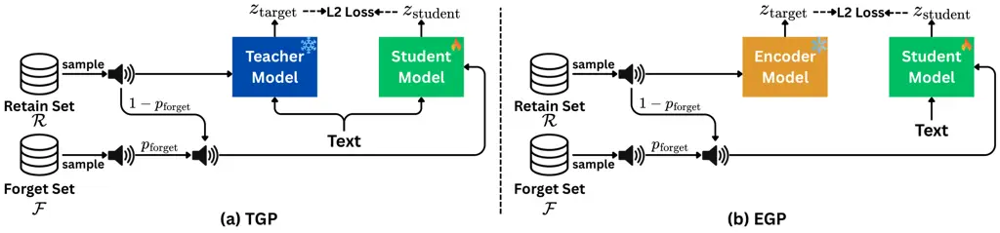

# Speech Generation Speaker Poisoning: Capability Erasure in Zero-Shot Text-to-Speech

Thanathai Lertpetchpun^(1,∗), Thanapat Trachu^(2,∗), Sai Praneeth
Karimireddy², and Shrikanth Narayanan¹ Affiliation: ¹Signal Analysis and
Interpretation Laboratory, University of Southern California  
²Thomas Lord Department of Computer Science, University of Southern
California  
Los Angeles, CA, USA  
lertpetc@usc.edu  
^(∗)Equal contribution

###### Abstract

Recent zero-shot Text-to-Speech (TTS) systems can clone previously
unseen voices from only a few seconds of audio. We formulate _Speech
Generation Speaker Poisoning_ (SGSP), a task that seeks to prevent a
model from synthesizing targeted speaker identities while maintaining
performance on all other speakers. Unlike conventional machine
unlearning, removing training examples is insufficient because modern
zero-shot TTS systems can reconstruct identities through learned speaker
representations and strong generalization capabilities. We evaluate both
inference-time filtering and parameter-modification approaches across
settings involving 1, 15, and 100 forget speakers, focusing primarily on
speakers seen during training, which we show are harder to suppress than
unseen speakers. To characterize the trade-off between utility and
privacy, we introduce an evaluation framework based on AUC analysis and
a proposed metric, Forget Set Similarity (FSSIM). Our results
demonstrate effective speaker suppression for up to 15 forget speakers
while revealing that worst-case identity leakage (Max-FSSIM) remains
unresolved at multi-speaker scale — establishing this as an open
challenge for future work. Together, our work establishes targeted
speaker poisoning as a task for zero-shot TTS and, using StyleTTS2 as an
initial testbed, provides methods and evaluation protocols for future
research, with code and model weights¹¹ 1
https://github.com/NewGamezzz/TargetedSpeakerPoisoning.

###### Index Terms: 

Text-To-Speech Model, Poisoning Generation Model, Speech Privacy, Speech
Generation

## I Introduction

The rapid evolution of generative AI has advanced Text-to-Speech (TTS)
systems far beyond conventional speech synthesis, enabling high-fidelity
voice cloning from audio prompts as short as three seconds. Recent
models \[1, 2, 3\] demonstrate remarkable expressiveness and speaker
similarity. However, this capability also introduces serious real-world
risks. Studies \[4\] show that human listeners struggle to distinguish
AI-generated speech from genuine recordings, making these systems
susceptible to misuse, including impersonation of public figures \[5\]
and the dissemination of misinformation \[6\].

These risks have motivated a parallel line of work on voice
anonymization, which protects speaker identity in recorded speech by
transforming audio so that the speaker cannot be identified \[7, 8\].
Our work addresses a complementary but distinct use case: rather than
protecting the identity of a speaker in a recording, we aim to prevent a
trained generative model from reproducing a specific target identity and
guard against impersonation and misuse at the level of the model itself.

A closely related research thread is machine unlearning, which aims to
selectively remove particular knowledge from a trained model \[9, 10\].
However, this paradigm is not directly applicable to modern zero-shot
TTS systems. Recent models \[11, 12, 13\] can clone previously “unseen”
speakers from only a few seconds of reference audio, meaning speaker
identity is not associated with training examples but emerges from a
learned representation space that supports strong generalization. As a
result, approximating the parameters of an unlearned model does not
necessarily prevent the reconstruction of their identities. Addressing
this challenge requires a new problem formulation, along with relevant
baselines and an evaluation framework that explicitly accounts for
zero-shot speaker cloning. Concurrent work has begun to explore this
space: \[14\] extend speaker identity unlearning to a continual setting
where removal requests arrive sequentially.

This problem is conceptually related to model poisoning \[15\], where
the objective is to condition a model against performing certain
behaviors. We formalize this goal as _Speech Generation Speaker
Poisoning_ (SGSP), a capability-erasure task for zero-shot TTS systems.
Following the terminology of machine unlearning, we define a forget set
consisting of speaker identities that the model should not synthesize
and a retain set containing speakers whose synthesis capability must be
preserved. Our goal is to modify the model such that, when prompted with
samples from the forget set, it fails to reproduce the corresponding
speaker identity while maintaining performance on the retain set.

A straightforward approach to this problem is to apply pre-processing
strategies that replace reference speakers from the forget set with
speakers from the retain set by using a certain criteria such as speaker
similarity. However, such external filtering approaches are bypassable
by an adversary with direct model access. \[16, 17\]. A concurrent
approach \[18\] addresses suppression at inference time through
training-free representation shifting, without modifying model
parameters; however, such methods rely on server-side access control and
remain bypassable when weights are distributed publicly. Therefore, we
focus on methods that directly modify the internal model parameters to
achieve targeted speaker suppression.

To this end, we build upon the Teacher-Guided Poisoning (TGP) framework
\[19\], originally proposed for VoiceBox \[3\], and adapt it to
StyleTTS2 \[1\]. TGP follows a knowledge distillation paradigm \[20\],
where targets from a teacher model guide the speaker poisoning process.
We additionally propose Encoder-Guided Poisoning (EGP), which directly
learns speaker representations from ground-truth data. We further
incorporate a contrastive objective to explicitly suppress forgotten
identities. Together, these components form an efficient framework for
targeted speaker suppression in zero-shot TTS.

Systematic evaluation protocols remain underdeveloped in SGSP. Prior
work \[19\] relies primarily on raw speaker similarity to assess the
dissimilarity between the synthesized speech and the targeted forget
speakers. However, this approach is difficult to interpret, as the
effective range depends heavily on the employed speaker verification
model \[21\]. Moreover, average similarity alone does not reflect
whether the similarity distributions of the retain and forget sets are
well separated. To address these limitations, we introduce a
distribution-aware evaluation framework based on Area Under the Curve
(AUC), together with a new privacy metric, Forget Set Similarity
(FSSIM), which measures similarity between generated samples and all
other speakers in the forget set.

The main contributions of this work are as follows: 1) We formulate
_Speech Generation Speaker Poisoning_ (SGSP) as a capability-erasure
problem for generative speech models, defining the forget and retain
sets, and empirically validate that suppressing seen (in-domain)
speakers is a stricter benchmark than suppressing unseen speakers. 2) We
establish naive pre-processing baselines to highlight the limitations of
external filtering approaches. 3) We adapt Teacher-Guided Poisoning
(TGP) to StyleTTS2 and further propose Encoder-Guided Poisoning (EGP)
with a triplet-loss objective for explicit identity suppression. 4) We
develop a comprehensive evaluation framework, including
distribution-level AUC analysis and a new privacy metric, FSSIM, to
systematically assess the effectiveness of speaker poisoning. Training
code, baselines, model weights, and the evaluation framework will be
released upon acceptance.

## II Problem Formulation

Let $`\mathcal{S}`$ denote the set of speakers that the TTS model is
originally trained to generate. Our objective is to manipulate the model
such that it cannot generate speech corresponding to any speakers in a
forget set $`\mathcal{F}\subseteq\mathcal{S}`$, while preserving the
ability to correctly synthesize speech for all other speakers in the
retain set $`\mathcal{R}=\mathcal{S}\setminus\mathcal{F}`$.

We primarily construct $`\mathcal{F}`$ from speakers observed during
training rather than from unseen test speakers, motivated by the
following hypothesis. In modern zero-shot TTS systems, speaker
identities emerge from a representation space learned during training;
training speakers are therefore the identities most directly encoded by
the model, while unseen speakers are synthesized only through
generalization from this representation space. Recent work \[2, 22\]
shows that models reproduce in-domain speakers with higher fidelity than
out-of-domain speakers, suggesting that in-domain identities should be
harder to suppress than unseen ones. If this is the case, seen speakers
pose the stricter test for capability erasure, since the model
represents them strongly, so successfully suppressing them is real
evidence the method works, unlike succeeding only on weakly represented,
unseen speakers.

We test this hypothesis by repeating our core experiments on both seen
and unseen speakers under matched conditions for the 1- and 15-speaker
forget settings (Section VI-A). Following this formulation, we evaluate
our models across three distinct settings: 1, 15, and 100 speakers in
the forget set $`\mathcal{F}`$, with seen speakers as our main focus
across all three settings, and unseen speakers included as a
complementary test at the 1- and 15-speaker scales.



Fig. 1: Overview of the proposed poisoning framework. A retain-speaker
target is paired with a reference speaker that is replaced by a forget
speaker with probability $`p_{\text{forget}}`$. The student model learns
to map forget-speaker references toward retain-speaker representations.
TGP uses targets generated by a frozen pretrained diffusion model,
whereas EGP uses targets extracted directly from the StyleTTS2 style
encoder.

## III SGSP Baselines

### III-A StyleTTS2 Background

StyleTTS2 \[1\] is a state-of-the-art TTS model composed of six modules,
which can be grouped into three components: a speech generation system
(text encoder, style encoder, and speech decoder), a TTS prediction
system (duration and prosody predictors), and a diffusion sampler
(diffusion model). The training process involves several loss functions.
The main losses include the mel-spectrogram reconstruction loss (L2), an
adversarial loss similar to GAN training, and the diffusion loss, which
is an L2 loss between the style-encoder output from the first stage and
the output of the diffusion model. As our study focuses on manipulating
speaker identity, we fine-tune only the diffusion module using the
diffusion loss. This ensures that the speaker poisoning process
specifically targets the speaker identity representation, preventing
degradation of the other abilities.

### III-B Naïve Baselines

We introduce two naïve algorithm to serve as baselines for SGSP. Given a
reference utterance for TTS conditioning, these methods first determine
whether the reference speaker belongs to the forget set or the retain
set. If the speaker is identified as belonging to the forget set, the
reference utterance is replaced with an alternative utterance from the
retain set.

Pretrained + Speaker Filtering: We utilize WavLM \[23\] to extract
speaker embeddings and compute the cosine similarity between the given
reference and all utterances in the forget set $`\mathcal{F}`$.
Following the default threshold of Wavlm from Hugging Face²² 2
https://huggingface.co/microsoft/wavlm-base-plus-sv, the reference
speaker is classified as belonging to the forget set if the cosine
similarity with any utterance in $`\mathcal{F}`$ exceeds 0.86. It is
then dynamically replaced by iteratively sampling from the retain set
$`\mathcal{R}`$ until a new reference with a similarity strictly below
0.86 is found.

Pretrained + Ground Truth Filtering: This baseline follows the exact
same replacement procedure but assumes perfect, ground-truth knowledge
of whether the reference utterance belongs to $`\mathcal{F}`$ or
$`\mathcal{R}`$, thereby bypassing the initial speaker filtering step.

### III-C Parameter-Modifying Baselines

#### III-C1 Speaker Poisoning Objective

Let $`G(x,s)`$ denote the speaker-conditioned generation process of a
TTS model, where $`x`$ is the input transcript and $`s`$ is a speaker
representation extracted from a reference utterance. Our objective is to
modify the model such that references belonging to the forget set
$`\mathcal{F}`$ no longer reproduce their original speaker identities.
Instead, when conditioned on a forget speaker $`s_{f}\in\mathcal{F}`$,
the model should generate speech corresponding to a randomly sampled
retain speaker $`s_{r}\in\mathcal{R}`$ while preserving normal behavior
for retain speakers. During fine-tuning, we sample retain speakers as
usual and replace the retain speaker reference with a forget speaker
reference with probability $`p_{\text{forget}}`$. The target speaker
identity remains unchanged, encouraging the model to associate forget
references with retain identities. Formally, we seek to learn a modified
generator $`\hat{G}`$ satisfying

```math
\displaystyle\hat{G}(x,s_{f}) \displaystyle\approx G(x,s_{r}),\quad s_{f}\in\mathcal{F},\;s_{r}\in\mathcal{R}, \tag{1}
```

```math
\displaystyle\hat{G}(x,s_{r}) \displaystyle\approx G(x,s_{r}),\quad s_{r}\in\mathcal{R} \tag{2}
```

To achieve this objective, we optimize the student model to match a
target representation corresponding to a retain speaker while
conditioning the student on a forget speaker. Let $`z_{\text{student}}`$
denote the diffusion output of the student model and
$`z_{\text{target}}`$ denote the target representation. The objective is
defined as

```math
\displaystyle\mathcal{L}_{\text{poison}}=\left\|z_{\text{student}}-z_{\text{target}}\right\|_{2}^{2} \tag{3}
```

The choice of $`z_{\text{target}}`$ distinguishes the two variants
explored in this work. Teacher-Guided Poisoning (TGP) uses outputs
generated by a teacher model as targets, whereas Encoder-Guided
Poisoning (EGP) directly uses speaker representations extracted from the
StyleTTS2 style encoder.

Teacher-Guided Poisoning (TGP). TGP adopts a teacher-student framework
in which the original pretrained StyleTTS2 diffusion model serves as a
frozen teacher. For each training sample, the teacher is conditioned on
a randomly sampled retain speaker to produce the target representation
$`z_{\text{target}}`$. The student model, initialized from the same
pretrained diffusion checkpoint, is then optimized using Eq. (3) to
match the teacher output.

Encoder-Guided Poisoning (EGP). EGP uses the same procedure as TGP, but
the target is the speaker representation from the StyleTTS2 style
encoder instead of the teacher’s output.

#### III-C2 Contrastive Learning

We employ contrastive learning to explicitly penalize outputs that
remain similar to speaker identities in the forget set $`\mathcal{F}`$.
Specifically, we use a triplet loss \[24\] that encourages the student
representation $`z_{\text{student}}`$ to remain close to the target
retain-speaker representation $`z_{\text{target}}`$ while increasing its
distance from a negative representation $`z_{\text{neg}}`$ extracted
from a speaker in $`\mathcal{F}`$. To preserve utility, this penalty is
applied only when the model is conditioned on a forget speaker:

```math
\mathcal{L}_{\text{triplet}}=\left[\|z_{\text{student}}-z_{\text{target}}\|_{2}^{2}-\|z_{\text{student}}-z_{\text{neg}}\|_{2}^{2}+\beta\right]_{+} \tag{4}
```

where $`\beta`$ is a margin that enforces a minimum separation between
the target retain-speaker representation and the negative forget-speaker
representation.

The final training objective combines the poisoning loss in Eq. (3) and
the contrastive loss in Eq. (4):

```math
\displaystyle\mathcal{L} \displaystyle=\mathcal{L}_{\text{poison}}+\lambda\mathcal{L}_{\text{triplet}} \tag{5}
```

where $`\lambda`$ controls the strength of the contrastive
regularization.

## IV Evaluation Metrics

### IV-A Utility Metrics

To ensure the model maintains high-quality synthesis, we evaluate speech
intelligibility, naturalness, and speaker consistency. Word Error Rate
(WER) is computed using the Whisper-medium ASR model \[25\] on
utterances shorter than 30 seconds. We utilize UTMOS \[26\] as an proxy
to evaluates the perceived naturalness of synthesized speech on a scale
from 1 (worst quality) to 5 (best quality). To measure identity
preservation, we compute the cosine similarity between embeddings of
reference and synthesized speech. Embeddings are extracted using the
wavlm-base-plus-sv model\[23\], where values closer to 1 signify higher
speaker consistency.

### IV-B Privacy Metrics

We evaluate privacy preservation under two progressively stricter
dissimilarity conditions:

Easy Condition: Prompt-Output Dissimilarity. Under this condition, we
compute Speaker Similarity (SSIM) as the cosine similarity between a
synthesized utterance and its reference prompt. For retained speakers,
high SSIM indicates successful identity preservation, whereas for forget
speakers, low SSIM indicates effective suppression. To provide a
distribution-level assessment, we additionally compute the Area Under
the Curve (AUC) between the retain and forget SSIM distributions. An AUC
of 0.5 indicates no separation, whereas an AUC of 1.0 indicates perfect
separation. This condition evaluates whether the model preserves
retained identities while avoiding reproduction of forgotten identities.

Strong Condition: Dissimilarity to All Other Forget Speakers. While
pairwise similarity metrics evaluate whether a synthesized utterance
resembles its corresponding forget speaker, they do not guarantee
dissimilarity from the remaining speakers in the forget set. To enforce
a stronger notion of identity suppression, we introduce Forget Set
Similarity (FSSIM), which measures the similarity between each
synthesized utterance and all other speakers in the forget set
(excluding the speaker used as its reference). We summarize these
similarities using two complementary metrics: Avg-FSSIM, which captures
the average similarity across the remaining forget speakers, and
Max-FSSIM, which captures the highest similarity to any of them. The
latter provides a stringent worst-case measure, ensuring that
synthesized speech does not inadvertently resemble any other individual
whose identity should be forgotten.

Let $`\mathcal{F}`$ denote the set of forget speakers, $`\mathcal{S}`$
the set of synthesized utterances generated using a reference from
speaker $`s_{i}\in\mathcal{F}`$, $`\bar{e}_{s}`$ the average embedding
of speaker $`s`$, $`\phi(u_{i})`$ the speaker embedding of synthesized
utterance $`u_{i}`$, and $`\mathrm{sim}(\cdot,\cdot)`$ a cosine
similarity function. We define Avg-FSSIM as

```math
\displaystyle=\mathbb{E}_{u_{i}\in\mathcal{S}}\!\left[\tfrac{1}{|\mathcal{F}|-1}\sum_{s\in\mathcal{F}\setminus\{s_{i}\}}\mathrm{sim}\!\left(\phi(u_{i}),\bar{e}_{s}\right)\right], \tag{6}
```

which measures how similar each synthesized utterance is, on average, to
the forget speakers other than the one used as its reference. To capture
the strongest remaining identity leakage, we additionally define
Max-FSSIM as

```math
\displaystyle=\mathbb{E}_{u_{i}\in\mathcal{S}}\left[\max_{s\in\mathcal{F}\setminus\{s_{i}\}}\mathrm{sim}\!\left(\phi(u_{i}),\,\bar{e}_{s}\right)\right]. \tag{7}
```

Lower values of Avg-FSSIM and Max-FSSIM indicate stronger forgetting,
with Max-FSSIM providing a stricter assessment by focusing on the most
similar remaining forget speaker for each synthesized utterance. Note
that both metrics are undefined when $`|\mathcal{F}|=1`$, as there is no
other forget speaker to compare against.

## V Experimental Setup

### V-A Dataset

We evaluate our methods using the LibriTTS-R \[27\] dataset. The data
construction follows two steps:

Speaker and Utterance Partitioning for Seen Settings. Combining the
train-clean-100 and train-clean-360 subsets, we randomly sample $`n`$
(1, 15, or 100) seen speakers to form the forget set and assign the
remaining speakers to the retain set. For each speaker, utterances are
split 90:10 into training and testing partitions, yielding four disjoint
subsets: forget train, retain train, forget test, and retain test.
During finetuning, retain train is used to construct retain-speaker
targets, while forget train provides the speaker references to be
poisoned. In evaluation, both retain test and forget test are used to
assess utility through WER and UTMOS. Speaker similarity on retain test
and forget test is used to compute SSIM*(R) and SSIM*(F), respectively.
These similarity distributions are further used to compute AUC. Finally,
forget test is used to compute FSSIM, which evaluates whether
synthesized samples remain similar to any other speakers in the forget
set.

Transcript Pairing. During finetuning, each utterance in retain train is
paired with a randomly sampled transcript from the train-clean-100 and
train-clean-360 subsets while utterances in forget train are not
assigned fixed a transcript pair; instead, they are dynamically paired
with retain-set transcripts during training. During evaluation, each
utterance in retain test and forget test is similarly paired with a
randomly sampled transcript from the test-clean subset. This procedure
ensures a consistent number of inference (positive and negative) trials
for both retain and forget speakers by selecting the same number of
transcript for pairing.

Unseen Speaker Pool. To evaluate generalization to speakers not seen
during training, we additionally construct forget/retain partitions
following the same procedure using the dev-clean and dev-other subsets,
which together contain only 73 speakers. As this pool is not large
enough to support a 100-speaker forget set, we restrict the
unseen-speaker evaluation to the 1- and 15-speaker settings.

|          |                           |                           |                         |                         |                         |                           |                 |                    |                    |
| -------- | ------------------------- | ------------------------- | ----------------------- | ----------------------- | ----------------------- | ------------------------- | --------------- | ------------------ | ------------------ |
| Method   | WER                       |                           | MOS                     |                         | SSIM                    |                           | AUC$`\uparrow`$ | FSSIM              |                    |
|          | $`\mathcal{R}\downarrow`$ | $`\mathcal{F}\downarrow`$ | $`\mathcal{R}\uparrow`$ | $`\mathcal{F}\uparrow`$ | $`\mathcal{R}\uparrow`$ | $`\mathcal{F}\downarrow`$ |                 | Avg $`\downarrow`$ | Max $`\downarrow`$ |
| PT       | 2.61                      | 2.66                      | 4.30                    | 4.32                    | 0.89                    | 0.90                      | 0.46            | 0.68               | 0.91               |
| PT + SF  | 2.73                      | 2.73                      | 4.29                    | 4.29                    | 0.68                    | 0.64                      | 0.57            | 0.68               | 0.90               |
| PT + GTF | 2.58                      | 2.75                      | 4.30                    | 4.29                    | 0.89                    | 0.68                      | 0.87            | 0.68               | 0.91               |
| TGP      | 2.85                      | 2.66                      | 4.26                    | 4.28                    | 0.84                    | 0.73                      | 0.76            | 0.70               | 0.88               |
| TGP + T  | 2.78                      | 2.67                      | 4.26                    | 4.28                    | 0.85                    | 0.74                      | 0.75            | 0.69               | 0.87               |
| EGP      | 2.76                      | 2.83                      | 4.28                    | 4.29                    | 0.88                    | 0.74                      | 0.78            | 0.72               | 0.91               |
| EGP + T  | 3.01                      | 18.17                     | 4.28                    | 3.29                    | 0.85                    | 0.65                      | 0.81            | 0.62               | 0.81               |

TABLE I: Model performance evaluations for the 15 unseen speaker
setting. $`\mathcal{R}`$ and $`\mathcal{F}`$ represent the retain and
forget sets, respectively. PT stands for Pretrained, SF and GTF denotes
speaker filtering and ground truth filtering, respectively. T is Triplet
loss.

### V-B Model

In this work, we employ StyleTTS2 \[1\] as a backbone model. We utilize
the official pretrained checkpoint trained on the LibriTTS corpus³³ 3
https://github.com/yl4579/StyleTTS2. Crucially, during the fine-tuning,
we freeze all major components (e.g., the text encoder, decoders, and
discriminators) and fine-tune only the diffusion module. The model is
fine-tuned for 60,000 steps using the AdamW optimizer with a learning
rate of $`1\times 10^{-4}`$. For the triplet-loss configuration, we set
$`\lambda`$ to 1.0 with a margin $`\beta`$ of 0.3. The forget ratio
$`p_{\text{forget}}`$ is set to 0.5 across all experiments.

## VI Results and Discussion

We first test our hypothesis that seen speakers are harder to suppress
than unseen ones, comparing both under matched 1- and 15-speaker
settings (Section VI-A). We then analyze the seen-speaker setting in
depth across all three forget-set sizes (1, 15, 100), examining
single-speaker (Section VI-B) and multi-speaker scalability
(Section IV).

|          |                           |                           |                         |                         |                         |                           |                  |
| -------- | ------------------------- | ------------------------- | ----------------------- | ----------------------- | ----------------------- | ------------------------- | ---------------- |
| Method   | WER                       |                           | MOS                     |                         | SSIM                    |                           | AUC $`\uparrow`$ |
|          | $`\mathcal{R}\downarrow`$ | $`\mathcal{F}\downarrow`$ | $`\mathcal{R}\uparrow`$ | $`\mathcal{F}\uparrow`$ | $`\mathcal{R}\uparrow`$ | $`\mathcal{F}\downarrow`$ |                  |
| PT       | 3.39                      | 2.70                      | 4.30                    | 4.35                    | 0.87                    | 0.85                      | 0.59             |
| PT + SF  | 2.64                      | 2.64                      | 4.30                    | 4.30                    | 0.67                    | 0.61                      | 0.60             |
| PT + GTF | 2.58                      | 2.64                      | 4.30                    | 4.30                    | 0.87                    | 0.61                      | 0.93             |
| TGP      | 2.88                      | 2.95                      | 4.12                    | 4.13                    | 0.84                    | 0.64                      | 0.90             |
| TGP + T  | 2.82                      | 3.06                      | 4.17                    | 4.16                    | 0.84                    | 0.60                      | 0.92             |
| EGP      | 2.79                      | 2.79                      | 4.31                    | 4.31                    | 0.88                    | 0.71                      | 0.88             |
| EGP + T  | 2.75                      | 9.15                      | 4.27                    | 2.29                    | 0.87                    | 0.44                      | 0.99             |

TABLE II: Performance evaluations for the 1 unseen speaker setting.

### VI-A Seen-vs-Unseen Hypothesis

Comparing Tables III/IV (seen) against Tables II/I (unseen) shows that,
for the best-performing method in each setting, unseen speakers achieve
consistently higher AUC than seen speakers (0.99 vs. 0.95 at 1 speaker;
0.81 vs. 0.77 at 15 speakers), indicating cleaner separation between
retain and forget distributions. This is consistent with unseen
identities being synthesized through generalization rather than direct
optimization, and is consistent with our hypothesis that seen speakers
present the stricter setting. We therefore focus on seen speakers for
the remainder of this work.

### VI-B Single Seen-Speaker Setting

Performance Overview. As shown in Table III, most baselines maintain
high utility (WER and MOS) comparable to the pretrained model. However,
PT + SF provides little privacy benefit, indicating that simple
similarity-based filtering using the default threshold (0.86) is
insufficient in the single speaker setting. In contrast, PT + GTF
demonstrates that strong privacy and high utility can coexist under an
ideal filtering mechanism. Among the parameter-modifying approaches, TGP
and EGP preserve utility while reducing speaker similarity in
$`\mathcal{F}`$. EGP+Triplet achieves the strongest privacy performance,
albeit with a noticeable degradation in utility.

Comparison: EGP vs. TGP. EGP consistently outperforms TGP variants. We
believe that this is because the teacher and student share identical
model capacities; TGP’s reliance on teacher-generated ground truth
introduces unnecessary generative noise. As demonstrated in \[28\], when
the student model’s size matches the teacher model, it struggles to
further improve performance through distillation. EGP circumvents this
by targeting the original style encoder representations, providing a
cleaner target and superior performance.

|          |                           |                           |                         |                         |                         |                           |                  |
| -------- | ------------------------- | ------------------------- | ----------------------- | ----------------------- | ----------------------- | ------------------------- | ---------------- |
| Method   | WER                       |                           | MOS                     |                         | SSIM                    |                           | AUC $`\uparrow`$ |
|          | $`\mathcal{R}\downarrow`$ | $`\mathcal{F}\downarrow`$ | $`\mathcal{R}\uparrow`$ | $`\mathcal{F}\uparrow`$ | $`\mathcal{R}\uparrow`$ | $`\mathcal{F}\downarrow`$ |                  |
| PT       | 2.75                      | 2.72                      | 4.29                    | 4.27                    | 0.87                    | 0.88                      | 0.47             |
| PT + SF  | 2.47                      | 2.57                      | 4.29                    | 4.29                    | 0.63                    | 0.63                      | 0.50             |
| PT + GTF | 2.75                      | 2.57                      | 4.29                    | 4.29                    | 0.87                    | 0.63                      | 0.90             |
| TGP      | 2.74                      | 2.62                      | 4.34                    | 4.34                    | 0.85                    | 0.77                      | 0.71             |
| TGP + T  | 2.69                      | 2.85                      | 4.36                    | 4.36                    | 0.85                    | 0.74                      | 0.74             |
| EGP      | 2.90                      | 3.00                      | 4.28                    | 4.29                    | 0.88                    | 0.77                      | 0.79             |
| EGP + T  | 2.89                      | 7.86                      | 4.27                    | 3.38                    | 0.87                    | 0.48                      | 0.95             |

TABLE III: Performance evaluations for the 1 seen speaker setting.

### VI-C Multiple Seen-Speakers Setting

Fig. 2: Cosine similarity distributions for the retained speaker set (in
orange) and for the forget set (in blue). Rows correspond to different
numbers of speakers (1, 15, or 100) in the forget set, whereas columns
correspond to different system configurations.

|                           |                           |                           |                         |                         |                         |                           |                 |                    |                    |
| ------------------------- | ------------------------- | ------------------------- | ----------------------- | ----------------------- | ----------------------- | ------------------------- | --------------- | ------------------ | ------------------ |
| Method                    | WER                       |                           | MOS                     |                         | SSIM                    |                           | AUC$`\uparrow`$ | FSSIM              |                    |
|                           | $`\mathcal{R}\downarrow`$ | $`\mathcal{F}\downarrow`$ | $`\mathcal{R}\uparrow`$ | $`\mathcal{F}\uparrow`$ | $`\mathcal{R}\uparrow`$ | $`\mathcal{F}\downarrow`$ |                 | Avg $`\downarrow`$ | Max $`\downarrow`$ |
| 15 Seen Speakers Setting  |                           |                           |                         |                         |                         |                           |                 |                    |                    |
| PT                        | 2.72                      | 2.77                      | 4.29                    | 4.28                    | 0.87                    | 0.88                      | 0.51            | 0.67               | 0.91               |
| PT + SF                   | 2.53                      | 2.56                      | 4.29                    | 4.29                    | 0.64                    | 0.63                      | 0.51            | 0.70               | 0.91               |
| PT + GTF                  | 2.72                      | 2.56                      | 4.29                    | 4.29                    | 0.87                    | 0.63                      | 0.91            | 0.70               | 0.91               |
| TGP                       | 2.77                      | 2.74                      | 4.34                    | 4.34                    | 0.81                    | 0.72                      | 0.66            | 0.71               | 0.91               |
| TGP + T                   | 2.70                      | 2.76                      | 4.31                    | 4.32                    | 0.81                    | 0.74                      | 0.64            | 0.72               | 0.91               |
| EGP                       | 2.84                      | 2.85                      | 4.30                    | 4.30                    | 0.87                    | 0.74                      | 0.77            | 0.70               | 0.91               |
| EGP + T                   | 2.84                      | 3.94                      | 4.31                    | 4.01                    | 0.85                    | 0.71                      | 0.76            | 0.69               | 0.91               |
| 100 Seen Speakers Setting |                           |                           |                         |                         |                         |                           |                 |                    |                    |
| PT                        | 2.85                      | 2.80                      | 4.29                    | 4.30                    | 0.87                    | 0.88                      | 0.49            | 0.70               | 0.94               |
| PT + SF                   | 2.54                      | 2.54                      | 4.29                    | 4.30                    | 0.63                    | 0.64                      | 0.49            | 0.70               | 0.94               |
| PT + GTF                  | 2.85                      | 2.54                      | 4.29                    | 4.30                    | 0.87                    | 0.64                      | 0.91            | 0.70               | 0.94               |
| TGP                       | 2.72                      | 2.80                      | 4.32                    | 4.33                    | 0.79                    | 0.78                      | 0.53            | 0.74               | 0.95               |
| TGP + T                   | 2.63                      | 2.76                      | 4.36                    | 4.36                    | 0.78                    | 0.77                      | 0.51            | 0.74               | 0.95               |
| EGP                       | 2.97                      | 2.91                      | 4.27                    | 4.28                    | 0.83                    | 0.81                      | 0.57            | 0.72               | 0.94               |
| EGP + T                   | 3.67                      | 5.25                      | 4.14                    | 3.74                    | 0.78                    | 0.72                      | 0.64            | 0.71               | 0.91               |

TABLE IV: Model performance evaluations for the 15 and 100 seen speaker
settings.

Distributional Analysis of AUC. Figure 2 shows the cosine similarity
distributions of the retain and forget sets. Pretrained and Pretrained +
SF exhibit substantial overlap, yielding AUC values near 0.5, whereas
Pretrained + GTF and EGP + Triplet produce well-separated distributions
and correspondingly high AUC scores. In most settings, incorporating
triplet loss generally shifts the forget-set distribution toward lower
similarity values, further increasing distributional separation and AUC.
Overall, separation between retain and forget distributions narrows
monotonically as the forget set grows, reflecting the increasing
difficulty of isolating individual identities within a denser learned
speaker space.

Scalability Challenges in Multi-Speaker SGSP. When scaling to multiple
forget speakers (Table IV), all methods face increased difficulty
suppressing target compared to the single-speaker setting. For 15
speakers, parameter-modifying approaches maintain a similarity gap
between the retain ($`\mathcal{R}`$) and forget ($`\mathcal{F}`$) sets.
However, in the 100-speaker setting, this distinction largely collapses
as shown in Figure 2. Despite the deterioration in privacy performance,
utility remains largely stable for TGP, TGP + Triplet, and EGP across
all settings. In contrast, EGP + Triplet exhibits the strongest
privacy-utility trade-off, with noticeably worse WER and MOS.

Strong Privacy Condition. Under the strong privacy condition, which
requires suppressing all identities in the forget set, the results
reveal a clear distinction between average-case and worst-case behavior.
While the Avg-FSSIM remains below the speaker-verification threshold of
0.86, the Max-FSSIM remains high across both multi-speaker settings.
This suggests that the model continues to generate samples that are
highly similar to at least one speaker in the forget set, even when
average similarity is low.

The Privacy-Utility Trade-off. Triplet loss also introduces a separate
privacy-utility trade-off: EGP+Triplet maximizes privacy but degrades
$`\mathcal{F}`$ utility compared to base EGP. This trade-off holds
across all forget-set sizes, since the loss pushes each embedding away
from $`\mathcal{F}`$ regardless of how many other forget speakers are
present. We conjecture that this push forces embeddings off the manifold
of natural speaker styles \[29\], giving the decoder an
out-of-distribution vector that degrades output quality, consistent with
the catastrophic collapse observed when forget-objective losses are
applied without constraint in other unlearning settings \[30\].

Latent Space Crowding and Triplet Loss. Triplet loss effectiveness also
diminishes at scale, offering only marginal privacy gains over the
single-speaker setting. As the forget set grows, pushing an embedding
away from one negative sample in $`\mathcal{F}`$ inadvertently pushes it
toward another \[31\], since forget speakers now occupy overlapping
regions of the representation space. Higher Max-FSSIM scores at 100
speakers confirm this limitation, underscoring that simultaneous
suppression of multiple identities remains an open challenge for future
work.

## VII Conclusion and Llimitation

In this work, we formulate _Speech Generation Speaker Poisoning_ (SGSP)
for zero-shot TTS systems and introduce parameter-modification
baselines, Teacher-Guided Poisoning (TGP) and Encoder-Guided Poisoning
(EGP), together with an comprehensive evaluation framework based on AUC
and Forget Set Similarity (FSSIM) under easy and strong privacy
conditions. For StyleTTS2 on LibriTTS-R, evaluated using a WavLM-based
speaker verifier, our results show that targeted speaker suppression can
be achieved under pairwise similarity metrics for up to 15 forget
speakers, although Max-FSSIM indicates that worst-case identity leakage
remains unresolved at larger scales. Under this setting, seen speakers
are suppressed less effectively than unseen speakers, supporting the
seen-speaker setting as a stricter benchmark. Experiments with 100
forget speakers further suggest scalability limitations associated with
increasing overlap in the learned speaker representation space. These
findings are based on a controlled evaluation using a single
architecture, corpus, and speaker verifier, without subjective listening
evaluation. Extending the study to additional architectures, datasets,
independent verifiers, perceptual assessments, and adversarial recovery
settings will help establish their broader generalizability.

## VIII Acknowledgement

This work was supported by the Office of the Director of National
Intelligence (ODNI), Intelligence Advanced Research Projects Activity
(IARPA), via the ARTS Program under contract D2023-2308110001. The views
and conclusions contained herein are those of the authors and should not
be interpreted as necessarily representing the official policies, either
expressed or implied, of ODNI, IARPA, or the U.S. Government. The U.S.
Government is authorized to reproduce and distribute reprints for
governmental purposes notwithstanding any copyright annotation therein.

## IX Generative AI Use Disclosure

Generative AI tools were used solely to assist with language refinement,
including grammar correction, sentence restructuring, and improvements
in clarity and readability. The use of these tools was limited to
polishing the presentation of the manuscript and did not contribute to
the development of the research. All research concepts, problem
formulation, methodological design, experimental setup, analysis, and
conclusions were developed by the authors.

## References

- \[1\] Y. A. Li, C. Han, V. Raghavan, G. Mischler, and N.
  Mesgarani (2023) StyleTTS 2: towards human-level text-to-speech
  through style diffusion and adversarial training with large speech
  language models. Advances in Neural Information Processing Systems 36,
  pp. 19594–19621. Cited by: §I, §I, §III-A, §V-B.
- \[2\] S. Chen, C. Wang, Y. Wu, Z. Zhang, L. Zhou, S. Liu, Z. Chen, Y.
  Liu, H. Wang, J. Li, L. He, S. Zhao, and F. Wei (2025) Neural codec
  language models are zero-shot text to speech synthesizers. IEEE
  Transactions on Audio, Speech and Language Processing 33 (),
  pp. 705–718. External Links:
  [Document](https://dx.doi.org/10.1109/TASLPRO.2025.3530270) Cited by:
  §I, §II.
- \[3\] M. Le, A. Vyas, B. Shi, B. Karrer, L. Sari, R. Moritz, M.
  Williamson, V. Manohar, Y. Adi, J. Mahadeokar, et al. (2023) Voicebox:
  text-guided multilingual universal speech generation at scale.
  Advances in Neural Information Processing Systems 36, pp. 14005–14034.
  Cited by: §I, §I.
- \[4\] S. Barrington, E. A. Cooper, and H. Farid (2025) People are
  poorly equipped to detect ai-powered voice clones. Scientific Reports
  15 (1), pp. 11004. Cited by: §I.
- \[5\] J. Rosen (2024) Fake Biden robocall encourages voters to skip
  New Hampshire Democratic primary. Note:
  https://www.cbsnews.com/news/fake-biden-robocall-new-hampshire-primary/accessed:
  2026-03-03 Cited by: §I.
- \[6\] E. Salam (2023) US mother gets call from ‘kidnapped daughter’
  but it’s really an AI scam. Note:
  https://www.theguardian.com/us-news/2023/jun/14/ai-kidnapping-scam-senate-hearing-jennifer-destefanoaccessed:
  2026-03-03 Cited by: §I.
- \[7\] N. Tomashenko, X. Wang, E. Vincent, J. Patino, B. M. L.
  Srivastava, P. Noé, A. Nautsch, N. Evans, J. Yamagishi, B. O’Brien, et
  al. (2022) The voiceprivacy 2020 challenge: results and findings.
  Computer Speech & Language 74, pp. 101362. Cited by: §I.
- \[8\] N. Tomashenko, X. Miao, P. Champion, S. Meyer, X. Wang, E.
  Vincent, M. Panariello, N. Evans, J. Yamagishi, and M. Todisco (2024)
  The voiceprivacy 2024 challenge evaluation plan. arXiv preprint
  arXiv:2404.02677. Cited by: §I.
- \[9\] T. T. Nguyen, T. T. Huynh, Z. Ren, P. L. Nguyen, A. W. Liew, H.
  Yin, and Q. V. H. Nguyen (2025) A survey of machine unlearning. ACM
  Transactions on Intelligent Systems and Technology 16 (5), pp. 1–46.
  Cited by: §I.
- \[10\] L. Bourtoule, V. Chandrasekaran, C. A. Choquette-Choo, H.
  Jia, A. Travers, B. Zhang, D. Lie, and N. Papernot (2021) Machine
  unlearning. IEEE Symposium on Security and Privacy (SP) (),
  pp. 141–159. External Links:
  [Document](https://dx.doi.org/10.1109/SP40001.2021.00019) Cited by:
  §I.
- \[11\] Z. Du, C. Gao, Y. Wang, F. Yu, T. Zhao, H. Wang, X. Lv, H.
  Wang, C. Ni, X. Shi, et al. (2025) Cosyvoice 3: towards in-the-wild
  speech generation via scaling-up and post-training. arXiv preprint
  arXiv:2505.17589. Cited by: §I.
- \[12\] Z. Ju, Y. Wang, K. Shen, X. Tan, D. Xin, D. Yang, Y. Liu, Y.
  Leng, K. Song, S. Tang, et al. (2024) NaturalSpeech 3: zero-shot
  speech synthesis with factorized codec and diffusion models. In
  Proceedings of the 41st International Conference on Machine Learning,
  pp. 22605–22623. Cited by: §I.
- \[13\] Y. Chen, Z. Niu, Z. Ma, K. Deng, C. Wang, J. JianZhao, K. Yu,
  and X. Chen (2025) F5-tts: a fairytaler that fakes fluent and faithful
  speech with flow matching. In Proceedings of the 63rd Annual Meeting
  of the Association for Computational Linguistics (Volume 1: Long
  Papers), pp. 6255–6271. Cited by: §I.
- \[14\] J. Kim, Y. Kang, G. Park, and J. H. Ko (2026) Continual speaker
  identity unlearning with minimal interference. arXiv preprint
  arXiv:2605.25962. Cited by: §I.
- \[15\] S. Shan, W. Ding, J. Passananti, S. Wu, H. Zheng, and B. Y.
  Zhao (2024) Nightshade: prompt-specific poisoning attacks on
  text-to-image generative models. In 2024 IEEE Symposium on Security
  and Privacy (SP), Vol. , pp. 807–825. External Links:
  [Document](https://dx.doi.org/10.1109/SP54263.2024.00207) Cited by:
  §I.
- \[16\] G. Chen, S. Chenb, L. Fan, X. Du, Z. Zhao, F. Song, and Y.
  Liu (2021) Who is real bob? adversarial attacks on speaker recognition
  systems. IEEE Symposium on Security and Privacy (SP) (), pp. 694–711.
  External Links:
  [Document](https://dx.doi.org/10.1109/SP40001.2021.00004) Cited by:
  §I.
- \[17\] Z. Li, C. Shi, Y. Xie, J. Liu, B. Yuan, and Y. Chen (2020)
  Practical adversarial attacks against speaker recognition systems. In
  Proceedings of the 21st international workshop on mobile computing
  systems and applications, pp. 9–14. Cited by: §I.
- \[18\] M. Lee, E. Shin, and J. Lee (2026) Erasing your voice before
  it’s heard: training-free speaker unlearning for zero-shot
  text-to-speech. arXiv preprint arXiv:2601.20481. Cited by: §I.
- \[19\] T. Kim, J. Kim, D. C. Kim, J. H. Ko, and G. Park (2025) Do not
  mimic my voice: speaker identity unlearning for zero-shot
  text-to-speech. In ICML 2025 Workshop on Machine Unlearning for
  Generative AI, Cited by: §I, §I.
- \[20\] G. Hinton, O. Vinyals, and J. Dean (2015) Distilling the
  knowledge in a neural network. In NIPS Deep Learning and
  Representation Learning Workshop, Cited by: §I.
- \[21\] L. Ferrer, M. McLaren, and N. Brümmer (2022) A speaker
  verification backend with robust performance across conditions.
  Computer Speech & Language 71, pp. 101258. Cited by: §I.
- \[22\] Y. Jeon, Y. Kim, and G. G. Lee (2024) Enhancing zero-shot
  multi-speaker TTS with negated speaker representations. In Proceedings
  of the AAAI Conference on Artificial Intelligence, Vol. 38,
  pp. 18336–18344. Cited by: §II.
- \[23\] S. Chen, C. Wang, Z. Chen, Y. Wu, S. Liu, Z. Chen, J. Li, N.
  Kanda, T. Yoshioka, X. Xiao, J. Wu, L. Zhou, S. Ren, Y. Qian, Y.
  Qian, J. Wu, M. Zeng, X. Yu, and F. Wei (2022) WavLM: large-scale
  self-supervised pre-training for full stack speech processing. IEEE
  Journal of Selected Topics in Signal Processing 16 (6), pp. 1505–1518.
  External Links: ISSN 1941-0484 Cited by: §III-B, §IV-A.
- \[24\] F. Schroff, D. Kalenichenko, and J. Philbin (2015) FaceNet: a
  unified embedding for face recognition and clustering. In IEEE
  Conference on Computer Vision and Pattern Recognition (CVPR),
  pp. 815–823. Cited by: §III-C2.
- \[25\] A. Radford, J. W. Kim, T. Xu, G. Brockman, C. McLeavey, and I.
  Sutskever (2023) Robust speech recognition via large-scale weak
  supervision. In International conference on machine learning,
  pp. 28492–28518. Cited by: §IV-A.
- \[26\] T. Saeki, D. Xin, W. Nakata, T. Koriyama, S. Takamichi, and H.
  Saruwatari (2022) UTMOS: UTokyo-SaruLab System for VoiceMOS Challenge 2022. In Interspeech, pp. 4521–4525. External Links:
  [Document](https://dx.doi.org/10.21437/Interspeech.2022-439), ISSN
  2958-1796 Cited by: §IV-A.
- \[27\] Y. Koizumi, H. Zen, S. Karita, Y. Ding, K. Yatabe, N.
  Morioka, M. Bacchiani, Y. Zhang, W. Han, and A. Bapna (2023)
  LibriTTS-R: A Restored Multi-Speaker Text-to-Speech Corpus. In
  Interspeech, pp. 5496–5500. External Links:
  [Document](https://dx.doi.org/10.21437/Interspeech.2023-1584), ISSN
  2958-1796 Cited by: §V-A.
- \[28\] S. D. Stanton, P. Izmailov, P. Kirichenko, A. A. Alemi,
  and A. G. Wilson (2021) Does knowledge distillation really work?. In
  Advances in Neural Information Processing Systems, Cited by: §VI-B.
- \[29\] G. Arvanitidis, L. K. Hansen, and S. Hauberg (2018) Latent
  space oddity: on the curvature of deep generative models. In
  International Conference on Learning Representations, Cited by: §VI-C.
- \[30\] R. Zhang, L. Lin, Y. Bai, and S. Mei (2024) Negative preference
  optimization: from catastrophic collapse to effective unlearning. In
  First Conference on Language Modeling, Cited by: §VI-C.
- \[31\] K. Sohn (2016) Improved deep metric learning with multi-class
  n-pair loss objective. Advances in neural information processing
  systems 29. Cited by: §VI-C.
