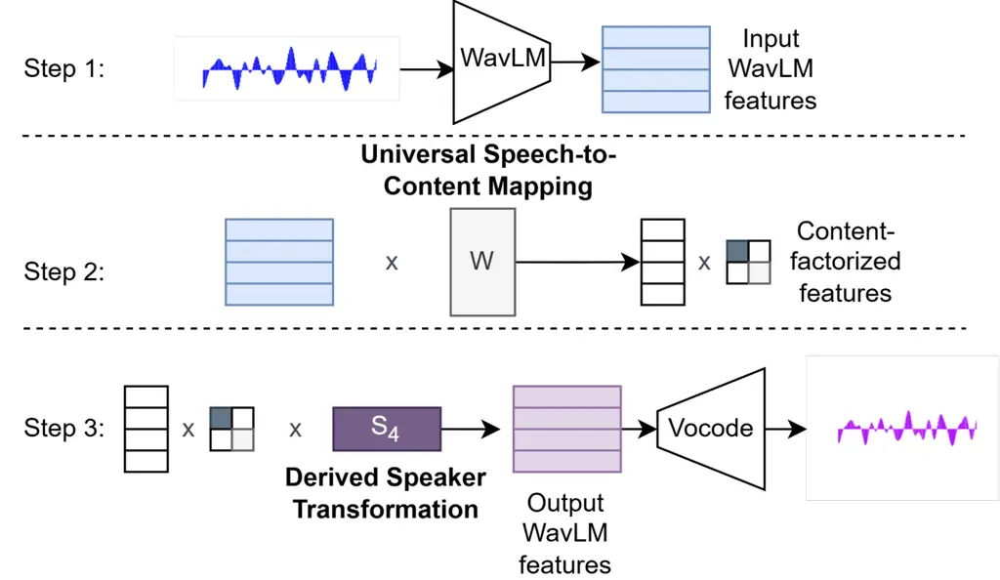
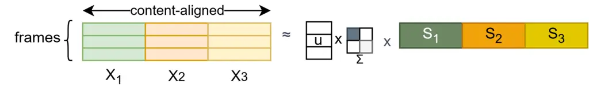
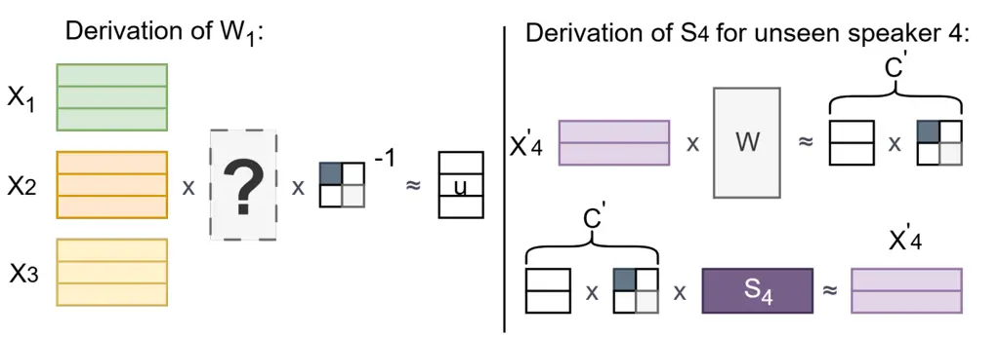

Xinyuan Cai Zhang García-Perera Berrak Sisman Khudanpur Andrews Wiesner

# Universal Speech Content Factorization

Henry Li    Zexin    Lin    Leibny Paola    Sanjeev    Nicholas   
Matthew

###### Abstract

We propose Universal Speech Content Factorization (USCF), a simple and
invertible linear method for extracting a low-rank speech representation
in which speaker timbre is suppressed while phonetic content is
preserved. USCF extends Speech Content Factorization, a closed-set voice
conversion (VC) method, to an open-set setting by learning a universal
speech-to-content mapping via least-squares optimization and deriving
speaker-specific transformations from only a few seconds of target
speech. We show through embedding analysis that USCF effectively removes
speaker-dependent variation. As a zero-shot VC system, USCF achieves
competitive intelligibility, naturalness, and speaker similarity
compared to methods that require substantially more target-speaker data
or additional neural training. Finally, we demonstrate that as a
training-efficient timbre-disentangled speech feature, USCF features can
serve as the acoustic representation for training timbre-prompted
text-to-speech models. Speech samples and code are publicly available.¹¹
1 Code release:
[https://github.com/HSTEHSTEHSTE/uscf](https://github.com/HSTEHSTEHSTE/uscf);
Speech samples:
[https://hstehstehste.github.io/Projects/uscf.github.io/index.html](https://hstehstehste.github.io/Projects/uscf.github.io/index.html)

###### keywords

Voice Conversion, Speech Factor Disentanglement, TTS

^(†)^(†)address: ¹ Center for Language and Speech Processing, Johns
Hopkins University, USA  
² Human Language Technology Center of Excellence (COE), Johns Hopkins
University, USA ^(†)^(†)email: xli257@jhu.edu

## 1 Introduction

Recent self-supervised learning (SSL) models for speech, such as WavLM,
exhibit pronounced geometric structure in their feature spaces, with
empirical analyses demonstrate that phonetic content dominates feature
variance, and that frames corresponding to the same phoneme forming
tight clusters across speakers \[1, 2\]. This finding has significant
consequences for the downstream task of voice conversion (VC), where the
typical goal is to modify the speaker identity while preserving the
linguistic content, enabling a class of training-free voice conversion
methods that operate directly in SSL space \[3, 4\].

Notably, the voice conversion system kNN-VC \[3\] showed that VC can be
performed by replacing each WavLM feature frame extracted from an input
utterance with its nearest neighbor from a target speaker’s WavLM
feature collection. The success of kNN-VC suggests a structural property
of the WavLM feature space: for each phoneme, frames from different
speakers reside within a consistent subspace. This hypothesis is
supported further by LinearVC \[4\], which showed that a
content-preserving approximate linear projection can be found between
the WavLM features of two speakers. Building on this observation, Speech
Content Factorization (SCF) \[4\] proposed projecting WavLM features
into a shared low-rank representation encoding phonetic content, and
reconstructing speaker-specific features through learned linear
transformations, thereby enabling high-quality VC without additional
model training.



Figure 1: Full pipeline for voice conversion using USCF.



Figure 2: Decomposing speech into a content-factorized form through SCF.
$`\mathbf{X}_{i}`$ are content-aligned WavLM features for different
speakers. Content alignment for $`\mathbf{X}_{i}`$ is performed through
kNN matching.



Figure 3: Left: formulation for $`\mathbf{W}_{1}`$, one of our proposed
universal speech-to-content mappings. Right: Derivation of speaker
transformation matrix $`\mathbf{S}_{4}`$ for unseen speaker $`4`$

Despite its simplicity and effectiveness, SCF is a closed-set method:
extracting a content-factorized representation from a speaker requires
that the speaker be included in the set of speakers used to derive the
factorization. This restriction limits its applicability in downstream
scenarios such as open-set VC or timbre-prompted TTS, where unseen
speakers must be supported without recomputing the decomposition. For
example, in order to train TTS models on crowd-sourced or web-crawled
datasets with diverse speaking styles such as CommonVoice \[5\] or
Emilia \[6\], training SCF on all of the speakers present would both be
prohibitively expensive, and exclude many speaker that don’t have enough
speech present.

To address this limitation, we propose Universal Speech Content
Factorization (USCF), an open-set extension of SCF that enables
speaker-agnostic content extraction and one-shot speaker adaptation.
Leveraging the linear structure of SCF, we derive a speaker-agnostic
universal speech-to-content mapping via least-squares optimization, and
infer speaker-specific content-to-speech transformations from as little
as a single target-speaker utterance using linear estimation. Our system
achieves competitive performance compared to SSL-structure-based
baselines and to SCF. Our contributions are as follows:

- •
  We propose USCF, a universal speech-to-content mapping, by showing
  that the linear structure underlying SCF generalizes to unseen
  speakers. We show that a universal speech-to-content mapping can be
  computed using a simple least-square formulation, while
  speaker-specific content-to-speech transformations can be estimated
  from only a few seconds of target speech.
- •
  We evaluate USCF as a zero-shot VC system and show competitive
  performance in intelligibility, naturalness, and speaker similarity
  compared to baselines.
- •
  We further show that the USCF representation can serve as an
  alternative acoustic target for text-to-speech (TTS) systems.
- •
  We perform embedding analyses on USCF representations and show that
  they contain less speaker information than other speaker-factorized
  representations while effectively preserving speech content.

### 1.1 Related Works: Speech Disentanglement

In contrast to SSL-space methods, most speech disentanglement approaches
rely on explicitly trained generative models. A common strategy is to
use a Variational Autoencoder (VAE) \[7\] that reconstructs speech from
a bandwidth-limited intermediate representation encoding one factor,
together with an auxiliary encoder that provides the disentangled factor
\[8, 9, 10, 11, 12, 13\]. Such methods have been applied to VC \[14, 15,
16\], expressive speech translation \[17\], speech anonymization \[18,
19\], and accent conversion \[20, 21, 22\], but require additional model
training and substantial speaker-specific data.

## 2 Universal Speech Content Factorization

Speech Content Factorization (SCF) jointly decomposes content-aligned
WavLM features from multiple speakers into a shared low-rank
representation encoding phonetic content, enabling high-quality VC
without additional model training. However, SCF is a closed-set method,
as both content extraction and reconstruction require speaker-specific
transformation matrices obtained during the original factorization. In
this section, we extend SCF to an open-set setting.

### 2.1 Closed-Set SCF

VC through SCF, as proposed in \[4\], is performed as follows:

1.  1.  Select $`k`$ speakers, each with sufficient speech for
        k-nearest-neighbor (kNN) matching (e.g., at least $`5`$ minutes).
2.  2.  For some anchor speaker $`i\in[1..k]`$ and associated speech WavLM
        frames $`\mathbf{X}_{i}`$ of shape $`n`$ (number of speech frames)
        by $`d`$ (WavLM feature dimension), find matching WavLM frames
        $`\mathbf{X}_{j}`$ using nearest neighbors for each speaker
        $`j\in[1..k],j\neq i`$. Stack the matrices $`\mathbf{X}_{1}`$
        through $`\mathbf{X}_{k}`$ along their feature dimensions to produce
        $`\mathbf{X}`$ of shape $`(n,kd)`$.
3.  3.  Perform rank-$`r`$-truncated Singular Value Decomposition (SVD) on
        $`\mathbf{X}`$, giving
        $`\mathbf{X}\approx\mathbf{U}\mathbf{\Sigma}\mathbf{S}`$. We write
        $`\mathbf{C}=\mathbf{U}\mathbf{\Sigma}`$ of shape $`(n,r)`$ as the
        content-factorized representation of $`\mathbf{X}`$. We further
        split $`\mathbf{S}`$ of shape $`(r,kd)`$ into chunks
        $`\mathbf{S}_{1}`$ through $`\mathbf{S}_{k}`$, each of size
        $`(r,d)`$, such that $`\forall j\in[1..k]`$,
        $`\mathbf{X}_{j}\approx\mathbf{C}\mathbf{S}_{j}`$. It follows that
        $`\mathbf{X}_{j}\mathbf{S}_{j}^{\dagger}\approx\mathbf{C}`$, where
        $`\mathbf{S}_{j}^{\dagger}`$ is the Moore-Penrose inverse of
        $`\mathbf{S}_{j}`$. We refer to $`\mathbf{S}_{j}`$ as the speaker
        transformation matrix of speaker $`j`$. The content factorization
        process is shown in figure 2.
4.  4.  For speakers $`s,t\in[1..k]`$ and input speech
        $`\mathbf{X}^{\prime}_{s}`$, perform VC by
        $`\hat{\mathbf{X}^{\prime}}_{t}\approx\mathbf{X^{\prime}}_{s}\mathbf{S}_{s}^{\dagger}\mathbf{S}_{t}`$.

### 2.2 Approaches for Universal Speech to Content Mapping

To extend SCF to unseen speakers, we seek:

1.  1.  A matrix $`\mathbf{W}`$, such that for any speaker $`m`$ and unseen
        speech $`\mathbf{X}_{m}^{\prime}`$, including those speakers $`m`$
        not in $`[1..k]`$,
        $`\mathbf{X}_{m}^{\prime}\mathbf{W}\approx\mathbf{C}^{\prime}`$.
2.  2.  For a small number of WavLM frames $`\mathbf{X}_{m}^{\prime}`$ from
        an unseen speaker $`m`$, derive the speaker transformation matrix
        $`\mathbf{S}_{m}`$ corresponding to speaker $`m`$.

Recall the truncated SVD formulation
$`\mathbf{X}\approx\mathbf{U}\mathbf{\Sigma}\mathbf{S}`$. We can solve
the least-squares optimization problem
$`\mathbf{W}_{0}=\arg\min_{W}\sum_{j=1}^{k}||\mathbf{X}_{j}\mathbf{W}-\mathbf{C}||`$,
which directly attempts to reconstruct the content-factorized
representation $`\mathbf{C}=\mathbf{U}\mathbf{\Sigma}`$, to find
$`\mathbf{W}_{0}`$. However, in preliminary experiments, we found that
$`\mathbf{W}_{0}`$ does not produce representations that can be reliably
mapped back to the WavLM feature space to synthesize intelligible
speech. We observe that the $`r`$ orthonormal columns of the $`n`$ by
$`r`$ matrix $`\mathbf{U}`$ represent the $`r`$ dimensions of speech
content according to this factorization, the magnitude of each of these
dimensions in the WavLM feature space is represented by the
corresponding diagonal singular values of $`\mathbf{\Sigma}`$. If we
assume that all $`r`$ content dimensions should be treated as equally
important, independent of their singular values, then
$`\mathbf{\Sigma}`$ should be factored out of the optimization target,
as shown in figure 3. This leads to the modified optimization problem on
$`\mathbf{U}`$:

```math
\displaystyle\mathbf{W}_{1} \displaystyle=\arg\min_{W}\sum_{j=1}^{k}||\mathbf{X}_{j}\mathbf{W}\mathbf{\Sigma}^{-1}-\mathbf{U}|| \tag{1}
```

Using $`\mathbf{U}`$ directly as the optimization target may amplify
acoustic contexts that are over-represented in the data. To avoid this,
we instead find a matrix $`\mathbf{W}_{2}`$ that approximately inverts
the speaker transformations themselves:

```math
\displaystyle\mathbf{W}_{2} \displaystyle=\arg\min_{W}\sum_{j=1}^{k}||\mathbf{S}_{j}\mathbf{W}-\mathbf{I}|| \tag{2}
```

Finally, the formulation for $`\mathbf{W}_{3}`$ relies on the
simplifying assumption that content and timbre components are linearly
separable:
$`\mathbf{X}_{j}=\mathbf{C}(\mathbf{T}_{\text{content}}+\mathbf{S}_{\text{timbre}}^{j})`$,
where $`\mathbf{T}_{\text{content}}`$ speaker-invariant, and its columns
orthogonal to $`\mathbf{S}_{\text{timbre}}^{j}`$. Under this assumption
we have:

```math
\displaystyle\mathbf{S}_{i}\mathbf{S}_{j}^{\dagger} \displaystyle=(\mathbf{T}_{\text{content}}+\mathbf{S}_{\text{timbre}}^{i})(\mathbf{T}_{\text{content}}+\mathbf{S}_{\text{timbre}}^{j})^{\dagger} \tag{3}
```

```math
\displaystyle=(\mathbf{T}_{\text{content}}+\mathbf{S}_{\text{timbre}}^{i})((\mathbf{T}_{\text{content}})^{\dagger}+(\mathbf{S}_{\text{timbre}}^{j})^{\dagger}) \tag{4}
```

```math
\displaystyle=\mathbf{T}_{\text{content}}(\mathbf{T}_{\text{content}})^{\dagger}+\mathbf{S}_{\text{timbre}}^{i}(\mathbf{S}_{\text{timbre}}^{j})^{\dagger} \tag{5}
```

```math
\displaystyle\approx\mathbf{T}_{\text{content}}(\mathbf{T}_{\text{content}})^{\dagger}=\mathbf{I} \tag{6}
```

Steps 4 and 5 follow from the assumption of orthogonality of the column
spaces of $`\mathbf{T}_{\text{content}}`$ and
$`\mathbf{S}_{\text{timbre}}^{j}`$, while step 6 uses the fact that the
timbre subspaces of different speakers, being high-dimensional, are
likely orthogonal. Thus we can pick $`\mathbf{W}_{3}`$ simply as the
Moore-Penrose inverse of any speaker $`i`$ in $`[1..k]`$:

```math
\displaystyle\mathbf{W}_{3} \displaystyle=\mathbf{S}_{i}^{\dagger}\text{ for some }i\in[1..k]
```

### 2.3 Speaker Transformation Matrix Derivation

Suppose we have a speaker $`m\notin[1..k]`$. To reconstruct
speaker-$`m`$ speech from a content representation $`\mathbf{C}`$, we
require the corresponding speaker transformation matrix
$`\mathbf{S}_{m}`$ such that
$`\mathbf{X}_{m}\approx\mathbf{C}\mathbf{S}_{m}`$. Suppose also that we
are given a small set of WavLM features $`\mathbf{X}^{\prime}_{m}`$ from
speaker $`m`$. Using the facts that
$`\mathbf{X}^{\prime}_{m}\approx\mathbf{C}^{\prime}\mathbf{S}_{m}`$ and
$`\mathbf{C}^{\prime}\approx\mathbf{X}^{\prime}_{m}\mathbf{W}`$, we can
derive $`\mathbf{S}_{m}`$ using the following formulation, also shown in
figure 3:

```math
\displaystyle\mathbf{S}_{m}\approx(\mathbf{X}^{\prime}_{m}\mathbf{W})^{\dagger}\mathbf{X}^{\prime}_{m} \tag{7}
```

## 3 Experimental setup

### 3.1 Test Data

For our VC experiments, we select $`4`$ non-overlapping sets of $`20`$
speakers from LibriSpeech \[23\]: source speakers (from test-clean),
target speakers (from test-other), held-out 1 (from test-clean), and
held-out 2 (from dev-clean). For each of the source speakers, we
randomly choose $`20`$ utterances for testing, and $`5`$ target speakers
as the conversion target.

### 3.2 USCF-VC Details

|                         |                        |                    |                      |
| ----------------------- | ---------------------- | ------------------ | -------------------- |
| Method                  | WER (%) $`\downarrow`$ | UTMOS $`\uparrow`$ | Spk Sim $`\uparrow`$ |
| USCF $`\mathbf{W}_{1}`$ | 2.70                   | 2.805              | 0.524                |
| USCF $`\mathbf{W}_{2}`$ | 4.04                   | 2.519              | 0.557                |
| USCF $`\mathbf{W}_{3}`$ | 2.31                   | 2.826              | 0.420                |
| kNN-VC                  | 3.16                   | 2.855              | 0.666                |
| LinearVC                | 2.69                   | 2.765              | 0.621                |
| SCF                     | 2.18                   | 2.886              | 0.603                |
| SCF $`\mathbf{W}_{1}`$  | 3.01                   | 2.859              | 0.604                |
| SeedVC                  | 6.24                   | 3.173              | 0.532                |

Table 1: Comparisons of USCF VC with baseline systems according to
objective metrics. Color intensity reflects metric directionality.

|                              |                      |                       |
| ---------------------------- | -------------------- | --------------------- |
| Method                       | MOS (%) $`\uparrow`$ | SMOS (%) $`\uparrow`$ |
| original                     | 3.80 $`\pm`$ 0.17    | 4.29 $`\pm`$ 0.15     |
| USCF $`\mathbf{W}_{1}`$      | 3.42 $`\pm`$ 0.17    | 3.00 $`\pm`$ 0.23     |
| USCF $`\mathbf{W}_{1}`$ 100s | 3.66 $`\pm`$ 0.17    | 2.94 $`\pm`$ 0.29     |
| kNN-VC                       | 3.53 $`\pm`$ 0.18    | 3.29 $`\pm`$ 0.25     |
| LinearVC                     | 3.65 $`\pm`$ 0.16    | 3.17 $`\pm`$ 0.21     |
| SCF                          | 3.63 $`\pm`$ 0.18    | 3.08 $`\pm`$ 0.25     |
| SeedVC                       | 3.36 $`\pm`$ 0.18    | 2.77 $`\pm`$ 0.31     |

Table 2: Comparison of subjective metrics between USCF and baselines.
Mean scores with $`95\%`$ intervals.

Following the procedure outlined in section 2.1, we choose $`1`$ speaker
in dev-clean as our anchor speaker. The $`40`$ speakers included in the
SVD process are drawn from held-out 1 and held-out 2. After constructing
the content-aligned WavLM matrix $`\mathbf{X}`$, we choose $`r=75`$ and
perform rank-$`r`$-truncated SVD on $`\mathbf{X}`$, giving us
$`\mathbf{W}_{1}`$ and $`\mathbf{W}_{2}`$ by following equations 1 and 2. We set $`\mathbf{W}_{3}`$ as the pseudoinverse of $`S_{i}`$
corresponding to a different random speaker $`i`$ across $`10`$ runs,
and report average performance. For each target speaker, we randomly
sample from their utterances and retain the WavLM feature frames
extracted from each sample utterance until we reach $`500`$ frames
(corresponding to $`10`$ seconds of speech). We then derive their
speaker transformation matrix according to equation 7.

### 3.3 Baselines

We include the following baselines: kNN-VC \[3\], LinearVC \[4\], and
closed-set SCF, as these can be seen as different methods of exploiting
the unique structure of the WavLM feature space. We also benchmark it
against SeedVC \[24\], a diffusion transformer-based zero-shot VC method
with state-of-the-art performance. For kNN-VC and LinearVC, we make all
source and target speaker speech (roughly $`8`$ minutes per speaker)
available for kNN matching and for finding source-target WavLM feature
mappings. For SCF, we perform our SVD on all $`40`$ speakers from the
source and target speaker sets from section 3.1, giving us
$`\mathbf{S}_{i}`$ for each speaker $`i`$ among the source and target
speakers.

### 3.4 Metrics

We include the following objective metrics: ASR WER (using Whisper
\[25\] large²² 2
[huggingface.co/openai/whisper-large](https://huggingface.co/openai/whisper-large))
for intelligibility; UTMOS-v2 \[26\]³³ 3
[huggingface.co/sarulab-speech/UTMOSv2](https://huggingface.co/sarulab-speech/UTMOSv2)
as a proxy for quality; speaker embedding cosine similarity to an
averaged ground-truth speaker embedding, with embeddings extracted from
a pre-trained ECAPA-TDNN \[27\]⁴⁴ 4
[huggingface.co/speechbrain/spkrec-ecapa-voxceleb](https://huggingface.co/speechbrain/spkrec-ecapa-voxceleb).
Target Equal Error Rate, where a speaker ID system tries differentiate
ground-truth targe speaker utterances from voice-converted target
speaker utterances, are not reported due to space constraints, as they
show identical relative performance across systems to speaker embedding
cosine similarity. We further run human evaluations on USCF and
comparative systems, where we collect a Mean Opinion Score (MOS) based
on the naturalness and quality of each output utterance, and a Speaker
Similarity Mean Opinion Score (SMOS) based on the similarity of each
output utterance to a reference utterance.

## 4 Results

### 4.1 Voice Conversion Quality

Objective evaluation results for voice conversion are presented in table

1. We note that USCF excel at content preservation, and is capable of
   producing natural-sounding speech. Speaker similarity tests show that
   while USCF is able to produce speech that is highly similar to the
   target speaker, the level of similarity is somewhat weaker than those of
   kNN-VC, LinearVC, and SCF. In order to investigate the source of this
   degradation, we compare USCF with partially open-set SCF, where the
   input speech comes from speakers that are out-of-domain while the target
   speakers are in-domain. We find that partially open-set SCF achieves
   speaker similarities that are on par with closed-set SCF, suggesting
   that the content-to-speaker transformation is the source of the
   degradation in speaker similarity of USCF.

Subjective evaluation results, shown in table 2, demonstrate that
listeners show no statistically significant preference towards USCF or
any of the other baseline systems except SeedVC, which was least
favored.

Among the speech-to-content mapping strategies, we found that
$`\mathbf{W}_{2}`$ achieves the best target speaker similarity at the
price of reduced speech quality and content preservation, whereas
$`\mathbf{W}_{3}`$ shines at content preservation but struggles with
target speaker similarity; by contrast, $`\mathbf{W}_{1}`$ finds a
reasonable balance between all metrics. For USCF using
$`\mathbf{W}_{3}`$ as the universal speech-to-content mapping, we report
the average performance over $`10`$ runs, where $`\mathbf{W}_{3}`$ was
chosen to be the pseudoinverse of a different randomly-selected SCF
speaker transformation matrix. Over the $`10`$ runs, the standard
deviation for ASR WER and UTMOS are $`0.10\%`$ and $`0.015`$,
respectively, suggesting that $`\mathbf{W}_{3}`$ is highly stable
regardless of the choice of SCF speaker transformation used to derive
it.

### 4.2 Speaker ID within Phoneme

|             |      |                      |                            |
| ----------- | ---- | -------------------- | -------------------------- |
| Model       | Rank | Spk EER $`\uparrow`$ | Phoneme EER $`\downarrow`$ |
| USCF        | 75   | 36.40%               | 11.43%                     |
| USCF        | 1024 | 35.33%               | 11.43%                     |
| WavLM       | 1024 | 21.77%               | 11.56%                     |
| ContentVec  | 792  | 27.98%               | 8.82%                      |
| WavLM - kNN | 1024 | 35.14%               | 12.70%                     |

Table 3: Speaker ID using same-phoneme embeddings.

| Rank | WER (%) $`\downarrow`$ | UTMOS $`\uparrow`$ | Spk Sim $`\uparrow`$ |
| ---- | ---------------------- | ------------------ | -------------------- |
| 100  | 2.77                   | 2.81               | 0.504                |
| 75   | 2.70                   | 2.805              | 0.524                |
| 50   | 2.69                   | 2.738              | 0.529                |
| 30   | 2.96                   | 2.607              | 0.513                |
| 20   | 3.98                   | 2.388              | 0.489                |

Table 4: VC performance of USCF across different ranks.

| Num frames | WER (%) $`\downarrow`$ | UTMOS $`\uparrow`$ | Spk Sim $`\uparrow`$ |
| ---------- | ---------------------- | ------------------ | -------------------- |
| 10000      | 2.28                   | 2.935              | 0.564                |
| 5000       | 2.42                   | 2.923              | 0.564                |
| 2000       | 2.47                   | 2.915              | 0.564                |
| 1000       | 2.51                   | 2.904              | 0.546                |
| 500        | 2.70                   | 2.805              | 0.524                |
| 200        | 4.94                   | 2.431              | 0.42                 |

Table 5: VC performance of USCF when output output speaker
transformation matrix is derived with different number of frames of
target speaker speech.

| Target Features  | ASR WER $`\downarrow`$ | Epochs | UTMOS-v2 $`\uparrow`$ |
| ---------------- | ---------------------- | ------ | --------------------- |
| USCF features    | 11.44%                 | 25     | 2.881                 |
| mel              | 27.93%                 | 39     | 2.741                 |
| mel (normalized) | 11.92%                 | 33     | 2.732                 |

Table 6: TTS models trained using different target features. Fbank
(normalized) is where each utterance is first normalized to the same
voice using kNN-VC \[3\], then converted into Fbank features.

To test the claim that USCF features preserve speech content information
while removing speaker-identifying information, we first extract USCF
features (rank $`75`$, $`\mathbf{W}_{1}`$) from the TIMIT \[28\] dataset
TEST split, then perform the following:

1.  1.  Phoneme recognition. Ground truth phoneme labels for each test frame
        are inferred using TIMIT’s time-phoneme alignment. Classification is
        performed by taking the argmin cosine distance to each reference
        phoneme embedding.
2.  2.  Speaker recognition per-phoneme. For each phoneme, we find all the
        frames from TIMIT TEST with the corresponding phoneme label, then
        perform speaker ID on feature vectors corresponding to these frames.

We compare USCF to two SSL-based baselines: WavLM and ContentVec, shown
in table 3. We found that USCF is on par with WavLM as a phoneme
classifier, and that it is stronger than both WavLM and ContentVec when
it comes to removing speaker information. This property still holds even
when the rank of USCF is increased to $`1024`$, showing that the loss of
speaker information is not an artifact of projecting into a
low-dimensional space. We additionally find that USCF is still
marginally better at speaker information removal and at content
preservation than WavLM features that had been normalized to a single
reference speaker through kNN matching.

### 4.3 Ablations

#### 4.3.1 Reduction in Rank

A comparison of the performance of USCF at various ranks can be found in
table 4. We find that USCF is stable when its rank is within $`50`$ and
$`100`$, but that the synthetic voice quality declines when its rank
drops further.

#### 4.3.2 $`\mathbf{S}`$ Derivation with Fewer or More Frames

Table 5 shows the performance of USCF when the amount of target speaker
speech used for deriving the target speaker transformation matrix is
varied. We notice a sharp degradation in target speaker similarity when
the amount of target speaker speech falls below $`500`$ frames,
corresponding to $`10`$ seconds; conversely, target speaker similarity
improves when the amount of target speaker speech is increased, but see
diminishing returns beyond $`2000`$ frames ($`40`$ seconds).

### 4.4 TTS Using a Content-Factorized Representation

We verify that USCF features can be used as target training features
with a flow-matching TTS model, trained on LibriSpeech and following the
architecture and training strategies from ZipVoice \[29\]. We compare it
to two benchmarks: a TTS model trained on mel filterbank features, and
one trained on mel filterbank features extracted from utterances that
had been voice-normalized to a single speaker using kNN-VC. Table 6 show
that the model trained with USCF features achieves better WER while
requiring less training time than both models trained with mel
filterbank features.

## 5 Conclusion

We propose USCF, a method for extracting content-preserving and
speaker-agnostic features from WavLM features using a simple linear
transformation. We extend an existing closed-set method for linear
factorization of WavLM features, SCF, into an open-set method,
transforming it into a zero-shot voice conversion system. We show
through embedding analysis that USCF features effectively preserve
content information, and that they carry less speaker information than
existing methods such as ContentVec. We also demonstrate the potential
for using USCF features on downstream tasks such as TTS training. In our
future work, we would like to explore if simple neural methods would
allow for a more stable version of $`\mathbf{W}`$, or a derivation of
$`\mathbf{S}_{m}`$ for unseen speaker $`m`$ with even less speech from
speaker $`m`$ available. We also plan to utilize USCF to train zero-shot
style-conditioned TTS systems that are timbre-agnostic.

## 6 Generative AI Disclosure

Generative AI was used for the following in this work:

1.  1.  Conversion of table formats.
2.  2.  Limited language polishing of the Introduction section.

## References

- \[1\] K. Choi, E. Yeo, K. Chang, S. Watanabe, and D. R.
  Mortensen (2025) Leveraging allophony in self-supervised speech models
  for atypical pronunciation assessment. In Proceedings of the 2025
  Conference of the Nations of the Americas Chapter of the Association
  for Computational Linguistics: Human Language Technologies (Volume 1:
  Long Papers), pp. 2613–2628. Cited by: §1.
- \[2\] L. Block Medin, T. Pellegrini, and L. Gelin (2024)
  Self-Supervised Models for Phoneme Recognition: Applications in
  Children’s Speech for Reading Learning. In Interspeech 2024,
  pp. 5168–5172. External Links:
  [Document](https://dx.doi.org/10.21437/Interspeech.2024-1095), ISSN
  2958-1796 Cited by: §1.
- \[3\] M. Baas, B. van Niekerk, and H. Kamper Voice Conversion With
  Just Nearest Neighbors. In Interspeech 2023, pp. 2053–2057. Cited by:
  §1, §1, §3.3, Table 6.
- \[4\] H. Kamper, B. van Niekerk, J. Zaïdi, and M. Carbonneau (2025)
  LinearVC: Linear Transformations of Self-Supervised Features Through
  the Lens of Voice Conversion. In Interspeech 2025, pp. 1398–1402.
  External Links:
  [Document](https://dx.doi.org/10.21437/Interspeech.2025-438), ISSN
  2958-1796 Cited by: §1, §1, §2.1, §3.3.
- \[5\] R. Ardila, M. Branson, K. Davis, M. Kohler, J. Meyer, M.
  Henretty, R. Morais, L. Saunders, F. Tyers, and G. Weber (2020) Common
  Voice: A Massively-Multilingual Speech Corpus. In Proceedings of the
  Twelfth Language Resources and Evaluation Conference, pp. 4218–4222.
  Cited by: §1.
- \[6\] H. He, Z. Shang, C. Wang, X. Li, Y. Gu, H. Hua, L. Liu, C.
  Yang, J. Li, P. Shi, Y. Wang, K. Chen, P. Zhang, and Z. Wu (2024)
  Emilia: an extensive, multilingual, and diverse speech dataset for
  large-scale speech generation. In 2024 IEEE Spoken Language Technology
  Workshop (SLT), Vol. , pp. 885–890. External Links:
  [Document](https://dx.doi.org/10.1109/SLT61566.2024.10832365) Cited
  by: §1.
- \[7\] D. P. Kingma and M. Welling (2022) Auto-encoding variational
  bayes. External Links: 1312.6114,
  [Link](https://arxiv.org/abs/1312.6114) Cited by: §1.1.
- \[8\] Y. Xie, M. Kuhlmann, F. Rautenberg, Z. Tan, and R.
  Haeb-Umbach (2024) Speaker and style disentanglement of speech based
  on contrastive predictive coding supported factorized variational
  autoencoder.. In EUSIPCO, pp. 436–440. Cited by: §1.1.
- \[9\] C. H. Chan, K. Qian, Y. Zhang, and M. Hasegawa-Johnson (2022)
  SpeechSplit 2.0: unsupervised speech disentanglement for voice
  conversion without tuning autoencoder bottlenecks. External Links:
  2203.14156, [Link](https://arxiv.org/abs/2203.14156) Cited by: §1.1.
- \[10\] J. Wang, J. Li, X. Zhao, Z. Wu, S. Kang, and H. Meng (2021)
  Adversarially Learning Disentangled Speech Representations for Robust
  Multi-Factor Voice Conversion. In Interspeech 2021, pp. 846–850.
  External Links:
  [Document](https://dx.doi.org/10.21437/Interspeech.2021-1990), ISSN
  2958-1796 Cited by: §1.1.
- \[11\] K. Qian, Y. Zhang, H. Gao, J. Ni, C. Lai, D. Cox, M.
  Hasegawa-Johnson, and S. Chang (2022) ContentVec: an improved
  self-supervised speech representation by disentangling speakers. In
  Proceedings of the 39th International Conference on Machine Learning,
  Proceedings of Machine Learning Research, Vol. 162, pp. 18003–18017.
  Cited by: §1.1.
- \[12\] A. Polyak, Y. Adi, J. Copet, E. Kharitonov, K. Lakhotia, W.
  Hsu, A. Mohamed, and E. Dupoux (2021) Speech Resynthesis from Discrete
  Disentangled Self-Supervised Representations. In Interspeech 2021,
  pp. 3615–3619. External Links:
  [Document](https://dx.doi.org/10.21437/Interspeech.2021-475), ISSN
  2958-1796 Cited by: §1.1.
- \[13\] Z. Ju, Y. Wang, K. Shen, X. Tan, D. Xin, D. Yang, E. Liu, Y.
  Leng, K. Song, S. Tang, Z. Wu, T. Qin, X. Li, W. Ye, S. Zhang, J.
  Bian, L. He, J. Li, and S. Zhao (2024) NaturalSpeech 3: zero-shot
  speech synthesis with factorized codec and diffusion models.. In ICML,
  Vol. 235, pp. 22605–22623. Cited by: §1.1.
- \[14\] Z. Liu, S. Wang, and N. Chen (2023) Automatic Speech
  Disentanglement for Voice Conversion using Rank Module and Speech
  Augmentation. In Interspeech 2023, pp. 2298–2302. External Links:
  [Document](https://dx.doi.org/10.21437/Interspeech.2023-1602), ISSN
  2958-1796 Cited by: §1.1.
- \[15\] Z. Cai, H. L. Xinyuan, A. Garg, L. P. García-Perera, K. Duh, S.
  Khudanpur, M. Wiesner, and N. Andrews (2025) GenVC: self-supervised
  zero-shot voice conversion. External Links: 2502.04519,
  [Link](https://arxiv.org/abs/2502.04519) Cited by: §1.1.
- \[16\] B. Sisman, J. Yamagishi, S. King, and H. Li (2020) An overview
  of voice conversion and its challenges: from statistical modeling to
  deep learning. IEEE/ACM transactions on audio, speech, and language
  processing 29, pp. 132–157. Cited by: §1.1.
- \[17\] X. Zhao, H. Sun, Y. Lei, S. Zhu, and D. Xiong (2023) CCSRD:
  content-centric speech representation disentanglement learning for
  end-to-end speech translation. In Findings of the Association for
  Computational Linguistics: EMNLP 2023, pp. 5920–5932. Cited by: §1.1.
- \[18\] B. T. Vecino, S. Maji, A. Varier, A. Bonafonte, I. Valles, M.
  Owen, L. Rädel, G. Strimel, S. Feyisetan, R. B. Chicote, A.
  Rastrow, C. Papayiannis, V. Leutnant, and T. Wood (2025) Universal
  semantic disentangled privacy-preserving speech representation
  learning. External Links: 2505.13085,
  [Link](https://arxiv.org/abs/2505.13085) Cited by: §1.1.
- \[19\] J. Yao, N. Kuzmin, Q. Wang, P. Guo, Z. Ning, D. Guo, K. A.
  Lee, E. Chng, and L. Xie (2024) NPU-NTU System for Voice Privacy 2024
  Challenge. In 4th Symposium on Security and Privacy in Speech
  Communication, pp. 67–71. External Links:
  [Document](https://dx.doi.org/10.21437/SPSC.2024-12) Cited by: §1.1.
- \[20\] Y. Halychanskyi, C. Churchwell, Y. Wen, and V.
  Kindratenko (2026) FAC-facodec: controllable zero-shot foreign accent
  conversion with factorized speech codec. External Links: 2510.10785,
  [Link](https://arxiv.org/abs/2510.10785) Cited by: §1.1.
- \[21\] J. Melechovsky, A. Mehrish, B. Sisman, and D. Herremans (2024)
  Accent conversion in text-to-speech using multi-level vae and
  adversarial training. In TENCON 2024-2024 IEEE Region 10 Conference
  (TENCON), pp. 473–476. Cited by: §1.1.
- \[22\] J. Melechovsky, A. Mehrish, B. Sisman, and D. Herremans (2024)
  Accented text-to-speech synthesis with a conditional variational
  autoencoder. In TENCON 2024-2024 IEEE Region 10 Conference (TENCON),
  pp. 343–346. Cited by: §1.1.
- \[23\] V. Panayotov, G. Chen, D. Povey, and S. Khudanpur (2015)
  Librispeech: an asr corpus based on public domain audio books. In 2015
  IEEE International Conference on Acoustics, Speech and Signal
  Processing (ICASSP), Vol. , pp. 5206–5210. External Links:
  [Document](https://dx.doi.org/10.1109/ICASSP.2015.7178964) Cited by:
  §3.1.
- \[24\] S. Liu (2024) Zero-shot voice conversion with diffusion
  transformers. External Links: 2411.09943,
  [Link](https://arxiv.org/abs/2411.09943) Cited by: §3.3.
- \[25\] A. Radford, J. W. Kim, T. Xu, G. Brockman, C. McLeavey, and I.
  Sutskever (2022) Robust speech recognition via large-scale weak
  supervision. External Links: 2212.04356,
  [Link](https://arxiv.org/abs/2212.04356) Cited by: §3.4.
- \[26\] T. Saeki, D. Xin, W. Nakata, T. Koriyama, S. Takamichi, and H.
  Saruwatari (2022) UTMOS: UTokyo-SaruLab System for VoiceMOS Challenge 2022. In Interspeech 2022, pp. 4521–4525. External Links:
  [Document](https://dx.doi.org/10.21437/Interspeech.2022-439), ISSN
  2958-1796 Cited by: §3.4.
- \[27\] B. Desplanques, J. Thienpondt, and K. Demuynck (2020)
  ECAPA-TDNN: Emphasized Channel Attention, Propagation and Aggregation
  in TDNN Based Speaker Verification. In Interspeech 2020,
  pp. 3830–3834. External Links:
  [Document](https://dx.doi.org/10.21437/Interspeech.2020-2650), ISSN
  2958-1796 Cited by: §3.4.
- \[28\] J. S. Garofolo, N. I. of Standards, T. U.S., U.
  States, D. A. R. P. Agency., I. Science, T. Office, and L. D.
  Consortium. (1993) TIMIT : acoustic-phonetic continuous speech
  corpus.. External Links:
  [Link](http://www.worldcat.org/isbn/1585630195) Cited by: §4.2.
- \[29\] H. Zhu, W. Kang, Z. Yao, L. Guo, F. Kuang, Z. Li, W. Zhuang, L.
  Lin, and D. Povey (2025) ZipVoice: fast and high-quality zero-shot
  text-to-speech with flow matching. External Links: 2506.13053,
  [Link](https://arxiv.org/abs/2506.13053) Cited by: §4.4.
