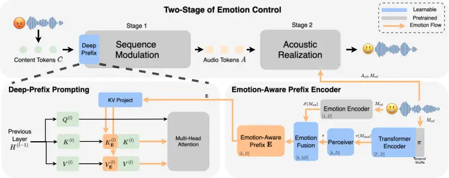

Yang Yang Xie Chen Hansen

# Emotion-Aware Prefix: Towards Explicit Emotion Control in Voice Conversion Models

Haoyuan    Mu    Jiamin    Szu-Jui    John H.L

###### Abstract

Recent advances in zero-shot voice conversion have exhibited potential
in emotion control, yet the performance is suboptimal or inconsistent
due to their limited expressive capacity. We propose Emotion-Aware
Prefix for explicit emotion control in a two-stage voice conversion
backbone. We significantly improve emotion conversion performance,
doubling the baseline Emotion Conversion Accuracy (ECA) from 42.40% to
85.50% while maintaining linguistic integrity and speech quality,
without compromising speaker identity. Our ablation study suggests that
a joint control of both sequence modulation and acoustic realization is
essential to synthesize distinct emotions. Furthermore, comparative
analysis verifies the generalizability of proposed method, while it
provides insights on the role of acoustic decoupling in maintaining
speaker identity. ¹¹ 1 Demos available at:
https://anonysample.github.io/vevoemoplus/

###### keywords

emotional voice conversion, emotion transfer, voice conversion, speech
generation

^(†)^(†)address: Center for Robust Speech Systems (CRSS), The University
of Texas at Dallas, USA ^(†)^(†)email: {haoyuan.yang, mu.yang,
jiamin.xie, szu-jui.chen, john.hansen}@utdallas.edu



Figure 1: Framework Overview: Sequence Modulation Stage performs
sequence-level style modeling via Deep-Prefix Prompting of Emotion-Aware
Prefix, while Acoustic Realization Stage models the final speech
production conditioned on reference speech.

## 1 Introduction

Emotion control is essential for the naturalness and liveliness of
speech generation, as it conveys a speaker’s feelings, motivations, and
personality \[1\]. Effective emotion control is a cornerstone for
creating truly immersive Human-Computer Interfaces, enabling
applications ranging from expressive dubbing and human-computer
interaction to speaker anonymization \[2, 3, 4\].

Recently, zero-shot voice conversion has emerged as a powerful paradigm
that inherently possesses the potential for emotion conversion. By
exploiting style information from a reference prompt, these models
convert a linguistic content sequence into a style-rich audio token
sequence, followed by acoustic modeling to reconstruct speech with the
target identity and style \[5\]. Notably, VEVO proposes a two-stage
design that decomposes zero-shot voice conversion into sequence
modulation and acoustic realization, which separates high-level temporal
and prosodic structures from low-level spectral synthesis \[6\]. This
resonates with the multi-scale organization of speech production, where
dynamic modulation of prosodic patterns operating within relatively
stable, speaker-specific acoustic constraints  realizes emotional
expressions \[7\].

However, our study finds that existing zero-shot voice conversion models
often exhibit suboptimal or inconsistent emotion controllability. While
they can mimic the overall speaking style, they lack the control
required to shift a source utterance into a specific, high-intensity
target emotion. This limitation stems from lacking an explicit control
for emotion during the dynamic modulation stage, leaving the models
overly reliant on implicit cues (e.g., global energy or average pitch)
given by the acoustic prompt.

In this paper, we propose Emotion-Aware Prefix for explicit emotion
control in voice conversion models. Purposed for the emotion voice
conversion (EVC) task, our approach enables explicit emotion control
while preserving linguistic content, speaker identity and overall
quality. Our proposed method is based on VEVO \[6\], a two-stage
zero-shot voice conversion framework. As illustrated in Figure 1, we
leverage the emotion cues within prompt speech throughout the two-stage
architecture. By integrating content-invariant style features with an
emotion vector, we develop an Emotion-Aware Prefix. This prefix directs
the sequence modulation stage through a Deep-Prefix Prompting mechanism,
ensuring explicit control over the generated audio tokens.
Simultaneously, the same reference is utilized during acoustic
realization stage to provide stable, low-level spectral information. Our
main contributions are:

1.  1.  Enhancing Emotion Controllability. By introducing Emotion-Aware
        Prefix with Deep Prefix Prompting, we increase the emotion
        conversion ability of VEVO, measured by the target Emotion
        Conversion Accuracy (ECA), from 42.40% to 85.50% while maintaining
        speaker identity and quality.
2.  2.  Understanding the Hierarchical Sensitivity in Emotion Control.
        Through stage-wise emotion prompts isolation, we demonstrate that
        sequence-level modulation serves as the primary driver of high-level
        prosodic intent, while joint control with the acoustic stage yields
        a significant non-additive improvement in conversion accuracy.
3.  3.  Investigating the Role of Acoustic Decoupling. We apply the proposed
        method to a single-stage voice conversion framework without acoustic
        decoupling. The comparative analysis reveals the emotion control
        efficacy of the proposed method and provides insights on the
        importance of acoustic decoupling for preserving speaker identity.

## 2 Related Work

Research in EVC offers critical insights into the mechanisms required to
manipulate emotional states while preserving speaker identity. Early
approaches primarily relied on explicit representation disentanglement,
employing dedicated emotion encoders \[8\] or mutual information
objectives \[9\] to separate emotional style from speaker identity and
linguistic content. To mitigate reliance on high-quality parallel
data \[10\] and extensive human annotation \[11\], subsequent research
shifted toward non-parallel \[12, 13\] and in-the-wild settings \[14\].
More recent work have further moved beyond rigid categorical emotion
transfer toward nuanced expressiveness, including controllable speech
emotion generation \[15\] and fine-grained intensity regulation \[16\].
Kreuk et al. \[17\] demonstrated that emotion can be manipulated through
discrete acoustic token representations, suggesting that emotional
attributes can be implicitly encoded and controlled within
autoregressive sequence models, which paved the way for emotion control
in voice conversion models based on discrete tokens \[5, 6\].

|                          |                           |                    |                           |       |       |                    |                      |                  |
| ------------------------ | ------------------------- | ------------------ | ------------------------- | ----- | ----- | ------------------ | -------------------- | ---------------- |
| Model                    | Speaker                   |                    | Quality & Intelligibility |       |       |                    | Emotion              |                  |
|                          | Spk-Cent SIM $`\uparrow`$ | EER $`\downarrow`$ | UT-MOSv2 $`\uparrow`$     | DMOS  |       | WER $`\downarrow`$ | Emo SIM $`\uparrow`$ | ECA $`\uparrow`$ |
|                          |                           |                    |                           | SIG   | OVRL  |                    |                      |                  |
| StarGANv2-VC-EVC         | 0.565                     | 3.24%              | 2.318                     | 3.330 | 3.037 | 5.87%              | 0.686                | 36.00%           |
| StepAudioEditX (iter 2)  | 0.425                     | 6.50%              | 3.395                     | 3.308 | 3.005 | 4.43%              | 0.634                | 20.90%           |
| GenVC                    | 0.238                     | 20.87%             | 2.157                     | 3.328 | 3.021 | 8.06%              | 0.681                | 32.48%           |
| VEVO                     | 0.476                     | 5.40%              | 3.060                     | 3.409 | 3.093 | 10.08%             | 0.696                | 42.40%           |
| Proposed w/o Deep-Prefix | 0.503                     | 4.42%              | 2.946                     | 3.416 | 3.133 | 5.74%              | 0.842                | 83.50%           |
| Proposed                 | 0.500                     | 4.50%              | 2.960                     | 3.431 | 3.152 | 6.28%              | 0.850                | 85.50%           |

Table 1: Objective Evaluation Results. Our proposed method significantly
outperforms the VEVO backbone and other state-of-the-art baselines in
ECA while maintaining speaker identity, linguistic content and overall
quality.

## 3 Method

To enhance the expressiveness of emotion with minimal architectural
modification, we extend VEVO \[6\], a state-of-the-art voice conversion
framework with Emotion-Aware Prefix and Deep-Prefix prompting.

### 3.1 Framework Overview

As shown Figure 1, our proposed framework follows the two-stage speech
modeling in VEVO:

Stage 1: Sequence Modulation. Stage 1 employs an Autoregressive (AR)
Transformer to predict discrete, style-rich audio tokens. The prompt to
the AR transformer combines the given content tokens and the proposed
emotion-aware prefix $`\mathbf{E}`$, which will be discussed in section
3.2. This process is formulated as:

```math
\displaystyle P(A|C,\mathbf{E})=\prod_{t=1}^{T}P(a_{t}|a_{<t},C,\mathbf{E}) \tag{1}
```

where $`A=[a_{1},a_{2},...,a_{T}]`$ are the audio tokens to be predicted
and $`C=[c_{1},c_{2},...,c_{n}]`$ denotes content tokens extracted from
input speech.

Stage 2: Acoustic Realization. Stage 2 employs a Flow-Matching (FM)
Transformer to reconstruct the mel-spectrogram $`\widehat{\mathrm{M}}`$
from predicted audio tokens $`A`$, conditioned on reference audio tokens
$`A_{\text{ref}}`$ and their corresponding ground-truth mel-spectrogram
$`\mathrm{M}_{\text{ref}}`$. The final waveform is generated using a
neural vocoder.

### 3.2 Emotion-Aware Prefix Encoder

The Emotion-aware prefix encoder provides utterance-level,
content-invariant emotion style embedding. The encoder consists of a
Temporal-Shuffle Transformer, a Perceiver Layer, and an Emotion Fusion
Layer. Given a reference mel-spectrogram
$`\mathrm{M}_{\text{ref}}\in\mathbb{R}^{T\times D}`$, these modules
encode $`\mathrm{M}_{\text{ref}}`$ as follows:

Temporal-Shuffle Transformer Encoder. To reduce content leakage while
preserving global style characteristics, we apply a random permutation
$`\pi(\cdot)`$ to the temporal indices of the reference mel-spectrogram,
yielding $`\mathrm{M}_{\text{shuf}}=\pi(\mathrm{M}_{\text{ref}})`$. This
operation disrupts phonetic and linguistic structure while retaining
frame-level acoustic statistics related to prosody and timbre. The
shuffled frames are then processed by a lightweight Transformer
$`\mathcal{T}`$ to extract high-level style representations.

Perceiver Layer. Inspired by the architecture of GenVC\[5\], we employed
a Perceiver Layer to compress the variable-length latent features
$`\mathcal{T}(\mathrm{M}_{\text{shuf}})`$ into a fixed-length style
embedding $`s\in\mathbb{R}^{k\times D}`$. This is achieved by fixing
$`k`$ learnable latent tokens $`L`$ that cross-attend to
$`\mathcal{T}(\mathrm{M}_{\text{shuf}})`$. The fixed-length design works
as a bottleneck to ensure consistent dimensionality for prefix injection
into the AR Transformer, preventing style representation from scaling
with utterance duration.

Emotion Fusion Layer. To incorporate explicit emotion information, a
pre-trained emotion encoder $`\mathcal{E}`$ extracts an embedding from
the reference mel-spectrogram $`\mathrm{M}_{\text{ref}}`$. This is then
broadcasted and fused with the style embeddings $`s`$ and projected to
the hidden dimension of the language model:

```math
\displaystyle\mathbf{E}=\text{Linear}(\text{Concat}[s;\mathcal{E}(\mathrm{M}_{\text{ref}})]) \tag{2}
```

where Concat\[;\] denotes concatenation in the feature dimension. The
resulting vector $`\mathbf{E}`$ serves as the Emotion-Aware Prefix that
enhances the subsequent audio token generation.

### 3.3 Deep-Prefix Prompting

To ensure consistent emotion control of sequence modulation stage
throughout the duration of the generated tokens, we employ a Deep-Prefix
Prompting mechanism similar to P-Tuning-v2 \[18\]. Rather than simply
prepending the Emotion-Aware Prefix $`\mathbf{E}`$ to the input
sequence, we inject it as the layerwise KV-cache of the language model.
At each layer, we utilize independent key and value projections to map
the emotion-aware prefix $`\mathbf{E}`$ to the latent space of that
layer:

```math
\displaystyle K_{\mathbf{E}}^{(l)}=\mathbf{E}\cdot W_{K}^{(l)},\quad V_{\mathbf{E}}^{(l)}=\mathbf{E}\cdot W_{V}^{(l)} \tag{3}
```

where $`W_{K}^{(l)}`$ and $`W_{V}^{(l)}`$ denotes the key and value
projection matrix for layer $`l`$ of the language model, respectively.
The resulting prefix vectors $`K_{\mathbf{E}}^{(l)}`$ and
$`V_{\mathbf{E}}^{(l)}`$ are prepended to the standard key and value
matrices derived from the hidden states of the previous layer as
$`[K^{(l)}_{\mathbf{E}};K^{(l)}]`$ and
$`[V^{(l)}_{\mathbf{E}};V^{(l)}]`$, followed by a standard attention
computation.

## 4 Experiments

### 4.1 Dataset

We train the proposed model on Emotion Speech Dataset (ESD)\[10\]. We
select all 10 English speakers (5 male, 5 female) across all five
emotions (Neutral, Happy, Sad, Angry and Surprised). For each speaker
and emotion, the dataset provides 350 utterances in parallel. We utilize
the first 300 utterances for training, with the remaining 50 split into
20 for reference prompts and 30 for testing.

### 4.2 Implementation Details

The main framework is built upon VEVO and follows its original
configuration for tokenizers, AR Transformer, FM Transformer, and
vocoder. Our Emotion-Aware Prefix Encoder consists of a 6-layer
Temporal-Shuffle Transformer followed by a Perceiver layer with $`k=32`$
latent tokens. A pretrained Emotion2Vec+ Large model \[19\] is used to
extract a single emotion embedding for emotion fusion, as mentioned in
section 3.2. During fine-tuning, all backbone parameters remain frozen.
The Emotion-Aware Prefix Encoder is fully trainable, and LoRA \[20\]
(rank $`r=32`$) is applied to the AR Transformer for lightweight
adaptation. Fine-tuning is performed for 46k steps using AdamW with a
learning rate of $`2\times 10^{-5}`$.

### 4.3 Baselines

We compare our results against four prominent baseline systems: (1)
VEVO, a state-of-the-art zero-shot voice conversion system known for
high-fidelity style mimicry, also the backbone of proposed method; (2)
GenVC, a zero-shot voice conversion model that utilizes a Perceiver
encoder to disentangle speaker style from content without supervised
labels; (3) StarGANv2-VC-EVC: our customized implementation of an EVC
variant of StarGANv2-VC \[21\], following the principles of StarGAN-EVC
for many-to-many emotion transfer; (4) StepAudioEditX \[22\]: A
3B-parameter Large Audio Language Model (LALM) serving as a benchmark
for foundation-model-based expressive audio editing, for which we report
the results of the second editing iteration, denoted as iter 2.

### 4.4 Objective Evaluation

We evaluate the performance across three main dimensions:

Speaker. Speaker embedding is extracted using ECAPA-TDNN \[23\].
Following the observations that intra-speaker similarity may vary across
emotional conditions \[24\], we compute a speaker-level cross-emotion
embedding centroid for each speaker using the training data and use them
as identity anchors. We report Speaker Centroid Similarity (Spk-Cent
SIM), defined as cosine similarity between converted utterances and
target speaker centroids, along with Equal Error Rates (EER) following a
standard speaker verification task.

Quality and Intelligibility. We use UTMOSv2 \[25\] to assess
naturalness, and DNSMOS P.835 \[26\] for overall perceptual quality. For
intelligibility, we use Whisper-v3-Large \[27\] to transcribe the
generated speech and compute Word Error Rate (WER) against the ground
truth text.

Emotion. We use Emotion2Vec+ Large \[19\] to get predicted emotion
labels and embeddings. We report Emotion Conversion Accuracy (ECA)
comparing the top-1 predicted emotion labels of converted utterances
with their corresponding ground-truth labels, followed by an Emotion
Similarity Score (Emo SIM) defined as the cosine similarity between the
embeddings between converted utterances and target utterances.

### 4.5 Subjective Evaluation

Figure 2: Subjective Preference: VEVO vs. Proposed

Ten human subjects are asked to assess the speech quality, speaker
similarity, and emotion similarity, over the generated samples from the
VEVO baseline and our proposed method. Each of them listened to 120
utterances in total.

Quality. Participants evaluated the overall quality of converted samples
using a rating scale from 1 (poor) to 5 (excellent). We report the Mean
Opinion Score (MOS).

Emotion Preference. Subjective emotion similarity was evaluated using an
ABX preference test. In each trial, listeners were presented with a
reference utterance and two converted samples (baseline and proposed).
They selected the sample that has a closer emotion to the reference.

Speaker Preference. Subjective speaker similarity was assessed using a
5-point rating scale (1: very dissimilar, 5: highly similar) with
respect to the reference utterance. For each trial, preference
statistics were derived by comparing the speaker similarity scores
assigned to the baseline and proposed samples.

| Control  | Model    | EER $`\downarrow`$ | Emo SIM $`\uparrow`$ | ECA $`\uparrow`$ |
| -------- | -------- | ------------------ | -------------------- | ---------------- |
| Sequence | VEVO     | 3.98%              | 0.606                | 12.50%           |
|          | Proposed | 3.00%              | 0.751                | 47.00%           |
| Acoustic | VEVO     | 4.50%              | 0.660                | 32.70%           |
|          | Proposed | 3.53%              | 0.691                | 34.50%           |
| Joint    | VEVO     | 5.40%              | 0.696                | 42.40%           |
|          | Proposed | 4.50%              | 0.850                | 85.50%           |

Table 2: Hierarchical Sensitivity analysis in emotion control: Baseline
VEVO vs. Proposed.

## 5 Results and Analyses

### 5.1 Effects of Emotion-Aware Prefix

Objective Evaluation. Table 1 presents the performance of the proposed
method compared to the selected baselines. Proposed w/o Deep-Prefix
denotes the proposed method with the prefix embedding prepended to the
input sequence instead of the KV-cache. Without the proposed
Deep-Prefix, it already achieves a significant gain in emotion
conversion, reaching an ECA of 83.50%, nearly double the VEVO backbone’s
ECA of 42.40%. The Deep-Prefix mechanism (Proposed) further improves the
ECA to 85.50%, followed by the highest Emo SIM of 0.850, demonstrating
an effective fine-grained control for emotion in the state-of-the-art
voice conversion system.

Notably, despite achieving substantial gains in emotion conversion, the
proposed method preserves speaker identity, quality, and intelligibility
at levels comparable to or better than the VEVO backbone. Although a
slight decrease in naturalness is observed, all other metrics improve,
indicating that our proposed emotion control does not destabilize the
underlying voice conversion performance.

Subjective Evaluation. For MOS, the proposed method achieved a slightly
higher score compared to VEVO (4.018 vs. 3.878). Figure 2 shows the
preference results for emotion and speaker similarity, which reveals a
substantially larger gap in perceptual similarity. The proposed method
significantly outperformed VEVO in both speaker preference (58.7% vs.
16.8%) and emotion preference (75.2% vs. 17.5%). This pronounced
discrepancy suggests not only improved emotion conversion performance,
but also indicates that more accurate emotional rendering reinforces the
perceptual consistency of speaker identity.

### 5.2 Where and How to Control Emotion?

To understand the emotion control sensitivity of an individual stage, we
isolate the emotion prompts to the two stages, and experiment with the
following settings: Control Sequence, where we prompt \[target emotion,
source emotion\] respectively to Stage 1 and Stage 2; Control Acoustic,
where we prompt the reversed \[source emotion, target emotion\]; Joint
control where we prompt \[target emotion, target emotion\]. Results are
shown in Table 2. We have the following observations:

Dominant Contribution of Sequence Modulation. Under Control Sequence,
ECA increases from 12.50% for VEVO to 47.00% for Proposed, indicating
substantially improved emotion modeling at the sequence level. Moreover,
for the proposed method, the ECA gap between Control Sequence (47.00%)
and Control Acoustic (34.50%) suggests that Stage 1 is the primary
driver of successful emotion conversion. This may be attributed to the
higher-level prosodic intent modeled in Stage 1.

Emotion Compatibility at Acoustic Realization. For VEVO, Control
Acoustic achieves 32.70%, substantially outperforming Control Sequence
(12.50%), indicating that the baseline primarily expresses emotion
through the acoustic stage.

Synergistic Effect of Joint Control. Joint Control yields the highest
ECA of 85.50% for the proposed method, demonstrating a clear
non-additive improvement. Once emotion is effectively encoded at the
sequence level, the frozen acoustic stage can more faithfully realize
emotional characteristics, highlighting the hierarchical and
interdependent nature of emotion modeling in the two-stage architecture.

### 5.3 Comparative Analysis: The Role of Acoustic Decoupling in Identity Preservation

To examine the structural role of acoustic decoupling, we conduct a
comparative analysis by applying the Emotion-Aware Prefix to GenVC
(denoted as GenVC w/ EAP). As shown in Table 3, although emotion
conversion improves substantially (ECA 32.48% → 58.35%), speaker
identity degrades severely (EER 20.87% → 44.51%), even under
same-speaker prompting. This is different from what we observe when we
apply EAP to VEVO (See Table 1 and Table 2), indicating acoustic
decoupling can be essential for preserving speaker identity. VEVO
maintains a separate acoustic realization stage with a frozen FM
Transformer (acoustic decoupling), whereas GenVC directly feeds
sequence-level representations into a fine-tuned vocoder (acoustic
coupling). Without prompting or tuning the vocoder, only given the
emotion-prompted representations from the sequence modulation stage,
GenVC is able to produce emotional speech but at the cost of speaker
identity collapse. In contrast, with the dedicated acoustic realization
stage, VEVO is able to produce emotional and speaker-preserving speech.
This finding may suggest that acoustic decoupling plays an essential
role in preserving speaker identity for stable emotion control.

| Model        | EER $`\downarrow`$ | Emo SIM $`\uparrow`$ | ECA $`\uparrow`$ |
| ------------ | ------------------ | -------------------- | ---------------- |
| GenVC        | 20.87%             | 0.681                | 32.48%           |
| GenVC w/ EAP | 44.51%             | 0.760                | 58.35%           |

Table 3: Comparative Analysis: GenVC With and Without the Emotion-Aware
Prefix.

## 6 Conclusion

This paper introduced the Emotion-Aware Prefix to enhance explicit
emotion control in a voice conversion model. By leveraging Deep-Prefix
Prompting, we increse the baseline Emotion Conversion Accuracy (ECA)
from 42.40% to 85.50% while maintaining content, quality and speaker
identity. Our findings indicate joint control across both stages is
required for distinct emotional expression. Furthermore, comparative
analysis confirms the portability of our module and suggests that a
decoupled acoustic stage is crucial for identity preservation.

## 7 Generative AI Use Disclosure

During the preparation of this work, all (co-)authors only used Gen AI
tools to review and make corrections on grammar and choice of words, and
all (co-)authors take full responsibility for the content of the paper.

## References

- \[1\] K. R. Scherer (2003) Vocal communication of emotion: a review of
  research paradigms. Speech Commun. 40, pp. 227–256. Cited by: §1.
- \[2\] Y. Zhao, R. Liu, and G. Cong (2025) Towards expressive video
  dubbing with multiscale multimodal context interaction. In Proc. IEEE
  ICASSP, pp. 1–5. Cited by: §1.
- \[3\] K. Zhou, B. Sisman, R. Rana, B. W. Schuller, and H. Li (2023)
  Emotion intensity and its control for emotional voice conversion. IEEE
  Trans. Affect. Comput. 14 (1), pp. 31–48. Cited by: §1.
- \[4\] J. Yao, H. Liu, E. S. Chng, and L. Xie (2025) EASY:
  emotion-aware speaker anonymization via factorized distillation. In
  Proc. Interspeech, Cited by: §1.
- \[5\] Z. Cai, H. L. Xinyuan, A. Garg, L. P. García-Perera, K. Duh, S.
  Khudanpur, M. Wiesner, and N. Andrews (2025) GenVC: self-supervised
  zero-shot voice conversion. In Proc. IEEE ASRU, Cited by: §1, §2,
  §3.2.
- \[6\] X. Zhang, X. Zhang, K. Peng, Z. Tang, V. Manohar, Y. Liu, J.
  Hwang, D. Li, Y. Wang, J. Chan, Y. Huang, Z. Wu, and M. Ma (2025)
  Vevo: controllable zero-shot voice imitation with self-supervised
  disentanglement. In Proc. ICLR, Cited by: §1, §1, §2, §3.
- \[7\] K. R. Scherer (1986) Vocal affect expression: a review and a
  model for future research.. Psychological bulletin 99 (2), pp. 143.
  Cited by: §1.
- \[8\] X. He, J. Chen, G. Rizos, and B. W. Schuller (2021) An improved
  stargan for emotional voice conversion: enhancing voice quality and
  data augmentation. In Proc. Interspeech, pp. 821–825. Cited by: §2.
- \[9\] Z. Du, B. Sisman, K. Zhou, and H. Li (2022) Disentanglement of
  emotional style and speaker identity for expressive voice conversion.
  In Proc. Interspeech, pp. 2603–2607. Cited by: §2.
- \[10\] K. Zhou, B. Sisman, R. Liu, and H. Li (2022) Emotional voice
  conversion: theory, databases and ESD. Speech Commun. 137, pp. 1–18.
  Cited by: §2, §4.1.
- \[11\] C. Busso, R. Lotfian, K. Sridhar, A. N. Salman, W. Lin, L.
  Goncalves, S. Parthasarathy, A. R. Naini, S. Leem, L.
  Martinez-Lucas, H. Chou, and P. Mote (2025) The msp-podcast corpus.
  CoRR abs/2509.09791. Cited by: §2.
- \[12\] G. Rizos, A. Baird, M. Elliott, and B. W. Schuller (2020)
  Stargan for emotional speech conversion: validated by data
  augmentation of end-to-end emotion recognition. In Proc. IEEE ICASSP,
  pp. 3502–3506. Cited by: §2.
- \[13\] H. Zhu, H. Zhan, H. Cheng, and Y. Wu (2023) Emotional voice
  conversion with semi-supervised generative modeling. In Proc.
  Interspeech, N. Harte, J. Carson-Berndsen, and G. Jones (Eds.),
  pp. 2278–2282. Cited by: §2.
- \[14\] H. Chou, Y. Lin, C. Sung, Y. Tsao, and C. Lee (2025) ZSDEVC:
  zero-shot diffusion-based emotional voice conversion with disentangled
  mechanism. In Proc. Interspeech, Cited by: §2.
- \[15\] D. Cho, H. Oh, S. Kim, and S. Lee (2025) EmoSphere++:
  emotion-controllable zero-shot text-to-speech via emotion-adaptive
  spherical vector. IEEE Trans. Affect. Comput. 16 (3), pp. 2365–2380.
  Cited by: §2.
- \[16\] A. P. Gudmalwar, I. D. Biyani, N. J. Shah, P. Wasnik, and R. R.
  Shah (2025) EmoReg: directional latent vector modeling for emotional
  intensity regularization in diffusion-based voice conversion. In Proc.
  AAAI, pp. 23960–23968. Cited by: §2.
- \[17\] F. Kreuk, A. Polyak, J. Copet, E. Kharitonov, T. A. Nguyen, M.
  Rivière, W. Hsu, A. Mohamed, E. Dupoux, and Y. Adi (2022) Textless
  speech emotion conversion using discrete & decomposed representations.
  In Proc. EMNLP, pp. 11200–11214. Cited by: §2.
- \[18\] X. Liu, K. Ji, Y. Fu, Z. Du, Z. Yang, and J. Tang (2021)
  P-tuning v2: prompt tuning can be comparable to fine-tuning
  universally across scales and tasks. ArXiv abs/2110.07602. External
  Links: [Link](https://api.semanticscholar.org/CorpusID:238857040)
  Cited by: §3.3.
- \[19\] Z. Ma, Z. Zheng, J. Ye, J. Li, Z. Gao, S. Zhang, and X.
  Chen (2024) Emotion2vec: self-supervised pre-training for speech
  emotion representation. In Findings of ACL, pp. 15747–15760. Cited by:
  §4.2, §4.4.
- \[20\] E. J. Hu, Y. Shen, P. Wallis, Z. Allen-Zhu, Y. Li, S. Wang, L.
  Wang, and W. Chen (2022) LoRA: low-rank adaptation of large language
  models. In Proc. ICLR, Cited by: §4.2.
- \[21\] Y. A. Li, A. Zare, and N. Mesgarani (2021) StarGANv2-vc: A
  diverse, unsupervised, non-parallel framework for natural-sounding
  voice conversion. In Proc. Interspeech, pp. 1349–1353. Cited by: §4.3.
- \[22\] C. Yan, B. Wu, P. Yang, P. Tan, G. Hu, Y. Zhang, Xiangyu,
  Zhang, F. Tian, X. Yang, X. Zhang, D. Jiang, and G. Yu (2025)
  Step-audio-editx technical report. Cited by: §4.3.
- \[23\] B. Desplanques, J. Thienpondt, and K. Demuynck (2020)
  ECAPA-TDNN: emphasized channel attention, propagation and aggregation
  in TDNN based speaker verification. In Proc. Interspeech,
  pp. 3830–3834. Cited by: §4.4.
- \[24\] Z. Du, J. Lu, K. Zhou, L. Kaushik, and B. Sisman (2024)
  Converting anyone’s voice: end-to-end expressive voice conversion with
  A conditional diffusion model. In Proc. Odyssey, pp. 172–179. Cited
  by: §4.4.
- \[25\] K. Baba, W. Nakata, Y. Saito, and H. Saruwatari (2024) The t05
  system for the VoiceMOS Challenge 2024: transfer learning from deep
  image classifier to naturalness MOS prediction of high-quality
  synthetic speech. In Proc. IEEE SLT, pp. 818–824. Cited by: §4.4.
- \[26\] C. K. A. Reddy, V. Gopal, and R. Cutler (2022) Dnsmos P.835: A
  non-intrusive perceptual objective speech quality metric to evaluate
  noise suppressors. In Proc. IEEE ICASSP, pp. 886–890. Cited by: §4.4.
- \[27\] A. Radford, J. W. Kim, T. Xu, G. Brockman, C. McLeavey, and I.
  Sutskever (2022) Robust speech recognition via large-scale weak
  supervision. arXiv. Cited by: §4.4.
