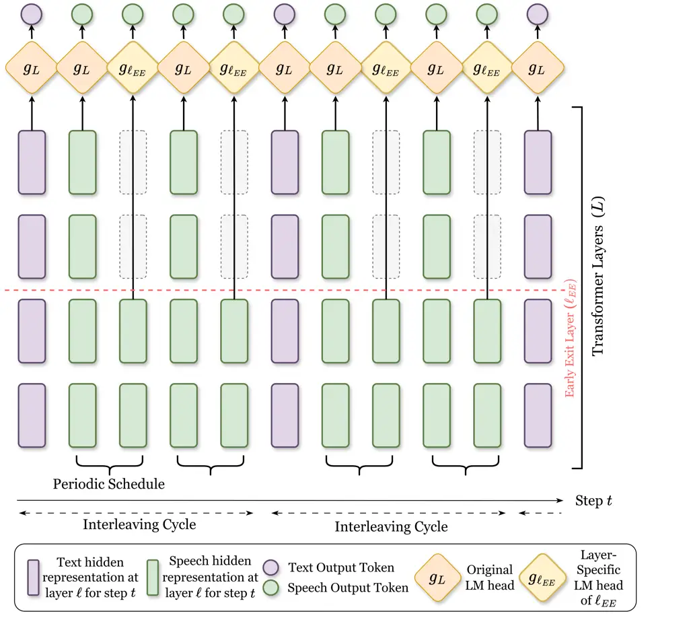

# SPAR-K: Scheduled Periodic Alternating Early Exit for Spoken Language Models

Hsiao-Ying Huang Affiliation: National Taiwan University  
Taipei, Taiwan  
monicahuangml1@gmail.com    Cheng-Han Chiang Affiliation: National
Taiwan University  
Taipei, Taiwan  
dcml0714@gmail.com    Hung-yi Lee Affiliation: National Taiwan
University  
Taipei, Taiwan  
tlkagkb93901106@gmail.com

###### Abstract

Interleaved spoken language models (SLMs) alternately generate text and
speech tokens, but decoding at full transformer depth for every step
becomes costly, especially due to long speech sequences. We propose
SPAR-K, a modality-aware early exit framework designed to accelerate
interleaved SLM inference while preserving perceptual quality. SPAR-K
introduces a speech alternating-depth schedule: most speech positions
exit at a fixed intermediate layer, while periodic full-depth ”refresh”
steps mitigate distribution shift due to early exit. We evaluate our
framework using Step-Audio-2-mini and GLM-4-Voice across four datasets
spanning reasoning, factual QA, and dialogue tasks, measuring
performance in terms of ASR transcription accuracy and perceptual
quality. Experimental results demonstrate that SPAR-K largely preserves
question-answering accuracy with a maximum accuracy drop of 0.82% while
reducing average speech decoding depth by up to 11% on Step-Audio-2-mini
and 5% on GLM-4-Voice, both with negligible changes in MOS and WER and
no auxiliary computation overhead. We further demonstrate that
confidence-based early exit strategies, widely used in text LLMs, are
suboptimal for SLMs, highlighting that the unique statistical nature of
speech tokens necessitates a specialized early exit design.

###### Index Terms: 

Spoken language model, Early exit, Inference acceleration, Language
modeling

## I Introduction

Spoken language models (SLMs) aim to unify speech understanding and
speech generation in a single autoregressive model, taking speech as
input and producing speech output \[1, 2, 3, 4\]. Recent end-to-end
systems demonstrate that large transformer backbones can be trained to
support speech-to-speech conversation by modeling a unified token stream
that includes both text and discrete speech units \[5, 6, 2, 3, 4\]. A
particularly simple and increasingly prospective structure is the
interleaved SLM, which generates speech output by alternatively
generating text and speech tokens in a fixed ratio, enabling streaming
synthesis and, importantly, allowing text tokens to provide explicit
semantic guidance for subsequent speech tokens \[7, 8, 9, 10, 11, 12\].
The speech tokens will be synthesized to audio via an audio
decoder \[13, 14, 15\].

Despite their impressive capabilities, modern SLMs are computationally
expensive at inference time: they inherit the depth and width of large
language models, and must additionally decode long sequences of speech
units, making real-time deployment challenging \[1, 3, 11\]. In
text-only LLM inference, a large body of work reduces decoding cost via
adaptive compute, including early exit strategies that dynamically
allocate per-token ”thinking depth” based on confidence signals \[16,
17, 18, 19, 20, 21\]. However, in our later experiment, we will show
that directly transferring such early exit policies to interleaved SLMs
may not always work, showing that text tokens and speech tokens are
inherently different and cannot early exit in the same way.

We conduct an experiment to show that text and speech tokens behave
differently for interleaved SLMs. Given a speech input and the complete
sequence of text-speech output tokens generated using standard decoding,
for each generation step, we can extract the hidden representation from
an intermediate layer and predict a token from this distribution using a
trained layer-specific LM head (Sec. IV-B2). Note this experiment, we do
not use the token prediction from intermediate layers as the input for
the model in the next generation step. Interestingly, although
intermediate-layer speech tokens often differ from the final-layer
predictions, the synthesized audio still sounds similar. In contrast,
the text tokens extracted from intermediate layers cannot form a
coherent sentence. This suggests that computing full transformer depth
at every speech position may be unnecessary, which motivates our early
exit design on speech steps.



Fig. 1: Overview of our method – SPAR-K Early Exit Scheduler (take
Step-Audio-2-mini for example)

In this work, we propose a speech-specialized scheduled periodic
alternating early exit (SPAR-K) framework for interleaved SLMs (shown in
Fig. 1). The core of the SPAR-K framework is a $`\mathrm{K}`$ scheduling
strategy that selectively executes early exits for specific speech
positions within the interleaving sequence. By interleaving early exit
positions with full-depth inference steps, we provide the model with
periodic ”refreshes” that prevent the severe distribution shift from
full-depth decoding. Empirically, our approach preserves semantic
perception quality on diverse tasks, including dialogue and factual QA,
while reducing average decoding depth for speech tokens. Contrary to the
unstable transfer of the common confidence-based early exit paradigms
(Sec. V-B, Tab. II: S3, G3), our schedule-based policy consistently
provides a practical efficiency–quality trade-off without incurring
additional per-step confidence computation on speech positions. Our main
contributions are:

- •
  We are the first paper to explore early exit in interleaved SLMs. We
  propose SPAR-K, an early exit policy that improves decoding efficiency
  without any auxiliary computation overhead.
- •
  Using two interleaved SLM backbones on four datasets, SPAR-K
  consistently reduces the computation by 5% to 11% while maintaining
  the semantic and perceptual quality of the speech response.
- •
  We provide empirical evidence that the distinct nature of speech and
  text tokens in interleaved SLMs leads to distinct early exit policy.

## II Related Work

### II-A Early Exit

Standard autoregressive decoding generates each token by passing through
the full stack of transformer layers in the language model (LM). Early
exit methods \[22, 23\] accelerate generation by producing the
next-token prediction at an intermediate (non-last) layer, and use this
next token as the input to the model in the next generation step. By
skipping the remaining layers, the computation is saved. In text-only
LLMs, prior work falls into two broad families: (1) Training-enabled
early exit modifies pretraining or fine-tuning so that shallower layers
produce usable predictions \[21, 16, 24\]; (2) Confidence-adaptive early
exit dynamically selects a per-token depth and exits once an
intermediate prediction is sufficiently confident under some uncertainty
indicator \[16, 17, 18, 19, 20, 21, 25\].

In speech systems, early exit has so far been explored only on
discriminative encoders for automatic speech recognition (ASR) and
self-supervised representation learning \[26, 27, 28, 29\]. Despite
their minor structural or training technique differences, all prior
speech early exit methods target discriminative models with frame-level
CTC supervision and confidence-thresholded exit. To our knowledge, no
prior work explores early exit in large SLMs with autoregressive
speech-token generation.

### II-B Inference Acceleration in Spoken Language Models

Prior work on accelerating autoregressive SLMs largely operates along
two axes that are orthogonal to layer depth. Along the token-rate axis,
shortening the generated speech sequence directly reduces the number of
forward passes per second of audio. Hassid et al. \[30\] show that lower
speech token rates even improve SLM lexical and syntactic modeling, and
recent SLMs adopt lower frame rate codecs such as Mimi \[3\]. Along the
token axis, multi-token prediction (MTP) augments the backbone with
auxiliary heads that emit several future tokens per forward pass.
SLAM-Omni \[31\] introduces group modeling for accelerated speech token
generation, and VocalNet \[32\] proposes a refined MTP design tailored
to speech LLMs. Speech Speculative Decoding \[33\] adapts speculative
decoding to autoregressive speech LMs, using a lightweight draft model
with parallel verification by the frozen target. Both families require
training: token-rate methods require pretraining the SLM with a
lower-rate codec, and token-axis methods require training auxiliary
heads or a draft model. SPAR-K accelerates SLM inference along a
complementary axis, layer depth, and is composable with the token-rate
and token-axis methods above.

### II-C Modality Characteristics in Interleaved SLMs

Interleaved SLMs \[7, 8, 9, 10, 11, 12\] generate text tokens and
discrete speech tokens within a single autoregressive stream, but these
two token types exhibit markedly different statistical properties.
Discrete speech tokens are typically high-rate and locally predictable:
recent analyses of speech codec modeling observe strong short-range
dependency, where next-token prediction is dominated by nearby acoustic
context and acoustic redundancy naturally existing in speech also
persists in discrete representations \[34, 35, 36\]. The locality and
redundancy suggest that computing full-depth inference at every speech
position may be unnecessary, motivating our shallower decoding for
speech steps.

## III Notations and Preliminary

SLMs \[2, 3, 4\] take speech input $`\mathbf{x}_{\rm in}`$ and generate
speech outputs. Since directly generating the speech output is
challenging, interleaved SLMs generate the speech output by alternately
generating $`N_{\rm text}`$ text tokens and $`N_{\rm speech}`$ speech
tokens \[1, 9, 10\]. The text tokens correspond to the transcription of
the speech tokens. The SLM is a stack of $`L`$ layer transformer
language model that autoregressively generates the next token
conditioning on the input $`\mathbf{x}_{\rm in}`$ and previously
generated output tokens $`y_{i}`$. Let
$`h_{t}^{(\ell)}\in\mathbb{R}^{d}`$ denotes the hidden representation at
output step $`t`$ and layer $`\ell\in\{1,\cdots,L\}`$, where $`d`$ is
the hidden dimension size. At a generation step $`t`$, the SLM predicts
the next token distribution $`p_{t}(\cdot|\mathrm{x},y_{<t})`$ over the
vocabulary space by a language model head $`g_{L}`$

```math
p_{t}(\cdot|\mathrm{x},y_{<t})=\text{softmax}(g_{L}(h_{t}^{(\ell)}). \tag{1}
```

Standard SLMs generate each token by using the full stack of transformer
layers $`\{1,\cdots,L\}`$. The next token distribution is always
predicted by the last layer’s hidden representation $`h_{t}^{(L)}`$. In
early exit, at a generation step $`t`$, we accelerate the inference
speed by optionally using the hidden representation
$`h_{t}^{(\ell_{EE})}`$ at a layer $`\ell_{EE}<L`$ to predict the next
token prediction.

|                       | Fixed exit layer $`\ell`$ |           |           |           |           |           |
| --------------------- | ------------------------- | --------- | --------- | --------- | --------- | --------- |
| Metric                | 16                        | 21        | 26        | 31        | 36        | 40        |
| MOS $`\uparrow`$      | $`2.922`$                 | $`2.905`$ | $`2.978`$ | $`2.985`$ | $`2.996`$ | $`3.004`$ |
| Agree(%) $`\uparrow`$ | $`19.14`$                 | $`22.13`$ | $`32.83`$ | $`39.57`$ | $`46.21`$ | $`100`$   |

TABLE I: Oracle leave-at-fixed-layer study: MOS / Top-1 Agreement Ratio
(Agree %) vs. fixed exit layer $`\ell`$ in speech positions.

## IV Methodology

We design a simple method to accelerate the generation speed of
interleaved SLM by only early exiting the speech tokens for the
interleaved SLM using a fixed period schedule. We focus on interleaved
SLMs since it is an important SLM paradigm adopted by many widely used
open-sourced SLMs \[9, 10, 11\] .

### IV-A Motivation

Our method is motivated by two empirical observations about interleaved
SLM generation. First, speech tokens dominate per-response compute:
across our four evaluation datasets, they account for 79.5%
(Step-Audio-2) and 81.2% (GLM-4-Voice) of all generated tokens (averaged
over 2.5k responses per model), making speech the natural target for
early exit. Second, the following preliminary experiment suggests that
speech tokens remain perceptually viable when predicted from
intermediate layers.

Given input $`\mathbf{x}_{\rm in}`$, we first use an interleaved SLM,
GLM-4-Voice \[9\], to generate the response, including the speech and
text token without using early exit. Next, given a generation step $`t`$
and the already generated token $`y_{t}`$, we use a trained prediction
head (introduced in Section IV-B2) to predict a token from the hidden
representation $`h_{t}^{(\ell)}`$ at layer $`\ell`$; denote the
predicted token as $`y_{t}^{(\ell)}`$. We collect all the speech tokens
predicted at layer $`\ell`$ and synthesize them into speech. We report
the mean opinion score (MOS) evaluated by UTMOS-v2 \[37\] for
$`\ell\in\{16,21,26,31,36,40\}`$ in Table I. We additionally report the
average agreement ratio. Agreement between layer $`\ell`$ and $`L`$ is 1
if $`y_{t}^{(\ell)}=y_{t}^{L}`$; otherwise 0. We surprisingly found that
the MOS is consistent across different $`\ell`$, even if the speech
tokens predicted at layer $`\ell`$ may not match the prediction from the
last layer. This hints that using non-last layer speech token
predictions may be feasible. However, if we auto-regressively generate
the next speech token by early exiting from a fixed $`\ell<L`$, we found
that the speech quality deteriorates significantly (Table II: S2, G2).
Motivated by the above observation, we design a SPAR-K, a method that
periodically interleaves between early exit and full-depth generation
for speech tokens.

### IV-B Method

We propose a simple method for early exiting speech tokens in
interleaved SLMs. In a chunk of $`N_{\rm speech}`$ speech tokens, we use
a fixed schedule with a period of $`K`$ token to periodically enable or
disable early exit with a fixed pattern: we early exit from layer
$`\ell_{EE}`$ for $`K-1`$ positions and use full-depth decoding from
layer $`L`$ at one position. To early exit from layer $`\ell_{EE}`$, we
train a prediction head (Section IV-B2) to predict a token distribution
from the hidden representation at layer $`\ell`$.

#### IV-B1 SPAR-K Early Exit Scheduler

SPAR-K early exit schedule partitions a speech chunk of
$`N_{\rm speech}`$ tokens into subgroups of size $`K`$¹¹ 1 The last
subgroup may be less than $`K`$ and use full-depth decoding at a fixed
position while early exit at other positions in the subgroup. We explore
the two schedules with $`K=2`$ and one with $`K=3`$: (i) Even schedule:
Within a chunk of $`N_{\rm{speech}}`$ speech token, the early exit
pattern starting from the first position is
$`\{L,\ell_{EE},L,\ell_{EE},\cdots\}`$; this notation means that for the
1$`{}^{\text{st}}`$, 3$`{}^{\text{rd}}`$, etc., positions in the chunk
of $`N_{\rm{speech}}`$ speech token, we use full-depth decoding, while
the 2$`{}^{\text{nd}}`$, 4$`{}^{\text{th}}`$, etc., positions, we early
exit from layer $`\ell_{EE}`$. Figure 1 shows an example of this
schedule. (ii) Odd schedule: Within a chunk of $`N_{\rm{speech}}`$
speech token, the early exit pattern is
$`\{\ell_{EE},L,\ell_{EE},L,\cdots\}`$. (iii) Triple schedule: The early
exit pattern within a speech token chunk is
$`\{L,\ell_{EE},\ell_{EE},L,\ell_{EE},\ell_{EE},\cdots\}`$.

#### IV-B2 Training the Layer-Specific LM Head

Since the original LM head $`g_{L}(\cdots)`$ is only trained to
recognize the hidden representation from the last layer ($`L`$), we
cannot directly use $`g_{L}`$ for the hidden representation of a
different layer.

For each transformer layer $`\ell\in\{1,\ldots,L\}`$, we learn a
layer-specific LM head that projects the intermediate hidden state
$`h_{t}^{(\ell)}\in\mathbb{R}^{d}`$ into vocabulary space \[38\]. The
resulting next-token distribution of intermediate layer is

```math
p_{\ell}(\cdot\mid y_{<t})=\operatorname{softmax}\left(g_{\ell}(h_{t}^{(\ell)})\right). \tag{2}
```

When training the layer-specific LM head, the SLM backbone is fixed and
not trained. The layer-specific LM head $`g_{\ell}`$ is trained to
predict the token distribution of the last layer LM head $`g_{L}`$ using
cross-entropy loss.

```math
\mathcal{L}^{(\ell)}=\mathbb{E}_{(y_{<t})\sim\mathcal{D}}\left[-\sum_{v\in\mathcal{V}}p_{L}(v\mid y_{<t})\log p_{\ell}(v\mid y_{<t})\right]. \tag{3}
```

#### IV-B3 Generating Missing KV-Cache by Deferred Parallel Decoding

Early exit at layer $`\ell_{EE}`$ for position $`t`$ computes only
layers 1 to $`\ell_{EE}`$, leaving $`K^{(\ell)}_{t},V^{(\ell)}_{t}`$
uncomputed for every $`\ell>\ell_{EE}`$. Any later full-depth step
$`t^{\prime}>t`$ must attend to position $`t`$ at these upper layers, so
the missing entries must be filled in before they are needed. Prior work
resolves this either by approximate state copying \[16\] or by reactive
synchronized parallel decoding \[17\].

SPAR-K adopts parallel decoding \[17\] but triggers it on its own
periodic full-depth steps rather than reactively, which makes the
fill-in essentially free. Instead of backfilling the upper layers at
each early-exit step, we defer them: we cache only
$`h^{(\ell_{EE})}_{t}`$ and mark $`t`$ as pending. At the next
full-depth step $`t^{\prime}`$, we co-process the pending early-exit
positions in parallel with $`t^{\prime}`$ through the upper layers
$`\ell_{EE}{+}1:L`$ in a single attention call under a length-$`K`$
causal mask, analogous to a mini-prefill restricted to uncomputed upper
layer (Algorithm 1). Every full-depth step $`t^{\prime}`$ therefore
restores complete KV at all layers for all preceding positions,
recovering the standard decoding invariant. Note that even though the
full-depth pass may predict a different token at $`t`$, we retain the
early exit prediction as the emitted token.

Deferring the KV completion is what makes it cheap. GPU decoding at a
small batch size is memory-bound: per-layer latency is dominated by
loading that layer’s weights from GPU memory (HBM) rather than by the
tensor arithmetic on the tokens \[39\]. Completing each pending position
separately would traverse the upper layers once per position, reloading
their weights each time. Processing the pending positions in one batched
pass (in parallel) over $`\ell_{EE}{+}1:L`$ instead loads each
upper-layer weight matrix once, so the completion costs essentially the
same as a single full-depth pass. The efficiency of SPAR-K therefore has
two sources: the early-exit steps are shallower, and the deferred
completion adds negligible overhead on the full-depth steps.

0:  heads $`g_{L},g_{\ell_{EE}}`$; early-exit layer $`\ell_{EE}`$;
schedule
$`s_{1},\dots,s_{N_{\text{speech}}}\in\{\textsc{ee},\textsc{full}\}`$
for one speech chunk

1:  $`\mathcal{P}\leftarrow\varnothing`$ {positions with deferred upper
KV}

2:  for $`t=1`$ to $`N_{\text{speech}}`$ do

3:    run layers $`1`$ to $`\ell_{EE}`$; cache lower KV; store
$`h^{(\ell_{EE})}_{t}`$

4:    if $`s_{t}=\textsc{ee}`$ then

5:    $`y_{t}\leftarrow\arg\max\ g_{\ell_{EE}}(h^{(\ell_{EE})}_{t})`$;
$`\mathcal{P}\leftarrow\mathcal{P}\cup\{t\}`$ {defer upper KV}

6:    else

7:    batch $`\mathcal{P}\cup\{t\}`$ through layers $`\ell_{EE}{+}1`$ to
$`L`$ (length-$`K`$ mask) {full-depth refresh at $`t`$; fill pending
upper-layer KV}

8:
   $`y_{t}\leftarrow\arg\max\ g_{L}(h^{(L)}_{t})`$; $`\mathcal{P}\leftarrow\varnothing`$

9:    end if

10:  end for

Algorithm 1 SPAR-K KV-Cache: Deferred Parallel Decoding

## V Experiments

### V-A Setup

Models. We include two widely used interleaved SLMs in our experiment:
Step-Audio-2-mini \[10\] and GLM-4-Voice \[9\]. We will use Step-Audio-2
to refer to Step-Audio-2-mini for short. Step-Audio-2 is a 28-layer
model with a text-speech interleaved schedule of
$`N_{\rm text}:N_{\rm speech}=1:4`$, and GLM-4-Voice is a 40-layer SLM
with a text-speech interleaved schedule of
$`N_{\rm text}:N_{\rm speech}=13:26`$. We use greedy decoding for
GLM-4-Voice in our main experiments. For Step-Audio-2, we use nucleus
sampling with $`(\mathrm{temperature}=0.7,\mathrm{top\_p}=0.9)`$. These
different generation configuration follows the default generation
configuration of the two SLMs respectively.

Layer-wise LM Head Training. We use VoiceAssistant-400K \[40\], a spoken
dialogue dataset, for layer-specific LM head training. We sample a
subset of 18K instances and obtain pseudo-label distributions by running
full-depth autoregressive generation on SLMs and train using the
procedure described in Sec. IV-B2.

Evaluation. We follow the common SLM evaluation settings \[9, 4, 12,
11\], evaluating on four English datasets ranging from dialogue to
factual knowledge question answering (QA): AlpacaEval \[41\], Llama
Questions \[42\], TriviaQA \[43\], and WebQuestion \[44\].

Metrics. For the three QA datasets, we report the accuracy against the
ground truth answer using GPT-4o-mini, following \[4\]. For AlpacaEval,
we use LLM-as-a-Judge to evaluate the response and normalize the score
to 0 to 100 \[45\]. When reporting the performance on the above four
datasets, we evaluate the ASR transcription of speech output from the
interleaved SLM.²² 2 We synthesize the audio from the speech tokens, run
ASR (Whisper-large-v3), and evaluate the transcription. We also evaluate
performance using text tokens and find a similar performance trend and
even much better results.

To quantify early-exit efficiency, we log the exit layer $`\ell_{t}`$ at
every decoding step $`t`$ and report the average exit depth
$`\bar{\ell}=\frac{1}{|T|}\sum_{t\in T}\ell_{t}`$ for text and speech
positions respectively, together with the resulting layer saving

```math
\mathrm{LayerSaving}=\Big(1-\tfrac{\bar{\ell}}{L}\Big)\times 100\%=\mathbb{E}_{t}\!\left[\frac{L-\ell_{t}}{L}\right]\times 100\%. \tag{4}
```

The reported saving reflects the exact exit layer taken at each position
for any model and interleaving ratio. We report layer saving as a
hardware-agnostic measure of the compute SPAR-K saves, rather than
wall-clock latency. Wall-clock latency is not determined solely by
arithmetic computation in transformer layers, which is what SPAR-K
reduces; it also includes substantial software overhead \[46\]
independent of model depth, such as time spent dispatching operations
and launching GPU kernels at each decoding step. This large unoptimized
overhead is not the focus of this work, and it dilutes the measured
speedup SPAR-K actually achieves. Layer saving, by contrast, is
invariant to this overhead and serves as both a faithful and a
conservative proxy for the achievable gain.

Finally, to evaluate the speech output quality, we further report the
following three metrics: (i) objective MOS evaluated by UTMOS-v2 \[37\];
(ii) text–speech alignment between the interleaved text and the speech
tokens using ASR-WER; and (iii) subjective human MOS on speech
naturalness, collected via Amazon Mechanical Turk under the ITU-T
P.800.1 Absolute Category Rating protocol. More specifically, for
text-speech alignment, we compute ASR-WER by transcribing the
synthesized speech with Whisper-large-v3 \[47\] and measuring word error
rate against the text tokens generated by the SLM; for human MOS
evaluations, we randomly select 25 samples from each dataset, shuffle
the resulting 100 samples, and ask annotators to rate the naturalness of
each sample on a 1–5 scale, collecting at least 3 valid ratings per
sample after quality filtering to compute a reliable mean MOS for each
method under each SLM.

Configurations Transcription Performance Speech Quality Efficiency: Exit
Layer Row ID Text EE Speech EE AlpacaE LlamaQA TQA WebQA Mean MOS
$`\uparrow`$ H-MOS $`\uparrow`$ ASR-WER $`\downarrow`$ Text Speech
(LayerSaving%) Step-Audio-2 Baselines S1 – – $`45.98`$ $`68.00`$
$`49.10`$ $`53.80`$ $`54.22`$ $`3.710`$ $`3.998`$ $`1.51`$ 28 28 S2 –
Fixed (25) $`35.58`$ $`67.33`$ $`46.70`$ $`50.90`$ $`50.13`$ $`3.058`$
$`3.810`$ $`3.40`$ 28 25.00 (11%$`\uparrow`$) S3 – Conf (26) $`24.92`$
$`65.00`$ $`28.50`$ $`47.60`$ $`41.51`$ $`1.651`$ $`2.807`$ $`11.01`$ 28
26.07 (6.9%$`\uparrow`$) SPAR-K (Ours) S4 – Even (22) $`45.28`$
$`63.00`$ $`49.20`$ $`55.40`$ $`53.22`$ $`3.643`$ $`3.940`$ $`1.58`$ 28
25.00 (11%$`\uparrow`$) S5 – Odd (22) $`45.98`$ $`67.00`$ $`48.70`$
$`53.30`$ $`53.75`$ $`3.650`$ $`4.133`$ $`2.19`$ 28 25.00
(11%$`\uparrow`$) S6 – Triple (22) $`46.33`$ $`67.33`$ $`51.00`$
$`56.50`$ $`55.29`$ $`3.668`$ $`3.977`$ $`1.51`$ 28 25.00
(11%$`\uparrow`$) Analyses S7 – Even (21) $`44.37`$ $`66.33`$ $`49.10`$
$`54.00`$ $`53.45`$ $`3.652`$ – $`1.57`$ 28 24.50 (12%$`\uparrow`$)
GLM-4-Voice Baselines G1 – – $`51.06`$ $`61.33`$ $`44.90`$ $`52.20`$
$`52.37`$ $`2.982`$ $`3.345`$ $`4.31`$ 40 40 G2 – Fixed (38) $`44.17`$
$`65.33`$ $`45.00`$ $`51.40`$ $`51.48`$ $`2.662`$ $`2.083`$ $`43.60`$ 40
38.00 (5.0%$`\uparrow`$) G3 – Conf (36) $`50.20`$ $`64.67`$ $`45.70`$
$`51.00`$ $`52.89`$ $`2.866`$ $`3.060`$ $`7.62`$ 40 37.03
(7.4%$`\uparrow`$) SPAR-K (Ours) G4 – Even (36) $`50.70`$ $`60.00`$
$`42.00`$ $`50.60`$ $`50.83`$ $`2.950`$ $`3.345`$ $`5.36`$ 40 38.00
(5.0%$`\uparrow`$) G5 – Odd (36) $`49.75`$ $`58.33`$ $`43.00`$ $`50.30`$
$`50.35`$ $`2.982`$ $`3.187`$ $`5.06`$ 40 38.00 (5.0%$`\uparrow`$) G6 –
Triple (37) $`47.84`$ $`63.33`$ $`44.70`$ $`51.90`$ $`51.94`$ $`2.909`$
$`3.182`$ $`5.77`$ 40 38.00 (5.0%$`\uparrow`$) Analyses G7 – Even (31)
$`47.69`$ $`58.33`$ $`38.00`$ $`44.80`$ $`47.21`$ $`2.960`$ – $`8.85`$
40 35.50 (11%$`\uparrow`$) G8 – Even (33) $`48.19`$ $`57.33`$ $`41.80`$
$`48.50`$ $`48.96`$ $`2.981`$ – $`7.13`$ 40 36.50 (8.8%$`\uparrow`$) G9
– Even (35) $`49.45`$ $`61.00`$ $`41.20`$ $`49.50`$ $`50.29`$ $`2.942`$
– $`6.44`$ 40 37.00 (7.5%$`\uparrow`$) G10 Even (36) – $`10.00`$
$`42.00`$ $`0.00`$ $`21.70`$ $`18.43`$ $`2.979`$ – $`12.80`$ 38.00 40
G11 Conf (36) Even (36) $`48.64`$ $`59.00`$ $`38.50`$ $`48.30`$
$`48.61`$ $`2.949`$ – $`5.15`$ 38.02 38.00 (5.0%$`\uparrow`$)

TABLE II: Speech Transcription Performance across three QA datasets in
Accuracy (%) and AlpacaEval in LLM-judge score (0-100); speech quality
in MOS, Human-MOS on speech naturalness (H-MOS) and ASR-WER; early exit
efficiency displayed as text/speech average exit layer (Exit Layer) and
layer saving (speedup) percentage (%). For the baselines, the row
indexing corresponds to the numbering in Section V-B. The early exit
configuration is denoted using the early exit method (the even, odd, or
triple schedule in SPAR-K or Conf for confidence-based early exit), and
the number in the parentheses denote the layer of early exit. For the
confidence-based early exit, the early exit layer is determined by the
entropy, and the layer in the parenthesis is the layer where we start to
apply the entropy threshold and decide whether to early exit.

### V-B Compared Methods

We include the following four methods for comparison. Unless otherwise
specified, all the methods with early exit only early exit the speech
tokens. (1) No early exit: using full-depth transformer layers to
generate the next token. (2) Fixed-layer early exit: always exiting on a
fixed layer for the speech tokens. (3) Confidence-based early exit:
Given a hidden representation $`h_{t}^{\ell}`$, calculate the next token
prediction at that layer and obtain the entropy of the distribution.
Next, compare the entropy with a predefined threshold and early exit
only if the entropy is lower than the threshold. This is a widely used
method in text-only LLMs. We carefully tune the threshold to obtain the
best performance. (4) SPAR-K: Our proposed method. We report the
performance of three difference schedules, and the early exit layer is
selected based on the ASR-WER and MOS using a held-out set from
VoiceAssistant-400K.

### V-C Main Results

Overall performance. SPAR-K largely preserves SLM performance on average
for the four evaluated datasets, with no accuracy drop on Step-Audio-2
and a maximum average accuracy drop of 0.82% on GLM-4-Voice (Table II:
S6, G6). For Step-Audio-2, in the best-performing configuration,
$`\textit{Triple}(22)`$ schedule, with notably 11% layer reduction in
speech tokens, maintains ASR-WER (no increase) while only slightly
reducing MOS ($`3.710\rightarrow 3.668`$, -1.12%). For GLM-4-Voice, the
best overall balance of GLM-4-Voice is achieved by
$`\textit{Even}(36)`$: speech tokens exit at an average depth of 38 (5%
layer reduction on speech decoding) without introducing additional
compute, and with only modest speech-quality changes (MOS
$`2.982\rightarrow 2.950`$, 1.07% drop; ASR-WER
$`4.31\%\rightarrow 5.36\%`$).

Fixed-Layer EE Causes Severe Speech Degradation. As discussed in
Sec. IV-A, a naive Fixed-Layer early exit policy is not feasible for SLM
speech decoding. This is corroborated by the quantitative results in row
S2, G2. Both exhibit pronounced drops in speech quality. Possibly due to
early exit distribution shift \[17\], we find that after the model
finishes generating the text-related context, it continues producing
redundant speech tokens without properly terminating, resulting in high
WER.

SPAR-K vs. Confidence-Based Early Exit. Confidence-based early exit is a
common paradigm in LLM inference. When applying confidence-based early
exit to SLMs for the speech tokens, we find that it leads to a
significant performance (quality) drop for Step-Audio-2 (row S3). For
GLM-4-Voice, confidence-based early exit can work under carefully tuned
entropy thresholds (row G3). This shows that confidence-based early exit
is sensitive to the SLM backbones. Moreover, a significant drawback of
confidence-based early exit is that it typically requires additional
computation: to decide the entropy, we need to project the hidden
representation to the vocabulary space; if the token prediction from the
intermediate layer isn’t used due to insufficient confidence, the
computation of calculating the token distribution at the intermediate
layer is a waste. In contrast, since SPAR-K is based on a fixed
schedule, we will not waste computation on calculating token
distribution that may not be usable.

Discussion over schedule variants. We first clarify why different
schedules can attain the same efficiency. By Eq. (4), the average exit
depth of a speech chunk is the mean of its per-position exit layers,
which depends on how many positions run at full depth $`L`$ versus
$`\ell_{EE}`$, not on their ordering. Two schedules with the same number
of full-depth positions per chunk therefore yield identical layer
savings; the schedule acts not as an efficiency control but as a quality
control, governing how early-exit positions are spaced between
full-depth “refresh” steps. Table II shows this: for Step-Audio-2, whose
interleaving cycle has only four speech positions, the Even, Odd, and
Triple schedules each use two full-depth and two early-exit positions
per chunk, sharing an identical $`25.0`$ average exit depth (S4–S6); on
GLM-4-Voice we likewise match savings across schedules (G4–G6), so the
comparison isolates spacing effects.

Under this matched-efficiency view, we find that Step-Audio-2 tolerates
a larger period $`K`$: the Triple schedule performs comparably to Even
and Odd (S4–S6). On GLM-4-Voice, by contrast, Triple(37) yields slightly
lower MOS than Even(36). We attribute this to GLM-4-Voice’s much longer
speech block (26 speech positions per cycle versus 4). As $`K`$ grows,
the spacing between refreshes widens, so more consecutive tokens are
decoded shallowly and error can accumulate over a longer stretch – an
effect amplified by GLM-4-Voice’s long chunk. Overall, however, the
schedules do not differ significantly, indicating that SPAR-K is robust
to this choice.

### V-D Human Speech Naturalness Evaluation: Human MOS result matches UTMOS-v2 result

To verify that early-exit mechanisms preserve speech output quality, we
complement our objective UTMOS-v2 assessment with a human evaluation of
speech naturalness for audio generated by SPAR-K and the baseline
methods.

As shown in Table II (H-MOS column), importantly, SPAR-K (rows S4–S6 and
G4–G6) matches the naturalness of the original non-early-exit models
(row S1 and G1). Moreover, the relative MOS ordering across SPAR-K and
other compared methods (Fixed-layer: S2, G2; Confidence: S3, G3) is
consistent with the UTMOS-v2 results (Table II - Speech Quality MOS
column).

### V-E Analyses

Early Exit Layer Analyses of SPAR-K  We investigate the sensitivity of
the SPAR-K policy to the early exit layer hyperparameter, $`\ell_{EE}`$.
As shown in row S7 and G7-G9, as $`\ell_{EE}`$ decreases, we observe a
gradual increase in ASR-WER, rather than an abrupt collapse in
performance. This trend suggests that perceptual quality can be
preserved within a specific depth range.

Exploring Text Early Exit Policies  We also try to apply SPAR-K on text
tokens. However, as shown in row G10, we find a severe drop in
transcription performance. This suggests that text tokens require
finer-grained early exit control to dynamically allocate decoding depth
per token. We also try to apply confidence-based early exit on text
tokens and apply SPAR-K on the speech tokens. The result is shown in row
G11. With carefully chosen confidence thresholds, the average
performance drop is reduced to 7.18%, while the speech quality remains.
This highlights that the distinct properties in text and speech tokens
require different early exit policy.

## VI Implementation Details

### VI-A Setup of Confidence-based Early Exit Experiments

As mentioned in Section V-B, in Confidence-based early exit experiments,
we carefully tune the entropy threshold to obtain the best performance
for the method. After large-scale experiments, the final entropy
threshold for GLM-4-Voice is set to 0.5 (Table. II: G3) and the entropy
threshold for Step-Audio-2 is set to 0.1 (Table. II: S3).

## VII Limitations

We acknowledge some limitations of SPAR-K. First, our evaluation focuses
on two SLMs in the interleaved paradigm, where a single autoregressive
stream alternates text and speech tokens. Other SLM architectures like
Kimi-Audio \[4\] generate text and speech tokens through separate
parallel heads on top of a shared transformer backbone. The speech
alternating-depth schedule is in principle applicable to the audio-head
stream in such models, but we have not empirically validated SPAR-K in
this setting. Second, the early-exit layer $`\ell_{EE}`$ is currently
selected via held-out validation; adaptive or learned scheduling
policies with no extra compute that allocate depth based on model
backbone could plausibly yield further gains. Third, SPAR-K accelerates
only speech positions; our analyses in Section V-E (rows G9–G10) suggest
that text tokens require finer-grained policies, and combining
modality-specific schedules across both token types is a promising
direction.

## VIII Conclusion

We present SPAR-K, a modality-aware early exit framework that
accelerates interleaved spoken language models without retraining.
Motivated by the local predictability of speech tokens, SPAR-K replaces
confidence-based per-token exit with a scheduled periodic alternating
depth pattern: most speech positions exit at a fixed intermediate layer,
while periodic full-depth refresh steps mitigate distribution shift. On
Step-Audio-2-mini and GLM-4-Voice across reasoning, factual QA, and
dialogue benchmarks, SPAR-K reduces average speech decoding depth by up
to 11% with at most a 0.82% drop in question-answering accuracy, and
preserves perceptual quality across both objective and human listening
evaluations. Our analysis further shows that confidence-based exit
criteria, while effective for text LLMs, are suboptimal for interleaved
SLMs, establishing modality-aware depth control as a promising and
complementary direction for SLM inference acceleration.

## References

- \[1\] S. Arora, K. Chang, C. Chien, Y. Peng, H. Wu, Y. Adi, E.
  Dupoux, H. Lee, K. Livescu, and S. Watanabe (2025) On the landscape of
  spoken language models: a comprehensive survey. arXiv preprint
  arXiv:2504.08528. Cited by: §I, §I, §III.
- \[2\] W. Cui, D. Yu, X. Jiao, Z. Meng, G. Zhang, Q. Wang, S. Y. Guo,
  and I. King (2025) Recent advances in speech language models: a
  survey. In Proceedings of the 63rd Annual Meeting of the Association
  for Computational Linguistics (Volume 1: Long Papers),
  pp. 13943–13970. Cited by: §I, §III.
- \[3\] A. Défossez, L. Mazaré, M. Orsini, A. Royer, P. Pérez, H.
  Jégou, E. Grave, and N. Zeghidour (2024) Moshi: a speech-text
  foundation model for real-time dialogue. arXiv preprint
  arXiv:2410.00037. Cited by: §I, §I, §II-B, §III.
- \[4\] D. Ding, Z. Ju, Y. Leng, S. Liu, T. Liu, Z. Shang, K. Shen, W.
  Song, X. Tan, H. Tang, et al. (2025) Kimi-audio technical report.
  arXiv preprint arXiv:2504.18425. Cited by: §I, §III, §V-A, §V-A, §VII.
- \[5\] A. Zeng, Z. Du, M. Liu, L. Zhang, S. Jiang, Y. Dong, and J.
  Tang (2024) Scaling speech-text pre-training with synthetic
  interleaved data. arXiv preprint arXiv:2411.17607. Cited by: §I.
- \[6\] D. Zhang, S. Li, X. Zhang, J. Zhan, P. Wang, Y. Zhou, and X.
  Qiu (2023) Speechgpt: empowering large language models with intrinsic
  cross-modal conversational abilities. In Findings of the Association
  for Computational Linguistics: EMNLP 2023, pp. 15757–15773. Cited by:
  §I.
- \[7\] Y. Yang, S. Liu, J. Li, H. Wang, L. Meng, H. Sun, Y. Liang, Z.
  Ma, Y. Hu, R. Zhao, et al. (2024) Interleaved speech-text language
  models for simple streaming text-to-speech synthesis. arXiv preprint
  arXiv:2412.16102. Cited by: §I, §II-C.
- \[8\] J. Chou, C. Chien, W. Hsu, K. Livescu, A. Babu, A. Conneau, A.
  Baevski, and M. Auli (2023) Toward joint language modeling for speech
  units and text. In Findings of the Association for Computational
  Linguistics: EMNLP 2023, pp. 6582–6593. Cited by: §I, §II-C.
- \[9\] A. Zeng, Z. Du, M. Liu, K. Wang, S. Jiang, L. Zhao, Y. Dong,
  and J. Tang (2024) Glm-4-voice: towards intelligent and human-like
  end-to-end spoken chatbot. arXiv preprint arXiv:2412.02612. Cited by:
  §I, §II-C, §III, §IV-A, §IV, §V-A, §V-A.
- \[10\] B. Wu, C. Yan, C. Hu, C. Yi, C. Feng, F. Tian, F. Shen, G.
  Yu, H. Zhang, J. Li, et al. (2025) Step-audio 2 technical report.
  arXiv preprint arXiv:2507.16632. Cited by: §I, §II-C, §III, §IV, §V-A.
- \[11\] T. Li, J. Liu, T. Zhang, Y. Fang, D. Pan, M. Wang, Z. Liang, Z.
  Li, M. Lin, G. Dong, et al. (2025) Baichuan-audio: a unified framework
  for end-to-end speech interaction. arXiv preprint arXiv:2502.17239.
  Cited by: §I, §I, §II-C, §IV, §V-A.
- \[12\] C. Chiang, X. Wang, L. Li, C. Lin, K. Lin, S. Liu, Z. Wang, Z.
  Yang, H. Lee, and L. Wang (2025) Stitch: simultaneous thinking and
  talking with chunked reasoning for spoken language models. arXiv
  preprint arXiv:2507.15375. Cited by: §I, §II-C, §V-A.
- \[13\] Z. Du, Y. Wang, Q. Chen, X. Shi, X. Lv, T. Zhao, Z. Gao, Y.
  Yang, C. Gao, H. Wang, et al. (2024) Cosyvoice 2: scalable streaming
  speech synthesis with large language models. arXiv preprint
  arXiv:2412.10117. Cited by: §I.
- \[14\] Z. Du, Q. Chen, S. Zhang, K. Hu, H. Lu, Y. Yang, H. Hu, S.
  Zheng, Y. Gu, Z. Ma, et al. (2024) Cosyvoice: a scalable multilingual
  zero-shot text-to-speech synthesizer based on supervised semantic
  tokens. arXiv preprint arXiv:2407.05407. Cited by: §I.
- \[15\] J. Kong, J. Kim, and J. Bae (2020) Hifi-gan: generative
  adversarial networks for efficient and high fidelity speech synthesis.
  Advances in neural information processing systems 33, pp. 17022–17033.
  Cited by: §I.
- \[16\] T. Schuster, A. Fisch, J. Gupta, M. Dehghani, D. Bahri, V.
  Tran, Y. Tay, and D. Metzler (2022) Confident adaptive language
  modeling. Advances in Neural Information Processing Systems 35,
  pp. 17456–17472. Cited by: §I, §II-A, §IV-B3.
- \[17\] S. Bae, J. Ko, H. Song, and S. Yun (2023) Fast and robust
  early-exiting framework for autoregressive language models with
  synchronized parallel decoding. In Proceedings of the 2023 Conference
  on Empirical Methods in Natural Language Processing, pp. 5910–5924.
  Cited by: §I, §II-A, §IV-B3, §IV-B3, §V-C.
- \[18\] F. Valade (2024) Accelerating large language model inference
  with self-supervised early exits. arXiv preprint arXiv:2407.21082.
  Cited by: §I, §II-A.
- \[19\] B. Zheng, M. Ma, Z. Lin, and T. Yang (2025) A hybrid early-exit
  algorithm for large language models based on space alignment decoding
  (spade). arXiv preprint arXiv:2507.17618. Cited by: §I, §II-A.
- \[20\] R. Miao, Y. Yan, X. Yao, and T. Yang (2024) An efficient
  inference framework for early-exit large language models. arXiv
  preprint arXiv:2407.20272. Cited by: §I, §II-A.
- \[21\] M. Elhoushi, A. Shrivastava, D. Liskovich, B. Hosmer, B.
  Wasti, L. Lai, A. Mahmoud, B. Acun, S. Agarwal, A. Roman, et
  al. (2024) Layerskip: enabling early exit inference and
  self-speculative decoding. In Proceedings of the 62nd Annual Meeting
  of the Association for Computational Linguistics (Volume 1: Long
  Papers), pp. 12622–12642. Cited by: §I, §II-A.
- \[22\] D. J. Bajpai and M. K. Hanawal (2025) A survey of early exit
  deep neural networks in nlp. arXiv preprint arXiv:2501.07670. Cited
  by: §II-A.
- \[23\] Y. Chen, X. Pan, Y. Li, B. Ding, and J. Zhou (2023) Ee-llm:
  large-scale training and inference of early-exit large language models
  with 3d parallelism. arXiv preprint arXiv:2312.04916. Cited by: §II-A.
- \[24\] M. Elbayad, J. Gu, E. Grave, and M. Auli (2019) Depth-adaptive
  transformer. arXiv preprint arXiv:1910.10073. Cited by: §II-A.
- \[25\] C. Chen, S. Borgeaud, G. Irving, J. Lespiau, L. Sifre, and J.
  Jumper (2023) Accelerating large language model decoding with
  speculative sampling. arXiv preprint arXiv:2302.01318. Cited by:
  §II-A.
- \[26\] J. W. Yoon, B. J. Woo, and N. S. Kim (2022) Hubert-ee: early
  exiting hubert for efficient speech recognition. arXiv preprint
  arXiv:2204.06328. Cited by: §II-A.
- \[27\] G. A. Wright, U. Cappellazzo, S. Zaiem, D. Raj, L. O. Yang, D.
  Falavigna, M. N. Ali, and A. Brutti (2024) Training early-exit
  architectures for automatic speech recognition: fine-tuning
  pre-trained models or training from scratch. In 2024 IEEE
  International Conference on Acoustics, Speech, and Signal Processing
  Workshops (ICASSPW), pp. 685–689. Cited by: §II-A.
- \[28\] M. Lasbordes, D. Falavigna, and A. Brutti (2025) Splitformer:
  an improved early-exit architecture for automatic speech recognition
  on edge devices. In 2025 33rd European Signal Processing Conference
  (EUSIPCO), pp. 341–345. Cited by: §II-A.
- \[29\] T. Lin, H. Lee, and H. Tang (2024) DAISY: data adaptive
  self-supervised early exit for speech representation models. arXiv
  preprint arXiv:2406.05464. Cited by: §II-A.
- \[30\] M. Hassid, T. Remez, T. A. Nguyen, I. Gat, A. Conneau, F.
  Kreuk, J. Copet, A. Defossez, G. Synnaeve, E. Dupoux, et al. (2023)
  Textually pretrained speech language models. Advances in Neural
  Information Processing Systems 36, pp. 63483–63501. Cited by: §II-B.
- \[31\] W. Chen, Z. Ma, R. Yan, Y. Liang, X. Li, R. Xu, Z. Niu, Y.
  Zhu, Y. Yang, Z. Liu, et al. (2025) Slam-omni: timbre-controllable
  voice interaction system with single-stage training. In Findings of
  the Association for Computational Linguistics: ACL 2025,
  pp. 2262–2282. Cited by: §II-B.
- \[32\] Y. Wang, H. Liu, Z. Cheng, R. Wu, Q. Gu, Y. Wang, and Y.
  Wang (2025) VocalNet: speech llms with multi-token prediction for
  faster and high-quality generation. In Proceedings of the 2025
  Conference on Empirical Methods in Natural Language Processing,
  pp. 19595–19612. Cited by: §II-B.
- \[33\] Z. Lin, Y. Zhang, Y. Yuan, Y. Yan, J. Liu, Z. Wu, P. Hu, and Q.
  Yu (2025) Accelerating autoregressive speech synthesis inference with
  speech speculative decoding. arXiv preprint arXiv:2505.15380. Cited
  by: §II-B.
- \[34\] W. Liu, Q. Chen, W. Wang, G. Yang, W. Li, M. Fang, J. Zuo, X.
  Yang, T. Jin, J. Xu, et al. (2025) Speech token prediction via
  compressed-to-fine language modeling for speech generation. In
  Proceedings of the 33rd ACM International Conference on Multimedia,
  pp. 10632–10641. Cited by: §II-C.
- \[35\] M. Aylett and A. Turk (2006) Language redundancy predicts
  syllabic duration and the spectral characteristics of vocalic syllable
  nuclei. The Journal of the Acoustical Society of America 119 (5),
  pp. 3048–3058. Cited by: §II-C.
- \[36\] X. Zhang, D. Zhang, S. Li, Y. Zhou, and X. Qiu (2023)
  Speechtokenizer: unified speech tokenizer for speech large language
  models. arXiv preprint arXiv:2308.16692. Cited by: §II-C.
- \[37\] K. Baba, W. Nakata, Y. Saito, and H. Saruwatari (2024) The t05
  system for the voicemos challenge 2024: transfer learning from deep
  image classifier to naturalness mos prediction of high-quality
  synthetic speech. In 2024 IEEE Spoken Language Technology Workshop
  (SLT), pp. 818–824. Cited by: §IV-A, §V-A.
- \[38\] N. Belrose, Z. Furman, L. Smith, D. Halawi, I. Ostrovsky, L.
  McKinney, S. Biderman, and J. Steinhardt (2023) Eliciting latent
  predictions from transformers with the tuned lens. arXiv preprint
  arXiv:2303.08112. Cited by: §IV-B2.
- \[39\] R. Pope, S. Douglas, A. Chowdhery, J. Devlin, J. Bradbury, J.
  Heek, K. Xiao, S. Agrawal, and J. Dean (2023) Efficiently scaling
  transformer inference. Proceedings of machine learning and systems 5,
  pp. 606–624. Cited by: §IV-B3.
- \[40\] Z. Xie and C. Wu (2024) Mini-omni: language models can hear,
  talk while thinking in streaming. arXiv preprint arXiv:2408.16725.
  Cited by: §V-A.
- \[41\] X. Li, T. Zhang, Y. Dubois, R. Taori, I. Gulrajani, C.
  Guestrin, P. Liang, and T. B. Hashimoto (2023) AlpacaEval: an
  automatic evaluator of instruction-following models. GitHub. Note:
  https://github.com/tatsu-lab/alpaca\\eval Cited by: §V-A.
- \[42\] E. Nachmani, A. Levkovitch, R. Hirsch, J. Salazar, C.
  Asawaroengchai, S. Mariooryad, E. Rivlin, R. Skerry-Ryan, and M. T.
  Ramanovich (2023) Spoken question answering and speech continuation
  using spectrogram-powered llm. arXiv preprint arXiv:2305.15255. Cited
  by: §V-A.
- \[43\] M. Joshi, E. Choi, D. S. Weld, and L. Zettlemoyer (2017)
  Triviaqa: a large scale distantly supervised challenge dataset for
  reading comprehension. In Proceedings of the 55th Annual Meeting of
  the Association for Computational Linguistics (Volume 1: Long Papers),
  pp. 1601–1611. Cited by: §V-A.
- \[44\] J. Berant, A. Chou, R. Frostig, and P. Liang (2013) Semantic
  parsing on freebase from question-answer pairs. In Proceedings of the
  2013 conference on empirical methods in natural language processing,
  pp. 1533–1544. Cited by: §V-A.
- \[45\] C. Chiang and H. Lee (2023) Can large language models be an
  alternative to human evaluations?. In Proceedings of the 61st Annual
  Meeting of the Association for Computational Linguistics (Volume 1:
  Long Papers), A. Rogers, J. Boyd-Graber, and N. Okazaki (Eds.),
  Toronto, Canada, pp. 15607–15631. External Links:
  [Link](https://aclanthology.org/2023.acl-long.870/),
  [Document](https://dx.doi.org/10.18653/v1/2023.acl-long.870) Cited by:
  §V-A.
- \[46\] P. Vellaisamy, T. Labonte, S. Chakraborty, M. Turner, S. Sury,
  and J. P. Shen (2025) Characterizing and optimizing llm inference
  workloads on cpu-gpu coupled architectures. In 2025 IEEE International
  Symposium on Performance Analysis of Systems and Software (ISPASS),
  pp. 49–61. Cited by: §V-A.
- \[47\] A. Radford, J. W. Kim, T. Xu, G. Brockman, C. McLeavey, and I.
  Sutskever (2023) Robust speech recognition via large-scale weak
  supervision. In International conference on machine learning,
  pp. 28492–28518. Cited by: §V-A.

## IX Author Contributions

All authors made meaningful contributions to the experimental design,
the writing process, and the refinement of the paper. While all authors
were involved in multiple aspects of the project, their primary
contributions are highlighted below:

Hsiao-Ying Huang leads the overall project direction. She conducts all
the experiments, designs the analysis, and drafts most of the
manuscript. Cheng-Han Chiang proposed the initial idea and participated
in writing the paper. Cheng-Han Chiang and Hung-yi Lee contributed deep
technical expertise, helped shape the research direction, and provided
crucial guidance and feedback on the experimental methodology and
manuscript development.
