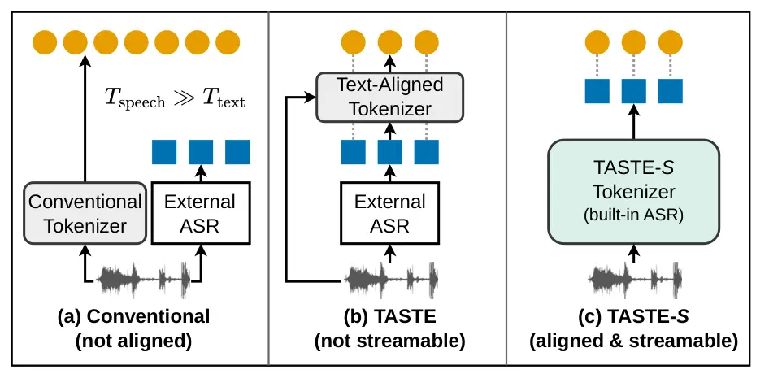
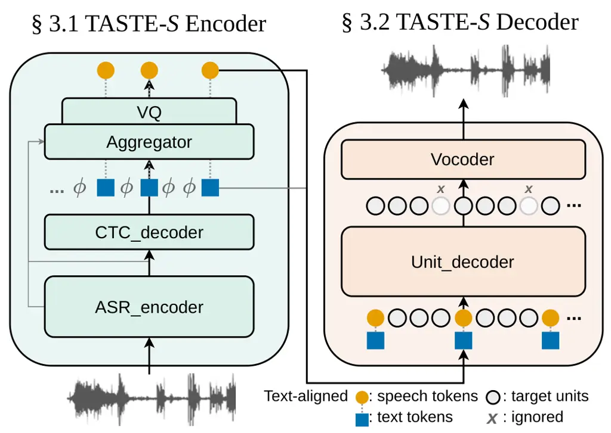
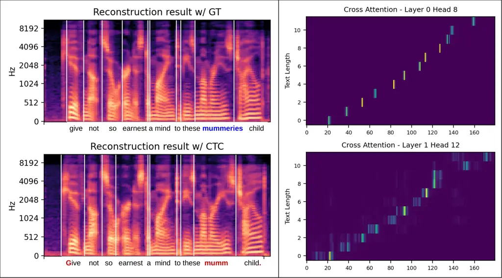

Tseng Lee

# TASTE-Streaming: Towards Streamable Text-Aligned Speech Tokenization and Embedding for Spoken Language Modeling

Liang-Hsuan    Hung-yi

###### Abstract

Text-speech joint spoken language modeling (SLM) aims at natural and
intelligent speech-based interactions, but developing such a system may
suffer from modality mismatch: speech unit sequences are much longer
than text tokens. Prior work reduces this gap with text-aligned
tokenization and embedding (TASTE), producing speech tokens that align
in lengths with their textual counterparts. However, the dependence on
an external ASR system and the use of a non-causal decoder limits
streaming use. To address this limitation, we propose TASTE-S, a
streamable extension of TASTE suitable for real-time usage. TASTE-S
integrates a CTC-based ASR module into the encoder for instant
dual-modality encoding. We also redesign the unit decoder to enable
on-the-fly decoding. With joint training, we show that TASTE-S matches
TASTE’s performance while significantly reducing latency. Further
investigations reveal that TASTE-S remains robust to transcriptions and
enables long-form encoding and decoding.

###### keywords

speech tokenization, spoken language modeling

^(†)^(†)address: ¹ Graduate Institute of Communication Engineering,
National Taiwan University ^(†)^(†)email: andybi7676@gmail.com,
hungyilee@ntu.edu.tw

## 1 Introduction

Spoken Language Modeling (SLM) has been a promising direction of
creating intelligent and natural human-machine interfaces. Conventional
methods may develop such system by modeling speech tokens derived from
self-supervised models \[1, 2, 3\] or audio codec \[4, 5\]. However,
modeling only speech tokens suffers from poor semantic grounding \[6, 7,
8\]. To address this, recent research has pivoted toward _joint
text-speech modeling_, taking advantages of the understanding and
reasoning capabilities from text Large Language Models (LLMs) \[9, 10,
11\].

In joint text-speech modeling, a primary obstacle is the mismatch
between speech and text. Conventional speech units are typically much
finer-grained and longer than text tokens, leading to a significant
length discrepancy (Figure 1-(a)). While prior work has attempted to
resolve this through padding \[12\], interleaving \[8\], or
multi-channel modeling \[9\], these solutions often introduce additional
complexity and efforts during joint modeling. The TASTE (Text-Aligned
Tokenization and Embedding; \[13\]) framework addressed this by
mitigating the length mismatch issue at the tokenization stage
(Figure 1-(b)), enabling simple and effective joint modeling \[14, 15\].

Despite the success of text-aligned representations in boosting semantic
performance, the original TASTE framework suffers from a critical
drawback: latency. Because the alignment process was primarily designed
for offline processing, it remains unsuitable for the ”always-on,”
instant-response requirements of real-world conversational AI.

In this work, we present TASTE-S, a streamable extension of the TASTE
framework that provides text-aligned speech tokenization and embedding
with low latency. It retains the semantic benefits of aligned
tokenization while making on-the-fly encoding and reconstruction
practical (Figure 1-(c)). Our modifications are three-fold:

- •
  Integrated ASR Module: We seamlessly integrate an Automatic Speech
  Recognition (ASR) module into the tokenization system by attaching a
  lightweight Connectionist Temporal Classification (CTC) decoder to the
  speech encoder, facilitating immediate text token extraction.
- •
  Causal and Streamable Architecture: We redesign the unit decoder to be
  fully causal, allowing for low-latency, chunk-by-chunk processing
  without sacrificing the quality of the learned representations.
- •
  Bi-Stage and Joint Training: We show that with simple bi-stage
  training and the joint training between the Encoder and the Decoder,
  TASTE-S Tokenizer can achieve higher and more stable performance
  across different textual transcripts.

Our experiments demonstrate that TASTE-S achieves performance parity
with the original framework while being significantly more efficient.
Furthermore, we show that our tokenization is robust to varied textual
transcriptions and capable of accurate long-form encoding and decoding.
By visualizing the cross-attention maps, we confirm that the desired
text-speech alignment is maintained. Ultimately, TASTE-S provides a
practical path toward responsive, semantically-aware Spoken Language
Models. The demo is available at
[https://andybi7676.github.io/taste_s_demo](https://andybi7676.github.io/taste_s_demo)



Figure 1: Comparison between conventional, TASTE and TASTE-S speech
tokenizer. (a) conventional pipelines suffer from modality mismatch. (b)
TASTE aligns speech tokens to text tokens but is non-streamable since an
external offline ASR is required. (c) Our TASTE-S achieves aligned _and_
streamable tokenization via a built-in ASR and other designs for
streaming.

## 2 Method

TASTE-S Tokenizer is composed of the two major components: The TASTE-S
Encoder that turns speech signal into text and text-aligned speech
tokens and the TASTE-S Decoder which takes them as the condition for
speech reconstruction.¹¹ 1 For clarity, Encoder/Decoder (capitalized)
refer exclusively to the TASTE-S Encoder/Decoder; whereas the lowercase
suffixes ($`\mathrm{\_encoder}`$, $`\mathrm{\_decoder}`$) denote the
submodules, identifying their functionalities. We first introduce the
TASTE-S Encoder and Decoder in Section 2.1 and Section 2.2, focusing on
how to make the modules streamable. Then, we elaborate the objectives
and our training procedure of the whole framework in Section 2.3.



Figure 2: The framework overivew of our TASTE-S Tokenizer. On the left
shows the Encoder with CTC integrated; on the right illustrates the
streaming pattern for a streamable Decoder.

### 2.1 TASTE-S Encoder

The goal of our TASTE-S Encoder is to encode raw speech into
text-aligned speech tokens without introducing additional latency.
Unlike TASTE \[13\] that relies on an external offline ASR system, we
internalize an ASR system into TASTE-S Encoder. As depicted in Figure 2,
we adopt Connectionist Temporal Classification (CTC; \[16\]) to train
our internalized ASR. This allows us to extract textual transcriptions
as text tokens in an efficient and streamable manner. The TASTE-S
Encoding procedure is as follows: Given a speech signal $`X`$, we
extract the hidden representations from the $`\mathrm{ASR\_encoder}`$
with $`L`$ layers, where

```math
\displaystyle[\mat{H}^{(1)},\mat{H}^{(2)},\ldots,\mat{H}^{(L)}]=\mathrm{ASR\_encoder}(X). \tag{1}
```

Then, the $`\mathrm{CTC\_decoder}`$ takes the last hidden representation
$`\mat{H}^{(L)}`$ as input and generates the ASR prediction logits
$`\mat{O}`$, which are then decoded into $`\bm{\hat{s}}`$, denoted as:

```math
\displaystyle\mat{O} \displaystyle=\mathrm{CTC\_decoder}(\mat{H}^{(L)}),\quad\bm{\hat{s}}=\mathrm{Decode_{CTC}}(\mat{O}) \tag{2}
```

Next, following the original TASTE, we extract the text-aligned speech
tokens through an $`\mathrm{Aggregator}`$ followed by a vector quantizer
$`\mathrm{VQ}`$, with the predicted text tokens $`\bm{\hat{s}}`$,
shallow and last hiddens $`\mat{H}^{(l)},\mat{H}^{(L)}`$ from the
encoder taken as input:

```math
\displaystyle\mat{Z}=\mathrm{Aggregator}(\bm{\hat{s}},\mat{H}^{(L)},\mat{H}^{(l)}),\hskip 5.0pt\mat{\hat{Z}}=\mathrm{VQ}(\mat{Z}). \tag{3}
```

Note that $`\mat{\hat{Z}}`$ is the quantized version of the text-aligned
speech latent $`\mat{Z}`$ from the $`\mathrm{Aggregator}`$. The
quantized indices (tokens) $`\bm{q}`$ can be easily obtained with the
$`\mathrm{VQ}`$ module.

### 2.2 TASTE-S Decoder

Given the aligned speech embedding $`\mat{\hat{Z}}`$ and the text tokens
$`\bm{\hat{s}}`$ extracted from the TASTE-S Encoder, we use the TASTE-S
Decoder to decode the text-speech aligned tokens back to the waveform.
The Decoder is consisted by the two components: the auto-regressive (AR)
$`\mathrm{Unit\_decoder}`$ and the flow-matching \[17, 18\]
$`\mathrm{Vocoder}`$. Their inputs/outputs are:

```math
\displaystyle\bm{\hat{y}}=\mathrm{Unit\_decoder}(\bm{\hat{s}},\mat{\hat{Z}}),\quad X^{\prime}=\mathrm{Vocoder}(\bm{\hat{y}}), \tag{4}
```

where $`\bm{\hat{y}}`$ are the predicted target units introduced as an
intermediate for fine-grained speech reconstruction, following TASTE. We
make several modifications to allow the modules in our Decoder
streamable, which are primary based on CosyVoice 2 \[19\]. For the
$`\mathrm{Vocoder}`$, we simply replace the non-causal vocoder with the
causal version. As for the $`\mathrm{Unit\_decoder}`$, we adopt a
streamable pattern during training by interleaving the text-algined
tokens with the target units by a predefined $`N:M`$ ratio. Figure 2
illustrates the interleaving pattern when the ratio $`N:M`$ is set to
$`1:3`$. These modifications allow us to generate the speech
chunk-by-chunk, which significantly reduces the latency and enables
streaming decoding.

### 2.3 Objectives and Training Procedure

We optimize TASTE-S with two objectives: (1) training the built-in ASR
module and (2) learning reconstruction conditioned on text and
text-aligned tokens. Given an oracle transcription $`\bm{s}`$, we train
the $`\mathrm{CTC\_decoder}`$ with the CTC loss

```math
\displaystyle\mathcal{L}_{\text{CTC}} \displaystyle=-\log p_{\text{CTC}}(\bm{s}\mid\mat{O}), \tag{5}
```

where $`p_{\text{CTC}}(\bm{s}\mid\mat{O})`$ marginalizes over all valid
alignments that correspond to $`\bm{s}`$. For reconstruction, given the
target unit sequence $`\bm{y}`$, we train the auto-regressive
$`\mathrm{Unit\_decoder}`$ using the cross-entropy loss

```math
\displaystyle\mathcal{L}_{\text{CE}} \displaystyle=-\sum^{T}_{t=1}\log p(\bm{y}_{t}\mid\bm{s},\mat{Z},\bm{y}_{<t}), \tag{6}
```

where $`p(\cdot)`$ is parameterized by the $`\mathrm{Unit\_decoder}`$.

Since the ASR predictions are unreliable at the beginning of training,
we adopt a two-stage training procedure. In Stage I, we train the
$`\mathrm{CTC\_decoder}`$ independently (without using its output to the
other modules). Meanwhile, the $`\mathrm{Aggregator}`$ and
$`\mathrm{Unit\_decoder}`$ are trained using the oracle transcription
$`\bm{s}`$, and we bypass the $`\mathrm{VQ}`$ module. This stage
provides an upper-bound performance reference by removing the effects of
ASR errors and quantization bottleneck. In Stage II, we enable the full
tokenizer and optimize the reconstruction objective
$`\mathcal{L}_{\text{joint}}=-\sum^{T}_{t=1}\log p(\bm{y}_{t}\mid\bm{\hat{s}},\mat{\hat{Z}},\bm{y}_{<t}),`$
where $`\bm{\hat{s}}`$ is the CTC prediction and $`\mat{\hat{Z}}`$ is
the quantized text-aligned speech embedding. These design choices are
verified in our main results.

## 3 Experiments

Method Freq. Bitrate ASR WER UTMOS$`\uparrow`$ Spkr. Sim.$`\uparrow`$
Drtn. Con.$`\uparrow`$ Enc. RTF Dec. RTF SLM RTF\* Original Waveform 16k
256k N/A 2.1% 4.09 - - - - - Encodec \[4\] 75 1500 N/A 5.1% 1.58 0.63
0.905 0.004 0.002 1.524 75 3000 N/A 2.6% 2.35 0.78 0.928 0.004 0.002
1.524 SpeechTokenizer \[21\] 50 500 N/A 5.2% 1.27 0.35 0.916 0.004 0.003
1.016 50 2000 N/A 3.0% 3.56 0.80 0.935 0.004 0.003 1.016 DM-Codec \[22\]
50 1000 N/A 10.3% 2.42 0.49 0.896 0.008 0.006 1.016 50 4000 N/A 2.5%
3.46 0.73 0.963 0.008 0.006 1.016 BigCodec \[23\] 80 1040 N/A 3.0% 4.11
0.91 0.962 0.008 0.012 1.626 WavTokenizer \[24\] 40 480 N/A 11.3% 3.57
0.71 0.925 0.003 0.001 0.813 Mimi \[9\] 12.5 1000 N/A 3.1% 3.60 0.83
0.928 0.002 0.001 0.254 TaDiCodec \[25\] 6.25 87.5 EXT 5.1% 3.96 0.81
0.843 0.117 0.315 0.127 TaDiCodec (no VQ) 6.25 $`>`$1000 EXT 4.9% 3.99
0.82 0.869 0.117 0.315 0.127 Text-only $`\sim`$3 $`\sim`$50 EXT 5.7%
4.28 0.78 0.476 0.116 0.414 0.061 TASTE \[13\] $`\sim`$3 $`\sim`$150 EXT
4.5% 4.24 0.80 0.844 0.117 0.414 0.061 TASTE-S (no bi-stage) $`\sim`$3
$`\sim`$600 EXT 10.8% 4.01 0.72 0.798 0.117 0.076 0.061 TASTE-S (no
joint) $`\sim`$3 $`\sim`$600 EXT 4.1% 4.11 0.88 0.900 0.117 0.076 0.061
$`\sim`$3 $`\sim`$600 CTC 4.5% 4.11 0.88 0.901 0.002 0.076 0.061 TASTE-S
$`\sim`$3 $`\sim`$600 EXT 3.9% 4.12 0.88 0.900 0.117 0.076 0.061
$`\sim`$3 $`\sim`$600 CTC 4.1% 4.11 0.88 0.901 0.002 0.076 0.061

Table 1: The main results of our TASTE-S Tokenizer. The first section
shows the results of the conventional tokenizers; while the second
section presents the text-aligned or text-awared methods. We use EXT to
denote the reliance on an external ASR; and CTC for using the built-in
CTC ASR for TASTES. We use gray row color to indicate the conventional
tokenizers with matched bitrates; while the dark-red text indicates that
streaming is not feasible. \*: Estimated from the throughput of a 13B
LLM measured using the vLLM engine \[20\].

### 3.1 Setup

Dataset  We use a random English subset of Emilia \[26\] ($`\sim`$400
hours) and the full training set from LibriTTS \[27\] ($`\sim`$600
hours) as our training data. Following TASTE, the test-clean split from
LibriSpeech \[28\] is preserved for evaluation.

Models and Training Configurations  The $`\mathrm{ASR\_encoder}`$,
$`\mathrm{CTC\_decoder}`$, and $`\mathrm{Aggregator}`$ are initialized
from Whisper \[29\]. The $`\mathrm{Unit\_decoder}`$ and the
$`\mathrm{Vocoder}`$ are initialized from CosyVoice 2 \[19\]. During
training, the $`\mathrm{ASR\_encoder}`$ and the $`\mathrm{Vocoder}`$ are
frozen. In each training stage, the learning rate is set to 1e-3 for
$`\mathrm{CTC\_decoder}`$ and 2e-4 for the other submodules. We use
$`\mathrm{AdamW}`$ \[30\] optimizer, and a cosine-decay scheduler is
used, with linear warmup steps set to $`2000`$. We use batch size
$`128`$ and train each stage over $`5`$ epochs. We set the interleaving
ratio $`N:M=2:5`$ for the streaming decoding. The whole bi-stage
training takes around one day to finish on 2 NVIDIA H100 GPUs.

#### 3.1.1 Metrics

We evaluate our tokenizer from two perspectives: (1) reconstruction and
(2) streaming efficiency.

Reconstruction.  We measure quality with WER and UTMOS. WER is computed
between the original and reconstructed speech using transcriptions from
a HuBERT-based ASR system.²² 2
https://huggingface.co/facebook/hubert-large-ls960-ft UTMOS \[31\] is a
non-intrusive objective metric that predicts MOS from waveform, reported
as the average over all reconstructions. We measure similarity with
Speaker Similarity and Duration Consistency. Speaker Similarity is the
cosine similarity between speaker embeddings (TDNN \[32\] based \[33\])
extracted from original vs. reconstructed speech. Duration Consistency
is computed from word-level alignments obtained by Montreal Forced
Aligner (MFA), and we count a word as matched if its duration differs by
at most $`40`$ms.

Streaming.  We report Real-Time Factor (RTF) and First Chunk Latency
(FCL). RTF is defined as
$`\mathrm{RTF}=\frac{t_{\text{proc}}}{t_{\text{audio}}}`$, where
$`\mathrm{RTF}>1`$ indicates slower-than-real-time processing under the
measured setup. FCL is the wall-clock time from when the first audio
chunk is available to when the first output chunk (reconstructed speech
or text-aligned tokens, depending on the interface) is produced. All
streaming-related metrics are measured on a single NVIDIA A100 GPU.

### 3.2 Main Results

We present the main reconstruction results on LibriSpeech test-clean in
Table 1. The table is divided into two parts. The upper part reports
recent conventional speech tokenizers. Since these tokenizers take only
speech as input, the ASR column is not applicable. Under matched
bitrates (highlighted in gray), TASTE-S achieves reconstruction
performance comparable to conventional tokenizers. BigCodec is the only
conventional tokenizer that consistently attains better reconstruction
quality across most metrics. However, its tokens are emitted at a very
high frequency. Modeling it may lead to high latency, making it
unsuitable for streaming use cases. Many conventional tokenizers also
share this high-frequency bottleneck.

Next, we turn to the lower part of Table 1, which reports text-aligned
(or text-aware) methods. A key practical difference is that all
baselines except TASTE-S require an external ASR system to obtain text
tokens. Despite relying only on its built-in ASR, TASTE-S achieves
competitive or stronger reconstruction quality overall. Notably, TASTE
attains the highest UTMOS; however, as discussed in the original paper,
this result is largely driven by background denoising, which can make
the output perceptually cleaner than the source rather than more
faithful. In TASTE-S, reconstruction could better preserve the original
perceptual characteristics, yielding a MOS close to that of the input
speech. In general, TASTE-S substantially reduces both encoding and
decoding RTF, enabling low-latency, streamable tokenization and
reconstruction.

Lastly, we examine the effect of using different ASR systems. We observe
that TASTE-S still delivers strong reconstruction performance when
paired with an external ASR system. We attribute this stability to the
two-stage training in Section 2.3: in the first stage, the decoder is
trained with oracle or high-quality pseudo transcriptions, which
provides a reliable supervision signal for reconstruction. Moreover,
joint training brings clear benefits. In particular, it reduces WER,
indicating that adapting the decoder to the CTC outputs is important.
Interestingly, the gain also carries over when using an external ASR
system, suggesting improved robustness beyond the specific ASR outputs
seen during training.

### 3.3 Additional Results and Ablations

#### 3.3.1 Longform Speech Reconstruction

To evaluate the effectiveness of our streamable text-aligned tokenizer,
we conduct experiments focusing on longform on-the-fly tokenization and
reconstruction. The longform speech data is synthesized by concatenating
segments from the same speaker in the LibriSpeech test-clean set,
resulting in 87 audio samples with an average duration of 223.6 seconds.
We also introduced an additional metric, $`\Delta`$Len, which measures
the average absolute length difference (in %) between the original and
reconstructed audio. This metric quantifies the reconstruction accuracy
when sequence compression is dynamic.

The results, presented in Table 2, demonstrate that the WER remains
within a reasonable range. While TASTE-S’s WER is slightly higher than
that of the original TASTE, it outperforms the latter in all other
metrics, particularly in streaming performance. Notably, since the
original TASTE decoder is non-causal, its high first-chunk latency makes
it unsuitable for real-time applications. In contrast, TASTE-S employs a
causal and streamable decoder, making it highly compatible with
streaming scenarios.Interestingly, using the built-in ASR yields the
most temporally aligned reconstruction in terms of length difference.
While employing an external ASR further reduces the WER, it leads to a
slight increase in the length difference.

Method ASR (W.S.) WER $`\Delta`$Len (%) Spkr. Sim.$`\uparrow`$ RTF FCL
TASTE EXT (30s) 4.2% 1.2 $`\pm`$ 1.4 0.78 0.439 12.29 TASTE-S CTC (10s)
5.1% 1.0 $`\pm`$ 0.8 0.85 0.103 0.312 TASTE-S CTC (15s) 4.6% 0.9 $`\pm`$
0.7 0.86 0.088 0.312 TASTE-S CTC (20s) 4.7% 0.9 $`\pm`$ 0.9 0.87 0.081
0.311 TASTE-S CTC (30s) 4.5% 0.7 $`\pm`$ 0.6 0.87 0.081 0.311 TASTE-S
EXT (30s) 3.7% 1.1 $`\pm`$ 1.1 0.86 0.199 0.428

Table 2: The longform speech reconstruction results. W.S indicates the
window size of each on-the-fly Encoding/Decoding process. FCL is first
chunk latency, as introduced in Section 3.1.1. $`\Delta`$Len is the
absolute length difference (in %).

Method bitrate emb. WER$`\downarrow`$ UTMOS Spkr. Sim. Drtn. Con. TASTE
$`\sim`$150 256 4.5% 4.24 0.80 0.844 TASTE-S $`\sim`$150 32 4.2% 4.13
0.86 0.857 TASTE-S $`\sim`$300 64 4.1% 4.12 0.88 0.887 TASTE-S
$`\sim`$600 128 3.9% 4.12 0.88 0.900

Table 3: Comparison of TASTE and TASTE-$`S`$ across various bitrates and
embedding dimensions.

#### 3.3.2 Ablation Study

Ablation Study on Bitrate and Quantization. To further investigate the
efficiency of TASTE-S, we conducted an ablation study across different
bitrates, as shown in Table 3. It is worth noting that our objective in
increasing the bitrate is not merely to boost raw performance. Even when
configured with a similar bitrate ($`\sim`$150 bps) as the original
TASTE, TASTE-S achieves superior WER ($`4.2\%`$ vs. $`4.5\%`$) and
speaker similarity ($`0.86`$ vs. $`0.80`$).

Furthermore, while the bitrate scales up, the embedding dimension in
TASTE-S remains much lower than that of TASTE (e.g., 32 or 64 vs. 256).
This efficiency stems from our adoption of Finite Scalar Quantization
(FSQ \[34\]) as the quantization mechanism. Unlike traditional Vector
Quantization (VQ) which suffers from codebook utilization issues, FSQ
enables high utilization without the need for an explicit codebook,
allowing TASTE-$`S`$ to maintain high reconstruction fidelity with more
compact latent.



Figure 3: Visualization results. Left: reconstruction remains nearly
unchanged when using the ground-truth transcript versus the CTC
transcript (blue/red mark their mismatched parts). Right: the aggregator
shows clear text–speech aligned cross-attention, consistent with TASTE.

#### 3.3.3 Visualization

Figure 3 provides qualitative evidence for two key behaviors of TASTE-S.
On the left, we compare reconstructions produced by conditioning on the
ground-truth transcript and on a CTC transcript. The blue and red tokens
highlight where the two transcripts disagree. Despite these mismatches,
the reconstructed spectrograms are almost identical, indicating that the
tokenization and reconstruction are robust to imperfect or different
transcripts. On the right, we visualize the cross-attention maps inside
the aggregator. The attention concentrates along a clear diagonal
pattern, showing a consistent alignment between text positions and
speech frames. This text–speech aligned behavior matches what is observe
in the original TASTE, suggesting that our streamable design preserves
the same alignment property.

## 4 Conclusion

We presented TASTE-S, a streamable extension of the TASTE framework for
text-aligned speech tokenization and embedding in joint spoken language
modeling. By integrating a lightweight CTC-based ASR module into the
encoder and redesigning the decoder to be fully causal with chunk-wise
generation, TASTE-S removes the reliance on external offline ASR and
enables low-latency, on-the-fly reconstruction. Experiments show that
TASTE-S matches or improves upon TASTE in reconstruction fidelity while
substantially reducing both encoding and decoding RTFs, making streaming
deployment practical. Further analyses demonstrate effective long-form
reconstruction with accurate temporal consistency. The visualizations
further confirm robust reconstruction under imperfect transcripts and
clear text–speech aligned cross-attention in the aggregator. Overall,
TASTE-S enables low-latency, text-aligned speech tokenization and
reconstruction, making it a practical component for building responsive
and semantically grounded joint SLMs.

## 5 Generative AI Use Disclosure

We use generative AI tools to assist with language editing (e.g.,
polishing phrasing, improving clarity, and correcting grammar) during
manuscript preparation. All technical content, experimental design,
results, and conclusions are produced by the authors, who take full
responsibility for the paper. No generative AI tool is listed as an
author, and the tool is not used to generate a significant portion of
the manuscript.

## References

- \[1\] W. Hsu, B. Bolte, Y. H. Tsai, K. Lakhotia, R. Salakhutdinov,
  and A. Mohamed (2021) Hubert: self-supervised speech representation
  learning by masked prediction of hidden units. Transactions on Audio,
  Speech, and Language Processing. Cited by: §1.
- \[2\] A. Baevski, Y. Zhou, A. Mohamed, and M. Auli (2020) Wav2vec 2.0:
  a framework for self-supervised learning of speech representations. In
  Advances in Neural Information Processing Systems, Cited by: §1.
- \[3\] K. Lakhotia, E. Kharitonov, W. Hsu, Y. Adi, A. Polyak, B.
  Bolte, T. Nguyen, J. Copet, A. Baevski, A. Mohamed, et al. (2021) On
  generative spoken language modeling from raw audio. Transactions of
  the Association for Computational Linguistics. Cited by: §1.
- \[4\] A. Défossez, J. Copet, G. Synnaeve, and Y. Adi (2023) High
  fidelity neural audio compression. Transactions on Machine Learning
  Research. Cited by: §1, Table 1.
- \[5\] N. Zeghidour, A. Luebs, A. Omran, J. Skoglund, and M.
  Tagliasacchi (2021) Soundstream: an end-to-end neural audio codec.
  Transactions on Audio, Speech, and Language Processing. Cited by: §1.
- \[6\] T. A. Nguyen, E. Kharitonov, J. Copet, Y. Adi, W. Hsu, A.
  Elkahky, P. Tomasello, R. Algayres, B. Sagot, A. Mohamed, et
  al. (2023) Generative spoken dialogue language modeling. Transactions
  of the Association for Computational Linguistics. Cited by: §1.
- \[7\] M. Hassid, T. Remez, T. A. Nguyen, I. Gat, A. Conneau, F.
  Kreuk, J. Copet, A. Defossez, G. Synnaeve, E. Dupoux, et al. (2023)
  Textually pretrained speech language models. Advances in Neural
  Information Processing Systems. Cited by: §1.
- \[8\] T. A. Nguyen, B. Muller, B. Yu, M. R. Costa-Jussa, M.
  Elbayad, S. Popuri, C. Ropers, P. Duquenne, R. Algayres, R. Mavlyutov,
  et al. (2025) Spirit-lm: interleaved spoken and written language
  model. Transactions of the Association for Computational Linguistics.
  Cited by: §1, §1.
- \[9\] A. Défossez, L. Mazaré, M. Orsini, A. Royer, P. Pérez, H.
  Jégou, E. Grave, and N. Zeghidour (2024) Moshi: a speech-text
  foundation model for real-time dialogue. arXiv preprint
  arXiv:2410.00037. Cited by: §1, §1, Table 1.
- \[10\] Z. Xie and C. Wu (2024) Mini-omni: language models can hear,
  talk while thinking in streaming. arXiv preprint arXiv:2408.16725.
  Cited by: §1.
- \[11\] A. Zeng, Z. Du, M. Liu, K. Wang, S. Jiang, L. Zhao, Y. Dong,
  and J. Tang (2024) Glm-4-voice: towards intelligent and human-like
  end-to-end spoken chatbot. arXiv preprint arXiv:2412.02612. Cited by:
  §1.
- \[12\] Q. Fang, S. Guo, Y. Zhou, Z. Ma, S. Zhang, and Y. Feng (2024)
  Llama-omni: seamless speech interaction with large language models.
  CoRR. Cited by: §1.
- \[13\] L. Tseng, Y. Chen, K. Lee, D. Shiu, and H. Lee (2026) Taste:
  text-aligned speech tokenization and embedding for spoken language
  modeling. The Fourteenth International Conference on Learning
  Representations. Cited by: §1, §2.1, Table 1.
- \[14\] M. Hsu, L. Tseng, H. Lee, and Z. Wu (2025) TASLA: text-aligned
  speech tokens with multiple layer-aggregation. arXiv preprint
  arXiv:2510.14934. Cited by: §1.
- \[15\] P. Ku, H. Huang, J. Lemercier, S. S. Sahoo, Z. Chen, and A.
  Jukić (2026) Discrete diffusion for generative modeling of
  text-aligned speech tokens. IEEE International Conference on
  Acoustics, Speech and Signal Processing. Cited by: §1.
- \[16\] A. Graves, S. Fernández, F. Gomez, and J. Schmidhuber (2006)
  Connectionist temporal classification: labelling unsegmented sequence
  data with recurrent neural networks. In Proceedings of the 23rd
  International Conference on Machine Learning, External Links: ISBN
  1595933832 Cited by: §2.1.
- \[17\] Y. Lipman, R. T. Chen, H. Ben-Hamu, M. Nickel, and M. Le (2022)
  Flow matching for generative modeling. International Conference on
  Learning Representations. Cited by: §2.2.
- \[18\] S. Mehta, R. Tu, J. Beskow, É. Székely, and G. E. Henter (2024)
  Matcha-tts: a fast tts architecture with conditional flow matching. In
  ICASSP 2024-2024 IEEE International Conference on Acoustics, Speech
  and Signal Processing (ICASSP), Cited by: §2.2.
- \[19\] Z. Du, Y. Wang, Q. Chen, X. Shi, X. Lv, T. Zhao, Z. Gao, Y.
  Yang, C. Gao, H. Wang, et al. (2024) Cosyvoice 2: scalable streaming
  speech synthesis with large language models. CoRR. Cited by: §2.2,
  §3.1.
- \[20\] W. Kwon, Z. Li, S. Zhuang, Y. Sheng, L. Zheng, C. H. Yu, J.
  Gonzalez, H. Zhang, and I. Stoica (2023) Efficient memory management
  for large language model serving with pagedattention. In Proceedings
  of the 29th symposium on operating systems principles, Cited by: Table
  1.
- \[21\] X. Zhang, D. Zhang, S. Li, Y. Zhou, and X. Qiu (2024)
  Speechtokenizer: unified speech tokenizer for speech large language
  models. International Conference on Learning Representations. Cited
  by: Table 1.
- \[22\] M. M. Ahasan, M. Fahim, T. Mohiuddin, A. Rahman, A. Chadha, T.
  Iqbal, M. A. Amin, M. M. Islam, and A. A. Ali (2025) DM-codec:
  distilling multimodal representations for speech tokenization. In
  Findings of the Association for Computational Linguistics: EMNLP 2025,
  Cited by: Table 1.
- \[23\] D. Xin, X. Tan, S. Takamichi, and H. Saruwatari (2024)
  Bigcodec: pushing the limits of low-bitrate neural speech codec. arXiv
  preprint arXiv:2409.05377. Cited by: Table 1.
- \[24\] S. Ji, Z. Jiang, W. Wang, Y. Chen, M. Fang, J. Zuo, Q. Yang, X.
  Cheng, Z. Wang, R. Li, et al. (2025) Wavtokenizer: an efficient
  acoustic discrete codec tokenizer for audio language modeling.
  International Conference on Learning Representations. Cited by: Table
  1.
- \[25\] Y. Wang, D. Chen, X. Zhang, J. Zhang, J. Li, and Z. Wu (2025)
  Tadicodec: text-aware diffusion speech tokenizer for speech language
  modeling. Advances in Neural Information Processing Systems. Cited by:
  Table 1.
- \[26\] H. He, Z. Shang, C. Wang, X. Li, Y. Gu, H. Hua, L. Liu, C.
  Yang, J. Li, P. Shi, et al. (2024) Emilia: an extensive, multilingual,
  and diverse speech dataset for large-scale speech generation. In 2024
  IEEE Spoken Language Technology Workshop (SLT), Cited by: §3.1.
- \[27\] H. Zen, V. Dang, R. Clark, Y. Zhang, R. J. Weiss, Y. Jia, Z.
  Chen, and Y. Wu (2019) Libritts: a corpus derived from librispeech for
  text-to-speech. Interspeech 2019. Cited by: §3.1.
- \[28\] V. Panayotov, G. Chen, D. Povey, and S. Khudanpur (2015)
  Librispeech: an asr corpus based on public domain audio books. In 2015
  IEEE International Conference on Acoustics, Speech and Signal
  Processing (ICASSP), Cited by: §3.1.
- \[29\] A. Radford, J. W. Kim, T. Xu, G. Brockman, C. McLeavey, and I.
  Sutskever (2023) Robust speech recognition via large-scale weak
  supervision. In International conference on machine learning, Cited
  by: §3.1.
- \[30\] I. Loshchilov and F. Hutter (2019) Decoupled weight decay
  regularization. In International Conference on Learning
  Representations, Cited by: §3.1.
- \[31\] T. Saeki, D. Xin, W. Nakata, T. Koriyama, S. Takamichi, and H.
  Saruwatari (2022) Utmos: utokyo-sarulab system for voicemos challenge 2022. Interspeech 2022. Cited by: §3.1.1.
- \[32\] B. Desplanques, J. Thienpondt, and K. Demuynck (2020)
  Ecapa-tdnn: emphasized channel attention, propagation and aggregation
  in tdnn based speaker verification. In Interspeech, Cited by: §3.1.1.
- \[33\] H. Wang, S. Zheng, Y. Chen, L. Cheng, and Q. Chen (2023) Cam++:
  a fast and efficient network for speaker verification using
  context-aware masking. In Interspeech, Cited by: §3.1.1.
- \[34\] F. Mentzer, D. Minnen, E. Agustsson, and M. Tschannen (2024)
  Finite scalar quantization: vq-vae made simple. In International
  Conference on Learning Representations, Cited by: §3.3.2.
