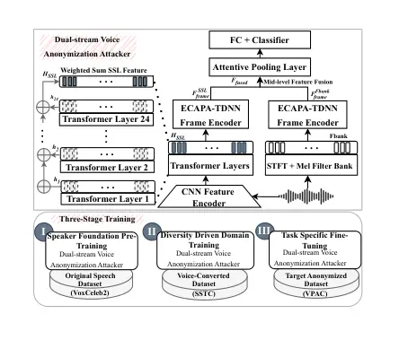

Arefeen Miao Tong Ng See Liu

# DAST: A Dual-Stream Voice Anonymization Attacker with Staged Training

Ridwan    Xiaoxiao    Rong    Aik Beng    Simon    Timothy

###### Abstract

Voice anonymization masks vocal traits while preserving linguistic
content, which may still leak speaker-specific patterns. To assess and
strengthen privacy evaluation, we propose a dual-stream attacker that
fuses spectral and self-supervised learning features via parallel
encoders with a three-stage training strategy. Stage I establishes
foundational speaker-discriminative representations. Stage II leverages
the shared identity-transformation characteristics of voice conversion
and anonymization, exposing the model to diverse converted speech to
build cross-system robustness. Stage III provides lightweight adaptation
to target anonymized data. Results on the VoicePrivacy Attacker
Challenge (VPAC) dataset demonstrate that Stage II is the primary driver
of generalization, enabling strong attacking performance on unseen
anonymization datasets. With Stage III, fine-tuning on only 10% of the
target anonymization dataset surpasses current state-of-the-art
attackers in terms of EER.¹¹ 1 Full code and pretrained models can be
found at https://github.com/monkeyDarefeen/DAST .

###### keywords

voice anonymization attacker, automatic speaker verification,
dual-stream architecture, staged-training strategy.

^(†)^(†)address: ¹ Singapore Institute of Technology, Singapore  
² Duke Kunshan University, China  
³ NVIDIA AI Technology Centre, Singapore ^(†)^(†)email:
2403754@sit.singaporetech.edu.sg, xiaoxiao.miao@dukekunshan.edu.cn,
tong.rong@singaporetech.edu.sg

## 1 Introduction

Speech data inherently encodes a wide range of privacy-sensitive
attributes, including speaker identity, age, gender, health condition,
and socio-economic status. Unauthorized disclosure can lead to serious
risks such as identity theft, surveillance misuse, and other privacy
violations \[1\]. Voice privacy \[2\] has therefore emerged as a
critical research objective, commonly framed as a game between defenders
and attackers.

The VoicePrivacy Challenge (VPC) series \[2, 3, 4, 5, 6\] has provided
standardized benchmarks and significantly advanced voice anonymization
research. However, privacy protection reported under fixed attacker
models may be overestimated, as such results can reflect limited
attacker generalization rather than truly robust anonymization \[7\].
The VoicePrivacy Attacker Challenge (VPAC) \[8, 9\] addresses this gap
by tasking participants with developing stronger attacker systems,
specifically, automatic speaker verification (ASV) systems that
determine whether an anonymized enrollment--trial pair originates from
the same speaker²² 2 VPAC adopts a semi-informed attacker model in which
users anonymize enrollment utterances, while attackers have access to
the anonymization system and attempt to re-identify the original speaker
behind each anonymized trial utterance. against seven anonymization
systems.

From an _architectural_ perspective, existing approaches span: (i) *data
augmentation* via spectrogram resizing \[10\] and segment
rearrangement \[11\]; (ii) *feature representations* using
self-supervised learning (SSL) features \[10, 12\] or multimodal
inputs \[13\]; (iii) *architecture adaptation* through LoRA-adapted
ResNet34 \[12\] and fine-tuned TitaNet-Large \[14\]; (iv) *backend
refinement* with PLDA scoring \[15\] and score normalization \[16\].
From a _training strategy_ perspective, most attackers train exclusively
on speech anonymized by the target system, or combine original speech
with the corresponding anonymized data \[15\], or manually select speech
from a subset of systems through trial and error \[14\]. The latest
work \[13\] trains on speech from all seven systems simultaneously,
yielding better results than single-system training for some target
systems but not all, revealing that cross-system generalization remains
challenging.

We argue that architecture and training strategy should be addressed
jointly: a single feature view cannot capture the full range of residual
speaker cues, yet even a multi-view architecture will overfit if trained
on only one target system. To this end, we propose a Dual-stream voice
anonymization Attacker with three-Stage Training (DAST). All three
stages share a dual-stream model that utilizes SSL features and
spectral (Fbank) features, each passed to separate ECAPA-TDNN frame
encoders and fused at the mid-level to capture complementary high-level
and fine-grained speaker characteristics. The three-stage design follows
a deliberate curriculum: in Stage I, the model is trained on original,
unprocessed speech to establish _what_ to look for
(speaker-discriminative cues); in Stage II, since voice anonymization
and voice conversion share the same underlying mechanism, transforming
speaker identity from a common source, the model is trained on
large-scale, diverse voice-converted data to learn _where_ to find them
under distortion (anonymization-invariant representations); and in
Stage III, fine-tuning on target anonymized data sharpens the model for
_how_ a specific system distorts them.

Experiments demonstrate that: (1) Stage II is the primary driver of
generalization: the model achieves strong cross-system performance
without any target-specific adaptation; and (2) ablation studies on
Stage III show that the proposed model adapts rapidly to unseen
anonymization systems: fine-tuning with 10% of target anonymization
dataset already surpasses the current best attacker, with full-dataset
fine-tuning yielding further improvements, and consistently
outperforming existing attackers across all anonymization systems under
the VPAC protocol.

## 2 Proposed Method

Figure 1: Proposed Method: (top) dual-stream architecture with mid-level
feature fusion (bottom) three stage training strategy

Figure 1 illustrates the proposed system: (top) the dual-stream
architecture and (bottom) the three-stage training pipeline. We first
describe the architecture design, then detail the staged training
strategy.

### 2.1 Dual-Stream Architecture

Fusing handcrafted spectral and learned representations has proven
effective in conventional ASV tasks \[17\]. Building on this, we
introduce a dual-stream architecture for the attacker ASV task that
processes two complementary input streams: Mel-filterbank (Fbank)
features and self-supervised learning (SSL) features.

Feature extraction. The spectral stream computes Fbank features via
short-time Fourier transform followed by a Mel filterbank, capturing
fine-grained acoustic information such as formant structure and spectral
envelope. The SSL stream passes raw waveforms through a frozen,
pre-trained WavLM \[18\] model and extracts hidden states from all
transformer layers. To aggregate complementary multi-scale and
multi-level information, we apply a learnable weighted sum,
$`H_{\text{SSL}}=\sum_{l=1}^{L}w_{l}\cdot h_{l}`$, where $`h_{l}`$ is
the hidden state of the $`l`$-th transformer layer and $`w_{l}`$ is a
learnable scalar weight. This mechanism adaptively balances low-level
acoustic cues with higher-level phonetic and contextual representations.

Parallel frame encoding. Unlike early-fusion approaches \[17\] that
merge heterogeneous features before encoding, we process each stream
through a dedicated ECAPA-TDNN frame encoder with independent
parameters, _i.e._,
$`F_{\text{frame}}^{\text{SSL}}=\text{ECAPA}_{\theta_{1}}(H_{\text{SSL}})`$
and
$`F_{\text{frame}}^{\text{Fbank}}=\text{ECAPA}_{\theta_{2}}(X_{\text{Fbank}})`$,
where $`\theta_{1}`$, $`\theta_{2}`$ are separate parameter sets. Each
encoder extracts multi-scale temporal features via stacked convolutional
blocks with squeeze-and-excitation modules. Isolating the two streams
during encoding allows each encoder to specialize in its respective
feature domain.

Mid-level fusion. After frame encoding, the two streams are fused via
element-wise multiplication,
$`F_{\text{fused}}=F_{\text{frame}}^{\text{SSL}}\odot F_{\text{frame}}^{\text{Fbank}}`$,
where $`\odot`$ denotes the Hadamard product. This formulation allows
the SSL stream to dynamically recalibrate the spectral stream to
emphasize speaker-discriminative patterns while suppressing
conversion-induced artifacts. We adopt mid-level fusion, rather than the
early fusion commonly adopted in conventional ASV \[17\], based on the
assumption that in anonymized speech, conversion artifacts are entangled
with speaker characteristics at different feature levels, making it
difficult for a single encoder to disentangle both simultaneously. By
fusing after independent encoding, each stream has already partially
separated speaker-relevant from artifact-related patterns, enabling more
effective calibration.

Pooling and classification. The fused frame-level features are
aggregated into a fixed-dimensional utterance-level embedding via
Attentive Statistics Pooling (ASP), which computes attention-weighted
mean and standard deviation over the temporal dimension. The embedding
is then projected through a fully connected layer and optimized with
AAM-Softmax \[19\]. This dual-stream architecture serves as the shared
backbone across all three training stages described below.

### 2.2 Three-Stage Training Strategy

Stage I: Speaker Foundation Pre-training. Before mitigating the effects
of anonymization, the model must first acquire strong
speaker-discriminative representations under clean acoustic conditions.
To achieve this, we train the dual-stream architecture on unprocessed
speech data. During this stage, the WavLM model is kept frozen to
preserve its pre-trained representations; consequently, optimization is
localized entirely to the downstream components: the learnable layer
weights, the dual ECAPA-TDNN frame encoders, the feature fusion
mechanism, and the classifier. This allows the downstream components to
learn how to extract and combine speaker-discriminative cues from the
two feature streams without corrupting the general-purpose SSL
representations that will be essential for generalization in later
stages.

Stage II: Diversity-Driven Domain Training. With speaker-discriminative
representations established, Stage II aims to make them robust to
anonymization-induced distortions. The key observation is that voice
anonymization and voice conversion share the same underlying mechanism
\[20, 21, 22, 23\]: both transform speaker identity from a common source
speech signal using neural vocoders or voice conversion models. They
differ only in intent (privacy vs. style transfer), not in the types of
distortions: both alter pitch, formant structure, and speaker embedding
characteristics while preserving linguistic content. A model trained to
maintain speaker discrimination across diverse voice conversion systems
should therefore inherently learn to handle anonymization-induced
distortions as well.

Following this reasoning, we train on diverse voice converted data
generated by different voice conversion (VC) approaches. The diversity
of VC data is essential: each introduces distinct artifact patterns
(spectral envelope distortion, prosody alteration, vocoder-specific
noise, etc.), forcing the model to rely on speaker cues that persist
across various transformations rather than overfitting to any single
system’s artifacts. Within the dual-stream architecture, the SSL stream
learns gating masks that are invariant to synthetic artifacts, while the
spectral stream retains sensitivity to residual acoustic speaker cues.
Together, this decouples identity-specific features from
transformation-induced noise.

Stage III: Task-Specific Adaptation. Although Stage II has already
learned anonymization-invariant representations, each unseen
anonymization system has its own characteristic distortion pattern that
the model has never observed. Stage III bridges this gap through
fine-tuning on anonymized speech from the target system in the VPAC
challenge \[8, 9\]. Rather than relying on the full amount of
target-specific anonymized data, we hypothesize that this refinement is
highly sample-efficient: a small fraction of the available data should
suffice to achieve strong attack performance on the target system. This
significantly reduces the computational cost of adaptation and enables
rapid privacy evaluation of newly proposed anonymization systems, an
attacker need only process a small number of utterances through the
target system to mount an effective attack, providing a more realistic
and stringent test of anonymization robustness.

## 3 Experiments

To evaluate the proposed DAST attacker model, we conduct systematic
experiments within the framework of the VPAC \[8, 9\]. We first validate
the dual-stream architecture with mid-level fusion by comparing it
against single-stream baselines using either Fbank or weighted-sum SSL
features alone, as well as alternative fusion strategies (early fusion
vs. mid-level fusion). All models in this phase are trained from scratch
on each specific anonymized dataset from VPAC separately (_i.e._,
Stage III only), isolating the architectural contribution from the
training strategy. With the dual-stream architecture validated, we adopt
it as the backbone and progressively evaluate the three-stage training
strategy.

### 3.1 Datasets and Evaluation Metrics

To support the three-stage training curriculum, we utilize three
distinct corpora, each aligned with a specific training objective as
described in Section 2. The Stage I model is trained on VoxCeleb2 \[24\]
over 1 million utterances, 5,944 speakers, a large-scale in-the-wild
unprocessed speaker dataset. The Stage II model uses the training set of
the Source Speaker Tracing Challenge (SSTC) \[25\], where
LibriSpeech \[26\] (1,172 speakers) serves as source speech and
VoxCeleb \[24\] as target speech, processed by eight different voice
conversion systems (AGAIN-VC \[27\], FreeVC \[28\], MediumVC \[29\],
StyleTTS \[30\], TriAAN-VC \[31\], VQMIVC \[32\], KNN-VC \[33\], and
Sig-VC \[34\]), totaling over 2.6 million utterances (327,600 \* 8,
$`{\sim}`$9k hours).

In Stage III, we strictly follow the VPAC protocol and fine-tune on the
anonymized VPAC data, i.e., LibriSpeech train-clean-360 (921 speakers,
104,014 utterances) \[26\], where the data are anonymized separately by
seven distinct anonymization systems (B3, B4, B5, T8-5, T10-2, T12-5,
and T25-1). Note that the eight voice conversion systems used in SSTC
are entirely disjoint from the seven anonymization systems in the VPAC
evaluation, ensuring that any cross-system performance gain reflects
genuine generalization rather than data leakage.

Beyond full fine-tuning on the anonymized LibriSpeech train-clean-360
set, we further investigate a lightweight Stage III adaptation by
sampling a fixed percentage of utterances per speaker (5%--50%) while
retaining all 921 speakers, thereby preserving speaker diversity and
proportionally reducing the amount of training data per speaker.³³ 3 We
also experimented with random sampling without enforcing speaker
diversity preservation and observed that retaining all speakers yields
better performance. Therefore, we only report the results obtained with
speaker-diversity-preserved sampling in this paper.

Following VPAC evaluation protocol, we report EER, defined as the
average of female and male equal error rates on the VPAC test sets for
each system, to ensure fair comparison with prior work. A lower EER
indicates a stronger attack.

### 3.2 Experimental Setup

Figure 2: Comparison of the DAST and Stage III EER, % on VPAC Benchmark
for low-resource adaptation.

The spectral stream uses 80-dimensional Fbank features. The SSL stream
extracts 1,024-dimensional features from WavLM-Large⁴⁴ 4
[https://huggingface.co/microsoft/wavlm-large](https://huggingface.co/microsoft/wavlm-large).
SpecAug data augmentation \[35\], which masks blocks of frequency
channels and time steps, is applied. All experiments share the same
ECAPA-TDNN backbone with 1,024 channels in the convolutional frame
layers, implemented via SpeechBrain⁵⁵ 5
[https://speechbrain.readthedocs.io/](https://speechbrain.readthedocs.io/).
Speaker embeddings are extracted from the final layer, and similarity
scoring is performed using cosine distance between averaged enrollment
and test embeddings. When transitioning to Stage III, we replace the
final classification layer to match the number of speakers in the target
anonymized dataset (921 speakers). The initial learning rate for all
stages is set to $`10^{-3}`$ and scheduled using the cyclical learning
rate (CLR) policy \[36\]. AdamW is used as the default optimizer, except
in Stage II where the Muon optimizer⁶⁶ 6 To effectively handle the
massive data utilization in Stage II, we utilize the Muon optimizer,
which achieves faster convergence and better generalization by
maintaining weight matrix orthogonality during training, comprared to
AdamW. \[37\] is adopted. Additionally, Stages I and II use a batch size
of 64 with 4 gradient accumulation steps, whereas Stage III reduces the
batch size to 32 with no gradient accumulation. Dropout is set to 0.0 in
Stage I and increased to 0.3 in Stages II and III to enhance robustness.
Training lasts for 1 epoch in Stage I, 2 epochs in Stage II, and varies
in Stage III depending on the data ratio: 2 epochs when using 100% of
the data, 4 epochs for 50%, and 6 epochs for low-resource settings
(5--20%) to compensate for reduced supervision. All experiments were
conducted using a single NVIDIA H200 GPU⁷⁷ 7 The code and pretrianed
models will be released upon acceptance to facilitate reproducibility.

|           | B3    | B4    | B5    | T8-5  | T10-2 | T12-5 | T25-1 |
| --------- | ----- | ----- | ----- | ----- | ----- | ----- | ----- |
| Fbank     | 27.32 | 30.26 | 34.34 | 41.28 | 40.36 | 42.75 | 42.13 |
| SSL       | 19.67 | 18.46 | 22.92 | 34.42 | 23.02 | 25.56 | 28.03 |
| Raw-level | 19.75 | 16.88 | 23.49 | 30.02 | 23.19 | 26.15 | 27.23 |
| Mid-level | 19.66 | 16.72 | 22.78 | 27.16 | 24.69 | 25.23 | 26.36 |

Table 1: Comparison of feature representations and fusion strategies,
trained from scratch on each anonymization system (EER, % $`\downarrow`$
).

| I   | II  | III | B3    | B4    | B5    | T8-5  | T10-2 | T12-5 | T25-1 |
| --- | --- | --- | ----- | ----- | ----- | ----- | ----- | ----- | ----- |
| ✓   |     |     | 43.25 | 45.55 | 48.86 | 44.36 | 34.39 | 49.41 | 49.57 |
|     | ✓   |     | 23.32 | 18.56 | 28.66 | 31.81 | 8.53  | 29.37 | 32.71 |
|     |     | ✓   | 19.66 | 16.72 | 22.78 | 27.16 | 24.69 | 25.23 | 26.36 |
| ✓   | ✓   |     | 21.44 | 18.11 | 27.31 | 30.49 | 8.30  | 27.84 | 29.91 |
| ✓   |     | ✓   | 19.21 | 16.26 | 24.28 | 28.70 | 30.11 | 25.05 | 25.65 |
| ✓   | ✓   | ✓   | 15.67 | 13.81 | 19.22 | 25.92 | 7.04  | 18.89 | 20.81 |

Table 2: Comparison of different training strategies (EER, %). ✓
indicates the stage is included.

|                  |       |       |       |       |       |       |       |
| ---------------- | ----- | ----- | ----- | ----- | ----- | ----- | ----- |
| Method           | B3    | B4    | B5    | T8-5  | T10-2 | T12-5 | T25-1 |
| VPAC-base        | 27.32 | 30.26 | 34.34 | 41.28 | 40.36 | 42.75 | 42.13 |
| VPAC-Top1 \[12\] | 20.51 | 19.56 | 25.51 | 26.39 | 22.46 | 25.63 | 27.77 |
| VoxAttack \[13\] | 19.90 | 18.40 | 24.30 | 28.70 | 25.10 | 30.30 | 24.50 |
| DAST (10%)       | 17.89 | 13.93 | 21.78 | 26.56 | 6.68  | 20.68 | 23.88 |
| DAST (100%)      | 15.67 | 13.81 | 19.22 | 25.92 | 7.04  | 18.89 | 20.81 |

Table 3: Comparison with existing systems (EER, % ).

### 3.3 Experimental results

#### 3.3.1 Results on dual-stream architecture

Table 1 compares four configurations: single-stream Fbank, single-stream
weighted-sum SSL, and dual-stream fusion at either the raw feature level
or the mid-level. The observations are: the SSL stream alone
substantially outperforms the Fbank stream across all systems,
confirming the strength of pre-trained self-supervised representations
for speaker discrimination under anonymization. Second, fusing the two
streams consistently improves over either single-stream baseline,
regardless of the fusion strategy, demonstrating that spectral and SSL
features provide genuinely complementary information. Third, among the
two fusion strategies, the proposed mid-level fusion achieves the best
performance across most anonymization systems, supporting our argument
that fusing after independent encoding, where each stream has already
separated speaker-relevant from artifact-related patterns, enables more
effective feature interaction than raw-level fusion. We thus take this
dual-stream mid-level fusion architecture as the backbone and
progressively evaluate the three-stage training strategy.

#### 3.3.2 Results on three-stage training strategy

Table 2 presents the ablation results across the training stages. The
model trained only on unprocessed data (Stage I) cannot reliably
reidentify the source speaker, resulting in very high EERs of over 40%
across all systems. Training on large-scale domain-related VC data
(Stage II) reduces the EER by more than at least 12% in absolute terms
for all anonymization datasets, particularly for T10-2, the likely
reason is that the Stage II SSTC data contain VC approaches similar to
those used in T10-2. Stage III, which is trained on matched anonymized
datasets, achieves much lower EERs.

We then move to the progressive training. The Stage I+II model, without
any target-specific adaptation, achieves lower EERs than either Stage I
or Stage II alone and reaches performance comparable to Stage III,
revealing that diversity-driven domain training alone can provide strong
cross-system robustness. Unlike the Stage I+II model, simply using
Stage I pre-training as the starting point and applying Stage III
fine-tuning achieves better results for some systems but worse results
for others compared to Stage III training alone. This indicates that
Stage I pre-training alone does not consistently provide a beneficial
initialization for adaptation to anonymized data. Finally, adopting all
stages sequentially (last row) yields the best attacking performance.

#### 3.3.3 Low-Resource Adaptation

As discussed in Section 2.2, we expect that DAST with the three-stage
training is highly sample-efficient, requiring only a small fraction of
target data to achieve strong attack performance. Figure 2 confirms
this: as the amount of training data decreases, the EER of the
three-stage DAST increases much more slowly than that of models trained
with Stage III only using the same proportion of data.

#### 3.3.4 Comparison with Existing Systems

Table 3 compares DAST against the VPAC baseline, the challenge Top-1
attacker, and the state-of-the-art VoxAttack \[13\]. DAST (100%)
achieves the lowest EER on every anonymization system, with particularly
large margins over the best existing methods on T10-2 (7.04% vs. 22.46%)
and T12-5 (18.89% vs. 25.63%). Even DAST trained with only 10% of
Stage III data outperforms all baselines across all seven systems,
further underscoring the strength of the Stage II representations. These
results again demonstrate that the proposed DAST, improved through both
architecture and training strategy, is highly effective.

## 4 Conclusion

In this work, we presented DAST, a dual-stream voice anonymization
attacker that jointly addresses architecture design and training
strategy through a three-stage curriculum. Through systematic ablation
studies, we validated that each stage contributes a distinct capability:
Stage I provides the speaker-discriminative foundation, Stage II builds
anonymization-invariant robustness, and Stage III sharpens
target-specific decision boundaries. A key finding is that the
anonymization-invariant representations from Stage II enable highly
sample-efficient adaptation against unseen anonymization systems. To
this end, we publicly release the Stage II model as a general-purpose
pre-trained checkpoint, allowing practitioners to fine-tune it on any
target system without repeating the costly upstream training.

## 5 Acknowledgments

This work is supported by the Singapore Ministry of Education (MOE)
Academic Research Fund (AcRF) Tier 1 grant R-R13-A405-0005.

## 6 Generative AI Use Disclosure

Large language models (LLMs) were used in a limited capacity as
auxiliary tools to assist with the language polishing of the manuscript.
All research ideas, methodological design, experiments, analyses, and
final writing decisions were conducted and verified by the authors.

## References

- \[1\] A. Nautsch, A. Jimenez, A. Treiber, J. Kolberg, C. Jasserand, E.
  Kindt, H. Delgado, M. Todisco, M. A. Hmani, A. Mtibaa, M. A.
  Abdelraheem, A. Abad, F. Teixeira, D. Matrouf, M. Gomez-Barrero, D.
  Petrovska-Delacrétaz, G. Chollet, N. Evans, T. Schneider, J.-F.
  Bonastre, and C. Busch (2019) Preserving privacy in speaker and speech
  characterisation. Computer Speech and Language 58, pp. 441–480. Cited
  by: §1.
- \[2\] N. Tomashenko, B. M. L. Srivastava, X. Wang, E. Vincent, A.
  Nautsch, J. Yamagishi, N. Evans, J. Patino, J. Bonastre, P. Noé,
  and M. Todisco (2020) Introducing the VoicePrivacy Initiative. In
  Interspeech, pp. 1693–1697. External Links:
  [Document](https://dx.doi.org/10.21437/Interspeech.2020-1333) Cited
  by: §1, §1.
- \[3\] N. Tomashenko, B. M. L. Srivastava, X. Wang, E. Vincent, A.
  Nautsch, J. Yamagishi, N. Evans, J. Patino, J. Bonastre, P. Noé,
  and M. Todisco (2020) The VoicePrivacy 2020 Challenge evaluation plan.
  Note:
  [https://www.voiceprivacychallenge.org/vp2020/docs/VoicePrivacy_2020_Eval_Plan_v1_4.pdf](https://www.voiceprivacychallenge.org/vp2020/docs/VoicePrivacy_2020_Eval_Plan_v1_4.pdf)
  Cited by: §1.
- \[4\] N. Tomashenko, X. Wang, E. Vincent, J. Patino, B. M. L.
  Srivastava, P. Noé, A. Nautsch, N. Evans, J. Yamagishi, B. O’Brien, A.
  Chanclu, J. Bonastre, M. Todisco, and M. Maouche (2022) The
  VoicePrivacy 2020 Challenge: Results and findings. Computer Speech and
  Language 74, pp. 101362. External Links: ISSN 0885-2308,
  [Document](https://dx.doi.org/https%3A//doi.org/10.1016/j.csl.2022.101362)
  Cited by: §1.
- \[5\] N. Tomashenko, X. Miao, P. Champion, S. Meyer, X. Wang, E.
  Vincent, M. Panariello, N. Evans, J. Yamagishi, and M. Todisco (2024)
  The voiceprivacy 2024 challenge evaluation plan. arXiv preprint
  arXiv:2404.02677. Cited by: §1.
- \[6\] N. Tomashenko, X. Miao, P. Champion, S. Meyer, M. Panariello, X.
  Wang, N. Evans, E. Vincent, J. Yamagishi, and M. Todisco (2026) The
  Third VoicePrivacy Challenge: preserving emotional expressiveness and
  linguistic content in voice anonymization. arXiv preprint
  arXiv:2601.11846. Cited by: §1.
- \[7\] M. Panariello, S. Meyer, P. Champion, X. Miao, M. Todisco, N. T.
  Vu, and N. Evans (2025) The risks and detection of overestimated
  privacy protection in voice anonymisation. In Proc. SPSC 2025,
  pp. 8–12. Cited by: §1.
- \[8\] N. Tomashenko, X. Miao, E. Vincent, and J. Yamagishi (2024) The
  First VoicePrivacy Attacker Challenge evaluation plan. arXiv preprint
  arXiv:2410.07428. Cited by: §1, §2.2, §3.
- \[9\] N. Tomashenko, X. Miao, E. Vincent, and J. Yamagishi (2025) The
  First VoicePrivacy Attacker Challenge. In Proc. ICASSP, pp. 1–2. Cited
  by: §1, §2.2, §3.
- \[10\] Y. Li, Y. Zheng, Z. Guo, Y. Wang, J. Yin, and H. Fei (2025)
  SpecWav-attack: leveraging spectrogram resizing and wav2vec 2.0 for
  attacking anonymized speech. In Proc. ICASSP, Vol. , pp. 1–2. External
  Links:
  [Document](https://dx.doi.org/10.1109/ICASSP49660.2025.10890291) Cited
  by: §1.
- \[11\] R. Arefeen, X. Miao, R. Tong, A. B. Ng, and S. See (2025)
  SegReConcat: a data augmentation method for voice anonymization
  attack. In 2025 Asia Pacific Signal and Information Processing
  Association Annual Summit and Conference (APSIPA ASC), pp. 2080–2085.
  Cited by: §1.
- \[12\] X. Lyu, Y. Wang, T. Zhao, and H. Liu (2025) Fast adaptation of
  pretrained speaker verification system for source speaker tracking. In
  Proc. ICASSP, pp. 1–2. Cited by: §1, Table 3.
- \[13\] A. Aloradi, Ü. E. Gaznepoglu, E. A. Habets, and D.
  Tenbrinck (2025) VoxATtack: a multimodal attack on voice anonymization
  systems. In 2025 IEEE Workshop on Applications of Signal Processing to
  Audio and Acoustics (WASPAA), pp. 1–5. Cited by: §1, §3.3.4, Table 3.
- \[14\] C. O. Mawalim, A. Adila, and M. Unoki (2025) Fine-tuning
  titanet-large model for speaker anonymization attacker systems. In
  Proc. ICASSP, pp. 1–2. Cited by: §1.
- \[15\] Y. Zhang, Z. Bi, F. Xiao, X. Yang, Q. Zhu, and J. Guan (2025)
  Attacking voice anonymization systems with augmented feature and
  speaker identity difference. In Proc. ICASSP, pp. 1–2. Cited by: §1.
- \[16\] H. L. Xinyuan, A. Garg, Z. Cai, K. Duh, L. P. García-Perera, S.
  Khudanpur, N. Andrews, and M. Wiesner (2025) HLTCOE submission to the
  voiceprivacy attacker challenge. In Proc. ICASSP, pp. 1–2. Cited by:
  §1.
- \[17\] Z. Chen, S. Chen, Y. Wu, Y. Qian, C. Wang, S. Liu, Y. Qian,
  and M. Zeng (2022) Large-scale self-supervised speech representation
  learning for automatic speaker verification. In Proc. ICASSP,
  pp. 6147–6151. Cited by: §2.1, §2.1, §2.1.
- \[18\] S. Chen, C. Wang, Z. Chen, Y. Wu, S. Liu, Z. Chen, J. Li, N.
  Kanda, T. Yoshioka, X. Xiao, J. Wu, L. Zhou, S. Ren, Y. Qian, Y.
  Qian, J. Wu, M. Zeng, X. Yu, and F. Wei (2022) WavLM: large-scale
  self-supervised pre-training for full stack speech processing. IEEE
  Journal of Selected Topics in Signal Processing 16 (6), pp. 1505–1518.
  External Links:
  [Document](https://dx.doi.org/10.1109/JSTSP.2022.3188113) Cited by:
  §2.1.
- \[19\] F. Wang, J. Cheng, W. Liu, and H. Liu (2018) Additive margin
  softmax for face verification. IEEE Signal Processing Letters 25 (7),
  pp. 926–930. Cited by: §2.1.
- \[20\] Z. Cai, H. L. Xinyuan, A. Garg, L. P. García-Perera, K. Duh, S.
  Khudanpur, N. Andrews, and M. Wiesner (2024) Privacy versus emotion
  preservation trade-offs in emotion-preserving speaker anonymization.
  In Proc. SLT, pp. 409–414. Cited by: §2.2.
- \[21\] A. Das, C. Franzreb, T. Herzig, P. Pirlet, and T.
  Polzehl (2024) Comparing speech anonymization efficacy by voice
  conversion using knn and disentangled speaker feature representations.
  In Proc. SPSC 2024, pp. 121–126. Cited by: §2.2.
- \[22\] X. Miao, X. Wang, E. Cooper, J. Yamagishi, and N.
  Tomashenko (2023) Speaker anonymization using orthogonal Householder
  neural network. IEEE/ACM Trans. Audio, Speech, and Language Processing
  31 (), pp. 3681–3695. External Links:
  [Document](https://dx.doi.org/10.1109/TASLP.2023.3313429) Cited by:
  §2.2.
- \[23\] J. Yao, H. Liu, E. S. Chng, and L. Xie (2025) EASY:
  emotion-aware speaker anonymization via factorized distillation. In
  Proc. Interspeech 2025, pp. 3219–3223. Cited by: §2.2.
- \[24\] J. S. Chung, A. Nagrani, and A. Zisserman (2018) Voxceleb2:
  deep speaker recognition. In Proc. Interspeech 2018, pp. 1086––1090.
  Cited by: §3.1.
- \[25\] Z. Li, Y. Lin, T. Yao, H. Suo, P. Zhang, Y. Ren, Z. Cai, H.
  Nishizaki, and M. Li (2024) The database and benchmark for the source
  speaker tracing challenge 2024. In 2024 IEEE Spoken Language
  Technology Workshop (SLT), Vol. , pp. 1254–1261. External Links:
  [Document](https://dx.doi.org/10.1109/SLT61566.2024.10832292) Cited
  by: §3.1.
- \[26\] V. Panayotov, G. Chen, D. Povey, and S. Khudanpur (2015)
  Librispeech: an asr corpus based on public domain audio books. In
  Proc. ICASSP, pp. 5206–5210. Cited by: §3.1, §3.1.
- \[27\] Y. Chen, D. Wu, T. Wu, and H. Lee (2021) Again-vc: a one-shot
  voice conversion using activation guidance and adaptive instance
  normalization. In Proc. ICASSP, pp. 5954–5958. Cited by: §3.1.
- \[28\] J. Li, W. Tu, and L. Xiao (2023) Freevc: towards high-quality
  text-free one-shot voice conversion. In Proc. ICASSP, pp. 1–5. Cited
  by: §3.1.
- \[29\] G. Yewei, Z. Zhang, X. Yi, and X. Zhao (2021) MediumVC:
  any-to-any voice conversion using synthetic specific-speaker speeches
  as intermedium features. External Links:
  [Document](https://dx.doi.org/10.48550/arXiv.2110.02500) Cited by:
  §3.1.
- \[30\] Y. A. Li, C. Han, and N. Mesgarani (2025) StyleTTS: a
  style-based generative model for natural and diverse text-to-speech
  synthesis. IEEE Journal of Selected Topics in Signal Processing 19
  (1), pp. 283–296. External Links:
  [Document](https://dx.doi.org/10.1109/JSTSP.2025.3530171) Cited by:
  §3.1.
- \[31\] H. J. Park, S. W. Yang, J. S. Kim, W. Shin, and S. W.
  Han (2023) TriAAN-vc: triple adaptive attention normalization for
  any-to-any voice conversion. In Proc. ICASSP, pp. 1–5. Cited by: §3.1.
- \[32\] D. Wang, L. Deng, Y. T. Yeung, X. Chen, X. Liu, and H.
  Meng (2021) VQMIVC: Vector Quantization and Mutual Information-Based
  Unsupervised Speech Representation Disentanglement for One-Shot Voice
  Conversion. In Proc. Interspeech, pp. 1344–1348. External Links:
  [Document](https://dx.doi.org/10.21437/Interspeech.2021-283) Cited by:
  §3.1.
- \[33\] M. Baas, B. van Niekerk, and H. Kamper (2023) Voice conversion
  with just nearest neighbors. In Proc. Interspeech 2023, pp. 2053–2057.
  Cited by: §3.1.
- \[34\] H. Zhang, Z. Cai, X. Qin, and M. Li (2022) Sig-vc: a speaker
  information guided zero-shot voice conversion system for both human
  beings and machines. In Proc. ICASSP, pp. 6567–6571. Cited by: §3.1.
- \[35\] D. S. Park, W. Chan, Y. Zhang, C. Chiu, B. Zoph, E. D. Cubuk,
  and Q. V. Le (2019) SpecAugment: a simple data augmentation method for
  automatic speech recognition. In Interspeech 2019, pp. 2613–2617.
  Cited by: §3.2.
- \[36\] L. N. Smith (2017) Cyclical learning rates for training neural
  networks. In 2017 IEEE winter conference on applications of computer
  vision (WACV), pp. 464–472. Cited by: §3.2.
- \[37\] K. Jordan, Y. Jin, V. Boza, Y. Jiacheng, F. Cesista, L.
  Newhouse, and J. Bernstein (2024) Muon: an optimizer for hidden layers
  in neural networks, 2024. URL https://kellerjordan. github.
  io/posts/muon 6 (3), pp. 4. Cited by: §3.2.
