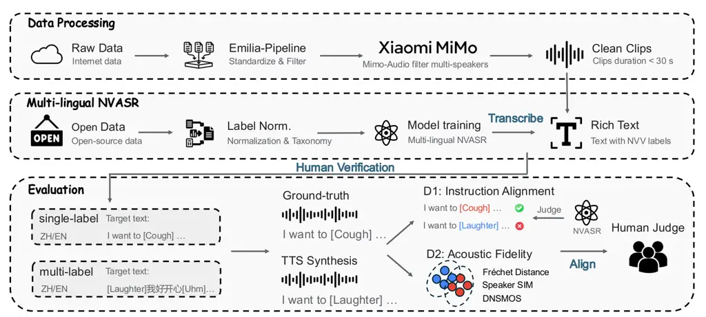

Ni Liao Chen Wang Wu

# NV-Bench: Benchmark of Nonverbal Vocalization Synthesis for Expressive Text-to-Speech Generation

Qinke    Huan    Dekun    Yuxiang    Zhizheng

###### Abstract

While recent text-to-speech (TTS) systems increasingly integrate
nonverbal vocalizations (NVs), their evaluations lack standardized
metrics and reliable ground-truth references. To bridge this gap, we
propose NV-Bench, the first benchmark grounded in a functional taxonomy
that treats NVs as communicative acts rather than acoustic artifacts.
NV-Bench comprises 1,651 multi-lingual, in-the-wild utterances with
paired human reference audio, balanced across 14 NV categories. We
introduce a dual-dimensional evaluation protocol: (1) Instruction
Alignment, utilizing the proposed paralinguistic character error rate
(PCER) to assess controllability, (2) Acoustic Fidelity, measuring the
distributional gap to real recordings to assess acoustic realism. We
evaluate diverse TTS models and develop two baselines. Experimental
results demonstrate a strong correlation between our objective metrics
and human perception, establishing NV-Bench as a standardized evaluation
framework.

###### keywords

Speech benchmark, Nonverbal vocalizations, Paralinguistic-aware ASR,
Controllable TTS

^(†)^(†)address: The Chinese University of Hong Kong, Shenzhen
^(†)^(†)email: qinkeni@link.cuhk.edu.cn, huanliao@link.cuhk.edu.cn,
dekunchen@link.cuhk.edu.cn, yuxiangwang1@link.cuhk.edu.cn,
wuzhizheng@cuhk.edu.cn



Figure 1: Overview of the NV-Bench. (1) Data Processing: Raw audio is
filtered using the Emilia-Pipeline and MiMo-Audio. (2) Multi-lingual
NVASR: We train a multi-lingual NVASR model on open-source data with a
unified label taxonomy. (3) Evaluation: After human verification, the
benchmark is evaluated in instruction alignment and acoustic fidelity
dimensions and human subjective ratings.

## 1 Introduction

Recent expressive text-to-speech (TTS) models \[1, 2, 3\] increasingly
integrate nonverbal vocalizations (NVs) to enhance human-like
communication. Current methods incorporate NVs either as discrete tokens
(e.g., NVTTS \[4\]) or overlapping layers (e.g., CapSpeech \[5\]).
However, these approaches predominantly treat NVs as generic ”sound
effects” annexed to linguistic content. This mechanistic perspective
overlooks their fundamental nature: NVs are not merely acoustic
textures, but intrinsically communicative acts conveying physiological
states, emotions, and interactional intent. Advancing this field
requires moving beyond checking for acoustic presence to evaluating
pragmatic appropriateness in context.

To systematically model these phenomena, we adopt the functional
taxonomy of Batliner et al. \[6\], categorizing NVs into three levels
crucial for expressive TTS: (1) Vegetative sounds encompass biological
reflexes such as breathing and coughing, which ground generated speech
in physical realism. (2) Affect bursts consist of valenced vocalizations
that succinctly convey the speaker’s emotional state or instantaneous
reactions. (3) Conversational grunts function as interaction-management
cues, including filled pauses and prosodic particles that disambiguate
communicative intent (e.g., confirmation or hesitation). This taxonomy
reveals NVs are not merely acoustic events, they encompass a spectrum of
non-lexical, pragmatically charged interjections essential for conveying
emotion and discourse management.

Motivated by the need for expressive systems, several large-scale
corpora with NVs have been proposed (Table 1), including Emilia-NV
\[7\], SMIIP-NV \[8\], NVTTS \[4\], DisfluencySpeech \[9\],
NonverbalSpeech (NVS) \[10\], SynParaSpeech \[11\]. But scaling training
data does not yield a reliable evaluation standard. Beyond ambiguous
task definitions, current evaluation practices rely on internal testsets
or text-rewritten references rather than authentically paired human
speech data. Without ground-truth (GT) NV recordings, evaluation tends
to collapse to coarse checks (e.g., event presence/absence), making it
impossible to quantify the gap to real recordings. Furthermore, given
that NV events are long-tailed, imbalanced testsets can bias aggregated
metrics and hinder fair diagnosis.

To address these gaps, we introduce NV-Bench¹¹ 1 Demo page:
[https://nvbench.github.io](https://nvbench.github.io), a comprehensive
benchmark for NV-capable TTS. NV-Bench provides a public multi-lingual
testset comprising 1,651 utterances which are curated from online
audiovisual media published in 2025 to minimize the potential data
leakage. To ensure fair comparison, we partition the benchmark into a
strictly balanced single-label subset (50 utterances per category) and a
relatively balanced multi-label subset with 14 NV types. All test
samples contain in-the-wild NVs paired with GT audio. This paired design
enables the reproducible assessment of instruction alignment via
character error rate (CER) and its variants and acoustic fidelity via
speaker similarity and fréchet distance (FD).

Our main contributions are threefold: (1) We propose NV-Bench, the first
comprehensive evaluation framework for NV-capable TTS, featuring a
public, in-the-wild dataset with paired human GT audio. (2) We establish
a standardized and distributionally balanced evaluation protocol that
supports fair and reproducible model comparisons. (3) We conduct
extensive benchmarking of state-of-the-art (SOTA) TTS models, revealing
their controllability, intelligibility and acoustic fidelity.

|                      |       |         |         |        |
| -------------------- | ----- | ------- | ------- | ------ |
| Dataset              | Lang. | Testset | Balance | Prompt |
| SynParaSpeech \[11\] | zh    | ✗       | –       | –      |
| NVS \[10\]           | zh/en | ✗       | –       | –      |
| Emilia-NV \[7\]      | zh    | ✗       | –       | –      |
| NVTTS \[4\]          | en    | ✓       | ✗       | ✗      |
| SMIIP-NV \[8\]       | zh    | ✓       | ✗       | ✗      |
| NV-Bench             | zh/en | ✓       | ✓       | ✓      |

Table 1: Comparison with nonverbal vocalizations datasets.

## 2 Methods

To construct NV-Bench, we introduce a two-phase pipeline balancing
acoustic diversity and label accuracy: (1) developing a robust
multi-lingual NVASR to provide high-quality, event-aware transcriptions,
(2) curating in-the-wild audio through a rigorous filter that culminates
in human-verified GT.

### 2.1 Multi-lingual NVASR

To facilitate efficient benchmark construction, we develop a robust
multi-lingual NV-capable automatic speech recognition (NVASR) model.
Following the methodology introduced in \[7\], we finetune the
SenseVoice-Small \[12\] architecture and extend the framework to support
multilingual settings.

#### 2.1.1 Model architecture

We select SenseVoice-Small \[12\] as our base model due to its
pre-training on diverse audio understanding tasks, which allows it to
capture rich features. The model is optimized by minimizing the
connectionist temporal classification (CTC) loss \[13\]:

```math
\mathcal{L}_{\text{CTC}}=-\ln\sum_{\pi\in\mathcal{B}^{-1}(\mathbf{y})}P(\pi\mid\mathbf{x}) \tag{1}
```

where $`\mathbf{x}`$ represents the input acoustic features,
$`\mathbf{y}`$ is the target sequence, $`\mathcal{B}^{-1}(\mathbf{y})`$
denotes all valid CTC alignment paths for $`\mathbf{y}`$.

#### 2.1.2 Data construction and label normalization

To ensure broad generalization, we consolidate a comprehensive training
corpus: Emilia-NV \[7\], NVTTS \[4\], DisfluencySpeech \[9\],
NVS \[10\], SMIIP-NV \[8\], and MNV-17 \[14\].

To address the heterogeneity of source labels, we implement a systematic
normalization process. We map non-speech labels to Level 3 of the
AudioSet Ontology \[15\], preserving distinct events like
“\[Laughter\]”. We adopt the Emilia-NV taxonomy but conduct targeted
manual annotations on the English subsets of NVTTS and DisfluencySpeech.
This step is critical to distinguish nuanced pragmatic functions, such
as “\[Question-huh\]” that were previously absent in English datasets.
The final unified taxonomy is detailed in Table 2.

|          |                        |                                                         |                                                                          |
| -------- | ---------------------- | ------------------------------------------------------- | ------------------------------------------------------------------------ |
| Language | Vegetative Sounds      | Affect Bursts                                           | Conversational Grunts                                                    |
| Mandarin | Breathing, Cough, Sigh | Laughter, Surprise-ah, Surprise-oh, Dissatisfaction-hnn | Uhm, Confirmation-en, Question-ei, Question-ah, Question-en, Question-oh |
| English  | Breathing, Cough, Sigh | Laughter, Surprise-oh                                   | Uhm, Question-huh                                                        |

Table 2: Unified label inventory categorized by communicative function.

### 2.2 Benchmark dataset construction

Constructing a reliable NV benchmark requires balancing in-the-wild
realism with label distribution. We curate our dataset entirely from
diverse web-sourced audio using a sophisticated filtering pipeline, as
shown in Figure 1.

#### 2.2.1 Data collection

NV events naturally exhibit a long-tail distribution. To ensure adequate
coverage across our taxonomy, we crawled a massive collection of
audiovisual media uploaded within the most recent year. From a raw pool
of 565,316 audio clips ($`\approx`$ 1,560 hours), we filtered for
candidate segments containing target NVs.

#### 2.2.2 Filtering pipeline

To guarantee acoustic fidelity and speaker purity, we subject the
candidate segments to a rigorous refinement process:

Audio Standardization. We first utilize the Emilia-Pipeline \[16\] for
initial audio standardization and source separation. While this includes
speaker diarization, multi-speaker segments often persist.

Single-Speaker Verification. To eliminate residual multi-speaker
artifacts, we deploy MiMo-Audio-7B-Instruct \[17\], a SOTA audio large
language model (LLM), prompting it to detect subtle speaker overlaps
that escaped initial diarization. Only confirmed clean, single-speaker
utterances are retained.

Human Verification. In the final stage, ten expert annotators review and
correct the NVASR-generated transcripts, validating the pragmatic
appropriateness of NV labels. To ensure annotation consistency, 5% of
the data was cross-annotated, achieving a high Cohen’s kappa above 0.85.
This process yields a dataset of 1,651 prompt and GT pairs (7.9 hours),
which are standardized to MP3 format at a 24 kHz sampling rate.

## 3 NV-Bench

Despite the proliferation of NV-capable TTS systems, the field lacks a
standardized benchmark to disentangle two distinct failure modes: (i)
failure to generate the intended event, and (ii) generation of
low-quality or unnatural audio. To address this, NV-Bench evaluates
systems across two dimensions:

Instruction Alignment: Evaluates the model’s ability to strictly follow
textual prompts. Specifically, we assess whether the system generates
target NV events at precise linguistic positions without omissions or
hallucinations, serving as a proxy for robust text-to-speech alignment.

Acoustic Fidelity: Assesses realism relative to real recordings. We
quantify the distributional gap, timbre consistency and their perception
quality to evaluate their acoustic fidelity.

To probe these capabilities under varying complexity, NV-Bench is
structured into two multi-lingual subsets:

Single-label Subset: A strictly balanced testset where each utterance
contains exactly one NV event (50 samples per category, 650 Mandarin and
350 English utterances in total), which isolates fundamental generation
capabilities.

Multi-label Subset: A more challenging set containing utterances with
multiple (2+) NV events to test robustness under dense paralinguistic
conditions. Acknowledging the long-tailed nature of natural
co-occurrences, we ensure relative balance (Mandarin: 41–91, English:
75–112 samples per label), providing sufficient coverage for all event
types while reflecting real-world complexity.

|          |       |               |               |
| -------- | ----- | ------------- | ------------- |
| Dataset  | SV    | Qwen2.5-Omni  | NVASR         |
| WS-net   | 5.77  | 20.14         | 5.55          |
| LS-other | 12.79 | 23.35         | 9.90          |
| SMIIP-NV | 3.12  | 3.59 (4.17)   | 1.29 (1.36)   |
| NVTTS    | 14.45 | 21.69 (26.95) | 13.52 (16.10) |

Table 3: Comparison of CER and OCER (%) across testsets, where bracketed
values are OCER and other values are CER.

|               |                     |          |          |          |        |                    |          |          |          |        |
| ------------- | ------------------- | -------- | -------- | -------- | ------ | ------------------ | -------- | -------- | -------- | ------ |
| System        | Single-label Subset |          |          |          |        | Multi-label Subset |          |          |          |        |
|               | Alignment           |          |          | Fidelity |        | Alignment          |          |          | Fidelity |        |
|               | CER (%)             | PCER (%) | OCER (%) | SIM      | DNSMOS | CER (%)            | PCER (%) | OCER (%) | SIM      | DNSMOS |
| Mandarin      |                     |          |          |          |        |                    |          |          |          |        |
| GT            | 3.86                | 9.38     | 4.07     | 0.781    | 3.12   | 3.79               | 23.71    | 5.07     | 0.794    | 3.12   |
| Orpheus-TTS   | 11.36               | 88.77    | 13.91    | \-       | 3.43   | 19.83              | 84.85    | 24.38    | \-       | 3.40   |
| SMIIP-NV-CV2  | 8.80                | 75.64    | 11.34    | 0.719    | 3.22   | 10.66              | 77.20    | 14.79    | 0.715    | 3.07   |
| Emilia-NV-CV2 | 5.05                | 40.00    | 6.64     | 0.740    | 3.21   | 5.54               | 48.74    | 8.09     | 0.746    | 3.24   |
| CosyVoice3    | 3.85                | 57.69    | 5.86     | 0.764    | 3.30   | 4.75               | 61.94    | 8.26     | 0.715    | 3.31   |
| NV-FlexiVoice | 6.98                | 31.08    | 8.15     | 0.748    | 3.22   | 8.20               | 39.37    | 10.39    | 0.750    | 3.07   |
| NV-CV3        | 3.80                | 27.69    | 4.90     | 0.768    | 3.29   | 3.44               | 30.04    | 4.84     | 0.776    | 3.29   |
| English       |                     |          |          |          |        |                    |          |          |          |        |
| GT            | 6.73                | 8.31     | 6.90     | 0.772    | 3.11   | 7.26               | 21.41    | 8.62     | 0.775    | 3.14   |
| Orpheus-TTS   | 9.03                | 71.92    | 10.63    | \-       | 3.33   | 8.68               | 71.46    | 11.89    | \-       | 3.34   |
| SMIIP-NV-CV2  | 17.92               | 56.80    | 19.47    | 0.583    | 2.97   | 20.93              | 54.49    | 23.87    | 0.580    | 2.97   |
| Emilia-NV-CV2 | 12.50               | 55.30    | 13.21    | 0.639    | 3.21   | 11.71              | 60.28    | 14.63    | 0.655    | 3.26   |
| CosyVoice3    | 7.87                | 62.75    | 9.06     | 0.701    | 3.27   | 6.39               | 57.84    | 10.69    | 0.715    | 3.31   |
| NV-FlexiVoice | 11.88               | 50.43    | 13.21    | 0.685    | 3.15   | 9.60               | 51.32    | 13.76    | 0.708    | 3.07   |
| NV-CV3        | 8.33                | 46.13    | 9.44     | 0.698    | 3.24   | 6.70               | 47.13    | 10.10    | 0.721    | 3.30   |

Table 4: Detailed performance on each subsets of NV-Bench. Bold
indicates best in the column, underline second-best.

## 4 Experiments

### 4.1 Experiments for multi-lingual NVASR

As the backbone evaluator for NV-Bench, the performance of multi-lingual
NVASR needs to be qualified in both standard automatic speech
recognition (ASR) testsets and NV testsets.

#### 4.1.1 Experimental setup and baselines

We compare our NVASR against two strong baselines:

SenseVoice-Small (SV) \[12\]: The original ASR model before finetuning,
as a baseline for general ASR capability.

Qwen2.5-Omni \[18\]: A 7B multimodal LLM capable of speech
understanding. We use the finetuned checkpoint for NV recognition
released in \[14\].

We evaluate on four testsets: WenetSpeech test-net (WS-net) \[19\] and
LibriSpeech test-other (LS-other) \[20\] for general ASR performance;
and SMIIP-NV \[8\], NVTTS \[4\] testset for NV-specific performance.

#### 4.1.2 Evaluation metrics

To jointly evaluate linguistic and paralinguistic accuracy, we extend
standard CER into Overall CER (OCER):

```math
\text{OCER}=\frac{S+D+I}{N_{\text{text}}+N_{\text{nvv}}}\times 100\% \tag{2}
```

where $`S,D,I`$ represent substitutions, deletions, and insertions
computed over the full sequence including NV labels and
$`N_{\text{text}},N_{\text{nvv}}`$ denote the count of text characters
and NV symbols.

#### 4.1.3 Results

As detailed in Table 3, our multi-lingual NVASR model demonstrates
dual-capability. First, it strictly maintains and even marginally
improves upon, the high-quality speech transcription of the original
SenseVoice model on standard datasets. Second, it significantly
outperforms the MNV-17 finetuned Qwen2.5-Omni in accurately detecting
and classifying NV labels. Notably, on the SMIIP-NV testset, our NVASR
achieves 1.29% CER and 1.36% OCER, confirming its reliability as an
automated evaluator for NV-Bench.

|               |      |       |             |             |
| ------------- | ---- | ----- | ----------- | ----------- |
| System        | FAD  | FD    | IMOS        | NMOS        |
| GT            | -    | -     | 4.39 ± 0.18 | 4.39 ± 0.15 |
| Orpheus-TTS   | 5.71 | 24.49 | 3.27 ± 0.23 | 3.53 ± 0.22 |
| SMIIP-NV-CV2  | 1.32 | 6.71  | 3.28 ± 0.22 | 3.28 ± 0.19 |
| Emilia-NV-CV2 | 1.08 | 5.57  | 3.89 ± 0.18 | 3.99 ± 0.14 |
| CosyVoice3    | 0.90 | 9.46  | 3.56 ± 0.22 | 3.94 ± 0.20 |
| NV-FlexiVoice | 0.29 | 2.72  | 3.94 ± 0.23 | 4.00 ± 0.18 |
| NV-CV3        | 0.86 | 3.94  | 3.95 ± 0.18 | 4.08 ± 0.16 |

Table 5: Evaluation on the full NV-Bench.

### 4.2 Benchmarking NV-Capable TTS models

We conduct a comprehensive evaluation on NV-Bench to assess the current
performance of NV-capable synthesis in two dimensions: (1) Instruction
Alignment, measures prompt controllability and paralinguistic
intelligibility; (2) Acoustic Fidelity, evaluates the distributional
gap, speaker similarity, perceptual quality to assess the realism of the
synthesized audio.

#### 4.2.1 TTS systems

Orpheus-TTS²² 2 [https://orpheustts.net](https://orpheustts.net): A
single-speaker Llama-based 3B model with explicit NV control.

SMIIP-NV-CV2 \[8\] & Emilia-NV-CV2 \[7\]: Two variants of the 0.5B
CosyVoice2 \[21\], a zero-shot TTS model, finetuned respectively on the
SMIIP-NV and Emilia-NV datasets.

CosyVoice3 (CV3) \[22\]: The foundational zero-shot model, serving as a
strong baseline for general speech synthesis.

NV-FlexiVoice: We finetune a 0.5B FlexiVoice model \[23\] pretrained on
the Emilia dataset \[16\] without NV events.

NV-CV3: To establish a high-performance reference baseline, we finetune
CV3 on a consolidated corpus.

#### 4.2.2 Experimental setup

Training Configuration. We finetune CV3 and FlexiVoice using a
consolidated corpus comprising Emilia-NV, SMIIP-NV, NVTTS, Disfluency,
and NVS. Following Section 2.1.2, normalized NV labels were injected
into the text as special control symbols. The model was optimized using
AdamW \[24\] ($`lr=1\times 10^{-5}`$) on 4 NVIDIA A800 GPUs.

Inference Procedures. All models follow the label normalization protocol
defined in Section 2.1.2. For baselines with limited NV support, we
evaluate only the intersection of supported events. Unsupported
interjections (e.g., \[Question-huh\]) are mapped to their nearest
lexical equivalents with punctuation (e.g., “huh?”) to approximate the
intended pragmatic function.

#### 4.2.3 Evaluation metrics

Instruction alignment. We utilize our NVASR (Section 2.1) to compute
CER, OCER and PCER. To isolate NV generation accuracy, PCER is
calculated on extracted NV symbols:
$`\text{PCER}=(S_{\text{nvv}}+D_{\text{nvv}}+I_{\text{nvv}})/N_{\text{nvv}}`$,
where $`S_{\text{nvv}},D_{\text{nvv}},I_{\text{nvv}}`$ are edit
operations on NVs and $`N_{\text{nvv}}`$ is the target NV count.

Acoustic Fidelity. Perceptual quality and timbre consistency are
measured using DNSMOS and WavLM-based Speaker Similarity (SIM) \[25\].
To assess the distributional gap, we compute the Fréchet Audio Distance
(FAD) \[26\] and FD from PANNs \[27\].

Human Evaluation. Ten annotators rated 100 utterances per model on a
5-point scale for two dimensions: (1) NMOS (Naturalness), assessing
acoustic fidelity, text-NV prosodic continuity and speaker consistency;
(2) IMOS (Instruction Accuracy), evaluating precise NV execution without
omissions, hallucinations and mispronunciations.

#### 4.2.4 Results and analysis

Table 4 presents performance across Mandarin and English subsets. In
terms of instruction alignment, NV-CV3 achieves the lowest PCER (27.69%)
and OCER (4.90%) on the Mandarin single-label subset, demonstrating
superior controllability with large-scale, diversified training data.

For acoustic fidelity, NV-CV3 maintains the strong timbre consistency of
CV3, while Orpheus-TTS scores highest in DNSMOS perception. Table 5
shows NV-FlexiVoice achieves the lowest FAD and FD, indicating that its
generated speech and NV events most closely match the real distribution.

Subjective evaluations support these results, with NV-CV3 achieving the
highest NMOS and IMOS. Crucially, IMOS exhibits a significant negative
Spearman correlation with PCER ($`\rho=-0.65,p<0.001`$) and NMOS aligns
with FD, thereby validating the reliability of NV-Bench’s objective
metrics.

## 5 Conclusion

We introduce NV-Bench, the first comprehensive benchmark for NV-capable
TTS systems. Grounded in a functional taxonomy, the benchmark comprises
1,651 multi-lingual, in-the-wild utterances paired with human
ground-truth, balanced across 14 categories into single- and multi-label
subsets. NV-Bench evaluates acoustic fidelity and instruction alignment
separately, thereby disentangling audio quality from paralinguistic
controllability. Extensive experiments confirm that our objective
metrics strongly correlate with human judgments, establishing NV-Bench
as a standardized evaluation framework.

## 6 Generative AI Use Disclosure

We utilized LLM solely for the purpose of refining the clarity and
grammar of the text. The authors reviewed and revised the output to
ensure accuracy.

## References

- \[1\] Y. Wang, H. Zhan, L. Liu, R. Zeng, H. Guo, J. Zheng, Q.
  Zhang, X. Zhang, S. Zhang, and Z. Wu (2024) Maskgct: zero-shot
  text-to-speech with masked generative codec transformer. arXiv
  preprint arXiv:2409.00750. Cited by: §1.
- \[2\] Y. Chen, Z. Niu, Z. Ma, K. Deng, C. Wang, J. JianZhao, K. Yu,
  and X. Chen (2025) F5-tts: a fairytaler that fakes fluent and faithful
  speech with flow matching. In Proceedings of the 63rd Annual Meeting
  of the Association for Computational Linguistics (Volume 1: Long
  Papers), pp. 6255–6271. Cited by: §1.
- \[3\] C. Yan, B. Wu, P. Yang, P. Tan, G. Hu, L. Xie, Y. Zhang, F.
  Tian, X. Yang, X. Zhang, et al. (2025) Step-audio-editx technical
  report. arXiv preprint arXiv:2511.03601. Cited by: §1.
- \[4\] M. Borisov, E. Spirin, and D. Diatlova (2025) Nonverbaltts: a
  public english corpus of text-aligned nonverbal vocalizations with
  emotion annotations for text-to-speech. arXiv preprint
  arXiv:2507.13155. Cited by: Table 1, §1, §1, §2.1.2, §4.1.1.
- \[5\] H. Wang, J. Hai, D. Chong, K. Thakkar, T. Feng, D. Yang, J.
  Lee, T. Thebaud, L. M. Velazquez, J. Villalba, et al. (2025)
  Capspeech: enabling downstream applications in style-captioned
  text-to-speech. arXiv preprint arXiv:2506.02863. Cited by: §1.
- \[6\] A. Batliner, S. Amiriparian, and B. W. Schuller (2025)
  Non-verbal vocalisations and their challenges: emotion, privacy,
  sparseness, and real life. arXiv preprint arXiv:2508.01960. Cited by:
  §1.
- \[7\] H. Liao, Q. Ni, Y. Wang, Y. Lu, H. Zhan, P. Xie, Q. Zhang,
  and Z. Wu (2025) Nvspeech: an integrated and scalable pipeline for
  human-like speech modeling with paralinguistic vocalizations. arXiv
  preprint arXiv:2508.04195. Cited by: Table 1, §1, §2.1.2, §2.1,
  §4.2.1.
- \[8\] Z. Wu, D. Liu, J. Liu, Y. Wang, L. Li, L. Jin, H. Bu, P. Zhang,
  and M. Li (2025) SMIIP-nv: a multi-annotation non-verbal expressive
  speech corpus in mandarin for llm-based speech synthesis. In
  Proceedings of the 33rd ACM International Conference on Multimedia,
  pp. 12564–12570. Cited by: Table 1, §1, §2.1.2, §4.1.1, §4.2.1.
- \[9\] K. Wang and D. Herremans (2024) DisfluencySpeech –
  single-speaker conversational speech dataset with paralanguage.
  External Links: 2406.08820, [Link](https://arxiv.org/abs/2406.08820)
  Cited by: §1, §2.1.2.
- \[10\] R. Ye, Y. Zhou, R. Yu, Z. Lin, K. Li, X. Li, X. Liu, G. Zeng,
  and Z. Wu (2025) A scalable pipeline for enabling non-verbal speech
  generation and understanding. arXiv preprint arXiv:2508.05385. Cited
  by: Table 1, §1, §2.1.2.
- \[11\] B. Bai, Q. Lu, W. Yang, Z. Sun, Y. Hou, P. Jia, S. Pu, R.
  Fu, Y. Gao, Y. Li, et al. (2025) SynParaSpeech: automated synthesis of
  paralinguistic datasets for speech generation and understanding. arXiv
  preprint arXiv:2509.14946. Cited by: Table 1, §1.
- \[12\] K. An, Q. Chen, C. Deng, Z. Du, C. Gao, Z. Gao, Y. Gu, T.
  He, H. Hu, K. Hu, et al. (2024) Funaudiollm: voice understanding and
  generation foundation models for natural interaction between humans
  and llms. arXiv preprint arXiv:2407.04051. Cited by: §2.1.1, §2.1,
  §4.1.1.
- \[13\] A. Graves, S. Fernández, F. Gomez, and J. Schmidhuber (2006)
  Connectionist temporal classification: labelling unsegmented sequence
  data with recurrent neural networks. In Proceedings of the 23rd
  international conference on Machine learning, pp. 369–376. Cited by:
  §2.1.1.
- \[14\] J. Mai, J. Ji, X. Xing, C. Yang, W. Chen, J. Xing, and X.
  Xu (2025) Mnv-17: a high-quality performative mandarin dataset for
  nonverbal vocalization recognition in speech. arXiv preprint
  arXiv:2509.18196. Cited by: §2.1.2, §4.1.1.
- \[15\] J. F. Gemmeke, D. P. Ellis, D. Freedman, A. Jansen, W.
  Lawrence, R. C. Moore, M. Plakal, and M. Ritter (2017) Audio set: an
  ontology and human-labeled dataset for audio events. In 2017 IEEE
  international conference on acoustics, speech and signal processing
  (ICASSP), pp. 776–780. Cited by: §2.1.2.
- \[16\] H. He, Z. Shang, C. Wang, X. Li, Y. Gu, H. Hua, L. Liu, C.
  Yang, J. Li, P. Shi, et al. (2024) Emilia: an extensive, multilingual,
  and diverse speech dataset for large-scale speech generation. In 2024
  IEEE Spoken Language Technology Workshop (SLT), pp. 885–890. Cited by:
  §2.2.2, §4.2.1.
- \[17\] L. Xiaomi (2025) MiMo-audio: audio language models are few-shot
  learners. External Links:
  [Link](https://GitHub%20-%20XiaomiMiMo/MiMo-Audio) Cited by: §2.2.2.
- \[18\] J. Xu, Z. Guo, J. He, H. Hu, T. He, S. Bai, K. Chen, J.
  Wang, Y. Fan, K. Dang, B. Zhang, X. Wang, Y. Chu, and J. Lin (2025)
  Qwen2.5-omni technical report. External Links: 2503.20215,
  [Link](https://arxiv.org/abs/2503.20215) Cited by: §4.1.1.
- \[19\] B. Zhang, H. Lv, P. Guo, Q. Shao, C. Yang, L. Xie, X. Xu, H.
  Bu, X. Chen, C. Zeng, et al. (2022) Wenetspeech: a 10000+ hours
  multi-domain mandarin corpus for speech recognition. In ICASSP
  2022-2022 IEEE International Conference on Acoustics, Speech and
  Signal Processing (ICASSP), pp. 6182–6186. Cited by: §4.1.1.
- \[20\] V. Panayotov, G. Chen, D. Povey, and S. Khudanpur (2015)
  Librispeech: an asr corpus based on public domain audio books. In 2015
  IEEE international conference on acoustics, speech and signal
  processing (ICASSP), pp. 5206–5210. Cited by: §4.1.1.
- \[21\] Z. Du, Y. Wang, Q. Chen, X. Shi, X. Lv, T. Zhao, Z. Gao, Y.
  Yang, C. Gao, H. Wang, et al. (2024) Cosyvoice 2: scalable streaming
  speech synthesis with large language models. arXiv preprint
  arXiv:2412.10117. Cited by: §4.2.1.
- \[22\] Z. Du, C. Gao, Y. Wang, F. Yu, T. Zhao, H. Wang, X. Lv, H.
  Wang, C. Ni, X. Shi, et al. (2025) Cosyvoice 3: towards in-the-wild
  speech generation via scaling-up and post-training. arXiv preprint
  arXiv:2505.17589. Cited by: §4.2.1.
- \[23\] D. Chen, X. Zhang, Y. Wang, K. Dai, L. Ma, and Z. Wu (2026)
  FlexiVoice: enabling flexible style control in zero-shot tts with
  natural language instructions. arXiv preprint arXiv:2601.04656. Cited
  by: §4.2.1.
- \[24\] I. Loshchilov and F. Hutter (2017) Decoupled weight decay
  regularization. arXiv preprint arXiv:1711.05101. Cited by: §4.2.2.
- \[25\] P. Anastassiou, J. Chen, J. Chen, Y. Chen, Z. Chen, Z. Chen, J.
  Cong, L. Deng, C. Ding, L. Gao, et al. (2024) Seed-tts: a family of
  high-quality versatile speech generation models. arXiv preprint
  arXiv:2406.02430. Cited by: §4.2.3.
- \[26\] K. Kilgour, M. Zuluaga, D. Roblek, and M. Sharifi (2018)
  Fr$`\backslash`$’echet audio distance: a metric for evaluating music
  enhancement algorithms. arXiv preprint arXiv:1812.08466. Cited by:
  §4.2.3.
- \[27\] Q. Kong, Y. Cao, T. Iqbal, Y. Wang, W. Wang, and M. D.
  Plumbley (2020) Panns: large-scale pretrained audio neural networks
  for audio pattern recognition. IEEE/ACM Transactions on Audio, Speech,
  and Language Processing 28, pp. 2880–2894. Cited by: §4.2.3.
